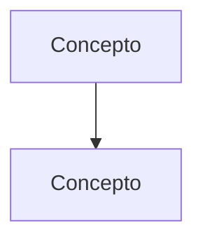

# Plantilla de guía extendida

Basada en las mejores guías del repositorio (Psicoanálisis `C08_Guia.md`, Biología
`C04_Cronobiologia_Guia.md`). Las secciones marcadas *(opcional)* se incluyen si la fuente da
material; el resto va siempre.

~~~markdown
# [Unidad/Clase] — [Título del tema]

> **Fuente:** [Autor, *Título*, obra/edición, páginas] · **Materia:** [materia] · [docentes si aplica]

> **Idea-fuerza:** [2–4 líneas: la tesis central del texto y por qué importa.]

## 0. Hoja de ruta

[Cómo está armado el argumento del texto, en orden lógico, con 1 línea por paso.
Sirve de mapa para leer el resto.]

## 🎯 Lo que entra sí o sí

1. [Los 4–7 puntos que no pueden faltar en un examen, priorizados por diapositivas,
   guía de lectura o evaluaciones de la cátedra.]

## 1. [Primera sección del desarrollo]

[Desarrollo **exhaustivo**: argumento completo, con citas de página (Autor, p. N).
Cada concepto: definición → explicación del porqué → ejemplo de la fuente.]

> 🔑 **Punto clave:** [lo que no hay que perder de esta sección]

### Caso / ejemplo: [nombre]  *(cuando la fuente trae casos)*
[Relato del caso con detalle: situación, intervención, efecto, lectura del autor (p. N).]

## 2. … (tantas secciones como pida la fuente)

## Tabla de distinciones  *(opcional)*

| Concepto | [Autor A] | [Autor B] |
|---|---|---|

## Diagrama  *(opcional, solo si aclara)*

## 🚩 Errores típicos y trampas de examen

- [Confusiones habituales y cómo evitarlas.]

## Articulación con el resto de la materia  *(opcional)*

| Viene de / va hacia | Cómo se conecta |
|---|---|

## Para rendir — preguntas y respuestas modelo

**P1. [Consigna tipo parcial]**
**Esquema de respuesta modelo:** [puntos].
**Para un 10:** [qué conceptos y conexiones no pueden faltar].

## Glosario

| Término | Definición breve (p. N) |
|---|---|

## Autoevaluación

1. [Preguntas para repasar sin mirar la guía.]
~~~

Reglas de forma:
- Español rioplatense neutro, segunda persona para consejos ("ojo con…").
- **Negrita** para términos técnicos la primera vez; *cursiva* para títulos y términos en otro idioma.
- Citas textuales entre comillas «…» con página.
- Nada de relleno: la extensión sale de incluir todo el contenido de la fuente, no de repetirlo.
