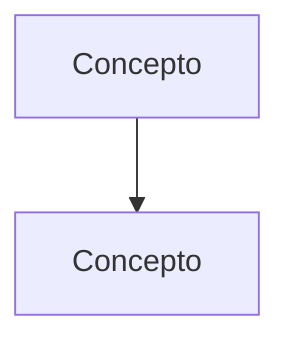

# Plantilla de guía extendida

Basada en las guías del 2.º parcial de Psicoanálisis (`C13_EstructuraYTiemposDeLaNeurosis_Guia.md`,
`C21_23_DireccionDeLaCuraIntervencionesYFinDeAnalisis_Guia.md`) y en Biología
(`C04_Cronobiologia_Guia.md`). Las secciones marcadas *(opcional)* se incluyen si la fuente da
material; el resto va siempre.

## Dos formas de ordenar el cuerpo

- **Por preguntas de la cátedra** (cuando hay batería de preguntas, guía de lectura o consignas de
  parcial): cada pregunta es una sección `## N.` con su consigna textual, la respuesta modelo y el
  desarrollo ampliado. Es la forma preferida: la guía responde exactamente lo que se evalúa.
- **Por la lógica del texto** (cuando no hay preguntas): cada sección `## N.` es un paso del
  argumento, y al final van "Para rendir — preguntas y respuestas modelo" con consignas armadas
  desde las diapositivas y los "lo que entra sí o sí".

En las dos, todo lo que la fuente dice tiene su lugar (regla de apuntes extendidos de `AGENTS.md`).

## Recuadros (se ven de color en el Word)

Una cita en bloque (`> …`) que **empieza** con una de estas etiquetas sale en Word como recuadro de
color (filtro `Scripts/estudio/plantillas/recuadros.lua`). Usalos con criterio: si todo es un
recuadro, nada resalta.

| Empieza con | Recuadro | Para qué |
|---|---|---|
| `**Fuentes:**` | gris claro | Referencias completas en APA |
| `**Aviso sobre las fuentes:**` | rojo | Fragmentos, textos no asignados, OCR dudoso, falta de apuntes |
| `**Idea-fuerza:**` | azul | La tesis central |
| `🔑 **Punto clave:**` | amarillo | Lo que no hay que perder de una sección |
| `🎯 **Para el parcial:**`, `**Para un 10:**` | verde | Qué piden y cómo responder |
| `**Esqueleto de la respuesta:**` | verde azulado | Los puntos de la respuesta modelo |
| `⚠ **No confundir:**`, `**Trampa:**` | rojo | Distinciones que cuestan puntos |
| `▸ **Complemento:**` | gris | Contenido que no está en los textos asignados |

Las demás citas en bloque (citas textuales largas, consignas) salen con una barra gris.
`▸ Complemento` también puede ir dentro de un párrafo cuando es una frase corta.

## Esqueleto

~~~markdown
# [Unidad/Clase] — [Título del tema]

> **Fuentes:** (APA 7, orden alfabético; ver `citas_apa.md`)
>
> - Belucci, G. (2014). *Introducción al diagnóstico de estructura* [Ficha de cátedra]. Universidad Favaloro. [Texto T01 del programa]
> - Freud, S. (1991). Las neuropsicosis de defensa. En J. Strachey (Ed.), *Obras completas* (J. L. Etcheverry, Trad., Vol. 3, pp. 41-61). Amorrortu. (Obra original publicada en 1894) [Texto T02 del programa]
>
> **Materia:** [materia, año, docentes]. Apuntes de clase: [fecha].

> **Aviso sobre las fuentes:** [solo si hace falta: textos incompletos, no asignados, OCR dudoso,
> clases sin apuntes. Qué conviene contrastar con el cuaderno.]

> **Idea-fuerza:** [3–5 líneas: la tesis que une la clase y por qué importa.]

## Hilo conductor: cómo se conectan los temas de esta guía

[400–600 palabras en prosa. Cuál es la pregunta de fondo de la clase, cómo cada tema/pregunta
responde a una parte de ella, qué concepto pasa de un tema al siguiente y cómo se cierra el
círculo. Nombrá las preguntas o secciones ("pregunta 2") para que sirva de mapa.]

> 🎯 **Para el parcial:** [cómo usar este hilo en las respuestas: qué conexión no puede faltar.]

**En una sola oración:** [la clase entera en una oración.]

## 0. Hoja de ruta

1. **[Paso o pregunta] ([textos]):** [1 línea]

## 🎯 Lo que entra sí o sí

1. [Los 5–8 puntos que no pueden faltar, con su cita APA.]

## 1. Primera pregunta — [título]

> [Consigna textual de la cátedra, si existe.]

**Textos:** (Belucci, 2014, pp. 1-4; Freud, 1894/1991, p. 3) ← mapa pregunta → texto, para volver a la fuente.

### 1.1 Respuesta modelo (para escribir en el parcial)

> **Esqueleto de la respuesta:**
> 1. **Tesis:** [la idea que responde la consigna en una línea]
> 2. **[Concepto obligatorio]** (Autor, año, p. N)
> 3. **[Concepto obligatorio]** …
> 4. **Articulación:** [cómo se conectan entre sí / Freud ↔ Lacan / con otra clase]
> 5. **Ejemplo:** [caso o ejemplo de la fuente]
> 6. **Cierre:** [la conclusión que vuelve a la consigna]

[La respuesta en prosa, con la extensión que pide el formato del examen (p. ej., «mínimo 10
renglones» → 180–300 palabras), siguiendo el esqueleto en el mismo orden. Es lo que el estudiante
debería poder reconstruir a partir del esqueleto.]

> ⚠ **No confundir:** [la confusión típica de esta pregunta y el criterio que la resuelve.]

### 1.2 Desarrollo ampliado (todo lo que dice la fuente)

[Desarrollo **exhaustivo**: argumento completo, con citas APA (Autor, año, p. N).
Cada concepto: definición → por qué → ejemplo de la fuente. Casos con detalle: situación,
intervención, efecto, lectura del autor.]

> 🔑 **Punto clave:** [lo que no hay que perder de esta sección]

## 2. … (una sección por pregunta o por paso del argumento)

## Diagrama

[Al menos uno que muestre la lógica de toda la clase; además, uno por cada pregunta difícil
(secuencias, tiempos, clasificaciones, esquemas). `diagramas.py` los renderiza.]

## Tabla de distinciones

| Concepto | Qué es | Se confunde con | Criterio que los distingue (cita APA) |
|---|---|---|---|

## 🚩 Errores típicos y trampas de examen

- [Confusiones habituales y cómo evitarlas.]

## Articulación con el resto de la materia

| Viene de / va hacia | Cómo se conecta |
|---|---|

## Glosario

| Término | Definición breve (cita APA) |
|---|---|

## Autoevaluación (sin mirar la guía)

1. [Preguntas para responder de memoria: una por concepto evaluable; incluí "reconstruí el
   esqueleto de la pregunta N" y "¿qué diferencia X de Y?".]
~~~

## Reglas de forma

- Español rioplatense neutro, segunda persona para consejos ("ojo con…").
- **Negrita** para términos técnicos la primera vez; *cursiva* para títulos y términos en otro idioma.
- **Citas en APA 7** (`references/citas_apa.md`): (Autor, año, p. N); obras clásicas con año
  original/edición (Freud, 1917/1991); textuales entre comillas «…» con página. **No** agregues un
  recuadro o sección que explique cómo se cita.
- Separá las secciones `## N.` con una línea `---`: en Word cada una empieza en página nueva.
- Nada de relleno: la extensión sale de incluir todo el contenido de la fuente, no de repetirlo.
- Guías de más de ~5.000 palabras: exportalas con índice (`/exportar … --indice`) y armá su
  **ficha de repaso** (ver `materiales_de_parcial.md`).
