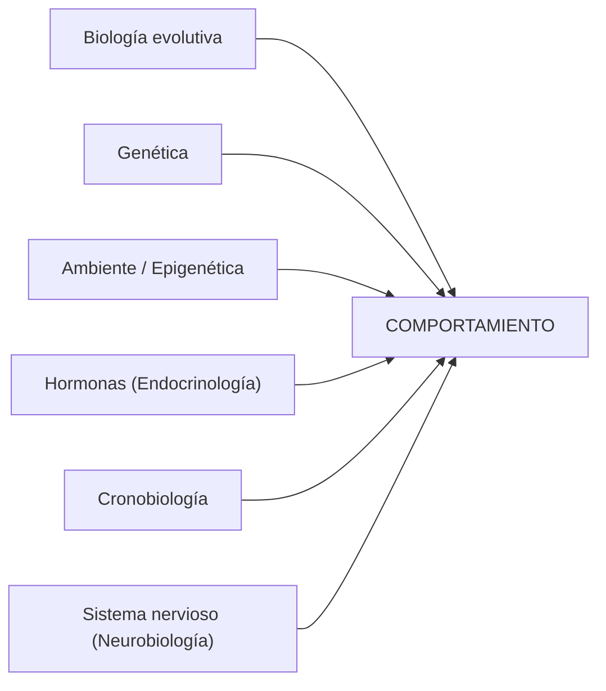
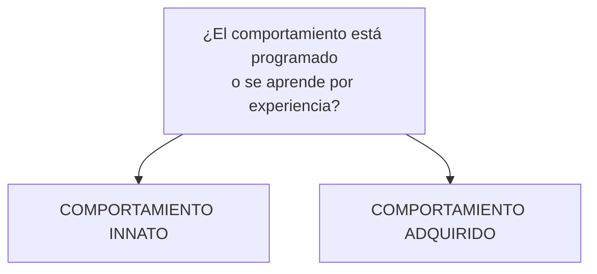
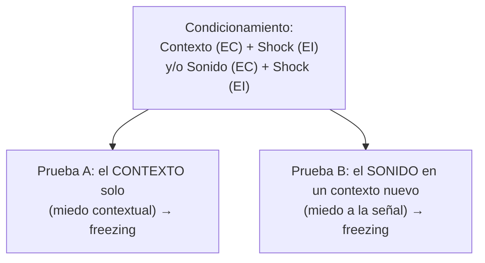

# Biología del Comportamiento — Guía de estudio

## Clase 1: Introducción · Comportamiento innato y adquirido

> **Cátedra:** Mariana Imperatori — Pablo Koss · Universidad Favaloro (Turno vespertino 2026)
> **Material base:** PPT Clase 1 · **Complementos:** *Introducción a la conducta animal* (Khan Academy) + Guía 1 (Problemas 1 y 2 resueltos)

---

## 🗺️ Hoja de ruta conceptual

La clase está construida como un **debate histórico** que termina en una **síntesis**. Conviene leerla con esa lógica en la cabeza:

1. **Definimos el objeto de estudio** → ¿qué es el *comportamiento*? y ¿qué es la *biología del comportamiento*? (una interdisciplina).
2. **Planteamos la gran pregunta** que organiza toda la clase: ¿el comportamiento está **programado genéticamente** (innato) o se **aprende por la experiencia** (adquirido)?
3. **Dos escuelas se enfrentan**:
   - **Etólogos** (Lorenz, Tinbergen, von Frisch, Darwin) → "casi todo es **innato**", estudian al animal **en su medio**.
   - **Conductistas** (Watson, Pavlov, Thorndike, Skinner) → "el cerebro es una **tábula rasa**, casi todo es **adquirido**", estudian en el **laboratorio**.
4. **Recorremos las evidencias de cada bando**:
   - *Innato* → reflejos, taxis, **patrones fijos de acción**, impronta.
   - *Adquirido* → **condicionamiento clásico**, **operante**, condicionamiento de miedo.
5. **Cerramos con la síntesis moderna**: lo innato y lo adquirido **no se oponen, se entrelazan** → periodos críticos, experiencia sensoriomotora, mapas cognitivos, genética del aprendizaje y enriquecimiento ambiental. La frase final ("uno es lo que hace con lo que hicieron de él") resume esa idea.

> 🔑 **Idea-fuerza de toda la clase:** la pregunta correcta **no** es "¿innato *o* adquirido?", sino **"¿qué tanto* de cada uno?"**. Casi todo comportamiento tiene un componente heredado y uno aprendido.

---

## 1. ¿Qué es el comportamiento?

**Comportamiento:** *conjunto de acciones de un organismo en respuesta a estímulos internos y externos*, mediante los cuales interactúa con otros organismos y con su ambiente.

De forma más estricta y operativa (la que más se usa en esta materia):

$$\text{ESTÍMULO} \;\longrightarrow\; \text{CAMBIO DE ACTIVIDAD (respuesta)}$$

- **Estímulo:** señal externa o interna (o una combinación).
- **Respuesta:** un cambio en la actividad del organismo.

> **Ejemplo canónico de la clase:** un perro **saliva** (cambio de actividad = *respuesta*) al **ver comida** (*estímulo*).

**Función biológica:** mediante el comportamiento, los animales actúan según la información que reciben **de manera que se favorezca su bienestar** (supervivencia y éxito reproductivo).

### Tipos de señales que disparan la conducta *(complemento Khan)*

| Tipo de señal | Mecanismo | Ejemplo |
|---|---|---|
| **Externa** | Hibernación | el oso pardo entra en letargo cuando baja la temperatura y nieva |
| **Externa** | Estivación | caracoles/animales del desierto se inactivan en verano seco |
| **Externa** | Migración | mariposas monarca migran a México guiadas por temperatura, fotoperiodo y alimento |
| **Interna** | Ritmo circadiano | despertar a la misma hora por el "reloj interno" (el *jet lag* es su desajuste) |
| **Interna + externa** | Apareamiento | requiere estado hormonal correcto (interno) **y** ver a una pareja (externo) |

> 🔗 **Puente con la cursada:** los ritmos circadianos reaparecen en **Cronobiología**; las bases hormonales, en las clases de endocrinología/comportamiento.

---

## 2. ¿Qué es la biología del comportamiento?

> **Definición:** el estudio de las **bases biológicas del comportamiento**; es decir, cómo los procesos biológicos (**genéticos, neuronales, hormonales y evolutivos**) regulan el comportamiento animal (humano y no humano).

**Estrategia metodológica clave:** usar elementos de la **biología animal** para entender el comportamiento humano. Estudiar especies más simples facilita comprender **cómo y por qué** desarrollamos nuestro repertorio conductual tan complejo.

Es una **interdisciplina** que se nutre de muchos campos:



*Sobre el comportamiento confluyen: la evolución y la genética (qué heredamos), el ambiente y la epigenética (cómo se modula esa herencia), las hormonas, la cronobiología y el sistema nervioso. La **etología** es el marco que engloba el estudio de la conducta en contexto.*

### Dos disciplinas "madre" *(complemento Khan)*

- **Etología:** rama de la biología básica (como la ecología). Estudia el comportamiento de **diversos organismos en su ambiente natural**.
- **Psicología comparada:** extensión de la psicología humana. Estudia **pocas especies en el laboratorio**.

> 📋 **Por qué te importa como futuro/a psicólogo/a con orientación neuro:** esta materia es el puente entre la conducta observable (lo que estudia la psicología) y sus sustratos biológicos (genes, circuitos, neurotransmisores). Todo lo que viene después —memoria, neuropsicofarmacología, adicción— se apoya en este andamiaje.

### 🧭 Herramienta transversal: las 4 preguntas de Tinbergen *(complemento Khan)*

Tinbergen propuso **4 preguntas** que permiten analizar **cualquier** comportamiento de forma completa. Se agrupan en dos niveles:

| # | Pregunta | Nivel | Qué responde | Ejemplo: canto del pinzón cebra |
|---|---|---|---|---|
| 1 | **Causación** | Próximo | Mecanismo/desencadenante inmediato | señales sociales + hormonas → la siringe produce el canto; circuitos cerebrales lo controlan |
| 2 | **Desarrollo (ontogenia)** | Próximo | Cómo surge a lo largo de la vida | el macho **escucha** al padre → **practica** → canto **fijo** en la adultez |
| 3 | **Función (valor adaptativo)** | Último | Efecto sobre supervivencia/reproducción | el canto **atrae pareja** → aumenta la reproducción |
| 4 | **Evolución (filogenia)** | Último | Historia evolutiva y comparación entre especies | sólo las aves del suborden *Passeri* son canoras; varían en plasticidad y uso del canto |

> 🧠 **Truco:** *Causación* y *Desarrollo* miran el **CÓMO** (próximo, mecanicista). *Función* y *Evolución* miran el **PARA QUÉ / POR QUÉ** (último, evolutivo).

---

## 3. La gran pregunta: ¿innato o adquirido? Dos escuelas enfrentadas



| Aspecto | **Etólogos** (innatistas) | **Conductistas** (ambientalistas) |
|---|---|---|
| **Figuras** | Karl von Frisch, **Konrad Lorenz**, **Niko Tinbergen**, Charles Darwin | John B. **Watson**, Ivan **Pavlov**, Edward **Thorndike**, B. F. **Skinner** (y, en disidencia, **Tolman**) |
| **Dónde estudian** | Animales **en su medio** natural | Animales **en y de laboratorio** |
| **Supuesto sobre el cerebro al nacer** | Nacen con **comportamientos programados** | Nacen como **"tábula rasa"** (hoja en blanco) |
| **Tesis central** | La mayoría del comportamiento es **INNATO** | La mayoría del comportamiento es **ADQUIRIDO** |
| **Disciplina** | Etología | Conductismo / psicología comparada |

> ⚠️ **Distinción frecuente en parciales:** Darwin y von Frisch se ubican del lado etológico; Tolman, aunque trabaja con ratas en laberintos (estilo conductista), **rompe con el conductismo** porque postula procesos mentales internos (los *mapas cognitivos*). Tenelo presente: Tolman es el "caballo de Troya" cognitivo dentro del bando del aprendizaje.

---

# PARTE A — Comportamiento INNATO

> **Definición:** comportamiento **preprogramado genéticamente** que el organismo **hereda** de sus padres. Dadas las señales adecuadas, se ejecuta **sin experiencia previa ni aprendizaje**. Tiende a ser **muy predecible** y **similar en todos los miembros** de la especie.

## 4.1 Conceptos base: del reflejo al patrón fijo de acción *(complemento Khan)*

Hay un **gradiente de complejidad** dentro de lo innato:

| Conducta innata | Definición | ¿Participa el cerebro? | Ejemplo |
|---|---|---|---|
| **Reflejo** | Respuesta rápida e involuntaria a un estímulo | No (circuito medular) | Reflejo rotuliano; retirar la mano de algo caliente; succión del recién nacido |
| **Cinesis** | Cambio **no direccional** del movimiento (acelerar/frenar) ante una señal | — | la cochinilla se mueve más rápido fuera de su rango térmico ideal |
| **Taxis** | Movimiento **direccional** hacia (+) o lejos (−) de un estímulo | — | fototaxis **negativa** de la cochinilla (huye de la luz) |
| **Patrón fijo de acción (PFA)** | **Secuencia** compleja, estereotipada y automática disparada por un estímulo | Sí (programa neural) | recuperación de huevos del ganso; agresión del pez espinoso |

### El reflejo rotuliano en detalle *(complemento Khan — útil para la orientación neuro)*

Al golpear el tendón rotuliano, el cuádriceps se estira y activa una **neurona sensorial** que llega a la médula espinal y hace sinapsis con **dos blancos**:

1. Una **neurona motora** del cuádriceps → lo **contrae** (la pierna patea).
2. Una **interneurona inhibitoria** → **inhibe** la neurona motora del isquiotibial → este se **relaja**.

Resultado: contracción del agonista + relajación del antagonista, **sin intervención del cerebro**. Es el ejemplo más limpio de circuito innato.

> 📋 **Nota clínica:** varios reflejos primitivos (succión, prensión) están presentes en el bebé y **se inhiben** con la maduración cortical. Su persistencia anómala es signo de daño neurológico.

## 4.2 Konrad Lorenz: padre de la etología

Lorenz (científico austríaco, 1903–1989) estudió el comportamiento animal **en su contexto natural** y fundó la etología. Dos aportes centrales:

### a) Impronta ("imprinting")

> **Impronta:** tipo de **aprendizaje temprano** que ocurre en un **periodo crítico** (horas o días tras el nacimiento) y afecta de modo **permanente**.

Los gansos recién salidos del cascarón **siguen al primer objeto en movimiento que ven** y lo tratan como a su madre (aunque sea el propio Lorenz).

> ⚠️ **Sutileza conceptual clave:** la impronta es un caso **mixto**. Está **programada** (el *cuándo* y el *cómo* son innatos: hay una ventana crítica y una predisposición a seguir), pero **el contenido se aprende** (a *quién* se sigue depende de la experiencia). Es un puente perfecto entre lo innato y lo adquirido. → Esto se profundiza en **4.x impronta como aprendizaje** y en los **periodos críticos** (sección 6.1).

### b) Patrones fijos de acción (PFA): la recuperación de huevos

Lorenz describió en el ganso el **patrón de recuperación de huevos**: si un huevo rueda fuera del nido, el ave lo empuja de vuelta con el pico mediante una **secuencia estereotipada** de movimientos.

**Propiedades del PFA (memorizá estas):**

| Propiedad | Significado |
|---|---|
| **P**rogramado genéticamente | Es heredado, no aprendido |
| **A**utomático / involuntario | No hay decisión consciente |
| **D**esencadenado por una señal | Lo dispara un **estímulo signo** (sign stimulus) |
| **E**stereotipado | Siempre igual, idéntico entre individuos |
| **Adaptativo** | Aumenta la supervivencia del individuo |
| **Se completa aunque se retire el estímulo** | Una vez iniciado, sigue hasta el final (¡aunque saquen el huevo, el ganso sigue "empujando" el aire!) |

> 🧠 **Mnemónico:** un PFA es **"PADE + se completa"** → **P**rogramado, **A**utomático, **D**esencadenado por señal, **E**stereotipado.

> **Dato revelador:** el ganso intentará recuperar **cualquier objeto con forma de huevo** (una pelota de golf, ¡incluso un balón!). Esto demuestra que el comportamiento es un **programa biológico rígido** que se ejecuta ante el estímulo adecuado, aun cuando el resultado no sea útil.

## 4.3 Nikolaas Tinbergen: estímulo signo y estímulo supranormal

Tinbergen estudió el **comportamiento de picoteo** de los **pichones de gaviota** (*Larus*). Los pichones picotean una **mancha roja** en el pico del adulto; esto hace que el adulto **regurgite alimento** (es la "cena" del pichón).

**Hipótesis:** el picoteo lo dispara alguna característica de la cabeza del adulto → en particular, **el pico**. Tinbergen presentó **modelos artificiales** y midió la **frecuencia de picoteo** (*pecking rate*).

**Resultados (modelos de cabeza/pico):**

| Modelo presentado | Frecuencia de picoteo |
|---|---|
| Cabeza natural | Alta |
| Modelo estándar (realista) | Alta |
| Pico solo (sin cabeza) | Alta |
| **Varilla roja con franjas amarillas** | **La MÁS alta de todas** ⬆️ |
| Modelo de cabeza **sin pico** | **Casi nula** ⬇️ |

> 🔑 **Dos conclusiones centrales:**
> 1. **Lo que importa es el pico, no la cabeza.** Una cabeza sin pico casi no provoca picoteo; un pico solo, sí.
> 2. **Estímulo supranormal:** una simple **varilla roja** provoca **más** picoteo que la cabeza real. Un estímulo artificial **exagerado** puede ser **más eficaz** que el natural en disparar el PFA.

### Segundo experimento: ¿importa la mancha roja? (Tinbergen & Perdeck, 1950)

Variaron sistemáticamente tres factores y midieron el picoteo (% respecto del control):

| Factor variado | Modelo | % picoteo (vs. control) | Lectura |
|---|---|---|---|
| **Presencia de mancha roja** | Control (con mancha) | 100 | referencia |
| | Mancha tenue/alterada | 62 | baja |
| | **Sin mancha** | **35** | **cae fuerte** |
| **Forma de la cabeza** | Cabeza con forma "estrella" | 91 | casi no afecta |
| **Color de la cabeza** | Cabeza verde | 125 | incluso ↑ |
| | Cabeza roja | 98 | casi no afecta |
| | Cabeza negra | 99 | casi no afecta |

> 🔑 **Conclusión:** la **mancha roja** es el verdadero **estímulo signo**. Quitarla derrumba el picoteo (a 35%); en cambio, la **forma y el color de la cabeza casi no influyen** mientras la mancha esté presente.

> 📝 **ESTILO DE EXAMEN — Problema 1 resuelto (de la Guía 1)**
>
> **P: Diseñá un experimento para saber si la *posición* o el *color* de la mancha es el estímulo desencadenante. ¿Qué modelos compararías?**
> R: Para aislar cada variable, se construyen modelos que comparten **todo menos una característica** respecto del estándar (que funciona como **control**):
> - cabeza con pico **sin mancha** → control de picoteo **basal**;
> - cabeza con pico y **mancha corrida** (cambia la *posición*);
> - cabeza con pico y **mancha en su sitio** (estándar);
> - cabeza con pico y **mancha de otro color** (cambia el *color*).
> Cada nuevo modelo se compara **con el estándar**, porque se distingue de él en **una sola variable**. *(Spoiler: la mancha es necesaria.)*
>
> **P: ¿Cuál será la frecuencia de picoteo en un modelo de cabeza sin pico?**
> R: **Nula o muy baja**: tener cabeza **no** aumenta el picoteo frente a un pico solo o una varilla. **Lo que importa es el pico (y su mancha).**
>
> 🧠 **Regla de oro experimental que deja este problema:** para identificar el estímulo relevante, variá **una sola característica por vez** y compará siempre **contra el control** que las tiene todas.

## 4.4 El pez espinoso ("stickleback fish")

Otro PFA clásico, esta vez de **agresión territorial**:

- **Patrón fijo:** **agresión** para ahuyentar a otro macho.
- **Estímulo que lo activa:** la **coloración roja del vientre**, característica de los machos en época de apareamiento.

**Evidencia experimental:** modelos **no realistas** pero con la **mitad inferior pintada de rojo** **sí** desencadenan ataque; modelos **realistas pintados de blanco** (sin rojo) **no** provocan respuesta.

> **Anécdota ilustrativa:** se cuenta que un macho llegó a reaccionar agresivamente ante un **camión de bomberos rojo** que pasaba frente a su pecera. → De nuevo: el PFA responde al **estímulo signo** (el rojo), no al "objeto completo".

---

# PARTE B — Comportamiento ADQUIRIDO

> **Definición:** comportamiento que el organismo **desarrolla como resultado de la experiencia**; **no se hereda** directamente. (Aun así depende de los genes: sólo ciertos cerebros *pueden* aprender ciertas cosas.)

## 5.1 El conductismo: la base del estudio de lo adquirido

> El **conductismo** sostiene que el **aprendizaje** ocurre cuando se adquieren **nuevos comportamientos** como resultado de la **respuesta del individuo a estímulos**. Para los conductistas, el aprendizaje **sólo se detecta a través de comportamientos medibles y observables**.

**Figuras principales:** Ivan Pavlov, John B. Watson, B. F. Skinner, Edward Thorndike y Edward Tolman.

## 5.2 Aprendizaje no asociativo simple: habituación e impronta *(complemento Khan)*

Antes del condicionamiento, existen formas **simples** de aprendizaje:

- **Habituación:** el animal **deja de responder** a un estímulo tras exposición **repetida** sin consecuencias. Es **no asociativo** (el estímulo no se liga a premio ni castigo).
  - *Ejemplo:* los perritos de la pradera dejan de dar la alarma ante pasos humanos si nunca pasa nada malo (pero **siguen** respondiendo a depredadores → la habituación es **específica** del estímulo).
- **Impronta** (ya vista con Lorenz): aprendizaje **rápido, específico y de ventana crítica**.
  - *Aplicación benéfica:* para rehabilitar **grullas trompeteras** en peligro, los biólogos se **disfrazan de grulla** para que los pichones **no** se impronten en humanos, y luego les enseñan a migrar siguiendo un **avión ultraligero**.

> 📋 **Nota clínica:** la **habituación** es la base de varias técnicas de **terapia de exposición** (p. ej. ante fobias): la exposición repetida y segura al estímulo temido reduce la respuesta.

## 5.3 Ivan Pavlov: condicionamiento clásico

Pavlov (1849–1936; Nobel por su trabajo en digestión) buscaba entender **cómo el sistema nervioso regula la digestión**. Midiendo secreciones salivales, descubrió que los perros **salivaban antes** de recibir la comida, al **asociarla** con ciertos estímulos.

> **Condicionamiento clásico:** la **asociación repetida** entre un **estímulo neutro** y un **estímulo biológicamente relevante** hace que el estímulo neutro, **por sí solo**, provoque la respuesta.

**Las cuatro etapas (experimento de 1901):**

| Fase | Estímulo presentado | Respuesta | Sigla |
|---|---|---|---|
| **Antes** | Comida | Salivación | **EI → RI** (estímulo y respuesta **incondicionados**) |
| **Antes** | Campana | Ninguna | **EN** (estímulo **neutro**) |
| **Durante** | Campana **+** comida (repetido) | Salivación | el EN se aparea con el EI |
| **Después** | Campana sola | Salivación | **EC → RC** (estímulo y respuesta **condicionados**) |

> ⚠️ **Ojo (errata frecuente en apuntes):** el **estímulo neutro** es la **campana**, **no** la comida. La comida es siempre el **EI** (provoca salivación de forma innata). Si en algún apunte leés "la comida es un estímulo neutro", es un desliz: el neutro es la señal (campana/metrónomo).

> **Detalle fino:** la RC **no es idéntica** a la RI. Pavlov halló que la **composición** de la saliva del perro condicionado **difería** de la del no condicionado.

> 📋 **Puente neuro/clínico:** el condicionamiento clásico explica respuestas **emocionales** y **fisiológicas** automáticas (miedos, náuseas anticipatorias en quimioterapia, etc.) y es la base del **condicionamiento de miedo** que viene a continuación.

## 5.4 John B. Watson: el conductismo radical y el "Pequeño Albert"

Watson (1878–1958) llevó el condicionamiento clásico al **comportamiento humano**. Su lema:

> *"La psicología debe ser una ciencia objetiva. Si no podemos verlo y medirlo, no deberíamos estudiarlo."*

Argumentó que **las emociones no son innatas**, sino que pueden **aprenderse** por asociación. En **1920**, Watson y **Rosalie Rayner** crearon el **paradigma de condicionamiento de miedo** con el experimento del **Pequeño Albert**:

| Fase | Estímulo | Respuesta |
|---|---|---|
| Antes | Rata blanca (EN) | Sin miedo |
| Antes | Ruido fuerte —barra de metal— (EI) | Miedo/llanto (RI) |
| Durante | Rata **+** ruido (repetido) | Miedo (RI) |
| Después | **Rata sola** (EC) | **Miedo (RC)** |

**Dos hallazgos:**
1. Albert desarrolló **miedo a la rata** aun **sin** el ruido.
2. El miedo se **generalizó** a otros objetos similares (conejos, abrigos de piel).

> 📋 **Relevancia clínica:** este experimento es el **modelo experimental de las fobias**: un estímulo inicialmente neutro se vuelve fuente de miedo por asociación, y el miedo **generaliza** a estímulos parecidos.
> ⚠️ **Nota ética:** hoy sería **inadmisible**: a Albert nunca se lo "descondicionó" y no hubo consentimiento válido. Sirve como hito histórico, no como modelo de buenas prácticas.

## 5.5 El condicionamiento de miedo en animales (contextual vs. por señal)

El paradigma de Watson se trasladó a animales: lo iniciaron **Joseph Wolpe** y **Robert Bolles** (años 50–70) y lo **consolidaron Michael Fanselow** y **Joseph LeDoux** (años 80–90).

**Diseño típico (3 días):**

| Día | Fase | Qué ocurre |
|---|---|---|
| 1 | Antes | la rata explora el contexto **(EC)**, sin miedo |
| 2 | Condicionamiento | **Contexto (EC) + Shock (EI)** |
| 3 | Después | el **contexto solo (EC)** provoca **freezing** (congelamiento defensivo) |

La medida de miedo es el **freezing** (% de inmovilidad). Existen **dos variantes** según qué actúe como EC:



> 📋 **Puente neuro (clave para tu orientación):** el miedo **a la señal/sonido** depende principalmente de la **amígdala**; el miedo **contextual** suma la **dependencia del hipocampo** (porque el "contexto" es una representación espacial compleja). El trabajo de **LeDoux** sobre la amígdala es central para entender **ansiedad, fobias y TEPT**; **Wolpe** derivó de aquí la **desensibilización sistemática**, una terapia para fobias.

## 5.6 Edward Thorndike: la Ley de Efecto

Thorndike (1874–1949), **precursor del conductismo**, formuló la **Ley de Efecto**:

> Los comportamientos seguidos de **consecuencias satisfactorias** tienen **más probabilidad de repetirse**.

**Método:** la **"caja de problemas"** (*puzzle box*), donde **gatos** aprendían a **escapar** presionando una palanca. El animal aprende una **rutina motora por ensayo y error**: con cada intento exitoso, el tiempo de escape **disminuye gradualmente** (no hay "iluminación" súbita).

> ⚠️ **¿Por qué "media ley"?** La Ley de Efecto tenía dos mitades: las consecuencias satisfactorias **fortalecen** la conducta **y** las molestas la **debilitan**. Thorndike luego concluyó que el **castigo es mucho menos eficaz** que el premio, por lo que la mitad "negativa" quedó **debilitada**: de ahí el apodo de **"media ley"**.

> 🔗 **Thorndike → Skinner:** la Ley de Efecto es el **antecedente directo** del condicionamiento operante. Thorndike describió el fenómeno; Skinner lo sistematizó y le dio el marco refuerzo/castigo.

## 5.7 B. F. Skinner: condicionamiento operante

Skinner (1904–1990):

> **Condicionamiento operante:** forma de aprendizaje en la que la **probabilidad de ejecutar una respuesta cambia en función de sus consecuencias** (favorables o desfavorables).

La pieza conceptual central es la **matriz refuerzo/castigo × positivo/negativo**:

| | **Positivo** (se **AGREGA** un estímulo) | **Negativo** (se **QUITA** un estímulo) |
|---|---|---|
| **Refuerzo** (↑ aumenta la conducta) | **Dar algo que gusta** (ej.: premio) | **Quitar algo que no gusta** (ej.: cesa un ruido molesto) |
| **Castigo** (↓ disminuye la conducta) | **Dar algo que no gusta** (ej.: reto) | **Quitar algo que gusta** (ej.: sacar el celular) |

> 🧠 **Mnemónico imprescindible (suele confundirse):**
> - **Positivo / Negativo = AGREGAR / QUITAR** (no significa "bueno/malo").
> - **Refuerzo / Castigo = AUMENTA / DISMINUYE** la conducta.
> Entonces "**refuerzo negativo**" **no** es un castigo: es **quitar algo aversivo para que la conducta aumente** (ej.: tomar un analgésico **quita** el dolor → repetís tomarlo).

**La caja de Skinner (cámara operante):** dispositivo con **palanca** (*lever*), **dispensador de pellets**, **luz de señal**, **parlante**, **piso de rejilla electrificable** (*electric grid*) y **lick-o-meter**. El gráfico típico muestra cómo, con los días, aumentan los **palanqueos en la palanca activa** y se mantienen bajos en la **inactiva** → curva de **aprendizaje operante**.

> 📋 **Aplicación clínica:** el condicionamiento operante es la base de la **modificación de conducta**, las **economías de fichas** (token economy) y buena parte del entrenamiento animal y de las terapias conductuales.

### Caso para pensar: la evitación inhibitoria ("inhibitory avoidance") — ¿operante o clásico?

**Paradigma:** la rata prefiere el **compartimento oscuro**; al entrar, recibe un **shock** en las patas. **Al día siguiente**, la rata **ya no entra** (o tarda mucho más → aumenta la **latencia**). Es una medida muy usada de **memoria**.

> 🔑 **Respuesta integrada (típica pregunta "trampa"):** tiene **componentes de ambos**.
> - **Clásico (Pavlov):** el **contexto oscuro (EC)** se asocia al **shock (EI)** → genera **miedo condicionado**.
> - **Operante (Skinner):** la conducta de **entrar** es **castigada** (castigo positivo: entrar → shock), por lo que **disminuye**; **quedarse afuera** evita el shock.
> Es decir, un **miedo condicionado clásicamente** (al contexto) **motiva** una **respuesta de evitación adquirida operantemente**. La mayoría de los autores la clasifican como **aprendizaje instrumental/operante construido sobre un condicionamiento pavloviano de miedo**.

> 🔗 **Puente con Memoria:** este paradigma reaparece como **modelo de memoria aversiva** en las clases de neurobiología de la memoria.

---

# PARTE C — Donde lo INNATO y lo ADQUIRIDO se encuentran

Acá la clase abandona la dicotomía y muestra la **síntesis moderna**: la experiencia **moldea** circuitos que están **biológicamente preparados** para ser moldeados.

## 6.1 Periodos críticos: Hubel y Wiesel

> **Hallazgo:** la **privación monocular** (tapar un ojo) **durante un periodo crítico** conduce a **cambios fisiológicos y estructurales anormales** en la corteza visual correspondiente al ojo privado.

**Concepto de dominancia ocular:** las neuronas de la corteza visual pueden ser activadas más por un ojo, por el otro o por igual. Tras la privación, **muy pocas células** responden al ojo privado → se reorganiza el mapa cortical (las **columnas de dominancia ocular** del ojo abierto se expanden).

**El periodo crítico tiene una secuencia de "ventanas" de plasticidad** (datos en animales, escala postnatal P0–P40):

```
P0 ───── P10 ───── P20 ───── P30 ───── P40
│ Retinotopía
   │ Selectividad de orientación
        │ Binocularidad ───────────────►
              │ Binocular matching
        ↑ apertura del ojo   ↑ inicio del periodo crítico   ↑ fin del periodo crítico
```

> 📋 **Relevancia clínica directa:** explica la **ambliopía** ("ojo vago"). Si una catarata congénita o un estrabismo no se corrigen **dentro del periodo crítico**, la pérdida visual puede volverse **permanente** aunque el ojo esté sano. Por eso la corrección temprana es decisiva. (Hubel y Wiesel recibieron el Nobel por esto.)

> 🔗 **Conecta con la impronta de Lorenz:** ambos son ejemplos de **ventanas temporales** en las que la experiencia tiene un efecto desproporcionado y duradero sobre el cerebro.

## 6.2 Integración sensoriomotora: Held y Hein (1963)

> **Tesis:** se necesita **experiencia sensoriomotora ACTIVA** para construir un **mapa espacial coherente** y poder **predecir** las consecuencias sensoriales de las propias acciones.

**Diseño (el "carrusel de gatitos"):** dos gatitos reciben **la misma información visual**, pero uno se mueve **activamente** (genera su propio movimiento) y el otro es **transportado pasivamente**. Sólo el gatito **activo** desarrolla conducta visomotora normal (p. ej., reacciona bien en el **visual cliff** / acantilado visual).

> 🔑 **Idea clave:** no alcanza con *recibir* estímulos visuales; el cerebro necesita **acoplar** la **acción** con sus **consecuencias sensoriales** para aprender a ver el espacio. La percepción se construye **actuando**.

## 6.3 Edward Tolman: mapas cognitivos y aprendizaje latente

Tolman es el gran disidente dentro del aprendizaje:

- Dividir el comportamiento en **reflejos S-R aislados** **oscurece** su **significado y propósito**.
- Los comportamientos **globales (molares)** son los objetos de estudio apropiados.
- Se **opuso** a la idea conductista de que el **refuerzo es necesario** para que ocurra el aprendizaje.

### Aprendizaje latente (modelo de aprendizaje espacial en ratas)

Tres grupos de ratas en un laberinto, midiendo **% de errores** por día:

| Grupo | Condición |
|---|---|
| **HR** | con **recompensa desde el día 1** |
| **HNR** | **sin recompensa** nunca |
| **HNR-R** | sin recompensa hasta el **día 11**, y **recompensa a partir de ahí** |

**Resultado clave:** el grupo **HNR-R** se comporta como el HNR (errores altos)… hasta que aparece la recompensa en el día 11. **A partir de ese día, su curva cae abruptamente**, alcanzando (o superando) al grupo HR.

> 🔑 **Conclusiones:**
> - El aprendizaje **puede ocurrir sin reforzamiento**.
> - El aprendizaje **puede ocurrir sin un cambio observable en la conducta** → esto es el **APRENDIZAJE LATENTE**.
> - Las ratas **ya habían aprendido** el laberinto (formaron un **mapa cognitivo**) durante los ensayos no recompensados; sólo les **faltaba motivación** para **demostrarlo**.

> **Mapa cognitivo:** *representación interna de una característica ambiental externa o punto de referencia.* En el experimento de **Tolman, Ritchie & Kalish (1946)** (laberinto en "sol/estallido"), las ratas eligieron el **atajo** correcto hacia donde estaba la comida → no seguían una ruta memorizada, sino un **mapa** del espacio.

> 📝 **ESTILO DE EXAMEN — Problema 2 resuelto (de la Guía 1)**
>
> **P: ¿Qué se ve en el gráfico?**
> R: Los **HNR** bajan **muy poco** los errores; los **HR** tienen una **curva de aprendizaje más rápida** y llegan a menos errores con los mismos ensayos. Los **HNR-R** se comportan como los HNR **hasta el día 11**; desde que reciben recompensa, su curva se vuelve **muy rápida** (incluso más que la de los HR).
>
> **P: ¿Qué hubiera esperado un conductista? ¿Lo mismo?**
> R: **No.** Para el conductista, los animales **no** recompensados **no aprenden**. Esperaría que los HNR-R **recién empezaran a aprender** desde el día 11, con una **pendiente** de aprendizaje **similar** a la de los HR (la pendiente = cuánto baja el n.º de errores por día). El **descenso abrupto** observado **contradice** esa predicción.
>
> **P: ¿Cuál era la hipótesis de Tolman?**
> R: Que los animales **incorporan información más allá de la necesaria** para resolver la tarea: arman una **representación interna del espacio** (mapa cognitivo) que **luego** usan para guiarse.
>
> **P: Interpretación a la luz de los experimentos previos de Tolman:**
> R: Lo **abrupto** de la curva desde el día 11 indica que las ratas **ya habían aprendido** durante los ensayos **no recompensados** y, **motivadas** por la recompensa, **usaron** su mapa cognitivo. Estaban aprendiendo **algo más** que la simple relación estímulo-recompensa → **aprendizaje latente**, que **se produce en ausencia de recompensa obvia** (en contra del conductismo).

## 6.4 Wolfgang Köhler: insight en chimpancés *(complemento Khan)*

Köhler mostró que los chimpancés son capaces de **pensamiento abstracto** y de **imaginar la solución antes de ejecutarla**. Ante un **plátano colgado fuera de su alcance** y unas **cajas** en el suelo, los chimpancés —tras algo de frustración— **apilaron las cajas** y treparon. Esto sugiere **resolución de problemas por *insight*** (comprensión súbita), **no** por ensayo y error.

> ⚠️ **Contraste útil:** Thorndike (gatos) → aprendizaje **gradual** por ensayo y error. Köhler (chimpancés) → **insight** súbito. Tolman (ratas) → **mapas cognitivos** internos. Los tres muestran que el aprendizaje **excede** el esquema S-R simple.

## 6.5 Genética del comportamiento: Tryon y Tolman (1924)

**Primer experimento** en examinar la **base genética del aprendizaje** del laberinto. Mediante **cría selectiva** según el rendimiento, obtuvieron dos linajes a lo largo de las generaciones:

- **Ratas "listas"** (*maze-bright*): pocos errores.
- **Ratas "torpes"** (*maze-dull*): muchos errores.

La diferencia se **acentúa generación tras generación** → la **capacidad de aprender** el laberinto tiene un **componente hereditario**.

> 🔑 **Lectura:** el aprendizaje (lo "adquirido") **descansa sobre una base genética** (lo "innato"). No hay tábula rasa pura: los genes fijan el **potencial** de aprendizaje.

## 6.6 Naturaleza y crianza + enriquecimiento ambiental

El debate clásico **Nature vs Nurture**:

| **Nature** (naturaleza) | **Nurture** (crianza) |
|---|---|
| La **herencia biológica y la genética** determinan la conducta | La **sociedad, la cultura y los procesos sociales** determinan la conducta |

**Pero el ambiente *modula* la genética** → **influencia del enriquecimiento ambiental** (Cooper & Zubeck, 1958; Rosenzweig & Tryon, 1950):

Cuando se cría a las ratas "listas" (*bright*) y "torpes" (*dull*) en distintos ambientes:

| Ambiente | Ratas "listas" (bright) | Ratas "torpes" (dull) |
|---|---|---|
| **Restringido** (pobre) | rinden **peor** (se acercan a las torpes) | muchos errores |
| **Normal** | difieren claramente | difieren claramente |
| **Enriquecido** | pocos errores | **mejoran mucho** (se acercan a las listas) |

> 🔑 **Conclusión integradora:** el **ambiente enriquecido reduce la brecha genética**: eleva a las "torpes" y un ambiente pobre **deteriora** a las "listas". Es la demostración experimental de la **interacción gen × ambiente**.

> 📋 **Puente neuro:** el **enriquecimiento ambiental** (más estimulación motora, sensorial, cognitiva y social) produce cambios cerebrales medibles: **corteza más gruesa, más sinapsis, mayor neuroplasticidad**. Es la base biológica de conceptos como la **reserva cognitiva** y fundamenta intervenciones de **rehabilitación** y **estimulación temprana**.

## 6.7 Síntesis filosófica

> *"Uno es lo que hace con lo que hicieron de él."*
> — J. P. Feinmann, sobre *El existencialismo es un humanismo* de J. P. Sartre

Esta frase **condensa toda la clase**: "lo que hicieron de él" = la base **innata/heredada y la influencia del ambiente** recibida; "lo que uno hace con eso" = el **margen de acción y aprendizaje** del individuo. **Naturaleza y crianza no se oponen: se integran.**

---

## 7. 🧠 Mapa integrador de la clase

```mermaid
flowchart TD
    CB["COMPORTAMIENTO<br/>estímulo → respuesta"]
    CB --> INN["INNATO<br/>programado genéticamente"]
    CB --> ADQ["ADQUIRIDO<br/>aprendido por experiencia"]
    CB --> INT["INTERACCIÓN<br/>gen × ambiente (síntesis)"]

    INN --> REF["Reflejos · cinesis · taxis"]
    INN --> L["Lorenz: impronta + PFA (huevos)"]
    INN --> TIN["Tinbergen: estímulo signo y supranormal"]
    INN --> PE["Pez espinoso: vientre rojo = agresión"]

    ADQ --> HAB["Habituación / impronta"]
    ADQ --> PAV["Pavlov: clásico (EC-EI)"]
    ADQ --> WAT["Watson: Pequeño Albert (miedo)"]
    ADQ --> FEAR["Cond. de miedo: contextual vs señal"]
    ADQ --> THO["Thorndike: Ley de Efecto (ensayo-error)"]
    ADQ --> SK["Skinner: operante (refuerzo/castigo)"]

    INT --> HW["Hubel & Wiesel: periodos críticos"]
    INT --> HH["Held & Hein: experiencia activa"]
    INT --> TOL["Tolman: mapas cognitivos / latente"]
    INT --> KO["Köhler: insight"]
    INT --> TRY["Tryon: selección genética del aprendizaje"]
    INT --> ENR["Enriquecimiento ambiental"]
```



### Tabla-resumen: clásico vs operante (la que más se confunde)

| Aspecto | **Condicionamiento clásico** (Pavlov, Watson) | **Condicionamiento operante** (Thorndike, Skinner) |
|---|---|---|
| **Qué se asocia** | dos **estímulos** (EC ↔ EI) | una **conducta** ↔ su **consecuencia** |
| **Tipo de respuesta** | **involuntaria** / refleja (salivar, miedo) | **voluntaria** / emitida (presionar, escapar) |
| **Rol del sujeto** | **pasivo** (responde al estímulo) | **activo** (opera sobre el ambiente) |
| **Concepto central** | estímulo neutro → condicionado | refuerzo / castigo |
| **Ejemplos** | salivar a la campana; miedo de Albert | palanca de Skinner; caja de Thorndike |

---

## 8. ✅ Autoevaluación (estilo parcial)

Recordá que **el parcial es con material y apuntes**, de tipo **analítico** (diseñar/interpretar experimentos), no de memoria literal.

1. Definí *comportamiento* en términos de estímulo y respuesta. Dá un ejemplo donde la señal sea **interna**, otro **externa** y otro **mixto**.
2. Completá el diagrama de la **biología del comportamiento**: ¿qué disciplinas confluyen sobre la conducta y qué aporta cada una?
3. Aplicá las **4 preguntas de Tinbergen** a un comportamiento de tu elección (puede ser humano). Indicá cuáles son de nivel *próximo* y cuáles *último*.
4. Construí una tabla **etólogos vs conductistas** (figuras, lugar de estudio, supuesto sobre el cerebro, tesis). ¿Por qué Tolman es un caso especial?
5. Enumerá las **propiedades de un PFA**. Explicá por qué un ganso intenta "recuperar" una pelota de fútbol.
6. **(Diseño experimental — tipo Problema 1)** Querés saber si lo que dispara el picoteo del pichón es la **mancha roja** o la **forma del pico**. Diseñá los modelos a comparar, indicá el **control** y justificá por qué variás **una sola variable** por modelo.
7. ¿Qué es un **estímulo supranormal**? Dá el ejemplo de la gaviota y otro del pez espinoso.
8. Diferenciá **EI, RI, EN, EC y RC** en el experimento de Pavlov. ¿La RC es idéntica a la RI? Justificá.
9. Reconstruí el experimento del **Pequeño Albert** con sus fases. ¿Qué dos fenómenos demuestra y qué relevancia clínica tiene?
10. Diferenciá **miedo contextual** vs **miedo a la señal**. ¿Qué estructura cerebral se asocia a cada uno? ¿Cómo se mide el miedo en la rata?
11. ¿Por qué la Ley de Efecto de Thorndike se llama **"media ley"**?
12. Completá la matriz **refuerzo/castigo × positivo/negativo** con un ejemplo en cada celda. Explicá por qué el **refuerzo negativo no es un castigo**.
13. La **evitación inhibitoria**: ¿es condicionamiento **clásico u operante**? Defendé una respuesta integrada.
14. ¿Qué demostraron **Hubel y Wiesel** con la privación monocular? Relacionalo con la **ambliopía**.
15. ¿Qué demuestra el experimento de **Held y Hein**? ¿Por qué el gatito *pasivo* no desarrolla visión espacial normal?
16. **(Interpretación de gráfico — tipo Problema 2)** Te dan la curva de los grupos **HR / HNR / HNR-R**. Describí qué se ve, qué esperaría un conductista, y por qué el resultado apoya el **aprendizaje latente**.
17. Definí **mapa cognitivo** y explicá el experimento del atajo (Tolman, Ritchie & Kalish, 1946).
18. ¿Qué demostró **Tryon** con la cría selectiva de ratas? ¿Cómo se concilia con que el aprendizaje sea "adquirido"?
19. Interpretá la tabla de **Cooper & Zubeck**: ¿qué pasa con las ratas "listas" en ambiente pobre y con las "torpes" en ambiente enriquecido? ¿Qué principio ilustra?
20. Explicá, integrando toda la clase, por qué la frase *"uno es lo que hace con lo que hicieron de él"* resume el debate innato/adquirido.

---

## 9. 📖 Glosario rápido

| Término | Definición breve |
|---|---|
| **Comportamiento** | Acciones de un organismo en respuesta a estímulos internos/externos. |
| **Estímulo** | Señal interna o externa que dispara una respuesta. |
| **Biología del comportamiento** | Estudio de las bases biológicas (genéticas, neuronales, hormonales, evolutivas) de la conducta. |
| **Etología** | Estudio del comportamiento animal **en su ambiente natural** (Lorenz, Tinbergen). |
| **Psicología comparada** | Estudio de pocas especies **en laboratorio**. |
| **Las 4 preguntas de Tinbergen** | Causación y desarrollo (nivel próximo) + función y evolución (nivel último). |
| **Innato** | Conducta **heredada/preprogramada**, sin necesidad de aprendizaje. |
| **Adquirido** | Conducta **aprendida** por experiencia. |
| **Tábula rasa** | Supuesto conductista: el cerebro nace "en blanco". |
| **Reflejo** | Respuesta rápida e involuntaria (circuito medular, sin cerebro). |
| **Cinesis** | Cambio **no direccional** del movimiento ante un estímulo. |
| **Taxis** | Movimiento **direccional** hacia (+) o lejos (−) de un estímulo. |
| **Patrón fijo de acción (PFA)** | Secuencia estereotipada, automática y heredada, disparada por un estímulo signo. |
| **Estímulo signo (sign stimulus)** | Característica específica que desencadena un PFA (ej.: mancha roja, vientre rojo). |
| **Estímulo supranormal** | Estímulo exagerado que provoca **más** respuesta que el natural (la varilla roja). |
| **Impronta (imprinting)** | Aprendizaje temprano, de **periodo crítico** y permanente (seguir al primer objeto visto). |
| **Habituación** | Dejar de responder a un estímulo repetido sin consecuencias (no asociativo). |
| **Condicionamiento clásico** | Asociación de **dos estímulos** (EC-EI); respuesta involuntaria. |
| **EI / RI** | Estímulo incondicionado / Respuesta incondicionada (innatos). |
| **EN** | Estímulo neutro (no provoca respuesta antes del aprendizaje). |
| **EC / RC** | Estímulo condicionado / Respuesta condicionada (aprendidos). |
| **Condicionamiento de miedo** | Asociar un estímulo (contexto/sonido) con un shock → miedo (freezing). |
| **Freezing** | Inmovilidad defensiva; medida del miedo en roedores. |
| **Ley de Efecto** | Las conductas con consecuencias satisfactorias se repiten más (Thorndike). |
| **Condicionamiento operante** | La conducta cambia según sus **consecuencias** (refuerzo/castigo). |
| **Refuerzo** | Consecuencia que **aumenta** la conducta (positivo = agregar algo agradable; negativo = quitar algo aversivo). |
| **Castigo** | Consecuencia que **disminuye** la conducta (positivo = agregar algo aversivo; negativo = quitar algo agradable). |
| **Evitación inhibitoria** | Aprender a **no** entrar a un sitio para evitar un shock; modelo de memoria aversiva. |
| **Periodo crítico** | Ventana temporal de **alta plasticidad** en la que la experiencia tiene efecto duradero. |
| **Dominancia ocular** | Grado en que una neurona cortical es activada por un ojo vs. el otro. |
| **Mapa cognitivo** | Representación interna del espacio o de puntos de referencia (Tolman). |
| **Aprendizaje latente** | Aprendizaje que ocurre **sin refuerzo** y **sin cambio observable** en la conducta hasta que aparece motivación. |
| **Insight** | Resolución súbita de un problema por comprensión, no por ensayo-error (Köhler). |
| **Nature vs Nurture** | Debate herencia (naturaleza) vs ambiente/cultura (crianza). |
| **Enriquecimiento ambiental** | Ambiente con más estimulación → cambios cerebrales y mejor aprendizaje. |

---

### 🔭 Lo que viene (según el cronograma)

Esta clase es la **base conceptual** de toda la materia. Lo aprendido se retoma directamente en:
- **Cronobiología** (los ritmos circadianos de la sección 1),
- **Neurobiología de la memoria** (condicionamiento, evitación inhibitoria, mapas cognitivos/hipocampo),
- **Interacción genes y ambiente** (Tryon, enriquecimiento, epigenética),
- y, más adelante, en **neuropsicofarmacología** y **adicción** (donde el condicionamiento y el refuerzo son protagonistas).
