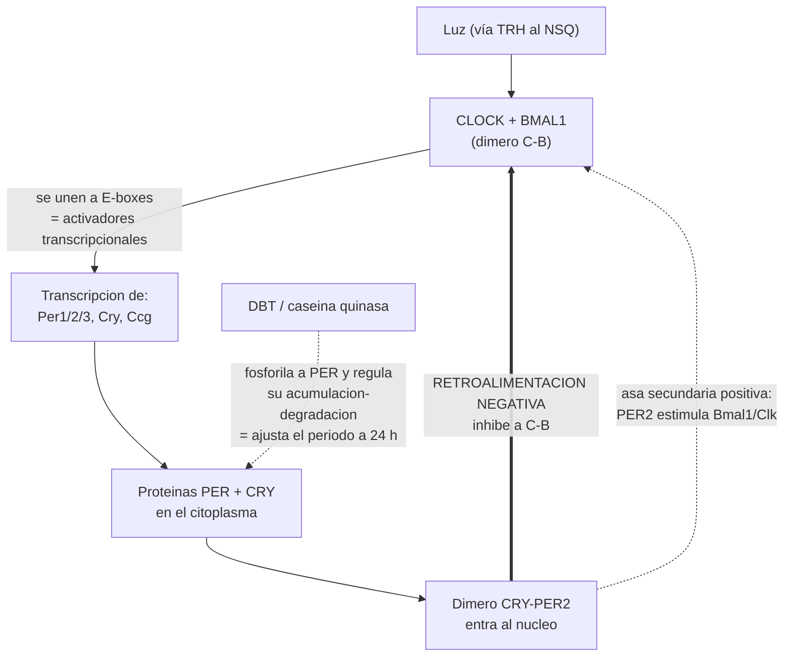
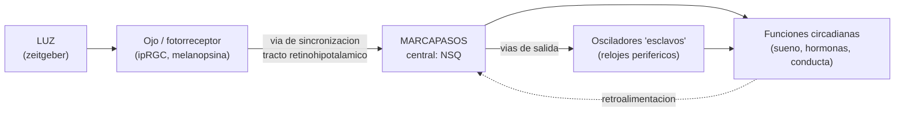
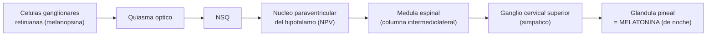
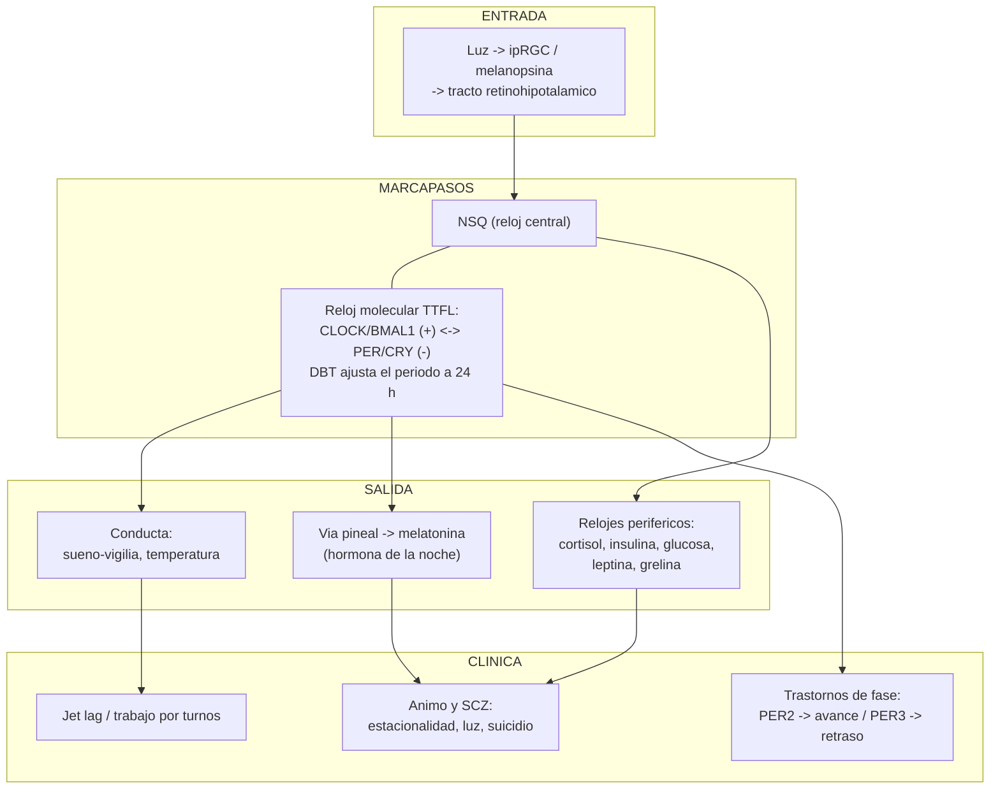

# Clase 4 — Cronobiología 🕒
### Biología del Comportamiento · Universidad Favaloro · Turno vespertino 2026
*Docentes: Mariana Imperatori · Pablo Koss*

> **Material base:** diapositivas de la Clase 4.
> **Complementos integrados:** Carlson, *Fisiología de la conducta* (cap. 9, "Relojes biológicos"); artículo de Genotipia sobre los genes del ciclo circadiano (Premio Nobel 2017); y el **Ejercicio 5 resuelto** (genética de *doubletime* en *Drosophila*).

---

## 0. Hoja de ruta conceptual (cómo está armada la clase)

La clase recorre el sistema circadiano de afuera hacia adentro y de la molécula a la clínica, en este orden lógico:

1. **El tiempo como problema** → introducción filosófica (Bergson) y el "reloj" fisiológico de 24 h.
2. **Cómo se mide un ritmo** → parámetros formales (período, fase, amplitud, mesor, acrofase).
3. **Tipos de ritmos** → infradianos / circadianos / ultradianos.
4. **¿Para qué sirven?** → anticipación y adaptación (la vid; el sueño como función vital).
5. **El sueño como salida circadiana** → cuánto dormimos, cómo cambia con la edad, ritmos de hormonas y temperatura.
6. **¿Hay un reloj interno?** → experimentos de **libre curso** (free-running).
7. **¿Por dónde entra la luz?** → fotorreceptores no visuales (melanopsina/ipRGC).
8. **¿Dónde está el reloj?** → el **núcleo supraquiasmático (NSQ)** (lesión y trasplante).
9. **¿Cómo "hace tic-tac"?** → el **reloj molecular** (bucle TTFL: *Clock/Bmal1* ⟷ *Per/Cry*).
10. **Genética del reloj aplicada** → Ejercicio 5 (*doubletime*): de una mutación al comportamiento.
11. **Arquitectura del sistema** → entrada → marcapasos → salida; reloj maestro y "esclavos".
12. **Sincronización (entrainment)** → zeitgebers, adelanto/retraso de fase, **Curva de Respuesta de Fase**.
13. **Desarrollo** → ritmos fetales sincronizados por la madre.
14. **Salida hormonal** → vía NSQ → pineal → **melatonina**.
15. **El NSQ como director de orquesta** → relojes periféricos (metabolismo).
16. **Clínica** → disrupción circadiana, estacionalidad y trastornos psiquiátricos.

> 🧭 **Idea-fuerza de toda la clase:** el cuerpo no *reacciona* al día, lo **anticipa**. Tenemos un reloj endógeno (el NSQ), construido por un bucle de genes y proteínas, que la luz pone en hora cada día y que coordina conducta, hormonas y metabolismo. Cuando ese reloj se desincroniza del ambiente, aparece patología.

---

## 1. Tiempo, ritmo y la lógica de la cronobiología
*(Diapositivas 2–3)*

La clase abre con **Henri Bergson**: el tiempo no es solo una "cuarta dimensión" geométrica y mensurable, sino **duración vivida** ("el tiempo es invención o no es nada"). Es un marco para una idea central: el tiempo biológico es un proceso activo y creador, no un mero telón de fondo.

La **cronobiología** es la ciencia que estudia los **ritmos biológicos**: oscilaciones regulares y predecibles de variables fisiológicas o conductuales. El esquema del "reloj de 24 h" muestra que prácticamente todo en el organismo tiene su momento del día:

| Momento aprox. | Pico fisiológico |
|---|---|
| ~2 a.m. | Sueño más profundo |
| ~4 a.m. | Pico de linfocitos |
| ~6 a.m. | Comienza la secreción de **cortisol** |
| ~7 a.m. | Secreción de insulina con la primera comida |
| ~8 a.m. | Testosterona elevada |
| ~9–10 a.m. | Pico de **alerta** |
| ~5 p.m. | Máxima fuerza cardiovascular y músculo-esquelética |
| ~6 p.m. | Pico de lípidos |
| ~6:30–7 p.m. | Pico de **temperatura corporal** y presión arterial |
| ~8 p.m. | Pico de neutrófilos |
| ~9 p.m. | Comienza la secreción de **melatonina** |

> 🔑 **Punto clave:** estos picos no son aleatorios ni puramente reactivos. Están programados por el reloj interno para que cada función ocurra cuando es más útil (p. ej., cortisol al amanecer para movilizar energía; melatonina de noche para señalizar oscuridad).

---

## 2. Anatomía de un ritmo: los parámetros
*(Diapositiva 4)*

Todo ritmo se describe como una **onda** (idealmente sinusoidal) y se caracteriza con estos parámetros. Imaginá una curva que sube y baja alrededor de una línea media:

```
Variable
   │            acrofase (φ)
   │              ▲
   │          ╱╲  │   ╱╲       ╱╲
 M ┤────────╱────╲┼─╱────╲───╱────  ← mesor (M)
   │      ╱        ╲╱      ╲╱        }  amplitud (A)
   │  └──── período (T o τ) ────┘
   └────────────────────────────────► Tiempo
```

| Parámetro | Símbolo | Definición |
|---|---|---|
| **Período** | **T** (manifiesto) / **τ** "tau" (endógeno) | Intervalo entre dos puntos idénticos del ciclo = duración de **un** ciclo completo |
| **Fase** | **φ** (phi) | Posición de un punto del ciclo en relación con el tiempo (en qué momento ocurre) |
| **Amplitud** | **A** | Diferencia entre el mesor y el valor máximo de la variable |
| **Mesor** | **M** | Valor **medio** de la variable a lo largo del período |
| **Acrofase** | — | **Valor máximo** de la variable dentro del período (el "pico") |
| **Ritmos en fase** | ψ (psi) | Relación temporal entre **dos o más** ritmos (en fase, en antifase, desfasados) |

> ⚠️ **Distinción que se evalúa: T vs. τ.**
> - **T** = período del **ritmo manifiesto** → el que vemos cuando hay señales ambientales (suele ser exactamente 24 h porque el ambiente lo "fuerza").
> - **τ** = período del **ritmo endógeno** → el del reloj funcionando **solo**, sin pistas externas (en humanos es **algo mayor de 24 h**). Esta diferencia es el corazón del experimento de libre curso (sección 6).

---

## 3. Clasificación de los ritmos biológicos
*(Diapositiva 5)*

Los ritmos se clasifican según la **duración de su período**:

| Tipo | Período | Ejemplos canónicos |
|---|---|---|
| **Ultradianos** | **< 24 h** (más cortos que un día) | Latido cardíaco, respiración, ciclo de sueño REM/NREM (~90 min), pulsos de hormona de crecimiento |
| **Circadianos** | **≈ 24 h** | Ciclo sueño-vigilia, temperatura corporal, cortisol, melatonina |
| **Infradianos** | **> 24 h** (más largos que un día) | **Ciclo menstrual/ovárico (~28 días)**, ritmos estacionales/circanuales (migración, celo, hibernación) |

> 📝 **Notas importantes para no equivocarte:**
> 1. La diapositiva usa **"ultrarradianos"**; el término estándar y más usado es **ultradianos** (es el mismo concepto: período < 24 h).
> 2. Clasificá **siempre por el período**, no por la imagen. El **ciclo menstrual (~28 días) es INFRADIANO**, y el **latido cardíaco es ULTRADIANO** (sin importar cómo estén dispuestas las figuras en la diapositiva).
> 3. Regla mnemotécnica: **ULTRA = rápido/corto** (como "ultrarrápido"); **INFRA = lento/largo** (como "por debajo" de la frecuencia diaria).

---

## 4. ¿Para qué sirven los ritmos? Función y adaptación
*(Diapositivas 6–7)*

La pregunta de la clase es: **¿Para qué?** La respuesta es la **hipótesis de la anticipación**: un organismo que *predice* los cambios ambientales (luz, temperatura, disponibilidad de alimento, presencia de predadores) tiene ventaja sobre uno que solo *reacciona*. El reloj permite preparar la fisiología **antes** de que el cambio ocurra.

**Ejemplo: el ciclo de la vid (ritmo circanual/estacional, infradiano).**
La planta no espera a que llegue el frío para protegerse: anticipa las estaciones recorriendo fases sincronizadas con el fotoperíodo y la temperatura:

`Reposo (latente, invierno) → Poda y lloro → Brotación (primavera) → Floración → Cuajado → Envero (madura y cambia de color) → Vendimia (otoño) → Agostamiento → reposo`

> 🔑 **Punto clave:** el ejemplo de la vid muestra que los ritmos biológicos **no son exclusivos de animales con cerebro**. Son una propiedad casi universal de los seres vivos, lo que sugiere un valor adaptativo profundo: **organizar la fisiología en el tiempo** tanto como la anatomía la organiza en el espacio.

De aquí la clase pasa a un caso particular y central en humanos: el **sueño**.

---

## 5. El sueño y la vigilia como salida (output) circadiana
*(Diapositivas 8–12)*

### 5.1 El sueño es una necesidad vital (privación de sueño)
El experimento clásico de **privación total de sueño en ratas** (diseño de disco sobre agua) compara una rata experimental con una control. Cuando la experimental inicia el sueño, se activa el mecanismo que la obliga a despertar. Resultado:

- **↑ ingesta de alimento** pero **↓ peso corporal** (hipermetabolismo, termorregulación alterada).
- **Muerte hacia el día ~28.**

> 🔑 **Punto clave:** el sueño no es un "lujo" ni mera inactividad. Su privación prolongada es **letal**, lo que demuestra que cumple funciones fisiológicas indispensables.

### 5.2 Cuánto dormimos y cómo cambia con la edad
- **Distribución en humanos adultos:** curva en campana con **media = 7,5 h** (DE = 1,25 h). Hay variabilidad normal entre individuos.
- **A lo largo de la vida:** se duerme **muchísimo antes de nacer** (máximo prenatal cercano a 24 h), mucho en la infancia, y la cantidad **disminuye progresivamente** con la edad hasta la vejez.

### 5.3 El sueño está acoplado a otros ritmos (salidas circadianas)
Durante el ciclo de 24 h oscilan, acopladas al sueño:

| Variable | Patrón circadiano |
|---|---|
| **Temperatura corporal** | Baja durante el sueño nocturno; sube durante la vigilia |
| **Hormona de crecimiento (GH)** | **Pulso marcado al inicio del sueño** (primeras horas de sueño profundo) |
| **Cortisol** | Sube en la **madrugada/al despertar** y desciende a lo largo del día |

> 🧠 **Integración (cap. 9, Carlson):** el sueño tiene un control **homeostático** (cuánto necesito según cuánto estuve despierto) **y** un control **circadiano** (cuándo es el momento de dormir). El NSQ aporta el componente circadiano: su lesión hace que el sueño se distribuya **al azar** a lo largo del día, **sin** cambiar la cantidad total. → Son dos sistemas disociables.

---

## 6. Evidencia del reloj endógeno: experimentos de libre curso
*(Diapositiva 13)*

¿Cómo sabemos que el ritmo es **interno** y no una simple respuesta a la luz? Aislando al organismo de toda pista temporal y viendo si el ritmo **persiste**.

**El experimento (humano):**

| Condición | Período observado | Interpretación |
|---|---|---|
| **Con pistas** (zeitgebers) | **24,0 ± 0,7 h** | El ambiente fuerza el ritmo a 24 h (= T) |
| **Sin pistas** (aislamiento temporal, luz constante) | **26,1 ± 0,3 h** | El reloj corre **libre** (free-running) con su período endógeno (= τ), **algo mayor de 24 h** → se atrasa cada día |
| **De nuevo con pistas** | **24,0 ± 0,5 h** | Vuelve a sincronizarse a 24 h |

> 🔑 **Punto clave (la conclusión más importante de la clase):**
> 1. El ritmo **persiste sin luz** → es **endógeno** (hay un reloj interno).
> 2. Ese reloj **no es exacto**: τ ≈ 25 h (en este experimento 26,1 h), por eso se atrasa un poco cada día.
> 3. Por eso necesitamos **resincronizarlo todos los días** con la luz. La luz no *crea* el ritmo: lo **pone en hora** (entrainment).

> 🧠 **Integración (Carlson):** lo mismo se observa en ratas. En oscuridad/luz tenue constante mantienen su ciclo de actividad, pero **comienzan ~1 h más tarde cada día** (τ > 24 h). La luz actúa como **sincronizador (zeitgeber)** que reajusta el reloj a 24 h.

---

## 7. La entrada de luz: fotorreceptores no visuales
*(Diapositivas 14 y 24)*

Si la luz sincroniza el reloj, ¿por dónde entra? **No** principalmente por los conos y bastones de la visión, sino por un fotorreceptor especializado.

- Existen **células ganglionares de la retina intrínsecamente fotosensibles (ipRGC)** que contienen el fotopigmento **melanopsina**.
- En el registro electrofisiológico, ante la luz, las **ipRGC** muestran una **despolarización sostenida** (siguen "informando" el nivel de luz mientras dura), mientras que un **cono** da una respuesta **transitoria** (rápida y breve). → Las ipRGC son ideales para medir **cuánta luz ambiental hay**, no para ver detalles.
- Sus axones forman el **tracto retinohipotalámico (TRH)**, que lleva la información lumínica **directamente al NSQ**.

> 🧠 **Integración (Carlson):** Provencio y cols. (2000) descubrieron la **melanopsina**. Freedman y cols. mostraron que mutar genes de conos/bastones **no** altera la sincronización, pero **quitar los ojos sí**. Consecuencia clínica clave: **personas ciegas que conservan las ipRGC con melanopsina mantienen ritmos circadianos normales** aunque no vean; quienes pierden también esas células (o los ojos) se desincronizan.

---

## 8. El marcapasos central: el núcleo supraquiasmático (NSQ)
*(Diapositiva 15)*

El **NSQ** es el **reloj maestro**. Está en el **hipotálamo, justo por encima del quiasma óptico** (de ahí "supra-quiasmático"). En la rata son ~8.600 neuronas muy compactas.

**Los tres experimentos clásicos que lo demuestran:**

| Estudio | Manipulación | Resultado | Conclusión |
|---|---|---|---|
| **Richter (1967)** | Extirpación del NSQ | Se **elimina** la ritmicidad circadiana | El NSQ es **necesario** |
| **Stephan y Zucker (1972)** | Lesión hipotalámica que daña el NSQ | **Arritmicidad** (actividad, bebida, hormonas) | Confirma la necesidad del NSQ |
| **Ralph y Lehman (1991)** | **Trasplante** de NSQ de un donante a un animal arrítmico | Se **restaura** el ritmo, y adopta el **período del donante** | El NSQ es **suficiente** y **define el período** → es el marcapasos central |

> 🔑 **Punto clave (lógica experimental):** el trasplante es la prueba decisiva. Que el animal receptor adopte el **τ del donante** demuestra que la información temporal **reside dentro del propio NSQ**, no en otra parte del cerebro.

> 🧠 **Integración (Carlson):**
> - Moore y Eichler (1972) llegaron a lo mismo de forma independiente.
> - Silver y cols. (1996): un NSQ trasplantado **dentro de una cápsula semipermeable** (que impide conexiones sinápticas) **igual restaura el ritmo** → el NSQ también señaliza por **vía química difusible** (candidata: **procineticina 2, PK2**), no solo por sinapsis.
> - Welsh y cols. (1995): **cada neurona del NSQ es un reloj en sí misma**. Neuronas individuales en cultivo mantienen ritmos de ~24 h, pero **desincronizadas entre sí**. En el NSQ intacto se **acoplan** para dar una señal única y coherente.

---

## 9. El reloj molecular: el bucle de retroalimentación transcripción–traducción (TTFL)
*(Diapositivas 16–18)*

¿Qué hace el "tic-tac" dentro de cada neurona? Un **bucle de retroalimentación negativa** entre genes y sus proteínas que tarda **~24 h** en completarse (TTFL = *transcription–translation feedback loop*).

### 9.1 El bucle central, paso a paso



1. **Transcripción dependiente de luz** de los genes *Clock* y *Bmal1*.
2. Se sintetizan las proteínas **CLOCK (C)** y **BMAL1 (B)**, que se asocian formando el **dímero C–B**.
3. El dímero C–B se une a secuencias **E-box** del ADN y actúa como **activador** de la transcripción.
4. Se transcriben y traducen las proteínas reguladas en el tiempo: **PER1, PER2, PER3, CRY** y los **genes controlados por el reloj (Ccg)**.
5. **CRY y PER2 se asocian** como dímero y **entran al núcleo**.
6. En el núcleo, **CRY/PER inhiben a C–B** → **frenan su propia producción** (retroalimentación negativa). Sin C–B activo, dejan de producirse PER/CRY.
7. Al degradarse PER/CRY, se libera la inhibición y el ciclo **vuelve a empezar**. (Asa secundaria: **PER2 estimula** la transcripción de *Bmal1/Clk*, estabilizando el oscilador.)

### 9.2 Los genes del reloj (integración con Genotipia)

| Gen / proteína | Función |
|---|---|
| ***period* (PER1, PER2, PER3)** | Componente represor central; se acumula de noche y se degrada de día. **PER1** inhibe a *cry*, a PER2/PER3 y a sí mismo (junto a un criptocromo); **PER2** activa a *bmal1* |
| ***clock* y *bmal1*** | Inician (activan) la expresión de *cry* y *period* (el brazo "positivo") |
| ***cry* (criptocromo)** | Acompaña a PER en la inhibición de C–B |
| ***timeless* (TIM)** | Se une a PER y la dirige al núcleo (modelo en *Drosophila*) |
| ***doubletime* (DBT)** | Codifica una **caseína quinasa** que **regula la acumulación/degradación de PER** para que el ciclo coincida con **~24 h**. **Es el gen del Ejercicio 5** |

> 🏆 **Dato (Premio Nobel de Medicina 2017):** se otorgó por el descubrimiento del mecanismo molecular que controla el ritmo circadiano, basado en los **genes *period*** y su bucle de retroalimentación. El modelo se descubrió primero en *Drosophila* y luego se confirmó en mamíferos.

> 🧠 **Integración (estructura dinámica, diapositiva 18):** el reloj no es solo molecular. Las **neuronas marcapasos cambian sus contactos sinápticos a lo largo del día** (más cruces axonales y mayor longitud del circuito en CT2 que en CT22). → El reloj tiene **plasticidad estructural** acoplada a la hora del día.

---

## 10. Genética del reloj aplicada a la conducta — Problema resuelto (*doubletime*)
*(Ejercicio 5 — puente con "Introducción a la biología molecular")*

Este ejercicio conecta el reloj molecular con la **herencia mendeliana** y con el **dogma central**, usando mutantes del gen ***doubletime* (dbt)** en moscas, que alteran el período τ de la actividad locomotora.

**(a) ¿Por qué se evalúa la actividad locomotora en oscuridad constante?**
Para ver los **ritmos endógenos**. Con un ciclo luz-oscuridad solo podríamos detectar fallas en el **sistema de sincronización**, pero **no** fallas en el **reloj endógeno** mismo. (Es exactamente la lógica del experimento de libre curso, sección 6.)

**(b) ¿Por qué una mutación en el ADN afecta el comportamiento? (dogma central)**
`ADN → (transcripción) → ARN → (traducción) → proteína → función → comportamiento`
Una mutación cambia el **gen** → puede cambiar la **proteína** que codifica → altera su **funcionalidad** → repercute en el **comportamiento** (aquí, el período del reloj).
> ⚠️ **Ojo (aclaración del enunciado):** *mutación* afecta el **código genético** (la secuencia de ADN), **no** es el paso de ADN a ARN.

**(c) ¿Por qué wt, heterocigota y homocigota tienen fenotipos distintos?**
Por **dominancia incompleta**: ningún alelo enmascara totalmente al otro, así que **cada genotipo da un fenotipo diferente** (período distinto).

**(d) Gametas (respecto al gen *dbt*):**
- Mosca **dbtS/+** → produce **2** tipos de gametas (una *dbtS* y una *+*).
- Mosca **dbtS/dbtS** → produce **1** tipo (*dbtS*).

**(e) Cruce dbtS/+ × dbtS/+**

|  | **dbtS** | **+** |
|---|---|---|
| **dbtS** | dbtS/dbtS | dbtS/+ |
| **+** | dbtS/+ | +/+ |

→ Genotipos 1 : 2 : 1 → **Fenotipos:**
- **25 %** período muy corto (**τ = 18 h**) → dbtS/dbtS
- **50 %** período corto (**τ = 21,5 h**) → dbtS/+
- **25 %** período normal (**τ = 24 h**) → +/+

**(f) Cruce dbtL/+ × +/+**

|  | **dbtL** | **+** |
|---|---|---|
| **+** | dbtL/+ | +/+ |
| **+** | dbtL/+ | +/+ |

→ **Fenotipos:**
- **50 %** período normal (**τ = 24 h**) → +/+
- **50 %** período largo (**τ = 25 h**) → dbtL/+

> 🔑 **Por qué importa este ejercicio:** demuestra de forma concreta el principio "**gen → proteína → conducta**". *dbt* es justamente la quinasa que ajusta el período del reloj: una versión "rápida" (dbtS) acorta τ, una "lenta" (dbtL) lo alarga. Es la prueba genética de que el reloj molecular **causa** el ritmo conductual.

---

## 11. Arquitectura del sistema circadiano: entrada → marcapasos → salida
*(Diapositiva 19)*

Todo sistema circadiano tiene la misma estructura de tres componentes:



| Componente | Qué es | Ejemplo |
|---|---|---|
| **Entrada (input)** | Vía que lleva la señal sincronizadora al reloj | Luz → ojo → TRH |
| **Marcapasos (pacemaker)** | El reloj central que genera el ritmo | **NSQ** |
| **Salida (output)** | Vías que llevan la "hora" a los efectores; incluye **osciladores "esclavos"** | Conducta, hormonas, **relojes periféricos** |

> 🔑 **Concepto: reloj maestro vs. osciladores "esclavos/periféricos".** El NSQ es el director; cada tejido tiene su propio reloj molecular (mismo bucle TTFL) que el NSQ **pone en hora**. Cuando los esclavos pierden la sincronía con el maestro → **desincronización interna** (ver sección 15).

---

## 12. Sincronización (entrainment) y la Curva de Respuesta de Fase (CRF/PRC)
*(Diapositivas 20–21)*

### 12.1 Zeitgebers y desplazamientos de fase
- **Zeitgeber** ("marcador de tiempo", alemán) = estímulo ambiental que **sincroniza** el reloj. **La luz es el más potente**; también: temperatura, alimentación, actividad social.
- Un pulso de luz puede **mover** el reloj:
  - **Avance de fase:** el reloj se adelanta (el ciclo ocurre antes).
  - **Retraso de fase:** el reloj se atrasa (el ciclo ocurre después).

### 12.2 Cómo leer un actograma
Cada fila = un día (apilados hacia abajo). Las barras negras = períodos de **actividad**.
- **Sincronizado (con ciclo luz/oscuridad):** las barras se alinean verticalmente (período = T = 24 h).
- **Libre curso (oscuridad constante):** las barras se **desplazan en diagonal** porque τ ≠ 24 h.
- Un **pulso de luz** (★) produce un salto de la diagonal = un desplazamiento de fase.

### 12.3 La Curva de Respuesta de Fase (clave conceptual)
El **efecto de la luz depende de la hora circadiana (CT) en que se aplica** — esto es la CRF:

| Momento del pulso de luz | Efecto (CRF fótica) |
|---|---|
| **Día subjetivo** | Efecto **mínimo o nulo** (zona "muerta") |
| **Principio de la noche subjetiva** | **Retraso** de fase (delay) |
| **Final de la noche subjetiva / madrugada** | **Avance** de fase (advance) |

> 🔑 **Regla práctica:** luz a la **noche** → te **atrasa**; luz a la **mañana temprano** → te **adelanta**. Por eso la pantalla del celular de noche corre el reloj hacia atrás (favorece acostarse más tarde).

- Existe además una **CRF no fótica** (p. ej., actividad/ejercicio o señales sociales), con un perfil distinto (tiende a producir avances durante el día subjetivo).

### 12.4 Desincronización (diapositiva 21)
- **Desincronización forzada** (T muy distinto de τ): el organismo no puede engancharse al ciclo impuesto.
- **Coordinación relativa:** el reloj "intenta" seguir al zeitgeber pero conserva parte de su período propio.
- **Desincronización circadiana** (luz constante intensa): el ritmo se **fragmenta/desorganiza**.

> 🧠 **Integración clínica (Carlson):** la solución al **jet lag** y al **trabajo por turnos** es resincronizar rápido el reloj usando **luz intensa en el momento correcto** respecto del mínimo de temperatura corporal (que ocurre 1–2 h antes de despertar): luz **antes** del mínimo → retrasa; luz **después** del mínimo → adelanta. Mantener el lugar de trabajo muy iluminado y el dormitorio oscuro acelera la adaptación.

---

## 13. Desarrollo: ritmos fetales y sincronización materna
*(Diapositivas 22–23)*

- Los **ritmos diarios fetales se desarrollan durante la gestación** y se **sincronizan (entrainment) con el sistema circadiano materno**. El **índice de sincronía intra-gestacional** aumenta a lo largo del desarrollo, y la **corticosterona** materna favorece esa sincronización (mayor sincronía en el grupo Cort que en el control).
- Aún **antes** de que el reloj circadiano fetal esté maduro, **señales derivadas del alimento materno oscilan en el NSQ fetal**. La maduración de los genes del reloj (**Bmal1, Per2, Rev-ErbA/Nr1d1, Dbp, E4bp4**) se ve en el aumento de la **amplitud** de su expresión desde edades tempranas (E19) hacia el posnatal (P28).

> 🔗 **Puente con "Interacción genes y ambiente":** el **ambiente materno (luz, hormonas, ritmo de alimentación) programa el reloj del feto**. La madre actúa como zeitgeber del bebé antes de que este pueda ver la luz. Es un ejemplo concreto de cómo el ambiente moldea la expresión de genes (los del reloj) durante el desarrollo.
>
> 📌 *Nota:* **Rev-ErbA/Nr1d1** es parte del **asa secundaria** del reloj molecular (regula a *Bmal1*) → conecta con la sección 9.

---

## 14. La vía NSQ → glándula pineal → melatonina
*(Diapositivas 25–26)*

La principal **salida hormonal** del reloj es la **melatonina**, secretada por la **glándula pineal**. La señal recorre una vía **multisináptica**:



- **Patrón de melatonina:** baja durante el día, **empieza a subir al anochecer** (~9 p.m.) y alcanza su **pico hacia las 2–4 a.m.**, cayendo antes del amanecer. Es la "**hormona de la oscuridad**": señaliza al organismo que es de noche.
- La pineal está sobre el **techo del mesencéfalo (tectum)**, delante del cerebelo.

> 🧠 **Integración (Carlson):**
> - En mamíferos, la **melatonina controla ritmos estacionales**: noches largas (invierno) → secreción prolongada → "fase de invierno" del ciclo anual (p. ej., el celo del hámster depende del fotoperíodo).
> - **Aplicaciones:** la melatonina administrada **antes de acostarse** reduce los efectos del jet lag y del trabajo por turnos, y sirve para **sincronizar a personas ciegas** que no pueden usar la luz como zeitgeber.

---

## 15. El NSQ como director de orquesta: relojes periféricos
*(Diapositiva 27)*

El NSQ no actúa solo: coordina **relojes periféricos** en órganos de todo el cuerpo, principalmente a través del **sistema nervioso autónomo** y de señales humorales (como la melatonina).

| Órgano / tejido | Ritmo que controla |
|---|---|
| Glándula pineal | **Melatonina** |
| Glándula suprarrenal | **Corticosterona / cortisol** |
| Tejido adiposo (WAT) | **Leptina** |
| Páncreas | **Insulina** |
| Hígado | **Glucosa** |
| Estómago | **Grelina** |

> 🔑 **Punto clave (jerarquía):** el NSQ es el **reloj maestro**; cada tejido tiene su **reloj local** (mismo TTFL). En condiciones normales todos están en fase. La **desincronización interna** (p. ej., comer de noche, trabajo nocturno) hace que los relojes metabólicos se desfasen del NSQ → consecuencias metabólicas (alteraciones de glucosa, peso, etc.). Esto explica por qué la disrupción circadiana se asocia a obesidad, diabetes y síndrome metabólico.

---

## 16. Relevancia clínica: disrupción circadiana y trastornos psiquiátricos
*(Diapositivas 28–29)*

### 16.1 Estacionalidad de los trastornos
Varios cuadros psiquiátricos muestran patrones estacionales ligados al **fotoperíodo (duración del día)** y a la **tasa de cambio del fotoperíodo**:

| Patrón | Estación / fotoperíodo |
|---|---|
| **Manía** | Verano / días largos |
| **Depresión** | Invierno / días cortos |
| **Estados mixtos** | Primavera y otoño (transiciones) |
| **Intentos de suicidio** | Pico en **primavera** (tasa de aumento del fotoperíodo) |
| **Esquizofrenia (SCZ)** | Asociaciones estacionales (invierno) |

### 16.2 Modelo multifactorial (diapositiva 29)
Los síntomas psiquiátricos surgen de la **interacción** entre varios niveles, cuyo eje es el **reloj circadiano**:

- **Timing y cantidad de luz** = ambiental (fotoperíodo, luz artificial) × social/cultural (estilo de vida, horarios laborales, feriados).
- **Factores biológicos:** cronotipo, edad, sexo, genotipo, sensibilidad a la luz.
- **+ Interacciones sociales** (estrés, exposición a drogas, apoyo social) **+ temperatura/calidad del aire**.
- → Todo converge sobre el cerebro y modula la aparición de **síntomas psiquiátricos**.

> 🧠 **Integración (Carlson) y cierre clínico:** el **trabajo por turnos rotativos** se asocia a **úlceras, depresión y accidentes por somnolencia**. El **jet lag** es transitorio (se resuelve en días), pero el turno rotativo crónico es un problema persistente. El sustrato común es siempre el mismo: **un reloj interno desincronizado de las señales ambientales**.

> 🔗 **Puente hacia adelante (Neuropsicofarmacología y trastornos del ánimo):** entender el eje **luz → NSQ → melatonina/relojes periféricos** es la base de intervenciones como la **fototerapia** en depresión estacional y del uso de la melatonina, y ayuda a pensar el rol del ritmo sueño-vigilia en los trastornos del estado de ánimo.

---

## 17. Síntesis integradora (mapa mental)



**En una frase:** *la luz entra por las ipRGC y, vía el tracto retinohipotalámico, pone en hora al NSQ; el NSQ "hace tic-tac" con un bucle molecular de ~24 h (TTFL) y, a través de conducta, melatonina y el sistema autónomo, sincroniza relojes periféricos en todo el cuerpo; cuando este sistema se desincroniza del ambiente, aparece patología (metabólica y psiquiátrica).*

---

## 18. Autoevaluación

1. Diferenciá **T** y **τ**. ¿Por qué el experimento de libre curso es la prueba de que existe un reloj endógeno?
2. Clasificá según su período (infradiano / circadiano / ultradiano): ciclo menstrual, latido cardíaco, ciclo sueño-vigilia, ciclo REM-NREM, migración estacional.
3. Definí: **mesor, amplitud, acrofase, fase**. Dibujá una sinusoide y marcalos.
4. ¿Qué demuestra cada uno de los tres experimentos del NSQ (Richter; Stephan y Zucker; Ralph y Lehman)? ¿Por qué el **trasplante** es la evidencia más fuerte?
5. ¿Por qué las **ipRGC con melanopsina** —y no los conos/bastones— son las que sincronizan el reloj? ¿Qué predice esto sobre los ritmos de una persona ciega?
6. Ordená los **7 pasos del bucle TTFL** y explicá dónde está la **retroalimentación negativa**. ¿Qué rol cumple **DBT**?
7. Explicá, con el **dogma central**, por qué una mutación en *dbt* cambia el período conductual de la mosca.
8. Cruce: macho **dbtS/+** × hembra **dbtS/+**. Indicá genotipos, **proporciones** y los **τ** de cada fenotipo.
9. ¿Qué es un **zeitgeber**? Según la **CRF fótica**, ¿qué pasa si recibís luz intensa (a) al principio de la noche subjetiva y (b) en la madrugada?
10. Describí la **vía multisináptica** desde la retina hasta la secreción de melatonina, en orden.
11. ¿Qué significa que el NSQ sea un "**reloj maestro**" con "**osciladores esclavos**"? Dá un ejemplo de **desincronización interna** y su consecuencia.
12. Relacioná **fotoperíodo** y **trastornos del ánimo**: ¿qué patrón estacional tienen manía, depresión e intentos de suicidio?
13. ¿Por qué el sueño se considera una **función vital** y no mera inactividad? (pensá en el experimento de privación).
14. ¿Cómo programa la **madre** el reloj del **feto** antes de que este pueda ver la luz?

---

## 19. Glosario rápido

| Término | Definición breve |
|---|---|
| **Cronobiología** | Ciencia que estudia los ritmos biológicos |
| **Ritmo circadiano** | Oscilación con período ≈ 24 h |
| **Infradiano / Ultradiano** | Período > 24 h / < 24 h |
| **T / τ (tau)** | Período del ritmo manifiesto / endógeno |
| **Fase (φ) / Mesor (M) / Amplitud (A) / Acrofase** | Momento del ciclo / valor medio / desvío respecto al mesor / valor máximo |
| **Libre curso (free-running)** | Ritmo expresado sin pistas externas, con período τ |
| **Zeitgeber / Sincronizador** | Estímulo que pone en hora el reloj (la luz es el principal) |
| **Entrainment (sincronización)** | Ajuste del reloj endógeno al ciclo ambiental de 24 h |
| **NSQ** | Núcleo supraquiasmático del hipotálamo; reloj maestro |
| **ipRGC / Melanopsina** | Células ganglionares retinianas fotosensibles / su fotopigmento; entrada de luz al NSQ |
| **Tracto retinohipotalámico (TRH)** | Vía de la retina al NSQ |
| **TTFL** | Bucle de retroalimentación transcripción-traducción del reloj molecular |
| **CLOCK / BMAL1** | Brazo activador (positivo) del bucle; se unen a E-boxes |
| **PER / CRY** | Brazo represor (negativo); inhiben a CLOCK/BMAL1 |
| **DBT (doubletime)** | Caseína quinasa que ajusta el período a ~24 h regulando a PER |
| **Curva de Respuesta de Fase (CRF/PRC)** | Cómo el efecto (avance/retraso) de un pulso de luz depende de la hora circadiana |
| **Avance / Retraso de fase** | El reloj se adelanta / se atrasa |
| **Glándula pineal / Melatonina** | Glándula que secreta la "hormona de la noche" bajo control del NSQ |
| **Osciladores periféricos ("esclavos")** | Relojes locales de cada tejido, sincronizados por el NSQ |
| **Síndrome de avance de fase** | Adelanto (~4 h) del sueño; mutación en *PER2* (sustitución Ser→Gly) |
| **Síndrome de retraso de fase** | Atraso (~4 h) del sueño; mutación en *PER3* |
| **Jet lag / Trabajo por turnos** | Desincronización entre reloj interno y ambiente (transitoria / crónica) |
