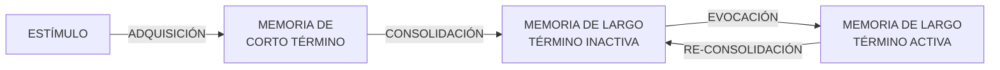
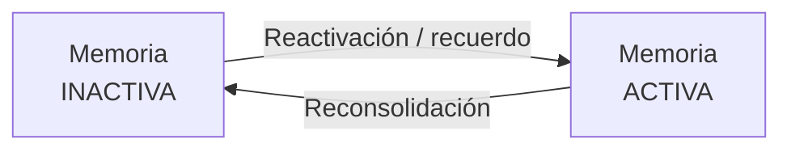
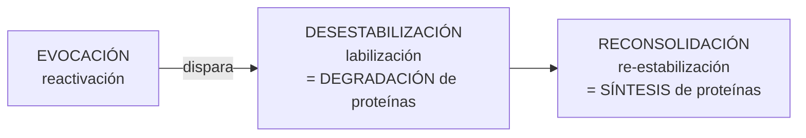
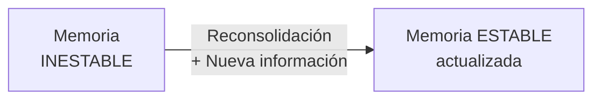
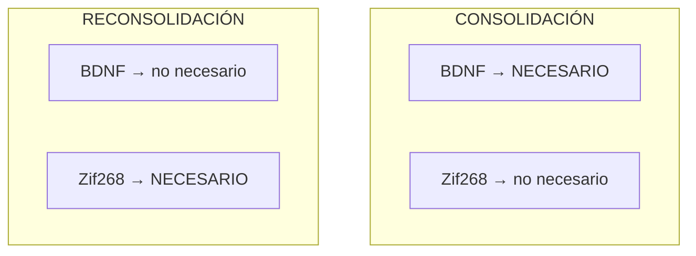
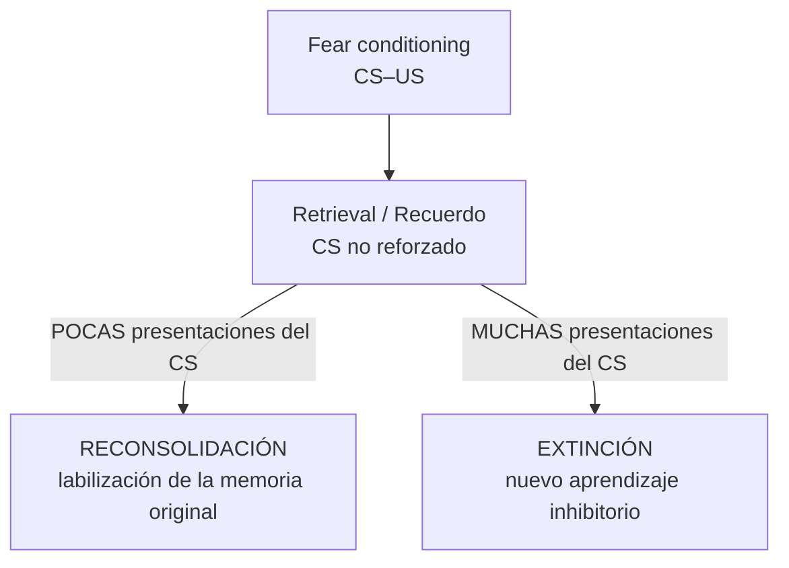
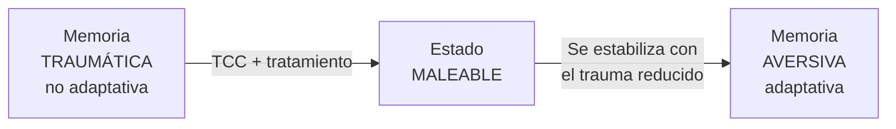
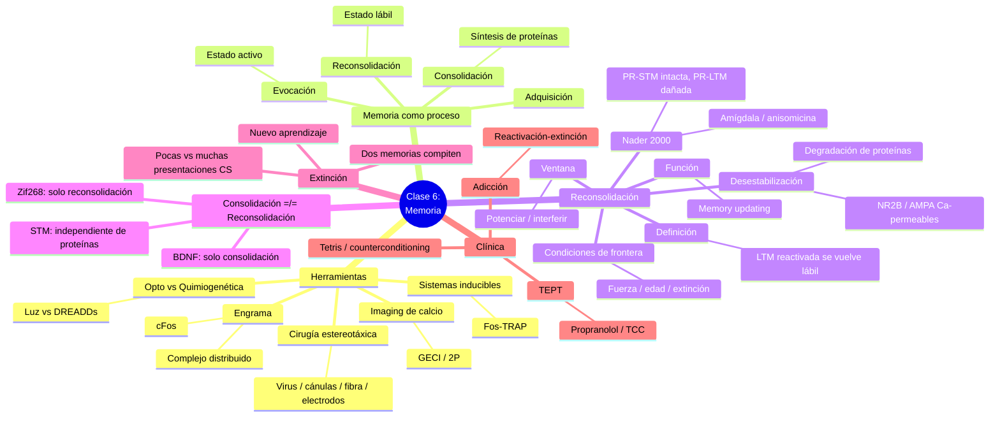

# Guía de Estudio — Clase 6: Neurobiología de la Memoria (1ª parte)

> **Materia:** Biología del Comportamiento — Universidad Favaloro
> **Docentes:** Mariana Imperatori · Pablo Koss
> **Bibliografía integrada:** Diapositivas de clase · Nader (2015) · Lee, Nader & Schiller (2017) · Roy et al. (2022, *engram complex*) · Lamprecht & LeDoux (2004) · Kandel, *Principios de Neurociencias* 4ª ed., Caps. 62–63 · Problema 6 resuelto (Guía 1)

---

## 🗺️ Hoja de ruta conceptual de la clase

Esta clase tiene un **arco lógico** muy claro. Conviene internalizar ese recorrido, porque cada bloque es la herramienta o el concepto que habilita el siguiente:

1. **¿CÓMO se estudia la memoria?** → El *kit de herramientas* del neurocientífico (modelos animales, cirugía estereotáxica, opto/quimiogenética, *imaging* de calcio). Sin estas técnicas, los experimentos que vienen después serían imposibles.
2. **¿QUÉ es la memoria como proceso?** → El modelo por fases (Atkinson & Shiffrin / Lewis): la memoria no es una "foto" fija, sino que atraviesa **adquisición → consolidación → evocación → reconsolidación**.
3. **EL CORAZÓN DE LA CLASE: la reconsolidación.** → Una memoria de largo plazo ya consolidada, al ser evocada, vuelve a un estado **lábil** y debe **re-estabilizarse**. Esto rompe el dogma clásico de que "se consolida una sola vez".
4. **¿Consolidación = reconsolidación?** → NO. Comparten dependencia de síntesis de proteínas, pero usan **proteínas distintas** (BDNF vs. Zif268): doble disociación.
5. **La extinción** → Otro destino posible de la evocación. No borra la memoria original: crea una **nueva memoria** que compite con ella.
6. **Aplicaciones clínicas** → Cómo se intenta "reescribir" memorias traumáticas o adictivas aprovechando la ventana de reconsolidación (TEPT, adicciones).
7. **Problema 6 resuelto** → El experimento canónico de Nader, paso a paso, con las preguntas de la guía respondidas.

> **💡 Idea-fuerza para todo el día:** *Recordar no es leer un archivo guardado: es abrir el archivo, volverlo editable y guardarlo de nuevo.* Cada evocación es una oportunidad de actualizar (o de dañar) la memoria.

---

# PARTE 1 — El kit de herramientas para estudiar la memoria

Antes de hablar de qué *es* la memoria, la clase muestra **cómo se la interroga experimentalmente** en el laboratorio. Casi toda la evidencia que veremos después (Nader, anisomicina, engramas) depende de estas técnicas.

## 1.1 Los roedores como modelo animal

Las ratas y ratones permiten:
- **Manipulaciones farmacológicas** (inyectar drogas en regiones precisas).
- **Manipulaciones genéticas** (knock-out, knock-in, transgénicos).
- **Quimiogenética y optogenética** (prender/apagar neuronas a voluntad).
- ***Imaging* de calcio** (leer la actividad neuronal en tiempo real).

La gran ventaja: combinar **manipulación causal** + **registro de actividad** + **lectura conductual** en el mismo animal.

## 1.2 Cirugía estereotáxica

Es la técnica que da **acceso anatómico preciso** al cerebro mediante un sistema de coordenadas 3D (referido a un atlas cerebral). Permite, con el animal fijado en el marco estereotáxico:

| Procedimiento | Para qué sirve |
|---|---|
| **Inyección de virus** | Introducir genes de interés (opsinas, DREADDs, sensores de calcio) en una región específica |
| **Implante de cánulas** | Infundir drogas localmente (p. ej., **anisomicina en la amígdala** — clave en los experimentos de reconsolidación) |
| **Implante de fibra óptica** | Llevar luz a las neuronas (optogenética) |
| **Implante de electrodos** | Registrar o estimular eléctricamente |

> **Nota clínica/experimental:** la posibilidad de infundir un fármaco **en una región concreta y en un momento concreto** es lo que permite preguntas del tipo "¿qué pasa si bloqueo la síntesis de proteínas *solo en la amígdala* y *solo después de evocar*?". Esa precisión espacio-temporal es la base de todo el campo.

## 1.3 Sistemas inducibles: control temporal del gen

Un problema de la genética clásica (KO constitutivos) es que el gen está alterado **desde el desarrollo**, lo que confunde efectos sobre el desarrollo con efectos sobre la memoria adulta. Los **sistemas inducibles** resuelven esto:

- Permiten **control temporal** de la expresión del gen de interés.
- Permiten **"prender" o "apagar"** un gen en distintas etapas.
- Son útiles para evaluar posibles **"períodos críticos"** del desarrollo.

Ejemplos de sistemas: **Tet-On / Tet-Off** (controlados por doxiciclina) y **Cre-ERT2** (activado por tamoxifeno).

> **🔗 Puente con la Parte 1.6 (engramas):** La línea de ratón **Fos-TRAP** combina esta idea inducible con un marcador de actividad: liga la recombinasa Cre al gen *cFos* de forma **dependiente de tamoxifeno**, de modo que solo se etiquetan las neuronas que estuvieron activas dentro de una ventana temporal definida por el experimentador. Así se "captura" qué neuronas codificaron un recuerdo.

## 1.4 Optogenética vs. Quimiogenética (DREADDs)

Ambas técnicas controlan la actividad de neuronas específicas, y **ambas usan la misma entrega viral** del gen. La diferencia está en **cómo se activa** la herramienta:

| | **Optogenética** | **Quimiogenética (DREADDs)** |
|---|---|---|
| **Activador** | **Luz** (vía fibra óptica) | **Molécula pequeña** ("designer drug", p. ej. CNO/clozapina) |
| **Herramienta expresada** | **Opsinas** (canales iónicos sensibles a la luz: ChR2 para excitar, halo/arquaerodopsina para inhibir) | **DREADDs** = *Designer Receptor Exclusively Activated by Designer Drugs* (receptores acoplados a proteína G: hM3Dq excita, hM4Di inhibe) |
| **Resolución temporal** | **Milisegundos** (muy precisa) | Minutos–horas (más lenta, "tónica") |
| **Invasividad** | Requiere implante de fibra óptica | Inyección sistémica de la droga (menos invasiva) |
| **Uso típico** | Disparar/silenciar con precisión de espigas | Modular poblaciones por períodos prolongados |

> **Mnemotecnia — DREADDs:** *"Diseñé un receptor que solo mi droga de diseño puede tocar."* Por eso es tan selectivo: el receptor (hM3Dq/hM4Di) no responde a ningún ligando endógeno, solo al CNO administrado por el investigador.

## 1.5 Inyección viral (visualización)

Las microfotografías de la clase (neuronas rojas fluorescentes) muestran el resultado de una inyección viral exitosa: el virus entregó el gen (por ejemplo, una proteína fluorescente o una opsina fusionada a un fluoróforo) y las neuronas que lo expresan ahora son **visibles y manipulables**. Se aprecia la expresión en cuerpos celulares y prolongaciones (en hipocampo, corteza, etc.).

## 1.6 Técnicas de *imaging* y registro de calcio

Las técnicas de microscopía permiten estudiar:
- Las **características anatómicas** de distintas regiones (combinadas con tinciones, también su dinámica).
- Combinar **técnicas ópticas con conducta** para estudiar **grandes patrones de actividad neuronal** y relacionarlos con respuestas conductuales.

### Indicadores de calcio genéticamente codificados (GECI)

El calcio es un *proxy* de la actividad neuronal: cuando una neurona dispara un potencial de acción, entra Ca²⁺. Un **GECI** (p. ej., GCaMP) tiene dos módulos:

```
[Módulo fluorescente] + [Módulo de unión a calcio]
            │
   Potencial de acción → entra Ca²⁺
            │
   El Ca²⁺ se une → cambio conformacional → AUMENTA la fluorescencia
```

Así, la **traza de calcio** (calcium trace) sigue de cerca a la **traza electrofisiológica** (n.º de espigas): más espigas → más calcio → más brillo. El flujo de trabajo típico (figura de la clase) es:

1. **Expresión del GECI** (inyección viral en la región de interés).
2. **Ventana craneal + *imaging* de 2 fotones (2P)** sobre el animal despierto y comportándose.
3. **Análisis de señal**: se segmentan las células (ROIs) y se extraen sus trazas de actividad individuales.

### El concepto de **engrama** (Roy et al., 2022)

> **Definición:** un **engrama** es la huella física de un recuerdo — un **conjunto de neuronas** (*ensemble*) que se activa durante el aprendizaje y cuya **reactivación reproduce el recuerdo**. El marcador clásico de "neurona que estuvo activa" es la expresión del gen de expresión temprana **cFos** (IEG).

Usando *tissue clearing* (SHIELD/CLARITY), Fos-TRAP y microscopía de alta velocidad, Roy et al. mapearon el engrama de un **miedo contextual** en 247 regiones cerebrales. Hallazgos clave:

- El recuerdo **no se almacena en un único lugar**, sino en un **"complejo de engrama unificado"** distribuido y funcionalmente conectado: hipocampo (CA1, giro dentado), amígdala (BLA), corteza (prefrontal, entorrinal, cingulada), tálamo, etc.
- Las neuronas activadas por el **aprendizaje** se **reactivan durante el recuerdo** (criterio definitorio del engrama).
- La **manipulación optogenética** de esos *ensembles* confirma causalidad (activarlos evoca el recuerdo; silenciarlos lo bloquea).
- La **reactivación quimiogenética simultánea de varios engramas** produce mayor recuerdo que reactivar uno solo → refleja el carácter distribuido de la memoria natural.

> **🔗 Por qué esto importa para el resto de la clase:** las mismas herramientas (cirugía estereotáxica, virus, opto/quimiogenética, *imaging*) son las que, aplicadas a la **amígdala**, permitieron a Nader demostrar la reconsolidación. Y el concepto de engrama nos dice *dónde* viven las sinapsis que se desestabilizan y reconsolidan.

---

# PARTE 2 — La memoria como proceso: el modelo por fases

## 2.1 Modelo de Atkinson & Shiffrin (1968) — adaptado en la clase

El modelo "multi-almacén" original propone que la información fluye: **estímulo → memoria sensorial → memoria de corto término (MCT) → memoria de largo término (MLT)**. La clase lo adapta para incorporar la dinámica de la reconsolidación:



| Fase | Qué ocurre | ¿Requiere síntesis de proteínas? |
|---|---|---|
| **Adquisición** (codificación) | Se forma la traza inicial a partir del estímulo | — (es el evento de aprendizaje) |
| **Consolidación** | La MCT lábil se estabiliza en MLT | **SÍ** (consolidación sináptica) |
| **Almacenamiento / mantenimiento** | La MLT inactiva se conserva | Proceso **activo**, no pasivo |
| **Evocación** (recuperación) | El recuerdo pasa a estado **activo** | — (pero dispara la posible labilización) |
| **Reconsolidación** | La memoria reactivada (lábil) se re-estabiliza | **SÍ** |

## 2.2 El cambio de paradigma: de "pasivo" a "activo" (Nader, 2015)

Durante décadas se asumió que **solo la adquisición y la consolidación** eran fases "activas" (que requerían que las neuronas hicieran algo: sintetizar ARN y proteínas). Una vez consolidada, la MLT se consideraba **fija y permanente**, y todo lo demás (almacenamiento, evocación) sería una "lectura pasiva".

La reconsolidación derribó ese supuesto. El **modelo alternativo de Lewis (1979)**, que la clase dibuja como un ciclo, propone que:



- Tanto las memorias **nuevas** como las **reactivadas** están en un **"estado activo"** y, con el tiempo, se estabilizan a un **"estado inactivo"**.
- Cuando una memoria inactiva se recuerda, **vuelve al estado activo**.
- **La teoría de la consolidación clásica NO puede explicar** el dataset de la reconsolidación: por eso hizo falta un modelo nuevo.

> **🧠 Conclusión:** *el mantenimiento de la memoria es un proceso activo*, no un disco rígido que solo se lee.

---

# PARTE 3 — Reconsolidación (el núcleo de la clase)

## 3.1 Definición

> **Reconsolidación:** proceso por el cual una **memoria de largo plazo reactivada** se vuelve **transitoriamente sensible a agentes amnésicos** (los mismos que son efectivos durante la consolidación).

Dos formas de producir déficit dentro de la ventana de reconsolidación:
- **Tratamientos amnésicos** (p. ej., inhibidores de la síntesis de proteínas como la **anisomicina**).
- **Nuevo aprendizaje** posterior al inicial (**interferencia retroactiva**).

> ⚠️ **Todo dentro de la ventana de reconsolidación.** Fuera de esa ventana temporal, los mismos tratamientos **no tienen efecto**.

## 3.2 El experimento fundacional (Nader et al., 2000) y sus 4 conclusiones

**Diseño** (condicionamiento de miedo auditivo, infusión en la amígdala basolateral / LBA):

```
Condicionamiento (CS–US) ──24 h──> EVOCACIÓN (solo CS) ──[anisomicina o salina]──> Test
                                          ↑
                          La memoria ya estaba "consolidada" a las 24 h
```

Cuando la anisomicina se infunde **inmediatamente** después de la evocación: la MCT post-reactivación (**PR-STM**) queda **intacta**, pero la MLT post-reactivación (**PR-LTM**) queda **deteriorada** — exactamente el mismo patrón que define un bloqueo de la *consolidación*. Si la infusión se retrasa **6 h**, **no tiene efecto**. Los animales **no reactivados** (sin CS) conservan la memoria intacta.

**Las cuatro conclusiones lógicas (Nader, 2015):**

1. La memoria **no reactivada** era insensible a la anisomicina → estaba **consolidada** a las 24 h.
2. **Solo la memoria reactivada** se volvió sensible → la reactivación la devolvió a un **estado lábil**.
3. Patrón **PR-STM intacta / PR-LTM deteriorada** → la reactivación dispara un **proceso tipo-consolidación** (dependiente de síntesis de proteínas).
4. El tratamiento fue inefectivo **6 h después** → la re-estabilización es, como la consolidación, un proceso **dependiente del tiempo**.

> **Síntesis:** *reactivar una memoria consolidada la devuelve a un estado lábil del cual debe volver a estabilizarse (reconsolidar) a lo largo del tiempo.*

## 3.3 La reconsolidación depende de la síntesis de proteínas

La figura de Nader (gráficos b, c, d) muestra el contraste clave:

| Condición | STM / PR-STM | LTM / PR-LTM |
|---|---|---|
| **Consolidación** (anisomicina post-entrenamiento) | Intacta | **Deteriorada** |
| **Reconsolidación** (anisomicina post-reactivación) | Intacta (PR-STM) | **Deteriorada** (PR-LTM) |

**Glosario de la figura:**
- **STM** = memoria de corto término
- **LTM** = memoria de largo término
- **PR-STM / PR-LTM** = idem, *post-reactivación*
- **ANISOMICINA** = inhibidor de la síntesis de proteínas
- **ACSF** = líquido cefalorraquídeo artificial (vehículo / control)

> **🔑 Idea clave:** las proteínas sintetizadas **cumplen funciones y son necesarias** para re-estabilizar la memoria. Si bloqueamos su síntesis con anisomicina justo después de evocar, la red sináptica que codifica el recuerdo no logra re-consolidarse y la memoria se **debilita** (cae el *freezing*).

### Correlato a nivel sináptico/molecular (Nader 2015 + Lamprecht & LeDoux 2004)

Las diapositivas dibujan sinapsis "armadas" (con síntesis intacta) vs. "desarmadas" (con síntesis inhibida). ¿Qué pasa por debajo?

- **Tráfico de receptores AMPA:** la **desestabilización** se asocia a la inserción de **receptores AMPA permeables a calcio**; la **reconsolidación** se completa cuando estos son reemplazados por **AMPA impermeables a calcio** (Hong et al., 2013).
- **Receptores NMDA con subunidad NR2B:** son **necesarios para que la memoria vuelva al estado lábil** (la desestabilización). Sin NR2B funcional, la memoria se expresa normal pero **no se desestabiliza** (Ben Mamou et al., 2006).
- **Degradación de proteínas** en las sinapsis y, en hipocampo, **canales de calcio dependientes de voltaje (VGCC)** participan en la labilización.
- **Base de toda la plasticidad (Lamprecht & LeDoux):** el receptor **NMDA es un detector de coincidencia** (deja pasar Ca²⁺ solo si hay glutamato presináptico *y* despolarización postsináptica que libere el bloqueo por Mg²⁺). El influjo de Ca²⁺ activa **kinasas** (CaMKII, PKA, MAPK/ERK) que remodelan el **citoesqueleto** (cambios estructurales en espinas dendríticas) e inducen **transcripción**. La memoria de largo plazo requiere **cambios estructurales** estabilizados por síntesis de proteínas *de novo*.

## 3.4 Desestabilización (labilización): el paso previo obligatorio

> **RECORDAR:** para que se desencadene la reconsolidación, **primero hay que DESESTABILIZAR** la memoria.



- **Desestabilización** = **degradación** de proteínas en las sinapsis que codifican la memoria → la vuelve maleable.
- **Reconsolidación** = **síntesis** de proteínas en esas mismas sinapsis → la re-estabiliza (eventualmente, actualizada).

> ⚠️ **¡OJO!** La reactivación **puede** desestabilizar la memoria existente, **pero no siempre lo hace**. Cuando no la desestabiliza, hablamos de memorias **resistentes** (típicamente, memorias **fuertes o traumáticas**). Este punto es la bisagra hacia las aplicaciones clínicas (Parte 6).

## 3.5 La ventana de reconsolidación: potenciar, interferir o dejar pasar

Una vez reactivada, dentro de la ventana podemos:
- **Potenciar** la memoria (con "memory enhancers", p. ej. estricnina, glucosa).
- **Interferir** con agentes amnésicos (anisomicina) → la memoria se debilita.
- **Interferir** con nuevo aprendizaje (interferencia retroactiva).

Fuera de la ventana, **nada de esto funciona**.

## 3.6 Procedimiento estándar para estudiar la reconsolidación (3 condiciones)

La clave metodológica para afirmar que un efecto se debe a la reconsolidación es comparar **tres grupos**:

| Condición | Diseño | Resultado esperado | Interpretación |
|---|---|---|---|
| **1. Reactivación + tratamiento INMEDIATO** | Entrenamiento → sesión de reactivación → **tratamiento** → Test | El grupo tratado **cae** respecto del control | La memoria fue reactivada, labilizada y el tratamiento bloqueó su reconsolidación |
| **2. NO reactivación + tratamiento** | Entrenamiento → (sin reactivación) → tratamiento → Test | **Sin diferencias** (control = tratamiento) | Sin evocación no hay labilización → el tratamiento **no tiene blanco** |
| **3. Reactivación + tratamiento TARDÍO** | Entrenamiento → reactivación → … → **tratamiento tardío** → Test | **Sin diferencias** | La ventana ya se cerró (la memoria se re-estabilizó) → el tratamiento llega tarde |

> **🎯 La lógica de los controles 2 y 3 es lo que distingue la reconsolidación de un simple efecto amnésico inespecífico.** El efecto debe ser **dependiente de la reactivación** (control 2) y **dependiente del tiempo** (control 3). Esto se evalúa exactamente en el **Problema 6** (ver Parte 7).

## 3.7 Papel funcional: actualización de la memoria (*memory updating*)

¿Para qué evolucionó algo aparentemente peligroso (volver lábil una memoria estable)?

- Las memorias **no son entidades fijas**, sino un **proceso dinámico**.
- La reconsolidación probablemente evolucionó para permitir la **incorporación de nueva información** en la MLT (**actualización / *memory updating***).



- Puede **fortalecer o actualizar** memorias de relevancia adaptativa.
- Puede **debilitar** memorias irrelevantes o desadaptativas.

**Modulación bidireccional (Lee, Nader & Schiller, 2017):** dentro de la ventana, la memoria puede ser **reducida** (agentes amnésicos) **o potenciada** (potenciadores). Esta naturaleza bidireccional es precisamente lo que la hace tan apta para "actualizar": no solo borra, también integra.

## 3.8 Condiciones de frontera (*boundary conditions*) — la reconsolidación NO es universal

Que la reconsolidación se haya demostrado en muchísimas especies, tareas y agentes amnésicos **no significa que ocurra siempre**. Hay condiciones que impiden que una memoria que normalmente reconsolidaría lo haga:

| Condición de frontera | Efecto |
|---|---|
| **Edad de la memoria** | Memorias muy viejas pueden no reconsolidar (resultados mixtos) |
| **Intensidad / fuerza del entrenamiento** | Memorias muy fuertes resisten la desestabilización |
| **Dominancia de la asociación sobre la conducta** | — |
| **Competencia con la extinción** | Muchas presentaciones del CS → extinción en vez de reconsolidación |
| **Predictibilidad del estímulo de reactivación** | Si el recuerdo no genera "sorpresa"/predicción de error, puede no labilizarse |

**Hallazgo notable (Wang et al., 2009):** un entrenamiento fuerte produjo memorias que **al inicio NO reconsolidaban (a los 7 días)**, pero **sí lo hacían más tarde (30–60 días)**. Es decir, la condición de frontera puede ser **transitoria**. El mecanismo molecular propuesto: regular a la baja la **subunidad NR2B** del receptor NMDA (necesaria para la desestabilización). Cuando NR2B está reducida, la memoria no se desestabiliza; cuando vuelve a niveles normales, sí.

> **🔗 Relevancia clínica directa:** si las experiencias aversivas fuertes actúan como condición de frontera, entonces las **memorias traumáticas del TEPT podrían ser resistentes** a la reconsolidación. Entender estas condiciones es crítico para saber **si y cómo** se puede atacar terapéuticamente una memoria de miedo muy fuerte (ver Parte 6).

---

# PARTE 4 — ¿Consolidación = Reconsolidación? La doble disociación

Las diapositivas plantean explícitamente la pregunta: *¿la consolidación y la reconsolidación son exactamente iguales?* La respuesta, basada en experimentos con **oligonucleótidos antisentido (ODN)** que bloquean la síntesis de proteínas específicas, es **NO**.

## 4.1 La lógica experimental

Un **ODN** bloquea la síntesis de **una proteína puntual**. Se comparan dos proteínas:
- **BDNF** (factor neurotrófico derivado del cerebro)
- **Zif268** (= Egr1 / Krox24; un gen de expresión temprana / factor de transcripción)

Y se evalúa su rol en cada proceso por separado.

## 4.2 Los resultados (doble disociación — Lee et al., 2004, citado por Nader)

| Proteína bloqueada (ODN) | Efecto sobre **CONSOLIDACIÓN** (Cond → STM → **LTM**) | Efecto sobre **RECONSOLIDACIÓN** (Cond → LTM → **PR-LTM**) |
|---|---|---|
| **BDNF ODN** | **Deteriora la LTM** ✅ (BDNF es necesario) | **Sin efecto** sobre PR-LTM ❌ |
| **Zif268 ODN** | **Sin efecto** sobre la LTM ❌ | **Deteriora la PR-LTM** ✅ (Zif268 es necesario) |

**Además:** ni BDNF ODN ni Zif268 ODN afectan la **STM** → confirma que la **memoria de corto plazo NO depende de síntesis de proteínas** (es la lectura de "barras blancas vs negras iguales en STM" de las diapositivas).



> **🔑 Conclusión central:** consolidación y reconsolidación **comparten la dependencia de síntesis de proteínas**, pero son procesos **molecularmente distintos** (usan proteínas diferentes). **La reconsolidación NO es una mera "recapitulación" de la consolidación.** Una analogía: dos recetas pueden requerir "horno encendido", pero usar ingredientes distintos.

> **Matiz (Nader, 2015):** parte de las diferencias entre ambos procesos podría deberse a que los **protocolos son distintos** (en consolidación se presentan CS *y* US; en reconsolidación, **solo el CS**). Aun así, la doble disociación de BDNF/Zif268 es la evidencia más fuerte de que **son procesos genuinamente diferentes**.

---

# PARTE 5 — Extinción

## 5.1 Definición

> **Extinción:** desaparición **gradual** de las respuestas fisiológicas, emocionales y conductuales asociadas a una memoria, debida a la **exposición repetida o prolongada a las claves de evocación, pero SIN consecuencia negativa** (el CS se presenta sin el US).

## 5.2 La idea más importante: la extinción NO es borrado

- La extinción **NO es un desaprendizaje** ni una desasociación de los estímulos.
- La extinción es un **aprendizaje NUEVO** → se forma una **memoria de extinción** (inhibitoria).
- Por lo tanto, **coexisten dos memorias** almacenadas que **compiten por el control de la conducta**: la original (CS→US) y la de extinción (CS→noUS).
- La memoria de extinción **inhibe** a la original, pero no la elimina.

> **Evidencia conductual (gráfico de la clase):** durante la extinción (Día 2), el *freezing* del grupo expuesto (rojo) **decae progresivamente**. En el test (Día 3), los animales extinguidos muestran significativamente **menos miedo** que los no extinguidos (negro). Pero como la memoria original sigue ahí, puede reaparecer (recuperación espontánea, renovación por cambio de contexto, restablecimiento).

## 5.3 Reconsolidación vs. Extinción: ¿cuántas veces presento el CS?

Este es un punto de examen clásico. **El mismo estímulo (CS no reforzado) produce destinos opuestos según cuántas veces se presente:**



| | **Pocas** presentaciones del CS | **Muchas** presentaciones del CS |
|---|---|---|
| **Proceso** | Reconsolidación (labilización) | Extinción (nuevo aprendizaje) |
| **Efecto sobre la memoria original** | Se vuelve maleable (se puede modificar) | Queda intacta, pero inhibida por una memoria nueva que compite |
| **"Firma" molecular y temporal** | Distinta (Suzuki et al., 2004) | Distinta |

> **Mnemotecnia:** *"Pocas = labilizo; muchas = aprendo lo contrario."* La transición de reconsolidación a extinción es, de hecho, una de las **condiciones de frontera** de la Parte 3.8.

---

# PARTE 6 — Aplicaciones clínicas: reescribir memorias desadaptativas

Aquí converge toda la clase. La pregunta clínica es: ¿se puede usar la ventana de reconsolidación para **debilitar o reescribir** memorias patológicas (TEPT, fobias, adicciones)?

## 6.1 El problema de las memorias traumáticas

- Una experiencia traumática genera una **memoria traumática** muy fuerte.
- La reactivación **puede** desestabilizar la memoria existente, **pero no siempre** (recordar la condición de frontera de la **fuerza del entrenamiento**: las memorias fuertes resisten).
- **Lo que se busca:** **reactivar** la memoria y **labilizarla** (farmacológicamente o conductualmente) para que entre en estado **maleable** y poder **modificarla**.

## 6.2 La estrategia: de "no adaptativa" a "adaptativa"



- La intervención (p. ej., **TCC + tratamiento farmacológico**) se aplica **dentro de la ventana**, cuando la memoria está maleable.
- El objetivo no es necesariamente **borrar** el recuerdo, sino **reducir su carga aversiva** y volverlo adaptativo (de "memoria traumática" a "memoria aversiva manejable").

## 6.3 Abordajes concretos (Lee, Nader & Schiller, 2017 + Nader, 2015)

| Abordaje | En qué consiste | Evidencia |
|---|---|---|
| **Reactivación–extinción (*retrieval–extinction*)** | Reactivar la memoria con un breve recordatorio y, dentro de la ventana, hacer extinción. La extinción "se incorpora" a la memoria reconsolidada → **previene el retorno del miedo** | Schiller et al. (2010) en humanos; reduce el retorno del miedo de forma duradera |
| **Reactivación–extinción en adicciones** | Igual, pero con claves de droga | **Xue et al. (2012):** en adictos a heroína, redujo el *craving* y la recaída |
| **Counterconditioning** | Tras reactivar, parear el CS apetitivo con un resultado aversivo | Reduce respuestas relacionadas con recompensa |
| **Interferencia por competencia de recursos (Tetris)** | Jugar **Tetris** (tarea visuoespacial) tras reactivar la memoria de un film traumático → compite por recursos neuronales de la reconsolidación → **reduce las intrusiones** | James et al. — solo afectó intrusiones involuntarias, no borró el recuerdo |
| **Bloqueo farmacológico con propranolol** | β-bloqueante que interfiere la reconsolidación de memorias emocionales (almacenadas en amígdala) | **Brunet et al. (2008):** reducción de la fuerza de memorias traumáticas en TEPT tras una intervención de 15 min |
| **TEC (electroconvulsiva) con reactivación** | Pacientes **despiertos** focalizados en sus obsesiones/alucinaciones + TEC (Rubin, 1976) | Sugiere que la reconsolidación ocurre en humanos: la TEC solo funcionó cuando la memoria estaba reactivada |

## 6.4 Advertencias (no todo es lineal)

- **Replicación inconsistente:** algunos estudios en TEPT **no** replicaron el efecto del propranolol (Wood et al., 2015; Spring et al., 2015).
- **Dos escenarios opuestos en patología (Lee et al., 2017):**
  - Una memoria **"bola de nieve"** (sobre-reconsolidada, se fortalece con cada recuerdo) requeriría **interferir** la reconsolidación.
  - Una memoria **"foto fija"** (resistente a desestabilizarse) sería **insensible a los bloqueadores** y requeriría, al contrario, **promover su desestabilización**.
  - Ambos producen el mismo fenotipo (memoria emocional fortísima) pero **requieren tratamientos opuestos** → de ahí la importancia de tener **marcadores de desestabilización/re-estabilización**.

> **📋 Disclaimer académico:** este material es para estudio de neurobiología, no constituye guía de tratamiento. La traducción clínica de la reconsolidación sigue en investigación activa.

---

# PARTE 7 — Problema 6 (Guía 1) resuelto y comentado

## 7.1 El diseño experimental

```
Entrenamiento        Sesión de              Test
(CS–US)              reactivación
   │                    │ (CS)                │ (CS)
   ▼      24 h          ▼      [inyección]     ▼
[shock + tono] ──────> [tono] ──────────────> [tono]
                          │
                  ACSF / anisomicina baja / anisomicina alta
                       (infundidas en la AMÍGDALA)
```

**Definiciones del problema:**
- **Amígdala:** región responsable del procesamiento y almacenamiento de **información emocional**.
- **Anisomicina:** inhibidor de la síntesis proteica.
- **Vehículo:** **ACSF** (líquido cefalorraquídeo artificial) = control.
- ***Freezing* (congelamiento):** índice conductual de memoria aversiva en roedores.

> **Línea de tiempo completa (los dos experimentos del problema):**
> - **Test 1:** se presenta el CS **una sola vez** (es la sesión de reactivación; el tratamiento se aplica *después*).
> - **Test 2** (24 h más tarde): se presenta el CS **3 veces** y se mide *freezing* tras cada presentación.

## 7.2 Preguntas sobre el Test 1

**1) ¿Qué se observa en el gráfico?**
Antes de la presentación del CS (**pre-CS**) **no hay *freezing***; tras la presentación del CS (**post-CS**) el *freezing* **aumenta**. **No hay diferencias entre grupos** (es la sesión de reactivación: aún no se aplicó el tratamiento).

**2) ¿Por qué se observa congelamiento solo después de la presentación del CS?**
Porque durante la adquisición el **CS (tono)** fue **asociado al US (shock)**. Por esa asociación, el tono adquirió **propiedades motivacionales**, de modo que su presentación posterior **sin el US** desencadena la **respuesta condicionada (CR)** de miedo: el *freezing*.

**3) ¿Esperaban diferencias en este test?**
**No.** Es la sesión de reactivación y funciona como **control** de que no haya diferencias preexistentes de *freezing* entre los grupos (ver punto 1).

## 7.3 Preguntas sobre el Test 2

**4) ¿Qué se observa en el gráfico?**
Los grupos **ACSF (control)** y **anisomicina baja dosis** muestran **alto *freezing***; el grupo **anisomicina alta dosis** muestra ***freezing* disminuido**.

**5) ¿Cuáles son las conclusiones respecto del efecto de la anisomicina sobre la memoria?**
La **síntesis de proteínas tras la reactivación** (durante el Test 1) **es necesaria para que la memoria se mantenga**. La evocación **desestabilizó** la memoria; para su **re-estabilización (reconsolidación)** se requiere síntesis de proteínas. Si se inhibe (anisomicina alta dosis), hay **interferencia con la retención** (menos *freezing* en el Test 2).
*¿Dónde ocurre esa degradación y posterior síntesis?* En las **sinapsis seleccionadas durante la adquisición** para codificar esa memoria (las del engrama; ver Parte 1.6).

**6) ¿Por qué hay tendencia a menor *freezing* en los trials 2 y 3 que en el trial 1?**
Porque los animales **empiezan a extinguir** el CS: al presentarlo varias veces **sin shock**, aprenden que el CS ya **no predice el US** (CS→noUS). *(Conecta con la Parte 5: muchas presentaciones del CS → extinción.)*

## 7.4 Segundo experimento: control de "NO reactivación"

> Mismo protocolo, pero se **omite la presentación del CS en el Test 1** (no hay reactivación).

**7) ¿Qué querían probar?**
Que el efecto de la anisomicina es **dependiente de la reactivación**. Según la teoría de la reconsolidación, **hay que evocar la memoria** para que la reconsolidación se desencadene. **Sin evocación, no hay labilización**, y la anisomicina **no tendrá efecto**.

**8) ¿Qué se observa en el gráfico?**
La anisomicina infundida 24 h post-condicionamiento **en ausencia de exposición al CS** (sin reactivación) **NO tiene efecto**.

**9) ¿Qué conclusiones se obtienen?**
**No hay diferencias entre grupos si el CS está ausente.** No basta con inyectar anisomicina: se necesita la **reactivación** previa (ver punto 7).

**10) Teniendo en cuenta ambos experimentos, ¿cuál era la hipótesis de los investigadores?**
Que la memoria reactivada se vuelve lábil y requiere una **reconsolidación dependiente de síntesis de proteínas**; por eso la anisomicina **solo** la afecta **si hubo reactivación** (no si se omite el CS).

## 7.5 Tercer experimento: control de "tratamiento TARDÍO"

> Igual al primero, pero la anisomicina se inyecta **6 h después** del CS (no inmediatamente). *Las diferencias NO son significativas.*

**12) ¿Qué indica el gráfico?**
No hay diferencias significativas entre tratados y no tratados → la anisomicina **no tiene efecto 6 h después** de la reactivación.

**13) ¿Por qué la anisomicina tiene efecto inmediatamente después del CS, pero no 6 h después?**
Porque, pasadas ~6 h, la **ventana de síntesis de proteínas ya se cerró** (la memoria ya se re-estabilizó). La labilización es **transitoria**.

**14) Si la consolidación requiere síntesis de proteínas en un período limitado tras el aprendizaje, ¿cómo llamamos al proceso análogo que requiere síntesis de proteínas en un tiempo limitado tras la *reactivación*?**
**Reconsolidación.**

> **🎯 Lo que demuestran los 3 experimentos en conjunto:** el efecto amnésico de la anisomicina es (1) **dependiente de la reactivación** (control de no-reactivación) y (2) **dependiente del tiempo / ventana** (control tardío). Estos dos controles son exactamente el **procedimiento estándar de 3 condiciones** de la Parte 3.6.

---

# 🧩 Síntesis integradora (mapa mental)



## Tabla maestra de contrastes (para repaso rápido)

| Concepto | Consolidación | Reconsolidación | Extinción |
|---|---|---|---|
| **Cuándo ocurre** | Tras la **adquisición** | Tras la **evocación** (si hay labilización) | Tras **muchas** presentaciones del CS no reforzado |
| **¿Síntesis de proteínas?** | Sí | Sí | Sí (es un aprendizaje nuevo) |
| **Proteína característica** | **BDNF** | **Zif268** | (memoria inhibitoria nueva) |
| **Efecto sobre la memoria original** | La estabiliza | La vuelve maleable (puede actualizarse/debilitarse) | **No la borra**; crea una memoria que compite |
| **Estado de la memoria** | Lábil → estable | Estable → lábil → estable | Original intacta + nueva inhibitoria |
| **Ventana temporal** | Horas post-aprendizaje | Horas post-reactivación | Requiere exposición prolongada/repetida |

---

# ❓ Autoevaluación

Respondé sin mirar la guía; luego verificá.

1. Explicá la diferencia entre **optogenética** y **quimiogenética** en términos de activador, resolución temporal e invasividad. ¿Qué significa la sigla **DREADD**?
2. ¿Qué es un **GECI** y cómo "traduce" un potencial de acción en una señal de fluorescencia?
3. Definí **engrama**. ¿Qué significa que el engrama de un recuerdo sea un "complejo distribuido"? Nombrá tres regiones que lo integran.
4. Dibujá de memoria el esquema **adquisición → consolidación → evocación → reconsolidación**, indicando en qué transiciones la memoria está activa/inactiva.
5. Enunciá las **cuatro conclusiones** del experimento de Nader (2000). ¿Por qué la condición "no reactivada" es indispensable?
6. ¿Qué patrón de resultados (STM vs LTM) define un **bloqueo de la consolidación**? ¿Y un **bloqueo de la reconsolidación** (PR-STM vs PR-LTM)?
7. Diferenciá **desestabilización** y **reconsolidación** en términos de qué le pasa a las proteínas sinápticas.
8. En el **procedimiento estándar de 3 condiciones**, ¿qué demuestra el control de "no reactivación" y qué demuestra el control de "tratamiento tardío"?
9. ¿Cuál es el **papel funcional** (adaptativo) de la reconsolidación? Explicá la "modulación bidireccional".
10. Nombrá tres **condiciones de frontera** de la reconsolidación. ¿Qué demostró Wang et al. (2009) sobre la **fuerza** del entrenamiento y la subunidad **NR2B**?
11. Describí la **doble disociación** BDNF/Zif268. ¿Qué demuestra sobre la relación entre consolidación y reconsolidación? ¿Por qué ninguna de las dos afecta la STM?
12. ¿Por qué se dice que la **extinción NO es un borrado**? ¿Qué fenómenos (recuperación espontánea, renovación) lo evidencian?
13. ¿Qué determina que la presentación de un CS no reforzado dispare **reconsolidación** o **extinción**?
14. Explicá la lógica de la estrategia **reactivación–extinción** para tratar el TEPT o la adicción. Citá un estudio.
15. **Problema 6:** ¿por qué el grupo de anisomicina alta dosis muestra menos *freezing* solo en el Test 2 y no en el Test 1? ¿Por qué no hay efecto si se omite el CS, ni si se inyecta 6 h después?

---

# 📖 Glosario rápido

| Término | Definición |
|---|---|
| **ACSF** | Líquido cefalorraquídeo artificial; vehículo control en infusiones |
| **Adquisición** | Codificación inicial de la información (evento de aprendizaje) |
| **Anisomicina** | Inhibidor de la síntesis de proteínas; agente amnésico clásico |
| **BDNF** | Factor neurotrófico derivado del cerebro; necesario para la **consolidación** (no para la reconsolidación) |
| **Condición de frontera** | Condición (fuerza, edad, etc.) bajo la cual una memoria no reconsolida |
| **Consolidación** | Estabilización de la MCT en MLT; dependiente de síntesis de proteínas |
| **CS / US / CR** | Estímulo condicionado / incondicionado / respuesta condicionada |
| **cFos** | Gen de expresión temprana (IEG); marcador de neurona recientemente activada |
| **Desestabilización (labilización)** | Vuelta de una memoria estable a un estado lábil por degradación de proteínas tras la evocación |
| **DREADD** | *Designer Receptor Exclusively Activated by Designer Drugs*; herramienta quimiogenética |
| **Engrama** | Huella física del recuerdo; *ensemble* de neuronas cuya reactivación produce el recuerdo |
| **Evocación (recuperación)** | Recuerdo / reactivación de una memoria almacenada |
| **Extinción** | Aprendizaje nuevo (inhibitorio) por exposición al CS sin US; no borra la memoria original |
| ***Freezing*** | Congelamiento; índice conductual de memoria aversiva en roedores |
| **GECI** | Indicador de calcio genéticamente codificado (p. ej. GCaMP) |
| **LTM / STM** | Memoria de largo / corto término (la STM **no** depende de síntesis de proteínas) |
| **LTP** | Potenciación a largo plazo; modelo celular del aprendizaje (fase temprana E-LTP / tardía L-LTP) |
| **NMDA (NR2B)** | Receptor de glutamato "detector de coincidencia"; su subunidad NR2B es clave para la desestabilización |
| **Optogenética** | Control de neuronas con luz mediante opsinas |
| **PR-LTM / PR-STM** | Memoria de largo / corto término **post-reactivación** |
| **Quimiogenética** | Control de neuronas con moléculas pequeñas (DREADDs) |
| **Reconsolidación** | Re-estabilización (dependiente de síntesis de proteínas) de una memoria reactivada y labilizada |
| **Reactivación–extinción** | Procedimiento que combina reactivación + extinción dentro de la ventana para actualizar/reducir una memoria |
| **Sistemas inducibles** | Herramientas que dan control temporal sobre la expresión de un gen (Tet, Cre-ERT2) |
| **Ventana de reconsolidación** | Período (horas) tras la reactivación en que la memoria es modificable |
| **Zif268 (Egr1/Krox24)** | Gen de expresión temprana / factor de transcripción; necesario para la **reconsolidación** (no para la consolidación) |

---

*Guía elaborada a partir de las diapositivas de la Clase 6 y la bibliografía complementaria. Seguí el orden de las diapositivas para repasar, y usá la tabla maestra de contrastes y la autoevaluación antes del parcial.*
