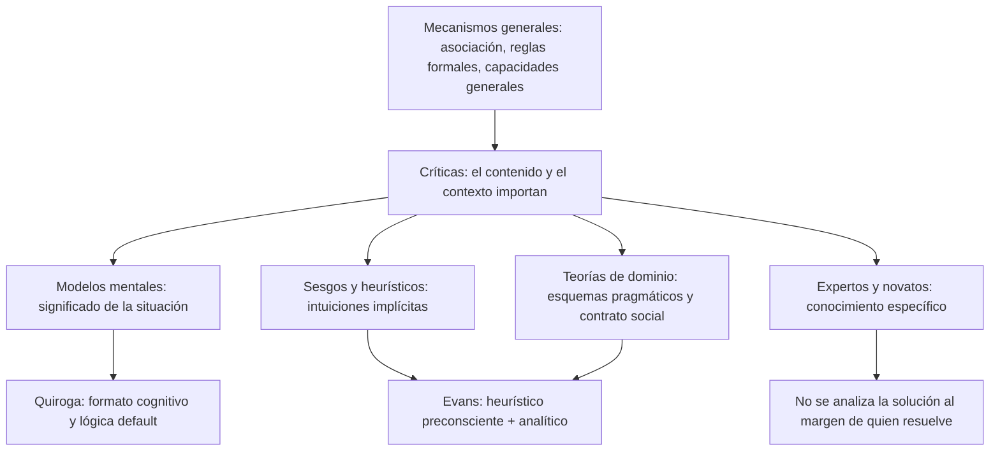
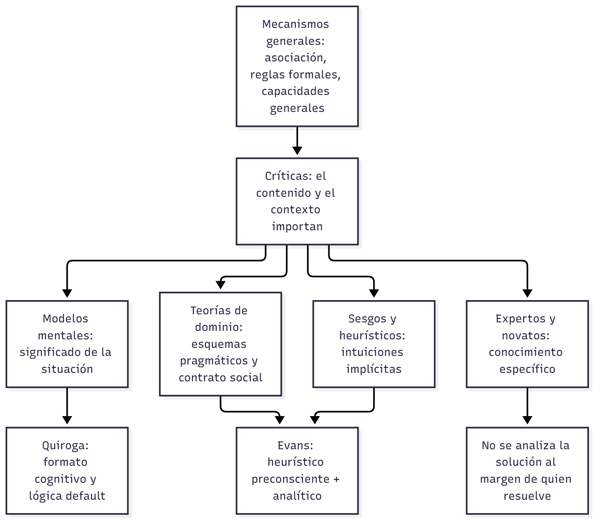

# U03 — Explicaciones del pensamiento · Cuadro integrador

> **Fuentes:** este cuadro sale solo de las cuatro guías de la unidad (`U03_IntroduccionAlEstudioDelPensamiento_Guia.md`, `U03_TeoriasYModelosSobreRazonamiento_Guia.md`, `U03_RazonamientoProbabilistico_Guia.md` y `U03_SolucionDeProblemas_Guia.md`). Las referencias completas están al final.

> **Idea-fuerza:** todas las explicaciones del pensamiento de la unidad responden tres preguntas: **¿qué unidad opera?** (conducta, campo, reglas, modelos, esquemas, heurísticos, conocimiento), **¿qué papel tiene el contenido?** y **¿cómo se explican los errores?** La historia de la unidad va de mecanismos generales e independientes del contenido (asociación, reglas formales, capacidades generales) hacia explicaciones que ponen el contenido, el contexto y el conocimiento específico en el centro (esquemas pragmáticos, heurísticos, expertos y novatos).

## Cuadro 1. Enfoques sobre cómo se piensa y se resuelven problemas

| Eje | Conductismo | Gestalt | Procesamiento de la información | Expertos y novatos |
|---|---|---|---|---|
| **Objeto** | Conducta observable; el pensamiento es lenguaje subvocal o se destierra (González Labra, s. f., pp. 8, 10) → U03 Intro §6 | Experiencia consciente como un todo; solución como reestructuración (González Labra, s. f., pp. 3, 11) → Intro §7 | Procesos mentales como cómputo; búsqueda en un espacio del problema (González Labra, s. f., p. 18; Cárdenas Poveda, 2026c, diapositivas 18-20) → Intro §9, Problemas §4-§5 | Efecto de la experiencia y del conocimiento específico de un dominio (Cárdenas Poveda, 2026c, diapositiva 17) → Problemas §10 |
| **Mecanismo** | Asociación, refuerzo, ensayo y error (González Labra, s. f., p. 8) | Insight: cierre del campo psicológico (González Labra, s. f., p. 11) | Operadores aplicados a estados, guiados por heurísticos (Cárdenas Poveda, 2026c, diapositivas 19-20) | Reconocimiento y automatización en ejercicios; reflexión y control en verdaderos problemas (Pérez Echeverría, 2014, pp. 17-18) |
| **Carácter del proceso** | Ensayo y error por condicionamiento (González Labra, s. f., p. 8) | Discontinuo, súbito (Postigo Angón, 2014, p. 6) | Gradual, continuo y acumulativo, con retrocesos (Cárdenas Poveda, 2026c, diapositiva 18) | Específico de dominio (Pérez Echeverría, 2014, p. 14) |
| **Método** | Observación objetiva, condicionamiento (González Labra, s. f., p. 8) | Descriptivo, fenomenológico; protocolos verbales de Duncker (González Labra, s. f., p. 11) | Protocolos verbales y simulación computacional (Cárdenas Poveda, 2026c, diapositiva 18) | Comparar personas con distinto nivel de pericia (Pérez Echeverría, 2014, p. 13) |
| **Límite o crítica** | Veta lo mental; los neoconductistas introducen mediadores (González Labra, s. f., p. 10) | Conceptos ambiguos, teoría poco estructurada (Cárdenas Poveda, 2026c, diapositiva 18) | Problemas sin contenido y baja efectividad de habilidades generales (Postigo Angón, 2014, p. 8; Pérez Echeverría, 2014, p. 12) | No se puede analizar la solución al margen de quién resuelve (Pérez Echeverría, 2014, pp. 19-20) |

## Cuadro 2. Teorías del razonamiento con mecanismo universal y teorías del contenido

| Eje | Reglas formales (lógica mental) | Modelos mentales | Esquemas pragmáticos |
|---|---|---|---|
| **Unidad** | Reglas formales de inferencia (Cárdenas Poveda, 2026b, diapositiva 8) → Teorías §3 | Modelos de situaciones reales o imaginarias (Cárdenas Poveda, 2026b, diapositiva 31) → Teorías §7 | Esquemas abstractos de permiso, obligación y causa, inducidos de la experiencia (Valiña y Martín, 2014, p. 9) → Teorías §8 |
| **Carácter** | Sintáctico, de propósito general | Semántico, icónico | Pragmático, específico de dominio y sensible al contexto (Valiña y Martín, 2014, p. 10) |
| **Proceso** | Forma lógica → reglas → conclusión (Cárdenas Poveda, 2026b, diapositiva 8) | Comprensión → descripción → evaluación con contraejemplos (Cárdenas Poveda, 2026b, diapositiva 34) | Emparejar la situación con un esquema (Valiña y Martín, 2014, p. 10) |
| **Error** | Número de pasos y accesibilidad de reglas (Valiña y Martín, 2014, p. 18) | Número de modelos y memoria de trabajo (Valiña y Martín, 2014, p. 18) | Falta de emparejamiento o incongruencia con la lógica (Valiña y Martín, 2014, p. 10) |
| **Ejemplo** | Modus ponens (Quiroga, 2013, pp. 3-4) | A-B-C; fiesta de Antonela y Messi (Cárdenas Poveda, 2026b, diapositivas 33, 35-37) | Beber cerveza y la edad mínima (Valiña y Martín, 2014, p. 10) |
| **Crítica** | Éxito de 40-70 %, contenido y contexto (Cárdenas Poveda, 2026b, diapositiva 26) | No explica el formato cognitivo (Quiroga, 2013, p. 12) | Presentación de la tarea, lógica deóntica y perspectiva (Valiña y Martín, 2014, pp. 12-14) |

| Eje | Contrato social | Sesgos y heurísticos | Heurístico-analítica (Evans) |
|---|---|---|---|
| **Unidad** | Algoritmos innatos de intercambio social: costo-beneficio y detección del tramposo (Valiña y Martín, 2014, p. 15) → Teorías §8.5 | Heurísticos de juicio: representatividad, accesibilidad, anclaje y ajuste (Cárdenas Poveda, 2026c, diapositiva 5) → Probabilístico §4-§6 | Información relevante seleccionada en el estadio heurístico y deducciones en el analítico (Valiña y Martín, 2014, pp. 19-20) → Teorías §8.7 |
| **Carácter** | Específico de dominio, evolutivo | Intuitivo, implícito, no accesible a la conciencia (Cárdenas Poveda, 2026c, diapositiva 4) | Dos estadios: preconsciente y analítico |
| **Error** | Respuesta lógicamente incorrecta cuando el tramposo no coincide con p y no-q (Valiña y Martín, 2014, pp. 15-16) | Error sistemático por uso inapropiado de un heurístico (Cárdenas Poveda, 2026c, diapositiva 4) | Pensar selectivamente (Valiña y Martín, 2014, p. 20) |
| **Crítica** | Caso particular de esquemas; facilitación sin intercambio social (Valiña y Martín, 2014, pp. 16-17) | Presentación, universalidad y ambigüedad (Cárdenas Poveda, 2026c, diapositiva 12) | Los procesos analíticos no se especificaron al principio (Valiña y Martín, 2014, p. 20) |

## El eje de cada fila, explicado de punta a punta

### Unidad que opera

En la historia, la **unidad** pasa de la conducta (conductismo), al campo psicológico (Gestalt), al cómputo sobre representaciones (procesamiento de la información). En el razonamiento, la unidad son **reglas** en la lógica mental, **modelos** de situaciones en la teoría de Johnson-Laird, **esquemas** de permiso u obligación en Cheng y Holyoak, **algoritmos** de intercambio social en Cosmides y **heurísticos** de juicio en Tversky y Kahneman (González Labra, s. f., pp. 8, 11, 18; Cárdenas Poveda, 2026b, diapositivas 8, 31). Las reglas y los modelos son universales; los esquemas, el contrato social y los heurísticos son sensibles al contenido o al contexto (Valiña y Martín, 2014, p. 10).

### Papel del contenido

Las reglas formales prescinden del contenido: por eso las críticas más severas recayeron en su debilidad para explicar su influencia (Valiña y Martín, 2014, p. 4). Los modelos mentales lo incorporan por vía semántica. Los esquemas y el contrato social lo ponen en el centro. Los expertos y novatos llevan la idea al extremo: la eficacia depende del conocimiento específico (Pérez Echeverría, 2014, p. 13). Y el procesamiento de la información, que usó problemas sin contenido, es el enfoque más criticado por esto (Postigo Angón, 2014, p. 8).

### Explicación del error

Cada teoría explica el error a su manera, tal como lo resume Valiña con la tercera pregunta de Evans (el sesgo): número de pasos, número de modelos, falta de emparejamiento, uso inapropiado de heurísticos, pensar selectivamente (Valiña y Martín, 2014, p. 18). En la solución de problemas, el error es mala **representación** (Postigo Angón, 2014, p. 20). Y en el razonamiento probabilístico, Hogarth lo atribuye a que el aprendizaje por experiencia no computa lo que no ocurre (Pérez Echeverría y Bautista, 2014, pp. 8-9).

### Método y evidencia

El método objetivo del conductismo lo hereda la cognitiva; los protocolos verbales (Duncker) reaparecen en Newell y Simon (González Labra, s. f., pp. 11, 18-19). En razonamiento, la evidencia es conductual (tarea de selección de Wason) y neurofisiológica (redes fronto-parietales para reglas; áreas parietales y visuales para modelos) (Quiroga, 2013, pp. 4-11). En el estudio de los heurísticos, Pérez Echeverría critica que se midan con métodos explícitos procesos implícitos (Pérez Echeverría y Bautista, 2014, pp. 18-19).

## Diagrama

## No confundir (transversal)

| X | Y | Criterio | Dónde |
|---|---|---|---|
| Heurístico en razonamiento probabilístico | Heurístico en solución de problemas | El primero es una intuición de juicio, implícita, que puede producir sesgos; el segundo es una estrategia de búsqueda que reduce el espacio del problema; en ambos se opone al algoritmo por su vaguedad (Cárdenas Poveda, 2026c, diapositiva 3) | Probabilístico §4; Problemas §6 |
| Deducción | Inducción / razonamiento probabilístico | Conclusión necesaria y segura vs. conclusión probable (Cárdenas Poveda, 2026b, diapositiva 7; Pérez Echeverría y Bautista, 2014, p. 2) | Teorías §1; Probabilístico §1 |
| Competencia | Actuación | Lo que se puede hacer vs. cómo se hace (Cárdenas Poveda, 2026b, diapositiva 27) | Teorías §6 |
| Implícito | Explícito | Intuición por aprendizaje asociativo vs. conocimiento declarable; es más un continuo que una dicotomía (Pérez Echeverría y Bautista, 2014, pp. 18-19) | Probabilístico §8 |
| Insight (Gestalt) | Búsqueda gradual (TPI) | Discontinuo y súbito vs. continuo y acumulativo (Cárdenas Poveda, 2026c, diapositiva 18) | Problemas §4 |
| Reproductivo | Productivo | Solución conocida vs. solución nueva por reestructuración (González Labra, s. f., p. 11) | Intro §7 |
| Problema | Ejercicio | Sin camino rápido vs. mecanismo inmediato (Pérez Echeverría, 2014, p. 3) | Problemas §2 |
| Sesgo | Irracionalidad | Error sistemático respecto de una norma; racionalidad de propósito vs. de proceso (Valiña y Martín, 2014, pp. 19, 21) | Teorías §8 |

## Preguntas integradoras

### I1. Compará cómo explican el error de razonamiento las reglas formales, los modelos mentales, los esquemas pragmáticos y los heurísticos

> **Esqueleto de la respuesta:**
> 1. **Tesis:** cada teoría explica el error con su unidad de análisis (Valiña y Martín, 2014, p. 18).
> 2. **Reglas:** número de pasos y accesibilidad (Valiña y Martín, 2014, p. 18).
> 3. **Modelos:** número de modelos y memoria de trabajo (Valiña y Martín, 2014, p. 18).
> 4. **Esquemas:** emparejamiento e incongruencia con la lógica (Valiña y Martín, 2014, p. 10).
> 5. **Heurísticos y Evans:** sesgo como error sistemático; pensar selectivamente (Valiña y Martín, 2014, pp. 19-20).
> 6. **Cierre:** ninguno equipara error con irracionalidad.

Las cuatro teorías atribuyen el error a su propio mecanismo. Para las **reglas formales** los errores dependen del número de pasos de la derivación y de la accesibilidad de las reglas necesarias; para los **modelos mentales**, del número de modelos que hay que construir y de los límites de la memoria operativa (Valiña y Martín, 2014, p. 18). Para los **esquemas pragmáticos**, de que el problema no permita el emparejamiento con un esquema o de que las inferencias del esquema no coincidan con las de la lógica formal (Valiña y Martín, 2014, p. 10). El enfoque de **sesgos y heurísticos** es el que se centra en el error mismo: un sesgo es un error sistemático, no debido al azar, respecto de un sistema normativo, que surge del uso de atajos cognitivos como la accesibilidad o la representatividad (Valiña y Martín, 2014, p. 19). Evans lo reformula: los sesgos ocurren porque se piensa selectivamente en el estadio heurístico, donde falta información lógicamente relevante o se incluye información irrelevante (Valiña y Martín, 2014, p. 20). Ninguno de estos enfoques equipara error con irracionalidad: Evans distingue racionalidad de propósito y de proceso (Valiña y Martín, 2014, p. 21).

> ⚠ **No confundir:** sesgo (error respecto de una norma) ≠ irracionalidad (que depende de qué racionalidad se mida).

### I2. ¿Qué papel tienen el contenido y el conocimiento específico en las explicaciones del pensamiento de la unidad?

> **Esqueleto de la respuesta:**
> 1. **Tesis:** la unidad avanza de mecanismos independientes del contenido a explicaciones donde el conocimiento es central.
> 2. **Mecanismos generales:** reglas formales; capacidades generales del procesamiento de la información.
> 3. **Críticas:** éxito bajo y dependencia del contenido (Cárdenas Poveda, 2026b, diapositivas 25-26).
> 4. **Teorías del contenido:** modelos mentales, esquemas, contrato social (Valiña y Martín, 2014, pp. 4, 7).
> 5. **Conocimiento específico:** expertos y novatos (Pérez Echeverría, 2014, pp. 13-14).
> 6. **Cierre:** el pensamiento humano es contextual (Pérez Echeverría y Bautista, 2014, p. 22).

Las primeras explicaciones del razonamiento y de la solución de problemas buscaron mecanismos generales e independientes del contenido: reglas formales de propósito general, o capacidades generales del procesamiento de la información estudiadas con problemas sin contenido específico (Cárdenas Poveda, 2026b, diapositiva 8; Postigo Angón, 2014, p. 8). Los datos las cuestionaron: el éxito oscila entre el 40 y el 70 % en universitarios y adultos y el desempeño depende del contenido y del contexto (Cárdenas Poveda, 2026b, diapositivas 25-26). Surgen entonces las teorías del contenido (esquemas pragmáticos, contrato social) y los modelos mentales, que incorporan el significado (Valiña y Martín, 2014, pp. 4, 7). En solución de problemas, el enfoque de expertos y novatos muestra que la eficacia no depende de estrategias generales transferibles sino de conocimientos específicos, y que no se puede analizar la solución al margen de quién resuelve (Pérez Echeverría, 2014, pp. 13-14, 19-20). En probabilístico, la autora concluye que se piensa sobre un contenido, con un objetivo y en un contexto concretos (Pérez Echeverría y Bautista, 2014, p. 22).

> ⚠ **No confundir:** que el contenido importe **no** significa que no haya competencia: se distingue competencia de actuación (Cárdenas Poveda, 2026b, diapositiva 27).

### I3. El término «heurístico» aparece en el razonamiento probabilístico y en la solución de problemas: ¿es lo mismo?

> **Esqueleto de la respuesta:**
> 1. **Tesis:** comparten el origen matemático (vaguedad frente al algoritmo), pero tienen funciones distintas (Cárdenas Poveda, 2026c, diapositiva 3).
> 2. **En el juicio probabilístico:** reglas de inferencia implícitas, no accesibles a la conciencia; producen sesgos (Pérez Echeverría y Bautista, 2014, pp. 9-10).
> 3. **En la solución de problemas:** atajos o búsqueda selectiva que reducen el espacio del problema (Postigo Angón, 2014, p. 9).
> 4. **Rasgos comunes:** rápidos, económicos, sin garantía.
> 5. **Conexión con González Labra:** el pensamiento humano es heurístico; los algoritmos de los programas simulan heurísticos (González Labra, s. f., p. 16).
> 6. **Cierre:** el algoritmo garantiza, el heurístico no.

En matemáticas los heurísticos son procedimientos de solución de problemas que se diferencian de los algoritmos por su vaguedad y falta de precisión, y en psicología aparecen tanto en los métodos intuitivos de enfrentar la probabilidad como en la solución de problemas (Cárdenas Poveda, 2026c, diapositiva 3). En el **razonamiento probabilístico**, los heurísticos de Tversky y Kahneman son reglas básicas de inferencia independientes de la cultura y del contenido, que reducen tareas complejas a juicios simples, no son accesibles a la conciencia y producen sesgos cuando se usan de forma inapropiada (Pérez Echeverría y Bautista, 2014, pp. 9-10). En la **solución de problemas**, un heurístico es un atajo o búsqueda selectiva que reduce el número de estados del espacio del problema y no garantiza la solución, como «salvar la reina amenazada» (Cárdenas Poveda, 2026c, diapositiva 22; Postigo Angón, 2014, p. 9). Tienen en común que son rápidos, económicos y sin garantía, frente a los algoritmos, que garantizan pero son costosos; González Labra afirma que el pensamiento humano es heurístico y que los algoritmos de los programas solo simulan heurísticos (González Labra, s. f., pp. 14-16).

> ⚠ **No confundir:** el heurístico del juicio es una **intuición implícita**; el de la solución de problemas es una **estrategia de búsqueda** que puede usarse de modo deliberado.

## Referencias

- Cárdenas Poveda, C. (2026a). *Introducción: Desarrollo del estudio del pensamiento en psicología, desde enfoques clásicos a modelos contemporáneos* [Diapositivas de clase: Pensamiento, Clase 01]. Procesos Básicos III, Universidad Favaloro.
- Cárdenas Poveda, C. (2026b). *Teorías y modelos sobre razonamiento* [Diapositivas de clase: Pensamiento, Clase 02]. Procesos Básicos III, Universidad Favaloro.
- Cárdenas Poveda, C. (2026c). *Razonamiento probabilístico y solución de problemas* [Diapositivas de clase: Pensamiento, Clase 03]. Procesos Básicos III, Universidad Favaloro.
- González Labra, M. J. (s. f.). Psicología del pensamiento: Esbozo histórico. En *Psicología del pensamiento* (cap. 1, pp. 1-22). UNED.
- Pérez Echeverría, M. P. (2014). Solución de problemas. En M. Carretero y M. Asensio (Coords.), *Psicología del pensamiento: Teoría y prácticas* (cap. 8, pp. 1-20). Alianza.
- Pérez Echeverría, M. P., y Bautista, A. (2014). Pensamiento probabilístico. En M. Carretero y M. Asensio (Coords.), *Psicología del pensamiento: Teoría y prácticas* (cap. 7, pp. 1-22). Alianza.
- Postigo Angón, Y. (2014). Estrategias en solución de problemas. En M. Carretero y M. Asensio (Coords.), *Psicología del pensamiento: Teoría y prácticas* (cap. 9, pp. 1-28). Alianza.
- Quiroga, L. (2013). Razonamiento y representaciones mentales: Los límites entre lógica y psicología. *Praxis. Revista de Psicología, 15*(23), 69-92.
- Valiña, M. D., y Martín, M. (2014). Razonamiento pragmático. En M. Carretero y M. Asensio (Coords.), *Psicología del pensamiento: Teoría y prácticas* (cap. 6, pp. 1-22). Alianza.
