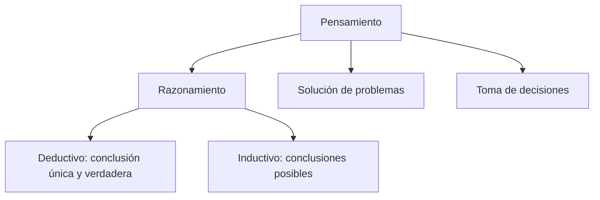
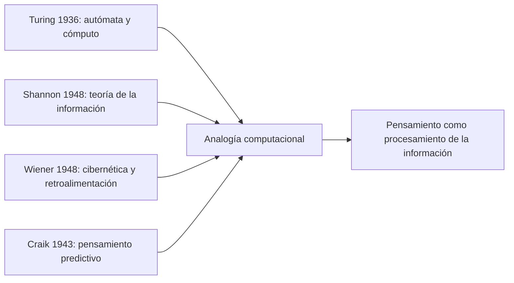
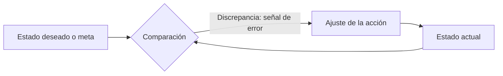
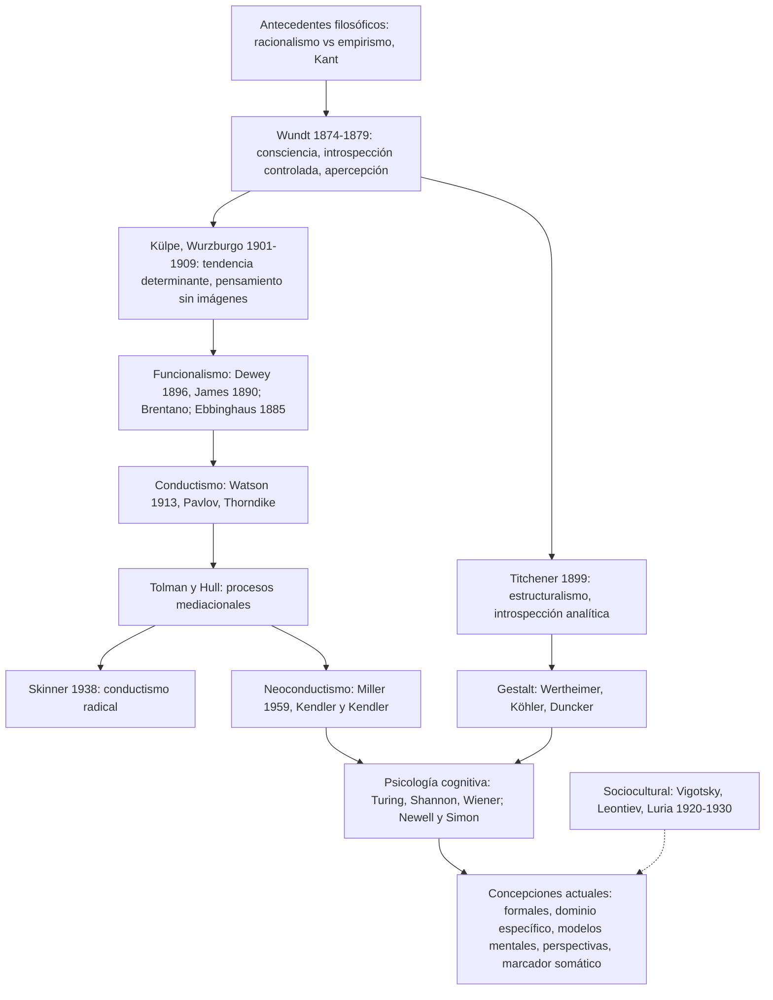

# U03 — Introducción al estudio del pensamiento: de los enfoques clásicos a los modelos contemporáneos

> **Fuentes:** María José González Labra, «Psicología del Pensamiento: Esbozo Histórico» (cap. 1, pp. 1–22) · Diapositivas de la Clase 01, «Introducción: Desarrollo del estudio del pensamiento en psicología, desde enfoques clásicos a modelos contemporáneos» (25 diapositivas) · **Materia:** Procesos Básicos III — Facultad de Ciencias Humanas y de la Conducta · **Docente:** Mg. Carolina Cárdenas Poveda.
>
> Las diapositivas citan a Carretero y Asensio (2014); ese texto no está en el repositorio, así que lo que viene de ahí se cita como `(Diapositiva N)`.

> **Idea-fuerza:** la psicología del pensamiento nació dentro de la propia historia de la psicología científica y sufrió todos sus vaivenes: cada escuela redefinió **qué** es el objeto de estudio y **con qué método** se lo estudia, al punto de que el pensamiento llegó a perder su legitimidad como objeto por ser inobservable (González Labra, p. 17). Desde Wundt (consciencia + introspección) hasta la psicología cognitiva (procesos mentales como cómputo + método experimental objetivo), el recorrido muestra que concepto y método van siempre juntos (González Labra, p. 4). Hoy la psicología del pensamiento estudia sobre todo el **proceso de inferencia** en tres grandes áreas: razonamiento (deductivo e inductivo), solución de problemas y toma de decisiones (González Labra, p. 15; Diapositiva 5).

## 0. Hoja de ruta

1. **¿Qué es pensar?** Definiciones del diccionario y de Carretero y Asensio; las tres grandes áreas (razonamiento, solución de problemas, toma de decisiones) y la definición de problema (Diapositivas 2–7).
2. **Concepto y método:** por qué la historia del pensamiento es la historia de cómo cada escuela definió su objeto y su método (González Labra, pp. 3–4).
3. **Antecedentes filosóficos:** racionalismo (Platón, Descartes) vs. empirismo (Locke, Hume, Berkeley) y la síntesis de Kant; debates recurrentes (Diapositivas 8–12).
4. **Psicología de la consciencia:** Wundt (introspección controlada, apercepción), Titchener (estructuralismo, introspección analítica) y la escuela de Wurzburgo (Külpe: tendencia determinante y pensamiento sin imágenes) (González Labra, pp. 4–6; Diapositivas 13–14).
5. **Psicología de las funciones mentales:** funcionalismo norteamericano (Dewey, James), Brentano y la intencionalidad, Ebbinghaus y los métodos cuantitativos (González Labra, pp. 6–8).
6. **Conductismo:** Watson (pensamiento = lenguaje subvocal), Pavlov y Thorndike, Tolman vs. Hull, Skinner, el neoconductismo de Miller y de Kendler y Kendler (González Labra, pp. 8–10; Diapositiva 15).
7. **Gestalt:** el todo, el campo psicológico, pensamiento productivo vs. reproductivo, insight, Köhler, Duncker, isomorfismo (González Labra, pp. 10–12; Diapositivas 16–18).
8. **Psicología sociocultural:** Vigotsky, Leontiev y Luria (Diapositiva 19).
9. **Psicología cognitiva / procesamiento de la información:** Turing, Shannon, Wiener, Craik; analogía computacional; Newell y Simon; algoritmos vs. heurísticos; conocimiento (Chase y Simon) e inferencias (González Labra, pp. 12–15; Diapositiva 20).
10. **El pensamiento hoy:** proceso de inferencia, propositividad vs. intencionalidad, deducción/inducción, el problema mente-cuerpo (González Labra, pp. 15–16).
11. **Concepciones actuales** según la clase: modelos formales, de dominio específico, modelos mentales, teoría de las perspectivas, marcador somático (Diapositivas 21–25).
12. **Balance** del recorrido (resumen del capítulo, González Labra, pp. 17–19).

## 🎯 Lo que entra sí o sí

1. **Definición de pensamiento** de Carretero y Asensio y las **tres grandes áreas**: razonamiento (deductivo/inductivo), solución de problemas y toma de decisiones; qué es un **problema** (Duncker; Lester) (Diapositivas 4–7).
2. **Racionalismo vs. empirismo** (y Kant) como antecedentes filosóficos (Diapositivas 8–11).
3. **Wundt vs. Wurzburgo:** introspección y exclusión del pensamiento vs. **pensamiento sin imágenes** y **tendencia determinante** (carácter directivo) (Diapositivas 13–14; González Labra, pp. 4–6).
4. **Conductismo:** pensamiento como **lenguaje subvocal** (Watson), ensayo y error (Thorndike), conducta verbal (Skinner); y cómo Tolman, Hull y el neoconductismo abrieron la puerta a lo mental (Diapositiva 15; González Labra, pp. 8–10).
5. **Gestalt:** **insight**, **pensamiento productivo vs. reproductivo** (Wertheimer), experimentos de Köhler con primates, críticas y aportes (Diapositivas 16–18; González Labra, p. 11).
6. **Procesamiento de la información:** analogía computacional (Turing, Shannon, Wiener), Newell y Simon, **algoritmos vs. heurísticos** (Diapositiva 20; González Labra, pp. 12–16).
7. **Concepciones actuales:** modelos formales, de dominio específico (esquemas pragmáticos, contrato social), modelos mentales (Johnson-Laird), teoría de las perspectivas (Tversky y Kahneman) y marcador somático (Damasio) (Diapositivas 21–25).

---

## 1. ¿Qué entendemos por «pensamiento»?

### 1.1. Las acepciones del diccionario

La clase arranca por el diccionario, para mostrar que la palabra es ambigua (Diapositivas 2–3):

- **Pensamiento** (Diapositiva 2): facultad o capacidad de pensar; acción y efecto de pensar («suspender el pensamiento»); actividad del pensar («los comienzos del pensamiento occidental»); conjunto de ideas propias de una persona, de una colectividad o de una época; frase breve y de tono serio que refleja una idea de carácter moral o doctrinal; propósito o intención. Incluso nombra una planta herbácea anual de la familia de las violáceas, con flores de cinco pétalos redondeados y de tres colores, y —en germanía— un bodegón (establecimiento donde se ofrecían comidas).
- **Pensar** (Diapositiva 3): del latín *pensare*, «pesar», «calcular», «pensar». Como transitivo: formar o combinar ideas o juicios en la mente («Me asusta lo que pienso»); examinar mentalmente algo con atención para formar un juicio; opinar algo acerca de una persona o cosa («¿Qué piensas de él?»); tener la intención de hacer algo («Pienso ir mañana»). Como intransitivo: formar en la mente un juicio u opinión sobre algo; recordar o traer a la mente algo o a alguien; tener en consideración algo o a alguien al actuar («A ver si piensas en los demás»).

> 🔑 **Punto clave:** la etimología (*pensare* = pesar, calcular) ya anticipa la idea de **evaluar** y **combinar** ideas, que es lo que la psicología va a estudiar como razonar, decidir y resolver problemas.

### 1.2. La definición psicológica (Carretero y Asensio, 2014)

«Pensamiento» designa lo que contiene o aquello a lo que apunta un **conjunto de actividades mentales u operaciones intelectuales** —razonar, hacer abstracciones, generalizar, etcétera— cuyas **finalidades** son, entre otras, **resolver problemas, tomar decisiones y representarse la realidad externa** (Diapositiva 4).

González Labra coincide en que es difícil delimitarlo: siguiendo a **Ryle (1949)**, el pensamiento es un **término polimorfo** que puede aplicarse a una amplia gama de actividades; quizás haya un denominador común entre ellas, pero buscar esas conexiones es complicado por el enorme entramado de relaciones y la extensión de actividades que comprende (González Labra, p. 15).

### 1.3. Las tres grandes áreas

La clase ordena el campo en **tres grandes áreas** (Diapositiva 5):

- **Razonamiento:** proceso que permite **extraer conclusiones a partir de premisas** o acontecimientos dados previamente; obtener algo nuevo a partir de algo conocido; **inferir una conclusión nueva** (Diapositiva 6).
  - **Deductivo:** supone que la conclusión se infiere **necesariamente** de las premisas, por estar incluida lógicamente en ellas, se explicite o no. **La verdad de las conclusiones depende de la verdad de las premisas** (Diapositiva 6). Da una conclusión única y verdadera (Diapositiva 5).
  - **Inductivo:** proceso de **generalización** por el cual obtenemos una regla a partir de determinado número de situaciones concretas que la hacen verdadera; **el no cumplimiento de la regla en una situación la haría total o parcialmente falsa** (Diapositiva 6). Da conclusiones posibles (Diapositiva 5).
- **Solución de problemas.** ¿Qué es un problema? Tiene que cumplir **dos condiciones** (Diapositiva 7):
  1. Hay un **objetivo que no sabemos cómo alcanzar** (Duncker, 1948).
  2. **No se dispone de un camino rápido** para su solución (Lester, 1983).
- **Toma de decisiones:** completa la tríada (Diapositiva 5); la clase la retoma con la teoría de las perspectivas y el marcador somático (§11).

González Labra lo formula en términos de inferencia: la distinción entre deductivo e inductivo es una distinción entre el **tipo de conclusión o solución** que se alcanza. Si la solución comprende la información que viene dada, las inferencias son **deductivas (explicativas)** y su conclusión tiene **valor de verdad**; si va más allá de lo dado, son **inductivas (ampliativas)** y las conclusiones son **probabilísticas** (González Labra, p. 16). (Ver §9.)

> ⚠️ Ojo con la fecha: la diapositiva atribuye la primera condición de «problema» a Duncker (1948); en la bibliografía de González Labra la monografía de Duncker *On problem solving* figura como 1945 (González Labra, p. 21). Citá la fecha según la fuente que estés usando.

---

## 2. Concepto y método: el marco del recorrido histórico

Antes de abordar los temas de la psicología del pensamiento, González Labra presenta un esbozo histórico para mostrar los orígenes y las líneas básicas que moldearon su marco teórico y metodológico, haciendo énfasis en los puntos más espinosos: los problemas teóricos de fondo sobre la **interacción entre el constructo teórico de «pensamiento» y la acción física** (González Labra, p. 3).

**Objetivos del capítulo** (González Labra, p. 2): recapitular las nociones básicas de Historia de la psicología; conocer los orígenes de la psicología del pensamiento dentro de las líneas que marcaron su desarrollo teórico y metodológico; analizar los acuerdos y desacuerdos entre marcos teóricos y metodológicos; entender la psicología del pensamiento como parte de la **ciencia empírica del comportamiento** interesada en la **descripción, explicación y predicción** de su objeto; y adquirir una visión integradora de la disciplina.

**La estrecha relación entre concepto y método** (González Labra, pp. 3–4):

- La psicología científica es un sistema de **descripción, explicación y predicción** de la ciencia empírica del comportamiento. El psicólogo parte de una formulación teórica que describe, explica y prevé consecuencias; esas consecuencias toman la forma de **predicciones que se contrastan como hipótesis** dentro de un marco metodológico (p. 4).
- Los **datos** (de la observación o de procedimientos experimentales) siempre están enmarcados en una **metodología**, y ésta a su vez está vinculada con una **postura teórica**. Por eso conviene explicitar de antemano los supuestos del planteamiento teórico, para evitar la **tendencia a la confirmación de las hipótesis** respecto del marco del investigador (p. 4).
- Los desacuerdos sobre el pensamiento humano pueden darse en **la formulación teórica, en el marco metodológico o en ambos** (p. 4).
- La psicología científica **no admite** descubrir la naturaleza de su objeto por **apelación directa** a las cosas ni por mero **análisis conceptual**: la confusión conceptual se aclara con datos del método científico y el progreso de las técnicas. El concepto —una clasificación de fenómenos bajo encabezamientos como *razonamiento* o *solución de problemas*— gana precisión a medida que se descubren técnicas de investigación más avanzadas (p. 4).

> 🔑 **Punto clave:** cada escuela que sigue se puede leer con dos preguntas: **¿cuál es el objeto de estudio?** y **¿cuál es el método?** Ésa es la grilla del texto.

---

## 3. Antecedentes filosóficos

La clase ubica el debate de fondo en la filosofía (Diapositivas 8–12):

| | **Racionalismo** | **Empirismo** |
|---|---|---|
| Tesis | La mente posee razonamiento y **lo impone al mundo sensorial** (Diapositiva 8) | Los procesos mentales **reflejan al mundo externo** (Diapositiva 8) |
| Autores | **Platón** (427–347 a. C.), **Descartes** (1596–1650) (Diapositiva 9) | **Locke** (1632–1704), continuado por **Hume** y **Berkeley** (Diapositiva 10) |

- **Platón:** **teoría de las reglas formales**: el pensamiento se guía por una serie de **reglas formales, abstractas y de propósito general** (Diapositiva 9). (Esta idea reaparece en los «modelos formales» actuales, §10.1.)
- **Descartes:** se puede alcanzar la verdad por una **vía racional**; privilegio de la razón, la aritmética y la matemática; **división entre una mente racional y un cuerpo mecánico** (Diapositiva 9). (Damasio titulará su crítica *El error de Descartes*, §11.5.)
- **Locke:** rechaza el conocimiento por la vía **introspectiva**; solo es posible conocer por la **vía sensorial**; el sujeto se vuelve racional a partir de la **generalización de su experiencia** (Diapositiva 10).
- **Kant:** intenta resolver el debate entre racionalismo y empirismo; parte de un **sujeto cognoscente**: **el sujeto construye y ordena al objeto** (Diapositiva 11).

**Debates recurrentes** que atraviesan toda la historia (Diapositiva 12): ¿el pensamiento es una **habilidad** o un **conjunto de procesos**? ¿Es **racional** o **irracional**?

> → Conexión con González Labra: el empirismo inglés influye directamente en Titchener (§4.2), y la idea de la mente con actividad propia (Wundt) vs. mente como proyección pasiva del medio reedita el contraste racionalismo/empirismo (González Labra, p. 5).

---

## 4. La psicología de la consciencia

### 4.1. Wundt: consciencia, introspección controlada y apercepción

**Wilhelm Wundt** fundó el **primer laboratorio de Psicología en la Universidad de Leipzig** (González Labra, p. 4); la clase lo fecha en **1879** como comienzo de la psicología (Diapositiva 13). En *Los Principios de la Psicología Fisiológica* (**1874**) presentó la psicología como **disciplina científica independiente y no reduccionista**, aunque **complementaria de la anatomía y la fisiología** (González Labra, p. 4).

- **Objeto:** el estudio científico de la **consciencia** y sus procesos a través de la propia experiencia del sujeto (p. 4).
- **Método:** el de las ciencias naturales, pero basado en la **experiencia inmediata**: **auto-observación controlada** bajo condiciones experimentales (**introspección** guiada por el control experimental). Así se buscaba el rigor científico: datos **objetivos y replicables**, apoyados en condiciones estandarizadas idóneas para su reproducción y para variaciones sistemáticas (p. 4). La clase lo resume: método de la introspección como **atención y descripción de las percepciones**, enfocado en lo **perceptible y lo concreto a partir de imágenes** (Diapositiva 13).
- **Límites del método:** Wundt admitió que el experimento no servía para todo. Las actividades mentales **no sujetas directamente a la estimulación física** no podían abordarse en el laboratorio; debían estudiarse **indirectamente**, analizando sus **productos** —**el lenguaje, las creencias y las costumbres**— mediante un análisis de la **experiencia histórica y cultural** (p. 4). Por eso, según la clase, **excluye al pensamiento**: hay una **imposibilidad de que el pensamiento se estudie a sí mismo** (Diapositiva 13).
- **Mérito y límite:** se atrevió a llevar problemas psicológicos al laboratorio y someterlos a control experimental, pero quedó condicionado por los **orígenes fisiológicos**: problemas y métodos muy cercanos a la **fisiología sensorial** (p. 4).
- **Relación mente-cuerpo:** aunque encuadró la psicología en la fisiología (para darle prestigio científico), **no hizo experimentación fisiológica propiamente dicha**. Sostenía un **paralelismo**: los acontecimientos externos provocan **paralelamente** procesos corporales y mentales, **sin relación causal** entre ambos (p. 5).
- **Objeto preciso:** describir y analizar los **elementos** de los procesos conscientes y los **principios que rigen sus conexiones**. Pero —clave— para Wundt la relación entre lo simple y lo complejo era una **síntesis activa** que daba lugar a una **unidad superior**: el análisis buscaba explicar la experiencia consciente **como un todo**, no reducir lo complejo a lo simple (p. 5).
- **Apercepción:** concepto con dos aspectos básicos: (a) la experiencia mental es una **unidad**, no un compuesto de elementos; (b) es una unidad **con actividad propia**, frente a la idea de la mente como **proyección pasiva** del medio (p. 5). Wundt usó las **variaciones de los tiempos de reacción** como **criterio empírico** de esta actividad sintetizadora: si la apercepción ocupa un tiempo **mensurable**, puede abordarse experimentalmente. La apercepción pasó a ser la base de las actividades mentales superiores y el **nexo unificador de la primera teoría psicológica experimental** (análisis y síntesis de los acontecimientos mentales). Fue **el primer intento sistemático de someter los procesos psicológicos superiores a una rigurosa investigación de laboratorio** (p. 5).
- **Destino:** los discípulos abandonaron la síntesis por una psicología **sensoriomotora** más sencilla; la Gestalt reinterpretó algunas de sus ideas, y el término «apercepción» **se perdió** y no resurgió ni en la psicología cognitiva actual (p. 5).

### 4.2. Titchener: estructuralismo e introspección analítica

**Titchener**, discípulo de Wundt, bajo la fuerte influencia de los **empiristas ingleses**, **rechazó la psicología *Ganzheit* (totalizadora)** de Wundt y defendió una psicología **reduccionista basada en las sensaciones** (González Labra, p. 5).

- **Psicología estructural** (así bautizada por Titchener en **1899**): todos los contenidos mentales se categorizan en tres tipos: **imágenes, emociones y sensaciones puras**; imágenes y emociones son unidades complejas que se descomponen en grupos de sensaciones. Todo pensamiento complejo se analiza en sensaciones elementales (p. 5).
- **Analogía con la química:** así como la química explica la combinación de elementos del mundo físico, los estructuralistas querían un análisis semejante del **contenido de la consciencia** (el dato psicológico). Esas descripciones podían complementarse con explicaciones fisiológicas (p. 5).
- Interés **morfológico**: sin análisis de la estructura no se comprenden las funciones (p. 5).
- **Método: introspección analítica.** Descripción controlada de las sensaciones internas mientras se hace una tarea o se atiende a un estímulo, pero no al estilo wundtiano sino como un **análisis retrospectivo** más complicado. Requería **largas horas de entrenamiento** para que el sujeto informara en términos de sensaciones elementales y evitara el **error estimular**: informar sobre las **propiedades conocidas del estímulo** en lugar de la propia experiencia sensorial. Se buscaba la aprehensión inmediata de la experiencia **sin contaminación de la experiencia anterior** (p. 5).
- **Meta:** identificar los **átomos del pensamiento**, cuya ley de combinación era el **principio de la asociación** (p. 5). En síntesis: el pensamiento se identificaba con las **ideas**, las ideas eran **imágenes** y las imágenes se reducían a **sensaciones** (p. 17).
- **Dificultad:** había que crear un **lenguaje sin referentes externos**, solo con referentes en la misma experiencia (p. 5).

**Críticas a la introspección** (pp. 5–6):
1. Suponía que los fenómenos compuestos se pueden discernir en sus elementos **por el mero hecho de la reflexión**.
2. **No había acuerdo** entre los informes introspectivos de distintos sujetos ante un mismo estímulo.
3. El error más grave para el método científico: **falta de independencia en el acceso** para observar públicamente **tanto la causa como el efecto**. El estímulo era público, la sensación interna no; no había forma de saber cuál introspección era la verdadera ni de crear un **lenguaje consensuado** (p. 6).

### 4.3. La escuela de Wurzburgo (Külpe)

**Oswald Külpe**, otro discípulo de Wundt, fundó lo que se conocería como la **escuela de Wurzburgo (1901–1909)**, desafiando el estrecho margen que se daba a la experimentación de los procesos mentales (González Labra, p. 6); la clase la ubica a **fines del siglo XIX** (Diapositiva 14). Külpe estudió el pensamiento experimentalmente **aumentando la complejidad de las tareas** y pidiendo a los sujetos que **describieran los procesos de pensamiento** que los habían llevado a una respuesta (p. 6). Dos resultados de vital importancia:

1. **Tendencia determinante (disposición mental).** Los sujetos mostraban invariablemente una **preparación genérica** ante la tarea: las instrucciones preliminares orientaban hacia el tema general y producían una **preselección** entre las respuestas disponibles. Esto supuso el **rechazo de la explicación asociacionista**: puso de manifiesto el **carácter directivo** del pensamiento, que ya no podía describirse como mera asociación libre. **Los objetivos o metas de la tarea tomaban las riendas del pensamiento**, y la tendencia determinante **raras veces se representaba en la consciencia** (p. 6).
2. **Pensamiento sin imágenes.** Pese al entrenamiento introspectivo, los sujetos informaban **estados mentales sin imágenes detectables** (**Mayer y Orth, 1901**). Ninguna sofisticación introspectiva permitía clasificarlos como elementos primarios irreductibles. Se interpretaron como los **indicadores conscientes del pensamiento**, admitiendo que **el pensamiento propiamente dicho era un proceso inconsciente** (p. 6).

La clase lo resume así (Diapositiva 14): no todos los procesos mentales son conscientes ni se presentan como imágenes; el pensamiento es un **constructo general y abstracto** al margen de los elementos concretos; se abre la posibilidad de estudiar los procesos **«superiores»** como el pensamiento y la inteligencia; y se evidencian las **dificultades de la introspección sistemática** como método fiable.

**La polémica** (González Labra, p. 6):
- Reaparecería años después, en otro marco, en la psicología cognitiva como la controversia sobre la **representación del conocimiento en formato analógico o proposicional**.
- **Wundt** criticó duramente la falta de rigor de estas investigaciones y las acusó de **fraudulentas**; **Titchener** se propuso **refutarlas experimentalmente**. Sus discípulos decían no encontrar los elementos del pensamiento sin imágenes y que el error era no haber analizado los contenidos mentales; tampoco aceptaban un pensamiento inconsciente, alegando que **lo que no es consciente no es mental, sino fisiológico**.
- **Consecuencias:** el objeto de la psicología **no tenía que reducirse a los fenómenos de consciencia ni al análisis de su contenido**, y la **introspección analítica quedó desacreditada** como método científico (p. 6). El objeto cambió **de los contenidos a las funciones mentales** (p. 2).
- Wurzburgo **no llegó a ser una alternativa teórica y metodológica propiamente dicha**: fue **absorbida por la psicología funcionalista**, pero sus hallazgos abrieron nuevas perspectivas (p. 17).

> 🔑 **Punto clave:** Wurzburgo deja dos ideas que vuelven más tarde: el **carácter directivo** (metas) del pensamiento —que la cognitiva retomará como **plan**— y la existencia de procesos de pensamiento **no conscientes** (pp. 6, 16).

---

## 5. La psicología de las funciones mentales

### 5.1. El funcionalismo norteamericano

La corriente **funcionalista** norteamericana, formada por diversas líneas, surge como **alternativa opuesta al estructuralismo** (González Labra, p. 6):

- Sigue admitiendo la introspección, pero pasa de la introspección de los **contenidos** a la de las **funciones y propósitos** de la mente (p. 6).
- El objeto se redefine como las **propiedades funcionales** de los procesos mentales. Acentúa la **significación funcional del comportamiento como adaptación al medio**; la mente es **mediadora entre el medio y las necesidades del organismo**; interesa la **utilidad de la consciencia y de la conducta** (p. 6). Es una concepción **pragmática** (p. 2).
- Abrió nuevos campos: **diferencias individuales, aprendizaje animal y humano, psicología evolutiva y patológica**; es una postura **ecléctica** en objetos y técnicas (p. 6).
- La psicología se volcó sobre la **biología**: las funciones mentales se entienden en relación con la totalidad de las funciones biológicas. **El pensamiento era el resultado del esfuerzo por sobrevivir en las situaciones prácticas de la vida** (p. 7).
- Es la **primera escuela de psicología norteamericana**; su fundador reconocido es **John Dewey (1896)**, con su polémico artículo sobre el **concepto de arco reflejo**, que criticaba las restricciones de Wundt y Titchener sobre objeto y método (p. 7).
- Sus **antecedentes son europeos**: la teoría de la evolución de **Darwin**, las diferencias individuales de **Galton**, los estudios de conducta animal de **Romanes** y de **Morgan** (p. 7).

### 5.2. Brentano y la psicología del acto

Para la psicología del pensamiento merece mención especial la **psicología del acto de Brentano** (González Labra, p. 7):

- El **acto mental** es aquello por lo que la mente entra en contacto con el mundo. Lo fundamental es estudiar **lo que hace la mente**: el contenido importa menos que el **acto** que aprehende el fenómeno. Sus esfuerzos fueron sobre todo de **análisis epistemológico** de los fundamentos de la psicología.
- «Experiencia» es ambiguo: puede ser el contenido de la consciencia de los informes introspectivos o el fenómeno que aprehende nuestro conocimiento del mundo.
- La propiedad fundamental de la consciencia es la **intencionalidad**: toda experiencia solo tiene sentido como **acto mental referido a algún objeto**.
- Su obra *La Psicología desde un Punto de Vista Empírico* (**1874**) coincide en fecha con la de Wundt, pero solo la de Wundt tuvo gran influencia en la psicología como ciencia. Probablemente porque Wundt asumía los fenómenos de consciencia como **objetos accesibles por introspección** (actitud **positivista** que conducía directo al laboratorio), mientras que Brentano sostenía que el concepto mismo de objeto solo se define a través de los **actos intencionales** y que hacía falta un primer nivel de **análisis fenomenológico** (actitud **fenomenológica** que llevaba a fundar epistemológicamente la ciencia) (p. 7).
- **Programa de Brentano** en dos fases: (1) **descripción de la experiencia subjetiva por medio de la intuición**, en un nivel **precientífico**, cuya tarea es **clasificar los actos**; (2) establecer la psicología científica buscando las **relaciones causales** entre fenómenos hasta alcanzar el **nivel fisiológico** (**psicología genética**). Una psicología experimental con fundamento epistemológico (p. 7).
- **Legado:** su mayor influencia fue filosófica (la **fenomenología de Husserl**); pero la descripción de los fenómenos de consciencia será objeto de la **Gestalt**, y los **actos intencionales** reaparecerán en psicología como **planes, metas y propósitos** (p. 7).

### 5.3. Ebbinghaus y los métodos cuantitativos

En Alemania, **Ebbinghaus (1885)** cambió la perspectiva: buscó las **leyes cuantitativas** de las asociaciones en lugar de la estructura de los estímulos. El objeto era el **rendimiento de los sujetos en las tareas**, no las introspecciones (González Labra, p. 7).

- Así como **Fechner (1860)**, en la **psicofísica**, había tomado las **diferencias apenas perceptibles** como unidades equivalentes de la sensación, Ebbinghaus quiso establecer **curvas de aprendizaje** bajo distintas condiciones para estudiar la **memoria como una función** con el efecto del contenido **neutralizado** (p. 7).
- **Crítica:** al despojar el material de toda significación (unidades constantes e intercambiables), sus experimentos fueron tildados de **artificiales**: estudiaban hábitos de repetición verbal más que la memoria de la vida ordinaria (p. 7).
- **Aporte:** abrió el camino a los **métodos cuantitativos** en el estudio de los procesos mentales, cuestión que Wundt ya había planteado con los tiempos de reacción de la apercepción (p. 7).

### 5.4. Del mentalismo a la conducta

El funcionalismo, que era **mentalista**, buscó una psicología útil y práctica en una trayectoria que **empezó en el estudio introspectivo** de la actividad mental y **culminó en el estudio de la actividad solo como conducta manifiesta** (González Labra, p. 7). Ya **James**, en *Principios de Psicología* (**1890**), decía que toda modificación mental conlleva un **cambio corporal** y que el sistema nervioso **convierte los estímulos en reacciones** (p. 8). El creciente énfasis en las manifestaciones corporales fue desplazando los procesos mentales: la conducta pasó a ser objeto y la introspección, innecesaria (p. 8). En el resumen: los funcionalistas primero dieron al pensamiento un **papel activo** en el comportamiento adaptativo, pero el interés por la utilidad se desplazó **de lo mental a lo conductual**; ante una introspección cada vez más polémica, se eligió un **objeto públicamente observable** y un **método objetivo** que pudiera cuantificarlo: surge el conductismo de Watson (pp. 2, 17).

---

## 6. La psicología conductista: abandono y destierro de los procesos mentales

### 6.1. Watson: el pensamiento como lenguaje subvocal

En contraposición al estructuralismo y al funcionalismo, y bajo la influencia del **pragmatismo**, **Watson** y su escuela determinaron la investigación psicológica de los **cuarenta años** siguientes (González Labra, p. 8).

- **Crítica (1913):** la introspección no había producido avances y, sobre todo, **separaba a la psicología de las ciencias naturales**, cuyos datos son **objetivos y públicos** (p. 8).
- Su propuesta venía de su campo, la **psicología animal**: como la introspección era poco fiable y **no se podía aplicar a animales**, el método debía ser **objetivo**: manipular variables del entorno y determinar sus efectos sobre la **conducta observable** (p. 8).
- La **consciencia** es insostenible como objeto: no es observable directamente y no hay criterios para justificar una consciencia animal (p. 8).
- **Objeto:** leyes y principios para la **predicción y control del comportamiento observable**, definido por las relaciones entre **estimulación ambiental y respuesta del organismo**. La conducta reemplaza a la experiencia consciente, y la observación objetiva de la experimentación animal reemplaza a la introspección (p. 8). El conductismo sostiene que el objeto es la **descripción, predicción y control de la conducta** (p. 2).
- **El pensamiento:** como no se podía apelar a estados mentales ni como efectos ni como causas, el pensamiento se consideró un **epifenómeno** o, en el mejor de los casos, un **lenguaje subvocal** explicable como **hábitos laríngeos**. Para Watson, el pensamiento consistía en **actos musculares encadenados** en mecanismos asociativos; todo pensamiento ocurría en la **musculatura periférica como conducta implícita**. Era **lenguaje emitido para uno mismo** y, como el lenguaje, una conducta más **aprendida por condicionamiento** (p. 8). La clase: pensamiento como lenguaje subvocal; al igual que el lenguaje, se adquiere mediante **elementos asociativos** (Diapositiva 15, que fecha a Watson en 1924).
- Este énfasis en el método objetivo caracteriza al **conductismo descriptivo** (p. 8).

**Los dos paradigmas experimentales** del método objetivo (González Labra, p. 8):

1. **Condicionamiento clásico** (**Pavlov, 1927**, reflejo condicionado): el apareamiento de un estímulo arbitrario con uno que normalmente evoca una respuesta hace que el arbitrario evoque esa misma respuesta. Así el aprendizaje se describe **sin asociaciones entre ideas** ni constructos mentales. Respondía a la necesidad de **acceso independiente** para observar públicamente causa y efecto. Watson lo usó para explicar el aprendizaje en términos **ambientalistas**: las influencias ambientales determinan el comportamiento.
2. **Condicionamiento operante**, a partir de **Thorndike (1898)** y la conducta de **ensayo y error**: recompensa y castigo. Thorndike postuló la **ley del efecto** y la **ley del ejercicio** (luego modificadas) como explicación de toda conducta, incluso la más compleja. **Watson criticó la ley del efecto por estar cargada de términos mentalistas** (placer ante la recompensa, displacer ante el castigo). El concepto central era el **aprendizaje**, básico para la adaptación: las respuestas adaptativas se fortalecen y las inadecuadas se debilitan. Si el historial de condicionamiento es observable, permite predecir la conducta; **el pensamiento se reducía a la acción automática de los refuerzos** (p. 8).

La clase ubica a **Thorndike (1898)** con un **pensamiento enfocado a la solución de problemas**, **sin interés en los aspectos internos**, y con la pregunta guía **«¿Cómo resuelven problemas los animales?»**; y a **Skinner (1957)** con la **conducta verbal** (Diapositiva 15).

### 6.2. Tolman vs. Hull: las variables entre el estímulo y la respuesta

Tras Watson surgieron conductistas que elaboraron los aspectos teóricos y metodológicos (González Labra, p. 9).

**Tolman (1922)** — de especial importancia para la psicología del pensamiento (p. 9):
- Mostró que algunos cambios conductuales **no podían interpretarse fácilmente en términos de estímulo-respuesta**; propuso en su lugar los conceptos de **agente estimulante** y **acto conductual**.
- Usó los métodos conductistas pero **amplió la complejidad del ambiente estimular**, para ver qué permitía que los estímulos se relacionaran entre sí. Este problema ya lo había planteado **Thorndike**: ¿todos los estímulos son igualmente pertinentes? ¿Se puede resolver sin términos mentalistas? Thorndike propuso el **principio de pertenencia**: algunos estímulos se asocian más fácilmente que otros **independientemente de su proximidad en el tiempo y el espacio** (que es lo que dice el **principio de asociación**).
- Introdujo entre estímulo y respuesta **variables no observables**, que intervienen en el desencadenamiento de la conducta y se pueden **definir operacionalmente**. Usó conceptos mentalistas —**expectativas**, **mapas cognitivos**— como **variables intervinientes**, anticipando la psicología cognitiva.
- Rechazó el **periferialismo** de Watson (y luego de Hull y Skinner) y mantuvo con **Hull** una larga controversia sobre la naturaleza de los términos inobservables.

**Hull (1935; 1943; 1951; 1952)** (p. 9):
- En el marco del **positivismo lógico**, dio una de las explicaciones más sistemáticas del aprendizaje, en términos **formales**: postulados que permitían **predicciones cuantitativas** mediante **ecuaciones con variables intervinientes**.
- Las variables inobservables se justificaban **solo si podían definirse operativamente** en relación con la conducta observable o los acontecimientos ambientales; las asociaciones E-R **encubiertas** mediatizaban las conexiones manifiestas.

**La polémica periferialistas vs. centralistas** (p. 9; resumida en p. 18):

| Tema | **Hull** | **Tolman** |
|---|---|---|
| Procesos mediacionales | **Variables intervinientes**, sometidas a las mismas restricciones que las observables (pp. 9, 18) | **Constructos hipotéticos**, incluso con nombres mentalistas («mapa mental») (pp. 9, 18) |
| Por qué influye la experiencia pasada | Solo hay una **concomitante interna de estímulos-respuestas** (p. 9) | Porque genera una **expectativa** (p. 9) |
| Qué se aprende | Una serie de respuestas en una **jerarquía** según su **fuerza de asociación** (jerarquía divergente de hábitos) (p. 9) | Un **mapa mental** de todos los aspectos del entorno, más informativo (p. 9) |

- **Maltzman (1950)**, discípulo de Hull, flexibilizó el sistema para explicar el pensamiento: la **jerarquía de hábitos** pasa a ser **temporal** más que espacial; las respuestas más fuertes no se eliminan al fallar, sino que desaparecen para **dar paso a la siguiente** en fuerza asociativa, y así hasta alcanzar la meta (p. 9).
- En los años 50, la mayoría de los conductistas veía a **Tolman demasiado mentalista** y a **Hull demasiado matemático y axiomático**. Aun así, el trabajo de Hull se considera **uno de los mejores ejemplos del método hipotético-deductivo** en psicología (p. 9).
- El interés por las teorías formales globales decreció: se logró un lenguaje internamente consistente que explicaba la conducta **retrospectivamente**, pero el afán de **predecir y controlar** no se conformaba con eso (p. 9).

### 6.3. Skinner: el conductismo radical

Ante el desencanto con el conductismo formal, el **conductismo radical de Skinner** reformuló el de Watson en defensa de un **análisis experimental de la conducta**, prefiriendo el **positivismo descriptivo** al **positivismo lógico**, y desarrollando el **condicionamiento operante** de Thorndike (González Labra, pp. 9–10).

- **Skinner (1938)** rechaza **cualquier entidad mental o hipotética**. La conducta es producto **exclusivo de la historia de reforzamientos** del sujeto (o, a veces, de su **constitución genética**), **nunca** de su voluntad, intención u otra entidad inobservable (p. 10).
- **Objeto:** describir las **relaciones funcionales** entre las **variables ambientales** (independientes) que anteceden e influyen sobre la conducta y los **efectos observados** en ella (dependientes), ambas observables (p. 10).
- **Destierra por completo** los procesos mentales por innecesarios y por pertenecer a una psicología **precientífica**: la psicología pasa a ser **ciencia de la conducta** (p. 10).

### 6.4. El neoconductismo: Miller y Kendler y Kendler

No todos aceptaron el destierro de lo mental. Algunos seguidores de Hull se interesaron por la conducta humana e introdujeron **leyes cualitativas** (González Labra, p. 10):

- **Miller (1959)** quería aplicar el conductismo a problemas sociales como la **psicoterapia** y la **socialización**. Introdujo **definiciones conductuales funcionales** para liberar a estímulos y respuestas de la **restricción física** de Hull, y propuso el **centralismo** de las conexiones E-R, que podían considerarse **procesos mentales superiores**. Así entra el estudio del pensamiento, bajo el supuesto de que las **asociaciones centrales** siguen las **mismas leyes** que las manifiestas (p. 10).
- **Kendler y Kendler (1962; 1975)**, aprendizaje discriminativo: modificaron el supuesto de la **generalidad filogenética** de las leyes del aprendizaje (p. 10).

#### Experimento: cambio intradimensional vs. extradimensional (Kendler y Kendler)

- **Diseño:** tras un primer aprendizaje discriminativo, los sujetos hacían un **segundo aprendizaje** en el que los estímulos cambiaban **dentro de la misma dimensión** (**cambio intradimensional**) o hacia **otra dimensión** (**cambio extradimensional**) (p. 10).
- **Predicción de Hull:** el cambio **extradimensional** debía ser **más fácil**, porque hay menos hábitos que desaprender (p. 10).
- **Resultados:** la predicción solo se cumplía con **animales o niños muy pequeños**. El cambio **intradimensional** resultaba **más fácil a medida que aumentaba la edad** de los niños y también en **adultos** (p. 10).
- **Explicación:** el organismo genera una **respuesta mediadora** que **categoriza** los estímulos. Ejemplo: es más fácil pasar **de rojo a negro** (misma dimensión, color) que **de rojo a triángulo** (de color a forma geométrica) (p. 10).
- **Conclusión:** las conexiones **directas** E-R caracterizan a los organismos **más primitivos**; las **mediadas**, a los **avanzados** (p. 10).

**Balance de los años 50–60:** el conductismo **abandonó algunos supuestos metateóricos** y mostró desinterés por el conductismo teórico, pero **conservó sus métodos en nombre de la ciencia**; y algunos conductistas abordaron los procesos mentales dentro de su marco. Así se fue esbozando una futura psicología **mentalista y objetiva** (pp. 3, 10).

> 🔑 **Punto clave:** dentro del conductismo hay un gradiente: Watson (pensamiento = hábitos laríngeos) → Hull y Tolman (procesos mediacionales) → Skinner (destierro total) → Miller y Kendler y Kendler (mediación central, puerta a lo cognitivo) (pp. 3, 8–10).

---

## 7. La psicología de la Gestalt: proyecto descriptivo del pensamiento

### 7.1. Objeto, método y el todo

En paralelo a Watson, surgió en **Alemania** la **Gestalt** como alternativa al estructuralismo. Su trabajo consistió sobre todo en **describir fenómenos** que no podían explicarse ni por el **reduccionismo estructuralista** ni por el **mecanicismo asociativo**, como evidencia de la inadecuación de los principios anteriores (González Labra, p. 10).

- A diferencia del conductismo, **no negaba la legitimidad de la consciencia** como objeto; se oponía a su **análisis en elementos** (p. 11).
- Defendía la **totalidad** del fenómeno: **el todo es una experiencia cualitativamente diferente del conjunto de partes** (p. 11). Su objeto es la **descripción de la experiencia consciente como un todo**, estudiable por varios métodos (**introspección descriptiva, asociación libre**, etc.) mientras no se destruya la totalidad del fenómeno (p. 3).
- Reinterpretó fenómenos que Wundt explicaba por la apercepción, lo que llevó a la **fulminante desaparición** de ese término (p. 11).
- Orientación **fenomenológica**: la experiencia debe **describirse tal como aparece**, porque **el todo posee sus propias leyes** (p. 11).
- Trabajó sobre todo en **percepción** y **solución de problemas**. La experiencia es un **campo psicológico** en que las partes interactúan, y la solución de problemas define un **campo en conflicto** (p. 11). El campo incluye la **interrelación dinámica de fuerzas** que actúan sobre un fenómeno mental y determinan su naturaleza (p. 11).

### 7.2. Pensamiento productivo vs. reproductivo e insight

**Wertheimer (1945)** distinguió (González Labra, p. 11):

| | **Pensamiento reproductivo** | **Pensamiento productivo** |
|---|---|---|
| González Labra | **Mera repetición mecánica y ciega** (p. 11) | Requiere **insight**: **cierre del campo psicológico** en que todos los elementos se reúnen en una **reestructuración global**; el problema se resuelve y **desaparece el conflicto** (p. 11) |
| Clase | Se usa cuando **aplicamos una solución ya conocida**; implica **ensayo y error** (Diapositiva 17) | El **«verdadero pensamiento»**: se crea una **solución nueva** reorganizando los elementos del problema (Wertheimer, 1945); implica la aparición de un **insight** (Diapositiva 17) |

- El concepto de **insight** se atribuye a **Köhler (1917)** (González Labra, p. 11); la clase lo traduce como **«comprensión súbita»** (Diapositiva 17).

#### Experimentos de Köhler con primates

La clase presenta a **Köhler** (fechado 1924 en la diapositiva) con sus **experimentos con primates**: la solución de problemas como **reorganización de los elementos de la tarea**; **el todo es más que la suma de los elementos** a utilizar (Diapositiva 16; en clase se proyectó un video de los experimentos). En la bibliografía de González Labra su obra figura como *Intelligenzenprüfungen an Anthropoiden* (1917), traducida al inglés como *The mentality of apes* (1925) (González Labra, p. 21).

### 7.3. Crítica a Thorndike, isomorfismo y Duncker

- **Crítica al ensayo y error de Thorndike (1898):** una implicación del concepto de campo es que el sujeto **ha de ser consciente de todos los elementos** de la situación antes de que exista un problema real. Para resolverlo hay que **comprender su estructura**, porque la solución está determinada por las **imposiciones del propio problema**. Los procesos mentales superiores **no son reproductivos sino productivos** (González Labra, p. 11).
- **Pero** la dinámica la determinan las **propiedades de los datos**, **no una mente activa** que aprehenda relaciones intrínsecas. Las propiedades intrínsecas actúan sobre el organismo, y la acción se verifica sobre el **sistema nervioso**. Los gestaltistas distinguían **realidades fenomenológicas** y **realidades físicas** (interacción sistema nervioso–ambiente) (p. 11).
- **Principio del isomorfismo:** las relaciones estructurales del campo crean en el sujeto una pauta de **campos cerebrales isomórficos**; hay una relación **correlativa** entre experiencia y procesos fisiológicos. El cerebro es un **complejo campo eléctrico** con **isomorfismo funcional** con el campo conductual; las experiencias fenomenológicas se explican como representación del contenido de los procesos fisiológicos (p. 11).
- **Duncker (1945)**, quizás el enfoque más sistemático en solución de problemas: usó **protocolos verbales** para identificar el **progreso gradual** de los sujetos hacia la comprensión y la solución. A diferencia de los informes introspectivos, **no requerían entrenamiento específico**, sino **verbalizar planes y estrategias**. La solución de problemas se define como la **búsqueda de medios para resolver el conflicto entre una situación actual y una situación meta**; su resultado es un conjunto de **representaciones integradas y estructuradas** de las partes del problema (p. 11).
- **Límites:** el insight se caracterizaba por los estados internos del sujeto, pero **no quedaba claro qué factores determinaban la reestructuración**; sus mecanismos no se definieron bien. Sí se identificaron factores que **inhibían** soluciones al producir **fijaciones funcionales**. Se rechaza que la experiencia anterior explique la solución, aunque se admite el papel de **factores direccionales** en un contexto particular, sin explicitar cómo interactúan con las condiciones dinámicas del campo (p. 11).

### 7.4. Debate con el conductismo, críticas y aportes

- **Ambas** corrientes se interesan por **cómo aparecen conductas nuevas**: el conductismo por los **aspectos externos** (recompensas y castigos); la Gestalt introduce **aspectos internos** (insight) (Diapositiva 17).
- La Gestalt no buscaba tanto **predecir** la conducta como **describir** los fenómenos; su metodología fue **ecléctica** (datos cuantitativos y cualitativos) (González Labra, p. 11).
- Cuando sus psicólogos **emigraron a Estados Unidos** hacia el final de la Segunda Guerra Mundial, encontraron una psicología dominada por el conductismo y **no prosperaron** ni sus teorías ni sus investigaciones (p. 11). Aun así influyeron en algunos conductistas como **Tolman** y, sobre todo, en la **psicología cognitiva**: se la considera **precursora**, porque perfiló dominios que luego se explorarían con nueva metodología. Según **Humphrey (1951)**, fue **más un proyecto de programa de investigación que su realización** (p. 12).
- Como la psicología totalizadora y la estructuralista, la Gestalt entendía que el objeto era la experiencia consciente; pero, **como Titchener y al contrario de Wundt**, la experiencia consciente **no tenía un papel activo** en el comportamiento: su descripción debía complementarse con la **explicación fisiológica** subyacente (p. 18). Muchos de sus problemas fueron retomados por la psicología norteamericana en **percepción** y **solución de problemas** (p. 18).
- **Críticas** (Diapositiva 18): **conceptos ambiguos**; no forman una **teoría bien estructurada**.
- **Aportes** (Diapositiva 18): **análisis de los procesos paso a paso**; la comprensión de un problema se relaciona con el **contexto** y la **experiencia previa** de los participantes.

---

## 8. Psicología sociocultural

Fuera del recorrido de González Labra, la clase incluye la psicología sociocultural (Diapositiva 19):

- **Vigotsky, Leontiev y Luria** (≈1920–1930).
- Propone una **reorganización estructural de la psicología** y la necesidad de una **«psicología general»**.
- **Vigotsky** se ocupó sobre todo de los **vínculos entre pensamiento y lenguaje** desde una perspectiva **evolutiva** (del desarrollo).
- **Discute** con la Gestalt, con el conductismo y con Piaget.
- Tesis: **no tiene sentido estudiar el pensamiento separado del lenguaje, del contexto social y del desarrollo ontogenético**.
- Ejemplo citado: el **experimento de Luria en Uzbekistán con campesinos analfabetos** (la diapositiva solo lo menciona).

> → Contraste útil: para Watson el pensamiento **es** lenguaje (subvocal) (Diapositiva 15); para Vigotsky pensamiento y lenguaje son **inseparables pero vinculados en el desarrollo** y en el contexto social (Diapositiva 19).

---

## 9. La psicología cognitiva: el pensamiento como procesamiento de la información

### 9.1. El redescubrimiento de la mente y sus cimientos tecnológicos

En los años **50–60 del siglo XX** la investigación psicológica pareció **redescubrir la mente humana**, y la **tecnología del ordenador** fue una de las razones: como si las entidades teóricas de años anteriores hubieran estado latentes esperando ser materializadas (González Labra, p. 12). Según el texto, el desarrollo de la **Máquina de Turing por John von Neumann (1956)**, la **Teoría de la Información de Shannon (1948)** y el **Sistema Cibernético de Wiener (1948)** fueron los **cimientos de la ciencia cognitiva**. La mente se entiende como **análoga a un sistema activo que procesa información** (p. 12).

**a) Turing y la analogía computacional** (González Labra, p. 12):
- Uno de los fundamentos del **neomentalismo** fue el **autómata de estados finitos de Turing (1936)**: una máquina teórica capaz, en principio, de realizar **cualquier función recursiva**, con una arquitectura que solo depende de **los símbolos que lee y su estado interno actual**. Dio un **poder computacional enorme** a un mecanismo y fue la **base teórica del ordenador digital moderno**, lo que permitió **modelos computacionales que simulan el pensamiento humano** en un sistema material.
- Supuestos: (1) el **pensamiento es procesamiento de la información**, analizable como procesos u operaciones; (2) el **procesamiento de la información es cómputo**: **cómputo simbólico** o **manipulación de símbolos**, con símbolos que tienen **sintaxis (reglas de formación)** y reglas para manipularlos; (3) existe un **lenguaje del pensamiento** con sintaxis y también **semántica**, porque los símbolos se refieren a objetos del mundo externo. Así los procesos mentales pueden especificarse en un **lenguaje formal** e **implementarse en un sistema físico**.
- **Idea fundamental:** el pensamiento es producto de un **cómputo mental** sustentado en la **representación del conocimiento** y en las **operaciones** sobre ella. Las representaciones funcionan como **modelos internos del mundo** (para muchos, el punto de vista psicológico del sujeto sobre su mundo y sí mismo). Los programas de simulación tienen su propia visión del mundo (**la del programador**).
- **Analogía funcional:** no considera las diferencias de **sustrato físico** (circuitos vs. neuronas): lo que explica lo psicológico son las **funciones representacionales** del programa y sus relaciones. Se defiende así una postura **representacional** frente a las **reduccionistas neurológicas**. Pero en los **modelos conexionistas** lo psicológico encuentra una **reducción fisiológica** (se simula la actividad neuronal), y se piensa que el nivel funcional **no es independiente** del neurológico: su relación determina la viabilidad de los modelos (**Thagard, 1986**).

**b) Craik** (González Labra, pp. 12–13): **Craik (1943)** anticipó una teoría del pensamiento en términos **mecanicistas**: el pensamiento humano es **predictivo**, capacidad análoga a la de otros mecanismos físicos (p. ej., las **máquinas calculadoras**); el cerebro podría analizarse como si usara mecanismos similares a los de la tecnología moderna. Su **teoría del autómata** se desarrollaría con *Máquinas Computacionales e Inteligencia* de **Turing (1950)**, **cinco años después de la muerte de Craik**, y anunciaba argumentos de **Wiener**.

**c) Shannon y la teoría de la información** (González Labra, p. 13):
- **Shannon (1948; Shannon y Weaver, 1949)** conceptualizó la información en un **sistema binario independiente del contenido y de la naturaleza del mecanismo**: la hipótesis del pensamiento como cómputo «empezaba a cuajar».
- Demostró que los **circuitos electrónicos** podían simular las operaciones lógicas del **cálculo proposicional**, diseñando una máquina que ejecutaba las **leyes del pensamiento de Boole (1854)**.
- **Bit** (dígito binario): unidad equivalente a la **elección entre dos posibilidades igualmente probables**; indica el emparejamiento entre señales del **emisor** y del **receptor**. La medida relaciona el número de alternativas del mensaje con el número que llega a entender el receptor. Como la información se define por la **cantidad de incertidumbre**, cuanta más información tenga el sistema, **más difícil su control**.

**d) Wiener y la cibernética** (González Labra, pp. 13–14):
- **Norbert Wiener**, matemático norteamericano, introdujo el término en *La Cibernética o el Control y la Comunicación en el Animal y la Máquina* (**1948**): la **ciencia del control y de la comunicación** en todas las áreas donde se aplique.
- Etimología: del griego ***kubernetes***, **«el arte del piloto o del timonero»**: así como un piloto controla la dirección de su nave para llegar a destino, seres vivos y máquinas necesitan control para alcanzar sus objetivos.
- Teoría de los **sistemas de control por retroalimentación**: sistemas con **servomecanismos** capaces de **autorregularse**. La retroalimentación informa al sistema sobre el curso de sus acciones y le permite **modificarlas**, logrando un **equilibrio adaptativo** con el medio.
- Los servomecanismos están **dirigidos hacia metas**: basta con las operaciones necesarias para **reducir la distancia entre dos estados**. Se compara el **estado actual** con un **estado ideal o deseado** y se hacen ajustes que reducen las **discrepancias**. La entrada exterior de información controla el comportamiento interno y la salida; la **estabilidad de la salida** es la meta. Si hay un sistema dirigido hacia metas, debe haber retroalimentación (p. 13).
- **Dos sentidos técnicos de «información»:** (1) medida de la **reducción de la incertidumbre** (número de alternativas); (2) medida del **fracaso en la reducción de las discrepancias** entre procesos. La cibernética usa el **segundo**: mantiene su estabilidad con **señales de error redundantes**; la reducción del error se logra por **redundancia**, aproximándose al estado meta. Las señales de error son el **punto de unión** entre cibernética y teoría de la información (cambios en la **redundancia**, no en la incertidumbre). Así la información se concibe **independiente del significado y del mecanismo**, y se abrió el estudio riguroso y objetivo de los procesos cognitivos (p. 13).

### 9.2. Consecuencias para la psicología

- **Planes y metas**, tan repudiados por el conductismo, se pudieron especificar con precisión al implementarse en un sistema mecánico. La cognitiva encontró así cómo explicar **intencionalidad y cognición** sin recurrir al **«homunculus»**: explicación **circular** que atribuye las propiedades psicológicas a otro mecanismo u **«hombrecillo interno»** que a su vez necesita ser explicado (González Labra, p. 14).
- **Tres cambios vertiginosos** (p. 14): (1) el pensamiento **podía automatizarse**; (2) se podían describir estados y procesos de un sistema mecánico en términos de **procesamiento de la información**; (3) se podía aplicar al **cerebro**, que también operaría con un sistema binario (**McCulloch y Pitts, 1948**): las neuronas como **unidades lógicas** portadoras de información.
- **Lashley (1942; 1951)** advirtió que el nivel neuronal **no podía explicarse como comportamiento serial**: el sistema nervioso es un sistema **dinámico** de actividad **continua e interactiva**; el aparente comportamiento serial resulta de patrones de interacción complejos en el sistema nervioso central. Más tarde resurgirían los modelos que simulan la actividad neuronal con **procesamiento paralelo y cálculo estadístico**: los **modelos conexionistas** (p. 14).
- Cibernética, teoría de la información y teoría de autómatas dieron a la psicología el **progreso metodológico** que buscaba, y demostraron que un **sistema material** puede exhibir características de la psicología humana (p. 14).
- **Miller, Pribram y Galanter (1960)**, *Planes y la Estructura del Comportamiento*: descartan el enfoque conductista; el comportamiento se explica por **acciones, bucles de retroalimentación y reajustes** (p. 14).
- Proliferan los trabajos sobre las **limitaciones** del sistema humano como procesador, las **estrategias** de procesamiento y los **canales de información**; el sujeto se convierte en un **procesador activo de la información**. Lo que hizo aceptables los términos mentalistas fue el **modelo computacional**. Hacia los 60, la psicología estudia **cómo los estímulos se convierten en respuestas** vía un sistema de procesamiento (p. 14).
- **Analogía vs. simulación:** **Neisser (1967)** y **Broadbent (1958)** veían el ordenador como **analogía útil**; otros construyeron **programas que simulaban el pensamiento**: **Newell, Shaw y Simon (1958)**, el **Teórico Lógico**, que probaba teoremas de forma similar a la humana; **Newell y Simon (1972)**, el **Solucionador General de Problemas**, que era una **teoría de la solución de problemas** y pretendía modelar aspectos **cuantitativos y cualitativos** del comportamiento humano (p. 14). Pese a las críticas, los conceptos computacionales impregnan las investigaciones actuales: el objeto de la psicología cognitiva es el **producto de un proceso computacional** (p. 14).

**Newell y Simon en la clase** (Diapositiva 20): teoría del procesamiento de la información (1972); uso de **protocolos verbales** y **simulaciones computacionales**; la solución de problemas es un **proceso gradual, continuo y acumulativo** que presenta **recursiones, interrupciones, retrocesos y revisiones**; el agente que resuelve problemas **posee un sistema de procesamiento de información**, y ese sistema tiene **restricciones por su arquitectura cognitiva**.

### 9.3. Algoritmos vs. heurísticos

| | **Algoritmo** | **Heurístico** |
|---|---|---|
| Qué es | Conjunto de operaciones que conduce a la solución; procedimiento **predeterminado** de una secuencia ordenada de **pasos finitos determinados** (pp. 14, 16) | Pasos **indeterminados**; reglas **aproximadas** y conocimientos a menudo imprecisos (pp. 15–16) |
| Garantía | **Garantiza** la solución: considera todos los pasos y prueba **todas las alternativas** de forma **exhaustiva** (pp. 14, 16) | **No garantiza** la solución, pero explora **las mejores alternativas en el menor tiempo posible** (p. 15) |
| Costo | Con muchas posibilidades deja de ser económico: **costoso y lento** (p. 14) | Económico; **lo bastante general** para aplicarse a una amplia gama de situaciones (p. 15) |

- Al nacer los modelos computacionales se buscaba identificar **algoritmos**; pronto se vio que el comportamiento humano **no se ajustaba** a ellos cuando hay demasiadas posibilidades de solución (p. 14).
- El sistema humano necesita heurísticos para afrontar múltiples situaciones; **las diferencias de comportamiento** vienen de la **accesibilidad y la generalidad** de esos heurísticos (p. 15).
- **El pensamiento estaría dentro de los procesos heurísticos**; aunque los modelos computacionales se basan en programas algorítmicos, **esos algoritmos no son más que una simulación de los procedimientos heurísticos** (p. 16).

### 9.4. Aprendizaje, conocimiento e inferencia en el sistema

Además de los procesos, un sistema de procesamiento necesita (González Labra, p. 15):

1. **Aprendizaje:** un sistema que se **auto-organiza** debe poder modificar sus heurísticos, adquirir información nueva y **actualizar** la anterior. La cibernética ya contemplaba modificar acciones según la retroalimentación, pero falta explicar cómo se adquieren **procedimientos nuevos** para situaciones nuevas.
2. **Conocimiento almacenado:** los procesos operan sobre una **base de datos**.
3. **Generación de inferencias:** ante situaciones nuevas, el sistema relaciona información almacenada para aplicarla a lo desconocido; es crítico un **mecanismo de control** que **seleccione las inferencias relevantes**: el sistema no puede perderse en un sinfín de inferencias posibles.

#### Experimento: expertos y novatos en ajedrez (Chase y Simon, 1973)

- **Tarea:** memorizar y reproducir patrones de fichas en un tablero (González Labra, p. 15).
- **Con patrones significativos para el juego**, los **expertos** emplearon **menos tiempo**, cometieron **menos errores**, **miraron menos el tablero** y **extrajeron más información por mirada** que los novatos.
- **Con patrones al azar y sin sentido**, **no hubo diferencias** entre expertos y novatos.
- **Conclusión:** los expertos no solo tienen procedimientos: tienen **conocimientos almacenados y organizados** a los que acceden cuando la tarea es semejante. Esto plantea dos preguntas críticas: **cómo se accede y recupera** la información ante distintas situaciones, y **cómo se organiza** para usarla en una situación determinada (p. 15).

---

## 10. El pensamiento hoy: inferencia, propósito y el problema mente-cuerpo

### 10.1. La psicología del pensamiento como estudio de la inferencia

Hoy la psicología del pensamiento estudia principalmente el **proceso de inferencia mediante el cual se extrae información para un fin determinado** (González Labra, p. 15). Así entendida abarcaría razonamiento, aprendizaje, memoria, comprensión, lenguaje, etc.; pero en una psicología cada vez más especializada, «procesos de pensamiento» se refiere generalmente a las **inferencias en tareas de razonamiento deductivo e inductivo** y al marco más global de la **toma de decisiones** y la **solución de problemas** (p. 15; también p. 3).

### 10.2. Propositividad vs. intencionalidad

Si el sujeto necesita encontrar información para alcanzar una conclusión, tomar una decisión o resolver un problema, y el pensamiento conduce a una meta, su característica principal es la **propositividad** (González Labra, p. 15). No hay que confundir:

- **Propósito:** algo que hacemos **deliberadamente** (p. 16).
- **Intencionalidad:** un **contenido** o una **tendencia hacia algo** (p. 16).
- Por lo tanto: **toda acción deliberada es también intencional, pero no todo acto intencional es deliberado** (p. 16).

El **pensamiento** es una acción **intencional y deliberada**: el inicio de la secuencia de pasos hacia el objetivo depende de la **aprehensión de la estructura de la situación** y del **estado del sistema**, y el resultado es producto de la **actualización de las operaciones** de esa secuencia, que corresponden a las **inferencias** del razonamiento deductivo e inductivo (p. 16).

### 10.3. Razonamiento vs. decisiones y problemas

- El campo del razonamiento se identifica a menudo por **paradigmas experimentales** ajustados a los **modelos normativos de la lógica**, más que por su papel en la secuencia de pasos hacia la meta (p. 16).
- El cómputo suele adherir al **modelo clásico de predicados de primer orden sin términos modales**: la cuantificación es solo sobre **términos individuales** (no sobre propiedades y funciones), y los términos tienen **extensión** y **referencia transparente**. El modelo clásico es **monotónico**: los nuevos axiomas **no pueden eliminar ni revisar** los teoremas ya establecidos (p. 16).
- Así, **razonamiento** = tareas con **estructuras bien definidas** en un sistema de lógica formal; **toma de decisiones y solución de problemas** = tareas **menos estructuradas** y con secuencias de operaciones más largas (p. 16).
- En la cognitiva, la actividad guiada por metas conlleva un **plan** que define un **proceso de ejecución jerárquico** para controlar las secuencias de operaciones. **Tal vez el plan sea aquella preparación genérica** de los sujetos de **Wurzburgo** (p. 16). Aunque la solución de problemas depende de las necesidades del sistema, sus posibilidades de respuesta y el ambiente, la investigación se centró en la **secuencia de operaciones**, **desatendiendo los aspectos direccionales e intencionales**; por eso se clasifican las secuencias por número y tipo de pasos: **determinados (algoritmo)** o **indeterminados (heurístico)** (p. 16).
- Dentro de los pasos indeterminados, las inferencias pueden ser **deductivas (explicativas)** —la solución comprende la información dada; conclusión con **valor de verdad**— o **inductivas (ampliativas)** —va más allá de lo dado; conclusiones **probabilísticas**— (p. 16).

### 10.4. El problema de fondo: ¿cómo puede una meta futura causar la acción?

No todos los enfoques aceptan el propósito como explicación: el **conductismo radical lo rechaza** por inútil y hasta pernicioso; el **neoconductismo a veces lo tolera** para luego reemplazarlo por una explicación E-R o neurológica (González Labra, p. 16). Esta resistencia se vincula con el **problema metafísico mente-cuerpo**: si la conducta está dirigida por propósitos, hay que explicar la interacción entre ese constructo y la **acción corporal**. Identificar el propósito con el **estado meta** (y no con el estado mental) tampoco lo resuelve: **el estado meta es siempre futuro** hasta que se realiza la acción, y a veces nunca se alcanza. **¿Cómo puede un estado que aún no existe, y que quizá nunca se dé, causar una actividad en el tiempo?** Esta cuestión subyace a los supuestos del marco cognitivo (p. 16).

---

## 11. Concepciones actuales (según la clase)

La última parte de la clase presenta los modelos contemporáneos (Diapositivas 21–25). González Labra no los desarrolla en este capítulo.

### 11.1. Modelos formales

A partir de los **años 50** se desarrolló una **versión psicológica del planteo platónico**: el pensamiento está guiado por **reglas formales, abstractas y de propósito general** (Diapositiva 21). Los **errores** se atribuyen a (Diapositiva 21):
1. **Fallos de los sujetos por no aceptar la tarea como lógica.**
2. **Mala comprensión de las premisas.**

### 11.2. Modelos de dominio específico

**No** contemplan reglas de propósito general: implican un sistema de **reglas específicas de dominio y sensibles al contexto** (Diapositiva 22):
1. **Teoría de esquemas pragmáticos:** **estructuras abstractas inducidas a partir de la experiencia concreta** del mundo real; esquemas de **permiso, obligación y causalidad**.
2. **Teoría del contrato social:** resolución de problemas de razonamiento en **contexto social** (ej.: **evitar que el otro te engañe**).

### 11.3. Modelos mentales (Johnson-Laird, 1983)

Es un **enfoque semántico** del razonamiento: no plantea un sistema de reglas que define las relaciones entre los elementos de un problema (**sintaxis**), sino que se ocupa del **significado** de esos elementos (**semántica**). **Un razonamiento es verdadero si concuerda con la realidad** (Diapositiva 23).

### 11.4. Teoría de las perspectivas (Tversky y Kahneman, 1979)

- Las personas **escogemos la alternativa que consideramos más útil** entre las disponibles para afrontar una situación concreta (Diapositiva 24).
- En la vida real usamos **sesgos, heurísticos o «atajos cognitivos»** para razonar: son **eficientes y ecológicos**, aunque pueden llevar a **errores** por ser menos rigurosos (Diapositiva 24).
- **No** son modelos que representen una alternativa a los formales: **solo permiten entender los errores** (Diapositiva 24).

> → Conecta con los **heurísticos** de González Labra (§9.3): reglas aproximadas que no garantizan la solución pero ahorran tiempo (González Labra, p. 15).

### 11.5. Hipótesis del marcador somático (Damasio, 1994)

- ***El error de Descartes***: **separar la razón de la emoción** (Diapositiva 25) — critica la división cartesiana entre mente racional y cuerpo mecánico (Diapositiva 9).
- La **toma de decisiones está modulada por la experiencia emocional**.
- Hay **marcadores somáticos positivos y negativos** (Diapositiva 25).

---

## 12. Balance del recorrido

González Labra cierra mostrando cómo la psicología científica se ha ido **cuestionando y replanteando su objeto y sus métodos** para garantizar su estatus científico; la psicología del pensamiento sufrió esos cambios y **llegó a perder su legitimidad como objeto de estudio por ser el pensamiento un proceso inobservable** (González Labra, p. 17). Puntos del resumen que no estaban dichos antes:

- La **concepción holística de la mente** de Wundt (mente con actividad propia y control, síntesis de elementos simples) **se contraponía al método introspectivo**, que buscaba identificar elementos; esta crítica fue luego esgrimida por la Gestalt (p. 17).
- La psicología totalizadora de Wundt y la estructuralista de Titchener **compartían** el objeto (la mente como experiencia consciente) y el método (introspección), pero **no acordaban** cómo definir ninguno de los dos (p. 17).
- La Gestalt **critica duramente el método introspectivo** por buscar el análisis de componentes, que **desvirtúa la propia experiencia consciente** (p. 18).
- Con la cognitiva, el objeto vuelve a ser **los procesos mentales**, ahora entendidos como **cómputo mental**: el organismo es un **procesador activo**, los procesos mentales recuperan **entidad y control sobre el comportamiento**; los **estímulos** pasan a ser **información** que entra al sistema y el producto del procesamiento se manifiesta en la conducta (p. 18).
- La cognitiva **hereda el método objetivo del conductismo** (método experimental: manipulación objetiva de variables independientes y cuantificación de las dependientes), pero da un **vuelco definitivo al marco teórico** (p. 18).
- Su objeto **no es exclusivamente la experiencia consciente**: la mayoría de las veces son **procesos a los que no se accede conscientemente**. La introspección se descarta como tal, aunque se usan informes subjetivos con otra perspectiva: los **protocolos verbales** (pp. 18–19).
- ¿Es la cognitiva un **«conductismo mentalista»**, evolución natural del conductismo? La autora responde que la herencia conductista fue sobre todo **metodológica** (rigor científico), pero el **marco teórico es muy distinto**: los procesos mentales adquieren **protagonismo y control sobre el comportamiento** (p. 19).

El **mapa conceptual** del capítulo rotula cada etapa con su postura y su objeto: laboratorio de Leipzig (**postura totalizadora**, fenómenos de consciencia); **postura estructuralista** (contenido de consciencia); escuela de Wurzburgo (inconsciencia y **carácter directivo**); funcionalismo (**funciones mentales**); conductismo (**conducta observable**), con su **postura radical** y la **postura mediacional** de los **neoconductistas**; Gestalt (fenómenos de consciencia); y, al final, el **procesamiento de la información** y la **ciencia cognitiva** (González Labra, p. 20).

### Tabla de síntesis: objeto y método por escuela

| Escuela | Objeto de estudio | Método | Lugar del pensamiento |
|---|---|---|---|
| **Wundt** (psicología totalizadora) | Consciencia y sus procesos; elementos y su síntesis activa (pp. 4–5) | Introspección controlada; tiempos de reacción; análisis de productos culturales (pp. 4–5) | Excluido del laboratorio; procesos superiores vía apercepción (p. 5; Diapositiva 13) |
| **Titchener** (estructuralismo) | Contenido de la consciencia: sensaciones, imágenes, emociones (p. 5) | Introspección analítica retrospectiva, con entrenamiento (p. 5) | Ideas = imágenes = sensaciones, unidas por asociación (p. 17) |
| **Wurzburgo** (Külpe) | Procesos de pensamiento en tareas complejas (p. 6) | Introspección sobre tareas complejas (p. 6) | Directivo (tendencia determinante); sin imágenes; inconsciente (p. 6) |
| **Funcionalismo** | Funciones y propósitos; adaptación (p. 6) | Ecléctico; introspección de funciones (p. 6) | Esfuerzo por sobrevivir; luego desplazado hacia la conducta (pp. 7, 17) |
| **Conductismo** (Watson, Skinner) | Conducta observable; relaciones funcionales E-R (pp. 8, 10) | Observación objetiva; experimentación animal; condicionamiento (p. 8) | Epifenómeno / lenguaje subvocal / refuerzos (p. 8) |
| **Tolman, Hull, neoconductismo** | Conducta + procesos mediacionales (pp. 9–10) | Método conductista, hipotético-deductivo (p. 9) | Mapas, expectativas, respuestas mediadoras (pp. 9–10) |
| **Gestalt** | Experiencia consciente como un todo (pp. 3, 11) | Descriptivo, fenomenológico, ecléctico; protocolos verbales (Duncker) (p. 11) | Productivo, insight, reestructuración del campo (p. 11) |
| **Cognitiva** | Procesos mentales como cómputo (p. 18) | Experimental objetivo; simulación; protocolos verbales (pp. 14, 18–19) | Inferencia; heurísticos; procesamiento de información (pp. 15–16) |

---

## 🚩 Errores típicos y trampas de examen

- **«Wundt estudió el pensamiento con introspección.»** No: según la clase, Wundt **excluye al pensamiento** del laboratorio (el pensamiento no puede estudiarse a sí mismo) (Diapositiva 13); los procesos no sujetos a estimulación física se estudiaban indirectamente por sus **productos culturales** (González Labra, p. 4). Quien sí llevó el pensamiento al laboratorio fue **Külpe** (p. 6).
- **Confundir la introspección de Wundt con la de Titchener:** la de Wundt es **observación controlada de la experiencia inmediata**; la de Titchener es un **análisis retrospectivo** con entrenamiento largo para evitar el **error estimular** (p. 5).
- **Creer que Wundt era atomista:** al contrario, su relación entre elementos era una **síntesis activa** (holística); el atomista fue **Titchener**, que rechazó la psicología *Ganzheit* (p. 5).
- **«Error estimular» ≠ error de medida:** es informar sobre las **propiedades conocidas del estímulo** en lugar de la propia sensación (p. 5).
- **Tendencia determinante** no es una asociación más: es lo que **refuta** el asociacionismo al mostrar el **carácter directivo** del pensamiento (p. 6).
- **Variables intervinientes vs. constructos hipotéticos:** Hull = variables intervinientes (definidas operativamente, periferialista); Tolman = constructos hipotéticos (mapa mental, centralista) (pp. 9, 18).
- **Kendler y Kendler:** Hull predecía más fácil el cambio **extradimensional**; en niños mayores y adultos resultó más fácil el **intradimensional**, por la **respuesta mediadora** (p. 10).
- **Reproductivo vs. productivo:** el reproductivo **no** implica insight (es ensayo y error / solución ya conocida); el productivo **sí** (Diapositiva 17; p. 11).
- **Protocolos verbales ≠ introspección:** no requieren entrenamiento; verbalizan planes y estrategias (Duncker, p. 11); la cognitiva los retoma (pp. 18–19; Diapositiva 20).
- **Propósito ≠ intencionalidad:** toda acción deliberada es intencional, no al revés (p. 16).
- **Deductivo vs. inductivo:** la deducción no agrega información (explicativa, valor de verdad); la inducción va más allá de lo dado (ampliativa, probabilística) (p. 16; Diapositiva 6).
- **Algoritmo vs. heurístico:** el algoritmo garantiza pero es costoso; el pensamiento humano es **heurístico**, y los algoritmos de los programas solo **simulan** heurísticos (pp. 14–16).
- **Los dos sentidos de «información»:** la cibernética usa el de **fracaso en reducir discrepancias** (señales de error), no el de reducción de incertidumbre (p. 13).
- **Teoría de las perspectivas** no es una alternativa a los modelos formales: **solo permite entender los errores** (Diapositiva 24).
- **Fechas que difieren entre fuentes:** Watson 1913 en el texto (p. 8) vs. 1924 en la clase (Diapositiva 15); Köhler 1917 en el texto (pp. 11, 21) vs. 1924 en la clase (Diapositiva 16); Duncker 1945 en el texto (p. 11) vs. 1948 en la clase (Diapositiva 7); Wurzburgo 1901–1909 en el texto (p. 6) vs. «fines del s. XIX» en la clase (Diapositiva 14); Wundt 1874 (libro, p. 4) vs. 1879 (Diapositiva 13, comienzo de la psicología con el laboratorio).

## Articulación con el resto de la materia

| Viene de / va hacia | Cómo se conecta |
|---|---|
| Historia de la psicología | El capítulo recapitula sus nociones básicas (González Labra, p. 2). |
| Razonamiento deductivo e inductivo | Las inferencias son el núcleo actual de la psicología del pensamiento (pp. 15–16; Diapositivas 5–6); los modelos formales, de dominio específico y mentales (Diapositivas 21–23) son las teorías a profundizar. |
| Solución de problemas | Gestalt (insight, Duncker), Newell y Simon, algoritmos y heurísticos (pp. 11, 14–16; Diapositivas 7, 16–20). |
| Toma de decisiones | Teoría de las perspectivas y marcador somático (Diapositivas 24–25). |

## Para rendir — preguntas y respuestas modelo

**P1. Compará la concepción del pensamiento de Wundt, Titchener y la escuela de Wurzburgo.**
**Esquema de respuesta modelo:** Wundt: consciencia como objeto, introspección controlada, síntesis activa, apercepción y tiempos de reacción; excluye el pensamiento del laboratorio (productos culturales) (pp. 4–5; Diap. 13). Titchener: estructuralismo, sensaciones/imágenes/emociones, introspección analítica, error estimular, asociación (p. 5). Külpe: tareas complejas, tendencia determinante (carácter directivo, contra el asociacionismo), pensamiento sin imágenes (Mayer y Orth, 1901), pensamiento inconsciente; polémica y descrédito de la introspección (p. 6; Diap. 14).
**Para un 10:** las tres críticas a la introspección (p. 6), la reaparición del debate como analógico vs. proposicional (p. 6) y el vínculo entre tendencia determinante y el plan de la cognitiva (p. 16).

**P2. ¿Por qué el conductismo «desterró» el pensamiento y cómo reingresó lo mental dentro del propio conductismo?**
**Esquema:** Watson: datos públicos, psicología animal, pensamiento = lenguaje subvocal / hábitos laríngeos; condicionamiento clásico y operante (p. 8). Tolman (expectativas, mapas cognitivos) y Hull (variables intervinientes) (p. 9); Skinner destierro total (p. 10); Miller (centralismo) y Kendler y Kendler (respuesta mediadora) (p. 10).
**Para un 10:** explicar el experimento intra/extradimensional con el ejemplo rojo-negro vs. rojo-triángulo y la conclusión primitivos/avanzados (p. 10); conservaron el método, abandonaron supuestos metateóricos (p. 10).

**P3. Explicá los aportes de la Gestalt al estudio del pensamiento y sus críticas.**
**Esquema:** el todo, campo psicológico en conflicto, Wertheimer productivo/reproductivo, insight (Köhler), crítica a Thorndike, isomorfismo, Duncker y los protocolos verbales, fijación funcional (p. 11); debate con el conductismo (Diap. 17); críticas y aportes (Diap. 18); precursora de la cognitiva, Humphrey (p. 12).
**Para un 10:** señalar que la dinámica la ponen las propiedades de los datos y no una mente activa (p. 11) y que la Gestalt, como Titchener, no daba a la consciencia papel activo (p. 18).

**P4. ¿Qué aportaron Turing, Shannon y Wiener a la psicología cognitiva?**
**Esquema:** Turing: autómata, cómputo simbólico, sintaxis/semántica, analogía funcional (p. 12); Shannon: información binaria, bit, Boole (p. 13); Wiener: cibernética, retroalimentación, metas, señales de error, dos sentidos de información (p. 13); consecuencias: planes y metas sin homunculus, tres cambios, McCulloch y Pitts, Lashley, Miller-Pribram-Galanter (p. 14).
**Para un 10:** Craik como precursor (pp. 12–13), Newell y Simon (p. 14; Diap. 20) y la distinción algoritmo/heurístico (pp. 14–16).

**P5. Definí pensamiento y explicá sus tres grandes áreas.**
**Esquema:** Carretero y Asensio (Diap. 4); razonamiento deductivo/inductivo (Diap. 5–6); problema según Duncker y Lester (Diap. 7); toma de decisiones (Diap. 5, 24–25); inferencia, propositividad, deducción explicativa vs. inducción ampliativa (pp. 15–16).
**Para un 10:** Ryle y el término polimorfo (p. 15); propósito vs. intencionalidad (p. 16); el problema mente-cuerpo del estado meta futuro (p. 16).

**P6. Presentá las concepciones actuales del pensamiento.**
**Esquema:** modelos formales (versión psicológica de Platón; errores) (Diap. 21); dominio específico (esquemas pragmáticos, contrato social) (Diap. 22); modelos mentales semánticos (Diap. 23); teoría de las perspectivas (Diap. 24); marcador somático (Diap. 25).
**Para un 10:** conectar modelos formales con Platón (Diap. 9) y marcador somático con la crítica a Descartes (Diap. 9, 25); heurísticos con González Labra (p. 15).

## Glosario

| Término | Definición breve |
|---|---|
| **Pensamiento** | Lo que contiene o aquello a lo que apunta un conjunto de operaciones intelectuales (razonar, abstraer, generalizar) para resolver problemas, decidir y representarse la realidad (Diapositiva 4). |
| **Término polimorfo** | Según Ryle (1949), «pensamiento» se aplica a una amplia gama de actividades (p. 15). |
| **Razonamiento deductivo** | La conclusión se infiere necesariamente de las premisas; explicativo; valor de verdad (Diapositiva 6; p. 16). |
| **Razonamiento inductivo** | Generalización a partir de casos; ampliativo; conclusiones probabilísticas (Diapositiva 6; p. 16). |
| **Problema** | Objetivo que no sabemos cómo alcanzar y sin camino rápido de solución (Diapositiva 7). |
| **Introspección** | Observación controlada de la experiencia consciente (Wundt) (p. 5). |
| **Introspección analítica** | Análisis retrospectivo de la experiencia en sensaciones elementales, con entrenamiento (Titchener) (p. 5). |
| **Apercepción** | Actividad sintetizadora de la mente, unidad con actividad propia (Wundt) (p. 5). |
| **Error estimular** | Informar las propiedades conocidas del estímulo en vez de la propia experiencia sensorial (p. 5). |
| **Tendencia determinante** | Disposición mental o preparación genérica que orienta el pensamiento hacia la meta (Wurzburgo) (p. 6). |
| **Pensamiento sin imágenes** | Estados mentales sin imágenes detectables; indicadores conscientes de un pensamiento inconsciente (p. 6). |
| **Intencionalidad** | Propiedad del acto mental de referirse a un objeto (Brentano) (p. 7); contenido o tendencia hacia algo (p. 16). |
| **Propósito** | Lo que se hace deliberadamente (p. 16). |
| **Lenguaje subvocal** | Pensamiento como hábitos laríngeos, conducta implícita (Watson) (p. 8). |
| **Ley del efecto** | Principio de Thorndike sobre el fortalecimiento por recompensa y castigo (p. 8). |
| **Principio de pertenencia** | Algunos estímulos se asocian más fácilmente que otros independientemente de su proximidad (Thorndike) (p. 9). |
| **Variable interviniente** | Variable inobservable definida operativamente (Hull) (p. 9). |
| **Constructo hipotético / mapa cognitivo** | Proceso mediacional con denominación mentalista (Tolman) (pp. 9, 18). |
| **Respuesta mediadora** | Respuesta que categoriza los estímulos a discriminar (Kendler y Kendler) (p. 10). |
| **Insight** | Cierre del campo psicológico con reestructuración global; «comprensión súbita» (p. 11; Diapositiva 17). |
| **Pensamiento productivo / reproductivo** | Crea una solución nueva con insight / repite mecánicamente una solución conocida (p. 11; Diapositiva 17). |
| **Isomorfismo** | Correspondencia entre la estructura del campo y campos cerebrales (p. 11). |
| **Fijación funcional** | Factor que inhibe la aparición de soluciones (p. 11). |
| **Protocolo verbal** | Verbalización de planes y estrategias, sin entrenamiento (Duncker; cognitiva) (pp. 11, 19). |
| **Analogía computacional** | Mente como sistema que procesa información mediante cómputo simbólico (pp. 12, 18). |
| **Bit** | Elección entre dos posibilidades igualmente probables (p. 13). |
| **Cibernética** | Ciencia del control y la comunicación por retroalimentación (*kubernetes*) (p. 13). |
| **Homunculus** | Explicación circular que atribuye lo psicológico a un «hombrecillo interno» (p. 14). |
| **Algoritmo** | Secuencia predeterminada de pasos finitos que garantiza la solución (pp. 14, 16). |
| **Heurístico** | Proceso con reglas aproximadas que no garantiza la solución pero es económico (p. 15). |
| **Modelos conexionistas** | Modelos de procesamiento paralelo y cálculo estadístico que simulan actividad neuronal (p. 14). |
| **Modelo mental** | Enfoque semántico del razonamiento (Johnson-Laird, 1983) (Diapositiva 23). |
| **Marcador somático** | Señal emocional positiva o negativa que modula la toma de decisiones (Damasio, 1994) (Diapositiva 25). |

## Autoevaluación

1. ¿Qué dos condiciones debe cumplir una situación para ser un problema y a quién se atribuye cada una?
2. ¿En qué se diferencia el racionalismo del empirismo y qué solución propone Kant?
3. ¿Por qué Wundt excluyó el pensamiento del laboratorio y cómo proponía estudiar los procesos superiores?
4. ¿Qué es la apercepción y cómo la estudió Wundt experimentalmente?
5. ¿Qué es el error estimular y por qué la introspección analítica fue criticada?
6. ¿Cuáles fueron los dos grandes hallazgos de Wurzburgo y cómo reaccionaron Wundt y Titchener?
7. ¿Qué aportaron Brentano y Ebbinghaus, respectivamente?
8. ¿Cómo explicaba Watson el pensamiento? ¿Qué criticó de la ley del efecto?
9. Completá: para Hull los procesos mediacionales eran …; para Tolman, …
10. Explicá el experimento de Kendler y Kendler y qué refutó de la teoría de Hull.
11. ¿Qué diferencia hay entre pensamiento productivo y reproductivo? ¿Qué es el insight?
12. ¿En qué se diferencian los protocolos verbales de Duncker de la introspección?
13. ¿Cuáles son los dos sentidos técnicos de «información» y cuál usa la cibernética?
14. ¿Qué es el homunculus y cómo lo evita la cognitiva?
15. ¿Por qué se dice que el pensamiento humano es heurístico?
16. ¿Qué mostró el estudio de Chase y Simon (1973)?
17. ¿Qué diferencia hay entre propósito e intencionalidad?
18. ¿Qué problema plantea explicar la conducta por un estado meta futuro?
19. ¿Qué diferencia a los modelos formales de los de dominio específico y de los modelos mentales?
20. ¿Qué sostiene la hipótesis del marcador somático y qué critica de Descartes?
