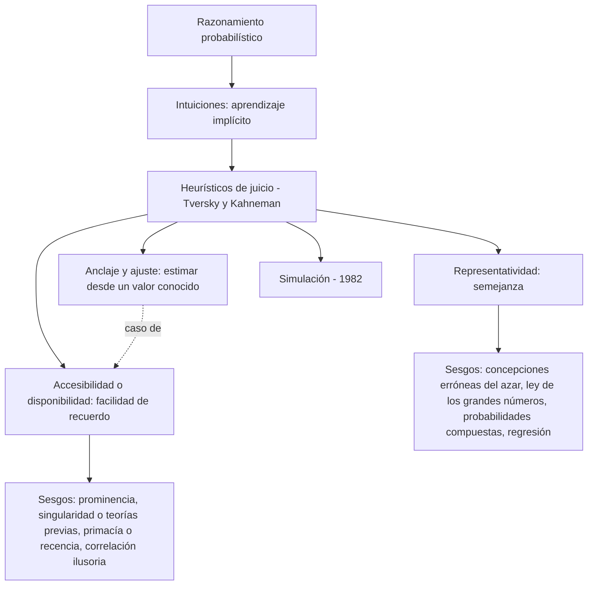
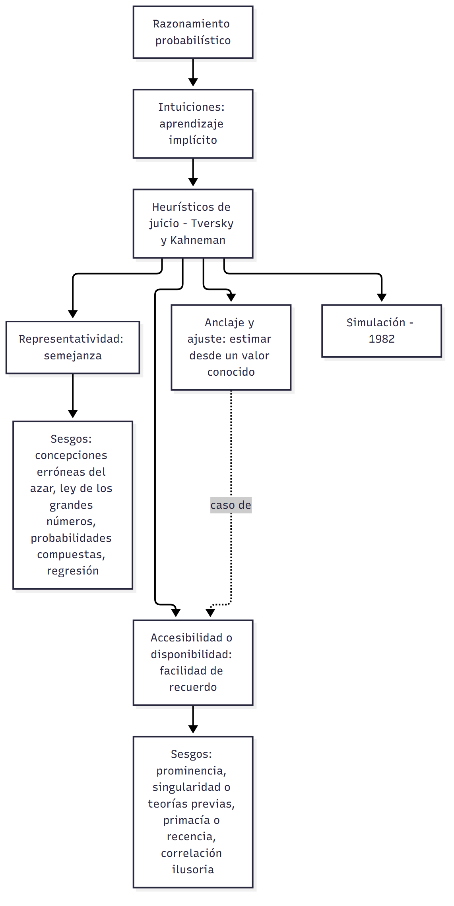

# U03 — Razonamiento probabilístico

> **Fuentes:**
>
> - Cárdenas Poveda, C. (2026c). *Razonamiento probabilístico y solución de problemas* [Diapositivas de clase: Pensamiento, Clase 03]. Procesos Básicos III, Universidad Favaloro.
> - Pérez Echeverría, M. P., y Bautista, A. (2014). Pensamiento probabilístico. En M. Carretero y M. Asensio (Coords.), *Psicología del pensamiento: Teoría y prácticas* (cap. 7, pp. 1-22). Alianza.
>
> **Materia:** Procesos Básicos III, 2.º año, Universidad Favaloro. Docente: Ps. Mg. Carolina Cárdenas Poveda. Unidad 3: Pensamiento.

> **Aviso sobre las fuentes:** (1) Las páginas de Pérez Echeverría y Bautista (2014) son las del PDF digitalizado (1-22), no las impresas del libro. (2) Esta guía cubre las diapositivas 1-12 de la Clase 03; las diapositivas 13-38 (solución de problemas) están en `U03_SolucionDeProblemas_Guia.md`. (3) Las diapositivas 7-10 traen solo el estímulo (palabras, fotos, un personaje), no la resolución. (4) El capítulo no trae enunciados de experimentos, porcentajes ni cálculos bayesianos (§5.4): si la docente los trabajó en clase, contrastalos con tu cuaderno.

> **Idea-fuerza:** Casi todo lo que pensamos a diario (prever, decidir, atribuir causas) es **razonamiento probabilístico**: un cálculo mental sobre la probabilidad de que algo ocurra u ocurrió, en un mundo incierto y cambiante. Ese razonamiento nace de **intuiciones** adquiridas por aprendizaje implícito y opera mediante **heurísticos** (representatividad, accesibilidad, anclaje y ajuste, simulación) que son rápidos y casi siempre útiles, pero producen **sesgos** sistemáticos. La teoría de Tversky y Kahneman que los describe fue revolucionaria pero recibió críticas experimentales, de universalidad y teóricas; Pérez Echeverría las reconduce a un problema de fondo: estudiar con métodos explícitos un conocimiento implícito.

## Hilo conductor: cómo se conectan los temas de esta guía

La pregunta de fondo del capítulo es **¿cómo razonamos cuando no hay certeza?** La respuesta tiene cuatro movimientos. Primero (§1-§2) hay que ubicar el objeto: el razonamiento probabilístico es un cálculo mental de probabilidades al servicio de actuar y decidir; a diferencia del deductivo (tareas cerradas, conclusión segura) trabaja con tareas abiertas e información cambiante, y está emparentado con la inducción. Oaksford y Chater llegan a proponer que la norma de la racionalidad no sea la lógica sino la probabilidad (bayesiana), porque describe mejor la vida cotidiana y reinterpreta como «razonables» muchos supuestos errores.

Segundo (§3), de dónde sale esa capacidad: Piaget la ubica en el pensamiento formal; Fischbein distingue intuiciones **primarias** (experiencia, aprendizaje implícito) y **secundarias** (instrucción); Hogarth agrega que el aprendizaje por experiencia sigue las leyes asociativas y no computa lo que no ocurre, y de ahí nacen los sesgos. Esa idea de intuición implícita es el puente hacia el tercer movimiento.

Tercero (§4-§6): el programa de Tversky y Kahneman describe esas intuiciones como **heurísticos de juicio**, atajos independientes de la cultura y del conocimiento matemático, no accesibles a la conciencia y apoyados en la racionalidad limitada de Simon. Los dos principales son la **representatividad** (juzgar por semejanza) y la **accesibilidad** (juzgar por facilidad de recuerdo); el anclaje y ajuste es un caso de accesibilidad y la simulación es el cuarto heurístico. Cada uno acierta cuando coincide con lo frecuente y produce **sesgos** cuando no.

Cuarto (§7-§10): se evalúa la teoría. Hay una paradoja (somos sensibles a las contingencias y a la vez erramos), tres grupos de críticas (presentación, universalidad, ambigüedad) y la lectura de la autora: el problema de fondo es medir con métodos explícitos algo implícito. Los expertos muestran que la intuición se puede educar, aunque no se libran de errores. La conclusión es que falta una teoría integradora.

> 🎯 **Para el parcial:** al explicar un heurístico, siempre cerrá con el trío **qué es → cuándo acierta → qué sesgo produce**. Y si te piden una valoración de Tversky y Kahneman, usá el esquema de dos tiempos: **aporte** (rompió la imagen del científico ingenuo) y luego **críticas** (tres grupos) con la lectura de la autora.

**En una sola oración:** razonamos probabilísticamente mediante intuiciones implícitas y heurísticos que casi siempre sirven y a veces generan sesgos, y entender cuándo y por qué exige integrar procesos implícitos y explícitos.

## 0. Hoja de ruta

1. **Qué es** el razonamiento probabilístico y en qué se diferencia del deductivo; su vínculo con la inducción y con un mundo incierto (§1).
2. **¿Racionalidad lógica o probabilística?** La propuesta de Oaksford y Chater de reemplazar la lógica por la probabilidad (bayesiana) como norma (§2).
3. **Origen** de la noción de probabilidad: Piaget (pensamiento formal), Fischbein (intuiciones primarias y secundarias) y Hogarth (intuición y aprendizaje por experiencia) (§3).
4. **Los heurísticos de juicio** de Tversky y Kahneman: qué son, por qué los usamos, tipos (§4).
5. **Representatividad** y sus sesgos (cuadros 7.1 y 7.2) (§5).
6. **Accesibilidad**, anclaje y ajuste, y sus sesgos; correlación ilusoria e ilusión de control (cuadro 7.3) (§6).
7. La **paradoja**: si somos sensibles a las contingencias, ¿por qué tantos errores? (§7).
8. **Críticas** a Tversky y Kahneman (cuadro 7.4) y la lectura de la autora: implícito vs explícito (§8).
9. **Expertos** y toma de decisiones probabilísticas (§9).
10. **Conclusiones**: falta una teoría integradora (§10).

## 🎯 Lo que entra sí o sí

1. **Definición** de razonamiento probabilístico y sus rasgos: cálculo mental de probabilidades; responde a una manera de concebir el mundo; adaptación a un mundo dinámico que no conocemos del todo; ligado a la **inducción** (de lo particular a lo general, varias conclusiones posibles) (Cárdenas Poveda, 2026c, diapositiva 2; Pérez Echeverría y Bautista, 2014, pp. 1–3).
2. **Heurístico** vs **algoritmo**: el heurístico es un procedimiento vago e impreciso (Cárdenas Poveda, 2026c, diapositiva 3; Pérez Echeverría y Bautista, 2014, p. 9).
3. **Los heurísticos de Tversky y Kahneman (1974)**: reglas básicas de inferencia probabilística de los adultos, independientes de la cultura, del conocimiento matemático y del contenido; reducen tareas complejas a juicios simples; rápidos y con poco esfuerzo; **no accesibles a la conciencia**. Los **sesgos** son errores sistemáticos derivados de su uso inapropiado (Cárdenas Poveda, 2026c, diapositiva 4; Pérez Echeverría y Bautista, 2014, pp. 9–10).
4. **Tipos**: representatividad, accesibilidad (o disponibilidad), anclaje y ajuste (Cárdenas Poveda, 2026c, diapositiva 5) — y simulación, agregado en 1982 (Pérez Echeverría y Bautista, 2014, p. 11).
5. **Representatividad** («la situación A se parece a la B, asumo que se comportarán de forma similar») y el **sesgo de insensibilidad a la probabilidad previa** (Cárdenas Poveda, 2026c, diapositivas 6–10; Pérez Echeverría y Bautista, 2014, pp. 11–13).
6. **Accesibilidad**: estimar la probabilidad por la facilidad con que vienen a la mente ejemplos o asociaciones; influida por familiaridad y prominencia; **anclaje y ajuste**: estimaciones a partir de un valor conocido (Cárdenas Poveda, 2026c, diapositiva 11; Pérez Echeverría y Bautista, 2014, pp. 13–15).
7. **Críticas a Tversky y Kahneman** en tres grupos (Cárdenas Poveda, 2026c, diapositiva 12; Pérez Echeverría y Bautista, 2014, pp. 16–18).

---

## 1. Qué es el razonamiento probabilístico

### 1.1 Un pensamiento omnipresente

Pérez Echeverría abre el capítulo interpelando al lector: **cada vez** que hace una previsión («mañana lloverá», «seguramente Ana llegará tarde», «pasemos a la otra acera», «las acciones en bolsa subirán el próximo año»), cada vez que toma una decisión («mejor poneos la chaqueta», «vayamos por el atajo», «conviene radiar al paciente») o cada vez que busca o atribuye una causa («se porta así porque se encuentra mal», «el grifo no funciona porque está demasiado viejo», «el balón se mueve porque lo has empujado»), está haciendo lo que los psicólogos llaman **razonamiento probabilístico** (Pérez Echeverría y Bautista, 2014, p. 1).

**Definición:** el razonamiento probabilístico consiste en hacer un **cálculo mental sobre las probabilidades** de que vayan a ocurrir unos determinados acontecimientos, o de que esos acontecimientos hayan ocurrido (Cárdenas Poveda, 2026c, diapositiva 2; Pérez Echeverría y Bautista, 2014, p. 1). Estas evaluaciones se hacen **para actuar, decidir, opinar, diagnosticar, criticar**, es decir, suelen insertarse en un marco de **juicios y toma de decisiones** más o menos explícitos (Pérez Echeverría y Bautista, 2014, p. 1).

> Nota de la fuente: durante la redacción, los autores contaban con una ayuda de investigación (SEJ2006-15639 C02-01) de la Secretaría de Estado de Universidades y de Investigación (MEC) (Pérez Echeverría y Bautista, 2014, p. 1).

### 1.2 Razonamiento deductivo vs razonamiento probabilístico

| | Razonamiento deductivo (proposicional, cap. 4; silogístico, cap. 5) | Razonamiento probabilístico |
|---|---|---|
| Tipo de tarea | **Cerrada y bien delimitada** | **Abierta**, no muy bien delimitada |
| Reglas | Las reglas más adecuadas están muy claras, independientemente de cómo resolvamos cada uno | — |
| Información | Restringida a la información dada previamente; hay que hacer explícitas relaciones implícitas, **sin añadir información ni generalizar** | La información **varía temporalmente** |
| Certeza | Si lo hacemos bien, la conclusión es **segura** | **Nunca** podemos estar seguros de que la predicción se cumpla, de que la decisión sea correcta o de que no haya otras causas posibles del efecto que queremos explicar |

(Pérez Echeverría y Bautista, 2014, p. 2)

Todas las características del razonamiento probabilístico se relacionan con el **pensamiento inductivo**. Tradicionalmente:
- **Deducción**: razonamiento que va de lo **general a lo particular**.
- **Inducción**: el proceso contrario, de lo **particular a lo general**: proceso de **generalización** por el cual se obtienen reglas generales a partir de un número de situaciones concretas en las que apareció la regla, o se analizan los elementos comunes de distintas situaciones para determinar cuál es más probable que aparezca (Pérez Echeverría y Bautista, 2014, p. 2).

La docente lo sintetiza: el razonamiento probabilístico está relacionado con el inductivo, que «extrae conclusiones desde lo particular a lo general» y admite **varias conclusiones posibles** (Cárdenas Poveda, 2026c, diapositiva 2).

### 1.3 Un pensamiento adaptado a un mundo incierto

Para varios autores (Holyoak y Nisbett, 1988; Oaksford y Chater, 2007), tanto los procesos inductivos como los probabilísticos responden a la necesidad de enfrentarnos a un mundo de hechos **muy variados y de carácter probable**, y a la **incertidumbre** que ese mundo provoca. Oaksford y Chater (2007, página 67 de su libro) sostienen que el pensamiento humano está muy bien adaptado al carácter incierto del razonamiento cotidiano, que necesita integrar y aplicar enormes cantidades de conocimiento sobre el mundo a un contexto **conocido solo parcialmente y rápidamente cambiante** (Pérez Echeverría y Bautista, 2014, p. 2).

Por tanto, el pensamiento probabilístico estaría **determinado por la necesidad de adaptarnos a un mundo dinámico**, en el que la información se modifica continuamente y que no podemos conocer en su totalidad (Cárdenas Poveda, 2026c, diapositiva 2; Pérez Echeverría y Bautista, 2014, p. 2). Respondería a una determinada estructura de la realidad o, más cautamente, a **una determinada manera de concebir el mundo y la realidad** (Cárdenas Poveda, 2026c, diapositiva 2; Pérez Echeverría y Bautista, 2014, p. 2):
- En los **siglos precedentes**, la realidad o el universo se entendía como el resultado ordenado de una **mente todopoderosa**.
- Desde el **siglo XX**, el mundo se entiende como **una posibilidad**, un conjunto de relaciones entre **azar y necesidad**, es decir, relaciones probables o probabilísticas (Gigerenzer y Murray, 1987) (Pérez Echeverría y Bautista, 2014, pp. 2–3).

Así, las **ciencias** del siglo pasado abandonaron la búsqueda de verdades generales para volverse **ciencias probabilísticas**, cuyas teorías responden a un paradigma y a un estado de conocimientos, y donde la **estadística** cumple un papel fundamental para computar y distinguir lo conocido de lo desconocido, lo certero de lo probable (la autora remite a los volúmenes de Krüger, Daston y Heidelberger, 1987, y Krüger, Gigerenzer y Morgan, 1987) (Pérez Echeverría y Bautista, 2014, p. 3).

Pero no solo los científicos: todos los que nos adaptamos cotidianamente a ese mundo debemos **percibir y computar la variabilidad**. Si el mundo es probabilístico, cabe esperar que la **evolución** haya dotado a la mente animal y humana de los procesos necesarios para enfrentarlo. Por eso, al menos desde **Rescorla (1968)**, el **condicionamiento** se entiende en función de **cómputos implícitos de contingencia** (cómputos probabilísticos) y no simplemente de **contigüidad** (Pérez Echeverría y Bautista, 2014, p. 3).

### 1.4 La doble relación con la incertidumbre (Holyoak y Nisbett, 1988)

Los procesos inductivos se relacionan con la incertidumbre en **dos sentidos** (Pérez Echeverría y Bautista, 2014, p. 3):
1. Toda representación mental debe **tener en cuenta la variabilidad** del mundo, que produce incertidumbre. En este sentido, el razonamiento probabilístico habría surgido de largos años de **selección y adaptación** a un mundo probable (Gigerenzer, 1996; Gigerenzer, Todd y grupo ABC, 1999).
2. Ese conocimiento de la variabilidad debe usarse para **reducir la incertidumbre**.

Por eso el pensamiento inductivo —y en consecuencia el probabilístico— incluye **tanto formas de percibir, computar y representar** las variables externas **como una manera de trabajar esa variabilidad para reducirla y actuar sobre el mundo** (Pérez Echeverría y Bautista, 2014, p. 3).

> 🔑 **Punto clave:** razonamiento probabilístico = cálculo mental de probabilidades al servicio de actuar y decidir, en tareas abiertas y sin certeza; es una forma de inducción y una adaptación a un mundo incierto.

---

## 2. ¿Una racionalidad probabilística?

### 2.1 La probabilidad como norma y como modelo

Pensamiento inductivo y probabilístico **no son exactamente lo mismo**: el razonamiento probabilístico puede entenderse como **un tipo** de razonamiento inductivo (Holyoak y Nisbett, 1988, incluyen dentro de los mecanismos inductivos la formación de categorías y conceptos, el aprendizaje, etc., que exceden el razonamiento probabilístico aunque tengan carácter probabilístico) (Pérez Echeverría y Bautista, 2014, p. 3). Pero las **leyes de la probabilidad** parecen subyacer a ambos: tendrían en las tareas probabilísticas un papel **similar al de las leyes de la lógica en las tareas deductivas** (Pérez Echeverría y Bautista, 2014, pp. 3–4).

Las teorías matemáticas de la probabilidad son, a la vez (Pérez Echeverría y Bautista, 2014, p. 4):
- un **modelo normativo o prescriptivo** sobre cómo *deben* realizarse las inferencias inductivas o probabilísticas, y
- un **modelo teórico** de los procesos mentales con los que enfrentamos la incertidumbre, equivalente a la racionalidad lógica de los teóricos racionalistas (la autora remite al apartado 3.1 del cap. 3, los caps. 4 y 5, el último capítulo de De Vega, 1984, y Delval, 1977).

### 2.2 Racionalidad lógica vs racionalidad probabilística

Ambas tienen **estatus teórico diferente** (Cohen, 1981) (Pérez Echeverría y Bautista, 2014, p. 4):
- La **racionalidad lógica** tiene detrás una **larga historia**, avalada por numerosas teorías filosóficas y psicológicas.
- Las **teorías de la probabilidad** son mucho **más recientes** —su origen puede situarse en **Laplace** (1798/1878; 1814)— y sus principios han estado muy **discutidos** (p. ej., diferencias entre teorías **frecuentistas** y **bayesianas** en Hacking, 1975, 1990; Kolmogorov, 1956).

### 2.3 La propuesta de Oaksford y Chater (2007)

Pese a esas diferencias, **Oaksford y Chater (2007)** sostienen que debemos **cambiar la idea de racionalidad lógica por la de racionalidad probabilística**, más concretamente **bayesiana**. Sus argumentos (Pérez Echeverría y Bautista, 2014, pp. 4–5):

1. **La lógica sirve como norma solo para pocas tareas**, las ligadas a una concepción científica o formal del pensamiento (cap. 1). El razonamiento probabilístico abarca, en cambio:
   - el razonamiento **cotidiano** y las inferencias que hacemos sin percatarnos;
   - la toma de decisiones complejas y de riesgo **personal** (comprar una casa, cambiar de empleo);
   - y **profesional** (diagnosticar en medicina, psicología, economía, juicios; decisiones policiales, de bomberos, pilotos de avión).
   Por tanto, es **más representativo** de las actividades humanas que el razonamiento lógico (Pérez Echeverría y Bautista, 2014, p. 4).
2. Las teorías de la probabilidad **explicarían mejor que cualquier regla lógica** buena parte de los **sesgos** cometidos en tareas lógicas (caps. 4 y 5), especialmente en la **tarea de selección o de las cuatro tarjetas** de **Wason** (1968; Wason y Johnson-Laird, 1972) (Pérez Echeverría y Bautista, 2014, p. 4). Esta idea estaría avalada por trabajos experimentales (Oaksford y Chater, 1994, 2003; Oaksford y Moussakowski, 2004; Schroyens y Schaeken, 2003; Yama, 2001) (Pérez Echeverría y Bautista, 2014, p. 4).
3. Lo que desde la lógica parece **error** es una **inferencia «razonable»** si se lo mira desde los **objetivos de la tarea** o desde la teoría de las probabilidades. Lejos de la imagen de **error e incapacidad humana** que muestra la investigación sobre razonamiento, **la mayoría de las personas toman decisiones adecuadas en la mayoría de las situaciones** (Pérez Echeverría y Bautista, 2014, p. 5).
4. Así como las teorías **logicistas** fueron compatibles con buena parte de las teorías psicológicas del siglo XX (p. ej., el modelo de desarrollo de **Piaget** —Inhelder y Piaget, 1955; Carretero, 1985, cap. 9— o los modelos clásicos del procesamiento de la información —Rivière, 1986—; sobre logicismo ver Bolton, 1972; Delval, 1977a y b; Rivière, 1986, 1987, 1991; De Vega, 1981, 1982), las teorías de la probabilidad son **más compatibles con los modelos psicológicos actuales**, especialmente los **neoconexionistas**, la **inteligencia artificial** y la **semántica del lenguaje** (Pérez Echeverría y Bautista, 2014, p. 5).

**Resumen de la autora:** el razonamiento probabilístico **subyace a la mayor parte de nuestras actividades mentales**, nos da herramientas para enfrentar la incertidumbre y, si aceptamos a Oaksford y Chater, esas herramientas llevan a **soluciones adecuadas y razonables**, lo que permite concebirnos de forma **más positiva** que el resto de los trabajos sobre pensamiento. Aunque «errar es humano» (**Norman, 1988**), **decidir qué es un error depende de los objetivos y metas** que nos proponemos y de si se alcanzaron: depende más de adaptarnos eficazmente a la incertidumbre y variabilidad ambiental que de seguir reglas prefijadas, fruto de una construcción cultural, formal (Pérez Echeverría y Bautista, 2014, p. 5).

### 2.4 Las preguntas que abre

Este razonamiento aparece en situaciones muy diversas: el **condicionamiento** y el **aprendizaje implícito**; las **inferencias cotidianas** de las que no somos conscientes (**inferencias implícitas**, en términos de **Rumelhart, 1984**); las decisiones de **profesionales** que requieren gran cantidad de conocimiento y reflexión consciente; y muchas situaciones intermedias. La autora pregunta: ¿es lo mismo una situación que otra? ¿Hay un razonamiento probabilístico general? ¿De dónde surge? ¿Su origen es el aprendizaje implícito? ¿Podemos explicitarlo, modificarlo, aprender de él? Aclara que no pretende una revisión exhaustiva sino un **panorama general** (Pérez Echeverría y Bautista, 2014, pp. 5–6).

---

## 3. El origen del razonamiento probabilístico

Varias teorías buscan el origen de la noción de probabilidad en ámbitos distintos: el **desarrollo piagetiano**, las **leyes de la asociación** que sustentan el aprendizaje implícito, las huellas del **aprendizaje escolar** (Pérez Echeverría y Bautista, 2014, p. 6).

### 3.1 Piaget: la probabilidad como esquema formal

Los trabajos sobre probabilidad fueron iniciados por **Piaget** (Piaget, 1950; Piaget e Inhelder, 1951; Inhelder y Piaget, 1955) (Pérez Echeverría y Bautista, 2014, p. 6):
- El razonamiento probabilístico forma parte de los **ocho esquemas formales** que aparecen en la **adolescencia** (cap. 1).
- **Azar** y **probabilidad** interesaban a los ginebrinos porque ambas resultan de la **relación entre lo posible y lo real**. Una característica funcional del pensamiento formal es que «lo real es subconjunto de lo posible» (Inhelder y Piaget, 1955; Carretero, 1985).
- Calcular probabilidades es convertir esa relación entre **lo real** (lo que puedo controlar, de lo que tengo alta certidumbre) y **lo posible** (lo que no puedo controlar, incierto y variable) en un **cálculo matemático o razonamiento lógico**.
- Por eso el concepto de probabilidad y el razonamiento probabilístico **no pueden comprenderse plenamente hasta que se construyen las operaciones formales**. Sin embargo, su desarrollo se rastrea desde edades tempranas, a medida que se forman los esquemas de **permutaciones, combinaciones, función, proporción**, que anteceden al concepto de probabilidad (resumen en Pérez Echeverría, 1990).

La autora no se detiene a criticar la teoría de las operaciones formales (las críticas a la visión logicista del cap. 1 serían aplicables), pero destaca **dos aspectos** (Pérez Echeverría y Bautista, 2014, pp. 6–7):
1. Las dificultades que Piaget analizó teóricamente para comprender la probabilidad son **muy similares a las que encuentran los profesores de matemáticas** al enseñarla (Green, 1979, 1983a y b, 1987, 1988; Pérez Echeverría, 1990; Pérez Echeverría y Gambara, 1998; Pérez Echeverría y Scheuer, 2005; Sáenz de Castro, 1995; Shaughnessy, 1983, 1992). El análisis piagetiano de los componentes de un esquema sigue siendo **muy válido**.
2. Comprender las teorías matemáticas de la probabilidad **requiere un pensamiento similar al formal** piagetiano, sea fruto del **desarrollo intelectual** (Piaget) o de una **instrucción deliberada y consciente**. Esta última opinión concuerda con **Fischbein (1975)**.

### 3.2 Fischbein (1975): intuiciones primarias y secundarias

Fischbein distingue la **intuición primaria** de la probabilidad de la **intuición secundaria**:

| | **Intuiciones primarias** | **Intuiciones secundarias** |
|---|---|---|
| Naturaleza | Ligadas a la **acción**; tienen rasgos cognitivos definidos **antes** de traducirse a términos simbólicos; **programas de acción motores o simbólicos** | Las **teorías de la probabilidad** como relación entre lo posible y lo necesario |
| Origen | La **experiencia física y social** con el mundo; nuestra conducta es **probabilística por naturaleza** porque nos adaptamos a un mundo incierto, probable y azaroso; en términos actuales, el **aprendizaje implícito** (Dienes y Perner, 1999; Pozo, 2001, 2003; Reber, 1993, 1995; Tubau y Moliner, 1999) | Un **período sistemático de instrucción** que permite superar las primarias mediante un **verdadero esfuerzo cognitivo** |

(Pérez Echeverría y Bautista, 2014, p. 7)

**Dos conclusiones** del trabajo de Fischbein (Pérez Echeverría y Bautista, 2014, pp. 7–8):

1. **Anticipa los trabajos sobre cambio conceptual** (Gómez Crespo, Pozo y Sanz, 1995; Gómez Crespo y Pozo, 2005; Limón y Carretero, 1999; Pozo, Gómez Crespo y Sanz, 1990; cap. 2). Como en ellos, **solo la instrucción** permitiría superar las intuiciones primarias (o concepciones erróneas, teorías previas, teorías alternativas, como se las llame). La experiencia, junto con las **restricciones de nuestro sistema cognitivo** (Pozo, 2001, 2003), nos permite aprender reglas que aplicamos de manera **tácita**; según Fischbein, esas reglas son el **punto de partida** para alcanzar las reglas matemáticas. Pero, también como en el cambio conceptual, la **fuerza y eficacia de las intuiciones primarias** (del pensamiento implícito sobre el explícito) hace que la instrucción **no baste para modificarlas totalmente**: ese es el resultado de **Fischbein y Gazit (1984)** tras un cuidadoso trabajo de instrucción sobre probabilidad matemática, basado en las intuiciones primarias y dirigido a **niños de diferentes edades**. Se reinterpreta hoy desde la **primacía de las representaciones implícitas** y las dificultades del cambio conceptual (Pozo, 2003; cap. 2). Resultados similares en Shaughnessy (1992) y Pérez Echeverría y Gambara (1998).
2. La descripción de las intuiciones primarias es **muy similar a los sesgos** que **Tversky y Kahneman (1974)** describieron en adultos (Scholz y Waller, 1983), y a ciertos errores descritos por Piaget como **error de recencia negativa o falacia del jugador** (Piaget, 1950; Piaget e Inhelder, 1951).

Por tanto, según Fischbein, entender y controlar el mundo probabilístico depende **a la vez** de las **intuiciones** adquiridas por la experiencia y de los **conocimientos específicos** adquiridos mediante enseñanza, gracias a esfuerzos deliberados y conscientes (Pérez Echeverría y Bautista, 2014, p. 8).

### 3.3 Hogarth (2001): la intuición y el aprendizaje por experiencia

**Hogarth (2001)** coincide con Fischbein en el carácter **intuitivo** del origen del razonamiento probabilístico (Pérez Echeverría y Bautista, 2014, p. 8):
- **Respuesta intuitiva**: la que se obtiene **sin esfuerzo, sin deliberación y habitualmente sin conciencia**.
- Las intuiciones son resultado del **aprendizaje por experiencia**, que también es **automático**: establecemos **conexiones entre las cosas que ocurren juntas**, y esas conexiones se fortalecen en la memoria en función de la «predisposición genética, la motivación y la frecuencia» (Hogarth, 2001, página 109 de la traducción castellana) (Pérez Echeverría y Bautista, 2014, p. 8).
- Es decir, el aprendizaje por experiencia sigue las **viejas reglas del aprendizaje asociativo** —**semejanza, contigüidad y frecuencia**— en función de nuestras restricciones genéticas e intereses, lo que parece ser la base del aprendizaje implícito (Pozo, 2001, 2003; Reber, 1993, 1995; Tubau y Moliner, 1999).
- Esas conexiones son la base tanto de nuestras **inferencias probabilísticas** como de nuestras **creencias**; provienen de nuestras experiencias con acontecimientos o personas, o fueron **socialmente transmitidas de manera tácita**.

**El punto decisivo:** el aprendizaje se produce a partir de **lo que ocurre**. **Lo que no ocurre** —lo que no percibimos o atendemos— **no se computa** y no forma parte de nuestras intuiciones. Sin embargo, para las leyes matemáticas de la probabilidad, para la ciencia o para el pensamiento formal piagetiano, esos **acontecimientos que no ocurren son fundamentales**: constituyen **el mundo de lo posible**. Su ausencia en el aprendizaje basado en la experiencia **da lugar a buena parte de los sesgos y errores** de los juicios probabilísticos (Pérez Echeverría y Bautista, 2014, pp. 8–9).

Según Hogarth, esos errores **pueden superarse o al menos reducirse**, porque existen también **otras intuiciones**, fruto de la **automatización o interiorización de conocimientos aprendidos deliberadamente**. El conocimiento intuitivo **se puede y se debe educar**, ya que es un proceso de toma de decisiones **muy eficaz y de muy bajo costo cognitivo**. Aquí coinciden Hogarth y Fischbein (Pérez Echeverría y Bautista, 2014, p. 9).

> 🔑 **Punto clave:** el razonamiento probabilístico nace de intuiciones implícitas (asociativas: semejanza, contigüidad, frecuencia) que no computan lo que no ocurre; de ahí los sesgos. La instrucción puede generar intuiciones «secundarias», pero no elimina del todo las primarias.

---

## 4. Las intuiciones probabilísticas: los procesos heurísticos

### 4.1 Qué es un heurístico

Algunas intuiciones descritas por Fischbein o Hogarth son muy similares a los sesgos provocados por los **«heurísticos de juicio»** de **Tversky y Kahneman** (Pérez Echeverría y Bautista, 2014, p. 9). Estos heurísticos serían las **reglas básicas de inferencia probabilística utilizadas por los adultos**, **independientemente** de (Cárdenas Poveda, 2026c, diapositiva 4; Pérez Echeverría y Bautista, 2014, p. 9):
- nuestra **cultura**,
- nuestro **conocimiento sobre las leyes matemáticas de la probabilidad**,
- el **contenido** que estemos analizando.

(Para ampliar, la autora remite a la compilación de Kahneman, Slovic y Tversky, 1982; el artículo seminal de Tversky y Kahneman, 1974, traducido en Carretero y García Madruga, 1984; y revisiones en castellano: Carretero y Pérez Echeverría, 1988; Fernández Berrocal, 2004; García Madruga y Carretero, 1986; Pérez Echeverría, 1990; Tubau, 2005) (Pérez Echeverría y Bautista, 2014, p. 9).

**Origen del término:** la psicología tomó prestada la palabra **heurístico** de las **matemáticas**, donde los heurísticos son **procedimientos de solución de problemas que se diferencian de los algoritmos por su vaguedad y falta de precisión**. Esa idea de métodos vagos y poco definidos está presente en psicología tanto en los **métodos intuitivos de enfrentarse a la probabilidad** como en la **solución de problemas** (caps. 8 y 9) (Cárdenas Poveda, 2026c, diapositiva 3; Pérez Echeverría y Bautista, 2014, p. 9).

→ conecta con `U03_SolucionDeProblemas_Guia.md` (heurísticos vs algoritmos como formas de recorrer el espacio del problema).

### 4.2 Raíz teórica: la racionalidad limitada de Simon

Según **Sherman y Corty (1984)**, todas las teorías que hacen análisis heurísticos se basan en la **racionalidad limitada** popularizada por **Simon** (1955, 1956), punto de partida de buena parte de las teorías cognitivas del procesamiento de la información (Pérez Echeverría y Bautista, 2014, pp. 9–10):
- Las **limitaciones estructurales** del procesamiento hacen que incorporemos mecanismos para enfrentar la complejidad del mundo, aunque no la reduzcan del todo.
- Los **juicios heurísticos** son mecanismos que **reducen la incertidumbre**, producto de nuestra limitación ante la complejidad de los estímulos, **a una dimensión manejable** por nuestro sistema. También parten de que el mundo tiene **estructura probabilística** (Pérez Echeverría y Bautista, 2014, p. 10).
- Según **Hogarth (1980)**, esas limitaciones se relacionan con (Pérez Echeverría y Bautista, 2014, p. 10):
  1. los **procesos atencionales** (selección de información);
  2. los **procesos de memoria**, que construyen o distorsionan los recuerdos;
  3. las limitaciones de la **memoria de trabajo**, que impiden tener en cuenta muchos elementos al resolver tareas o valorar evidencias.

### 4.3 Características de los heurísticos

- Son **principios generales que reducen tareas complejas a simples juicios** (Cárdenas Poveda, 2026c, diapositiva 4; Pérez Echeverría y Bautista, 2014, p. 10).
- **No** implican un análisis exhaustivo: **enfatizan ciertas características** de los datos e **ignoran otras** (Pérez Echeverría y Bautista, 2014, p. 10).
- Son **«reglas de andar por casa»** (De Vega, 1984) (Pérez Echeverría y Bautista, 2014, p. 10).
- Como simplifican, nos llevan a **decisiones razonables con muy poco esfuerzo** (Pérez Echeverría y Bautista, 2014, p. 10) — «en muy poco tiempo y con poco esfuerzo» (Cárdenas Poveda, 2026c, diapositiva 4).
- Pero pueden llevar a **conclusiones erróneas cuando se usan indiscriminadamente** (Nisbett y Ross, 1980) (Pérez Echeverría y Bautista, 2014, p. 10). La mayor parte de la literatura se centró en esas conclusiones erróneas, en la **irracionalidad** de «dejarnos llevar» por estos principios. Sin embargo, esa **aplicación indiscriminada es el fundamento** mismo de la concepción heurística (Sherman y Corty, 1984) (Pérez Echeverría y Bautista, 2014, p. 10).
- **No son accesibles a la conciencia** (Cárdenas Poveda, 2026c, diapositiva 4; Pérez Echeverría y Bautista, 2014, p. 10): si son fruto del aprendizaje asociativo y responden a la **cognición implícita**, difícilmente podemos decidir cuándo usamos o no un heurístico. Incluso si fuéramos conscientes de que una inferencia es incorrecta (teórica o pragmáticamente), **nadie puede reconstruir por sí solo** el proceso que lo llevó a esa predicción ni determinar en qué momento su juicio se equivocó (Pérez Echeverría y Bautista, 2014, p. 10).
- **Bien adaptados**: si son fruto de la **selección natural** y la adaptación (Gigerenzer, 1996; Gigerenzer, Todd y grupo ABC, 1999; Oaksford y Chater, 2007), cabe esperar que resuelvan un buen número de problemas (Pérez Echeverría y Bautista, 2014, pp. 10–11).
- Para **Nisbett y Ross (1980)** —todavía una de las obras más amplias sobre heurísticos en **psicología social**— son reglas **relativamente razonables, aunque no racionales**, que permiten juicios adecuados muchas veces. **Aun asumiendo el costo de los errores**, dan **más ventajas a la larga** que el uso continuo de normas, por el esfuerzo que ahorran y porque están **más adaptados a los objetivos cotidianos** (Pérez Echeverría y Bautista, 2014, p. 11).
- **Hogarth (2001)**: seguimos usando heurísticos **incluso cuando la decisión es muy sencilla** y no excede nuestra capacidad de cómputo (Pérez Echeverría y Bautista, 2014, p. 11).
- Las personas intentan **resolver problemas concretos** en situaciones determinadas; **su objetivo no es hallar la verdad**, y para eso las inferencias heurísticas suelen bastar (Nisbett y Ross, 1980) (Pérez Echeverría y Bautista, 2014, p. 11).
- Implican una **selección del procesamiento** en las fases de **atención** y **recuerdo**, que depende del **tipo de juicio** y de la **accesibilidad relativa** de la información. Los heurísticos se categorizan según estos parámetros: **tipo de acceso a la información** y **tipo de procesos cognitivos** implicados (Pérez Echeverría y Bautista, 2014, p. 11).

**Sesgos:** son los **errores sistemáticos derivados de la utilización inapropiada de heurísticos** (Cárdenas Poveda, 2026c, diapositiva 4).

### 4.4 Tipos de heurísticos

Tversky y Kahneman (1974) dividieron los heurísticos en **tres tipos** (Cárdenas Poveda, 2026c, diapositiva 5; Pérez Echeverría y Bautista, 2014, p. 11):
1. **Representatividad**.
2. **Accesibilidad** (o **disponibilidad**).
3. **Anclaje y ajuste** — casi no recibió investigación y, según algunos (De Vega, 1984), es **un caso del heurístico de accesibilidad**.

En **1982** agregaron un cuarto: la **simulación** (Pérez Echeverría y Bautista, 2014, p. 11). El capítulo desarrolla los dos más importantes: representatividad y accesibilidad.

**Sobre el nombre:** algunos autores traducen *availability heuristic* como «**heurístico de disponibilidad**»; Pérez Echeverría prefiere «**accesibilidad**» porque es la empleada en la traducción del artículo de Tversky y Kahneman (1974) y porque la idea de «fácil acceso» le parece más acorde con el heurístico que la de «disponible» (Pérez Echeverría y Bautista, 2014, p. 14, nota 8). La docente usa ambos términos (Cárdenas Poveda, 2026c, diapositivas 5 y 11).

---

## 5. El heurístico de representatividad

### 5.1 Definición

Para Tversky y Kahneman (1971, 1974, 1982) y Kahneman y Tversky (1972, 1973), la **representatividad** es **la relación entre un proceso o un modelo y algún ejemplo o acontecimiento relacionado con ese modelo** (Cárdenas Poveda, 2026c, diapositiva 6; Pérez Echeverría y Bautista, 2014, p. 11). La docente lo traduce así: «Situación A se parece a situación B, asumo que se comportarán de forma similar» (Cárdenas Poveda, 2026c, diapositiva 6).

- Esa relación se valora por el **grado de semejanza** entre los acontecimientos evaluados (Pérez Echeverría y Bautista, 2014, p. 11).
- Es **direccional**: permite valorar en qué medida **una muestra es representativa de un modelo**, pero no a la inversa. Aunque **a veces es reversible** y se juzga la representatividad del modelo en función de la muestra (Tversky y Kahneman, 1982) (Pérez Echeverría y Bautista, 2014, p. 11).
- Evaluar probabilidad o causalidad por representatividad es usar una de las **viejas leyes de la asociación**: la **semejanza** (Pérez Echeverría y Bautista, 2014, pp. 11–12).

### 5.2 Representatividad y categorización

Atribuir probabilidad o causalidad por semejanza es, según Tversky y Kahneman (1982), un proceso **equivalente al de categorizar** (Pérez Echeverría y Bautista, 2014, p. 12):
- Un ejemplo es **representativo de una categoría** cuando tiene los mismos **rasgos principales** que comparten los miembros **prototípicos** y no tiene otros rasgos principales no compartidos por ellos (Rosch, 1975; Tversky, 1977).
- Los ejemplos más prototípicos se **recuerdan mejor y se reconocen más fácilmente** que los menos representativos, **aunque estos sean más frecuentes** (Mervis y Rosch, 1981; Rosch y Mervis, 1975).
- Pero no usamos la representatividad solo para la pertenencia categorial: también para **predecir resultados**, **establecer causas** y, en definitiva, como instrumento de **inferencia probabilística**. Usamos los mismos mecanismos para valorar **patrones estáticos** (categorización) que para hacer atribuciones sobre la **estructura temporal** y la relación entre sucesos (De Vega, 1984).

**Cuadro 7.1 — Situaciones en las que actúa el heurístico de representatividad** (Tversky y Kahneman, 1982) (Pérez Echeverría y Bautista, 2014, p. 12). Hay **cuatro casos** (M = modelo; X = lo evaluado):

| # | M | X |
|---|---|---|
| 1 | una **clase** | una **variable o valor** definido en esa clase |
| 2 | una **clase** | un **ejemplo** de esa clase |
| 3 | una **clase** | un **subconjunto** de esa clase |
| 4 | un **sistema causal** | una **posible consecuencia** |

### 5.3 Cuándo acierta y cuándo falla

- Juzgar por representatividad da respuestas **conformes a la normativa bayesiana en numerosas ocasiones**, porque **los hechos más representativos son habitualmente los más frecuentes y los más probables** (Pérez Echeverría y Bautista, 2014, p. 12).
- Pero produce **numerosos sesgos** porque **hay factores que afectan a la representatividad y no a la probabilidad, y viceversa** (Pérez Echeverría y Bautista, 2014, p. 12).
- Según Kahneman y Tversky (1982a y b), estos errores **no se deben a falta de comprensión de las normas estadísticas**: esa comprensión no se ve afectada por los rasgos de representatividad, y **expertos en estadística e investigadores**, que muestran conocer esas leyes en sus trabajos, también cometen sesgos en sus juicios cotidianos **e incluso en algunas investigaciones** (Tversky y Kahneman, 1971) (Pérez Echeverría y Bautista, 2014, p. 12).

### 5.4 Los sesgos de representatividad (cuadro 7.2)

**Cuadro 7.2 — Errores más habituales producidos por el heurístico de representatividad** (Pérez Echeverría y Bautista, 2014, p. 13):

1. **Concepciones erróneas sobre el azar**
   - Falacia del jugador
   - Confusiones entre el **proceso** aleatorio y el **producto** aleatorio
   - Hacer equivalente **aleatorio** con **«caótico»** o desordenado
2. **Confusión en la utilización de la ley de los grandes números**
   - Falacia del jugador
   - Creer que **muestra y población se parecen en todos los aspectos**
   - No tener en cuenta el **tamaño de la muestra**
3. **Problemas con las probabilidades compuestas**
   - Falacia de la **conjunción**
   - Falacia de la **disyunción**
   - **No tener en cuenta las probabilidades previas**
4. **Problemas en la comprensión del concepto de regresión**

(Ojo: la **falacia del jugador** figura en dos grupos, 1 y 2.)

**Las tres fuentes fundamentales de estos errores** (Pérez Echeverría y Bautista, 2014, p. 13):
1. **Confusión entre proceso y producto**: solo se ve como aleatorio lo que **aparentemente no está ordenado o es confuso**. Se exige una **semejanza entre producto y proceso**, que obviamente no responde a las reglas de la probabilidad.
2. **Sobregeneralización de las normas**: aplicamos las normas incluso cuando no son válidas. Aunque el **tamaño de la muestra** o las **probabilidades previas** influyen en las normas probabilísticas, hacemos predicciones **sin tener en cuenta estos rasgos**.
3. **Reglas contraintuitivas**: ciertas reglas estadísticas, como la **regresión**, son claramente contraintuitivas porque implican que **aquello que para nosotros tiene una clara causa puede ser aleatorio**.

> ⚠️ **Lo que la fuente no trae:** Pérez Echeverría **no describe ni ejemplifica cada error** porque «nos llevaría un espacio excesivo»; remite a la descripción de Tversky y Kahneman (1974, traducida al castellano), a Carretero y García Madruga (1986), a Pérez Echeverría (1990) y a «un libro muy divertido» de **Sutherland (1999)** (Pérez Echeverría y Bautista, 2014, p. 13, nota 7). Por eso el capítulo **no incluye enunciados de experimentos, porcentajes de respuesta ni cálculos bayesianos** (como el problema de los taxis): esta guía no los agrega para no meter contenido ajeno a la bibliografía. Si la docente los trabaja en clase, buscalos en esas obras.

### 5.5 Los ejemplos de la clase (Cárdenas Poveda, 2026c, diapositivas 7–10)

La docente ilustró el heurístico con material visual para trabajar en clase; las diapositivas traen **solo el estímulo**, no la resolución:
- **Diapositiva 7:** tres palabras sueltas: **«Ferrari»**, **«Tokio»**, **«Médico»** (Cárdenas Poveda, 2026c, diapositiva 7).
- **Diapositivas 8 y 9:** la foto de **un mismo hombre mayor** fotografiado de pie: en la 8, vestido con **camisa a rayas y jean**; en la 9, en ropa interior y con **el cuerpo completamente tatuado** (Cárdenas Poveda, 2026c, diapositivas 8–9). Las diapositivas no traen texto; leído desde el capítulo, el contraste sirve para ver cómo la impresión que nos formamos de alguien (a qué «categoría» lo asignamos) cambia según los rasgos visibles: es la lógica de la semejanza con un prototipo (Pérez Echeverría y Bautista, 2014, p. 12).
- **Diapositiva 10 — «Sesgo de insensibilidad a la probabilidad previa de los resultados»:** dibujo de un personaje descrito como **tímido, introvertido, colaborador, poco sociable, ordenado, detallista**, con un video de apoyo (minuto 2:18) (Cárdenas Poveda, 2026c, diapositiva 10). La diapositiva no trae la resolución; leído desde el capítulo, el nombre del sesgo corresponde, en el cuadro 7.2, a **«no tener en cuenta las probabilidades previas»** (grupo 3, problemas con las probabilidades compuestas) (Pérez Echeverría y Bautista, 2014, p. 13): juzgar a qué grupo pertenece alguien por **cuánto se parece su descripción** al estereotipo del grupo, **ignorando cuán frecuente es cada grupo** —un factor que afecta a la probabilidad pero no a la representatividad (Pérez Echeverría y Bautista, 2014, p. 12)—.

> 🔑 **Punto clave:** representatividad = juzgar probabilidad o causa por **semejanza** con un modelo o prototipo. Acierta cuando lo representativo coincide con lo frecuente; falla cuando hay factores (tamaño muestral, probabilidades previas, regresión, azar) que pesan en la probabilidad pero no en la semejanza.

---

## 6. El heurístico de accesibilidad (o disponibilidad) y el de anclaje y ajuste

### 6.1 Definición

- Por **representatividad** medimos la **semejanza o distancia connotativa** entre un acontecimiento y nuestras teorías más o menos implícitas sobre cómo es ese tipo de sucesos. Pero también podemos evaluar la **distancia asociativa** o **accesibilidad** (Tversky y Kahneman, 1973) (Pérez Echeverría y Bautista, 2014, pp. 13–14).
- **Juzgar la probabilidad por accesibilidad es estimarla por la facilidad con que los ejemplos o asociaciones vienen a nuestra mente** (Cárdenas Poveda, 2026c, diapositiva 11; Pérez Echeverría y Bautista, 2014, p. 14).
- Este heurístico **invierte una conocida ley de la memoria**: cuantas más veces se repite algo, más fácil es recordarlo en el futuro. La accesibilidad consiste en creer que **cuanto mejor recuerdes un suceso o más fácilmente accedas a ese recuerdo, más frecuente ha sido y, por tanto, más probable es** (Tversky y Kahneman, 1982) (Pérez Echeverría y Bautista, 2014, p. 14).
- Hay variables que afectan al recuerdo y **no a la probabilidad**, y viceversa: cuando ocurre, aparecen **sesgos**. Pero normalmente, **cuando lo más frecuente es también lo más accesible**, los juicios por accesibilidad son **rápidos y acertados** (Pérez Echeverría y Bautista, 2014, p. 14).

### 6.2 Cómo actúa: construir una muestra en la mente

Según **Sherman y Corty (1984)**, la accesibilidad actúa cuando **debemos construir una muestra de acontecimientos en la mente** para juzgar a partir de ella. Al evaluar un suceso, habitualmente **no tenemos acceso a muestras representativas**, así que las construimos en la memoria. La **familiaridad** y la **prominencia** pueden sesgar claramente esas muestras (Pérez Echeverría y Bautista, 2014, p. 14). La docente lo resume: la accesibilidad está influida por la **familiaridad del evento** y la **prominencia de algún elemento** (Cárdenas Poveda, 2026c, diapositiva 11).

**Cuadro 7.3 — Errores más habituales producidos por el heurístico de accesibilidad** (Pérez Echeverría y Bautista, 2014, p. 14):
- Errores producidos por la **prominencia** de los datos.
- Errores producidos por la **singularidad** de los datos o por **coincidir con nuestras teorías previas**.
- Errores producidos por la **primacía o recencia** de los datos.
- **Correlación ilusoria** (**sesgo de la casilla A**).

### 6.3 Anclaje y ajuste

En la Diapositiva 11 la docente ubica el **anclaje y ajuste** como derivado de la accesibilidad (una flecha lo conecta) y lo define como **estimaciones a partir de un valor conocido** (Cárdenas Poveda, 2026c, diapositiva 11). Esto coincide con lo que dice el capítulo: el anclaje y ajuste es el tercer heurístico de Tversky y Kahneman (1974), **casi no fue investigado** y, según De Vega (1984), es **un caso del heurístico de accesibilidad** (Pérez Echeverría y Bautista, 2014, p. 11). La docente apoyó el tema con un video (minuto 3:00) (Cárdenas Poveda, 2026c, diapositiva 11).

### 6.4 La correlación ilusoria y la ilusión de control

Para Tversky y Kahneman (1974) hay un sesgo de accesibilidad **no directamente relacionado** con la familiaridad o la prominencia: la **correlación ilusoria** (Chapman, 1967; Chapman y Chapman, 1969, 1971) (Pérez Echeverría y Bautista, 2014, pp. 14–15).
- **Qué es:** la **creencia de que existe una relación entre dos acontecimientos cuando no la hay** (Pérez Echeverría y Bautista, 2014, p. 15).
- Es similar al **sesgo de emparejamiento** (*matching bias*) en la **tarea de selección** (Evans, 1983; cap. 3) (Pérez Echeverría y Bautista, 2014, p. 15).
- **Mecanismo:** ante tareas en que se pide evaluar el grado de relación entre dos o más acontecimientos, situaciones o valores, las personas **se centran en los casos en que ambos concurren** y **no se fijan en los casos en que aparece uno solo** y no el otro (Pérez Echeverría y Bautista, 2014, p. 15). El cuadro 7.3 llama a este error «sesgo de la casilla A» (Pérez Echeverría y Bautista, 2014, p. 14); la fuente no desarrolla el nombre.
- Cuando la correlación ilusoria se refiere a las **creencias sobre cómo controlamos los acontecimientos externos**, se llama **ilusión de control** (**Langer, 1975**) (Pérez Echeverría y Bautista, 2014, p. 15; el OCR de la fuente dice «alusión de control», una errata).

La autora se detiene en estos errores porque son **muy ilustrativos** de los factores que afectan al razonamiento probabilístico (Pérez Echeverría y Bautista, 2014, p. 15).

### 6.5 Las dificultades con los problemas correlacionales

Numerosas investigaciones muestran las dificultades de las personas para resolver **problemas correlacionales** (en castellano: Carretero, Pérez Echeverría y Pozo, 1985; Pérez Echeverría, 1990; Pérez Echeverría y Carretero, 1988, 1990, 1995; Vázquez, 1985) (Pérez Echeverría y Bautista, 2014, p. 15). Además de errores explicables por accesibilidad o representatividad, estos trabajos muestran (Pérez Echeverría y Bautista, 2014, p. 15):
1. Las personas tienen **reglas de cálculo aproximado** que **interactúan con sus creencias** sobre el contenido de la tarea (Alloy y Tabachnick, 1984).
2. Esas reglas suelen ser **incompletas** y a veces **inadecuadas** (p. ej., usar **cálculos aditivos en lugar de multiplicativos**).
3. Casi siempre se da **más peso a los datos que confirman las expectativas**, cuando no se **descuentan los datos contrarios** o se los interpreta como **excepciones**, dándoles sentido dentro de **teorías construidas para el momento** (Carretero, Pérez Echeverría y Pozo, 1985).
4. **Paradoja de las expectativas:** en los escasos casos en que las personas **carecen de expectativas o teorías** que dirijan sus cálculos o búsquedas de contingencias, los resultados son **peores** que cuando tienen **expectativas fuertes, incluso contrarias a los datos** (Hogarth, 1981, 2001; Wright y Murphy, 1984; resumen en Pérez Echeverría, 1990).

En general, ante problemas que piden una **evaluación consciente** del grado de contingencia o correlación, se producen **numerosos errores**, **mayores cuando no hay teorías** sobre cómo se relacionan los datos (Pérez Echeverría y Bautista, 2014, p. 15).

> 🔑 **Punto clave:** accesibilidad = juzgar frecuencia/probabilidad por la **facilidad de recuerdo**. Se sesga por familiaridad, prominencia, singularidad, coincidencia con teorías previas, primacía/recencia. La correlación ilusoria (fijarse solo en la casilla A, donde coinciden ambos hechos) y la ilusión de control son sus ejemplos más ilustrativos.

---

## 7. La paradoja: somos sensibles a las contingencias, pero erramos

Los errores en el **pensamiento consciente** contrastan con los datos que muestran que el **aprendizaje asociativo responde a una estructura probabilística del mundo**: animales y personas somos **sensibles a las contingencias** y aprendemos lo suficiente de ellas para actuar adecuadamente, aunque no sin errores (Oaksford y Chater, 2007). Además, **si el razonamiento probabilístico es fruto de la selección, resulta contradictorio** que la psicología destaque su imperfección y sus errores (Pérez Echeverría y Bautista, 2014, pp. 15–16).

**Tres razones posibles** de esta contradicción (Pérez Echeverría y Bautista, 2014, p. 16):
1. Las tareas usadas piden **resolver un problema**, es decir, implican un **grado relativo de conciencia**, mientras que **los heurísticos son implícitos**.
2. Los problemas son **muy artificiales**: el objetivo de la tarea o el significado de las contingencias **no queda claro** para el participante.
3. Quizá **las reglas matemáticas usadas como modelo normativo no son las más adecuadas**.

---

## 8. Críticas a la teoría de heurísticos

### 8.1 El valor de la teoría

El trabajo de Tversky y Kahneman supuso un **cambio fundamental** tanto en la forma de investigar el pensamiento como en la forma de **concebirnos a nosotros mismos** (Pérez Echeverría y Bautista, 2014, p. 16):
- Contribuyó a **romper la imagen racionalista** del hombre como **científico ingenuo** (Kelley, 1967, 1972a y b; Inhelder y Piaget, 1955).
- Destacó el papel de los **errores** como método de estudio de la cognición humana, fruto de cambios culturales y adaptativos.

Pero, como toda teoría, recibió **numerosas críticas**, empíricas y sobre el **modelo de ser humano** que propone (la autora remite a los números de *The Behavioral and Brain Sciences* —Cohen, 1981— y *Psychological Review* —1996, 103—). Se dividen en **tres tipos** (Pérez Echeverría y Bautista, 2014, pp. 16–17).

### 8.2 Cuadro 7.4 — Críticas a las teorías de Tversky y Kahneman

(Cárdenas Poveda, 2026c, diapositiva 12, que lo reproduce textualmente; Pérez Echeverría y Bautista, 2014, p. 17)

1. **Críticas a la presentación del trabajo experimental**
   - Las tareas son **engañosas** y los datos relevantes están **escondidos entre otros**.
   - Cuando se presenta información de manera **estadística** se cometen **menos sesgos**.
   - **No se realiza ningún trabajo estadístico** sobre la significación de los resultados.
2. **Críticas a la universalidad de los sesgos**
   - Los **expertos en estadística o en toma de decisiones** cometen menos sesgos.
   - Las personas con **conocimiento sobre el contenido** de la tarea cometen menos sesgos.
   - Los sesgos **dependen de las tareas** y de las **creencias y conocimientos** sobre esas tareas.
3. **Críticas a la ambigüedad de la teoría**
   - La teoría es **más descriptiva que explicativa**.
   - **No se puede distinguir a priori** si actuará el heurístico de representatividad o el de accesibilidad.

### 8.3 Desarrollo de cada grupo

**(1) Ambigüedad del trabajo experimental** (Pérez Echeverría y Bautista, 2014, p. 17):
- En las tareas, los datos estadísticamente relevantes están **escondidos entre otras variables más fáciles de codificar**.
- **Forma de presentar los resultados — una paradoja:** los artículos empíricos de Tversky y Kahneman **no acompañan sus resultados de los análisis estadísticos necesarios**; los describen de un modo que podría considerarse muy «representativo» y muy «accesible» (Pérez Echeverría, 1990). Es decir, los propios autores caen en los heurísticos que estudian.

**(2) Universalidad de los sesgos** (Pérez Echeverría y Bautista, 2014, pp. 17–18):
- Otros trabajos muestran que, en ciertas condiciones, cometemos **menos sesgos** y usamos los heurísticos **menos indiscriminadamente**: a veces **sí tenemos en cuenta el tamaño de la muestra o las probabilidades previas** (revisiones: Carretero y García Madruga, 1986; Nisbett, 1993b —el libro editado por Nisbett, 1993a, describe el trabajo empírico original de estas críticas—; Pérez Echeverría, 1990; Pérez Echeverría y Carretero, 1988).
- Que se usen o no variables que afectan poco a la representatividad o a la accesibilidad pero sí a la probabilidad depende de:
  - **Factores de la tarea**: fundamentalmente, la **facilidad para codificar las variables** implicadas (Alonso y Tubau, 2002; Gigerenzer y Hoffrage, 1995; Tubau y Alonso, 2003; Wang, 1996; Wang y Johnston, 1996) (Pérez Echeverría y Bautista, 2014, p. 17).
  - **Factores de la persona**: el **conocimiento del contenido** de la tarea (Evans, 1992), el **conocimiento de las leyes de la probabilidad** o la **pericia** en decidir bajo incertidumbre en ámbitos concretos (Nisbett, Krantz, Jepson y Kunda, 1983). Estas personas resuelven de forma **más próxima a las normas**, aunque **no usen exactamente esas normas** (Pérez Echeverría y Bautista, 2014, p. 18).
- Parafraseando a Hogarth (2001): **la intuición puede educarse** y convertirse en lo que Fischbein llamaba **intuiciones secundarias**, más próximas a la norma estadística (Pérez Echeverría y Bautista, 2014, p. 18).

**(3) Ambigüedad teórica** (Pérez Echeverría y Bautista, 2014, p. 18):
- **Indefinición y ambigüedad del propio concepto de heurístico** (Cobos, Randó, López, Fernández Berrocal y Almaraz, 1993; García Madruga y Carretero, 1987; Pérez Echeverría, 1990).
- Tversky y Kahneman **describen fenómenos muy interesantes pero no explican los procesos** que los subyacen.
- Consecuencia: **confusión entre representatividad y accesibilidad**, y entre **accesibilidad y simulación**, y dificultad para **anticipar cuándo actuará cada uno** (García Madruga y Carretero, 1987; Hogarth, 1991; Pérez Echeverría, 1990).
- Se critica también la **visión irracional y negativa del ser humano** que ofrece (Fernández Berrocal, López, Segura y Almaraz, 1993; García Madruga y Carretero, 1987; Gigerenzer, 1996; Gigerenzer, Todd y grupo ABC, 1999), y que **explica mejor los errores que los aciertos**.

### 8.4 La lectura de la autora: un problema de representación (implícito vs explícito)

Para Pérez Echeverría, buena parte de las críticas remiten a un **problema de definición del tipo de representación** que son los heurísticos (Pérez Echeverría y Bautista, 2014, pp. 18–19):
- Tversky y Kahneman parecen considerar los heurísticos **procedimientos implícitos**, pero **no analizan su relación con procesos más explícitos** y **usan métodos explícitos para medir lo que consideran implícito**.
- La relación explícito-implícito es **más un continuo que una dicotomía** (Dienes y Perner, 1999; Karmiloff-Smith, 1992; Pozo, 2001, 2003; Reber, 1993); aun así, **los extremos difieren**: la cognición implícita y la explícita no responden a los mismos parámetros ni estructuras (Dienes y Perner, 1999; Karmiloff-Smith, 1992; Martí, 1995; Pozo, 2001, 2003; Reber, 1993).
- Lo explícito **no es solo lo implícito «iluminado» por la linterna de la conciencia** (la conocida metáfora de **Huxley**, citado por Humphrey, 1992; Pozo, 2001): tiene **características distintas** (Pérez Echeverría y Bautista, 2014, p. 18).
- Según **Pozo (2001)**, esta confusión refleja la **confusión entre información y conocimiento** de varias teorías del procesamiento de la información (Pérez Echeverría y Bautista, 2014, pp. 18–19).
- **Asumir que un conocimiento es implícito implica asumir que no se puede declarar** (Anderson, 1983); por tanto, **no se puede analizar solo con tareas que requieren respuestas declarativas**. Analizarlo requiere la **convergencia de resultados obtenidos con métodos muy diversos** (Pérez Echeverría, Mateos, Scheuer y Martín, 2006; Pozo y Scheuer, 1999; Pozo, Scheuer, Mateos y Pérez Echeverría, 2006) (Pérez Echeverría y Bautista, 2014, p. 19).
- Pregunta que abre el apartado siguiente: si se analizaron procedimientos implícitos como si fueran explícitos, ¿qué sabemos del razonamiento probabilístico cuando responde a **solución de problemas o decisiones conscientes**? (Pérez Echeverría y Bautista, 2014, p. 19).

---

## 9. Solución de problemas y toma de decisiones probabilísticas en expertos

### 9.1 Pericia e intuición (Hogarth, 2001)

(Pérez Echeverría y Bautista, 2014, p. 19)
- **Rasgos comunes:** ambas son **dependientes del contexto** y del **contenido específico**, y pueden adquirirse por **instrucción explícita** o por **aprendizaje tácito y experiencia**.
- **Diferencia fundamental:** la **pericia** exige a menudo el uso explícito del **pensamiento analítico consciente**, deliberado y reflexivo. Aun así, las diferencias entre explícito/implícito y deliberado/tácito son **cuestión de grado**, no dos sistemas totalmente separados.
- La autora se refiere solo a la pericia ligada a **conocimientos complejos**, no a la ligada a la automatización de procedimientos (ver Ericsson y Smith, 1991b, sobre tipos de pericia) (Pérez Echeverría y Bautista, 2014, p. 19, nota 12).

### 9.2 La pericia como viaje de ida y vuelta entre lo implícito y lo explícito

- **Aprender ciencia y volverse experto** es fundamentalmente un **cambio conceptual** desde representaciones **implícitas**, pragmáticas y asociativas, hasta un desarrollo **explícito y consciente** de principios teóricos (Pérez Echeverría y Bautista, 2014, pp. 19–20).
- Sea que se entienda ese cambio como **sustitución de teorías** (cap. 2) o como desarrollo de **teorías alternativas** (Pozo y Gómez Crespo, 1998), a la vez que se **explicitan** ciertas relaciones se **automatizan e implicitan** otros procedimientos y rasgos (Ericsson, 1996; Ericsson y Smith, 1991) (Pérez Echeverría y Bautista, 2014, p. 20).
- Según Hogarth (2001), los expertos **educaron sus intuiciones en un doble sentido** (Pérez Echeverría y Bautista, 2014, p. 20):
  1. **Automatizaron** muchas decisiones y procesos de razonamiento probabilístico de su campo, convirtiendo lo **deliberado en tácito**.
  2. Tuvieron experiencias en **ámbitos y contextos privilegiados** que les permitieron desarrollar intuiciones **más cercanas a las normas probabilísticas**.
- Por eso no extraña que los expertos **cometan muchos menos errores que los novatos**, pero tampoco que **cometan errores de predicción** comparados con **sistemas expertos** de mucho mayor poder de cómputo (Pérez Echeverría y Bautista, 2014, p. 20).

### 9.3 Expertos vs novatos

- Diversas investigaciones muestran que los expertos **predicen mucho mejor** y usan reglas probabilísticas **más adecuadas** en diagnósticos y decisiones (Fong y Nisbett, 1991/1993; Gigerenzer, 1996; Gigerenzer, Todd y grupo ABC, 1999; Holland, Holyoak, Nisbett y Thagard, 1986; Larrick, Nisbett y Morgan, 1991; Lehman, Lempert y Nisbett, 1988/1993; Lehman y Nisbett, 1988/1991; revisiones en Ericsson, 1996; Ericsson y Smith, 1991; Sternberg y Frensch, 1991) (Pérez Echeverría y Bautista, 2014, p. 20).

| | **Novatos** | **Expertos** |
|---|---|---|
| Qué usan | Más **información** | Más **conocimiento** (Funke, 1991) |
| Estrategia | Intentan tener en cuenta el **mayor número de datos y relaciones** posibles | **Reducen desde el principio** el problema a una dimensión manejable, **eliminando la información menos diagnóstica** según su conocimiento o experiencia |
| Consecuencia | Muchos datos + menor automatización de las reglas → **errores de cálculo** o **mala ponderación** de la información | Cuentan con **estrategias metacognitivas y procedimientos de repaso** que facilitan detectar y corregir errores (Mateos, 1999) |

(Pérez Echeverría y Bautista, 2014, p. 20)

### 9.4 Pero los expertos también se equivocan

- Ese **menor uso de la información** también lleva a **numerosos errores**. Tantos estudios muestran que los expertos deciden mejor como estudios que muestran **lo contrario** (Pérez Echeverría y Bautista, 2014, p. 21).
- Ejemplo: los expertos en **diagnóstico clínico** cometen errores probabilísticos **muy similares a los sesgos heurísticos** (Camerer y Johnson, 1991; Elstein y Bordage, 1983; Holland, Holyoak, Nisbett y Thagard, 1986; Patel y Groen, 1993) (Pérez Echeverría y Bautista, 2014, p. 21).
- **Holyoak (1991)** lo resume: **no hay un único camino para ser experto** ni un único modelo de buena decisión probabilística, porque los expertos deben adaptarse a las **restricciones de las tareas**, a sus **metas** y a las **consecuencias contextuales** de sus decisiones. La pericia depende del **razonamiento inductivo**, del **recuerdo de conocimientos adecuados** y del desarrollo de **esquemas de conocimiento** (Gick y Holyoak, 1983) (Pérez Echeverría y Bautista, 2014, p. 21).
- Conclusión: hay **distintos tipos de representaciones** —más explícitas o implícitas, más generales o específicas de contenido— cuya **activación tiene carácter probabilístico** y depende del grado de conocimiento, de factores contextuales y de las metas. Esto es más compatible con los **modelos mentales** (Johnson-Laird, 1983; caps. 5 y 8) o con las **teorías pragmáticas de la inducción** (Holland, Holyoak, Nisbett y Thagard, 1986) (Pérez Echeverría y Bautista, 2014, p. 21).

---

## 10. Conclusiones del capítulo

(Pérez Echeverría y Bautista, 2014, pp. 21–22)
- **No hay una teoría** que dé cuenta de todos los aspectos. Habría que tener en cuenta: los **tipos de cognición** (especialmente implícito/explícito), las **características de las tareas**, los **objetivos y metas**, las **diferencias entre personas** (¿qué cambia con la pericia?, ¿y con la instrucción?), las **creencias y teorías previas**, y factores **culturales, motivacionales** o de **compromiso con la tarea**.
- Hace más de veinte años, **Nisbett y Ross (1980)** y **Evans (1984)** pedían una **teoría integradora**; para la autora, **todavía es necesaria** (Pérez Echeverría y Bautista, 2014, pp. 21–22).
- Desde los años **setenta** quedó claro que el razonamiento probabilístico **no es la aplicación de reglas generales sintácticas** próximas a la lógica o la matemática: pensamos sobre un **contenido concreto**, con un **objetivo concreto**, en un **contexto y cultura concretos** (Pérez Echeverría y Bautista, 2014, p. 22).
- **Tversky y Kahneman** incorporan algunos de estos aspectos (los heurísticos como procesos intuitivos, fruto del aprendizaje implícito, ligados a teorías y creencias), pero **explican muy poco**: las **diferencias entre personas**, las de **una misma persona con distintos contenidos**, y la relación entre **procesos intuitivos y deliberados** (Pérez Echeverría y Bautista, 2014, p. 22).
- La **teoría pragmática de la inducción** (Holland, Holyoak, Nisbett y Thagard, 1986), de inspiración **neoconexionista** y basada en modelos mentales, explica la variabilidad del pensamiento: tenemos **más de una representación** para cada situación, y esas representaciones o modelos **compiten por ser activados** según reglas vinculadas a su **éxito en el pasado**, su **significado** o su **relación con otras representaciones** (Pérez Echeverría y Bautista, 2014, p. 22).
- **Oaksford y Chater (2007)** van más allá: las reglas de la probabilidad explican **mejor que la lógica** nuestro pensamiento. Si el mundo es probable y la activación de representaciones también, es consecuente pensar que las reglas de la probabilidad subyacen a nuestro razonamiento. La autora: **queda mucho por demostrar**, y aceptarlo es arriesgarse a **confundir los métodos de análisis de la ciencia con lo que analiza la mente humana** (Pérez Echeverría y Bautista, 2014, p. 22).
- **Única conclusión posible:** hay una **gran pluralidad de representaciones, conocimientos y procedimientos** detrás de lo que llamamos pensamiento, relacionados de manera muy compleja; y, al fin y al cabo, todos **preferimos vernos como personas complejas antes que como alguien simple** (Pérez Echeverría y Bautista, 2014, p. 22).

---

## Tabla de distinciones

| Concepto | Representatividad | Accesibilidad (disponibilidad) | Anclaje y ajuste |
|---|---|---|---|
| Juzga por… | **Semejanza** (distancia connotativa) con un modelo, prototipo o sistema causal (Pérez Echeverría y Bautista, 2014, pp. 11–14) | **Facilidad** con que vienen a la mente ejemplos o asociaciones (distancia asociativa) (Pérez Echeverría y Bautista, 2014, p. 14) | **Estimación a partir de un valor conocido** (Cárdenas Poveda, 2026c, diapositiva 11) |
| Ley asociativa | Semejanza (Pérez Echeverría y Bautista, 2014, p. 11) | Invierte la ley de la memoria «lo repetido se recuerda mejor» (Pérez Echeverría y Bautista, 2014, p. 14) | — |
| Acierta cuando… | Lo representativo es lo más frecuente (Pérez Echeverría y Bautista, 2014, p. 12) | Lo frecuente es lo más accesible (Pérez Echeverría y Bautista, 2014, p. 14) | — |
| Sesgos | Azar, grandes números, probabilidades compuestas, regresión (Pérez Echeverría y Bautista, 2014, p. 13) | Prominencia, singularidad/teorías previas, primacía/recencia, correlación ilusoria (Pérez Echeverría y Bautista, 2014, p. 14) | — (poco investigado; caso de accesibilidad según De Vega) (Pérez Echeverría y Bautista, 2014, p. 11) |

| | Intuiciones primarias | Intuiciones secundarias |
|---|---|---|
| Fischbein (1975) | Experiencia, acción, aprendizaje implícito (Pérez Echeverría y Bautista, 2014, p. 7) | Instrucción sistemática, esfuerzo cognitivo (Pérez Echeverría y Bautista, 2014, p. 7) |
| Hogarth (2001) | Conexiones automáticas entre cosas que ocurren juntas (Pérez Echeverría y Bautista, 2014, p. 8) | Automatización de conocimientos aprendidos deliberadamente: «educar la intuición» (Pérez Echeverría y Bautista, 2014, pp. 9, 18) |

## 🚩 Errores típicos y trampas de examen

- **Confundir representatividad con accesibilidad.** Representatividad = *¿cuánto se parece?*; accesibilidad = *¿cuán fácil me viene a la mente?* (Pérez Echeverría y Bautista, 2014, pp. 13–14). Que no se pueda distinguir a priori cuál actuará es, justamente, una de las críticas (Pérez Echeverría y Bautista, 2014, p. 17).
- **Decir que los sesgos se deben a ignorancia estadística.** Falso: para Kahneman y Tversky, hasta los expertos en estadística los cometen (Pérez Echeverría y Bautista, 2014, p. 12). Pero ojo: las críticas muestran que expertos y personas con conocimiento del contenido cometen **menos** sesgos (Pérez Echeverría y Bautista, 2014, p. 17).
- **Decir que los heurísticos son irracionales o malos.** Son «relativamente razonables, aunque no racionales», dan más ventajas a la larga y casi siempre aciertan (Pérez Echeverría y Bautista, 2014, p. 11).
- **Creer que los heurísticos son conscientes o que uno puede reconstruir por qué se equivocó.** No son accesibles a la conciencia (Cárdenas Poveda, 2026c, diapositiva 4; Pérez Echeverría y Bautista, 2014, p. 10).
- **Olvidar la simulación.** La diapositiva 5 nombra tres tipos; el texto agrega un cuarto (1982) (Pérez Echeverría y Bautista, 2014, p. 11).
- **Ubicar mal el anclaje y ajuste**: es un heurístico de Tversky y Kahneman (1974), poco investigado, considerado un caso de accesibilidad (Cárdenas Poveda, 2026c, diapositiva 11; Pérez Echeverría y Bautista, 2014, p. 11).
- **Correlación ilusoria ≠ ilusión de control:** la segunda es la correlación ilusoria aplicada a creencias sobre el control de acontecimientos externos (Langer, 1975) (Pérez Echeverría y Bautista, 2014, p. 15).
- **Creer que tener expectativas siempre empeora los juicios de correlación:** sin expectativas, los resultados son **peores** que con expectativas fuertes, aun contrarias a los datos (Pérez Echeverría y Bautista, 2014, p. 15).
- **Pensar que los expertos no tienen sesgos:** los clínicos cometen errores similares a los heurísticos (Pérez Echeverría y Bautista, 2014, p. 21).
- **Atribuir a la autora la tesis de Oaksford y Chater:** ella la presenta, pero concluye que «queda mucho por demostrar» (Pérez Echeverría y Bautista, 2014, p. 22).

## Articulación con el resto de la materia

| Viene de / va hacia | Cómo se conecta |
|---|---|
| Razonamiento deductivo (proposicional y silogístico) | Tareas cerradas y certeza vs tareas abiertas e incertidumbre (Pérez Echeverría y Bautista, 2014, p. 2); tarea de selección de Wason y *matching bias* (Pérez Echeverría y Bautista, 2014, pp. 4, 15) |
| Solución de problemas (`U03_SolucionDeProblemas_Guia.md`) | Heurístico vs algoritmo; heurísticos en la resolución de problemas (Cárdenas Poveda, 2026c, diapositivas 3 y 22; Pérez Echeverría y Bautista, 2014, p. 9) |
| Cambio conceptual / aprendizaje implícito | Intuiciones primarias y secundarias; pericia como viaje implícito-explícito (Pérez Echeverría y Bautista, 2014, pp. 7–8, 19–20) |
| Metacognición (U02) | Los expertos detectan y corrigen errores con estrategias metacognitivas (Mateos, 1999) (Pérez Echeverría y Bautista, 2014, p. 20) |

## Para rendir — preguntas y respuestas modelo

> El formato del examen no está confirmado: las respuestas modelo tienen una extensión de desarrollo medio (unas 200-250 palabras). Memorizá el **esqueleto**; la prosa es lo que tenés que poder reconstruir.

### P1. Definí razonamiento probabilístico y diferencialo del razonamiento deductivo

> **Esqueleto de la respuesta:**
> 1. **Tesis:** cálculo mental de las probabilidades de que algo ocurra u ocurrió, para actuar y decidir (Pérez Echeverría y Bautista, 2014, p. 1).
> 2. **Contraste:** deductivo (tareas cerradas, reglas claras, información dada, conclusión segura) vs. probabilístico (tareas abiertas, información cambiante, nunca hay certeza) (Pérez Echeverría y Bautista, 2014, p. 2).
> 3. **Inducción:** de lo particular a lo general, varias conclusiones posibles (Cárdenas Poveda, 2026c, diapositiva 2).
> 4. **Adaptación:** a un mundo dinámico e incierto (Pérez Echeverría y Bautista, 2014, p. 2).
> 5. **Doble relación con la incertidumbre:** representar la variabilidad y reducirla (Pérez Echeverría y Bautista, 2014, p. 3).
> 6. **Cierre:** es una forma de inducción al servicio de la acción.

El **razonamiento probabilístico** consiste en hacer un cálculo mental sobre las probabilidades de que ocurran, o hayan ocurrido, determinados acontecimientos, para actuar, decidir, opinar o diagnosticar (Cárdenas Poveda, 2026c, diapositiva 2; Pérez Echeverría y Bautista, 2014, p. 1). Se diferencia del razonamiento **deductivo** en que este trabaja con tareas cerradas y bien delimitadas, con reglas claras, restringido a la información dada, sin añadir información ni generalizar, y con conclusión segura; el probabilístico, en cambio, enfrenta tareas abiertas, con información que varía en el tiempo, y nunca permite estar seguro de que la predicción se cumpla (Pérez Echeverría y Bautista, 2014, p. 2). Está relacionado con el razonamiento inductivo, que va de lo particular a lo general y admite varias conclusiones posibles (Cárdenas Poveda, 2026c, diapositiva 2). Responde a la necesidad de adaptarnos a un mundo dinámico que no podemos conocer por completo y a una manera de concebir la realidad como una relación entre azar y necesidad (Pérez Echeverría y Bautista, 2014, pp. 2-3). Su relación con la incertidumbre es doble: representar la variabilidad del mundo y usar ese conocimiento para reducirla y actuar (Pérez Echeverría y Bautista, 2014, p. 3).

> ⚠ **No confundir:** deducción = de lo general a lo particular con conclusión segura; inducción/probabilístico = de lo particular a lo general con conclusión solo probable. El razonamiento probabilístico es **un tipo** de inductivo, no sinónimo (Pérez Echeverría y Bautista, 2014, p. 3).

### P2. ¿Qué son los heurísticos según Tversky y Kahneman? Caracterizalos y nombrá sus tipos

> **Esqueleto de la respuesta:**
> 1. **Tesis:** reglas básicas de inferencia probabilística de los adultos, independientes de la cultura, del conocimiento matemático y del contenido (Pérez Echeverría y Bautista, 2014, p. 9).
> 2. **Origen del término:** matemáticas; procedimientos vagos frente a los algoritmos (Cárdenas Poveda, 2026c, diapositiva 3).
> 3. **Base teórica:** racionalidad limitada de Simon (Pérez Echeverría y Bautista, 2014, pp. 9-10).
> 4. **Características:** reducen tareas complejas a juicios simples; rápidos y con poco esfuerzo; no accesibles a la conciencia (Cárdenas Poveda, 2026c, diapositiva 4).
> 5. **Sesgos:** errores sistemáticos por uso inapropiado (Cárdenas Poveda, 2026c, diapositiva 4).
> 6. **Tipos:** representatividad, accesibilidad, anclaje y ajuste (y simulación, 1982) (Pérez Echeverría y Bautista, 2014, p. 11).

Los **heurísticos** de Tversky y Kahneman (1974) son las reglas básicas de inferencia probabilística de los adultos, independientes de la cultura, del conocimiento sobre las leyes de la probabilidad y del contenido que se analiza (Pérez Echeverría y Bautista, 2014, p. 9). La psicología tomó el término de las matemáticas, donde los heurísticos se diferencian de los algoritmos por su vaguedad y falta de precisión (Cárdenas Poveda, 2026c, diapositiva 3). Se apoyan en la **racionalidad limitada** de Simon: las limitaciones de atención, memoria y memoria de trabajo (Hogarth, 1980) llevan a reducir la complejidad a una dimensión manejable (Pérez Echeverría y Bautista, 2014, pp. 9-10). Son principios generales que reducen tareas complejas a juicios simples, rápidos y con poco esfuerzo, y **no son accesibles a la conciencia** (Cárdenas Poveda, 2026c, diapositiva 4). Su uso inapropiado produce **sesgos**, errores sistemáticos. Para Nisbett y Ross son reglas relativamente razonables, aunque no racionales, que dan más ventajas a la larga (Pérez Echeverría y Bautista, 2014, p. 11). Los tipos son **representatividad**, **accesibilidad** (o disponibilidad) y **anclaje y ajuste** (Cárdenas Poveda, 2026c, diapositiva 5), a los que en 1982 se sumó la **simulación** (Pérez Echeverría y Bautista, 2014, p. 11).

> ⚠ **No confundir:** heurístico (el atajo) y **sesgo** (el error sistemático que resulta de usarlo mal). Y heurístico ≠ irracional: es una estrategia adaptada, a menudo acertada.

### P3. Explicá el heurístico de representatividad y sus sesgos

> **Esqueleto de la respuesta:**
> 1. **Tesis:** juzgar por semejanza entre un ejemplo y un modelo («si A se parece a B, asumo que se comportarán igual») (Cárdenas Poveda, 2026c, diapositiva 6).
> 2. **Rasgos:** direccional; es una ley asociativa (semejanza); equivalente a categorizar con prototipos (Pérez Echeverría y Bautista, 2014, pp. 11-12).
> 3. **Cuadro 7.1:** cuatro casos de M y X (Pérez Echeverría y Bautista, 2014, p. 12).
> 4. **Cuándo acierta/falla:** acierta si lo representativo es lo frecuente; falla si hay factores que afectan a la representatividad y no a la probabilidad (Pérez Echeverría y Bautista, 2014, p. 12).
> 5. **Cuadro 7.2:** azar, grandes números, probabilidades compuestas, regresión; tres fuentes de error (Pérez Echeverría y Bautista, 2014, p. 13).
> 6. **Ejemplo:** insensibilidad a la probabilidad previa (Cárdenas Poveda, 2026c, diapositiva 10).

La **representatividad** es la relación entre un modelo y un ejemplo o acontecimiento relacionado con él, valorada por su grado de semejanza (Cárdenas Poveda, 2026c, diapositiva 6; Pérez Echeverría y Bautista, 2014, p. 11). Es direccional (una muestra es representativa de un modelo) y usa la ley asociativa de la semejanza; es equivalente a categorizar, porque un ejemplo es representativo de una categoría cuando comparte los rasgos de los miembros prototípicos (Pérez Echeverría y Bautista, 2014, pp. 11-12). Actúa en cuatro situaciones (cuadro 7.1): una clase con una variable, con un ejemplo o con un subconjunto, y un sistema causal con una consecuencia (Pérez Echeverría y Bautista, 2014, p. 12). Acierta cuando lo más representativo es también lo más frecuente y falla cuando hay factores que afectan a la representatividad y no a la probabilidad, y viceversa; y esto no se debe a desconocer las normas estadísticas, porque hasta los expertos lo cometen (Pérez Echeverría y Bautista, 2014, p. 12). Sus **sesgos** (cuadro 7.2) son: concepciones erróneas sobre el azar, confusión en el uso de la ley de los grandes números, problemas con probabilidades compuestas (falacia de la conjunción y de la disyunción, ignorar probabilidades previas) y dificultades con la regresión. Las fuentes de error son confundir proceso y producto, sobregeneralizar las normas y la contraintuitividad de reglas como la regresión (Pérez Echeverría y Bautista, 2014, p. 13).

> ⚠ **No confundir:** representatividad = *¿cuánto se parece?*; accesibilidad = *¿cuán fácil me viene a la mente?*

### P4. Explicá el heurístico de accesibilidad y la correlación ilusoria

> **Esqueleto de la respuesta:**
> 1. **Tesis:** estimar la probabilidad por la facilidad con que los ejemplos vienen a la mente (Cárdenas Poveda, 2026c, diapositiva 11).
> 2. **Mecanismo:** invierte una ley de la memoria; se construye una muestra en la mente (Pérez Echeverría y Bautista, 2014, p. 14).
> 3. **Sesgos (cuadro 7.3):** prominencia, singularidad/teorías previas, primacía o recencia, correlación ilusoria (Pérez Echeverría y Bautista, 2014, p. 14).
> 4. **Correlación ilusoria:** creer que hay relación cuando no la hay; se atiende a los casos donde coinciden ambos (casilla A) (Pérez Echeverría y Bautista, 2014, p. 15).
> 5. **Ilusión de control:** su versión sobre el control de acontecimientos (Langer, 1975).
> 6. **Cierre:** el anclaje y ajuste como caso de accesibilidad (Pérez Echeverría y Bautista, 2014, p. 11).

Juzgar por **accesibilidad** es estimar la probabilidad de un suceso por la facilidad con que vienen a la mente ejemplos o asociaciones (Cárdenas Poveda, 2026c, diapositiva 11). Invierte una ley de la memoria: si lo repetido se recuerda mejor, lo que recuerdo mejor lo creo más frecuente (Pérez Echeverría y Bautista, 2014, p. 14). Como no solemos tener muestras representativas, las construimos en la memoria, y la **familiaridad** y la **prominencia** las sesgan (Cárdenas Poveda, 2026c, diapositiva 11; Pérez Echeverría y Bautista, 2014, p. 14). Los errores del cuadro 7.3 son los debidos a prominencia, singularidad o coincidencia con teorías previas, primacía o recencia, y correlación ilusoria (Pérez Echeverría y Bautista, 2014, p. 14). La **correlación ilusoria** es la creencia de que existe una relación entre dos acontecimientos cuando no la hay: las personas se centran en los casos en que ambos concurren (la «casilla A») y no atienden a los que aparece uno solo; si se refiere al control de los acontecimientos externos, es la **ilusión de control** (Langer, 1975) (Pérez Echeverría y Bautista, 2014, p. 15). En los problemas correlacionales hay además reglas de cálculo aproximado e incompletas, mayor peso a los datos confirmatorios, y peores resultados cuando no hay expectativas (Pérez Echeverría y Bautista, 2014, p. 15). El **anclaje y ajuste**, que estima a partir de un valor conocido, casi no fue investigado y se considera un caso de accesibilidad (Pérez Echeverría y Bautista, 2014, p. 11).

> ⚠ **No confundir:** correlación ilusoria (creer que hay relación) ≠ ilusión de control (esa creencia aplicada al control de los hechos).

### P5. Presentá las críticas a la teoría de Tversky y Kahneman y la posición de Pérez Echeverría

> **Esqueleto de la respuesta:**
> 1. **Tesis:** aporte revolucionario, pero criticado en tres frentes (Pérez Echeverría y Bautista, 2014, p. 16).
> 2. **Aporte:** rompe la imagen racionalista del científico ingenuo; los errores como método (Pérez Echeverría y Bautista, 2014, p. 16).
> 3. **Cuadro 7.4:** críticas a la presentación, a la universalidad y a la ambigüedad (Cárdenas Poveda, 2026c, diapositiva 12).
> 4. **Desarrollo:** datos escondidos, resultados presentados sin análisis estadístico; expertos y conocedores cometen menos sesgos; concepto de heurístico ambiguo (Pérez Echeverría y Bautista, 2014, pp. 17-18).
> 5. **Lectura de la autora:** métodos explícitos para medir procesos implícitos; implícito/explícito como continuo (Pérez Echeverría y Bautista, 2014, pp. 18-19).
> 6. **Cierre:** la intuición puede educarse (intuiciones secundarias).

La teoría de Tversky y Kahneman cambió la forma de investigar el pensamiento y de concebirnos, rompiendo la imagen del hombre como científico ingenuo (Pérez Echeverría y Bautista, 2014, p. 16). Sus **críticas** (cuadro 7.4) son de tres tipos (Cárdenas Poveda, 2026c, diapositiva 12; Pérez Echeverría y Bautista, 2014, p. 17). **(1) Presentación del trabajo experimental:** tareas engañosas con datos relevantes escondidos, menos sesgos con información estadística y falta de análisis de significación; los autores presentan sus resultados de modo muy «representativo» y «accesible» (Pérez Echeverría y Bautista, 2014, p. 17). **(2) Universalidad de los sesgos:** los expertos en estadística o en decisión y quienes conocen el contenido cometen menos sesgos, que dependen de las tareas y de creencias y conocimientos (Pérez Echeverría y Bautista, 2014, pp. 17-18). **(3) Ambigüedad de la teoría:** es más descriptiva que explicativa y no permite distinguir a priori si actuará la representatividad o la accesibilidad (Pérez Echeverría y Bautista, 2014, p. 18). La **autora** lo reconduce a un problema de representación: se consideran los heurísticos procesos implícitos pero se los mide con métodos explícitos, y lo implícito y lo explícito son más un continuo que una dicotomía; analizar lo implícito exige convergencia de métodos diversos (Pérez Echeverría y Bautista, 2014, pp. 18-19).

> ⚠ **No confundir:** las críticas **no** niegan los heurísticos; discuten su universalidad, su presentación y su definición. Y que la intuición «pueda educarse» (Hogarth) no equivale a eliminarla.

### P6. ¿Los expertos razonan mejor probabilísticamente que los novatos?

> **Esqueleto de la respuesta:**
> 1. **Tesis:** en general sí, pero no están libres de errores (Pérez Echeverría y Bautista, 2014, pp. 20-21).
> 2. **Pericia e intuición** (Hogarth): dependientes del contexto; la pericia exige pensamiento analítico (Pérez Echeverría y Bautista, 2014, p. 19).
> 3. **Viaje implícito-explícito:** automatizan y explicitan; educaron sus intuiciones (Pérez Echeverría y Bautista, 2014, p. 20).
> 4. **Novatos vs. expertos:** información vs. conocimiento; reducción del problema; estrategias metacognitivas (Pérez Echeverría y Bautista, 2014, p. 20).
> 5. **Errores:** clínicos con sesgos similares a los heurísticos (Pérez Echeverría y Bautista, 2014, p. 21).
> 6. **Cierre:** Holyoak: no hay un único camino para ser experto.

Según Hogarth, pericia e intuición dependen del contexto y del contenido específico y pueden adquirirse por instrucción explícita o por experiencia tácita, pero la pericia exige con frecuencia el pensamiento analítico consciente; la diferencia entre explícito e implícito es de grado (Pérez Echeverría y Bautista, 2014, p. 19). Llegar a ser experto es un cambio conceptual: se explicitan ciertas relaciones y a la vez se automatizan otras, de modo que los expertos educaron sus intuiciones al automatizar decisiones y vivir experiencias que los acercaron a las normas probabilísticas (Pérez Echeverría y Bautista, 2014, pp. 19-20). Los **novatos** usan más información e intentan considerar muchos datos, con errores de cálculo o mala ponderación; los **expertos** usan más conocimiento, reducen desde el principio el problema a una dimensión manejable, eliminan información poco diagnóstica y cuentan con estrategias metacognitivas para detectar errores (Pérez Echeverría y Bautista, 2014, p. 20). Aun así los expertos también se equivocan: los clínicos cometen errores similares a los sesgos heurísticos (Pérez Echeverría y Bautista, 2014, p. 21). Holyoak concluye que no hay un único camino para ser experto ni un único modelo de buena decisión probabilística (Pérez Echeverría y Bautista, 2014, p. 21).

> ⚠ **No confundir:** experto ≠ libre de sesgos; novatos usan más **información**, expertos más **conocimiento** (Funke, 1991).

### P7. ¿Cuál es el origen del razonamiento probabilístico? Piaget, Fischbein y Hogarth

> **Esqueleto de la respuesta:**
> 1. **Tesis:** tres explicaciones: desarrollo formal (Piaget), intuiciones y su educación (Fischbein) y aprendizaje por experiencia (Hogarth).
> 2. **Piaget:** esquema formal; relación entre lo posible y lo real; antecedentes: permutaciones, combinaciones, proporción (Pérez Echeverría y Bautista, 2014, p. 6).
> 3. **Fischbein:** intuiciones primarias (experiencia, acción, implícitas) y secundarias (instrucción); la instrucción no basta para modificar del todo las primarias (Pérez Echeverría y Bautista, 2014, pp. 7-8).
> 4. **Hogarth:** respuesta intuitiva; reglas asociativas (semejanza, contigüidad, frecuencia); lo que no ocurre no se computa (Pérez Echeverría y Bautista, 2014, pp. 8-9).
> 5. **Articulación:** las intuiciones primarias se parecen a los sesgos de Tversky y Kahneman (Pérez Echeverría y Bautista, 2014, p. 8).
> 6. **Cierre:** la intuición se puede y se debe educar.

Para **Piaget**, el razonamiento probabilístico es uno de los esquemas formales de la adolescencia, porque la probabilidad resulta de la relación entre lo posible y lo real; su desarrollo se rastrea en los esquemas de permutaciones, combinaciones, función y proporción (Pérez Echeverría y Bautista, 2014, p. 6). **Fischbein** distingue intuiciones **primarias**, ligadas a la acción y nacidas de la experiencia física y social (aprendizaje implícito), de las **secundarias**, que dependen de una instrucción sistemática y de un esfuerzo cognitivo; su trabajo anticipa el cambio conceptual: solo la instrucción permite superar las primarias, pero estas son tan fuertes que no se modifican por completo (Fischbein y Gazit, 1984), y se parecen a los sesgos de Tversky y Kahneman (Pérez Echeverría y Bautista, 2014, pp. 7-8). **Hogarth** coincide en el carácter intuitivo: la respuesta intuitiva se obtiene sin esfuerzo ni conciencia y resulta del aprendizaje por experiencia, que sigue las reglas asociativas de semejanza, contigüidad y frecuencia; pero solo se computa lo que ocurre, y lo que no ocurre, que para la probabilidad es el mundo de lo posible, queda afuera, lo que explica gran parte de los sesgos (Pérez Echeverría y Bautista, 2014, pp. 8-9). Para ambos el conocimiento intuitivo se puede y se debe educar (Pérez Echeverría y Bautista, 2014, p. 9).

> ⚠ **No confundir:** primarias (implícitas, por experiencia) ≠ secundarias (explícitas, por instrucción); y las intuiciones de Hogarth son *intuiciones aprendidas por experiencia*, no innatas.

### P8. ¿Qué propone Oaksford y Chater (2007) y qué dice la autora al respecto?

> **Esqueleto de la respuesta:**
> 1. **Tesis:** reemplazar la racionalidad lógica por la probabilística (bayesiana) (Pérez Echeverría y Bautista, 2014, p. 4).
> 2. **Contexto:** la probabilidad como norma y como modelo; la lógica tiene larga historia, la probabilidad es más reciente y discutida (Pérez Echeverría y Bautista, 2014, pp. 3-4).
> 3. **Cuatro argumentos:** la lógica sirve para pocas tareas; la probabilidad explica sesgos (Wason); lo que parece error es razonable; mayor compatibilidad con modelos actuales (Pérez Echeverría y Bautista, 2014, pp. 4-5).
> 4. **Consecuencia:** concebirnos de manera más positiva (Pérez Echeverría y Bautista, 2014, p. 5).
> 5. **Posición de la autora:** queda mucho por demostrar; riesgo de confundir los métodos de análisis con lo que analiza la mente (Pérez Echeverría y Bautista, 2014, p. 22).
> 6. **Cierre:** pluralidad de representaciones y procedimientos.

Las teorías de la probabilidad son a la vez un modelo normativo sobre cómo deben hacerse las inferencias inductivas y un modelo teórico de los procesos mentales ante la incertidumbre (Pérez Echeverría y Bautista, 2014, p. 4). Oaksford y Chater sostienen que debemos cambiar la racionalidad lógica por la **probabilística**, más concretamente bayesiana, con cuatro argumentos: (1) la lógica es norma de pocas tareas, mientras que el razonamiento probabilístico abarca lo cotidiano, las decisiones personales y las profesionales; (2) las teorías de la probabilidad explican mejor muchos sesgos de las tareas lógicas, en especial la tarea de selección de Wason; (3) lo que desde la lógica parece error es una inferencia razonable desde los objetivos de la tarea, y la mayoría de las personas toman decisiones adecuadas en la mayoría de las situaciones; (4) son más compatibles con los modelos psicológicos actuales (neoconexionistas, inteligencia artificial, semántica del lenguaje) (Pérez Echeverría y Bautista, 2014, pp. 4-5). De ahí que decidir qué es un error dependa de los objetivos y de la adaptación a la incertidumbre más que de reglas prefijadas (Pérez Echeverría y Bautista, 2014, p. 5). La **autora** concluye que aceptarlo es arriesgarse a confundir los métodos de análisis de la ciencia con lo que analiza la mente: queda mucho por demostrar, y detrás del pensamiento hay una gran pluralidad de representaciones, conocimientos y procedimientos (Pérez Echeverría y Bautista, 2014, p. 22).

> ⚠ **No confundir:** la propuesta de Oaksford y Chater **no** es de la autora: ella la presenta y la relativiza («queda mucho por demostrar»).

## Glosario

| Término | Definición breve |
|---|---|
| **Razonamiento probabilístico** | Cálculo mental sobre las probabilidades de que ocurran u ocurrieran ciertos acontecimientos (Pérez Echeverría y Bautista, 2014, p. 1) |
| **Inducción** | Generalización de lo particular a lo general (Pérez Echeverría y Bautista, 2014, p. 2) |
| **Deducción** | Razonamiento de lo general a lo particular (Pérez Echeverría y Bautista, 2014, p. 2) |
| **Racionalidad probabilística (bayesiana)** | Propuesta de Oaksford y Chater de reemplazar la lógica por la probabilidad como norma del razonamiento (Pérez Echeverría y Bautista, 2014, p. 4) |
| **Intuiciones primarias** | Intuiciones ligadas a la acción y a la experiencia (aprendizaje implícito) (Fischbein) (Pérez Echeverría y Bautista, 2014, p. 7) |
| **Intuiciones secundarias** | Comprensión de la probabilidad lograda por instrucción sistemática y esfuerzo cognitivo (Fischbein) (Pérez Echeverría y Bautista, 2014, p. 7) |
| **Respuesta intuitiva** | La obtenida sin esfuerzo, sin deliberación y habitualmente sin conciencia (Hogarth) (Pérez Echeverría y Bautista, 2014, p. 8) |
| **Heurístico** | Procedimiento vago e impreciso (vs algoritmo); en juicio, principio general que reduce tareas complejas a juicios simples (Pérez Echeverría y Bautista, 2014, pp. 9–10) |
| **Racionalidad limitada** | Concepción de Simon: las limitaciones del procesamiento nos llevan a usar mecanismos simplificadores (Pérez Echeverría y Bautista, 2014, pp. 9–10) |
| **Sesgo** | Error sistemático derivado del uso inapropiado de un heurístico (Cárdenas Poveda, 2026c, diapositiva 4; Pérez Echeverría y Bautista, 2014, p. 12) |
| **Representatividad** | Juzgar probabilidad o causa por la semejanza entre un ejemplo y un modelo (Pérez Echeverría y Bautista, 2014, p. 11) |
| **Accesibilidad / disponibilidad** | Juzgar probabilidad por la facilidad con que vienen a la mente ejemplos o asociaciones (Pérez Echeverría y Bautista, 2014, p. 14) |
| **Anclaje y ajuste** | Estimaciones a partir de un valor conocido; caso de accesibilidad (Cárdenas Poveda, 2026c, diapositiva 11; Pérez Echeverría y Bautista, 2014, p. 11) |
| **Simulación** | Heurístico agregado por Tversky y Kahneman en 1982 (Pérez Echeverría y Bautista, 2014, p. 11) |
| **Falacia del jugador / recencia negativa** | Error de concepción del azar y de la ley de los grandes números (Pérez Echeverría y Bautista, 2014, pp. 8, 13) |
| **Correlación ilusoria** | Creer que existe relación entre dos acontecimientos cuando no la hay; sesgo de la casilla A (Pérez Echeverría y Bautista, 2014, pp. 14–15) |
| **Ilusión de control** | Correlación ilusoria referida al control de acontecimientos externos (Langer, 1975) (Pérez Echeverría y Bautista, 2014, p. 15) |
| **Matching bias** | Sesgo de emparejamiento en la tarea de selección, similar a la correlación ilusoria (Pérez Echeverría y Bautista, 2014, p. 15) |
| **Teoría pragmática de la inducción** | Holland y cols. (1986): múltiples representaciones compiten por activarse (Pérez Echeverría y Bautista, 2014, p. 22) |

## Autoevaluación

1. ¿Por qué el razonamiento probabilístico se asocia con la inducción y no con la deducción?
2. ¿Qué cambia en la concepción del mundo en el siglo XX y cómo se relaciona con el pensamiento probabilístico?
3. ¿Cuáles son los cuatro argumentos de Oaksford y Chater a favor de una racionalidad probabilística?
4. ¿Por qué para Piaget la probabilidad no se comprende antes del pensamiento formal? ¿Qué esquemas la anteceden?
5. Diferenciá intuiciones primarias y secundarias. ¿Qué mostró el estudio de Fischbein y Gazit (1984)?
6. Según Hogarth, ¿por qué «lo que no ocurre» es clave para entender los sesgos?
7. ¿De qué tres factores son independientes los heurísticos según Tversky y Kahneman?
8. ¿Qué limitaciones, según Hogarth (1980), están en la base del uso de heurísticos?
9. Nombrá los cuatro casos del cuadro 7.1 y los cuatro grupos de errores del cuadro 7.2.
10. ¿Cuáles son las tres fuentes fundamentales de los errores de representatividad?
11. ¿Qué ley de la memoria «invierte» el heurístico de accesibilidad?
12. ¿Qué es la correlación ilusoria y por qué se la llama «sesgo de la casilla A»?
13. ¿Qué pasa con los juicios de correlación cuando las personas no tienen expectativas?
14. ¿Qué tres razones podrían explicar la paradoja entre la sensibilidad a contingencias y los errores en las tareas?
15. Enumerá los tres grupos de críticas a Tversky y Kahneman con sus ítems.
16. ¿Por qué, para la autora, el problema de fondo es la relación implícito-explícito?
17. ¿Qué diferencia a expertos y novatos en el uso de la información? ¿Por qué los expertos también se equivocan?
18. ¿Qué propone la teoría pragmática de la inducción y qué objeta la autora a Oaksford y Chater?
19. Reconstruí, sin mirar la guía, el esqueleto de las preguntas P1 a P8 de «Para rendir».
20. Explicá con tus palabras la diferencia entre representatividad, accesibilidad y anclaje y ajuste, y dá un ejemplo de sesgo de cada uno según el capítulo.
