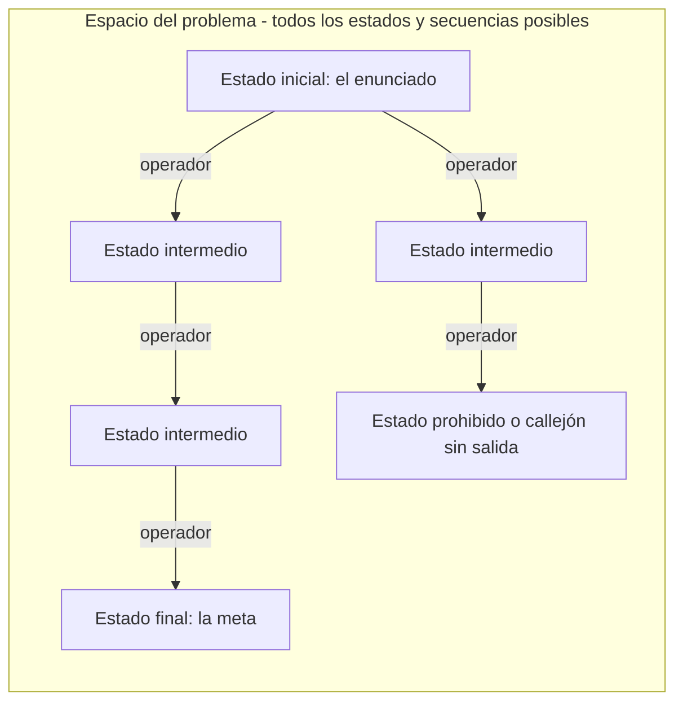
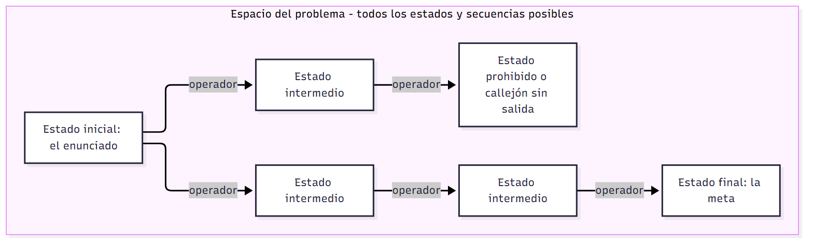
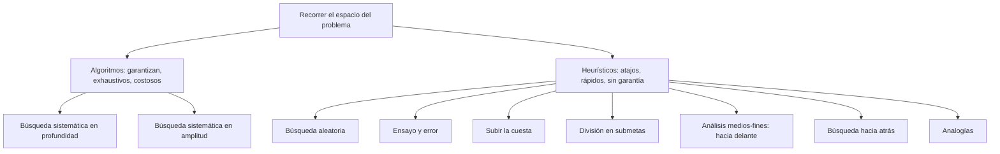
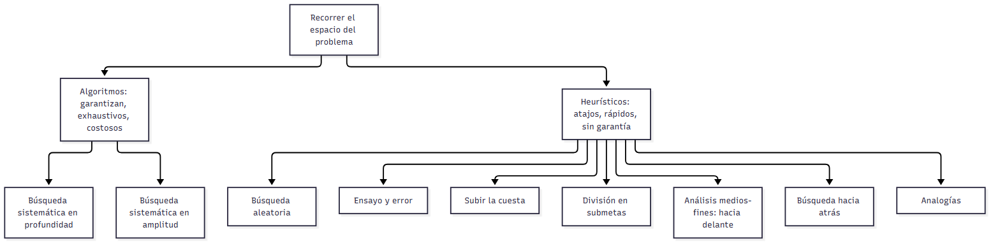
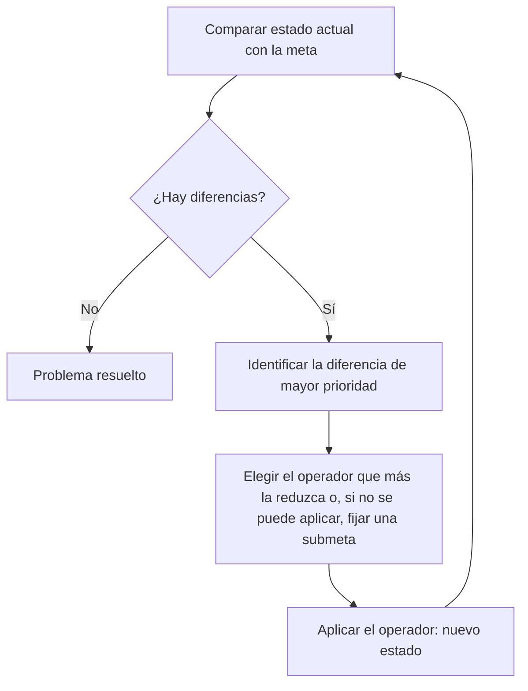
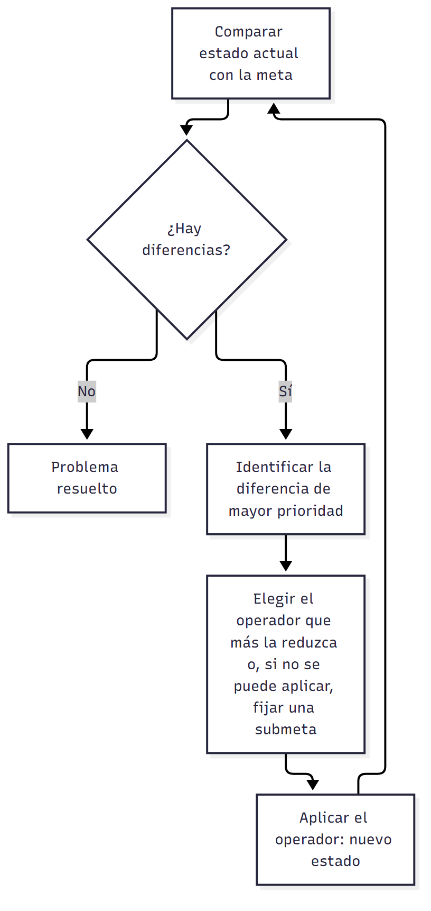
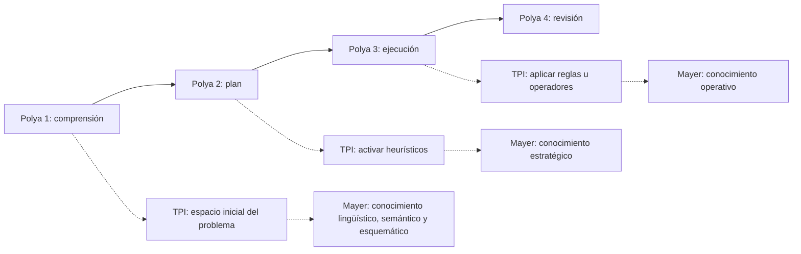
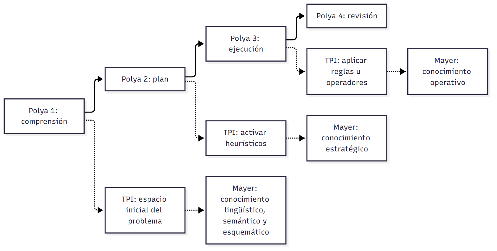

# U03 — Solución de problemas

> **Fuentes:** Pérez Echeverría, M. P., «Solución de problemas» (cap. 8) y Postigo Angón, Y., «Estrategias en solución de problemas» (cap. 9), en Carretero, M. y Asensio, M. (Coords.), *Psicología del pensamiento. Teoría y prácticas*, Madrid: Alianza, 2014 · Diapositivas de la Clase 03, «Razonamiento probabilístico y solución de problemas» (Ps. Mg. Carolina Cárdenas Poveda), diapositivas 13–38 · **Materia:** Procesos Básicos III — Unidad 3: Pensamiento.
>
> Las páginas citadas son las del texto extraído (cap. 8: pp. 1–20; cap. 9: pp. 1–28). La parte de razonamiento probabilístico de la misma clase (diapositivas 2–12) está en `U03_RazonamientoProbabilistico_Guia.md`.

> **Idea-fuerza:** un problema es una situación con una meta que no sabemos cómo alcanzar y para la que no tenemos un camino rápido y directo. La psicología lo estudió primero como **reestructuración súbita** (Gestalt), después como **búsqueda gradual en un espacio del problema** guiada por **heurísticos** generales (procesamiento de la información: Newell y Simon, Polya) y finalmente como una habilidad **específica de dominio**, que depende del **conocimiento** y del **control metacognitivo** de quien resuelve (expertos y novatos). Saber qué estrategia sirve para qué problema, y por qué la **representación** del problema decide casi todo, es el núcleo de la unidad.

## 0. Hoja de ruta

1. Solución de problemas y pensamiento: por qué buena parte de la psicología del siglo XX los equiparó.
2. Qué es un problema (Duncker, Lester, Mayer) y en qué se diferencia de un **ejercicio**.
3. Clasificaciones: bien/mal definidos y simples/complejos.
4. Los enfoques: Gestalt → capacidades generales (teoría del procesamiento de la información) → expertos y novatos.
5. La estructura de un problema: estados, operadores, **espacio del problema**, árbol estado-acción.
6. Dos formas de recorrer el espacio: **algoritmos** y **heurísticos**.
7. Las estrategias generales una por una (búsqueda aleatoria, ensayo y error, búsqueda sistemática, subir la cuesta, medios-fines, submetas, búsqueda hacia atrás, analogías), con los problemas clásicos que las ilustran.
8. El pensamiento analógico (problema de la radiación / problema militar).
9. El proceso de solución: las fases de Polya, los conocimientos que exige cada una (Mayer, cuadro 8.2) y la **representación** del problema.
10. Expertos y novatos: especificidad de dominio, práctica, automatización, expertos técnicos y estratégicos, metacognición.
11. Conclusiones de las autoras (y el problema de *Cube*).
12. Banco de problemas clásicos con enunciado y solución, y los problemas de la clase.

## 🎯 Lo que entra sí o sí

1. **Definición de problema** con sus dos condiciones: objetivo que no sabemos cómo alcanzar (Duncker, 1948) y ausencia de un camino rápido para resolverlo (Lester, 1983) (Diapositiva 14); y la diferencia **problema / ejercicio**.
2. **Clasificaciones:** bien vs. mal definidos; simples vs. complejos, con los factores de complejidad de Funke (Diapositiva 15).
3. **Enfoques:** capacidades generales vs. novatos y expertos (Diapositivas 16–17); y el contraste con la **Gestalt** (insight, etapas discontinuas) que trae Postigo.
4. **Teoría del procesamiento de la información** (Newell y Simon, 1972): postulados, protocolos verbales y simulación, solución como proceso gradual, continuo y acumulativo; **espacio del problema** (Diapositivas 18–21).
5. **Algoritmos vs. heurísticos** y cada **estrategia general** con su definición, ventajas, límites y ejemplo (Diapositivas 22–29): búsqueda sistemática en profundidad, búsqueda aleatoria, ensayo y error, subir la cuesta, división en submetas, análisis medios-fines, búsqueda hacia atrás, analogías.
6. **Pensamiento analógico:** definición, análogo base y análogo meta, problema de la radiación y problema militar (Gick y Holyoak) (Diapositivas 30–34).
7. Saber **resolver y analizar** los problemas de la clase: los lirios (búsqueda hacia atrás) y hobbits y orcos (= misioneros y caníbales) (Diapositivas 35–37).

---

## 1. Solución de problemas y pensamiento

**Pérez Echeverría** abre el capítulo 8 señalando que casi todos los términos que caen bajo el paraguas de «pensamiento» son ambiguos: el concepto de pensamiento se parece más a una **categoría natural** (Rosch, 1978) que a una categoría científica, y por eso su relación con otros procesos no puede deslindarse fácilmente; esto vale especialmente para la «solución de problemas» (Pérez Echeverría, p. 1).

- **En los manuales** el pensamiento se divide en dos grandes apartados: el **razonamiento** (a su vez, **razonamiento inductivo** y **razonamiento deductivo**) y la **solución de problemas**, como si esta fuera un conjunto de procesos diferenciado dentro del pensamiento (Pérez Echeverría, pp. 1–2).
- **Pero en la práctica**, buena parte de la psicología del siglo XX **equiparó** solución de problemas y pensamiento (Pérez Echeverría, p. 2):
  - Para el **asociacionismo** —fundamentalmente el **conductismo**— «pensamiento» era un término mentalista y estaba proscripto; sin embargo, no había ninguna dificultad en estudiar cómo los animales resolvían el problema de **escapar de una jaula** por **ensayo-error** (Thorndike, 1898; Guthrie y Horton, 1946), o qué **jerarquías de hábitos** aparecían al resolver una tarea y cómo cambiaban con la práctica (Maltzman, 1955) (Pérez Echeverría, p. 2).
  - Para la **Gestalt**, el «verdadero pensamiento», el **pensamiento productivo** (Maier, 1945; Wertheimer, 1945), se produce cuando se crea una solución nueva para un problema a partir de la **reorganización de sus elementos** (Pérez Echeverría, p. 2).
  - Para **Mayer** (1983/1992), autor de uno de los manuales más leídos: «el pensamiento es lo que sucede cuando una persona resuelve un problema, es decir, produce un comportamiento que mueve al individuo desde el estado dado al estado final o, al menos, cuando trata de lograr ese cambio» (Mayer, 1983, citado en Pérez Echeverría, p. 2). Mayer reconoce otros tipos de pensamiento (por ejemplo, las **ensoñaciones diurnas**), pero considera que el único realmente interesante para la psicología cognitiva es el **pensamiento orientado a una meta**, es decir, la solución de problemas. Para él —como para buena parte de la psicología (por ejemplo, Simon, 1973)— **cualquier** tarea de pensamiento o razonamiento orientada a una meta, independientemente de sus características, del contexto y del resolutor, sería solución de problemas (Pérez Echeverría, p. 2).
- **Postigo** retoma la misma idea: los mecanismos de toda situación de solución de problemas se han identificado con los procesos de pensamiento (Mayer, 1983; Saiz, 2002), y tanto expertos como profanos consideran que **saber resolver problemas es un signo de inteligencia** (Sternberg, 1982) (Postigo, p. 5).

> 🔑 **Punto clave:** la solución de problemas ocupa un lugar ambiguo: en los manuales es un capítulo aparte del razonamiento, pero muchas teorías (conductismo, Gestalt, Mayer, Simon) la tomaron como **el** modelo del pensamiento.

## 2. ¿Qué es un problema?

### 2.1 Las definiciones clásicas

La docente presenta la definición como **dos condiciones** que debe cumplir una situación para ser un problema (Diapositiva 14):

1. **Hay un objetivo que no sabemos cómo alcanzar** (Duncker, 1948).
2. **No se dispone de un camino rápido para su solución** (Lester, 1983).

Pérez Echeverría desarrolla ambas definiciones (Pérez Echeverría, pp. 2–3):

- **Duncker (1948):** «un problema surge cuando un organismo vivo tiene un objetivo y no sabe cómo conseguirlo». No alcanza con tener una meta: la expresión «no sabe cómo conseguirlo» **excluye algunos organismos vivos, como las plantas**, y restringe tanto qué es un problema como quién lo resuelve.
- **Lester (1983)** acota aún más: un problema es «una situación que un individuo o un grupo quiere o necesita resolver y para la cual no dispone de un camino rápido y directo que lo lleve a la solución».
- De ambas se siguen **dos condiciones** (Pérez Echeverría, p. 3):
  1. **Reconocimiento** de la situación como problemática (por la presencia de un objetivo o porque necesitamos o queremos resolverla). Por lo tanto, buena parte de la solución de problemas —al menos su **planteamiento**— se produce de forma **consciente**.
  2. El individuo **no debe disponer de procedimientos** (automáticos o no) que permitan solucionarla de forma más o menos inmediata, sin planificación consciente o reflexión previa. La asunción de una tarea como problema se da dentro de la conducta consciente y exige **algún tipo de estrategia consciente**.

**Postigo** lo formula así: estamos ante un problema cuando queremos conseguir algo y los medios de que disponemos no nos sirven; o bien, cuando existe un **obstáculo entre una situación inicial y una situación meta**, que obliga a considerar los posibles caminos que conducirían a la meta (Carretero y García Madruga, 1984b) (Postigo, pp. 5–6). La exigencia de estrategia consciente remite a que, ante un problema, no tenemos procedimientos automáticos sino que hay que **reflexionar o tomar decisiones sobre la secuencia de pasos** (Postigo, p. 7).

Y retoma la definición de **Mayer (1986, p. 19)**: «un problema 1) está actualmente en un estado, pero 2) se desea que esté en otro estado, y 3) no hay una vía directa y obvia para realizar el cambio». Los tres puntos corresponden al **estado inicial**, el **estado final** y las **operaciones** (Postigo, p. 7) → ver §5.

### 2.2 Problema vs. ejercicio

Desde este punto de vista se distinguen **problemas** de **ejercicios** (Pérez Echeverría y Pozo, 1994; Pozo y Pérez Echeverría, 1995): en un **ejercicio** disponemos de mecanismos que nos llevan **de forma inmediata** a la solución (Pérez Echeverría, p. 3).

- Consecuencia: **una misma situación puede ser un problema para una persona y no para otra**, sea porque a una no le interesa la situación, sea porque posee los mecanismos para resolverla con poca inversión de recursos cognitivos (Pérez Echeverría, p. 3).
- El problema mejor definido de todos sería justamente el ejercicio: está muy claro qué hacer y no hace falta deliberación consciente (Pérez Echeverría, p. 4).
- Esta distinción reaparece con fuerza en expertos y novatos: lo que es un problema para el novato es un ejercicio para el experto (Pérez Echeverría, p. 16) → §10.

> 🚩 Ojo: «problema» **no** es una propiedad de la tarea sola, sino de la **relación tarea–resolutor**.

## 3. Clasificaciones de los problemas

Hay muchas clasificaciones (Greeno, 1978; Carretero y García Madruga, 1984b) según el **contenido** de la tarea, su **estructura**, el **tipo de objetivos** o el **contexto** (escolar, laboral, cotidiano). Pérez Echeverría se centra en dos (Pérez Echeverría, p. 3), que son las que retoma la clase (Diapositiva 15). Postigo menciona además la clasificación en problemas de **ordenación**, de **transformación** y de **inducción de estructuras** (Greeno, 1978; Reitman, 1965) (Postigo, p. 8) → §6.

### 3.1 Bien definidos vs. mal definidos

Atiende a las **restricciones en la información y en la estructura** del problema (Pérez Echeverría, p. 3).

- **Bien definido:** «tanto el punto de partida como la meta y los pasos necesarios entre ambas instancias están restringidos y son fáciles de ser representados por el resolutor» (Diapositiva 15). En el texto: están lo suficientemente restringidos como para que el resolutor se los represente **de forma similar a la planteada por el investigador**; tienen **muy pocos grados de libertad** para decidir el camino y los mecanismos de solución (Pérez Echeverría, p. 4).
- Ejemplos: la mayor parte de las **tareas matemáticas escolares** están bien definidas; las que exigen **toma de decisiones** suelen ser mal definidas. La mayor parte de la investigación psicológica se hizo con problemas bien definidos: **silogismos, tarea de selección** e incluso las **tareas clásicas de Tversky y Kahneman** (Kahneman, Slovic y Tversky, 1982) (Pérez Echeverría, p. 4).

### 3.2 Simples vs. complejos

Relacionada con la anterior; hace referencia tanto a la **estructura** como a la **carga semántica** de los problemas (Pérez Echeverría, p. 4).

- Fuera del laboratorio, la mayoría de los problemas laborales o personales son **mal definidos y además complejos** (Pérez Echeverría, p. 4).
- **No hay relación biunívoca** entre complejidad y grado de definición, y los problemas mejor definidos y menos complejos no son necesariamente más fáciles. **Ejemplo:** decidir entre **dos vestidos** cuál usar en una ocasión especial es poco complejo, pero está lejos de estar bien definido o de ser fácil (Pérez Echeverría, p. 4).
- Sin embargo, según **Funke (1991)**, aunque haya problemas bien definidos difíciles, **no existe un problema complejo que esté bien definido** (Pérez Echeverría, p. 4).
- **Factores de complejidad (Funke)**, interrelacionados (Pérez Echeverría, p. 4; Diapositiva 15):
  - la **facilidad para representarse o acceder a la información** que permita construir un espacio del problema;
  - su **relación con otros problemas**;
  - la **claridad de sus metas**;
  - su **estabilidad espacio-temporal**;
  - su **relación con el contexto** o situación en que se produce.
- Por eso los problemas complejos suelen ser (Pérez Echeverría, p. 4):
  - **opacos**: la información no es clara ni accesible; los datos más importantes son **inferencias obtenidas a partir de otras inferencias**;
  - con **muchas metas**, a veces **contradictorias**;
  - referidos a situaciones con **gran conexión entre variables** (cambiar una afecta de modo desigual a las otras; consecuencias difíciles de anticipar);
  - con desarrollos **«inestables»** y efectos medibles **sólo a largo plazo**.

**Vida cotidiana, ocio y laboratorio** (Pérez Echeverría, p. 5):

- Según **Norman (1988)**, las tareas cotidianas son en su mayoría problemas bien definidos **o incluso ejercicios**: deben hacerse con rapidez y simultáneamente con otras, lo que obliga a **reducir al mínimo la planificación y los cómputos mentales**. En cambio, las tareas de **ocio** suelen ser bastante complejas (videojuegos modernos, juegos de rol), igual que la toma de decisiones profesionales y los problemas políticos y económicos (Pérez Echeverría, p. 5).
- Los problemas de **laboratorio** son casi siempre **sencillos**: el sujeto no tiene que elaborar ni inferir la información, ni evaluar consecuencias a largo plazo, ni cambiar la representación porque cambien las circunstancias. Si los problemas complejos son **dinámicos**, los de laboratorio son **estáticos** (Pérez Echeverría, p. 5).
- Razones: la necesidad de **control experimental** y la dinámica de las teorías: el **enfoque cognitivo** (Gardner, 1985; Posner, 1989; Simon y Kaplan, 1989; Van Lehn, 1990) buscó **principios y procesos generales** subyacentes a cualquier problema (Ernst y Newell, 1969; Newell y Simon, 1972; Simon, 1978; Simon y Newell, 1971), algo más fácil con problemas poco complejos en los que diferencias individuales, conocimiento, contexto o cultura no introduzcan variaciones. La insuficiencia de esas explicaciones, los trabajos con expertos, otras ramas de la psicología y las **neurociencias** llevaron a estudiar problemas más ricos en contenido, aunque todavía hay muchos menos trabajos sobre problemas mal definidos y complejos (Pérez Echeverría, p. 5).

## 4. Los enfoques en solución de problemas

La clase presenta dos enfoques (Diapositivas 16–17); Postigo agrega como antecedente la Gestalt (Postigo, p. 6).

| Enfoque | Qué busca | Cómo concibe la solución | Fuentes |
|---|---|---|---|
| **Gestalt** (principios del siglo XX, tradición europea) | Cómo se reorganiza la tarea | **Discontinua**, por etapas cualitativamente distintas; comprensión súbita (*insight*), todo o nada | Postigo, p. 6 |
| **Capacidades generales / procesamiento de la información** (Newell y Simon) | Principios y procesos **generales**, comunes a cualquier problema | **Gradual, continua y acumulativa**; búsqueda en un espacio del problema guiada por heurísticos | Diapositivas 16, 18–19; Pérez Echeverría, pp. 6–7; Postigo, pp. 6–7 |
| **Expertos y novatos** | Cómo la **experiencia y el conocimiento específico** de un dominio afectan la solución | Habilidad **específica de dominio**; depende del conocimiento y del control metacognitivo | Diapositiva 17; Pérez Echeverría, pp. 12–19; Postigo, pp. 23–25 |

### 4.1 La Escuela de la Gestalt

- Los trabajos de la **Gestalt**, a principios del siglo XX y dentro de la tradición psicológica europea, fueron **pioneros** en el estudio de la solución de problemas (Maier, 1945; Wallas, 1926; Wertheimer, 1959) (Postigo, p. 6).
- Concebían la solución como un proceso de **reorganización de los elementos de la tarea** o de **reestructuración perceptiva**. Dos problemas típicos: **las cerillas** y **los nueve puntos** (problemas 8 y 9 del banco, §12) (Postigo, p. 6).
- Aportaron conceptos relevantes: **insight**, **disposición**, **fijación funcional** y la distinción entre **pensamiento productivo** y **pensamiento reproductivo** (Postigo, p. 6).
- Pero estudios posteriores mostraron la **falta de precisión** de algunos de esos conceptos y la **inexactitud** de algunos supuestos. En particular, la Gestalt consideraba la resolución **discontinua**: una secuencia de **etapas fijas cualitativamente diferentes** —**preparación, incubación, iluminación y verificación**—, cada una con procesos mentales distintos (Postigo, p. 6).

### 4.2 El enfoque de las capacidades generales (procesamiento de la información)

**Idea central (Diapositiva 16):** por debajo de las diferencias en ejecución, **todos los problemas exigen la puesta en marcha de una serie de capacidades de razonamiento y de habilidades generales y comunes**, que tendrían que adaptarse a las características de cada tipo de problema.

Pérez Echeverría lo ilustra: no hacen falta los mismos conocimientos para decidir el próximo movimiento cuando tengo **amenazado un caballo en el ajedrez** que para resolver una **tarea matemática** o hacer un **diagnóstico clínico**, y los procesos para alcanzar una meta, e incluso para decidir si se la alcanzó, parecen distintos en cada tarea. El enfoque **no niega** esas diferencias, pero afirma que por debajo hay capacidades comunes (Pérez Echeverría, p. 6).

**La teoría del procesamiento de la información (TPI): Newell y Simon (1972)** (Diapositiva 18):

- Fueron **pioneros en el uso de protocolos verbales y simulaciones computacionales** como método de investigación en solución de problemas (Diapositiva 18).
- La TPI postula la solución de problemas como un **proceso gradual, continuo y acumulativo** que presenta **recursiones, interrupciones, retrocesos y revisiones** (Diapositiva 18).
- Frente al supuesto gestáltico de un proceso «todo o nada», no gradual, por comprensión súbita (*insight*), tanto el procesamiento de la información (Newell y Simon, 1972; Mayer, 1983; Polya, 1957) como el paradigma de expertos y novatos (Chi, Glaser y Farr, 1988; Ericsson, 1996; Ericsson y Smith, 1991) demostraron que resolver un problema es una **tarea continua y acumulativa**, en la que la **búsqueda en el espacio del problema** es el mecanismo fundamental; incluso, a veces, el proceso es **recursivo** y está marcado por interrupciones, retrocesos y revisiones (Mayer, 1983; Wagner, 2003) (Postigo, p. 6).

**Postulados centrales** (Diapositiva 19):

1. El agente que resuelve problemas posee un **sistema de procesamiento de información**.
2. El sistema presenta **restricciones por su arquitectura cognitiva**.
3. Este sistema aplica **operadores** (acciones físicas o mentales) a los **estados** de un problema.
4. La solución de problemas es fruto de la **interacción** entre las características del sistema de procesamiento de la información y la **estructura del problema**.
5. **Análisis detallado de la secuencia de pasos** que realiza el sujeto.

**Desarrollo en el texto** (Pérez Echeverría, pp. 6–7; Postigo, pp. 6–7):

- La conducta de solución de problemas es una **interacción entre un sistema de procesamiento de información** (el sujeto, **sea hombre, animal o máquina**) y una **tarea con un determinado ambiente** (la descripción de la tarea hecha por el investigador: tipo de tarea, estructura de **pasos lícitos e ilícitos**, etc.). A partir de esa interacción, el organismo **representa el ambiente de la tarea y crea un espacio del problema**, que se irá modificando hasta encontrar la solución o estado final (Simon, 1978) (Pérez Echeverría, p. 6).
- El sistema es **adaptativo**: se amolda a la tarea y modifica su conducta por aprendizaje; **sólo unas pocas características permanecen invariables** entre tareas y sujetos (Newell y Simon, 1972; Simon, 1978). **La estructura del ambiente de la tarea determina las posibles estructuras del espacio del problema**: la tarea y cómo nos la representamos guían el proceso (Pérez Echeverría, p. 6).
- Por eso las **diferencias individuales** no se deberían tanto a diferencias de capacidad como a diferencias **entre las tareas** y en el **aprendizaje** de los sujetos. El aprendizaje haría que se construya un **espacio del problema más útil**, más que modificar los procesos de solución (Pérez Echeverría y Pozo, 1994) (Pérez Echeverría, pp. 6–7).
- La solución consiste en una **búsqueda** que modifica los sucesivos espacios del problema hasta que el **estado actual coincida con el estado meta**. La búsqueda está **dirigida y organizada por la meta**: rara vez es aleatoria; la guían **estrategias de planificación o heurísticos** (Pérez Echeverría, p. 7).
- Postigo subraya que estos trabajos (Ernst y Newell, 1969; Newell y Simon, 1972; Simon, 1978; Simon y Newell, 1971) se centran en un **análisis detallado de la secuencia de pasos o movimientos** del sujeto (Postigo, pp. 6–7).
- **Método: el informe verbal.** Para Newell y Simon los heurísticos se representan como **reglas de producción** o pares **condición-acción** «si p…, entonces q», almacenadas en la **memoria a largo plazo**; se activan cuando el contenido de la **memoria de trabajo** indica que se cumple la condición p, de modo que las **limitaciones de la memoria de trabajo** afectan esos desencadenamientos. Como el resolutor puede **informar** de lo que tiene en la memoria de trabajo, el **informe verbal** fue y sigue siendo uno de los métodos más importantes de investigación (Mayer, 1981, 1983; Garnham y Oakhill, 1994) (Pérez Echeverría, p. 7).
- **Solucionador General de Problemas:** en esa teoría Newell y Simon introdujeron el concepto de **espacio del problema** (Postigo, p. 7), y su estrategia básica de búsqueda es el **análisis medios-fines** (Postigo, p. 13) → §7.5.
- **Problemas sin contenido.** Para encontrar principios generales, este enfoque usó problemas **sin contenido específico**, generalmente **bien definidos**, que no requieren formación especializada (Greeno, 1978). Este uso de materiales «sin contenido», una constante de la psicología cognitiva (Carretero, 1997; Mayer, 1981; Rivière, 1987; De Vega, 1984; sobre sus limitaciones, Carretero, 1997; Pozo, 2003; De Vega, 1998), da **mayor control experimental** porque neutraliza variables del sujeto y de la tarea (Postigo, p. 8).
- **Dos formas de analizar** la solución de problemas (Postigo, pp. 8–9):
  1. **Clasificar los problemas** (bien/mal definidos, de ordenación, de transformación, de inducción de estructuras; Greeno, 1978; Reitman, 1965) para identificar qué habilidades requiere cada tipo. Pero como **una misma estrategia interviene en distintos tipos de problemas**, conviene centrarse más en la persona que en el problema.
  2. **Estudiar las estrategias**, comparando cómo actúan distintas personas ante los mismos problemas, para identificar **habilidades o estrategias generales**. Esto permitiría diseñar **programas de enseñanza** de solución de problemas (Bransford y Stein, 1984; Nickerson, Perkins y Smith, 1985; Polya, 1957).

**Balance del enfoque** (Pérez Echeverría, p. 12): se concibió la solución de problemas como un **proceso secuencial de habilidades generales** adaptables a la tarea; pero la propia investigación mostró que **la pericia y el conocimiento específico hacen variar esos procesos generales**: aunque todos pasemos por fases de representación o comprensión, la forma de representarnos la tarea depende del conocimiento adquirido; aunque todos usemos alguna vez los heurísticos descriptos, **cuál activamos y con qué eficacia** depende de la pericia. Además, los **programas de enseñanza del pensamiento basados en habilidades generales** parecen **mucho menos efectivos** que los que enseñan a resolver problemas **en un contexto específico** con conocimientos específicos (Nickerson, Perkins y Smith, 1985; Pérez Echeverría y Pozo, 1994; Garnham y Oakhill, 1994).

### 4.3 El enfoque de novatos y expertos (presentación)

Según la clase, **este enfoque no busca identificar un proceso general útil para la solución de cualquier problema**, sino **conocer de qué forma afectan la experiencia y los conocimientos específicos** en un área o dominio de conocimiento a la solución de un problema propio de esa área (Diapositiva 17; Pérez Echeverría, p. 13). Se desarrolla en §10.

## 5. La estructura de un problema y el espacio del problema

### 5.1 Estados y operadores

Siguiendo a Mayer (1983), Newell y Simon (1972) y Simon (1978) (Postigo, p. 7):

- **Estado:** el lugar, punto o momento en que se encuentra quien resuelve el problema.
- **Estado inicial:** el comienzo, lo que te dan en el problema o el enunciado.
- **Estado final:** la meta, el momento en que el problema se soluciona.
- **Operaciones u operadores:** los movimientos o acciones que **transforman un estado en otro** (en la clase: acciones físicas o mentales aplicadas a los estados; Diapositiva 19).

### 5.2 El espacio del problema

- En todo estado hay un número posible de operaciones, cada una produce un nuevo estado, desde el que se pueden realizar otras, y así sucesivamente. **El espacio del problema es el conjunto de todos los estados o todas las secuencias posibles de operaciones** (Postigo, p. 7; Diapositiva 20).
- Para Pérez Echeverría, el espacio del problema es una **representación de la tarea** que contiene el **estado actual** (o punto de partida), el **estado final** y **todos los estadios intermedios** (Pérez Echeverría, p. 7).
- **Finitos vs. muy grandes:** algunos problemas tienen un espacio con un **número finito** de estados alcanzables y operaciones —«Misioneros y caníbales» o la «Torre de Hanoi» con pocos discos—; en otros el número es **muy grande o ilimitado** —el criptoaritmético «Donald + Gerald» o una **partida de ajedrez**— (Postigo, p. 7; Diapositiva 20).
- **Las operaciones que seleccionemos y usemos dentro del espacio del problema conforman nuestra estrategia** o método de solución (Postigo, p. 7; Diapositiva 20).
- **Ejemplo de la clase: la Torre de Londres (TOL).** La diapositiva muestra una **configuración inicial** y una **configuración final** de la tarea como ejemplo de espacio del problema: hay que pasar de una a otra mediante movimientos permitidos (Diapositiva 21).

### 5.3 Conducta estratégica y árbol estado-acción

- En cada estado suele haber **más de una opción**: el resolutor debe **seleccionar la acción más apropiada** entre alternativas. Este es un **rasgo definitorio de la conducta estratégica**: para actuar estratégicamente hay que disponer de **recursos alternativos** y decidir, según las demandas de la tarea, cuáles usar. **Sin variedad de recursos no es posible actuar estratégicamente** (Pozo y Postigo, 2000) (Postigo, pp. 7–8).
- El conjunto de todas las elecciones se puede representar en un **árbol estado-acción**: un diagrama con los posibles estados y las acciones que llevan de uno a otro (Postigo, p. 8). La figura 9.3 lo aplica a «Misioneros y caníbales»: desde el punto de partida se abren los estados posibles tras el primer viaje; algunos están marcados «¡Se los comen!» (estados prohibidos) y otros devuelven al punto de partida (Postigo, pp. 10–11).

## 6. Dos formas de recorrer el espacio: algoritmos y heurísticos

### 6.1 Definiciones

| | **Algoritmo** | **Heurístico** |
|---|---|---|
| Definición | Método que **garantiza** la solución: genera un espacio del problema **exhaustivo** y selecciona la mejor alternativa (Postigo, p. 9; Diapositiva 22) | **Atajo** o **búsqueda selectiva** que permite un acceso rápido a la solución **reduciendo el número de estados** del espacio del problema (Postigo, p. 9; Diapositiva 22) |
| Espacio del problema | Se recorre **todo** hasta dar con la solución, **sin reducirlo** (Saiz, 2002) | Se **reduce** |
| Costo | Consume **mucho tiempo y recursos** en problemas grandes; no siempre es aconsejable | Consume **poco tiempo y recursos** |
| Garantía | Sí | **No** garantiza la solución |
| Ejemplo en ajedrez | Generar **todos** los movimientos posibles de las piezas y analizar sus consecuencias | Guiarse por «**salvar la reina amenazada**» o «**desarrollar una buena estructura de peones**», que reduce mucho los movimientos analizables |
| Otros nombres | Reglas, operaciones | «**Métodos débiles**» (Newell, 1980) |

(Postigo, p. 9; Diapositiva 22.) La distinción proviene de Greeno (1978) y Newell y Simon (1972). Los heurísticos **se desarrollan a partir de la experiencia y la práctica** (Postigo, p. 9).

**Ejemplo de la clase:** **elegir gustos de helado en una heladería nueva** (Diapositivas 22–23). Probar todos los gustos antes de elegir sería recorrer el espacio completo (algorítmico, costoso); preguntarse «**¿Cuál es mi gusto favorito?**» y elegir a partir de eso es un atajo heurístico (Diapositiva 23).

**La definición de Pérez Echeverría** (Pérez Echeverría, p. 7): «heurístico» viene del griego *heuriskein*, «**búsqueda**». En psicología designa **métodos o estrategias que sólo pueden definirse de manera vaga o general** y que se diferencian de otros métodos en que **no transforman la información, sino que organizan algoritmos, operadores o reglas**. Estos últimos transforman la información de forma **fija, eficaz y concreta**; los heurísticos guían la solución de forma **vaga y general**. Los **planes, metas y submetas** que usa un organismo en su búsqueda son «heurísticos de solución de problemas»; los procedimientos de transformación de la información que requieren esos planes son «**reglas**», «**algoritmos**» u «**operaciones**».

**Puente con la otra mitad de la clase:** en matemáticas los heurísticos son procedimientos de solución de problemas que se diferencian de los algoritmos por su **vaguedad y falta de precisión**; en psicología están presentes en los **métodos intuitivos** de enfrentarse a la probabilidad **y a la solución de problemas** (Diapositiva 3) → ver `U03_RazonamientoProbabilistico_Guia.md`.

### 6.2 Por qué el enfoque se centró en heurísticos

La mayoría de las investigaciones del procesamiento de la información se centraron en los heurísticos e identificaron un conjunto de **estrategias generales y básicas** de amplia aplicación en problemas que no requieren conocimientos específicos (Hayes, 1978; Newell y Simon, 1972; Wickelgren, 1974): señalan la **relativa invariabilidad** de las estrategias aplicadas a problemas sin contenido. Ante un mismo problema hay **varios caminos** alternativos, y una misma estrategia sirve para **problemas distintos** (Postigo, p. 9).

**Cuadro 8.1 — Algunos heurísticos de solución de problemas** (Pérez Echeverría, p. 8):

| N.º | Heurístico |
|---|---|
| 1 | Análisis «ensayo-error» aleatorio o sistemático |
| 2 | «Subir la cuesta» (utilizar siempre aquellos operadores que lleven más cerca de la meta) |
| 3 | Análisis «medios-fines» (¿Cuál es la diferencia entre el estado inicial y el estado final del problema? ¿De qué medios dispongo para reducir esa diferencia?): búsqueda hacia delante; búsqueda hacia atrás |
| 4 | División del problema en subproblemas |
| 5 | Establecimiento de submetas |
| 6 | Búsqueda de problemas análogos |

> Nota de clasificación: la clase ubica la **búsqueda sistemática** como estrategia **algorítmica** (Diapositiva 24) y la **búsqueda aleatoria** y el **ensayo y error** entre los **heurísticos** (Diapositiva 26). Postigo describe todas como «métodos heurísticos o estrategias» generales (Postigo, p. 9) y Pérez Echeverría pone el ensayo-error como el heurístico más sencillo (Pérez Echeverría, p. 8). Para el parcial, seguí la organización de la clase.

## 7. Las estrategias generales, una por una

Las estrategias **no son excluyentes sino complementarias**: pueden combinarse varias en un mismo problema (Postigo, p. 19).

### 7.1 Búsqueda sistemática o exhaustiva (estrategia algorítmica)

**En la clase:** algoritmos de **búsqueda exhaustiva** de soluciones; ejemplo: **búsqueda en profundidad** (Diapositiva 24).

- **Procedimiento:** con un **árbol estado-acción** (figura 9.3), se parte del estado inicial y se plantean los estados posibles tras aplicar diversas operaciones en un primer movimiento; debajo de cada uno, los estados que se conseguirían con un movimiento más, y así sucesivamente (Postigo, p. 10).
- **Búsqueda en profundidad:** «se investiga un camino determinado **hasta el final**. Se sigue una secuencia de movimientos hasta que se logra un punto en el que no se puede realizar ningún movimiento más. Si no se alcanza el objetivo, **se vuelve atrás un nivel** y se empieza de nuevo la búsqueda hacia abajo a través de un nuevo camino» (Postigo, p. 11; Diapositiva 25, que lo ilustra con un árbol numerado).
- **Búsqueda en amplitud:** se analizan **todos los estados de cada nivel** del árbol antes de pasar al siguiente (Postigo, p. 11).
- **Cuándo sirve:** en problemas con un número limitado de movimientos. «Misioneros y caníbales» se resuelve en **once movimientos** (figura 9.4), con **12 estados**: 10 intermedios + inicial + meta (Greeno, 1974; Jeffries, Polson, Razran y Atwood, 1977; Thomas, 1974) (Postigo, p. 11).
- **Cuándo no:** en una **partida de ajedrez**, donde hay muchos movimientos y muchas posibilidades por movimiento, el árbol es **enorme en amplitud y profundidad** y la búsqueda sistemática se vuelve **inmanejable**: no perder la pista de los caminos ya recorridos y del estado al que volver exige **muchísima memoria**. Sólo vale para problemas **muy sencillos** o de espacio pequeño (Postigo, p. 12).

### 7.2 Búsqueda aleatoria

- **Definición:** buscar **de manera desordenada** la solución, incluso dando respuestas o soluciones **repetidas** sin constatarlo siquiera; respuestas **al azar** esperando encontrar la solución **por casualidad** (Postigo, pp. 9–10). En la clase: recorrer de forma azarosa el espacio de problema; dar con la solución de casualidad (Diapositiva 26).
- **Ejemplo:** abrir una pequeña **cerradura de combinación de tres cifras** (de un maletín o una caja) probando series de tres números al azar, sin planificación (Postigo, p. 10).

### 7.3 Ensayo y error

- **Definición:** **seleccionar diferentes caminos** para encontrar la solución. A diferencia de la anterior, la búsqueda es **ordenada y planificada**: se comprueban los resultados de cada camino y se **registran los caminos fallidos para no repetirlos** (Postigo, p. 10; Diapositiva 26).
- **Cuándo conviene:** si el **espacio del problema es pequeño** o cuando **no se nos ocurre ninguna estrategia mejor** (Postigo, p. 10).
- **Ejemplo: «Donald + Gerald».** Es lo que hace la mayoría, al menos al principio: una vez obtenido **T = 0** (porque D + D = 5 + 5 = 10), asigna números a letras de forma relativamente azarosa, o anota los ya usados e infiere valores posibles para que «encajen». Como al principio hay **9 posibilidades para cada letra**, el espacio es muy amplio y el ensayo y error **no es conveniente**; de hecho, **con esta estrategia es imposible** resolverlo (Postigo, p. 10).
- También se usa en los problemas gestálticos de **las cerillas** y **los nueve puntos** (Postigo, p. 10).
- **Pérez Echeverría** (Pérez Echeverría, p. 8): es la estrategia o heurístico **más sencillo** y de los que **menos recursos cognitivos** exige, pero **poco útil** en problemas medianamente complejos; los humanos la usan en problemas **poco habituales** o bajo **gran presión ambiental** (Mayer, 1983). Recordá su origen histórico: los animales de Thorndike escapando de la jaula (Pérez Echeverría, p. 2).
- La clase acompaña estas estrategias con un video sobre **George Polya y sus estrategias de resolución de problemas** (Diapositiva 26).

### 7.4 Subir la cuesta (o subir la montaña)

- **Definición:** **modificación de la búsqueda en profundidad**: se sigue un solo camino (hasta una solución, un punto muerto o durante cierto número de movimientos), pero **en cada estado se elige el movimiento que lleva más cerca de la meta**; es decir, usar siempre los operadores que más acercan a la solución (Postigo, p. 12; Diapositiva 27). Pérez Echeverría lo describe como avanzar desde el estado actual a uno más cercano al objetivo, algo **más sistemático que el ensayo-error** (Hayes, 1978; Wickelgren, 1974) (Pérez Echeverría, p. 8).
- **Límite:** no siempre funciona, porque a veces **no hay ninguna ruta** en la que cada movimiento acerque a la solución. Sirve poco cuando el problema exige una operación que **aparentemente nos aleja** del objetivo (Postigo, p. 12; Pérez Echeverría, p. 8).
  - **Ejemplo militar:** cualquier táctica que implique **dar un rodeo** en lugar de acercarse directamente al objetivo viola este principio (Pérez Echeverría, p. 8).
  - **Ejemplo de «Misioneros y caníbales»:** si la distancia a la meta se mide por el **número de personas en la orilla opuesta**, en la secuencia que resuelve el problema hay un punto en el que hay que **alejarse de la meta**: el **estado 7** (figura 9.4), cuando **vuelven dos (MC)** a la primera orilla después de haber logrado que cruzaran MM y CC, lo que da la **sensación de retroceso** (Postigo, pp. 12–13).
- Conclusión: no sirve para problemas que requieren **alejarse ocasionalmente** del objetivo para finalmente alcanzarlo (Postigo, p. 13).

### 7.5 Análisis medios-fines

- **Lugar teórico:** es la **estrategia básica de búsqueda del Solucionador General de Problemas** de Newell y Simon (1972) y una de las más estudiadas (Anderson, 1993; Carretero y García Madruga, 1984b; Garnham y Oakhill, 1994; Mayer, 1983) (Postigo, p. 13); para Pérez Echeverría, el **heurístico más analizado** dentro de la tradición del procesamiento de la información (Pérez Echeverría, p. 8).
- **Definición:** **comparar el estado inicial y el estado final**, analizar **la diferencia** entre ellos y encontrar alguna acción que la reduzca; para ello se **divide el problema en subproblemas o submetas** que van aproximando a la meta (Postigo, p. 13; Diapositiva 28). Formulado como preguntas: «¿Cuál es la diferencia entre el estado inicial y el estado final del problema? ¿De qué medios dispongo para reducir esa diferencia?» (Pérez Echeverría, p. 8).
- **Ciclo** (Postigo, p. 13): se compara cada estado alcanzado con la meta → se identifica la **diferencia de mayor prioridad** → se aplica una operación para reducirla → el nuevo estado se compara otra vez con la meta… hasta que no quedan diferencias. Si hay más de una operación posible, se aplica primero la que **reduzca una mayor diferencia**.
- **Mayer (1983):** conserva la simplicidad de la búsqueda al azar y el orden de «subir la cuesta», y es a la vez **simple y potente**. Se trabaja con **un solo objetivo por vez en la memoria de trabajo**; si no se puede conseguir, se establece un **subobjetivo**, y así hasta el estado final (Pérez Echeverría, p. 8).
- **Ejemplo en «Misioneros y caníbales»:** elegir los movimientos que **sitúen más pasajeros en la otra orilla** (Postigo, p. 13).

**Ejemplo central: la Torre de Hanoi** (Best, 1999; Garnham y Oakhill, 1994; Karat, 1982; Mayer, 1983) (Postigo, pp. 13–15):

- **Enunciado:** tres pivotes A, B y C y tres (o más) discos de distinto tamaño apilados en A de mayor (abajo) a menor (arriba). Hay que trasladarlos todos de A a C en el **menor número de movimientos**; los discos se mueven **de a uno** y **nunca sobre uno más chico**; B sirve para movimientos intermedios (Anzai y Simon, 1979; Ernst y Newell, 1969; Karat, 1982; Newell y Simon, 1972; Raphael, 1984; Van Lehn, 1991) (Postigo, pp. 2–3; figura 9.1).
- **Espacio del problema:** tiene **3ⁿ estados** (n = número de discos) y se resuelve en un mínimo de **2ⁿ − 1 movimientos**. Con tres discos: **27 estados** y **siete movimientos** como mínimo (figura 9.5, tomada de Mayer, 1983) (Postigo, p. 13). Cada movimiento genera una configuración que está a cierta distancia de la meta; en la solución esa distancia se va reduciendo a medida que los discos pasan de A a C.
- **La solución mínima (camino 1 → 8 de la figura 9.5):**

  | Estado | Movimiento | Pivote A | Pivote B | Pivote C |
  |---|---|---|---|---|
  | 1 | (inicio) | grande, mediano, chico | — | — |
  | 2 | chico A → C | grande, mediano | — | chico |
  | 3 | mediano A → B | grande | mediano | chico |
  | 4 | chico C → B | grande | mediano, chico | — |
  | 5 | grande A → C | — | mediano, chico | grande |
  | 6 | chico B → A | chico | mediano | grande |
  | 7 | mediano B → C | chico | — | grande, mediano |
  | 8 | chico A → C | — | — | grande, mediano, chico |

- **Medios-fines en acción:** **mover el mismo disco dos veces seguidas no es útil**; por ejemplo, en el paso 7, llevar el disco pequeño de A a B y luego a C, cuando puede ir de A a C en un único movimiento. Ante dos operaciones posibles se elige la que **más acorta la distancia** a la meta (Postigo, p. 15).
- **Patrón de movimientos de la solución** (Postigo, p. 15):
  a) mover el disco más pequeño (disco 1);
  b) mover el disco 2 (el siguiente más pequeño) al pivote que queda libre;
  c) colocar el disco 1 sobre el 2;
  d) mover el único disco que queda.
  Desviarse del patrón **aumenta la distancia** a la meta, da más rodeos o no garantiza la solución.
- **Recursividad** (Best, 1999): las versiones mayores **incluyen** a las menores; al resolver una torre de cuatro discos se resuelven también los casos de tres y dos (Postigo, p. 15).

**Medios-fines según la pericia:** en física y otras ciencias, los **estudiantes de los primeros cursos** resolvían con análisis medios-fines, mientras los **expertos** usaban otros heurísticos (por ejemplo, el **análisis hacia atrás**) que les permitían evitar muchos subobjetivos y pasos (Larkin, McDermott, Simon y Simon, 1980; Mateos, 1995; Pérez Echeverría y Pozo, 1994; Pozo, 1987; Pozo y Pérez Echeverría, 1997; Pozo y Gómez Crespo, 1998) (Pérez Echeverría, p. 11). Ojo: Postigo cita el mismo estudio de Larkin y cols. **en sentido inverso** (expertos «hacia delante», novatos «hacia atrás») → ver §10.4.

### 7.6 División del problema en subproblemas o submetas

- **Definición:** fraccionar un problema en varias partes —«**divide y vencerás**»— y reducir un problema amplio a varios más pequeños; las personas tienden a dividirlo en **metas parciales** e intentar resolver cada una (Best, 1999; Garnham y Oakhill, 1994; Mayer, 1981) (Postigo, p. 15). El cuadro 8.1 distingue «división del problema en subproblemas» y «establecimiento de submetas» (Pérez Echeverría, p. 8).
- **Ejemplos** (Postigo, p. 15):
  - **Torre de Hanoi de cuatro discos:** partir de la versión simplificada de tres y aplicar los operadores descubiertos. En cualquier versión, **dejar libre el disco de abajo para moverlo al pivote final** es una submeta a medio camino de la meta.
  - **Donald + Gerald:** cada **columna** de la suma, e incluso cada **letra**, pasa a ser un subproblema.
- **Por qué sirve:** permite **olvidar provisionalmente** información que excede los límites de la memoria. Como la **memoria de trabajo es limitada**, dividimos el problema en submetas, **cada una de las cuales es un espacio del problema**; los problemas más pequeños acercan a la meta final (Postigo, p. 15).
- **Límite:** no siempre es apropiada. Podemos creer que vamos bien y centrarnos en **submetas inadecuadas**, quizá por una **mala representación** del problema (Postigo, p. 16; Diapositiva 27). Ejemplo: en «Donald + Gerald», si se aplica el conocimiento sobre la suma y se plantean las submetas **sumando de derecha a izquierda como siempre, no se llega a la solución**: la dificultad está en **activar reglas de la suma que son implícitas** y hacerlas explícitas siguiendo un **orden no habitual** (Postigo, p. 16).

### 7.7 Búsqueda hacia atrás

- **Definición:** frente al análisis medios-fines, que es una búsqueda **hacia delante** dirigida a la meta (o a submetas), consiste en **trabajar hacia atrás desde la meta**, a través del árbol estado-acción, **hacia el estado inicial** (Best, 1999; Saiz, 2002) (Postigo, p. 16; Diapositiva 28). Útil en algunos problemas de matemáticas, como la **demostración de teoremas** (Postigo, p. 16).
- **Condiciones:** la meta tiene que estar **especificada y ser única**. Ventaja: frente a las estrategias hacia delante (donde puede haber muchos caminos posibles), es la **meta la que señala por dónde empezar**. Es útil para problemas con **menos caminos desde la meta que desde el estado inicial** (Postigo, p. 16; Diapositiva 28).
- **«Los lirios»** (Fixx, 1978, citado en Saiz, 2002) **sólo se puede resolver con esta estrategia**: a los 60 días el estanque está cubierto y el área se duplica cada día; ¿qué área estaba cubierta el día anterior? Si se duplica y ahora está completo, el día anterior estaba cubierta **la mitad**, que es lo que pide el problema: **60 − 1 = 59 días** (Postigo, p. 16). Es uno de los problemas que la docente da para resolver (Diapositiva 36).
- **«Las tres partidas»** (Wickelgren, 1974, citado en Best, 1999): se parte de la situación conocida tras las tres partidas y, aplicando **al revés** la regla (el perdedor dobla el dinero de cada uno de los otros dos), se reconstruye la tercera, la segunda y la primera partida hasta la apuesta original (Postigo, pp. 16–17). Solución:
  - Si **J1 pierde la tercera**, al final de la segunda partida tenían **16, 4 y 4**.
  - Si **J2 pierde la segunda**, al final de la primera tenían **8, 14 y 2**.
  - **J3 pierde la primera**; la apuesta original era **4, 7 y 13** (Postigo, p. 17).
- **Por qué en estos dos casos:** se aplica la estrategia **por el tipo de problema** (su contenido o los datos del enunciado): en ambos, **la meta del problema no coincide con el final cronológico**. En «Las tres partidas» se pide la partida 1 y se dan los datos de la 3, de modo que hay que ir de la 3 a la 2 y de la 2 a la 1 (Postigo, p. 17).
- **Otra interpretación:** problemas en los que **la solución está incluida en el enunciado** y hay que «ir hacia atrás». **«¿Quién tiene el céntimo?»**: hay que desmontar la **mala representación** de la que parte Carlos y darse cuenta de que en los **27 céntimos ya están incluidos los 2 de la propina** (25 de las pipas + 2 de propina), y que los **3 céntimos restantes** hasta 30 son el céntimo que se repartió cada uno (Postigo, p. 17). Nadie se quedó con ningún céntimo.

### 7.8 Analogías

- **Definición:** utilizar **la solución de un problema diferente como modelo** para el problema presente: quien resuelve se basa en su experiencia con problemas ya resueltos y la aplica a problemas nuevos (Postigo, p. 17; Diapositiva 29).
- **Ventaja:** muy **adaptativa**: supone un **gran ahorro de tiempo y esfuerzo**, porque usamos vías que funcionaron con problemas semejantes (Postigo, p. 17; Diapositiva 29).
- **Pero su uso es poco frecuente**, porque las personas tienen que (Garnham y Oakhill, 1994; González Labra, 2001; Reed, 1977; Saiz, 2002) (Postigo, p. 17; Diapositiva 29):
  a) **detectar** el parecido o analogía entre los problemas;
  b) **recordar** cómo resolvieron el problema anterior;
  c) ser capaces de **aplicarlo** al problema presente.
- La clase lo resume como **dificultad para advertir las similitudes estructurales** de los problemas (Diapositiva 29).
- **Ejemplos (desarrollados en §8):** el tumor y la historia del general; misioneros y caníbales / maridos celosos / lobo, oveja y lechuga; el revoltijo de números y el tres en raya.

## 8. El pensamiento analógico

### 8.1 Definición y componentes (clase)

- **Definición:** «Habilidad que nos permite captar que una situación o un dominio específico están estructurados por un **sistema de relaciones y roles** similar al sistema de relaciones y roles que estructura otra situación o dominio específico diferente» (Diapositiva 30). La docente lo ejemplifica con **los memes**, que funcionan trasladando una estructura de relaciones a situaciones nuevas (Diapositiva 30).
- **Análogo base (AB):** el dominio **más conocido**. **Análogo meta (AM):** el dominio **menos conocido**, al que se transfiere la estructura (Diapositiva 31).
- El pensamiento analógico **parte de una tendencia general a buscar patrones de similitud** entre objetos, acontecimientos, situaciones y dominios, y a **asimilar lo novedoso a partir de lo familiar** (Diapositiva 31).
- La importancia de la **accesibilidad** y la **aplicabilidad** del conocimiento de un área para comprender otra fue objeto de numerosas investigaciones sobre razonamiento analógico (Gentner, 1989; Gick y Holyoak, 1980, 1983; González Labra, 1998; Sierra, 1995; Vosniadou y Ortony, 1989) (Postigo, p. 18).

### 8.2 El problema de la radiación y el problema militar (Gick y Holyoak)

**El problema de la radiación** (análogo meta; Duncker, 1945) (Diapositivas 32 y 34; Postigo, p. 4): un médico debe destruir un **tumor maligno en el estómago** de un paciente al que es imposible operar y que morirá si el tumor no se destruye. Hay unos rayos que destruyen el tumor si lo alcanzan **todos a la vez con intensidad suficientemente alta**; pero con esa intensidad también destruyen los **tejidos sanos** que atraviesan. Con intensidades más bajas son inofensivos para el tejido sano, pero tampoco afectan al tumor. ¿Cómo destruir el tumor sin dañar el tejido sano?

**El problema militar o «historia del general»** (análogo base) (Diapositiva 33): un general debe tomar una **fortaleza** situada en el centro de un pequeño país, de la que **parten múltiples caminos en forma radiada**. Tiene hombres suficientes, pero **todos los caminos están minados**: no puede atacar por uno solo porque el tamaño del contingente haría **detonar las minas**, provocando bajas y daños en las villas cercanas. **Solución:** divide al ejército en **grupos pequeños** que envía **simultáneamente por múltiples caminos** y que, una vez **reunidos frente a la fortaleza**, logran tomarla.

**Solución común:** **distribuir radialmente una fuerza** (las radiaciones o los soldados) **para que converja en un punto** (el tumor o la fortaleza): varios rayos de baja intensidad desde distintas direcciones que se suman en el tumor (Postigo, p. 18). En la clase, el problema de la radiación aparece primero marcado como no resuelto (✗) y, tras presentar el problema militar, como resuelto (✓) (Diapositivas 32–34).

**El experimento** (Gick y Holyoak, 1980, 1983) (Postigo, p. 18):

- Presentaron el problema del tumor **después** de la historia del general, que tenía la misma solución.
- Cuando se les **indicaba** a los sujetos que usaran la historia del general, **eran capaces** de resolver el tumor.
- **Sin esa indicación**, el porcentaje de sujetos que lo resolvía era **muy bajo** y **similar** al de la condición en que **no se les presentaba** la historia del general.
- Conclusión: **las personas no descubren la analogía espontáneamente**; sólo se dan cuenta si se les indica.
- **Medin, Ross y Markman (2001**, citado en Saiz, 2002**)**: la dificultad está en que los sujetos identifican sólo las **semejanzas superficiales** y no las **profundas o estructurales**, y en la **dependencia de los contenidos** del problema, que impide abstraer una similitud estructural (Postigo, p. 18).

### 8.3 Misioneros y caníbales, maridos celosos, lobo, oveja y lechuga

El escaso uso espontáneo de analogías aparece también con problemas semejantes a «Misioneros y caníbales» (Postigo, p. 18):

- **«Los maridos celosos»:** versión **más difícil**. Frente a la restricción **numérica** de misioneros y caníbales, aquí la restricción es mayor: como los maridos son celosos, **una mujer no puede estar en la otra orilla con otro marido a no ser que también esté el suyo** (Postigo, p. 18).
- **Reed, Ernst y Banerji (1974)**: el efecto beneficioso de saber resolver una versión **sólo** se produce si **(1)** se le indica al sujeto el parecido entre ambos problemas **y (2)** el problema **más fácil** (misioneros y caníbales) se resuelve **en segundo lugar** (Postigo, p. 18).
- **«El lobo, la oveja y la lechuga»:** versión **más fácil**. Usted es el propietario y conductor de la barca; en una orilla tiene un lobo, una oveja y una lechuga; debe cruzarlos a los tres, y en la barca, además de usted, **sólo cabe uno**; el lobo come ovejas y la oveja come lechuga. Postigo deja al lector comparar su resolución con la de misioneros y caníbales (Postigo, pp. 18–19).

### 8.4 El revoltijo de números y el tres en raya

- **Enunciado** (Newell y Simon, 1972): nueve cartas del 1 al 9 boca arriba entre dos jugadores, que toman por turnos una carta. Gana el primero que consiga **tres cartas que sumen exactamente 15**; si se acaban sin que nadie lo logre, empate (Postigo, pp. 4–5).
- **Solución por analogía** (Newell y Simon, 1972, citado en Best, 1999): en vez de buscar las combinaciones de tres cifras que suman 15 y descartar las que tienen alguna carta del adversario, la forma que **garantiza ganar** es **jugar como al tres en raya**. Con la disposición de la figura 9.6, ambos juegos son **formalmente el mismo**: cualquier configuración ganadora del tres en raya está compuesta por tres números que suman 15 (Postigo, p. 19).

  **Figura 9.6** (Postigo, p. 19):

  | | | |
  |---|---|---|
  | 2 | 7 | 6 |
  | 9 | 5 | 1 |
  | 4 | 3 | 8 |

### 8.5 La analogía en el problema del monje

Una forma de representarse «El monje» es **transformarlo por analogía** en otro problema cuya solución se conoce: en lugar de un monje en dos días, **dos monjes** que parten **simultáneamente** el mismo día, uno desde lo alto y otro desde abajo. Necesariamente **se cruzarán** (no importa dónde), y si se encuentran es porque están **en el mismo sitio a la misma hora** (Postigo, p. 22) → §9.3.

## 9. El proceso de solución: fases, conocimientos y representación

### 9.1 Las fases de Polya

Desde el procesamiento de la información, la solución de problemas es un **proceso secuencial** desde el punto de partida hasta la meta; la mayoría de las descripciones se basan en el trabajo pionero de **Polya (1957)** (Pérez Echeverría, p. 9).

- Polya basó su obra —una de las más citadas— en **observaciones de cómo resolvían problemas expertos matemáticos, incluido él mismo**. Tanto su secuencia como sus consejos para usar problemas en el aula sirvieron de base para numerosos **programas para enseñar a pensar** o a resolver problemas (Alonso Tapia, 1995; Guzmán, 1991; Nickerson, Perkins y Smith, 1985). Sus fases y métodos heurísticos, pensados para tareas matemáticas, son **a la vez descriptivos y normativos** de la solución de problemas en general (Pérez Echeverría, p. 9).
- **Fases:** **(1) comprensión del problema, (2) establecimiento de un plan, (3) puesta en marcha del plan y (4) revisión de la tarea.** La buena ejecución de cada una depende de **las preguntas que se haga el resolutor** y de las respuestas que pueda darles (Pérez Echeverría, p. 9).
- **Traducción al procesamiento de la información** (Pérez Echeverría, p. 9):
  - comprensión = **construcción de un espacio inicial**, una representación que tiene en cuenta los elementos de la tarea;
  - plan = **activación de estrategias o heurísticos**;
  - puesta en marcha = **activación y uso de reglas u operadores**.

### 9.2 Los conocimientos que exige cada fase (Mayer): cuadro 8.2

**Cuadro 8.2 — Conocimientos necesarios en cada una de las fases de resolución de un problema** (adaptado de Mayer, 1983) (Pérez Echeverría, p. 10):

| Estadio del problema | Tipo de conocimiento |
|---|---|
| **Traducción** | Lingüístico · Semántico · Esquemático |
| **Solución** | Operativo · Estratégico |
| **Respuesta** | Lingüístico · Semántico · Esquemático |

**Comprensión / traducción** (Pérez Echeverría, pp. 9–11):

- Exige conocimientos **lingüísticos**, **semánticos** y **esquemáticos o de mundo**. Los lingüísticos implican conocer el lenguaje en que está expresado el problema y que la representación exige **traducir de un código lingüístico a otro u otros**, con sus propias reglas semánticas y gramaticales (Pérez Echeverría, p. 9).
- **Gardner (1991):** una de las mayores dificultades en matemáticas y en problemas escolares es el **distinto uso del léxico** en el lenguaje matemático y en el ordinario: en el ordinario los significados son flexibles y dependen del contexto; en el matemático son muy precisos. **Ejemplo:** la palabra «**es**» puede traducirse con **cuatro expresiones simbólicas diferentes**: **igualdad, pertenencia a una clase, existencia y participación**. Problemas similares aparecen al traducir **silogismos** y otras tareas deductivas (Pérez Echeverría, p. 10).
- El **orden en que se mencionan los elementos** en una tarea matemática escolar influye en la representación que construyen niños de distintas edades y en los mecanismos que ponen en marcha (De Corte y Verschaffel, 1991; Pérez Echeverría, 1994; Teubal y Nesher, 1991; revisión: Durkin y Shire, 1991) (Pérez Echeverría, p. 10).
- **Simon (1978):** las personas suelen hacer la representación **que mejor se adecua a las instrucciones** y no la que llevaría a la mejor solución con menos recursos. Ese emparejamiento se conoce como **sesgo de emparejamiento** (*matching bias*; Evans, 1972) y puede interpretarse como **procesamiento superficial**. Pero la autora advierte que esto describe mejor a los **novatos** que a los expertos (Pérez Echeverría, pp. 10–11).
- **Expertos y novatos categorizan distinto** los problemas: Chi, Feltovich y Glaser (1981) con problemas de **física**; Hinsley, Hayes y Simon (1977) con **álgebra**; López Manjón (1996) y López Manjón y Carretero (1996) con tareas sobre **salud y enfermedad**; Pérez Echeverría, Pozo y Rodríguez (2003) en **psicología**. Tienen representaciones diferentes de los mismos elementos y por eso ordenan y categorizan distinto las tareas (Pérez Echeverría, p. 11).

**Plan y ejecución** (Pérez Echeverría, pp. 11–12):

- Para Mayer exigen conocimientos de **heurísticos y operadores**. Hay numerosos trabajos sobre el uso del análisis medios-fines tanto por **personas** como por **procesadores no humanos** (Newell y Simon, 1972; Mayer, 1981, 1983; Simon, 1978; Simon y Reed, 1976) (Pérez Echeverría, p. 11).
- **Los expertos no tienen almacenados heurísticos distintos** en la memoria a largo plazo: lo que cambia es **el uso y la activación** de determinados heurísticos ante distintos problemas, mucho más eficaz en los expertos (Pérez Echeverría, p. 11).
- **Personas vs. ordenadores:** al comparar personas y ordenadores en el **problema de los hobbits y los orcos** (versión de misioneros y caníbales; Greeno, 1974; Thomas, 1974), la **dificultad de cada paso** es distinta en unos y otros, y lo mismo vale para la forma de **subdividir** el problema y el **alcance de las metas** en cada momento (Carretero y García Madruga, 1984b) (Pérez Echeverría, pp. 11–12).

### 9.3 La representación del problema (Postigo)

El procesamiento de la información supuso un avance frente a teorías más vagas como la Gestalt: además de mostrar heurísticos generales, **profundizó en la importancia de la representación** del problema (Best, 1999; Mayer, 1983; Nickerson, Perkins y Smith, 1985; Saiz, 2002), cuestión que la Gestalt sólo había esbozado (Postigo, p. 19).

- **Por qué decide casi todo:** si no se parte de una representación adecuada, el espacio del problema puede **no incluir los elementos relevantes** y se aplicarán operaciones o estrategias que no conducen a la solución. «**De poco sirven unas buenas estrategias si las aplicamos a un problema que no es "realmente" el que debemos solucionar**» (Postigo, p. 20).
- Una buena representación requiere **comprender o interpretar** la situación, y toda comprensión parte de los **conocimientos previos**. A los conocimientos lingüísticos, semánticos y esquemáticos de Mayer hay que agregar (Saiz, 2002) (Postigo, p. 20):
  a) que la persona **atienda** a la información dada en el problema;
  b) que no sólo **disponga** de conocimiento relacionado con el problema, sino que sea capaz de **recuperarlo**;
  c) que haya una adecuada **relación e integración** entre ese conocimiento y la información del problema.

**Ejemplos:**

- **«Donald + Gerald»** (integración del conocimiento): al reconocer que es una suma, el sujeto activa lo que sabe (que a veces «te llevás», que lo máximo que te podés «llevar» en esta suma es 1, que la suma de dos números iguales da un número par…). Pero si eso no se **integra** con la información del problema, impide resolverlo: hay que darse cuenta de que esta suma **no admite el procedimiento habitual de derecha a izquierda** y que, una vez resuelta la letra clave (**E = 9**), hay que **dar saltos de una letra a otra** (Postigo, p. 20).
- **«La enciclopedia»** (atención a la información relevante): la respuesta habitual es **20 centímetros**, pero la correcta es **10 centímetros y medio** («para disgusto de la dieta de la polilla»). El error viene de no identificar la información relevante: **dónde están la primera y la última página de un libro colocado en un estante**. Uno imagina a la polilla recorriendo de un extremo a otro los cuatro tomos, cuando en realidad la **primera página del volumen 1 está a la derecha** del libro y la **última del volumen 4, a la izquierda**. La polilla, que «ya estaba» entre los volúmenes, sólo atraviesa la **tapa (portada) del volumen 1**, **todo el volumen 2**, **todo el volumen 3** y la **tapa (contraportada) del volumen 4** (figura 9.7, tomada de Gardner, 1986) (Postigo, pp. 20–21).
- **Sistemas externos de representación:** usar **lápiz y papel**, tomar notas de los datos o traducir el problema a un **formato algebraico**, a **símbolos**, **dibujos** o una **representación gráfica** facilita la búsqueda y da claridad, porque **libera la carga de memoria** de retener el enunciado y ayuda a **regular explícitamente las estrategias** (Martí, 2003). Según use o no este recurso, una persona puede representarse un problema de diversas formas, unas más adecuadas que otras (Postigo, p. 21).
- **«El monje»** (expectativas y representación): un primer intento suele ser calcular **velocidad o distancia** con ecuaciones; es muy habitual si el enunciado da horas (por ejemplo, «empieza a las 6:00 horas» en vez de «al salir el sol»), y hay quien **agrega o infiere** esos datos aunque no estén. La persona construye la representación según las **expectativas** que genera el problema («parece un problema matemático», «si dan esos datos numéricos, será para hacer algo con ellos»). Esa estrategia no lleva por buen camino «ni al solucionador ni al monje», porque el problema pide **«sí» o «no»**, no un resultado numérico (Postigo, p. 21). Representaciones adecuadas (Postigo, p. 22):
  - **por analogía**: dos monjes que salen a la vez, uno de arriba y otro de abajo, se cruzan (→ §8.5);
  - **gráfica** (figura 9.8, tomada de Mayer, 1983): distancia (del **pie** a la **cima**) en función del tiempo (**amanecer, mediodía, atardecer**). La línea del **viaje ascendente** y la del **viaje descendente** **se cortan**: ese punto es «el mismo lugar y la misma hora». **Respuesta: sí.**
- **Conclusión:** si un mismo problema admite distintas perspectivas y representaciones, quien lo resuelve tiene que **decidir cuál es la más adecuada** para buscar la solución con diversas estrategias (Postigo, p. 22).

## 10. Expertos y novatos

### 10.1 Del proceso general a la especificidad del conocimiento

- Frente a la idea de que la solución de problemas es un proceso **general e independiente del contenido**, que puede enseñarse formalmente y luego **transferirse** a distintas áreas, la investigación más reciente pone el énfasis en la **especificidad** de las habilidades y estrategias (Ericsson, 1996; Ericsson y Smith, 1991; Chi, Glaser y Farr, 1988; Garnham y Oakhill, 1994; Noice y Noice, 1997; Pozo, 1989) (Pérez Echeverría, pp. 12–13).
- Dentro de una tendencia general hacia la **dependencia del contenido y del contexto**, se compara a **expertos y novatos en áreas específicas**: la eficacia no depende de estrategias generales y transferibles, sino de **conocimientos específicos** útiles para ese problema. Los conocimientos del resolutor determinan **cómo comprende** el problema, **qué heurísticos activa** y **con qué reglas transforma** la información. La pregunta ya no es qué pasos hacen falta, sino **de qué dependen las distintas representaciones** y la probabilidad de activación de cada una (Pérez Echeverría, p. 13).
- **El experto como norma:** más allá de los problemas bien definidos con solución consensuada, la norma para medir la actuación es **la acción y la representación de los expertos**. Los **médicos** diagnostican mejor porque tienen conocimientos **procedimentales y conceptuales** específicos, no porque tengan otras capacidades de procesamiento ni otras estrategias generales; lo mismo vale para **matemáticos, científicos sociales, historiadores, ajedrecistas** y personas que trabajan en **una tienda o una lavandería** (Pérez Echeverría, p. 13).
- **Diferencia metodológica:** todos estos trabajos comparan personas con **distinto nivel de pericia**; el enfoque anterior, en cambio, comparaba con lo que haría un **sujeto ideal** que se representa el problema con todas las características que el investigador define como relevantes y construye un espacio «**básico**» del problema (Pérez Echeverría, p. 13).
- Desde fines de la **década de 1970** la investigación se centró en la **influencia del conocimiento**: la conducta experta no depende de estrategias generales de búsqueda, sino de **una acertada utilización** de las mismas apoyada en un **amplio bagaje de conocimientos específicos** (Chase y Simon, 1973; Chi, Glaser y Farr, 1988; Ericsson, 1996; Ericsson y Smith, 1991; De Groot, 1966) (Postigo, p. 23).

### 10.2 La especificidad de dominio

- **Primer supuesto:** las habilidades y estrategias son **específicas de dominio** y **difícilmente transferibles**. No hay reglas generales que guíen la solución ideal de cualquier problema: las **cuatro fases de Polya** sólo dan un **esquema general que hay que llenar de «contenido»** en cada tipo de problema y área. Las reglas formales del «**buen pensar**» no aseguran una solución eficaz sin **conocimiento contextual específico** (Pérez Echeverría, p. 14).
- **No es capacidad general:** la mayor eficacia del experto no se debe a mayor capacidad cognitiva general, sino a sus conocimientos específicos; las diferencias individuales afectan **por igual** a expertos e inexpertos. Expertos y novatos no difieren en capacidad de procesamiento ni en «**inteligencia general**», sino en **formación específica** (Pérez Echeverría, p. 14).
  - **Ajedrez:** los jugadores expertos **no difieren** del resto ni en inteligencia general ni en capacidad global de memoria, pero usan **mucho más eficazmente** sus recursos de memoria **en tareas de ajedrez** (Groot, 1965; Chase y Simon, 1973) (Pérez Echeverría, p. 14).
  - **Actores:** tienen la misma capacidad que cualquiera para recordar acontecimientos pasados, pero son mucho más eficaces para **reproducir un texto** durante sus actuaciones (Noice y Noice, 1997) (Pérez Echeverría, p. 14).
  - La pericia implica un **uso óptimo de los recursos cognitivos en el área de especialización**: el experto atiende, recuerda, reconoce, manipula información y razona mejor **en su área** (Pérez Echeverría, p. 14).

### 10.3 Cómo se forma un experto: práctica y reestructuración

- El cambio cognitivo consiste en parte en **superar las propias limitaciones o sesgos de procesamiento** para usar mejor los recursos en ese dominio (por ejemplo, un alumno en problemas geométricos). Es un efecto de la **práctica**, entendida no sólo como repetición sino también como **reflexión e indagación**. Por eso la solución de problemas **no sólo puede sino que debe ser entrenada**, con **cantidades ingentes de práctica** (Pérez Echeverría, p. 15).
- **Cifra:** se habla de **miles de horas** de práctica concentradas en **al menos diez años** de experiencia intensiva para llegar a ser experto en algo: **escribir a máquina, manejar un avión o enseñar matemáticas** (Pérez Echeverría, p. 15).
- **No toda práctica es igual:** la **práctica repetitiva** forma expertos en **procedimientos automatizados y rutinarios**; la **práctica reflexiva** forma expertos en **estrategias y solución de problemas** (Pozo, 1996; Pozo y Postigo, 2000; Pozo, Mateos y Pérez Echeverría, 2002) (Pérez Echeverría, p. 15).
- Lo que caracteriza la pericia no es tanto la cantidad de práctica como que esté **guiada por principios conceptuales** que le dan sentido (Glaser, 1992). **Ejemplo:** el **experto en bolsa** no lo es sólo por haber estudiado muchas horas el comportamiento de los productos bursátiles, sino porque sabe **cuándo, cómo y por qué** usar ese conocimiento y puede **comparar alternativas** (Pérez Echeverría, p. 15).
- **Conocimiento declarativo y procedimental forman un sistema:** la pericia no es sólo un aumento cuantitativo de información, sino una **reestructuración** que da lugar a estructuras conceptuales nuevas y más eficaces (Carey, 1985; Pozo, 1989) (Pérez Echeverría, p. 15).
- **El conocimiento compensa limitaciones de procesamiento:** **niños «expertos» en fútbol** pueden superar a niños mayores e incluso a **adultos «novatos»** en ese dominio, que los superan en capacidades generales; y adultos con restricciones importantes de conocimiento o problemas de procesamiento pueden desarrollar habilidades muy eficaces en los campos en que son expertos (Pérez Echeverría, pp. 15–16).

### 10.4 El proceso de solución en expertos y novatos

**a) Detectar y plantearse problemas** (Pérez Echeverría, p. 16):

- La representación difiere sobre todo en la **detección** de la presencia de problemas. Es difícil encontrar tareas que sean problema **para ambos**: lo que es problema para quien sabe poco es **ejercicio** para el experto (sabe qué herramientas usar y cómo); y algunos problemas del experto son tan difíciles para el novato que este **no puede ni representarse la tarea** ni saber qué elementos son importantes. Ejemplo de la autora: la **cara de incomprensión de los alumnos** cuando el docente expone «apasionantes problemas» fruto de una discusión teórica.
- Los expertos son capaces de **plantearse problemas por sí mismos**. Para eso hay que notar que algo es **sorprendente**, difícil de explicar o predecir: reconocer elementos novedosos para los que no hay procedimientos rutinarios o éstos no alcanzan. Se requiere cierto conocimiento específico para aceptar una situación como problema y resolverla de modo **espontáneo, no inducido** (Lester, 1983), y aún más conocimiento —y ciertas **actitudes**— para hacerse preguntas en situaciones rutinarias, es decir, para enfrentar las tareas con una actitud más **epistémica que pragmática**.

**b) Problemas bien definidos: automatización** (Pérez Echeverría, pp. 16–17):

- Los expertos son **más rápidos**, cometen **menos errores** y, sobre todo, usan **estrategias diferentes** (Ericsson, 1996; Ericsson y Smith, 1991; Chi, Glaser y Farr, 1988; Garnham y Oakhill, 1994; Limón y Carretero, 1998; Noice y Noice, 1997; Pérez Echeverría y Pozo, 1994; Pozo, 1989).
- Ante situaciones bien definidas, **reconocen** con facilidad los rasgos esenciales del problema y aplican **de modo rutinario o automatizado** el procedimiento adecuado: en términos de Polya, establecen el plan casi automáticamente y lo ejecutan con rapidez. **La pericia reduce a un simple ejercicio lo que para el novato es un problema** (Pérez Echeverría, p. 17).
- **Teoría de la adquisición de destrezas de Anderson (1983):** la solución experta implica convertir un **conocimiento verbal o declarativo** (instrucciones, reglas) en una **secuencia de procedimientos rápidos y automatizados** que, al consumir **escasos recursos atencionales**, permiten ejecutar **otras tareas en paralelo** y procesar información que al novato se le pasa (Pérez Echeverría, p. 17).
- **Paradoja:** una forma experta de resolver un problema es **evitar el problema** de enfrentarse con una situación nueva: el experto «**reconoce**» el problema, lo incluye en una **categoría conocida** y aplica, mediante una **búsqueda «hacia delante»**, el procedimiento habitual. **Ejemplo:** el diagnóstico del **médico experto** suele ser un rápido reconocimiento de los síntomas como característicos de una enfermedad conocida, que implica de inmediato un tratamiento específico (Elstein y Bordage, 1979) (Pérez Echeverría, p. 17).
- La solución experta se basa más en **procedimientos técnicos** que en el uso deliberado de estrategias (Pozo y Postigo, 1993); pero esa automatización **libera recursos** que hacen al experto más eficaz también ante «**verdaderos problemas**», los que no pueden reducirse a categorías conocidas (Pérez Echeverría, pp. 17–18).

**c) Verdaderos problemas: reflexión y control** (Pérez Echeverría, p. 18):

- **Paradoja:** ante verdaderos problemas, los expertos tienen una **etapa de reflexión mayor** que los novatos: pasan **más tiempo categorizando** y determinando los elementos importantes (Larkin, McDermott, Simon y Simon, 1980). Los **novatos** actúan rápido con los operadores que tienen, sin evaluar su adecuación: son menos eficaces (deben **dar marcha atrás** muchas veces), examinan el problema **superficialmente** y pueden equivocarse al plantearlo.
- En la búsqueda, los expertos **también** usan una estrategia medios-fines para acercar los datos a la solución; su ventaja en ese proceso estratégico (no automatizado) es el **mayor control** sobre sus procesos, gracias al **conocimiento explícito de los principios conceptuales** del problema: **planifican mejor**, descubren más fácilmente sus **errores** y la **información ausente**, y conocen mejor las reglas que deben aplicar.
- Ante problemas complejos o desconocidos, usan su conocimiento conceptual y su **metaconocimiento** para buscar soluciones nuevas, inaccesibles para el novato, generando **modelos o analogías** de los que derivan estrategias eficaces. **Ejemplo:** el médico experto debería reconocer más fácilmente la **inexactitud de un diagnóstico** (una **falsa definición del problema**) al evaluar las consecuencias del tratamiento. Además, la automatización de los problemas habituales (ejercicios sobreaprendidos) permite **detectar** más fácilmente los problemas realmente nuevos.
- **Schoenfeld (1983, 1987, 1992):** la diferencia más importante entre expertos y novatos en matemáticas es el **control metacognitivo**: los expertos son **conscientes de qué estrategias los llevarán o no al éxito**, aunque **no puedan explicitar** en qué consiste la ventaja de una sobre otra; experimentan más a menudo y de forma más adecuada la sensación de «**ir por buen camino**» (Pérez Echeverría, p. 18).

**d) Síntesis de Pérez Echeverría** (Pérez Echeverría, p. 19): según el problema y el conocimiento previo, el mejor rendimiento experto se basa **o bien** en **acumulación de información específica y dominio de procedimientos** (problemas **simples**), **o bien** en **mayor conocimiento conceptual y control estratégico** (situaciones **parcialmente nuevas**). En ambos casos se asienta en una mayor **base de conocimientos específicos de dominio**: por eso, para este enfoque, la habilidad para resolver problemas es **específica de cada campo**.

### 10.5 Lo que agrega Postigo

- **Diferencias documentadas** entre expertos y novatos: en la **organización del conocimiento**, la **capacidad de abstracción y generalización**, la **velocidad y precisión**, la **representación** del problema, las **habilidades metacognitivas** y la **flexibilidad** en el uso de estrategias (Mateos, 1992; Pérez Echeverría y Pozo, 1994) (Postigo, p. 23).
- **Las estrategias dependen del dominio:**
  - En **física** (Larkin, McDermott, Simon y Simon, 1980), según Postigo, los **expertos** usan una estrategia «**hacia delante**» desde los datos hacia la meta y los **novatos** una «**hacia atrás**» desde la meta (Postigo, p. 23).
  - En **programación**, **ambos** usan una estrategia «hacia atrás» (Anderson, Farrell y Sauers, 1984) (Postigo, pp. 23–24).
  - No es lo mismo un problema de **física** (en general bien definido) que uno de **ciencias sociales** (en general mal definido): en estas, los problemas no suelen tener solución bien definida, **no hay criterio claro de que se haya alcanzado** y puede haber **varias soluciones muy distintas, todas válidas**. Ante ellos (por ejemplo, el ministro de Agricultura o el terrorismo), los expertos usan estrategias generales como **dividir el problema** o **redefinirlo** (Postigo, p. 24).
- **El ministro de Agricultura (Voss y cols.):** Voss, Green, Post y Penner (1983) y Voss, Tyler y Yengo (1983) presentaron el problema a sujetos con distinto conocimiento sobre la **Unión Soviética**. Había diferencias, pero también puntos en común: **expertos y novatos descomponían el problema en subproblemas** y se planteaban **analizar las causas de la baja productividad** (Postigo, p. 24).
- **Redefinir un problema mal definido en varios bien definidos:** el **médico experto** transforma «**¿Qué es lo que funciona mal en esta paciente?**» en problemas manejables como «¿Puede ser la causa del dolor abdominal una **apendicitis aguda**? ¿Una **enfermedad inflamatoria de la pelvis**? ¿Un **embarazo ectópico**?» (Elstein y Bordage, 1979) (Postigo, p. 24).
- **Rutinarios vs. no rutinarios:** la actuación y las estrategias del experto no son las mismas ante problemas rutinarios (con procedimiento específico disponible automáticamente) que ante no rutinarios (Larkin, 1983; Mateos, 1999; Schoenfeld, 1983) (Postigo, p. 24).
- **Dos tipos de expertos** (Postigo, pp. 24–25):

  | | **Experto técnico** | **Experto estratégico** (o «científico», según Mateos, 1999) |
  |---|---|---|
  | Tipo de problema | **Familiar** | **Nuevo o poco familiar** dentro de su dominio |
  | Cómo actúa | Actividad **rutinaria**: aplica **procedimientos automatizados** basados en **esquemas especializados** | Sin procedimientos automáticos: cobran peso las **estrategias** y el **control metacognitivo o autorregulación** |

- **Schoenfeld (1983):** los expertos en solución de problemas son mejores que los novatos **incluso fuera de su área de pericia**, por su mayor manejo de los recursos cognitivos; sin quitar importancia al conocimiento específico, destaca el **control metacognitivo** (Postigo, p. 25).
- **Conclusión de Postigo con Mateos (1992, p. 26):** «el peso relativo del conocimiento específico, de las estrategias generales de solución, y las estrategias metacognitivas dependerán tanto de la estructura de la tarea como del conocimiento disponible por el sujeto» (Postigo, p. 25).

### 10.6 ¿Sirven entonces las estrategias generales?

- **La crítica:** la importancia del conocimiento previo apunta a una de las principales críticas al procesamiento de la información: **la falta de contenido** de sus problemas. ¿Son representativos de los problemas cotidianos? ¿Sirven las estrategias de la Torre de Hanoi para analizar por qué nos **perdimos en una ciudad**, cómo **perdernos en la isla de nuestros sueños**, cómo compatibilizar **economía y gustos al comprar un coche**, cómo acabar con la **«violencia doméstica»**, cómo **escribir una novela** o cómo salir del habitáculo del comienzo del capítulo? Las estrategias de problemas bien definidos pueden no estar implicadas en los cotidianos, en su mayoría mal definidos (Postigo, pp. 22–23).
- **Argumentos en tensión** (Postigo, p. 23):
  - el **carácter general** de algunas estrategias (dividir en subproblemas, reducir la distancia a la meta) debería permitir aplicarlas a cualquier dominio;
  - pero **si uno no es experto en el dominio, difícilmente sabrá dividir** el problema o identificar un subproblema;
  - aun así, estas estrategias —base de muchos **programas de enseñanza de éxito muy relativo** (Berrocal y Almaraz, 1995; Bransford y Stein, 1984; Nickerson, Perkins y Smith, 1985; Polya, 1957)— pueden tener un papel importante en el **aspecto metacognitivo**: hacerse preguntas como «**¿Conozco algún problema relacionado con éste?**», «**¿Es necesario dividir el problema?**», «**¿Es necesario resolver alguna parte antes que otra?**» ayuda a tomar **conciencia del proceso** y favorece la resolución.

## 11. Conclusiones de las autoras

### 11.1 Pérez Echeverría: no hay solución de problemas al margen de quién resuelve

- **Escribir es un problema mal definido:** quien escribe sobre un tema enfrenta un problema poco estructurado (punto de partida, meta y medios poco claros): debe reflexionar sobre el **lector**, sus propios conocimientos, el tipo de publicación… y construir un **espacio del problema**, un argumento convincente. El escritor debe pasar de **decir el conocimiento** a **transformar el conocimiento** (Bereiter y Scardamalia, 1987; Castelló y Monereo, 1996; Pozo y Postigo, 2000), y una decisión clave es **acotar** (Pérez Echeverría, p. 19).
- **Lo que el capítulo dejó fuera** al acotar: el **contexto** en que se resuelven los problemas (académico, profesional, más o menos formal), los distintos **tipos de formación de expertos**, el **contenido de la tarea** y las **estrategias concretas** (Pérez Echeverría, p. 19).
- **Tesis:** el retrato de la solución de problemas como **capacidad general** del pensamiento está **bastante desdibujado**. Los trabajos con expertos y novatos muestran que **no se puede analizar la solución de problemas al margen de quién resuelve el problema**: no es un proceso determinado sólo por la estructura de la tarea y un sistema de procesamiento, porque los sistemas humanos están **conformados por la cultura**, los conocimientos adquiridos, la formación y la educación (Pérez Echeverría, pp. 19–20).
- **Consecuencias** (Pérez Echeverría, p. 20):
  - **Metodológicas:** métodos, constantes, variables e hipótesis no pueden plantearse sin analizar el **contenido de la tarea** y las **características de quien la resuelve** (persona o animal).
  - **Educativas:** no se puede plantear el **entrenamiento general** de habilidades de pensamiento **fuera de contextos concretos**. Hay que partir de **contextos concretos**, con la esperanza de que, **diversificando** escenarios y aprendizajes concretos, se generen capacidades cada vez más generales. La enseñanza de habilidades generales tiene **pocas consecuencias** en escenarios concretos.
  - **El laboratorio también es un contexto concreto**, y los sujetos llevan a él sus conocimientos y actitudes.

### 11.2 Postigo: el problema del laberinto (*Cube*)

Postigo abre y cierra el capítulo con una situación inspirada en la película **_Cube_ de Vincenzo Natali (1999)** (Postigo, pp. 1–2, 25–27).

**El planteo** (Postigo, pp. 1–2): usted despierta atrapado en una **prisión surrealista**: un laberinto infinito de **habitaciones cúbicas**, cada una con una **compuerta en cada una de sus seis caras** que lleva a otra habitación idéntica; algunas compuertas tienen **trampas mortales**. Usted no sabe nada de esto: ni cuántas habitaciones hay (¿2? ¿15? ¿200? ¿17.576?), ni que está en un laberinto, ni quién lo diseñó o lo encerró. Además, no está solo: Tras el automático pensamiento fugaz «mal de muchos…», ¿enfrentarlo en grupo facilita o dificulta la salida? ¿Preferiría escapar con un **policía, una médica, una estudiante de Matemáticas, un joven con autismo y un ladrón profesional experto en sensores**, o con un **guitarrista, una fotógrafa, un estudiante de Historia, una chica invidente y un actor de teatro clásico**?

**El análisis con las estrategias del capítulo** (Postigo, pp. 25–27):

- **Representación:** lo fundamental es representar el problema analizando la información disponible (la habitación); preguntarse por qué está allí o quién lo encerró quizás no ayude por ahora. Estado inicial: la habitación; estado final deseable: **salir por una de las seis compuertas**.
- **Búsqueda aleatoria:** abrir una compuerta al azar.
- **Ensayo y error** (más prudente): elegir una compuerta y **lanzar un objeto** para comprobar si hay peligro. La decisión probablemente sea grupal; el precavido habrá elegido el **primer grupo**, porque el **ladrón experto en sensores** puede detectar trampas.
- **Búsqueda sistemática en amplitud** (ver qué hay detrás de cada una de las seis compuertas) o **en profundidad** (seguir una compuerta segura hasta el final o hasta no poder avanzar).
- **Analogía:** quizás los **laberintos de los crucigramas**; pero en ellos «se ve» la meta y basta con **desandar el camino desde ella** (búsqueda hacia atrás), condición que este problema no comparte.
- **Medios-fines:** la meta está clara (salir), pero cada estado es igual al anterior (otra habitación de seis compuertas): **nada indica que la distancia se reduzca**; lo único que se reduce es **el grupo**. ¿Hay meta? ¿Existe salida? ¿Esquivar trampas o buscar la salida? Lo único claro es que **el problema está mal definido**.
- **Redefinir el problema / estudiar las condiciones:** se descubren **series de números** en cada compuerta. Gracias al **conocimiento específico de dominio** de la **estudiante de Matemáticas**, el grupo identifica «el sentido» del camino: las compuertas sin trampa son aquellas cuya serie de números **no son primos**. Pero la regla puede fallar (una serie no prima con trampa); más información (la **forma cúbica** y las **dimensiones** de la cárcel) lleva a **redefinir** el problema en **coordenadas cartesianas** y, por **razonamiento analógico (longitud y latitud)**, a ubicar la posición dentro del cubo.
- **Lo social:** el trabajo en equipo puede ser **productivo** y también **fuente de conflictos** (intereses, motivaciones y opiniones distintas; reconocimiento o no de un **líder**, que puede no coincidir con la persona **más valiosa** —la que tiene el conocimiento más relevante—). El capítulo dejó de lado este aspecto, aunque hay muchos datos sobre resolución de problemas y **estrategias de negociación** en grupo (Postigo, pp. 26–27).
- **Recursividad:** en un **punto muerto** la regla deja de funcionar y la matemática debe redefinir otra vez: es una **tarea matemática no rutinaria** (experta estratégica, §10.5). Nuevas hipótesis (¿**y si los habitáculos se mueven**?) exigen nuevas estrategias y nuevo conocimiento de dominio (matemático **y físico**). La solución de problemas es muchas veces un proceso **recursivo, con interrupciones, retrocesos, revisiones y recomienzos**, que puede llevar a descartar estrategias y adoptar otras incluso insólitas (Postigo, p. 27).

## 12. Banco de problemas clásicos (enunciado y solución según la fuente)

Postigo presenta **14 problemas**, la mayoría objeto de numerosos estudios clásicos (Postigo, pp. 2–5). Abajo, cada uno con su enunciado, la solución que da la fuente y la estrategia o concepto que ilustra.

| N.º | Problema | Enunciado (resumen fiel) | Solución según la fuente | Ilustra |
|---|---|---|---|---|
| 1 | **Misioneros y caníbales** (Greeno, 1974; Jeffries, Polson, Razran y Atwood, 1977; Kanhey, 1986; Newell y Simon, 1972) | Tres misioneros y tres caníbales deben cruzar un río con una barca de remos para **dos** personas. Si en algún momento hay **más caníbales que misioneros en cualquiera de las orillas**, los caníbales se comen a los misioneros. ¿Cómo pasan los seis sin que nadie sea devorado y con el **menor número de viajes**? (Postigo, p. 2) | **Once movimientos**, 12 estados (figura 9.4; detalle abajo) (Postigo, pp. 11–12) | Espacio finito; árbol estado-acción; búsqueda sistemática; límite de subir la cuesta (estado 7); medios-fines; analogía con maridos celosos |
| 2 | **Torre de Hanoi** | Ver §7.5 (Postigo, pp. 2–3) | **7 movimientos** con 3 discos (2ⁿ − 1); 27 estados (3ⁿ) (Postigo, p. 13) | Medios-fines; submetas; recursividad |
| 3 | **Donald + Gerald** (Bartlett, 1958; Greeno, 1978; Newell y Simon, 1972) | DONALD + GERALD = ROBERT. Con **D = 5** y respetando las reglas de la suma, sustituir cada letra por un dígito del 0 al 9; cada letra es un dígito y cada dígito una sola letra (Postigo, p. 3) | Paso clave: **E = 9**. Orden de descubrimiento: **D = 5, T = 0, E = 9, R = 7, G = 1, L = 8, A = 4, N = 6, B = 3, O = 2** (Postigo, p. 10). Reemplazando: 526485 + 197485 = 723970 | Espacio enorme; límite del ensayo y error; submetas inadecuadas; integración del conocimiento |
| 4 | **Los lirios** (Fixx, 1978, citado en Saiz, 2002) | Se duplican en extensión cada 24 horas; del primer lirio al estanque cubierto pasan 60 días. ¿Cuándo está cubierta la mitad? (Postigo, p. 3; Diapositiva 36) | **59 días** (60 − 1) (Postigo, p. 16) | Búsqueda hacia atrás |
| 5 | **Las tres partidas** (Wickelgren, 1974, citado en Best, 1999) | Tres jugadores; en cada partida uno pierde y debe **doblar** el dinero que tiene en ese momento cada uno de los otros dos. Tras tres partidas, cada uno perdió una y todos tienen **8 $**. ¿Apuesta original? (Postigo, p. 3) | **4, 7 y 13** (tras la 2.ª: 16, 4, 4; tras la 1.ª: 8, 14, 2) (Postigo, p. 17) | Búsqueda hacia atrás (meta ≠ final cronológico) |
| 6 | **El monje** (Duncker, 1945) | Sube al salir el sol por un sendero de no más de **medio metro** de ancho, con vueltas, subidas, bajadas y obstáculos (rocas, terraplenes), a velocidad variable, parando **un cuarto de hora** a comer frutos secos; llega al templo de la cima poco antes del ocaso. Tras una noche de oración, baja al día siguiente desde la salida del sol por el mismo sendero, **más rápido**. ¿Pudo pasar por un mismo punto a la misma hora del día en ambos viajes? (Postigo, p. 3) | **Sí**: dos monjes simultáneos se cruzan; en el gráfico distancia × tiempo las dos líneas se cortan (figura 9.8) (Postigo, pp. 21–22) | Representación; expectativas; analogía; representación gráfica |
| 7 | **La enciclopedia** (Gardner, 1986) | Cuatro tomos en un estante (figura 9.2), cada uno de **5 cm** de grosor tapas incluidas (el grosor de las tapas aparece ilegible en la edición). Una polilla va de la **primera página del volumen 1** a la **última del volumen 4**. ¿Qué distancia recorre? (Postigo, p. 4) | **10,5 cm**, no 20: sólo atraviesa la portada del vol. 1, los vols. 2 y 3 completos y la contraportada del vol. 4 (figura 9.7) (Postigo, pp. 20–21) | Representación: atender a la información relevante |
| 8 | **Las cerillas** (Adams, 1974; Duncker, 1945; Maier, 1945; Weisberg, 1986; Wertheimer, 1959) | Construir **cuatro triángulos equiláteros idénticos con seis cerillas**, cada lado de una cerilla (Postigo, p. 4) | La fuente no da la solución | Problema gestáltico (reestructuración); ensayo y error |
| 9 | **Los nueve puntos** (mismas referencias) | **Sin levantar el lápiz**, trazar **cuatro líneas rectas** que atraviesen los nueve puntos (dispuestos en tres filas de tres) (Postigo, p. 4) | La fuente no da la solución | Problema gestáltico; ensayo y error |
| 10 | **El tumor** (Duncker, 1945; Gick y Holyoak, 1980, 1983) | Ver §8.2 (Postigo, p. 4) | **Distribuir radialmente** los rayos para que **converjan** en el tumor (Postigo, p. 18) | Analogía (historia del general) |
| 11 | **El revoltijo de números** (Newell y Simon, 1972) | Ver §8.4 (Postigo, pp. 4–5) | Jugar como al **tres en raya** sobre el cuadrado de la figura 9.6 (Postigo, p. 19) | Analogía (isomorfismo formal) |
| 12 | **¿Quién tiene el céntimo?** (Campos, comunicación personal) | Carlos, Arturo y Lucas compran pipas por **25 céntimos**; cada uno pone 10; sobran 5: se dan 1 céntimo cada uno y dejan 2 de propina. Carlos razona: «cada uno puso 9; 9 × 3 = 27, + 2 de propina = 29; alguien se quedó el céntimo que falta». ¿Quién? (Postigo, p. 5) | **Nadie**: los 27 ya incluyen los 2 de propina (25 + 2); los 3 que faltan para 30 son el céntimo devuelto a cada uno (Postigo, p. 17) | Búsqueda hacia atrás; desmontar una mala representación |
| 13 | **El ministro de Agricultura** (Voss, Green, Post y Penner, 1983; Voss, Tyler y Yengo, 1983) | La productividad agrícola de la **Unión Soviética** fue baja en los últimos cinco años; como ministro de Agricultura de la URSS, ¿cómo la mejoraría? (Postigo, p. 5) | Sin solución única (mal definido). Expertos y novatos lo **dividían en subproblemas** y analizaban **las causas** de la baja productividad (Postigo, p. 24) | Problemas mal definidos de ciencias sociales; redefinición |
| 14 | **¿Cómo solucionar el problema del terrorismo?** | (Postigo, p. 5) | Sin solución bien definida (Postigo, p. 24) | Problema mal definido |

**Solución de «Misioneros y caníbales» (figura 9.4)** (Postigo, p. 12). M = misionero, C = caníbal; cada fila indica quién viaja y cómo quedan las orillas:

| Estado | Viaje | Orilla de partida | Orilla de llegada |
|---|---|---|---|
| 1 | — | MMM CCC | — |
| 2 | cruzan **MC** → | MM CC | M C |
| 3 | ← vuelve **M** | MMM CC | C |
| 4 | cruzan **CC** → | MMM | CCC |
| 5 | ← vuelve **C** | MMM C | CC |
| 6 | cruzan **MM** → | M C | MM CC |
| 7 | ← vuelven **MC** (el «retroceso») | MM CC | M C |
| 8 | cruzan **MM** → | CC | MMM C |
| 9 | ← vuelve **C** | CCC | MMM |
| 10 | cruzan **CC** → | C | MMM CC |
| 11 | ← vuelve **C** | CC | MMM C |
| 12 | cruzan **CC** → | — | MMM CCC |

### 12.1 Los problemas que da la docente (Diapositivas 35–37)

**Consigna** (Diapositiva 35): 1) intentar resolverlos correctamente; 2) describir paso por paso cómo se resolvió; 3) identificar la o las estrategias empleadas a partir de lo visto en clase y de las lecturas.

1. **Los lirios** (Diapositiva 36): mismo enunciado que el problema 4. **Solución: 59 días.** **Estrategia: búsqueda hacia atrás** — se parte de la meta (día 60, estanque lleno) y se retrocede un paso: si se duplica cada día, el día anterior estaba cubierta la mitad (Postigo, p. 16). Es el ejemplo que Postigo da de un problema que **sólo** se resuelve con esta estrategia.
2. **Hobbits y orcos** (Diapositiva 37): «Tres hobbits y tres orcos deben cruzar un río. Para ello, cuentan sólo con una barca que no puede transportar más de dos personas a la vez. Si en algún momento el número de orcos supera al de hobbits, se puede esperar más allá de cualquier duda razonable que los primeros utilicen a los segundos de merienda. El problema consiste en realizar el traslado de los seis personajes de Tolkien a la otra orilla de la manera más económica posible.» Es **una versión diferente de la tarea clásica de los misioneros y los caníbales** (Pérez Echeverría, pp. 11–12). **Solución:** la misma secuencia de once viajes de la figura 9.4, con hobbits en lugar de misioneros y orcos en lugar de caníbales (Postigo, p. 12). **Estrategias a identificar:** el espacio es pequeño (12 estados), así que admite **búsqueda sistemática** con árbol estado-acción; **medios-fines** (llevar la mayor cantidad de pasajeros a la otra orilla); y el viaje 7 muestra por qué **subir la cuesta** falla: hay que **alejarse** de la meta (devolver un hobbit y un orco) para alcanzarla (Postigo, pp. 11–13). Darse cuenta de que es «el mismo» problema que misioneros y caníbales es usar una **analogía** (Postigo, p. 18).

**Bibliografía de la clase** (Diapositiva 38): Carretero, M. y Asensio, M. (2014) (Coords.), *Psicología del pensamiento. Teoría y prácticas*, Madrid: Alianza Editorial: cap. 7, «Pensamiento probabilístico», y cap. 8, «Solución de problemas».

---

## 🚩 Errores típicos y trampas de examen

- **Problema ≠ tarea difícil.** Un problema exige que **no tengas** un camino rápido; si lo tenés, es un **ejercicio**. La misma tarea puede ser problema para el novato y ejercicio para el experto (Pérez Echeverría, pp. 3, 16).
- **Mal definido ≠ complejo.** No hay relación biunívoca: elegir entre dos vestidos es poco complejo pero mal definido. Lo que sí sostiene Funke es que **no hay problemas complejos bien definidos** (Pérez Echeverría, p. 4).
- **Gestalt vs. TPI:** la Gestalt dice **discontinuo** (preparación, incubación, iluminación, verificación; insight todo o nada); la TPI dice **gradual, continuo, acumulativo**, con retrocesos y revisiones (Postigo, p. 6; Diapositiva 18). No mezcles las etapas de la Gestalt con las fases de Polya.
- **Búsqueda aleatoria vs. ensayo y error:** la aleatoria es desordenada y puede repetir intentos; el ensayo y error es **ordenado** y **registra los caminos fallidos** (Postigo, pp. 9–10).
- **Subir la cuesta vs. medios-fines:** subir la cuesta elige siempre el paso que más acerca y **falla si hay que alejarse** (estado 7 de misioneros); medios-fines analiza **diferencias** y fija **submetas** (Postigo, pp. 12–13).
- **Algoritmo = garantiza pero es costoso; heurístico = rápido pero sin garantía.** Los heurísticos **no transforman información, organizan** algoritmos u operadores (Pérez Echeverría, p. 7).
- **Búsqueda hacia atrás** requiere una meta **especificada y única**; en lirios y tres partidas se usa porque **la meta no coincide con el final cronológico** (Postigo, pp. 16–17).
- **Analogía:** el problema no es tener la analogía disponible, sino **detectarla**. En Gick y Holyoak, sin indicación, haber leído la historia del general **no mejoraba** el rendimiento (Postigo, p. 18).
- **Larkin y cols. (1980), citado al revés en los dos capítulos:** Pérez Echeverría dice que los **novatos** usan **medios-fines** y los **expertos**, **análisis hacia atrás** (p. 11); Postigo dice que los **expertos** van **hacia delante** y los **novatos** **hacia atrás** (p. 23). Además, Pérez Echeverría describe el reconocimiento experto de problemas conocidos como una búsqueda «**hacia delante**» (p. 17). Si te lo preguntan, aclará de qué autora es cada versión.
- **Los expertos no son más inteligentes ni tienen más memoria en general** (ajedrecistas, actores): tienen **más conocimiento específico** y lo usan mejor (Pérez Echeverría, p. 14).
- **Paradoja experta:** ante ejercicios son más **rápidos**; ante verdaderos problemas **reflexionan más** que los novatos (Pérez Echeverría, pp. 17–18).

## Articulación con el resto de la materia

| Viene de / va hacia | Cómo se conecta |
|---|---|
| `U03_RazonamientoProbabilistico_Guia.md` (Diapositivas 2–12) | Los **heurísticos** de juicio de Tversky y Kahneman son el «otro uso» de la palabra: métodos intuitivos, vagos e imprecisos, frente a los algoritmos (Diapositiva 3). Las tareas de Tversky y Kahneman son **problemas bien definidos** (Pérez Echeverría, p. 4). |
| Razonamiento deductivo (silogismos, tarea de selección) | También son problemas bien definidos (Pérez Echeverría, p. 4); el *matching bias* (Evans, 1972) aparece en la representación de problemas (Pérez Echeverría, pp. 10–11). |
| Unidad de aprendizaje | Práctica repetitiva vs. reflexiva, automatización (Anderson, 1983) y transferencia: la pericia se construye con práctica guiada por principios (Pérez Echeverría, pp. 15, 17). |

## Para rendir — preguntas y respuestas modelo

**P1. Defina «problema» y diferéncielo de «ejercicio». ¿Por qué una misma tarea puede ser un problema para una persona y no para otra?**
**Esquema de respuesta modelo:** Duncker (objetivo sin saber cómo conseguirlo) y Lester (sin camino rápido y directo) → dos condiciones: reconocimiento consciente y ausencia de procedimientos inmediatos → ejercicio: mecanismos que llevan de forma inmediata a la solución → depende del interés y de los mecanismos del resolutor → expertos: lo que es problema para el novato es ejercicio para ellos.
**Para un 10:** citar a Mayer (1986) con estado inicial / final / operaciones, y relacionar con la automatización de Anderson (1983).

**P2. Compare el enfoque de las capacidades generales con el de expertos y novatos.**
**Esquema:** TPI (Newell y Simon): sistema de procesamiento + ambiente de la tarea → espacio del problema → heurísticos generales con problemas sin contenido; diferencias individuales por tarea y aprendizaje; Polya. Expertos/novatos: especificidad de dominio, conocimientos conceptuales y procedimentales, la norma es el experto, no un sujeto ideal; ajedrez y actores; práctica de diez años; técnicos vs. estratégicos.
**Para un 10:** la conclusión de Pérez Echeverría (no se puede estudiar la solución al margen de quién resuelve; consecuencias metodológicas y educativas) y la cita de Mateos (1992) sobre el peso relativo de conocimiento, estrategias generales y metacognición.

**P3. Explique el análisis medios-fines con la Torre de Hanoi y señale en qué se diferencia de «subir la cuesta».**
**Esquema:** comparar estado actual y meta, reducir la diferencia mayor, submetas; Solucionador General de Problemas; 3 discos: 27 estados, 7 movimientos; patrón a–d; no mover el mismo disco dos veces; recursividad. Subir la cuesta: siempre el operador que más acerca; falla en el estado 7 de misioneros y caníbales.
**Para un 10:** fórmulas 3ⁿ y 2ⁿ − 1; un objetivo por vez en la memoria de trabajo (Mayer).

**P4. ¿Qué estrategia usaría para «Los lirios»? Justifique y dé otro ejemplo.**
**Esquema:** búsqueda hacia atrás; meta especificada y única; menos caminos desde la meta; 59 días; tres partidas (4, 7, 13); la meta no coincide con el final cronológico; el céntimo.

**P5. ¿Por qué las personas usan poco las analogías? Describa el experimento de Gick y Holyoak.**
**Esquema:** detectar, recordar, aplicar; tumor + historia del general; con indicación resuelven, sin ella el rendimiento es igual que sin la historia; semejanzas superficiales vs. estructurales (Medin, Ross y Markman); Reed, Ernst y Banerji (1974) con maridos celosos.
**Para un 10:** definición de pensamiento analógico, análogo base y análogo meta (Diapositivas 30–31); el revoltijo de números como isomorfismo con el tres en raya.

**P6. «De poco sirven unas buenas estrategias si las aplicamos a un problema que no es realmente el que debemos solucionar». Explique con dos ejemplos.**
**Esquema:** representación; Mayer: conocimientos lingüísticos, semánticos y esquemáticos; Saiz: atención, recuperación, integración; enciclopedia (20 cm vs. 10,5 cm); monje (ecuaciones vs. sí/no; dos monjes; gráfico); Donald + Gerald; sistemas externos de representación.

**P7. Describa las diferencias entre expertos y novatos al resolver problemas.**
**Esquema:** detección y planteamiento de problemas; actitud epistémica vs. pragmática; ante ejercicios: rapidez, reconocimiento, automatización (Anderson), búsqueda hacia delante, diagnóstico médico; ante verdaderos problemas: más reflexión, control, metaconocimiento, Schoenfeld; expertos técnicos vs. estratégicos.

## Glosario

| Término | Definición breve |
|---|---|
| **Problema** | Situación con un objetivo que no se sabe cómo alcanzar y sin camino rápido y directo a la solución (Duncker; Lester) (Pérez Echeverría, pp. 2–3; Diapositiva 14) |
| **Ejercicio** | Tarea para la que se dispone de mecanismos que llevan de forma inmediata a la solución (Pérez Echeverría, p. 3) |
| **Problema bien definido** | Punto de partida, meta y pasos restringidos y fáciles de representar; pocos grados de libertad (Pérez Echeverría, p. 4; Diapositiva 15) |
| **Problema complejo** | Difícil de representar, relacionado con otros, metas poco claras, inestable, dependiente del contexto; opaco (Funke) (Pérez Echeverría, p. 4) |
| **Estado inicial / final** | Lo que da el enunciado / la meta (Postigo, p. 7) |
| **Operador** | Movimiento o acción (física o mental) que transforma un estado en otro (Postigo, p. 7; Diapositiva 19) |
| **Espacio del problema** | Conjunto de todos los estados o secuencias posibles de operaciones; representación de la tarea (Postigo, p. 7; Pérez Echeverría, p. 7) |
| **Árbol estado-acción** | Diagrama de los estados posibles y de las acciones que llevan de uno a otro (Postigo, p. 8) |
| **Algoritmo** | Método que garantiza la solución recorriendo el espacio completo (Postigo, p. 9) |
| **Heurístico** | Del griego *heuriskein*, «búsqueda»; atajo que reduce el espacio, rápido pero sin garantía; «método débil» (Pérez Echeverría, p. 7; Postigo, p. 9) |
| **Regla de producción** | Par condición-acción «si p, entonces q» almacenado en la memoria a largo plazo (Newell y Simon) (Pérez Echeverría, p. 7) |
| **Análisis medios-fines** | Reducir la diferencia entre el estado actual y la meta mediante submetas; estrategia del Solucionador General de Problemas (Postigo, p. 13) |
| **Insight** | Comprensión súbita de la Gestalt, un proceso «todo o nada» (Postigo, p. 6) |
| **Pensamiento productivo** | Para la Gestalt, crear una solución nueva reorganizando los elementos del problema (Pérez Echeverría, p. 2) |
| **Pensamiento analógico** | Captar que dos dominios comparten un sistema de relaciones y roles; del análogo base (más conocido) al análogo meta (menos conocido) (Diapositivas 30–31) |
| **Matching bias** | Representar la tarea según se adecua a las instrucciones y no según la mejor solución; procesamiento superficial (Pérez Echeverría, pp. 10–11) |
| **Especificidad de dominio** | Las habilidades de solución son propias de cada área y difícilmente transferibles (Pérez Echeverría, p. 14) |
| **Experto técnico / estratégico** | Aplica procedimientos automatizados ante problemas familiares / usa estrategias y control metacognitivo ante problemas nuevos (Postigo, pp. 24–25) |
| **Control metacognitivo** | Conciencia y regulación de las propias estrategias; la sensación de «ir por buen camino» (Schoenfeld) (Pérez Echeverría, p. 18) |

## Autoevaluación

1. ¿Qué dos condiciones definen un problema? ¿Por qué Duncker excluye a las plantas?
2. Da un ejemplo de problema poco complejo pero mal definido. ¿Qué sostiene Funke sobre los problemas complejos?
3. Nombrá los cinco factores de complejidad de Funke y cuatro características de los problemas complejos.
4. ¿Qué etapas proponía la Gestalt y qué le objetó la teoría del procesamiento de la información?
5. Enunciá los cinco postulados de la TPI según la clase. ¿Qué métodos de investigación introdujeron Newell y Simon?
6. ¿Por qué el informe verbal es un método válido según la teoría de las reglas de producción?
7. ¿Cuántos estados y movimientos mínimos tiene la Torre de Hanoi con 4 discos? (Usá 3ⁿ y 2ⁿ − 1.)
8. ¿En qué estado de «Misioneros y caníbales» falla subir la cuesta y por qué?
9. ¿Por qué el ensayo y error no sirve para «Donald + Gerald»? ¿Cuál es la letra clave?
10. ¿Qué condiciones necesita la búsqueda hacia atrás? Resolvé «Las tres partidas».
11. ¿Qué tres pasos hacen falta para usar una analogía? ¿Qué mostraron Gick y Holyoak? ¿Y Reed, Ernst y Banerji?
12. Completá el cuadro 8.2 de Mayer de memoria.
13. ¿Por qué la polilla recorre 10,5 cm y no 20?
14. ¿Qué tienen en común los ajedrecistas y los actores en los estudios de pericia?
15. ¿Qué diferencia hay entre práctica repetitiva y reflexiva? ¿Cuánta práctica hace falta para ser experto?
16. Explicá la «paradoja» de que los expertos reflexionen más que los novatos ante verdaderos problemas.
17. ¿Cómo convierte un médico experto un problema mal definido en varios bien definidos?
18. ¿Qué consecuencias educativas saca Pérez Echeverría de su conclusión?
