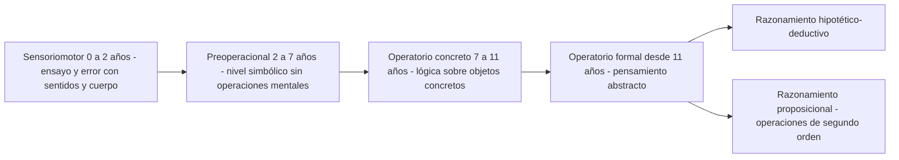
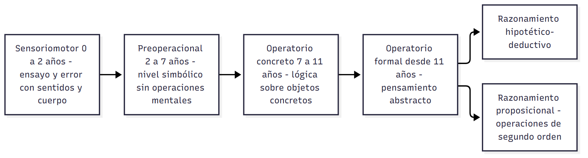
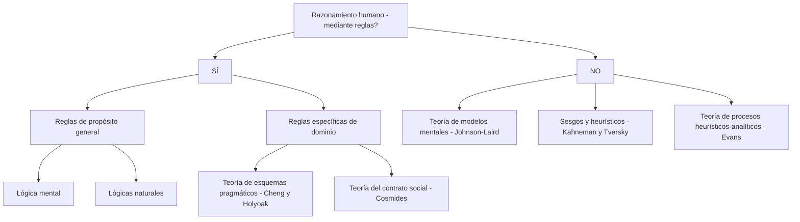
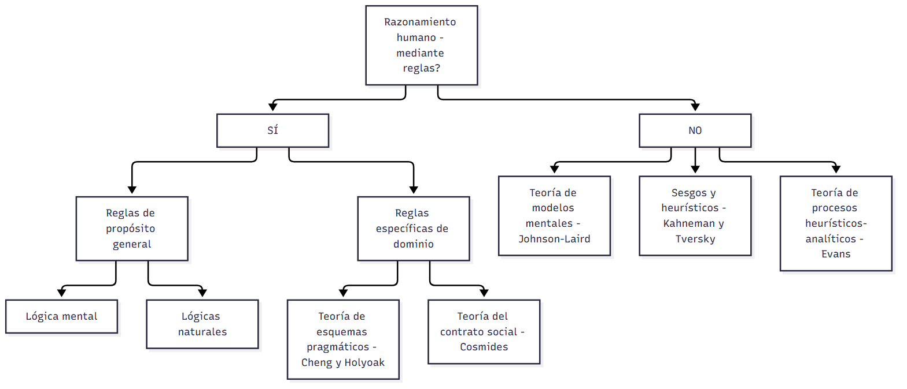
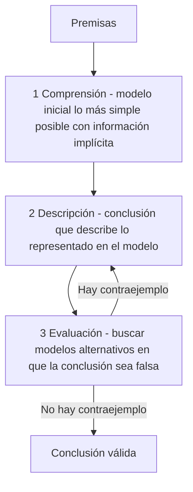
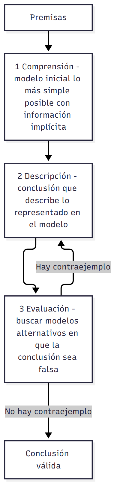
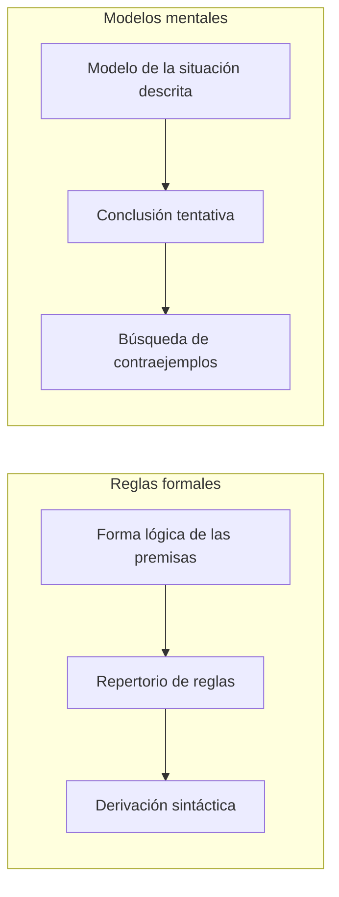
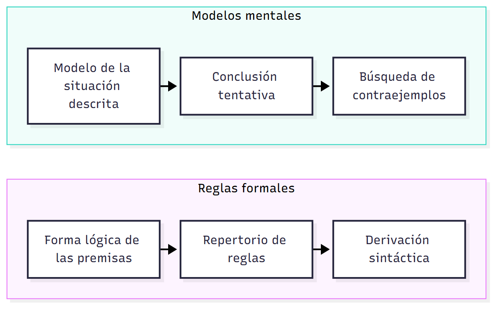

# U03 — Teorías y modelos sobre razonamiento

> **Fuentes:**
>
> - Cárdenas Poveda, C. (2026b). *Teorías y modelos sobre razonamiento* [Diapositivas de clase: Pensamiento, Clase 02]. Procesos Básicos III, Universidad Favaloro.
> - Quiroga, L. (2013). Razonamiento y representaciones mentales: Los límites entre lógica y psicología. *Praxis. Revista de Psicología, 15*(23), 69-92.
> - Valiña, M. D., y Martín, M. (2014). Razonamiento pragmático. En M. Carretero y M. Asensio (Coords.), *Psicología del pensamiento: Teoría y prácticas* (cap. 6, pp. 1-22). Alianza.
>
> **Materia:** Procesos Básicos III, 2.º año, Universidad Favaloro. Docente: Mg. Carolina Cárdenas Poveda. Unidad 3: Pensamiento.

> **Aviso sobre las fuentes:** (1) Las páginas de Valiña y Martín (2014) son las del PDF digitalizado (1-22), no las impresas del libro. (2) Las páginas de Quiroga (2013) son las del PDF (1-24); la página 1 del PDF es la 69 de la revista (suma 68 para citar la edición impresa). (3) La tabla de silogismos válidos de la diapositiva 22 llegó con errores de OCR y se reconstruyó (§5.2): contrastala con tu copia de la clase. (4) El problema THOG se menciona en la clase pero ninguna fuente de la unidad trae su enunciado (§4.8).

> **Idea-fuerza:** Durante décadas se supuso que razonar es aplicar reglas lógicas abstractas y de propósito general (Piaget y el pensamiento formal; la teoría de las reglas formales o «lógica mental»). Los datos experimentales lo desmintieron: las personas cometen muchos errores sistemáticos y su desempeño cambia según el **contenido** y el **contexto** del problema. De ahí surgen las alternativas: la **teoría de los modelos mentales** (Johnson-Laird: razonar es construir y evaluar representaciones de situaciones), las teorías **pragmáticas específicas de dominio** (esquemas pragmáticos, contrato social), el enfoque de **sesgos y heurísticos** y la teoría **heurístico-analítica** de Evans. Quiroga, por su parte, sostiene que el debate reglas/modelos no resolvió qué es el **formato cognitivo** del razonamiento y propone la **lógica default** (no-monótona) como puente entre lógica y psicología.

## Hilo conductor: cómo se conectan los temas de esta guía

La pregunta de fondo de esta clase es **¿razonamos aplicando reglas lógicas?** Todo el recorrido es la historia de una respuesta que se fue complicando. Empieza con la tesis más antigua y más intuitiva (§1-§3): razonar es inferir una conclusión nueva, y el punto de llegada del desarrollo es, para Piaget, el pensamiento **formal** (hipotético-deductivo y proposicional). La **teoría de las reglas formales** (la «lógica mental») traduce esa idea al razonamiento adulto: la mente posee reglas sintácticas de propósito general y las aplica en tres pasos.

Para ver qué predice esa teoría, la clase enseña el instrumental de la lógica (§4-§5): proposiciones, conectivas, tablas de verdad, el condicional con sus dos reglas válidas (MPP, MTT) y sus dos falacias (FAC, FNA), y el silogismo categórico. Con ese instrumental en la mano llega la **crítica empírica** (§6): las personas fallan mucho, y fallan de manera sistemática y dependiente del contenido. La tarea de selección de Wason (E-K-4-7 contra Manchester-tren) es la prueba emblemática. Si el contenido importa, la teoría sintáctica no alcanza, y de ahí se abren dos caminos que organizan lo que sigue.

El primero conserva la idea de que hay un mecanismo universal pero lo cambia: no son reglas sino **modelos mentales** (§7), representaciones de situaciones que se construyen, se integran y se ponen a prueba buscando contraejemplos; la dificultad ya no depende del número de pasos sino del número de modelos y de la memoria de trabajo. El segundo camino abandona el mecanismo universal y mira el **contenido** y el **contexto** (§8): esquemas pragmáticos de permiso y obligación (Cheng y Holyoak), contrato social y detección del tramposo (Cosmides), sesgos y heurísticos, y la teoría heurístico-analítica de Evans, que reparte el trabajo entre un estadio preconsciente que selecciona lo relevante y otro analítico que deduce. Esa discusión termina en una pregunta sobre la **racionalidad** (de propósito y de proceso).

El cierre (§9) lo da Quiroga: el debate reglas/modelos no explicó el **formato cognitivo**; la lógica default (no-monótona), que admite conclusiones revisables, acerca lógica, psicología y pragmática de la comunicación. Así el círculo se cierra: se empezó preguntando si razonamos con la lógica y se termina viendo que razonar es, sobre todo, **extraer información revisable del contexto**.

> 🎯 **Para el parcial:** cuando te pidan comparar teorías, ordená siempre por las **tres preguntas de Evans**: ¿qué explica la **competencia**?, ¿cómo explica el **contenido**?, ¿cómo explica los **errores o sesgos**? (Cárdenas Poveda, 2026b, diapositiva 30; Valiña y Martín, 2014, pp. 17-18). Con esas tres columnas, cada teoría queda ubicada y la comparación sale sola.

**En una sola oración:** el razonamiento humano no se ajusta a las reglas de la lógica formal sino al significado y al contexto, y las teorías contemporáneas (modelos mentales, esquemas pragmáticos, contrato social, heurístico-analítica, lógica default) son distintas maneras de explicar esa desviación.

## 0. Hoja de ruta

1. **Qué es razonar**: inferir una conclusión nueva; deducción vs. inducción y sus tipos (Cárdenas Poveda, 2026b, diapositiva 7).
2. **Piaget**: etapas del desarrollo cognitivo y el pensamiento **operatorio formal** como punto de llegada (razonamiento hipotético-deductivo y proposicional) (Cárdenas Poveda, 2026b, diapositivas 3-6).
3. **Teoría de las reglas formales / lógica mental**: razonar = aplicar reglas de inferencia que el sujeto posee; su historia y su evidencia neurofisiológica (Cárdenas Poveda, 2026b, diapositiva 8; Quiroga, 2013; Valiña y Martín, 2014).
4. **Razonamiento proposicional**: el lenguaje lógico-proposicional, tablas de verdad, conectivas, condicional, reglas válidas (MPP, MTT) y falacias (FAC, FNA) (Cárdenas Poveda, 2026b, diapositivas 9-19).
5. **Razonamiento silogístico categórico**: modo, figura, 256 silogismos y solo 24 válidos; el efecto «atmósfera» (Cárdenas Poveda, 2026b, diapositivas 20-24).
6. **Revisiones y críticas**: los datos no coinciden con la teoría; competencia vs. actuación; la tarea de selección de Wason; razonamiento formal vs. pragmático (Cárdenas Poveda, 2026b, diapositivas 25-29; Quiroga, 2013; Valiña y Martín, 2014).
7. **Teoría de los modelos mentales** (Johnson-Laird): qué es un modelo, estadios, el condicional con modelos, predicciones y evidencia neurofisiológica (Cárdenas Poveda, 2026b, diapositivas 30-39; Quiroga, 2013).
8. **Razonamiento pragmático**: esquemas pragmáticos (Cheng y Holyoak), sus críticas, teoría del contrato social (Cosmides), sesgos y heurísticos, teoría heurístico-analítica de Evans y el problema de la racionalidad (Valiña y Martín, 2014).
9. **Más allá del debate reglas/modelos**: formato cognitivo, lógica default (no-monótona) y pragmática de la comunicación (Quiroga, 2013).

## 🎯 Lo que entra sí o sí

1. Las **cuatro etapas de Piaget** y las **características funcionales** del pensamiento formal: razonamiento **hipotético-deductivo** (tres etapas y **esquema de control de variables**) y razonamiento **proposicional** (operaciones de segundo orden) (Cárdenas Poveda, 2026b, diapositivas 3-6).
2. **Teoría de reglas formales**: razonar = proceso formal y sintáctico en tres pasos (comprensión de la forma lógica → acceso al repertorio de reglas → derivación de la conclusión); «lógica mental» (Cárdenas Poveda, 2026b, diapositiva 8; Quiroga, 2013, p. 3-4).
3. **Tablas de verdad, conectivas y el condicional**: cuándo el condicional es falso; las dos reglas válidas (**modus ponendo ponens** y **modus tollendo tollens**) y las dos falacias (**afirmación del consecuente** y **negación del antecedente**), con los ejemplos de clase (Cárdenas Poveda, 2026b, diapositivas 13-18).
4. **Silogismo categórico**: proposiciones A/I/E/O, modo × figura = 256, solo 24 válidos; el efecto «atmósfera de las premisas» (Cárdenas Poveda, 2026b, diapositivas 20-24).
5. **Críticas**: tasas de éxito bajas (40-70%; un tercio de adultos por debajo del 30%), dependencia del contenido y del contexto, **competencia vs. actuación**, la **tarea de selección de Wason** (E-K-4-7; Manchester-tren) (Cárdenas Poveda, 2026b, diapositivas 25-27; Quiroga, 2013, p. 7-8).
6. **Modelos mentales** (Johnson-Laird, 1983): enfoque **semántico**; validez = no hay modelos alternativos que refuten la conclusión; tres estadios (comprensión, descripción/integración, validación); modelos implícitos en el condicional (Messi y Antonela); predicciones (1 modelo más fácil que varios; errores = modelos iniciales); competencia vs. actuación (Cárdenas Poveda, 2026b, diapositivas 31-39).
7. **Razonamiento pragmático**: esquemas de permiso y obligación (reglas P1-P4 y O1-O4), contrato social y detección del tramposo, teoría heurístico-analítica de Evans y racionalidad de propósito vs. de proceso (Valiña y Martín, 2014, p. 9-21).

---

## 1. ¿Qué es razonar?

**Razonar** es **inferir una conclusión nueva**: un proceso que permite extraer conclusiones a partir de premisas o de acontecimientos dados previamente (Cárdenas Poveda, 2026b, diapositiva 7). Valiña lo define en el mismo sentido: las **inferencias** consisten en «obtener una nueva información a partir de determinados supuestos o de otra información previa» (Valiña y Martín, 2014, p. 1).

La habilidad para razonar es fundamental en la vida cotidiana: muchos de nuestros juicios y decisiones dependen de ella, y no es exclusiva de la investigación científica ni de determinados profesionales (el médico que decide un tratamiento idóneo). Todos derivamos conclusiones de la información de que disponemos: cuando decidimos a qué partido votar, qué coche comprar o qué carrera estudiar (Valiña y Martín, 2014, p. 1).

La diapositiva 7 distingue dos grandes tipos de razonamiento:

| | **Deductivo** | **Inductivo** |
|---|---|---|
| Conclusión | **Única y verdadera** (necesaria) | **Conclusiones posibles** (probables) |
| Tipos | **Silogístico** (categórico) y **condicional** (proposicional) | **Inducción categórica** y **razonamiento probabilístico** |

(Cárdenas Poveda, 2026b, diapositiva 7.) Valiña agrega que la lógica garantiza que, en un argumento deductivo válido, si las premisas son verdaderas la conclusión es necesariamente verdadera; pero la mayor parte del razonamiento de la vida real es **inductivo o probabilístico**: a partir de experiencias específicas inducimos reglas por generalización, lo que permite emitir juicios y predecir situaciones nuevas. Estas inferencias no son necesarias, solo tienen cierto grado de probabilidad y suelen implicar un **aumento de la información semántica** que la deducción no supone (Valiña y Martín, 2014, p. 5-6). (El razonamiento inductivo se trata en otro capítulo del libro, el 7.)

> 🔑 **Punto clave:** deducción = conclusión necesaria (si las premisas son verdaderas y el argumento es válido, la conclusión es verdadera); inducción = conclusión probable que agrega información. Toda esta clase trata sobre todo del razonamiento **deductivo** (condicional y silogístico) y de por qué las personas no lo hacen como prescribe la lógica.

---

## 2. Piaget: el desarrollo del pensamiento y el pensamiento formal

### 2.1 Las etapas del desarrollo cognitivo

Jean Piaget (1896-1980) describió cuatro etapas del desarrollo cognitivo (Cárdenas Poveda, 2026b, diapositiva 3):

| Etapa | Edad | Qué caracteriza al pensamiento |
|---|---|---|
| **Sensoriomotor** | 0 a 2 años | Buscan comprender el mundo mediante el **ensayo y error**, usando los sentidos y el cuerpo. |
| **Preoperacional** | 2 a 7 años | Comienzan a pensar en el **nivel simbólico**, pero todavía no pueden realizar **operaciones mentales** (por ejemplo, pensar lógicamente o combinar elementos). |
| **Operatorio concreto** | 7 a 11 años | Comienzan a desarrollar un pensamiento **organizado y racional**: pueden usar el pensamiento lógico y operar sobre su cognición, **pero solo cuando se trata de objetos concretos**. |
| **Operatorio formal** | 11 años en adelante | Desarrollan el **pensamiento abstracto**: manipulan ideas abstractas sin necesidad de manipular objetos concretos. Tiene **características funcionales y estructurales**. |






### 2.2 De la lógica del niño a la lógica del adolescente (Piaget e Inhelder, 1955)

En *De la lógica del niño a la lógica del adolescente* (Piaget e Inhelder, 1955) se contrasta (Cárdenas Poveda, 2026b, diapositiva 4):

- **Operaciones concretas:** el sujeto solo puede pensar sobre los elementos de un problema **tal como se le presentan**. Si concibe situaciones posibles adicionales, solo puede percibirlas como una **prolongación de lo real**.
- **Operaciones formales:** el sujeto enfoca la resolución del problema **invocando todas las situaciones y las relaciones causales posibles** entre sus elementos; analiza lógicamente esas relaciones y trata de **confrontarlas con la realidad mediante la experimentación**. Lo real pasa a ser un caso dentro de lo posible.

Las **características funcionales** del pensamiento formal son sus rasgos generales: representan **estrategias o maneras de abordar y tratar los problemas** (Cárdenas Poveda, 2026b, diapositiva 4). Son dos:

### 2.3 Primera característica funcional: el razonamiento hipotético-deductivo

El adolescente **somete determinadas hipótesis a prueba** en tres etapas (Cárdenas Poveda, 2026b, diapositiva 5):

1. **Eliminación de las hipótesis admitidas hasta entonces.** Las más simples se descartan mediante la simple **evocación verbal o mental de contraejemplos**, que no necesitan ser demostrados en la práctica.
2. **Construcción de nuevas hipótesis**, con capacidad de usar elementos procedentes de **abstracciones**.
3. **Verificación de la nueva hipótesis** mediante el **análisis sistemático de todas las combinaciones posibles de las variables**. Se realiza mediante un **«esquema de control de variables»**: mantener constantes todos los factores del problema **menos uno**.

### 2.4 Segunda característica funcional: el razonamiento proposicional

Los análisis de hipótesis y enunciados se dan en **términos proposicionales y deductivos** (razonamiento proposicional). Ejemplo de clase: «Si tiro el péndulo con más fuerza, entonces se mueve más rápido» (Cárdenas Poveda, 2026b, diapositiva 6).

| Estadio | Sobre qué opera |
|---|---|
| **Operatorio concreto** (7 a 11 años) | Realiza operaciones mentales **directamente sobre los datos de la realidad**. |
| **Operatorio formal** (11 años en adelante) | **Convierte las operaciones directas o de primer orden en proposiciones** de naturaleza abstracta, independientes de la realidad concreta, y opera sobre ellas: realiza **operaciones sobre operaciones** (**operaciones de segundo orden**). |

(Cárdenas Poveda, 2026b, diapositiva 6.)

> 🔑 **Punto clave:** para Piaget, el pensamiento formal es el punto de llegada del desarrollo: un pensamiento **lógico, abstracto y basado en la estructura** de los problemas. Por eso Valiña ubica a Inhelder y Piaget (1955) dentro de la «lógica mental»: la mente dispondría de una lógica interna, abstracta y de propósito general que los adultos podemos usar eficazmente (Valiña y Martín, 2014, p. 3). Esta idea es la que van a cuestionar las críticas (§6).

---

## 3. La teoría de las reglas formales («lógica mental»)

### 3.1 Qué sostiene

La **teoría de reglas formales** concibe el razonamiento como la **aplicación de reglas mentales de inferencia que el sujeto posee**. La deducción es un **proceso formal y sintáctico** en tres pasos (Cárdenas Poveda, 2026b, diapositiva 8):

1. **Comprensión de la forma lógica** de los enunciados.
2. **Acceso al repertorio de reglas formales.**
3. **Derivación de la conclusión.**

Su núcleo es la **lógica mental**: las unidades involucradas en el razonamiento deductivo son **reglas formales** (Cárdenas Poveda, 2026b, diapositiva 8; Quiroga, 2013, p. 3). Quiroga lo formula así: la tesis de la lógica mental sostiene que el razonamiento deductivo procede con **estructuras formales** expresadas y definidas por la lógica proposicional; las inferencias deductivas resultan de la aplicación de **reglas formales** derivadas de un sistema axiomático o de **esquemas de inferencia** sobre representaciones, de modo que «razonar consiste en aplicar leyes o esquemas de inferencia» (Quiroga, 2013, p. 3-4). El ejemplo canónico es el **Modus Ponens**:

```
A → B
A
_____
B
```

De acuerdo con la tesis de la lógica mental (Yang et al., 2005), las **inferencias espontáneas** dependen de la aplicación de una o varias reglas de inferencia que concatenan una rutina de **«razonamiento directo»** (Quiroga, 2013, p. 4).

### 3.2 De dónde viene: la visión normativa de la lógica

Quiroga reconstruye el trasfondo filosófico (Quiroga, 2013, p. 2):

- Desde la **teoría silogística de Aristóteles** hasta la obra de **Frege** y la lógica formal de fines del siglo XIX, la lógica se focalizó en el **razonamiento deductivo**, entendido como resultado de reglas o esquemas de inferencia, con la **determinación de su validez** como objetivo central.
- Esto llevó a una **visión normativa** de la lógica: su función es **prescribir las formas adecuadas de razonamiento**. Esa visión limita la lógica al dominio de la validez y deja de lado la posibilidad de **describir** los razonamientos cotidianos deductivamente inválidos.
- En la lógica aristotélica, un argumento deductivo (silogismo categorial) es válido cuando la verdad de la conclusión está **garantizada por la verdad de las premisas**: «su validez no depende del significado de los términos involucrados» (Fisher, 2008, citado en Quiroga, p. 2).
- La visión normativa se apoya además en el **antipsicologismo de Frege**: en *El pensamiento: una investigación lógica* sostiene que los **pensamientos no son ni cosas del mundo exterior ni representaciones** (contenidos de la conciencia de un portador). Por lo tanto, lo que en psicología sería el contenido de una representación mental durante una deducción **no forma parte del objeto** de la lógica formal (Quiroga, 2013, p. 2).
- Según Fisher (2008), la visión normativa afirma la **naturaleza no cognitiva de la lógica**: niega (o no se pronuncia sobre) la posibilidad de que las oraciones de un sujeto representen hechos. De allí la oposición clásica: **psicología descriptiva** (describe secuencias reales de razonamiento) vs. **lógica normativa** (busca la validez) (Quiroga, 2013, p. 13).

A fines del siglo XIX el desarrollo de la lógica formal llevó a tratar el razonamiento como un **cálculo proposicional**, con métodos en parte derivados de la lógica matemática, que caracteriza los razonamientos **en virtud de su forma y no de su contenido**. De esa tradición deriva la tesis de la **«lógica mental»** (Quiroga, 2013, p. 4).

### 3.3 Historia psicológica de la teoría (Valiña y Martín, 2014)

- Es la alternativa teórica **más antigua**: se remonta a **Platón** (Smith, Langston y Nisbett, 1992) y propone que el razonamiento se guía por reglas **formales, abstractas, de propósito general** (Valiña y Martín, 2014, p. 3).
- En las décadas de 1950 y 1960 se desarrolló su versión psicológica, la **«lógica mental»** (nombre de Johnson-Laird, 1983): la mente dispone de una lógica interna, abstracta y de propósito general que los adultos usamos eficazmente (**Inhelder y Piaget, 1955**) (Valiña y Martín, 2014, p. 3).
- Su principal defensora, **Mary Henle** (1962), sostiene que el razonamiento humano es **siempre lógico**, y que los errores de los experimentos se deben a que los sujetos **no aceptan la tarea como lógica** o **comprenden mal las premisas** (Valiña y Martín, 2014, p. 4).
- Desde los años setenta surgen las **lógicas naturales**: enfoques sintácticos que, pese a sus diferencias, proponen un sistema similar: el sujeto descubre la **estructura lógica** de la tarea, accede a su **repertorio mental de reglas abstractas** y selecciona una **regla de inferencia elemental** o elabora una **derivación mental o prueba** de la conclusión (Osherson, 1975; Johnson-Laird, 1975; Braine, 1978; Rips, 1983; Braine y O'Brien, 1991; revisión en Rips, 1994) (Valiña y Martín, 2014, p. 4).
- Para esta teoría, los **errores** se deben a dos factores: el **número de pasos** de la derivación y la mayor o menor **accesibilidad de las reglas** necesarias (Rips, 1983) (Valiña y Martín, 2014, p. 18).

### 3.4 Evidencia neurofisiológica a favor de la lógica mental (Quiroga, 2013)

Las neurociencias cognitivas trasladaron el debate reglas/modelos al plano de los **correlatos neurofisiológicos**; como hay evidencia para ambas tesis, hace falta reflexionar sobre sus fundamentos (Quiroga, 2013, p. 3). Las bases neurofisiológicas del razonamiento se asocian esencialmente a **redes fronto-parietales** (Quiroga, 2013, p. 4):

- **Reverberi et al. (2007)**: neuroimagen relacionada a eventos; durante el razonamiento condicional (**Modus Ponens**) y la conjunción disyuntiva se activa el **giro frontal inferior** (áreas de Brodmann **BA 44 y 6**) y una región de la **corteza parietal inferior (BA 40)** (Quiroga, 2013, p. 4).
- **Monti et al. (2007)**: la actividad cortical en la deducción se representa mejor como **una sucesión de etapas que transforman progresivamente las premisas hacia una conclusión**. Proponen una red distribuida en regiones **prefrontal inferior** y **frontal superior**, **lateralizada en el hemisferio izquierdo**, con contribuciones parietales (Quiroga, 2013, p. 5). La red se disocia en:
  - regiones **contenido-independientes** (**BA 10p y BA 8**): representan y transforman las **estructuras formales**; BA 10p interviene en variadas operaciones, en especial las relacionadas con logros; BA 8, en el **control ejecutivo** (Posner y Dehaene, 1994);
  - regiones **contenido-dependientes** (**BA 6, 7, 40 y 47**): mantienen la identidad de las variables lógicas en función del **contexto léxico**; BA 47 se vincula con el procesamiento de contenido abstracto y BA 6 con conductas motoras como el movimiento del ojo en la lectura (Quiroga, 2013, p. 5).
  - Conclusión de los autores: el razonamiento es una transición de etapas ligada a la **corteza prefrontal rostro-lateral (BA 10p)**, asociada a funciones ejecutivas que **manipulan conectivas lógicas**, sin activación de estructuras parietales del hemisferio derecho; esto apoyaría que el razonamiento procede con las reglas que describe la lógica formal (Quiroga, 2013, p. 5).
  - **El experimento I**: 22 sujetos (10 hombres y 12 mujeres) enfrentados a **8 formas condicionales**, divididas en argumentos válidos e inválidos, complejos y simples. En la figura 1 del artículo, las áreas activadas por la lectura inicial (primeros 2 segundos de cada ensayo) se ven en amarillo; las aisladas por el contraste deducción compleja-simple, en verde; la región **insular**, en rosa, responde en ambas tareas (Quiroga, 2013, p. 5-6). Los estímulos tenían una versión en lenguaje natural («Si el bloque es rojo o cuadrado, entonces no es grande. El bloque es grande. ∴ No es rojo») y una versión **abstracta** con pseudopalabras («Si hay sug o rop, entonces no hay tuk. Hay sug. ∴ No hay tuk») (Quiroga, 2013, p. 6).

### 3.5 Críticas a la tesis de la lógica mental (Quiroga, 2013)

- **Objeción central:** no hay evidencia del vínculo entre la aplicación de reglas formales y la **conducta real** de los razonadores (Quiroga, 2013, p. 6).
- En lógica clásica la semántica es **veritativo-funcional**: lo que define la validez es la **forma** y no el contenido. Por eso las reglas de derivación **no explican los procesos mentales que gobiernan las deducciones de la vida ordinaria** (Quiroga, 2013, p. 6).
- Pensar el razonamiento como lógica mental no muestra **cómo se representan ni cómo se adquieren las condiciones de verdad de las conectivas**, y reduce el razonamiento a un **«relleno» de las formas lógicas** de las premisas junto con reglas que permiten derivar la conclusión (Quiroga, 2013, p. 6-7).
- Para **Johnson-Laird (1983)**, la explicación por esquemas de inferencia presenta un **problema empírico**: falta de evidencia de que la mente posea **esquemas de deducción natural**. Para él, los **procedimientos efectivos** son el criterio de explicación psicológica: las teorías psicológicas deben poder exponerse y evaluarse en términos de procedimientos efectivos (Quiroga, 2013, p. 7). (La tarea de las cartas, que es el ejemplo que da Quiroga, está en §6.3.)
- Valiña coincide: las críticas más severas se centraron en la **debilidad de las teorías de reglas formales para explicar la influencia del contenido y del contexto** (Evans, 1991; Johnson-Laird y Byrne, 1991; Evans, Newstead y Byrne, 1993) (Valiña y Martín, 2014, p. 4).

> 🔑 **Punto clave:** lógica mental = las unidades del razonamiento son **reglas formales sintácticas**, insensibles al contenido. Fuerte en lo normativo, débil para explicar errores y efectos de contenido.

---

## 4. El razonamiento proposicional

### 4.1 Definición y propiedades del lenguaje lógico-proposicional

El **razonamiento proposicional** es el proceso de razonamiento humano sobre situaciones en las que se maneja el **cálculo proposicional** o lenguaje lógico-proposicional: se efectúa mediante las **relaciones entre proposiciones y partículas de unión**. Sirve para **representar el conocimiento** y las **operaciones de transformación** que se producen sobre él (Cárdenas Poveda, 2026b, diapositiva 9).

Propiedades del lenguaje lógico-proposicional (Cárdenas Poveda, 2026b, diapositiva 10):

- **Abstracto y universal.**
- **No es semántico**: no importa el contenido.
- **No es lingüístico.**
- **Es diferente del lenguaje natural.**
- **Potente y parsimonioso.**

### 4.2 Estructura: proposiciones y conectivas

- **Proposiciones**: unidades mínimas del discurso **sujetas a valores de verdad** (se notan P, Q…).
- **Conectivas**: establecen una relación entre las proposiciones.

Ejemplo: «(P) Si llueve **entonces** (Q) Juana lleva paraguas» (Cárdenas Poveda, 2026b, diapositiva 11).

### 4.3 Tablas de verdad

Los valores de verdad de las proposiciones pueden establecerse mediante **tablas de verdad**. Con 1 proposición hay 2 combinaciones (V, F); con 2 proposiciones, 4 (VV, VF, FV, FF); con 3 proposiciones, 8 (VVV, VVF, VFV, VFF, FVV, FVF, FFV, FFF) (Cárdenas Poveda, 2026b, diapositiva 12).

### 4.4 Conectivas binarias

| Conectiva | Se traduce como | Cuándo es verdadera | P=V, Q=V | V, F | F, V | F, F |
|---|---|---|---|---|---|---|
| **Conjunción** (P ∧ Q) | «y» | Solo cuando **ambas** son verdaderas | V | F | F | F |
| **Disyunción inclusiva** (P ∨ Q) | «o» | Cuando **al menos una** es verdadera (falsa solo si ambas son falsas) | V | V | V | F |
| **Disyunción exclusiva** | «uno u otro» | Solo cuando **una es verdadera y la otra falsa** | F | V | V | F |

(Cárdenas Poveda, 2026b, diapositiva 13.)

### 4.5 El condicional

El **condicional** es un tipo particular de conectiva: corresponde a las partículas **«si... entonces...»** y produce un valor **falso solamente cuando la primera proposición (el antecedente) es verdadera y la segunda (el consecuente) es falsa**; en todos los demás casos es verdadero (Cárdenas Poveda, 2026b, diapositiva 14). Ejemplo: «Si (P) sale el sol, entonces (Q) salgo a correr».

| P (antecedente) | Q (consecuente) | P → Q |
|---|---|---|
| V | V | V |
| V | F | **F** |
| F | V | V |
| F | F | V |

### 4.6 Las dos reglas válidas del condicional

Los **modos o reglas del condicional** son las ocasiones en que la conclusión **es predecible** (Cárdenas Poveda, 2026b, diapositivas 15-16). Se razona «buscando la verdad y eliminando la falsa» en la tabla:

- **Modus ponendo ponens (MPP).** Ejemplo: un compañero de trabajo nos asegura «Si voy a la heladería, te traigo un helado». Si cumple su palabra y va a la heladería, ¿podemos estar seguros de que nos va a traer el helado? Sí: **a partir de la verdad de un condicional y de la verdad del antecedente, podemos afirmar la verdad del consecuente** (P → Q; P; ∴ Q) (Cárdenas Poveda, 2026b, diapositiva 15).
- **Modus tollendo tollens (MTT).** Ejemplo: «Si quieres conocer la literatura argentina, tienes que leer a Cortázar», y conocemos a un amigo que **no** ha leído a ese autor: ¿podemos concluir que no conoce la literatura argentina? Sí: **de la verdad de un condicional (P → Q) y de la negación del consecuente (¬Q) podemos extraer con certeza la falsedad del antecedente (¬P)** (Cárdenas Poveda, 2026b, diapositiva 16).

### 4.7 Las dos falacias del condicional

Las **falacias** no permiten sacar conclusiones (Cárdenas Poveda, 2026b, diapositivas 17-18):

- **Falacia de afirmación del consecuente (FAC).** Ejemplo: «Este individuo se metió en política hace tiempo, y, ya sabés, si no servís para nada, metete en política. ¿Qué conclusión podemos sacar?». Ninguna necesaria: **de la verdad de un condicional y de la verdad del consecuente no hay conclusión proposicional válida** (P → Q; Q; ∴ ? — en la tabla, Q verdadero es compatible con P verdadero y con P falso) (Cárdenas Poveda, 2026b, diapositiva 17).
- **Falacia de negación del antecedente (FNA).** Ejemplo: «Si quieres conocer la literatura argentina, tienes que leer a Cortázar», y conocemos a un amigo que **no conoce** la literatura argentina: ¿podemos concluir que no leyó a Cortázar? No: **de la verdad de un condicional (P → Q) y la falsedad del antecedente (¬P) no podemos concluir la falsedad del consecuente (¬Q)** (Cárdenas Poveda, 2026b, diapositiva 18).

| Forma | Premisa categórica | Conclusión | ¿Válida? |
|---|---|---|---|
| MPP | P | Q | Sí |
| MTT | ¬Q | ¬P | Sí |
| FAC | Q | (P) | No |
| FNA | ¬P | (¬Q) | No |

Perkins (1989) cuenta estas dos falacias (negación del antecedente y afirmación del consecuente) como el primer tipo de error del razonamiento cotidiano: los **errores formales o falacias lógicas** (Valiña y Martín, 2014, p. 7; ver §6.4).

### 4.8 Un ejemplo de tarea: el problema THOG

La clase menciona el **problema THOG** (Peter Wason & Brooks, 1979) como ejemplo de tarea de razonamiento proposicional (Cárdenas Poveda, 2026b, diapositiva 19). Valiña lo ubica entre los **paradigmas experimentales específicos** que surgieron en la década de 1960 con los trabajos de Peter Wason, junto con la **tarea de selección** y el **problema «2-4-6»** (revisión en Newstead y Evans, 1995) (Valiña y Martín, 2014, p. 2). (Las fuentes de la unidad no reproducen su enunciado.)

---

## 5. El razonamiento silogístico categórico

### 5.1 Definiciones

- **Silogismo categorial:** inferencia a partir de **dos premisas** en la que tanto estas como la conclusión son **proposiciones categóricas** (Cárdenas Poveda, 2026b, diapositiva 20).
- **Proposición categórica:** enunciado en el que se establece una **relación de cuantificación entre dos términos: sujeto y predicado**. Comúnmente aparece un **término medio** que permite relacionar las premisas entre sí (Cárdenas Poveda, 2026b, diapositiva 20).

### 5.2 Modo y figura

1. **Modo**: combina **cantidad** (universal-particular) y **polaridad** (afirmativa-negativa) (Cárdenas Poveda, 2026b, diapositiva 21):

| Tipo (código usado en la diapositiva 22) | Forma |
|---|---|
| **A** — Universal afirmativa | Todos los A son B |
| **I** — Particular afirmativa | Algún A es B |
| **E** — Universal negativa | Ningún A es B |
| **O** — Particular negativa | Algún A no es B |

2. **Figura**: depende de la posición del término medio en las premisas. Combinando modos y figuras: **4 × 4 × 4 × 4 = 256 silogismos**, de los cuales **solo 24 son válidos** (Cárdenas Poveda, 2026b, diapositiva 21).

Silogismos válidos según su estructura interna (modo × figura) (Cárdenas Poveda, 2026b, diapositiva 22; reconstrucción de la tabla, que llegó con errores de OCR):

| Figura | Modos válidos |
|---|---|
| 1 | AAA, AAI, AII, EAE, EAO, EIO |
| 2 | AEE, AEO, AOO, EAE, EAO, EIO |
| 3 | AAI, AII, EAO, EIO, IAI, OAO |
| 4 | AAI, AEE, AEO, EAO, EIO, IAI |

Ejemplos de silogismos estructuralmente válidos en cada figura (Cárdenas Poveda, 2026b, diapositiva 23):

- **Figura 1:** Todos los españoles son europeos / Todos los madrileños son españoles / ∴ Todos los madrileños son europeos.
- **Figura 2:** Todos los españoles son europeos / Ningún chileno es europeo / ∴ Ningún chileno es español.
- **Figura 3:** Todos los madrileños son españoles / Todos los madrileños son europeos / ∴ Algunos europeos son españoles.
- **Figura 4:** Todos los madrileños son españoles / Todos los españoles son europeos / ∴ Algunos europeos son madrileños.

Fijate cómo cambia la posición del término medio («españoles», «europeos» o «madrileños», según el caso) entre las dos premisas: eso es lo que define la figura.

### 5.3 Lo que muestran los experimentos: el efecto atmósfera

Los **resultados experimentales no coinciden con la teoría**: las personas se dejan llevar por la **«atmósfera de las premisas»** (Cárdenas Poveda, 2026b, diapositiva 24), es decir, por el tono global (universal/particular, afirmativo/negativo) de las premisas y no por su estructura lógica. Valiña recuerda que precisamente en el área del razonamiento silogístico surgió el interés por dos cuestiones centrales de la psicología cognitiva: **a)** la influencia de factores del **contenido** (Wilkins, 1928) y **b)** la importancia de **factores no lógicos** (Woodworth y Sells, 1935; Sells, 1936; véanse García Madruga, 1982, 1983, 1989) (Valiña y Martín, 2014, p. 2). Las primeras investigaciones con silogismos categóricos como tarea son de comienzos del siglo XX (Störring, 1908), y el primer modelo teórico del razonamiento silogístico lo formuló **Erickson en 1974** (Valiña y Martín, 2014, p. 2).

---

## 6. Revisiones y críticas a la teoría de las reglas formales

### 6.1 Lo que pasa en la práctica

Cuando las personas se enfrentan a tareas con proposiciones y conectivas **no siempre se comportan como predice el modelo lógico**: hay un **gran número de errores y sesgos**, y las respuestas correctas **varían según el contenido y el contexto** (Cárdenas Poveda, 2026b, diapositiva 25).

Datos (Cárdenas Poveda, 2026b, diapositiva 26):

- El porcentaje de éxito en estas pruebas varía **entre 40% y 70%** en estudiantes universitarios y adultos.
- **Una tercera parte** de los sujetos adultos examinados estaba **por debajo del 30% de éxito**.

Consecuencias (Cárdenas Poveda, 2026b, diapositiva 26):

- Adolescentes y adultos tienen un tipo de pensamiento que **no funciona basándose solamente en la estructura de los problemas, sino también en su contenido**: el pensamiento **no sería solamente «formal»**.
- Se **cuestiona la universalidad de las operaciones formales** → búsqueda de nuevas explicaciones.

Valiña lo confirma: en todas las investigaciones empíricas se observa que **sujetos adultos e inteligentes cometen errores** incluso en tareas de estructura formal muy sencilla (Valiña y Martín, 2014, p. 18).

### 6.2 ¿Son las operaciones formales el estadio final del desarrollo?

La diapositiva 27 plantea dos revisiones de Piaget:

1. **Competencia vs. actuación:** lo que un adulto **es capaz de hacer** (competencia) es diferente de **cómo realiza** (actuación) una tarea determinada. Los adultos muestran fallas o limitaciones en función de:
   1. **La tarea** (modo de presentación, demandas específicas).
   2. **El sujeto** (diferencias individuales, nivel educativo, etc.).
   3. **El conocimiento previo.**
2. **La idea de «lógica pura» es inconsistente:** las tareas usadas por Inhelder y Piaget implican un **tipo particular de razonamiento**; se estudia el pensamiento más bien como **pensamiento científico**.

Actualmente, en la psicología cognitiva surge con fuerza la idea de que los seres humanos somos **procesadores biológicos de información**: nuestro comportamiento y conocimiento del mundo responden más a **aspectos funcionales que a aspectos formales** (Cárdenas Poveda, 2026b, diapositiva 28). La pregunta que abre la segunda mitad de la clase es: **¿qué pasa con los aspectos pragmáticos y semánticos?** (Cárdenas Poveda, 2026b, diapositiva 29).

### 6.3 La tarea de selección de Wason (las cuatro cartas)

Es el experimento que Quiroga presenta como ejemplo de **procedimiento efectivo** (Wason y Johnson-Laird, 1972). Su finalidad era mostrar que el razonamiento proposicional deductivo **no es el resultado de un proceso de derivación sintáctico**, sino de **conocer las condiciones de verdad de las conectivas**, la habilidad para **sustituir un valor de verdad por una proposición** y la capacidad para **trabajar sobre los efectos de esa sustitución** en una proposición compleja (Johnson-Laird, 1983, citado en Quiroga, p. 7).

**Versión abstracta** (Quiroga, 2013, p. 7):

- El experimentador pone 4 cartas frente al sujeto: **E · K · 4 · 7**.
- Se le informa que cada carta tiene **un número de un lado y una letra del otro**.
- Regla: **«Si una carta tiene una vocal en un lado, entonces tiene un número par en el otro»**.
- Tarea: **seleccionar las cartas que hay que dar vuelta** para averiguar si la generalización es verdadera o falsa, es decir, qué cartas son **relevantes** para su valor de verdad.
- **Resultado:** casi todos los sujetos consideran necesario dar vuelta la carta con la **vocal (E)**: si tiene un número par, la generalización no queda afectada; si tiene un impar, es falsa.
- Pero la decisión de dar vuelta la vocal **equivale** a la de dar vuelta el **número impar (7)**: ambas podrían revelar una **vocal combinada con un número impar** y refutar la regla. **Respuesta correcta: E y 7** (en términos lógicos, p y no-q).
- Moraleja: la tarea muestra la **dificultad de coordinar principios sintácticos** en las inferencias **con independencia del contenido** de los materiales (Quiroga, 2013, p. 7).

**Versión temática** (Wason y Shapiro, 1971; Johnson-Laird, 1983): se sustituyen letras y números por **destinos de viaje y medios de transporte**: cartas **Manchester · Sheffield · Tren · Automóvil**, regla **«Cada vez que viajo a Manchester, viajo en tren»**. Aquí el **60%** de los sujetos considera necesario dar vuelta la carta «Automóvil» (si del otro lado dice «Manchester», la regla es falsa). La elección correcta **aumenta** con **materiales reales** o con **condiciones deónticas** (representación de leyes) (Quiroga, 2013, p. 8).

Conclusión de Johnson-Laird: hay inferencias válidas que proceden **sin reglas ni esquemas de inferencia**, y estos resultan insuficientes para definir el significado de las conectivas y caracterizar los procesos. Como hipótesis, los sujetos, en lugar de pensar de forma veritativo-funcional, **construyen modelos de los estados de cosas descritos en las premisas** sobre la base de su **conocimiento general** y de **contexto**, y siguen **heurísticas extra-lógicas** guiadas por principios que mantienen el contenido semántico de las premisas con mayor **economía lingüística** (Quiroga, 2013, p. 8). En síntesis, la objeción a la lógica mental es que los recursos de la lógica formal no ponen en evidencia el **rol de la información (contextual, perceptual)** durante la deducción, y por eso su capacidad descriptiva de los razonamientos cotidianos es limitada (Quiroga, 2013, p. 8).

Ojo: Quiroga advierte que esta objeción supone que la lógica formal es **puramente sintáctica** (porque usa métodos como la **teoría de la prueba**, la rama de la lógica matemática que trata a las demostraciones como objetos matemáticos). Para él ese supuesto **no es del todo correcto**: los modelos computacionales muestran un **nexo entre lógica y psicología** (ver §9) (Quiroga, 2013, p. 8).

La tarea de selección es también el gran campo de prueba de las teorías pragmáticas (§8): Valiña la cita como tarea de Wason (1966, 1968) y como uno de los paradigmas que él creó en los años sesenta (Valiña y Martín, 2014, p. 2, 10).

### 6.4 Razonamiento formal vs. razonamiento pragmático (Valiña y Martín, 2014)

**Pragmática** es el estudio del uso práctico del lenguaje y de su interpretación en contextos específicos (Valiña y Martín, 2014, p. 4). La comprensión cotidiana del lenguaje se apoya en **inferencias que elaboramos sin esfuerzo, sin conciencia y muy eficazmente** (Valiña y Martín, 2014, p. 5):

- **«La hermana de Luis está enferma»**: no solo atribuimos un estado (enferma) a una persona, sino que **presuponemos que Luis tiene una hermana**. Esto se debe a que toda conversación establece un **principio de cooperación** entre hablante y oyente (Grice, 1975): el oyente asume que el hablante es **veraz** y que da **toda la información necesaria** para representar de forma plausible aquello de lo que se habla (Valiña y Martín, 2014, p. 5).
- **El vagón-restaurante**: «Juan y María están comiendo en el vagón-restaurante. Él ha pedido sopa de primer plato, y ella, una ensalada. El tren entró en un túnel. A la salida del túnel, el camarero debió acercarse a la mesa para tratar de limpiar la camisa de Juan». Para entenderlo inferimos que son dos personajes que viajan en tren, que «él» es Juan y «ella» María, que por la oscuridad del túnel y porque la sopa es líquida a Juan **se le cayó la sopa sobre la camisa**, y que pidió ayuda al camarero. Nada de eso está explícito: son **inferencias implícitas** a partir del conocimiento del mundo (Valiña y Martín, 2014, p. 5).

Esta comprensión ordinaria contrasta con la **comprensión analítica** que exige evaluar la validez de un argumento formal: hay que **suprimir el conocimiento del mundo** y ajustarse a teorías normativas como la lógica formal o la estadística (Valiña y Martín, 2014, p. 5).

**Nickerson (1986):** los argumentos pueden ser **directos o indirectos, completos o incompletos, formales o informales**. Un **argumento formal** es una secuencia de afirmaciones (premisas) de la que se sigue **necesariamente** la conclusión si el razonamiento es lógico. Si las premisas son verdaderas, la conclusión debe ser verdadera: es **imposible deducir una conclusión falsa de premisas verdaderas**; en cambio, de premisas falsas puede deducirse una conclusión **verdadera o falsa**. Las inferencias deductivas válidas se elaboran con **total certeza** (Valiña y Martín, 2014, p. 5).

La mayor parte de la investigación se hizo con tareas formales porque están **bien definidas** (Mayer y Revlin, 1978) y pueden juzgarse válidas o no con criterios normativos; de un **argumento plausible**, en cambio, solo puede decirse que es **más o menos convincente** (Valiña y Martín, 2014, p. 6). Ejemplo — dos argumentos opuestos sobre el **sistema de jurados** (Valiña y Martín, 2014, p. 6):

1. *A favor*: en todos los países debería implantarse; la justicia sería más eficaz porque no sentenciaría una sola persona (el juez); bajaría el riesgo de condenar a un inocente porque los jurados adoptarían la perspectiva del acusado; disminuirían los errores porque usarían su conocimiento del mundo y sus eficaces estrategias de razonamiento cotidiano.
2. *En contra*: en ningún país debería implantarse; debe sentenciar un profesional (el juez) aunque la justicia sea menos participativa; no disminuiría el riesgo de condenar a un inocente porque los jurados no adoptarían la perspectiva del acusado; los errores aumentarían porque los jurados se verían afectados por su conocimiento del mundo y por los sesgos del razonamiento cotidiano.

Algunas personas estarán de acuerdo con uno y otras con el otro: **los dos son plausibles** (Valiña y Martín, 2014, p. 6).

La **lógica convencional** es un sistema de reglas y axiomas que, independientemente del contenido y del contexto, prescribe cuándo un argumento es válido: conduce a conclusiones necesarias en un sistema **bivalórico** (verdadero/falso). Pero las personas no interpretamos las premisas de ese modo restrictivo: usamos **cuantificadores probabilísticos o no convencionales** («la mayoría», «bastantes», «varios», «pocos») y **modificadores o marcadores lingüísticos** («en principio», «posiblemente», «en cierta manera») que matizan la pertenencia a una categoría y **modulan el razonamiento pragmático** (Valiña, 1985; Valiña y De Vega, 1988) (Valiña y Martín, 2014, p. 6).

Además, muchos problemas reales **no están bien definidos**: hay premisas implícitas, no está claro el objetivo ni los medios, e incluso hay incertidumbre sobre si se llegó a la mejor solución (por ejemplo, el **problema del aumento del paro** no tiene la misma solución para alguien que halló su primer empleo que para un empresario) (Valiña y Martín, 2014, p. 6-7).

| Razonamiento **formal** | Razonamiento **informal / pragmático** |
|---|---|
| Matemático, conceptual | No matemático o no cuantitativo, empírico |
| Necesario, deductivo | Contingente, no deductivo |
| Algorítmico | Heurístico |
| Basado en la **forma** del argumento | Basado en el **contenido** de las premisas |
| Básicamente académico | Conectado con el razonamiento cotidiano |

(Johnson y Blair, 1991; Galotti, 1989; en Valiña, p. 7.) En la vida real los criterios formales y lógicos son de dudosa utilidad (De Vega, 1981) y surgen **heurísticos** que usamos porque son **eficientes y adaptativos** en los ámbitos ecológicos y sociales (De Vega, 1984), aunque pueden llevar a errores y sesgos (Valiña y Martín, 2014, p. 7).

**Perkins (1989)** distingue tres tipos de errores en el razonamiento cotidiano (Valiña y Martín, 2014, p. 7):

1. **Errores formales o falacias lógicas** (negación del antecedente y afirmación del consecuente en la inferencia condicional).
2. **Falacias informales** (por ejemplo, el **recurso a la autoridad**: apelar a la opinión de un experto sin advertir que una idea no es necesariamente cierta porque la apoye un experto).
3. **Errores en la modelación o simulación mental** de la situación, que puede ser incompleta, estar sesgada o ambas cosas.

### 6.5 Un poco de historia y el mapa de teorías (Valiña y Martín, 2014)

- La investigación psicológica sobre razonamiento se remonta a **Binet (1886)**. Al principio se usaban problemas deductivos para **medir la capacidad intelectual** (Burt, 1919, 1921) y para **diagnosticar grupos clínicos** con trastornos del pensamiento (Von Domarus, 1944) (Valiña y Martín, 2014, p. 2).
- Durante décadas se usaron como tareas experimentales **problemas de la lógica formal**, para contrastar las destrezas inferenciales de los sujetos con los sistemas normativos. Aspecto positivo: la lógica actuó como **heurístico** que propició muchas investigaciones. Consecuencias no deseadas (Valiña y Martín, 2014, p. 2-3):
  - **a)** surgimiento **tardío** de modelos explicativos (el primero en **inferencia transitiva** es de **Hunter, 1957**; en silogístico, de **Erickson, 1974**);
  - **b)** un debate centrado en **«la racionalidad humana»**: unos querían demostrar que el razonamiento se ajusta a los sistemas normativos; otros, que está influido por factores **extralógicos** (semánticos, lingüísticos, pragmáticos);
  - **c)** **retraso de las teorías generales**: según **Evans (1989, 1991)**, de las cuatro alternativas teóricas actuales en razonamiento deductivo, **solo la de reglas formales** estaba claramente articulada a comienzos de los ochenta.
- Desde el punto de vista psicológico, la cuestión principal no es la racionalidad sino **cuáles son los procesos** del razonamiento. Desde los ochenta el debate gira en torno a: **¿se basa el razonamiento humano en la aplicación de un conjunto de reglas?** (Valiña y Martín, 2014, p. 3).

**Cuadro 6.1 — Aproximaciones teóricas** (Valiña y Martín, 2014, p. 3-4):






En los ochenta surgen los enfoques que se enfrentan a las reglas formales: por un lado, la **teoría de esquemas pragmáticos** (Cheng y Holyoak, 1985, 1989) y la **teoría del contrato social** (Cosmides, 1989), con reglas **específicas de dominio y sensibles al contexto**; por otro, el **enfoque semántico** de Philip Johnson-Laird, la **teoría de modelos mentales** (Johnson-Laird, 1983; Johnson-Laird y Byrne, 1991), para la cual el razonamiento depende de la elaboración, manipulación y evaluación de modelos mentales. En la misma línea surgieron el enfoque de **sesgos y heurísticos** (Kahneman y Tversky, 1972, 1973; Kahneman, Slovic y Tversky, 1982) y la **teoría de procesos heurísticos/analíticos** de Evans (1984, 1989) (Valiña y Martín, 2014, p. 4). Hay cierto consenso en que las teorías **específicas de dominio**, junto con los **heurísticos**, son las que explican con mayor facilidad el razonamiento en **contextos pragmáticos del mundo real** (Valiña y Martín, 2014, p. 4).

---

## 7. La teoría de los modelos mentales (Johnson-Laird)

### 7.1 Los interrogantes del área

Evans (1991) formuló las tres preguntas que una teoría del razonamiento tiene que responder (Cárdenas Poveda, 2026b, diapositiva 30):

- ¿Qué mecanismo es responsable de la **competencia lógica**?
- ¿Qué produce los **errores y sesgos** en el razonamiento?
- ¿Por qué la ejecución en razonamiento es tan **dependiente del contenido y del contexto** del problema?

(Valiña las resume como las tres cuestiones de Evans, 1991, 1993: **competencia, contenido y sesgo**; Valiña y Martín, 2014, p. 17-18.)

### 7.2 Qué es un modelo mental

**Johnson-Laird (1983)** (Cárdenas Poveda, 2026b, diapositiva 31):

- Los modelos mentales son **representaciones de situaciones reales o imaginarias**.
- Pueden construirse desde **percepciones, la imaginación o el discurso**.
- Es un **enfoque semántico** del razonamiento: no importan tanto las reglas sino el **contenido y la interpretación** de las cosas, es decir, su **significado**.
- Ponen en juego la **memoria de trabajo**.
- Es importante la capacidad para **combinar nuestras unidades de representación**.
- **Un argumento es válido cuando no hay modelos mentales alternativos de las premisas que sean compatibles con la negación de la conclusión** (la diapositiva lo dice así: cuando no hay modelos alternativos «compatibles con la conclusión» que la refuten; ver el estadio 3 en §7.4).

Quiroga desarrolla la tesis (Quiroga, 2013, p. 3, 8-9):

- El razonamiento resulta de la construcción de **estructuras analógicas que reflejan estados de cosas del mundo** (Johnson-Laird, 1980, 1983, 1988; Johnson-Laird y Byrne, 1991). Los modelos establecen una **relación de isomorfismo** con los estados de cosas y originan el **razonamiento de situaciones** (Quiroga, 2013, p. 3, 8-9).
- La escuela de modelos mentales (Johnson-Laird, 1983; Wason y Johnson-Laird, 1981; Nersessian, 1999, 2009) **niega** que las estructuras lógicas sean el mecanismo de la deducción: la lógica formal no explica el razonamiento cotidiano, que es más bien el resultado de **procesos de incorporación informativa basados en la percepción** (Quiroga, 2013, p. 3-4).
- Un modelo mental **no requiere aplicar reglas ni esquemas de inferencia**: es un proceso ligado a la **comprensión del discurso**, que parte de un **modelo inicial espontáneo** e involucra **ciclos evaluativos altamente dinámicos con el ambiente** (Johnson-Laird, 1983; Garnham, 1987). Permite representar aspectos como **locación o movimiento** de forma más espontánea que los esquemas deductivos (Quiroga, 2013, p. 9).
- Definición funcional: **unidades organizadas de conocimiento basadas en la percepción**, altamente dinámicas con el ambiente, que involucran **loops evaluativos y correctivos**. Actúan sobre todo en razonamientos con **relaciones espaciales o simulación espacial** (Quiroga, 2013, p. 9).
- **Formato cognitivo:** son **representaciones modales con estructura icónica**: «Un modelo natural del discurso tiene una estructura que se corresponde directamente con el estado de cosas que describe el discurso» (Johnson-Laird, 1983: 125, citado en Quiroga, p. 9).
- Es un **tercer formato** de representación, alternativo a las **representaciones proposicionales** y a las **imágenes**; en la formulación clásica (Johnson-Laird, 1983, 1988) el razonamiento puede usar **los tres** según el caso (Quiroga, 2013, p. 9).
- La **estructura** de los modelos está fuertemente basada en la percepción, pero el **contenido de los conceptos no**: a partir de **primitivos conceptuales** se componen **campos semánticos** que, junto a **operadores semánticos**, construyen conceptos más complejos o alejados de la percepción; esto exige operaciones de **abstracción** (Quiroga, 2013, p. 9).

### 7.3 Ejemplo: razonar con modelos

Premisas: «B está a la derecha de A» / «C está a la derecha de B». ¿Cuál es la relación entre A y C? ¿Cómo lo hicieron? (Cárdenas Poveda, 2026b, diapositiva 32). La resolución (Cárdenas Poveda, 2026b, diapositiva 33):

1. Primera premisa → modelo: **A B**
2. Segunda premisa → modelo: **B C**
3. Integración → **A B C** → conclusión: **«C está a la derecha de A»**.

No se aplicó ninguna regla lógica: se construyó una representación espacial de la situación y se «leyó» la conclusión en ella.

### 7.4 Los estadios del razonamiento según los modelos mentales

(Cárdenas Poveda, 2026b, diapositiva 34.)

1. **Comprensión / interpretación:** se construyen **modelos mentales de las premisas**. Se construye un **conjunto inicial** que mantiene **implícita** tanta información como es posible, con un **esquema lo más simple posible**.
2. **Descripción (formulación de la conclusión):** se busca derivar una **conclusión** que describa de modo sencillo lo representado en los modelos.
3. **Evaluación / validación:** se buscan **modelos alternativos** admitidos por las premisas en los cuales la conclusión obtenida previamente sea **falsa**. Si lo fuera, se **vuelve a iterar**.






### 7.5 El condicional con modelos mentales: la fiesta de Antonela y Messi

Hay una fiesta: **«Si viene Antonela, entonces viene Messi»** (Cárdenas Poveda, 2026b, diapositivas 35-37).

- **Modelo inicial:** se construye el **modelo más simple** con la información disponible (Antonela-Messi), dejando el resto en **modelos implícitos** (los casos en que Antonela no viene) (Cárdenas Poveda, 2026b, diapositiva 35).
- **Modus ponens:** si se agrega la premisa categorial **«Viene Antonela»** y efectivamente se cumple, **nos quedamos con el modelo inicial** y se **eliminan los modelos implícitos**: viene Messi. Por eso el MPP es fácil (Cárdenas Poveda, 2026b, diapositiva 36).
- **Modus tollens:** si se agrega **«No viene Messi»**, se **niega el consecuente**: el modelo inicial **no sirve más**; hay que **desplegar todos los modelos implícitos** y elegir el más probable (no viene Antonela). Por eso el MTT es más difícil: exige más trabajo de la memoria de trabajo (Cárdenas Poveda, 2026b, diapositiva 37).

### 7.6 Predicciones de la teoría

(Cárdenas Poveda, 2026b, diapositiva 38.)

1. Los problemas de **un modelo** serán **más fáciles** que los de **múltiples modelos**.
2. En los problemas de múltiples modelos, las **conclusiones erróneas más frecuentes se corresponden con los modelos iniciales** de las premisas.

Así, la teoría predice **conclusiones válidas** cuando el sujeto accede y ejecuta correctamente los procedimientos (nivel de la **competencia**), y predice **respuestas erróneas específicas** cuando las **restricciones en los recursos cognitivos** afectan la ejecución (nivel de la **actuación**) (Cárdenas Poveda, 2026b, diapositiva 39). Valiña lo dice igual: la teoría atribuye los errores al **mayor número de modelos** requeridos y a las **limitaciones de la memoria operativa** (Johnson-Laird, 1983; Johnson-Laird y Byrne, 1991) (Valiña y Martín, 2014, p. 18).

### 7.7 Evidencia neurofisiológica de los modelos mentales (Quiroga, 2013)

- Las áreas lingüísticas subyacen a la **comprensión de las premisas**, pero el razonamiento, como predice la teoría, implica también **regiones parietales** mediadoras de las representaciones espaciales, incluidas las del **hemisferio derecho**; esa actividad **no la modelan** las teorías de reglas formales, que no explican el rol de regiones de procesamiento visual (Knauff et al., 2003: 567). Para los teóricos de modelos, gran parte del razonamiento cotidiano opera sobre **representaciones icónicas** (Quiroga, 2013, p. 9-10).
- El razonamiento activa la **corteza parietal superior y el precuneo**: la corteza parietal procesa lo espacial e **integra información sensorial de todas las modalidades** en representaciones espaciales **egocéntricas**; su activación indica uso de la **memoria de trabajo espacial** (Quiroga, 2013, p. 10).
- El razonamiento basado en **relaciones visuales** genera actividad adicional en la **corteza de asociación visual (V2)**, occipital, siempre activa cuando se visualizan objetos a partir de descripciones verbales o experiencia previa (Knauff et al., 2003: 565) (Quiroga, 2013, p. 10).
- Redes de **cognición y navegación espacial**: regiones **parieto-occipitales** computan representaciones **centradas en la cabeza** para producir representaciones espaciales del ambiente en el **precuneo** (Burgess, Maguire, Spiers y O'Keefe, 2001) (Quiroga, 2013, p. 10).
- **Fangmeier et al. (2006)**, fMRI durante **silogismos con contenido espacial**, proponen **tres fases** (Quiroga, 2013, p. 10-11):
  1. **Procesamiento de la premisa:** activa dos grandes regiones bilaterales en la **corteza occipito-temporal (OTC)**; los sujetos mantienen las premisas en la memoria de trabajo con **estrategias visuales**.
  2. **Integración** de la primera y la segunda premisa: activa la OTC y, con intensidad, la **corteza prefrontal anterior (APFC)** — corteza frontal medial (BA 10) y **cingulada anterior (BA 32)**—. Aquí se construye un **modelo único e integrado** de la situación.
  3. **Validación** de la conclusión: activa dos regiones en la **corteza prefrontal (PFC)** —giro frontal medial (BA 9, 8 y 6), que en el hemisferio derecho se extiende a la frontal medial y la cingulada anterior (BA 32)— y una en la **corteza parietal posterior (PPC)** —precuneo (BA 7) y lóbulos parietales superior e inferior (BA 7, 40) en ambos hemisferios—.
  - En la figura del artículo se comparan los problemas de **razonamiento** (fases de procesamiento, integración y validación) con problemas de **mantenimiento** (procesamiento de la premisa, mantenimiento y validación) (Quiroga, 2013, p. 12).
- Lectura: las áreas de **asociación visual** intervienen al procesar la premisa; las **parietales**, después, en representaciones espaciales más abstractas, sobre todo cuando **el modelo debe verificarse**. El componente visoespacial confirma que los modelos poseen **tanta estructura icónica como sea posible** (Goodwin y Johnson-Laird, 2005), y que las **relaciones espaciales facilitan** el razonamiento mientras que las **relaciones visuales tienden a retrasarlo**: las **imágenes** son más difíciles de procesar (en tiempo) que los **modelos espaciales**, que se construyen mapeando objetos y su distribución. Para Knauff et al. (2003) el razonamiento se basa en modelos espaciales e involucra áreas parietales que subyacen a la **memoria de trabajo espacial, la percepción y el control del movimiento** (Quiroga, 2013, p. 11).

### 7.8 Límites de la teoría según Quiroga

En la teoría clásica (Johnson-Laird, 1983, 1988, 1995) los modelos contienen **tokens amodales**, pero **no se explicó el vínculo** entre esas estructuras simbólicas amodales y los modelos mentales a partir de un concepto de **formato cognitivo**. Parte de la investigación caracterizó los modelos desde la **cognición corporalizada** (los conceptos son estructuras neurales que forman parte del **sistema sensoriomotor**; Nersessian, 2009), pero esta tampoco ofrece una noción de formato que vincule estructuras neurales con estructuras simbólicas amodales. **Identificar correlatos neurales no responde cómo se representa la información** ni cómo se relaciona el procesamiento **subdoxástico** con los procesos **doxásticos** (de creencia) del razonamiento (Quiroga, 2013, p. 12).

> 🔑 **Punto clave:** modelos mentales = razonamiento **semántico** (por significado), con representaciones **icónicas** de situaciones; la dificultad depende del **número de modelos** y de la **memoria de trabajo**; un argumento es válido si **no hay contraejemplo** (modelo alternativo de las premisas donde la conclusión sea falsa).

---

## 8. El razonamiento pragmático: teorías del contenido y del sesgo (Valiña y Martín, 2014)

Desde mediados de los ochenta hay cierto consenso en que el razonamiento cotidiano depende **«del contenido que evoca conocimiento relevante a partir de la memoria»** (Manktelow y Over, 1990: 111; véase Holyoak y Spellman, 1993). Surge así una **aproximación pragmática**, que se pregunta: ¿qué papel juegan el contenido y el contexto?, ¿cómo usamos el conocimiento previo almacenado en memoria para elaborar inferencias?, ¿cómo accedemos al conocimiento relevante para alcanzar nuestros objetivos? (Valiña y Martín, 2014, p. 7).

### 8.1 Las teorías de esquemas: rasgos comunes

Se plantearon teorías generales según las cuales usamos **esquemas de razonamiento pragmático** tanto en tareas **deductivas** (Cheng y Holyoak, 1985; Cheng, Holyoak, Nisbett y Oliver, 1986) como **inductivas** (Nisbett, Krantz, Jepson y Kunda, 1983; Fong, Krantz y Nisbett, 1986; revisión en Holland y cols., 1986) (Valiña y Martín, 2014, p. 8). **Lehman, Lempert y Nisbett (1993)** resumen sus rasgos comunes (Valiña y Martín, 2014, p. 8):

1. Son sistemas de **reglas altamente abstractas**.
2. Suponen un **nivel intermedio de explicación**: no son independientes de los tipos de relaciones y objetivos, como los sistemas sintácticos de reglas formales.
3. No son reglas específicas de contenido sino **principios generales que se aplican a dominios concretos** (permisos, obligaciones).
4. No coinciden con los enfoques centrados en la **recuperación de experiencias específicas** desde la memoria en el papel que dan al conocimiento.
5. Creen que el razonamiento cotidiano **puede mejorar con entrenamiento formal** en esquemas pragmáticos.

### 8.2 ¿Qué es un esquema?

El constructo de **esquema** está ligado a los modelos cognitivos sobre la representación y el uso del conocimiento del mundo (Valiña y Martín, 2014, p. 8-9):

- Origen histórico en la idea **kantiana** de que la mente posee concepciones *a priori* (tiempo, espacio tridimensional…) que guían la percepción.
- En psicología evolutiva lo usó **Piaget (1926)**.
- En psicología cognitiva, los antecedentes más claros son los trabajos de **Bartlett** recopilados en *Remembering* (1932): organización del conocimiento en memoria e influencia del conocimiento previo en el recuerdo y la comprensión de textos.
- En **1975**, los trabajos de **Minsky, Rumelhart, Shank y Abelson** orientaron la investigación hacia unidades de conocimiento de alto nivel y su influencia en la **percepción visual** (Minsky, 1975), la **conducta en situaciones cotidianas** (Shank y Abelson, 1977; Abelson, 1981), los **estereotipos y roles** (Hamilton, 1981), la **comprensión de historias** (Rumelhart, 1975, 1977; Thorndyke, 1977) y la comprensión y recuerdo de textos (Graesser y Nakamura, 1982).

Definición: los esquemas son **«estructuras de conocimiento que guían al sujeto que comprende en sus interpretaciones, expectativas y atención»** (Graesser y Nakamura, 1982: 60). Reciben distintos nombres (**guiones, estereotipos, temas, macroestructuras, marcos, MOPS**), pero comparten características (Valiña y Martín, 2014, p. 9):

- a) Son representaciones del conocimiento de **diferentes niveles de abstracción**.
- b) Tienen una **organización jerárquica** (un esquema se compone de subesquemas).
- c) Contienen **variables**.
- d) Su activación supone **emparejar** la información que se procesa, mediante procesos **de abajo-arriba** (guiados por los datos) y **de arriba-abajo** (guiados conceptualmente) (Rumelhart y Ortony, 1977; Rumelhart, 1980).

**Thorndyke (1984)**: 1) son estructuras de conocimiento organizadas en la memoria; 2) se derivan de la **experiencia pasada**; 3) pueden recuperarse para guiar la comprensión y la memoria. Un sistema que usa esquemas comprende la información entrante **si «encaja»** en un esquema o en una configuración de esquemas (Reimann y Chi, 1989) (Valiña y Martín, 2014, p. 9).

### 8.3 La teoría de esquemas pragmáticos de Cheng y Holyoak

**Patricia Cheng y Keith Holyoak** (1985; Cheng y cols., 1986) formularon la primera teoría del razonamiento basada en esquemas, para explicar la influencia del contenido en el **razonamiento condicional**. El razonamiento cotidiano está guiado por reglas **sensibles al contexto y específicas de ciertos dominios**: los **esquemas pragmáticos**, estructuras de conocimiento **abstractas** que **inducimos** a partir de las regularidades observadas en situaciones concretas. Así induciríamos esquemas de **permiso**, de **obligación** y **causales** (Valiña y Martín, 2014, p. 9).

Se diferencia (Valiña y Martín, 2014, p. 10):

- de las **reglas formales y las lógicas naturales**, porque sus reglas son **sensibles al contexto** y no meramente sintácticas;
- de los enfoques que dicen que resolvemos tareas **recuperando ejemplos y contraejemplos específicos** de la memoria: para Cheng y Holyoak, «el papel de la experiencia previa en la facilitación está en la inducción y en la evocación de ciertos tipos de esquemas» (Cheng y Holyoak, 1985: 396).

**Predicción:** la ejecución se facilita cuando el problema permite **evocar un esquema pragmático** y cuando este posibilita respuestas que **encajan con las de la lógica formal**. Por tanto, los errores se deben a (Valiña y Martín, 2014, p. 10):

1. que el problema **no permite el emparejamiento** con un esquema;
2. que las inferencias del esquema disponible **no coinciden con las de la lógica formal**.

(Valiña lo retoma: los errores dependen de la dificultad del emparejamiento y del grado de congruencia entre las inferencias del esquema y las de la lógica; Valiña y Martín, 2014, p. 18.)

#### El esquema de permiso

Una situación de **permiso** es aquella en que una acción A puede llevarse a cabo **si y solo si** se obtiene el permiso P: la realización de una acción requiere que se cumpla **previamente una condición**. Es el esquema con estructura más parecida a la **implicación material** (Valiña y Martín, 2014, p. 10). Cheng y Holyoak (1985) sostuvieron que la mayoría de los efectos de facilitación con problemas temáticos en la **tarea de selección de Wason** (1966, 1968) se explican por la evocación de un esquema de permiso. Ejemplo: **«Si una persona está bebiendo cerveza, entonces debe tener más de 18 años de edad»**: para la acción (beber cerveza) debe cumplirse una condición previa (la edad mínima) (Valiña y Martín, 2014, p. 10).

Las cuatro **reglas de producción** del esquema de permiso (Cheng y Holyoak, 1985: 397; Valiña y Martín, 2014, p. 10):

- **P1:** Si la acción se lleva a cabo, entonces la precondición **debe** ser satisfecha.
- **P2:** Si la acción no se lleva a cabo, entonces la precondición **no necesita** ser satisfecha.
- **P3:** Si la precondición se satisface, entonces la acción **puede** llevarse a cabo.
- **P4:** Si la precondición no se satisface, entonces la acción **no debe** llevarse a cabo.

La regla «edad para beber» tiene la estructura de P1. Las reglas **P1 y P4** tienen el mismo efecto que el **modus ponens** y el **modus tollens**; **P2 y P3 bloquean** las falacias de **negación del antecedente** y **afirmación del consecuente**. Por eso un problema que evoque el esquema de permiso facilita las respuestas correctas. Pero **el esquema no equivale a la implicación material**: sus reglas no son sintácticas sino **sensibles al contexto** (Valiña y Martín, 2014, p. 11).

**Evidencia:** Cheng y Holyoak hicieron **tres experimentos** en los que los sujetos resolvían mejor la tarea de selección cuando la versión permitía evocar un permiso. **Cheng, Holyoak, Nisbett y Oliver (1986)** encontraron patrones de respuesta distintos ante versiones **sintácticamente equivalentes**: las respuestas correctas aumentaban **solo** en las versiones que evocaban un esquema pragmático. Además, el **entrenamiento en esquemas** mejoraba la ejecución **incluso con la versión abstracta**, mientras que el **entrenamiento en reglas lógicas no** la mejoraba (Valiña y Martín, 2014, p. 11).

#### El esquema de obligación

**Cheng y Holyoak (1986)** estudiaron la **obligación**: una situación A (encontrar un semáforo en rojo) obliga a ejecutar una acción B (parar el coche). La diferencia con el permiso está en la **relación temporal**: «en un permiso, la realización de una acción requiere la satisfacción de una condición previa; mientras que en una obligación, una determinada situación requiere la ejecución de una acción posterior» (Cheng y Holyoak, 1985: 411; Valiña y Martín, 2014, p. 11). Reglas (Holyoak y Cheng, 1995: 70; Valiña y Martín, 2014, p. 11):

- **O1:** Si la precondición se satisface, entonces la acción **debe** llevarse a cabo.
- **O2:** Si la precondición no se satisface, entonces la acción **no necesita** llevarse a cabo.
- **O3:** Si la acción se lleva a cabo, entonces la precondición **puede** haber sido satisfecha.
- **O4:** Si la acción no se lleva a cabo, entonces la precondición **no debe** haber sido satisfecha.

#### Los esquemas causales

No todos los esquemas llevan a soluciones correctas según la lógica. Los **esquemas causales** provocan con más frecuencia ciertas falacias. Se representan como «si <causa> entonces <efecto>»; si un suceso se percibe como atribuido a **una única causa**, se puede hacer la inferencia inversa «si <evidencia> entonces <conclusión>», lo que lleva a la **falacia de afirmación del consecuente**. Ejemplo: **«Si el interruptor está pulsado, entonces la luz está encendida»** (Valiña y Martín, 2014, p. 12). Cheng y cols. (1986) hallaron apoyo para el uso de esquemas no solo en **regulaciones deónticas** (permisos y obligaciones) sino también en tareas de **causalidad, covariación y correlación** (Valiña y Martín, 2014, p. 12).

### 8.4 Críticas a la teoría de esquemas pragmáticos

Dos frentes: autores que atribuyeron la facilitación a **factores de presentación de la tarea**, y teorías alternativas (como el contrato social) que cuestionaron el concepto de esquema (Valiña y Martín, 2014, p. 12).

**a) Esquemas vs. efectos de presentación de la tarea.** **Jackson y Griggs (1990)**: la facilitación no se debía a esquemas sino a dos factores de presentación: 1) **negativas explícitas** en las tarjetas no-p y no-q; 2) un **contexto adecuado de comprobación de violación** de la regla, que permitía un procesamiento más analítico. La facilitación **desaparecía** sin negativas explícitas y sin contexto de violación; lo explicaron porque las instrucciones de infracción **focalizan la atención** en las tarjetas que son la respuesta correcta. **Griggs y Jackson (1990)** obtuvieron mejoras con tareas **abstractas** usando **instrucciones de violación** («rodee las tarjetas a las que debe dar la vuelta para determinar si la regla ha sido violada») (Valiña y Martín, 2014, p. 12-13).

Réplica: **Girotto, Mazzocco y Cherubini (1992)**, en **cuatro experimentos** con **permisos abstractos y reglas arbitrarias** manipulando la presencia/ausencia de negaciones explícitas, mostraron que **no hacen falta negaciones explícitas** para la facilitación. Frente al **heurístico de relevancia lingüística** (atencional) de Jackson y Griggs, defendieron un principio de **«relevancia deóntica»**: las instrucciones de infracción facilitan buscar casos que violan la regla; sería un **juicio analítico** según la relevancia pragmática, explicable por esquemas. **Kroger, Cheng y Holyoak (1993)** compararon una regla de permiso abstracta con una arbitraria manipulando las variables de Jackson y Griggs: con la regla **arbitraria no hubo facilitación** (ni con negativas ni con contexto de infracción); con la de **permiso, fuerte facilitación** en las mismas condiciones. Ambas investigaciones apoyan la teoría de esquemas (Valiña y Martín, 2014, p. 13).

**b) Esquemas vs. lógicas deónticas.** **Manktelow y Over (1990)**: la facilitación con permisos y obligaciones se explica mejor por la **lógica deóntica**. Un enunciado deóntico, con verbos modales como **«puede»** o **«debe»**, no se puede declarar verdadero o falso simplemente contrastándolo con el mundo: hay que conocer los **objetivos e intenciones** del hablante y del oyente. Además implica **dos partes**: quien establece la regla y quien debe cumplirla. Ejemplo: el permiso de una madre a su hijo, **«Si haces los deberes, entonces puedes ir al cine»**: para la madre el objetivo es que haga los deberes; para el hijo, ir al cine; importan las **utilidades subjetivas** de cada uno. Los esquemas pragmáticos, en principio, son **insensibles** a esto (Valiña y Martín, 2014, p. 13-14).

**Manktelow y Over (1991)**: la simple introducción del modal **«debe»** mejoraba la ejecución. Y los patrones cambiaban según la **perspectiva**: desde la de la **madre**, más respuestas correctas (**p y no-q**: el hijo no cumplió su parte); desde la del **hijo**, se facilitaba la selección lógicamente incorrecta **no-p y q** (necesaria para saber si es la madre quien no cumplió). Concluyeron que la **teoría de modelos mentales** podía explicar mejor el razonamiento deóntico, si incorporaba la **utilidad subjetiva** (Valiña y Martín, 2014, p. 14).

**c) Esquemas vs. efectos de perspectiva.** **Gigerenzer y Hug (1992)**: formular una regla como permiso u obligación **no basta** para mejorar. Con la misma regla («Si un empleado trabaja el fin de semana, entonces esa persona tiene un día libre durante la semana») los patrones diferían según se razonara desde la perspectiva del **empleado** o del **empresario**. El factor crítico de la facilitación **no es semántico sino pragmático** (Valiña y Martín, 2014, p. 14).

**Respuesta de Holyoak y Cheng (1995):** los efectos de perspectiva se explican por la **complementariedad entre derechos y deberes** (el inquilino tiene el **deber** de pagar el alquiler y el propietario el **derecho** de cobrarlo). Formularon versiones específicas de P3 y O1 (Holyoak y Cheng, 1995: 78; Valiña y Martín, 2014, p. 14-15):

- **P3':** Si el deber (de X hacia Y, respecto de A1) se cumple, entonces el **derecho** (de X frente a Y, respecto de A2) es adquirido.
- **O1':** Si el deber (de X hacia Y, respecto de A1) se cumple, entonces el **deber** (de Y hacia X, respecto de A2) es contraído.

(X e Y son personas; A1 y A2, acciones reguladas.) Los antecedentes son idénticos; los consecuentes expresan la complementariedad. Así, el uso de esquemas de permiso y obligación explicaría los efectos de perspectiva (Valiña y Martín, 2014, p. 15).

### 8.5 La teoría del contrato social (Cosmides)

**Leda Cosmides** (1985, 1989; Cosmides y Tooby, 1989, 1992) propuso una alternativa también **específica de dominio**, pero desde la **evolución** (Valiña y Martín, 2014, p. 15):

- La supervivencia de la especie no habría sido posible sin **algoritmos innatos y específicos de dominio** para resolver problemas adaptativos importantes.
- Las personas usamos procesos cognitivos **especializados en razonar sobre el intercambio social**.
- La **cooperación** entre individuos para beneficio mutuo, **rara biológicamente**, está presente en toda la evolución humana. Por eso la mente: 1) dispone de algoritmos que operan sobre representaciones de intercambio social evaluando **costos y beneficios**; 2) incluye procedimientos inferenciales de **detección de engaños**: buscar a quien **acepta el beneficio sin pagar el costo**.

La facilitación en la tarea de selección se debe a reglas cuyos términos son **beneficios y costos** de un contrato social, en dos formulaciones (Valiña y Martín, 2014, p. 15-16):

- **Contrato social estándar:** «Si usted obtiene un beneficio, entonces debe pagar un costo». El algoritmo de **«búsqueda del tramposo»** facilita la respuesta lógicamente correcta (**p y no-q**: individuo que obtiene un beneficio sin pagar el costo).
- **Contrato social «modificado»:** «Si usted paga un costo, entonces debe obtener un beneficio». Aquí la búsqueda del tramposo lleva a elegir **no-p y q** (individuo que no paga un costo habiendo obtenido un beneficio): respuesta lógicamente incorrecta.

Predicción: cuando el beneficio aceptado y el costo no pagado **no coinciden** con los valores de la lógica formal, la ejecución será incorrecta. **Cosmides (1989)** lo confirmó con **reglas no familiares**, y mostró que los permisos **sin estructura costo-beneficio** producían **menor facilitación** que los que sí la tenían (Valiña y Martín, 2014, p. 16).

**El debate** (Valiña y Martín, 2014, p. 16-17):

- **Cheng y Holyoak (1989):** los «costos» y «beneficios» son casos particulares de las «acciones» y «precondiciones» del esquema de permiso; el contrato social sería un **caso específico** de la teoría de esquemas, más amplia.
- **Girotto y Politzer (1990)** resumen resultados que el contrato social **no explica**: 1) reglas de **obligación** con estructura costo-beneficio muy débil producen la misma tasa de aciertos que un permiso con estructura de contrato social (Girotto y cols., 1989); 2) hay facilitación con reglas **sin intercambio social** (Girotto y cols., 1989; Manktelow y Over, 1990; Cheng y Holyoak, 1989); 3) la estructura de contrato social puede ser **insuficiente** para una alta facilitación (Politzer y Nguyen-Xuan, 1992).
- **Gigerenzer y Hug (1992):** el factor crucial no es que la regla se perciba como esquema o como costo social, sino el **algoritmo de detección del «tramposo»**.
- **Platts y Griggs (1993)** manipularon la **perspectiva** y la presencia/ausencia de **costos-beneficios**: la perspectiva **no** mejoró la ejecución; la información **costo-beneficio sí**, y más aún si la regla incluía el modal **«debe»**. Apoyan el contrato social, pero la estructura costo-beneficio **no es el único factor**.

**Esquemas pragmáticos vs. contrato social** (Valiña y Martín, 2014, p. 17):

| | Esquemas pragmáticos (Cheng y Holyoak) | Contrato social (Cosmides) |
|---|---|---|
| Origen | Estructuras abstractas **inducidas de la experiencia** | **Algoritmos innatos** de propósito especial («algoritmos darwinianos») |
| Nivel de representación | **Más general** | Más específico |
| Formato de las reglas | Reglas de producción **condición-acción** | **Costos-beneficios** |
| Comunes | Ambas **específicas de dominio**; se centran en el **contenido** (no en la competencia, como la lógica y los modelos mentales; Evans, 1991) | |
| Críticas comunes | a) aplicación a ciertos dominios, sin generalización; b) **falta de parsimonia**; c) poca claridad sobre qué hace el sistema cuando **no puede activar la regla adecuada** (Rips, 1990; Evans, 1991; Johnson-Laird y Byrne, 1991) | |

La teoría de esquemas es la más general: coincide con el enfoque lógico en defender **reglas abstractas**, pero se aleja de él porque no son **sintácticas** sino **sensibles al contexto** (Valiña y Martín, 2014, p. 21-22).

### 8.6 La cuestión del sesgo: sesgos y heurísticos

Evans (1991, 1993): las teorías se ocupan de tres cuestiones: **1) la competencia, 2) el contenido, 3) el sesgo** (Valiña y Martín, 2014, p. 17). Las teorías de reglas y de modelos proponen **mecanismos universales** (reglas de propósito general / modelos mentales) y ambas explican el contenido. La tercera cuestión es **qué factores causan los errores sistemáticos** y qué nos dicen sobre la naturaleza del razonamiento. Cada enfoque explica los errores a su modo (Valiña y Martín, 2014, p. 18):

| Teoría | Origen de los errores |
|---|---|
| Reglas formales | **Número de pasos** y **accesibilidad** de las reglas (Rips, 1983) |
| Modelos mentales | **Número de modelos** requeridos y **límites de la memoria operativa** |
| Esquemas pragmáticos | Dificultad del **emparejamiento** con el esquema y **congruencia** con la lógica |
| Sesgos y heurísticos | Es el enfoque que se centra justamente en el sesgo |

**Sesgos y heurísticos** se pregunta: ¿por qué el razonamiento está influido por **características lógicamente irrelevantes** de la tarea? El estudio de los sesgos se concentra en tres áreas: 1) psicología cognitiva del razonamiento; 2) juicios sobre probabilidad e incertidumbre; 3) juicio social (Evans, 1992) (Valiña y Martín, 2014, p. 18). Es un tema controvertido: la noción de que el razonamiento está sujeto a sesgos sistemáticos y quizás inconscientes «es muy amenazadora para muchas personas» (Evans, 1992: 97), y el término tiene sentido **peyorativo**: a quienes los estudian se los acusa de defender la irracionalidad humana (Valiña y Martín, 2014, p. 18-19). En realidad, un **sesgo** es un **error sistemático, no debido al azar**, respecto de un **sistema normativo** (la lógica estándar en razonamiento; la teoría de la probabilidad en juicios e inferencia estadística) (Valiña y Martín, 2014, p. 19).

- Origen: **Amos Tversky y Daniel Kahneman**: los sujetos juzgan la probabilidad de sucesos según la **facilidad con que les vienen ejemplos a la mente** (Tversky y Kahneman, 1973, 1974) y según lo **representativo** que consideran el suceso de su población (Kahneman y Tversky, 1972): heurísticos de **accesibilidad** y **representatividad** (Kahneman, Slovic y Tversky, 1982) (Valiña y Martín, 2014, p. 19).
- **Heurístico:** estrategia cognitiva, similar a ciertos **«atajos cognitivos»**, para razonar y resolver problemas cotidianos. Usarlos es **signo de inteligencia y adaptación**: dan conclusiones pragmáticamente útiles y a menudo lógicamente correctas, pero pueden provocar sesgos y errores en tareas experimentales (Pollard y Evans, 1987) (Valiña y Martín, 2014, p. 19).
- **Pollard (1982)** extendió el heurístico de **accesibilidad** al razonamiento deductivo e inductivo: la facilitación del contenido en la tarea de selección se explicaría por la **familiaridad con la regla** o la **accesibilidad de contraejemplos** recuperables de memoria (Pollard, 1982; Griggs, 1983); las respuestas no reflejarían análisis lógico sino un factor no lógico. **Evans (1984)**: la accesibilidad es condición **necesaria pero no suficiente** (Valiña y Martín, 2014, p. 19).

### 8.7 La teoría de procesos heurísticos-analíticos de Evans

**Evans (1984)**: el concepto clave para explicar la **atención selectiva** es el de **relevancia**. El razonamiento ocurre en dos estadios (Valiña y Martín, 2014, p. 19-20):

- **Estadio heurístico:** selección **preconsciente** de la información psicológicamente relevante. Los procesos heurísticos son **inconscientes, preatencionales, rápidos** y no podemos informarlos; determinan a qué información atiende el sujeto y sobre qué piensa. Seleccionan según: 1) **supuestos lingüísticos**; 2) **asociaciones pragmáticas** o efectos del conocimiento previo; 3) **saliencia atencional** de características de la tarea.
- **Estadio analítico:** se realizan las deducciones sobre la información seleccionada.

En palabras de Evans: los sesgos ocurren porque la información lógicamente relevante **no se representa** en el estadio heurístico, o porque se **incluye información irrelevante**: «las personas cometen errores en razonamiento porque piensan selectivamente» (Evans, 1995: 148; Valiña y Martín, 2014, p. 20). No comprenderemos «cómo razonan las personas hasta que sepamos sobre qué están razonando» (Evans, 1989: 26). Ejemplo: en la tarea de selección **abstracta**, los procesos heurísticos bastan para explicar la ejecución (se eligen tarjetas por **relevancia lingüística**, sin razonamiento analítico); en las versiones **temáticas**, la relevancia la determina lo **pragmático** (Valiña y Martín, 2014, p. 20).

Evans no especificó al principio los procesos analíticos, pero luego propuso que la **elaboración de modelos mentales** es un firme candidato (Evans, 1991), y señaló que los **efectos de focalización** de la teoría de modelos (Legrenzi, Girotto y Johnson-Laird, 1993) se parecen a su concepto de relevancia (Evans, 1995) (Valiña y Martín, 2014, p. 20). En su teoría, **los sesgos se deben al procesamiento heurístico y la competencia, a los procesos analíticos** (Valiña y Martín, 2014, p. 22).

### 8.8 Racionalidad y razonamiento pragmático

Si el razonamiento pragmático está influido por factores extralógicos y los heurísticos nos hacen cometer errores, ¿somos irracionales? Evans sostiene que el razonamiento pragmático y la toma de decisiones en contextos reales **son racionales** en tanto sirven para alcanzar objetivos. La confusión viene de no distinguir (Evans, 1993; Valiña y Martín, 2014, p. 21):

- **Racionalidad de propósito:** razonamiento que nos ayuda a **alcanzar nuestros propios objetivos**.
- **Racionalidad de proceso:** razonamiento **de acuerdo con sistemas normativos** como la lógica formal.

**Evans, Manktelow y Over (1995)**, tras revisar el **sesgo de creencias** en el razonamiento silogístico y las tareas deónticas, concluyen que esos sesgos **no apoyan interpretaciones de irracionalidad** (Cohen, 1981): muestran **racionalidad de propósito** en contextos naturales; y los criterios de las teorías de la decisión y de la lógica formal **no son modelos adecuados** para evaluar la racionalidad humana (Valiña y Martín, 2014, p. 21).

**Conclusión de Valiña:** hay que profundizar los intentos de **integración teórica** «focalizando nuestra atención en direcciones integradoras» (Falmagne y Gonsalves, 1995: 551), entre enfoques y entre áreas del razonamiento; las autoras desarrollan una línea experimental sobre los aspectos pragmáticos del razonamiento deductivo (Valiña, Seoane, Ferraces y Martín, 1995-2000) (Valiña y Martín, 2014, p. 22).

---

## 9. Más allá del debate reglas/modelos: formato cognitivo y lógica default (Quiroga, 2013)

### 9.1 La tesis de Quiroga

Lógica y psicología se consideraron disciplinas distintas: la lógica, **normativa y no-cognitivista** (niega el rol de componentes psicológicos en la inferencia); la psicología del razonamiento, **descriptiva** (caracteriza procesos y unidades cognitivas). Esa oposición se reflejó en el debate **reglas/modelos mentales**, que **no logró comprender el formato cognitivo** de los razonamientos (Quiroga, 2013, p. 1).

- **Formato cognitivo:** las **unidades mentales** que tienen la propiedad de **interactuar con estados de cosas del mundo mediante relaciones informacionales** (Quiroga, 2013, p. 3).
- La primera parte del artículo busca aclarar las **condiciones de identidad** (los criterios de realidad psicológica que permiten definir un formato cognitivo) del debate, para cuestionar que lógica y psicología no se interrelacionen. La segunda propone reformular el debate a la luz de las implementaciones computacionales de **formalismos no-monótonos** (reglas default), reconociendo identidades entre condicionales default y fenómenos **pragmáticos** de la comunicación. Finalmente, el formato cognitivo es un **explanandum** común a lógica y psicología (Quiroga, 2013, p. 3).
- La dicotomía reglas/modelos no integra coherentemente la evidencia: las nociones de **contenido informativo** y de **formato cognitivo** quedan sin explicar; ambas remiten al estatus ontológico de las estructuras cognitivas, al **diseño de la mente** y su funcionamiento (Quiroga, 2013, p. 12-13).
- **Hipótesis:** la lógica default, su implementación en programación lógica y en **redes neurales**, reformula la oposición lógica mental / modelos y permite postular un tipo de **inferencia pragmática** ligada a la **extracción de información contextual** en un **nivel doxástico** (de creencias), que interviene en fenómenos de comunicación como las **implicaturas conversacionales**, y que podría involucrar áreas comunes a la **cognición social** (Quiroga, 2013, p. 1, 13).

### 9.2 Lógica no-monótona y razonamiento default

- La **lógica no-monótona** (donde se inscribe la lógica default) es un conjunto de marcos formales para representar las **inferencias default** (Antonelli, 2012). Para Buaccar (2004) no son en esencia una lógica, porque carecen de caracterización metateórica de la inferencia; depende de qué noción de **consecuencia lógica** se use (Quiroga, 2013, p. 13-14).
- **Inferencia default:** aun partiendo de **premisas verdaderas, la conclusión puede ser falsa** (Buaccar, 2004). Según Carnota (1995), son procedimientos que permiten «saltar a conclusiones no establecidas deductivamente a partir de las premisas» (Quiroga, 2013, p. 14).
- Se llaman **no-monótonas** porque el conjunto de conclusiones garantizadas por la **base de conocimiento [BC]** **no aumenta (puede incluso reducirse)** al crecer la base. En la lógica clásica (por ejemplo, de primer orden), las inferencias válidas **no se pueden «deshacer»** con información nueva (Quiroga, 2013, p. 14).
- **Reiter (1978)**: un default tiene la forma α(x) : Mβ1(x), …, Mβm(x) / w(x), donde α(x) es el **prerrequisito** y w(x) la **conclusión**; un default es **cerrado** si ninguna fórmula contiene variables libres (Quiroga, 2013, p. 14).
- **Supuesto de Mundo Cerrado [SMC]:** si cierta información **no puede extraerse** de una base de datos, podemos suponer que **vale su negación**, siempre que sea consistente con el resto («Si no es cierto que Δ ⊢ A, entonces Δ |~ ¬A») (Quiroga, 2013, p. 14). Carnota (1995) precisa que una regla de SMC (Quiroga, 2013, p. 15): (1) es **global** (depende de todas las consecuencias de la BC); (2) depende de los conocimientos **presentes y también de los ausentes**; (3) no es segura, pero tiene un **resguardo de consistencia** (¬P debe satisfacerse en al menos uno de los mundos de la BC); (4) satisfechas las garantías, se incorpora ¬P(t) y los modelos de la BC ampliada son un subconjunto de los de la BC.
- Para Stenning y Van Lambalgen (2008) la lógica no-monótona es un **conjunto de parámetros**: (1) un lenguaje formal, (2) una semántica, (3) una definición de argumento válido; funciona como **lenguaje de representación** y aclara los problemas de **representación e implementación**. Las explicaciones psicológicas no enfocaron la **semántica de las interpretaciones**: de la tarea de las cartas de Wason dicen que «ninguna de las teorías tomó el fenómeno siendo un fenómeno primariamente interpretativo» (Stenning y Van Lambalgen, 2010: 228; Quiroga, 2013, p. 15).

**Ejemplo de Juan y María** (Quiroga, 2013, p. 15-16): «Si Juan ve a María reír y **ninguna información contraria se presenta**, entonces creerá que está feliz»: **p ∧ ¬ab → q**. Se puede agregar una regla **c → ab**, con c = «María ríe porque experimenta ansiedad», de modo que q ya **no se sigue** solo de p. El átomo **¬ab** representa las **anormalidades**: la **información nueva que vuelve derrotable** el condicional. En la consecuencia clásica es imposible que p sea verdadero y q falso; en lenguaje psicológico, el default permite **partir de información verdadera y derivar información falsa**. La información ab («María ríe por ansiedad») funciona como **conocimiento de fondo (background)**, previo o surgido en la secuencia de razonamiento (Quiroga, 2013, p. 16).

- La lógica formal entiende la consecuencia como **preservación de la verdad**; los condicionales default plantean una **noción informacional de consecuencia**: extraen información donde no hay información literal explícita y derivan **conclusiones revisables**. La extracción de información es una **síntesis** entre las premisas tomadas como verdaderas y el **conocimiento del ambiente**: «Imponemos interpretaciones al discurso antes de que podamos razonar aquellas interpretaciones…» (Stenning y Van Lambalgen, 2010: 85). Implica construir un **modelo mínimo** con premisas preprocesadas (Quiroga, 2013, p. 16).

### 9.3 Condicionales default y pragmática de la comunicación

- **Interpretación default** (Jaszczolt, 2010): el **significado saliente intencionado** por el hablante, o supuesto como tal por el destinatario (Quiroga, 2013, p. 16). Teorías como las **implicituras** (Bach, 1984), el **significado presupuesto** (Levinson, 2000), las **reglas de estructura retórica** (Asher y Lascarides, 2003) o el **anti-inferencialismo** pragmático (Recanati, 2000) no son alternativas suficientes (Quiroga, 2013, p. 17).
- **Pragmática:** el significado exige considerar las **situaciones de emisión** (Escandell, 1996); la diferencia entre el **«decir»** (lo comunicado) y el **«querer decir»** (la intención comunicativa), salvada por inferencias, llevó a entender la comunicación como proceso inferencial (Quiroga, 2013, p. 17).
- **Grice (1991) — Principio de Cooperación:** «Haga usted su contribución a la conversación tal y como lo exige, en el estadio en que tenga lugar, el propósito o la dirección del intercambio que usted sostenga». Los hablantes respetan **cuatro máximas**: **cantidad, cualidad, relación y modo**. Violar una máxima dispara una inferencia para **recuperar la intención comunicativa**; así se distingue **«lo que se dice»** (contenido proposicional) de **«lo que se comunica»** (contenido implícito o **implicaturas**) (Quiroga, 2013, p. 17). (Valiña usa el mismo principio para el ejemplo de la hermana de Luis; §6.4.)
- **Implicaturas conversacionales [IC]:** reconstruyen el contenido auténtico que se quiso comunicar en un contexto. Propiedades (Quiroga, 2013, p. 17-18): (i) **cancelabilidad**; (ii) **no separabilidad** (dependen del contenido, no del modo de expresarlo); (iii) **no convencionalidad** (no forman parte del significado convencional); (iv) **no deducibilidad lógica**; (v) **indeterminación**.
- **Isomorfismo con los condicionales default:** (i) y (iv) coinciden con la **derrotabilidad**; (v) con que la relación premisas-conclusión es **informativa** y no veritativo-funcional (inferencias **no seguras**). La semántica default tiene **tres valores**: verdadero, falso y **no decidido** (este último ligado a la indeterminación). Lo que distingue a las inferencias default de la deducción y la inducción es que incorporan **enunciados atómicos que median** entre premisas y conclusión (interpretaciones sobre estados de cosas o sobre intenciones comunicativas de otros) (Quiroga, 2013, p. 18).
- **Bruno Bara (2010):** la reconstrucción del significado del hablante **no involucra inferencias** (el compañero reconoce la jugada en un «juego de conducta»); hay una cadena inferencial que va del **significado del hablante (creencias compartidas)** al **efecto comunicativo**. Las reglas default no participan en esos dos pasos, pero sí en determinar el **dominio de creencias compartidas**: cada acto comunicativo se considera **estándar salvo evidencia compartida en contrario** (Bara, 2010: 151; Quiroga, 2013, p. 18).
- Conclusión: las interpretaciones default forman parte de la **formación de creencias** (aspecto doxástico), se sitúan en un **nivel pragmático** y son un punto de encuentro entre procesos **lingüísticos y no lingüísticos** (Quiroga, 2013, p. 19).

### 9.4 Neuropragmática: redes neurales y ACT-R

- Investigaciones en lógica e IA (Stenning y Van Lambalgen, 2008, 2010; Anderson y Lebiere, 1998; Carnota, 1995) y en pragmática (Levinson, 1995; Recanati, 2002) apoyan un **razonamiento pragmático** que interviene cuando hay que interpretar intenciones ajenas. Pero **aún no hay estudios** del correlato neural de los condicionales default (Quiroga, 2013, p. 19).
- Los formalismos no-monótonos se modelaron en **redes neurales** (Hölldobler y Kalinke, 1994). **Stenning y Van Lambalgen (2010)** proponen una **red neural recurrente** (puede contener ciclos; transiciones de estados de **inhibición y excitación**), con links excitatorios o inhibitorios y **tres capas** (input, output y escondida). Las **anormalidades** se representan como **reglas de inhibición**: para p ∧ ¬ab → q, una regla posible es ¬s → ab; ab se descompone en nodos **ab+** y **ab−**; el umbral de ab− es un pequeño valor positivo; ab+ **interrumpe el flujo de activación de p a q** si hay una posible excepción. Si s−, t− no se activan, ab− no se dispara y p → q no se interrumpe; si se resalta la **posibilidad de una excepción** (¬s), una pequeña activación igual o mayor al umbral enciende ab− e **inhibe el enlace** p-q (Quiroga, 2013, p. 19-21).
- Esta implementación corresponde a la arquitectura **ACT-R** (Anderson y Lebiere, 1998): módulos especializados (**percepción y movimiento**, **metas**, **memoria declarativa**) coordinados por un **sistema central de producción** que solo responde a la información limitada depositada en los **buffers** de los módulos. La neuroimagen en tareas modeladas por ACT-R muestra el papel de la **corteza prefrontal ventrolateral (VLPFC)** y **dorsolateral (DLPFC)**; de ahí la hipótesis de que los condicionales default las involucran (Quiroga, 2013, p. 21).
- Algunas regiones de la red de Monti et al. (2007) se relacionan con la **Teoría de la Mente**; podrían formularse relaciones entre interpretaciones default y Teoría de la Mente, **aunque todavía no hay evidencia** (Quiroga, 2013, p. 21).

### 9.5 Conclusiones de Quiroga

Los condicionales default operan sobre **relaciones informacionales** entre premisas y conclusión. Esta noción informacional cuestiona que la **verdad** sea lo que transmite una deducción: si razonar es **traspasar información** y no transmitir verdad, la psicología cognitiva debe asumir el **problema epistemológico de la verdad**. El formato cognitivo, que obliga a lógica y psicología a explicar las estructuras mentales y el contenido informativo de las secuencias deductivas, es el **explanandum común**. Siguiendo a **Floridi (2009)**, si «la información no es portadora de verdad sino que la información encapsula la verdad como veracidad», muchas cogniciones pueden ser **informacionales pero no verdaderas**. Los intentos de caracterizar la información como contenido semántico (Dretske, 1983; Devlin, 1991) no lograron una noción que integre lógica y psicología; postular la información como núcleo del formato cognitivo abre un **ámbito explicativo común** (Quiroga, 2013, p. 22).

---

## Tabla de distinciones: reglas formales vs. modelos mentales vs. teorías pragmáticas

| | **Reglas formales / lógica mental** | **Modelos mentales** | **Esquemas pragmáticos / contrato social** | **Heurístico-analítica (Evans)** |
|---|---|---|---|---|
| Autores | Inhelder y Piaget (1955), Henle (1962), Braine, Rips, Osherson | Johnson-Laird (1983); Johnson-Laird y Byrne (1991) | Cheng y Holyoak (1985); Cosmides (1989) | Evans (1984, 1989) |
| ¿Reglas? | Sí, de **propósito general**, sintácticas | **No**: representaciones semánticas | Sí, **específicas de dominio**, sensibles al contexto | No |
| Unidad / formato | Reglas formales sobre proposiciones | Modelos icónicos de situaciones | Esquemas inducidos (permiso, obligación, causa) / algoritmos innatos costo-beneficio | Información seleccionada como relevante |
| Proceso | Forma lógica → reglas → derivación | Comprensión → descripción → validación (contraejemplos) | Emparejar situación con esquema | Estadio heurístico preconsciente → estadio analítico |
| Errores | Número de pasos, accesibilidad de reglas | Número de modelos, memoria de trabajo | Falta de emparejamiento, incongruencia con la lógica | Pensar selectivamente (relevancia) |
| Cuestión central (Evans) | Competencia | Competencia | Contenido | Sesgo |
| Neuro (Quiroga, 2013) | Red fronto-parietal izquierda, BA 10p/8 (Monti) | Parietal superior, precuneo, V2; 3 fases (Fangmeier) | — | — |






## 🚩 Errores típicos y trampas de examen

- **Confundir FAC con MPP.** «Si P entonces Q; Q; luego P» es **falacia** (afirmación del consecuente). El ejemplo de la política (Cárdenas Poveda, 2026b, diapositiva 17) es el modelo.
- **Creer que el condicional es falso cuando el antecedente es falso.** Solo es falso en **V-F** (antecedente verdadero, consecuente falso).
- **Confundir disyunción inclusiva y exclusiva:** la inclusiva es verdadera si **al menos una** lo es (incluye V-V); la exclusiva, **solo si una y no la otra**.
- **En la tarea de Wason**, la respuesta correcta es **E y 7** (p y no-q), **no** E y 4. Elegir el 4 (q) es el error típico; elegir el 7 es lo que la mayoría omite.
- **«Modelos mentales = imágenes».** No: son un **tercer formato**, distinto de proposiciones e imágenes; de hecho, las relaciones **visuales retrasan** el razonamiento y las **espaciales** lo facilitan (Quiroga, 2013, p. 9, 11).
- **Validez en modelos mentales:** no es «hay un modelo que confirma la conclusión», sino «**no hay** modelo alternativo de las premisas que la refute».
- **Competencia vs. actuación:** que los adultos fallen no prueba que no tengan la competencia; falla la **actuación** por la tarea, el sujeto y el conocimiento previo (Cárdenas Poveda, 2026b, diapositiva 27). Los modelos mentales explican los errores en el nivel de la actuación (Cárdenas Poveda, 2026b, diapositiva 39).
- **Esquemas pragmáticos ≠ reglas de contenido específico ≠ ejemplos recordados**: son principios **abstractos** aplicados a dominios (permiso, obligación), inducidos de la experiencia.
- **Esquemas vs. contrato social:** inducidos vs. **innatos**; condición-acción vs. **costo-beneficio**; nivel más general vs. más específico.
- **En el contrato «modificado»** la búsqueda del tramposo lleva a la elección lógicamente **incorrecta** (no-p y q); en la perspectiva del hijo (Manktelow y Over) también.
- **Sesgo ≠ irracionalidad:** es un error **sistemático** respecto de una norma; Evans distingue **racionalidad de propósito** y **de proceso**.
- **Monótono / no-monótono:** en la lógica clásica agregar premisas nunca quita conclusiones; en la default, sí (las conclusiones son **revisables**).

## Articulación con el resto de la materia

| Viene de / va hacia | Cómo se conecta |
|---|---|
| Otras clases de la U03 (Pensamiento) | Esta clase presenta las teorías del razonamiento **deductivo**; el razonamiento **inductivo y probabilístico** (heurísticos de accesibilidad y representatividad) es otro tema de la unidad, que Valiña solo anticipa (capítulo 7 del mismo libro). |
| Psicología del desarrollo | Las etapas de Piaget (§2) y la revisión de las operaciones formales (competencia vs. actuación). |
| Psicología del lenguaje / pragmática | El principio de cooperación de Grice aparece en Valiña (inferencias de comprensión) y en Quiroga (implicaturas conversacionales). |
| Memoria | Los esquemas (Bartlett, Rumelhart, Shank y Abelson) y la **memoria de trabajo** como límite de los modelos mentales. |

## Para rendir — preguntas y respuestas modelo

> Las consignas las arma esta guía a partir de las diapositivas y de «lo que entra sí o sí»; el formato del examen no está confirmado, así que las respuestas modelo tienen una extensión de desarrollo medio (unas 200-250 palabras). Memorizá el **esqueleto**; la prosa es lo que tenés que poder reconstruir.

### P1. Explicá la teoría de las reglas formales y las críticas que recibió

> **Esqueleto de la respuesta:**
> 1. **Tesis:** razonar es aplicar reglas mentales de inferencia, formales y de propósito general (lógica mental).
> 2. **Proceso:** comprender la forma lógica → acceder al repertorio de reglas → derivar la conclusión (Cárdenas Poveda, 2026b, diapositiva 8).
> 3. **Historia:** Platón, Inhelder y Piaget (1955), Henle (1962), lógicas naturales; los errores por número de pasos y accesibilidad de reglas (Valiña y Martín, 2014, pp. 3-4, 18).
> 4. **Evidencia:** redes fronto-parietales izquierdas, BA 10p y BA 8 (Quiroga, 2013, pp. 4-5).
> 5. **Críticas:** éxito de 40-70 %, dependencia del contenido (Wason), no explica cómo se representan las conectivas, competencia vs. actuación (Cárdenas Poveda, 2026b, diapositivas 26-27; Quiroga, 2013, pp. 6-8).
> 6. **Cierre:** fuerte como norma, débil como descripción.

La **teoría de las reglas formales** concibe el razonamiento como la aplicación de reglas mentales de inferencia, formales y de propósito general, que el sujeto posee. La deducción es un proceso sintáctico en tres pasos: comprender la forma lógica de los enunciados, acceder al repertorio de reglas y derivar la conclusión (Cárdenas Poveda, 2026b, diapositiva 8). Su versión psicológica es la **lógica mental**, que se remonta a Platón y encuentra antecedentes en Inhelder y Piaget (1955) y en Henle (1962), para quien los errores se deben a que los sujetos no aceptan la tarea como lógica o comprenden mal las premisas; las lógicas naturales agregan que los errores dependen del número de pasos de la derivación y de la accesibilidad de las reglas (Valiña y Martín, 2014, pp. 3-4, 18). Tiene apoyo neurofisiológico en redes fronto-parietales (Monti et al., 2007) (Quiroga, 2013, pp. 4-5). Las **críticas** son que las personas, incluso adultas, aciertan solo entre el 40 y el 70 % y un tercio queda por debajo del 30 %; que el desempeño cambia con el contenido y el contexto, como muestra la tarea de Wason (E-K-4-7 abstracta frente a Manchester-tren) (Cárdenas Poveda, 2026b, diapositiva 26; Quiroga, 2013, pp. 7-8); que no explica cómo se representan las condiciones de verdad de las conectivas (Quiroga, 2013, pp. 6-7); y que confunde competencia con actuación (Cárdenas Poveda, 2026b, diapositiva 27).

> ⚠ **No confundir:** que los adultos fallen **no** prueba que carezcan de la competencia: falla la **actuación** (por la tarea, el sujeto o el conocimiento previo).

### P2. Compará la teoría de las reglas formales con la de los modelos mentales

> **Esqueleto de la respuesta:**
> 1. **Tesis:** reglas = enfoque sintáctico; modelos mentales = enfoque semántico; ambas postulan un mecanismo universal pero difieren en su unidad y en el origen del error.
> 2. **Unidad:** reglas formales sobre proposiciones vs. representaciones icónicas de situaciones (Cárdenas Poveda, 2026b, diapositivas 8, 31).
> 3. **Proceso:** forma lógica → reglas → derivación vs. comprensión → descripción → evaluación con contraejemplos (Cárdenas Poveda, 2026b, diapositiva 34).
> 4. **Ejemplos:** A-B-C; fiesta de Antonela y Messi (MPP fácil, MTT difícil) (Cárdenas Poveda, 2026b, diapositivas 33, 35-37).
> 5. **Errores:** número de pasos y accesibilidad vs. número de modelos y memoria de trabajo (Valiña y Martín, 2014, p. 18).
> 6. **Cierre:** ninguna aclara el formato cognitivo (Quiroga, 2013, p. 12).

Las reglas formales sostienen que razonar es operar sintácticamente sobre la **forma** de las proposiciones; los modelos mentales (Johnson-Laird, 1983) sostienen que razonar es construir **representaciones de situaciones** reales o imaginarias a partir de percepción, imaginación o discurso, de modo semántico y con intervención de la memoria de trabajo (Cárdenas Poveda, 2026b, diapositiva 31). En los modelos hay tres estadios: se construye un modelo inicial lo más simple posible, se formula una conclusión que lo describe y se buscan modelos alternativos en los que la conclusión sea falsa; el argumento es válido si no hay contraejemplo (Cárdenas Poveda, 2026b, diapositiva 34). Con las premisas «B está a la derecha de A» y «C está a la derecha de B» se integra A B C sin aplicar regla alguna (Cárdenas Poveda, 2026b, diapositiva 33). En el condicional «Si viene Antonela, viene Messi», el modus ponens conserva el modelo inicial y es fácil; el modus tollens obliga a desplegar los modelos implícitos y es difícil (Cárdenas Poveda, 2026b, diapositivas 35-37). Para las reglas los errores dependen del número de pasos y de la accesibilidad; para los modelos, del número de modelos y de la memoria operativa (Valiña y Martín, 2014, p. 18); y la teoría predice que los problemas de un modelo son más fáciles y que los errores coinciden con los modelos iniciales (Cárdenas Poveda, 2026b, diapositiva 38). Quiroga advierte que ninguna explica el formato cognitivo (Quiroga, 2013, p. 12).

> ⚠ **No confundir:** en modelos mentales la validez **no** es «hay un modelo que confirma la conclusión», sino «**no hay** modelo alternativo de las premisas que la refute». Y «modelo mental» no es lo mismo que «imagen»: es un tercer formato.

### P3. ¿Cómo explican los esquemas pragmáticos la facilitación en la tarea de selección y qué críticas recibieron?

> **Esqueleto de la respuesta:**
> 1. **Tesis:** el razonamiento cotidiano se guía por esquemas abstractos, inducidos de la experiencia y sensibles al contexto (permiso, obligación, causa) (Valiña y Martín, 2014, p. 9).
> 2. **Permiso:** reglas P1-P4; P1 y P4 equivalen a MPP y MTT, P2 y P3 bloquean FNA y FAC (Valiña y Martín, 2014, pp. 10-11).
> 3. **Obligación y causales:** O1-O4; los causales favorecen la FAC (Valiña y Martín, 2014, pp. 11-12).
> 4. **Evidencia:** Cheng y Holyoak (1985), Cheng et al. (1986) con entrenamiento (Valiña y Martín, 2014, p. 11).
> 5. **Críticas:** presentación de la tarea (Jackson y Griggs), lógica deóntica y perspectiva (Manktelow y Over), perspectiva (Gigerenzer y Hug), con las respuestas de Girotto, Kroger y Holyoak y Cheng (Valiña y Martín, 2014, pp. 12-15).
> 6. **Cierre:** contraste con el contrato social (Cosmides) (Valiña y Martín, 2014, p. 17).

Para **Cheng y Holyoak** la ejecución mejora cuando el problema permite evocar un **esquema pragmático**, es decir, una estructura abstracta inducida de la experiencia (permiso, obligación o causa), y cuando las inferencias del esquema coinciden con las de la lógica; los errores se deben a que el problema no permite el emparejamiento o a que las inferencias del esquema no coinciden con las lógicas (Valiña y Martín, 2014, pp. 9-10). En el esquema de **permiso** («Si bebe cerveza, debe tener más de 18 años»), las reglas P1-P4 reproducen el MPP y el MTT y bloquean la FNA y la FAC; el **entrenamiento en esquemas** mejoraba la ejecución incluso con la versión abstracta, el entrenamiento en reglas lógicas no (Valiña y Martín, 2014, pp. 10-11). Los esquemas **causales**, en cambio, favorecen la falacia de afirmación del consecuente (Valiña y Martín, 2014, p. 12). Las críticas fueron que la facilitación se debería a la presentación de la tarea (Jackson y Griggs, 1990), respondida con la «relevancia deóntica» de Girotto y con Kroger, Cheng y Holyoak (1993); que la lógica deóntica explica mejor los permisos y las obligaciones, porque importan los objetivos de cada parte (la madre y el hijo; Manktelow y Over); y los efectos de perspectiva (empleado/empresario; Gigerenzer y Hug), que Holyoak y Cheng (1995) explican por la complementariedad de derechos y deberes (P3' y O1') (Valiña y Martín, 2014, pp. 12-15).

> ⚠ **No confundir:** esquemas pragmáticos (**inducidos** de la experiencia, reglas **condición-acción**) y contrato social de Cosmides (algoritmos **innatos**, **costos-beneficios**, búsqueda del tramposo): ambas son específicas de dominio, pero el origen y el formato difieren.

### P4. Explicá la teoría heurístico-analítica de Evans y la distinción entre racionalidad de propósito y de proceso

> **Esqueleto de la respuesta:**
> 1. **Tesis:** los sesgos aparecen porque las personas piensan selectivamente (Evans, 1995, citado en Valiña y Martín, 2014, p. 20).
> 2. **Estadio heurístico:** selección preconsciente de lo relevante (lingüística, pragmática, saliencia) (Valiña y Martín, 2014, pp. 19-20).
> 3. **Estadio analítico:** deducciones sobre la información seleccionada; los modelos mentales como candidatos (Valiña y Martín, 2014, p. 20).
> 4. **Sesgos y heurísticos:** accesibilidad y representatividad (Tversky y Kahneman) (Valiña y Martín, 2014, p. 19).
> 5. **Racionalidad:** de propósito (alcanzar los objetivos) vs. de proceso (ajustarse a una norma) (Valiña y Martín, 2014, p. 21).
> 6. **Cierre:** los sesgos no implican irracionalidad.

Según **Evans**, el razonamiento ocurre en dos estadios. En el **heurístico**, preconsciente, preatencional y rápido, se selecciona la información psicológicamente relevante según supuestos lingüísticos, asociaciones pragmáticas y saliencia atencional; en el **analítico** se realizan las deducciones sobre lo seleccionado (Valiña y Martín, 2014, pp. 19-20). Los sesgos ocurren porque la información lógicamente relevante no se representa, o porque se incluye información irrelevante: «las personas cometen errores en razonamiento porque piensan selectivamente» (Evans, 1995, citado en Valiña y Martín, 2014, p. 20). Esto se vincula con el enfoque de **sesgos y heurísticos** de Tversky y Kahneman, para quienes los sujetos juzgan por accesibilidad y representatividad; un sesgo es un error sistemático, no aleatorio, respecto de un sistema normativo (Valiña y Martín, 2014, pp. 18-19). Evans propone luego que la elaboración de modelos mentales es un candidato para el estadio analítico (Valiña y Martín, 2014, p. 20). Por último, distingue la **racionalidad de propósito**, que consiste en alcanzar los propios objetivos, de la **racionalidad de proceso**, que exige ajustarse a sistemas normativos como la lógica formal; los sesgos muestran racionalidad de propósito en contextos naturales, de modo que no apoyan interpretaciones de irracionalidad (Valiña y Martín, 2014, p. 21).

> ⚠ **No confundir:** **sesgo** no significa «irracional»: es un error sistemático respecto de una norma. Y los **heurísticos** son atajos eficientes (signo de adaptación), aunque a veces lleven a error (Valiña y Martín, 2014, p. 19).

### P5. ¿Qué es el razonamiento hipotético-deductivo y en qué se diferencia el pensamiento operatorio formal del concreto?

> **Esqueleto de la respuesta:**
> 1. **Tesis:** el operatorio formal es el punto de llegada en Piaget; se caracteriza por dos rasgos funcionales (Cárdenas Poveda, 2026b, diapositivas 3-4).
> 2. **Concreto vs. formal:** lo real como punto de partida vs. lo real como un caso de lo posible (Cárdenas Poveda, 2026b, diapositiva 4).
> 3. **Hipotético-deductivo:** tres etapas (contraejemplos, nuevas hipótesis con abstracciones, verificación con control de variables) (Cárdenas Poveda, 2026b, diapositiva 5).
> 4. **Proposicional:** operaciones de segundo orden (Cárdenas Poveda, 2026b, diapositiva 6).
> 5. **Ejemplo:** el péndulo.
> 6. **Cierre:** las críticas (competencia/actuación) cuestionan la universalidad (Cárdenas Poveda, 2026b, diapositiva 27).

Para **Piaget** el pensamiento **operatorio formal** (desde los 11 años) manipula ideas abstractas sin necesidad de objetos concretos (Cárdenas Poveda, 2026b, diapositiva 3). El pensamiento **concreto** (7 a 11 años) solo puede pensar los elementos tal como se presentan y toma lo posible como prolongación de lo real; el formal invoca todas las situaciones y relaciones causales posibles y las confronta con la realidad mediante la experimentación (Cárdenas Poveda, 2026b, diapositiva 4). El **razonamiento hipotético-deductivo** pone a prueba hipótesis en tres etapas: eliminar las hipótesis admitidas con contraejemplos, construir nuevas hipótesis con elementos abstractos y verificarlas analizando todas las combinaciones posibles mediante el **esquema de control de variables** (mantener constantes todos los factores menos uno) (Cárdenas Poveda, 2026b, diapositiva 5). El **razonamiento proposicional** formula hipótesis y enunciados en términos proposicionales («Si tiro el péndulo con más fuerza, se mueve más rápido») y opera con **operaciones de segundo orden**: operaciones sobre operaciones (Cárdenas Poveda, 2026b, diapositiva 6). Estas ideas ubican a Piaget dentro de la «lógica mental» (Valiña y Martín, 2014, p. 3), y fueron revisadas por la distinción entre competencia y actuación y por la inconsistencia de la «lógica pura» (Cárdenas Poveda, 2026b, diapositiva 27).

> ⚠ **No confundir:** concreto = opera **directamente sobre los datos** de la realidad; formal = convierte esas operaciones en **proposiciones** y opera sobre ellas (segundo orden).

### P6. Razonamiento condicional: reglas válidas y falacias

> **Esqueleto de la respuesta:**
> 1. **Tesis:** el condicional «si P entonces Q» es falso solo cuando P es verdadero y Q falso (Cárdenas Poveda, 2026b, diapositiva 14).
> 2. **Reglas válidas:** MPP (afirmar el antecedente) y MTT (negar el consecuente) (Cárdenas Poveda, 2026b, diapositivas 15-16).
> 3. **Falacias:** FAC y FNA (Cárdenas Poveda, 2026b, diapositivas 17-18).
> 4. **Ejemplos de clase:** heladería, Cortázar, política.
> 5. **Articulación:** por qué la gente falla (Wason; esquemas de permiso que bloquean las falacias).
> 6. **Cierre:** la lógica prescribe, la psicología describe.

El **condicional** (si... entonces...) es falso únicamente cuando el antecedente es verdadero y el consecuente falso; en los otros tres casos es verdadero (Cárdenas Poveda, 2026b, diapositiva 14). Hay dos reglas válidas: el **modus ponendo ponens** (de P → Q y P se concluye Q; «Si voy a la heladería, te traigo un helado», y fui) y el **modus tollendo tollens** (de P → Q y ¬Q se concluye ¬P; si quiere conocer la literatura argentina tiene que leer a Cortázar, y no lo leyó, no conoce la literatura argentina) (Cárdenas Poveda, 2026b, diapositivas 15-16). Y dos falacias que no permiten concluir: la **afirmación del consecuente** (de P → Q y Q no se sigue P; el ejemplo de la política) y la **negación del antecedente** (de P → Q y ¬P no se sigue ¬Q; quien no conoce la literatura argentina no necesariamente dejó de leer a Cortázar) (Cárdenas Poveda, 2026b, diapositivas 17-18). Perkins las cuenta como el primer tipo de error del razonamiento cotidiano, los errores formales (Valiña y Martín, 2014, p. 7). Los esquemas de permiso explican por qué hay mejor desempeño con contenido: P1 y P4 reproducen el MPP y el MTT, y P2 y P3 bloquean las falacias (Valiña y Martín, 2014, p. 11).

> ⚠ **No confundir:** afirmar el consecuente (Q → ¿P?) **no** es MPP; negar el antecedente (¬P → ¿¬Q?) **no** es MTT. Las válidas son «afirmar el antecedente» y «negar el consecuente».

### P7. ¿Qué propone Quiroga más allá del debate reglas/modelos?

> **Esqueleto de la respuesta:**
> 1. **Tesis:** el debate reglas/modelos no explicó el **formato cognitivo** de los razonamientos (Quiroga, 2013, p. 1).
> 2. **Formato cognitivo:** unidades mentales que interactúan con estados de cosas mediante relaciones informacionales (Quiroga, 2013, p. 3).
> 3. **Lógica default:** inferencias revisables, no-monótonas; ejemplo de Juan y María (Quiroga, 2013, pp. 14-16).
> 4. **Pragmática:** Grice, implicaturas conversacionales, isomorfismo con los condicionales default (Quiroga, 2013, pp. 17-18).
> 5. **Neuropragmática:** redes neurales y ACT-R (Quiroga, 2013, pp. 19-21).
> 6. **Cierre:** razonar es traspasar información, no solo preservar la verdad (Quiroga, 2013, p. 22).

Quiroga sostiene que lógica y psicología se opusieron como disciplina normativa y descriptiva, y que el debate reglas/modelos reprodujo esa oposición sin comprender el **formato cognitivo**, es decir, las unidades mentales que interactúan con estados de cosas mediante relaciones informacionales (Quiroga, 2013, pp. 1, 3). Propone reformularlo con la **lógica default** (no-monótona), donde las conclusiones son revisables: con premisas verdaderas la conclusión puede ser falsa, y el conjunto de conclusiones puede disminuir al crecer la base de conocimiento, algo imposible en la lógica clásica (Quiroga, 2013, p. 14). En el ejemplo de Juan y María, «si Juan ve a María reír y no hay información contraria, creerá que está feliz» (p ∧ ¬ab → q), pero si ríe por ansiedad la conclusión deja de seguirse (Quiroga, 2013, pp. 15-16). Estos condicionales son isomorfos a las **implicaturas conversacionales** de Grice, que reconstruyen lo que se quiso comunicar más allá de lo dicho, y la semántica default tiene tres valores (verdadero, falso y no decidido) (Quiroga, 2013, pp. 17-18). Se pueden implementar en redes neurales y en la arquitectura ACT-R, aunque aún no hay estudios del correlato neural (Quiroga, 2013, pp. 19-21). La conclusión es que razonar implica traspasar información más que transmitir verdad, y el formato cognitivo es un explanandum común a lógica y psicología (Quiroga, 2013, p. 22).

> ⚠ **No confundir:** lógica **clásica** (monótona: nuevas premisas no anulan conclusiones, preserva la verdad) vs. lógica **default** (no-monótona: conclusiones revisables, relación informacional).

## Glosario

| Término | Definición breve |
|---|---|
| **Razonar** | Inferir una conclusión nueva a partir de premisas o acontecimientos dados (Cárdenas Poveda, 2026b, diapositiva 7). |
| **Operaciones de segundo orden** | Operaciones sobre proposiciones abstractas (operaciones sobre operaciones), propias del pensamiento formal (Cárdenas Poveda, 2026b, diapositiva 6). |
| **Esquema de control de variables** | Mantener constantes todos los factores menos uno para verificar una hipótesis (Cárdenas Poveda, 2026b, diapositiva 5). |
| **Lógica mental** | Tesis de que las unidades del razonamiento deductivo son reglas formales (Cárdenas Poveda, 2026b, diapositiva 8; Quiroga, 2013, p. 3). |
| **Lógicas naturales** | Enfoques sintácticos de los setenta: el sujeto descubre la forma lógica y aplica reglas o elabora una prueba mental (Valiña y Martín, 2014, p. 4). |
| **Proposición** | Unidad mínima del discurso sujeta a valor de verdad (Cárdenas Poveda, 2026b, diapositiva 11). |
| **Conectiva** | Partícula que relaciona proposiciones (y, o, si… entonces) (Cárdenas Poveda, 2026b, diapositiva 11). |
| **Condicional** | Conectiva «si… entonces», falsa solo con antecedente V y consecuente F (Cárdenas Poveda, 2026b, diapositiva 14). |
| **MPP / MTT** | Reglas válidas: afirmar el antecedente → afirmar el consecuente; negar el consecuente → negar el antecedente (Cárdenas Poveda, 2026b, diapositivas 15-16). |
| **FAC / FNA** | Falacias: afirmar el consecuente; negar el antecedente (Cárdenas Poveda, 2026b, diapositivas 17-18). |
| **Silogismo categorial** | Inferencia con dos premisas y conclusión categóricas (Cárdenas Poveda, 2026b, diapositiva 20). |
| **Efecto atmósfera** | Tendencia a aceptar conclusiones que comparten el «tono» de las premisas (Cárdenas Poveda, 2026b, diapositiva 24). |
| **Competencia / actuación** | Lo que el sujeto es capaz de hacer / cómo realiza efectivamente la tarea (Cárdenas Poveda, 2026b, diapositiva 27). |
| **Modelo mental** | Representación de una situación real o imaginaria, con estructura icónica, construida desde percepción, imaginación o discurso (Cárdenas Poveda, 2026b, diapositiva 31; Quiroga, 2013, p. 9). |
| **Modelo implícito** | Posibilidad que queda sin desplegar en el modelo inicial (Cárdenas Poveda, 2026b, diapositiva 35). |
| **Esquema** | Estructura de conocimiento que guía interpretaciones, expectativas y atención (Graesser y Nakamura; Valiña y Martín, 2014, p. 9). |
| **Esquema pragmático** | Conjunto abstracto de reglas sensibles al contexto, inducido de la experiencia (permiso, obligación, causa) (Valiña y Martín, 2014, p. 9). |
| **Contrato social** | Algoritmos innatos para el intercambio social basados en costos-beneficios y detección del tramposo (Valiña y Martín, 2014, p. 15). |
| **Lógica deóntica** | Lógica de enunciados con «puede» / «debe», que requiere conocer objetivos e intenciones de las partes (Valiña y Martín, 2014, p. 13). |
| **Sesgo** | Error sistemático, no aleatorio, respecto de un sistema normativo (Valiña y Martín, 2014, p. 19). |
| **Heurístico** | Atajo cognitivo eficaz y adaptativo que puede producir sesgos (Valiña y Martín, 2014, p. 19). |
| **Relevancia (Evans)** | Criterio de la selección preconsciente de información en el estadio heurístico (Valiña y Martín, 2014, p. 20). |
| **Racionalidad de propósito / de proceso** | Razonar para alcanzar los propios objetivos / razonar conforme a normas lógicas (Valiña y Martín, 2014, p. 21). |
| **Formato cognitivo** | Unidades mentales que interactúan con estados de cosas mediante relaciones informacionales (Quiroga, 2013, p. 3). |
| **Lógica no-monótona / default** | Inferencias revisables: con premisas verdaderas la conclusión puede ser falsa; las conclusiones pueden disminuir al crecer la base de conocimiento (Quiroga, 2013, p. 14). |
| **Supuesto de Mundo Cerrado** | Si algo no puede extraerse de la base, se asume su negación (si es consistente) (Quiroga, 2013, p. 14). |
| **Implicatura conversacional** | Contenido implícito que se comunica más allá de lo dicho, reconstruido en contexto (Quiroga, 2013, p. 17). |

## Autoevaluación

1. ¿Qué diferencia una conclusión deductiva de una inductiva? Nombrá los dos tipos de cada una según la diapositiva 7.
2. Describí las cuatro etapas de Piaget con sus edades.
3. ¿Cuáles son las tres etapas del razonamiento hipotético-deductivo? ¿Qué es el control de variables?
4. ¿Por qué el pensamiento formal opera con «operaciones de segundo orden»?
5. Enumerá los tres pasos de la deducción según la teoría de reglas formales.
6. ¿Qué propiedades tiene el lenguaje lógico-proposicional?
7. Construí la tabla de verdad del condicional y de la disyunción exclusiva.
8. Clasificá: «Si voy a la heladería, te traigo un helado; fui a la heladería, entonces te traigo helado».
9. ¿Por qué no se puede concluir nada del ejemplo de la política?
10. ¿Cuántos silogismos hay y cuántos son válidos? ¿Qué es el efecto atmósfera?
11. ¿Qué porcentajes de éxito se registran en tareas lógicas?
12. ¿Qué tres factores afectan la actuación según la diapositiva 27?
13. Explicá la tarea E-K-4-7: respuesta correcta, respuesta típica y por qué la versión Manchester-tren mejora.
14. ¿Qué es un modelo mental y cuándo un argumento es válido según esa teoría?
15. Resolvé con modelos A-B-C y explicá por qué el modus tollens es más difícil que el modus ponens en el ejemplo de la fiesta.
16. ¿Qué dos predicciones hace la teoría de modelos mentales?
17. ¿Qué tres fases encontraron Fangmeier et al. y qué regiones activa cada una?
18. Escribí las reglas P1-P4. ¿Cuáles equivalen a MP y MT y cuáles bloquean falacias?
19. ¿En qué se diferencian permiso y obligación?
20. ¿Qué argumentaron Jackson y Griggs y cómo les respondieron Girotto y cols. y Kroger y cols.?
21. ¿Qué mostraron Manktelow y Over con la madre y el hijo? ¿Y Gigerenzer y Hug?
22. ¿Qué predice el contrato social para la regla estándar y para la modificada?
23. Nombrá tres diferencias y tres críticas comunes entre esquemas pragmáticos y contrato social.
24. ¿Qué es un sesgo? ¿Qué es un heurístico? ¿Qué aportaron Kahneman y Tversky y Pollard?
25. Explicá los dos estadios de Evans y la frase «las personas cometen errores porque piensan selectivamente».
26. Distinguí racionalidad de propósito y de proceso.
27. ¿Qué entiende Quiroga por formato cognitivo y por qué el debate reglas/modelos no lo resuelve?
28. Explicá el ejemplo de Juan y María con p ∧ ¬ab → q. ¿Qué significa que una inferencia sea no-monótona?
29. ¿Qué propiedades de las implicaturas conversacionales coinciden con los condicionales default?
30. Reconstruí, sin mirar la guía, el esqueleto de las preguntas P1 a P7 de «Para rendir».
31. Armá un cuadro comparando reglas formales, modelos mentales, esquemas pragmáticos, contrato social y teoría de Evans según las tres preguntas de Evans (competencia, contenido, sesgo).
