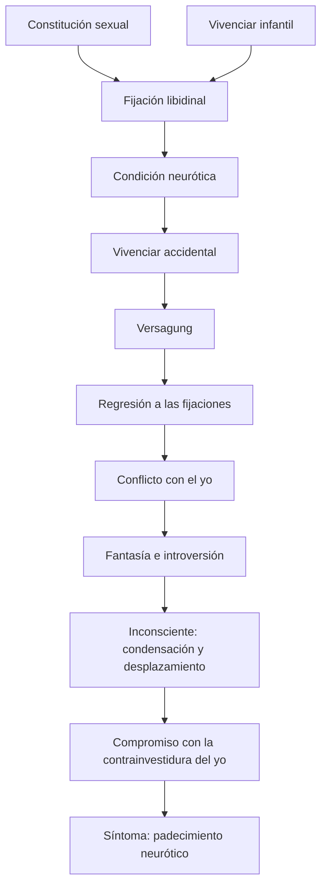
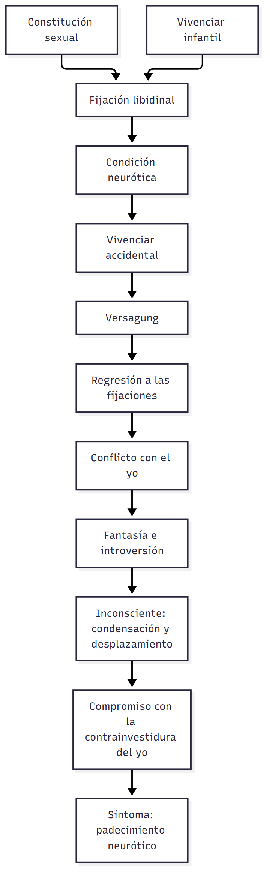

# C13 — Estructura y tiempos de la neurosis

> **Fuentes** (normas APA 7):
>
> - Belucci, G. (s. f.-c). *Sobre el concepto de defensa* [Ficha de cátedra]. Universidad Favaloro. [Texto T03 del programa]
> - Belucci, G. (2014b). *Introducción al diagnóstico de estructura* [Ficha de cátedra]. Universidad Favaloro. [Texto T01 del programa]
> - Freud, S. (1996). Las neuropsicosis de defensa. En J. Strachey (Ed.), *Obras completas* (J. L. Etcheverry, Trad., Vol. 3). Amorrortu. (Obra original publicada en 1894) [Texto T02 del programa]
> - Freud, S. (1996b). 23.ª conferencia. Los caminos de la formación de síntoma. En J. Strachey (Ed.), *Obras completas* (J. L. Etcheverry, Trad., Vol. 16). Amorrortu. (Obra original publicada en 1917) [Texto T04 del programa]
>
> **Materia:** Psicoanálisis, 2.º año, Favaloro (Belucci / Balcarce). **Apuntes de clase:** apuntes propios de la clase 13 (3/8/2026).

> **Idea-fuerza:** la neurosis no es un accidente ni un defecto: es una *condición de estructura* (la falta en el Otro inscripta por la Ley paterna y tramitada por la represión) que se vuelve *padecimiento* solo cuando algo hace fracasar las soluciones del sujeto (*Versagung*). Freud lo piensa en dos momentos: primero como una **historia en tiempos** (dos escenas, defensa, retorno de lo reprimido: 1894-96) y después como un **encadenamiento de causas** (las series complementarias: constitución + vivenciar infantil → fijación; fijación + vivenciar accidental → neurosis: 1917). El síntoma es el punto de llegada: una satisfacción sustitutiva, de compromiso entre la libido y la defensa.

## Hilo conductor: cómo se conectan los temas de esta guía

La clase responde a una pregunta de fondo: **¿cómo se llega a ser neurótico y cómo se llega a padecer una neurosis?** Freud contesta primero con una **historia** y después con una **estructura de causas**, y el síntoma es el punto de llegada de ambas.

La **historia** (pregunta 1) viene de 1894-96. Parte de la **defensa**: el yo se encuentra con una representación inconciliable, le arranca el afecto y la deja reprimida. Eso se ordena en la **fórmula canónica**: una **primera escena** que, cuando ocurre, no es traumática; un tiempo de **latencia**; una **segunda escena** que, *a posteriori*, vuelve traumática a la primera; la **defensa** y su marca (el **síntoma defensivo primario**: asco en la histeria, escrupulosidad en la obsesión); un período de **salud aparente**; y el **retorno de lo reprimido**, que difiere en la histeria (conversión) y en la obsesión (enlace falso). Lo importante de este primer modelo es que la neurosis aparece como **una secuencia temporal**, con un momento en que no hay síntoma aunque la condición ya esté.

En 1917 Freud cambia la lógica (pregunta 2): ya no una secuencia sino un **encadenamiento de causas**, las **series complementarias**. La neurosis resulta de una **predisposición** (por **fijación** de la libido) más un **vivenciar accidental**; y la fijación, a su vez, resulta de la **constitución sexual** más el **vivenciar infantil**. Aquí aparece la distinción que ordena el resto de la clase: la **condición neurótica** (la estructura) no es lo mismo que el **padecimiento**, que se desencadena cuando algo hace fracasar las soluciones del sujeto, la ***Versagung***, y obliga a una **regresión**. Esto «traduce» la historia anterior: la salud aparente es la condición sin padecimiento; el retorno de lo reprimido es el padecimiento.

El **síntoma** (pregunta 3) es lo que resulta: Freud explica sus **caminos de formación**: regresión a las fijaciones → **fantasía** (introversión) → **inconsciente** (condensación y desplazamiento) → **compromiso con el yo**. El síntoma es una **satisfacción sustitutiva**, un compromiso entre la libido y la defensa. Cierra el círculo con el punto de partida: el compromiso entre lo reprimido y la defensa es el mismo conflicto que abrió la clase.

> 🎯 **Para el parcial:** si piden la fórmula canónica, no olvides que es un **modelo temporal** y que el *a posteriori* es lo que lo sostiene; si piden series complementarias, conectalas con **condición vs. padecimiento**; y si piden síntoma, terminá siempre en el **compromiso** (satisfacción sustitutiva).

**En una sola oración:** la neurosis es una condición de estructura que se vuelve padecimiento cuando fracasan las soluciones del sujeto, y el síntoma es el compromiso entre la libido regresionada y la defensa.

## 0. Hoja de ruta

1. **Defensa y representación inconciliable (Freud, 1894/1996):** el yo se enfrenta a algo que no puede tramitar y se defiende; según el destino del afecto, aparecen histeria (conversión), obsesión/fobia (enlace falso) o psicosis (desestimación).
2. **Los tiempos de la neurosis (fórmula canónica):** primera escena → latencia → segunda escena → defensa y síntoma primario → salud aparente → retorno de lo reprimido.
3. **La estructura y el padecimiento (Belucci, 2014b; Freud, 1917/1996b):** series complementarias, fijación, *Versagung*, regresión.
4. **El síntoma y sus caminos de formación (Freud, 1917/1996b; Belucci, 2014b; Belucci, s. f.-c):** regresión, fantasía/introversión, inconsciente, compromiso con el yo.
5. **Apuntes de clase** y recordatorio de lo que entra.

## 🎯 Lo que entra sí o sí

1. **Inconciliabilidad** → defensa → separación entre representación y afecto → destino del afecto según la neurosis (Freud, 1894/1996, pp. 5-9).
2. **Histeria = conversión** («capacidad convertidora», no la escisión de conciencia, es el rasgo de la histeria) frente a **obsesión/fobia = enlace falso** (Freud, 1894/1996, pp. 6-9).
3. **Fórmula canónica**: dos escenas (la primera no es traumática en el momento: lo es *a posteriori*), síntoma primario, retorno de lo reprimido distinto en histeria y obsesión.
4. **Series complementarias** y el esquema: causación de la neurosis = predisposición por fijación libidinal + vivenciar accidental; fijación = constitución sexual + vivenciar infantil (Freud, 1917/1996b).
5. **Condición neurótica vs. padecimiento**: la *Versagung* («mal funcionamiento», no «frustración») desencadena regresión y conflicto (Belucci, s. f.-c, p. 4; Belucci, 2014b, pp. 35-39).
6. **Caminos de la formación de síntoma**: regresión a las fijaciones → fantasía (introversión) → inconsciente (condensación y desplazamiento) → compromiso con el yo; el síntoma como satisfacción sustitutiva, desfigurada y ambigua.

---

## 1. Primera pregunta — La fórmula canónica: los tiempos de la neurosis

> *Desarrolle la primera formulación freudiana acerca de los tiempos de la neurosis (fórmula canónica). Refiérase a la importancia de las dos escenas y al síntoma defensivo primario. ¿Qué sucede en cada caso luego del retorno de lo reprimido?*

### 1.1 Respuesta modelo (para escribir en el parcial)

> **Esqueleto de la respuesta:**
> 1. **Tesis:** la primera teoría piensa la neurosis como una historia en tiempos cuyo motor es la defensa (Freud, 1894/1996, p. 5).
> 2. **Defensa:** representación inconciliable → el yo le arranca el afecto; la representación queda reprimida (Freud, 1894/1996, p. 6).
> 3. **Dos escenas:** primera escena infantil sin efecto patógeno → latencia → segunda escena que la despierta: trauma *a posteriori* (*Nachträglichkeit*) (▸ Complemento; Belucci, 2014b, p. 4).
> 4. **Síntoma defensivo primario:** asco (histeria), escrupulosidad moral (obsesión), vergüenza (fobia): los diques (Belucci, 2014b, p. 4).
> 5. **Salud aparente → retorno de lo reprimido** cuando falla la contrainvestidura (Belucci, s. f.-c, p. 3).
> 6. **Cierre:** histeria → conversión (símbolo mnémico); obsesión → enlace falso del afecto con otra representación (Freud, 1894/1996, pp. 6-9).

La primera formulación freudiana sobre la neurosis la piensa como una **historia en tiempos** cuyo motor es la **defensa**. Freud parte (1894) de pacientes que gozaron de salud psíquica «hasta el momento en que sobrevino un caso de *inconciliabilidad* en su vida de representaciones», es decir, hasta que se presentó a su yo «una vivencia, una representación, una sensación que despertó un afecto tan penoso que la persona decidió olvidarla, no confiando en poder solucionar con su yo, mediante un trabajo de pensamiento, la contradicción» (Freud, 1894/1996, p. 5). Como la representación no puede ser tratada como «no acontecida» (*non arrivée*), el yo hace una solución aproximada: **arrancarle a la representación su afecto** (la suma de excitación), de modo que la representación debilitada «deje de plantear exigencias al trabajo asociativo» —queda reprimida— mientras el afecto divorciado tiene que ser aplicado a otro empleo (Freud, 1894/1996, p. 6). Ese es el tiempo de la defensa.

La **fórmula canónica** ordena el proceso en una secuencia. **▸ Complemento (Freud, Manuscrito K y *Nuevas puntualizaciones*, 1896; citado en Belucci, 2014b, p. 4):** hay una **primera escena**, experiencia sexual infantil prematura (pasiva y displacentera en la histeria; activa y con placer, luego recordada con culpa, en la neurosis obsesiva, Belucci, 2014b, p. 8); en el momento en que ocurre **no produce efecto patógeno**, porque el niño no tiene todavía los medios para darle sentido sexual; sigue un período de **latencia** de salud aparente; en la pubertad, una **segunda escena**, en sí misma inocua pero asociativamente ligada a la primera, despierta la huella mnémica y produce *a posteriori* un afecto sexual que no pudo producir en su momento: recién ahí la primera escena se vuelve traumática (*Nachträglichkeit*). El yo responde entonces con la **defensa** (represión) y esta deja una marca constitutiva: el **síntoma defensivo primario** («síntoma primario» del Manuscrito K), que «atestigua la operación de la represión, y el sentido en el que ella ha operado, independientemente de la presencia de síntomas clínicos» (Belucci, 2014b, p. 4) y permite leer «retroactivamente la “elección de neurosis”». Para la obsesión es «un matiz de escrupulosidad de la conciencia moral»; para la histeria, la conversión de la excitación sexual en **displacer —en particular el asco—**: «yo llamaría “histérica”, sin vacilar, a toda persona, sea o no capaz de producir síntomas somáticos, en quien una ocasión de excitación sexual provoca predominante o exclusivamente sentimientos de displacer» (Belucci, 2014b, p. 4); en las fobias aparece algo del orden de la **vergüenza** (Belucci, 2014b, p. 4). Estos tres —moral, asco, vergüenza— son los **diques** de los *Tres ensayos* (Belucci, 2014b, p. 4).

A la defensa sigue un período de **salud aparente** (el sujeto es neurótico como condición, pero no padece). La defensa exige un gasto permanente de energía —la **contrainvestidura**— y, cuando falla, acontece el **retorno de lo reprimido** (Belucci, s. f.-c, p. 3): lo reprimido logra acceder a la conciencia «por medio de su conexión con algún elemento sustitutivo». Y aquí el destino difiere según la neurosis (Freud, 1894/1996, pp. 6-9): en la **histeria**, la excitación se traspone a lo corporal por **conversión** y el síntoma es un «símbolo mnémico» que habita la conciencia como un parásito (una inervación motriz o una sensación que retorna); en la **neurosis obsesiva** (y en las fobias reducibles a ella), que carecen de capacidad convertidora, el afecto liberado permanece en lo psíquico y se adhiere a otras representaciones, en sí no inconciliables, por un **«enlace falso»**, que devienen representaciones obsesivas; **▸ Complemento:** de ahí que en la obsesión lo que retorna lo haga como autorreproche transformado, con afectos de culpa, vergüenza, angustia. En ambos casos el síntoma es el retorno disfrazado de la representación sexual inconciliable, y la representación reprimida pasa a formar «el núcleo de un grupo psíquico segundo» (Freud, 1894/1996, p. 7 y p. 12).

> ⚠ **No confundir:** la primera escena **no** es traumática cuando ocurre: lo es *a posteriori*, por la segunda. Y el síntoma defensivo primario no es un síntoma clínico: es la marca de la represión.

### 1.2 Desarrollo ampliado (todo lo que dice la fuente)

#### a) El punto de partida: la inconciliabilidad y el empeño voluntario (Freud, 1894/1996, pp. 3-6)

- Freud dice que su teoría surge del estudio de «fobias y representaciones obsesivas» y que luego la extiende a la histeria y a ciertas psicosis alucinatorias (Freud, 1894/1996, p. 3). El título completo: *ensayo de una teoría psicológica de la histeria adquirida, de muchas fobias y representaciones obsesivas, y de ciertas psicosis alucinatorias*.
- **Contexto teórico:** que la histeria implica una **escisión de la conciencia** con grupos psíquicos separados era aceptado (Janet, Breuer). Discute su origen. **Janet:** la escisión es *primaria*, base de la histeria, por una endeblez innata de la síntesis psíquica y un estrechamiento del «campo de conciencia» —estigma de degeneración—. **Breuer:** es *secundaria, adquirida*, efecto de los «estados hipnoides» (representaciones segregadas del comercio asociativo). Freud aporta una tercera vía: distingue tres formas de histeria —**histeria hipnoide**, **histeria de retención** (la reacción al estímulo traumático no se tramita por *abreacción*) e **histeria de defensa**, que es la que le interesa, también llamada provisoriamente «adquirida» porque en ella no cabe hablar de tara hereditaria grave (Freud, 1894/1996, pp. 4-5).
- En la histeria de defensa **la escisión es consecuencia de un acto voluntario** del enfermo, «cuyo motivo es posible indicar». El paciente no se propone escindir su conciencia; «su propósito es otro, pero él no alcanza su meta, sino que genera una escisión de conciencia» (Freud, 1894/1996, p. 4).
- **Ejemplos del primer momento** (Freud, 1894/1996, p. 5): una joven que se reprocha, mientras cuida a su padre enfermo, pensar en un joven que le dejó una leve impresión erótica; una gobernanta enamorada de su patrón que resuelve quitarse esa simpatía porque la juzga inconciliable con su orgullo. En las mujeres, estas representaciones inconciliables nacen «las más de las veces sobre el suelo del vivenciar y el sentir sexuales»; las afectadas recuerdan con precisión sus empeños defensivos: «ahuyentar» la cosa, no pensar, sofocarla.
- Freud no afirma que ese esfuerzo sea patológico en sí; solo sabe que en sus pacientes **«ese olvido no se logró»** y llevó a reacciones patológicas (histeria, representación obsesiva o psicosis alucinatoria). La aptitud para provocar uno de estos estados mediante el empeño voluntario expresa una **predisposición patológica**, no necesariamente idéntica a una «degeneración» (Freud, 1894/1996, p. 6).

#### b) La operación defensiva: dividir representación y afecto (Freud, 1894/1996, p. 6)

- El yo defensor se impone una tarea **insoluble**: tratar como «no acontecida» la representación inconciliable; una vez que la huella mnémica y el afecto adherido «están ahí, ya no se los puede extirpar». La solución *aproximada* es **convertir la representación intensa en una débil, arrancándole el afecto, la suma de excitación que gravita sobre ella**.
- La representación debilitada «dejará de plantear totalmente exigencias al trabajo asociativo»; la suma de excitación divorciada «tiene que ser aplicada a otro empleo».
- Hasta acá los procesos son iguales en histeria, fobias y obsesiones; «desde este punto, los caminos se separan».
- **Hipótesis auxiliar** (Freud, 1894/1996, p. 17): en las funciones psíquicas hay algo (monto de afecto, suma de excitación) que tiene propiedades de una **cantidad** —susceptible de aumento, disminución, desplazamiento y descarga— que se difunde por las huellas mnémicas como una carga eléctrica por la superficie de los cuerpos. Es la base de la teoría de la *abreacción* y está justificada «por su utilidad para resumir y explicar múltiples estados psíquicos».

#### c) Los tres destinos del afecto (Freud, 1894/1996, pp. 6-17)

| | **Histeria (defensa por conversión)** | **Obsesiones y fobias (defensa por trasporte del afecto)** | **Psicosis alucinatoria (defensa por desestimación)** |
|---|---|---|---|
| Qué hace el yo | Traspone a lo corporal la suma de excitación (**conversión**), total o parcial, en la inervación motriz o sensorial con nexo más íntimo o más laxo con la vivencia traumática (p. 7) | El afecto liberado permanece en lo psíquico y se adhiere a otras representaciones no inconciliables: **«enlace falso»** (p. 9) | El yo **desestima** (*verwerfen*) la representación junto con su afecto y se comporta como si no hubiera comparecido (p. 15) |
| Condición | **Capacidad convertidora** (predisposición histérica), aunque «en sí y por sí, esta capacidad no excluye la salud psíquica» (p. 8) | Ausencia de capacidad convertidora en persona predispuesta (p. 9) | «Predisposición patológica de grado más alto» (p. 16) |
| Qué queda | **Símbolo mnémico** que habita la conciencia «al modo de un parásito»; la huella de la representación reprimida forma el núcleo de un **grupo psíquico segundo** (p. 7) | La representación reprimida forma también el núcleo de un grupo psíquico segundo, accesible incluso sin hipnosis (p. 12) | El contenido de la psicosis «consiste justamente en realzar aquella representación que estuvo amenazada» (p. 16) |
| Ventaja para el yo | Queda «exento de contradicción», pero paga el lastre del símbolo (p. 7) | **Mucho menor** que en la conversión: el afecto «permanece como antes, sin cambio y sin disminución» (pp. 11-12) | Escapa de la representación, pero se desase también «total o parcialmente de la realidad objetiva» (p. 16) |
| Efecto | Estado lábil: la excitación vuelve a la representación y se descarga en **ataques** (p. 7) | Síntomas menos llamativos porque «la alteración íntegra ha permanecido en el ámbito psíquico» (p. 12) | «Confusión alucinatoria»: vivida como un «dichoso sueño» (pp. 15-16) |

#### d) El momento traumático y los «traumáticos auxiliares» (Freud, 1894/1996, p. 7)

- Formado «en un “momento traumático”» el núcleo de la escisión histérica, su **engrosamiento** se produce en otros momentos «traumáticos auxiliares»: una impresión de la misma clase, recién advenida, «consiga perforar la barrera que la voluntad había establecido, aportar nuevo afecto a la representación debilitada» e imponer por un momento el enlace entre ambos grupos psíquicos, hasta que una nueva conversión ofrezca defensa.
- Esta es la **anticipación en 1894 de la lógica de dos escenas** (un momento primero y otro posterior que reactiva): conviene mencionarlo en el parcial como antecedente del esquema canónico de 1896.
- El efecto del **método catártico de Breuer** consiste en «volver a guiar la excitación, con conciencia de la meta, de lo corporal a lo psíquico», para forzar a reequilibrar la contradicción mediante un trabajo de pensamiento y descargar la excitación por el habla (Freud, 1894/1996, p. 7).

#### e) La causa sexual y la «retraducción» (Freud, 1894/1996, pp. 9-14)

- En todos los casos analizados, la fuente del afecto del enlace falso era **la vida sexual**: proporcionó un afecto penoso «de la misma índole, exactamente, que el afecto endosado a la representación obsesiva» (p. 9). «Con facilidad se comprende que justamente la vida sexual conlleva las más abundantes ocasiones para la emergencia de representaciones inconciliables» (p. 10).
- Los pacientes lo confirman: «Cierta vez me pasó algo muy desagradable; puse empeño en ahuyentarlo, en no pensar más en eso. Al fin lo conseguí, y entonces me sobrevino lo otro, de lo cual desde entonces no he podido desprenderme» (p. 10). Cuando se les señala la representación sexual de origen responden: «De ahí, sin embargo, no puede venirme… Por un momento me causó espanto, pero luego me distraje», prueba de que la representación obsesiva es un **sustituto o subrogado** de la sexual inconciliable (p. 10).
- Los procesos «divorcio entre la representación y su afecto» y «enlace falso» **no son conscientes**, solo es posible suponerlos; «quizá sería más correcto decir» que son procesos físicos que se figuran como si hubiera ocurrido tal cosa (p. 10, nota al problema de lo inconciente).
- Los enfermos mantienen en secreto sus representaciones obsesivas cuando conocen su origen sexual y se asombran del afecto; al médico, en cambio, el afecto le parece «justificado e inteligible» y lo que llama la atención es el **enlace con una representación indigna de él**: el afecto aparece «dislocado» y «trasportado» (p. 11) → se puede ensayar la **retraducción a lo sexual**. Cualquier representación compatible con el afecto o con algún vínculo con la inconciliable puede servir de subrogado: una angustia de origen sexual se vuelca sobre fobias primarias (animales, tormenta, oscuridad) o sobre cosas asociadas a lo sexual (orinar, defecar, ensuciarse, contagio) (p. 11).
- Para algunos casos hay **simultaneidad** entre representaciones obsesivas y representaciones sexuales penosas justificadas: son una defensa continua frente a representaciones que llegan en forma permanente, «un trabajo que aún no había alcanzado su acabamiento» (p. 11).

#### f) Los tres ejemplos clínicos de obsesión/fobia (Freud, 1894/1996, pp. 12-14)

1. **Reproches obsesivos** (pp. 12-13): una muchacha que, al leer sobre monederos falsos o un homicidio, piensa que ella misma fabricó moneda falsa o cometió el crimen; con clara conciencia del despropósito. En un período la conciencia de culpa ahogó su crítica y se acusó ante parientes y médico (*psicosis por acrecentamiento simple* o *de avasallamiento*). El interrogatorio descubrió la fuente: una sensación voluptuosa casual, inducida por una amiga a la masturbación, practicada durante años con plena conciencia de su mala acción y autorreproches inútiles; un exceso tras un baile provocó el acrecentamiento. Curó tras unos meses de tratamiento y vigilancia severa.
2. **Fobia a orinar** (p. 13): una muchacha que teme que le den ganas de orinar y se oriente a un baño; empezó en una sala de conciertos, cuando un señor no indiferente se sentó cerca y ella se pintó cómo se sentaría a su lado siendo su esposa; la sensación corporal erótica «que es preciso comparar con la erección del varón» concluía en ella con una ligera presión de vejiga; se espantó porque había resuelto combatir esa inclinación y **el afecto se transfirió a las ganas de orinar concomitantes**. Era mojigata en la vida ordinaria y sexualmente hiperestésica. El tratamiento domina la fobia casi por completo.
3. **Impulso obsesivo de arrojarse por la ventana** (p. 14): una joven señora con un hijo, que teme acuchillarlo ante un cuchillo filoso; el comercio conyugal se había vuelto raro y con cautelas anticonceptivas; Freud le dice que a la vista de un hombre le acuden representaciones eróticas y que por eso se cree abyecta, capaz de cualquier fechoría; la **retraducción a lo sexual fue certera**: confesó llorando su miseria conyugal.
- **Salvedades de Freud** (p. 14): no pretende que todas las fobias y obsesiones nazcan así; existen fobias puramente histéricas; el **grupo de las fobias típicas, con la agorafobia como prototipo, no se deja reconducir a este mecanismo** (no hay representación reprimida de la que se divorcie el afecto de angustia; la angustia tiene otro origen). Pero sostiene que el trasporte del afecto es demostrable en la gran mayoría. Estas neurosis no pueden ubicarse con la neurastenia común (p. 15).

#### g) La tercera modalidad: la desestimación y la psicosis (Freud, 1894/1996, pp. 15-17)

- «Existe una modalidad defensiva mucho más enérgica y exitosa»: el yo **desestima** (*verwerfen*) la representación junto con su afecto como si no hubiera comparecido; pero entonces «la persona se encuentra en una psicosis que no admite otra clasificación que *confusión alucinatoria*» (p. 15).
- **Ejemplo:** una joven que cree firmemente ser correspondida por un hombre; se defiende de los desengaños por conversión histérica pero la conversión es incompleta; lo espera un día festivo, no acude; pasados los trenes, cae en confusión alucinatoria: oye su voz en el jardín, baja a recibirlo y vive dos meses un «dichoso sueño». «Histeria y desazón están superadas». Esta psicosis, «no entendida en su momento, fue descubierta diez años más tarde por medio de un análisis hipnótico» (pp. 15-16).
- Lectura: el contenido de la psicosis consiste en **realzar la representación amenazada**; «el yo se ha defendido de la representación insoportable mediante el refugio en la psicosis». Condición: la representación insoportable «se entrama de manera inseparable con un fragmento de la realidad objetiva», y al desprenderse de ella el yo se desase también de la realidad, condición «bajo la cual se imparte a las representaciones propias una vividez alucinatoria» (p. 16). Otros ejemplos: la madre que enfermó por la pérdida de su hijo y mece un leño; la novia desairada que espera ataviada a su prometido (p. 16).
- Las **tres variedades pueden coexistir** en una persona; de ahí las «**neurosis mixtas**» y la dificultad de separar tajantemente la histeria de otras neurosis. La confusión alucinatoria no suele ser compatible con la histeria persistente ni con las obsesiones, pero una psicosis de defensa puede interrumpir episódicamente una neurosis histérica o mixta (p. 17).
- Conexión con la clase 17-18 (psicosis): ahí reaparece la *Verwerfung* como antecedente de la forclusión (→ conecta con `C17_18_PsicosisYForclusionDelNombreDelPadre_Guia.md`).

#### h) El retorno de lo reprimido en Belucci (s. f.-c, p. 3)

- La represión exige un **gasto permanente de energía** (contrainvestidura). El **retorno de lo reprimido** se produce cuando, «por medio de su conexión con algún elemento sustitutivo, lo que está reprimido logra acceder a la conciencia».
- Vías: **acto fallido** (el presidente del parlamento austríaco que, al abrir un debate problemático, anunció «Declaro cerrada la sesión»); **sueños** (lo recordado al despertar se conecta con pensamientos que el soñante desconocía y conducen al deseo inconsciente); **síntomas** (la paciente con parálisis en una pierna: la pierna del padre enfermo apoyada en la suya para las curaciones, deseo infantil reprimido hacia el padre); **chiste** (levanta momentáneamente la represión).
- La represión es «individual y móvil» (Belucci, s. f.-c, p. 3). La consecuencia registrable de la represión propiamente dicha es la **amnesia** (el olvido de Dora de la fuente de sus conocimientos sexuales, Belucci, s. f.-c, pp. 2-3). Hay **represión primordial** (inferible, núcleo del inconsciente) y **propiamente dicha** (constatable) (Belucci, s. f.-c, p. 2).

> 🔑 **Punto clave:** la «fórmula canónica» no es solo un orden cronológico: lo traumático surge **retroactivamente** (a posteriori); el síntoma primario es *marca de la defensa* aun sin síntoma clínico; y lo que retorna depende de la neurosis (conversión en histeria; enlace falso/autorreproche en obsesión).

---

## 2. Segunda pregunta — Estructura y tiempos: las series complementarias

> *Caracterice la formulación freudiana acerca de la estructura y tiempos de la neurosis (series complementarias). ¿Qué pasos se requieren para que se constituya la neurosis y cómo se pasa de la condición neurótica al padecimiento?*

### 2.1 Respuesta modelo

> **Esqueleto de la respuesta:**
> 1. **Tesis:** con las series complementarias (1917) la neurosis resulta de una conjugación proporcional de factores, no de una causa única (Freud, 1917/1996b).
> 2. **Esquema:** neurosis = predisposición por fijación + vivenciar accidental; fijación = constitución sexual + vivenciar infantil.
> 3. **Complementarias:** los factores se compensan (constitución fuerte + vivencia mínima, o al revés).
> 4. **Condición vs. padecimiento:** la fijación es la condición neurótica; el padecimiento empieza con la *Versagung* (Belucci, 2014b, p. 36).
> 5. **Pasos:** *Versagung* → regresión a las fijaciones → conflicto con el yo → introversión en la fantasía → inconsciente → contrainvestidura → síntoma de compromiso; más el factor cuantitativo.
> 6. **Cierre:** la *Versagung* es la bisagra, «el grado cero de lo sintomático» (Belucci, 2014b, p. 36).

Con las **series complementarias** (23.ª Conferencia, 1917) Freud abandona la idea de una causa única y piensa la neurosis como el resultado de la **conjugación proporcional de factores**. La **causación de la neurosis** del adulto es igual a **predisposición por fijación libidinal + vivenciar accidental (traumático)**. A su vez, la fijación libidinal del adulto «se nos descompone en otros dos factores»: la **constitución sexual** hereditaria («vivenciar prehistórico», *Anlage*) y el **vivenciar infantil** (la predisposición adquirida en la primera infancia, *Disposition*): estos dos forman «otra serie complementaria, en un todo semejante a la que ya conocimos entre predisposición y vivenciar accidental del adulto. Aquí como allí hallamos los mismos casos extremos y las mismas relaciones de subrogación» (Freud, 1917/1996b). Son series *complementarias* porque los factores se compensan: donde la constitución es poderosa basta un vivenciar mínimo; donde el vivenciar es muy intenso, una constitución promedio es suficiente. La **fijación** es entonces la **condición neurótica** —un punto de anclaje en la estructura del sujeto—; el **vivenciar accidental** (los «anudamientos vitales» de Belucci, 2014b, p. 37) la pone a prueba.

Para que se constituya la neurosis y se pase de la condición al **padecimiento** se requieren, en orden lógico: (1) la **fijación** de la libido en puntos del desarrollo (prácticas y objetos de la sexualidad infantil, en parte por disposición innata y en parte por vivencias contingentes); (2) un **vivenciar accidental** que produzca una **frustración/denegación** (*Versagung*): la realidad le niega a la libido su satisfacción actual y «si a pesar de que la libido está dispuesta a aceptar otro objeto… la realidad permanece inexorable» no queda más que (3) la **regresión**, el retorno a organizaciones y objetos superados, cautivada por las fijaciones; (4) el **conflicto con el yo**, que no presta acuerdo a esas regresiones (si el yo consiente, aparece la perversión, no la neurosis); (5) la libido se **sustrae del yo** y se dirige primero a las **fantasías** (introversión) y por ellas al inconsciente, a las fijaciones reprimidas, sometida a condensación y desplazamiento; (6) el yo preconsciente le opone una **contrainvestidura** y la obliga a elegir una expresión que sea también suya: el **síntoma como compromiso**. Además, interviene un **factor cuantitativo**: el conflicto no estalla antes de que las investiduras alcancen cierta intensidad (Freud, 1917/1996b). La **Versagung** es, entonces, la bisagra: «el grado cero de lo sintomático» (Belucci, 2014b, p. 36).

> ⚠ **No confundir:** *Versagung* no es «frustración» en sentido común: es el fracaso de las soluciones del sujeto. Y ser neurótico (condición) no es lo mismo que padecer una neurosis.

### 2.2 Desarrollo ampliado

#### a) La *Versagung*: ni «frustración» ni castigo (Belucci, 2014b, pp. 36-38; Belucci, s. f.-c, p. 4)

- Belucci (s. f.-c, p. 4): el término alemán *Versagung*, que suele traducirse como «frustración», «podría traducirse mejor por **“mal funcionamiento”**»: la regresión requiere que **fracasen otros modos de funcionamiento** con los que podría hacerse frente a la angustia y al conflicto; cuando otras respuestas «funcionan mal», se reactivan respuestas más elementales.
- Belucci (2014b, p. 36): en alemán *versagen* entraña una falla, fracaso o mal funcionamiento, eventualmente el rehusarse o la renuncia; **no implica que alguien quite o no dé** lo que podría dar (como «frustración»). En Freud significa que **«una colocación libidinal que hasta un momento dado era posible ya no lo es»**. Si el psicoanálisis se ocupa de «lo que no anda», la *Versagung* es «el grado cero de lo sintomático».
- **Dos vertientes** (Belucci, 2014b, pp. 36-38): **externa** (tropiezos en el campo de la realidad que hacen insostenible cierta colocación libidinal: duelo, ruptura de pareja, pérdida de posición laboral o social, vacilación del marco mismo de la realidad que es el del fantasma) e **interna** (las soluciones que el sujeto venía instrumentando dejan de funcionar). Freud llamó a esos acontecimientos «**anudamientos vitales**» y los ubicó en las series complementarias del lado del vivenciar accidental del adulto (Belucci, 2014b, p. 37, nota). Lacan evoca la **tyché** aristotélica como encuentro siempre fallido con lo real (Belucci, 2014b, p. 37).
- La realidad no es un campo autoevidente: es un montaje simbólico-imaginario («esquema R») que entrama y vela un real; «lo real es aquello que, cada tanto, nos recuerda que la escena que habitamos no es una ficción pura» (Belucci, 2014b, p. 37). Freud señala que la alteración de la economía libidinal puede llevar a un **estancamiento (*Stauung*)** de la libido, condición necesaria aunque no suficiente de la neurosis (Belucci, 2014b, p. 38).
- **Tus apuntes (clase 13):** *Versagung* = «Delegación negativa o privación. Frustración que deja marca» — **real** (te lo negaron de verdad) o **fantasmática** (te lo negás vos mismo por culpa). Fórmula: **Deseo → Frustración → Síntoma**; el deseo se reprime y vuelve como síntoma.

#### b) Regresión y fijación (Belucci, s. f.-c, pp. 3-4)

- **Regresión:** retorno a modos de funcionamiento de momentos anteriores de una secuencia de desarrollo; en particular, la activación de aspiraciones y componentes sexuales abandonados, modificados o integrados en organizaciones más complejas. Supone las **organizaciones libidinales (fases)** que se suceden en el tiempo con predominio de zonas del cuerpo.
- **Ejemplo (organización oral):** supone particular significatividad de la boca y de todas las actividades de incorporación, y un modo de relación con el otro en el que importa lo que el otro da y lo que el sujeto le demanda. Bajo ciertas circunstancias puede reactivarse: alguien intensifica sus demandas a otros significativos buscando incorporar (dinero, regalos, atenciones), o en situaciones de angustia aumentan comer, beber o fumar (Belucci, s. f.-c, p. 3).
- **Fijación:** en el pasaje de una organización a la siguiente, la libido permanece adherida al modo anterior. Todo sujeto tiene fijaciones, pero **su intensidad y los componentes varían**, y eso condiciona la aparición del padecimiento: «cuanto más rígido es el modo de obtener satisfacción, más fácilmente da paso a lo patológico» (Belucci, s. f.-c, p. 4).
- En Freud (1917/1996b) se aclara el valor de la fijación: «la fijación que suponemos en determinados puntos de la vía del desarrollo sólo cobra valor si la hacemos consistir en la **inmovilización de un determinado monto de energía libidinosa**»; sería inconcebible que la libido regresara con tanta regularidad a la infancia «si ahí no hubiera nada que pudiera ejercer una atracción sobre ella».

#### c) El esquema de las series (Freud, 1917/1996b)

```
Causación de la neurosis  =  Predisposición por    +  Vivenciar accidental
                              fijación libidinal       (traumático) [del adulto]
                                    |
                      Constitución sexual   +   Vivenciar infantil
                      (vivenciar prehistórico)
```
- Freud pide al estudiante no tomar el esquema por una receta: **«Anlage»** designa lo heredado e innato; **«Disposition»** lo adquirido en la primera infancia (nota del traductor en Freud, 1917/1996b).
- La constitución sexual hereditaria «brinda una gran diversidad de disposiciones, según que esta o aquella **pulsión parcial**, por sí sola o en unión con otras, posea una fuerza particular». Las constituciones podrían ser cualitativamente iguales en todos los seres humanos y diferenciarse solo por proporciones cuantitativas (Freud, 1917/1996b, factor económico).
- **Legitimidad de la herencia adquirida** (Freud, 1917/1996b): las disposiciones constitucionales son «la secuela que dejaron las vivencias de nuestros antepasados; también ellas se adquirieron una vez: sin tal adquisición no habría herencia alguna». Por eso no debe restarse importancia a las vivencias infantiles: acontecen en períodos en que el desarrollo no está completo, lo que agrava sus consecuencias y las habilita para tener efectos traumáticos. **Ejemplo de Roux** (mecánica evolutiva): el pinchazo de una aguja en un germen en proceso de bipartición celular produce una grave perturbación del desarrollo; el mismo ataque a la larva o al animal ya crecido se soportaría sin daño.

#### d) ¿Importancia real de lo infantil o efecto de la regresión? (Freud, 1917/1996b)

- Dilema: la libido de los neuróticos está ligada a sus vivencias sexuales infantiles; ¿no será que esas vivencias **no tuvieron importancia en su momento y solo la cobraron regresivamente**? Freud lo zanja con tres razones: (1) existen **neurosis infantiles** (en la mayoría de los casos, **histeria de angustia**) en las que el diferimiento temporal casi no interviene, pues la enfermedad se contrae por vivencias traumáticas directas; la neurosis del adulto es a menudo la continuación directa de esa enfermedad infantil, quizá velada (como en el pequeño Hans y el «Hombre de los Lobos»); (2) sin una **fijación** que atraiga, no se entendería la regresión; (3) entre la importancia patógena de las vivencias infantiles y la de las tardías hay una **relación de complementariedad** semejante a la de las series: casos en los que todo el peso recae en la vivencia infantil («inhibición del desarrollo») y casos en que el acento cae en el conflicto posterior (**regresión**), «y, entre ellos, todos los grados de conjugación».
- **Consecuencia pedagógica:** no basta con resguardar al niño de vivencias sexuales; las condiciones de causación son complejas y es imposible influir sobre ellas «tomando en cuenta un factor único»; el resguardo es impotente frente al factor constitucional, difícil de ejecutar, y trae dos peligros: favorecer una represión sexual desmedida o lanzar al niño inerme ante los requerimientos sexuales de la pubertad.
- **Cantidad (punto de vista económico)** (Freud, 1917/1996b): para entender el conflicto no basta lo dinámico; hace falta el **punto de vista económico**: el conflicto no estalla antes de que se alcancen ciertas intensidades de investidura. Importa también el monto de libido no aplicada que una persona puede mantener flotante y la fracción que puede desviar hacia la **sublimación**; la meta final de la actividad del alma, desde lo económico, es **domeñar los volúmenes de excitación** y evitar su estasis generadora de displacer.

#### e) Condición neurótica y padecimiento (Belucci, 2014b, pp. 2-3, 35; Freud, 1917/1996b; apuntes)

- Freud (1917/1996b, inicio): «estar enfermo» es «en esencia un concepto práctico»; desde el punto de vista teórico «todos estamos enfermos, o sea, todos somos neuróticos», pues las condiciones para formar síntomas se pesquisan también en los normales. Lo que define el padecimiento es la **cantidad de energía** que cuestan los síntomas y su combate: pueden traer «un extraordinario empobrecimiento… y su parálisis para todas las tareas importantes de la vida».
- Belucci (s. f.-c, p. 2): para Freud la diferencia entre la «normalidad» y la neurosis es **de grado y no de esencia**; distinguiría la salud el *abanico* de procedimientos defensivos y la *flexibilidad* de su uso (pobreza y rigidez del lado de la neurosis).
- Belucci (2014b, p. 3): la neurosis es una condición de estructura en la que la inconsistencia del Otro se inscribe como **falta** (castración), por la intervención de la Ley paterna. El neurótico, en su estado ordinario, «va por la vida sin hacerse muchas preguntas»: las respuestas (fantasma, ideales, yo) «hacen que su existencia ordinaria se desenvuelva en el olvido de esa pregunta». **Cuando esas respuestas se vuelven ineficaces aparece el malestar** y la posibilidad de que alguna pregunta se formule. (Belucci, 2014b, p. 35): la psicopatología es «una lógica del padecimiento subjetivo».
- **Un caso (Belucci, 2014b, p. 3):** una mujer de más de cincuenta años empezó a padecer cuando se fue de casa la última de sus tres hijas/hijos; durante décadas se había dedicado a «oficiar de madre» como eje de su mundo; «situar esto es situar mucho más que la condición neurótica». Muestra que el diagnóstico exige **estructura + posición subjetiva**.
- **Tus apuntes (clase 13):** las series complementarias como «todo lo que construye el Yo»: **Premisa mayor** = pre-Edipo, prehistoria del sujeto, herencia («lo que eso era yo debo advenir»), está en el Otro, es el punto de partida de la neurosis; **Premisa menor** = post-Edipo, historia infantil; el silogismo entre ambas premisas y el sujeto. «No son todos iguales, cada uno tiene su construcción personal y única.»

> 🔑 **Punto clave:** el paso de la **condición neurótica** (fijación, estructura) al **padecimiento** no lo da la constitución sola ni el trauma solo: lo da la **Versagung** que activa la regresión sobre una fijación y abre el conflicto con el yo.

---

## 3. Tercera pregunta — El lugar del síntoma y los caminos de su formación

> *¿Qué lugar ocupa el síntoma en la estructura de la neurosis? Refiérase a los «caminos de la formación del síntoma».*

### 3.1 Respuesta modelo

> **Esqueleto de la respuesta:**
> 1. **Tesis:** el síntoma es una solución de compromiso: práctica sexual de los neuróticos y retorno de lo reprimido a la vez (Belucci, 2014b, p. 3).
> 2. **Doble cara:** satisfacción pulsional + defensa; «está sostenido desde ambos lados» (Freud, 1917/1996b).
> 3. **Lugar en la estructura:** respuesta del sujeto (anclado por fantasía e identificación) y coordenada diagnóstica, no la única (Belucci, 2014b, p. 3).
> 4. **Caminos:** *Versagung* → regresión a las fijaciones → el yo no consiente → introversión en la fantasía → inconsciente (condensación y desplazamiento) → contrainvestidura.
> 5. **Resultado:** satisfacción sustitutiva, desfigurada y ambigua, con dos significados contradictorios.
> 6. **Cierre:** por eso el síntoma es tan resistente y repite la satisfacción infantil con elementos de la ocasión actual.

El síntoma ocupa en la neurosis el lugar de **solución de compromiso** frente a un conflicto: es la «**práctica sexual de los neuróticos**» (la satisfacción pulsional en su cara pulsional) y, a la vez, **retorno de lo reprimido** (su cara defensiva) (Belucci, 2014b, p. 3). Los síntomas psíquicos son «actos perjudiciales o, al menos, inútiles para la vida en su conjunto», que la persona realiza a menudo contra su voluntad y que cuestan displacer y un gasto enorme de energía; pero son «el resultado de un conflicto que se libra en torno de una nueva modalidad de la satisfacción pulsional»: las dos fuerzas enemistadas «vuelven a coincidir en el síntoma; se reconcilian, por así decir, gracias al compromiso de la formación de síntoma. Por eso el síntoma es tan resistente; está sostenido desde ambos lados» (Freud, 1917/1996b). En la estructura de la neurosis el síntoma es una **respuesta** del sujeto (fantasía e identificación lo anclan a lo psíquico; en la etapa de *Inhibición, síntoma y angustia* es respuesta a la angustia) y una **coordenada diagnóstica** (Belucci, 2014b, p. 3), aunque no la única: la defensa y el síntoma primario permiten leer la «elección de neurosis».

Los **caminos de la formación del síntoma** son los de la libido insatisfecha: (1) la **Versagung** le cierra la satisfacción real; (2) la libido emprende la **regresión** hacia las organizaciones anteriores y los objetos resignados, cautivada por las **fijaciones** que dejó en su desarrollo; (3) el yo, que dispone de la conciencia y del acceso a la motilidad, **no consiente** esa regresión y se abre el conflicto; (4) la libido se retira primero a la **fantasía** (**introversión**: la fantasía inconsciente es el eslabón intermedio) y desde ella al **inconsciente**, a los lugares de fijación reprimidos, donde rigen **condensación y desplazamiento** (como en el sueño); (5) el yo preconsciente le opone una **contrainvestidura** y exige una expresión que pueda convertirse también en suya; (6) el síntoma resulta una **satisfacción sustitutiva, desfigurada y ambigua**, con dos significados contradictorios, que repite la satisfacción infantil con elementos de la ocasión que llevó a contraer la enfermedad.

> ⚠ **No confundir:** el síntoma no es solo defensa ni solo satisfacción: es el **compromiso** entre ambas. Y la fantasía (introversión) es el eslabón intermedio, no el síntoma mismo.

### 3.2 Desarrollo ampliado (Freud, 1917/1996b; Belucci, 2014b)

#### a) El síntoma como compromiso y el sueño como modelo (Freud, 1917/1996b)

- Para el lego los síntomas son la esencia de la enfermedad; para el médico, distinguir síntoma y enfermedad: eliminados los síntomas, lo aprehensible que resta es «la capacidad para formar nuevos síntomas».
- **Analogía con el sueño**: las representaciones sobre las que la libido traslada su energía pertenecen al sistema del inconsciente y están sometidas a los procesos allí posibles, en particular la **condensación y el desplazamiento**. Se establecen «constelaciones semejantes a las de la formación del sueño»: el sueño genuino, cumplimiento de una fantasía inconsciente de deseo, entra en **transacción** con un fragmento de actividad preconsciente que ejerce la censura; del mismo modo la libido en el inconsciente tiene que contar con el poder del yo preconsciente, que la persigue «como contrainvestidura».
- **Diferencia sueño/síntoma:** en el sueño el propósito preconsciente se agota en preservar el dormir; no necesita oponer un rotundo «¡No, al contrario!» a la moción de deseo, y puede ser más tolerante porque la situación del que duerme está menos amenazada. En el síntoma, la contrainvestidura es una fuerza contraria.
- El síntoma «se engendra como un retoño del cumplimiento del deseo libidinoso inconsciente, desfigurado de manera múltiple; es una ambigüedad escogida ingeniosamente, provista de dos significados que se contradicen por completo entre sí».
- **Perversión vs. neurosis:** «el camino de la perversión se separa tajantemente del de la neurosis»: si las regresiones **no despiertan la contradicción del yo**, tampoco sobrevendrá la neurosis y la libido alcanzará alguna satisfacción real, aunque no normal. El conflicto —y la neurosis— aparece si el yo no presta su acuerdo.
- **Advertencia:** todo lo dicho en la conferencia se refiere a la formación de síntoma **en la histeria**; en la **neurosis obsesiva**, conservándose lo fundamental, pasan al primer plano las **contrainvestiduras** frente a las exigencias pulsionales (formaciones reactivas), que «dominan el cuadro clínico»; en las otras neurosis hay divergencias más profundas.

#### b) Dónde halla la libido sus fijaciones (Freud, 1917/1996b)

- «En las prácticas y vivencias de la sexualidad infantil, en los afanes parciales abandonados y en los objetos resignados de la niñez.» Dos razones de su importancia: allí se manifestaron por primera vez las orientaciones pulsionales de la disposición innata y allí se despertaron, por influencias externas y vivencias accidentales, otras pulsiones.
- **El síntoma repite una modalidad de satisfacción de la primera infancia**, «desfigurada por la censura que nace del conflicto, por regla general volcada a una sensación de sufrimiento y mezclada con elementos que provienen de la ocasión». El neurótico busca a lo largo de su biografía una época en que su libido no echaba de menos satisfacción, aunque tenga que retroceder hasta la lactancia.
- **Ejemplo de la leche con nata** (Freud, 1917/1996b): el niño que mamó con avidez después muestra renuencia a beber leche, que crece hasta la repugnancia cuando tiene nata; la nata convocaría el recuerdo del pecho materno antaño ardientemente anhelado, y el destete tuvo efecto traumático. Ilustra cómo lo que fue satisfacción provoca hoy resistencia o repugnancia (parte del conflicto bajo cuya presión se formó el síntoma).
- **Rasgos extraños de la satisfacción sintomática** (Freud, 1917/1996b): es irreconocible para la persona, que siente la presunta satisfacción como sufrimiento; casi siempre **prescinde del objeto** y resigna el vínculo con la realidad exterior (retroceso del principio de realidad al de placer); es **autoerotismo ampliado**; remplaza **una modificación del mundo exterior por una modificación del cuerpo**, una acción exterior por una interior (regresión filogenética de suma importancia); por **condensación** extrema puede comprimirse en una sensación o inervación única y por **desplazamiento** extremo circunscribirse a un pequeño detalle del complejo libidinoso.

#### c) Escenas infantiles: realidad material y realidad psíquica (Freud, 1917/1996b)

- Lo **sorprendente**: las escenas infantiles que el análisis reconstruye **no siempre son verdaderas**; a veces están en oposición directa con la verdad histórica. Unas veces son irrefutablemente falsas, otras verdaderas y en la mayoría una mezcla. Los síntomas son entonces figuración de vivencias reales o de **fantasías**.
- Freud lo resuelve con un principio técnico: hay que **equiparar fantasía y realidad**, sin preocuparse al comienzo por saber de cuál se trata. «Ellas poseen **realidad psíquica**, por oposición a una **realidad material**, y poco a poco aprendemos a comprender que en el mundo de las neurosis la realidad psíquica es la decisiva.» Si se le dice al enfermo que se trata de fantasías, pierde el interés; si se le hace creer que se exploran hechos reales, corre el riesgo de que luego lo reproche.
- **Tres acontecimientos que siempre retornan** en la historia juvenil de los neuróticos (Freud, 1917/1996b): **la observación del comercio sexual entre los padres** (escena primordial), **la seducción por una persona adulta** y **la amenaza de castración**. Pueden tener realidad material (el niño que juega con su miembro y es amenazado; el *Struwwelpeter* de Hoffmann con el pulgar cortado), pero es improbable que la amenaza se reciba con la frecuencia con que aparece en los análisis: el niño la compone sobre la base de indicios (la prohibición del autoerotismo, el descubrimiento de los genitales femeninos).
- **Escena primordial:** si el acto se describe con detalles imposibles o «*more ferarum*» (desde atrás), la fantasía se apuntala en la observación del comercio entre animales y en el placer de ver insatisfecho del niño en la pubertad; el producto extremo es la fantasía de haber observado el coito de los padres estando aún en el seno materno.
- **Seducción:** «a menudo no es una fantasía, sino un recuerdo real», pero menos frecuente de lo que sugiere el análisis; la seducción por niños mayores o de la misma edad es más frecuente que la de adultos; en las niñas que acusan al padre es dudosa la naturaleza fantástica de esa inculpación y el motivo que la constriñe (Freud, 1917/1996b). Con la fantasía de seducción **el niño encubre el período autoerótico**: se ahorra la vergüenza de la masturbación fantaseando retrospectivamente un objeto anhelado. Los abusos reales existen y se comprueban, pero corresponden a años más tardíos y se atribuyen a una época anterior.
- **Fantasías primordiales** (Freud, 1917/1996b): las mismas fantasías con idéntico contenido en todos los casos; su fuente está en las pulsiones, pero la uniformidad se explica porque son **patrimonio filogenético**: en ellas «el individuo rebasa su vivenciar propio hacia el vivenciar de la prehistoria, en los puntos en que el primero ha sido demasiado rudimentario» (seducción, escena primordial, castración). Freud sospecha que lo contado en el análisis como fantasía fue realidad en los tiempos originarios de la familia humana. (Nota del traductor: este examen se basa en el análisis del «Hombre de los Lobos».)

#### d) La fantasía y la introversión (Freud, 1917/1996b)

- El **yo** es educado para apreciar la realidad y obedecer al principio de realidad; para ello renuncia a objetos y metas de placer, no sólo sexuales, pero la renuncia es difícil: por eso se reserva una actividad del alma —la **fantasía**— que concede a las fuentes de placer resignadas una forma de existencia emancipada del requisito de realidad y del «examen de realidad». Es un parque natural/«reserva» sustraída al principio de realidad.
- Las producciones más conocidas son los **sueños diurnos** (satisfacciones imaginadas de deseos eróticos, de ambición y grandeza), núcleo y modelo de los sueños nocturnos; hay también **sueños diurnos inconscientes**, fuente de los sueños nocturnos y de los síntomas neuróticos.
- **Eslabón intermedio**: la libido no abandona del todo los objetos resignados: ellos o sus retoños son retenidos con cierta intensidad en las fantasías. Al volver a las fantasías, la libido halla expedito el camino a cada fijación reprimida. Las fantasías son toleradas mientras no se infrinja una **condición cuantitativa**; con el reflujo de la libido se **sobreinviste** la fantasía, se vuelve exigente y desarrolla un esfuerzo hacia la realización: surge el **conflicto** con el yo; si eran preconscientes o conscientes, son **reprimidas** y libradas a la atracción del inconsciente (Freud, 1917/1996b).
- **Introversión** (término de Jung, usado con otro alcance): «el extrañamiento de la libido respecto de las posibilidades de la satisfacción real, y la sobreinvestidura de las fantasías que hasta ese momento se toleraron por inofensivas». «Un introvertido no es todavía un neurótico, pero se encuentra en una situación lábil.»
- **El arte como camino de regreso a la realidad** (Freud, 1917/1996b): el artista es también un introvertido, cercano a la neurosis, con necesidades pulsionales hiperintensas (honores, riqueza, fama, amor); su constitución incluye una vigorosa facultad de sublimación y cierta flojedad de las represiones decisivas. Se las ingenia para elaborar sus sueños diurnos de modo que pierdan lo excesivamente personal y chocante, los atenúa para que no dejen traslucir su proveniencia de fuentes prohibidas, da forma a un material hasta hacerlo copia fiel de su fantasía y anuda a esa figuración una ganancia de placer tan grande que las represiones son doblegadas, al menos temporariamente. Así obtiene honor, poder y el amor de las mujeres.

#### e) El síntoma en la lectura de Belucci (2014b, pp. 3-4, 39)

- **Síntoma:** Freud comienza por allí (el psicoanálisis fue al inicio práctica orientada al síntoma); a partir de 1905 es **entidad de dos caras**: «práctica sexual de los neuróticos» y retorno de lo reprimido. En el historial de Dora, **fantasía e identificación** son los modos en que el síntoma, pulsional en su fundamento, queda **anclado a lo psíquico**. Entre *Introducción del narcisismo* e *Inhibición, síntoma y angustia*, el síntoma se ubica como **respuesta a la angustia** (Belucci, 2014b, p. 3).
- **Variantes:** el anclaje corporal de la **conversión** hace al síntoma mucho más eficaz como respuesta; sin ese anclaje el quantum queda libre y hace síntoma del pensamiento o de la acción, y debe renovarse la lucha defensiva; en las fobias el estatuto del síntoma es más problemático, pues no logra relevar el desarrollo de angustia, de ahí la importancia de la respuesta inhibitoria (Belucci, 2014b, p. 3).
- **Límite de la vía sintomática:** Freud advirtió temprano que el síntoma no resolvía el diagnóstico de qué modalidad de neurosis era; por eso ubicó el «síntoma primario» (Belucci, 2014b, pp. 3-4).
- **Cada neurosis, un modo de tramitar la pulsión** (Belucci, 2014b, p. 4) con los diques (moral, asco, vergüenza).
- **Defensa específica por neurosis** (Belucci, 2014b, p. 4): la **represión** es operación fundamental y constitutiva de la neurosis («no querer saber de eso») pero no igualmente eficaz: en la **histeria** lo es (la defensa casi se reduce a ella); en la **obsesiva** la regresión al erotismo sádico-anal «como modo de eludir la castración» condiciona un fracaso mayor de la represión y la importancia de otros procedimientos (aislamiento, anulación, formación reactiva, racionalización, defensas intelectuales); en las **fobias** hay cierta regresión al erotismo oral y adquiere importancia la **proyección** (el miedo al objeto traduce el peligro de la pulsión; finalmente Freud lo ubica como peligro de castración), con precariedad de la formación sintomática y de ahí la inhibición.
- **Síntoma y angustia se excluyen** (Belucci, 2014b, p. 39): presente el síntoma, la angustia solo aparece como señal (más claro en la histeria, menos en la obsesiva; el síntoma fóbico es el que menos se ajusta). Si el síntoma suspende el desarrollo de angustia, es soporte o supone el soporte fantasmático. El síntoma se recorta en una escena «como algo que no anda» y **localiza goce y la posibilidad de una pregunta** que convoque un saber por venir. Las soluciones **sintomáticas** (a diferencia de las inhibitorias) implican la coordinación al inconsciente como discurso del Otro y son **extraterritoriales al yo**.

> 🔑 **Punto clave:** el síntoma **no es un error**: es una satisfacción (de la libido) y una defensa (del yo) a la vez, que figura algo como cumplido en forma desfigurada. Su formación pasa por regresión → fantasía → inconsciente → compromiso.

---

## 4. Estructura, defensa y diagnóstico (marco de la clase, Belucci, 2014b, pp. 1-4 y apuntes)

- **Diagnóstico = conjetura abierta** con dos coordenadas: **estructura** y **posición del sujeto** (Belucci, 2014b, p. 1). «Decir que un caso es una neurosis, o más específicamente una fobia, es decir algo fundamental y al mismo tiempo decir muy poco.»
- **Estructura** (Lacan, no Freud): no hay sujeto sin **Otro** (lugar virtual; modo singular en que el lenguaje marcó a cada quien; «set de cartas» que tocaron en suerte); el Otro está afectado de un **punto de inconsistencia** (**Ⱥ**, Otro barrado) que no da cuenta del *ser* del sujeto; a ello se agrega el factor económico de Freud, que Lacan conceptualiza como **goce**; el Otro no garantiza frente al exceso de goce (**trauma**: «núcleo genuino del peligro»). **Operador fundamental: el Padre** (Belucci, 2014b, pp. 1-2).
- **Operaciones constitutivas** (Belucci, 2014b, p. 2): **represión** (neurosis), **renegación o desmentida** de la castración en el Otro (perversión), **forclusión del Nombre-del-Padre** (psicosis). Además de la operación constitutiva, cada sujeto tiene un abanico de procedimientos defensivos que marcan su «estilo». «El sujeto es, para Lacan, lo que responde al Otro.» Se constituyen **en la infancia**, y una vez constituidas **no son reversibles**: la condición de estructura delimita los márgenes de la respuesta; otro es el caso del trabajo con niños pequeños (Belucci, 2014b, p. 2).
- **Neurosis = clínica de la pregunta** (Belucci, 2014b, p. 3): la falta tiene carácter necesario por la Ley paterna; el sujeto solo puede preguntarse «¿Qué soy ahí?» / «¿Qué me quiere?». La pregunta es implícita; el sujeto se da respuestas (fantasma, ideales, yo). Las tres variantes: histeria, neurosis obsesiva y fobias.
- **Apuntes de la clase 13 (cuadro):**

| Estructura | Mecanismo de defensa constitutivo | Tus apuntes |
|---|---|---|
| **Neurosis** | Represión (metáfora paterna) | Tiene deseo, el deseo del Otro; se ubica en el Otro en falta |
| **Psicosis** | Forclusión del Nombre-del-Padre (no inscripción de la «ley») | Ve el goce del Otro como algo que lo invade (de ahí voces imaginarias) |
| **Perversión** | Desmentida | Pretende sostener un goce eficaz donde hay falta |

  «Cada estructura tiene su mecanismo de defensa constitutivo. Cuando vemos un mecanismo de defensa ya sabemos la estructura.» «SIEMPRE que se hable de **sujeto**, se habla de **Lacan**»; el sujeto se construye a través del discurso del Otro («¿Qué soy yo para el otro?»); el **fantasma** ordena el lugar del sujeto respecto del Otro; el síntoma es manifestación observable con significación inconsciente, formación de compromiso entre el deseo y la fuerza represora.

## Diagrama






## 🚩 Errores típicos y trampas de examen

- **Confundir** las dos series: la primera (constitución + vivenciar infantil) produce la **fijación**; la segunda (fijación + vivenciar accidental) produce la **neurosis**. No «constitución + trauma = neurosis».
- **Traducir *Versagung* como «frustración»**: en Freud es mal funcionamiento/fracaso de una colocación libidinal, no que alguien «quite» algo.
- **Decir que el trauma infantil «enferma»**: la primera escena **no** es patógena en su momento (falta madurez para darle sentido sexual); lo es *a posteriori*.
- **Atribuir a Janet la teoría de la defensa**: Freud rechaza la escisión primaria de Janet; la escisión histérica es *secundaria* a un acto de defensa voluntario.
- **Decir que la histeria se define por la escisión de la conciencia**: el factor característico es la **capacidad de conversión** (Freud, 1894/1996, p. 8).
- **Olvidar que la fobia típica (agorafobia)** no se explica por este mecanismo (Freud, 1894/1996, p. 14, nota).
- **Mezclar neurosis y psicosis**: la desestimación (*Verwerfung*) de 1894 conduce a «confusión alucinatoria»; no es el mecanismo de ninguna neurosis.
- **Responder solo con Freud**: pide integrar con la lectura de estructura (Belucci/Lacan: Otro, falta, operaciones constitutivas).

## Articulación con el resto de la materia

| Va hacia / viene de | Cómo se conecta |
|---|---|
| `Transversal_ConceptoDeDefensa_Guia.md` | La defensa, de la represión de 1894 a la ampliación de 1926 |
| `C14_SintomaFantasmaYAngustia_Guia.md` | El síntoma como respuesta a la angustia; la fantasía como eslabón (Freud, 1917/1996b) retomada por Lacan |
| `C15_FobiaHisteriaYNeurosisObsesiva_Guia.md` | Los destinos del afecto de 1894 se vuelven modalidades clínicas |
| `C17_18_PsicosisYForclusionDelNombreDelPadre_Guia.md` | La *Verwerfung* de 1894 como antecedente de la forclusión |
| `C05_TeoriaSexualEnFreudComplejoNuclear_Guia.md` | Complejo nuclear de las neurosis, fantasías primordiales |

## Glosario

| Término | Definición breve |
|---|---|
| **Inconciliabilidad** (*Unverträglichkeit*) | Carácter de una representación/vivencia que despierta un afecto tan penoso que el yo no puede conciliarla con su vida de representaciones (Freud, 1894/1996, p. 5) |
| **Defensa** | Operación del yo contra la representación inconciliable; primero concepto freudiano (1894), luego equivalente a represión, ampliado en 1926 (Belucci, s. f.-c, p. 1) |
| **Conversión** | Trasposición de la suma de excitación a lo corporal; rasgo característico de la histeria (Freud, 1894/1996, pp. 6-8) |
| **Enlace falso** | Adhesión del afecto liberado a otra representación no inconciliable; origen de la representación obsesiva (Freud, 1894/1996, p. 9) |
| **Desestimación** (*Verwerfung*) | Rechazo de la representación con su afecto; conduce a psicosis alucinatoria (Freud, 1894/1996, p. 15) |
| **Síntoma primario** | Marca constitutiva de la defensa (Manuscrito K), independiente de síntomas clínicos (Belucci, 2014b, p. 4) |
| **Retorno de lo reprimido** | Acceso a la conciencia de lo reprimido por un sustituto (Belucci, s. f.-c, p. 3) |
| **Series complementarias** | Esquema causal: constitución + vivenciar infantil → fijación; fijación + vivenciar accidental → neurosis (Freud, 1917/1996b) |
| **Fijación** | Inmovilización de un monto de libido en un punto del desarrollo (Belucci, s. f.-c, p. 4; Freud, 1917/1996b) |
| **Versagung** | «Mal funcionamiento»: una colocación libidinal antes posible deja de serlo (Belucci, 2014b, p. 36) |
| **Regresión** | Retorno a modos de funcionamiento y satisfacción anteriores (Belucci, s. f.-c, p. 3) |
| **Introversión** | Extrañamiento de la libido de la satisfacción real y sobreinvestidura de fantasías (Freud, 1917/1996b) |
| **Realidad psíquica** | Realidad de la fantasía, decisiva en el mundo de las neurosis (Freud, 1917/1996b) |
| **Fantasías primordiales** | Seducción, escena primordial, castración: patrimonio filogenético (Freud, 1917/1996b) |

## Autoevaluación (sin mirar la guía)

1. Reconstruí los tiempos de la fórmula canónica y explicá por qué la primera escena no es traumática en el momento en que ocurre.
2. ¿Qué es el síntoma defensivo primario y qué dice de la «elección de neurosis»? Dá un ejemplo para histeria, obsesión y fobia.
3. ¿Qué retorna y cómo retorna en la histeria y en la neurosis obsesiva?
4. Dibujá el esquema de las series complementarias y explicá qué significa que sean «complementarias».
5. Diferenciá *Anlage* y *Disposition*, y condición neurótica y padecimiento.
6. ¿Por qué *Versagung* no es «frustración»? ¿Cuáles son sus vertientes?
7. Enumerá los caminos de la formación del síntoma en orden y explicá el papel de la fantasía y de la contrainvestidura del yo.
8. ¿Qué es la realidad psíquica y qué consecuencias tiene para la técnica?
9. Diferenciá, con Freud (1894/1996), los tres destinos del afecto (histeria, obsesión/fobia, psicosis).
