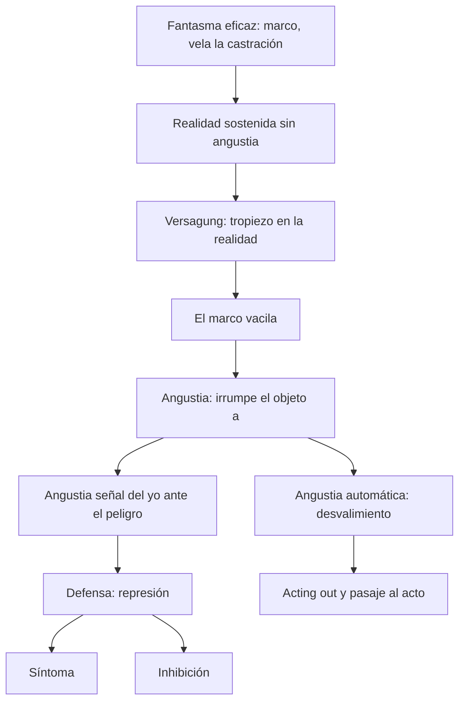
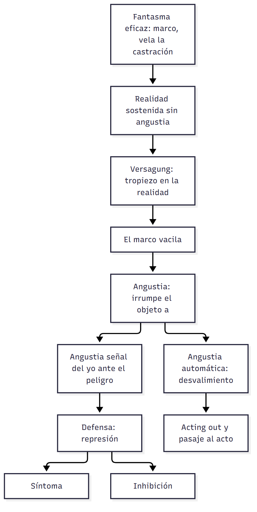

# C14 — El fantasma. Angustia, síntoma, inhibición

> **Fuente:** Belucci, *De la fantasía al fantasma. Un recorrido* (T05, 2024) · Freud, *Sobre la justificación de separar de la neurastenia un determinado síndrome en calidad de neurosis de angustia* (T06, 1895) · Freud, *Inhibición, síntoma y angustia*, caps. I-VIII (T08, 1926) · Lacan, *El Seminario 10. La angustia*, caps. II, VI, VIII, IX, XII y XXIV, selección (T09) · Belucci, *Introducción al diagnóstico de estructura* (T01, pp. 3-4, 7, 33-36, 39-44) · tus apuntes de la clase 14 (10/8/2026) · **Materia:** Psicoanálisis, 2.º año, Favaloro.
>
> **Cómo se cita:** «p. N» es la marca `## Página N` del texto extraído (T05, T09, T01). T06 y T08 no tienen marcas de página: se citan por **capítulo o apartado** (T08) o por sección (T06); **los números de capítulo de T08 (I-VIII) son orientativos** (el texto extraído no los marca: ubicá cada pasaje por su tema). Lo marcado **▸ Complemento** no está en los textos asignados.

> **Idea-fuerza:** inhibición, síntoma y angustia son los tres modos de padecimiento que Freud ordena en 1926: tres respuestas del sujeto frente al peligro y a la falta en el Otro. La angustia no nace de la libido reprimida (primera teoría, 1895): **es la reacción del yo a un peligro** —automática si hay desvalimiento, **señal** si lo anticipa— y **ella crea la represión**, no al revés. El síntoma es sustituto de una satisfacción interceptada; la inhibición, una limitación del yo por precaución o empobrecimiento. Lacan reescribe la fantasía freudiana como **fantasma** ($◊a): respuesta del sujeto a lo real y al deseo del Otro, **marco** que vela la castración; cuando vacila, irrumpe la angustia, que es lo que «no engaña» porque señala el objeto *a*.

## Hilo conductor: cómo se conectan los temas de esta guía

El tema de la clase son los **tres modos de padecimiento** que Freud ordena en 1926 (**inhibición, síntoma y angustia**) y el **fantasma** que Lacan introduce para explicar qué los sostiene. La clave para unirlos es una idea: **la angustia es la reacción del yo a un peligro**, y los otros dos son **respuestas** a esa angustia.

El recorrido empieza por el fantasma (preguntas 1 y 2). Freud llega a la **fantasía** en cuatro estaciones: en 1897 como **formación protectora** y ficcional; en 1905 como **mediadora entre la pulsión y el síntoma**, que inscribe la pulsión en una escena e invierte actividad y pasividad; en 1914 como lo que **conserva el objeto separado del yo** (y, cuando fracasa, aparece la angustia); y en 1919 como una **frase** con tres tiempos, la «cicatriz del Edipo». Lacan la reescribe como **fantasma** ($◊a): la respuesta del sujeto a lo real y al **deseo del Otro**, el **marco** que vela la castración y sostiene la realidad. Mientras el fantasma funciona, no hay angustia.

Cuando el fantasma **vacila**, irrumpe la angustia (pregunta 5). Freud pasa de la **primera teoría** (la angustia como libido sin descarga, 1895) a la **segunda** (1926): la angustia es una **reacción del yo al peligro**, **automática** si hay desvalimiento y **señal** si lo anticipa; y **ella crea la represión**. Lacan la ubica como lo que «no engaña»: señala el **objeto *a***. Desde ahí se entienden las otras dos respuestas: la **inhibición** (pregunta 3) es una **limitación del yo** (por conflicto con el ello, con el superyó o por empobrecimiento de energía) que evita la angustia, y el **síntoma** (pregunta 4) es el **sustituto de una satisfacción interceptada** que la liga y la tramita; con él, el yo hace una **adaptación secundaria** (ganancia de la enfermedad).

La pregunta 6 hace explícito el hilo: el fantasma sostiene la realidad sin angustia → vacila → **angustia señal** → **defensa** → **síntoma o inhibición**. Por eso «angustia y defensa» es el tema que cierra: la defensa es la respuesta a la angustia de castración, y el síntoma, la inhibición y el fantasma son lo que queda de esa respuesta.

**Para el parcial:** al responder por cualquiera de los tres modos, ubicá siempre **qué angustia lo motiva** y **qué papel juega el fantasma**; y al hablar de angustia, diferenciá **fundamento** (desvalimiento, automática) de **función** (señal) y recordá el **matiz** sobre «toda angustia es angustia de castración».

**En una sola oración:** el fantasma sostiene al sujeto frente a la falta; cuando vacila hay angustia, y la defensa frente a esa angustia produce síntoma o inhibición.

## 0. Hoja de ruta

1. **El fantasma en Freud y Lacan** (T05): cuatro estaciones freudianas (1897, 1905, 1914, 1919) y cuatro aspectos de Lacan.
2. **Inhibición** (T08, cap. I): limitación funcional del yo.
3. **Síntoma** (T08, caps. II-IV): sustituto, extraterritorialidad, lucha secundaria, ganancia secundaria.
4. **Angustia** (T06, T08 caps. IV-VIII, T09): primera teoría (1895) → segunda (1926); automática/señal; peligro y castración.
5. **Articulación** de síntoma, fantasma y angustia; relación angustia-defensa.

## 🎯 Lo que entra sí o sí

1. **Los cuatro momentos de la fantasía en Freud:** 1897 (formación protectora, ficcional), 1905 (mediadora pulsión-síntoma, inversión activo/pasivo, escena), 1914 (conserva el objeto separado; angustia = vacilación), 1919 (frase; tres tiempos; «cicatriz del Edipo»).
2. **Fantasma de Lacan:** ($◊a); respuesta a lo real y a la pregunta por el deseo del Otro; soporte; axioma; marco; objeto *a*.
3. **Inhibición:** tres mecanismos (conflicto con el ello, con el superyó, empobrecimiento energético).
4. **Síntoma:** indicio y sustituto de una satisfacción pulsional interceptada; extraterritorial; adaptación secundaria/ganancia de la enfermedad.
5. **Angustia:** automática/señal; el yo como único almácigo; **la angustia crea la represión**; evolución del peligro (desvalimiento → pérdida de objeto → castración → superyó → muerte); «castración» no es el único motor.
6. **Articulación:** el fantasma sostiene la realidad sin angustia → vacila → angustia señal → defensa → síntoma/inhibición.

---

## 1. Primera pregunta — Momentos en la elaboración freudiana de la fantasía

> *Refiérase a los principales momentos en la elaboración freudiana del concepto de fantasía.*

### 1.1 Respuesta modelo

La fantasía aparece en un punto preciso de la obra freudiana: **alrededor de 1897, en las cartas a Fliess** (T05, p. 2). Freud empieza a vacilar con su primera **teoría traumática** porque no le cerraba el altísimo número de casos en que supuestamente habría habido abuso por parte del padre, donde además el padre aparecía como seductor que fuerza activamente el encuentro. Introduce entonces la fantasía, todavía con vacilación: habría acontecimientos traumáticos y las fantasías serían «una especie de **formación protectora**»; para no recordar lo traumático, se fantasea. Belucci destaca dos rasgos: el **carácter ficcional** de la fantasía y su **función protectora** ante algo que, presentado de modo directo, resultaría traumático.

Un tiempo después Freud deja de lado el carácter necesario de esos acontecimientos y ubica el **factor traumático como inherente al sujeto**, ligado a la dimensión pulsional, al factor cuantitativo. En **«Mis tesis sobre el papel de la sexualidad en la etiología de las neurosis» (1905)**, con el concepto de pulsión ya formulado, la fantasía tiene una función protectora **en relación con el movimiento de la pulsión**: lo que del lado de la pulsión es actividad (la pulsión siempre es activa), en la fantasía aparece **invertido** y el sujeto aparece en posición pasiva (en la histeria: «era seducida y abusada por el padre»); además la fantasía **inscribe la pulsión en una escena** —tiene una dimensión escénica, imaginaria— y es **formación mediadora entre la pulsión y el síntoma** (la tos de Dora: satisfacción en la zona oral y fantasía de encuentro sexual oral entre el padre y su amante) (T05, p. 2-3).

En **«Introducción del narcisismo» (1914)** Freud delimita el campo de la neurosis frente a las «neurosis narcisistas» (luego psicosis): cuando hay un tropiezo en la realidad, en las neurosis narcisistas la libido se retira de los objetos y se vuelca sobre el yo; en las **neurosis de transferencia el objeto se conserva en la fantasía**, **separado del yo** y con posibilidad de **intercambio libidinal**: la fantasía es separación y conjunción a la vez (matriz de la fórmula lacaniana); si la ligadura de la libido por la fantasía fracasa, la marca clínica es la **angustia** (T05, p. 3). Por último, en **«Pegan a un niño» (1919)** Freud la formula no solo como escena sino como una **frase** (estructura gramatical), con **tres tiempos** (el segundo, masoquista e inconsciente, es el fundamental), la ubica entre los 4 y 6 años —salida del Edipo— y la llama «**cicatriz del complejo de Edipo**», predisposición a la neurosis, con lo cual la constitución del fantasma forma parte de la **condición neurótica** de las series complementarias (T05, pp. 4-7).

### 1.2 Desarrollo ampliado

#### Estación 0: el problema que la fantasía resuelve (T05, p. 1)

- Belucci propone pensar la estructura de la neurosis «a partir de lo trabajado sobre las series complementarias, pero tomando otros articuladores»: **¿qué saldos deja Edipo-castración?** Tres: el **superyó** (heredero del Edipo), el **ideal del yo** y el **fantasma**.
- **Superyó:** instancia compleja, de origen muy anterior al Edipo, efecto del encuentro con el lenguaje; en un primer momento encarna la **demanda del Otro**, sin más (una demanda «que puede ser verdaderamente loca»). A la salida del Edipo esa vertiente, ligada a la demanda materna, se anuda a la **ley del padre**: heredero y representante de la ley (operación secundaria; no reduce la otra cara). Se satisface en el malestar y el padecimiento y «se alimenta de la renuncia»: se vuelve más cruel cuanto más renuncia el sujeto (T05, p. 1).
- **Ideal del yo:** regula la relación a la propia imagen; a la salida del Edipo representa la marca de que hay castración, pues nunca yo e ideal coinciden. Tanto superyó como ideal quedan referidos al padre: **el Edipo inscribe al padre en la estructura**; se entra «por el lado de la madre y se sale por el lado del padre» (T05, pp. 1, 5).
- La tercera instancia es la que soporta la posición del neurótico en la vida. **La pregunta neurótica** («¿qué soy en el Otro?») no es consciente: vivimos en un «**olvido del ser**» (expresión de Heidegger). Si se olvida la pregunta es porque hay una **respuesta eficaz: el fantasma** (T05, pp. 1-2).

#### Estación 1: Cartas a Fliess, 1897 (T05, p. 2)

- Primera teoría traumática: relatos de abuso paterno; el padre no como partenaire amoroso sino como seductor que «activamente fuerza el encuentro». Freud duda: ¿acontecimientos reales o «alguna otra cuestión»?
- **Fantasía = formación protectora**: «para no recordar lo traumático del hecho, se fantasea». Dos elementos: carácter **ficcional** y función **protectora**.
- Refs. citadas por Belucci: Cartas 69, Manuscritos L y M (T05, p. 9).

#### Estación 2: «Mis tesis...», 1905 (T05, pp. 2-3)

- El factor traumático pasa a ser algo **inherente al sujeto**: dimensión pulsional, factor cuantitativo.
- **Función protectora con relación a la pulsión:** «lo que del lado de la pulsión es actividad (...) en la fantasía aparece invertido»: el sujeto en posición **pasiva**. Donde aparece pasividad **subyace la actividad pulsional**, que «ni siquiera es algo que el sujeto pueda asumir en primera persona»: «está encubierto, velado, por la estructura de la fantasía».
- **Inscribe** la pulsión en una **escena** (dimensión escénica: «una escena en el sentido más teatral», con condiciones, circunstancias, personajes; si se la piensa con Lacan, dimensión **imaginaria**). Por un lado protege contra el movimiento de la pulsión, por otro lo **inscribe**, le da marco.
- **Formación mediadora entre pulsión y síntoma:** «todo síntoma conlleva la referencia a una escena fantaseada». **Ejemplo (Dora):** la tos, con satisfacción oral, despliega en el análisis la fantasía de encuentro sexual oral entre el padre y su amante.

#### Estación 3: «Introducción del narcisismo», 1914 (T05, pp. 3-4)

- Pregunta: qué sucede con la libido cuando hay un tropiezo en el campo de la realidad (donde la libido circula y ocupa posiciones).
- **Neurosis narcisistas:** retiro de la libido de los objetos y vuelta sobre el yo. **Neurosis de transferencia:** «el objeto se va a conservar en la fantasía». La fantasía garantiza el **lugar psíquico del objeto**, un objeto **distinto y separado del yo**.
- Contraste con la **melancolía**: el objeto se conserva «al costo de asimilarlo al yo»; el yo se transforma en el objeto y la distancia se borra; en la fantasía la distancia se conserva.
- La fantasía permite además un **intercambio libidinal** entre yo y objeto: dos operaciones aparentemente opuestas pero conjugadas: **separación** y **conjunción**, «sin borrar la marca de la separación». Sobre esta matriz Lacan define la fórmula del fantasma.
- **Trayectoria de la neurosis:** primero la libido inviste los objetos de la fantasía, pero la solución puede fracasar y la marca clínica es la **angustia**: «la marca de que esa respuesta por la vía de la fantasía vacila». Freud agrega que la angustia de las neurosis de transferencia **deriva de la libido objetal** (la hipocondría de la libido yoica): **en la angustia hay un objeto**, pero no representable ni nombrable: lo más cercano en Freud a lo que Lacan delimitará como **objeto *a*** en su cara real (T05, p. 4).
- **Tu lectura de clase (apuntes):** «El Fantasma: respuesta que el sujeto se da en relación al deseo del Otro. Comparte respuesta a la angustia.»

#### Estación 4: «Pegan a un niño», 1919 (T05, pp. 4-7)

- Es donde, según consenso, Freud formula con mayor precisión **la estructura de la fantasía**: fantasías de paliza típicas en los análisis. No solo escena, sino **frase** (dimensión gramatical, también presente en la pulsión: voz activa, pasiva y media). «Pegan a un niño» es una de sus versiones.
- **Clínica:** los pacientes la relatan con mucha dificultad, atravesando la **vergüenza**; su historia reconduce a la infancia, **entre 4 y 6 años**, salida del Edipo: es «el precipitado fundamental» de Edipo-castración.
- **Tres tiempos:**
  1. **El padre pega al niño [que yo odio]**: la persona castigada no es el fantaseador ni el verdugo; el sujeto es espectador (**lugar de la mirada**). El azotado es otro niño, por lo regular un hermano (celos; lugar del nacimiento de un hermano en la constitución de la neurosis). La referencia es el **padre**.
  2. **«Yo soy pegado por el padre»**: tiempo **fundamental** y **nunca consciente** (necesidad lógica del análisis); inversión de lugares; **carácter masoquista**. Se conjugan dos cosas: el **castigo** (el padre como agente de la ley que castiga lo incestuoso) y una **versión degradada del amor**: «ser azotado por el padre tiene la significación de ser amado por el padre». Por esto la fantasía tiene carácter **perverso**: el padre mismo es fuente de satisfacción incestuosa. «Nunca se renuncia del todo a nada, siempre hay algo que sustituye.»
  3. **Consciente:** una multitud de niños azotados (castigos en la escuela) y una figura de autoridad en lugar del padre.
- **Dos consecuencias** (T05, p. 6): (a) el fantasma es una **versión del padre**: el padre como **operador de la estructura** (Nombre-del-Padre) y como lo que cada uno se representa de un padre en el marco del fantasma (el padre «perturbador del erotismo» del Hombre de las Ratas; el padre impotente de Dora no coinciden con la persona de carne y hueso). «Curar la neurosis en parte quiere decir revisar esa versión del padre.» (b) La fantasía sostiene una **complementariedad posible con el Otro**, y su costo es el **masoquismo/posición sacrificial**: «por amor renuncio a», «por amor me sacrifico»; la neurosis es nuestra «religión privada» (Freud); el masoquismo supone que hay un Otro/padre que responde por nosotros ante lo real.
- **«Cicatriz del complejo de Edipo»** y «**predisposición a la neurosis**» (T05, pp. 6-7): la constitución del fantasma forma parte de la **condición neurótica** (series complementarias); cicatriz = marca de algo inscripto que remite a una herida: la castración. Los neuróticos tratamos de no enterarnos de la castración **del Otro**: en la obsesión el fantasma da un Otro sin falta, un padre potente; en la histeria, «el amo castrado» (Seminario 17): se señala la falta del padre pero suponiendo una excepción, alguien que sí tendría la potencia (la histérica que dice «el vecino sí me ayudó»).
- **El fantasma arma «el clisé»** (Freud, vida amorosa): transforma el encuentro en reencuentro; tranquiliza pero aburre. Lacan: «el cuentito que nos contamos todas las noches para poder dormirnos» (T05, p. 7).

#### Complemento: la fantasía en la 23.ª Conferencia (T04)

- → conecta con `C13_EstructuraYTiemposDeLaNeurosis_Guia.md §3`: la fantasía como **reserva** sustraída del principio de realidad («parque natural»); **sueños diurnos** (núcleo de los sueños nocturnos); **fantasías inconscientes** como fuente de síntomas; **introversión** (sobreinvestidura de la fantasía) como eslabón hacia la fijación; **fantasías primordiales** (seducción, escena primordial, castración); realidad psíquica.

> 🔑 **Punto clave:** la fantasía pasa de **ficción protectora** (1897) a **estructura que inscribe y media la pulsión** (1905), **conserva el objeto separado** (1914) y se formaliza como **frase masoquista referida al padre** (1919) —cicatriz del Edipo.

---

## 2. Segunda pregunta — El fantasma en Lacan y su lugar en la estructura de la neurosis

> *¿Cómo formula Lacan el concepto de fantasma y qué lugar ocupa en la estructura de la neurosis?*

### 2.1 Respuesta modelo

Lacan retoma la fantasía freudiana como **fantasma**, y Belucci destaca **cuatro aspectos** (T05, pp. 7-8). **(1)** El fantasma es una **respuesta del sujeto**: en principio a **lo real** (es el modo privilegiado, en la neurosis y en la perversión, de velarlo y mantenerlo a distancia) y a la **pregunta fundamental de la neurosis**, la pregunta por el deseo del Otro («¿qué lugar ocupamos como sujetos en el conjunto de significantes que nos determinan?», «¿qué soy ahí?»); en tanto respuesta, es **soporte del sujeto**. **(2)** Ese soporte no es cualquiera: el **fantasma fundamental** «sostiene todo el entramado de la neurosis» y en el Seminario 14 (*La lógica del fantasma*) Lacan lo postula como **axioma**; su evidencia es que «vuelve evidente nuestro mundo»: la realidad que habitamos deriva del fantasma (para Kant, la «cosa-en-sí» sería lo real; el mundo percibido está organizado por categorías); y en tanto el fantasma se sostiene en una referencia al padre, «la realidad que habitamos los neuróticos es una realidad religiosa» (Descartes: Dios no nos engaña). **(3)** Lo escribe con una fórmula, **($◊a)**: el **sujeto dividido** y el **objeto *a***, unidos por el **losange** (rombo), que combina conjunción y disyunción: sujeto y objeto son heterogéneos, **disyuntos**, pero el fantasma les supone una **relación posible** —complementariedad— sin borrar el corte. **(4)** Más allá de ser argumento (escena con personajes y acción) el fantasma es el **marco** que hace posible la representación: delimita lo representado y lo **separa de lo real**; de ahí su carácter tranquilizador (T05, p. 8).

En la **estructura de la neurosis** el fantasma ocupa el lugar de **respuesta que permite olvidar la pregunta**: la neurosis es una «**clínica de la pregunta**» (T01, p. 3): la falta en el Otro es necesaria por la Ley del Padre y el sujeto solo puede preguntarse por su lugar; la pregunta es implícita porque el sujeto se da respuestas (fantasma, ideales, yo) «que hacen que su existencia ordinaria se desenvuelva en el olvido de esa pregunta». El fantasma vela la **castración del Otro** (en la obsesión, un Otro/padre potente; en la histeria, «el amo castrado») y, mientras funciona, **no hay angustia**; cuando vacila, aparece la angustia. Además es el soporte de las **versiones del padre** de cada neurosis, y su fracaso define las **fobias** y la **clínica de los bordes** (T05, p. 9).

### 2.2 Desarrollo ampliado

#### a) Lacan: la angustia, el marco y el objeto *a* (T09)

- **Clase VI («Lo que no engaña», 19/12/1962):** «El fantasma se ve más allá de un cristal, y por una ventana que se abre. El fantasma está **enmarcado**.» Lo **unheimlich** (lo horrible, lo inquietante) se presenta **a través de ventanillas**: «es enmarcado como se sitúa el campo de la angustia» (T09, p. 1). «**Súbitamente, de golpe**» es el término del momento de entrada de lo unheimlich: la escena permite que surja lo que en el mundo no puede decirse. **El telón:** «¿Qué esperamos cada vez que se levanta el telón sino ese breve momento de angustia?», sin ese tiempo introductorio nada podría ser trágico o cómico.
- **Erwartung** (espera) = constitución de lo hostil, primer recurso más allá de la *Hilflosigkeit*; puede servir para enmarcar la angustia pero no es indispensable: **el marco siempre está ahí** (T09, p. 2).
- **La angustia surge cuando en el marco aparece lo que ya estaba mucho más cerca, en la casa (*Heim*)**: «el surgimiento de lo *heimlich* en el marco constituye el fenómeno de la angustia, y por eso es falso decir que la angustia carece de objeto». Tiene otra clase de objeto que el que prepara «la rejilla del corte, del surco, del rasgo unario». **La angustia es ese corte** que deja aparecer «lo inesperado, la visita, la noticia, el presentimiento» (pre-sentimiento). **Lo que esperábamos es «ese lo que no engaña, lo fuera de duda»** (T09, p. 2).
- **Clase VIII («La causa del deseo»):** el objeto *a* se sitúa en el centro del seminario; **la angustia es su única traducción subjetiva**; fue anunciado en la fórmula del fantasma como **soporte del deseo** ($◊a); este objeto debe concebirse como la **causa del deseo**: «está **detrás** del deseo» (T09, p. 2). Es «aquella roca de la que habla Freud, la reserva última irreductible de la libido». Reconocerse como objeto del propio deseo «es siempre masoquista, pero el masoquista solo lo hace **en la escena**»; cuando no estamos en la escena y leemos en el Otro de qué va, «no encontramos allí, en x, más que la falta» (T09, p. 3).
- **Clase XII («La angustia, señal de lo real»):** Freud evoca la *Objektlosigkeit* de la angustia, pero también dice que es esencialmente *Angst vor etwas*, **angustia ante algo**; ese *etwas* es del orden de **lo irreductible de lo real**: «de todas las señales, [la angustia] es la que no engaña». (T09, p. 4).
- **Clase XXIV:** Freud designó la angustia como **señal** distinta del efecto de la situación traumática y articulada con el **peligro**; Lacan lo precisa: el peligro está ligado al carácter de **cesión** del momento constitutivo del objeto *a*; sitúa el momento de la angustia **anterior a la cesión del objeto**. «La angustia se manifiesta sensiblemente como relacionada de forma compleja con el **deseo del Otro**»: la función angustiante del deseo del Otro está vinculada a «**no sé qué objeto *a* soy yo para dicho deseo**» (T09, p. 4).
- **Clase II («La angustia, signo del deseo»):** el modo de la conquista del otro no es «Te amo, aunque no quieras» sino «**Yo te deseo, aunque no lo sepa**»: tomo al otro como objeto —para mí mismo desconocido— de mi deseo y lo identifico con el objeto que le falta (T09, p. 1).
- **Clase IX («Pasaje al acto y acting out»):** el **dejar caer** (*niederkommen lassen*) es correlato del **pasaje al acto**: del lado del sujeto, «borrado al máximo por la barra»; el sujeto «se precipita y bascula **fuera de la escena**». El **acting out** «es esencialmente algo que se **muestra**», con «acento demostrativo», **orientado hacia el Otro** (T09, pp. 3-4). **Tus apuntes:** Lacan suma a inhibición, síntoma y angustia el *pasaje al acto* y el *acting out*.

#### b) El objeto del fantasma y el objeto de la angustia (T05, pp. 4, 8)

- **Objeto *a* en la angustia:** «no es representable, o sea que está por fuera de la dimensión imaginaria; no es nombrable, o sea por fuera del registro del significante. Es la dimensión **real** del objeto». Solo hay ese objeto porque hubo un **corte** (inscripción de la ley del padre). **En la psicosis no hay extracción** → **no hay angustia en sentido estricto** (hay perplejidad) (T05, p. 4).
- **Objeto *a* en el fantasma:** dos dimensiones: **el semejante** (el otro como totalidad) y los **objetos parciales** (pulsión oral, anal; en Lacan también la mirada y la voz). **Ejemplo (T05, p. 8):** publicidad de un auto de alta gama, con una mujer atractiva en la que se recorta una mirada sensual: articulación del otro como semejante y del objeto parcial que seduce.
- **Siniestro:** «cuando en la escena irrumpe un objeto que no es el objeto representado, sino que tiene cierto carácter irrepresentable, y que no debería aparecer en la escena, se produce un efecto que Freud denomina **lo siniestro**» (T05, p. 8). Diferencia **angustia/miedo**: si puede representarse, se pasa de la angustia al miedo (T05, p. 4).
- **Correlato clínico:** «no vamos por la vida angustiados»; la angustia aparece cuando la escena en que nos sostenemos deja de ser eficaz (T05, p. 4).

#### c) El lugar en la estructura: diferencias entre estructuras (T01, pp. 7, 14-15, 32-34)

- **El fantasma como mediación (T01, p. 7):** «el fantasma —que Freud ubicaba como “cicatriz del Edipo”— establece una mediación con respecto a la falta en el Otro, permite **deslindar demanda y deseo** y **vela la castración**, operaciones que en las **fobias** se encuentran complicadas.» Cita de Lacan (*Subversión del sujeto*, 1960): el neurótico «es aquel que identifica la falta del Otro con su demanda, Φ con D»; esa preeminencia de la demanda oculta su **angustia del deseo del Otro**; el soporte fantasmático permite distinguir las modalidades obsesiva (niega el deseo del Otro al formar su fantasma acentuando lo imposible) e histérica (el deseo solo se mantiene por la insatisfacción).
- **Fantasma neurótico vs. perverso (T01, pp. 14-15):** en la neurosis, $◊a: el sujeto resuelve su división conjugándose con un objeto; en la perversión **el orden está invertido** (a◊$): el perverso se ubica en el lugar del objeto y desde ahí promueve la **división del sujeto (su partenaire)** y busca producir la **angustia** como signo de esa división. El fantasma perverso sostiene fortaleza yoica y pretende reducir lo real (imposible) a lo posible. **No es** que el perverso actúe y el neurótico fantasee: hay perversos que juegan el fantasma en la ficción (Sade) y neuróticos que lo llevan a la acción.
- **Clínica de los fracasos del fantasma (Amigo; T01, pp. 32-34):** elaborar el fantasma supone tres operaciones: (1) **expulsión de lo real** por inscripción del NP (≈ extracción del objeto *a*); (2) **constitución de un marco** simbólico; (3) **representar imaginariamente un objeto** dentro del marco. Tres tipos de fracaso: radicales (autismo y psicosis); contingentes (urgencia en las neurosis); **estructurales** (clínica de los bordes). → conecta con `C19_20_ClinicaDeLosBordes_Guia.md`.
- **Fantasma y yo (T01, p. 34):** el yo es un precipitado de identificaciones y solo adquiere estabilidad «como **personaje fantasmático**»; la fórmula con el losange indica conjunción y disyunción; el fantasma funciona como «conmutador» de los intercambios libidinales entre yo y otro.

> 🔑 **Punto clave:** el fantasma es **respuesta**, **soporte**, **axioma**, **fórmula** ($◊a) y **marco**. Está en la estructura de la neurosis como lo que permite **olvidar la pregunta** y **velar la castración** del Otro; su vacilación abre la **angustia**.

---

## 3. Tercera pregunta — La inhibición y su función en la neurosis

> *Caracterice la inhibición y refiérase a la función que Freud le atribuye en la neurosis.*

### 3.1 Respuesta modelo

Al comenzar *Inhibición, síntoma y angustia* (cap. I), Freud observa que la terminología distingue entre síntomas e inhibiciones sin atribuir gran valor al distingo; solo se vuelve interesante porque existen casos que muestran **solo inhibiciones y ningún síntoma**. «**Inhibición**» tiene un nexo particular con la **función** y no designa necesariamente algo patológico (puede ser una limitación normal de una función); «**síntoma**» equivale a indicio de un proceso patológico. La terminología habla de inhibición donde hay una simple **rebaja de la función** y de síntoma donde hay una variación desacostumbrada o una nueva operación; una inhibición puede ser un síntoma. Freud concluye que la inhibición expresa «una **limitación funcional del yo**, que a su vez puede tener muy diversas causas», y que son «limitaciones de las funciones yoicas, sea **por precaución** o a consecuencia de un **empobrecimiento de energía**». Para estudiarla compara cuatro funciones: la **sexual**, la **nutricia**, la **locomoción** y el **trabajo profesional**.

Su **función en la neurosis** es la de un **modo de tratamiento de la angustia por fuera de la represión y del síntoma**: el yo renuncia a una función para evitar un conflicto —con el ello, con el superyó— o porque la tarea psíquica lo ha empobrecido. En las palabras de Belucci, la inhibición es «un modo de tratamiento de la angustia por fuera del circuito de la represión, mediante una limitación funcional del yo»; es «un modo, aunque muy costoso, de evitar la angustia, allí donde la respuesta sintomática no es posible», como lo ilustran los sujetos **fóbicos** (T01, p. 39).

### 3.2 Desarrollo ampliado (T08, cap. I y T01, p. 39)

#### a) Las cuatro funciones (T08, cap. I)

- **Sexual** (inhibiciones simples; «impotencia psíquica»): estaciones de la inhibición en el varón: extrañamiento de la libido al inicio (displacer psíquico), falta de la preparación física (sin erección), abreviación del acto (*ejaculatio praecox*, que puede describirse también como síntoma positivo), detención antes del desenlace natural (falta de eyaculación), no consumación del efecto psíquico (ausencia de placer del orgasmo); otras perturbaciones por enlace a condiciones perversas o fetichistas. **Nexo inhibición–angustia:** muchas inhibiciones son renuncia a la función porque a raíz de su ejercicio se desarrollaría angustia. En la mujer es frecuente una angustia directa frente a la función sexual (histeria), y el **asco** como síntoma defensivo, reacción *a posteriori* frente al acto sexual vivenciado pasivamente. Muchas acciones obsesivas son precauciones contra un vivenciar sexual, y por tanto de naturaleza fóbica.
- **Seis procedimientos** para perturbar la función: extrañamiento de la libido (inhibición pura); menoscabo en la ejecución; obstaculización por condiciones particulares y desvío hacia otras metas; prevención por aseguramiento; interrupción por desarrollo de angustia; reacción posterior que quiere deshacer lo acontecido.
- **Nutricia:** displacer frente al alimento por quite de libido; incremento del placer de comer; compulsión a comer por angustia de morirse de hambre; vómito como defensa histérica; rehusamiento de comida por angustia en estados psicóticos (delirio de envenenamiento).
- **Locomoción:** displacer y flojera en la marcha; la histeria usa la paralización del aparato motor o la cancelación especializada (abasia); obstáculos por condiciones cuyo incumplimiento provoca angustia (**fobia**).
- **Trabajo:** placer disminuido, torpeza, fatiga (vértigos, vómitos); histeria: parálisis de órgano; neurosis obsesiva: distracción continua y pérdida de tiempo por demoras y repeticiones.

#### b) Los tres mecanismos (T08, cap. I y apuntes de clase)

1. **Inhibición especializada** (conflicto con el ello): «la función yoica de un órgano se deteriora cuando aumenta su **erogeneidad**, su significación sexual». Ejemplos: tocar el piano, escribir, caminar: los dedos o los pies están hiperintensamente erotizados. Comparación de Freud: la cocinera que no quiere trabajar más en la cocina porque el dueño de casa trabó relaciones amorosas con ella. **Escribir** (hacer fluir un líquido de un tubo sobre un papel blanco) ha cobrado significación simbólica de coito; **caminar** (pisar el vientre de la Madre Tierra) se omiten porque sería ejecutar la acción sexual prohibida. «El yo renuncia a estas funciones que le competen a fin de no verse precisado a emprender una nueva represión, a fin de **evitar un conflicto con el ello**.» *Tus apuntes:* «en un escritor, su mano (+ su erogeneidad)».
2. **Inhibición al servicio de la autopunición** (conflicto con el superyó): actividades profesionales que proporcionarían provecho y éxito que el severo superyó ha denegado; «el yo renuncia a esas operaciones a fin de no entrar en conflicto con el superyó».
3. **Inhibición general** (empobrecimiento energético): cuando el yo es requerido por una tarea psíquica gravosa (**un duelo**, una enorme sofocación de afectos, la necesidad de sofrenar fantasías sexuales que afloran de continuo), se empobrece tanto que debe limitar su gasto en muchos sitios, «como un especulador que tuviera inmovilizado su dinero en sus empresas». **Ejemplo:** un enfermo obsesivo que caía en una fatiga paralizante, de uno a varios días, a raíz de ocasiones que habrían debido provocarle un estallido de ira. Abre camino a comprender la inhibición general de los **estados depresivos** y de la **melancolía**.

#### c) Qué la distingue del síntoma (T08, cap. I-II)

- «Ahora es fácil discernir la diferencia entre la inhibición y el síntoma. Este último **ya no puede describirse como un proceso que suceda dentro del yo o que le suceda al yo**»: la inhibición es limitación **interna** del yo; el síntoma, formación **extraterritorial** (T08, cap. II).
- Belucci (T01, p. 39): las soluciones **sintomáticas** (a diferencia de las inhibitorias) implican la coordinación al inconsciente como discurso del Otro; la inhibición es respuesta por fuera del circuito de la represión; **«síntoma y desarrollo de angustia se excluyen mutuamente»** y, donde el síntoma no es posible, queda la inhibición. El recurso a la inhibición «excede con mucho la particularidad de las fobias, e incluso el campo mismo de las neurosis» (en las psicosis puede funcionar como barrera al goce ilimitado y suplencia de la Ley paterna ausente, T01 p. 39 n. 96).
- **Fobia y inhibición (T01, p. 3):** en las fobias el síntoma no logra relevar el desarrollo de angustia; de ahí la importancia de la respuesta **inhibitoria** (Hans: renuncia a salir a la calle para no encontrar caballos, T08 cap. IV y siguientes).
- **Tus apuntes (clase 14):** «Inhibición (al nivel del Yo): limitación, rebaja de una función del Yo. **Síntoma negativo** (resta, elimina algo). No implica necesariamente un síntoma, pero podría.»

> 🔑 **Punto clave:** la inhibición es una **limitación de una función del yo** —por **precaución** (frente al ello o al superyó) o por **empobrecimiento energético**— y funciona como **respuesta a la angustia por fuera de la represión y del síntoma**.

---

## 4. Cuarta pregunta — El síntoma: concepto, función subjetiva y aspectos

> *Desarrolle el concepto de síntoma. Dé cuenta de su función subjetiva y de sus distintos aspectos.*

### 4.1 Respuesta modelo

Para Freud (T08, cap. II) **el síntoma es «indicio y sustituto de una satisfacción pulsional interceptada», resultado del proceso represivo**: la represión parte del yo, quien, eventualmente por encargo del superyó, no quiere acatar una investidura pulsional incitada en el ello; mediante ella consigue coartar el devenir consciente de la representación portadora de la moción desagradable, que muchas veces se conserva como formación inconsciente. A consecuencia de la represión «el decurso excitatorio intentado en el ello no se produce»; la moción pulsional encuentra de todos modos un **sustituto harto mutilado, desplazado, inhibido, ya no reconocible como satisfacción**, y su consumación no produce placer sino el carácter de la **compulsión**. Como **función subjetiva**, el síntoma tramita un conflicto: es **formación de compromiso** entre la satisfacción pulsional y la exigencia defensiva (T04). Belucci agrega que, en el síntoma, el sujeto localiza **goce** y la posibilidad de **una pregunta que convoque un saber por venir** (T01, p. 39) y que opera, hacia atrás, como **respuesta a la angustia** (T01, p. 3). **Sus aspectos**: **extraterritorialidad** (existe fuera de la organización yoica, con independencia de ella; «cuerpo extraño que alimenta sin cesar fenómenos de estímulo y reacción»); **tendencia a la asimilación** (el yo, por su compulsión a la síntesis, intenta incorporarlo: **adaptación secundaria** y **ganancia secundaria de la enfermedad**, que refuerza la fijación y actúa del lado de la resistencia); y la **lucha defensiva secundaria** contra el síntoma, que continúa la lucha contra la moción pulsional.

### 4.2 Desarrollo ampliado (T08, caps. II-V y T01)

#### a) Formación de síntoma y poder del yo (T08, cap. II)

- **Señal de displacer:** el yo se revuelve contra un proceso pulsional del ello con solo emitir una **señal de displacer** y recurre así a la instancia «casi omnipotente» del principio de placer. Freud lo ilustra con un Estado donde una camarilla se apodera de la prensa y trabaja la «opinión pública» hasta interceptar una decisión.
- El yo adquiere este influjo por sus **vínculos con el sistema percepción (P-Cc)**, que es el fundamento de su diferenciación del ello; recibe excitaciones de adentro y de afuera y, por las sensaciones de placer y displacer, guía el acontecer anímico.
- **La energía para la señal** viene de la **retirada de investidura preconsciente** de la representación a reprimir: la represión «equivale a un intento de huida» (primero se quita la investidura a la percepción de lo peligroso; después acciones musculares la vuelven imposible). El yo es «el genuino **almácigo de la angustia**» y se rechaza la concepción anterior de que la energía de la moción reprimida se mudaba automáticamente en angustia: «proporcioné una descripción fenomenológica, no una exposición metapsicológica». La angustia no se produce como algo nuevo con la represión, sino que es **reproducida como estado afectivo siguiendo una imagen mnémica preexistente**; los afectos son «sedimentaciones de antiquísimas vivencias traumáticas» y se equiparan a los ataques histéricos como arquetipos normales; el **nacimiento** como primera vivencia de angustia dejó rasgos característicos, aunque no hay que sobrestimar el nexo (T08, cap. II).
- **Represión primordial y *Nachdrängen* («esfuerzo de dar caza»):** la mayoría de las represiones del trabajo terapéutico presuponen represiones primordiales anteriores que ejercen atracción; los primeros estallidos de angustia son anteriores a la diferenciación del superyó; factores cuantitativos (intensidad hipertrófica de excitación, ruptura de la **protección antiestímulo**) serían ocasiones de las represiones primordiales. Hay protección antiestímulo solo frente a estímulos externos, no frente a exigencias pulsionales internas (T08, cap. II).
- **Dos situaciones de la represión:** cuando una percepción externa evoca una moción pulsional desagradable, y cuando esta emerge en lo interior sin provocación.

#### b) Aspectos del síntoma (T08, caps. II-III)

- **Sustituto mutilado y compulsión:** «a pesar de la represión, la moción pulsional ha encontrado un sustituto, harto mutilado, desplazado, inhibido. Ya no es reconocible como satisfacción» (T08, cap. II).
- **Mantenido lejos de la descarga motriz:** el proceso sustitutivo no puede descargar en la acción; se agota «en la alteración del cuerpo propio y no se le permite desbordar sobre el mundo exterior»: «en la represión el yo trabaja bajo la influencia de la realidad externa» (T08, cap. II).
- **Extraterritorialidad:** el proceso que por obra de la represión ha devenido síntoma afirma su existencia **fuera de la organización yoica y con independencia de ella**; también sus retoños gozan de este privilegio y pueden atraer sectores del yo, extendiéndose a expensas del yo. Comparación: el síntoma como un **cuerpo extraño** que alimenta fenómenos de estímulo y reacción en el tejido. (Belucci, T01 p. 39: «extraterritoriales al yo».)
- **Fortaleza y debilidad del yo (T08, cap. II):** la contradicción aparente con *El yo y el ello* (vasallajes) se resuelve: «el yo es idéntico al ello, no es más que un sector del ello diferenciado en particular»; es una **organización**, el ello no; si el yo permanece ligado al ello, es fuerte; si se produce una bipartición, se manifiesta su endeblez. No hay que representarse al yo y al ello como dos ejércitos. El yo y el superyó se confunden y solo se distinguen cuando hay tensión.
- **Lucha defensiva secundaria** (T08, cap. III): la lucha contra la moción pulsional se **continúa en la lucha contra el síntoma**; tiene «dos rostros de expresión contradictoria»: (1) **intento de restablecimiento o reconciliación** (el yo, organización basada en el libre comercio de sus componentes y con energía desexualizada que revela su origen en la aspiración a la ligazón, tiene una **compulsión a la síntesis** que crece con su vigor: busca cancelar la ajenidad del síntoma, incorporarlo) y (2) la prosecución de la represión (el síntoma sigue renovando la exigencia de satisfacción y fuerza al yo a dar una y otra vez la señal de displacer). **Ejemplo clásico:** síntomas histéricos transparentes como **compromiso entre necesidad de satisfacción y necesidad de castigo**: en tanto cumplimiento de una exigencia del superyó participan del yo; a la vez son posiciones de lo reprimido: «estaciones fronterizas con investidura mezclada».
- **Adaptación secundaria y ganancia (T08, cap. III):** «el síntoma ya está ahí y no puede ser eliminado; ahora se impone avenirse… y sacarle la máxima ventaja posible». Puede estorbar el rendimiento y así **apaciguar una demanda del superyó o rechazar una exigencia del mundo exterior**; subroga intereses importantes, cobra valor para la **afirmación de sí**, se fusiona con el yo. Freud lo pone en balance: afirmar que el yo se lo procuró para gozar de sus ventajas es tan falso como pensar que el mutilado de guerra se hizo cortar la pierna para vivir de su pensión. En la **obsesión y la paranoia**, la configuración sintomática da una **satisfacción narcisista** (el espejismo de ser más puros o escrupulosos; el campo de acción del delirio). Es la **ganancia (secundaria) de la enfermedad**: refuerza la fijación y «actúa en el bando de las resistencias» en el análisis.
- **Histeria de conversión:** síntomas permanentes o intermitentes: son procesos de investidura; el análisis revela el decurso excitatorio al cual sustituyen (el dolor estuvo presente en la situación de la represión; la alucinación fue percepción; la parálisis motriz es defensa frente a una acción que debía ejecutarse; la contractura, desplazamiento de una inervación; el ataque convulsivo, estallido afectivo sustraído al control del yo). La sensación de displacer varía: casi falta en parálisis y contracturas; en los síntomas sensoriales intermitentes es nítida. Freud admite la «particular opacidad de la formación de síntoma en la histeria de conversión» y abandona ese terreno infecundo.
- **Neurosis obsesiva (T08, cap. IV):** dos clases de síntoma de tendencia contrapuesta: **prohibiciones, medidas precautorias, penitencias** (negativos) y **satisfacciones sustitutivas** con disfraz simbólico; con el tiempo prevalecen las satisfacciones, que «burlan toda defensa». Triunfo de la formación de síntoma: enlazar prohibición y satisfacción; síntomas con el significado de su opuesto directo (**ambivalencia**); **síntoma de dos tiempos**: a la acción que ejecuta un precepto sigue otra que lo cancela (→ anulación). → conecta con `Transversal_ConceptoDeDefensa_Guia.md`.
- **Fobia (T08, cap. IV):** ver §5 (Hans): ¿cuál es el síntoma — el desarrollo de angustia, la elección del objeto, la renuncia a la libre movilidad? Lo que convierte la reacción en neurosis es **«única y exclusivamente» la sustitución del padre por el caballo**: «es este **desplazamiento** lo que se hace acreedor al nombre de síntoma».

#### c) Sustitución del peligro: síntomas para evitar la situación de peligro (T08, cap. VIII)

- «Se podría decir que los síntomas son creados para evitar el desarrollo de angustia, pero ello no procura una mirada muy honda. Es más correcto decir que **los síntomas son creados para evitar la situación de peligro** que es señalada mediante el desarrollo de angustia» (T08, cap. VIII). Ventajas de la formación sustitutiva en la fobia: esquiva el conflicto de ambivalencia (el padre es objeto amado) y permite al yo **suspender el desarrollo de angustia**, que es «facultativa» (solo emerge cuando el objeto es percibido).

#### d) El síntoma en Belucci (T01, p. 3, 39)

- **«Práctica sexual de los neuróticos»** y **retorno de lo reprimido** (1905); **fantasía e identificación** lo anclan a lo psíquico; **respuesta a la angustia** (de *Introducción del narcisismo* a *IS&A*).
- **Soporte fantasmático:** presente el síntoma, la angustia solo puede aparecer como señal (más notorio en la histeria; menos claro en la obsesiva; en el síntoma fóbico, el que menos se ajusta, se recorta sobre un fondo de angustia que nunca se reduce). Si el síntoma suspende el desarrollo de angustia, es él mismo soporte, o **supone el soporte fantasmático**. Se recorta en una escena como «algo que no anda» y localiza goce y la posibilidad de una pregunta.
- **Apuntes de clase (14):** «Síntoma: sustituto de una satisfacción pulsional en la que ha actuado la represión. Principio de placer se reprime, por lo que adviene el síntoma, pero ya desplazado, apenas reconocible como satisfacción. La moción pulsional se hace paso en el síntoma. El síntoma se afirma por fuera del Yo, con independencia de él. El síntoma se desarrolla para evitar la angustia.» **Síntoma de dos tiempos** (*Hombre de las Ratas*): relación entre amor y odio.

> 🔑 **Punto clave:** el síntoma es **sustituto e indicio** de una satisfacción interceptada; **extraterritorial** para el yo, pero **asimilado** secundariamente (ganancia de la enfermedad) → eso lo hace resistente en el análisis.

---

## 5. Quinta pregunta — La teoría de la angustia: fundamento, función y «toda angustia es angustia de castración»

> *Desarrolle la teoría de la angustia en Freud. Diferencie entre fundamento y función de la angustia. ¿Qué alcance tiene la tesis freudiana de que toda angustia es angustia de castración?*

### 5.1 Respuesta modelo

Freud tiene **dos teorías de la angustia**. La **primera (1895)**, en «Sobre la justificación de separar de la neurastenia...» (T06), deriva la angustia de la **libido insatisfecha**: la neurosis de angustia se produce cuando la excitación sexual somática es **desviada de lo psíquico** y se gasta subcorticalmente en reacciones inadecuadas; la angustia sería la transformación económica directa de esa excitación acumulada (de ahí el coitus interruptus, la abstinencia, la excitación frustránea). La **segunda (1926)**, en *Inhibición, síntoma y angustia*, **invierte el orden**: **el yo es «el genuino almácigo de la angustia»**; la angustia **no nace de la represión de la libido sino que provoca la represión**: «aquí la angustia crea a la represión y no —como yo opinaba antes— la represión a la angustia» (T08, cap. IV-VI). La angustia es **la reacción del yo frente a la situación de peligro**.

El **fundamento** de la angustia es la situación de **desvalimiento (*Hilflosigkeit*)** frente a un incremento de estímulo que no puede ser dominado ni descargado: la **perturbación económica** es «el núcleo genuino del peligro» y su arquetipo es el **nacimiento** («trauma del nacimiento»; Freud rechaza la versión de Rank). Ahí la angustia es **automática** (involuntaria, descarga sin sentido de fin). Su **función** es **señal**: con el progreso del desarrollo, el yo **reproduce deliberadamente** una dosis mínima de angustia ante la **inminencia** del peligro, para influir sobre la instancia placer-displacer y movilizar la **defensa** (la represión, el síntoma o la inhibición). El **peligro cambia con el desarrollo**: desvalimiento psíquico (inmadurez) → **pérdida del objeto** madre → **castración** (fase fálica) → **ira/pérdida de amor del superyó** (latencia) → angustia **social/de la conciencia moral** → angustia de **muerte** (proyección del superyó en los poderes del destino).

Sobre el **alcance de la tesis «toda angustia es angustia de castración»**: Freud demuestra que en las **zoofobias** (Hans, Hombre de los Lobos) el motor de la represión es **la angustia de castración** (ser mordido por el caballo, ser devorado por el lobo son sustitutos desfigurados de ser castrado por el padre); en la **neurosis obsesiva** el peligro está interiorizado: es la hostilidad del **superyó**, eco del castigo de castración; la **agorafobia** sería angustia de tentación. Pero **no la considera el único motor**: en las **mujeres** la castración ya está consumada y la condición de angustia es más bien la **pérdida de amor del objeto** (la pérdida de amor desempeñaría en la histeria un papel semejante al de la amenaza de castración en las fobias y al de la angustia frente al superyó en la obsesión); en la neurosis traumática y en las neurosis actuales el factor es económico; y la propia secuencia del peligro muestra que la castración es **un eslabón** (paradigma de la fase fálica), no el único contenido.

### 5.2 Desarrollo ampliado

#### a) Primera teoría: la neurosis de angustia (T06, 1895)

- **Separar de la neurastenia** un complejo de síntomas que se agrupan «en derredor del síntoma principal de la angustia». Síntomas (secc. I): **irritabilidad general** (acumulación de excitación), **expectativa angustiada** (síntoma nuclear; «quantum de angustia libremente flotante»; incluye hipocondría, escrupulosidad, manía de duda; el ejemplo de la señora que a cada tos del marido ve su cortejo fúnebre), **ataque de angustia** (sentimiento solo; con interpretaciones como aniquilación de la vida, «caer fulminado», volverse loco; o con perturbación de funciones corporales: respiración, corazón, vasomotricidad, glándulas), **equivalentes/rudimentos** del ataque (cardíacos, respiratorios, sudoración, temblores, hambre insaciable, diarreas, vértigo, parestesias), **terror nocturno**, **vértigo** locomotor, **fobias típicas** (primer grupo: amenazas fisiológicas comunes; segundo: locomoción, agorafobia), trastornos digestivos, parestesias, conversión a músculos reumáticos.
- **Fobias de la neurosis de angustia vs. fobias obsesivas:** concuerdan en que una representación se vuelve compulsiva por el enlace con un afecto disponible, pero en las primeras el afecto es **monótono** (siempre angustia) y **no proviene de una representación reprimida**: no es reducible por análisis psicológico; el mecanismo de sustitución **no vale** para ellas (→ cf. T02, p. 14, nota: la agorafobia).
- **Etiología sexual** (secc. II): angustia virginal, de recién casadas, de cónyuges con *ejaculatio praecox* o *coitus interruptus*, de viudas y abstinentes, del climaterio, y en varones: abstinentes voluntarios, excitación frustránea, *coitus interruptus*, senescencia; masturbadores devenidos neurasténicos; el trabajo excesivo (aparentemente no sexual). Freud distingue **condiciones etiológicas** (multívocas) de **factores específicos** (**un aligeramiento inadecuado**, **una insuficiencia psíquica**, **una defensa con sustitución**: nexo unívoco con cada neurosis).
- **Teoría** (secc. III): acumulación de excitación; la angustia no admite derivación psíquica (no proviene de un terror sufrido); **mecanismo:** «la excitación sexual somática desviada de la psique se gasta subcorticalmente, en reacciones de ningún modo adecuadas». Esquema del proceso sexual: la excitación somática crece hasta vencer la resistencia de la conducción interpolada y dota de energía el grupo de representaciones sexuales → tensión libidinosa → esfuerzo por cancelarla por la **acción específica**. Neurastenia: sustitución por una acción menos adecuada (masturbación); neurosis de angustia: se estorba el procesamiento psíquico. La **abstinencia** es una **denegación (*Versagung*)** de la acción específica.
- **Afecto vs. neurosis:** «La psique cae en el afecto de la angustia cuando se siente incapaz para tramitar... una tarea (un peligro) que se avecina desde afuera; cae en la neurosis de angustia cuando se nota incapaz para reequilibrar la excitación (sexual) endógenamente generada.» El afecto es pasajero (excitación exógena = golpe único); la neurosis es crónica (fuerza constante).
- **Nexo con otras neurosis** (secc. IV): neurosis mixtas; neurosis de angustia como el **correspondiente somático de la histeria** (excitación somática vs. psíquica).
- **Belucci (T01, p. 42):** Freud ya en 1895 describe el **«ataque de angustia»**: el cuerpo sale de su silencio con agitación respiratoria, aceleración cardíaca, sudoración, temblores, oleadas de calor; el registro subjetivo del afecto puede faltar pero la angustia es legible en sus signos corporales; ideas: aniquilación de la vida; muchos consultan por la sospecha de un infarto.
- **Reivindicación en 1926** (T08, cap. VIII): «**no es descartable** que en caso de abstinencia (...) se genere directamente angustia a partir de libido»: eso corresponde a la **angustia automática** en la etiología de las **neurosis actuales**; en las **psiconeurosis** rige la señal.

#### b) Segunda teoría: IS&A (T08, caps. II, IV-VIII)

- **Giro (cap. IV):** en las zoofobias el motor de la represión es la angustia de castración y «**la angustia nunca proviene de la libido reprimida**». «Si antes me hubiera conformado con decir que tras la represión aparece cierto grado de angustia en lugar de la exteriorización de libido... hoy no tendría que retractarme de nada. Esa descripción es correcta... Pero confieso que creía estar proporcionando algo más que una mera descripción; suponía haber discernido el proceso metapsicológico de una trasposición directa de la libido en angustia; hoy no puedo seguir sosteniéndolo.» Reconoce la **contradicción** («*Non liquet!*»): la angustia de las neurosis actuales (a partir de libido) y la angustia yoica de las fobias.
- **La angustia como reacción a la situación de peligro (cap. V-VIII):** «se la ahorra si el yo hace algo para evitar la situación o sustraerse de ella».
- **Análisis de la angustia (cap. VIII):** (1) un **carácter displacentero específico**, (2) **acciones de descarga** por vías determinadas, (3) **percepciones** de estas; distinta del duelo y el dolor porque las exteriorizaciones motrices no forman parte de ellos sino que son consecuencias. Tiene un **factor histórico** que liga sensaciones e inervaciones: **reproducción de una vivencia arquetípica: el nacimiento**; las inervaciones del estado originario (respiración, corazón) tuvieron sentido; luego son desacordes al fin.
- **Dos posibilidades de emergencia:** **desacorde al fin** (nueva situación de peligro) y **acorde al fin** (para señalarlo y prevenirlo) (cap. VIII). **Peligro:** en el nacimiento solo hay perturbación económica de la libido narcisista; en el lactante: **ausencia de la persona amada** (oscuridad, soledad, extraño) = situación de **insatisfacción**, aumento de la tensión de necesidad frente al cual es impotente = analogía con el nacimiento. «Lo común a ambas es la **perturbación económica** por el incremento de las magnitudes de estímulo en espera de tramitación; este factor constituye el **núcleo genuino del “peligro”**.» Con la experiencia de que un objeto puede poner fin a la situación, el peligro se desplaza a su **condición: la pérdida del objeto**; el lactante da la señal **aun antes** de la situación económica temida: «primer gran progreso en el logro de la autoconservación... **pasaje de la neoproducción involuntaria y automática de la angustia a su reproducción deliberada como señal del peligro**.»
- **Desvalimiento biológico y psíquico:** angustia como producto del **desvalimiento psíquico** del lactante, correspondiente de su desvalimiento biológico; vida intrauterina y primera infancia son un continuo; el objeto-madre psíquico sustituye la situación fetal.
- **Pérdida de objeto → castración** (Ferenczi): la estima narcisista por el pene = garantía de reunión con la madre en el coito; la castración = nueva separación. La angustia de castración «es una angustia de separación y está ligada a idéntica condición».
- **Superyó:** al despersonalizarse la instancia parental, el peligro se vuelve más indeterminado: **angustia de la conciencia moral/social**; «la ira, el castigo del superyó, la pérdida de amor de parte de él» son el peligro; última mudanza: **angustia de muerte** (proyección del superyó en los poderes del destino).
- **Cada edad, su condición de angustia (cap. VIII):** desvalimiento psíquico ↔ inmadurez del yo; pérdida de objeto ↔ falta de autonomía de los primeros años; castración ↔ fase fálica; superyó ↔ latencia. Pero las situaciones **pueden pervivir lado a lado** y mover a angustia en épocas posteriores. Posible vínculo entre situación de peligro y forma de neurosis.
- **Sobre la angustia del ello/superyó:** el **yo** es el único que puede sentir angustia; no hay angustia del superyó ni del ello (expresión torpe). Dos casos: algo en el ello activa una situación de peligro para el yo (**señal**; psiconeurosis) o en el ello se produce algo análogo al trauma del nacimiento (**automática**; neurosis actuales).
- **Angustia de muerte (cap. VII-VIII):** análogo de la angustia de castración; en el inconsciente no hay contenido para «aniquilación de la vida» («nunca se ha experimentado nada semejante a la muerte»); la situación es la de ser abandonado por el superyó protector. En la **neurosis traumática** hay además ruptura de la protección antiestímulo y la angustia puede ser producida como algo nuevo.
- **Otras ideas:** la señal moviliza «la instancia placer-displacer» para **inhibir el proceso de investidura amenazador del ello**; Hans impone una inhibición (no salir) y el Hombre de los Lobos no tomar un libro de ilustraciones. **Fobia como proyección:** sustituye un peligro pulsional interior por uno de percepción exterior, evitable; «la exigencia pulsional no es un peligro en sí misma; lo es sólo porque conlleva un auténtico peligro exterior, el de la castración». **La angustia de las zoofobias:** «reacción afectiva del yo frente al peligro»; difiere de la angustia realista **solo** en que su contenido permanece inconsciente y deviene consciente desfigurado.

#### c) El caso del pequeño Hans y el Hombre de los Lobos (T08, caps. IV-VI)

- **¿Cuál es el síntoma?** Hans se rehúsa a andar por la calle por angustia ante el caballo; la inhibición (no salir) es limitación para no provocar el síntoma-angustia; el contenido es **«el caballo me morderá»**.
- **Situación psíquica:** actitud edípica de celos y hostilidad al padre, a quien también ama: **conflicto de ambivalencia**. Un desenlace típico es reforzar una moción (ternura) y que desaparezca la otra: represión por **formación reactiva** (no es el caso de Hans). Hans resuelve por **desplazamiento**: el padre es sustituido por el caballo (posibilitado por restos del pensamiento **totemista**). La moción reprimida es un impulso **hostil hacia el padre**, hallado en el análisis: Hans vio rodar a un caballo y caer a un compañerito de juegos con el que jugaba al «caballito».
- **El criado enamorado de la dueña:** si Hans mostrara angustia ante el padre, sería una reacción comprensible, no una neurosis: lo que la convierte en neurosis es la **sustitución del padre por el caballo**.
- **La desfiguración no recae sobre la moción por reprimir** sino en otra representación, que corresponde a una reacción frente a lo desagradable.
- **Hombre de los Lobos y comparación:** angustia de ser devorado por el lobo (como uno de los siete cabritos); el padre jugaba al lobo; «ser devorado por el padre» = expresión **regresiva** (oral) de una moción **tierna pasiva** hacia el padre (ser amado como objeto, en sentido genital). Tercer caso: el joven norteamericano (jeque árabe y Gingerbreadman). Resultado: **dos procesos represivos** (agresión sádica hacia el padre y actitud pasiva tierna), formando un par de opuestos; el yo puede defenderse también por **regresión** (que daña la pulsión más enérgicamente que la represión), «**Verwandlung ins Gegenteil**» (agresión hacia la propia persona).
- **Motor en ambos:** «la angustia frente a una castración inminente»: Hans resigna la agresión hacia el padre; el ruso, el deseo de ser amado por el padre (sacrificar sus genitales). Ambas plasmaciones del Edipo (normal e invertida) «se estrellan contra el complejo de castración». Los contenidos angustiantes son **sustitutos desfigurados** de «ser castrado por el padre». **Aquí la angustia crea la represión.**
- **Agorafobia:** el agorafóbico se impone una limitación para sustraerse de un peligro pulsional (tentación de ceder a concupiscencias eróticas); el ejemplo del joven que temía ceder a prostitutas y recibir como castigo la sífilis; agrega **regresión temporal** a la infancia (acompañante de confianza, radio de la casa); la fobia a la soledad quiere escapar a la tentación del onanismo solitario; se establece después de un primer ataque de angustia.
- **Neurosis obsesiva:** el motor es la **angustia del yo frente a su superyó**; la hostilidad del superyó es la situación de peligro; el peligro está «enteramente interiorizado», sin proyección; el yo la ahorra ejecutando preceptos y acciones expiatorias; si se le impide, emerge un malestar equivalente a la angustia.
- **Histeria (cap. VIII):** conjetura de que la **pérdida de amor** como condición de angustia desempeña en la histeria un papel semejante a la amenaza de castración en las fobias y a la angustia frente al superyó en la obsesión; la histeria tiene mayor afinidad con la feminidad y la neurosis obsesiva con la masculinidad.
- **Para la mujer:** el complejo de castración está presente, pero la castración ya está consumada: no hay «angustia de castración en el sentido propio» (T08, cap. VI), de modo que «no corremos el peligro de declarar a la angustia de castración como el **único** motor de los procesos defensivos que llevan a la neurosis» (cap. VIII).

#### d) Belucci y Lacan sobre la angustia (T01, pp. 24, 39-40; T09)

- **Belucci (T01, p. 24):** «**La angustia, enfatiza Lacan en el Seminario 10, verifica que hubo un corte con respecto al Otro**, una separación, algo que Freud ya había acentuado. **La angustia es la traducción de ese corte y de la Ley que lo funda.**» Sus coordenadas son subjetivamente localizables (a diferencia de la perplejidad); **en las psicosis falta o está deslocalizada** (T01, p. 24).
- **Angustia como respuesta (T01, p. 39):** «la angustia misma, finalmente, es en sí una respuesta, en tanto pueda funcionar como una **señal** de la que el sujeto se sirve para anticiparse al desarrollo de angustia y a la perturbación económica»; **la anticipación sustituye la temporalidad inicial marcada por el *a posteriori***, «conquista subjetiva... frente a la **perturbación económica, nombre freudiano del goce**». La señal moviliza la respuesta sintomática o, si no es posible, la inhibitoria.
- **Angustia automática (T01, p. 40):** «en el límite, y cuando ninguna de estas respuestas es posible» → **desvalimiento (*Hilflosigkeit*)**: reproduce la posición originaria del ser humano, sin recursos frente al exceso económico y a merced de un Otro que no lo garantiza. Freud: *Not des Lebens* («urgencia de la vida»); la urgencia es inherente a la estructura. El grito → **llamado** (el Otro lee); el desarrollo de angustia promueve **acting out y pasaje al acto**; fórmula de Lacan: «**actuar es arrancar a la angustia su certeza**».

> 🔑 **Punto clave:** fundamento = **desvalimiento/perturbación económica** (angustia automática, arquetipo del nacimiento); función = **señal** del yo ante el peligro; el contenido del peligro **muda con el desarrollo** y la castración es solo **uno** de sus contenidos.

---

## 6. Sexta pregunta — Articulación entre síntoma, fantasma y angustia. Angustia y defensa

> *Articule síntoma, fantasma y angustia. ¿Qué relación plantea Freud entre angustia y defensa?*

### 6.1 Respuesta modelo

La articulación puede pensarse como una **secuencia lógica**. El **fantasma** es la respuesta que el sujeto se da frente a lo real y al deseo del Otro: mientras opera con eficacia, **vela la castración, sostiene la realidad y no hay angustia** («no vamos por la vida angustiados», T05, p. 4). Cuando por un tropiezo en la realidad —una *Versagung*— el marco **vacila**, **irrumpe la angustia**: es la marca de que la respuesta fantasmática no se sostiene (T05, p. 3), y en términos de Lacan aparece el **objeto *a*** en su cara real, «lo que no engaña», en el marco de lo unheimlich (T09, pp. 2, 4). La angustia, como **señal** del yo, **moviliza la defensa**: el yo produce una dosis anticipatoria de angustia para evitar la situación de peligro, y responde con la **represión** y con sus formaciones: el **síntoma** (si es posible) o la **inhibición** (si no). El **síntoma** «se desarrolla para evitar la angustia» (rectificado: para evitar la **situación de peligro** que la angustia señala) y suspende su desarrollo; por eso Belucci dice que «si el síntoma suspende el desarrollo de angustia, es él mismo soporte, o **supone el soporte fantasmático**» (T01, p. 39). Cuando ni síntoma ni inhibición ni fantasma alcanzan, resta la **angustia automática** y los cortocircuitos del acto (acting out/pasaje al acto).

La relación freudiana entre **angustia y defensa** es la de **motor y respuesta**: «**la angustia crea la represión y no a la inversa**» (T08, cap. IV); la **angustia de castración es el motor de la defensa** (T03, p. 2) y la **defensa es una respuesta a las distintas modalidades de la angustia** (neurótica ↔ conflicto yo-ello; realista ↔ yo-mundo exterior; de la conciencia moral ↔ yo-superyó). Angustia, conflicto y defensa «aparecen en consecuencia como tres términos estrechamente vinculados» (T03, p. 2). En 1926 Freud distingue la tendencia general de la **defensa** y la **represión** como uno de sus mecanismos (T08, cap. IV): el yo cuenta con **otros recursos** (regresión, formación reactiva, anulación, aislamiento, etc.).

### 6.2 Desarrollo ampliado

- **La escena y el marco (T05, p. 4; T09, p. 1):** «Cuando la fantasía funciona aparece una dimensión del objeto que no es esta, porque el objeto del fantasma es un objeto representado»; «el fantasma, cuando funciona, encubre la dimensión real del objeto, que solo aparece cuando el fantasma vacila, en el momento de la angustia». Ejemplo cinematográfico del **siniestro**.
- **Secuencia de respuestas ante la falta en el Otro (T01, p. 39):** (1) **fantasma**, soporte último de la posición del sujeto, (2) el **yo** (lugar de reconocimiento, voluntad), (3) los **ideales**; si una está en suspenso se intenta sostenerse en las otras (voluntarismo del yo cuando asoma la angustia por vacilación fantasmática; ideales esgrimidos con ferocidad superyoica). Aparte, el **sentido** (articulación S1→S2), que se pierde en la urgencia.
- **Inhibición, síntoma, angustia como respuestas (T01, p. 39):** inhibición (por fuera de la represión), síntoma (coordinación al inconsciente), angustia (señal). En el límite, **angustia automática** = *Not des Lebens*.
- **Fracaso del fantasma → clínica de los bordes (T05, p. 9; T01, pp. 32-34):** la vacilación crónica del fantasma da cortocircuitos del acto, angustia masiva, melancolizaciones. → conecta con `C19_20_ClinicaDeLosBordes_Guia.md`.
- **Tus apuntes (clase 14):** «Angustia: la reacción del sujeto frente a una pérdida o una separación. El síntoma se desarrolla para evitar la angustia... El niño se angustia cuando está solo (ausencia de persona amada), a oscuras o cuando se acerca un extraño... Freud genera un pasaje de **angustia automática a angustia señal** (como modo de anticipación del peligro).» «Inhibición, síntoma y angustia: son los tres modos de padecimiento que plantea Freud (Lacan suma el pasaje al acto y el acting out). Modos de respuesta frente a la angustia, o al Otro (Lacan).» «**Aquel que sabe no huir de la angustia está más afín a sus deseos.**» «Temas importantes del primer cuatri: transferencia, repetición, deseo del analista, ICC, compulsión.»

> 🔑 **Punto clave:** **fantasma eficaz → sin angustia**; **fantasma vacilante → angustia (objeto *a*, lo real)**; la angustia-señal **crea la defensa**, y de la defensa surgen **síntoma** o **inhibición**; si todo falla, **angustia automática** y actos.

## Diagrama

## Tabla de distinciones

| | **Inhibición** | **Síntoma** | **Angustia** |
|---|---|---|---|
| Qué es | Limitación funcional del yo | Sustituto/indicio de una satisfacción interceptada | Reacción del yo frente al peligro |
| Dónde ocurre | Dentro del yo | Fuera de la organización yoica (extraterritorial) | En el yo («único almácigo») |
| Mecanismo | Precaución (ello/superyó) o empobrecimiento | Compromiso: represión + retorno desfigurado | Automática (desvalimiento) o señal (anticipación) |
| Relación con la angustia | La evita renunciando a la función | La evita (suspende su desarrollo) | Es la respuesta misma / motor de la defensa |
| Lacan agrega | | | Pasaje al acto y acting out como respuestas |

| Concepto | Fantasía (Freud) | Fantasma (Lacan) |
|---|---|---|
| Función | Formación protectora, mediadora pulsión–síntoma | Respuesta a lo real y al deseo del Otro; soporte; axioma; marco |
| Forma | Escena → frase (Pegan a un niño) | ($◊a): sujeto dividido, objeto *a*, losange |
| Objeto | Conserva el objeto separado del yo | *a* como semejante y objeto parcial (mirada, voz) |
| Vacilación | Angustia | Angustia: irrumpe lo real/siniestro |

## 🚩 Errores típicos y trampas de examen

- **Decir que «la represión produce angustia»**: eso es la **primera** teoría (1895), reconocida como descripción fenomenológica; la segunda dice que **la angustia crea la represión**.
- **Confundir angustia automática y señal**: automática = desvalimiento, trauma, descarga; señal = anticipación voluntaria del yo.
- **Afirmar que toda angustia es de castración sin matizar**: el peligro muta con el desarrollo y en la mujer pesa la pérdida de amor.
- **Decir que la angustia carece de objeto**: Lacan: «no sin objeto»; es el objeto *a*, no representable.
- **Confundir objeto del fantasma (representado) y objeto de la angustia (real)**.
- **Tratar inhibición y síntoma como equivalentes**: la inhibición es del yo, el síntoma es extraterritorial.
- **Olvidar la ganancia secundaria** y la adaptación secundaria al síntoma.
- **Decir que el fantasma «es solo imaginario»**: es escena (imaginaria), frase (simbólica) y marco que separa de lo real.

## Articulación con el resto de la materia

| Va hacia / viene de | Cómo se conecta |
|---|---|
| `C13_EstructuraYTiemposDeLaNeurosis_Guia.md` | Fantasía como eslabón de la formación de síntoma; fijación y regresión |
| `Transversal_ConceptoDeDefensa_Guia.md` | La angustia como motor de la defensa; defensa vs represión |
| `C15_FobiaHisteriaYNeurosisObsesiva_Guia.md` | Hans y la fobia; histeria y obsesión: posición ante la escena y el padre |
| `C16_LaPerversionEnFreudYLacan_Guia.md` | Fantasma perverso invertido (a◊$) |
| `C19_20_ClinicaDeLosBordes_Guia.md` | Fracasos del fantasma; cortocircuitos del acto |
| `C08_PulsionDeMuerteYCompulsionDeRepeticion_Guia.md` | Trauma, desvalimiento, repetición |
| `C07_PulsionEdipoYMetaforaPaternaEnLacan_Guia.md` | Edipo, castración y metáfora paterna |

## Glosario

| Término | Definición breve |
|---|---|
| **Fantasía** | Formación protectora/mediadora; escena y frase (T05) |
| **Fantasma** | ($◊a): respuesta del sujeto a lo real y al deseo del Otro; marco (T05, p. 8) |
| **Pegan a un niño** | Fantasía de tres tiempos; segundo tiempo masoquista e inconsciente (T05, p. 5) |
| **Cicatriz del Edipo** | Marca de la castración; predisposición a la neurosis (T05, p. 6-7) |
| **Objeto *a*** | Objeto real, no representable ni nombrable; causa del deseo; objeto de la angustia (T05, p. 4; T09) |
| **Siniestro** (*unheimlich*) | Irrupción en la escena de lo que no debería aparecer (T05, p. 8; T09) |
| **Inhibición** | Limitación funcional del yo (T08, cap. I) |
| **Síntoma** | Indicio y sustituto de una satisfacción interceptada (T08, cap. II) |
| **Extraterritorialidad** | Carácter del síntoma de existir fuera del yo (T08, cap. II) |
| **Ganancia secundaria** | Beneficio que el yo extrae del síntoma; refuerza la fijación (T08, cap. III) |
| **Angustia automática** | Reacción ante desvalimiento/trauma (T08, cap. VIII) |
| **Angustia señal** | Reproducción deliberada ante el peligro inminente (T08, cap. VIII) |
| **Hilflosigkeit** | Desvalimiento (T08, cap. VIII; T01, p. 40) |
| **Not des Lebens** | «Urgencia de la vida» (T01, p. 40) |
| **Neurosis de angustia** | Cuadro de 1895 por acumulación de excitación sexual somática (T06) |
| **Pérdida de amor** | Condición de angustia típica en la mujer/histeria (T08, cap. VIII) |

## Autoevaluación (sin mirar la guía)

1. Recorré las cuatro estaciones freudianas de la fantasía y qué agrega cada una.
2. Enumerá los cuatro aspectos del fantasma en Lacan y escribí ($◊a). ¿Qué dice el losange?
3. ¿Por qué el fantasma es «marco» y qué pasa cuando vacila? Relacioná con lo siniestro y con el objeto *a*.
4. Caracterizá los tres mecanismos de la inhibición y dá un ejemplo de cada uno.
5. Definí el síntoma (T08) y explicá extraterritorialidad y ganancia secundaria.
6. Diferenciá la primera y la segunda teoría de la angustia, y angustia automática de señal.
7. Ordená los peligros a lo largo del desarrollo e indicá a qué edad/instancia corresponde cada uno.
8. ¿Por qué «toda angustia es angustia de castración» no puede sostenerse sin matices?
9. Explicá la frase «aquí la angustia crea a la represión», con el ejemplo de Hans.
10. Articulá síntoma, fantasma y angustia en una secuencia.
