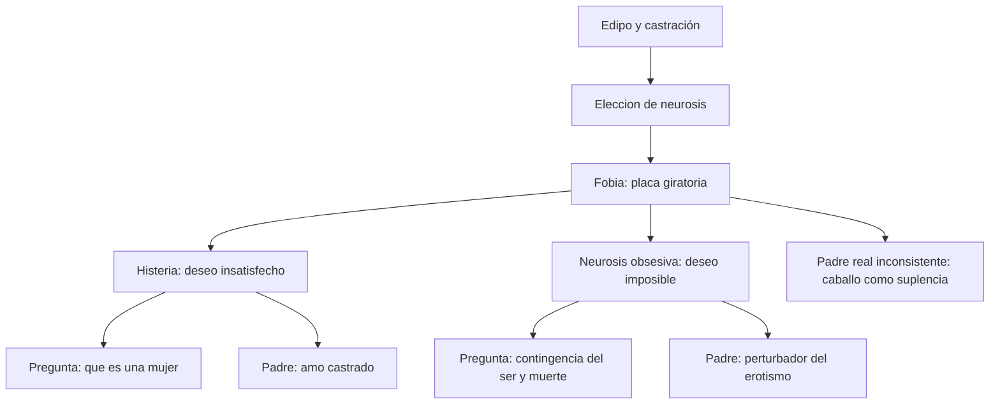
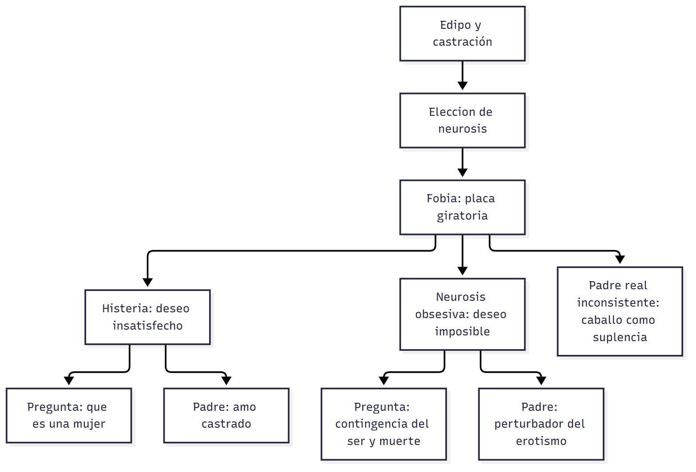

# C15 — Fobia, histeria y neurosis obsesiva

> **Fuentes** (normas APA 7):
>
> - Belucci, G. (s. f.-b). *De la fantasía al fantasma. Un recorrido* [Ficha de cátedra]. Universidad Favaloro. [Texto T05 del programa]
> - Belucci, G. (2014b). *Introducción al diagnóstico de estructura* [Ficha de cátedra]. Universidad Favaloro. [Texto T01 del programa]
> - Freud, S. (s. f.). *Textos sobre histeria* [Selección de la cátedra de Psicoanálisis]. Universidad Favaloro. [Texto T10 del programa]
> - Freud, S. (1996a). A propósito de un caso de neurosis obsesiva. En J. Strachey (Ed.), *Obras completas* (J. L. Etcheverry, Trad., Vol. 10). Amorrortu. (Obra original publicada en 1909) [Texto T11 del programa]
> - Freud, S. (1996b). Análisis de la fobia de un niño de cinco años (Epicrisis). En J. Strachey (Ed.), *Obras completas* (J. L. Etcheverry, Trad., Vol. 10). Amorrortu. (Obra original publicada en 1909) [Texto T07 del programa]
> - Freud, S. (1996). Inhibición, síntoma y angustia. En J. Strachey (Ed.), *Obras completas* (J. L. Etcheverry, Trad., Vol. 20). Amorrortu. (Obra original publicada en 1926) [Textos T08 (caps. I-VIII) y T28 (cap. XI) del programa]
> - Lacan, J. (2006). *El Seminario, libro 10: La angustia* (caps. II, VI, VIII, IX, XII y XXIV, selección). Paidós. (Seminario dictado en 1962-1963) [Texto T09 del programa]
>
> **Materia:** Psicoanálisis, 2.º año, Favaloro. **Apuntes de clase:** apuntes propios de la clase 15 (24/8/2026).

> **Idea-fuerza:** histeria, neurosis obsesiva y fobia son **tres modos de ser neurótico**: tres respuestas a la falta en el Otro. Se distinguen por **cinco coordenadas**: el **síntoma**, la relación entre **demanda y deseo**, la **pregunta** («¿Qué soy ahí?») y su variante, la **versión del padre** y la posición ante la **escena**. La histeria sostiene el deseo **insatisfecho** y pregunta «¿qué es una mujer?»; la obsesión mantiene el deseo **imposible** y a distancia y pregunta por la **muerte**; la fobia, donde el fantasma no se constituye, es una **placa giratoria** de la que depende la «elección de neurosis».

## Hilo conductor: cómo se conectan los temas de esta guía

La guía compara **tres modos de ser neurótico**: **histeria, neurosis obsesiva y fobia**. La idea que une las cinco preguntas es que cada modalidad es **una respuesta distinta a la falta en el Otro**, y que esa diferencia se ve en cinco «coordenadas» que se explican unas a otras.

Se empieza por lo más visible, el **síntoma** (pregunta 1): conversión con **solicitación somática** y sentido «prestado» en la histeria (síntoma primario: el **asco**); **pensar obsesivo, acciones obsesivas y ceremonial** en la obsesión (síntoma primario: la **escrupulosidad moral**); **parapetos psíquicos** frente a una angustia que no se liga en la fobia (síntoma primario: la **vergüenza**). Detrás de cada síntoma hay una **posición frente a la demanda y el deseo** (pregunta 2): la histérica sostiene el deseo **insatisfecho** y demanda **amor**; el obsesivo mantiene el deseo **imposible**, lo degrada a demanda y oscila entre destituir y restituir al Otro; el fóbico lo mantiene **prevenido**.

De esa posición sale la **pregunta** que organiza al sujeto (pregunta 3): «¿qué es una mujer?» en la histeria (con su **identificación viril**), la contingencia del ser y la **muerte** en la obsesión, y una pregunta **indeterminada** en la fobia, que funciona como **placa giratoria**: de ella depende la «elección de neurosis». La pregunta se apoya en una **versión del padre** (pregunta 4): el **Amo castrado** del «alma bella» en la histeria; el **padre potente y perturbador del erotismo**, el Amo que se salva, en la obsesión; la **inconsistencia del padre real** en la fobia, donde el caballo funciona como suplencia. Y la versión del padre se juega en la **escena** (pregunta 5): protagonista, pasiva en la escena infantil, en la histeria; al margen y mirando de afuera, activa y con culpa en la infancia, en la obsesión; **escena fallida o inexistente** en la fobia, porque el fantasma no se constituye.

La pregunta 6 es la síntesis: el cuadro integrador alinea las cinco coordenadas para cada modalidad. La fobia es la que muestra mejor el mecanismo: al faltar el fantasma como marco, no hay escena, el padre no se sostiene y la angustia no se liga en un síntoma.

> 🎯 **Para el parcial:** cuando pidan comparar, elegí **una coordenada de partida** (por ejemplo, demanda y deseo) y recorré las tres modalidades; después conectá con la siguiente coordenada (pregunta → padre → escena). Así la respuesta se lee como un argumento y no como una lista.

**En una sola oración:** histeria, obsesión y fobia son tres maneras de responder a la falta en el Otro, y cada una se reconoce por su síntoma, su posición ante el deseo, su pregunta, su versión del padre y su lugar en la escena.

## 0. Hoja de ruta

1. **El síntoma** en cada modalidad (Freud, s. f.; Freud, 1909/1996a; Freud, 1909/1996b; Belucci, 2014b).
2. **Demanda y deseo** (Belucci, 2014b, pp. 4-7).
3. **La pregunta** y sus variantes.
4. **Las versiones del padre.**
5. **La posición ante la escena** y la particularidad de la fobia.
6. **Cuadro integrador** y apuntes.

## 🎯 Lo que entra sí o sí

1. **Síntoma histérico:** conversión + solicitación somática + sentido «prestado»; múltiples significados; síntoma primario = **asco**. **Obsesivo:** «pensar obsesivo», acciones obsesivas (dos tiempos), ceremonial; síntoma primario = **escrupulosidad moral**. **Fobia:** «parapetos» psíquicos, la angustia no se liga; síntoma primario = **vergüenza**.
2. **Histeria:** deseo **insatisfecho**, demanda de **amor**; **obsesión:** deseo **imposible**/anulado (d), degrada el deseo a demanda, oscila destituir/restituir al Otro; **fobia:** deseo **prevenido**.
3. **Pregunta:** histeria = «¿qué es una mujer?» (**identificación viril**); obsesión = contingencia del ser/**muerte**; fobia = indeterminada; **placa giratoria**.
4. **Padre:** histeria = **amo castrado** («alma bella»); obsesión = padre potente, **perturbador del erotismo**, Amo que se salva; fobia = **inconsistencia del padre real**; el caballo como suplencia.
5. **Escena:** histeria = protagonista, pasiva en la infantil; obsesión = al margen, mirando de afuera, activa en la infantil con culpa; fobia = no hay escena o es fallida.

---

## 1. Primera pregunta — Particularidades del síntoma en cada modalidad de la neurosis

> *¿Qué particularidades tiene el síntoma en cada una de las modalidades de la neurosis?*

### 1.1 Respuesta modelo

> **Esqueleto de la respuesta:**
> 1. **Tesis:** el síntoma neurótico es siempre práctica sexual y retorno de lo reprimido, pero cambia según la modalidad (Belucci, 2014b, p. 3).
> 2. **Histeria:** conversión; solicitación somática + sentido prestado; varios sentidos; síntoma primario: asco (Freud, s. f., p. 2).
> 3. **Neurosis obsesiva:** sin anclaje corporal, el quantum queda libre: síntoma del pensamiento o de la acción; duda, compulsión, rituales; primario: escrupulosidad moral (Freud, 1909/1996a).
> 4. **Fobia:** histeria de angustia: la libido se libera como angustia y se construyen parapetos (Freud, 1909/1996b, p. 1).
> 5. **Articulación:** la eficacia del síntoma como respuesta decrece: histeria > obsesión > fobia.
> 6. **Cierre:** en la fobia el síntoma no releva la angustia; de ahí la importancia de la inhibición.

El síntoma neurótico es siempre **«práctica sexual de los neuróticos» y retorno de lo reprimido**, anclado en lo psíquico por la fantasía y la identificación y, finalmente, **respuesta a la angustia** (Belucci, 2014b, p. 3). Pero cambia según la modalidad. En la **histeria** el síntoma se forma por **conversión** (la excitación psíquica se traspone a lo corporal) y exige, además de un sentido psíquico, una **solicitación somática**: «todo síntoma histérico requiere de la contribución de las dos partes» (Freud, s. f., p. 2); el sentido «no lo trae consigo, sino que le es prestado, soldado», de modo que un mismo síntoma tiene **varios significados simultáneos y sucesivos** y tiende a conservarse; el anclaje corporal de la conversión lo vuelve **mucho más eficaz como respuesta** (Belucci, 2014b, p. 3). Su síntoma primario es **el asco**: «histérica» es toda persona en quien una excitación sexual provoca predominantemente displacer (Freud, s. f., p. 2; Belucci, 2014b, p. 4). En la **neurosis obsesiva**, sin anclaje corporal, **el quantum queda libre y hace síntoma del pensamiento o de la acción**, y por eso debe renovarse la lucha defensiva (Belucci, 2014b, p. 3); Freud prefiere hablar de «**pensar obsesivo**» antes que de «representaciones obsesivas» y lo define como deseos, tentaciones, impulsos, reflexiones, dudas, mandamientos y prohibiciones despojados de su afecto (Freud, 1909/1996a, apartado A); se presenta como **acciones obsesivas** (rituales, ceremonias, síntomas de dos tiempos, anulación), con **duda y compulsión**; su síntoma primario es una **relación exacerbada a la moral**, «escrupulosidad de la conciencia moral» (Belucci, 2014b, p. 4). En la **fobia**, Freud la ubica como **«histeria de angustia»**: el mecanismo es el de la histeria salvo en un punto decisivo: la libido desprendida por la represión **no se convierte** en inervación corporal sino que **se libera como angustia** (Freud, 1909/1996b, p. 1); el trabajo psíquico para volver a ligar esa angustia no puede revertirla a libido, y construye «**parapetos** psíquicos de la índole de una precaución, una inhibición, una prohibición» —las **fobias**— que son «la esencia de la enfermedad»; el síntoma es más **precario**, **no logra relevar el desarrollo de angustia** y de ahí la importancia de la **inhibición** (Belucci, 2014b, p. 3); su síntoma primario es la **vergüenza**.

> ⚠ **No confundir:** en la fobia no hay conversión: la libido se **libera como angustia**. Y en la obsesión el afecto no se pierde: se **desplaza** (enlace falso).

### 1.2 Desarrollo ampliado

#### a) Histeria (Freud, s. f.; Belucci, 2014b)

- **Parálisis histérica (Freud, s. f., p. 1; 1893):** la lesión es una **alteración de la concepción/representación** (idea de brazo), no anatómica; con Janet, la parálisis histérica es ignorante de la anatomía nerviosa: «la concepción popular de los órganos». La parálisis consiste en que la concepción del brazo **no puede entrar en asociación** con las otras ideas que constituyen al yo: **abolición de la accesibilidad asociativa**; si está envuelta en una asociación de gran **valor afectivo**, será inaccesible; paralizado «en proporción a la persistencia de este valor afectivo».
- **Conversión (Freud, s. f., pp. 1-2; 1894):** la histeria vuelve inocua la representación inconciliable trasponiendo a lo corporal la suma de excitación; total o parcial, en la inervación motriz o sensorial con nexo más íntimo o laxo con la vivencia traumática; queda un **símbolo mnémico** que habita la conciencia «al modo de un parásito», y la huella forma el núcleo de un **grupo psíquico segundo**. **El factor característico no es la escisión de conciencia sino la aptitud para la conversión**: capacidad psicofísica de trasladar a la inervación corporal grandes sumas de excitación; en sí misma no excluye la salud: lleva a la histeria solo ante una inconciliabilidad o un almacenamiento de excitación. → `C13 §1`.
- **Estructura del síntoma (Freud, s. f., pp. 2-3; *Dora*):** requiere **dos contribuciones**: la **solicitación somática** (un proceso normal o patológico en un órgano o relativo a él) y el **significado psíquico** («no se produce más que una sola vez si no posee un sentido»); el sentido es «**prestado, soldado**» y diverso según los pensamientos sofocados. **Tus apuntes (clase 15):** «Concepto de conversión: psíquico → cuerpo. **Solicitación somática**: reverso de la conversión, cuerpo → psíquico (el cuerpo se hace “soporte” de algo que es psíquico).»
- **Huésped mal recibido** (Freud, s. f., pp. 2-3): al comienzo no cumple cometido útil; secundariamente una corriente psíquica se sirve de él y alcanza **función secundaria**, queda «anclado». **Múltiples significados simultáneos y sucesivos**, no necesariamente compatibles; el síntoma «se preserva por más que el pensamiento inconsciente haya perdido significado»: rasgo conservador; difícil producción de la conversión y rareza de la solicitación → el esfuerzo desde el inconsciente se contenta con la vía de descarga ya transitable.
- **Sexualidad perversa y síntoma (Freud, s. f., pp. 4-5):** «Todos los psiconeuróticos son personas con inclinaciones perversas muy marcadas, pero reprimidas... **Las psiconeurosis son el negativo de las perversiones**»; las fuerzas impulsoras del síntoma histérico provienen también de mociones perversas inconscientes (metáfora de las corrientes de agua que vuelven a un cauce antiguo). Los síntomas histéricos casi nunca se presentan mientras los niños se masturban, sino **en la abstinencia**: expresan un **sustituto de la satisfacción masturbatoria**. *Tres ensayos*: **tres fases de la masturbación infantil** (lactancia, hacia el cuarto año, pubertad); las huellas de la segunda determinan el carácter si permanece sano y la sintomatología si enferma; la seducción; el aparato urinario como «portavoz» del sexual. *Fantasías histéricas (1907)*: la fantasía inconsciente es idéntica a la que sirvió a la satisfacción masturbatoria; abandonada la masturbación, deviene inconsciente y, ante la abstinencia sin sublimación, «se refresca, prolifera y se abre paso como síntoma».
- **Síntoma primario (Belucci, 2014b, p. 4; Freud, s. f., p. 2):** el **asco**; en Freud (1926/1996, cap. I) «reacción *a posteriori* frente al acto sexual vivenciado pasivamente». Ver `Transversal_ConceptoDeDefensa_Guia.md`.
- **Dora (Freud, s. f., pp. 2-4; Belucci, 2014b, pp. 5, 7):** «petite hystérie» con disnea, tos nerviosa, afonía, quizá migrañas, desazón, insociabilidad, *taedium vitae* (Freud, s. f., p. 2). La tos de Dora: Freud lee entre sus sentidos **denunciar al mundo que el padre había enfermado por su vida disipada** (Belucci, 2014b, p. 7). **Homosexualidad inconsciente:** tras los «pensamientos hipervalentes» sobre la relación del padre con la Sra. K se escondía **una moción de celos con objeto en esa mujer**: inclinación hacia el mismo sexo (la amistad apasionada con una compañera es precursora del primer enamoramiento intenso, Freud, s. f., p. 3); Dora compartía dormitorio con la Sra. K, alababa su «cuerpo deliciosamente blanco»; no escuchó una palabra dura contra ella; la Sra. K la **traicionó** (el Sr. K dijo que una muchacha que lee semejantes libros no merece respeto, y fue ella quien le había hablado de esas cosas: de ahí la **amnesia obstinada** sobre las fuentes de su saber). Reconstrucción: «Dora se decía sin cesar que su padre la había sacrificado a esa mujer... y de ese modo se ocultaba lo contrario: que no dejaría al papá poseer el amor de esa mujer». **Corrientes ginecófilas = típicas de las histéricas.** **Error técnico** reconocido por Freud: no haber colegido a tiempo que la **moción homosexual hacia la Sra. K era la más fuerte de las corrientes inconscientes**; el segundo sueño (venganza) lo habría traslucido (Freud, s. f., p. 4).

#### b) Neurosis obsesiva (Freud, 1909/1996a; Belucci, 2014b)

- **Definición de 1896 y su rectificación (Freud, 1909/1996a, apartado A):** representaciones obsesivas = «reproches mudados que retornan de la represión y están referidos a una acción sexual de la infancia realizada con placer»: hoy «formalmente objetable» por **excesivo empeño unificador**: el término lo toma de los propios enfermos, que mezclan formaciones psíquicas diversas. Mejor hablar de «**pensar obsesivo**»; los productos pueden tener el valor de **deseos, tentaciones, impulsos, reflexiones, dudas, mandamientos y prohibiciones**; los enfermos designan «representación obsesiva» el contenido **despojado de su índice de afecto** (el paciente de las primeras sesiones, que rebaja un deseo a «conexión de pensamiento»). La definición anterior se corrige poniendo el acento en «**mudados**»: lo consciente son **formaciones de compromiso** entre las representaciones reprimidas y las represoras.
- **Lucha defensiva primaria y secundaria; «delirios» (Freud, 1909/1996a, apartado A):** en la lucha secundaria contra las ideas obsesivas filtradas a la conciencia aparecen formaciones que merecen el nombre de «**delirios**» (mestizos entre lo racional y lo obsesivo: hacen suyas premisas de lo obsesivo y las combaten con la razón). **Ejemplo:** tras sus «locas acciones» de estudio hasta tarde, abrir la puerta al espectro del padre y mirar sus genitales en el espejo, la amonestación racional «¡Qué diría el padre si viviera!» no tuvo efecto; cesó cuando la formuló como amenaza delirante: «si volvía a perpetrar ese desatino, al padre le pasaría algo malo en el más allá».
- **Los enfermos no conocen el texto de sus obsesiones:** el análisis hace crecer «el coraje de su enfermedad». Los **sueños** pueden dar el texto genuino del mandamiento; varias representaciones obsesivas sucesivas son «en el fondo una y la misma» (retorno desfigurado); la forma originaria deja ver el sentido sin velo; la «representación obsesiva» lleva las huellas de la **defensa primaria**; su desfiguración la hace viable, pues el pensar consciente la malentiende, como el contenido del sueño.
- **Fórmulas protectoras (Freud, 1909/1996a, apartado A):** el *«aber»* («pero») dicho rápido con un gesto de rechazo, luego *«abér»* (asimilación a *Abwehr*, «defensa»): la cura usada «de manera abusiva y deliriosa» para reforzar la fórmula; la **palabra ensalmadora** compuesta con iniciales de plegarias + «amen», que era un **anagrama del nombre de su dama con una S** (*Samen*, semen): «había juntado su semen con la amada»: **«la defensa se había dejado burlar por lo reprimido»** («aquello sobre lo cual recae la defensa consigue abrirse paso en aquello mismo mediante lo cual la defensa actúa»).
- **Técnicas de desfiguración (Freud, 1909/1996a, apartado A):** **elipsis** (típica de la obsesión y del chiste): «Si me caso con la dama, a mi padre le sucede una desgracia (en el más allá)» = «Si mi padre viviera, mi designio de casarme lo enfurecería tanto como en la escena infantil y yo le desearía males que se cumplirían por la omnipotencia de mis deseos»; la sobrinita Ella: «Si te permites un coito, a Ella le sucederá una desgracia»; la dama de Nuremberg y el **peine** (celos inconscientes desplazados a la duda: «¿no lo poseía desde siempre?» = «si debo creer que solo estuviste en lo del anticuario, puedo creer que poseo desde hace años este peine»). Otra técnica: **intervalo interpolado** entre la situación patógena y la idea y **generalización** del contenido (la enferma que se prohíbe toda alhaja por una que envidió a su madre); **texto indeterminado o ambiguo**.
- **Acciones y rituales (apuntes, clase 15):** «Procrastinación. Anulación, borra un acto como si nunca hubiera tenido lugar. Acciones obsesivas. Rituales: lavarse las manos. Ceremonias: mayor complejidad y sin sentido, cábalas. Religión personal/privada.» «El obsesivo es “cartesiano”: se mueve al dominio del pensamiento... en aquel terreno donde pretende afirmarse, se presenta el síntoma.» → `Transversal_ConceptoDeDefensa_Guia.md §3`.
- **Procesos del pensar (Freud, 1909/1996a, apartado C):** la **regresión del actuar al pensar**: el pensar sustituye a la acción; según el grado, el cuadro será **pensar obsesivo** o **actuar obsesivo**; las acciones obsesivas se asemejan, mientras más dure el padecer, a las **acciones sexuales infantiles** (onanismo): se llega a actos de amor «con el auxilio de una nueva regresión»: a acciones autoeróticas. La **pulsión de saber y de ver**, tempranamente emergente y reprimida, sexualiza el **acto de pensar** → **cavilar** como síntoma principal; la satisfacción de alcanzar un resultado cognitivo es sentida como sexual. «Compulsivos se vuelven aquellos procesos del pensar que (...) se emprenden con un gasto de energía que de ordinario sólo se destina al actuar»: pensamientos que regresivamente subrogan acciones. (Nota: las «muy grandes dotes intelectuales» de los obsesivos probablemente se vinculen a esto.)
- **Compulsión y duda (Freud, 1909/1996a, apartado C):** la **duda** es la percepción interna de la irresolución por la inhibición del amor por el odio; «es, en verdad, una duda en cuanto al amor, que debería ser lo más cierto subjetivamente; esa duda se ha difundido a todo lo demás y se ha desplazado con preferencia a lo ínfimo». Cita de *Hamlet*: «Duda de que los astros fuego sean... mas de que yo te amo, no lo dudes jamás». La **compulsión** es «un ensayo de compensar la duda y de rectificar el estado de inhibición»; se exterioriza en **mandamientos y prohibiciones**; si no se cumple, se percibe como **suprema angustia**. Las plegarias: el «**No**» hostil que irrumpe en «Dios la proteja» (maldición). Se intenta acortar la plegaria, pronunciarla más rápido, **aislar** las acciones protectoras: ninguna técnica da fruto.
- **Características psíquicas (Freud, 1909/1996a, apartado B):** **superstición** (sin ser vulgar: creía en signos premonitorios, sueños proféticos; oscilaba entre dos convicciones: «era supersticioso y al mismo tiempo no lo era»; Freud le demostró que él participaba en fabricar los «milagros»: lectura indirecta, olvido, espejismos de la memoria; raíz infantil: la madre que decía «no puedo, tendré que guardar cama»); **producción de la incertidumbre** (aversión a los relojes; evitó noticias que facilitaran su decisión: no sabía quién había operado a su amada ni si le habían extirpado un ovario o ambos); temas predilectos de duda: **la filiación paterna, la duración de la vida, la vida después de la muerte y la memoria**; la **omnipotencia de los pensamientos** (el «viejo profesor» que ocupó la habitación y fue víctima de una apoplejía tras su «¡que le dé un ataque!»; la señorita mayor que se arrojó por la ventana tras su respuesta esquiva); **relación con la muerte** («pájaro de mal agüero»; la muerte de la hermana mayor cuando él tenía 3-4 años; el «más allá» = «si mi padre viviera todavía», reacción al deseo de muerte hacia el padre quince años antes); la **muerte como solución de los conflictos** («el Tribunal Supremo del Reich cuyos procesos acababan con la muerte de las partes»).
- **Vida pulsional (Freud, 1909/1996a, apartado C):** enfermó a los veintitantos por la tentación de casarse con una muchacha distinta de la amada: **conflicto entre el influjo del padre y el amor a la dama**; **ambivalencia amor-odio** hacia la amada y hacia el padre; coexistencia crónica solo posible con **represión del odio** («el amor consciente suele hincharse por reacción»). Freud descarta atribuir la «elección de neurosis» a la vida pulsional: «en todas las neurosis uno descubre las mismas pulsiones sofocadas»; **componente sádico** constitucional intenso; la parálisis de la voluntad se generaliza por **desplazamiento**; «lo característico de esta neurosis, lo que la distingue de la histeria, **no ha de buscarse en la vida pulsional sino en las constelaciones psicológicas**». Predilección por el **olfato** (placer de oler sepultado). **Tres personalidades:** una inconsciente (mociones tempranamente sofocadas, «apasionadas y malas») y dos preconscientes (la «normal» —buena, jovial, prudente— y la supersticiosa y ascética, que contiene las **formaciones reactivas**); y la dama fragmentada en una «tolerante, alegre» (su yo oficial) y otra «taciturna y ascética» que la gobierna. **Nota de 1923:** el paciente murió en la Gran Guerra.

#### c) Fobia (Freud, 1909/1996b; Belucci, 2014b)

- **Freud (1909/1996b, p. 1):** la posición de las fobias «sigue indeterminada»: «meros síndromes que pueden pertenecer a diversas neurosis»; para la fobia del pequeño Hans, «el tipo más común», **«histeria de angustia»**: pleno acuerdo con el mecanismo de la histeria salvo en un punto decisivo: la libido desprendida «**no es convertida** (...) sino que **se libera como angustia**». Las histerias de angustia son **las más frecuentes entre las psiconeurosis y las que aparecen más temprano: «las neurosis de la época infantil»**; menos títulos reclaman a una constitución particular. **Se desarrollan como una «fobia»** y el enfermo puede quedar liberado de angustia **a costa de inhibiciones y limitaciones**; hay un **trabajo psíquico incesante para volver a ligar la angustia**, pero no consigue revertirla a libido ni anudarla a los complejos de los que proviene: la salida es **bloquear cada ocasión posible** con «**parapetos** psíquicos de la índole de una precaución, una inhibición, una prohibición»; «son estas construcciones protectoras las que se nos aparecen como fobias y constituyen para nuestra percepción **la esencia de la enfermedad**».
- **Belucci (2014b, p. 3-4):** el síntoma fóbico (ligado al miedo y al objeto fobígeno) es **más problemático**, pues no logra tomar el relevo del desarrollo de angustia; de ahí la **respuesta inhibitoria**. Una **respuesta fóbica puede aparecer en cualquier neurosis**. Síntoma primario: la **vergüenza**. Defensa: regresión al **erotismo oral**, **proyección** (el miedo al objeto traduce el peligro de la pulsión; finalmente, castración).
- **Apuntes (clase 15):** «Manera de resolver la angustia, más precaria. Poca distancia entre síntomas y angustia. La angustia no desaparece, se acota. **Mayor importancia en la inhibición**, la más clásica son los movimientos (en el espacio o en medios de transporte). Se mantiene la oralidad: angustia fóbica = ser absorbido por el otro, la boca de cocodrilo que te engulle. **Agorafobia**. Síntoma primario: antes de la angustia aparece la **vergüenza**, la timidez.» «Neurosis de niños son fobias.» «**No hay neurosis sin síntoma.**»

> 🔑 **Punto clave:** conversión + solicitación somática (histeria) · pensar y actuar obsesivos, duda y compulsión (obsesión) · parapetos y angustia que no se liga (fobia). Y los tres **síntomas primarios**: asco, escrupulosidad moral, vergüenza.

---

## 2. Segunda pregunta — Posiciones respecto de la demanda y el deseo

> *¿Cómo se organizan las distintas posiciones con respecto a la demanda y el deseo en la histeria, neurosis obsesiva y fobia?*

### 2.1 Respuesta modelo

> **Esqueleto de la respuesta:**
> 1. **Tesis:** cada neurosis tiene una relación particular con la demanda y el deseo (Belucci, 2014b, p. 4).
> 2. **Demanda y deseo:** el significante no lo cubre todo; el falo es el significante del deseo, un más allá de la demanda.
> 3. **Histeria:** deseo insatisfecho, sostenido como deseo del Otro; demanda de amor; sacrificio.
> 4. **Neurosis obsesiva:** deseo imposible y anulado; degrada el deseo a demanda; demanda de muerte del Otro (ambivalencia).
> 5. **Fobia:** deseo prevenido: el deseo del Otro es un lugar temible.
> 6. **Cierre:** las tres son respuestas a la misma falta en el Otro.

Desde la lectura lacaniana, cada neurosis supone una **relación particular con el deseo y la demanda** (Belucci, 2014b, p. 4). **La demanda** es una novedad de Lacan: se constituye «por el simple hecho de que existe el Otro, que es el lugar del significante»; como el significante no lo recubre todo y, en la neurosis, eso está **legalizado por el Padre**, se abre el espacio del **deseo**: «un más allá de la demanda, aunque no es sin la demanda». El **falo**, como significante de la falta, inscribe ese más allá: es «**significante del deseo**». Hay entonces **dos dimensiones del Otro**: sede de la **demanda** y lugar del **deseo**. En la **histeria**, el sujeto se mueve en el **plano del deseo**, que se sostiene **como deseo del Otro**; mantiene el deseo **insatisfecho** («el deseo no coincide con la satisfacción»); su demanda se sitúa en el registro de la **demanda de amor** (cualquier cosa vale como signo del amor del otro) y suele atender la demanda del Otro a costa de su insatisfacción (vertiente **sacrificial**). En la **neurosis obsesiva** el deseo toma la forma de un **deseo anulado** (d, escrito *d* con el 0 de la anulación del falo) y **imposible**, que se mantiene **a distancia y bajo control**; **degrada el deseo a demanda** (la demanda se articula a la condición absoluta del deseo; el deseo se presenta como demanda de consentimiento; se ubica como esclavo ante el Amo; da todo lo que supone que el otro desea) y su demanda asume la forma de **demanda de muerte** del Otro, de donde la oscilación entre **destituir y restituir** al Otro (ambivalencia). En la **fobia**, el deseo es un **deseo prevenido**: el lugar del deseo del Otro se revela como un lugar **temible**, al que se acerca con precauciones (timidez); la mediación paterna falla y se complica deslindar deseo y demanda.

> ⚠ **No confundir:** insatisfecho (histeria) ≠ imposible (obsesión) ≠ prevenido (fobia).

### 2.2 Desarrollo ampliado (Belucci, 2014b, pp. 4-7)

- **Demanda y deseo en la neurosis en general** (Belucci, 2014b, p. 4): ante la pregunta «¿Qué soy ahí?», insoportable por la falta de garantía sobre el ser, la respuesta privilegiada es el **fantasma**; el neurótico «identifica la falta del Otro con su demanda, Φ con D» (Lacan, *Subversión del sujeto*, cit. en Belucci, 2014b, p. 7): la preeminencia que da a la demanda **oculta su angustia ante el deseo del Otro**.
- **Histeria (Belucci, 2014b, p. 5):** **mantiene siempre abierta la cuestión del deseo como un más allá de la demanda** (registro propiamente fálico); procura conservar el deseo insatisfecho (**«histeriqueo»**: «cuarenta tacitas de café y al final “te equivocaste, flaco”»; el sueño del puchero con porción pequeña: «se quedaba con hambre»). **Demanda de amor** acentuada: «cualquier cosa queda reducida en este plano a un signo del amor del otro, no importa que sea un viaje a Europa o un chocolate». **Sacrificial:** «la histérica suele atender la demanda del Otro a costa de su propia insatisfacción»; casi todas las pacientes de Freud habían cuidado al padre enfermo. **Tus apuntes:** «Demanda amor, signos de amor. El sujeto histérico siempre se las arregla para que el plano del deseo y la demanda no se junten... Donde haya histeria, hay insatisfacción: también busca ser deseado por el otro, lo que genera insatisfacción en ambas partes.» **Demanda transitiva/intransitiva:** transitiva = se pide algo a alguien («quiero»); intransitiva = lo que se espera del otro es un signo de amor (toda demanda es demanda de amor, acentuado en la histeria). «Hay demanda por el hecho de estar en el lenguaje»: el llanto del bebé, leído por el Otro, se vuelve demanda.
- **Obsesión (Belucci, 2014b, pp. 5-6):** el deseo toma la forma de un **deseo anulado** (matema *d*) porque Lacan lo vincula con **la anulación del significante fálico** (sostén de lo erótico, el Eros): no es que el falo no esté (es operador de la neurosis), sino que **el erotismo asume una forma degradada**. Los procedimientos defensivos obsesivos apuntan a **mantener el deseo a distancia y bajo control** (ejemplo: el paciente que hizo una **planilla de Excel** con pros y contras de dos mujeres; la película *Mi novia Polly*: obsesivo vs. histérica); deseo articulado a la **imposibilidad**, **inhibido**, no pasa al acto; **procrastinación**; insiste con la que no lo considera; **Hamlet** sitúa su deseo hacia Ofelia solo cuando ella muere. «El obsesivo, al igual que alguien que ha finalizado su análisis, se orienta por lo imposible, pero no para abrir un campo de posibilidades sino para sostenerse allí.» **Degradación del deseo a demanda (4 aspectos):** (1) la demanda incondicionada se articula a la condición absoluta del deseo («la idea fija del niño obsesivo»); (2) el deseo se presenta al otro como **demanda de consentimiento** («permiso-perdón»); (3) ubica al otro como **Amo** y se ubica como **esclavo**; (4) intenta evitar que algo le falte al Otro y da lo que supone que desea (novios serviciales y pesados). **Demanda de muerte:** silencia cualquier demanda al Otro por el riesgo de destruir el lugar del deseo; **oscila entre hostilidad (muda) y actitudes «cuidadosas»** = ambivalencia. **Tus apuntes:** miedo a no poder cumplir el deseo de la histérica que «pida la luna»; busca lo que le gusta al otro para neutralizar el deseo inesperado; «un obsesivo analizado sabe su posición ante lo imposible: “no es por ahí”».
- **Fobia (Belucci, 2014b, pp. 6-7):** no es sencillo deslindar una modalidad fóbica de la pregunta. Freud: relativa indeterminación de las fobias en el campo de las neurosis; Lacan (Seminario 16): la **placa giratoria** (metáfora tomada de Herbert Graf, el pequeño Hans, que de adulto inventó la profesión de director de escena de ópera y el escenario móvil): la fobia como plataforma que **distribuye hacia la histeria o la obsesión**; si alguien permanece ahí, «habría que preguntarse por qué». **Deseo prevenido** (fines de los '50): el lugar del deseo del Otro se revela como **temible**; los fóbicos suelen aparecer como «tímidos» o «vergonzosos» (el DSM-IV creó la «fobia social»). **Hans:** el deseo materno, centro de gravedad de Hans, **no encuentra en el padre una mediatización** que permita atravesar el segundo tiempo del Edipo; produce una **suplencia** elevando el caballo a objeto fobígeno. **Difícil deslindar deseo y demanda**: sin esa mediación, el fóbico se precipita a **obturar con su presencia** cualquier manifestación de la falta en el Otro (paciente de 60 años que interrumpía todo para viajar a su ciudad natal cada vez que suponía que a la madre podía pasarle algo). **Tus apuntes:** «Ahí donde se lee una carencia, se interpreta una demanda de carencia. Deseo prevenido. No es imposibilidad ni insatisfacción. En el fondo lo deseado y lo temido son lo mismo.»
- **Posiciones ante la castración (apuntes):** «Histeria y obsesión: dos posiciones que toma el sujeto ante la castración... Castración en el hombre se presenta como amenaza; la posición de los varones implica **evitar** encontrarnos con eso: “dar un paso atrás”, retrocedemos hasta el sádico-anal... Para la mujer, ya se presenta como algo acontecido.» «Tendencia: mujer = histeria; hombre = obsesión.» «La estructura determina la relación con lo libidinal.»

> 🔑 **Punto clave:** **histeria = deseo insatisfecho + demanda de amor**; **obsesión = deseo imposible/anulado, degradado a demanda**; **fobia = deseo prevenido, mediación paterna fallida**.

---

## 3. Tercera pregunta — Variantes de la pregunta en histeria y obsesión; la fobia

> *¿Qué variantes asume la pregunta en la histeria y en la neurosis obsesiva? ¿Qué sucede en el caso de las fobias?*

### 3.1 Respuesta modelo

> **Esqueleto de la respuesta:**
> 1. **Tesis:** la neurosis es una clínica de la pregunta: «¿qué soy ahí?» (Belucci, 2014b, p. 3).
> 2. **Pregunta implícita:** inconsciente, olvidada gracias a las respuestas (fantasma, ideales, yo).
> 3. **Histeria:** «¿qué es una mujer?» (vertiente de la sexualidad); otra mujer; identificación viril (Dora).
> 4. **Neurosis obsesiva:** la contingencia del ser, la muerte (Seminario 3).
> 5. **Fobia:** pregunta indeterminada; placa giratoria; salida por evitación.
> 6. **Cierre:** las dos vertientes del par freudiano muerte/sexualidad ordenan las dos neurosis clásicas.

La neurosis es una **clínica de la pregunta**: la falta en el Otro es necesaria y el sujeto solo puede preguntarse «**¿Qué soy ahí?**» o «**¿Qué me quiere?**» (Belucci, 2014b, p. 3). Es una pregunta **implícita e inconsciente** (del sujeto, no del yo) que el neurótico olvida gracias a sus respuestas (fantasma, ideales, yo). Para Lacan **no hay significante que diga qué somos** (el niño ante el nacimiento de un hermano se pregunta por el origen de los niños: estructural). En la **histeria** la pregunta toma la forma de una **pregunta por la femineidad**, «**¿Qué es una mujer?**»: de los dos términos freudianos «muerte y sexualidad», la histérica sigue la vertiente de la **sexualidad**; espera una respuesta a partir de **otra mujer** (supone que la otra puede satisfacer el deseo de un hombre y ella no), se **identifica al hombre** (Sr. K en Dora) para responder desde ahí: **identificación viril**. En la **neurosis obsesiva** la pregunta gira en torno a la **contingencia del ser**, o sea a la **muerte** (Lacan, Seminario 3), la otra vertiente del par freudiano; se relaciona con la regresión sádico-anal y con la anulación del significante fálico. En la **fobia** la pregunta permanece en **cierta indeterminación**: es la placa giratoria; Lacan no ubica una pregunta específica y lo característico es una **salida de evitación**.

> ⚠ **No confundir:** la histeria pregunta por la **sexualidad** (¿qué es una mujer?); la obsesión, por la **muerte** (¿estoy vivo o muerto?).

### 3.2 Desarrollo ampliado

- **Pregunta y respuesta (Belucci, 2014b, p. 3):** «Esa pregunta es implícita, no se formula como tal en forma consciente. Más bien el sujeto se da una serie de respuestas, como el fantasma, los ideales o el yo, que hacen que su existencia ordinaria se desenvuelva en el olvido de esa pregunta.» «El neurótico, en su estado ordinario, va por la vida sin hacerse muchas preguntas.» Cuando las respuestas se vuelven ineficaces aparece el malestar.
- **Histeria (Belucci, 2014b, p. 5):** «¿Qué es una mujer?»; «alrededor de esta pregunta pivotea el deseo». **Dora:** importancia de la **Sra. K**; se identifica al Sr. K. **Identificación viril**: «la histérica aborda su pregunta ubicándose inconscientemente en el lugar del hombre». El deseo se sostiene **como deseo del Otro**; la histérica toma su punto de apoyo en el deseo del Otro. **Tus apuntes (clase 15):** «Dimensión amor-sexualidad-erótico, condición sexuada del sujeto, condición femenina. Para la **mujer**, la pregunta da peso a “la otra”, que puede ser “la rival” (¿qué encanto tiene que yo no?) o convertirse en un objeto amoroso (una fascinación: saber qué es lo femenino en la otra). Para el **hombre**, encuentra un saber sobre las mujeres: búsqueda constante de saber sobre lo femenino, muchas “amigas”, histeriquearlas y aprender sobre ellas; no es necesaria la homosexualidad para el hombre histérico.»
- **Freud (s. f., Dora, pp. 3-4):** la corriente ginecófila del inconsciente de las histéricas.
- **Obsesión (Belucci, 2014b, p. 5; Freud, 1909/1996a):** «la pregunta gira en torno a la **contingencia del ser**, o sea a la muerte» (Seminario 3). Freud: «la referencia a la muerte era fundamental en los obsesivos». **Tus apuntes:** «Dimensión muerte. Queda en posición de “espera” a que algo externo termine y “ahora sí pueda”. La muerte, al convertir todo en algo ya imposible, halla ahí el deseo al ya ser imposible. Preguntas por la contingencia en el ser: (1) Ser o no ser (Shakespeare), (2) ¿por qué el ser y no la nada? (Heidegger), (3) ¿por qué yo que soy alguna vez no fui, y por qué yo que soy alguna vez no seré? (Peter Handke, la canción de la infancia).» **Freud (1909/1996a):** el paciente de Freud y la muerte del padre; la muerte como solución de conflictos; las dudas sobre la **duración de la vida** y la **vida después de la muerte**; el «Tribunal Supremo del Reich».
- **Fobia (Belucci, 2014b, p. 6):** «No es tan sencillo deslindar una modalidad fóbica de la pregunta. La pregunta del fóbico pareciera que permanece en cierta indeterminación.» Placa giratoria. Lacan no propone pregunta específica. **Apuntes:** «¿qué soy ahí? ¿qué lugar ocupo en el otro?, pero con una salida característica del fóbico, posicionamiento que busca evitar.» **Elección de neurosis:** «en cierto momento (Edipo-castración) se produce una “elección de neurosis” que permite que se constituya una de las dos variantes (pero puede fallar)... Habría adultos fóbicos que conservan la estructura elemental.» «Esta elección no se constituye en el Yo, por lo que no es elección sino una elección del sujeto (inconsciente).» **Freud (1909/1996b):** las histerias de angustia son «las neurosis de la época infantil» (Freud, 1909/1996b, p. 1).

> 🔑 **Punto clave:** **histeria**: «¿qué es una mujer?» (sexualidad, otra mujer, identificación viril); **obsesión**: contingencia del ser/muerte; **fobia**: pregunta indeterminada, placa giratoria, evitación.

---

## 4. Cuarta pregunta — Versiones del padre

> *Refiérase a las versiones del padre particulares de la histeria y neurosis obsesiva y a su relación con la posición del sujeto. ¿Qué sucede con el padre en la fobia?*

### 4.1 Respuesta modelo

> **Esqueleto de la respuesta:**
> 1. **Tesis:** cada neurosis sostiene una versión del padre, sobre todo en el fantasma (Belucci, 2014b, p. 7; Belucci, s. f.-b, p. 6).
> 2. **Histeria → amo castrado:** padre potente a quien se le ubica la impotencia; mantiene la insatisfacción.
> 3. **Posición histérica:** lo ama, se sacrifica, denuncia sus faltas (alma bella; la tos de Dora).
> 4. **Neurosis obsesiva → padre potente, perturbador del erotismo:** lo exime de sus faltas y lo salva aunque desee su muerte (el Hombre de las Ratas).
> 5. **Fobia:** inconsistencia del padre real (Hans); el objeto fobígeno suple al padre (Seminario 4).
> 6. **Cierre:** la versión del padre muestra cómo cada sujeto elude saber de la castración en el Otro.

Si el **Padre** es un **operador de la estructura**, la neurosis se estructura en torno de ese nudo, y cada variante involucra **una versión del padre**, sostenida sobre todo **a nivel del fantasma** (Belucci, 2014b, p. 7; Belucci, s. f.-b, p. 6). **En la histeria**, la versión es la del «**Amo castrado**» (Lacan, Seminario 17): la histérica instituye en su fantasma un padre **potente**, revestido de todos los atributos del Amo (el padre de Dora: gran empresario, brillante, hombre de mundo), para ubicar **indefectiblemente su punto de impotencia** (llegada la hora de la verdad, «un hombre sin recursos»). Le sirve para **mantener la insatisfacción** y para engañarse suponiendo que **habría uno que sí**: así elude, como todo neurótico, saber de la castración en el Otro. Su posición hacia quien ocupe ese lugar es **triple**: lo **ama** y lo sostiene, **se sacrifica** por él, y **denuncia sus faltas** incluso con sus síntomas (uno de los sentidos de la tos de Dora: denunciar que el padre enfermó por su vida disipada): la figura hegeliana del «**alma bella**»; por eso el primer movimiento del análisis suele ser implicarla en su denuncia. **En la neurosis obsesiva** hay, al contrario, un **padre potente, un Amo que se sostiene**: el «**perturbador del erotismo**» (Freud, Hombre de las Ratas): el otro —en última instancia el padre— que siempre obstaculiza su camino, el rival que se queda con la mujer, el jefe que no lo deja ascender; lo que esto encubre es **la complicación del obsesivo con el deseo y la falta**. A ese padre lo **exime paradójicamente de sus faltas** («siempre carga él con la falta»: el Hombre de las Ratas toma con sus síntomas las deudas del padre), y **salva al Amo** aunque inconscientemente busque destruirlo o espere su muerte. **En las fobias**, donde la constitución del fantasma es fallida, no hay una versión del padre en sentido estricto sino «una **inconsistencia del padre real**»: Hans tiene un padre cariñoso, que se ocupa de él, y sin embargo cada vez que se trata de **darle cuerpo a la función de la Ley, la elude**; ahí Hans se angustia y aparece el **objeto fobígeno**: el caballo es una **suplencia del padre** (Seminario 4) que da cuerpo a la Ley que opera en el discurso de la madre.

> ⚠ **No confundir:** en la histeria el padre es potente **para** mostrarlo castrado; en la obsesión el padre se **sostiene** como amo. En la fobia no hay versión del padre propiamente dicha.

### 4.2 Desarrollo ampliado

- **Padre como operador y como versión (Belucci, s. f.-b, p. 6):** primero, **operador de la estructura** (Nombre-del-Padre; no se confunde con la persona); segundo, **lo que cada uno se puede representar de un padre**, en el marco del fantasma. «Cuando en el Hombre de las Ratas aparece el padre como un perturbador del erotismo, ¿eso es el padre real? ¿O es una construcción de la neurosis? Cuando en Dora aparece el padre impotente, ¿tiene que ver con la persona de carne y hueso? En alguna medida puede ser, pero siempre hay algo más.» «Curar la neurosis en parte quiere decir revisar esa versión del padre.»
- **Histeria (Belucci, 2014b, p. 7; Belucci, s. f.-b, p. 7):** «el amo castrado»; el ejemplo de la histérica que le decía a su novio: «cuando me mudé vos no estabas ahí, pero el vecino sí me ayudó». **Triple posición** (ama/sacrifica/denuncia); **«alma bella»**. **Dora** y su padre: «un hombre sin recursos». **Apuntes:** «El padre se presenta como un amo castrado. Padre impotente, con varias interpretaciones. Pero hay otros aspectos, como el estar posicionado como alguien de poder, donde la histérica se las arregla para encontrar un punto de impotencia, por más mínimo que sea. Lo ubica en el lugar de dominio, pero lo barra... Estructuralmente busca y genera esta relación.»
- **Obsesión (Belucci, 2014b, p. 8; Freud, 1909/1996a):** «perturbador del erotismo»; el obsesivo supone que hay un otro que obstaculiza su camino en lo que concierne al deseo; **lo que esto encubre** (el fantasma vela) es su propia complicación con el deseo y la falta; **exime al padre de sus faltas**, lo que le da consistencia; posición **contemporizadora**: exime al otro de su responsabilidad; «salva al Amo, aunque inconscientemente busque destruirlo o espere su muerte: el jefe se va a jubilar algún día... En eso se le va la vida.» **Un ejemplo:** la paciente que convocaba a la empleada doméstica, que salvaba la potencia del marido y se mostraba ella misma enferma (Belucci, 2014b, p. 8 n. 9). **Freud (1909/1996a):** ambivalencia con el padre (odio infantil reprimido), deseo de muerte y «más allá», conflicto entre padre y amada. **Apuntes:** dos vertientes: «el padre como “el gran hijo de puta” (odiado) y el padre como un capo, tan capo que “nunca va a poder estar a su altura” (idealizado).»
- **Fobia (Belucci, 2014b, p. 8; Belucci, s. f.-b, p. 6-7):** «En las fobias, en las que la constitución del fantasma es fallida, no encontramos una versión del padre en sentido estricto, sino... una **inconsistencia del padre real**»; **Hans:** su padre «es un personaje cariñoso, se ocupa de él»; el **caballo** como **suplencia del padre** (Lacan, Seminario 4, cap. XXI): «le da cuerpo a la Ley, que opera en el discurso de la madre, pero es preciso que alguien tercero la represente». **Apuntes:** «no hay una versión específica del padre... el padre “terceriza” su autoridad; el sujeto ubica en otra representación al padre, ya que la figura paterna no logra consistir en su padre.» → conecta con `C14 §5` (angustia de castración en Hans y desplazamiento).
- **Relación con el analista (apuntes):** «Esta relación se va a dar inevitablemente con el analista.»

> 🔑 **Punto clave:** histeria = **amo castrado** (alma bella); obsesión = **padre potente perturbador del erotismo** a quien exime y salva; fobia = **inconsistencia del padre real**, caballo como suplencia.

---

## 5. Quinta pregunta — Posición ante la escena; la particularidad de la fobia

> *¿Qué posiciones se pueden ubicar en la histeria y en la neurosis obsesiva en relación a la escena? ¿Qué particularidad plantea la fobia?*

### 5.1 Respuesta modelo

> **Esqueleto de la respuesta:**
> 1. **Tesis:** si el fantasma está constituido, los neuróticos somos «habitantes de escenas» (Belucci, 2014b, p. 8).
> 2. **Escena infantil:** histeria pasiva y victimizada; obsesión con exceso de actividad, placer y culpa.
> 3. **Escena adulta, histeria:** protagoniza el drama de su vida.
> 4. **Escena adulta, obsesión:** mira de afuera; procrastina; el pensamiento hace síntoma (ejemplos del alambrado y del baile).
> 5. **Fobia:** no hay escena o es fallida; organiza el espacio sin escena que la sostenga (Belucci, 2014b, p. 9).
> 6. **Cierre:** la escena depende de la eficacia del fantasma.

Los neuróticos, **si el fantasma se ha constituido con eficacia, somos «habitantes de escenas»** (Belucci, 2014b, p. 8). **Con respecto a la escena infantil**, Freud encuentra tempranamente que en la **histeria** la posición es siempre **pasiva**, por lo general victimizada («es el otro el que le hace»), mientras que en la **neurosis obsesiva** hay un **exceso de actividad, teñido de placer y recordado luego con culpa** (por ejemplo una escena de agresión sexual). **En la escena adulta** la histérica se **sumerge en el drama de su vida**, lo protagoniza, «nos cuenta la novela de lo que hizo, no hizo, le hicieron»; el obsesivo, por el contrario, **suele quedarse al margen de la escena, mirándola de afuera**: ejemplos clínicos (el adolescente que miraba detrás de un alambrado cómo los otros chicos jugaban a la pelota mientras el padre lo hacía trabajar como un esclavo; el que, tras dar mil vueltas para abordar a una mujer en un baile, vio desde el piso superior que ya estaba con otro; el tango de Discépolo «De chiquilín te miraba de afuera / como esas cosas que nunca se alcanzan»). Esa posición es **solidaria de la procrastinación**, de no actuar; el **pensamiento** se sobrecarga y hace síntoma. **En las fobias**, estrictamente hablando, **no hay escena, o la escena es fallida**: la fobia es «un modo de organizar el espacio, y en última instancia la relación al Otro, **cuando no hay escena que nos sostenga**, o cuando la que nos sostenía ha quedado en suspenso» (Belucci, 2014b, p. 9).

> ⚠ **No confundir:** pasividad histérica ≠ estar fuera de la escena: la histérica la **protagoniza**; el obsesivo la **mira de afuera**.

### 5.2 Desarrollo ampliado

- **Fantasma como escena (Belucci, s. f.-b, pp. 2-3; Lacan, 1962-1963/2006):** el fantasma es una escena (dimensión imaginaria) y marco. **Pegan a un niño:** en el segundo tiempo masoquista el sujeto está en posición pasiva («yo soy pegado por el padre»); en el tercer tiempo, espectador de varios niños. → `C14 §1`.
- **Fantasma en cada neurosis (apuntes de clase 15):** **histérico:** «el fantasma cae en posición pasiva... no quiere decir que el sujeto tenga una actitud pasiva... El Otro como causa de la desdicha.» **Obsesivo:** «posición cercana a lo activo, capaz de “grandes cosas”; siempre implica una hostilidad en el Otro, aunque sea un fantasma, no real. La posición del obsesivo es la del esclavo frente al fantasma.» **Fobia:** «No hay fantasma. Relación con la angustia compleja, pero no constante, no todo el tiempo están angustiados. Suelen tener objetos “fobígenos”.» «**Belucci sobre su investigación de la fobia: se arman una escena del mundo, más precaria que el fantasma, en las vertientes de amar y trabajar.**»
- **Escena infantil y escena adulta (Belucci, 2014b, p. 8):** histeria: pasiva e infantil «victimizada»; en la escena adulta, **protagonista**. Obsesión: activa e infantil, con placer y culpa; adulta: **espectador**. Ejemplos clínicos y Discépolo. Es la solidaridad con la **procrastinación**: «es entonces el pensamiento lo que se sobrecarga y hace síntoma».
- **Fobia (Belucci, 2014b, p. 9):** «la fobia es justamente un modo de organizar el espacio». **Placa giratoria**; fantasma fallido (Belucci, 2014b, p. 7); Hans: «el caballo establece ciertos límites y mediaciones que el padre no puede sostener» (Belucci, 2014b, p. 6).
- **Hamlet y Ofelia:** como ilustración del obsesivo (Belucci, 2014b, p. 6) → deseo solo cuando la realización es imposible.

> 🔑 **Punto clave:** **histeria: pasiva en la infancia, protagonista hoy**; **obsesión: activa en la infancia (con culpa), al margen hoy**; **fobia: sin escena o escena fallida**; organiza el espacio.

---

## 6. Cuadro integrador

| | **Histeria** | **Neurosis obsesiva** | **Fobia** |
|---|---|---|---|
| Síntoma | Conversión; solicitación somática; sentido prestado | Pensar y actuar obsesivos; ceremonial; duda y compulsión | Parapetos; angustia que no se liga; inhibición |
| Síntoma primario | **Asco** | **Escrupulosidad moral** | **Vergüenza** |
| Deseo | **Insatisfecho** (sostenido como deseo del Otro) | **Imposible/anulado**, a distancia; degradado a demanda | **Prevenido** |
| Demanda | De **amor**; sacrificial | De **muerte** del Otro; demanda de consentimiento | Difícil deslindar de deseo |
| Pregunta | «¿Qué es una mujer?»; identificación viril | Contingencia del ser; muerte | Indeterminada; placa giratoria |
| Padre | **Amo castrado**; alma bella | **Perturbador del erotismo**; Amo que se salva | **Inconsistencia del padre real**; caballo = suplencia |
| Escena | Infancia pasiva; hoy protagonista | Infancia activa con culpa; hoy al margen | No hay escena (o fallida) |
| Fantasma | Posición pasiva; el Otro causa de la desdicha | Cerca de lo activo; esclavo; hostilidad | No hay (o escena precaria) |
| Defensa | Represión + conversión | Regresión sádico-anal, formación reactiva, aislamiento, anulación... | Regresión oral, proyección, evitación |
| Tendencia | Mujer | Hombre | Estructura elemental / niños |

## Diagrama

## 🚩 Errores típicos y trampas de examen

- **Confundir** los tres síntomas primarios (asco, escrupulosidad, vergüenza) o creer que **el síntoma primario hace diagnóstico por sí solo** (es un rasgo que ayuda; «esto solo no hace diagnóstico»).
- **Decir que la histeria «no desea»**: el deseo está **sostenido como insatisfecho**; el histérico se mueve en el plano del deseo.
- **Decir que el obsesivo «no tiene deseo»**: lo tiene **anulado/imposible**; el falo está presente como operador, el erotismo se degrada.
- **Atribuir la fobia a la histeria o la obsesión sin matiz**: es **«histeria de angustia»** (Freud, 1909/1996b) y a la vez **placa giratoria** (Lacan).
- **Confundir la versión del padre con la persona de carne y hueso**.
- **Decir que en la fobia hay una versión del padre**: hay **inconsistencia del padre real** y el objeto fobígeno como suplencia.
- **Equiparar «posición pasiva del fantasma» con actitud pasiva del sujeto** (apuntes).
- **Omitir el dato de que la elección de neurosis es una «elección del sujeto» (inconsciente)** y que puede fallar.

## Articulación con el resto de la materia

| Va hacia / viene de | Cómo se conecta |
|---|---|
| `C14_SintomaFantasmaYAngustia_Guia.md` | Fantasma, angustia, Hans, inhibición, síntoma |
| `Transversal_ConceptoDeDefensa_Guia.md` | Defensas por modalidad |
| `C13_EstructuraYTiemposDeLaNeurosis_Guia.md` | Síntoma primario, conversión, enlace falso |
| `C16_LaPerversionEnFreudYLacan_Guia.md` | Neurosis como negativo de la perversión |
| `C05_TeoriaSexualEnFreudComplejoNuclear_Guia.md` / `C07_PulsionEdipoYMetaforaPaternaEnLacan_Guia.md` | Edipo, castración, tiempos del Edipo (Hans) |

## Glosario

| Término | Definición breve |
|---|---|
| **Histeria de angustia** | Fobia: mecanismo de la histeria salvo que la libido se libera como angustia (Freud, 1909/1996b, p. 1) |
| **Parapetos** (*Vorbau*) | Precauciones, inhibiciones y prohibiciones que bloquean ocasiones de angustia = fobia (Freud, 1909/1996b, p. 1) |
| **Solicitación somática** | Aporte del cuerpo al síntoma histérico (Freud, s. f., p. 2) |
| **Conversión** | Trasposición de excitación psíquica a lo corporal (Freud, s. f., p. 1) |
| **Pensar obsesivo** | Término de Freud que reemplaza a «representaciones obsesivas» (Freud, 1909/1996a, A) |
| **Elipsis** | Desfiguración por omisión de un eslabón (Freud, 1909/1996a, A) |
| **Duda / compulsión** | Percepción de la irresolución por amor-odio / ensayo de compensarla (Freud, 1909/1996a, C) |
| **Demanda** | Se constituye porque existe el Otro; transitiva/intransitiva (Belucci, 2014b, p. 4) |
| **Deseo anulado (d)** | Forma del deseo obsesivo (Belucci, 2014b, p. 5) |
| **Deseo prevenido** | Deseo fóbico (Belucci, 2014b, p. 6) |
| **Identificación viril** | Operación de la histérica para responder «¿qué es una mujer?» (Belucci, 2014b, p. 5) |
| **Amo castrado** | Versión del padre en la histeria (Belucci, 2014b, p. 7) |
| **Alma bella** | Posición de la histérica que denuncia las faltas sin implicarse (Belucci, 2014b, p. 7) |
| **Perturbador del erotismo** | Versión paterna en la obsesión (Belucci, 2014b, p. 8) |
| **Placa giratoria** | Metáfora lacaniana de la fobia (Belucci, 2014b, p. 6) |
| **Objeto fobígeno** | Objeto de la fobia; suplencia del padre (Belucci, 2014b, p. 8) |
| **Elección de neurosis** | Elección del sujeto (inconsciente) entre histeria y obsesión (apuntes) |

## Autoevaluación (sin mirar la guía)

1. ¿Qué particularidades tiene el síntoma en cada modalidad? Nombrá los tres síntomas primarios.
2. Explicá «histeria de angustia» y qué son los parapetos psíquicos.
3. Describí la relación demanda-deseo de cada neurosis, con un ejemplo clínico de cada una.
4. ¿Qué significa que el obsesivo «degrada el deseo a demanda»? Dá los cuatro aspectos.
5. ¿Cuál es la pregunta de la histeria y cuál la de la obsesión? ¿Qué es la identificación viril?
6. Caracterizá las versiones del padre y relacionalas con la posición del sujeto.
7. ¿Qué sucede con el padre en Hans? ¿Qué es una suplencia?
8. Posición ante la escena infantil y adulta en histeria y obsesión; ¿qué pasa en la fobia?
9. ¿Qué es la placa giratoria y qué dice sobre la «elección de neurosis»?
