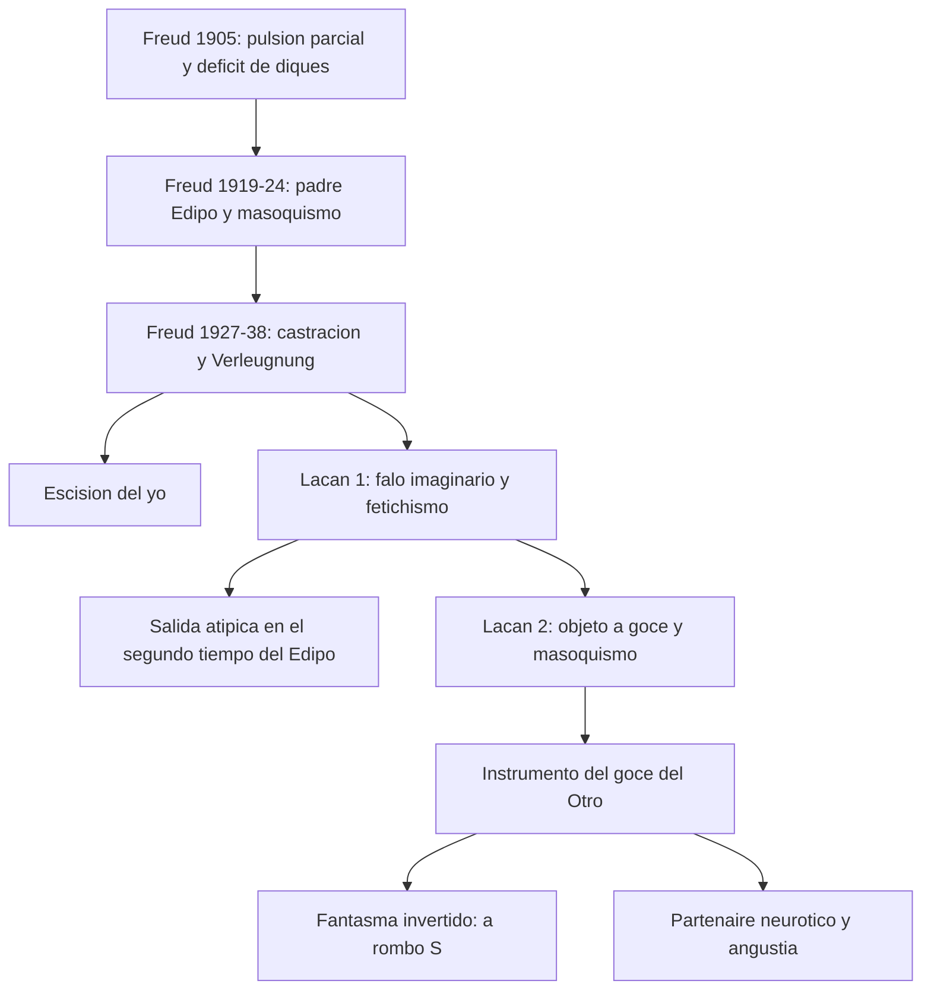
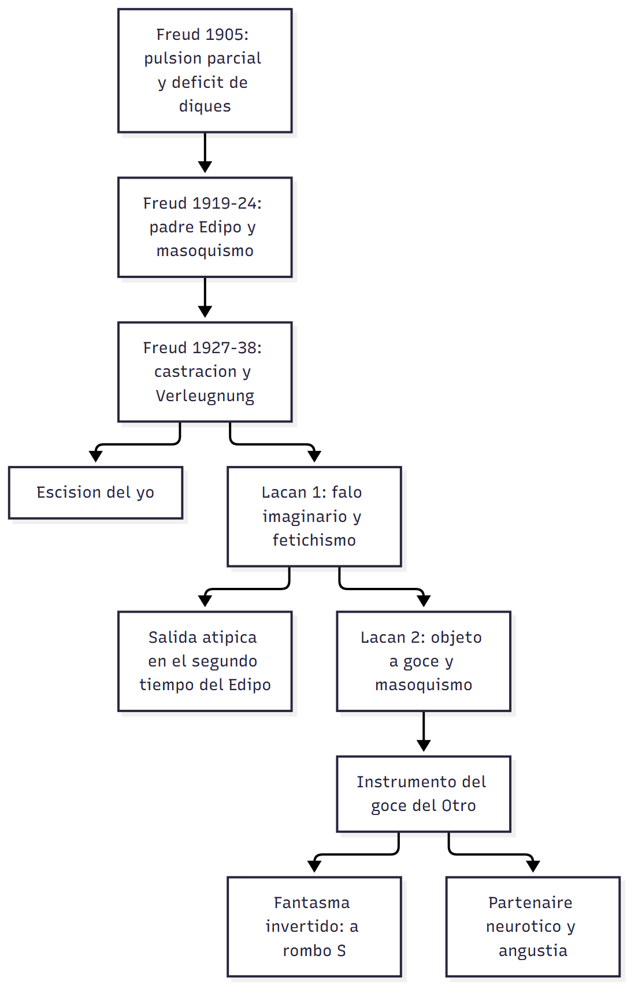

# C16 — La perversión en Freud y Lacan

> **Fuente:** Belucci, *Introducción al diagnóstico de estructura*, apartado «El problema de la perversión» (T01, pp. 9-15) · Freud, *Fetichismo* (T12, 1927) · Belucci, *Clínica de la estructura, clínica de lo singular* (T14, 2014; ver aviso abajo) · Belucci, *Sobre el concepto de defensa* (T03, pp. 7-8, renegación) · Freud, *Textos sobre histeria* (T10, p. 4: neurosis = negativo de la perversión) · tus apuntes de la clase 16 (31/8/2026) · **Materia:** Psicoanálisis, 2.º año, Favaloro.
>
> **Aviso sobre las fuentes:** tus apuntes asignan a esta clase T12 y T14. **T12 (Fetichismo) sí es central.** **T14 casi no trata la perversión** (es un seminario sobre estructura y singularidad: ciencia, Padre, deseo del analista, Joyce/Rousseau, nudos); de él solo se usa la idea de que **neurosis y perversión son respuestas «religiosas» a lo real, sostenidas en la garantía del padre** (T14, pp. 4-5). **La exposición completa de la perversión (los tres momentos freudianos y los dos lacanianos) está en T01, pp. 9-15**, que es lo que de verdad responde las tres preguntas.
>
> **Cómo se cita:** «p. N» es la marca `## Página N` del texto extraído (T01, T14, T03, T10). T12 no tiene páginas: se cita por tema. Lo marcado **▸ Complemento** no está en los textos asignados.

> **Idea-fuerza:** la perversión no es un «déficit moral»: es una **condición de estructura** definida por una operación, la **renegación/desmentida** (*Verleugnung*) de la castración (en Lacan, de la falta en el Otro). La neurosis es su **negativo** (misma materia pulsional, signo invertido): la neurosis **limita** la satisfacción por la represión; la perversión la **facilita** y pretende un goce sin la marca de la castración. Freud la piensa en **tres momentos** (pulsión parcial → Edipo y padre → castración y desmentida), Lacan en **dos** (falo imaginario y fetichismo; objeto *a*, goce y masoquismo): el perverso de Freud es «egoísta», el de Lacan «altruista»: **instrumento del goce del Otro**.

## Hilo conductor: cómo se conectan los temas de esta guía

La clase explica la perversión como **condición de estructura** y no como déficit moral, y lo hace en tres pasos que se encadenan.

**Primero** (pregunta 1), se define por contraste con la neurosis: la neurosis es el **negativo** de la perversión (Freud, *Tres ensayos*: la misma materia pulsional con el signo invertido). Lo que en la neurosis **limita** la satisfacción (la represión, la idealización) en la perversión la **facilita**. De esa inversión sale la pregunta de la clase: ¿qué operación hace que la perversión pretenda un goce sin la marca de la castración?

**Segundo** (pregunta 2), Freud lo responde en **tres momentos**: la **pulsión parcial** (los *Tres ensayos*: la perversión como fijación y desvío de la pulsión), el **padre y el Edipo** (*Pegan a un niño* y el masoquismo), y la **castración**, donde aparece la operación específica: la **renegación o desmentida** (*Verleugnung*), que registra la castración materna y a la vez pretende que no concierne al sujeto, con la consecuente **escisión del yo**. Ese último momento es el que le da nombre a la estructura.

**Tercero** (pregunta 3), Lacan relee esa operación en **dos momentos**: el primero, hacia fines de los '50, gira alrededor del **falo imaginario** y el **fetichismo**; el segundo (Seminario 16) alrededor del **objeto *a***, el **goce** y el **masoquismo**. Aquí el perverso deja de ser el «egoísta» de Freud y pasa a ser el «altruista»: **instrumento del goce del Otro**, que le restituye algo que sabe perdido. El hilo con la pregunta 1 se cierra con el **partenaire neurótico** y la **angustia**: la perversión y la neurosis se necesitan mutuamente porque son dos tratamientos opuestos de la misma falta.

**Para el parcial:** abrí con la **inversión** (neurosis como negativo), pasá por la **operación** (desmentida/escisión del yo) y terminá con el desplazamiento de Freud a Lacan (**de la pulsión y la castración al objeto *a* y al goce del Otro**). Si piden un solo momento, ubicalo igual dentro de ese recorrido.

**En una sola oración:** la perversión es el negativo de la neurosis, se define por la desmentida de la castración y, para Lacan, consiste en hacerse instrumento del goce del Otro.

## 0. Hoja de ruta

1. **Perversión y neurosis:** el negativo y la inversión.
2. **Freud, tres momentos:** pulsión (1905), Edipo y padre (1919-24), castración y desmentida (1927-38).
3. **Lacan, dos momentos:** falo imaginario y fetichismo (Sem. 4-6); objeto *a*, goce y masoquismo (Sem. 16, *Kant con Sade*).

## 🎯 Lo que entra sí o sí

1. **La neurosis es el negativo de la perversión** (metáfora fotográfica) y hay una **inversión**: lo que en la neurosis es menos, en la perversión es más; la **idealización** (que limita en la neurosis, facilita en la perversión); el **fantasma** invertido.
2. **Tres momentos freudianos y su articulador:** pulsión parcial (*Tres ensayos*) → padre y Edipo (*Pegan a un niño*; masoquismo) → **castración** y **desmentida** (*Fetichismo*).
3. **La operación específica:** la **renegación/desmentida** (*Verleugnung*): registrar la castración materna y a la vez pretender que no concierne al sujeto; **escisión del yo**.
4. **Lacan, primer momento** (fines de los '50, Sem. 4-6): **falo imaginario**, **fetichismo**, «teoría normalizadora», tres soluciones atípicas. **Segundo momento** (Sem. 16): **objeto *a***, **goce**, **masoquismo**.
5. **Invariante:** restituir al Otro algo que se sabe perdido; **perverso altruista** (Lacan) vs. **egoísta** (Freud); **partenaire neurótico**; angustia como signo.

---

## 1. Primera pregunta — Perversión y neurosis: la inversión

> *¿Cómo puede pensarse la relación entre perversión y neurosis? Enfatice en su respuesta la referencia a la inversión.*

### 1.1 Respuesta modelo

La relación parte de la formulación freudiana de los *Tres ensayos*: «**la neurosis es el negativo de la perversión**» (T01, p. 9). Es una **metáfora fotográfica**: en la neurosis aparece **velado**, como en el negativo, lo mismo que en la perversión se **exterioriza abiertamente**, se «revela»; los síntomas se sostienen en las **mismas fuerzas pulsionales** que las perversiones («todos los psiconeuróticos son personas con inclinaciones perversas muy marcadas, pero reprimidas y devenidas inconscientes», T10, p. 4). Belucci propone leerla también en sentido matemático: «**lo que del lado de la neurosis es un menos, del lado de la perversión es un más**» (T01, p. 9). La relación es entonces de **inversión**: los mismos elementos con funciones invertidas. Tres referencias muestran esa inversión. **(1) La idealización:** Freud nota, a propósito de perversiones como la necrofilia, que la idealización —que en la sexualidad normal funciona como **condición restrictiva** de la satisfacción— opera allí como **condición facilitadora**: no es que no haya ideal (como dirá cierta lectura posterior), sino que su posición está **invertida** (en lugar de limitar, facilita) (T01, p. 9). **(2) La satisfacción y la ley:** la neurosis **limita** la satisfacción por la represión, con una sexualidad de «marca negativa»; la perversión **facilita** la satisfacción, pretende acceder a ella **sin la marca negativa de la castración** (apuntes). **(3) El fantasma:** Lacan resuelve lo que Freud no resolvió (qué diferencia el fantasma neurótico del perverso): los **elementos son los mismos pero estructurados en orden inverso**: en la neurosis, **($◊a)** (el sujeto resuelve su división conjugándose con un objeto); en la perversión, **(a◊$)**: el perverso se sitúa en el lugar del **objeto** y desde ahí promueve la **división del sujeto (su partenaire)**, buscando producir la **angustia** como signo de esa división (T01, pp. 14-15). Además, **las operaciones defensivas son inversas**: la neurosis «no quiere saber» (represión); el perverso **sabe** de la castración y **pretende no ser afectado** (renegación) (T01, p. 11).

### 1.2 Desarrollo ampliado

#### a) El giro de Freud sobre las aberraciones (apuntes; T01, p. 9)

- **Krafft-Ebing** (*Psychopathia sexualis*): intento de catalogar las prácticas que se desviaban de la **norma victoriana** (unión hombre-mujer en la pubertad-adolescencia con fines reproductivos y primacía genital; cualquier otro objeto sería aberrante). **Giro copernicano de Freud:** «la aberración es la sexualidad en sí (la sexualidad misma es perversa)»: fundamento en el cuerpo, zonas erógenas, fundamento pulsional. ¿Cómo se delimitan entonces perversión y neurosis? Como **modos de relación con la pulsión y la sexualidad** (apuntes).
- **Neurosis → limita la satisfacción → represión. Perversión → facilita la satisfacción. Perversión = imperativo de goce**, «absolutamente sujeto a un superyó que lo obliga a gozar» (apuntes).
- **Neurosis y perversión como respuestas «religiosas» a lo real (T14, pp. 4-5):** «La neurosis y la perversión podríamos pensarlas como respuestas religiosas a lo real, en tanto se sostienen en el padre.» Freud, en *Acciones obsesivas y prácticas religiosas* (1907), sitúa la neurosis obsesiva como **religión individual**; también la perversión se sostiene en la **garantía del padre**. «¿Qué es lo que permite el padre? Ante todo, responder a lo real»: el momento de la turbulencia en el avión «en el que los ateos rezan»; la angustia es la traducción más inmediata de lo real. **El clisé** (Freud): la neurosis transforma el encuentro (lo real; «No busco, encuentro», Picasso) en un término más de la serie («otra vez...»): el fantasma, garantía del padre, «liga —religiosamente— lo real».

#### b) La inversión del ideal y de la satisfacción (T01, p. 9)

- La **paradoja** que Freud localiza en los *Tres ensayos*: en perversiones como la necrofilia parece desempeñar un papel fundamental algo que nombra como «**idealización**», que funciona también en la sexualidad normal; lo que en circunstancias ordinarias funcionaría como condición restrictiva de la satisfacción, aquí funciona como **condición facilitadora**: la idealización hace posibles e incluso agradables acciones que en otros casos serían rechazadas. «Con respecto a la neurosis, entonces, existe una inversión que es preciso pensar.»
- **Criterios de definición de la perversión en Freud (T01, p. 9):** la **exclusividad y la fijeza**: una cosa es que cierta ropa interior sea un aditamento del encuentro y otra que **sin ese elemento no haya encuentro ni satisfacción posible** (fetichismo).
- **Apuntes:** «Perversión: sexualidad con “marca positiva”, pretende acceder a satisfacción sin la marca negativa de la castración (desmentida).» «Placer vs. goce: el placer da medida al goce. Donde el neurótico alcanza el sufrimiento (dejando el placer) es donde el perverso/sádico encuentra goce, y busca que el neurótico goce de eso.»

#### c) El fantasma invertido y el partenaire (T01, pp. 14-15; apuntes)

- **Fantasma neurótico:** ($◊a): el sujeto resuelve su división conjugándose con un objeto parcial; y en otro nivel el yo encuentra en el otro su supuesto complemento, su «media naranja». **Fantasma perverso:** los mismos elementos en **orden inverso**: el perverso se sitúa en el **lugar del objeto** y desde ahí produce la **división del sujeto (su partenaire)** y la **angustia** como signo.
- **Puesta en escena masoquista:** Sacher-Masoch y **Wanda**: mediante minuciosos **contratos** («la lógica del masoquista, a diferencia del sádico, es contractual»), el escritor en apariencia se sometía a sus amas, pero eran ellas las sometidas a sus requerimientos y sentían fuerte incomodidad. La escena del perverso masoquista con su mujer (llorando, pidiéndole que no le haga hacer eso).
- **El fantasma perverso sostiene fortaleza yoica** (seguridad, cierta prepotencia) y pretende borrar la distancia con lo real reduciéndolo a lo posible; «el arte del perverso consiste en hacer verosímil el goce al que la castración obliga a renunciar»; **tentador para el neurótico, en particular para el histérico**. Su **interés y talento por la ficción**: Sade y Sacher-Masoch dieron nombre a dos perversiones; escritores, dramaturgos, cineastas. **Orientación clínica:** no es lo mismo poner en acto la condición perversa que jugarla en la ficción.
- **No se distingue por acto/fantasía:** «no es del todo correcto que el perverso actúe su fantasma mientras el neurótico se limita al fantaseo»; muchos perversos lo juegan en la ficción y no pocos neuróticos lo llevan a la acción (T01, p. 14).
- **Fantasma neurótico perverso en la neurosis:** la fantasía de paliza tiene carácter perverso aun operando en la neurosis (T01, p. 10) → `C14 §1`.
- **Apuntes:** «Fantasía neurótico/perverso: inversión: sujeto sobre objeto (neurótico) vs. objeto sobre sujeto (perverso: quiere servir como objeto/instrumento de goce del otro).» «Es imposible la complementariedad entre dos perversos (masoquista y sádico). Por lo general, la pareja de los perversos son neuróticas histéricas.»

> 🔑 **Punto clave:** negativo = **mismos elementos, función invertida**: limita/facilita; ideal que restringe/que facilita; $◊a / a◊$; «no querer saber» / «saber pero pretender que no concierne».

---

## 2. Segunda pregunta — Los tres momentos freudianos de la perversión y la operación específica

> *Refiérase a los tres momentos en la conceptualización freudiana de la perversión. ¿Cuál es la operación específica que Freud postula como constitutiva de la posición perversa?*

### 2.1 Respuesta modelo

Belucci sostiene que la perversión **no está delimitada al comienzo en Freud**, pero que hay, **al final de su recorrido, una definición muy precisa de la posición perversa**, retomada por Lacan; y que cada momento está centrado en un **articulador distinto** (T01, p. 9): un primer movimiento en la **pulsión parcial**, un segundo en el **padre y el complejo de Edipo**, y un último en el **complejo de castración** y en la delimitación de una operatoria específica. **Primer momento: *Tres ensayos* (1905).** El articulador es la **pulsión**: las perversiones aparecen como una relación particular a la pulsión, pensada como **déficit** respecto de la «normalidad» o la neurosis: déficit de los **diques**, de la **represión**, de la **síntesis genital**; algún componente pulsional destinado a ser sofocado o integrado al acto sexual con fines genitales (como el mirar) **cobra autonomía** y se desarrolla como perversión plena (el voyeurismo). Advertido de los límites, Freud agrega la **exclusividad y fijeza**, la fórmula del **negativo** y la **idealización**. **Segundo momento: *Pegan a un niño* (1919) y *El problema económico del masoquismo* (1924).** El articulador es el **complejo de Edipo** y el **padre**: las fantasías de paliza reconducen a una **ligazón incestuosa con el padre**; «la perversión ya no se encuentra más aislada en la vida sexual del niño, sino acogida dentro de la trama de los procesos de desarrollo familiares»: referida al amor incestuoso de objeto, nace sobre el terreno del Edipo y, quebrantado este, permanece como secuela «con la conciencia de culpa que lleva adherida»; pero la fantasía tendría la misma estructura en neurosis y perversión: **Freud no resuelve la particularidad del fantasma perverso** (lo hará Lacan). En 1924, el **masoquismo primario o erógeno** (estructural) y dos **masoquismos secundarios** (moral y femenino); la **disimetría entre sadismo y masoquismo**. **Tercer momento: *Fetichismo* (1927) y *La escisión del yo en el proceso de defensa* (1938).** El articulador es la **castración** y el postulado de un **mecanismo específico** que diferencia perversión y neurosis: la **renegación o desmentida (*Verleugnung*)**: el niño reconoce la castración materna y a la vez pretende que sus consecuencias no lo conciernen; consecuencia: la **escisión del yo**. La operación específica es, por tanto, la ***Verleugnung***, constitutiva de la perversión «en la medida en que es respuesta al encuentro con la castración en la madre» (T01, p. 11).

### 2.2 Desarrollo ampliado

#### a) Primer momento: *Tres ensayos*, 1905 (T01, p. 9)

- **Articulador: la pulsión parcial.** La perversión como particular relación a la pulsión, concebida «en principio como un **déficit** con respecto a la “normalidad” o la neurosis: déficit de los diques, déficit de la represión, déficit con respecto a la “síntesis genital”». **Consecuencia:** un componente pulsional destinado a ser sofocado o integrado al acto sexual genital, como el mirar, **cobra autonomía** y se desarrolla como perversión plena: el **voyeurismo**.
- **Coordenadas adicionales:** (1) **exclusividad y fijeza** (el fetiche como condición sin la cual no hay encuentro); (2) «**la neurosis es el negativo de la perversión**» (metáfora fotográfica; sentido matemático); (3) la **paradoja de la idealización** (necrofilia). → §1.
- **Complemento con T10 (p. 4-5):** «Todos los psiconeuróticos son personas con inclinaciones perversas muy marcadas»; las fantasías inconscientes exhiben idéntico contenido que las acciones de los perversos; «las psiconeurosis son el negativo de las perversiones»; las fuerzas impulsoras del síntoma provienen también de mociones perversas inconscientes; la constitución sexual coopera con influencias accidentales; la **disposición perversa polimorfa** del niño (→ `C06`).

#### b) Segundo momento: *Pegan a un niño* (1919) y *El problema económico del masoquismo* (1924) (T01, p. 10)

- **Articulador: el Edipo y el padre.** Las fantasías de paliza reconducen al Edipo y dan cuenta de una **ligazón incestuosa con el padre**; el padre, que representa la Ley, es **instrumentado como medio** para obtener la satisfacción incestuosa a la que se debió renunciar → carácter perverso de la fantasía **aun cuando opere en la neurosis**. Cita de Freud (1919): «La perversión ya no se encuentra más aislada en la vida sexual del niño, sino que es acogida dentro de la trama de los procesos de desarrollo familiares para nosotros en su calidad de típicos —para no decir “normales”—. Es referida al amor incestuoso de objeto, al complejo de Edipo del niño; surge primero sobre el terreno de este complejo, y luego de ser quebrantado permanece, a menudo solitaria, como secuela de él, como heredera de su carga libidinosa y gravada con la conciencia de culpa que lleva adherida.» → `C14 §1`.
- **Límite:** esta fantasía tiene en principio la misma estructura en neurosis y perversión; una de las pocas diferencias es la mayor facilidad con que el perverso **pondría en acto** la fantasía masoquista. «En Freud no se resuelve la particularidad del fantasma perverso, algo que solo con Lacan se podrá despejar.»
- **1924: *El problema económico del masoquismo*** (T01, p. 10): el **masoquismo erógeno o primario**, «la satisfacción en el padecimiento a la que ahora Freud piensa como estructural» (apuntes: «ligadura entre Eros y pulsión de muerte; ya en la constitución del aparato psíquico está el masoquismo primario; inferencia de la teoría»). Dos **masoquismos secundarios**, modos de inscripción y «revestimientos psíquicos» del primario:
  - **Masoquismo moral:** efecto de una **deserotización** del masoquismo: solo cuenta el padecimiento y el castigo; referente clínico más claro: la **neurosis obsesiva** (también la melancolía) (apuntes: «placer en padecimiento y castigo (neurosis obsesiva, melancolía (narcisista))»).
  - **Masoquismo femenino:** el modo de satisfacción de los **perversos masoquistas**; características: la **puesta en escena** (carácter de escenificación), una significación ligada a la **feminidad** (equivalente a posición **pasiva**) y una **severa limitación de las mutilaciones, en especial de los genitales**. «Es interesante pensar cómo la fantasía perversa equipara lo femenino con lo pasivo (de ahí que Lacan afirme que **el masoquismo femenino es un fantasma masculino**), y apunta a que **no se realice la castración**» (T01, p. 10). Apuntes: «cuando se interrogan la interpretación, siempre es la sumisión (como niño-adulto)... todo este montaje que lo ubica como pasivo tiene como objetivo la no-mutilación de los genitales (protección frente a la castración)».
- **Disimetría sadismo/masoquismo:** ya no se piensan como perversiones **complementarias** (retomado por Deleuze y por Lacan: el partenaire de un perverso nunca es otro perverso sino un neurótico) (T01, p. 10).
- **Apuntes:** «Los perversos no están fuera de la relación al padre y complejo de Edipo (¿contradicción?)», que Freud justifica con el masoquismo primario.

#### c) Tercer momento: *Fetichismo* (1927) y la escisión del yo (1938) (T01, pp. 10-12; T12; T03, pp. 7-8)

- **Articulador: la castración y un mecanismo específico** (T01, p. 10).
- **Fetiche y síntoma (T12; T01, p. 11):** los fetichistas rara vez consultan por el fetiche, que **no es sentido como síntoma que provoque padecimiento**: «las más de las veces están muy contentos con él y hasta alaban las facilidades que les brinda en su vida amorosa»; «el fetiche desempeñó el papel de un diagnóstico subsidiario». **No hay demanda de análisis a partir del fetiche** y no se recorta una pregunta sino una **posición demostrativa** acerca de sus ventajas: el perverso como «educador» o «predicador»; «pretende saber acerca de los medios para una satisfacción eficaz y busca demostrarlo» (T01, p. 11).
- **El caso del «brillo en la nariz» (T12):** un joven criado en Inglaterra que luego se estableció en Alemania y olvidó casi su lengua materna: el fetiche no debía leerse en alemán sino en **inglés**: el «brillo (*Glanz*) en la nariz» era una «**mirada** en la nariz» (*glance*): el fetiche era la nariz, a la que él prestaba a voluntad esa luz que otros no veían. Ejemplo de cómo las circunstancias contingentes de la infancia determinan la elección.
- **El sentido del fetiche (T12; T01, p. 11):** la respuesta del análisis fue siempre la misma: el fetiche es un **sustituto del pene**, pero «no de uno cualquiera, sino de un pene determinado, muy particular, que ha tenido gran significatividad en la primera infancia, pero se perdió más tarde»: **el fetiche es el sustituto del falo de la mujer (de la madre) en que el varoncito ha creído y al que no quiere renunciar**; «normalmente debiera ser resignado, pero justamente el fetiche está destinado a preservarlo de su sepultamiento (*Untergang*)».
- **El proceso (T12):** «el varoncito **rehusó darse por enterado** de un hecho de su percepción, a saber, que la mujer no posee pene. No, eso no puede ser cierto, pues si la mujer está castrada, **su propia posesión de pene corre peligro**, y en contra de ello se revuelve la porción de narcisismo con que la naturaleza ha dotado justamente a ese órgano». (Comparación: el adulto vivencia pánico semejante si se proclama que «el trono y el altar peligran».) Admitir la castración materna plantea la propia y la renuncia a ciertas satisfacciones, y eso es lo que el perverso no acepta renunciar: «**un perverso “egoísta”**» (T01, p. 11).
- **Desmentida vs. escotomización vs. represión (T12):** Laforgue diría que el muchacho **«escotomiza»** la percepción; Freud lo rechaza: «un término nuevo se justifica cuando describe una nueva relación»; la pieza más antigua, «**represión**», ya se refiere a este proceso; si se quiere separar el destino de la **representación** y el del **afecto**, y reservar «represión» para el afecto, «**desmentida (*Verleugnung*)** sería la designación alemana correcta para el destino de la representación». «Escotomización» evoca que la percepción **se borraría** como si cayera en el punto ciego, pero aquí la percepción **permanece** y se emprende una acción muy enérgica para sustentar su desmentida.
- **Compromiso (T12):** «no es correcto que el niño haya salvado, incólume, su creencia en el falo de aquella. **La ha conservado, pero también la ha resignado**»: en el conflicto entre el peso de la percepción indeseada y la intensidad del deseo contrario se llega a un **compromiso**, como solo es posible bajo las leyes del pensamiento inconsciente (proceso primario): la mujer sigue teniendo un pene, pero ya no es el mismo: algo otro lo ha remplazado, el **fetiche**, que hereda el interés dirigido al primero. **Doble función:** el fetiche es **monumento recordatorio** del horror a la castración y **signo del triunfo sobre la amenaza**; permanece, como «estigma indeleble de la represión», la **enajenación respecto de los genitales femeninos reales**. **Ventaja práctica:** los otros no disciernen su significación y por eso no lo rehúsan; es de acceso fácil; la satisfacción es cómoda: «lo que otros varones deben empeñarse en conseguir, no depara al fetichista trabajo alguno».
- **Otros destinos del terror a la castración (T12):** algunos se vuelven homosexuales, otros crean un fetiche y la inmensa mayoría la supera: «he ahí algo que no sabemos explicar».
- **Determinación del fetiche (T12):** la elección no depende solo del simbolismo del pene; lo decisivo parece ser la **suspensión de un proceso, semejante a la detención del recuerdo en la amnesia traumática**: se retiene como fetiche la **última impresión anterior al trauma**: el pie o el zapato (curiosidad infantil desde abajo, desde las piernas), pieles y terciopelo (fijan la visión del vello pubiano), las prendas interiores (detienen el momento del desvestido en que aún se podía considerar fálica a la mujer). Apuntes: «Congela el avance de la castración y retorna al último momento donde fetichizaba algo erótico antes de enterarse de la castración.» Freud recomienda la indagación del fetichismo a quienes dudan del complejo de castración o creen que el terror ante los genitales femeninos deriva del trauma del nacimiento.
- **Neurosis y psicosis (T12):** Freud había enunciado que en la neurosis el yo sofoca, al servicio de la realidad, un fragmento del ello, y en la psicosis se deja arrastrar por el ello a desasirse de un fragmento de la realidad; pero el análisis de **dos jóvenes que no se habían dado por enterados de la muerte de su padre** (a los 2 y a los 10 años) mostró que **no habían desarrollado psicosis**: el yo había desmentido un fragmento sustantivo de la realidad, como el del fetichista con la castración. Resolución: **coexistían dos corrientes**, la acorde al deseo y la acorde a la realidad; en uno la escisión fue base de una neurosis obsesiva (oscilaba entre «el padre sigue vivo y estorba» y «soy el heredero del padre fallecido»); en la psicosis faltaría efectivamente la corriente acorde a la realidad. → `C17_18`.
- **La bi-escisión (T12):** pruebas en la construcción del fetiche (las **bragas** íntimas que ocultan los genitales y la diferencia: significaban que la mujer está castrada y que no lo está, y permitían la hipótesis de la castración del varón; primer esbozo infantil: la hoja de higuera de una estatua) y en lo que el fetichista hace con el fetiche (**ternura y hostilidad**, a veces una figuración de la castración; identificación con el padre que castró a la mujer): «la mujer ha conservado su pene y el padre ha castrado a la mujer». La costumbre china de mutilar el pie femenino y luego venerarlo como fetiche («agradecer a la mujer haberse sometido a la castración»). **Conclusión:** «el modelo normal del fetiche es el **pene del varón**» (cierre de T12; la frase continúa con una comparación sobre el «órgano inferior» que el texto extraído deja ilegible).
- **Verleugnung (T01, p. 11):** «La operación que le permite asumir esta posición Freud la denomina *Verleugnung*, que se traduce como “renegación” o “desmentida”. Si bien la encontramos también en la neurosis, **es constitutiva de la perversión en la medida en que es respuesta al encuentro con la castración en la madre**. La *Verleugnung* supone una **doble corriente**: por un lado, el reconocimiento de la castración materna, y al mismo tiempo la pretensión de que las consecuencias de esa castración no conciernen al sujeto. Los perversos serían entonces seres que, **sabiendo de la castración, pretenden no ser afectados por ella**, mientras que los neuróticos se limitan a **no querer saber de eso**, en el sentido de la represión.»
- **Escisión del yo (1938) (T01, pp. 11-12):** el yo queda **desgarrado en dos zonas** que permanecen separadas: una donde rige el saber sobre la realidad penosa (la castración) y otra donde no se hace lugar a sus consecuencias. Los perversos «funcionan **a modo neurótico en todo lo que no ponga en juego su posición ante la castración**», e incluso analistas experimentados pueden tomarlos por neuróticos hasta que eso no ocurra; vida **escindida** entre un funcionamiento «normal» o neurótico y la puesta en acto de la perversión, por lo general restringida al ámbito sexual. **T03 (p. 8):** consecuencia principal de la desmentida: una **escisión del yo**, distinta de la separación consciente/inconsciente, porque ambas corrientes corresponden al yo. **Ejemplos cotidianos** de renegación (T03, p. 8): el familiar de un adicto, la crisis financiera, el semáforo en rojo. **Negación ≠ renegación** (T03, pp. 7-8).
- **Definición de Belucci** (T01, p. 12): «La perversión se define como aquella condición que consiste en **saber de la falta en el Otro, pero apuntando a colmar esa falta**.» Es una «**clínica de la demostración**» (la neurosis, «clínica de la pregunta»; las psicosis, «de la respuesta anticipada»): «en las psicosis es el Otro el que sabe, y el neurótico no sabe (duda); **el perverso sabe**». Su saber deja por fuera «una ignorancia que no se deja sustituir» (Freud): **lo femenino**, y la «no relación sexual»: «toda perversión es masculina, aunque se trate de una mujer perversa». **Sade** como saber enciclopédico del goce; Lacan lo sindica como antecesor de Freud en el «más allá del principio de placer».
- **Apuntes (clase 16):** «Desmentida en Freud: respuesta a condiciones de la realidad que al sujeto le resulta penosa. Modo privilegiado de responder la castración de la madre. La castración de la madre propone la posible castración de uno. El perverso sabe, no ignora la castración… pero actúa como si no lo afectara.» «Fetiche: objeto de goce (ropa o parte del cuerpo), sustituto del falo materno, que le permite creer que la madre no está castrada... Si el fetiche no está, la escena perversa no se puede dar... Es una posición demostrativa.» «En el perverso, cuando algo convoca la relación a la castración, surge la “cara” fetichista. El perverso es prácticamente indistinguible del neurótico hasta que algo pone en juego su relación con la castración.»

> 🔑 **Punto clave:** tres articuladores: **pulsión parcial → padre/Edipo (masoquismo) → castración (Verleugnung + escisión del yo)**. La **operación específica** es la **desmentida**.

---

## 3. Tercera pregunta — Los dos momentos lacanianos y sus articuladores

> *Desarrolle los dos momentos de la conceptualización lacaniana de la perversión. ¿Cuáles son los articuladores fundamentales en cada momento?*

### 3.1 Respuesta modelo

Lacan va más allá del plano imaginario de la relación a la madre: plantea que la operación fundamental del perverso es una **desmentida (*Verleugnung*) de la falta en el Otro** (T01, p. 12). Reconoce **dos grandes momentos** (T01, p. 12): **el primero**, a fines de los años '50, **entre los Seminarios 4 y 6**, articulado alrededor del **falo imaginario** y con el **fetichismo como paradigma**; **el segundo**, una década más tarde, en la época del **Seminario 16**, **centrado en el objeto *a*** y tomando el **masoquismo** como perversión paradigmática. Hay una **invariante**: en ambos casos se trata de **restituir al Otro algo que se sabe perdido** (el falo imaginario, el goce). A diferencia de la versión freudiana, la lacaniana es la de un perverso «**altruista**»: se orienta enteramente en relación al Otro; su goce se da «por añadidura». **Primer momento («teoría normalizadora»):** parte de los **tiempos del Edipo** y de su resolución típica: en el primer tiempo el niño se identifica al **falo materno**, objeto que viene al lugar de la falta de la madre; el padre introduce en el segundo tiempo la **interdicción** (privación para la madre); el tercero, mediante la **función del don**, transmite las herramientas para la salida (la exogamia). La **salida típica** en el varón implica la **identificación con el padre y la recepción de la potencia fálica**; las mujeres «saben dónde ir a buscar eso». La perversión es una **salida atípica**: dificultad en el **segundo tiempo**, renuencia a dejar de funcionar como falo materno; con tres soluciones atípicas: el **fetichismo**, el **travestismo** y la **homosexualidad**. **Segundo momento:** el acento está en la **relación al goce**; el perverso se posiciona **inversamente al neurótico**: tiene una **voluntad de goce** que apunta a recuperar el goce perdido y devolverlo al Otro; se hace **instrumento del goce del Otro**; busca **dividir al partenaire** (neurótico) y **producir angustia**; su fantasma es el **inverso** (a◊$).

### 3.2 Desarrollo ampliado (T01, pp. 12-15; apuntes)

#### a) Primer momento: falo imaginario y fetichismo (Seminarios 4 a 6) (T01, pp. 12-13)

- **Articuladores:** el **falo imaginario**, el **Edipo (sus tres tiempos)**, el **fetichismo** como paradigma.
- **«Teoría normalizadora de la perversión»:** porque parte de los tiempos del Edipo y de la resolución «típica» o «normalizante». **Primer tiempo:** identificación del niño al **falo materno** («el objeto que viene al lugar de su falta, del deseo de la madre»); posición de proveer al Otro materno algo que lo colme; «el niño se complace en ese juego imaginario con la madre». **Segundo tiempo:** el padre introduce la **interdicción**, que vale como **privación para la madre**. **Tercer tiempo:** vía la **función del don**, la transmisión de las herramientas que hagan efectiva la **exogamia**. → `C07_PulsionEdipoYMetaforaPaternaEnLacan_Guia.md`.
- **El descubrimiento de la madre como privada de falo convoca una solución, típica o atípica.** **Típica («normal»):** **en los varones**, la identificación con el padre y la recepción simbólica de la potencia fálica, para usarla a su debido tiempo luego de la latencia y las «metamorfosis de la pubertad»; **las mujeres** «saben dónde ir a buscar eso» y cómo hacer de ellas mismas el equivalente de lo que les falta. **Atípica («perversión»):** dificultad en el **segundo tiempo**, **renuencia a dejar de funcionar como falo materno**.
- **Objeción de Belucci:** algo similar ocurre en las **neurosis** (claramente en las fobias), de modo que no podría ser ese el criterio diferencial.
- **Tres soluciones atípicas** (T01, p. 13; excepto la primera, es difícil afirmar si son estrictamente perversas):
  1. **Fetichismo:** alternancia entre dos posiciones: el sujeto se identifica con la **madre**, en el punto de su añoranza del falo, y luego con el **falo mismo**, como el objeto que podría colmar el deseo materno.
  2. **Travestismo:** identificación con una **mujer con falo** pero a título de **falo escondido**: «Aunque el objeto real esté presente, se ha de poder creer que no está, y ha de caber la posibilidad de creer que está precisamente donde no está» (Seminario 4).
  3. **Homosexualidad:** según Lacan, una relación **perpetua y profunda con la madre** y la importancia del objeto pene exigible al partenaire (la fórmula deja fuera la homosexualidad en las mujeres). **Tres constelaciones familiares** (Seminario 5): madre que «le dicta su ley al padre»; padre que ama demasiado a la madre y queda del lado del que no tiene («amar es dar lo que no se tiene»); padre distante cuyos mensajes llegan por la madre. Identificación con la madre «que no se deja conmover por el padre»; el partenaire como sustituto del personaje paterno, a quien el sujeto apunta a **desarmar**, dejar incapaz.
- **Apuntes:** «Perverso en Freud: no se privará nunca de su propio goce, posición egoísta. Perverso en Lacan: su prioridad es ser objeto de goce para el Otro.»

#### b) Segundo momento: objeto *a*, goce, masoquismo (Seminario 16; *Kant con Sade*) (T01, pp. 13-15)

- **Articuladores:** el **goce**, el **objeto *a***, el **fantasma** invertido, el **masoquismo** como paradigma, la **voluntad de goce** y el **Otro**.
- **El goce perdido en el origen:** si en las psicosis adquiere existencia el **goce del Otro** como goce potencialmente ilimitado, **tanto en la neurosis como en la perversión el goce está perdido en el origen** por la Ley del Padre; pero **se posicionan de manera inversa** (T01, p. 13). **Neurosis:** el goce se traduce en **sufrimiento o síntoma**, es un **goce marcado por la castración**, **no reconocible como tal** («el neurótico goza sin saberlo»), con la suposición de que los otros gozan. **Perversión:** hay una **voluntad de goce** (*Kant con Sade*) que apunta a **recuperar el goce perdido y devolverlo al Otro**.
- **Sade, reverso del imperativo kantiano (T01, p. 13):** Sade denuncia como falsa la libertad moral de los libertinos («se puede obtener placer, no está prohibido»): la moral sadiana es «**hay que gozar, es una obligación**»; Lacan lo ubica como el **reverso del imperativo categórico de Kant**: el goce se presenta como **imperativo**, sin libertad; el perverso no experimenta su modo de gozar como una elección sino como algo a lo que está **compelido**. **Apuntes:** «SuperYo: imperativo que obliga a gozar. Elaboran secuencia de pasos para cumplir ese goce obligatorio.» «Sade: no existe libertad de goce (libertinaje) porque el goce no es libre y electivo, sino una obligación.»
- **El cruzado (T01, pp. 13-14):** el perverso **tiene fe** en la posibilidad de recuperar el goce perdido y restituirlo al Otro: Lacan lo compara con el **cruzado**; el asesino serial de *Seven* mata para lavar los pecados del mundo y devolverle pureza a Dios; que él goce es secundario. Sade: practicar el mal y la destrucción como contribución a la obra regeneradora de la Naturaleza.
- **Instrumento del goce del Otro (T01, p. 14):** «en esta época Lacan lo va a ubicar como **instrumento del goce del Otro**» (*Subversión del sujeto*): el Otro (Dios, Naturaleza, la comunidad) y el otro (el partenaire). **Sade:** sus verdugos no ejecutan sus actos para sí sino para la obra destructora y regeneradora de la Naturaleza; la figura de Dios como **ser supremo en maldad** (apuntes: «los verdugos cometen esta maldad en nombre del Dios»; «la madre naturaleza»: primero destruye para luego crear). Quienes ejecutan actos sacrílegos (profanación de tumbas, necrofilia) los dedican a una instancia superior (Dios, la comunidad). Apuntes: «en muchos actos perversos también se dirigen al Otro (y no solo al otro), y atenta el “pudor público”.»
- **El partenaire y la angustia (T01, p. 14):** el perverso busca **conmover al partenaire, dividirlo**: sabe que hay un goce **más allá del principio de placer** que el partenaire ignora; por eso es indispensable que sea **neurótico**: queda dividido entre la ley del placer y un goce desconocido que no querría alcanzar, y el perverso lo empuja adonde el neurótico querría detenerse. **El signo de ese goce ignorado, y de la división, es la angustia**: la del partenaire es indispensable para que la escena se sostenga. Ejemplos: el estrangulador de la serie americana («Relajate, que yo sé que lo vas a disfrutar»: «Sé de tu goce ignorado»); el verdugo de *8 mm* (gozaba cuando la mirada de las víctimas le permitía advertir que sabían que iban a morir); el perverso masoquista que demandaba a su mujer que lo lastimara; el exhibicionista y el consejo de las madres de reírse en su cara. **Nota:** la perversión **no se infiere del acto** sino de la **posición que se desprende del discurso** (hay muchos motivos para una acción criminal).
- **Goce como puesta en escena y fantasma (T01, pp. 14-15):** el goce del perverso se revela como una **mera puesta en escena, reducida a su fantasma**; el problema que Freud no resolvió se despeja con los elementos estructurales del fantasma: **($◊a) en la neurosis; (a◊$) en la perversión**. → §1.
- **Apuntes (clase 16):** «Perversión como estructura (masoquismo y sadismo). **Masoquismo paradigma de la posición perversa.** Fórmula 1: perverso se hace instrumento del goce del otro. Fantasía neurótico/perverso: inversión. Ese goce está más allá del principio del placer, genera angustia en el neurótico. Es imposible la complementariedad entre dos perversos. Fórmula 2: el perverso está sometido a una voluntad de goce.»
- **Lacan en los '70: *père-version* (T01 no lo trata; apuntes):** «propone la figura de la père-versión (versión del Padre): neurosis: histeria (amo castrado) y obsesión (perturbador del erotismo), versiones que se sostienen en el fantasma. ¿Para el perverso? Padre propone **incesto como ley**. Allí donde el adulto debe poner un límite al goce, lo impone (pedofilia).» (▸ Complemento de clase; no está en T01.)
- **Invariante (T01, p. 12):** «en ambos casos se trata de restituir al Otro algo que se sabe perdido (el falo imaginario, el goce). A diferencia de la de Freud, la versión lacaniana es la de un perverso “altruista”, lo cual no significa que quiera el bien de los demás, sino que se orienta enteramente en relación al Otro. Si bien el perverso se procura también un goce propio, ese goce se da **“por añadidura”**, como un efecto secundario de la maniobra dirigida al Otro.»

> 🔑 **Punto clave:** **1.er momento:** falo imaginario + tiempos del Edipo + fetichismo (salida atípica: renuencia a dejar de ser falo materno; fetichismo, travestismo, homosexualidad). **2.º momento:** goce + objeto *a* + masoquismo (voluntad de goce; instrumento del goce del Otro; partenaire neurótico dividido; angustia). Invariante: **restituir al Otro lo perdido**; perverso **altruista**.

---

## Tabla de distinciones

| | **Freud** | **Lacan** |
|---|---|---|
| Articulador | 1905: pulsión parcial · 1919/24: padre, Edipo, masoquismo · 1927/38: castración | Sem. 4-6: falo imaginario, Edipo · Sem. 16: objeto *a*, goce |
| Operación | *Verleugnung* de la castración **materna** | *Verleugnung* de la **falta en el Otro** |
| Perverso | «**Egoísta**»: no renuncia a su satisfacción | «**Altruista**»: instrumento del goce del Otro |
| Paradigma | Fetichismo | Fetichismo (1.º) / **Masoquismo** (2.º) |
| Consecuencia | **Escisión del yo** | Fantasma invertido (a◊$); partenaire dividido; angustia |
| Rasgo | Déficit de los diques → perversión plena | Voluntad de goce; fe del cruzado |

| | **Neurosis** | **Perversión** | **Psicosis** |
|---|---|---|---|
| Frente a la castración | No quiere saber (represión) | Sabe, pero pretende no ser afectado (renegación) | No inscripta (forclusión) |
| Clínica | De la pregunta | De la demostración | De la respuesta anticipada |
| Goce | Marcado por la castración; sufrimiento/síntoma | Voluntad de goce; recuperar el goce perdido | Goce del Otro sin límite |
| Fantasma | ($◊a) | (a◊$) | Fracaso radical |

## Diagrama

## 🚩 Errores típicos y trampas de examen

- **Decir que «el perverso no tiene ley o ideal»**: el ideal está **invertido** (facilita) y el perverso **no está fuera del Edipo ni del padre** (T01, pp. 9-10).
- **Confundir negación (*Verneinung*), escotomización y desmentida (*Verleugnung*)**: Freud rechaza «escotomización»; la percepción **no se borra**, se la **desmiente**.
- **Decir que el perverso «no sabe» de la castración**: **sabe** y pretende no ser afectado.
- **Decir que la desmentida es exclusiva de la perversión**: la usan también los neuróticos; es **constitutiva** de la perversión.
- **Atribuir a Freud la solución del fantasma perverso**: no la resolvió; **lo hace Lacan** con la inversión (a◊$).
- **Pensar que sádico y masoquista se complementan**: la **disimetría**; el partenaire de un perverso es **neurótico**.
- **Equiparar perversión con acto o conducta**: se infiere de la **posición en el discurso**; hay perversos que juegan el fantasma en la ficción y neuróticos que lo actúan.
- **Olvidar la invariante lacaniana** (restituir al Otro lo perdido) y la diferencia egoísta/altruista.
- **Usar T14 como fuente de perversión**: solo aporta neurosis/perversión como respuestas religiosas al real.

## Articulación con el resto de la materia

| Va hacia / viene de | Cómo se conecta |
|---|---|
| `C14_SintomaFantasmaYAngustia_Guia.md` | *Pegan a un niño*, fantasma perverso (a◊$), objeto *a*, angustia |
| `Transversal_ConceptoDeDefensa_Guia.md` | Renegación y escisión del yo |
| `C06_TeoriaSexualEnFreudPulsionYFantasia_Guia.md` | Pulsión parcial, disposición perversa polimorfa |
| `C07_PulsionEdipoYMetaforaPaternaEnLacan_Guia.md` | Los tres tiempos del Edipo, falo, metáfora paterna |
| `C05_TeoriaSexualEnFreudComplejoNuclear_Guia.md` | Complejo de castración |
| `C17_18_PsicosisYForclusionDelNombreDelPadre_Guia.md` | Desmentida vs. forclusión; las dos corrientes (T12) |

## Glosario

| Término | Definición breve |
|---|---|
| **Neurosis = negativo de la perversión** | Mismas fuerzas pulsionales; velado vs. revelado (T01, p. 9) |
| **Déficit de los diques** | Primera concepción freudiana: la perversión como falla de represión/síntesis genital (T01, p. 9) |
| **Exclusividad y fijeza** | Criterio freudiano: sin el elemento no hay satisfacción (T01, p. 9) |
| **Idealización invertida** | Ideal que facilita la satisfacción (T01, p. 9) |
| **Masoquismo erógeno / moral / femenino** | Primario, estructural / deserotizado (obsesión) / de los perversos masoquistas (T01, p. 10) |
| **Fetiche** | Sustituto del falo materno que preserva del *Untergang* (T12) |
| **Verleugnung** | Renegación/desmentida: reconocer y pretender que no concierne (T01, p. 11) |
| **Escisión del yo** | Dos zonas del yo: saber sobre la castración y rechazo de sus consecuencias (T01, p. 11) |
| **Falo imaginario** | Articulador del primer momento lacaniano (T01, p. 12) |
| **Teoría normalizadora** | Primer momento: parte de los tiempos del Edipo (T01, p. 12) |
| **Voluntad de goce** | Imperativo sadiano (T01, p. 13) |
| **Instrumento del goce del Otro** | Posición del perverso lacaniano (T01, p. 14) |
| **Fantasma perverso (a◊$)** | Inversión del fantasma neurótico (T01, p. 15) |
| **Clínica de la demostración** | Posición demostrativa del perverso (T01, p. 12) |
| **Père-versión** | Versión del padre (apuntes) |

## Autoevaluación (sin mirar la guía)

1. Explicá la fórmula «la neurosis es el negativo de la perversión» y tres referencias a la inversión.
2. Enumerá los tres momentos freudianos con su articulador y un texto de cada uno.
3. ¿Cuál es la operación específica de la perversión y qué consecuencia tiene (escisión del yo)?
4. Diferenciá negación, escotomización y desmentida; ¿por qué Freud rechaza «escotomización»?
5. ¿Qué dice el caso del «brillo en la nariz» y por qué el fetiche es sustituto del falo materno?
6. Describí el primer momento de Lacan: tiempos del Edipo, salida típica/atípica y tres soluciones atípicas.
7. Describí el segundo momento: goce, objeto *a*, masoquismo, voluntad de goce, partenaire y angustia.
8. ¿Por qué es el perverso «egoísta» en Freud y «altruista» en Lacan?
9. Escribí los fantasmas neurótico y perverso y explicá la inversión.
10. ¿Qué lugar tiene T14 en esta clase y qué dice de neurosis y perversión?
