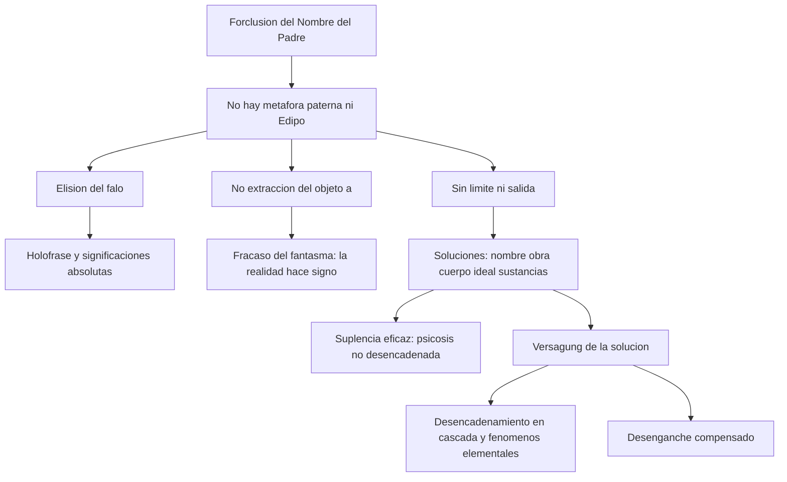
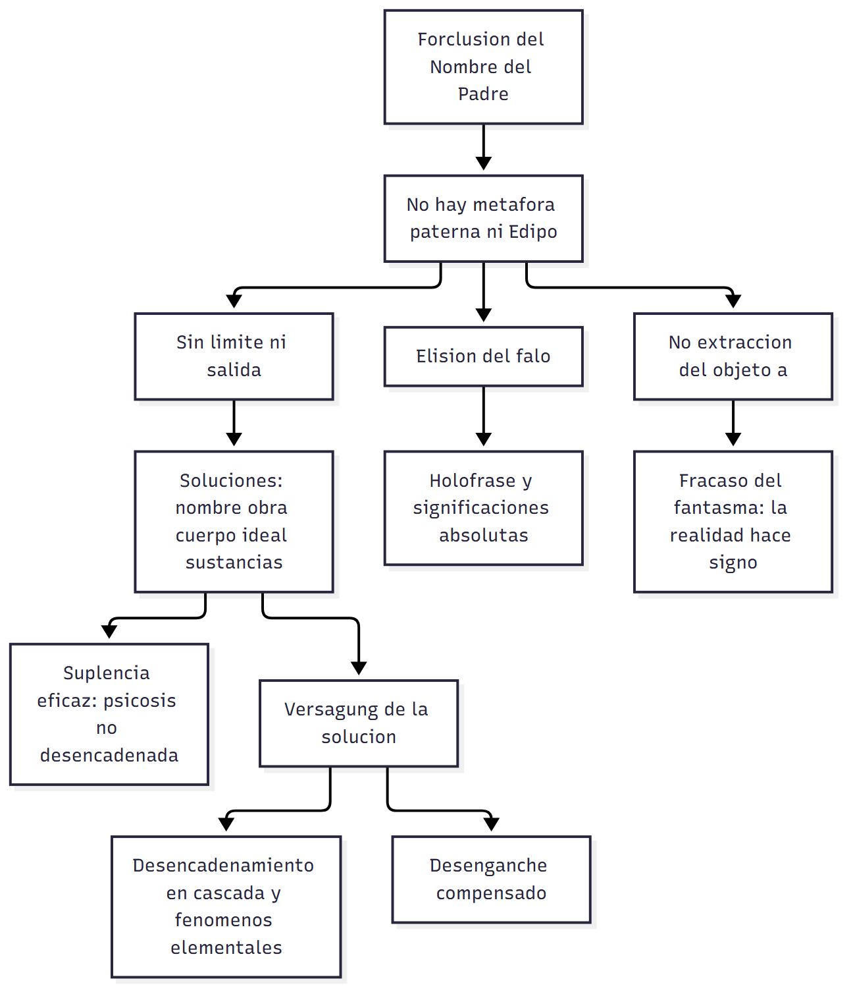

# C17_18 — Psicosis y forclusión del Nombre-del-Padre

> **Fuentes** (normas APA 7):
>
> - Belucci, G. (2014a). *Clínica de la estructura, clínica de lo singular* [Seminario dictado en UCES, versión parcial]. [Texto T14 del programa]
> - Belucci, G. (2014b). *Introducción al diagnóstico de estructura* [Ficha de cátedra]. Universidad Favaloro. [Texto T01 del programa]
> - Freud, S. (1996). Las neuropsicosis de defensa. En J. Strachey (Ed.), *Obras completas* (J. L. Etcheverry, Trad., Vol. 3). Amorrortu. (Obra original publicada en 1894) [Texto T02 del programa]
> - Freud, S. (1996). Neurosis y psicosis. En J. Strachey (Ed.), *Obras completas* (J. L. Etcheverry, Trad., Vol. 19). Amorrortu. (Obra original publicada en 1924) [Texto T13 del programa]
> - Freud, S. (1996). Fetichismo. En J. Strachey (Ed.), *Obras completas* (J. L. Etcheverry, Trad., Vol. 21). Amorrortu. (Obra original publicada en 1927) [Texto T12 del programa]
> - Heinrich, H. (1997). El juicio del Otro. En *Borde<R>S de la neurosis* (cap. IV). Homo Sapiens. [Texto T21 del programa]
>
> **Materia:** Psicoanálisis, 2.º año, Favaloro. **Apuntes de clase:** apuntes propios de las clases 17 (7/9/2026) y 18 (14/9/2026).

> **Aviso sobre las fuentes:** tus apuntes asignan a estas clases solo Freud (1924/1996) y Heinrich (1997). **Con esos dos textos no se pueden responder las cinco preguntas**: Freud (1924/1996) trata el conflicto yo–mundo exterior y Heinrich (1997) el *fort-da* y el «juicio del Otro». **La respuesta completa está en Belucci (2014b, pp. 15-24)** (forclusión, falo, objeto *a*, soluciones, desencadenamiento, fenómeno elemental, psicosis no desencadenadas), que es la fuente principal, y en tus apuntes de las clases 17-18. Belucci (2014a) (asignado a la clase 16) aporta la distinción **restitución/suplencia** y es muy útil para la pregunta de las soluciones. **Heinrich (1997) trata, en rigor, la clínica de los bordes** (→ `C19_20`), pero incluye la tabla del *fort-da* en la psicosis.

> **Idea-fuerza:** en la psicosis el Nombre-del-Padre **no se inscribió** en el origen (forclusión): sin metáfora paterna no hay Edipo, **no hay límite ni salida**, el falo queda **elidido** y el objeto *a* **no se extrae**. El sujeto debe **suplir** lo que la estructura no aporta, con **soluciones** singulares y contingentes (nombre, obra, ideal, sustancias, imaginarias…). Cuando esas soluciones **fracasan** (convocadas la Ley, la paternidad, la sexualidad…) hay **desencadenamiento**, con **fenómenos elementales**; cuando no, hay **psicosis no desencadenadas**, que se diagnostican por un conjunto de criterios (nunca por un signo patognomónico).

## Hilo conductor: cómo se conectan los temas de esta guía

Las cinco preguntas recorren la psicosis en el orden en que ocurre en una vida: **la causa estructural, cómo se manifiesta, cómo se la trata el sujeto, cuándo se rompe y cómo se la reconoce cuando no se rompe**.

**La causa** (pregunta 1) es la **forclusión del Nombre-del-Padre**: no se inscribió en el origen, no es fechable («ocurrió o no») y es la contracara de la **metáfora paterna**. Sin Edipo no hay **límite ni salida**: el falo queda **elidido** y el objeto *a* no se extrae; el fantasma falla. Esa es la estructura, y todo lo demás son sus consecuencias.

**La manifestación** (pregunta 2) es el **fenómeno elemental**. No es un síntoma más: su definición es **lógica** (verifica la estructura misma), y las referencias clínicas del Seminario 3 (alucinaciones, ideas delirantes, desestructuración del cuerpo y del yo, desafectivización) muestran lo que ocurre cuando la forclusión se hace evidente. Por eso es clave para el diagnóstico.

**Lo que el sujeto hace con la estructura** (pregunta 3) son las **soluciones**: como la estructura no aporta lo que falta, el sujeto debe **suplirlo** con recursos singulares (nombre, obra, ideal, sustancias, compensación imaginaria, el cuerpo, una causa). Se diferencian por su **eficacia** y por sus **elementos**; y se distingue **restitución** (el delirio) de **suplencia**.

**Cuando se rompen** (pregunta 4): si el sujeto es convocado en un punto donde la solución no alcanza (una **paternidad**, una autoridad, la **sexualidad**, la pérdida de un nombre o un lugar), sobreviene el **desencadenamiento** con **efecto cascada**: la *Versagung* de la clase 13 aplicada a la psicosis.

**Cuando no se rompen** (pregunta 5): son las **psicosis no desencadenadas**, donde la solución funciona. No hay un signo patognomónico, así que se diagnostican por un **conjunto de criterios** (pequeño automatismo, perplejidad, fijeza de la significación, inexistencia de la historia, deslocalización del afecto, fenómenos corporales). Es el mismo diagnóstico por **estructura** que vuelve más sutil lo que parecía obvio.

> 🎯 **Para el parcial:** conectá siempre cada tema con el anterior: la **solución** es lo que se arma frente a la forclusión; la **ruptura** es lo que le pasa a esa solución; el **diagnóstico de una no desencadenada** es leer la solución que no se rompió. Y recordá que Freud (1924/1996) y Heinrich (1997) solos no alcanzan: la guía los completa con Belucci (2014b) y Belucci (2014a) (ver los avisos al inicio de las respuestas).

**En una sola oración:** la forclusión del Nombre-del-Padre obliga al sujeto a suplir lo que falta; mientras la solución funciona la psicosis puede pasar inadvertida, y cuando se rompe aparece el fenómeno elemental.

## 0. Hoja de ruta

1. **Forclusión del Nombre-del-Padre** y sus consecuencias estructurales.
2. **Fenómeno elemental.**
3. **Soluciones**: ordenamientos, elementos, restitución vs. suplencia.
4. **Rupturas** (desencadenamiento).
5. **Psicosis no desencadenadas**: criterios.

## 🎯 Lo que entra sí o sí

1. **Forclusión:** término jurídico; **no fechable** («ocurrió o no»); contracara de la **metáfora paterna**; en las psicosis **no hay Edipo**; consecuencias: **sin límite ni salida**, **elisión del falo** (significante del deseo, holofrase, significación absoluta, medida y valor, sexuación, vitalización, relación paranoica), **no extracción del objeto *a***, **fracaso del fantasma**, cuerpo y afecto, **fuera de discurso**.
2. **Fenómeno elemental:** definición **lógica** (verifica la estructura misma) vs. referencias clínicas del Seminario 3 (desencadenamiento): alucinaciones, ideas delirantes, desestructuración del cuerpo y el yo, desafectivización, padecimiento ilimitado/pasaje al acto.
3. **Soluciones:** por **eficacia** (imbatibles/infantiles; hebefrenia; soporte eficaz que se cae tarde: Schreber; muy eficaces: no desencadenadas: Joyce) y por **elementos** (compensación imaginaria, nombre, obra, cuerpo, ideología/causa, sustancias, pensamiento/lógica); **restitución** (delirio) ≠ **suplencia**.
4. **Rupturas:** *Versagung*: se convoca la **terceridad de la Ley** (paternidad, autoridad), la **sexualidad**, la pérdida del lugar o nombre, el vínculo social, las sustancias; **efecto cascada**; **desenganches** vs. desencadenamientos.
5. **No desencadenadas:** automatismo/pequeño automatismo, **vacío de significación/perplejidad**, **fijeza de la significación**, discordancia, personalidad como fachada, **inexistencia de la historia**, **ausencia de angustia/deslocalización del afecto**, fenómenos corporales; «no hay signo patognomónico».

---

## 1. Primera pregunta — La forclusión del Nombre-del-Padre y sus consecuencias estructurales

> *Desarrolle el concepto de forclusión del Nombre-del-Padre. ¿Cuáles son sus consecuencias estructurales?*

### 1.1 Respuesta modelo

> **Esqueleto de la respuesta:**
> 1. **Tesis:** en las psicosis el lazo del sujeto al Otro no fue legalizado por el Padre (Belucci, 2014b, p. 15).
> 2. **Forclusión:** término jurídico: un derecho no ejercido a tiempo ya no puede ejercerse; no es fechable (Belucci, 2014b, p. 16).
> 3. **Antecedente freudiano:** la desestimación (*Verwerfung*) de 1894 y el nuevo mundo exterior de 1924 (Freud, 1894/1996, p. 15; Freud, 1924/1996).
> 4. **Consecuencia 1:** sin límite ni salida; goce ilimitado; encerrona o errancia.
> 5. **Consecuencia 2:** elisión del falo (holofrase, significaciones absolutas, medida, sexuación, vitalización).
> 6. **Cierre (otras consecuencias):** no extracción del objeto *a*; fracaso del fantasma y del cuerpo; deslocalización del afecto; fuera de discurso.

En las psicosis, dice Belucci, «**el lazo del sujeto al Otro no ha sido legalizado por el Padre**» (Belucci, 2014b, p. 15). El Padre es un **operador** de la estructura con una **propiedad ordenadora**, que aporta fundamentalmente la función de un **límite** y la posibilidad de una **salida** (metáfora paterna, que toma cuerpo en los tiempos del Edipo); si la Ley del Padre operó, el goce del Otro queda **negativizado**: hay una pérdida de goce en el origen que ya no será revertida (Belucci, 2014b, pp. 15-16). Lacan postuló en 1958 el mecanismo de la **forclusión del Nombre-del-Padre**. «Forclusión» es un término del vocabulario **jurídico** francés: un derecho o facultad no ejercido a su debido tiempo **ya no puede ejercerse con posterioridad**. Aplicado al Nombre-del-Padre: si este término ordenador **no ocupó su lugar en el Otro en el origen mismo de la estructura**, no podrá disponerse de él cuando se lo requiera y **el lazo del sujeto a su Otro no estará ordenado por la Ley**. Es la **contracara de la metáfora paterna** y, como ella, una operación **de la que solo se puede decir que ocurrió o no ocurrió**: no es fechable ni se despliega en la diacronía; y siendo la metáfora paterna condición del Edipo, se infiere que **en las psicosis no lo hay** (Belucci, 2014b, p. 16). Antecedente freudiano: la **desestimación (*Verwerfung*)** de 1894 y el yo que «se crea, soberanamente, un nuevo mundo exterior e interior» (Freud, 1924/1996; Freud, 1894/1996, p. 15).

Las **consecuencias estructurales** son: (1) **no hay límite ni salida garantizados**: el sujeto debe suplir lo que la estructura no aporta; si fracasa, se confronta a un **goce potencialmente ilimitado y arrasador**, entre la «**encerrona endogámica**» y la «**errancia**» (reducido a un residuo del Otro); (2) la **elisión del falo**, segundo operador fundamental, con todas sus funciones afectadas: significante del deseo (rige la **holofrase**, no la lógica del intervalo), **significación fálica** (emergen **significaciones absolutas**: intuiciones delirantes, neologismos, «el Elegido»), **medida y valor** (devaluación generalizada, o inflación megalómana del yo), **sexuación** (desencadenamientos en la pubertad: «empuje-a-la-mujer»), **vitalización** (desvitalización, inercia, pasaje al acto) y regulación de la **relación con los semejantes** (relación paranoica); (3) la **no extracción del objeto *a***, solidaria del **fracaso en la escritura del fantasma**: el sujeto queda como potencial objeto *a* a merced del goce del Otro, y la realidad no está delimitada («le hace signo»); (4) **fracaso en la constitución de un cuerpo** (fenómenos corporales; compensación por la unidad imaginaria del yo); (5) el **afecto se deslocaliza** o falta (desafectivización; **inexistencia de angustia**); (6) la **exclusión del lazo social, «fuera-de-discurso»**.

> ⚠ **No confundir:** forclusión ≠ represión: lo forcluido no retorna desde el inconsciente sino desde **lo real**. Y sin metáfora paterna **no hay Edipo**.

### 1.2 Desarrollo ampliado

#### a) El Padre, la metáfora y el goce (Belucci, 2014b, pp. 15-16; Belucci, 2014a; Heinrich, 1997)

- **Estructura = campo del Otro**; el Padre como operador ordenador (a diferencia de cualquier otro operador) que posibilita un ordenamiento de los elementos de la estructura (Belucci, 2014b, p. 15; Belucci, 2014a, p. 2: «las llamadas estructuras clínicas no son otra cosa que los distintos modos particulares en los que se ordena la relación al campo del Otro... según los modos diferenciales de relación al Padre; si hubo o no inscripción del Nombre-del-Padre... delimita neurosis-perversión de psicosis»).
- **Relación a la palabra (Belucci, 2014b, p. 15):** «el sujeto en las psicosis no está por fuera del lenguaje, pero tiene una relación con la palabra más problemática: no dispone de la palabra del mismo modo que en las neurosis»; es **hablado por el Otro**.
- **Apuntes (clase 17):** «Estructura: Lacan A barrada: conjunto de significantes que determinan al sujeto (insuficiente, lo cual genera el deseo). Nombre del Padre: ordenador de la estructura, ordenarse en la relación con el otro: función de límite... o una salida. Opción 1: límite; opción 2: salida. El Nombre del Padre no aplica para el psicótico: ¿entonces cómo se suple esta ausencia? Forclusión del Nombre del Padre.»
- **El *fort-da* y el «juicio del Otro» (Heinrich, 1997):** el *fort-da* (el nieto de Freud) **indica que la metáfora paterna ha operado**: el corte que introduce entre el niño y la madre es **momento traumático**, corte que instituye a un sujeto deseante; Freud: «el niño ha logrado una importante **renuncia pulsional** al permitir, sin protestar, que la madre se vaya». Tres tiempos: **renuncia pulsional**, el «o-o-o!», y el **«juicio del Otro»** (la madre que interpreta como *Fort*): condición del *fort-da* como **primera oposición simbólica**, constitutiva de un sujeto deseante. **«En la psicosis el corte con el Otro no se produjo, con lo cual tampoco se produce el fort-da»**; «en la psicosis hay una **imposibilidad lógica de entrada en el discurso**, en la medida en que la metáfora paterna no ha operado» (Heinrich, 1997). Tabla de Heinrich: trauma / juicio del Otro / *fort-da*: psicosis NO-NO-NO; neurosis SÍ-SÍ-SÍ; bordes SÍ-NO-«falta confianza en el significante».
- **Antecedente freudiano, *Neurosis y psicosis* (Freud, 1924/1996):** «**La neurosis es el resultado de un conflicto entre el yo y su ello, en tanto que la psicosis es el desenlace análogo de una similar perturbación en los vínculos entre el yo y el mundo exterior**.» Completada: **neurosis de transferencia** = conflicto yo–ello; **neurosis narcisista** (melancolía, paradigma) = yo–superyó; **psicosis** = yo–mundo exterior. En las neurosis de transferencia el yo se pone del lado del superyó y la realidad y **reprime**; en la **amentia de Meynert** (confusión alucinatoria aguda): el mundo exterior no es percibido, o su percepción carece de eficacia, **y se resta el valor psíquico (investidura) al mundo interior** que lo subrogaba: «el yo se crea, soberanamente, **un nuevo mundo exterior e interior**»: se edifica en el sentido de las mociones de deseo del ello y el motivo de la ruptura fue **una grave frustración (denegación)** del deseo por parte de la realidad. Parentesco con el **sueño** (el dormir implica extrañamiento entre percepción y mundo exterior). Las **esquizofrenias**: apatía afectiva (pérdida de participación en el mundo exterior). **El delirio como «parche» colocado donde originariamente se produjo una desgarradura en el vínculo del yo con el mundo exterior**: «los fenómenos del proceso patógeno a menudo están ocultos por los de un **intento de curación o de reconstrucción**». **Etiología común** de psiconeurosis y psicosis: la **frustración** («en su último fundamento una frustración externa», o interna por el superyó que subroga la realidad); el efecto patógeno depende de si el yo permanece fiel a su vasallaje al mundo exterior o es avasallado por el ello y arrancado de la realidad; el superyó complica la situación. Cómo evita el yo enfermar: **constelaciones económicas** y **deformarse a sí mismo, consintiendo menoscabos a su unicidad y segmentándose**: «las inconsecuencias, extravagancias y locuras de los hombres aparecerían bajo una luz semejante a la de sus perversiones sexuales». **Problema final:** ¿cuál es el mecanismo, análogo a la represión, por el que el yo se desase del mundo exterior? (Freud lo resolverá con la *Verleugnung*; nota del traductor.)
- **Antecedentes: la *Verwerfung* (Freud, 1894/1996, p. 15-16):** «el yo desestima la representación insoportable junto con su afecto y se comporta como si no hubiera comparecido»; el yo se desase de la realidad: condición de la vividez alucinatoria. → `Transversal_ConceptoDeDefensa_Guia.md §2`.
- **Las dos corrientes (Freud, 1927/1996):** la psicosis no es solo desmentir un fragmento de realidad (los dos jóvenes que no se enteraron de la muerte del padre no enloquecieron): en las psicosis «**una de esas corrientes, la acorde con la realidad, faltaría efectivamente**» (→ `C16 §2`).

#### b) Las consecuencias: el falo elidido (Belucci, 2014b, pp. 16-17)

- **Segundo operador fundamental: el falo**, puesto en funciones por el Padre. Sus aspectos:
  1. **Significante de la falta y del deseo:** hace posible la lógica del **intervalo** frente a la de la **holofrase**.
  2. **Significación fálica:** el campo de la significación queda **agujereado**; «toda significación remite siempre a otra significación»; el ser del sujeto permanece enigmático.
  3. **Medida y valor:** valor fálico de los objetos y de sí mismo.
  4. **Posición sexuada.**
  5. **Vitalización:** el falo es **el único elemento en la estructura que tiene como efecto la vitalización**, contrarrestando la negatividad del lenguaje (pulsión de muerte).
  6. **Regula las relaciones con los semejantes**, poniendo coto a la **relación paranoica del estadio del espejo**.
- **En las psicosis, la forclusión de la Ley paterna determina la elisión del falo** (Belucci, 2014b, p. 16). Consecuencias: **el sujeto está imposibilitado de situarse ante el Otro en términos de deseo**; rige la **holofrase** (ejemplo: el texto alucinatorio que se impone sin interrogación ni equivocidad posible); **ausencia de significación fálica** → **significaciones absolutas**: «intuiciones delirantes», neologismos, significaciones del ser del sujeto («el Elegido», «el próximo Papa»); **medida y valor comprometidos**: «devaluación generalizada» del objeto y del propio ser (contrarrestada a veces por la **inflación megalómana del yo**) y pérdida del interés y entusiasmo (esquizofrenia); **sexuación:** dificultades en la sexuación y el encuentro sexual: raíz de muchos **desencadenamientos en la pubertad y adolescencia** y descompensaciones; **empuje-a-la-mujer** (última enseñanza de Lacan); **desvitalización**, inercia casi absoluta (esquizofrenia) e **impulso hacia la muerte** en el pasaje al acto; reactualización de la **relación paranoica** con el otro (Belucci, 2014b, pp. 16-17).
- **Apuntes (clase 17):** «Fenómenos elementales: alucinaciones (ideas, palabras); forclusión del NP, por ende el falo; no extracción del objeto *a*.»

#### c) Otras consecuencias (Belucci, 2014b, pp. 17-18, 24)

- **No extracción del objeto *a*:** «al no producirse, deja al sujeto como un **potencial objeto *a* a merced del goce del Otro**»; solidaria, según Lacan, del **fracaso en la escritura del fantasma**: la relación al Otro y a lo real no está mediada por ese marco. **La realidad** no está delimitada de lo que no lo es, asume un carácter extraño, tiende a abarcarlo todo y está referida al sujeto («**le hace signo**»): la **posición interpretante del paranoico** (un gesto ocasional como mensaje a un compañero de conspiración).
- **Fracaso en la constitución de un cuerpo** (anudamiento de los tres registros y extracción de *a*): fenómenos corporales (sensaciones hipocondríacas, cenestopatías, vivencias de fragmentación), o compensación por la **unidad imaginaria del yo** (paranoia, parafrenias) u otra operación que arme un cuerpo.
- **Afectividad:** al no haber cuerpo en sentido estricto, el afecto **se deslocaliza** o falta (**desafectivización, aplanamiento afectivo**, esquizofrenia); **inexistencia de la angustia**: coordenada diagnóstica fundamental (Belucci, 2014b, p. 17; p. 24: «la angustia es la traducción del corte y de la Ley que lo funda»).
- **Exclusión del lazo social («fuera-de-discurso») (Belucci, 2014b, pp. 17-18):** Lacan formula los cuatro discursos (Amo, universitario, analista, histérica) a partir de la frase freudiana de las tres profesiones imposibles (gobernar, educar, analizar); hay discurso cuando se establece lazo entre el **agente (semblante)** y el **Otro**; «el lazo social se sostiene en la castración»; las psicosis están **fuera-de-discurso** por la forclusión de la Ley; esto no impide vínculos, pero son **precarios** y condicionados por las soluciones.
- **Psicosis y Edipo (Belucci, 2014b, p. 16):** «la condición psicótica se instaura, entonces, como un **sin-salida**. Si hay una salida posible, es **a producir**, y es una de las orientaciones fundamentales para pensar el tratamiento.»
- **Necesario vs. contingente (Belucci, 2014a, p. 8):** si alguien cuenta con el NP en la estructura, la extracción del objeto *a* es un **efecto de estructura**, garantizado (orden de lo necesario); en la psicosis no lo está y cualquier extracción de goce es **contingente**.
- **Apuntes:** «Psicosis: el psicótico no tiene registro de un “Otro”. La forclusión del Nombre del Padre como mecanismo de defensa.» «Ve el goce del otro como algo que lo invade (por eso tiene voces imaginarias).»

> 🔑 **Punto clave:** forclusión = el NP **no se inscribió en el origen** (no fechable); no hay Edipo. Consecuencias: **sin límite ni salida**, **elisión del falo**, **no extracción de *a***, fracaso del fantasma, cuerpo y afecto, **fuera de discurso**.

---

## 2. Segunda pregunta — El fenómeno elemental y su importancia diagnóstica

> *Refiérase al concepto de «fenómeno elemental» y a su importancia para el diagnóstico de psicosis.*

### 2.1 Respuesta modelo

> **Esqueleto de la respuesta:**
> 1. **Tesis:** «fenómeno elemental es todo aquel que verifica la estructura misma»: definición lógica, no solo clínica (Belucci, 2014b, p. 21).
> 2. **Origen:** Seminario 3, clínica del desencadenamiento.
> 3. **En psicosis desencadenadas:** elementos impuestos (alucinaciones, ideas delirantes), desestructuración del cuerpo y del yo, desafectivización (Belucci, 2014b, p. 22).
> 4. **Pregunta abierta:** ¿qué tendría ese estatuto en las no desencadenadas?
> 5. **Importancia diagnóstica:** verifica la estructura (la forclusión), no un síndrome.
> 6. **Cierre:** «no hay signo patognomónico»: ninguna hipótesis diagnóstica se sostiene en un único elemento.

Belucci vincula el **fenómeno elemental** estrechamente con el **desencadenamiento** y destaca una **distinción**: las referencias clínicas que Lacan desarrolla en el **Seminario 3** corresponden a la clínica del desencadenamiento, pero **la definición que da es de orden lógico: «fenómeno elemental es todo aquel que verifica la estructura misma»** (Belucci, 2014b, p. 21). Ser consecuentes con esta definición obliga a revisar el campo clínico de los fenómenos elementales: si son solidarios de la estructura y la verifican, ¿**qué tendría el estatuto de fenómenos elementales tanto en las psicosis desencadenadas como en las no desencadenadas**? (Belucci, 2014b, pp. 21-22): Belucci «deja abierta la pregunta». En las **psicosis desencadenadas** hay fenómenos muy claros de **elementos impuestos**, en los que **el sujeto es hablado por el Otro sin poder restarse**: **alucinaciones e ideas delirantes**; fenómenos de **desestructuración del cuerpo y el yo** (a veces parcialmente compensados); **alteración de la afectividad** que lleva a la **desafectivización**; **la vivencia de un padecimiento potencialmente ilimitado** al que a veces solo el **pasaje al acto** podría poner término (Belucci, 2014b, p. 22). Su **importancia diagnóstica** es que verifican **la estructura** (y no meramente un síndrome): son **marca de la forclusión** (apuntes: alucinaciones, forclusión del NP y por ende del falo, no extracción del objeto *a*); y su versión **incipiente** (automatismo, vacío de significación, fijeza) permite **conjeturar** la condición psicótica **aun sin desencadenamiento** (§5). Con una advertencia: **«ninguna hipótesis diagnóstica se va a sostener en un único elemento. No hay signo patognomónico»** (Belucci, 2014b, p. 22).

> ⚠ **No confundir:** el fenómeno elemental verifica la **estructura**, no es un síntoma neurótico ni un signo aislado suficiente.

### 2.2 Desarrollo ampliado

- **Cita clave (Belucci, 2014b, pp. 21-22):** «Un concepto estrechamente vinculado al de desencadenamiento es el de fenómeno elemental. Quiero destacar que, mientras las referencias clínicas que Lacan desarrolla en el Seminario 3 corresponden a la clínica del desencadenamiento, la definición que da es de orden lógico: fenómeno elemental es todo aquél que verifica la estructura misma. Ser consecuentes con esta definición nos lleva a revisar el campo clínico de los fenómenos elementales. Si son solidarios de la estructura misma y la verifican, ¿qué tendría el estatuto de fenómenos elementales, tanto en las psicosis desencadenadas como en las no desencadenadas?»
- **Fenómenos elementales de las psicosis desencadenadas (Belucci, 2014b, p. 22):** «elementos impuestos, en los que el sujeto es hablado por el Otro sin poder restarse, como las **alucinaciones y las ideas delirantes**, **fenómenos de desestructuración del cuerpo y el yo**, a veces parcialmente compensados, una **alteración de la afectividad**, que lleva muchas veces a la desafectivización, la **vivencia de un padecimiento potencialmente ilimitado** al que a veces solo el pasaje al acto podría poner término».
- **Criterios en psicosis no desencadenadas (Belucci, 2014b, pp. 22-24):** los fenómenos elementales en versión sutil: **elemento incipiente de imposición** (el «pequeño automatismo mental» de Clérambault), **vacío de significación/perplejidad**, **fijeza**, etc. → §5.
- **Relación con las consecuencias de la forclusión (Belucci, 2014b, pp. 16-17):** significaciones absolutas, holofrase (el texto alucinatorio que se impone sin interrogación), intuiciones delirantes, neologismos, fragmentación corporal, desafectivización.
- **Apuntes (clase 17):** «**Fenómenos elementales:** alucinaciones: ideas, palabras; forclusión del NP, por ende el falo; no extracción del objeto *a*.»
- **El analista (apuntes):** «El analista, por lo general, no le dice al paciente el diagnóstico.»

> 🔑 **Punto clave:** definición **lógica** («verifica la estructura») frente a la **clínica** del desencadenamiento; **no hay signo patognomónico**.

---

## 3. Tercera pregunta — Soluciones o recursos ante la forclusión

> *¿Qué soluciones o recursos son posibles para un sujeto de condición psicótica ante las consecuencias de la forclusión del Nombre-del-Padre?*

### 3.1 Respuesta modelo

> **Esqueleto de la respuesta:**
> 1. **Tesis:** forcluida la Ley, el sujeto debe suplir lo que la estructura no aporta (Belucci, 2014b, pp. 16-18).
> 2. **Por eficacia:** psicosis infantiles; hebefrenias; Schreber (solución que dura décadas); Joyce (suplencia que nunca falla).
> 3. **Por elementos:** compensación imaginaria, hacerse un nombre, la obra, el cuerpo, ideología y causa, sustancias, lógica (Belucci, 2014b, pp. 19-21).
> 4. **Restitución:** el delirio intenta restituir un Otro consistente (Belucci, 2014a, pp. 5-6).
> 5. **Suplencia:** operación de escritura que instituye un lazo nuevo y hace deconsistir al Otro.
> 6. **Cierre:** las soluciones son singulares y contingentes; la serie queda abierta.

Forcluida la Ley, el problema del sujeto es **cómo suplir lo que la estructura no aporta** (Belucci, 2014b, p. 16); la elaboración de Lacan y de quienes lo continuaron fue avanzando a una interrogación acerca de los **posibles soportes** con los que un sujeto psicótico puede sostenerse en la existencia. Esos soportes son siempre **singulares y contingentes** y varían en su **eficacia**; los más eficaces se han nombrado **suplencias**, categoría que podría extenderse a todos (Belucci, 2014b, p. 18). Pueden **ordenarse** de dos modos. **(1) Por la eficacia con que contrarrestan la forclusión:** (a) **nada vino a contrarrestar** sus efectos (**psicosis infantiles**: la estructura se manifiesta desde el comienzo; «imbatibles»); (b) **soporte precario** que se desarma en la adolescencia o primera juventud ante el embate pulsional o el encuentro con lo sexual (**hebefrenias**, forma juvenil y desorganizada de la esquizofrenia); (c) **solución eficaz que dura décadas** y deja de operar tardíamente por una contingencia (**Schreber**: elevó la ley jurídica al lugar de la Ley paterna forcluida, y todo anduvo relativamente bien hasta los 51 años, cuando el nombramiento como presidente de la Corte lo puso en una autoridad paterna insostenible); (d) **suplencias particularmente eficaces** que ninguna contingencia volvió inoperantes: **psicosis no desencadenadas** (**Joyce**, Seminario 23: su escritura, que «destruye la lengua inglesa» y «el ego», sostuvo el anudamiento toda su vida). **(2) Por los elementos que funcionan como soportes** (Belucci, 2014b, pp. 19-21): **compensación imaginaria del Edipo ausente** (personajes, «personalidades como si», fachada «neurótica»; parafrenias, «cáscara vacía»); **hacerse un nombre** (función de nominación: el «poeta del barrio»; el «protagonista»; riesgo: Rousseau); **la obra** (artistas, inventores; efectos: sustracción de goce equivalente a la extracción de *a*, circulación, **nombre-de-autor**; si fracasa: el «artista incomprendido»); **intervenciones sobre el cuerpo** (cirugías, tatuajes, piercings, mutilaciones: atar lo simbólico y lo imaginario); **ideología y causa** (militancia política o religiosa; el **ideal**; Schreber); **uso de sustancias** (marihuana, cocaína; viagra); **pensamiento y lógica**. La serie es **abierta** (carácter singular). En paralelo, Belucci (2014a, pp. 5-6) distingue **restitución** (el delirio, intento de restituir un Otro consistente y al padre) de **suplencia** (operación de escritura, que no restituye un Otro del goce sino que instituye un nuevo modo de lazo y hace **deconsistir** al Otro).

> ⚠ **No confundir:** restitución (delirio: rehace al Otro) ≠ suplencia (escritura: inventa un lazo sin restituir al Otro).

### 3.2 Desarrollo ampliado

#### a) El tratamiento como «producción» (Belucci, 2014b, p. 16; apuntes clase 18)

- «**Si hay una salida posible, es a producir**, y es una de las orientaciones fundamentales para pensar el tratamiento» (Belucci, 2014b, p. 16).
- **Apuntes (clase 18):** «Tratamientos en las psicosis se plantean como la **producción de un objeto externo**. Para que haya habido pregunta tuvo que haber habido una extracción del objeto *a*, luego intento de respuesta y luego fantasma, al no haber respuesta. La producción de un objeto tercero/externo genera la extracción del objeto *a*.»

#### b) Ordenamiento por eficacia (Belucci, 2014b, p. 18; apuntes)

| Tipo | Descripción | Ejemplo |
|---|---|---|
| **Nada contrarrestó** | Psicosis infantiles; la estructura se manifiesta clínicamente desde el comienzo (apuntes: «psicosis imbatibles») | — |
| **Soporte precario** | Se desarma en adolescencia/primera juventud ante el embate pulsional o el encuentro con lo sexual (hebefrenia) | Hebefrenia |
| **Solución eficaz, tardía caída** | Funciona décadas y cae por una contingencia | **Schreber** (51 años, presidente de la Corte) |
| **Suplencia muy eficaz** | Ninguna contingencia la tornó inoperante: **no desencadenada** | **Joyce** (Seminario 23) |

#### c) Ordenamiento por elementos (Belucci, 2014b, pp. 19-21; apuntes)

- **Compensación imaginaria del Edipo ausente** (Seminario 3): armado de **personajes** sostenidos en identificaciones imaginarias, vínculos sociales y rutinas rígidas, con sometimiento pasivo a mandatos; **«personalidades como si»** de Helene Deutsch; **fachada «neurótica»** («hacer de neurótico»); en las **parafrenias**, la personalidad como «**cáscara vacía**» (solución imaginaria en psicosis ya desencadenadas).
- **Hacerse un nombre / hacerse un lugar** (Belucci, 2014b, p. 19; apuntes: «Hacerse un nombre»): la **función de nominación** puede suplir el NP forcluido: el «poeta del barrio», el «loco lindo», el «protagonista»; no coinciden con el nombre civil. **Riesgo:** **Rousseau** desencadenó su psicosis al ser reconocido como autor por el gran público.
- **La obra / el devenir autor** (Belucci, 2014b, pp. 19-20; apuntes: «soporte que daba al sujeto una escena/lugar/actividad que le permite con el otro una relación más amable»): artistas, inventores, creadores, no necesariamente exitosos. **Ejemplos:** el paciente que componía **pequeños libros con sus poemas** y los vendía en bares; el paciente paraguayo que vendía **chipá**, cuya última descompensación coincidió con la rotura del hornito; el joven que escribía con tiza **versitos con «k»** y firmaba «Fernando, el mejor de todos los poetas»; los *bloggers*. **Efectos:** (1) **sustracción de goce**, equivalente en acto a la **extracción del objeto *a***; (2) alguna **circulación**, en lugar de los lazos discursivos de los que está excluido; (3) **nombre-de-autor**. El **público** también se produce. **Fracaso:** carácter **autoerótico** de la obra: el «artista incomprendido» o «inventor delirante» sin circulación.
- **Intervenciones sobre el cuerpo** (Belucci, 2014b, p. 20): **cirugías estéticas, tatuajes, piercings**: modo de ligadura, incluso de nudo; el joven que decía que en el encuentro sexual «la mente iba por un lado y el cuerpo por otro» y se hizo piercings que, al agujerear el cuerpo en lo real, enlazarían lo simbólico y lo imaginario; ciertas **mutilaciones** para restar algo y armar un cuerpo.
- **Ideología y causa** (Belucci, 2014b, p. 20; apuntes: «el ideal (objeto simbólico) es el objeto central en el que se monta/despliega su medio para relacionarse con el otro»): militancia política o religiosa; **constituir un padre** por la adhesión a un líder y a ideales rígidos; organizaciones extremas reclutan psicóticos (el sujeto que pasó de la extrema derecha a la extrema izquierda: importa la estructura de lazo); inscribirse en la comunidad de los creyentes y en un «discurso establecido» (la Biblia). **El ideal** es un recurso frecuente; en la **paranoia** el ideal es parte del «trabajo de construcción delirante» (la **unidad interna** del delirio paranoico; **Schreber**: «mi misión es ofrecer a Dios (goce continuo)... como pequeña compensación», que **acota el goce del Otro**).
- **Uso de sustancias** (Belucci, 2014b, pp. 20-21; apuntes: «permite la inclusión a cierto grupo, lo cual permitiría la suscripción del sujeto en un vínculo social con el otro»): **marihuana** (droga «social», vitaliza, contrarresta la inercia), **cocaína** (fortaleza yoica contra la fragmentación; pero induce un goce sin límites y puede **desencadenar**); la **viagra** que regula erecciones incontroladas.
- **Pensamiento y lógica** (Belucci, 2014b, p. 21): una paciente que sortea situaciones desestabilizantes pensando sus coordenadas lógicas.
- **Serie abierta** (Belucci, 2014b, p. 21): «nunca se insistirá lo suficiente en que esta serie es una serie abierta... partir de cualquier a priori en la lectura de un caso no es el mejor punto de partida».

#### d) Restitución y suplencia (Belucci, 2014a, pp. 4-8)

- **Neurosis y perversión son «respuestas religiosas a lo real»** (sostenidas en el padre); en las psicosis también hay «eso», el **delirio** («intento de restitución» de Freud) (Belucci, 2014a, pp. 4-5).
- **Temas delirantes de la paranoia (Kraepelin):** **erotomanía, celotipia y persecución** (en los tres: **restituir un Otro consistente, el Otro del goce**: quien se cree perseguido supone un Otro que puede gozarlo; el erotómano supone ser lo que completa al Otro; la celotipia, un perjuicio); **delirio místico** (con Dios: restituye la **referencia al padre**; Schreber: la introducción de Dios permite la solución delirante); **delirio de alta cuna** / «de reivindicación filial» (delirio con la **filiación**, la genealogía) (Belucci, 2014a, p. 5).
- «**El delirio, en suma, restituye a un Otro consistente, y restituye también al padre. El delirio es la respuesta religiosa de las psicosis.**» Schreber: antes de enfermar no era religioso; constituido el delirio, sí. «**La suplencia es otra cosa**» (Belucci, 2014a, p. 6). Las **alucinaciones** pueden tener la misma función (el paciente que alucinaba veinte años y «estaba en comunicación con Dios»; la medicación atenuó las alucinaciones y la función de comunicarlo con Dios dejó de estar presente: iatrogenia).
- **Suplencia (Joyce):** «no tiene que ver con algo de orden delirante, sino con una **operación de escritura**, que **lejos de hacer consistir un Otro del goce, instituye un nuevo modo de lazo**» (Belucci, 2014a, p. 6). **«La suplencia produce una deconsistencia del Otro»** (Belucci, 2014a, p. 7): Joyce **desarticula la lengua inglesa** como conjunto (trata las palabras fuera del código, inyecta elementos de otras lenguas: griego, latín).
- **Rousseau (Belucci, 2014a, p. 6):** paranoico, delirio persecutorio, huyó durante décadas; en 1758-1762, **período de menor productividad delirante**, escribió *Emilio* y *El contrato social*: «cuando deliraba, no escribía... allí donde nos encontramos con la dimensión de la suplencia —por la vía de la obra— **la dimensión restitutiva del delirio pierde vigor**». La «**solución Rousseau**»: rechaza la ley recibida (de la tradición) y **funda una ley nueva**, el contrato: «un **paranoico de genio**» (Lacan).
- **Wolfson (Belucci, 2014a, pp. 6-7):** esquizofrénico estadounidense, la lengua materna «le perforaba el cerebro»; aprendió francés y escribió *Le schizo et les langues*, teoría lingüística (descomposición de fonemas); al fracasar la inscripción científica agregó «añadidos apocalípticos» (teoría delirante del fin del mundo): «ahí donde fracasa la producción de la obra aparece el delirio».
- **Joyce y la transmisión (Belucci, 2014a, p. 8):** la solución funcionó para él, no para su hija (esquizofrenia): **no es transmisible**, no sigue la vía del Padre; el **nudo de tres** (borromeo, blasón de la familia Borromeo, la Trinidad: «un nudo religioso», que hace posible la transmisión) vs. el **nudo de cuatro**: «estrictamente singular».
- **Schreber antes del desencadenamiento (Belucci, 2014a, p. 8; Belucci, 2014b, p. 18):** hipótesis de Belucci: hizo advenir la **ley positiva, jurídica, al lugar de la Ley simbólica forcluida**; la solución previa era eficaz, pero cuando le tocó estar en la cúspide del ordenamiento jurídico y **asumir una posición de autoridad**, no resistió.
- **Toda solución es contingente (Belucci, 2014a, p. 8):** «lo contingente es la modalidad lógica opuesta a lo necesario»; **la estructura es del orden de lo necesario** (la extracción del objeto *a* es un efecto de estructura si hay NP), mientras que «la extracción de una parte de goce» que produce Schreber con su delirio es **contingente**; «no necesariamente es precaria: la solución de Joyce le sirvió toda su vida».
- **Clínica de la estructura y clínica de lo singular (Belucci, 2014a, p. 7):** relación **suplementaria** (no exclusión ni complementariedad): la clínica de lo singular se inscribe donde la estructura es **no-toda**.

> 🔑 **Punto clave:** soluciones **singulares y contingentes**; se ordenan por **eficacia** y por **elementos** (imaginario, nombre, obra, cuerpo, ideal, sustancias, lógica). **Restitución (delirio) ≠ suplencia (escritura: deconsistencia del Otro, nuevo lazo).**

---

## 4. Cuarta pregunta — Rupturas de las soluciones: condiciones y modos

> *¿Bajo qué condiciones y de qué modos pueden producirse rupturas en las soluciones psicóticas?*

### 4.1 Respuesta modelo

> **Esqueleto de la respuesta:**
> 1. **Tesis:** las soluciones pueden caer ante una *Versagung* (Belucci, 2014b, p. 21).
> 2. **Condición 1:** se convoca la terceridad de la Ley: paternidad, autoridad (Schreber).
> 3. **Condición 2:** encuentro con la sexualidad o la maternidad; también pérdida del lugar o del nombre, avatares del lazo, sustancias.
> 4. **Modo 1, desencadenamiento:** cascada; desacople simbólico-imaginario; «defecto».
> 5. **Modo 2, desenganches:** compensados, sin marca (*restitutio ad integrum*).
> 6. **Cierre:** urgencia en psicosis: perplejidad, a veces internación (Belucci, 2014b, p. 44).

La estructura resiste las contingencias de la realidad o se **desencadena** al no soportarlas (Belucci, 2014b, p. 21). Lo accidental se presenta como una ***Versagung***: **una caída o al menos una vacilación de las soluciones** que hasta ese momento habían sido eficaces (Belucci, 2014b, p. 21). **Condiciones** (Belucci, 2014b, p. 21): (1) circunstancias en las que es **convocada la terceridad de la Ley** en un punto donde el sujeto debería responder: la **paternidad** o la asunción de una **posición de autoridad** (**Schreber**, nombrado presidente de la Corte Suprema); (2) el encuentro con la **sexualidad, la diferencia sexual o la maternidad**, que requieren el ordenamiento fálico para ser soportadas (desencadenamientos en la pubertad y adolescencia); (3) la **pérdida del lugar y del nombre** que el sujeto se había dado; (4) **avatares del vínculo social** que ponen en cuestión los mecanismos imaginarios de compensación; (5) la **pérdida o efectos paradojales de las sustancias** a las que se recurría. (Apuntes: «caída o vacilación de la solución... situación frente a la autoridad, o la paternidad, o la sexualidad, o alguna situación que implique servirse del falo como operador; pero también cuando alguna de las soluciones pasa un momento de “jaque” y se impide la producción de ese objeto».) **Modos:** puede haber un **franco desencadenamiento** o **vacilaciones o «desenganches»** compensados sin desencadenamiento franco (Belucci, 2014b, p. 21). El desencadenamiento conlleva **un efecto de cascada**: por lo general, un **desacople entre lo simbólico y lo imaginario** y una **desarticulación «centrífuga» de cada campo** (los «**abismos**» del esquema I de la *Cuestión preliminar*); consecuencia: la progresiva **pérdida del capital simbólico y empobrecimiento imaginario**, que la psiquiatría clásica llamó «**defecto**»: hay una **marca** de que algo no funciona como antes. Los **desenganches**, en cambio, **no dejan marca**: coinciden con la ***restitutio ad integrum***. La **clínica de la urgencia** en psicosis (Belucci, 2014b, p. 44): la urgencia es un horizonte mucho más próximo; la consulta suele producirse en un momento de **perplejidad y extravío** que deja margen para sortear el desencadenamiento; las presentaciones incluyen alucinaciones con órdenes, ideas delirantes de perjuicio, pasajes al acto violentos, arrebatos pasionales, excitación psicomotriz, fuga y vagabundeo, despersonalización; la intervención suele ser seguida de internación.

> ⚠ **No confundir:** desencadenamiento (deja marca, defecto) ≠ desenganche (se compensa sin marca).

### 4.2 Desarrollo ampliado

- **La *Versagung* como «grado cero de lo sintomático»** (Belucci, 2014b, p. 36) y sus dos vertientes (externa e interna) → `C13 §2`; en las psicosis: «las circunstancias que la producen suelen ser situaciones en las que es **convocada la terceridad de la Ley** en un punto en el que el sujeto debería responder, como la paternidad o la asunción de una posición de autoridad» (Belucci, 2014b, p. 21).
- **Freud, frustración y psicosis (Freud, 1924/1996):** etiología común de psiconeurosis y psicosis: la **frustración**; en la amentia el motivo de la ruptura con el mundo exterior fue una grave frustración de un deseo por parte de la realidad.
- **Ejemplos:** **Schreber** (Belucci, 2014b, pp. 18, 21); **Rousseau** (Belucci, 2014b, p. 19: desencadenó la psicosis al ser reconocido como autor por el gran público; Belucci, 2014a, p. 6); el paciente paraguayo del chipá (Belucci, 2014b, p. 19: la descompensación coincidió con la rotura del horno); **Wolfson** (Belucci, 2014a, p. 7: fracasa la obra y aparece el delirio); la paciente que sufrió la **iatrogenia** de la medicación (Belucci, 2014a, p. 6).
- **Efecto cascada (Belucci, 2014b, p. 21):** «Tal como lo formuló Lacan, partiendo de los hechos clínicos, el desencadenamiento conlleva un efecto de cascada. Por lo general tiene lugar un **desacople entre los campos simbólico e imaginario**, y a la vez una desarticulación “centrífuga” de cada uno de estos campos, que da lugar a lo que Lacan llama “abismos” en el esquema I. Una de las consecuencias de este proceso es la progresiva **pérdida del capital simbólico** y el **empobrecimiento imaginario**, que la psiquiatría clásica tematizó con la noción de “defecto”.»
- **Desenganches (Belucci, 2014b, p. 21):** «vacilaciones o “desenganches” que logran ser compensados sin dar lugar a un desencadenamiento franco... no dejarían esa marca, coinciden con lo que la psiquiatría denominó *restitutio ad integrum*. Se puede discutir si esto es por completo así.»
- **Desencadenamiento y sexualidad (Belucci, 2014b, p. 17):** las dificultades con la **sexuación y el encuentro sexual** «están en la raíz de muchos desencadenamientos en la pubertad y adolescencia» (hebefrenia); **empuje-a-la-mujer** (última enseñanza de Lacan).
- **Perplejidad (Belucci, 2014b, p. 22):** aparece en momentos puntuales en que se requeriría la presencia de operadores de la estructura (la **paternidad**, enigma que en la neurosis se articula con fantasma y versiones del padre); su diferencia con la angustia: carece de coordenadas subjetivamente localizables; efecto de **extravío y desorientación**.
- **Soluciones y su jaque (Belucci, 2014a, p. 8):** toda solución es **contingente**; siempre podría acontecer algo que haga caer incluso la mejor.
- **Urgencia en la psicosis (Belucci, 2014b, p. 44):** «La urgencia se suscita cuando, en virtud de los accidentes de la existencia del sujeto, esas soluciones dejan de funcionar, no habiendo otras... la pregunta es siempre qué solución dejó de funcionar y en función de qué.» Presentaciones típicas: alucinatorias (órdenes), ideas delirantes (de perjuicio), pasajes al acto violentos, arrebatos pasionales (paranoia; las descompensaciones son raras), excitación psicomotriz, fuga, despersonalización; intervención en guardia, seguida de internación según el riesgo.
- **Apuntes:** «Caída o vacilación de la solución que se servía el sujeto en relación al otro.» «Experimentales: tienen el rasgo de no ser desplazables/articulables.»

> 🔑 **Punto clave:** la ruptura es una ***Versagung*** de la solución, que ocurre cuando se **convoca la Ley o el falo** (paternidad, autoridad, sexualidad, pérdida de nombre/lugar, vínculo social, sustancias); puede ser **desencadenamiento en cascada** (con «defecto») o **desenganche** compensado.

---

## 5. Quinta pregunta — Psicosis no desencadenadas: criterios clínicos y lógicos

> *¿Qué criterios clínicos y lógicos permiten el diagnóstico de una psicosis no desencadenada?*

### 5.1 Respuesta modelo

> **Esqueleto de la respuesta:**
> 1. **Tesis:** hay criterios clínicos y lógicos para conjeturar una psicosis no desencadenada; ninguno alcanza solo (Belucci, 2014b, p. 22).
> 2. **Fenómenos impuestos incipientes:** pequeño automatismo mental.
> 3. **Significación:** vacío y perplejidad, o fijeza no dialectizable (idea fija, sin certeza).
> 4. **Discordancia y personalidad:** lo bizarro; fachada neurótica, personalidades «como si».
> 5. **Historia:** «lo que es siempre fue»: no hay dos escenas.
> 6. **Cierre:** ausencia de angustia, afecto deslocalizado, fenómenos corporales peculiares.

Belucci afirma que, en los últimos años, «hemos establecido también **criterios** que nos orientan para conjeturar la condición psicótica **cuando no se produjo un desencadenamiento**, que se derivan tanto de la **experiencia clínica** como de su **elaboración lógica**» (Belucci, 2014b, p. 22). **Ninguna hipótesis diagnóstica se sostiene en un único elemento: «no hay signo patognomónico».** Los criterios son: **(1) fenómenos impuestos incipientes**: el **automatismo** (Clérambault, y el primer Lacan): el **pequeño automatismo mental** (eco del pensamiento, extrañeza del pensamiento) que no necesariamente avanza al desencadenamiento: son signos de alerta; **(2) vacío de significación** y **perplejidad** (desamarre de lo imaginario, ausencia de la operatoria fálica; ante la cuestión de la **paternidad**); **(3) fijeza en la significación** (significaciones no dialectizables: en las no desencadenadas, la **idea fija o sobrevalorada** de la psiquiatría, Carlos Pereyra: antesala de las ideas delirantes, nunca de las obsesivas; **no hay certeza, hay ausencia de toda dialéctica**; ejemplo de la paciente que «no es elegible»); a diferencia del fantasma, que recubre una pregunta y admite versiones; **(4) discordancia** (Lacan 1932): incongruencia en la articulación simbólica (relato, gramática) o con lo imaginario; lo extraño, bizarro que no encaja; sujetos descriptos como «aparatos»; **(5) fenómenos ligados al yo y a la «personalidad»**: «armarse una personalidad» como movimiento supletorio, la **parafrenia** (fachada), «**nada se parece más a una neurosis que una pre-psicosis**» (Lacan): fachada «neurótica», «**personalidades como si**» (Helene Deutsch), el **vacío** detrás de la cáscara, relaciones artificiosas o aislamiento (esquizoides); **(6) inexistencia de la historia**: hay pasado, pero **la historia implica una operación de escritura**; en la neurosis una escena desliza hacia la otra (historia desde Edipo-castración); en la psicosis «lo que es siempre fue»: **no son dos escenas, no hay dialéctica**; **(7) ausencia de angustia y deslocalización del afecto** (la angustia verifica que hubo corte respecto del Otro); **(8) fenómenos corporales** peculiares (la mente por un lado y el cuerpo por otro; sensaciones en los órganos, hipocondría) que dan cuenta de las líneas de ruptura del anudamiento.

> ⚠ **No confundir:** «nada se parece más a una neurosis que una pre-psicosis»: la fachada neurótica **no** prueba neurosis.

### 5.2 Desarrollo ampliado (Belucci, 2014b, pp. 22-24)

- **Marco lógico:** la **fijeza de la significación** es «un dato de estructura en las psicosis» (significaciones no dialectizables); la **ausencia de significación fálica** produce vacío y perplejidad; la **ausencia de la historia** es consecuencia de que Edipo-castración no escribió; la **ausencia de angustia** de que no hubo corte; los fenómenos corporales, de que no se anudaron los tres registros (Belucci, 2014b, pp. 16-17, 22-24).
- **1) Elementos incipientes de imposición (Belucci, 2014b, p. 22):** «El **automatismo** fue ya reconocido por **Clérambault** y por el primer Lacan como distintivo de las psicosis. Clérambault se refirió al **pequeño automatismo mental**, fenómenos incipientes de imposición o **eco del pensamiento**, o de extrañeza en relación al pensamiento, que no necesariamente prosiguen hasta un desencadenamiento franco, y que son, cuando se los constata, **signos de alerta claros**.» Apuntes: «elemento incipiente de imposición: como el eco del pensamiento, o extrañeza del pensamiento. No llega a ser una alucinación, es incipiente.»
- **2) Vacío de significación y perplejidad (Belucci, 2014b, p. 22):** «Aun con mayor frecuencia se comprueba el vacío de significación, que en algunos momentos toma la forma de una manifiesta **perplejidad**... da cuenta de cierto **desamarre de lo imaginario** y de la **ausencia de la operatoria fálica**... aparece en momentos puntuales en los que se requeriría la presencia de ciertos operadores de la estructura. Por ejemplo, ante el abordaje de la **cuestión de la paternidad**, que en la neurosis se articula como enigma, y al que responden el fantasma y la elaboración de diversas versiones del padre.» La diferencia con la **angustia**: carece de coordenadas subjetivamente localizables; hay efecto de extravío y desorientación. Apuntes: «Vacío de la significación: cuestión de la paternidad (de encontrarse, no insistir en esto).»
- **3) Fijeza de la significación (Belucci, 2014b, pp. 22-23):** «Es un dato de estructura en las psicosis la presencia de **significaciones no dialectizables**. La significación no dialectiza, no hace lazo.» En las desencadenadas: la **convicción (certeza) delirante**; en las **no** desencadenadas: la **idea fija** de la psiquiatría (Carlos Pereyra: *ideas fijas o sobrevaloradas*; muchas veces antesala de las ideas delirantes, algo que nunca sucede con las obsesivas). «En las ideas fijas, **no hay una certeza** (en el sentido de la convicción delirante o del fenómeno alucinatorio). Lo que hay es **una ausencia de toda dialéctica**.» **Ejemplo:** una paciente muy inteligente que sostiene que «**no es elegible**» (ningún hombre podría elegirla como pareja): no es delirante, pero **no remite a ninguna otra idea, no puede ser interrogada ni modificada**; admite que desde la lógica no se sostiene: es una significación relativa a su **ser**. **Diferencia con el fantasma** (Belucci, 2014b, p. 23): determina cierta fijeza, pero **recubre una pregunta y admite versiones**; hay que indagar si hay otra versión posible: **ejemplo** de la mujer que sospechaba que el marido la engañaba sin pruebas directas, no admitía otra versión («el presunto engaño la humillaba en su ser») e interrumpió las entrevistas. Apuntes: «**Fijeza de la significación:** no necesariamente hay ni certeza ni delirio, sino puntos que “no deslizan”, queda fijado y no remite a otra significación.»
- **4) Discordancia (Belucci, 2014b, p. 23):** Lacan (1932, primer acercamiento a la paranoia): «incongruencia en la articulación de los elementos propiamente simbólicos (en el relato, en la estructura gramatical), o en su entramado con lo imaginario... algo extraño, bizarro, que no encaja», solidario de una dificultad para hacer lazo; a veces se traduce en la presentación («aparatos»); el **manierismo esquizofrénico** como exacerbación.
- **5) El yo y la personalidad (Belucci, 2014b, p. 23):** «armarse una personalidad» como **movimiento supletorio**; las **parafrenias**: fachada con consistencia diferente a las «muletas imaginarias»; Lacan: «**nada se parece más a una neurosis que una pre-psicosis**»: cuando no se desencadenó, las consecuencias pasan desapercibidas, y la fachada «neurótica» (incluso «hacer de neuróticos») puede ser parte de la solución: «van por la vida creyéndose neuróticos y comportándose como tales»; «personalidades como si» (Helene Deutsch; no todos psicóticos); el **vacío** detrás de las fachadas, que no se sostendrían sin esa cáscara, es un elemento diagnóstico; relaciones **artificiosas** o aislamiento puro (esquizoides; informática).
- **6) Inexistencia de la historia (Belucci, 2014b, pp. 23-24):** «Hay un pasado, hay datos biográficos... pero **la historia implica una operación de escritura**, y en las psicosis, justamente, hay algo que no se escribió.» **«¿Dónde empieza la historia en la neurosis? En Edipo-Castración.»** Dos vertientes: hacia atrás la **prehistoria**, hacia adelante toda escena posterior leída en conexión con la escena infantil; «una escena desliza hacia la otra» (la escena actual lleva a la infantil). En la psicosis «el relato de acontecimientos del pasado no está estructurado como una escena que remite a una escena anterior, y el orden lógico de los acontecimientos por regla no puede situarse»; a veces el relato asume el modo neurótico, pero sin pregunta ni división: «**en las psicosis, lo que es siempre fue. No son dos escenas. No hay dialéctica**.» **«El destino está escrito en el Otro»** (Aulagnier). En un tratamiento, la **construcción** puede abrir un trazo propio. Apuntes: «**Inexistencia de la historia:** ni bien hay datos de la infancia, no hay la vinculación de la “escena actual” con la “escena infantil”. No hay “ah, esto me hace acordar a cuando…”.»
- **7) Ausencia de angustia y deslocalización del afecto (Belucci, 2014b, p. 24):** «La angustia, enfatiza Lacan en el Seminario 10, **verifica que hubo un corte con respecto al Otro**»; en las psicosis la angustia a veces falta por completo (inhibiciones o supuestas «fobias» sin rastro de angustia) y las más de las veces el afecto está **deslocalizado** (no aparece donde sería esperable; coordenadas borrosas): ostensible en esquizofrenia desencadenada; más sutil en las no desencadenadas. Apuntes: «**Ausencia de angustia:** no hay reacción frente a una pérdida. Al no haber Nombre del Padre inscrito.»
- **8) Fenómenos corporales (Belucci, 2014b, p. 24):** «el cuerpo como nudo de los registros» (Lacan, *Encore*/*en-corps*); «en las psicosis siempre hay fenómenos (por sutiles que sean) que dan cuenta de las **líneas de ruptura de ese anudamiento**. No pocos afectan el cuerpo en tanto ligado a lo sexual»: el paciente que sentía «la mente por un lado y el cuerpo por otro» (no era metáfora); sensaciones extrañas en los órganos que llevaron a Freud a la hipocondría. Apuntes: «**Reacciones corporales:** manifestaciones físicas.»
- **Casos de psicosis no desencadenada:** **Joyce** (Seminario 23; Belucci, 2014b, p. 18; Belucci, 2014a, pp. 4, 7-8; Pasqualini: lo que importa es que su **solución** no era del orden de la estructura).
- **Los criterios y el analista:** es una **conjetura**: «no hay signo patognomónico» (Belucci, 2014b, p. 22); «el analista, por lo general, no le dice al paciente el diagnóstico» (apuntes).

> 🔑 **Punto clave:** **criterios de conjunto** (nunca uno solo): automatismo incipiente, vacío de significación/perplejidad, **fijeza** (idea fija sin certeza), discordancia, personalidad como fachada, **sin historia**, **sin angustia**, fenómenos corporales.

---

## Cuadros integradores

| Neurosis | Perversión | Psicosis |
|---|---|---|
| Operación: represión | Renegación | **Forclusión del NP** |
| Clínica de la pregunta | De la demostración | **De la respuesta anticipada** |
| Falo: operador | Falo imaginario / fetiche | **Falo elidido** |
| Objeto *a* extraído; angustia | Extraído; angustia del partenaire | **No extraído**; perplejidad |
| Fantasma ($◊a) | (a◊$) | Fracaso radical |
| Historia: Edipo-castración | Escindida | **Sin historia** («lo que es siempre fue») |

| Restitución | Suplencia |
|---|---|
| Delirio (temas: erotomanía, celotipia, persecución, místico, alta cuna) | Obra, nombre, escritura (Joyce, Rousseau) |
| **Hace consistir un Otro** (del goce) y restituye al padre | **Deconsistencia del Otro**; nuevo modo de lazo |
| Respuesta «religiosa» | Singular, no transmisible (nudo de cuatro) |

## Diagrama

## 🚩 Errores típicos y trampas de examen

- **Decir que el psicótico está «fuera del lenguaje»**: tiene otra relación con la palabra (es hablado por el Otro); está **fuera de discurso** (lazo social), no del lenguaje.
- **Fechar la forclusión**: no es un hecho de la historia; **ocurrió o no ocurrió**.
- **Confundir *Verwerfung* de Freud con la forclusión de Lacan** (antecedente vs. mecanismo del NP); y la **desmentida** con la forclusión.
- **Creer que el fenómeno elemental es solo la alucinación**: la definición es **lógica** («verifica la estructura»).
- **Confundir restitución con suplencia**: el delirio restituye un Otro consistente; la suplencia instituye otro lazo y hace deconsistir al Otro.
- **Pensar que toda solución es precaria**: puede durar toda la vida (Joyce), pero siempre es **contingente**.
- **Buscar «el signo» de la psicosis no desencadenada**: no hay signo patognomónico; son criterios de conjunto.
- **Confundir fijeza de la significación con el fantasma**: el fantasma recubre una pregunta y admite versiones.
- **Confundir perplejidad con angustia**: la perplejidad carece de coordenadas subjetivas.
- **Usar Heinrich (1997) como fuente de «fenómeno elemental»**: no lo trata; es clínica de los bordes (*fort-da*, juicio del Otro).

## Articulación con el resto de la materia

| Va hacia / viene de | Cómo se conecta |
|---|---|
| `Transversal_ConceptoDeDefensa_Guia.md` | *Verwerfung* y forclusión como operación constitutiva |
| `C16_LaPerversionEnFreudYLacan_Guia.md` | Desmentida vs. forclusión; dos corrientes (Freud, 1927/1996) |
| `C19_20_ClinicaDeLosBordes_Guia.md` | Fracasos del fantasma sin forclusión; Heinrich (1997) |
| `C13_EstructuraYTiemposDeLaNeurosis_Guia.md` | *Versagung*, frustración |
| `C07_PulsionEdipoYMetaforaPaternaEnLacan_Guia.md` | Metáfora paterna |
| `Transversal_Psicosis_Guia.md` (Belucci 4) | Cuestión preliminar y operadores |

## Glosario

| Término | Definición breve |
|---|---|
| **Forclusión** | Facultad no ejercida a tiempo que ya no puede ejercerse; el NP no ocupó su lugar en el origen (Belucci, 2014b, p. 16) |
| **Nombre-del-Padre** | Término ordenador del Otro (límite y salida) (Belucci, 2014b, p. 15) |
| **Elisión del falo** | Consecuencia de la forclusión; afecta deseo, significación, valor, sexuación, vitalidad (Belucci, 2014b, p. 16) |
| **Holofrase** | Significantes soldados en bloque; sin intervalo (Belucci, 2014b, p. 16, n. 29) |
| **No extracción del objeto *a*** | Deja al sujeto como potencial objeto *a* del goce del Otro (Belucci, 2014b, p. 17) |
| **Fuera-de-discurso** | Exclusión del lazo social por la forclusión (Belucci, 2014b, p. 18) |
| **Fenómeno elemental** | Todo fenómeno que verifica la estructura misma (definición lógica) (Belucci, 2014b, p. 21) |
| **Suplencia** | Soporte eficaz que sustituye la función del NP (Belucci, 2014b, p. 18; Belucci, 2014a, p. 6) |
| **Restitución** | Delirio como intento de restituir un Otro consistente y al padre (Belucci, 2014a, pp. 5-6) |
| **Hebefrenia** | Forma juvenil y desorganizada de esquizofrenia; soporte precario (Belucci, 2014b, p. 18) |
| **Efecto cascada / «abismos»** | Desacople simbólico-imaginario en el desencadenamiento (Belucci, 2014b, p. 21) |
| **Desenganche** | Vacilación compensada sin marca (*restitutio ad integrum*) (Belucci, 2014b, p. 21) |
| **Pequeño automatismo mental** | Eco o extrañeza del pensamiento (Clérambault) (Belucci, 2014b, p. 22) |
| **Perplejidad** | Extravío sin coordenadas subjetivas (Belucci, 2014b, p. 22) |
| **Idea fija** | Significación no dialectizable sin certeza (Pereyra) (Belucci, 2014b, p. 22) |
| **Discordancia** | Incongruencia simbólico-imaginaria (Belucci, 2014b, p. 23) |
| **Juicio del Otro** | Convalidación por el Otro del *fort-da* (Heinrich, 1997) |

## Autoevaluación (sin mirar la guía)

1. Definí la forclusión del Nombre-del-Padre; ¿por qué no es fechable?
2. Enumerá las consecuencias estructurales (falo, objeto *a*, fantasma, cuerpo, afecto, discurso).
3. ¿Qué es un fenómeno elemental (definición lógica y referencias clínicas)?
4. Ordená las soluciones por eficacia y por elementos, con ejemplos.
5. Diferenciá restitución y suplencia; ¿qué dice Belucci de Joyce, Rousseau y Wolfson?
6. ¿Por qué toda solución es contingente?
7. ¿Bajo qué condiciones se desencadena una psicosis? ¿Qué es el efecto cascada y el desenganche?
8. Enumerá los criterios para una psicosis no desencadenada y explicá la fijeza de la significación.
9. ¿Por qué se dice que en la psicosis «lo que es siempre fue»? ¿Qué dice Lacan de la angustia?
10. ¿Qué dice Freud (1924/1996) de neurosis y psicosis y cómo se completa la fórmula?
