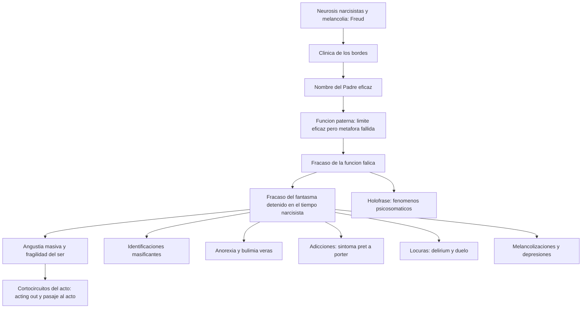
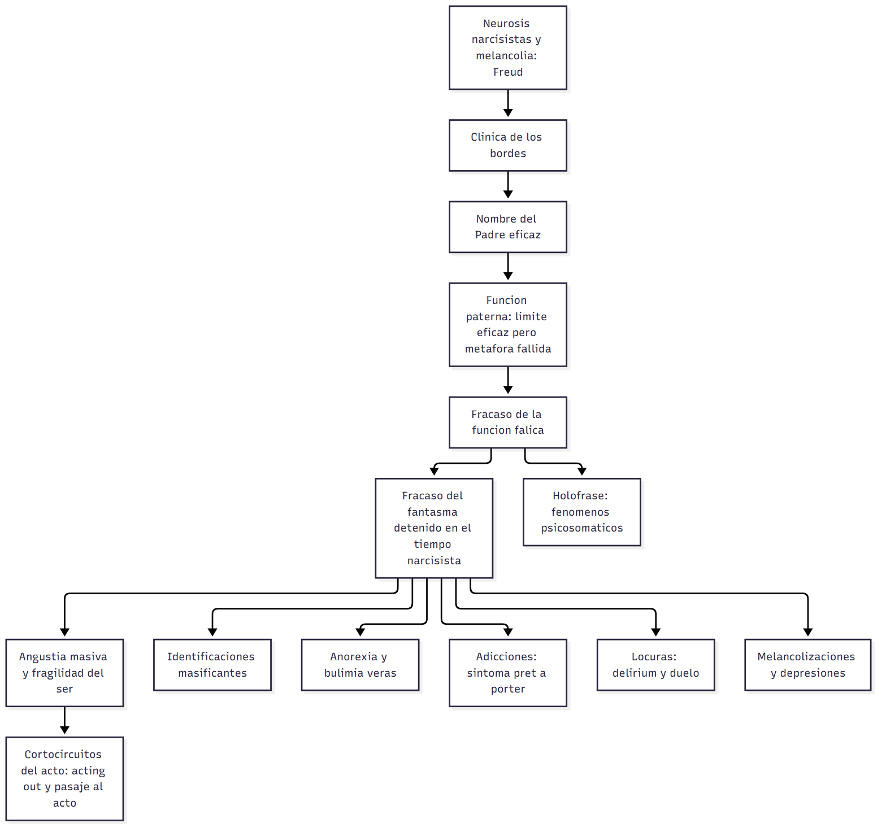

# C19_20 — Clínica de los bordes

> **Fuente:** Belucci, *Introducción al diagnóstico de estructura*, apartados «La clínica de los bordes» y «De la condición de estructura al padecimiento. La urgencia» (T01, pp. 24-45) · Freud, *Duelo y melancolía* (T15, 1917) · Amigo, *Clínica de los fracasos del fantasma*, cap. VII «¿Qué significa comer?» (T16) · Staude, *Un síntoma prêt-à-porter. Las adicciones* (T17) · Belucci, *Clínica psicosomática* (T18) · Fernández, *Algo es posible*, cap. 3 «Locura y psicosis» (T19) · Iunger, *Clínica del pasaje al acto en la neurosis* (T20) · Heinrich, *El juicio del Otro* (T21; complemento) · tus apuntes de las clases 19 (28/9/2026) y 20 (5/10/2026) · **Materia:** Psicoanálisis, 2.º año, Favaloro.
>
> **Cómo se cita:** «p. N» es la marca `## Página N` del texto extraído (T01, T16, T17, T20). T15, T18, T19 y T21 no tienen marcas de página: se citan por tema o apartado. Lo marcado **▸ Complemento** no está en los textos asignados.

> **Idea-fuerza:** la «clínica de los bordes» (o «de los fracasos del fantasma») agrupa presentaciones —anorexias y bulimias, patologías del acto, locuras, fenómenos psicosomáticos, adicciones, ataques de pánico, depresiones— en las que **la eficacia del Nombre-del-Padre se verifica** (no hay forclusión) pero **faltan o fallan los operadores y las respuestas de la neurosis**: la **función fálica** y el **fantasma**. Consecuencias: angustia **masiva**, «fragilidad del ser», identificaciones **masificantes** (narcisistas, holofrásicas), alteraciones del humor y **cortocircuitos del acto**. El antecedente freudiano es la **melancolía** (pérdida e identificación narcisista) y las **neurosis narcisistas**.

## Hilo conductor: cómo se conectan los temas de esta guía

La clase aborda lo que Belucci llama **«clínica de los bordes»**: presentaciones donde el Nombre-del-Padre **es eficaz** (no hay forclusión) pero **fallan la función fálica y el fantasma**. Las cinco preguntas van de la **herencia teórica** a la **clínica** pasando por la **estructura**.

**El antecedente** (pregunta 1) es freudiano: las **neurosis narcisistas** y, sobre todo, **Duelo y melancolía**. Allí Freud muestra que **la pérdida del objeto produce una identificación narcisista** («la sombra del objeto cayó sobre el yo»). Ese es el primer modelo de lo que después se verá en los bordes: cuando el objeto cae, el yo se identifica con él y el sujeto queda sin las respuestas de la neurosis.

**La causa estructural** (pregunta 2) es el **fracaso del fantasma**: detenido en su tiempo narcisista, no logra las tres operaciones (expulsar lo real, hacer marco, representar un objeto), y el sujeto queda con la **angustia masiva** y la **fragilidad del ser**. Esto se articula con lo que pasa con **la función paterna y la función fálica** (pregunta 3): el padre es eficaz como **límite** (interdicción) pero **no logra la metáfora**; falla la **función fálica**, y eso explica la holofrase, la desmesura, la anhedonia y la falta de medida.

De ahí sale la **forma de ser** de estos sujetos (pregunta 4): **narcisismo frágil** (grandiosidad y desvalorización) e **identificaciones masificantes** (narcisista y holofrásica), distintas de las identificaciones parciales de la neurosis. Y todo converge en las **modalidades de presentación** (pregunta 5): **anorexias y bulimias, patologías del acto** (acting out y pasaje al acto), **locuras**, **afecciones psicosomáticas** (holofrase), **adicciones** («síntoma prêt-à-porter»), **ataque de pánico** y **depresiones o melancolizaciones**. Todas son modos de **responder sin fantasma**, con el cuerpo, el acto o la sustancia.

**Para el parcial:** al responder por una presentación (por ejemplo, la psicosomática), reconstruí la cadena **fracaso del fantasma → falla fálica → holofrase → lo que aparece en el cuerpo**. Y distinguí siempre este campo de la **psicosis** (el NP es eficaz) y de la neurosis «común» (falta el fantasma como marco).

**En una sola oración:** en los bordes el Nombre-del-Padre funciona pero el fantasma y la función fálica fallan, y de ahí salen la angustia masiva, las identificaciones masificantes y presentaciones como las adicciones, los trastornos alimentarios, el acto y lo psicosomático.

## 0. Hoja de ruta

1. **Antecedentes freudianos y melancolía:** pérdida e identificación.
2. **Fracaso del fantasma** y sus consecuencias estructurales.
3. **Función paterna y función fálica** en el borde.
4. **Narcisismo e identificaciones.**
5. **Modalidades de presentación:** anorexias/bulimias, patologías del acto, locuras, psicosomáticos, adicciones, pánico, depresiones.

## 🎯 Lo que entra sí o sí

1. **Freud:** categoría de **neurosis narcisistas** (después psicosis; desde 1924 melancolía y manía); **duelo y melancolía** (pérdida de objeto, **identificación narcisista**: «la sombra del objeto cayó sobre el yo», sadismo vuelto contra el yo, ambivalencia); **amencia de Meynert**, *Verwerfung*, «delirium» vs. «Wahn».
2. **Fracaso del fantasma** (Amigo): **tres operaciones** (expulsión de lo real/extracción de *a*, marco, representar un objeto) y **tres tipos de fracaso** (radicales: autismo/psicosis; contingentes: urgencia; **estructurales**: bordes); fantasma **detenido en su tiempo narcisista** (ofrece el cuerpo entero).
3. **Padre y falo:** **eficacia negativa** del Padre (interdicción) pero **función metafórica fallida** (sin salida); **fracaso de la función fálica**: holofrase, anhedonia, desmesura, valor, sexuación, vitalidad, razón y medida.
4. **Narcisismo e identificaciones:** fragilidad del ser, grandiosidad/desvalorización; **identificación narcisista** (masificante) y **holofrásica** frente a las parciales (al rasgo, histérica).
5. **Presentaciones:** **eating disorders** (histéricos vs. *veros*), **patologías del acto** (acting out/pasaje al acto), **locuras** (delirium), **psicosomático** (holofrase, lesión no interpretable, «enfermo psicosomático»), **adicciones** (síntoma prêt-à-porter), **pánico**, **depresiones/melancolizaciones**.

---

## 1. Primera pregunta — Antecedentes freudianos: melancolía, pérdida e identificación

> *¿Cuáles son los antecedentes freudianos de la «clínica de los bordes»? Articule con el problema de la melancolía, poniendo el acento en la relación entre pérdida e identificación.*

### 1.1 Respuesta modelo

Belucci sitúa la **clínica de los bordes** en una discusión que viene de la nosología freudiana: Freud tenía la categoría de **neurosis (luego psiconeurosis) narcisistas**, que comprendía primero las futuras **psicosis** y quedó restringida, en 1924, a la **melancolía y la manía** (T01, pp. 24-25; T13); la **escuela francesa** llegó décadas tarde a este campo por el peso de la hipótesis estructural y la tripartición neurosis-perversión-psicosis; Lacan mismo habló hasta mediados de los '50 de «neurosis de carácter» (el Hombre de los Lobos) y cuestionó los «casos-límite» (T01, p. 25). Los **antecedentes freudianos** son: (a) la **melancolía**, comparada con el **duelo** en *Duelo y melancolía* (1917); (b) la **confusión alucinatoria (amencia de Meynert)**, la *Verwerfung* de 1894 y la distinción de Freud entre *delirium* (neurosis) y *Wahn* (psicosis paranoica), que sirve para las **locuras** (apuntes; T19); (c) *Introducción del narcisismo* (1914) y el **conflicto yo–superyó** de *Neurosis y psicosis* (1924), donde la melancolía es paradigma de las «psiconeurosis narcisistas» (T13); (d) la **identificación** (*Psicología de las masas*, cap. VII): distinción entre identificación parcial (al rasgo, histérica) y **narcisista**; (e) las **neurosis actuales** y el **ataque de angustia** de 1895 (T01, p. 42; → `C14`); y (f) el **duelo patológico** y la «neurosis demoníaca» (T19, vía Gerez).

**Melancolía, pérdida e identificación (T15).** Freud compara melancolía y **duelo**: ambos son reacción a la pérdida de un objeto amado (o de una abstracción: patria, libertad, un ideal), con idéntico talante doloroso, pérdida del interés por el mundo, pérdida de la capacidad de amar e inhibición; **la melancolía agrega una «extraordinaria rebaja del sentimiento yoico»** (autorreproches, autodenigración, delirio de insignificancia, expectativa de castigo): «en el duelo, el mundo se ha hecho pobre y vacío; en la melancolía, eso le ocurre al yo mismo». La diferencia: en el duelo la pérdida es consciente; en la melancolía es **una pérdida de objeto sustraída de la conciencia** («sabe a quién perdió pero no lo que perdió en él»). La clave: los **autorreproches son reproches contra el objeto de amor, que han rebotado sobre el yo**. El proceso: hubo una **elección de objeto** sobre base **narcisista**; ante una afrenta o desengaño la investidura de objeto, poco resistente, **se cancela, pero la libido libre no se desplaza a otro objeto sino que se retira sobre el yo**, donde **establece una identificación del yo con el objeto resignado**: «**la sombra del objeto cayó sobre el yo**»; así **la pérdida del objeto se trueca en una pérdida del yo y el conflicto con la persona amada en una bipartición entre el yo crítico y el yo alterado por identificación**. Es la **identificación narcisista**: la investidura de objeto se resigna (a diferencia de la histérica, en que persiste). A esto se suman la **ambivalencia** (amor refugiado en la identificación; odio que se ensaña con el objeto sustitutivo, **satisfacción sádica** del automartirio) y la regresión a la fase **oral/caníbal** (rechazo de alimentos). Explica también el **suicidio**: el yo solo puede darse muerte si puede tratarse como objeto, dirigiendo contra sí la hostilidad al objeto.

### 1.2 Desarrollo ampliado

#### a) El campo nosológico: de las neurosis narcisistas a la clínica de los bordes (T01, pp. 24-27)

- **Neurosis narcisistas:** categoría freudiana que comprendía primero las **futuras psicosis**, para quedar restringida, en 1924, a la **melancolía y la manía** (T01, pp. 24-25).
- **Retraso francés** (T01, p. 25): los trabajos de la Escuela Francesa están desfasados varias décadas respecto de las Escuelas Inglesa y Americana por el **peso de la hipótesis estructural**; sugerir casos con **eficacia de la Ley paterna** pero sin las instancias y operaciones usuales de la neurosis exponía a la imputación de un «mal diagnóstico».
- **Posición de Lacan** (T01, p. 25): hasta mediados de los '50, «**neurosis de carácter**» (Seminario 1: equivalente de «neurosis narcisista»; el Hombre de los Lobos); desde 1955 («estructuras freudianas») esas referencias desaparecen; pero **no afirmó** categóricamente que la tripartición fuera exhaustiva; **cuestionó los «casos-límite»** y dio a entender que **la melancolía debía pensarse dentro de las psicosis (forclusión del NP)**; entre los Seminarios 7 y 13 discute casos «borderline»; solo en el final de su enseñanza (nudo borromeo) deja de mencionarlos.
- **Recorrido bibliográfico (T01, pp. 25-27):** Maleval, *Locuras histéricas y psicosis disociativas* (1991: especificidad de las locuras frente a las psicosis); Haydée Heinrich, *Borde<R>S de la neurosis* (1993: «borde real de las neurosis»; psicosomáticos, trastornos de la alimentación, adicciones; accidente en el tercer tiempo del Edipo) y *Cuando la neurosis no es de transferencia* (1996: imposibilidad de la transferencia: neurosis narcisistas); **Silvia Amigo**, *Clínica de los fracasos del fantasma* (1995/2005); Rassial, *El sujeto en estado límite* (1999: «forclusión local»); Recalcati, *Clínica del vacío* (2002); Élida Fernández, *Algo es posible* (2005); Muñoz y Hartmann (2011). Consenso: salvo la melancolía (para muchos psicosis), estas problemáticas **no coinciden con ninguna categoría de la tripartición** y se las concibe como «**transestructurales**»; dos obstáculos: la **heterogeneidad clínica** y la dificultad de definir el campo **sin revisar el concepto de estructura** (nudos borromeos, «inclasificables»). **Dificultad de nominación** (T01, p. 27): todas las denominaciones («neurosis narcisistas», «neurosis graves», «neurosis de carácter», «clínica de los bordes», «clínica de los fracasos del fantasma») son insatisfactorias; Belucci lo lee como **sintomático** (como la histeria hace deconsistir el saber médico).
- **Apuntes (clase 19):** «Borderline (primeras descripciones clínicas de lo que hoy se llama trastorno límite de la personalidad): Stern, Kohut, Kernberg, 1971 Winnicott.» «Maleval (en el año que muere Lacan) publica su libro más conocido en el que reconoce un tipo de afección que no es una neurosis ni... que son las “locuras”.» «**Heinrich:** 1993 *Borde<R>s de la neurosis* (recalca la R por lo Real; borde **de la neurosis**, no de estructuras; no hay entremedio entre estructuras; encaja con Amigo teóricamente); 1997 *Cuando la neurosis no es de transferencia*; 2013 *Locura y melancolía*: vuelve a la denominación freudiana **neurosis narcisista**; propone que todas las afecciones del campo (bulimia, adicciones, locuras, psicosomáticas) son en el fondo **posiciones melancólicas**, melancolías con diferentes modos de expresión clínica.»
- **Apuntes (clase 20):** «Neurosis narcisista: locuras, fenómenos psicosomáticos.»

#### b) *Duelo y melancolía* (T15, 1917) en detalle

- **Punto de partida:** tras el sueño como paradigma normal de las perturbaciones narcisistas, la melancolía se aclara comparándola con el duelo, «afecto normal»; Freud confiesa que la melancolía se presenta en múltiples formas clínicas cuya síntesis en una unidad no parece certificada y que algunas parecen más somáticas que psicógenas; renuncia a la validez universal.
- **Duelo:** reacción frente a la pérdida de una persona amada o de una abstracción que haga sus veces; a pesar de las graves desviaciones de la conducta normal **no se lo considera patológico**; se confía en que se lo superará. **Trabajo del duelo:** el **examen de realidad** muestra que el objeto ya no existe y exige quitar toda libido de sus enlaces; hay una renuencia (el hombre no abandona de buen grado una posición libidinal), que puede llegar a un extrañamiento de la realidad y una retención del objeto por vía de **psicosis alucinatoria de deseo**; lo normal es que prevalezca el acatamiento a la realidad, pero la orden **se ejecuta pieza por pieza**, con gran gasto de tiempo y de energía; cada recuerdo y expectativa son clausurados, sobreinvestidos y en ellos se consuma el desasimiento; cumplido el trabajo, el yo vuelve a quedar libre.
- **Melancolía:** rasgos: desazón profundamente dolida, cancelación del interés por el mundo, pérdida de la capacidad de amar, inhibición de toda productividad y **rebaja del sentimiento de sí** (autorreproches y autodenigración, delirio de insignificancia, expectativa de castigo); insomnio, rechazo del alimento, **desfallecimiento de la pulsión que compele a aferrarse a la vida**. El melancólico **no se avergüenza**: hay «una acuciante franqueza que se complace en el desnudamiento de sí mismo»; no hay correspondencia entre la autodenigración y su justificación real. **Contradicción:** por analogía con el duelo deberíamos inferir una pérdida de objeto, pero de sus declaraciones surge **una pérdida en su yo**.
- **La instancia crítica** (T15): «una parte del yo se contrapone a la otra, la aprecia críticamente, la toma por objeto»: es la **instancia de la conciencia moral**; Freud sospecha que puede enfermar ella sola; el cuadro destaca el desagrado **moral** con el propio yo (más que fealdad o inferioridad social).
- **La clave del cuadro:** las quejas más fuertes se ajustan muy poco a su propia persona y con leves modificaciones se ajustan a **otra persona a quien el enfermo ama, ha amado o amaría**; «los autorreproches son **reproches contra un objeto de amor, que desde este han rebotado sobre el yo propio**»; las quejas son **querellas (*Anklagen*)**: el ejemplo de la mujer que conmisera en voz alta al marido por estar atado a una mujer de tan nulas prendas. Los enfermos son «**martirizadores** en grado extremo».
- **Proceso (T15):** hubo una **elección de objeto**; por afrenta real o desengaño sobreviene un sacudimiento de ese vínculo; resultado distinto del normal: la investidura de objeto resultó **poco resistente**, fue cancelada, **la libido libre no se desplazó a otro objeto sino que se retiró sobre el yo**, y allí sirvió para establecer **una identificación del yo con el objeto resignado**. «**La sombra del objeto cayó sobre el yo**, quien, en lo sucesivo, pudo ser juzgado por una instancia particular como un objeto, como el objeto abandonado. De esa manera, la pérdida del objeto hubo de mudarse en una pérdida del yo, y el conflicto entre el yo y la persona amada en una bipartición entre el yo crítico y el yo alterado por identificación.»
- **Condiciones:** **fuerte fijación en el objeto** y a la vez **escasa resistencia de la investidura de objeto**; según **Otto Rank**, la elección de objeto se cumplió sobre una **base narcisista**, de modo que la investidura pueda regresar al narcisismo; la **identificación narcisista** sustituye la investidura de amor, por lo que el vínculo de amor **no debe resignarse** a pesar del conflicto (mecanismo importante de las afecciones narcisistas; Landauer lo encontró en la curación de una esquizofrenia). Es **regresión desde un tipo de elección de objeto al narcisismo originario**. Freud la compara con la identificación histérica: **en la narcisista se resigna la investidura de objeto; en la histérica esta persiste**; la **identificación es la etapa previa a la elección de objeto**, primer modo, ambivalente, en que el yo distingue un objeto: quisiera **incorporárselo por devoración** (fase oral/caníbal): Abraham conecta con la **repulsa de alimentos** en la melancolía grave.
- **Premisas de la melancolía:** (1) pérdida del objeto, (2) **ambivalencia**, (3) **regresión de la libido al yo**; las dos primeras se hallan también en los **reproches obsesivos tras muertes** (sin triunfo maníaco), de modo que **el tercer factor es el eficaz**. La pérdida del objeto de amor es ocasión privilegiada para que salga a luz la ambivalencia. Si el amor se refugia en la identificación narcisista, **el odio se ensaña con el objeto sustitutivo** (insultándolo, denigrándolo, haciéndolo sufrir): **automartirio** gozoso y **satisfacción sádica**, paralelo de la neurosis obsesiva; así logran **desquitarse de los objetos originarios** y martirizar a sus amores por su condición de enfermos, sin mostrar hostilidad directa.
- **Suicidio (T15):** «el yo sólo puede darse muerte si, en virtud del retroceso de la investidura de objeto, puede tratarse a sí mismo como un objeto, si le es permitido dirigir contra sí mismo esa hostilidad que recae sobre un objeto». En el enamoramiento más extremo y en el suicidio, el yo es sojuzgado por el objeto. **Angustia de empobrecimiento:** deriva del erotismo anal.
- **Rasgos e interrogantes:** el insomnio como testimonio de la pertinacia del estado; el «complejo melancólico» se comporta como **herida abierta** que atrae energías de investidura (las «contrainvestiduras» de las neurosis de transferencia) y **vacía al yo**; el alivio vespertino (¿somático?); la **tendencia a volverse del revés en la manía** (la manía como triunfo: el yo venció la pérdida del objeto y queda disponible la contrainvestidura; analogía con la alegría, el júbilo y el triunfo normales y la borrachera alegre); **el duelo normal no desemboca en manía** porque el desasimiento es lento. **Punto de vista tópico** (T15): el trabajo melancólico se juega en el **Icc** («en la melancolía se urde una multitud de batallas parciales por el objeto»: odio y amor), con camino bloqueado a la conciencia; tras la regresión del libido al yo el proceso deviene consciente como conflicto entre una parte del yo y la instancia crítica; lo que la conciencia experimenta no es la pieza esencial. Cada batalla parcial **afloja la fijación desvalorizando y victimando al objeto**; el yo puede «reconocerse como el mejor, superior al objeto». Disposición: «predominio del tipo narcisista de elección de objeto» (no confirmado).
- **Melancolía en las neurosis (T15, T01 p. 42):** **ambivalencia en la neurosis obsesiva** presta al duelo conformación patológica; «depresiones de cuño obsesivo»; **Belucci:** **melancolizaciones** como episodios reversibles en la neurosis (Freud: interpolación episódica de una melancolía en el curso de una neurosis: Manuscrito K, *Nuevas puntualizaciones*; T01, p. 42 n. 110).

#### c) El campo de las locuras: amencia, *delirium* y *Wahn* (apuntes de clase 20; T19; T13)

- **Apuntes (clase 20), Freud:** «No hay desarrollos específicos en el campo de la locura, pero es posible ubicar (a posteriori) elementos que posibilitaron el abordaje... **Caracterización de la confusión alucinatoria aguda: mecanismo más enérgico, la *Verwerfung*** (rechazar en bloque la representación y el monto de afecto, y luego aparece una confusión alucinatoria; imposibilidad de aceptar una pérdida insoportable). La terminología distinta para el delirio en las neurosis (***delirium***) y para las ideas delirantes de las psicosis (***Wahn***). **Introducción del narcisismo** (1914): estadio del espejo. **Identificación**: *Psicología de las masas*, cap. VII. Casos que Freud analizó.»
- **T19:** «Freud usa la expresión *delirium* para referirse a la amencia de Meynert, a la psicosis histérica y a ciertas perturbaciones del Hombre de las Ratas, mientras que usa *Wahn* para las construcciones paranoicas.» Antecedente de las locuras: el **duelo patológico** («Una neurosis demoníaca»: parricidio, añoranza del padre, obediencia con efecto retardado, duelo patológico, ambivalencia, posesión diabólica, culpa y autocastigo; Gerez Ambertín). **Psicosis alucinatoria de deseo** y **estados oniroides** (Freud) entre las descripciones psiquiátricas del «acceso delirante»/«confusión mental» (T19).
- **«Neurosis y psicosis» (T13):** la **melancolía** como paradigma de las afecciones con **conflicto yo–superyó** → «**psiconeurosis narcisistas**»; la fórmula completa: neurosis de transferencia (yo–ello), neurosis narcisista (yo–superyó), psicosis (yo–mundo exterior).

> 🔑 **Punto clave:** antecedentes: **neurosis narcisistas**, **melancolía** (pérdida de objeto → **identificación narcisista**: la sombra del objeto cae sobre el yo; reproches contra el objeto vueltos contra el yo; ambivalencia y sadismo), **amencia/*Verwerfung***, ***delirium* vs. *Wahn***, **identificación**.

---

## 2. Segunda pregunta — El fracaso del fantasma y sus consecuencias estructurales

> *Desarrolle la idea de «fracaso del fantasma» y refiérase a sus consecuencias estructurales.*

### 2.1 Respuesta modelo

**Silvia Amigo** (*Clínica de los fracasos del fantasma*, 1995) plantea que en ciertas **neurosis graves** la elaboración del **fantasma** como **respuesta a la pregunta por el lugar del sujeto en el Otro** («¿Qué soy ahí?») **es fallida**, lo que condiciona fenómenos clínicos distintos de las formaciones metafóricas (síntomas) propias de las neurosis: **actuaciones** y ciertos **trastornos de la alimentación** (T01, p. 26). Para que el fantasma se elabore se requiere: (1) **la posibilidad de la pregunta** (eficacia del NP), (2) que el sujeto **no esté abrumado por el retorno del goce perdido del Otro**, y (3) la **diacronía**, más precisamente las **«dos vueltas» del Edipo** (infancia y reedición adolescente) (T01, p. 32). Tres operaciones deben producirse para que la respuesta sea eficaz (T01, pp. 32-33): **(a) una expulsión de lo real**, a partir de la inscripción del NP (equivalente a la **extracción del objeto *a***; constitución del campo de la Cosa); **(b) la constitución de un marco** simbólico (legal), efecto del establecimiento de la función de **límite**; **(c) la posibilidad de representar imaginariamente un objeto dentro de ese marco**. Amigo distingue **tres situaciones de fracaso** (T01, p. 33): **(i) fracasos radicales**: **autismo y psicosis**, donde la ineficacia absoluta de la operatoria paterna hace que ni la expulsión de lo real ni el trazado de un marco estén garantizados; **(ii) fracasos contingentes**: situaciones en que el sujeto no dispone de la respuesta fantasmática que en otros momentos resulta eficaz (**la clínica de la urgencia en las neurosis**); **(iii) fracasos «estructurales»**, aun habiéndose producido las dos primeras operaciones: el campo que corresponde a la **clínica de los bordes**. En T16 Amigo lo precisa: es el fracaso de la constitución del fantasma «**por detención del fantasma en su tiempo narcisista** (esto es, oferta del cuerpo entero, de su propia desaparición) sin poder avanzar a la parcialización del objeto».

**Consecuencias estructurales** (T01, pp. 32-35): la clave es la distinción entre **goce fálico y significación fálica**: la significación fálica da cuenta de la abertura que supone la inscripción de la castración y del enigma del ser del sujeto (lo lleva a darse una respuesta); **el goce fálico del Otro, que sutura su falta, obtura esa abertura** e impide tanto la formulación del enigma como la respuesta fantasmática. Resultado: una **pendulación** entre **quedar sujeto al goce fálico del Otro**, que tapona su castración y la pregunta, y **quedar expuesto a la puesta en cuestión de la propia existencia sin el soporte del fantasma**, lo que da una **angustia que afecta la dimensión del ser**: de ahí una «**bipolaridad**» (no en la lógica de la psiquiatría contemporánea), una «**fragilidad del ser**» que compromete la dimensión identificatoria, el narcisismo y el estado de ánimo. Además, **el marco de la realidad vacila**: falta de medida frente a lo que acontece, angustia difícil de acotar o **desrealización**; los vínculos con los semejantes quedan bajo amenaza de desestabilización (**respuesta paranoide de huida o ataque**); y hay una tendencia a los **cortocircuitos del acto**.

### 2.2 Desarrollo ampliado

#### a) El fantasma y su fracaso (T01, pp. 32-35; T16; apuntes)

- **Pregunta y respuesta (T01, p. 32):** el cuestionamiento de la existencia del sujeto («¿Qué soy ahí?», *Cuestión preliminar*) no es una condición permanente; hace falta una *Versagung* para que se abra; el **fantasma** «vuelve soportable la puesta en cuestión de su existencia y permite un olvido (nunca completo) de la pregunta». Amigo: la pregunta se articula en el lugar del **Otro**, el fantasma queda **del lado del sujeto**.
- **Función del fantasma estabilizador (T01, p. 33):** el marco fantasmático **soporta el campo de la realidad**; su fracaso puede originar **falta de medida** respecto de lo que acontece (impacto excesivo, angustia difícil de acotar) o dar a la realidad un **carácter extraño o distante**, hasta la **desrealización**. El fantasma sostiene las **figuras del yo y del semejante** («conmutador» de intercambios libidinales); sin él, el otro adquiere un matiz extraño y cambiante, amenazante (**respuesta paranoide**: Bion en la Escuela Inglesa; constitución paranoica del yo en Lacan) (T01, pp. 33-34).
- **Tus apuntes (clase 19), Amigo:** «Para que el sujeto elabore la respuesta del fantasma, el lugar de la pregunta debe estar despejado. Si la pregunta no se pudo recortar correctamente, tampoco podrá crear una respuesta. Sujetos que intentan resolver en situaciones amorosas o en amistades esa carencia originaria. En situaciones de rupturas, a estos sujetos les resulta catastrófico. El fantasma suele funcionar como estabilizador; es el “cuentito que nos contamos para poder dormirnos”, y si el cuento no funciona no podremos dormirnos. El fantasma es el guión y la escena. Si no funciona, el sujeto tendrá una imagen inestable de sí mismo y vínculos inestables y ambivalentes (“tóxicos”).» «**Amigo:** no se dispone del fantasma para responder al deseo del otro y lo real. **Estados de angustia masivos.**»
- **Amigo (T16): el fantasma «fundamental» y la desaparición propia (pp. 13-14):** «Para todo sujeto es vital encontrar dónde alojarse en el campo del Otro» (la metáfora del **hotel**): hay que localizar **qué lugar vacante** hay, es decir **lo que le falta al Otro**; se encuentra normativamente con la pregunta «¿qué me quiere?, ¿qué soy para vos?». **Fase fantasmática fundacional:** el único modo de encontrar una falta en el Otro es **morirnos**: «¿cuántos van a llorar en mi velatorio?»; **el fantasma de la propia desaparición es el primer paso de la creación de un fantasma normal**; luego debe haber un segundo, tercer objeto: **la serie de objetos parcializados**: pasar de ofrecer **la totalidad del cuerpo** a ofrecer **un trozo de sí** a la falta del Otro («la **castración** nunca es de todo o nada, sino perder el pequeño trocito marcado con brillo fálico»); eso es la **estabilización del fantasma fundamental**, producto de una larguísima elaboración (todo el Edipo).
- **Fracaso (T16, pp. 14-17):** la **anorexia vera** se da en el sujeto cuyo **único objeto en juego para movilizar el deseo del Otro es su propia desaparición**; la histérica juega con «montones de recursos» y con el primer objeto; los **bordes de las neurosis** son «un modo típico, particular y específico de fracaso de la constitución del fantasma, por **detención del fantasma en su tiempo narcisista**»; «**la histérica tiene éxito fantasmático**».
- **Tres fracasos en T01 (p. 33)** (ver respuesta modelo): radicales (autismo y psicosis), contingentes (urgencia en la neurosis), estructurales (bordes).
- **Amigo: condiciones (T01, p. 33):** distinción **goce fálico/significación fálica**; la elaboración de la respuesta fantasmática supone «dos vueltas» del Edipo; el «**engaño amoroso**» (*His Majesty the Baby*): en estos casos «una **mal-dición del Otro**, ligada a la **injuria superyoica**», de modo que el narcisismo se constituye a partir de enunciados «que no guardan el debido respeto por la necesaria dimensión del engaño amoroso» (T01, p. 34).

#### b) Consecuencias y rasgos clínicos del campo (T01, pp. 27-28, 33-35)

- **Rasgos clínicos comunes (T01, pp. 27-28):** (1) **relaciones intensas y «locas»** con el otro: oscilación **idealización-dependencia / odio-persecución**; el propio lazo transferencial puede establecerse así; suscitan **rechazo** en quienes los asisten («**caños**» en la jerga hospitalaria), un desafío al **deseo del analista**; (2) **imagen y «sentimiento de sí» inestables**, humor fluctuante: **grandiosidad o infatuación** sobre fondo de **desvalorización**, o fondo **melancólico** sin la cobertura de la infatuación; **angustia masiva**, ligada a la imposibilidad de olvidar la puesta en cuestión del propio ser («a flor de piel»); (3) **riesgo para la vida, la salud o el «bienestar»**: tentativas de suicidio y **desmesura**; búsqueda de «**sentirse vivos**» (cortes, sustancias, existencia «alocada») o **empuje-hacia-la-muerte**; (4) **razón no organiza la existencia**, devenir errático, impulsividad; (5) «**cortocircuitos del acto**» (acting out y pasaje al acto), dificultades de la palabra y del pensamiento, angustia.
- **Fantasma y realidad (T01, p. 33):** «el marco fantasmático soporta también el campo de la realidad y posibilita que esta no sufra distorsiones apreciables».
- **Vínculo con los semejantes (T01, p. 34):** frecuentemente «bajo amenaza de desestabilización, al fallar precisamente el marco que le da estabilidad, así como la función fálica, imprescindible para que el fantasma se sostenga».
- **Urgencia (T01, p. 44):** «urgencia generalizada»: un estado recurrente del que el sujeto entra y sale; el cortocircuito del acto: agresiones a terceros, intentos de suicidio o autolesiones, angustia masiva, estados depresivos o melancolizados, presentaciones «silenciosas» (languidece y se deja morir: melancolía, anorexias veras), excitaciones maníacas (riesgo de un actuar falto de mesura); la intervención apunta a una **«estabilización»**.
- **El «juicio del Otro» (T21):** tabla de Heinrich: bordes: trauma SÍ / juicio del Otro NO / *fort-da*: **falta confianza en el significante**; «no son iguales la posición respecto al *fort-da* en la psicosis y en el borde: en la primera hay **imposibilidad lógica de entrada en el discurso**; en el segundo el *fort-da* se inscribe pero **de manera insuficiente**, funcionando con reservas, con desconfianza»; observables: (1) el **trauma infantil** «no aparecía como reprimido sino como **eternamente presente**»; (2) dificultad en la instauración de la **transferencia** (no llegan interrogados por un síntoma); (3) manifestaciones en términos de **conductas actuadas** (anorexia, bulimia, acting out, adicciones, impulsiones, psicosomáticas). **Caso (T21):** mujer traída a guardia que tomó pastillas, impulsiva con sus hijos; el lapsus; la analista dice «**yo no soy sorda**» (su madre era sorda, «sorda a los requerimientos de su hija»); el domingo (día de la madre) la paciente pregunta si la analista tiene hijos: se abre la pregunta. Un trauma sin articulación significante **no cae bajo la barra de la represión** y «tendrá que retornar de otra manera»; primer movimiento clínico: **pasar del acting a la dicción** (de la «a-dicción» a la dicción); la pregunta de Lacan (Sem. 10): «¿cómo hacer entrar al elefante en el cercado?».

> 🔑 **Punto clave:** fracaso del fantasma = el NP eficaz pero el fantasma **detenido en su tiempo narcisista** (el cuerpo entero como único objeto); consecuencias: **angustia masiva, fragilidad del ser, vacilación del marco de la realidad y de los vínculos, cortocircuitos del acto**.

---

## 3. Tercera pregunta — La función paterna y la función fálica

> *¿Qué sucede en la «clínica de los bordes» con la función paterna y con la función fálica?*

### 3.1 Respuesta modelo

Belucci vuelve a los dos **operadores de la estructura**, el **Padre** y el **falo**, y sostiene que en este campo clínico «puede presuponerse la **eficacia fundacional del Nombre-del-Padre**, con la legalización de la falta y la significación fálica que le son correlativas» (T01, pp. 31-32). **La función paterna** se despliega en dos vertientes (T01, p. 28): la **función del límite** («no»; delimitar el campo de la realidad y el del fantasma; barrera al capricho del Otro, incluso bajo la forma imaginaria de la agresividad) y la **función metafórica** («llevar más allá»: transmitir las insignias paternas, la salida, la **exogamia**). En la clínica de los bordes se constata la **eficacia negativa del Padre** (interdicción, legalización de la negativización del goce) pero **su acción positiva, metafórica, es fallida**: hay impasses «en la temporalidad edípica, especialmente en la articulación entre el **segundo y el tercer tiempo**» (T01, p. 32). Desprovisto de herramientas eficaces, el sujeto queda sometido a una **acción negativa que lo detiene** («la incidencia de la imposibilidad») y lo lleva a **restituir un estado supuestamente feliz** en el reencuentro imposible con el «**paraíso perdido**» (**adicciones**). No es forclusión: **no es psicosis**. (En las psicosis el NP está forcluido y no hay Edipo; aquí hay una falla **del tercer tiempo**: Heinrich, *Borde<R>S*.)

**La función fálica** es un «**operador multifunción**» (T01, pp. 28-31) y **fracasa en todos sus aspectos**, repartidos según el caso: (1) **significante de la falta y del deseo**: inscribe la falta en el Otro como necesaria («grado cero»); su falla produce **holofrase** (fenómenos psicosomáticos) y vuelve problemático **situarse ante el Otro en términos de deseo**: se hace presente el Otro de la demanda o del goce (un goce «atenuado», no el arrasador de la psicosis); (2) **significación fálica**: el campo de la significación queda agujereado, el ser del sujeto enigmático; aquí se obtura ese carácter enigmático y aparecen **significaciones que dan cuenta del ser del sujeto con matiz injurioso** (sin alcanzar la injuria psicótica); (3) «**razón del deseo**» y **equivalencias**: la serie fálica (pene, hijo, propio cuerpo, amor, dinero...); su ineficacia despoja de brillo a los objetos y reduce el objeto del deseo a un **vacío**: **deseo «muerto y mortificante»** (anorexias veras); (4) **medida** («razón» como cociente y como *mesura*): su falla produce **desmesura** (*hybris*: impulsiones, excesos con sustancias, alimentos, partenaires), «imposibilidad comparativa: no quedar en menos, sino **fuera de toda comparación**»; (5) **valor**: devaluación del propio ser, discursividad **melancólica** («desecho»); (6) **posición sexuada**: accidentes en la sexuación («metamorfosis de la pubertad»: eclosión de anorexia, psicosomáticos, adicciones); (7) **vitalización**: desvitalización, anhedonia; la imagen fálica a la que el sujeto se identifica es la que vitaliza (*Selbstgefühl*); (8) regulación de la **relación con el semejante** (sin ella: relación paranoica, tensión destructiva); (9) **entusiasmo** (*agalma*) y **semblante**: falla del entusiasmo (aburrimiento, anhedonia) y de los semblantes. Belucci propone leer esta clínica «a la luz del **fracaso de la función fálica**, como una coordenada ordenadora» (T01, p. 32).

### 3.2 Desarrollo ampliado

- **Padre: dos vertientes (T01, p. 28):** **función del límite** (la función del «no»; barrera al capricho del Otro, incluso bajo la forma imaginaria de la agresividad) y **función metafórica**, que hace posible una **salida** a partir de la **transmisión de las insignias paternas**: «no basta con que el Padre opere en la vertiente de la interdicción, legalizando la negativización del goce. Se requiere también que **oriente y transmita las herramientas** que hagan posible un más allá (del Otro, de quien lo representa primordialmente, la madre, y en última instancia del marco de la familia). Eso es precisamente lo que llamamos **«exogamia»**, y hay que destacar que el término «metáfora» significa en su origen ni más ni menos esto: «**llevar más allá**»». Aquí «se revela el **nudo que enlaza en la estructura al Padre y el falo**, ya que es por medio de la operatoria fálica que se realizará la función metafórica».
- **Eficacia negativa y positiva (T01, p. 32):** «si se constata en estos casos la **eficacia negativa del padre**, que legaliza la interdicción del goce, **su acción positiva es en todos los casos fallida**. Y es justamente en la tensión entre esas dos vertientes que se tornan legibles algunas particularidades clínicas de este campo, como la **incidencia de la imposibilidad en la existencia del sujeto**. Desprovisto de herramientas eficaces, el sujeto queda sometido a una acción negativa que lo detiene y lo mueve a restituir un estado pretendidamente feliz, en el reencuentro (por otra parte imposible) con el «**paraíso perdido**», como se constata en la clínica de las **adicciones**.» Ver T33: «su función estrictamente metafórica es fallida, complicando así la posibilidad de una salida y el armado de una escena propia con la que habitar el mundo» (T01, p. 33).
- **Falo en T01 (pp. 28-31)**, detalle:
  - **Inscripción de la falta:** «grado cero de la eficacia del falo»; **holofrase** (fenómenos psicosomáticos «pero no solo a ellos»): falla del **intervalo**; falla como significante del deseo → «problemático situarse con respecto al Otro en términos de deseo; se hará presente la instancia del Otro de la demanda o del goce, aunque no se trate del goce arrasador que testimonian los sujetos de condición psicótica, sino de un **goce atenuado por cierta eficacia del falo**».
  - **Significación fálica** (p. 29): campo de la significación agujereado, no hay significaciones absolutas, lo que el sujeto es en el deseo del Otro es enigmático; «en la clínica de los bordes nos encontramos frecuentemente con significaciones en las que ese carácter enigmático queda **obturado**. En tanto se presentan como dando cuenta del ser del sujeto, adquieren un **matiz injurioso**, que no alcanza la dimensión de la injuria psicótica».
  - **«Razón del deseo»** (p. 29): Freud: toda pérdida real anterior al complejo de castración (pecho, heces) solo puede significarse a partir del complejo; serie abierta de equivalencias distribuida de modo diferencial en varones y mujeres. Ineficacia → **deseo muerto y mortificante** («en las anorexias veras es particularmente notorio»).
  - **Medida** (pp. 29-30): el falo permite establecer subjetivamente cualquier medida: comparación entre los hombres (el «tener»: poder, saber, inteligencia, bienes, conquistas) y de las mujeres (el «parecer»: moda, seducción; la tercera); nota: son **posiciones subjetivas**, no datos anatómicos («complejo de masculinidad»). **Phrónesis** (Aristóteles, *Ética a Nicómaco*): mesura, justo medio; se opone a la **hybris**; **la locura está emparentada con la hybris**; Freud: **más allá del principio de placer**, Eros liga y atempera la pulsión de muerte, esa ligadura puede fallar y se presentifica «lo no ligado» como exceso. **Apuntes (clase 19):** «Función fálica: inscribe la relación del sujeto a la falta. Permite que el deseo circule. En su falla, habrá una relación problemática con el deseo. La falla de la función fálica nos imposibilita que nos “enganchemos” a la vida y que la disfrutemos: ausencia del disfrute de la vida, **anhedonia**. El falo permite encontrar una medida que, de otra manera, sería desmesurada: no tienen control, prudencia ni mesura sobre sus acciones y decisiones.»
  - **Valor** (p. 30): «valioso es todo aquello cuya pérdida le haría falta al sujeto»; valor de la propia vida y la propia imagen; fracaso: desinterés generalizado, devaluación del propio ser; **melancolía** como forma extrema («desecho sin valor alguno»).
  - **Posición sexuada** (pp. 30-31): accidentes en las «metamorfosis de la pubertad»: eclosión de **anorexia**, **psicosomáticos**, **consumo adictivo** (testimonian la imposibilidad de asumir esa posición); relación **no-toda** de lo femenino al orden fálico (el exceso: desmesura y locura).
  - **Vitalidad** (p. 31): el falo introduce vitalidad contrarrestando la mortificación del lenguaje; **imagen fálica** (la que inviste lo que le hace falta al Otro): confiere valor inaugural, fundamento del *Selbstgefühl*; su desfallecimiento: **empuje-hacia-la-muerte**, apagamiento, **cuerpo-cadáver** (anorexias veras). **Relación con el semejante**: sin falo, el estadio del espejo «se deslizaría al filo mortal»: tensión destructiva.
  - **Entusiasmo y semblante** (p. 31): **agalma** (a/–φ): estructura de «falta recubierta por algo en cuyo valor se cree»; fallas: desinterés, aburrimiento, **anhedonia**; el **semblante** («apariencia que recubre el lugar de la causa») verifica la función fálica y descansa en que el ser del sujeto no esté en cuestión permanentemente (estabilidad de la respuesta fantasmática).
- **Don del falo (T16, pp. 17-18):** estos trastornos aquejan electivamente a **mujeres** porque «la mujer lleva en su cuerpo la marca de la falta fálica»; para todos falta un fragmento de goce, pero las mujeres «carecemos de una **representación física del órgano de localización del goce**»; **la mujer depende más del don del falo** (en la crianza, el desamor del padre es mucho más devastador); «el amor del padre consiste en **acoger al sujeto de la demanda**, y no en responder dando el objeto real imposible de ser dado»; «**el don fálico posibilita la introyección del marco a los objetos de la pulsión**, y al enmarcarlos los dignifica; de no haberlo, se produce **fracaso del fantasma**: el objeto, oral por caso, carecerá de enmarcamiento y de brillo agalmático». Si sobrellevó bien los tiempos del Edipo femenino, una mujer puede tener más libertad que un varón; si no, tiene más chance de quedar adherida al objeto oral como **goce dañino**.
- **Época del «padre humillado» (T16, p. 19; T18):** declive de la imago paterna (Claudel, Lacan 1938), «declive del padre»: dificultad en plantear la **ley del falo** como modo de acceso legal al goce; «querer abolir la muerte como límite a la vida en lo real... situación temiblemente forclusiva»; **discurso del capitalista** y gadgets (T18).
- **Otros apuntes (clase 19, bis):** el «accidente en los tiempos del Edipo» y la «falla en el **tercer tiempo**» (apuntes de clase 20).
- **Fracaso de la función paterna: padres desertores (T19):** (para las locuras) «en mi experiencia siempre encontré estos padres que habían **desertado de su función**, habían caído arrastrando consigo al sujeto»; **forclusión parcial** del significante del deseo del Otro (Nasio, Kristeva, Maleval) (§5c).

> 🔑 **Punto clave:** **Padre eficaz en lo negativo (límite/interdicción), fallido en lo positivo (metáfora/salida; 2.º-3.er tiempo)**; **función fálica fracasada en todas sus facetas**: holofrase, deseo, significación, medida, valor, sexuación, vitalidad, semblante.

---

## 4. Cuarta pregunta — Narcisismo e identificaciones

> *¿Qué particularidades tienen en estos sujetos el narcisismo y las identificaciones?*

### 4.1 Respuesta modelo

La relación de este campo clínico con el **narcisismo** estaba en Freud y fue retomada por los continuadores; el punto decisivo es **qué lugar se le confiere a las alteraciones del narcisismo**: ¿**primarias** (que explican otras) o **efecto** de alteraciones más fundamentales? (T01, p. 34). Hay **momentos de engrandecimiento yoico**, pero Belucci los piensa como **movimientos defensivos ante la «fragilidad del ser»** y como **testimonio del fracaso de la respuesta fantasmática**. Amigo: el «**engaño amoroso**» (*His Majesty the Baby*) vela la cara real del objeto, y aquí hay en cambio una **«mal-dición» del Otro** ligada a la **injuria superyoica**: el narcisismo se constituye desde enunciados que no guardan el debido respeto por esa dimensión del engaño (T01, p. 34). A la **fragilidad narcisista** se suman los **avatares identificatorios**: en las neurosis, la **identificación funciona con modalidad parcial** (**al rasgo**, en la identificación secundaria, o a una **situación**, en la histérica), lo que muestra que **el lugar del objeto se conserva** y hay **diferenciación y distancia** respecto de él: consecuencia de la eficacia del **fantasma** ($◊a: conjunción y disyunción). El yo, «precipitado de identificaciones», **solo adquiere estabilidad como «personaje fantasmático»**, y el otro pivote de su unidad es la **función unificante del ideal**. **Freud, en la melancolía**: el fracaso de la función del fantasma condiciona una identificación «completamente **masificante**», en que **el yo se superpone con el objeto perdido**: **identificación narcisista**, que **delata el fracaso del fantasma** y un funcionamiento particular del ideal que **hace uno entre el yo y el objeto (entre el sujeto y el Otro)**; esta modalidad aparece en distintas situaciones del campo y **Recalcati la emparenta con la estructura de la holofrase** (T01, p. 34). **Alteraciones del humor:** un «fondo afectivo» que en las neurosis clásicas es relativamente estable, aquí fluctúa («bipolares», sin remitirse a una escena), con referencia al **vacío** y la **desvitalización** («cortes para sentirse vivos») (T01, pp. 34-35).

### 4.2 Desarrollo ampliado

- **Tus apuntes (clase 19), identificaciones:** «**Identificaciones parciales:** toma *algo* de los otros: identificación al rasgo, identificación histérica. **Identificación narcisista** (1915, *Duelo y melancolía*): no toma algo del otro, sino que se mimetiza con el otro, se identifica con el objeto perdido, de un modo masivo: “la sombra del objeto cae sobre el yo”; el límite entre el yo y el objeto se borra; el sujeto se asimila al objeto. **Identificación holofrásica (Recalcati):** proviene del concepto lacaniano holofrase; marcas holofrásicas en las que entre el sujeto y el otro se ve como un único bloque; el sujeto busca ser uno con el otro. Las anoréxicas intentan sostener con las madres este tipo de identificación, con el ideal materno de “hija perfecta”.»
- **Freud (T15):** **identificación narcisista vs. histérica:** en la primera se resigna la investidura de objeto; en la segunda esta persiste y exterioriza un efecto circunscripto a ciertas acciones e inervaciones; la identificación como etapa previa a la elección de objeto, primer modo ambivalente de distinguir un objeto (incorporación oral).
- **Fragilidad del ser y narcisismo (T01, pp. 33-34):** «la fragilidad del ser que caracteriza al sujeto en este campo compromete asimismo la dimensión identificatoria, los avatares del narcisismo y las alteraciones del “estado de ánimo”»; **pendulación** entre el goce fálico del Otro y la exposición sin fantasma.
- **Humor (T01, pp. 34-35):** alteraciones del humor que no remiten a una escena: «permiten leer la recurrencia e intensidad con que es puesto en cuestión el propio ser, ante el fracaso de la operatoria fálica y del marco fantasmático»; vacío y desvitalización: **cortes para «sentirse vivos»**.
- **Narcisismo y fantasma (T01, p. 34):** «el yo sólo adquiere su estabilidad como personaje fantasmático. El otro pivote de esa unidad no es otro que la **función unificante del ideal**, que si bien puede petrificar al sujeto es fundamental para que no se actualice todo el tiempo la fragmentación identificatoria.»
- **Narcisismo en las adicciones (T17, pp. 4-5):** «recursos del ego en quienes está menoscabada tanto su impronta narcisista como el sostén fantasmático de sus deseos»; **«máscara yoica»**, «**remedo identificatorio y de lazo social, impostación de un narcisismo fracasado**»; «envoltura formal que no es una formación del inconsciente sino una **formación del yo**».
- **Narcisismo y locura (T19; apuntes de clase 20):** Lacan, *Acerca de la causalidad psíquica* (1946; Hegel; Alcestes; Aimée): la **locura** como «**éxtasis del ser en una identificación ideal**» («fou» de *follis*: soplar, saco, globo: el carácter **inflado** de la imagen especular); «el riesgo de la locura se mide por el atractivo mismo de las identificaciones en las que el hombre compromete a la vez su verdad y su ser»; «desmesura del registro imaginario, malformación del narcisismo que confunde al sujeto con su Ideal»; **Don Quijote**; en las psicosis tóxicas, infatuación del yo, casi manía; «**fisurando**». **Apuntes (clase 20):** «Lacan vincula la locura (siguiendo a Hegel) a una **identificación imaginaria ideal que petrifica el “ser”** del sujeto en ese ideal, lo cual genera una **infatuación del yo** que sostiene la ilusión de libertad... y la pretensión de rectificar el mundo con respecto al ideal que él encarna y rechazar todo aquello que venga a poner en cuestión ese ideal. **Desconocimiento del otro**, pero también de la imposibilidad de ser semblante.» «Para **Hegel** la locura va a ser pensada en relación con el **individualismo moderno**, la búsqueda o pretensión de una autorrealización que desconoce la determinación del Otro social.» «Antigua Grecia: falta de mesura en la propia aspiración; ir contra los dioses y su común medida lleva a la tragedia (*hybris*).» «Modernidad: locura como amenaza al orden social: encierro; proliferación de la psiquiatría.»
- **Tres identificaciones freudianas (T19):** **identificación primaria** (alienación; represión primaria; identificación a lo real del Otro real; «caníbal, previa a toda carga de objeto y exquisitamente viril»; inscribe el falo simbólico; su fracaso: **esquizofrenia y paranoia**); **secundaria** (eficacia de la metáfora paterna: el niño pasa de **ser** el falo a **no serlo**, identificándose al **trazo unario**; el padre como varón de la madre; abre la diferenciación masculino-femenino; **de no operar: melancolía**, el yo queda como objeto; «de ser fetiche a tener un nombre»; duelo por la caída del narcisismo primario); **tercera, «identificación al deseo del Otro o histérica»** (el padre prohíbe el goce del cuerpo de la madre y **legitima los goces posibles**, ofrece «otras pantallas» que permiten establecer el **fantasma**, que «enmarcará y detendrá la metonimia infinita del objeto del deseo» y responde «¿qué quiere el Otro de mí?»; abre la entrada de los otros, del semejante, de lo lúdico; inscribe al menos S₂). **Cuando la tercera identificación no prospera en tiempos fundacionales «tenemos la fertilización de la posible aparición de las locuras»** (T19); con un accidente, la *tyché*, el sujeto «queda caído del lugar de falo de la madre, desnarcisizado y sin otra catectización narcisista de su cuerpo y su yo; deprimido, el encuentro con otro duelo lo arroja a la locura».
- **Narcisismo y anorexia (T16):** la anoréxica «se planta en sostener a todo precio el deseo del Otro faltándole ella misma en su cuerpo cadavérico»; «juega a muerte real el sostén del deseo»; posición del **amo**; «cadaverización».
- **Personalidades «sobreadaptadas» y falso self (T18):** adaptación a la demanda del Otro en detrimento de la circulación del deseo y la vitalización (Winnicott).

> 🔑 **Punto clave:** **fragilidad del ser** con grandiosidad defensiva; identificaciones **masificantes** (narcisista, holofrásica: yo = objeto/Otro) en lugar de **parciales** (al rasgo, histérica); yo sin estabilidad de «personaje fantasmático»; humor inestable y vacío.

---

## 5. Quinta pregunta — Modalidades de presentación

> *Caracterice las principales modalidades de presentación en la «clínica de los bordes»: anorexias y bulimias, «patologías del acto», locuras, afecciones psicosomáticas, adicciones, ataque de pánico, depresiones.*

### 5.1 Respuesta modelo

Belucci enumera las particularidades clínicas del campo (T01, p. 35): **anorexias y bulimias, adicciones, fenómenos psicosomáticos, «ataques de pánico», patologías del acto, locuras, melancolía y, en menor medida, depresión**; son **transestructurales** y se las vincula con la **clínica de los bordes o del fracaso del fantasma**. En síntesis: **(1) anorexias y bulimias** (Amigo): trastornos de la alimentación como **epifenómenos** posibles de cualquier estructura; los **histéricos** son un recurso más del sujeto, «hablan», se historizan y alternan entre pendiente anoréxica (posición de amo) y bulímica (premio consuelo); los **«veros»** son **el único recurso** para poner en falta al Otro: **anorexia vera** (su propia desaparición, cadaverización) y **bulimia vera** (comida clandestina, obscena, sin palabras ni escena; vómito); **(2) patologías del acto** (Iunger, Staude, Belucci): **acting out** (escena que se sostiene: mostración, «transferencia salvaje») y **pasaje al acto** (escena que concluye: aniquilación del sujeto, identificado al objeto *a* como desecho); **(3) locuras** (Fernández, Maleval): fenómeno de desencadenamiento transestructural (**delirium**, «pesadilla en la vigilia»), vacilación del fantasma o forclusión parcial del significante del deseo del Otro; duelo suspendido; recompone el tejido con la palabra del otro; **(4) afecciones psicosomáticas** (Belucci): lesiones en el cuerpo no explicadas por el saber médico ni interpretables, **holofrase**, respuesta a la demanda del Otro, «goce congelado»; **«enfermos psicosomáticos»** (posición sobreadaptada); **(5) adicciones** (Staude): «**síntoma prêt-à-porter**», formación del yo, montaje/máscara yoica, recurso paradójico de estabilización, goce incorporal; **(6) ataque de pánico** (Belucci/Freud): «ataque de angustia» de 1895 (cuerpo que «sale de su silencio»); **(7) depresiones** (Belucci): **melancolizaciones** (episodios reversibles con coordenadas de melancolía, ligados a la imposibilidad del duelo) y **depresiones** propiamente dichas (caída de una instancia ideal, «cobardía moral», sin autodenigración).

### 5.2 Desarrollo ampliado

#### a) Anorexias y bulimias (T16, Amigo)

- **Alimentación y Otro (T16, pp. 2-3):** la alimentación es un hecho **ligado al nacimiento mismo de las relaciones del sujeto con el Otro**: el bebé humano no tiene un reflejo instintivo que le permita comer sin mediación del Otro (a diferencia de respirar); el trastorno alimentario es **un epifenómeno potencial de cualquier estructura clínica** y **de por sí no constituye estructura clínica alguna**; los grandes psicóticos en caquexia (Moyano, Borda): «sería milagroso que comiera normalmente». Freud: cuando algo adquiere nombre es que señala una especificidad.
- **Histeria («infección psíquica», T16, pp. 4-5):** Freud (el internado de señoritas donde una recibe la carta de su novio y las otras reproducen la crisis): capacidad histérica de **imitar la situación del otro**; algunas histéricas toman el *eating disorder* como **eje identificatorio** (no es mala fe: es «estar a la moda»); distinguir cuál «recibe la carta» (responde a algo real) y cuál hace «semblant». **Salem:** las poseídas verdaderas (locura) y el tendal de histéricas que imitaban. **Hipótesis:** hay anorexias y bulimias **veras no psicóticas, no perversas, no histéricas**, y otros casos en que una histérica toma el trastorno como eje identificatorio. **Emmy de N.** (T16, p. 11): conversiones, alucinaciones no psicóticas (serpientes: símbolos fálicos), anoréxica pero no «anoréxica vera», porque rehusarse a comer no era su único recurso. **En la histeria el *eating disorder* «habla»**: puesto en transferencia se significa, se historiza, hace serie; nunca es «repetición vacía».
- **Dos pendientes (T16, pp. 11-12):** frente a un fracaso fálico (amor, hijo, éxito, dinero) sin reactualización del símbolo fálico: **pendiente anoréxica** («prefieren no comer», posición de **amo**) o **pendiente bulímica** («premio consuelo»: «comérsela»/«no comérsela», **esclavo** del goce de comer). **Eating disorder histérico = un recurso más** para poner en jaque al Otro. **Vero = único recurso** («real clínico al que no podemos encasillar en la histeria sin cometer una violencia clínica»). **Ping-pong anorexia/bulimia = histeria** (T16, p. 16); la anorexia vera y la bulimia vera son **estables**.
- **Complejo materno alimentario (T16, pp. 5-8):** la madre alimenta porque el hijo representa el **órgano de goce que le falta** (Freud; no es perversa); «madre *good enough*» = «apenas buena» (Winnicott), **pascaliana**: **apuesta** a que ese «pedacito de carne» sea un sujeto (le da el pecho y le **habla**): **pulsión oral + invocante** (la leche con la palabra: fonemas que escanden el goce; el **fort-da** del pecho: **ritmo**), la **mirada** (pulsión escópica; imago de buena forma anterior al espejo) y el sostén muscular (anal): «da de comer una **intrincación pulsional, nunca una pulsión sola**». **Tánatos** en la pulsión: la pulsión **aislada, no mezclada** («cuando la comida es solo comida, es tanática»); «lo oral que no se historiza, un puro **goce mudo**». Experiencia de satisfacción (*Proyecto*): el pecho separado de la boca, ausencia/presencia.
- **Complejo paterno alimentario (T16, pp. 8-10):** **banquete totémico** (Freud, *Tótem y tabú*): la **ley del padre ingresa por la boca**: incorporar **un límite al goce**; ritual con reglas (qué se dice, qué se come, dónde se sienta cada uno); **la bulimia** es lo más lejano: acto «secreto, furtivo, sin reglas, sin ley, sin palabras, sin escena, sin lazo social» (Staude, «La bulimia: silencio y mirada»). **El banquete de Platón**: se come, se habla, se mira: «la comida normativa» donde «el objeto oral se ha coordinado con la ley del falo»; «**en la anoréxica no comer no es la solución; el verdadero problema es comer sujeto a reglas**».
- **Anorexia vera (T16, pp. 13-15):** único objeto en juego para movilizar el deseo del Otro: **su propia desaparición** (**cadaverización**): llama al deseo del Otro **ofreciendo a la mirada del Otro su cadaverización**; diferencia con el **suicida** (acto relámpago: ha caducado todo llamado al Otro); **juego «a muerte real»** vs. «lúdico» de la histérica; «tozudez»: **la alimentación forzada** (entubar) se parece a la «comida tanática desintrincada»; sostiene el deseo «en una familia no deseante»; posición del **amo** («lucha a muerte por el puro prestigio»: cumple una vocación de muerte; **juega el juego tanático de la madre**); paradoja: pierde la carne que contribuye a su encanto: «un cadáver no suscita la elección erótica».
- **Bulimia vera (T16, pp. 15-16):** ante la falta de brillo fálico de lo que le ofrecen «para que se coma», **«transa» con un goce sin brillo fálico**: **comida clandestina, obscena, sin lazo social, sin palabra**, que no provoca relato posterior; para quitarse el objeto obsceno que «ensució el cuerpo» solo cuenta **vomitar**, con riesgo para la salud y la dignidad.
- **Electividad por las mujeres y época (T16, pp. 17-19):** ver §3.
- **Dispositivo (T16, pp. 19-21):** el dispositivo clásico fue ideado para **neuróticos adultos**; en los fracasos del fantasma el analista «entra» con más eficacia **entre lo imaginario y lo real**: **construir, hipotetizar, armar historias**; «**discurso sin palabras**»; el acto analítico como intento de re-armar, de poner a disposición del sujeto la falta entrando por cualquiera de las tres cuerdas; no es psicosis: «hay modos no psicóticos de estar fuera de la ley»; «el dispositivo clínico debe ser **re-inventado**». Interpretar «jeroglíficamente» a una anoréxica «no le hace ningún efecto».
- **Fantasma y comer:** *Fracasos del fantasma alimentario*: «hay algunos *eating disorder* que son los únicos modos de relacionarse de un modo sostenible con el Otro».

#### b) Patologías del acto: acting out y pasaje al acto (T20, T17, T01, apuntes)

- **Marco (T01, pp. 40-41):** **acto** (precipita como efecto último de un movimiento subjetivo que concierne al saber) vs. **cortocircuitos del acto** (acting out y pasaje al acto), que saltean ese recorrido; «**actuar es arrancar a la angustia su certeza**»; el acto tiene relación privilegiada con la angustia → `C14 §5`. **Urgencia = salto del instante de ver al momento de concluir, salteando el tiempo para comprender** (Lacan, *tiempo lógico*; apuntes de clase 19: instancia de ver / comprender / concluir; «sin la etapa de comprensión, concluimos de manera precipitada»). **Diferencia acto/pasaje (Larsen):** el acto se amarra a un imposible de saber **probado**; el pasaje al acto rechaza probar el saber que no es imposible y deja fuera de juego al Otro. **Acting out:** escena que se sostiene al límite de la articulación significante: «**transferencia salvaje**» → **no interpretarlo**, **sancionar** (extraer los términos significantes). **Continuum** (escena dicha / mostrada / ausente): un acting sin nadie que sancione su dimensión de mensaje puede devenir pasaje al acto; el analista busca **pasar de la escena que se muestra a la escena dicha, del grito al llamado**.
- **Iunger (T20, pp. 1-5):** **«pasar al acto» ≠ «pasaje al acto»**: ambos son **conclusión de una escena**, pero en el pasar al acto hay **efecto de sujeto** (cambio de posición subjetiva); en el pasaje al acto, **aniquilación del sujeto** en un intento fracasado de hacerlo surgir (marca que conmemora ambas). **Acting out:** escena que se sostiene; «el sujeto muestra al Otro el **objeto señuelo** del deseo» (no el objeto causa) a un **Otro que desfallece en su función de lectura**; **mostración**: falla en la cadena significante: «en vez de la articulación metonímica del deseo, hay una mera **función de señal**»; se lo explica como **Verwerfung** pero **no del NP**, sino de «otro punto de la malla significante» (T20, p. 2). **Pasaje al acto:** escena que **concluye**: dos tiempos (gestación: la escena se amplifica; corte súbito). **Parámetros del lado del sujeto:** **identificación progresiva al objeto *a* como desecho/resto**, desaparecen las instancias de clivaje; **nada del Ideal queda del lado del sujeto**. **Del lado del Otro:** progresivamente **absoluto, sin barra**, identificado al **Ideal del yo**, totalización de **saber y goce**: el sujeto es objeto de ese goce. «Pasaje al acto como **única alternativa a quedar atrapado en una inclusión en el Otro** que solo deja el lugar de objeto de su goce.» **Fenómenos imaginarios:** fragmentación corporal (duelo melancolizado), **cuerpo despedazado**; «todo suicidio es un homicidio». En neurosis se va **anunciando**. **Dirección de la cura:** el **furor curandi** y el fantasma de salvar; **«semblante del Otro barrado»** (la preocupación del analista como presencia del Otro barrado); el analizante que llamó un domingo y el analista le dijo «Venga mañana a la hora de su sesión»: se tiró por la ventana. **Operaciones:** (1) **Semblante del Otro barrado**; (2) **mantenimiento de la transferencia** (continuidad entre la escena del análisis y la de la vida; el analista sostiene activamente la transferencia); (3) **poner en juego el objeto *a* desde el costado del analista** (mirada y voz: cara a cara, llamar por teléfono: **clivar al sujeto del objeto-desecho**; ofrecer la unificación corporal del analista frente a la fragmentación); (4) la **palabra** como corte simbólico apenas haya condiciones; (5) **presencia del deseo** del sujeto (barrera al goce); (6) **trabajo de duelo** (melancolizado; «sabe a quién perdió pero no qué perdió en él»). **No hay que esperar la configuración completa de la escena**; **permitir un cierto despliegue** (un corte prematuro impide el pasaje) y «el acto del analista tiene que cortar la escena» para que, si se concluye, sea un **pasar al acto**.
- **Staude (T17, pp. 1-3):** matriz de Lacan (Seminario 10: **inhibición, síntoma, angustia** × dificultad/impedimento/embarazo; movimiento/emoción/turbación; pasaje al acto/acting-out): de la inhibición se llega al acto sin pasar por el síntoma: «**fracaso del síntoma**»; **embarazo y turbación** cerca del «desbarrancamiento del pasaje al acto»; «el síntoma necesita de la transferencia para ser interpretado, pero en principio no necesita de ustedes como el acting-out»; el acting-out es «un esbozo de transferencia, **la transferencia salvaje**» (Sem. 10, 23/1/63).
- **Apuntes (clase 19):** «**Acting out:** se “actúa” aquello que no se puede recordar... “out” = fuera de la palabra (a Lacan le gustó esta interpretación). Se da a un otro en el que el sujeto muestra algo que no puede decir, y convoca al otro que interprete. **Pasaje al acto:** caída de la escena. Escena cae y sujeto cae. El “cachetazo” que nos desarma. El acting out deja de tener utilidad. Acting no leído puede desembocar en pasaje al acto: caso “la joven homosexual” de Freud.» «**La angustia:** no es la angustia localizada y anticipatoria, sino de masividad muy distinta, amenaza a la propia existencia, a la continuidad del yo. La vía más habitual no es la palabra sino el actuar, el acto.»
- **T09 (clase IX):** *niederkommen lassen*; acting out «se muestra» orientado hacia el Otro → `C14`.

#### c) Locuras (T19, T01, apuntes)

- **Definición (T19):** «**mientras la locura es un fenómeno, la psicosis es una estructura**»; «cualquier estructura puede desencadenarse»; la locura = **fenómeno de desencadenamiento** que puede afectar cualquier estructura, con causas distintas por estructura; «**la locura transcurre dentro de los fenómenos de sentido y la psicosis dentro de los fenómenos de lenguaje**»; ambos deliran y alucinan; el desencadenante en la locura se relaciona con **padecimientos y duelos** que el sujeto cursaba; en la psicosis hay un **corte** que lo deja perplejo. Las consecuencias de tratar neuróticos como psicóticos y psicóticos como neuróticos (deserción; «análisis de la forclusión del NP» → perplejidad insoportable, cascada, melancolía, pasaje al acto).
- **Hipótesis sobre la locura en las neurosis (T19):** (1) **forclusión parcial** de un significante que no es el NP (Kristeva, Nasio; «significante del deseo del Otro»; **castración «acontecial, local y múltiple»**, *tyché*/*automaton*; «realidades constituidas por forclusión coexisten con realidades producidas por represión»; Freud: «una psicosis de defensa interrumpe episódicamente una neurosis»); (2) **surgimiento de significantes reprimidos escasamente enmascarados por la censura**: *delirium* («pesadilla en la vigilia», **vacilación del fantasma**; Maleval): **delirium** continúa los fantasmas previos, **no es tentativa de curación**, permanece rodeado de goce fálico, **sin neologismos pétreos ni certeza incuestionable**, sin impulso a ser Mujer ni muerte del sujeto, en el delirio psicótico: neologismos, certeza, impulso a ser La Mujer. Ambas coinciden: el significante del **deseo del Otro**. Fernández critica a Maleval (¿cómo retorna lo reprimido originario?) y se inclina por la forclusión parcial (con Gerez: coexisten forclusión y represión, forclusión sobre un significante reprimido); **Rabinovitch** (*Encerrados afuera*): la preclusión del NP vs. preclusión de otros significantes (que «pueden volver loco a un sujeto»). **Forclusión del NP:** **no alumbramiento de lo simbólico en la afirmación primordial (*Bejahung*)**: «se borra la diferencia S₁–S₂... el sujeto deviene **objeto de la alucinación**». Resumen: forclusión (a) de un significante fundamental, o (b) **parcial**, del significante del deseo del Otro.
- **Hipótesis de Fernández (T19):** (a) el desencadenamiento opera por **un llamado ante el cual falta un significante** con qué responder (el del deseo del Otro); (b) falla de la inscripción edípica que normativiza el deseo; (c) en su clínica ese significante se relaciona con **la caída de la potencia fálica del padre**; (d) **duelo** que se superpone con otra pérdida; (e) un saber insoportable, imposible de decir, mostrado por **actings o pasajes al acto**, junto con **alucinaciones y delirios**; (f) cuando un encuentro con otro (analista) da trama a ese decir, **el sujeto recupera los lazos de su neurosis** y reemplaza el delirio por una construcción de lógica neurótica. **Los locos** «no encuentran objeto de su deseo ni lugar metonímico... e inventan un delirio o escuchan voces que tapen la mudez obstinada del Otro»; el delirio ubicado «en el lugar vacío del fantasma que no había podido construirse».
- **Delirio psicótico: cuatro pasos de Maleval (T19):** (1) **deslocalización del goce** (inquietud, perplejidad, angustia extrema, sin palabras); (2) **tentativa de significantización del goce del Otro** (interpretación paranoide; localiza perseguidores); (3) **identificación del goce del Otro** (sistematiza el delirio; respuestas a los perseguidores: margen de intervención del analista); (4) **consentimiento al goce del Otro** (acuerdo con la realidad construida; saber esencial; megalomanía; comunión con Dios: Schreber). **Pocas soluciones** frente al Otro gozador: **hacerse desecho, hacerse su Mujer, suprimirlo (ataque homicida) o ponerse a su servicio** (testimonio de las revelaciones). Punto de viraje: un momento de **muerte del sujeto** (Schreber: «asesinato de almas»; transformación de los ideales: Reich, Artaud); **sacrificio** y mutación de ideales. → conecta con `C17_18`.
- **Los dos casos clínicos (T19):** **Ana** (locura en una neurosis histérica): «cara de rata», se mira al espejo, ideas de burla, quiere tirarse por la ventana; cinco cirugías, cinco abortos; el espejo en la pared; la analista la mira «juntas»; sus ratas = el tío «tonto» que decía que de noche le caminaban ratas por la cara; confusión «él»/«ella»; el padre humillado; el espejo con Chaplin («una cosa es que se burlen de uno y otra proponerse ser payasa»); «quiero ser otra»: **duelo por la caída del narcisismo, construir otra cara**; «salvaba a su tío y a su padre de las burlas, se anteponía como escudo»; «consistía en ser la falla de ellos y se mataba, los mataba». **Mario** (20 años; «la envidia y el odio se juntan»; guardaespaldas de la madre; basura en el ojo; **La Mujer destinada a su padre, «mi padre es Dios»**): **diagnóstico diferencial** (¿brote psicótico o locura?): empuje a La Mujer = psicosis; el hospital de día lo juzgó no psicótico; la «**basura en el ojo**» = objeto resto (mirada) en la transferencia especular; **mirada y voz** como objetos reales ofrecidos al analista (Kenzaburo Oé: «el psicótico lleva su objeto *a* en el bolsillo»); forclusión del Otro materno vs. **defección del padre** («ausencia de mirada de la madre cosifica, mata; la defección del padre hace que se lo busque, invoque, delire, invente»). **No confundir locura con psicosis: consecuencias terapéuticas «gravísimas».**
- **Apuntes (clase 20), locuras:** «**Post-Lacan:** retoman de Freud la diferencia entre delirio de neurosis y de psicosis. **Diferencia entre delirio en el campo de la locura o de la psicosis:** significación (remite a sí misma), **orden temporal** (en las locuras delirantes hay un juego de escenas que se tergiversan), **la imagen fálica**. **Falla en el tercer tiempo.**» «El operador NP posibilita la extracción del objeto *a* (sujeto como objeto de goce del otro)... genera respuesta fantasmática.» «Locura ≠ psicosis (Lacan).»

#### d) Afecciones psicosomáticas (T18, apuntes de clase 20)

- **Tres cuerpos (T18):** **síntoma conversivo** (organismo intacto; «soldadura entre cuerpo y sentido»; **metáfora de lo reprimido**; interpretable), **enfermedad orgánica** (etiología que la medicina explica) y **fenómeno psicosomático** (**lesiones** no explicadas por el saber médico y **fuera de la estructura metafórica**: «no responde a las leyes del inconsciente», **no interpretable**). **Transestructural.** **Reflejo condicionado** (Pavlov: una función biológica bajo la égida de la demanda del Otro, del experimentador) y **holofrase** (palabra con valor de frase: «¡Fuego!»: no se puede analizar ni interrogar, solo responder; «**no es la estructura del significante sino un signo**»); «respuesta psicosomática» **a la demanda, no a una pregunta**; **borramiento del intervalo S₁–S₂**: no hay formaciones del inconsciente ni se puede interrogar el deseo del Otro → **no es posible la respuesta fantasmática**. **Impasse de la función fálica** (pubertad: **psoriasis**); «**goce congelado**» (Lacan, *Conferencia en Ginebra*, 1975); *Stauung*. **Heinrich:** **afánisis** (Jones; Sem. 11): **efecto-afánisis** (desaparición del sujeto bajo el significante) vs. **función-afánisis** (poner en juego esa desaparición para interrogar el deseo del Otro: imposible aquí); **dos tiempos**: se altera la función biológica (secreción de ácidos gástricos) y luego se lesiona lo real del tejido (úlcera). **Stress** (legitimidad que Lacan le reconoce): presión constante de una demanda no interrogable. **«Enfermos psicosomáticos»** (Lacan) vs. «fenómenos»: **modalidad estable de respuesta**, no solo accidental (crisis, duelos, pubertad, finales de análisis).
- **Época (T18):** **discurso del capitalista** (Lacan, 1972): mutación del discurso del Amo (el sujeto dividido en el lugar dominante; se dirige a la tecnociencia; produce gadgets; la verdad: el Amo oscuro y acéfalo); **excluye la falta/imposibilidad** («Impossible is nothing»): «pseudodiscurso» que lleva a la segregación; correlato del **declive del padre**; en los psicosomáticos: **sujeción a una demanda feroz** (superyó que no representa la Ley), **stress** y **personalidades «sobreadaptadas»**: infarto, ACV, úlcera; sometimiento a la indicación médica; falso self (Winnicott).
- **Clínica (T18):** accidentes psicosomáticos en una neurosis: **no interrogar el fenómeno** sino **poner en marcha la cadena significante** (Szapiro: la psoriasis de una paciente cedió al leer el término holofrásico «**loca**» del discurso familiar «hecho carne»); tesis de Belucci: **retorno de lo desmentido**: la paciente con afecciones de la piel, cada vez que había una **posición renegatoria del padre** (despótico, «psicopático»); los **obsesivos** (stress; el cuerpo hace de límite); **psicosis**: la lesión y las operaciones en lo real (tatuajes, piercings, mutilaciones) como barrera al goce del Otro (cautela). **Enfermos psicosomáticos:** neurosis sin plenos operadores; **falla fálica**, fracaso del fantasma, narcisismo (devaluación con matiz injurioso, compensada maníacamente; adhesión rígida a ideales); **sobreadaptación**; **pregunta no articulable**; **impasse transferencial**; **no «sintomatizar la lesión»**: **construcción** (**localización de circunstancias** = análoga a la «sanción» del acting out; **modalización**: de «siempre/todo» a «a veces/algo») y **acto** (corte; «así no»), induciendo la entrada del padre (Szapiro); el acto «antecede la articulación significante» y **funda el intervalo**.
- **Apuntes (clase 20):** «**Síntoma conversivo:** no aparecen lesiones en el organismo, sí en el cuerpo. **Psicosomático:** lesiones en el cuerpo, no explicados por el saber médico ni por el retorno de lo reprimido (no interpretables). Lacan los vincula con las **holofrases**: algo a lo que hay que responder, y el FP es una respuesta del cuerpo. La palabra que se anuda al FP se interpreta como **signo** (no significante). Se pueden presentar en crisis, pérdidas; estas respuestas se producen **cuando fracasan otras respuestas**.»

#### e) Adicciones (T17, Staude)

- **El síntoma en psicoanálisis (T17, pp. 1-2):** «los síntomas hablan»; verdad que **vela y revela**; **solución de compromiso** entre defensa y satisfacción (goce); recurso y atolladero; permite la **transferencia**. Condiciones del síntoma: (1) constituirse como recurso, (2) poder transferirse, (3) la **dirección de la cura**. **Contexto:** Otro social que ejerce presión no por **prohibición del goce** (era victoriana) sino por la **demanda de goce**: sobre estructuras con **función paterna no totalmente fracasada pero no terminada de constituirse**: comportamientos «**locos**» no psicóticos (actings, pasajes al acto, psicosomáticos, pánico, adicciones): «**patologías de borde** por la imposibilidad de constituir un borde a un goce que amenaza con una invasión devastadora»; factor cuantitativo: labilidad del posicionamiento subjetivo + presión del empuje al goce.
- **Fracaso del síntoma (T17, pp. 2-3):** equilibrio inestable; **matriz del Seminario 10**; patologías del acto («agieren») siempre presentes en las adicciones (acto evitado/inhibido, acting-out, pasaje al acto).
- **«Síntoma prêt-à-porter» (T17, pp. 3-6):** dificultad: **no se hacen representar por la palabra** («la palabra siempre puede mentir, la droga no»); buscan respuestas **perentorias**, **antes de saber las preguntas** («no sé lo que quiero, pero lo quiero ya»), o la usan para no saberlo; la droga como **recurso de autoconservación paradójico** y **búsqueda de un cuerpo distinto**; «**recursos del ego** en quienes está menoscabada tanto su impronta narcisista como el sostén fantasmático de sus deseos»; **«envoltura formal»**: «formación del yo» y no del inconsciente; **«pseudo-síntoma»**: **sin historia significante**, no entramado de marcas de los deseos; **solución ya hecha**, ofrecida por el entorno, utilizada por distintas estructuras: «**tapa-agujeros** siempre disponible» (Burroughs: «NADA OCURRE JAMÁS en el mundo de la droga»): **no hay relato**; **no es operativo interpretar**: tomarlo como indicador (cuándo, ante qué, entre quiénes) o signo de salidas extremas («lo único que quería era no pensar»). **Montaje:** la droga, su adquisición, el tráfico, la ceremonia, los cómplices: **«nunca hay un adicto aislado»**; **«dar forma» a un ego** que intenta paliar una amenaza insoportable; **según qué amenaza**: bordeando episodios psicóticos, para evitar que una estructura se desanude (**estabilización**); o para **construir una máscara yoica**, un articulado imaginario que palia angustia, dolor o inhibiciones y oculta síntomas (**blasón, contraseña** de un lazo social inestable). **Goce:** medio de estabilización y a la vez **medio de goce**; **autoerótico**, **no fálico**, sin zona erógena, la droga **no es objeto pulsional**: «**goce incorporal**» con el cuerpo como escenario y laboratorio; «remedo pulsional, remedo identificatorio y de lazo social, impostación de un narcisismo fracasado».
- **Los montajistas (T17, pp. 6-7):** si el acting out es **el arte de poner en escena una queja**, el análisis intenta «**el arte de producir una necesidad de discurso**» (Lacan, *…o peor*); reubicar lo síntomatico que esconde o **construirlo**; **desmontar** el montaje (la pulsión, el fantasma, los soportes yoicos y el lazo social también son montajes); **la ruptura de los adictos con el goce fálico** intenta una modalidad diferente de goce: «**salto a la infinitud**», «no hay barreras»: un sujeto libre de toda amarra al Otro; conmueve las fijezas fantasmáticas sin angustia, lleva a situaciones de «brote psicótico» o «ataque histérico» y confiere el estatuto de «loquito», sin llevar a la psicosis (incluso **defendiéndose de ella**); cuando el montaje fracasa se estructura otro (**montajes terapéuticos**); **nuevo espacio imaginario** donde pueda desarrollarse la dimensión del síntoma, no solo fortificación del yo; el analista organiza **bordes que circunscriban objetos**; **«el montaje cinematográfico»**: corte y ensamble de escenas.
- **T01 (p. 32):** adicciones y el «paraíso perdido».

#### f) Ataque de pánico y depresiones (T01, pp. 41-44)

- **Ataque de pánico (T01, pp. 41-42):** «**ataque de angustia**» de Freud (1895): el cuerpo sale de su silencio con **agitación respiratoria, aceleración cardíaca, sudoración, temblores, oleadas de calor, perturbaciones digestivas, parestesias**; el registro subjetivo del afecto **puede faltar** pero la angustia es legible en sus signos corporales; idea de **aniquilación de la vida**; consultan por **sospecha de infarto**; descartado éste y «cuando no reciben un consejo amigable o alguna benzodiacepina», son derivados al «psicopatólogo» (no tienen «nada» orgánico). → `C14 §5` (T06).
- **Violencia (T01, p. 42):** no consiste en un episodio aislado; persiste y es soportada; referir el **masoquismo** (la posición del psicoanálisis se aleja de otros discursos).
- **Melancolizaciones (T01, pp. 42-43):** «episodios en los que el sujeto, **en la neurosis**, cae en un estado que reviste las coordenadas clínicas de la melancolía, generalmente atenuadas y, lo que es aún más importante, de modo **reversible**»; escasa literatura (Freud: Manuscrito K y *Nuevas puntualizaciones*); se conjetura que se producen en momentos de **vacilación o suspensión del fantasma**, relación con una **pérdida que entraña la imposibilidad de un duelo**; pueden anudarse al carácter y constituir **uno de los mayores obstáculos al análisis** (retomar el **superyó**).
- **Depresiones (T01, p. 43):** se deslindan de las melancolizaciones y más aún de la melancolía vera: faltan en ellas la **autodenigración** (entre el sadismo del superyó y el masoquismo yoico); están determinadas «por la **caída de alguna instancia ideal**»: **abatimiento y «devaluación yoica»**: Lacan: «**cobardía moral**»; marca de la época: **declive de los ideales de la Modernidad**; casi no hay bibliografía sobre la diferencia melancolía/depresión (Kristeva, *Sol negro*).
- **Locura/melancolía en Heinrich (apuntes):** todas son **posiciones melancólicas**; **ejes de la melancolía (apuntes de clase 19):** **eje 1: rebaja del sentimiento de sí** (autoestima: «sentimiento de tener un valor para el otro»; un umbral que no se puede bajar; en otros hay una rebaja latente: «**casos en donde nunca sintieron el haber ocupado un lugar en la falta del otro**»: niños no deseados); **eje 2: extrema ferocidad/crueldad del superyó** (frases superyoicas). «**Posición subjetiva donde el sujeto considera no tener valor para el otro, y se considera indigno.**»

> 🔑 **Punto clave:** cada presentación es un modo de responder a **falla del fantasma y del falo**: **eating disorder vero** (único recurso: desaparición/obscenidad), **actos** (sin tiempo de comprender), **locuras** (delirium y duelo), **psicosomático** (holofrase, lesión no interpretable), **adicciones** (prêt-à-porter: formación del yo), **pánico** (angustia masiva con cuerpo), **melancolizaciones/depresiones** (pérdida sin duelo; caída del ideal).

---

## Tabla integradora

| Presentación | Qué hay | Lógica | Dirección posible |
|---|---|---|---|
| **Anorexia vera** | Cadaverización: único objeto = su desaparición | Fracaso del fantasma: tiempo narcisista; amo; juego a muerte real | Entrar entre imaginario y real; construir; no solo interpretar |
| **Bulimia vera** | Comida obscena, clandestina, vómito | «Transa» con un goce sin brillo fálico; sin palabra ni escena | Idem |
| **Eating disorder histérico** | Un recurso más; «habla»; ping-pong anorexia/bulimia | Fantasma constituido; eje identificatorio | Dispositivo clásico |
| **Acting out** | Escena que se muestra al Otro | Transferencia salvaje; mostración; **no interpretar, sancionar** | De la escena mostrada a la dicha |
| **Pasaje al acto** | Escena que concluye; sujeto = desecho | Aniquilación del sujeto; Otro absoluto | Semblante del Otro barrado; mantener transferencia; mirada/voz |
| **Locuras** | Delirium, pesadilla en la vigilia | Fenómeno (no estructura); duelo; forclusión parcial o vacilación del fantasma | Dar trama al decir; diagnóstico diferencial |
| **Psicosomático** | Lesión no interpretable | Holofrase; demanda sin pregunta; goce congelado | Construcción (localizar circunstancias, modalizar); acto («así no») |
| **Adicciones** | Montaje prêt-à-porter | Formación del yo; goce incorporal; sin historia | Producir necesidad de discurso; desmontar; bordes |
| **Pánico** | Angustia masiva con signos corporales | Ataque de angustia (1895) | Localizar circunstancias |
| **Melancolizaciones/depresiones** | Pérdida sin duelo / caída de ideal | Identificación narcisista; superyó cruel; cobardía moral | Trabajo de duelo; superyó |

| | **Identificación parcial** | **Identificación narcisista** | **Identificación holofrásica** |
|---|---|---|---|
| Qué toma | *Algo* del otro (rasgo, situación) | Todo: se mimetiza con el objeto perdido | Sujeto y otro = un único bloque |
| Objeto | Se conserva con distancia | Se borra el límite yo-objeto | Búsqueda de ser uno con el otro |
| Dónde | Neurosis (histérica, secundaria) | Melancolía | Anorexias (hija perfecta) |

## Diagrama

## 🚩 Errores típicos y trampas de examen

- **Decir que la clínica de los bordes es «psicosis»**: el NP es **eficaz**; no hay forclusión; fracasa la función **fálica** y el **fantasma**.
- **Confundir «borde de las neurosis» (Heinrich) con una estructura intermedia**: «no hay entremedio entre estructuras»; transestructural.
- **Decir que todo trastorno alimentario es histérico (o anorexia vera)**: es epifenómeno de cualquier estructura; vero = único recurso.
- **Confundir acting out con pasaje al acto**: escena que se sostiene (muestra) vs. escena que concluye (aniquilación). **No se interpreta el acting out**: se sanciona.
- **Confundir «pasar al acto» con «pasaje al acto»** (Iunger): el primero con efecto de sujeto.
- **Interpretar el síntoma psicosomático** como un síntoma conversivo: es **holofrase**, **no interpretable**.
- **Confundir locura y psicosis**: fenómeno vs. estructura; sentido vs. lenguaje.
- **Tratar la adicción solo como «vicio» o solo como «síntoma»**: es **«síntoma prêt-à-porter»**, formación del yo, sin historia significante.
- **Confundir melancolización con melancolía vera y con depresión**: reversible y atenuada / psicosis (para muchos) / caída del ideal.
- **Olvidar que la identificación narcisista es de la melancolía** (resigna la investidura de objeto) y no la histérica.

## Articulación con el resto de la materia

| Va hacia / viene de | Cómo se conecta |
|---|---|
| `C14_SintomaFantasmaYAngustia_Guia.md` | Fantasma, angustia automática/señal, acting out y pasaje al acto, ataque de angustia |
| `C17_18_PsicosisYForclusionDelNombreDelPadre_Guia.md` | Forclusión vs. fracaso del fantasma; locura vs. psicosis |
| `C15_FobiaHisteriaYNeurosisObsesiva_Guia.md` | Histeria («eating disorder histérico»); obsesión (stress, duelo) |
| `C13_EstructuraYTiemposDeLaNeurosis_Guia.md` | *Versagung*; urgencia |
| `C07_PulsionEdipoYMetaforaPaternaEnLacan_Guia.md` | Tiempos del Edipo; falo |
| `C09_TeoriaDelYoEnFreudIdentificacion_Guia.md` | Identificación, narcisismo |
| `C21_23_DireccionDeLaCuraIntervencionesYFinDeAnalisis_Guia.md` | Maniobras con el acting y el pasaje al acto; deseo del analista |

## Glosario

| Término | Definición breve |
|---|---|
| **Neurosis narcisistas** | Categoría freudiana, luego restringida a melancolía y manía (T01, pp. 24-25) |
| **Identificación narcisista** | El yo se superpone al objeto perdido: «la sombra del objeto cayó sobre el yo» (T15) |
| **Fracaso del fantasma** | Fantasma detenido en su tiempo narcisista; falla de expulsión de lo real, marco y objeto (T01, p. 33; T16) |
| **Goce fálico del Otro vs. significación fálica** | Obtura vs. abre el enigma (T01, p. 33) |
| **Fragilidad del ser** | Compromiso identificatorio, narcisista y del humor (T01, p. 33) |
| **Holofrase** | Significantes soldados; base del fenómeno psicosomático (T01, p. 29; T18) |
| **Anorexia/bulimia veras** | Único recurso para poner en falta al Otro (T16) |
| **Acting out** | Mostración al Otro; «transferencia salvaje» (T20, p. 1; T09) |
| **Pasaje al acto** | Conclusión de la escena; aniquilación del sujeto identificado al objeto-desecho (T20, p. 1-2) |
| **Pasar al acto** | Conclusión con efecto de sujeto (T20, p. 1) |
| **Delirium** | Delirio de neurosis: pesadilla en la vigilia (T19) |
| **Síntoma prêt-à-porter** | Adicción como formación del yo (T17) |
| **Goce congelado** | Goce concentrado en un órgano (T18) |
| **Enfermo psicosomático** | Modalidad estable de respuesta; sobreadaptación (T18) |
| **Melancolización** | Episodio reversible con coordenadas melancólicas en la neurosis (T01, p. 42) |
| **Cobardía moral** | Lacan: la depresión por caída de un ideal (T01, p. 43) |
| **Discurso del capitalista** | Mutación del discurso del Amo que excluye la falta (T18) |
| **Tiempo lógico** | Instante de ver, tiempo de comprender, momento de concluir (T01, p. 35; apuntes) |

## Autoevaluación (sin mirar la guía)

1. ¿Cuáles son los antecedentes freudianos de la clínica de los bordes?
2. Explicá la relación entre pérdida e identificación en la melancolía; ¿qué significa «la sombra del objeto cayó sobre el yo»?
3. ¿Qué es el fracaso del fantasma? Nombrá las tres operaciones de Amigo y los tres tipos de fracaso.
4. ¿Qué pasa con la función paterna y con la función fálica en el borde? Detallá al menos cinco aspectos del falo.
5. Diferenciá identificación parcial, narcisista y holofrásica.
6. Diferenciá eating disorder histérico y vero; anorexia vera y bulimia vera.
7. Diferenciá acting out, pasaje al acto y «pasar al acto»; ¿cuáles son las operaciones de la cura frente al pasaje al acto?
8. ¿Qué es la locura (vs. psicosis)? ¿Qué es el delirium y cuáles son las hipótesis sobre su causa?
9. Definí el fenómeno psicosomático y explicá la holofrase; ¿qué hace el analista?
10. ¿En qué sentido la adicción es un «síntoma prêt-à-porter»?
11. Diferenciá melancolización, melancolía y depresión; ¿cómo se presenta el ataque de pánico?
