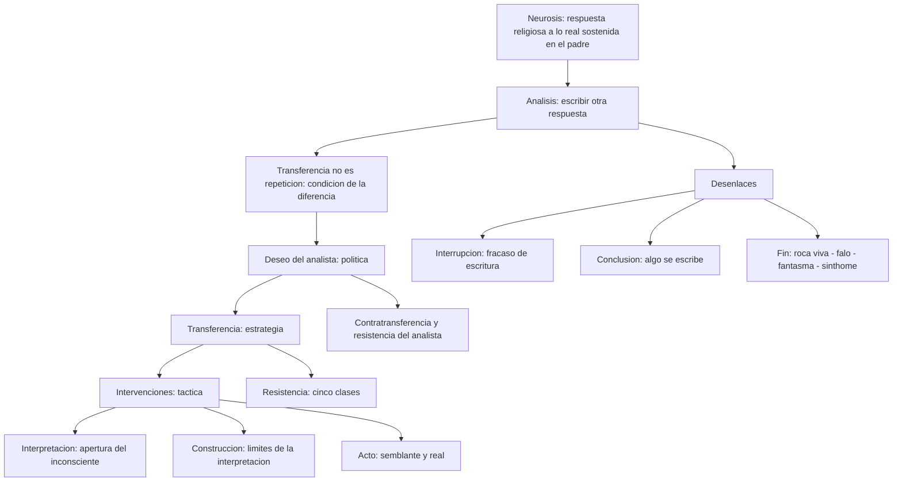
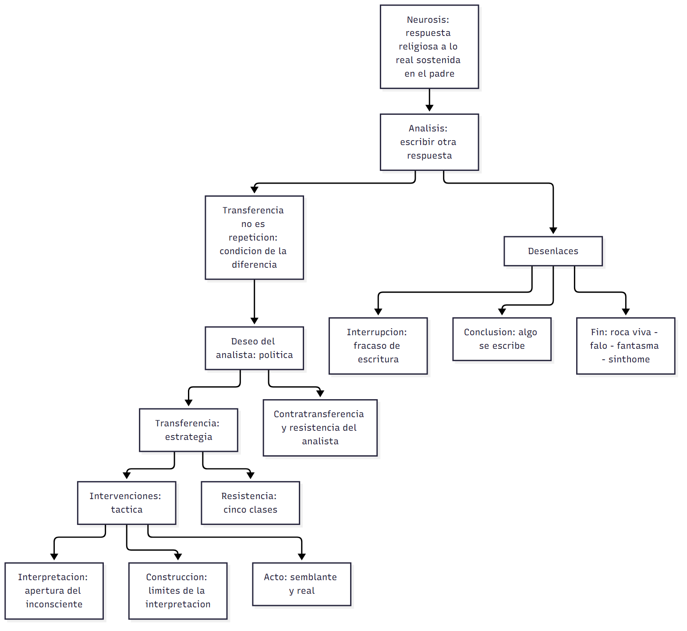

# C21_23 — Dirección de la cura, intervenciones y fin de análisis (el dispositivo analítico)

> **Fuentes** (normas APA 7):
>
> - Belucci, G. (2015). *Las intervenciones del analista* [Ficha de cátedra]. Universidad Favaloro. [Texto T27 del programa]
> - Belucci, G. (2016). *Versiones del fin de análisis* [Ficha de cátedra]. Universidad Favaloro. [Texto T30 del programa]
> - Freud, S. (1996). Sobre la dinámica de la trasferencia. En J. Strachey (Ed.), *Obras completas* (J. L. Etcheverry, Trad., Vol. 12). Amorrortu. (Obra original publicada en 1912) [Texto T24 del programa]
> - Freud, S. (1996). Sobre la iniciación del tratamiento. En J. Strachey (Ed.), *Obras completas* (J. L. Etcheverry, Trad., Vol. 12). Amorrortu. (Obra original publicada en 1913) [Texto T23 del programa]
> - Freud, S. (1996). Puntualizaciones sobre el amor de trasferencia. En J. Strachey (Ed.), *Obras completas* (J. L. Etcheverry, Trad., Vol. 12). Amorrortu. (Obra original publicada en 1915) [Texto T25 del programa]
> - Freud, S. (1996). Inhibición, síntoma y angustia. En J. Strachey (Ed.), *Obras completas* (J. L. Etcheverry, Trad., Vol. 20). Amorrortu. (Obra original publicada en 1926) [Textos T08 (caps. I-VIII) y T28 (cap. XI) del programa]
> - Iunger, V. (1998). *Contratransferencia, ¿resistencia del analista?* [Conferencia]. Buenos Aires. [Texto T29 del programa]
> - Lacan, J. (2009). La dirección de la cura y los principios de su poder. En *Escritos 2*. Siglo XXI. (Obra original publicada en 1958) [Texto T22 del programa]
> - Lacan, J. (1993). Del sujeto al que se supone saber, de la primera díada, y del bien. En *El Seminario, libro 11: Los cuatro conceptos fundamentales del psicoanálisis* (cap. XVIII). Paidós. (Seminario dictado en 1964) [Texto T26 del programa]
>
> **Materia:** Psicoanálisis, 2.º año, Universidad Favaloro.

> **Avisos sobre las fuentes (leélos antes de estudiar):**
> 1. **Freud (1926/1996)** (*Inhibición, síntoma y angustia*, cap. XI) **no figura asignado** en tus apuntes de la cátedra; está en el repositorio y es el único texto freudiano que ordena las **cinco clases de resistencia**, por eso se usa en la pregunta 5. Su extracto se corta en la quinta resistencia (la del superyó).
> 2. **Freud (1913/1996)** es un **fragmento**: llega hasta la regla de no comunicar traducciones antes de que haya «transferencia operativa»; se corta antes del excursus sobre el saber y el mecanismo de la cura.
> 3. **Iunger (1998)** es la **transcripción de una exposición oral** (1998) con ruido de OCR; el sentido se recupera bien, pero las citas textuales son aproximadas.
> 4. **Lacan (1958/2009)** es un **extracto** del escrito de Lacan (capítulos I a V, sin las secciones finales sobre el deseo del analista como tal). **No nombra a Von Clausewitz** en el extracto: la lectura «política / estrategia / táctica» la introduce **Belucci (2015, pp. 2-3)** apoyándose en el texto de Lacan.
> 5. El **programa 2026** de la materia lista, además, otros textos de la unidad 5 que **no están extraídos** en el repositorio (por ejemplo, Freud, *Consejos al médico* y *El problema económico del masoquismo*). Esta guía responde con lo que sí tenemos; lo que va más allá figura como **▸ Complemento**.
> 6. **No hay apuntes de clase 21 ni 23** (todavía no se dieron al 06/10/2026): el orden de los temas y los acentos de la cátedra se infieren de las preguntas y de los textos de Belucci (que está a cargo de la cátedra, Belucci, 2015, p. 1).

> **Idea-fuerza:** un análisis es la posibilidad de **escribir una respuesta a lo real que no sea la respuesta religiosa de la neurosis** (la sostenida en el padre). Para que eso pase hay que **distinguir transferencia y repetición**: la transferencia es la **condición de posibilidad** de que, en el circuito de la repetición, se **inscriba la diferencia**; y la **función** que lo hace posible es el **deseo del analista**. Lacan ordena la práctica en tres niveles tomados de Von Clausewitz: **política** (el deseo del analista), **estrategia** (el manejo de la transferencia) y **táctica** (las intervenciones: **interpretación, construcción y acto**). La **resistencia** es inmanente a la estructura del sujeto y, para Lacan, «no hay otra resistencia al análisis sino la del analista»; la **contratransferencia** es lo que el deseo del analista no alcanza a barrer. Los desenlaces posibles son **interrupción** (fracaso de una escritura), **conclusión** (algo se escribe) y **fin de análisis** (versión freudiana y tres versiones lacanianas: falo, fantasma, sinthome).

## Hilo conductor: cómo se conectan los temas de esta guía

La clase pregunta **cómo funciona el dispositivo analítico**: qué hace el analista, con qué, y hasta dónde. Las siete preguntas son siete piezas de una misma cadena, que se entiende mejor si se empieza por el final de la idea-fuerza: **un análisis es la posibilidad de escribir una respuesta a lo real que no sea la respuesta religiosa de la neurosis**, la sostenida en el padre.

Para que eso sea posible hay que **distinguir transferencia y repetición** (pregunta 3). Freud ubica la repetición **dentro** de la transferencia: el clisé infantil se reedita en el analista y el paciente **actúa** en lugar de recordar. Lacan, en 1964, afirma que **no son lo mismo**: la transferencia es la **condición de posibilidad de que se inscriba la diferencia**. Y la **función** que lo hace posible es el **deseo del analista** (pregunta 2): no un deseo de la persona, sino una **función**, un «punto axial», una **x** que funda y sostiene la transferencia, que **no es pura** (alguien le da cuerpo) y que **no puede ser un imperativo** (sería *furor curandi*).

Lacan **ordena** estas piezas con la lectura de Von Clausewitz (pregunta 1): la **política** es el **deseo del analista**; la **estrategia**, el **manejo de la transferencia**; la **táctica**, las **intervenciones**. La subordinación va de abajo hacia arriba, y por eso la libertad del analista decrece: es más libre en la táctica, está alienado en la estrategia y lo es aún menos en la política. La **táctica** (pregunta 4) tiene tres modalidades: la **interpretación** (se mide por la **apertura del inconsciente**), la **construcción** (cuando la interpretación no alcanza: pulsión, fobia, restos) y el **acto** (pone en juego **lo real**, se liga al **semblante** y a la **abstinencia**, funda la transferencia y frena el acting out).

¿Qué se opone a esa cadena? La **resistencia** (pregunta 5). Freud la ubica en el analizante (**cinco clases**; la transferencia es la mayor) y Lacan la **desplaza** hacia el analista: «no hay otra resistencia al análisis sino la del analista». Esa resistencia del analista tiene nombre clínico: la **contratransferencia** (pregunta 6), lo que le pasa al analista como sujeto y su deseo **no alcanza a resolver**. La relación es inversa: **a mayor deseo del analista, menor contratransferencia**; analizarse es la condición para que el deseo del analista pueda barrerla (y hasta servirse de ella como indicador).

Por último, todo el recorrido tiene **desenlaces** (pregunta 7), que dependen de que esa función haya podido sostenerse: la **interrupción** (fracaso de una escritura, con estructura de pasaje al acto; puede deberse a una mala posición del analista, a un refugio en la neurosis o a la puesta en transferencia de una pregunta), la **conclusión** (algo se escribe; hay sanción del analista) y el **fin de análisis** (cuatro versiones: la «roca viva de la castración» de Freud; y en Lacan, el duelo por ser el falo, el atravesamiento del fantasma y el sinthome).

> 🎯 **Para el parcial:** una buena respuesta de cualquiera de las siete preguntas debería poder **engancharse** con la anterior y la siguiente: transferencia ≠ repetición → deseo del analista → política/estrategia/táctica → intervenciones → resistencia → contratransferencia → desenlaces. Si te piden solo un punto, empezá nombrando **el deseo del analista como función**: es el eje al que vuelven todos los demás.

**En una sola oración:** el deseo del analista hace que la transferencia deje de ser repetición y permita escribir una respuesta nueva a lo real; las intervenciones son su puesta en acto, la resistencia y la contratransferencia su obstáculo, y la interrupción, la conclusión y el fin son los desenlaces posibles.

## 0. Hoja de ruta

1. **Las tres dimensiones de la práctica analítica** (Clausewitz → política, estrategia, táctica).
2. **El deseo del analista:** función, relación con la estructura y efectos.
3. **Estructura de la transferencia** en Freud y en Lacan; **transferencia y repetición**.
4. **La intervención analítica** y sus modalidades (interpretación, construcción, acto).
5. **La resistencia:** concepto, modalidades y novedad lacaniana.
6. **La contratransferencia** y su relación con el deseo del analista.
7. **Los desenlaces de un análisis** (interrupción, conclusión, fin) y los **efectos de escritura**.

## 🎯 Lo que entra sí o sí

1. **Clausewitz–Lacan:** táctica (intervenciones; «menos libre en su estrategia que en su táctica» y menos aún en su **política**), estrategia (**transferencia**, «el mapa»), política (**deseo del analista**, «falta-en-ser antes que ser»). Para Freud: **no se interpreta antes de que haya transferencia** (Freud, 1913/1996).
2. **Deseo del analista:** «punto axial» de la formación (Lacan, Sem. 11); **función** (no persona) que permite que la transferencia **escriba una diferencia** en la repetición; **no es un deseo puro**; es una **x/enigma** que apunta al deseo del Otro; efecto: **funda y sostiene la transferencia** y lleva la cura «tan lejos como sea posible» sin **furor curandi**.
3. **Transferencia:** Freud (1912) = **clisé/serie psíquica**, **imago paterna**, **reedición** (repetición) → **resistencia** (negativa o erótica reprimida) y a la vez **palanca del éxito** (la positiva susceptible de conciencia); **amor de transferencia** (genuino, no se gratifica ni se sofoca: **abstinencia**). Lacan (1964) = **sujeto supuesto saber**; transferencia **incluye a los dos**, ≠ repetición; es **sugestión desde la demanda de amor** y a la vez **análisis de la sugestión**.
4. **Intervención** = **puesta en acto del deseo del analista**; **tres modalidades**: **interpretación** (efecto: **apertura del inconsciente**; «entre el enigma y la cita»), **construcción** (límites de la interpretación: pulsión, fobia, resto; **articulación lógica + escena**; modalización) y **acto** (no es interpretación ni construcción; **semblante**, **abstinencia**, «vacilación calculada de la neutralidad»; el acting se frena con el acto).
5. **Resistencia:** compromiso y obstáculo de toda ocurrencia; **cinco clases** (yo: represión, transferencia, ganancia de la enfermedad; ello: compulsión de repetición; superyó); **novedad lacaniana**: «no hay otra resistencia al análisis sino la del analista»; resistencia = **deseo de mantener el deseo**/**incompatibilidad del deseo con la palabra**; Iunger: la resistencia es del analista porque es **quien debe enfrentarla**.
6. **Contratransferencia:** concepto «impropio» para Lacan (no cabe dividir la transferencia); Iunger la conserva: **lo que le pasa al analista como sujeto** y **su deseo no alcanza a resolver**; «**a mayor deseo del analista, menor contratransferencia**»; solo se **barre** (y puede servir de indicador) si el analista está **analizado**; prohibido **gozar al analizante**.
7. **Desenlaces:** **interrupción** (estructura de **pasaje al acto**, fracaso de la escritura), **conclusión** (sanción/aval del analista; **conclusión práctica**: síntomas, inhibiciones, angustia; fórmulas de Freud y de Lacan) y **fin de análisis** (lógico): **Freud 1937** (roca viva de la castración + rectificación de las represiones primordiales), **Lacan** (falo/duelo; **atravesamiento del fantasma**; **sinthome**, **saber-hacer**, **invención**).

---

## 1. Primera pregunta — Las tres dimensiones de la práctica analítica (Lacan a partir de Von Clausewitz)

> *Desarrolle las tres dimensiones de la práctica analítica que Lacan introduce a partir de su lectura de Von Clausewitz.*

### 1.1 Respuesta modelo

> **Esqueleto de la respuesta:**
> 1. **Tesis:** Lacan ordena la práctica en tres niveles que Belucci lee desde Von Clausewitz (Lacan, 1958/2009; Belucci, 2015, p. 2).
> 2. **Clausewitz:** la táctica se subordina a la estrategia y esta a la política.
> 3. **Táctica = intervenciones:** interpretación, construcción, acto; relativa libertad (Lacan, 1958/2009, p. 1).
> 4. **Estrategia = manejo de la transferencia:** condición para interpretar (Freud, 1913/1996); libertad alienada.
> 5. **Política = deseo del analista:** ubicado por su falta-en-ser (Lacan, 1958/2009, p. 2).
> 6. **Cierre:** el analista es menos libre en su estrategia que en su táctica, y menos aún en su política.

En *La dirección de la cura y los principios de su poder* (1958) Lacan ordena la práctica analítica en **tres niveles** que toma de **Von Clausewitz**, general prusiano contemporáneo de las guerras napoleónicas, para quien la **táctica** —lo que se decide en el terreno, frente al enemigo, y no puede calcularse del todo de antemano— se **subordina a la estrategia** —el cálculo que se hace «en el mapa»—, y esta, a su vez, a la **política**, porque «la guerra es la continuación de la política por otros medios» (Belucci, 2015, p. 2). Belucci traduce los tres niveles a la cura. La **táctica** son las **intervenciones** (interpretación, construcción, acto), lo que se hace en cada sesión: el analista no puede anticipar con exactitud qué dirá o callará, y en eso es relativamente libre (Lacan, 1958/2009, p. 1). La **estrategia** es el **manejo de la transferencia**: es la condición para poder interpretar —Freud lo fija en los escritos técnicos: no se interpreta antes de que la transferencia esté establecida (Freud, 1913/1996)—, y es «nuestro mapa»: según dónde quedemos ubicados en él, las intervenciones se vuelven eficaces o «miopes» (Belucci, 2015, p. 3); aquí la libertad del analista está **alienada** por el desdoblamiento de su persona (Lacan, 1958/2009, pp. 1-2). La **política** es el **deseo del analista**, que Lacan invita a ubicar por su **falta-en-ser** y no por su ser (Lacan, 1958/2009, p. 2): es lo que ordena a la transferencia y a las intervenciones, de modo que, para algunos autores, «el dispositivo es el deseo del analista» (Belucci, 2015, p. 3). De ahí la fórmula de Lacan: el analista es **menos libre en su estrategia que en su táctica** y **menos libre aún en su política** (Lacan, 1958/2009, p. 2).

> ⚠ **No confundir:** la libertad del analista **disminuye** de la táctica a la política, no al revés. Y el extracto de Lacan no nombra a Clausewitz: esa lectura es de Belucci.

### 1.2 Desarrollo ampliado

#### a) El contexto del escrito de Lacan (1958/2009, secciones I y II)

*La dirección de la cura* se abre con una pregunta: «¿quién analiza hoy?» (Lacan, 1958/2009, p. 1). Lacan critica a los analistas de su época que recurren a la **contratransferencia** («expresiones de moda» que enmascaran su «impropiedad conceptual») y a un psicoanálisis concebido como **situación entre dos**, y sostiene que esa impotencia para **sostener una praxis** se reduce, «como es corriente en la historia de los hombres, al ejercicio de un **poder**» (p. 1). Su respuesta es desplazar la mirada **hacia el analista**: no hacia su persona, sino hacia lo que **paga** en la cura.

- **«El primer principio de esta cura es que no debe dirigir al paciente.»** Dirigir la cura consiste, en primer lugar, en **hacer aplicar por el sujeto la regla analítica** (Lacan, 1958/2009, p. 1): se dirige la **cura**, no al **paciente**.
- **El analista también paga** (p. 1): **con palabras** (si la operación analítica las eleva al efecto de interpretación), **con su persona** (porque la presta como soporte de los fenómenos de la transferencia) y **con lo esencial de su juicio más íntimo** (no queda «fuera de juego»).
- **Menos seguro cuanto más interesado en su ser:** el analista duda de su acción en la medida en que está implicado en ella con su ser (p. 1).

#### b) Táctica, estrategia y política en el texto de Lacan (1958/2009, I.4–I.6, pp. 1-2)

Lacan **no usa la expresión «Clausewitz» en el extracto asignado**, pero la **gradación de libertad** que establece (táctica > estrategia > política) es la que Belucci lee en clave clausewitziana:

1. **Táctica (la interpretación): el analista es libre.** Es «intérprete de lo que me es presentado en afirmaciones o en actos»; decide su «oráculo» y lo articula «a mi capricho, **único amo en mi barco después de Dios**»; es libre «del momento y del número, tanto como de la elección de mis intervenciones»; la regla fundamental parece hecha para no estorbar su quehacer de ejecutante (Lacan, 1958/2009, p. 1). Lo único que no domina son los **efectos** de sus palabras.
2. **Estrategia (el manejo de la transferencia): la libertad se aliena.** «En cuanto al manejo de la transferencia, mi libertad en ella se encuentra por el contrario alienada por el **desdoblamiento que sufre allí mi persona**» (p. 1-2): el analista es, a la vez, quien es y la persona que la transferencia supone que es. Lacan rechaza la **«situación entre dos»** y la metáfora del **espejo**, y propone la imagen del **bridge**: el analista **se adjudica el «muerto»** para hacer surgir al **cuarto** —que será la «pareja» del analizado— y esforzarse, por medio de sus bazas, en hacerle adivinar la mano (p. 2). **Los sentimientos del analista solo tienen un lugar posible: el del muerto**; «si se lo reanima, el juego se prosigue sin que se sepa quién lo conduce» (p. 2). De ahí: «el analista es **menos libre en su estrategia que en su táctica**» (p. 2).
3. **Política: menos libre aún.** «El analista es aún menos libre en aquello que domina estrategia y táctica: a saber, su **política**, en la cual haría mejor en ubicarse por su **falta-en-ser** que por su ser» (p. 2). La política no es una decisión de la persona del analista: se ordena por su **falta**, es decir, por el **deseo del analista** como función (ver pregunta 2).

#### c) La lectura de Belucci (2015, pp. 2-3)

Belucci presenta el esquema en tres pasos:

- **Von Clausewitz.** General prusiano de principios del siglo XIX, autor de un tratado sobre el arte de la guerra. Los teóricos militares anteriores distinguían **táctica** (operaciones en el terreno, «depende de las circunstancias que se van dando a lo largo de la batalla», nadie sabe de antemano qué va a pasar) y **estrategia** (el cálculo en el mapa; la táctica se subordina a él). Clausewitz agrega un **tercer nivel**, la **política**, que subordina a la estrategia: «**La guerra es la continuación de la política por otros medios**»; la guerra es «una traducción de una posición política» (p. 2).
- **Equivalencias en la cura.**
  - **Táctica = las intervenciones**: «lo que se decide en el terreno»; el analista no puede calcular más allá de cierto punto qué hará o dirá, o no hará ni dirá (p. 2).
  - **Estrategia = la transferencia**: «¿Las intervenciones se subordinan a qué? ¿Cuál es la condición de posibilidad para intervenir?». Freud lo dice con claridad en los escritos técnicos: **para poder interpretar es preciso que se haya establecido la transferencia** (pp. 2-3). «La transferencia es nuestro **mapa**»; una de las coordenadas que se ubican en una **supervisión** es cómo está situado el analista en ese mapa; si no se lee, «la intervención se vuelve en algún sentido **miope**» (p. 3).
  - **Política = el deseo del analista** (p. 3). Belucci cita a Adriana Rubistein: **«el dispositivo es el deseo del analista»**; si hubiera que reducir el dispositivo analítico a un elemento fundamental, sería ese, porque la transferencia y las intervenciones se **ordenan en función de él**.
- **Orientación práctica.** Cada vez que el analista esté desorientado, dos preguntas: **¿cuál es el real?** (porque la repetición tiene que ver con eso) y **¿qué se escribió en relación a ese real?** (p. 3). La demanda de análisis misma tiene que ver con un real «que se volvió imposible de tramitar», lo que Freud llamó ***Versagung***, «lo que no anda» (p. 3; ver también C13).

#### d) Cómo se relacionan los tres niveles (la «subordinación»)

- **De abajo hacia arriba:** cada intervención (táctica) debe poder justificarse por la **posición en la transferencia** (estrategia), y esta por la **política** (el deseo del analista): «no podemos decir o hacer cualquier cosa en cualquier momento, porque eso está subordinado al nivel de la estrategia» (Belucci, 2015, p. 2).
- **Un ejemplo de Belucci de falla estratégica:** **Dora**. Freud, en su análisis, **«queda muy tomado por esa posición paterna»** que ocupa en la transferencia; esa posición le permite leer el Edipo y el amor al padre, pero le **obtura** leer otra dimensión de la neurosis (la pregunta por lo femenino y el lugar de la Sra. K.), y su insistencia en orientar a Dora hacia el supuesto amor por el Sr. K. hace que **la transferencia caiga** (Belucci, 2016, p. 2): la táctica falló porque estaba mal ubicado el analista en el mapa de la transferencia.
- **La frase de Lacan de 1958 como crítica a la época:** Lacan señala que los analistas «de hoy» invierten el orden freudiano: posponen la interpretación hasta consolidar la transferencia, que se convierte en «la seguridad del analista»; la relación con lo real pasa a ser «el terreno donde se decide el combate»; y la interpretación queda subordinada a la **reducción de la transferencia** (Lacan, 1958/2009, p. 4). Freud, en cambio (Hombre de las Ratas, Dora), procedía «en orden inverso»: **rectificación de las relaciones del sujeto con lo real → desarrollo de la transferencia → interpretación** (p. 4, II.8). Lo que Lacan llama «**rectificación subjetiva**» es dialéctica y parte de los decires del sujeto.

#### e) Tabla resumen

| Nivel (Clausewitz) | En la cura (Lacan–Belucci) | Rasgo clave | Libertad del analista |
|---|---|---|---|
| **Táctica** | **Intervenciones** (interpretación, construcción, acto) | Se decide en el terreno, en cada sesión; no es anticipable | Es donde es **más libre** (aunque no domina los efectos) |
| **Estrategia** | **Manejo de la transferencia** («el mapa») | Condición para poder interpretar; se funda, no es espontánea | **Alienada** por el desdoblamiento de su persona |
| **Política** | **Deseo del analista** | Se ubica por la **falta-en-ser**; ordena a las otras dos | **Menos libre aún**: no es un deseo de la persona |

#### f) Matices que suelen tomarse en el examen

- **«Táctica» no es «técnica»**: es el nivel de la **acción en el terreno**, no un repertorio de recetas; Iunger recuerda que «no hay recetas para la práctica del psicoanálisis, hay pocas» (la interpretación de los sueños y las grandes cosas que enseñó Freud; Iunger, 1998).
- **El analista no «dirige al paciente»**, dirige la **cura**; la regla fundamental es lo que se hace aplicar al sujeto (Lacan, 1958/2009, p. 1).
- La «política» es un **nivel lógico**, no una «política institucional»: Lacan la liga a la **falta-en-ser**.
- **▸ Complemento:** en el texto completo de Lacan estos tres niveles aparecen con esas palabras («táctica», «estrategia», «política») y se anudan con la **interpretación** (táctica), la **transferencia** (estrategia) y el **deseo del analista / falta-en-ser** (política). El extracto asignado conserva la idea sin el vocabulario completo; en el examen alcanza con la lectura de Belucci.

---

## 2. Segunda pregunta — La función deseo del analista, su relación con la estructura y sus efectos en el análisis

> *¿Cómo plantea Lacan la función deseo del analista, su relación con la estructura y sus efectos en el análisis?*

### 2.1 Respuesta modelo

> **Esqueleto de la respuesta:**
> 1. **Tesis:** el deseo del analista es una función, el eje en torno al cual gira la cura (Lacan, 1964/1993).
> 2. **Función:** el mango del hacha: aplica la fuerza de la transferencia sobre la demanda.
> 3. **Definición operativa:** permite que en la repetición se escriba la diferencia (Belucci, 2015, p. 2).
> 4. **Relación con la estructura:** el deseo es deseo del Otro (falta-en-ser) (Lacan, 1958/2009, pp. 11-12); no es puro, alguien le da cuerpo (Iunger, 1998).
> 5. **Opera sobre el analizante:** acto, semblante y abstinencia (Belucci, 2015, pp. 4-5).
> 6. **Cierre (efectos):** funda la transferencia, permite otra respuesta a lo real, evita el *furor curandi* (Belucci, 2016, p. 1).

Lacan introduce el **deseo del analista** como el **punto axial** de la formación y de la experiencia: lo que el psicoanalista debe poder saber es **en torno a qué gira** el movimiento de la cura (*Seminario 11*, cap. XVIII, Lacan, 1964/1993). No es el deseo de una persona sino una **función**: Lacan la compara con el **eje o mango del hacha de doble filo** gracias al cual se aplica la fuerza de la transferencia sobre lo que el paciente formula como demanda; el deseo es «el eje, el pivote» y por eso la relación del **deseo con el deseo** es «interna» (Lacan, 1964/1993). Belucci lo define de manera accesible como **la función que permite que, en el circuito de la repetición, se escriba la diferencia** (Belucci, 2015, p. 2). En relación con la **estructura**, lo hace en tres planos: se apoya en la estructura del **deseo** mismo (el deseo del hombre es el **deseo del Otro**, la metonimia de la **falta-en-ser**, Lacan, 1958/2009, pp. 11-12); no es un deseo **puro**, sino que alguien le **da cuerpo** (Iunger, Iunger, 1998; Belucci, 2015, p. 3); y opera sobre la **estructura del analizante** (en la neurosis, una respuesta religiosa a lo real, sostenida en el padre) mediante el **acto** y el **semblante**, con la **abstinencia** que impide que lo real se diluya (Belucci, 2015, pp. 4-5). Sus **efectos**: **funda y sostiene la transferencia**, hace posible una **respuesta a lo real que no sea la neurótica**, lleva la cura «tan lejos como sea posible» —pero no a toda costa: sería ***furor curandi*** (Belucci, 2015, p. 3; Belucci, 2016, p. 1)— y promueve la **caída del goce contratransferencial** (Iunger, 1998).

> ⚠ **No confundir:** deseo **del analista** (función) ≠ deseo **de la persona** del analista. Y no es un deseo puro.

### 2.2 Desarrollo ampliado

#### a) Lacan: el «punto axial» (Lacan, 1964/1993, Seminario 11, cap. XVIII, 10/06/1964)

El capítulo abre con la frase: «**Formar analistas ha sido, y sigue siendo, la meta de mi enseñanza.**» Lacan señala que en la literatura analítica «no hay manera de dar con los principios» de esa formación, por lo que los criterios son sustituidos por algo «del orden de la **ceremonia**», que en el caso del analista solo se traduce en la **simulación**. Pero el valor de lo que el analista obtiene es inestimable: **la confianza de un sujeto**. Esa confianza, sin embargo, no hace del analista un dios; la pregunta es **en torno a qué gira**. Lacan: «Este punto axial lo designo con el nombre de **deseo del psicoanalista**» (Lacan, 1964/1993).

Ideas del capítulo que sostienen la noción:

1. **Sujeto supuesto saber (S.s.S.).** «En cuanto hay, en algún lugar, el sujeto que se supone saber, hay transferencia.» Lo que organiza la transferencia no es el saber del analista sino la **suposición** de que sabe. **Freud** fue, «en vida», el único legítimamente sujeto supuesto saber (Lacan, 1964/1993).
2. **La transferencia incluye juntos al sujeto y al psicoanalista:** dividirla en «transferencia» y «contratransferencia» es **una manera de eludir el meollo del asunto** (Lacan, 1964/1993).
3. **El deseo como «el eje del hacha de doble filo»:** «el deseo es el eje, el pivote, el mango, el martillo, gracias al cual se aplica el **elemento-fuerza**, la inercia, que hay tras lo que se formula primero, en el discurso del paciente, como **demanda**, o sea, la **transferencia**. El eje, el punto común de esta hacha de doble filo, es el **deseo del analista**, que designo aquí como una **función esencial**» (Lacan, 1964/1993).
4. **«El deseo del hombre es el deseo del Otro»**: el deseo del sujeto se constituye cuando ve el juego de una cadena significante a nivel del deseo del Otro; por eso la relación entre el deseo del analista y el del analizante es «una relación del deseo con el deseo», que **conserva algo de la alienación** (Lacan, 1964/1993).
5. **«No querer desear»**: «toda la experiencia analítica da fe de que no querer desear y desear son la misma cosa» (Lacan, 1964/1993): el deseo entraña una fase de prohibición. El analista está «citado» ahí: **en la medida en que se supone que sabe, se supone que irá al encuentro del deseo inconsciente**.

#### b) Lacan en *La dirección de la cura*: el deseo, la falta-en-ser y la ética (Lacan, 1958/2009)

- **La pregunta por el ser del analista** (Lacan, 1958/2009, IV, p. 7): «¿Cómo actuar con el propio ser?». Lacan rechaza que el fin de análisis sea la **identificación con el analista** (p. 8) y cierra con: «**Está por formularse una ética que integre las conquistas freudianas sobre el deseo: para poner en su cúspide la cuestión del deseo del analista**» (p. 8).
- **El analista soporta la demanda**, «no, como suele decirse, para frustrar al sujeto, sino para que reaparezcan los **significantes** en que su frustración está retenida» (p. 9). El sujeto, al hablar, formula una **demanda «intransitiva»**: «con oferta, he creado demanda» (p. 9); la regla analítica *crea* la demanda; el analista no la satisface: **la pone «entre paréntesis»** (p. 14).
- **«Hay que tomar el deseo a la letra»** (V, pp. 10-15): el **deseo** es **metonimia de la falta-en-ser** (p. 11); se manifiesta «en el intervalo que cava la demanda más acá de sí misma» (p. 11); «el deseo del hombre es el **deseo del Otro**» (p. 12); el deseo «es la imposibilidad» de una palabra que levantara la marca que el sujeto recibe de su expresión (p. 12; $). Detrás está el **falo perdido**, «el significante de los significantes», «clave de lo que hay que saber para **terminar los análisis**» (p. 12).
- **Qué hacer con la demanda y el deseo:** toda **respuesta a la demanda**, ya sea frustrante o gratificante, **reduce la transferencia a la sugestión** (p. 13); la frustración debe prevalecer sobre la gratificación **solo para mantener el cuadro de la transferencia**. Se trata de **preservar el lugar del deseo** (p. 12, «la importancia de preservar el lugar del deseo en la dirección de la cura»).
- **Cierre del texto (p. 15):** «Interroguemos lo que ha de ser del analista (del «ser» del analista), en cuanto a su propio deseo». Freud, «hombre de deseo», reveló «el significante impar»: el **falo**, cuya recepción y don son igualmente imposibles para el neurótico; el hombre «masculino o femenino» debe aceptar **tenerlo y no tenerlo** a partir del descubrimiento de que **no lo es**.

#### c) Belucci: función, diferencia y real (Belucci, 2015, pp. 2-3)

1. **Definición operativa:** «Lacan introdujo un concepto también central para pensar la clínica […] el **deseo del analista**. Podríamos definirlo como **la función que permite que se escriba la diferencia en relación a la repetición**» (p. 2).
2. **Desde la perspectiva del real:** ante la desorientación, dos preguntas: **¿cuál es el real?** y **¿qué se escribió en relación a ese real?** (p. 3). La demanda de análisis tiene que ver con un real que se volvió imposible de tramitar (la ***Versagung***).
3. **Qué funda y qué sostiene:** el deseo del analista es lo que **funda y sostiene el campo de la transferencia** y apunta «a llevar una cura tan lejos como sea posible», es decir, a un final, **pero no de cualquier modo ni siempre**: llevar la cura «hasta el final como sea» es lo que Freud llamó ***furor curandi***. «El deseo del analista, como todo deseo, está sujeto a **condiciones**» (p. 3).
4. **No es un deseo puro:** es una función «a la que necesariamente alguien le da cuerpo». Iunger: no hay manera de «limpiar completamente» el deseo del analista del sujeto que ocupa el lugar. **La contratransferencia es eso.** Si el deseo del analista no está suficientemente despejado, «uno podría dirigir la cura desde su neurosis», y eso lleva «inevitablemente» al **análisis interminable**. «No hay otro modo de ocupar de una buena manera ese lugar que **analizarse**» (p. 3).

#### d) Iunger: fórmulas del deseo del analista (Iunger, 1998)

Iunger sistematiza varias fórmulas «que quizá ustedes conocen»:

- **Algo que adviene al analista en su análisis**: el deseo del analista se adquiere en el análisis de cada uno.
- Es **un deseo que apunta al deseo del Otro** (siempre el deseo apunta al deseo del Otro, pero de un modo particular); apunta a la **verdad** y a la **subjetividad** del Otro; apunta a **romper todas las instancias en que se tiende a confundir el objeto con el ideal**; Lacan lo dice **«deseo absoluto», «deseo de máxima diferencia»**.
- Es **una x**: algo que el analista **propone al analizante como un enigma** para que este se pregunte por el deseo del Otro.
- **Relación con la contratransferencia (ecuación):** «a mayor deseo del analista, menor contratransferencia; a mayor contratransferencia, menor deseo del analista».
- **Efecto sobre el goce:** el acto analítico «hace caer» el goce contratransferencial, y la **interrupción de goce produce deseo**, del lado del analizante y del analista (por la «desobturación de la falta»).
- Incluye una **ética**: el analista «sigue siendo un analizante al que se agrega una condición»; la **ética analítica** es «un escalón de la ética analizante».

#### e) La relación con la estructura

Conviene distinguir **tres sentidos** de «relación con la estructura»; el examen puede apuntar a cualquiera:

1. **Con la estructura del deseo (la estructura subjetiva universal).** El deseo del analista no es ajeno a la estructura: es una **respuesta de estructura a la falta-en-ser**; el analista se ubica por su **falta-en-ser** (Lacan, 1958/2009, p. 2); no se trata de un «deseo de analizar» sino de un deseo **decantado en su propio análisis** (Iunger, 1998). Como función, ocupa —sin identificarse con él— el lugar del sujeto supuesto saber, «en la medida en que es objeto de la transferencia» (Lacan, 1964/1993).
2. **Con la estructura de quien lo encarna (la «impureza»).** El deseo del analista **no es puro**: lo encarna un sujeto con su neurosis, y esa **estructura del analista** es el límite posible de la cura (análisis interminable, Belucci, 2015, p. 3) o el origen de la **contratransferencia** (Iunger, 1998).
3. **Con la estructura del analizante (la neurosis como respuesta religiosa).** En la neurosis, la respuesta a lo real es «**religiosa**», **sostenida en el padre** (Belucci, 2015, p. 1). El deseo del analista **hace trama con esa estructura mediante el semblante** (como un **caballo de Troya**: «no para reduplicar la estructura de la neurosis, sino para introducir, a partir de allí, **lo real**, aquello a lo que la neurosis responde, para que se pueda escribir en ese punto una respuesta distinta», Belucci, 2015, p. 5) y se sostiene en la **abstinencia**: no ser complaciente con la neurosis, dejar subsistir la ***Versagung*** (p. 5). Ejemplo: severidad de Freud con el Hombre de las Ratas (el semblante «hace trama» con la serie padre militar → capitán cruel → Freud, p. 4), con la salvedad «no tengo inclinación alguna por la crueldad» para **no gozar sádicamente** de la neurosis (p. 16).

Una consecuencia clínica: el deseo del analista es lo que permite pensar la **diferencia entre estructuras en la maniobra** (qué semblante cuadra a qué escena transferencial). Belucci: el semblante se adecúa a la escena, y «cuanto más haya avanzado alguien en el recorrido de su análisis y más recorrido tenga como analista, mejor funciona» (p. 5).

#### f) Efectos del deseo del analista en el análisis

1. **Funda la transferencia.** «La transferencia no existe espontáneamente, es una respuesta al deseo del analista, y más específicamente a su **acto**. La transferencia hay que fundarla» (Belucci, 2015, p. 16).
2. **Sostiene el campo transferencial** y permite **atravesar la angustia**: «La experiencia de la angustia, que fuera del análisis puede tornarse insoportable, en el análisis se puede soportar, primero porque se da la transferencia, y más específicamente porque hay actos» (p. 16).
3. **Hace posible la escritura de la diferencia** respecto de la repetición (p. 2): sin deseo del analista, la transferencia sería «una pieza de la repetición».
4. **Apunta a frenar la precipitación:** frente al acting out o al pasaje al acto, que son «conclusiones precipitadas» (sin tiempo para comprender), el deseo del analista **frena** (p. 15; ver pregunta 4).
5. **Mantiene lo real en juego:** la **abstinencia** (no complacer, dejar subsistir la *Versagung*) es la forma en que el deseo del analista impide que «el real de cada quien se diluya» (p. 5).
6. **Determina las condiciones del final:** el deseo del analista está sujeto a **condiciones** (del lado del analizante y de la estructura de cada transferencia); por eso un análisis puede no llegar a un final «con ese analista en ese momento» (Belucci, 2016, p. 1). **No puede coincidir con un imperativo**: si el analista quiere llevar el análisis a toda costa, deja de ser deseo del analista y pasa a ser un **imperativo superyoico** (Belucci, 2016, p. 1).
7. **Produce un analista:** «lo que produce el recorrido de un análisis no es otra cosa que un analista» (Belucci, 2015, p. 20).

#### g) Errores frecuentes en esta pregunta

- **Confundir deseo del analista con «deseo de ser analista» / «deseo de curar»**: el segundo es *furor curandi*, un imperativo superyoico.
- **Decir que es un deseo puro o neutro**: es el deseo de un sujeto que «da cuerpo» a la función; por eso es necesario el análisis personal.
- **Decir que el deseo del analista «es la contratransferencia»**: son términos **opuestos** (Iunger: a mayor uno, menor el otro).
- **Olvidar que apunta a la diferencia (escritura), no a la comprensión ni a la adaptación.**

---

## 3. Tercera pregunta — La estructura de la transferencia en Freud y Lacan; transferencia y repetición

> *¿Qué aportan Freud y Lacan para pensar la estructura de la transferencia? ¿Cuál es la relación entre transferencia y repetición?*

### 3.1 Respuesta modelo

> **Esqueleto de la respuesta:**
> 1. **Tesis:** Freud piensa la transferencia como reedición; Lacan, como efecto del sujeto supuesto saber.
> 2. **Freud:** clisés que se reimprimen; el analista entra en una serie psíquica (Freud, 1912/1996).
> 3. **Doble cara en Freud:** positiva tierna (motor del éxito) y erótica u hostil (resistencia): palanca y obstáculo.
> 4. **Lacan:** incluye juntos al analista y al sujeto; hay transferencia en cuanto hay sujeto supuesto saber (Lacan, 1964/1993).
> 5. **Sugestión:** es sugestión a partir de la demanda de amor, pero también análisis de la sugestión (Lacan, 1958/2009, p. 13).
> 6. **Cierre (repetición):** Freud las acerca; Lacan las distingue: la transferencia es la condición para que en la repetición se inscriba la diferencia (Belucci, 2015, pp. 1-2).

**Freud** (*Sobre la dinámica de la transferencia*, 1912) piensa la transferencia como una **reedición**: cada persona adquiere, por sus disposiciones innatas y las influencias de la infancia, uno o varios **clisés** para su vida amorosa que se **reimprimen** a lo largo de la vida; la parte de la libido que quedó demorada o inconsciente se vuelca, ante cada persona nueva, con **representaciones-expectativa**, y así el analista queda **insertado en una «serie» psíquica** (típicamente, la **imago paterna**, pero también la materna o la del hermano). Su estructura es **doble**: una transferencia **positiva** —de sentimientos tiernos susceptibles de conciencia, que es **el portador del éxito**, y de sus prolongaciones eróticas inconscientes— y una **negativa** (hostil); estas dos últimas **sirven a la resistencia**, de modo que la transferencia es, a la vez, la **mayor resistencia** y la **palanca de la cura**. **Lacan** (*Seminario 11*, 1964) la reformula: la transferencia es un fenómeno que **incluye juntos al sujeto y al analista** y se instala **en cuanto hay sujeto al que se supone saber**; no es la suma de sentimientos positivos y negativos (Lacan, 1958/2009, p. 5) ni una relación dual, y es «**sugestión** a partir de la **demanda de amor**» pero a la vez **«análisis de la sugestión»** (Lacan, 1958/2009, p. 13). Sobre la **repetición**: Freud la ubica **dentro** de la transferencia (el paciente no recuerda, **actúa**), y por momentos las equipara; **Lacan**, tres años después del Seminario 8, afirma que **transferencia y repetición no son lo mismo**: la transferencia es la **condición de posibilidad** de que en el circuito de la repetición se **inscriba la diferencia**, y ese es el efecto del **deseo del analista** (Belucci, 2015, pp. 1-2).

> ⚠ **No confundir:** transferencia ≠ repetición (Lacan). Y transferencia positiva ≠ «buena»: la erótica reprimida también es resistencia.

### 3.2 Desarrollo ampliado

#### a) Freud, *Sobre la dinámica de la transferencia* (Freud, 1912/1996)

**1. El mecanismo: clisé, serie e imago.**

- «Todo ser humano, por efecto conjugado de sus disposiciones innatas y de los influjos que recibe en su infancia, adquiere una **especificidad determinada para el ejercicio de su vida amorosa**» (condiciones de amor, pulsiones que satisface, metas). Eso da por resultado **un clisé (o varios)** que **se repite —es reimpreso— regularmente** a lo largo de la vida, en la medida en que lo consientan las circunstancias y la naturaleza de los objetos asequibles, aunque no queda del todo inmutable frente a impresiones recientes (Freud, 1912/1996).
- Solo un **sector** de esas mociones libidinosas ha recorrido el pleno desarrollo psíquico, está vuelto hacia la realidad y es parte de la personalidad **consciente**; **otra parte** quedó **demorada**, apartada de la conciencia y de la realidad: solo pudo desplegarse en la **fantasía** o permaneció **inconsciente** (Freud, 1912/1996).
- Si la necesidad de amor no está satisfecha por la realidad, la persona se verá precisada a volcar **representaciones-expectativa libidinosas** hacia cada nueva persona; es «del todo normal e inteligible» que la investidura se vuelva hacia **el médico**, **inserte al médico en una de las «series» psíquicas** que el paciente ha formado hasta ese momento. Por los vínculos reales con el médico suele volverse decisiva la **«imago paterna»** (Jung), pero la transferencia **no está atada** a ese modelo: puede seguir la **imago materna** o la de un **hermano varón** (Freud, 1912/1996).
- Las particularidades de la transferencia (lo que **desborda** la medida de lo «razonable») se comprenden porque **no solo las expectativas conscientes sino también las inconscientes** la producen (Freud, 1912/1996).

**2. Los dos «enigmas».** Freud plantea dos puntos de especial interés: (i) por qué la transferencia es más intensa en neuróticos **bajo análisis**, y (ii) por qué en el análisis la transferencia es **la más fuerte resistencia al tratamiento**, siendo que fuera del análisis es el **portador del efecto salutífero**. Respuesta al primero: **no es más intensa en el análisis**; en institutos donde los enfermos no son tratados analíticamente se ven las intensidades máximas, incluso con sometimiento y coloración erótica; esos caracteres **se atribuyen a la neurosis**, no al psicoanálisis (Freud, 1912/1996).

**3. Por qué la transferencia es resistencia (el segundo enigma).**

- **Introversión de la libido:** condición previa de toda psiconeurosis; la libido, en regresión, **reanima las imagos infantiles**. La cura la persigue hasta sus escondrijos; entonces **estalla el combate**: todas las fuerzas que causaron la regresión se elevan como **resistencias** (Freud, 1912/1996). Las resistencias vienen de dos fuentes: la **frustración** que justificó la regresión y, sobre todo, la **atracción de lo inconsciente** (la represión).
- **La transferencia aparece cuando el análisis se acerca a un complejo patógeno:** si algo del material del complejo es apropiado para ser trasferido sobre el médico, «esta transferencia se produce, da por resultado la **ocurrencia inmediata** y se anuncia mediante los indicios de una resistencia —p. ej., una **detención de las ocurrencias**». La idea transferencial **irrumpe en la conciencia a expensas de otras posibilidades** porque «presta acatamiento también a la resistencia». Cuanto más avanza la cura, más usa el paciente esa **«desfiguración por transferencia»**; los conflictos terminan librándose en el terreno de la transferencia (Freud, 1912/1996).
- **Experiencia clínica:** cuando las asociaciones libres se deniegan, siempre se las puede destrabar diciéndole al paciente que está bajo el imperio de una ocurrencia relativa al médico (Freud, 1912/1996).

**4. Positiva, negativa y el «componente que sirve a la cura».** La clave para entender el uso de la transferencia como resistencia es **dividir**: transferencia **positiva** (sentimientos tiernos, amistosos) y **negativa** (hostiles). La positiva se descompone en la de sentimientos **susceptibles de conciencia** y la de sus **prolongaciones inconscientes**, que el análisis muestra que **de manera regular se remontan a fuentes eróticas**. Solución del enigma: la transferencia es resistencia **cuando es negativa o es positiva de mociones eróticas reprimidas**; al hacerla consciente se las desprende de la persona del médico; el componente consciente y no chocante **subsiste** y «es, en el psicoanálisis como en los otros métodos de tratamiento, **el portador del éxito**». Freud admite que los resultados del psicoanálisis **se basan en una sugestión**, entendida —con Ferenczi— como «el influjo sobre un ser humano por medio de los fenómenos trasferenciales posibles con él», y velando por la **autonomía** del enfermo (Freud, 1912/1996).

**5. Ambivalencia (Bleuler).** En las formas curables, la transferencia negativa se encuentra junto a la tierna, dirigida a menudo a la misma persona. La **ambivalencia** explica la aptitud de los neuróticos para poner sus transferencias al servicio de la resistencia; donde la capacidad de transferir se ha vuelto esencialmente **negativa**, como en los **paranoicos**, «cesa también la posibilidad de influir y de curar» (Freud, 1912/1996).

**6. Cierre: *actuar* en vez de recordar.** Las mociones inconscientes **no quieren ser recordadas** sino **reproducirse** (atemporalidad, capacidad de alucinación): el enfermo atribuye condición presente y realidad a esas mociones y quiere **actuarlas** (*agieren*) sin atender a la situación real. La lucha entre médico y paciente, «entre intelecto y vida pulsional, entre discernir y querer actuar», se desenvuelve **casi exclusivamente en torno de los fenómenos transferenciales**. Dominarlos es la mayor dificultad, pero su servicio es inapreciable: vuelven **actuales y manifiestas** las mociones de amor escondidas, «pues, en definitiva, nadie puede ser ajusticiado *in absentia* o *in effigie*» (Freud, 1912/1996).

#### b) Freud: iniciar el tratamiento y el amor de transferencia (Freud, 1913/1996; Freud, 1915/1996)

- **Freud (1913/1996): la transferencia operativa.** La primera meta del tratamiento es **allegar al paciente al médico** («rapport»). Para ello no se necesita más que **tiempo**, un interés serio, eliminar las resistencias que afloran al comienzo y evitar ciertos yerros (el punto de vista moralizante, actuar de mandatario de un tercero). Solo entonces se puede **comunicar** el significado de las ocurrencias: «**No antes de que se haya establecido en el paciente una transferencia operativa**». Comunicar prematuramente la traducción de un síntoma pone fin a la cura «tanto por las resistencias que así se despiertan de repente como por el alivio que va de consuno con la solución» (Freud, 1913/1996). Mientras las ocurrencias fluyan, **no hay que tocar el tema de la transferencia**: «hay que aguardar para este, el más espinoso de todos los procedimientos, hasta que la **transferencia haya devenido resistencia**» (Freud, 1913/1996).
- **Freud (1915/1996): el amor de transferencia.** Cuando una paciente se enamora del médico, el analista debe discernir que **el enamoramiento le ha sido impuesto por la situación analítica** y no por «las excelencias de su persona» (prevención de la contratransferencia). Ese amor tiene **tres rasgos**: lo provoca la situación analítica, lo empuja hacia arriba la **resistencia** que gobierna esa situación (es «**agent provocateur**»: acrecienta el enamoramiento para justificar la represión) y carece de miramiento por la realidad. Pero **no es lícito negarle el carácter de amor «genuino»**: todo enamoramiento repite modelos infantiles; «justamente lo que constituye su carácter compulsivo procede de su condicionamiento infantil»; en su productividad no le va en zaga a ningún otro. **Qué hacer:** ni **corresponder** (la paciente «habría conseguido aquello a lo cual todos los enfermos aspiran: **actuar, repetir en la vida** algo que solo deben recordar»; «una total derrota para la cura») ni **sofocar/exhortar a la renuncia** (sería «hacer subir un espíritu del mundo subterráneo para enviarlo de nuevo ahí abajo sin inquirirle nada»): hay que **retener la transferencia de amor pero tratarla como algo no real**, como una situación por la que se atraviesa en la cura y que debe ser reorientada hacia sus orígenes inconscientes. Principio: la **abstinencia** (no privación corporal ni de todo cuanto se apetece, sino «dejar subsistir en el enfermo necesidad y añoranza como fuerzas pulsionantes del trabajo y la alteración» y no apaciguarlas con subrogados). Además, el **análisis se edifica sobre la veracidad**: no cabe el fingimiento (Freud, 1915/1996).

#### c) Lacan: transferencia y sujeto supuesto saber (Lacan, 1964/1993; Lacan, 1958/2009)

**1. Seminario 11, cap. XVIII (Lacan, 1964/1993).**

- «La transferencia es un fenómeno que **incluye juntos al sujeto y al psicoanalista**. Dividirlo mediante los términos de transferencia y contratransferencia […] nunca pasa de ser **una manera de eludir el meollo del asunto**.»
- Es «un fenómeno esencial, **ligado al deseo** como fenómeno nodal del ser humano, y que fue **descubierto antes de Freud**»: ya está articulado en *El banquete* de Platón (Sócrates solo pretende saber sobre **Eros**, el deseo).
- **Sujeto supuesto saber (S.s.S.):** «En cuanto hay, en algún lugar, el sujeto que se supone saber, **hay transferencia**.» Cada vez que esa función sea encarnada para el sujeto por quienquiera que fuese, la transferencia queda fundada. El analista **ocupa ese lugar en la medida en que es objeto de la transferencia**; el sujeto, al entrar en análisis, no se lo concede «ni mucho menos» (teme que el analista se deje engañar o que se engañe) (Lacan, 1964/1993).
- **Lo que se supone que sabe el analista es el deseo inconsciente:** «en la medida en que se supone que el analista sabe, se supone también que irá al encuentro del **deseo inconsciente**» (Lacan, 1964/1993). El **deseo del analista** es el eje que aplica la fuerza de la transferencia (ver pregunta 2).

**2. «La dirección de la cura» (Lacan, 1958/2009).**

- **Crítica de las teorías «parciales» de la transferencia** (III, pp. 5-7): Lacan reprocha que el uso ordinario del término siga adherido a la manera «más vulgar»: hacer de la transferencia **la suma o sucesión de sentimientos positivos o negativos** del paciente (p. 5). Reduce los defectos de las teorías a **tres**: el **genetismo** (fundar los fenómenos en momentos del desarrollo; análisis de las **defensas**; Anna Freud), la **relación de objeto** (Abraham; la «capacidad de amar» como medida de curabilidad) y la **introyección intersubjetiva** (Ferenczi; identificación con el Superyó del analista en Strachey; «trance narcisista terminal» en Balint), que se instala en una **relación dual**. La consecuencia es una técnica de **reeducación** y un «análisis salvaje» (pp. 5-7).
- **Transferencia y sugestión** (V, p. 13): «Hay entre transferencia y sugestión, éste es el descubrimiento de Freud, una relación, y es que la **transferencia es también una sugestión; pero una sugestión que no se ejerce sino a partir de la demanda de amor**, que no es demanda de ninguna necesidad.» Toda respuesta a la demanda en el análisis, frustrante o gratificante, **reduce la transferencia a la sugestión**. Y, a la vez, «la transferencia en sí misma es ya **análisis de la sugestión**, en la medida en que coloca al sujeto respecto de su demanda en una posición que no recibe sino de su deseo» (p. 13).
- **Identificación y transferencia:** no hay que confundir la identificación con el **significante todopoderoso de la demanda** y la identificación con el **objeto de la demanda de amor**; esta última «abre la secuencia de la transferencia (**la abre, y no la cierra**)», es decir, el camino donde podrán denunciarse las identificaciones que le marcan el paso (p. 13).
- **Interpretación y transferencia:** la interpretación es recibida «como proveniente de la persona que la transferencia supone que es» el analista; la «moral del análisis» lo admite **a condición de que se interprete ese efecto**, de lo contrario el análisis queda en «**sugestión grosera**» (p. 2).

**3. Belucci sobre el lugar de la transferencia (Belucci, 2015).**

- **«La transferencia no existe espontáneamente, es una respuesta al deseo del analista, y más específicamente a su acto. La transferencia hay que fundarla»** (p. 16).
- **La transferencia, cuando se manifiesta como obstáculo, no es interpretable**: los posfreudianos (sobre todo kleinianos) la interpretaban todo el tiempo, y eso «no lleva a nada o, lo que es peor, lleva no pocas veces al *acting-out*». Lacan habla de «**maniobra con la transferencia**», y ahí el **acto** toma su lugar (p. 16).
- **Iunger (1998):** «La transferencia es, de hecho, la **ubicación, en el marco del análisis, de toda la estructura subjetiva**»; se sabe que está instalada «cuando ustedes se dan cuenta de que están en el mismo registro que el analizante»; es el «fenómeno un poco artificial» de la **instalación del analista en el centro de la estructura del analizante**.

#### d) Transferencia y repetición

1. **Freud: la repetición está *en* la transferencia.** Freud «descubrió la repetición en la experiencia del análisis», la articuló como concepto en los escritos técnicos —puntualmente en 1914, en *Recordar, repetir, reelaborar*— y **ubicó la repetición en el campo de la transferencia**; por eso «el propio Freud se desliza» hacia pensar que la transferencia es «una pieza de la repetición», es decir, que **son lo mismo** (Belucci, 2015, p. 1). En Freud (1912/1996) se ve: el clisé que se reimprime, el *agieren* («repetir en vez de recordar»), el amor de transferencia como «reediciones» y «calcos» de reacciones infantiles (Freud, 1915/1996). **▸ Complemento:** *Recordar, repetir y reelaborar* (1914) no está extraído en el repositorio; la idea central es que el analizante **repite en acto** lo que no recuerda.
2. **Lacan hasta el Seminario 8 se desliza en el mismo sentido** (Belucci, 2015, p. 1).
3. **El giro de 1964 (Seminario 11):** Lacan introduce «un cambio fundamental»: **transferencia y repetición no son lo mismo; hay que diferenciarlas**, porque **es precisamente la transferencia la condición de posibilidad para que, en ese circuito de la repetición, se pueda inscribir la diferencia**. No es solo que no sean lo mismo: **la transferencia escribe la diferencia** (Belucci, 2015, p. 2). Belucci sitúa ahí el comienzo de «la clínica lacaniana» (1964: año de su «excomunión» de la IPA).
4. **Quién lo hace posible:** la **función deseo del analista** (Belucci, 2015, p. 2). Sin ella, la transferencia no sería más que repetición (la neurosis como respuesta religiosa sostenida en el padre, Belucci, 2015, p. 1). Por eso Belucci insiste en distinguir las dos dimensiones «que durante mucho tiempo se superpusieron» (p. 1): ese es el requisito para «que se escriba una respuesta que no sea la respuesta religiosa de la neurosis».
5. **Reelaboración y compulsión de repetición (Freud, 1926/1996).** Freud, en *Inhibición, síntoma y angustia*, reconoce que, cancelada la resistencia yoica, «es preciso superar todavía **el poder de la compulsión de repetición**, la atracción de los arquetipos inconscientes sobre el proceso pulsional reprimido»; a ese factor se lo puede llamar «**resistencia de lo inconsciente**» (resistencia del ello) y es lo que vuelve necesaria la **reelaboración** (*Durcharbeiten*) (Freud, 1926/1996).
6. **«Repetición» en Lacan en clave de significante:** la interpretación debe «**descifrar la diacronía de las repeticiones inconscientes**» e introducir «en la sincronía de los significantes que allí se componen algo que bruscamente haga posible su traducción» (Lacan, 1958/2009, p. 3): lo que la repetición insiste en no decir, la interpretación **lo hace pasar por el Otro** (ver pregunta 4).

#### e) Cuadro comparativo

| | **Freud** | **Lacan** |
|---|---|---|
| **Qué es la transferencia** | **Reedición** de clisés/imagos infantiles; el médico entra en una **serie** | Fenómeno que **incluye juntos** al analizante y al analista; efecto de la **suposición de saber** (S.s.S.) |
| **Componentes** | Positiva (consciente/tierna + erótica reprimida) y **negativa**; **ambivalencia** | No es suma de afectos; es **sugestión desde la demanda de amor** y **análisis de la sugestión** |
| **Función** | **Palanca del éxito** y **mayor resistencia** | Condición de posibilidad de la **diferencia**; **objeto: el deseo** |
| **Qué se hace con ella** | Interpretar cuando está establecida; hacerla consciente; **abstinencia** | **Fundarla** con el **acto**; **maniobra**, no se interpreta como obstáculo |
| **Relación con la repetición** | **Repetición en acto en la transferencia** (≈ lo mismo) | **No son lo mismo**: la transferencia hace posible **escribir la diferencia** |
| **Riesgo** | Dejarse llevar por el «amor» (corresponder o sofocar) | Reducirla a **sugestión / relación dual / reeducación** |

---

## 4. Cuarta pregunta — La intervención analítica y sus modalidades

> *Caracterice la intervención analítica. Refiérase brevemente a sus distintas modalidades.*

### 4.1 Respuesta modelo

> **Esqueleto de la respuesta:**
> 1. **Tesis:** una intervención es «la puesta en acto del deseo del analista» (Belucci, 2015, p. 3).
> 2. **Lugar:** la táctica, subordinada a la transferencia y al deseo del analista; austeridad y abstinencia.
> 3. **Interpretación:** de lo dicho a lo no dicho; se mide por sus efectos (apertura del inconsciente); «entre el enigma y la cita» (Belucci, 2015, pp. 5-6).
> 4. **Construcción:** responde a los límites de la interpretación; lógica + escena (Belucci, 2015, pp. 10-14).
> 5. **Acto:** pone en juego lo real; semblante; silencio, pregunta, corte (Belucci, 2015, pp. 14-20).
> 6. **Cierre:** el acto funda y sostiene la transferencia y frena el *acting out* y el pasaje al acto.

Belucci señala que no encuentra en Freud ni en Lacan una definición amplia de **intervención** y propone esta: «**una intervención es la puesta en acto del deseo del analista**» (Belucci, 2015, p. 3). Es el nivel de la **táctica**: lo que ocurre en cada sesión, subordinado a la **transferencia** (estrategia) y al deseo del analista (política). Los analistas somos **austeros** al intervenir (no se interviene todo el tiempo; es parte de la **abstinencia**), las intervenciones tienen **incidencia en la economía de goce** del sujeto y, para la orientación freudo-lacaniana, alcanzan **tres modalidades** (p. 4). La **interpretación** es la modalidad por excelencia en Freud: va de lo dicho a lo no dicho, y se mide por sus **efectos** —tiene lugar cuando produce la **apertura del inconsciente** (asociaciones, sueños, recuerdos)—; Lacan dice que está «**entre el enigma y la cita**» y solo opera si la **transferencia** está establecida (pp. 5-6). La **construcción**, que Freud introduce en 1909 (Hombre de las Ratas, Hans) y conceptualiza en 1937, responde a los **límites de la interpretación** (la pulsión, lo no interpretable, las fobias) y combina una **articulación lógica** y una **escena** (pp. 10-14). El **acto**, categoría de Lacan (Seminario 15), es la modalidad que no es ni interpretación ni construcción: pone en juego **lo real** de modo más directo, se liga al **semblante** y puede ser un silencio, una pregunta, un corte de sesión; es lo que permite **fundar la transferencia**, sostenerla y frenar el *acting out* y el pasaje al acto (pp. 14-20).

> ⚠ **No confundir:** interpretación (va al sentido inconsciente) ≠ construcción (arma lo que no se puede recordar) ≠ acto (no es decir un sentido: es un corte).

### 4.2 Desarrollo ampliado

#### a) Qué es una intervención (Belucci, 2015, pp. 3-5; Lacan, 1958/2009)

1. **Definición:** «puesta en acto del deseo del analista». En sentido amplio, **toda intervención tiene carácter de acto de analista**; en sentido estricto, el acto es **una modalidad** entre otras (p. 3-4).
2. **«Economía de la intervención analítica» (Said), con tres lecturas** (p. 4):
   - **Austeridad:** a diferencia de prácticas «intervencionistas», el analista interviene en momentos puntuales; es un aspecto de la **abstinencia**.
   - **Economía de goce:** si una intervención fue tal, tocó la **distribución de goce** del sujeto.
   - **Economía de las modalidades:** no sirve multiplicar las categorías (algunas prácticas las multiplican «por decenas»): **alcanzan tres**.
3. **Se subordinan a la estrategia (transferencia)** y a la política (deseo del analista) (ver pregunta 1).
4. **Se miden por sus efectos** (Belucci, 2015, p. 5; Lacan, 1958/2009, p. 3): lo que cuenta «para confirmar lo bien fundado de una interpretación» no es la convicción que acarrea ni el asentimiento del sujeto, sino «el material que irá surgiendo tras ella» (Lacan, 1958/2009, p. 3; Lacan critica la «superstición psicologizante» que busca el asentimiento y desconoce lo que Freud dice de la ***Verneinung*** como forma de confesión).
5. **Semblante y abstinencia** (Belucci, 2015, pp. 4-5): el **semblante** (Seminario 18: *semblant* = «apariencia») es **lo que el analista aparece siendo en el campo de la transferencia**; el deseo del analista se inviste de semblantes para incidir. Hace trama con la neurosis «al modo de un **caballo de Troya**» para introducir lo real. La **abstinencia** (Freud) es la necesidad de **no dejar que el real de cada quien se diluya**: «si todo se acomoda muy rápido, el motor del análisis desaparece»; hay que dejar subsistir la ***Versagung***; «los analistas no somos complacientes con la neurosis».
6. **Lo que NO es una intervención analítica (Lacan, 1958/2009, II, p. 2):** Lacan señala que los autores de su época **dividen las intervenciones verbales** en «explicaciones, gratificaciones, respuestas a la demanda… confrontación» y reservan «interpretación» para lo restante; también critica el «working through» entendido como **trabajo de la transferencia** que sirve de coartada al **reforzamiento del Yo** (p. 4) y la **reeducación emocional** (p. 10).
7. **Antes de la transferencia:** no se interpreta (Belucci, 2015, p. 6; Freud, 1913/1996). Lo que sí se puede hacer es operar con la **cita** (devolver fragmentos de lo dicho), que prepara el terreno y produce la **rectificación subjetiva** en las entrevistas preliminares (Belucci, 2015, p. 6). Una interpretación fuera del marco de la transferencia es una «**interpretación salvaje**» (p. 6).

#### b) Primera modalidad: la interpretación (Belucci, 2015, pp. 5-10; Lacan, 1958/2009, pp. 2-4)

- **Origen e inconsciente:** debuta como concepto en 1900 (*La interpretación de los sueños*); «interpretación e inconsciente son correlativos» (Belucci, 2015, p. 5). El estilo cambió («hoy no interpretamos como lo hacía Freud»); la **común medida** es el efecto.
- **Definición operativa (por el efecto):** «aquella modalidad de intervención que tiene como efecto la **apertura del inconsciente**»; si una intervención produce ese efecto, fue una interpretación «aunque no haya sido calculada como tal» (p. 5). Para Freud: hacer consciente lo inconsciente; para Lacan, el inconsciente **no preexiste a la operación del analista**, **se produce**: «se abre y se cierra, es pulsátil» (p. 5). Efectos típicos: «esto que decís me recuerda a…» → recuerdo infantil, sueño, desarrollo asociativo.
- **«Entre el enigma y la cita»** (Seminario 17; p. 5-6): se opera en un **doble registro**: lo **dicho** (el texto que se lee) y lo **no dicho** (la representación-cosa que no pasó a la palabra: Freud, *Lo inconsciente*, cap. VII). La **cita** es un fragmento de lo dicho: la interpretación **se apoya en lo dicho** pero **apunta al enigma**, a que la enunciación o el sentido «está en otra parte». «La enunciación de una interpretación es: *en lo que usted dice hay alguna otra cosa*» (p. 8).
- **Relación estructural con el deseo:** Lacan define el deseo como «**articulado no articulable**»; la única vía de orientarse es que se despliegue lo que resuena en los dichos, y se lo lee «siempre como un resto» por los efectos de la interpretación (p. 6; el sueño es el modo privilegiado).
- **Qué apunta a ubicar:** las **marcas determinantes** (el inconsciente como «un conjunto de marcas que nos determinan», «las cartas que a cada uno le tocaron»); la **letra** como «**el significante desencadenado**» (frente a S₁→S₂, el sujeto representado por un significante para otro): se recorta una marca decisiva (p. 6).
- **Lo que hace la interpretación según Lacan (1958/2009, p. 3):** debe «**descifrar la diacronía de las repeticiones inconscientes**» introduciendo en la sincronía de los significantes «algo que bruscamente haga posible su traducción», lo que permite «la función del Otro», porque ahí aparece el elemento faltante; se funda en que «el inconsciente tiene la estructura radical del lenguaje»; por eso la interpretación puede **producir algo nuevo**.
- **Ejemplos de Belucci** (todos muestran apertura del inconsciente con **formas muy distintas**; pp. 6-10):
  1. **«Trabajador» → «otium»** (analizante obsesivo): el recorte del significante «trabajador» abre el recuerdo de «el que no trabaja es un inútil»; luego «otium» como escritura (p. 7).
  2. **Dora:** Freud interpreta los *pensamientos hipervalentes* (si no deja de pensar en la relación del padre con la Sra. K. es porque no puede dejar de pensar en el padre y porque eso le ahorra pensar en el Sr. K.); **Dora sueña** («en una casa hay un incendio…») y el sueño verifica la interpretación; queda un **resto no interpretado** (la Sra. K.) que produce el segundo sueño (pp. 7-8).
  3. **Dora, devolución textual:** «Por la noche podría pasar algo que obligara a salir» → recuerda cuándo soñó por primera vez; es la **cita** (p. 8).
  4. **Hombre de las Ratas:** Freud explica la diferencia consciente/inconsciente y «se destraba» la asociación (odio al padre; fantasías de muerte del padre) (p. 9).
  5. **Subrayar el «o»** (paciente obsesivo, disyuntiva de firmar o no) abre una escena infantil (primo, «hacerse el dormido»); **«¿Pegarle o despegarle?»** (analista español) abre la escena del padre muerto «pegado» a la estufa (pp. 9-10).

#### c) Segunda modalidad: la construcción (Belucci, 2015, pp. 10-14)

- **Origen:** Freud la introduce en **1909** (Hombre de las Ratas y pequeño Hans); tardará casi **30 años** en conceptualizarla (*Construcciones en el análisis*, 1937) (p. 4). Surge de que un análisis **no se resuelve solo haciendo consciente lo inconsciente**: hay elementos de otro orden, en particular la **pulsión**, y **la construcción responde a los límites de la interpretación** (p. 10).
- **El paradigma: la construcción final del Hombre de las Ratas** (pp. 10-11). El *Zwang* (obsesión/compulsión/«trabajo forzado») es lo que **permanentemente se desplaza** y **no se resuelve por la vía de la interpretación**: es la **pulsión sin anclaje corporal** (en la histeria, la pulsión está anclada al cuerpo por la «solicitación somática»; en la obsesión el *quantum* está libre en lo psíquico y se desplaza), lo que da al odio su «fuerza indestructible». Freud hace **dos operaciones**:
  1. **Articulación lógica:** «la muerte del padre es la **condición lógica del erotismo**» (si A entonces B).
  2. **Inscripción en una escena:** «a los 6 años usted cometió alguna fechoría ligada con lo sexual, a consecuencia de la cual recibió de su padre una sensible reprimenda… y eso fijó de una vez y para siempre su papel como perturbador del goce sexual y dejó una inquina inextinguible hacia su padre»; el paciente recuerda el relato de la madre (la paliza y «¡este niño será un gran hombre o un gran criminal!»).
  Eso arma el **fantasma fundamental** («Pegan a un niño»), da cuenta de la **sujeción religiosa al padre** y de una versión de la neurosis obsesiva: el **padre potente, perturbador del erotismo** (frente a la versión histérica del **padre impotente, Amo castrado**, la de Dora).
- **Dos variantes:** hay construcciones más **lógicas**, otras más de **escena**; dentro de estas, algunas apuntan al **contenido** (acontecimiento) y otras a las **circunstancias** (cómo, cuándo, dónde, con quién: «los circunstanciales»). Ante la **angustia masiva**, **armar las circunstancias** (preguntar por las temporales: «¿cuándo pasó? ¿qué había pasado antes? ¿y después?») **acota** la angustia: arma «el borde de una escena posible» (pp. 11-12).
- **Tres usos / momentos para la construcción** (pp. 12-13):
  1. **Por razones de estructura:** campo donde **no es posible interpretar**, como la **fobia** (en los adultos, la «escritura del fantasma es fallida»; la respuesta es la **inhibición**, no la formación sintomática; los «parapetos» arman un padre imaginario). No hay formación del inconsciente interpretable → **construir**.
  2. **Retomar los restos no interpretables de la interpretación** (Hombre de las Ratas: el *Zwang* es el resto que deja la interpretación).
  3. **Construcción que antecede lógicamente a la interpretación** (**pequeño Hans**): única intervención de Freud: enlaza el caballo al padre (la «cosa negra» en la boca y las anteojeras ↔ bigotes y anteojos del padre) y le dice que «sabía» que vendría un Hans que querría mucho a su madre y debería tenerle miedo al padre, que sin embargo lo ama. Es la **estructura del Edipo** (no como drama vivido sino como serie de lugares anteriores al sujeto) **sostenida en el amor del padre = su ley**; a partir de ahí Hans produce **saber inconsciente interpretable**.
- **Explicación topológica (grafo del deseo):** hay un piso del **enunciado** y un piso de la **enunciación inconsciente**; interpretar es abrir del primero al segundo; entre ambos, el piso del **fantasma** y la *d* del deseo. Para que los dos pisos se mantengan abiertos, el **fantasma debe estar en funciones**; en la fobia (fantasma fallido) los pisos quedan «achatados»: el paciente se **angustia** o **pasa de largo**. «La construcción funciona como una **cuña** que vuelve a abrir los dos pisos» (p. 13).
- **Variante: la modalización** (pp. 13-14): introducir términos que **modalizan** el dicho. Ejemplo: paciente fóbica de unos 60 años, «tapón de la falta en el Otro» materno (viaja cada vez que la madre llama): «**siempre** tenía que ir» → «**a veces**»; «**Podés no ir**» (lo posible vs. lo necesario; no es una demanda); «**No siempre que a tu mamá le pasa algo, eso es grave**». El fóbico **lee la angustia del Otro como demanda** y pivotea entre **responder y huir**.

#### d) Tercera modalidad: el acto (Belucci, 2015, pp. 14-20)

1. **Qué es:** categoría que **no está en Freud** (aunque se pueden leer actos en Freud); aparece en los primeros seminarios de Lacan y cobra jerarquía en el **Seminario 15, *El acto psicoanalítico*** (p. 14). Estrictamente, el acto es la **modalidad que no es ni interpretación ni construcción** (p. 4).
2. **Dos dimensiones del acto** (p. 14): **del lado del sujeto** (el acto **produce un sujeto**: «hay un sujeto que deviene del acto», tiene carácter fundante) y **operación propia del analista** (el acto del analista **antecede** siempre al del sujeto).
3. **El acto del sujeto y el tiempo lógico** (pp. 14-15). Lacan (escrito de 1945): el tiempo de la experiencia analítica es **discontinuo** (*nachträglich*; anticipación y retroacción). Tres escansiones, ligadas a tres registros: **instante de ver** (captación **imaginaria** del significado de una escena), **tiempo para comprender** (despliegue **simbólico** de la cadena significante; coordenadas de la posición del sujeto: «trabajador») y **momento de concluir** (ahí «sólo cabe actuar»: **real**). El acto: sabiendo lo suficiente, se concluye; **no hay garantías** (el acto es «**sin el Otro**», máxima soledad; Bonavena: «le sacan el banquito»); éxito o fracaso externos importan poco, importa que **funda un sujeto nuevo**; implica un «**no**» al Otro (simbólicamente, «matarlo»): **el neurótico suele retroceder**.
4. **Cortocircuitos:** *acting out* y **pasaje al acto** = **conclusión precipitada**, sin el tiempo para comprender: el deseo del analista apunta a **frenarla**. Ejemplo: renuncia al trabajo y retorno de «¿qué hice?» (pasaje al acto) (p. 15). «Llevamos al sujeto a las puertas del acto, pero no lo acompañamos ahí» (p. 15).
5. **El acto del analista** (pp. 15-20):
   - **No coincide con un hacer:** es «aquello que **traduce el deseo del analista**»: puede ser una acción, un **silencio**, una **pregunta**; **dejar pasar** la palabra vacía («bla, bla, bla») puede tomar valor de acto (p. 16).
   - **Conmueve la posición neurótica** ante lo real cuando no basta la interpretación ni la construcción; hace **soportable** el real cuando se pone en juego (angustia) (p. 16).
   - **La transferencia no se interpreta: se responde con el acto, siempre ligado a un semblante** («maniobra con la transferencia», p. 16).
6. **El acto en distintos momentos del análisis (ejemplos, pp. 16-20):**
   - **Al comienzo (fundar la transferencia):** Freud a la **Rata**: «Tiene que hablar… **No tengo inclinación alguna por la crueldad**» (semblante de severidad + salvedad; luego el lapsus «Señor Capitán»: Freud entra en la serie paterna para **agujerearla**); **ofrecer un café** al ex mozo (vacilación calculada); **pasar al diván** a la mujer con el tema de la **ausencia** (el analista se ausenta); **Lacan va al velorio** del analista anterior; **Freud a HD**: «El problema es que usted cree que soy demasiado viejo para amarme»; la analista que dice «**carezco completamente de autoridad para juzgar esto**» → tres meses después la paciente demanda análisis (pp. 16-18).
   - **Durante el análisis (posición inconmovible del sujeto):** «**Blackberry**» (las bolas de hierro de los esclavos: el obsesivo-esclavo del Amo); la caricia de Lacan a Suzanne Hommel (*geste à peau*, equívoco con «Gestapo»); **dejar pasar / cortar la sesión** (histeria: bla-bla; goce masoquista: el corte); «No decida ahora, porque está angustiado» (abre el «compás de espera»); **mostrarse preocupado / llamar** (Iunger; semblante, no neurosis del analista); Lacan da un papelito con un teléfono a Pierre Rey (pp. 18-20).
   - **Frente al *acting out* o al pasaje al acto:** la **sanción** (no moral: «no dejar pasar»; convertir lo mostrado en algo que haya que **hablar**): «el *acting* se frena con el acto del analista» (p. 20).
   - **Semblante en el acto:** una mujer tras tentativa de suicidio que se sostiene cuidando a todos («padre del cuidado»): el analista asume una posición de **cuidado**, la releva y ella puede hablar de ser cuidada (p. 20).
   - **Final:** el acto queda **del lado de quien finaliza** (que es ahí **analista**); al analista solo le compete **no obstruir** y **soportar caer** de la posición de amado, convertido en **desecho** (Rey: Lacan le da la mano y no lo ve más) (p. 20).
7. **«Vacilación calculada de la neutralidad»** (Lacan, *Subversión del sujeto*; Belucci, 2015, p. 17): el analista es neutral respecto de su persona e ideales, no cuando se trata de **conmover la neurosis** como respuesta a lo real y las fijezas fantasmáticas; es una instancia del deseo del analista, articulada al acto y al semblante.

#### e) Cuadro resumen de las tres modalidades

| | **Interpretación** | **Construcción** | **Acto** |
|---|---|---|---|
| **Quién la introdujo** | Freud (1900) | Freud (1909; 1937) | Lacan (Seminario 15) |
| **Qué hace** | Va de lo dicho a lo no dicho | Articula **lógica** + **escena**; modaliza | Pone en juego **lo real**; corta/sostiene |
| **Efecto que la define** | **Apertura del inconsciente** | Reabre el campo de lo interpretable (cuña); acota angustia | Funda/sostiene la transferencia; frena el *acting*; soporta lo real |
| **Cuándo** | Con transferencia establecida | Donde la interpretación **no alcanza** (pulsión, fobia, restos) | Inicio, momentos de angustia, posición inconmovible, final |
| **Ejemplo** | Dora, «trabajador/otium», «¿pegarle o despegarle?» | Hombre de las Ratas (muerte del padre + paliza); Hans (padre = ley); «podés no ir» | «No tengo inclinación por la crueldad»; Blackberry; «no decida ahora»; corte de sesión |

---

## 5. Quinta pregunta — La resistencia: concepto, modalidades y novedad de Lacan

> *Desarrolle el concepto de resistencia. Refiérase a sus distintas modalidades. ¿Qué novedad introduce en relación a este concepto la relectura de Lacan?*

### 5.1 Respuesta modelo

> **Esqueleto de la respuesta:**
> 1. **Tesis:** para Freud la resistencia es todo lo que se opone al acceso a lo inconsciente; Lacan la ubica del lado del analista.
> 2. **Freud:** defensa del yo que asegura la represión; acompaña cada paso de la cura (Freud, 1912/1996).
> 3. **Cinco clases:** del yo (represión, transferencia, ganancia de la enfermedad), del ello (repetición) y del superyó (Freud, 1926/1996, cap. XI).
> 4. **Amor de transferencia:** la resistencia como *agent provocateur* (Freud, 1915/1996).
> 5. **Lacan:** «no hay otra resistencia al análisis sino la del analista mismo» (Lacan, 1958/2009, p. 3); la resistencia del sujeto como deseo de mantener el deseo.
> 6. **Cierre:** es inmanente a la estructura y «del analista» porque es quien debe enfrentarla (Iunger, 1998).

Para **Freud** la **resistencia** es todo aquello que, durante el tratamiento, **se opone al acceso a lo inconsciente**: es la acción defensiva del yo que **asegura la represión** mediante un gasto permanente (**contrainvestidura**), y que el esfuerzo terapéutico registra como resistencia; **acompaña todos los pasos de la cura** y cada ocurrencia es un **compromiso** entre las fuerzas que buscan la salud y las que la contrarían (Freud, 1912/1996; Freud, 1926/1996). En *Inhibición, síntoma y angustia* distingue **cinco clases**, de **tres fuentes**: del **yo** (la resistencia de **represión**, la de **transferencia** y la de la **ganancia de la enfermedad**), del **ello** (la **compulsión de repetición**, que exige la **reelaboración**) y del **superyó** (la última, la más oscura) (Freud, 1926/1996). La **transferencia** es el modo privilegiado: aparece cuando la cura se acerca a un complejo patógeno y sirve a la resistencia cuando es **negativa** o **erótica reprimida** (Freud, 1912/1996); el **amor de transferencia** es un caso donde la resistencia actúa como *agent provocateur* (Freud, 1915/1996). La **novedad de Lacan** es doble. Primero, desplaza el eje: «**no hay otra resistencia al análisis sino la del analista mismo**» (Lacan, 1958/2009, p. 3), es decir, la resistencia se engendra en la práctica y en la teoría del analista (su ser, su contratransferencia, su respuesta a la demanda). Segundo, relee la resistencia del sujeto como **deseo de mantener su deseo** («habría que ponerla en la columna de la transferencia positiva», p. 13) y como **incompatibilidad del deseo con la palabra** (p. 14). Iunger lo precisa: la resistencia es **inmanente a la estructura** (sin defensa el goce sería insoportable) y es «del analista» **porque es quien debe enfrentarla** (Iunger, 1998).

> ⚠ **No confundir:** la tesis de Lacan no niega la defensa del sujeto: dice que **la resistencia en la cura** se engendra en el analista.

### 5.2 Desarrollo ampliado

#### a) El concepto freudiano: resistencia, contrainvestidura y represión (Freud, 1926/1996; Freud, 1912/1996)

- **La resistencia como cara terapéutica de la represión (Freud, 1926/1996).** «La naturaleza continuada de la pulsión exige al yo asegurar su acción defensiva mediante un gasto permanente. Esta acción en resguardo de la represión es lo que en el empeño terapéutico registramos como **resistencia**», y ella presupone la **contrainvestidura**, que se manifiesta como **alteración del yo** por **formación reactiva**: en la **neurosis obsesiva** son exageraciones de rasgos normales (se generalizan, «aflojamiento de los vínculos de objeto»); en la **histeria**, las formaciones reactivas están limitadas a **relaciones muy especiales** (ejemplo de la histérica hipertierna con el hijo al que odia), y la contrainvestidura se dirige preferentemente **hacia afuera, contra una percepción peligrosa**: una **vigilancia** que evita situaciones (*escotomización*); en las **fobias** esa técnica es aún más llamativa (Freud, 1926/1996).
- **Resistencia yoica:** «es operada por el yo, que se afirma en sus contrainvestiduras». Es difícil para el yo dirigir la atención a percepciones y representaciones que había evitado, o reconocer como suyas mociones opuestas a lo que le es familiar. Nuestra técnica: **hacer consciente** la resistencia (suele ser inconsciente por su nexo con lo reprimido) y **contraponerle argumentos lógicos** y prometerle ventajas si la abandona (Freud, 1926/1996).
- **Orígenes (Freud, 1912/1996):** la resistencia surge porque el análisis sigue a la libido regresionada hasta sus escondrijos: (i) las fuerzas que causaron la **regresión** (**frustración**) y, sobre todo, (ii) la **atracción de los complejos inconscientes**, es decir, la **represión**. «La resistencia acompaña todos los pasos del tratamiento; cada ocurrencia singular, cada acto del paciente, tiene que tomar en cuenta la resistencia, se constituye como un compromiso» (Freud, 1912/1996).

#### b) Las cinco clases de resistencia (Freud, 1926/1996)

Freud corrige y amplía: tras cancelar la resistencia yoica, «es preciso superar todavía el poder de la compulsión de repetición»; y concluye que hay **cinco clases de resistencia**, que provienen de **tres lados**:

| # | Fuente | Clase | Descripción (Freud, 1926/1996) |
|---|---|---|---|
| 1 | **Yo** | **Resistencia de represión** | La de siempre: oposición del yo a deshacer la represión |
| 2 | **Yo** | **Resistencia de transferencia** | «De naturaleza idéntica» a la anterior, pero «en el análisis crea fenómenos diversos y mucho más nítidos»: vínculo con la situación analítica o la persona del analista; **reanima como si fuera fresca una represión que meramente debía ser recordada** |
| 3 | **Yo** | **Ganancia de la enfermedad** | Parte de la **integración del síntoma en el yo**; **renuencia a renunciar a una satisfacción o a un aligeramiento** |
| 4 | **Ello** | **Compulsión de repetición** («resistencia de lo inconsciente») | Atracción de los arquetipos inconscientes sobre el proceso pulsional reprimido; **vuelve necesaria la reelaboración** (*Durcharbeiten*) |
| 5 | **Superyó** | La «discernida en último término, la más oscura pero no siempre la más débil» | El extracto se corta aquí. **▸ Complemento:** Freud la liga al **sentimiento de culpa** y a la **necesidad de castigo** (base de la reacción terapéutica negativa); no está en el extracto de Freud (1926/1996) |

#### c) La transferencia como resistencia y las resistencias al comienzo (Freud, 1912/1996; Freud, 1913/1996; Freud, 1915/1996)

- **Transferencia = «el arma más poderosa de la resistencia»** (Freud, 1912/1996): la idea transferencial irrumpe a expensas de otras ocurrencias porque presta acatamiento a la resistencia; la **detención de las ocurrencias** es su indicio. Es resistencia cuando es **negativa** o **positiva de mociones eróticas reprimidas**; en cambio, el componente consciente y tierno **es el portador del éxito**. **Es difícil confesar** una moción prohibida ante la persona sobre la que recae, y la **ambivalencia** facilita esta utilización (Freud, 1912/1996).
- **Resistencias al comienzo (Freud, 1913/1996):** (i) **preparar el relato**: «lo que así se viste de celo es resistencia»; (ii) **hablar de la cura con un amigo** (la «avería por la que se escurre lo mejor»); (iii) «**no se me ocurre nada**»: «una fuerte resistencia ha pasado al frente para amparar la neurosis»; hay que «recoger el reto» y mostrar que lo que se ocupa en la mente (la habitación, el diván, el analista) son **transferencias aptas para la resistencia**; (iv) **rebelarse contra la posición yacente** y dividir el tratamiento en un tramo «oficial» (inhibido) y uno «cordial» (donde habla libre): un «biombo» construido con el material de una **resistencia transferencial**; (v) **comunicar traducciones** antes de tiempo despierta resistencias y pone fin a la cura. Por eso se espera a que la transferencia haya **devenido resistencia** para tocar el tema.
- **Amor de transferencia (Freud, 1915/1996):** la declaración de amor sobreviene «con toda regularidad» cuando fue preciso alentar a la paciente a admitir o recordar «un fragmento muy penoso y fuertemente reprimido»; la resistencia «se sirve» de ese amor para inhibir la cura y es *agent provocateur* (exagera el enamoramiento para justificar la represión). Pero «la resistencia no ha creado este amor; lo encuentra ahí, se sirve de él y exagera sus exteriorizaciones» (Freud, 1915/1996).

#### d) Modalidades clínicas de la resistencia (Belucci, 2015; Belucci, 2016)

- **Histeria: el «bla, bla, bla»** («hablar y no decir nada»; palabra vacía) como modo de desentenderse del real; **obsesión:** el **pensamiento estéril**, la «masturbación mental» («piensa, piensa, piensa pero es como masturbarse») (Belucci, 2015, p. 19; Belucci, 2016, p. 2).
- **Refugio en la neurosis** (Belucci, 2016, pp. 2-3): decisión no del todo consciente de que «por todo el costo que eso tiene, es mejor no saber de eso»; puede traducirse en bla-bla, pensamiento estéril o decisión de **no ir más**.
- **Modalidades de satisfacción que cierran la pregunta** (Belucci, 2016, p. 3): maternidad («ilusión de completud», repliegue libidinal: casi como regla el análisis se interrumpe) y goces propios que hacen que el sujeto «se baste con su goce».
- **Goce masoquista de la neurosis** (Belucci, 2015, p. 19): cuando alguien está detenido en un punto de goce, a veces solo el **corte de sesión** lo conmueve.
- **Transferencia como obstáculo** (Belucci, 2015, p. 16): **no interpretable**.
- **Prueba de la inscripción en el Otro** (Belucci, 2016, p. 3): a veces la **ausencia** o la amenaza de interrupción no son resistencia sino la **puesta en transferencia** de la pregunta «¿puedes perderme?».

#### e) La novedad de Lacan

1. **«No hay otra resistencia al análisis sino la del analista mismo»** (Lacan, 1958/2009, II.4, p. 3). Lacan lo dice después de discutir que, con la interpretación, se busca el **asentimiento del sujeto** (la «superstición psicologizante») sin entender la **Verneinung** como forma de confesión: «así es como la teoría traduce la manera en que la **resistencia es engendrada en la práctica**». La resistencia no es un fenómeno **del paciente contra el análisis**, sino un efecto de la **posición del analista** (su deseo, su ser, su teoría, su respuesta a la demanda).
2. **La resistencia del sujeto es deseo:** «La resistencia del sujeto, cuando se opone a la sugestión, no es sino **deseo de mantener su deseo**. Como tal, habría que ponerla **en la columna de la transferencia positiva**, puesto que es el deseo el que mantiene la dirección del análisis, fuera de los efectos de la demanda» (Lacan, 1958/2009, p. 13).
3. **Resistencia a la confesión del deseo:** «la resistencia a esa confesión, en último análisis, no puede consistir aquí en nada sino en la **incompatibilidad del deseo con la palabra**» (Lacan, 1958/2009, p. 14), porque el deseo «no es otra cosa que la imposibilidad de esa palabra» (p. 12).
4. **Iunger («La resistencia es la resistencia del analista», Iunger, 1998):** es una fórmula «provocativa, quizá verdadera»: la resistencia **es del analista fundamentalmente porque es el que tiene que enfrentarla y resolverla**; «si él no la enfrenta, la resistencia es la resistencia del analista». El inconsciente **se resiste por definición** («el inconsciente dice que no por definición»); el analizante **tiene derecho a resistirse** («si no se resistiera no se podría analizar»); la resistencia es **inmanente a la estructura del sujeto**: «no habría estructura subjetiva posible sin la defensa, que es el soporte de la resistencia; el goce sería insoportable». Y, a su vez, la **contratransferencia opera como resistencia del analista** «en el sentido más brutal del término» (ver pregunta 6).
5. **La respuesta lacaniana a la resistencia:** no es interpretarla sin más ni «reforzar el Yo» (Lacan, 1958/2009, p. 4: crítica al *working through* como coartada), sino el **acto** y la maniobra con la transferencia (Belucci, 2015, p. 16); mantener la **abstinencia/frustración** para sostener el cuadro de la transferencia (Lacan, 1958/2009, p. 13); y sostener el **deseo del analista**, que «barre» la contratransferencia (Iunger, 1998).

#### f) Cuadro de contraste

| | **Freud** | **Lacan** |
|---|---|---|
| **De quién es** | Del **analizante** (yo, ello, superyó) | **Del analista** (su posición, su deseo, su ser, su teoría); y del sujeto como **deseo de mantener su deseo** |
| **Qué es** | Oposición a recordar; **contrainvestidura**; compromiso en cada ocurrencia | **Incompatibilidad del deseo con la palabra**; efecto de la práctica |
| **Modalidades** | **Cinco clases** (represión, transferencia, ganancia de la enfermedad, repetición, superyó) | Resistencia del **analista** (contratransferencia) y del **sujeto-deseo** |
| **Qué se hace** | Hacerla consciente, argumentar; **reelaborar** | **Acto/maniobra**, abstinencia, deseo del analista; **no reforzar el Yo** |
| **Relación con la transferencia** | La transferencia es **la mayor resistencia** (y la palanca) | Es **sugestión** que se analiza; **la resistencia del sujeto es transferencia positiva** |

---

## 6. Sexta pregunta — El problema de la contratransferencia y su relación con el deseo del analista

> *Caracterice el problema de la contratransferencia. ¿Cuál es su relación con el deseo del analista?*

### 6.1 Respuesta modelo

> **Esqueleto de la respuesta:**
> 1. **Tesis:** la contratransferencia es lo que le pasa al analista; Lacan la rechaza como concepto (Lacan, 1958/2009, p. 1).
> 2. **Freud:** hay que sofrenarla (Freud, 1915/1996).
> 3. **Posfreudianos:** la usan como guía de la cura.
> 4. **Lacan:** la transferencia incluye al analista; dividirla elude el meollo (Lacan, 1964/1993).
> 5. **Iunger:** conservar el término para lo que el deseo del analista no resuelve: «a mayor deseo del analista, menor contratransferencia» (Iunger, 1998).
> 6. **Cierre:** el deseo del analista no es puro; si no está despejado, se dirige la cura desde la propia neurosis (Belucci, 2015, p. 3).

La **contratransferencia** designa lo que le pasa al analista —sus afectos, deseos, rechazos, simpatías— en la cura. Freud la nombra para **prevenirla** (Freud, 1915/1996: «sofrenamiento de la contratransferencia»), y los posfreudianos llegaron a hacer de ella una **guía del tratamiento** (sectores del kleinismo). **Lacan** la rechaza como concepto: en «La dirección de la cura» habla de las «expresiones de moda referentes a la contratransferencia» que enmascaran «su **impropiedad conceptual**» (Lacan, 1958/2009, p. 1) y en el Seminario 11 sostiene que la transferencia **incluye juntos al sujeto y al analista** y que dividirla en transferencia y contratransferencia es **eludir el meollo** (Lacan, 1964/1993): lo que se llama contratransferencia es «la **implicación necesaria del analista en la situación de la transferencia**» (Seminario 8, citado por Iunger). **Iunger** propone, sin embargo, **conservar el término** para nombrar lo que se le plantea **subjetivamente** al analista y **no cae bajo su deseo**: «dentro de los fenómenos de transferencia están aquellos en los cuales el analista queda implicado por su **deseo de analista** y aquellos que su deseo del analista no alcanza a resolver en cuanto a lo que su subjetividad le plantea: esos son los fenómenos de la contratransferencia». De ahí la **ecuación**: «**a mayor deseo del analista, menor contratransferencia; a mayor contratransferencia, menor deseo del analista**». El deseo del analista, adquirido en su análisis, **trabaja permanentemente en contra** de la contratransferencia (la mantiene «en un movimiento de caída»); la contratransferencia opera como **resistencia del analista** cuando lo gobierna (Iunger, 1998). Belucci agrega que el deseo del analista **no es puro** y que, si no está despejado, se dirige la cura «desde la propia neurosis» (análisis interminable) (Belucci, 2015, p. 3).

> ⚠ **No confundir:** contratransferencia ≠ deseo del analista: se relacionan **inversamente**.

### 6.2 Desarrollo ampliado

#### a) El problema: tres posiciones frente al concepto

1. **Freud: la contratransferencia como peligro a prevenir (Freud, 1915/1996).** Al hablar del amor de transferencia, Freud señala que el hecho de que todas las pacientes se enamoren del médico es «un esclarecimiento valioso y una buena **prevención de una contratransferencia acaso aprontada en él**»: el médico debe discernir que ese enamoramiento le ha sido **impuesto por la situación analítica** y no por «las excelencias de su persona». Habla del «**sofrenamiento de la contratransferencia**» con que se adquiere la **indiferencia**, y advierte que «uno no se gobierna tan bien que de pronto no pueda llegar más lejos de lo que se había propuesto». Para el analista joven puede ser una «dura tarea», y el peligro está en las mociones «más finas, de meta inhibida». Su regla: **abstinencia** (no corresponder ni sofocar) y veracidad. **▸ Complemento:** el nombre «contratransferencia» aparece por primera vez en Freud en 1910 (*Perspectivas futuras de la terapia analítica*); no está en los textos extraídos.
2. **Los posfreudianos:** la contratransferencia como **impureza** del analista o como **guía de la cura**: «hay escuelas enteras, especialmente un sector de la escuela kleiniana, que plantea que la contratransferencia es la **guía del tratamiento psicoanalítico**» (Iunger, 1998).
3. **Lacan: concepto impropio, a reformular.**
   - **«La dirección de la cura» (Lacan, 1958/2009, p. 1):** «el estremecimiento que nos recorre ante las expresiones de moda referentes a la contratransferencia, contribuyendo sin duda a enmascarar su **impropiedad conceptual**», como si el analista mostrase «elevación de alma» al exhibirse «hecho de la misma arcilla» que sus analizados. En ese texto, el **único lugar posible de los sentimientos del analista es el del «muerto»** del bridge: «si se lo reanima, el juego se prosigue sin que se sepa quién lo conduce» (p. 2). Además: «no hay otra resistencia al análisis sino la del analista» (p. 3).
   - **Seminario 8 (citas de Iunger, Iunger, 1998):** clase del 8.3.61: «no hay necesidad de hacer intervenir allí la contratransferencia como si se tratara de algo que sería la parte propia, y más aún la parte errónea del analista»; clase del 15.3.61: la contratransferencia no es «una especie de imperfección de la purificación del analista»; es «la **implicación necesaria del analista en la situación de la transferencia**», es decir, **«las consecuencias necesarias del fenómeno en sí de la transferencia si se analiza correctamente»**. En el Seminario de la angustia, Lacan **desgaja** el problema del **deseo del analista** del de la contratransferencia (y, con ello, del de la transferencia).
   - **Seminario 11 (Lacan, 1964/1993):** «la transferencia es un fenómeno que incluye juntos al sujeto y al psicoanalista. **Dividirlo** mediante los términos de transferencia y contratransferencia […] nunca pasa de ser una **manera de eludir el meollo del asunto**.»

#### b) La tesis de Iunger (1998)

- **La pregunta:** si el **deseo del analista** y la **transferencia** ocupan el lugar teórico que dejó el concepto de contratransferencia al ser desechado, ¿**alcanzan** para teorizar la **subjetividad del que ocupa la posición de analista**, la «**implicación necesaria**» del analista como **soporte del *agalma***?
- **La tesis:** «el hecho de que desgajemos la cuestión del deseo del analista y de que digamos que la contratransferencia hay que pensarla desde la transferencia, todavía no nos resuelve la cuestión de la subjetividad del analista en su práctica; por lo tanto podemos perfectamente pensar el problema del deseo del analista, pensar la cuestión de la transferencia y **seguir usando el concepto de contratransferencia** —como subsumido al problema de la transferencia— para nombrar lo que se le plantea subjetivamente al analista y que no cae bajo el deseo del analista.»
- **Definiciones** (amplia y restringida): *amplia*: «todo lo que le pasa al analista como sujeto»; *restringida*: «todo lo que le pasa en función de la situación transferencial».
- **El analista no es puro:** «el analista desea, ama, odia, simpatiza, rechaza, acepta, admira, desecha; todas esas cosas experimenta con los pacientes». **No le está prohibido sentir, desear, amar, odiar; le está prohibido pactar narcisísticamente con el analizante y gozarlo.**
- **La ecuación:** **a mayor deseo del analista, menor contratransferencia; a mayor contratransferencia, menor deseo del analista**. El deseo del analista (adquirido en su análisis) **trabaja permanentemente** en la contratransferencia, casi automáticamente, **manteniéndola en un movimiento de caída**: «uno todo el tiempo está **barriendo su subjetividad**».
- **Cómo opera la contratransferencia: como resistencia.** «La contratransferencia opera como una **resistencia en el sentido más brutal del término**, por parte del analista: uno se resiste a ser chupado, amado, odiado, violado, maltratado, idealizado… » (Iunger, 1998). Cuando la contratransferencia **gobierna** al analista, «está en plena función la **resistencia del analista** en el peor sentido del término». **Todo análisis bien llevado debe plantear al analista momentos de callejón sin salida.**
- **Quién la corta:** a veces **no es el analista** sino el **analizante** quien corta la contratransferencia, y el **acto analítico** es lo que «rompe estos estados resistenciales» (puede ser el analizante el que lo produzca: «cuántos análisis se cortan porque el analizante siente que tiene una madre o un padre que lo retiene»). El acto analítico tiende a ejercitarse sobre una **escena fantasmática** que captura la escena del análisis (la «implicación del analista es contratransferencial»).
- **Servirse de la contratransferencia (indicador).** Una vez **barrida** (limitada, «esbozada»), la contratransferencia puede ser «**un precioso indicador** respecto de lo que está pasando», siempre que «**no nos dejemos arrastrar**». Ejemplos de Iunger: el paciente que se olvida el dinero y pide crédito (¿cómo lo toma el analista, desde su deseo o dejándose llevar?); el **analizante que adormece** (el analista que se duerme): «**hay algo que adormece en esta situación**», efecto: ella se despertó y él se empezó a dormir; apareció la escena infantil (padre que se dormía cuando no había que dormirse). Pero: «**cuando no saben qué hacer, mejor no hagan nada**; aténganse a las reglas del análisis». «Es el deseo del analista el que comanda, no la contratransferencia»; la contratransferencia sería «entrar en pánico, romper la escena del análisis por algún fastidio o enojo».
- **Nunca «tirarle» al analizante las propias cuestiones:** se puede decir «acá hay mucho maltrato» (despegado de la escena), no «usted me maltrata/me fastidia»; **más prudencia aún** cuando algo del analista **coincide** con el objeto que el analizante le propone (un analista que tiende a sentirse maltratado ante un analizante maltratador).
- **El goce legítimo del analista:** el analista **goza de su práctica** («goce de la letra»); es compatible con el deseo del analista. Lo interdicto es **gozar al analizante**. De ahí el **estilo**: «el estilo de un analista es el resultado del modo en que él encarna el deseo del analista»; resto del análisis del analista, modo de hacer funcionar la pulsión articulada al deseo.
- **Lectura desde la segunda tópica:** la contratransferencia «se nos presenta más brutalmente» donde hay un **yo pulsional**, fenómenos en la intersección de lo real y lo imaginario (actos, narcisismo), sin la técnica de la interpretación de los sueños: ahí **el deseo del analista inventa cómo operar** («dejarse llevar»).

#### c) Belucci y el resto de los textos

- **Belucci (2015, p. 3):** el deseo del analista no es un deseo puro; «**la contratransferencia es eso**» (la imposibilidad de limpiar el deseo del analista del sujeto). La cuestión es si **predomina** o **si es corrida, barrida**, para que el deseo del analista funcione. Si no, «uno podría dirigir la cura desde su neurosis», lo que lleva «inevitablemente» al **análisis interminable**; no hay otro modo de ocupar el lugar que **analizarse** (verdad de experiencia).
- **Belucci (2015, p. 20):** frente a la inminencia de un pasaje al acto, el analista puede **mostrarse preocupado** («no en el sentido de que efectivamente lo esté —si lo está, suele ser un problema, ahí está muchas veces su propia neurosis—, sino en el nivel del **semblante**»), por ejemplo, **llamando** si el analizante no viene.
- **Belucci (2016, p. 2):** una causa de **interrupción** es la **«mala maniobra, una mala posición del analista en la transferencia, muchas veces ligada a lo que nombramos como contratransferencia»**: **Dora** (Freud, «**nunca pude dejar por completo de ser padre**»).
- **Lacan (1958/2009, p. 2):** los sentimientos del analista solo tienen lugar como el «muerto» del bridge (no pueden dirigir el juego).

#### d) Relación con el deseo del analista: síntesis

| | **Deseo del analista** | **Contratransferencia** |
|---|---|---|
| **Qué es** | Función que permite escribir la diferencia; **adviene en el análisis del analista** | Lo que le pasa al analista como sujeto y su deseo no alcanza a resolver |
| **Relación** | **Inversa**: a mayor deseo, menor contratransferencia | **Resto** que cae por obra del deseo del analista y del acto |
| **Si predomina** | Dirige la cura (política) | **Resistencia del analista**; análisis interminable; interrupción |
| **Uso** | Comanda la cura | Puede servir de **indicador** si está trabajada (pero no la dirige) |
| **Ética** | **No gozar al analizante**, ni pactar narcisísticamente | Sentir está permitido; **analizarse** es condición |

---

## 7. Séptima pregunta — Desenlaces posibles de un análisis; efectos de escritura y fracaso

> *Refiérase a los distintos desenlaces posibles de un análisis. ¿En qué casos hay efectos de escritura y en qué casos eso fracasa?*

### 7.1 Respuesta modelo

> **Esqueleto de la respuesta:**
> 1. **Tesis:** un análisis puede terminar de tres modos: interrupción, conclusión y fin (Belucci, 2016, p. 1).
> 2. **Interrupción:** ruptura con estructura de pasaje al acto (mala maniobra, refugio en la neurosis, «¿puedes perderme?»); fracaso de la escritura (Belucci, 2016, pp. 2-4).
> 3. **Conclusión:** algo se escribe; coordenadas simbólicas y aval del analista; práctica o acto.
> 4. **Fin de análisis:** lógico e irreversible; otra respuesta a lo real.
> 5. **Cuatro versiones del fin:** Freud (roca de la castración) y Lacan (duelo por ser el falo, atravesamiento del fantasma, *sinthome*) (Belucci, 2016, pp. 7-13).
> 6. **Cierre:** hay escritura en la conclusión y el fin; fracasa en la interrupción, en la conclusión precipitada y por *furor curandi*.

Belucci distingue **tres modos de terminación** de un análisis: **interrupción, conclusión y fin de análisis** (Belucci, 2016, p. 1). La **interrupción** es un **accidente** que se produce como **ruptura**, con la estructura del **pasaje al acto**: puede deberse a una **mala maniobra del analista** (Dora, ligada a la contratransferencia), al **refugio en la neurosis** del analizante (el bla-bla, el pensamiento estéril, una satisfacción que cierra la pregunta —como la maternidad—) o a la **puesta en transferencia** de la pregunta «¿puedes perderme?»; es **el fracaso de una escritura** y deja al analizante en peores condiciones para retomar (pp. 2-4). La **conclusión** es un cierre en el que **algo se escribe**: se ubican **coordenadas simbólicas** y hay **sanción o aval** del analista; puede ser una **conclusión práctica** (Freud: levantar síntomas, resolver inhibiciones, acotar la angustia) o un **acto** que decanta del análisis; no es un final. El **fin de análisis** es **lógico** y supone «un estado nunca alcanzado antes», una **respuesta a lo real que no sea la neurótica**, irreversible; hay cuatro versiones: **Freud** (1937: la «roca viva de la castración» y la rectificación de las represiones primordiales) y tres de **Lacan**: el **duelo por ser el falo**, el **atravesamiento del fantasma** y el **sinthome** (saber-hacer con lo incurable, invención) (pp. 7-13). Hay **escritura** en la conclusión y en el fin; **fracasa** en la **interrupción**, cuando una conclusión se **precipita** (retroceso a la neurosis, Belucci, 2015, p. 20) o cuando el analista, por *furor curandi*, impone un final (Belucci, 2016, pp. 1, 4).

> ⚠ **No confundir:** conclusión (cierre con algo escrito, no es un final) ≠ fin de análisis (lógico, irreversible) ≠ interrupción (accidente, ruptura).

### 7.2 Desarrollo ampliado

#### a) Condiciones previas (Belucci, 2016, p. 1)

- **El deseo del analista es la función en torno de la cual se desarrolla la cura**, pero **«no hay que pensarlo como un absoluto»**: la prosecución tiene **condiciones** (del analizante y de la estructura de cada transferencia); un análisis **no llega en todos los casos a un final**, o **no con ese analista en ese momento**. Pensar lo contrario es *furor curandi*, que transforma el deseo del analista en **imperativo superyoico**.
- **Los tiempos de un análisis:** el «tiempo medio» (Freud) no es homogéneo: son **ciclos**, y en cada uno puede darse una **conclusión** que no es un final. El análisis es un movimiento **discontinuo** (intervalos; retomarlo con otro analista; no todos lo llevan hasta sus últimas posibilidades lógicas).

#### b) Primer desenlace: la interrupción (Belucci, 2016, pp. 2-4)

- **Definición:** «algo que se produce como un **accidente**»; el analista procurará que se produzca «más bien como una **conclusión**», porque la interrupción deja al analizante **en peores condiciones para retomar**, con consecuencias para su padecimiento. Implica **a ambos** (Lacan, *La transferencia*), **pero no del mismo modo** (Rubistein).
- **Tres tipos:**
  1. **Acento en el analista: mala maniobra o mala posición en la transferencia** (contratransferencia). **Dora:** Freud queda «muy tomado por esa posición paterna» y se obtura la lectura de lo femenino (la Sra. K.); su insistencia en orientar a Dora hacia el amor por el Sr. K. hace caer la transferencia; el **segundo sueño** (rechazo de la compañía de un hombre tras dirigirle una pregunta) se lee como **rechazo de Freud como analista**. «La interrupción interroga allí la posición del analista.» Cita: «Mi problema es que nunca pude dejar por completo de ser padre» (carta a una analista).
  2. **Acento en el analizante: «refugio en la neurosis».** Decisión no del todo consciente de que «es mejor no saber de eso»: bla-bla (histeria), **pensamiento estéril** (obsesión), o decisión de no ir más. Puede haber una **satisfacción** que cierra la pregunta: el caso «típico» es la **maternidad** («ilusión de completud», repliegue libidinal; casi como regla el análisis se interrumpe; unas pocas retoman). También **goces propios** que hacen que alguien «se baste con su goce».
  3. **Movimiento propio del sujeto: poner a prueba la inscripción en el Otro como falta.** Rubistein: «¿Puedes perderme?» (la pregunta del niño por si lo buscarían o lo llorarían). Sustraerse es **verificar que hay un lugar como falta y que se puede volver**. Caso: una analizante con una frase paterna superyoica «**Si te vas, no vuelvas**»: la analista dice «**Podés volver**» y vuelve (sanción en acto; agujerea la consistencia del mandato).
- **De la interrupción a la conclusión (Belucci, 2016, pp. 3-4):** ante una interrupción inminente (a menudo «al modo de un pasaje al acto»: «pensé que no quiero venir más»), el analista **invita a venir algunas veces más** para pensar: apuesta a que se produzca como **conclusión**, con **coordenadas** establecidas. **Diferencia:** la interrupción es **«el fracaso de una escritura»** (no hay saldo; retroceso al punto de partida), tiene **estructura del pasaje al acto** (ruptura); la conclusión **escribe** algo (saldo) y supone, además del trabajo de **ubicar coordenadas simbólicas**, la **sanción o el aval del analista** (no moral: dejar inscripto que hubo conclusión).

#### c) Segundo desenlace: la conclusión («conclusión práctica») (Belucci, 2016, pp. 4-7)

- **Modalidades:**
  1. **Conclusión resolutiva** (Rubistein; Freud en *Análisis terminable e interminable*): se levantaron **síntomas**, se resolvieron **inhibiciones** y se acotó la **angustia** (los tres modos del padecimiento ordenados en *Inhibición, síntoma y angustia*). Eso **no equivale a curar la neurosis** y no impide que nuevas contingencias los reabran. Si del lado del analizante no hay deseo de continuar, la insistencia del analista sería **demanda o imperativo superyoico**.
  2. **Conclusión con valor de acto** (Rubistein): un adolescente decide **no continuar hasta tener su propio dinero** (posición de «no tener»/dependencia del Otro); la analista lo avala porque es **un acto** en relación a su posición ante el Otro. Caso de Belucci: un **músico** que, como consecuencia del trabajo del análisis, da pasos decididos hacia la música y sale de gira; se concluye, explicitando que **no es un final**: «no sólo una conclusión práctica sino un **acto que decanta del trabajo del análisis**».
- **Efectos de una conclusión (condición necesaria, no suficiente para el fin), en fórmulas** (pp. 5-7):
  - **Lacan:** «El psicoanálisis es un **sesgo práctico para sentirse mejor**» (Seminario 24); «**Cuando mis analizantes están lo suficientemente contentos de vivir, los dejo partir**». Implican que el analista **no puede ser cínico** (el malestar nos concierne) y que **no hay promesa de felicidad** (el malestar no se reduce a cero: la felicidad sería «no-toda»); hay lo **incurable**: «lo que se transforma sustancialmente cuando la neurosis se cura es la **posición ante lo incurable**».
  - **Freud, tres fórmulas:** (1) pasar de la **miseria neurótica** a la **miseria ordinaria** de la vida (Lacan, Seminario 11: lo que autoriza a intervenir es **un «penar de más»**); (2) recuperar la **capacidad de goce y producción** (economía de goce: del goce masoquista a **otros goces**; «producción» = poder escribir un trazo propio frente a las marcas del Otro); (3) restablecer la **capacidad de amar y trabajar** (lazo social y amoroso; cae la **pasión neurótica por el Otro**, por hacerle consistencia: los lazos se vuelven más fluidos).

#### d) Tercer desenlace: el fin de análisis (Belucci, 2016, pp. 7-14)

- **Se define lógicamente:** «no alcanza la dimensión práctica». Freud pregunta por «**un estado nunca alcanzado antes**» (una respuesta a lo real que no sea la neurosis: escritura sostenida en el padre y en el fantasma) y por su **irreversibilidad**. Belucci coincide con Lacan en que hay algo **irreversible** («verdad de experiencia fundamentada en términos lógicos»).
- **Cuatro versiones:**
  1. **Freud (1937, *Análisis terminable e interminable*): límite en el padre** (p. 8-9). Metáfora arquitectónica: desmontar la neurosis hasta los cimientos, «**la roca viva de la castración**» (Etcheverry), el *non plus ultra*: en los hombres, resistencia a una posición subordinada ante otro que sí tiene; en las mujeres, imposibilidad de resignarse a no tener («envidia del pene»). Pero Freud también afirma que el análisis apunta a «**la rectificación de las represiones primordiales**» (plural: el **devenir de la pulsión**, no la represión originaria): metáfora **hidráulica** (viscosidad de la libido; la rectificación del Riachuelo): se trata de **encauzar la pulsión de otro modo**. Deja abierta la cuestión de si las contingencias de la vida pueden reactivar la neurosis.
  2. **Lacan I (fines de los '50-1961): falo y duelo** (pp. 9-10). *La dirección de la cura* (1958): el análisis conduce al «**horizonte deshabitado del ser**»; las **pasiones del ser** (amor = complementar al Otro en su ser; odio = rechazo del ser del Otro; ignorancia) **dan consistencia al ser**; el neurótico no soporta «**la levedad del ser**» (Kundera). **Seminario 8, última clase («El analista y su duelo»):** el neurótico querría ocupar el lugar de **ser el falo** del Otro (no de tenerlo o no tenerlo); el análisis finaliza cuando **cae esa pasión por ser lo que completaría al Otro**: un **duelo estructural** (no el de una pérdida contingente). No es el límite freudiano (renuncia a tener el falo): lo decisivo es la caída de **ser** el falo.
  3. **Lacan II (fines de los '60): travesía o atravesamiento del fantasma** (pp. 10-11). El fantasma es la respuesta al real y a la falta en el Otro y da «un **ser postizo**»; el fin implica que su **consistencia quede agujereada**: se recorren sus versiones hasta una formulación **lógica y gramatical**, y queda advertido de que es una **ficción** (el plano final de *8½* de Fellini: la cámara se corre y la escena era un montaje); permite **jugar** con el fantasma y que haya **otras respuestas** a lo real; el **ser** también queda agujereado.
  4. **Lacan III (mediados de los '70): el sinthome** (pp. 11-14). Tercera versión del síntoma (*sinthome*, Seminario 23): ya no «viene de lo real» ni es «metáfora», sino **nueva escritura** (homófona de *symptôme*, la diferencia está en lo escrito). Dos puntos: (i) hay **algo incurable e irreductible** en el síntoma («nuestra condición es necesariamente sintomática»); (ii) lo que importa es **qué hacer con eso**: «**saber-hacer con**» (*savoir-faire*), **invención** (Duchamp, el *ready-made*; «invención y nominación se implican»). El modelo es **Joyce**, un caso de **psicosis**: inventó una escritura que, según Lacan, le permitió **anudar los registros (R, S, I) en ausencia del Nombre-del-Padre** (la solución **no es transmisible**: su hija esquizofrénica; **nudo de cuatro** vs. **nudo de tres borromeo**, que es religioso —la Trinidad— y sostiene la transmisión). Para la cura de la neurosis: **franquear el límite del padre** y responder a lo real **sin la garantía del padre**. El final es **singular** («no hay común medida»; «cada uno encuentra su solución», Mónica Torres): **disposición a inventar** (lo contingente vs. «el más de lo mismo» de la neurosis), «**No hay relación sexual**» (encuentros que no se desentienden del desencuentro).
- **El acto del final (Belucci, 2015, p. 20):** solo hay acto **del lado de quien finaliza** (ahí, **analista**); al analista le compete **no obstruir** y **soportar caer** de la posición de amado en la transferencia, **convertido en desecho**: «lo que produce el recorrido de un análisis no es otra cosa que un analista».

#### e) ¿Dónde hay efectos de escritura y dónde fracasan?

| Desenlace | ¿Escritura? | Qué se escribe / por qué fracasa |
|---|---|---|
| **Interrupción** | **Fracasa** (Belucci, 2016, p. 4: «fracaso de una escritura») | No hay saldo, retroceso al punto de partida; estructura de **pasaje al acto**; causas: mala posición del analista (contratransferencia, Dora), refugio en la neurosis, goces/satisfacciones que cierran la pregunta |
| **Interrupción leída como puesta en transferencia** | **Puede haber escritura** | «Podés volver»: se rectifica el mandato paterno («Si te vas, no vuelvas») |
| **Conclusión** | **Sí, algo se escribe** («algo queda como saldo») | **Coordenadas simbólicas**, sanción/aval del analista; conclusión práctica o acto que decanta (el músico, el adolescente) |
| **Conclusión precipitada** | **Fracasa** | Sin el tiempo para comprender: pasaje al acto; «retroceso a las posiciones de la neurosis» (Belucci, 2015, p. 20: «No decida ahora») |
| **Fin de análisis** | **Escritura inédita**: «un estado nunca alcanzado antes» | Respuesta a lo real **sin el padre**: duelo por ser el falo; fantasma agujereado; **sinthome** (**invención**) |
| **Furor curandi** | **Fracasa** (Belucci, 2016, pp. 1, 4) | El imperativo superyoico sustituye al deseo del analista; la insistencia es **demanda** |

**Aplicación de la idea de «escritura» en Belucci (2015, p. 1; p. 7):** un análisis **escribe** una respuesta a lo real que no sea la de la neurosis. Ejemplo: «trabajador» → **otium**: «otium se escribe como una respuesta distinta a “trabajador”» (Belucci, 2015, p. 7): el analizante se toma un día libre por semana, algo impensable al comienzo. Mientras que la neurosis responde con **lo necesario** («más de lo mismo»), el final responde con **lo contingente** (invención) (Belucci, 2016, p. 13).

---

## Tabla integradora

| # | Pregunta | Concepto organizador | Fuente principal | Fórmula para memorizar |
|---|---|---|---|---|
| 1 | Tres dimensiones | **Política–estrategia–táctica** | Belucci (2015, pp. 2-3) y Lacan (1958/2009, pp. 1-2) | «Menos libre en su estrategia que en su táctica, y menos aún en su política» |
| 2 | Deseo del analista | **Función** que **escribe la diferencia**; **no puro** | Lacan (1964/1993), Belucci (2015, pp. 2-3), Iunger (1998) y Lacan (1958/2009, pp. 8, 11-15) | «Punto axial»; «eje del hacha de doble filo» |
| 3 | Transferencia | **Clisé/serie** (Freud); **S.s.S.** (Lacan); **≠ repetición** | Freud (1912/1996), Freud (1915/1996), Freud (1913/1996), Lacan (1964/1993) y Belucci (2015, pp. 1-2, 16) | «La transferencia es la condición de posibilidad de la diferencia» |
| 4 | Intervención | **Puesta en acto del deseo del analista**: interpretación, construcción, acto | Belucci (2015, pp. 3-20) | «Se mide por sus efectos» |
| 5 | Resistencia | **Cinco clases** (Freud); «**no hay otra resistencia que la del analista**» (Lacan) | Freud (1912/1996), Freud (1926/1996), Lacan (1958/2009, pp. 3, 13-14) y Iunger (1998) | «Deseo de mantener el deseo» |
| 6 | Contratransferencia | **Resto** que el deseo del analista no resuelve | Iunger (1998), Lacan (1958/2009, pp. 1-2), Lacan (1964/1993) y Freud (1915/1996) | «A mayor deseo, menor contratransferencia» |
| 7 | Desenlaces | **Interrupción–conclusión–fin** (cuatro versiones) | Belucci (2016) | «La interrupción es el fracaso de una escritura» |

## Diagrama

## 🚩 Errores típicos y trampas de examen

- **Atribuir a Lacan la palabra «Clausewitz» como si estuviera en el texto asignado**: la lectura política/estrategia/táctica es de **Belucci**; en Lacan (1958/2009) se ve la **gradación de libertad**.
- **Invertir la subordinación**: la táctica se subordina a la estrategia (transferencia) y esta a la política (deseo del analista), no al revés.
- **Confundir deseo del analista con deseo de curar, de ser analista o con contratransferencia**; es **función**, **no es puro**, **no puede ser imperativo** (*furor curandi*).
- **Decir que transferencia = repetición** (Freud 1914 y Lacan del Seminario 8) **sin mencionar el giro de 1964**: la transferencia hace posible la **diferencia**.
- **Reducir la transferencia a «sentimientos positivos y negativos»** (Lacan lo critica, Lacan, 1958/2009, p. 5) o a una **relación dual** (introyección, identificación con el analista).
- **Olvidar que la transferencia es resistencia y a la vez palanca**: la positiva consciente es «el portador del éxito»; la **negativa** y la **erótica reprimida** son las que resisten (Freud, 1912/1996).
- **Gratificar o sofocar el amor de transferencia**: ambos son «funestos»; se **retiene** y se **trata como no real**, con **abstinencia** (Freud, 1915/1996).
- **Interpretar antes de que haya transferencia**: es «interpretación salvaje»; antes se opera con la **cita** (Freud, 1913/1996; Belucci, 2015, p. 6).
- **Decir que la interpretación se mide por el asentimiento del sujeto**: se mide por **el material que surge** y por la **apertura del inconsciente**.
- **Confundir construcción con interpretación**: la construcción **no se mide por hacer consciente** sino por **reabrir el campo de lo interpretable**; combina **lógica + escena**; sirve donde hay **pulsión, fobia o restos** (Belucci, 2015, p. 10-13).
- **Pensar el acto como un «hacer»**: puede ser un silencio, una pregunta, un corte; el acto **traduce el deseo del analista** (Belucci, 2015, p. 16).
- **Interpretar la transferencia como obstáculo**: «no es interpretable»; se responde con el **acto** (maniobra).
- **Atribuir la resistencia solo al paciente**: Lacan: «no hay otra resistencia al análisis sino la del analista»; y para Iunger, la resistencia es **del analista porque es quien debe enfrentarla**.
- **Olvidar las cinco clases de resistencia** (yo: represión, transferencia, ganancia de la enfermedad; ello; superyó) y la **reelaboración**.
- **Decir que Lacan «abandona» el concepto de contratransferencia sin matiz**: Lacan lo rechaza como concepto impropio y **desgaja** el deseo del analista; **Iunger** propone **conservarlo** subsumido a la transferencia.
- **Confundir interrupción, conclusión y fin**: interrupción = **accidente, fracaso de escritura, estructura de pasaje al acto**; conclusión = **algo se escribe, sanción/aval**; fin = **lógico, irreversible**.
- **Atribuir a Freud el «atravesamiento del fantasma» o el sinthome**; **Freud = roca viva de la castración + rectificación de las represiones primordiales**; **Lacan = falo/duelo, fantasma, sinthome**.
- **Olvidar que la solución de Joyce es singular y no transmisible** (nudo de cuatro) y que Joyce es un caso de **psicosis**, no de neurosis.

## Articulación con el resto de la materia

| Va hacia / viene de | Cómo se conecta |
|---|---|
| `C13_EstructuraYTiemposDeLaNeurosis_Guia.md` | *Versagung* («lo que no anda»), motivos de consulta, entrevistas preliminares y rectificación subjetiva |
| `C14_SintomaFantasmaYAngustia_Guia.md` | Fantasma (construcción; «Pegan a un niño»), angustia (circunstancias que la acotan; el acto la hace soportable), síntoma (*sinthome*) |
| `C15_FobiaHisteriaYNeurosisObsesiva_Guia.md` | Fobia (construcción, modalización, inhibición); obsesión (Hombre de las Ratas, *Zwang*, esclavo del Amo); histeria (Dora, bla-bla) |
| `C16_LaPerversionEnFreudYLacan_Guia.md` | Posición del analista frente al goce (no complacer); perversión y transferencia |
| `C17_18_PsicosisYForclusionDelNombreDelPadre_Guia.md` | Suplencia y **sinthome** (Joyce); psicosis y transferencia (paranoia: la transferencia negativa impide influir) |
| `C19_20_ClinicaDeLosBordes_Guia.md` | *Acting out* y pasaje al acto; **sanción**; urgencia; maniobras en los bordes |
| `Transversal_ConceptoDeDefensa_Guia.md` | Defensa/represión ↔ resistencia; contrainvestidura |
| `C08_PulsionDeMuerteYCompulsionDeRepeticion_Guia.md` | Compulsión de repetición (resistencia del ello); repetición vs. diferencia |
| `C02_InconscienteYDeseoEnFreud_Guia.md` y `C04_TeoriaDelSignificanteYDeseoEnLacan_Guia.md` | Deseo, falta-en-ser, significante, metáfora y metonimia (Lacan, 1958/2009) |
| `C24_PsicoanalisisEnArgentinaYUrgencia_Guia.md` | Clase 24 (fuera del parcial): urgencia, interconsulta y ámbitos; ahí se aplican las maniobras |

## Glosario

| Término | Definición breve |
|---|---|
| **Táctica / Estrategia / Política** | Los tres niveles de Clausewitz que Lacan traslada a la cura: intervenciones / transferencia / deseo del analista (Belucci, 2015, pp. 2-3) |
| **Deseo del analista** | Función que permite escribir la diferencia en la repetición; no puro; punto axial (Lacan, 1964/1993; Belucci, 2015, pp. 2-3) |
| **Sujeto supuesto saber (S.s.S.)** | Función cuya existencia basta para que haya transferencia (Lacan, 1964/1993) |
| **Clisé / serie psíquica / imago** | Modelos infantiles de amor que se reeditan en la transferencia (Freud, 1912/1996) |
| **Transferencia positiva / negativa** | Sentimientos tiernos (consciente + erótico inconsciente) / hostiles; resisten la negativa y la erótica reprimida (Freud, 1912/1996) |
| **Amor de transferencia** | Enamoramiento «genuino» provocado por la situación analítica; se retiene sin gratificar ni sofocar (Freud, 1915/1996) |
| **Transferencia operativa / rapport** | Allegamiento al analista que permite comunicar interpretaciones (Freud, 1913/1996) |
| **Abstinencia** | No complacer; dejar subsistir la *Versagung*, necesidad y añoranza como fuerzas pulsionantes (Freud, 1915/1996; Belucci, 2015, p. 5) |
| **Intervención** | Puesta en acto del deseo del analista; tres modalidades (Belucci, 2015, p. 3) |
| **Interpretación** | Intervención que abre el inconsciente; «entre el enigma y la cita» (Belucci, 2015, pp. 5-6) |
| **Cita** | Fragmento de lo dicho devuelto al analizante; preparación en las entrevistas preliminares (Belucci, 2015, p. 6) |
| **Letra** | «El significante desencadenado»; marca determinante (Belucci, 2015, p. 6) |
| **Construcción** | Intervención ante los límites de la interpretación: lógica + escena; modalización (Belucci, 2015, pp. 10-14) |
| **Modalización** | Introducir términos que modalizan el dicho («a veces», «podés no ir») (Belucci, 2015, pp. 13-14) |
| **Acto** | Modalidad que no es ni interpretación ni construcción; traduce el deseo del analista; del sujeto y del analista (Belucci, 2015, pp. 14-20) |
| **Semblante** | Lo que el analista aparece siendo en la transferencia; caballo de Troya (Belucci, 2015, pp. 4-5) |
| **Vacilación calculada de la neutralidad** | Instancia del deseo del analista: neutral en su persona, no ante la neurosis (Belucci, 2015, p. 17) |
| **Tiempo lógico** | Instante de ver, tiempo para comprender, momento de concluir (Belucci, 2015, pp. 14-15) |
| **Sanción** | No dejar pasar un *acting*: que lo mostrado pase a la palabra; o aval/sanción de una conclusión (Belucci, 2015, p. 20; Belucci, 2016, p. 4) |
| **Resistencia** | Oposición al acceso a lo inconsciente; cinco clases (Freud, 1926/1996) |
| **Contrainvestidura** | Gasto permanente del yo para sostener la represión (Freud, 1926/1996) |
| **Reelaboración (*Durcharbeiten*)** | Trabajo para vencer la compulsión de repetición (Freud, 1926/1996) |
| **Contratransferencia** | Lo que le pasa al analista como sujeto y su deseo no resuelve (Iunger, 1998) |
| **Furor curandi** | Querer llevar un análisis a toda costa; imperativo superyoico (Belucci, 2015, p. 3; Belucci, 2016, p. 1) |
| **Interrupción / conclusión / fin** | Los tres modos de terminación de un análisis (Belucci, 2016, p. 1) |
| **Conclusión práctica** | Levantar síntomas, resolver inhibiciones, acotar angustia (Belucci, 2016, p. 4) |
| **Roca viva de la castración** | Límite freudiano del análisis en 1937 (Belucci, 2016, p. 8) |
| **Atravesamiento del fantasma** | Fin de análisis según Lacan (fines de los '60): fantasma agujereado (Belucci, 2016, pp. 10-11) |
| **Sinthome** | Nueva escritura del síntoma; saber-hacer con lo incurable (Belucci, 2016, pp. 11-12) |

## Autoevaluación (sin mirar la guía)

1. Explicá las tres dimensiones de la práctica analítica y a qué corresponde cada una. ¿Por qué el analista es «menos libre en su estrategia que en su táctica» y aún menos en su política?
2. ¿Cómo define Lacan el deseo del analista? Dá al menos cuatro rasgos y tres efectos en la cura. ¿Por qué no es un deseo puro?
3. ¿Qué es el sujeto supuesto saber? ¿Cuál es la relación entre transferencia y repetición en Freud y qué cambia en 1964?
4. Explicá el mecanismo freudiano de la transferencia (clisé, series, imago) y por qué es a la vez resistencia y palanca de la cura. ¿Qué hay que hacer con el amor de transferencia?
5. Definí intervención analítica y enumerá y diferenciá sus tres modalidades; da un ejemplo de cada una.
6. Explicá la interpretación como «entre el enigma y la cita» y por qué se mide por sus efectos.
7. ¿Por qué Freud introduce la construcción? Explicá las dos operaciones, sus tres usos y la modalización.
8. ¿Qué es el acto del analista? ¿Qué relación tiene con el semblante, la abstinencia y el acting out?
9. Enumerá las cinco clases de resistencia y explicá la novedad de Lacan («no hay otra resistencia al análisis sino la del analista»).
10. ¿Cuál es la relación entre contratransferencia y deseo del analista? Explicá la ecuación de Iunger y cuándo la contratransferencia sirve como indicador.
11. Diferenciá interrupción, conclusión y fin de análisis; ¿en cuáles hay efectos de escritura y en cuáles fracasa?
12. Explicá las cuatro versiones del fin de análisis (Freud y los tres momentos de Lacan).
