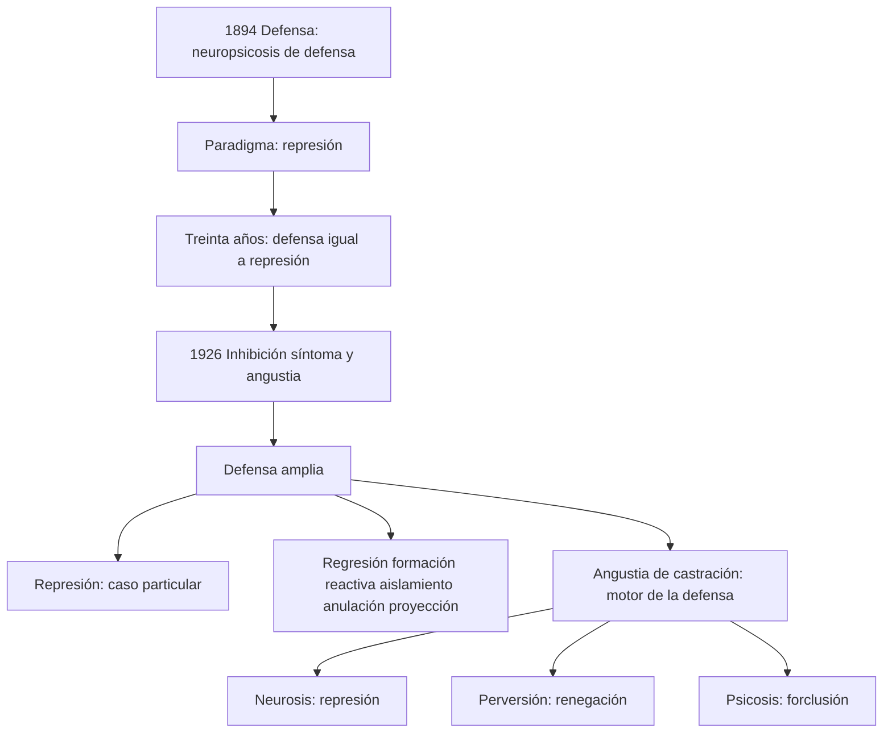
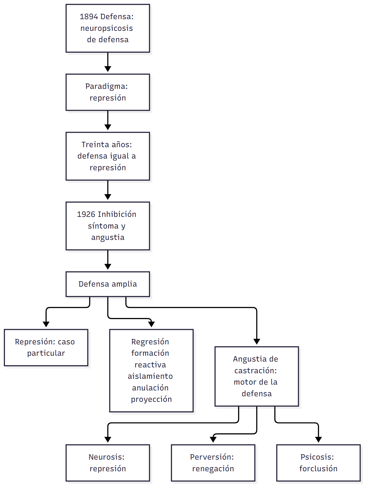

# Transversal — Sobre el concepto de defensa (U3 + U4)

> **Fuente:** Belucci, *Sobre el concepto de defensa* (T03, ficha de cátedra) · Belucci, *Introducción al diagnóstico de estructura* (T01, pp. 2-4) · Freud, *Las neuropsicosis de defensa* (T02, 1894) · Freud, *Inhibición, síntoma y angustia* (T08, 1926) · tus apuntes de la clase 12 (8/6/2026) · **Materia:** Psicoanálisis, 2.º año, Favaloro.
>
> **Cómo se cita:** «p. N» es la marca `## Página N` del texto extraído (T03, T01, T02). T08 no tiene páginas: se cita por tema. Lo que no está en los textos va marcado **▸ Complemento**.

> **Idea-fuerza:** la defensa es el **primer concepto freudiano** (1894) y durante treinta años fue sinónimo de **represión**. En 1926 Freud los separa: la **defensa** es el concepto amplio —la respuesta del yo al peligro que la angustia señala— y la **represión** es *un* procedimiento entre otros. Eso permite dos cosas: pensar **qué defensa define cada condición de estructura** (represión en la neurosis, renegación en la perversión, forclusión en la psicosis) y **qué procedimientos típicos usa cada modalidad de neurosis** (histeria, obsesión, fobia).

## Hilo conductor: cómo se conectan los temas de esta guía

La guía cuenta una sola historia en tres movimientos. **Primero** (pregunta 1), Freud nombra la **defensa** en 1894 para explicar por qué la histeria, las obsesiones y las fobias responden al tratamiento por la palabra: el yo no puede tramitar una representación con un afecto penoso y **separa representación y afecto**. Ese mecanismo es la **represión**, y durante treinta años defensa y represión son casi sinónimos. En 1926, con *Inhibición, síntoma y angustia*, Freud descubre que con un único mecanismo no alcanza para distinguir modalidades ni para dar cuenta de la clínica de una misma neurosis: **reintroduce la defensa como concepto amplio**, la respuesta del yo al peligro que **la angustia señala**, y la represión pasa a ser **un procedimiento entre otros**. Ese giro es el punto de partida de todo lo que sigue: si hay muchos procedimientos, se puede preguntar **cuáles caracterizan a cada cosa**.

**Segundo** (pregunta 2), la respuesta se da en el nivel más general, el de las **condiciones de estructura**: cada una se define por una **operación constitutiva**, la **represión** en la neurosis, la **renegación o desmentida** de la castración en la perversión y la **forclusión del Nombre-del-Padre** en la psicosis. Aquí la defensa deja de ser un mecanismo del síntoma y pasa a ser una **posición del sujeto frente a la falta en el Otro**. Esto conecta con el comienzo: la «desestimación» que Freud ya había visto en 1894 en la confusión alucinatoria es el antecedente de lo que Lacan llamará forclusión.

**Tercero** (pregunta 3), se baja al nivel de las **modalidades de la neurosis**, donde ya no alcanza con «represión» a secas: la **histeria** responde casi solo con represión (conversión, asco); la **neurosis obsesiva** agrega **regresión sádico-anal, formación reactiva, aislamiento, anulación y racionalización**; la **fobia**, regresión oral y **proyección** (desplazamiento al objeto fobígeno, evitación, inhibición). El hilo que une los tres movimientos es la **angustia**: es ella la que motiva la defensa (angustia de castración), la que **crea la represión** y la que cada procedimiento intenta acotar.

**Para el parcial:** cuando una pregunta pida «defensa», conviene recorrer siempre los tres niveles: *concepto* (1894 → 1926), *estructura* (represión / renegación / forclusión) y *modalidad* (qué procedimientos usa cada neurosis). Y recordar que la defensa es **la parte inconsciente del yo**: el yo no sabe qué procedimiento usa.

**En una sola oración:** la defensa pasó de ser un sinónimo de represión a ser la respuesta del yo a la angustia, y eso permite definir qué hace cada estructura y cada neurosis con la falta.

## 0. Hoja de ruta

1. **De la defensa a la represión y de vuelta** (1894 → 1926): qué recorrido hace Freud y por qué reintroduce la defensa.
2. **Operaciones constitutivas de cada condición de estructura** (neurosis, perversión, psicosis).
3. **Variantes defensivas típicas de cada neurosis** (histeria, obsesiva, fobia) y catálogo de los procedimientos.

## 🎯 Lo que entra sí o sí

1. **1894:** neuropsicosis de defensa (histeria, obsesiones, un grupo de fobias, amentia; luego paranoia); la defensa separa **representación y afecto**; paradigma = represión; 30 años de equivalencia.
2. **Por qué 1926:** un solo mecanismo no permite diferenciar modalidades; incluso en una misma modalidad hace falta una **variedad de procedimientos**. La represión pasa a ser **caso particular**.
3. **Defensa ↔ angustia ↔ conflicto:** tres tipos de angustia (neurótica, realista, de la conciencia moral) = tres conflictos; **la angustia de castración es el motor de la defensa**; la angustia **crea** la represión.
4. **Operaciones constitutivas:** **represión** (neurosis), **renegación/desmentida** de la castración en el Otro (perversión), **forclusión del Nombre-del-Padre** (psicosis).
5. **Variantes por neurosis:** histeria = casi solo represión (conversión, asco); obsesiva = regresión sádico-anal + formación reactiva, aislamiento, anulación, racionalización, defensas intelectuales; fobia = regresión oral + proyección (desplazamiento al objeto fobígeno, evitación, inhibición).
6. La defensa es **la parte inconsciente del yo**: el yo desconoce sus procedimientos.

---

## 1. Primera pregunta — El recorrido de la defensa basada en la represión y el retorno al concepto en 1926

> *¿Qué recorrido hace Freud a partir del paradigma de la defensa basada en la represión? ¿Por qué y cómo retoma el concepto de defensa en 1926?*

### 1.1 Respuesta modelo

Belucci afirma que «la defensa puede considerarse genuinamente **el primer concepto freudiano**» (T03, p. 1). Freud la introduce en **1894** en *Las neuropsicosis de defensa*, donde propone una nueva concepción de la **histeria**, de las **representaciones obsesivas**, de un grupo de **fobias** y de una forma de psicosis alucinatoria aguda (la *amentia* de Meynert), a las que un año después agrega la **paranoia**; las dos últimas serían pensadas más tarde como psicosis, las tres primeras constituirían las neurosis. El denominador común era que todas respondían favorablemente al **tratamiento por la palabra** (asociaciones al comienzo dirigidas, luego «libres» sobre los síntomas): se producía una secuencia de recuerdos con afectos hasta llegar a un recuerdo cuyo afecto concomitante hacía **desaparecer el síntoma**. Freud infirió el mecanismo invirtiendo la secuencia: al comienzo se presentó al yo una **representación acompañada de un afecto tan penoso** que el yo la habría eliminado si hubiese podido; no pudiendo, la solución fue **separar la representación y el afecto** (la energía psíquica registrada como afecto): la energía pasa a otra representación (que se vuelve **obsesiva**) o a una inervación corporal (síntoma **conversivo histérico**), y la representación «dejaría de plantear exigencias al trabajo asociativo»: queda **reprimida**, inconsciente (T03, p. 1; T02, p. 6). «Desde el comienzo, entonces, **el paradigma de la defensa fue la operación llamada represión**»; aunque Freud distinguía una modalidad «más enérgica y eficaz» (rechazar como un bloque la representación y su afecto, la desestimación que conduce a la psicosis), pronto el término «defensa» **fue abandonado y sustituido por «represión»**: durante **treinta años** fueron equivalentes (T03, p. 1).

En **1926**, en *Inhibición, síntoma y angustia*, Freud **reintroduce la defensa como algo más amplio que la represión, que pasa a ser un caso particular**. Lo hace por **dos razones** (T03, p. 1): (1) la referencia a **un mecanismo único** dificultaba conceptualizar las **diferencias entre modalidades patológicas**, que quedaban reducidas al mecanismo de formación de síntomas; (2) **dentro de una misma modalidad** (por ejemplo, la neurosis obsesiva) se volvió evidente en el trabajo clínico que era preciso postular **una variedad de procedimientos defensivos**, aun contando con la represión. **Cómo la retoma:** (a) la defensa se piensa **como respuesta a las distintas modalidades de la angustia**: Freud diferencia entre **angustia neurótica** (referencia última: la castración; conflicto yo–ello), **angustia realista** (*Realangst*; peligro exterior; conflicto yo–mundo exterior) y **angustia de la conciencia moral** (conflicto yo–superyó) (T03, pp. 1-2); (b) **la angustia de castración es el motor de la defensa**: «angustia, conflicto y defensa aparecen como tres términos estrechamente vinculados» (T03, p. 2); (c) se invierte el vínculo entre angustia y represión: «aquí **la angustia crea la represión** y no —como yo opinaba antes— la represión a la angustia» (T08); y (d) se amplía el catálogo de procedimientos (regresión, formación reactiva, aislamiento, anulación…), que Anna Freud sistematizó en *El yo y los mecanismos de defensa* (1936) y que se vuelve habitual llamar «mecanismos de defensa» (T03, p. 2).

### 1.2 Desarrollo ampliado

#### a) 1894: la defensa en *Las neuropsicosis de defensa* (T02)

- Ya está en la guía C13 el detalle: inconciliabilidad, empeño voluntario, representación debilitada y afecto divorciado; **conversión** (histeria); **trasporte del afecto o «enlace falso»** (obsesiones/fobias); **desestimación (*verwerfen*)** (confusión alucinatoria) → `C13_EstructuraYTiemposDeLaNeurosis_Guia.md §1`.
- La modalidad más enérgica (T02, p. 15): «el yo desestima la representación insoportable junto con su afecto y se comporta como si la representación nunca hubiera comparecido» → psicosis. Esta es el **antecedente** de lo que Lacan llamará forclusión (§2).
- Los pacientes de Freud recordaban su «empeño defensivo» (ahuyentar, no pensar, sofocar): ejemplos de la joven que cuidaba a su padre y la gobernanta enamorada del patrón (T02, p. 5).
- **Primera aparición del término «defensa»** en un escrito de Freud (nota del traductor en T02, p. 5): el concepto ya estaba establecido en la «Comunicación preliminar» (1893).

#### b) La represión como paradigma (T03, pp. 2-3)

- **Definición amplia:** «desalojar de la conciencia, o impedir que ingrese a ella, un “representante psíquico” (pensamiento o recuerdo) que acarrea o acarrearía displacer (y, en última instancia, angustia)». Sus características se identificaron en las histéricas, pero es propia de **todas las neurosis**, se expresen patológicamente o permanezcan como condición constitutiva; para Freud la diferencia entre «normalidad» y neurosis es **de grado y no de esencia**.
- **Represión primordial** (inferible lógicamente, no constatable; núcleo del inconsciente; justifica que nunca sea posible volver consciente todo lo inconsciente) y **represión propiamente dicha** (constatable; afecta ideas con conexión asociativa con lo reprimido).
- **Consecuencia registrable:** la **amnesia** (Dora había olvidado la fuente de sus conocimientos sexuales: conversaciones con una amiga de la familia, su lugar en las relaciones de Dora con los hombres, y la represión de la sexualidad infantil).
- **«Individual y móvil»:** lo reprimido puede dejar de estarlo y viceversa.
- **Contrainvestidura:** gasto permanente para oponerse al acceso a la conciencia.
- **Retorno de lo reprimido**, por conexión con un sustituto: **acto fallido** («Declaro cerrada la sesión»), **sueños**, **síntomas** (parálisis de la pierna / pierna del padre enfermo), **chiste**. La represión se manifiesta especialmente **en el discurso** (como ausencia o por sustitutos) y puede suponerse operando en síntomas y acciones (llegar tarde, olvidar), siempre que se los pueda situar en relación de sustitución con un representante reprimido; esta lectura **requiere de un analista, un contexto y las asociaciones del sujeto**: «las interpretaciones que no se enmarcan en estas coordenadas pueden considerarse aberrantes».
- **La defensa es el aspecto inconsciente del yo (T03, p. 2):** la defensa es puesta en marcha por el yo pero, a diferencia de la percepción o la atención, «constituye su **aspecto inconsciente**, ya que el yo desconoce los procedimientos defensivos que implementa. Es posible hacer consciente para alguien la utilización de determinada modalidad defensiva, pero **su funcionamiento nunca lo es**».

#### c) 1926: el giro en *Inhibición, síntoma y angustia* (T08 y T03)

- **Defensa vs. represión (T08, apartado de la neurosis obsesiva):** «En este punto es ventajoso distinguir entre la tendencia más general de la “defensa”, y la “represión”, que es sólo **uno de los mecanismos** de que se vale aquella.» Admite como **nuevo mecanismo de defensa**, junto a la regresión y la represión, las **formaciones reactivas**.
- **Variedad de recursos del yo (T08, apartado de Hans):** «la represión no es el único recurso de que dispone el yo para defenderse de una moción pulsional desagradable. Si el yo consigue llevar la pulsión a la **regresión**, en el fondo la daña de manera más enérgica de lo que sería posible mediante la represión»; también la **mudanza hacia la parte contraria** (*Verwandlung ins Gegenteil*), el **desplazamiento** (fobia), el **aislamiento** y la **anulación**.
- **Angustia y represión:** en las fobias «la actitud angustiada del yo es siempre lo primario y es la impulsión para la represión»; «la angustia nunca proviene de la libido reprimida». → conecta con `C14_SintomaFantasmaYAngustia_Guia.md §5`.
- **Tipos de angustia y conflictos (T03, pp. 1-2):** neurótica ↔ yo–ello (referencia última: castración); realista ↔ yo–mundo exterior; conciencia moral ↔ yo–superyó. Y «en *IS&A* la angustia de castración sería considerada el **motor de la defensa**».
- **Después de 1926 (T03, p. 2):** Freud y otros caracterizan modalidades defensivas de **otras patologías** (perversión y psicosis; «esa discusión pertenece al terreno de la psicopatología»), y describen procedimientos usados tanto en la «normalidad» como en la neurosis. **Diferencia normal/neurótico: el abanico de procedimientos y la flexibilidad de su uso** (más pobreza y rigidez en la neurosis; más riqueza y plasticidad en la salud). Desde *El yo y los mecanismos de defensa* (1936, Anna Freud) se habla de «mecanismos de defensa».
- **Apuntes de la clase 12 (8/6/2026):** «Estructuras: los tipos de relaciones con el Otro.» Biblio: «Sobre el concepto de defensa (LEERLO)». «Lacan: icc como estructura de discurso.» **Regresión:** «cuando, en la pubertad, se vuelve al deseo que fue llevado a latente por el Complejo de Edipo.»

> 🔑 **Punto clave:** 1894 → defensa (concepto amplio, pero con la represión como paradigma) → «defensa» abandonada, 30 años como sinónimo de represión → 1926 → defensa amplia, **represión caso particular**, con la angustia como motor. Dos razones: **diferenciar modalidades** y **dar cuenta de la variedad de procedimientos dentro de una misma modalidad**.

---

## 2. Segunda pregunta — Las operaciones constitutivas de cada condición de estructura

> *¿Cuáles son las operaciones constitutivas de cada una de las condiciones de estructura?*

### 2.1 Respuesta modelo

Para Belucci el **diagnóstico en psicoanálisis** es una conjetura con dos coordenadas: la **estructura** y la **posición del sujeto**. La estructura es una idea de **Lacan**, no de Freud: no hay sujeto sin el **Otro** (lugar virtual; el conjunto de marcas significantes que lo determinaron), afectado por un punto de inconsistencia (**Ⱥ**) que no da cuenta del *ser* del sujeto, y al que se agrega el factor económico freudiano, que Lacan conceptualiza como **goce**. **El operador fundamental es el Padre**, y la institución o no de ese operador, y el modo en que se inscribe, da lugar a un **número limitado de condiciones de estructura: neurosis, perversión y psicosis**. Cada una está determinada por una **operación constitutiva** o, en términos freudianos, por un **procedimiento defensivo** (T01, p. 2): la **represión** para la **neurosis**; la **renegación o desmentida** (*Verleugnung*), en particular cuando concierne a la **castración en el Otro**, para la **perversión**; y la **forclusión del Nombre-del-Padre** para las **psicosis**.

**En la neurosis**, la represión («**no querer saber de eso**», T01, p. 3) opera sobre la falta en el Otro, inscripta como castración por la Ley paterna; el sujeto solo puede preguntarse «¿Qué soy ahí?», y se da respuestas (fantasma, ideales, yo). **En la perversión**, la renegación consiste en **registrar el hecho desagradable manteniendo la convicción de que las cosas podrían seguir como si no existiera** (T03, p. 7): el perverso **sabe** de la castración y pretende **no ser afectado por ella**; consecuencia freudiana: la **escisión del yo**. **En las psicosis**, la forclusión significa que, si el Nombre-del-Padre no ocupó su lugar en el Otro **en el origen mismo de la estructura**, no podrá disponerse de él después: **no es fechable**, «sólo se puede decir que ocurrió o no ocurrió»; es la contracara de la metáfora paterna, y como esta es condición del Edipo, **en las psicosis no hay Edipo**. Además, cada sujeto presenta, junto a la operación constitutiva, **un abanico de procedimientos defensivos que marcan su «estilo»** (T01, p. 2).

### 2.2 Desarrollo ampliado

#### a) Premisas de la estructura (T01, pp. 1-3)

- **Diagnóstico = conjetura abierta:** «Decir, por ejemplo, que un caso puede pensarse como una neurosis, o más específicamente como una fobia, es decir algo fundamental y es al mismo tiempo decir muy poco» (T01, p. 1).
- **Estructura:** el Otro «como lugar virtual, equivalente al modo en que el lenguaje determina la constitución del sujeto»: no el lenguaje universal sino el modo singular en que marcó a cada quien; Lacan lo compara a un **set de cartas** («las cartas que a cada uno le tocaron en suerte»). «No hay sujeto por fuera de esa determinación.» El Otro está afectado de un punto de **inconsistencia** inherente (**Ⱥ**): no recubre todo y **no da cuenta del ser del sujeto**. No puede garantizar frente al **exceso de goce** (lo que Freud llamaba **trauma**; «la perturbación económica es el núcleo genuino del peligro»).
- **El Padre** (con mayúscula: función y operador de la estructura, no la persona ni las versiones del padre) (T01, p. 2, nota).
- **Se constituyen en la infancia** y, una vez constituidas, **no son reversibles**: la condición de estructura delimita los márgenes en los que se podrá producir la respuesta del sujeto; otro es el caso de la clínica con niños pequeños (T01, p. 2).
- «El sujeto es de hecho, para Lacan, **lo que responde al Otro**» (T01, p. 2).
- **Tus apuntes (clase 13):** «SIEMPRE que se hable de SUJETO, se habla de LACAN»; «Cada estructura tiene su mecanismo de defensa constitutivo. Cuando vemos un mecanismo de defensa ya sabemos la estructura.»

#### b) Neurosis: la represión (T01, pp. 3-4; T03, pp. 2-3)

- **Condición de estructura** en la que la inconsistencia del Otro **se inscribe como falta** (castración): carácter **necesario**, por la **Ley paterna**. Consecuencia: **clínica de la pregunta**.
- **Represión** = «no querer saber de eso» (de la falta en el Otro y de lo traumático del goce) (T01, p. 3). Es constitutiva de todas las modalidades, pero **no igualmente eficaz** (T01, p. 4): en la histeria lo es; en las otras dos no.
- → conecta con §3 y con `C13_EstructuraYTiemposDeLaNeurosis_Guia.md §4`.
- **Tus apuntes (clase 12):** «**Neurosis:** la represión como mecanismo de defensa. El Otro me dará sus significantes. Siempre quiere saber qué desea. “¿Qué soy? ¿Qué significo para el otro?”» (clase 13): «Represión (metáfora paterna) — Tiene deseo, el deseo del otro. Se ubica en el otro en falta.»

#### c) Perversión: la renegación (T03, pp. 7-8; T01, pp. 10-15)

- **Renegación/desmentida (*Verleugnung*)** (T03, p. 7): «operación defensiva que consiste en **registrar un hecho desagradable para el yo, manteniendo al mismo tiempo la convicción de que las cosas podrían seguir como si eso no existiera**». **Paradigma** (Freud): el niño pequeño que descubre que sus deseos incestuosos lo llevan a confrontar la autoridad del padre y suponen un peligro para su integridad (angustia de castración); toma regularmente una **doble actitud**: registra el hecho y el peligro (con angustia) y a la vez mantiene la creencia de que puede perseverar en sus deseos incestuosos hacia la madre.
- **Normalmente** le sigue la represión de esos deseos (condición de la neurosis). **En quienes serán perversos**, la renegación se vuelve **el modo privilegiado de respuesta a la angustia**: cada vez que esta se manifiesta, el perverso hace una maniobra que le permite creer que la amenaza no lo concierne; así persevera en un modo de satisfacción al que de otro modo debería renunciar, y se libra de la angustia **provocándola en el otro** (T03, pp. 7-8).
- **Los neuróticos también la usan a veces** (T03, p. 8): solo es característica de la perversión si es el modo privilegiado. **Ejemplos:** el familiar de un adicto que no reconoce que el comportamiento es extraño (mantiene la creencia en un funcionamiento «normal» de la familia); quienes ante una crisis financiera inminente siguen confiando sus ahorros a los bancos como si nada; quienes declaman el respeto a las leyes y cruzan un semáforo en rojo.
- **Consecuencia:** **escisión del yo**, distinta de la separación consciente/inconsciente, porque ambas corrientes psíquicas corresponden al yo (T03, p. 8). Freud 1938 (*La escisión del yo en el proceso de defensa*): el yo queda desgarrado en dos zonas separadas: una con el saber sobre la realidad penosa y otra donde no se hace lugar a sus consecuencias; los perversos funcionan **a modo neurótico en todo lo que no ponga en juego su posición ante la castración** (T01, p. 11).
- **Negación ≠ renegación (T03, pp. 7-8):** la **negación** (*Verneinung*) opera sobre **pensamientos inaceptables**, supone la represión y la afirmación previa; la **renegación/desmentida** (*Verleugnung*) concierne a **aspectos desagradables de la realidad**. Son confundidas con frecuencia y **de ningún modo equivalentes**.
- **Belucci/Lacan (T01, pp. 11-12):** la operación fundamental del perverso es una **Verleugnung de la falta en el Otro**: la perversión se define como la condición que consiste en **saber de la falta en el Otro, pero apuntando a colmarla**; clínica de la **demostración** (frente a clínica de la pregunta —neurosis— y de la respuesta anticipada —psicosis—). → `C16_LaPerversionEnFreudYLacan_Guia.md`.
- **Tus apuntes (clase 12):** «**Perversión:** la desmentida como mecanismo de defensa. Si niego algo, acepto que existe, pero si lo desmiento, lo ignoro. El perverso nunca sentirá culpa. El perverso cree que sabe qué es lo que el otro desea. Disfruta el causar placer en otro, y quitárselo. (En Freud se desmiente la castración.)» (clase 13): «Desmentida. Se pretende sostener un goce eficaz donde hay falta.»

#### d) Psicosis: la forclusión del Nombre-del-Padre (T01, pp. 15-16; T02, p. 15)

- **Antecedente freudiano:** la **desestimación (*Verwerfung*)** de 1894 (T02, p. 15): «el yo desestima la representación insoportable junto con su afecto y se comporta como si nunca hubiera comparecido»; conduce a la «confusión alucinatoria». En T02 (p. 16): al desprenderse de la representación inseparable de un fragmento de realidad, el yo se desase también total o parcialmente de la realidad objetiva.
- **Lacan (1958):** «forclusión» (término jurídico francés: un derecho o facultad no ejercido a su debido tiempo no puede ya ejercerse): si el Nombre-del-Padre **no ocupó su lugar en el Otro en el origen mismo de la estructura, no podrá disponerse de él cuando se lo requiera** y **el lazo del sujeto a su Otro no estará ordenado por la Ley** (T01, p. 16). Es la **contracara de la metáfora paterna**; solo se puede decir que **ocurrió o no ocurrió** (no es fechable ni se despliega en la diacronía); **en las psicosis no hay Edipo**.
- **Consecuencias:** forcluida la Ley, **ni el límite ni la salida** están garantizados; el sujeto debe suplir lo que la estructura no aporta; si fracasa, queda ante un **goce potencialmente ilimitado y arrasador**, entre la «encerrona endogámica» y la «errancia»; **elisión del falo**; no extracción del objeto *a*; fuera de discurso (T01, pp. 15-18). → `C17_18_PsicosisYForclusionDelNombreDelPadre_Guia.md`.
- **Aclaración de Belucci:** discute críticamente la noción de «forclusión local» (T01, p. 26, n. 53).
- **Tus apuntes (clase 12):** «**Psicosis:** el psicótico no tiene registro de un “Otro”. La forclusión del Nombre del Padre como mecanismo de defensa.» (clase 13): «No inscripción de la “ley”: ve el goce del Otro como algo que lo invade (por eso tiene voces imaginarias).»

#### e) Cuadro integrador

| | **Neurosis** | **Perversión** | **Psicosis** |
|---|---|---|---|
| Operación constitutiva | **Represión** | **Renegación/desmentida** (de la castración en el Otro) | **Forclusión del Nombre-del-Padre** |
| Qué hace con la falta en el Otro | **No quiere saber** de eso | **Sabe**, pero pretende que no lo concierne y apunta a colmarla | No se inscribió: **no hay límite ni salida** |
| Precursor freudiano | Represión (1894, 1915) | *Verleugnung* (1927-38) | *Verwerfung* (1894) |
| Clínica | De la **pregunta** | De la **demostración** | De la **respuesta anticipada** |
| Consecuencia | Retorno de lo reprimido (síntoma, sueño, acto fallido, chiste) | **Escisión del yo** | Fenómenos elementales, suplencias, desencadenamiento |
| Fantasma | ($◊a) | (a◊$) | Fracaso radical del fantasma |

> 🔑 **Punto clave:** la operación constitutiva responde al modo en que **se inscribe la Ley del Padre** en la estructura; además de ella, cada sujeto tiene un abanico de procedimientos que forman su «estilo». **Defensa constitutiva = estructura**.

---

## 3. Tercera pregunta — Las variantes defensivas típicas de cada modalidad de la neurosis

> *¿Cuáles son las variantes defensivas típicas de cada una de las distintas modalidades de la neurosis?*

### 3.1 Respuesta modelo

La **represión** es la operación constitutiva de toda neurosis, pero **no es igualmente eficaz** en las tres modalidades (T01, p. 4). En la **histeria** lo es: la defensa casi se reduce a ella; el yo se extraña de la moción pulsional desagradable, la deja librada a su decurso en lo inconsciente y no participa en sus destinos; el procedimiento característico es la **conversión** (trasposición de la excitación a lo corporal) y el síntoma defensivo primario es el **asco** (T01, p. 4; T02; T08). En la **neurosis obsesiva**, la importancia que asume la **regresión al erotismo sádico-anal** —«como modo de eludir la castración»— condiciona un **fracaso mayor de la represión** y, con él, el recurso a otros procedimientos: **formación reactiva, aislamiento, anulación, racionalización y otras «defensas intelectuales»**; la regresión, la formación reactiva, el aislamiento, la anulación y las defensas intelectuales forman el grupo de las «**defensas obsesivas**» (T03, pp. 4-6; T01, p. 4; T08). En las **fobias**, Freud sitúa **cierta regresión al erotismo oral** y destaca la **proyección** (el miedo al objeto traduce el peligro de la pulsión, que en definitiva es el de la castración); la formación sintomática es **precaria** —el síntoma no releva el desarrollo de angustia— y de ahí la importancia de la **evitación y la inhibición**; el síntoma fóbico se produce por **desplazamiento** (el padre sustituido por el animal) (T01, p. 4; T08).

### 3.2 Desarrollo ampliado

#### a) Histeria (T01, p. 4; T02; T08; T03)

- **Represión eficaz;** «la defensa casi se reduce únicamente a ella» (T01, p. 4).
- **Síntoma primario:** conversión de la excitación sexual en **displacer —el asco—** (1901: «yo llamaría “histérica”, sin vacilar, a toda persona... en quien una ocasión de excitación sexual provoca predominante o exclusivamente sentimientos de displacer», T01, p. 4). En T08 (cap. I): el **asco** como síntoma defensivo, «reacción sobrevenida con posterioridad frente al acto sexual vivenciado de manera pasiva».
- **Conversión:** la histeria traspone a lo corporal la suma de excitación (T02, pp. 6-8).
- **T08 (conclusión sobre la histeria):** «Parece que se limita a la represión; en efecto, el yo se extraña de la moción pulsional desagradable, la deja librada a su decurso dentro de lo inconsciente y no participa en sus ulteriores destinos. Por cierto que esto no puede ser correcto así, de una manera tan exclusiva, pues conocemos el caso en que el síntoma histérico significa al mismo tiempo el cumplimiento de un reclamo punitorio del superyó.» Las **formaciones reactivas** «parecen faltar en la histeria, o ser en ella mucho más débiles».
- **Amnesia:** en la histeria es posible relegar a la amnesia una impresión traumática (T08, apartado sobre el aislamiento).
- **Condición de angustia:** la **pérdida de amor** (T08, cap. VIII) y la histeria con mayor afinidad con la feminidad.
- **Función en el lazo:** la histérica se mueve en el plano del deseo (T01, p. 5), toma su punto de apoyo en el deseo del Otro y denuncia las faltas (T01, p. 7): → `C15_FobiaHisteriaYNeurosisObsesiva_Guia.md`.

#### b) Neurosis obsesiva (T01, p. 4; T03, pp. 4-6; T08)

- **Regresión** (T03, pp. 3-4; T08): retorno a modos de funcionamiento anteriores; **requiere el fracaso de otros modos** (*Versagung*: «mal funcionamiento»); se relaciona con la **fijación**. En la obsesión: **regresión del genital (fálico) al estadio sádico-anal**: «Este hecho de la regresión continúa siendo determinante para todo lo que sigue» (T08). **Explicación metapsicológica:** una «**desmezcla de pulsiones**» (segregación de los componentes eróticos que al comienzo de la fase genital se habían sumado a las investiduras destructivas de la fase sádica). La regresión es «el primer éxito del yo en la lucha defensiva contra la exigencia de la libido».
- **Formación reactiva** (T03, p. 4): procedimiento que **acentúa una tendencia opuesta a otra inaceptable**, que permanece desconocida; puede ser situacional o constituir **rasgos de carácter**. **Ejemplos:** la madre que intensifica las actitudes amorosas para sofocar la hostilidad hacia el hijo (amor «asfixiante»); inversamente, la hostilidad que se incrementa hacia alguien por quien hay atracción inadmisible. En la obsesión: ante el predominio regresivo sádico-anal hay un monto mayor de impulsos crueles, pero se ha desarrollado una fuerte tendencia a la **compasión y al «buen trato»** (sujetos amables y correctos); la **limpieza** es formación reactiva que encubre la satisfacción de ensuciar. Son socialmente «útiles» pero patológicos por la **rigidez y empobrecimiento libidinal** (gran gasto energético) y por las condiciones que dan a síntomas (T03, p. 4). En T08: «el yo desarrolla, en obediencia al superyó, elevadas formaciones reactivas de la conciencia moral, la compasión, la limpieza»; son **exageraciones de la formación normal del carácter**.
- **Aislamiento** (T03, pp. 4-5; T08): **cortar las conexiones de un pensamiento con otros, o de una acción con el resto de la existencia**. En el discurso: relatar un hecho sin advertir el nexo con otros aspectos. **Ejemplo (T03):** el paciente obsesivo que debía elegir entre la empresa familiar y su profesión; relató que su padre, cercano a recibirse, había renunciado a su carrera al fallecer el abuelo, sin advertir la conexión. Variante de Fenichel: separar componentes sensuales y tiernos del erotismo (la mujer amada idealmente y a la que se «respeta» pero no se desea; la otra con quien hay contacto sexual satisfactorio, pero no se ama), o resolver la **ambivalencia** dirigiendo el amor a una persona y el odio a un tercero (suegra y nuera). **Freud (T08):** técnica motriz: tras un suceso desagradable, o una actividad significativa, se **interpola una pausa en la que no debe acontecer nada**; la vivencia no se olvida pero se la **despoja de su afecto** y de sus vínculos asociativos: efecto semejante a la represión con amnesia (la neurosis obsesiva no suele lograr la amnesia). Se relaciona con el **tabú del contacto** y con las dificultades del obsesivo con la **regla fundamental**.
- **Anulación** (T03, p. 5; T08: *Ungeschehenmachen*): tentativa de **cancelar actos realmente realizados como si nunca hubieran tenido lugar**, con actos de sentido opuesto o una maniobra discursiva. **Ejemplo del Hombre de las Ratas:** la piedra en el camino por el que pasará el carruaje de su amada; la quita pensando que podría accidentarse y poco después, compulsivamente, la vuelve a poner diciéndose que era ridículo; Freud lee una corriente hostil que busca anular la acción amorosa. Discursivamente: el paciente que dice haber estado con todas sus parejas «porque se había dado», borrando sus elecciones. **Freud (T08):** «magia negativa»; **síntomas de dos tiempos** (un segundo acto cancela el primero); segunda raíz del ceremonial; vinculada a la **compulsión de repetición** («lo que no ha acontecido como debía se anula repitiéndolo de modo diverso»).
- **Racionalización y «defensas intelectuales»** (T03, p. 6): **racionalización** = dar una explicación lógicamente coherente o moralmente aceptable de una acción cuyos motivos verdaderos se desconocen (el Hombre de las Ratas que vuelve a poner la piedra «porque era ridículo»; el selector que rechaza candidatas por «perfil» y es misógino; el moralista «compasivo»), difícil de desarticular porque deja los actos «inatacables». **Defensas intelectuales:** **generalización** y uso de términos impersonales («uno», «se»: «Uno no sabe lo difícil que es esto hasta que le pasa»); presentar como **«ideas»** deseos, impulsos, sentimientos, **despojándolos de su componente afectivo** (el Hombre de las Ratas: la «idea» de que su padre moriría, que era un intenso temor que encubría un no menos intenso deseo).
- **Lo que retorna en la obsesión (T08):** el **afecto ahorrado** sale a la luz en otro lugar: el **superyó** se comporta como si no hubiera habido represión y trata al yo en consecuencia: **sentimiento de culpa** inexplicable; si no, el yo lo ahorra con **acciones de penitencia y limitaciones de autopunición**, que satisfacen **mociones masoquistas**; la **parálisis de la voluntad** como resultado extremo.
- **Defensas obsesivas (T03, p. 5):** «la anulación forma parte del grupo de las **defensas obsesivas**, junto con la regresión, la formación reactiva, el aislamiento y las defensas intelectuales».
- **Belucci (T01, pp. 5-6, 8):** el obsesivo mantiene el deseo a distancia y bajo control; **degrada el deseo a demanda**; se ubica como esclavo del Amo; oscila entre **destituir y restituir al Otro** (**ambivalencia**); ejemplos de la planilla de Excel y de «permiso-perdón» → `C15`.

#### c) Fobias (T01, pp. 3-6, 8-9; T08)

- **Regresión al erotismo oral** (T01, p. 4; T08: Hans: «ser mordido»; Hombre de los Lobos: «ser devorado»: degradación a la fase oral; T08: ser devorado por el padre = expresión regresiva de una moción tierna pasiva).
- **Proyección** (T01, p. 4; T08, apartado final de fobias): «**Ya una vez he adscrito a la fobia el carácter de una proyección, pues sustituye un peligro pulsional interior por un peligro de percepción exterior**», que puede evitarse con la huida y la evitación de percibirlo; «mi puntualización no era incorrecta, pero se quedaba en la superficie»: la exigencia pulsional es peligrosa porque conlleva el peligro exterior de la **castración**. Belucci: «el miedo al objeto traduce el peligro de la pulsión, aunque finalmente Freud ubica el peligro como el de la castración».
- **Definición de proyección** (T03, p. 6): **atribuir a otro pensamientos, afectos o actitudes propios, en particular los inaceptables**. Freud distingue **proyección normal** (la atracción erótica atribuida al otro retorna al sujeto en un segundo tiempo como pregunta: «¿realmente hay interés o me lo imagino?») y **patológica** (la pregunta no puede plantearse: celos, y en la **paranoia** la atribución con total certeza: erotomanía, delirio de celos, persecución) (T03, pp. 6-7). → no confundir con la proyección fóbica.
- **Desplazamiento:** el padre sustituido por el animal (T08).
- **Evitación e inhibición:** la angustia de la fobia es «facultativa» (emerge cuando se percibe el objeto); Hans se prohíbe salir; precariedad del síntoma → inhibición (T01, p. 3).
- **Otros rasgos** (T01, pp. 6-9): deseo **prevenido**, la fobia como **placa giratoria** (Lacan, Seminario 16) hacia otra posición, **suplencia del padre** (caballo), no hay **escena** o es fallida.
- **Agorafobia:** limitación para sustraerse del peligro pulsional; regresión temporal a la infancia (T08).

#### d) Otros procedimientos del catálogo (T03, pp. 6-8)

- **Negación** (*Verneinung*; T03, p. 7): permitir la aparición en el discurso de un pensamiento inaceptable **con marca negativa**; evita su represión y facilita el reconocimiento de lo inconsciente; «toda negación enuncia aquello que niega» (afirmación previa). **Ejemplos:** el sueño de la mujer desconocida («seguramente no es mi madre»); «no es que quiera sexo descontrolado, pero algo más adulto»; «no digo que me lo quiera sacar de encima, pero por momentos me canso». **Klein** le da otro alcance (defensa temprana, ausencia absoluta de registro) y **no** coincide con el uso freudiano.
- **Sublimación** (T03, p. 8): «destino de pulsión»: sustituir la meta directa por otra **no sexual y socialmente valorada**; **la modalidad más eficaz de la defensa**, pues permite una verdadera descarga sin gasto energético permanente; límites a su magnitud (después se vuelve indispensable alguna satisfacción más directa; si no, favorece la defensa patológica). **Ejemplos:** el cirujano (impulsos crueles transformados, con alta valoración social); **Leonardo da Vinci** (placer de ver que le llevaba a demorar las obras; Freud conjetura). Toda actividad intelectual o artística supone para Freud componentes pulsionales sublimados. Fenichel amplía el término a todas las defensas exitosas: **excesivo**, desdibuja la especificidad.
- **Normalidad vs. neurosis (T03, p. 2):** abanico de procedimientos y flexibilidad.

#### e) Cuadro integrador de las modalidades

| | **Histeria** | **Neurosis obsesiva** | **Fobia** |
|---|---|---|---|
| Defensa principal | **Represión** (eficaz) + **conversión** | **Regresión** sádico-anal; la represión **fracasa más** | **Regresión oral** + **proyección** (desplazamiento al objeto fobígeno) |
| Procedimientos asociados | Asco (síntoma primario); amnesia; formaciones reactivas débiles | **Formación reactiva, aislamiento, anulación, racionalización, defensas intelectuales** | **Evitación e inhibición**; síntoma precario |
| Lo que retorna | Síntoma de conversión | Representación obsesiva, culpa, ceremoniales | Angustia ante el objeto fobígeno |
| Condición de angustia | Pérdida de amor (T08) | Angustia frente al **superyó** (T08) | **Castración** (T08) |
| Posición del padre/escena | Padre «amo castrado»; escena protagonizada | Padre potente, «perturbador del erotismo»; queda al margen | Inconsistencia del padre real; no hay escena |

> 🔑 **Punto clave:** la **represión** es común; lo que **discrimina** las neurosis es **cuánto resuelve la represión** y **qué otros recursos aparecen**. Histeria: casi solo represión; obsesiva: regresión + un abanico (formación reactiva, aislamiento, anulación, racionalización); fobia: regresión oral + proyección + evitación/inhibición.

---

## Diagrama

## 🚩 Errores típicos y trampas de examen

- **Decir que «defensa» y «represión» son siempre sinónimos**: lo fueron treinta años; desde 1926 la represión es un caso particular.
- **Confundir negación (*Verneinung*) y renegación/desmentida (*Verleugnung*)**: la primera sobre pensamientos inaceptables y presupone represión; la segunda sobre aspectos desagradables de la realidad (castración).
- **Decir que la desmentida es exclusiva de la perversión**: los neuróticos la usan a veces; es característica de la perversión cuando es **el modo privilegiado** de respuesta a la angustia.
- **Confundir *Verwerfung* (1894), antecedente freudiano, con la forclusión lacaniana del Nombre-del-Padre** (1958).
- **Atribuir la proyección fóbica a la paranoia**: la proyección «normal/patológica» de T03 (paranoia) y la proyección fóbica (peligro interno → externo evitable) no son lo mismo.
- **Pensar que la histeria usa solo conversión**: la conversión es su vía característica, pero lo central es que la defensa se reduce a la represión.
- **Olvidar que la defensa es inconsciente**: se puede hacer consciente la modalidad, **nunca su funcionamiento**.
- **Sobrestimar la angustia de castración como único motor**: ver `C14 §5` (pérdida de amor en la mujer; superyó en la obsesión).

## Articulación con el resto de la materia

| Va hacia / viene de | Cómo se conecta |
|---|---|
| `C13_EstructuraYTiemposDeLaNeurosis_Guia.md` | Defensa 1894, retorno de lo reprimido, regresión y fijación |
| `C14_SintomaFantasmaYAngustia_Guia.md` | La angustia como motor de la defensa; síntoma e inhibición |
| `C15_FobiaHisteriaYNeurosisObsesiva_Guia.md` | Modalidades de la neurosis |
| `C16_LaPerversionEnFreudYLacan_Guia.md` | Renegación y escisión del yo |
| `C17_18_PsicosisYForclusionDelNombreDelPadre_Guia.md` | *Verwerfung* → forclusión |
| `C03_LaRepresionYLasFormacionesDelInconsciente_Guia.md` | Represión primordial y propiamente dicha |

## Glosario

| Término | Definición breve |
|---|---|
| **Defensa** | Operación del yo contra lo inconciliable; primer concepto freudiano; amplia desde 1926 (T03, p. 1) |
| **Represión** | Desalojar de la conciencia o impedir su ingreso a un representante psíquico displacentero (T03, p. 2) |
| **Represión primordial / propiamente dicha** | Núcleo del inconsciente (inferida) / constatable, por conexión asociativa (T03, p. 2) |
| **Contrainvestidura** | Gasto permanente que sostiene la represión (T03, p. 3) |
| **Regresión** | Retorno a modos de funcionamiento y satisfacción anteriores (T03, p. 3) |
| **Fijación** | Libido adherida al modo anterior en el pasaje de una organización a otra (T03, p. 4) |
| **Formación reactiva** | Acentuar una tendencia opuesta a otra inaceptable (T03, p. 4) |
| **Aislamiento** | Cortar conexiones de un pensamiento/acción con otros (T03, p. 4) |
| **Anulación** | Cancelar actos realizados como si no hubieran ocurrido (T03, p. 5) |
| **Racionalización** | Explicación coherente o aceptable cuyos motivos verdaderos se desconocen (T03, p. 6) |
| **Proyección** | Atribuir a otro lo propio inaceptable; normal/patológica (T03, p. 6) |
| **Negación** (*Verneinung*) | Aparece lo inaceptable con marca negativa (T03, p. 7) |
| **Renegación/desmentida** (*Verleugnung*) | Registrar el hecho manteniendo la convicción contraria; escisión del yo (T03, p. 7) |
| **Sublimación** | Sustituir la meta sexual por una no sexual valorada; defensa más eficaz (T03, p. 8) |
| **Forclusión del Nombre-del-Padre** | Operación constitutiva de la psicosis (T01, p. 16) |
| **Mecanismos de defensa** | Denominación de los procedimientos desde A. Freud (1936) (T03, p. 2) |

## Autoevaluación (sin mirar la guía)

1. Reconstruí el recorrido de la defensa de 1894 a 1926 y explicá las dos razones por las que Freud la reintroduce.
2. ¿Qué relación hay entre los tres tipos de angustia, los tres conflictos y la defensa?
3. Nombrá la operación constitutiva de cada condición de estructura y dá una característica de cada una.
4. Diferenciá negación y renegación con un ejemplo.
5. ¿Por qué se dice que la represión «no es igualmente eficaz» en las tres neurosis?
6. Enumerá y ejemplificá los procedimientos de la neurosis obsesiva.
7. ¿Qué es la proyección en la fobia y en qué se diferencia de la proyección patológica de la paranoia?
8. ¿Qué es la sublimación y por qué es la defensa más eficaz? ¿Cuál es su límite?
9. ¿Cuál es el «estilo» defensivo de un sujeto además de la operación constitutiva?
