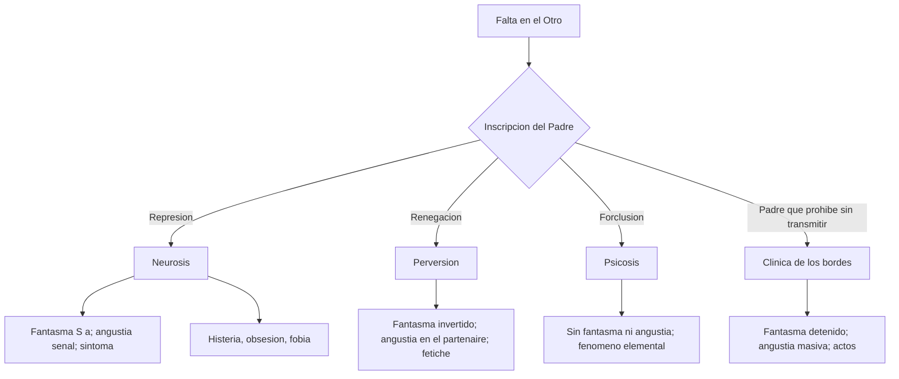
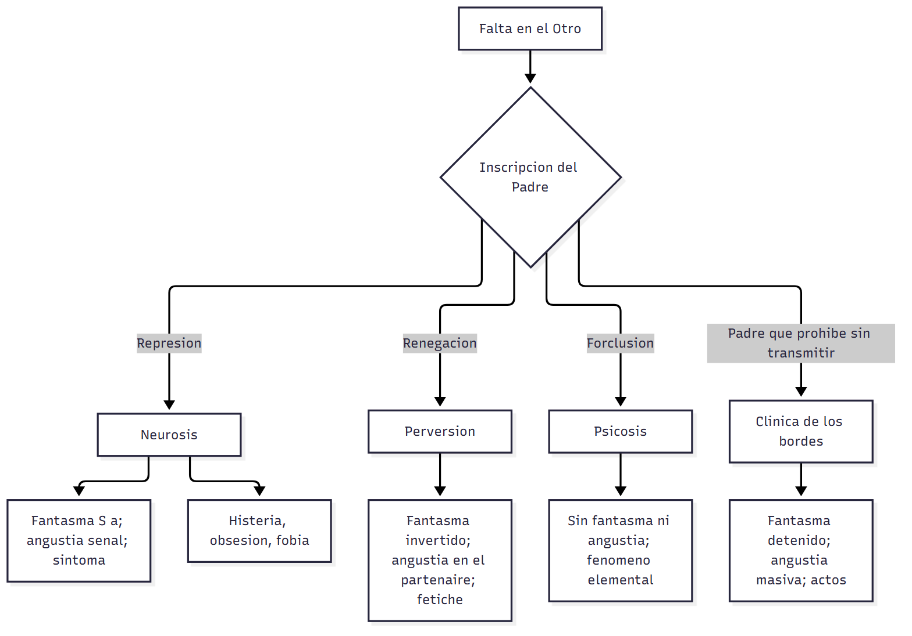

# Transversal — Estructuras clínicas: cuadro integrador (clases 13 a 23)

> **Fuentes:** este cuadro se arma **solo** con las 8 guías del 2.º parcial (`Transversal_ConceptoDeDefensa`, `C13` a `C21_23`) y con los textos que ellas citan; no agrega teoría nueva. Cada celda lleva su cita APA y la sección de la guía donde se desarrolla (→ `C17_18 §1`). Las referencias completas están al final.
>
> **Materia:** Psicoanálisis, 2.º año, Universidad Favaloro. **Parcial:** 26/10/2026 (desarrollo, mínimo 10 renglones por respuesta).

> **Aviso sobre las fuentes:** la bibliografía de la materia no trae un cuadro como este: la comparación la arma esta guía a partir de lo que cada texto dice de cada estructura. Donde un texto no trata un eje (por ejemplo, la dirección de la cura en la perversión), la celda lo dice en vez de completarlo de memoria.

> **Idea-fuerza:** neurosis, perversión y psicosis son **tres respuestas a la falta en el Otro**, que se distinguen por cómo quedó inscripto el **Padre** (operador de la estructura) y, en consecuencia, por la **operación constitutiva** —represión, renegación, forclusión—. La **clínica de los bordes** no es una cuarta estructura: es el campo de sujetos en los que el Padre opera (no hay forclusión) pero **falla el fantasma** y la **función fálica**. Casi todo lo que se pregunta en el parcial es una **fila** de este cuadro: qué pasa con el padre, el falo, el fantasma, la angustia, el síntoma, la urgencia o la transferencia en cada estructura.

## Hilo conductor: cómo se conectan los temas de esta guía

El parcial recorre las estructuras clínicas en orden —neurosis (clases 13 a 15), perversión (16), psicosis (17 y 18), bordes (19 y 20)— y termina en el dispositivo analítico (21 y 23). Estudiadas una por una, parecen cinco temas; leídas juntas, son **una sola pregunta con distintas respuestas**: **¿qué hace un sujeto con la falta en el Otro?**

El punto de partida es la **defensa**, el primer concepto freudiano (`Transversal_ConceptoDeDefensa`): cada condición de estructura se define por una **operación constitutiva** sobre la castración. El neurótico **no quiere saber** de ella (represión), el perverso **sabe y pretende no ser afectado** (renegación), en el psicótico el Nombre-del-Padre **no se inscribió** (forclusión) (Belucci, 2014b, p. 2). Esa operación decide todo lo demás.

Si el Padre operó, hay **falo** (significante del deseo y de la falta) y hay **fantasma**: el neurótico se sostiene en ($◊a) y el perverso en su inverso (a◊$). Con fantasma hay **realidad** estable y la **angustia** aparece como señal cuando el fantasma vacila. Si el Padre está forcluido, no hay falo ni fantasma: el goce del Otro es ilimitado, la angustia no aparece y lo que se manifiesta es el **fenómeno elemental**. En el medio, la **clínica de los bordes**: el Padre prohíbe, pero no transmite; el fantasma queda detenido en su tiempo narcisista y la angustia es masiva, ligada a la «fragilidad del ser».

De ahí salen las **formas de presentación**: el síntoma neurótico (compromiso), el fetiche que no se vive como síntoma, el fenómeno elemental psicótico, los cortocircuitos del acto de los bordes. Y de ahí también la **urgencia** y la **dirección de la cura**: la transferencia como sujeto supuesto saber en la neurosis, la salida «a producir» en la psicosis, la transferencia difícil y el acto en los bordes.

Dentro de la neurosis, el mismo esquema se repite en pequeño: **histeria, obsesión y fobia** son tres respuestas distintas, que se comparan por su síntoma, su deseo, su pregunta, su versión del padre y su escena (`C15`).

> 🎯 **Para el parcial:** cuando una consigna pida comparar, elegí **un eje** (una fila), recorré las estructuras en orden y terminá articulando con la operación constitutiva: es lo que explica las diferencias. Así la respuesta es un argumento y no una lista.

**En una sola oración:** la operación sobre la falta en el Otro (represión, renegación, forclusión, o un Padre que prohíbe sin transmitir) decide el destino del falo, del fantasma y de la angustia, y por eso también el síntoma, la urgencia y la cura.

## 0. Hoja de ruta

1. **Cuadro 1:** las condiciones de estructura y la clínica de los bordes.
2. **Cuadro 2:** las tres modalidades de la neurosis.
3. **Un eje por sección** (§1 a §6): operación constitutiva; Padre y falo; fantasma y realidad; angustia; síntoma y formas de presentación; urgencia y dirección de la cura.
4. **No confundir** entre clases.
5. **Preguntas integradoras** con esqueleto y respuesta modelo.

## 🎯 Lo que entra sí o sí

1. **Operaciones constitutivas:** represión (neurosis), renegación (perversión), forclusión del Nombre-del-Padre (psicosis) (Belucci, 2014b, p. 2).
2. **La neurosis es el negativo de la perversión:** inversión de los mismos elementos; fantasma ($◊a) vs. (a◊$) (Belucci, 2014b, pp. 9, 14-15).
3. **Psicosis:** sin Padre no hay Edipo, ni falo, ni fantasma, ni angustia; el fenómeno elemental verifica la estructura (Belucci, 2014b, pp. 15-16, 21).
4. **Bordes:** Padre eficaz en su vertiente negativa (límite) y fallido en la positiva (metáfora); fracaso «estructural» del fantasma y de la función fálica (Belucci, 2014b, pp. 31-33).
5. **Angustia:** señal en la neurosis; producida en el partenaire en la perversión; ausente en la psicosis; masiva en los bordes.
6. **Urgencia:** fracaso contingente del fantasma (neurosis), horizonte próximo del desencadenamiento (psicosis), urgencia generalizada (bordes) (Belucci, 2014b, pp. 33, 44).
7. **Neurosis:** histeria (deseo insatisfecho, «¿qué es una mujer?», amo castrado), obsesión (deseo imposible, muerte, perturbador del erotismo), fobia (deseo prevenido, placa giratoria, inconsistencia del padre real).

---

## Cuadro 1: las condiciones de estructura

| Eje | **Neurosis** | **Perversión** | **Psicosis** | **Clínica de los bordes** |
|---|---|---|---|---|
| **Operación constitutiva** | Represión: «no querer saber de eso» (Belucci, 2014b, p. 3) → `Transversal §2` | Renegación (*Verleugnung*): sabe de la castración y pretende no ser afectado (Belucci, s. f.-c, p. 7) → `C16 §2` | Forclusión del Nombre-del-Padre: no fechable, ocurrió o no (Belucci, 2014b, p. 16) → `C17_18 §1` | No es forclusión: hay represión; lo que falla son sus efectos positivos (Belucci, 2014b, pp. 31-32) → `C19_20 §3` |
| **Conflicto (Freud, 1924/1996)** | Yo–ello | El yo consiente la regresión (Freud, 1917/1996b) → `C13 §2` | Yo–mundo exterior; un mundo nuevo | Antecedente: melancolía, yo–superyó (psiconeurosis narcisista) → `C19_20 §1` |
| **Padre** | Legaliza la falta en el Otro; versión del padre en el fantasma (Belucci, 2014b, p. 7) | Restituir al Otro lo perdido; respuesta «religiosa» a lo real sostenida en el padre (Belucci, 2014a, pp. 4-5) | Forcluido: sin metáfora paterna no hay Edipo (Belucci, 2014b, p. 16) | Eficacia **negativa** (límite) y falla **positiva** (metáfora): impasse entre el 2.º y el 3.er tiempo del Edipo (Belucci, 2014b, p. 32) |
| **Falo** | Significante del deseo y de la falta | 1.er momento lacaniano: ser el falo imaginario materno (fetiche) (Belucci, 2014b, p. 12) | Elisión del falo: holofrase, significaciones absolutas | Fracaso de la función fálica en todas sus funciones (Belucci, 2014b, pp. 28-32) |
| **Fantasma** | ($◊a): respuesta a «¿qué soy ahí?»; marco de la realidad (Belucci, s. f.-b, pp. 7-8) | (a◊$): se ubica como objeto y divide al partenaire (Belucci, 2014b, pp. 14-15) | Fracaso radical: sin extracción del objeto *a* | Fracaso «estructural»: detenido en su tiempo narcisista (Amigo, 2005) |
| **Goce** | Perdido en el origen; marcado por la castración | Perdido en el origen; voluntad de goce: recuperarlo para el Otro | Goce del Otro potencialmente ilimitado | Goce fálico del Otro que obtura la pregunta; goce «atenuado» |
| **Angustia** | Señal: aparece cuando el fantasma vacila (Freud, 1926/1996) | La produce en el partenaire como signo de su división (Belucci, 2014b, p. 14) | Inexistencia de angustia; afecto deslocalizado | Masiva, toca la dimensión del ser (Belucci, 2014b, pp. 27-28) |
| **Tipo de clínica** | De la pregunta (Belucci, 2014b, p. 3) | De la demostración → `C16, tabla` | De la respuesta anticipada → `C16, tabla` | De la «fragilidad del ser»: pendulación entre el goce del Otro y la puesta en cuestión de la propia existencia |
| **Manifestación típica** | Síntoma: compromiso entre pulsión y defensa (Freud, 1917/1996b) | Fetiche: no se vive como síntoma, rara vez se consulta por él (Freud, 1927/1996) | Fenómeno elemental: verifica la estructura (Belucci, 2014b, p. 21) | Cortocircuitos del acto y presentaciones transestructurales (Belucci, 2014b, p. 35) |
| **Historia y escena** | Dos escenas; historia escrita desde Edipo-castración | Fantasma puesto en escena con un partenaire | «Lo que es siempre fue»: no hay dos escenas (Belucci, 2014b, pp. 23-24) | El trauma infantil, «eternamente presente» (Heinrich, 1997) |
| **Identificación** | Parcial: al rasgo o a la situación | — (las guías no lo desarrollan) | Compensación imaginaria, personalidades «como si» | Narcisista, masificante: el yo se superpone con el objeto (Belucci, 2014b, p. 34) |
| **Urgencia** | Fracaso contingente del fantasma (Belucci, 2014b, p. 33) | — (las guías no lo desarrollan) | Horizonte próximo; perplejidad; a veces internación (Belucci, 2014b, p. 44) | Urgencia generalizada; se apunta a estabilizar (Belucci, 2014b, p. 44) |
| **Transferencia y cura** | Sujeto supuesto saber; interpretación; fin: otra respuesta a lo real (Lacan, 1964/1993; Belucci, 2016) | — (las guías no lo desarrollan) | «Si hay una salida posible, es a producir»: suplencia (Belucci, 2014b, p. 16) | Transferencia difícil de instaurar; relaciones «locas»; el acto frena el *acting out* (Heinrich, 1997; Belucci, 2015) |

## Cuadro 2: las tres modalidades de la neurosis

| Eje | **Histeria** | **Neurosis obsesiva** | **Fobia** |
|---|---|---|---|
| **Defensa** | La represión casi alcanza; conversión (Belucci, 2014b, p. 4) | Regresión sádico-anal; formación reactiva, aislamiento, anulación (Belucci, s. f.-c, pp. 4-6) | Regresión oral; proyección; desplazamiento; evitación |
| **Síntoma** | Conversión: solicitación somática + sentido prestado (Freud, s. f., p. 2) | Pensar y actuar obsesivos; duda, compulsión, ceremonial (Freud, 1909/1996a) | Parapetos psíquicos; el síntoma no liga la angustia (Freud, 1909/1996b, p. 1) |
| **Síntoma primario** | Asco | Escrupulosidad moral | Vergüenza |
| **Angustia (Freud, 1926/1996)** | Pérdida de amor del objeto | Angustia ante el superyó | Angustia de castración (zoofobias) |
| **Deseo** | Insatisfecho, sostenido como deseo del Otro | Imposible, anulado; degradado a demanda | Prevenido |
| **Demanda** | De amor; sacrificio | De muerte del Otro; ambivalencia | Difícil de deslindar del deseo |
| **Pregunta** | «¿Qué es una mujer?»; identificación viril | Contingencia del ser: la muerte | Indeterminada: placa giratoria |
| **Versión del padre** | Amo castrado; alma bella | Padre potente, perturbador del erotismo | Inconsistencia del padre real; el caballo como suplencia |
| **Escena** | Pasiva en la infancia; protagonista en la adultez | Activa y con culpa en la infancia; al margen, mirando de afuera | No hay escena o es fallida (Belucci, 2014b, p. 9) |

---

## 1. Eje: la operación constitutiva

Para Belucci el diagnóstico en psicoanálisis es una conjetura sobre la **estructura** —el Otro, su falta (Ⱥ) y el goce— y sobre la **posición del sujeto**. El operador fundamental de la estructura es el **Padre**, y el modo en que se inscribe da lugar a un número limitado de condiciones: **neurosis, perversión y psicosis**, cada una definida por una **operación constitutiva** que en Freud es un procedimiento defensivo (Belucci, 2014b, p. 2) → `Transversal_ConceptoDeDefensa §2`.

En la **neurosis**, la **represión** opera sobre la falta en el Otro, inscripta como castración por la Ley paterna: el sujeto «no quiere saber de eso» y solo puede preguntarse «¿qué soy ahí?» (Belucci, 2014b, p. 3). En la **perversión**, la **renegación** (*Verleugnung*) consiste en registrar la castración y, a la vez, mantener la convicción de que las cosas pueden seguir como si no existiera: el perverso **sabe** y pretende **no ser afectado**; su consecuencia freudiana es la **escisión del yo** (Belucci, s. f.-c, p. 7; Freud, 1927/1996) → `C16 §2`. En la **psicosis**, la **forclusión del Nombre-del-Padre** —término jurídico: un derecho no ejercido a tiempo ya no puede ejercerse— significa que si el Padre no ocupó su lugar en el Otro en el origen, no podrá disponerse de él después: no es fechable, solo se puede decir que ocurrió o no, y sin metáfora paterna **no hay Edipo** (Belucci, 2014b, pp. 15-16) → `C17_18 §1`.

La **clínica de los bordes** no agrega una cuarta operación. En estos sujetos «puede presuponerse la eficacia fundacional del Nombre-del-Padre» (Belucci, 2014b, pp. 31-32): **no hay forclusión** y, por lo tanto, no son psicosis. Lo que falla es otra cosa —el fantasma y la función fálica— y por eso el diagnóstico no se decide por la operación sino por sus efectos (§2 y §3).

Freud ya había ordenado estas diferencias como **conflictos**: la neurosis es un conflicto entre el yo y el ello; la psicosis, entre el yo y el mundo exterior; la melancolía (psiconeurosis narcisista), entre el yo y el superyó (Freud, 1924/1996) → `C19_20 §1`. Y en las series complementarias la perversión aparece cuando el yo **consiente** la regresión de la libido en lugar de oponerle una contrainvestidura (Freud, 1917/1996b) → `C13 §2`.

> 🔑 **Punto clave:** la operación constitutiva es **una por estructura**; los mecanismos de defensa (formación reactiva, aislamiento, proyección…) son **varios** y marcan el «estilo» de cada sujeto (Belucci, 2014b, p. 2).

## 2. Eje: el Padre y el falo

El **Padre** aporta dos cosas: un **límite** (la vertiente negativa: el «no», la interdicción, la negativización del goce del Otro) y una **salida** (la vertiente positiva o metafórica: transmitir las insignias, la exogamia) (Belucci, 2014b, pp. 15-16, 28) → `C19_20 §3`.

- **Neurosis:** el Padre legaliza la falta en el Otro; cada neurosis la sostiene con una **versión del padre** alojada en el fantasma —el amo castrado de la histeria, el perturbador del erotismo de la obsesión— y la fobia muestra la **inconsistencia del padre real**, suplida por el objeto fobígeno (Belucci, 2014b, p. 7; Belucci, s. f.-b, p. 6) → `C15 §4`.
- **Perversión:** el perverso busca **restituir al Otro** algo que sabe perdido (el falo imaginario, el goce); por eso Belucci dice que neurosis y perversión son **respuestas «religiosas» a lo real**, sostenidas en el padre (Belucci, 2014a, pp. 4-5) → `C16 §1`.
- **Psicosis:** el Padre está forcluido: **ni límite ni salida garantizados**; el sujeto queda entre la «encerrona endogámica» y la «errancia» (Belucci, 2014b, p. 16) → `C17_18 §1`.
- **Bordes:** se verifica la eficacia **negativa** del Padre pero su acción **positiva es fallida**; hay impasses entre el segundo y el tercer tiempo del Edipo, y el sujeto, sin herramientas, queda detenido o buscando el «paraíso perdido» (Belucci, 2014b, p. 32) → `C19_20 §3`.

El **falo** es el segundo operador. En la neurosis es **significante del deseo y de la falta**: inscribe un más allá de la demanda → `C15 §2`. En el primer momento lacaniano de la **perversión**, el niño queda capturado en **ser el falo** imaginario de la madre (fetichismo, travestismo, homosexualidad como salidas atípicas) (Belucci, 2014b, p. 12) → `C16 §3`. En la **psicosis** hay **elisión del falo** y todas sus funciones quedan afectadas: holofrase, significaciones absolutas, falta de medida, desvitalización → `C17_18 §1`. En los **bordes** la función fálica, «operador multifunción», **fracasa en sus distintos aspectos**, repartidos según el caso: deseo mortificado, desmesura, devaluación del propio ser, accidentes de la sexuación (Belucci, 2014b, pp. 28-32) → `C19_20 §3`.

> ⚠ **No confundir:** en los bordes el Padre **prohíbe** (hay límite); lo que falla es que **no transmite** (no hay salida). En la psicosis no hay ni lo uno ni lo otro.

## 3. Eje: el fantasma y la realidad

El **fantasma** es la respuesta del sujeto a lo real y a la pregunta por el deseo del Otro; Lacan lo escribe ($◊a) y lo piensa como **marco**: delimita lo representado y lo separa de lo real, y por eso sostiene la **realidad** (Belucci, s. f.-b, pp. 7-8) → `C14 §2`. Para que se constituya hacen falta tres operaciones: una **expulsión de lo real** (extracción del objeto *a*), un **marco** simbólico y un objeto representado dentro del marco (Belucci, 2014b, pp. 32-33) → `C19_20 §2`.

- **Neurosis:** el fantasma funciona; mientras opera, **vela la castración** y no hay angustia. La neurosis es la «clínica de la pregunta»: el fantasma es la respuesta que permite olvidarla (Belucci, 2014b, p. 3).
- **Perversión:** los mismos elementos en orden inverso, (a◊$): el perverso se ubica como **objeto** y desde ahí promueve la **división del partenaire**; su fantasma sostiene una fortaleza yoica (Belucci, 2014b, pp. 14-15) → `C16 §1`.
- **Psicosis:** **fracaso radical**: sin extracción del objeto *a* no hay marco; la realidad no está delimitada y «le hace signo» al sujeto → `C17_18 §1`.
- **Bordes:** **fracaso «estructural»**: las dos primeras operaciones se produjeron, pero el fantasma queda **detenido en su tiempo narcisista** —el cuerpo entero como único objeto, la oferta de la propia desaparición— (Amigo, 2005) → `C19_20 §2`. Hay además **fracasos contingentes**, cuando un neurótico no dispone en un momento de su respuesta fantasmática: es la urgencia en la neurosis (Belucci, 2014b, p. 33).

> 🔑 **Punto clave:** tres fracasos del fantasma: **radical** (psicosis, autismo), **estructural** (bordes) y **contingente** (urgencia en la neurosis) (Belucci, 2014b, p. 33).

## 4. Eje: la angustia

En la segunda teoría freudiana, la angustia es la **reacción del yo ante el peligro** y, como **señal**, moviliza la defensa: «la angustia crea la represión» (Freud, 1926/1996) → `C14 §5`. En términos de Lacan, irrumpe cuando el fantasma vacila y aparece el objeto *a* (Lacan, 1962-1963/2006) → `C14 §6`.

- **Neurosis:** la angustia es **señal** y es la marca de que la respuesta fantasmática no se sostiene; el síntoma y la inhibición son modos de tratarla (Belucci, 2014b, p. 39). Cada neurosis tiene su peligro dominante: pérdida de amor (histeria), superyó (obsesión), castración (fobia) (Freud, 1926/1996).
- **Perversión:** el perverso busca **producir la angustia en el partenaire**, como signo de su división (Belucci, 2014b, p. 14) → `C16 §3`.
- **Psicosis:** **inexistencia de angustia** y afecto deslocalizado: la angustia verifica que hubo corte respecto del Otro, y ese corte no se produjo → `C17_18 §1 y §5`.
- **Bordes:** **angustia masiva**, que afecta la dimensión del ser, y la tendencia a los **cortocircuitos del acto** (Belucci, 2014b, pp. 27-28) → `C19_20 §2`.

> ⚠ **No confundir:** la ausencia de angustia no es «salud»: en la psicosis es un **criterio diagnóstico** (Belucci, 2014b, p. 22).

## 5. Eje: el síntoma y las formas de presentación

- **Neurosis:** el **síntoma** es formación de compromiso entre la satisfacción pulsional y la defensa: «está sostenido desde ambos lados» (Freud, 1917/1996b); es indicio y sustituto de una satisfacción interceptada (Freud, 1926/1996) → `C13 §3`, `C14 §4`.
- **Perversión:** el **fetiche** no se vive como síntoma: los fetichistas rara vez consultan por él (Freud, 1927/1996; Belucci, 2014b, p. 11) → `C16 §2`.
- **Psicosis:** el **fenómeno elemental** —alucinaciones, ideas delirantes, desestructuración del cuerpo y del yo— no es un síntoma más: **verifica la estructura** (Belucci, 2014b, pp. 21-22). Sin desencadenamiento, se conjetura por criterios clínicos y lógicos (automatismo, fijeza de la significación, discordancia, inexistencia de la historia, ausencia de angustia) → `C17_18 §2 y §5`.
- **Bordes:** presentaciones **transestructurales**: anorexias y bulimias, adicciones, fenómenos psicosomáticos, ataques de pánico, patologías del acto, locuras, melancolía y depresiones (Belucci, 2014b, p. 35) → `C19_20 §5`. Lo característico son los **cortocircuitos del acto**: *acting out* (la escena se sostiene) y pasaje al acto (el sujeto sale de la escena) (Iunger, 1993).

> 🔑 **Punto clave:** la pregunta diagnóstica no es «¿qué síntoma tiene?» sino «¿qué verifica la estructura?»: una misma presentación (una anorexia, una adicción) puede darse en cualquier estructura.

## 6. Eje: la urgencia y la dirección de la cura

**Urgencia.** En la **neurosis**, la urgencia corresponde a un fracaso **contingente** del fantasma: por un tiempo el sujeto no dispone de su respuesta (Belucci, 2014b, p. 33). En la **psicosis** es «un horizonte mucho más próximo»: la consulta suele producirse en un momento de perplejidad que todavía deja margen para sortear el desencadenamiento, y la intervención puede requerir internación (Belucci, 2014b, p. 44) → `C17_18 §4`. En los **bordes** hay una «urgencia generalizada», un estado del que el sujeto entra y sale, y la intervención apunta a **estabilizar** (Belucci, 2014b, p. 44) → `C19_20 §2`.

**Dirección de la cura.** En la **neurosis** la transferencia se instala en cuanto hay **sujeto supuesto saber** (Lacan, 1964/1993); el analista dirige la cura desde su deseo (política), maneja la transferencia (estrategia) e interviene con la interpretación, la construcción y el acto (táctica) (Lacan, 1958/2009; Belucci, 2015) → `C21_23 §1 a §4`. El fin de análisis es una **respuesta a lo real que no sea la neurótica**, la religiosa sostenida en el padre (Belucci, 2016) → `C21_23 §7`. En la **psicosis**, «si hay una salida posible, es **a producir**»: el tratamiento acompaña la construcción de una **suplencia** (Belucci, 2014b, p. 16) → `C17_18 §3`. En los **bordes**, la transferencia es **difícil de instaurar** (no llegan interrogados por un síntoma) y se establecen relaciones intensas, «locas», que desafían el deseo del analista (Heinrich, 1997; Belucci, 2014b, pp. 27-28); el **acto** es la intervención que permite fundar la transferencia y frenar el *acting out* y el pasaje al acto (Belucci, 2015) → `C21_23 §4`. Para la **perversión** las guías del parcial no desarrollan la dirección de la cura.

---

## No confundir (entre clases)

| Par | Criterio que los distingue | Dónde |
|---|---|---|
| Represión / renegación / forclusión | No querer saber / saber y no ser afectado / no inscripto | `Transversal §2` |
| Operación constitutiva / mecanismos de defensa | Una por estructura / varios, marcan el estilo | `Transversal §2-3` |
| Bordes / psicosis | Hay Nombre-del-Padre (falla la metáfora y el falo) / forclusión | `C19_20 §3` |
| Fracaso radical / estructural / contingente del fantasma | Psicosis-autismo / bordes / urgencia en neurosis | `C19_20 §2` |
| ($◊a) / (a◊$) | El sujeto se conjuga con un objeto / se hace objeto y divide al otro | `C16 §1` |
| Angustia automática / señal | Desvalimiento (fundamento) / anticipación (función) | `C14 §5` |
| Inhibición / síntoma | Rebaja de una función del yo / formación nueva, extraterritorial | `C14 §3-4` |
| Síntoma / fenómeno elemental | Compromiso, dialectizable / verifica la estructura, impuesto | `C17_18 §2` |
| Restitución / suplencia | El delirio rehace un Otro consistente / la escritura inventa un lazo | `C17_18 §3` |
| Desencadenamiento / desenganche | Deja marca («defecto») / se compensa sin marca | `C17_18 §4` |
| Identificación parcial / narcisista | Al rasgo, el objeto se conserva / el yo se superpone con el objeto | `C19_20 §1, §4` |
| *Acting out* / pasaje al acto | Mostración, la escena se sostiene / salida de la escena | `C19_20 §5` |
| Transferencia / repetición | Condición para que se inscriba la diferencia / circuito de lo mismo | `C21_23 §3` |
| Deseo del analista / contratransferencia | Función / lo que el deseo no resuelve; relación inversa | `C21_23 §6` |
| Interrupción / conclusión / fin | Ruptura sin escritura / algo se escribe / lógico, irreversible | `C21_23 §7` |

---

## Preguntas integradoras

### P1. Compare neurosis, perversión y psicosis según su operación constitutiva y sus consecuencias en la relación con el Otro.

> **Esqueleto de la respuesta:**
> 1. **Tesis:** las tres son respuestas a la falta en el Otro y se distinguen por cómo se inscribió el Padre (Belucci, 2014b, p. 2).
> 2. **Neurosis:** represión; la falta legalizada; clínica de la pregunta (Belucci, 2014b, p. 3).
> 3. **Perversión:** renegación; sabe y no quiere ser afectado; escisión del yo; restituye al Otro (Belucci, s. f.-c, p. 7; Belucci, 2014b, p. 12).
> 4. **Psicosis:** forclusión; sin límite ni salida; goce del Otro ilimitado (Belucci, 2014b, pp. 15-16).
> 5. **Articulación:** la neurosis es el negativo de la perversión (inversión del fantasma); la psicosis no tiene fantasma.
> 6. **Cierre:** la operación decide el destino del falo, del fantasma y de la angustia.

Para Belucci, el diagnóstico en psicoanálisis se ordena por la **estructura**, cuyo operador fundamental es el **Padre**: según cómo se haya inscripto, hay un número limitado de condiciones, cada una definida por una **operación constitutiva** que Freud pensó como procedimiento defensivo (Belucci, 2014b, p. 2). En la **neurosis** la operación es la **represión**: la falta en el Otro está legalizada por la Ley paterna y el sujeto «no quiere saber» de la castración; solo puede preguntarse «¿qué soy ahí?», y el fantasma es la respuesta que le permite olvidar esa pregunta (Belucci, 2014b, p. 3). En la **perversión** la operación es la **renegación**: el perverso registra la castración y, al mismo tiempo, pretende no ser afectado por ella, lo que en Freud se traduce en una **escisión del yo** (Belucci, s. f.-c, p. 7; Freud, 1927/1996); para Lacan, desmiente la falta en el Otro y busca **restituirle** lo perdido, haciéndose instrumento de su goce (Belucci, 2014b, p. 12). Por eso «la neurosis es el negativo de la perversión»: los mismos elementos aparecen invertidos, y el fantasma neurótico ($◊a) se vuelve (a◊$) (Belucci, 2014b, pp. 9, 14-15). En la **psicosis**, en cambio, el Nombre-del-Padre está **forcluido**: no hay metáfora paterna ni Edipo, el falo queda elidido y el sujeto, sin límite ni salida, queda expuesto a un goce del Otro potencialmente ilimitado; no hay fantasma que haga de marco ni angustia que señale el peligro (Belucci, 2014b, pp. 15-16). La diferencia de operación, entonces, no es un dato aislado: decide el lugar del falo, la existencia del fantasma y el destino de la angustia en cada estructura.

### P2. ¿Por qué la «clínica de los bordes» no es una psicosis? Fundamente con la función paterna, el fantasma y la angustia.

> **Esqueleto de la respuesta:**
> 1. **Tesis:** en los bordes el Nombre-del-Padre es eficaz: no hay forclusión (Belucci, 2014b, pp. 31-32).
> 2. **Función paterna:** eficacia negativa (límite) y falla positiva (metáfora): impasse entre el 2.º y el 3.er tiempo del Edipo (Belucci, 2014b, p. 32).
> 3. **Función fálica:** fracasa en sus distintos aspectos, pero no está elidida como en la psicosis (Belucci, 2014b, pp. 28-32).
> 4. **Fantasma:** fracaso estructural, no radical: detenido en su tiempo narcisista (Amigo, 2005).
> 5. **Angustia:** masiva, ligada a la fragilidad del ser; en la psicosis no hay angustia.
> 6. **Cierre:** por eso las presentaciones son transestructurales y el diagnóstico se apoya en lo que verifica la estructura.

La clínica de los bordes agrupa presentaciones como las anorexias y bulimias, las adicciones, los fenómenos psicosomáticos o las patologías del acto, y la pregunta diagnóstica es si se trata de psicosis. Belucci responde que no: en estos sujetos «puede presuponerse la **eficacia fundacional del Nombre-del-Padre**», con la legalización de la falta y la significación fálica que le son correlativas (Belucci, 2014b, pp. 31-32). Lo que se verifica es una **eficacia negativa** del Padre —interdicción, límite, negativización del goce— junto con una **falla de su acción positiva o metafórica**: hay impasses entre el segundo y el tercer tiempo del Edipo, de modo que el Padre prohíbe pero no transmite las herramientas para una salida (Belucci, 2014b, p. 32). En la psicosis, en cambio, el Nombre-del-Padre está forcluido y no hay Edipo. Lo mismo ocurre con el **falo**: en los bordes la función fálica fracasa en sus distintos aspectos (deseo mortificado, desmesura, devaluación del propio ser), pero no está elidida como en la psicosis. El **fantasma** tampoco fracasa de manera radical: Amigo lo describe como un fracaso «estructural», en el que las primeras operaciones se produjeron pero el fantasma queda detenido en su tiempo narcisista (Amigo, 2005; Belucci, 2014b, p. 33). Y la **angustia**, que en la psicosis no aparece, aquí es masiva y afecta la dimensión del ser (Belucci, 2014b, pp. 27-28). Por eso estas presentaciones son transestructurales: el diagnóstico no se decide por el fenómeno sino por lo que verifica la estructura.

### P3. Articule angustia y estructura: ¿qué lugar tiene la angustia en la neurosis, la perversión, la psicosis y los bordes?

> **Esqueleto de la respuesta:**
> 1. **Tesis:** la angustia es la reacción del yo ante el peligro y depende de que haya habido corte respecto del Otro (Freud, 1926/1996).
> 2. **Neurosis:** señal; aparece cuando el fantasma vacila; moviliza la represión, el síntoma o la inhibición (Belucci, 2014b, p. 39).
> 3. **Perversión:** el perverso la produce en el partenaire como signo de su división (Belucci, 2014b, p. 14).
> 4. **Psicosis:** no hay angustia; el afecto se deslocaliza; es criterio diagnóstico (Belucci, 2014b, p. 22).
> 5. **Bordes:** angustia masiva, que toca el ser; cortocircuitos del acto (Belucci, 2014b, pp. 27-28).
> 6. **Cierre:** el lugar de la angustia es un índice de la eficacia del fantasma.

En *Inhibición, síntoma y angustia*, Freud piensa la angustia como **reacción del yo ante una situación de peligro** y le atribuye una función de **señal**: el yo la reproduce en una dosis mínima para movilizar la defensa, de modo que «la angustia crea la represión» (Freud, 1926/1996). Lacan agrega que irrumpe cuando vacila el fantasma y aparece el objeto *a* (Lacan, 1962-1963/2006). En la **neurosis**, entonces, la angustia es la marca de que la respuesta fantasmática no se sostiene, y el sujeto la trata con el síntoma, que suspende su desarrollo, o con la inhibición, cuando el síntoma no es posible (Belucci, 2014b, p. 39). En la **perversión** la angustia ocupa otro lugar: el perverso, ubicado como objeto en su fantasma, busca **producirla en el partenaire** como signo de su división (Belucci, 2014b, p. 14). En la **psicosis** se constata la **inexistencia de angustia** y una deslocalización del afecto: la angustia verifica que hubo un corte respecto del Otro, y ese corte no se produjo; por eso su ausencia es un criterio para conjeturar la psicosis, incluso sin desencadenamiento (Belucci, 2014b, p. 22). En la **clínica de los bordes**, por último, la angustia es **masiva** y afecta la dimensión del ser, porque falta el soporte del fantasma, y suele resolverse por los cortocircuitos del acto (Belucci, 2014b, pp. 27-28). El lugar de la angustia funciona así como un índice de la eficacia del fantasma en cada estructura.

---

## Diagrama

## Autoevaluación (sin mirar la guía)

1. Recorré la fila «operación constitutiva» de memoria y explicá por qué decide el resto del cuadro.
2. ¿Qué diferencia hay entre la falla del Padre en los bordes y en la psicosis?
3. Nombrá los tres fracasos del fantasma y la estructura o situación de cada uno.
4. ¿Qué lugar tiene la angustia en cada estructura?
5. ¿Por qué el fenómeno elemental no es un síntoma?
6. ¿Qué tipo de urgencia corresponde a cada estructura?
7. ¿Qué cambia en la transferencia entre la neurosis y los bordes?
8. Reconstruí el esqueleto de la pregunta integradora 2.

## Referencias

- Amigo, S. (2005). ¿Qué significa comer? Una reflexión psicoanalítica sobre los *eating disorders*. En *Clínica de los fracasos del fantasma* (cap. VII). Homo Sapiens. [Texto T16 del programa]
- Belucci, G. (s. f.-b). *De la fantasía al fantasma. Un recorrido* [Ficha de cátedra]. Universidad Favaloro. [Texto T05 del programa]
- Belucci, G. (s. f.-c). *Sobre el concepto de defensa* [Ficha de cátedra]. Universidad Favaloro. [Texto T03 del programa]
- Belucci, G. (2014a). *Clínica de la estructura, clínica de lo singular* [Seminario dictado en UCES, versión parcial]. [Texto T14 del programa]
- Belucci, G. (2014b). *Introducción al diagnóstico de estructura* [Ficha de cátedra]. Universidad Favaloro. [Texto T01 del programa]
- Belucci, G. (2015). *Las intervenciones del analista* [Ficha de cátedra]. Universidad Favaloro. [Texto T27 del programa]
- Belucci, G. (2016). *Versiones del fin de análisis* [Ficha de cátedra]. Universidad Favaloro. [Texto T30 del programa]
- Freud, S. (s. f.). *Textos sobre histeria* [Selección de la cátedra de Psicoanálisis]. Universidad Favaloro. [Texto T10 del programa]
- Freud, S. (1996a). A propósito de un caso de neurosis obsesiva. En J. Strachey (Ed.), *Obras completas* (J. L. Etcheverry, Trad., Vol. 10). Amorrortu. (Obra original publicada en 1909) [Texto T11 del programa]
- Freud, S. (1996b). Análisis de la fobia de un niño de cinco años (Epicrisis). En J. Strachey (Ed.), *Obras completas* (J. L. Etcheverry, Trad., Vol. 10). Amorrortu. (Obra original publicada en 1909) [Texto T07 del programa]
- Freud, S. (1996b). 23.ª conferencia. Los caminos de la formación de síntoma. En J. Strachey (Ed.), *Obras completas* (J. L. Etcheverry, Trad., Vol. 16). Amorrortu. (Obra original publicada en 1917) [Texto T04 del programa]
- Freud, S. (1996). Neurosis y psicosis. En J. Strachey (Ed.), *Obras completas* (J. L. Etcheverry, Trad., Vol. 19). Amorrortu. (Obra original publicada en 1924) [Texto T13 del programa]
- Freud, S. (1996). Inhibición, síntoma y angustia. En J. Strachey (Ed.), *Obras completas* (J. L. Etcheverry, Trad., Vol. 20). Amorrortu. (Obra original publicada en 1926) [Textos T08 (caps. I-VIII) y T28 (cap. XI) del programa]
- Freud, S. (1996). Fetichismo. En J. Strachey (Ed.), *Obras completas* (J. L. Etcheverry, Trad., Vol. 21). Amorrortu. (Obra original publicada en 1927) [Texto T12 del programa]
- Heinrich, H. (1997). El juicio del Otro. En *Borde<R>S de la neurosis* (cap. IV). Homo Sapiens. [Texto T21 del programa]
- Iunger, V. (1993). *Clínica del pasaje al acto en la neurosis* [Conferencia]. Porto Alegre. [Texto T20 del programa]
- Lacan, J. (1993). Del sujeto al que se supone saber, de la primera díada, y del bien. En *El Seminario, libro 11: Los cuatro conceptos fundamentales del psicoanálisis* (cap. XVIII). Paidós. (Seminario dictado en 1964) [Texto T26 del programa]
- Lacan, J. (2006). *El Seminario, libro 10: La angustia* (caps. II, VI, VIII, IX, XII y XXIV, selección). Paidós. (Seminario dictado en 1962-1963) [Texto T09 del programa]
- Lacan, J. (2009). La dirección de la cura y los principios de su poder. En *Escritos 2*. Siglo XXI. (Obra original publicada en 1958) [Texto T22 del programa]
