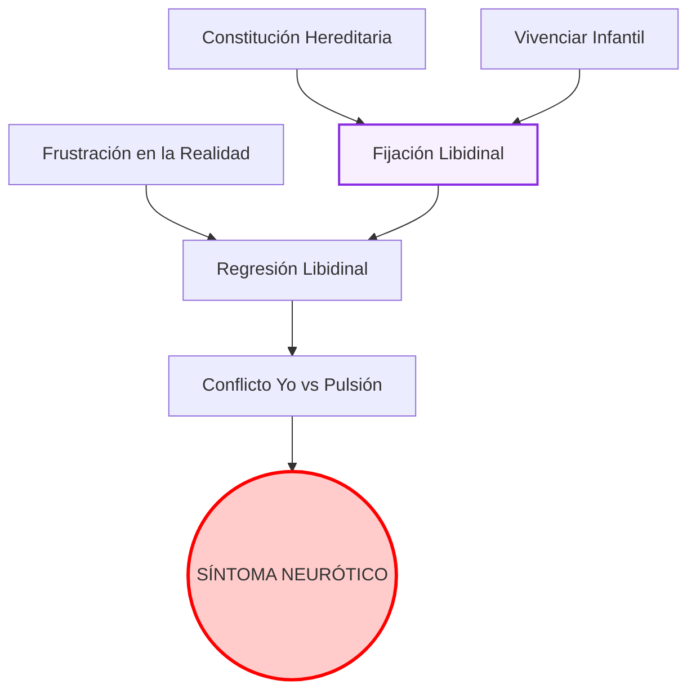
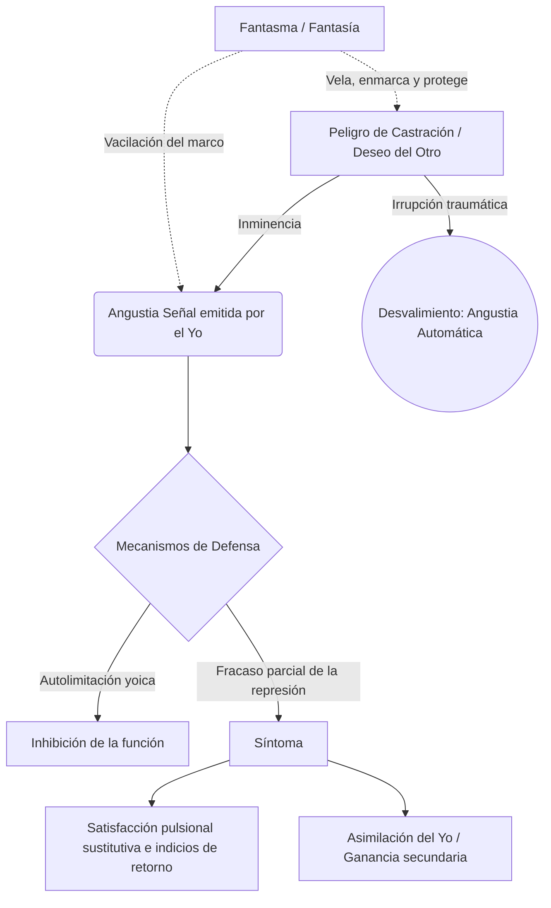
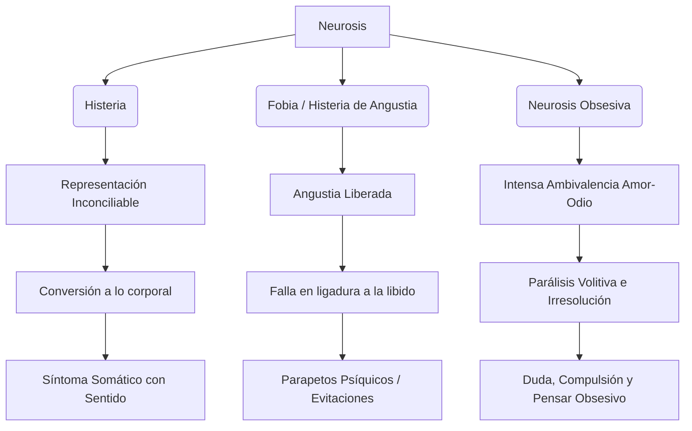
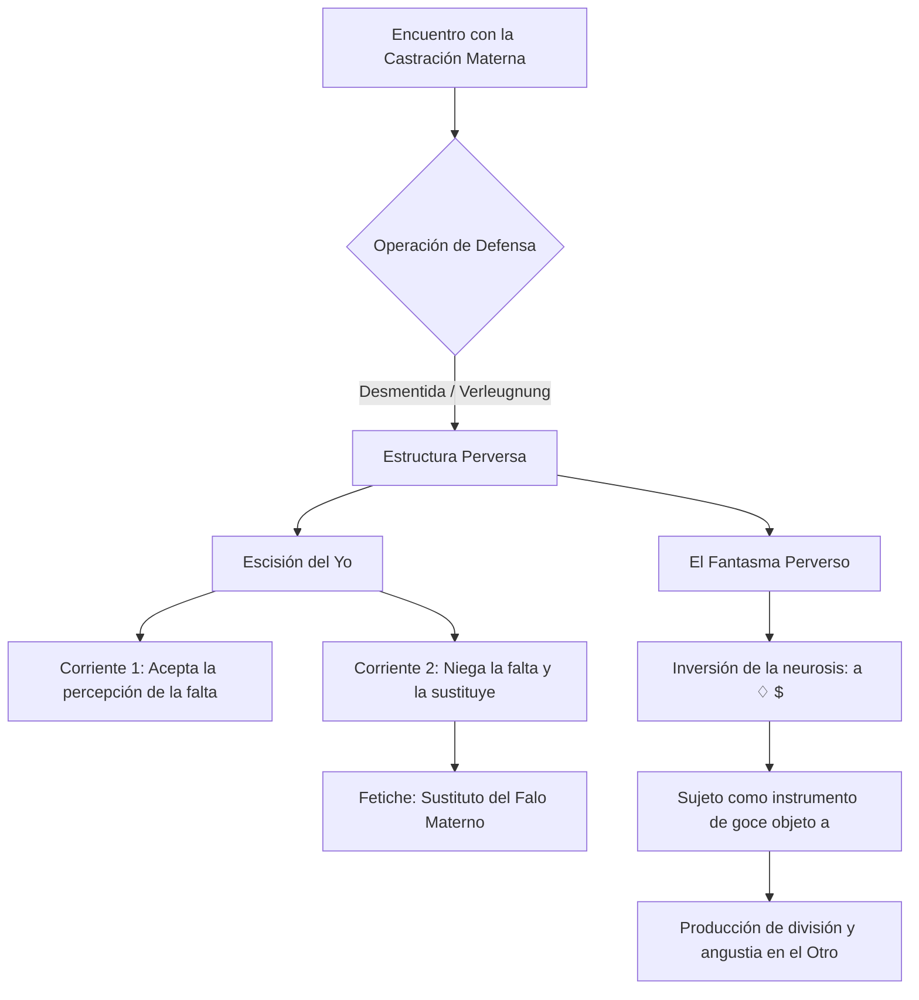
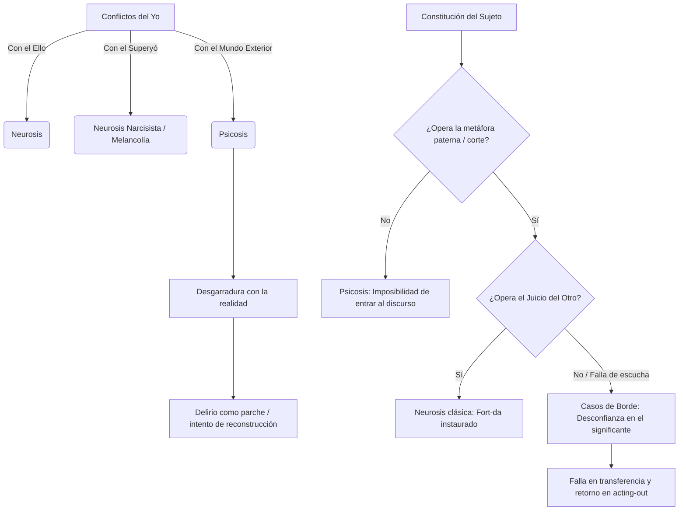

# Clase 13: Estructura y tiempos de la neurosis

Esta guía de estudio ampliada responde en profundidad a la batería de preguntas de la Clase 13, integrando aportes de Freud ("Las neuropsicosis de defensa", "23a. Conferencia") y de Belucci.

---

## 1. La primera formulación freudiana de la neurosis (Fórmula canónica)

### Desarrollo y Tesis Central
La "fórmula canónica" freudiana sobre la neurosis (formulada por primera vez en "Nuevas puntualizaciones sobre las neuropsicosis de defensa", 1896, y anticipada en "Las neuropsicosis de defensa", 1894) plantea que la causación de la neurosis no ocurre en un solo tiempo, sino que obedece a una dinámica temporal de **dos escenas**. 
El yo del sujeto se enfrenta a una representación (pensamiento o recuerdo sexual temprano) que le resulta absolutamente inconciliable. Al no poder tramitar este exceso por medio del pensamiento, la voluntad de la persona emprende una defensa (la represión), separando el afecto (la suma de excitación) de esa representación insoportable.

* **La Primera Escena (El Trauma Infantil):** Es la experiencia sexual infantil prematura. En el momento en que ocurre, no genera efecto sintomático porque el sujeto no cuenta con la madurez puberal para darle sentido sexual.
* **La Segunda Escena (El Despertar):** Un acontecimiento pospuberal inocuo por sí mismo, pero que por algún rasgo asociativo despierta la huella mnémica de la primera escena. Es ahora, retroactivamente (A posteriori), que la primera escena adquiere su carga traumática e inconciliable, desatando la defensa.

**El síntoma defensivo primario y el retorno de lo reprimido:**
Tras lograr reprimir la representación, el yo logra una aparente salud (período de salud aparente o de síntoma primario). Sin embargo, la represión requiere de un gasto constante de energía (contrainvestidura). Cuando la defensa fracasa frente a nuevas impresiones o debilitamiento yoico, se produce el **retorno de lo reprimido**. Lo que había sido desalojado retorna disfrazado en el síntoma neurótico propiamente dicho.
- En la *histeria*, el retorno (trasporte de afecto) se da a través de la inervación somática, la conversión.
- En la *neurosis obsesiva*, el retorno se da mediante el "falso enlace", donde el afecto se adhiere a representaciones lógicamente inofensivas pero que devienen compulsivas.

> [!IMPORTANT]
> *"Si en una persona predispuesta no está presente la capacidad convertidora y, no obstante, para defenderse de una representación inconciliable se emprende el divorcio entre ella y su afecto [...] su afecto, liberado, se adhiere a otras representaciones, en sí no inconciliables, que en virtud de este «enlace falso» devienen representaciones obsesivas."* (Freud, Las neuropsicosis de defensa)
> **Por qué es clave:** Esta cita define el mecanismo exacto que distancia a la obsesión de la histeria en el primer ordenamiento nosográfico de Freud.

---

## 2. Estructura y tiempos de la neurosis: Las Series Complementarias

### De la condición neurótica al padecimiento
Años más tarde, Freud (en la 23a. Conferencia) reformula y complejiza la etiología de la neurosis abandonando la idea del "trauma único" mediante el concepto de **Series Complementarias**. Este modelo postula que la neurosis no se explica por una sola causa, sino por la conjunción equilibrada de factores.

1. **Primera Serie Complementaria (La Fijación):** 
   - *Constitución Sexual Hereditaria:* Las disposiciones innatas.
   - *Vivenciar Infantil:* Los sucesos (traumáticos o no) de los primeros años de vida. 
   La suma de la constitución innata más las experiencias infantiles tempranas generan la **Fijación Libidinal**. Esta fijación representa la *condición neurótica*; el sujeto tiene un punto de anclaje patógeno, pero aún puede estar sano.

2. **Segunda Serie Complementaria (El Desencadenamiento):**
   - *La Fijación Libidinal* (resultado de la primera serie).
   - *La Frustración (Denegación) de la vida:* Un obstáculo en la vida adulta que impide la satisfacción pulsional en la realidad.
   
Cuando un sujeto, portador de una fijación, choca con una frustración severa en la vida exterior que le niega satisfacción, la libido retrocede (regresión) hacia los puntos donde quedó fijada. Es en este momento donde la libido recarga las antiguas huellas y genera conflicto con el yo, pasándose de la pura "condición neurótica" al **padecimiento neurótico** clínico (la formación de la neurosis).

> [!IMPORTANT]
> *"La constitución sexual forma con el vivenciar infantil otra «serie complementaria», en un todo semejante a la que ya conocimos entre predisposición y vivenciar accidental del adulto. Aquí como allí hallamos los mismos casos extremos y las mismas relaciones de subrogación."* (Freud, 23a. Conferencia)
> **Por qué es clave:** Resume el axioma causal del psicoanálisis: nada es puramente biológico ni puramente ambiental; se requiere el ensamble de una predisposición con el suceso precipitante.

---

## 3. El síntoma en la estructura: Caminos de la formación del síntoma

El síntoma no es un error biológico, sino un **sustituto transaccional**. Su lugar en la estructura es el de figurar una satisfacción sexual sustitutiva que se produce a espaldas del yo consciente. 

**Los caminos de la formación del síntoma:**
Cuando la libido, repelida por la frustración del mundo exterior, emprende la regresión, se encuentra con el dique del "Yo" y la represión que no la dejan manifestarse. 
Para poder salir al mundo, la libido debe negociar. Recorre entonces el camino hacia el inconsciente, catectizando fuertemente las fantasías infantiles tempranas. Como la represión impide que estas fantasías se expresen directamente, la energía psíquica sufre deformaciones (desplazamiento, condensación). 
El síntoma, entonces, es el punto final de este camino: una formación de compromiso. Permite, al mismo tiempo, una satisfacción pulsional disfrazada (proveniente del ello) y cumple con las exigencias defensivas (provenientes del yo), resultando en el sufrimiento paradójico de la neurosis.

---

## 📚 Glosario de Conceptos Clave (Skill Resumen)

| Concepto | Definición Clave en el Texto |
|----------|-----------------------------|
| **Inconciliabilidad** | Característica de una representación, generalmente sexual, que entra en total contradicción con las defensas morales del yo, motivando la represión. |
| **Enlace Falso** | Mecanismo propio de la obsesión donde el afecto, arrancado de su representación original prohibida, se asocia a una representación inofensiva dándole carácter compulsivo. |
| **Series Complementarias** | Esquema etiológico de las neurosis que articula en proporción inversa factores endógenos (constitución y vivencias infantiles = fijación) y factores exógenos (frustración adulta). |
| **Fijación Libidinal** | Retención o detención de un monto de libido en una etapa temprana del desarrollo sexual, que actúa como polo de atracción para la regresión futura. |

---

## 🗺️ Mapa Conceptual: Series Complementarias

---

## 🧠 Preguntas de Autoevaluación (Preguntas de Parcial)

1. Explique cómo el mecanismo de "enlace falso" y el "trasporte de afecto a la inervación somática" establecen la diferencia primordial entre histeria y neurosis obsesiva según el texto de 1894.
2. ¿Por qué la primera escena o vivencia sexual temprana no adquiere valor patógeno (traumático) en el mismo momento en que ocurre, y qué papel juega la segunda escena?
3. ¿De qué manera la frustración exterior o "denegación de la vida" precipita el pasaje de la condición neurótica al padecimiento clínico manifiesto?
4. Defina el concepto de "Series Complementarias" y articule cómo se compensan mutuamente la fijación libidinal y la intensidad del factor desencadenante accidental.
5. Desarrolle el proceso de regresión en la formación del síntoma: ¿Hacia qué formaciones retorna la libido al ser denegada por la realidad y cómo negocia con la represión del Yo?

---
¿Te gustaría que genere un archivo CSV con tarjetas de memoria (Flashcards) basadas en estos conceptos para que puedas importarlas a Anki?

# Guía de Estudio - Clase 14: Síntoma, Fantasma y Angustia

### 1. Tesis Central
La articulación psicoanalítica entre inhibición, síntoma y angustia demuestra que la neurosis no se sostiene pasivamente en un trauma fáctico, sino en la elaboración defensiva del yo frente a un peligro. En este entramado, la fantasía (y posteriormente el fantasma en Lacan) funciona como un marco protector y un axioma lógico que inscribe el movimiento pulsional, enmascara la castración y defiende al sujeto frente a lo real (el deseo del Otro). Cuando este marco fantasmático vacila y pierde eficacia, irrumpe lo siniestro, desencadenando la angustia. Es aquí donde Freud reordena definitivamente su edificio teórico: la angustia deja de ser vista como mera libido sin descarga para ser definida como una *señal* activa del yo frente al peligro de castración, motorizando la defensa (represión) que, al fracasar, cristaliza en la formación del síntoma neurótico como formación de compromiso.

---

### Desarrollo Temático (Respuestas a las consignas)

**Momentos en la elaboración de la fantasía en Freud**
El concepto de fantasía atraviesa varias reformulaciones en la obra freudiana:
- **Cartas a Fliess (1897):** Al abandonar la primera teoría del trauma real (seducción paterna), Freud ubica a la fantasía como una *formación protectora* y ficcional. El sujeto fantasea para encubrir y no recordar un elemento verdaderamente traumático.
- **Mis tesis sobre... (1905):** La fantasía pasa a ser mediadora entre la pulsión y el síntoma. Invierte la actividad pulsional (otorgando pasividad al sujeto) y le brinda una *dimensión escénica* a la pulsión.
- **Introducción del narcisismo (1914):** A diferencia de las neurosis narcisistas (psicosis) y la melancolía, en las neurosis de transferencia la fantasía permite que el objeto se conserve en su exterioridad y separación, garantizando el intercambio libidinal.
- **"Pegan a un niño" (1919):** La fantasía se formaliza como una frase (estructura gramatical). Se identifican tres tiempos (el segundo, masoquista e inconsciente, es el fundamental) y se la sitúa como el precipitado, o la "cicatriz", del atravesamiento del complejo de Edipo, operando como defensa frente a la castración.

**El concepto de fantasma en Lacan y su lugar en la neurosis**
Lacan lee la fantasía freudiana y formula el *fantasma* como la respuesta primordial del sujeto frente a lo real y a la pregunta por el deseo del Otro ("¿Qué me quiere?"). Escrito con el matema **($ <> a)**, conjuga lógicamente al sujeto dividido y al objeto *a*. Ocupa el lugar de sostén o axioma de la neurosis: es el marco o "ventana" a través de la cual el neurótico percibe la realidad de un modo pacificado y reglado. Su función en la estructura es velar la dimensión angustiante de la castración del Otro, armando una escena donde se supone una complementariedad ilusoria (pagando a menudo el precio de la posición sacrificial o masoquista).

**Caracterización de la inhibición y su función**
Freud define la inhibición como una limitación, normal o patológica, de una función del yo (sexual, nutricia, de locomoción, laboral). Su función es esencialmente precautoria. El yo se autolimita para evitar un conflicto:
1. **Con el ello:** El órgano implicado en la función se hipererotiza. Para evitar que la acción equivalga a una satisfacción pulsional prohibida (y obligue a un nuevo trabajo represivo), el yo renuncia a la función.
2. **Con el superyó:** El yo renuncia al éxito o la función para obedecer a un mandato de autocastigo, evitando la culpa.
3. **Por empobrecimiento energético:** El yo absorbe toda su energía en un trabajo psíquico inmenso (ej. duelo) y detiene el resto de sus funciones.

**Concepto de síntoma, función subjetiva y aspectos**
A diferencia de la inhibición (proceso interno al yo), el síntoma es un *sustituto* y un *indicio* de una satisfacción pulsional interceptada; es el resultado de una represión que ha fracasado parcialmente. Su función subjetiva es tramitar un conflicto ineludible (formación de compromiso). Presenta un doble aspecto:
- **Extraterritorialidad:** Actúa como un cuerpo extraño, ajeno a la organización yoica, que exige constantemente satisfacción.
- **Asimilación y ganancia secundaria:** Debido a su tendencia a la síntesis, el yo intenta incorporarlo a su organización, extrayendo de él un beneficio (ej. evadir responsabilidades, autocastigo), lo que consolida su fijación y eleva la resistencia en el análisis.

**Teoría de la angustia en Freud (Fundamento y función)**
En *Inhibición, síntoma y angustia* (1926), Freud subvierte su propia teoría de 1895 (donde la angustia era pura libido insatisfecha o acumulada). Ahora, el *yo es el único almácigo de la angustia*. Diferencia dos vertientes:
- **Angustia automática (Fundamento):** Es la reacción biológica frente al estado de desvalimiento (el trauma), donde irrumpe un exceso de estímulos inasimilables. Su arquetipo biológico es el acto del nacimiento.
- **Angustia señal (Función):** Es una reacción anticipatoria del yo, producida voluntariamente en pequeñas dosis cuando percibe la inminencia de una situación de peligro. Esta señal moviliza el principio de placer/displacer para disparar la represión y la huida.
En cuanto a la tesis de que **"toda angustia es angustia de castración"**, Freud aclara que el peligro de castración es el paradigma de las fobias y la neurosis obsesiva (fase fálica). Sin embargo, advierte que el contenido del peligro muta según el desarrollo del yo: pérdida del objeto materno (infancia temprana), pérdida de amor, castración, y finalmente la angustia social o frente al superyó. Todas comparten el denominador común de exponer al sujeto al desvalimiento.

**Articulación: síntoma, fantasma y angustia (Angustia y defensa)**
La relación entre estos tres elementos es clínica y estructural. El fantasma funciona sosteniendo la realidad sin angustia. Cuando este marco vacila —cuando irrumpe lo ominoso (*Unheimliche*) o el objeto *a* en lo real—, el sujeto queda frente a frente con el peligro. Allí, el yo emite la **angustia como señal**, la cual es el motor fundamental de la **defensa**. 
Es decir: **la angustia crea a la represión (defensa), y no a la inversa**. Como fruto de este movimiento defensivo, surge el **síntoma**, el cual tiene la tarea de ligar esa angustia (sustituyendo el peligro pulsional interno por un objeto evitable, como en la fobia) para que el sujeto no quede aplastado en el terror del desvalimiento.

---

### 2. Glosario de Conceptos Clave

| Concepto | Definición Clave en el Texto |
|----------|-----------------------------|
| **Fantasma ($ <> a)** | Matema lacaniano que articula al sujeto dividido en relación de conjunción y disyunción con el objeto *a*. Opera como axioma, marco de la realidad y protección frente a lo real y la castración. |
| **Inhibición** | Limitación funcional del yo provocada por razones de precaución (evitar conflictos con el ello hipererotizado o con el superyó) o por empobrecimiento energético. |
| **Síntoma** | Sustituto e indicio de una satisfacción pulsional interceptada producto de la represión. Es una formación de compromiso que el yo suele incorporar secundariamente (ganancia secundaria). |
| **Angustia Señal** | Afecto desprendido activamente por el yo para advertir sobre la inminencia de un peligro (p. ej., castración), motorizando la puesta en marcha de los mecanismos de defensa (represión). |
| **Angustia Automática** | Reacción afectiva directa frente a una situación traumática de desvalimiento absoluto, análoga al trauma original del nacimiento (exceso de excitaciones). |
| **Objeto *a* (en la angustia)** | Dimensión irrepresentable y no simbolizable del objeto que se presenta como "lo que no engaña" (certeza de lo real) cuando el marco del fantasma pierde su eficacia protectora. |

---

### 3. Citas Críticas

> [!IMPORTANT]
> "En ambos casos, el motor de la represión es la angustia frente a la castración [...] Aquí la angustia crea a la represión y no —como yo opinaba antes— la represión a la angustia." *(S. Freud, Inhibición, síntoma y angustia)*
> *Por qué es clave:* Consagra el viraje teórico más radical en la teoría freudiana sobre la angustia. La angustia deja de ser entendida como un subproducto tóxico de la represión para erigirse en su causa fundamental (la angustia señal como motor de la defensa).

> [!IMPORTANT]
> "La angustia, de todas las señales, es la que no engaña. De lo real, pues, del modo irreductible bajo el cual dicho real se presenta en la experiencia, de eso es la angustia señal." *(J. Lacan, Seminario 10)*
> *Por qué es clave:* Desmitifica la idea clásica de que la angustia "no tiene objeto". Para Lacan, la angustia surge ante la certeza imborrable de lo real (la proximidad excesiva del objeto *a*), deshaciendo la trama engañosa del mundo significante.

> [!IMPORTANT]
> "El fantasma no es sólo una formación que permite que se conserve el objeto, sino que permite que haya entre el yo y el objeto un intercambio libidinal [...] supone una complementariedad posible, sin borrar que hay corte, hay separación." *(G. Belucci)*
> *Por qué es clave:* Resume la doble operación lógica del fantasma (conjunción y disyunción simultáneas) y explica por qué esta formación tiene un poder tan masivo y pacificador en la economía de la neurosis.

---

### 4. Mapa Conceptual

---

### 5. Preguntas de Autoevaluación

1. ¿De qué manera el recorrido freudiano sobre la fantasía (desde las *Cartas a Fliess* hasta *"Pegan a un niño"*) funda el terreno teórico para la posterior formalización lacaniana del fantasma?
2. Explique la diferencia estructural, metapsicológica y económica entre la "angustia automática" y la "angustia señal" según los planteos de Freud a partir de 1926.
3. Desarrolle cómo argumenta Lacan, en el Seminario 10, la tesis de que la angustia "no es sin objeto", articulando este fenómeno clínico con el marco (*frame*) del fantasma y la dimensión de lo siniestro (*Unheimliche*).
4. Diferencie conceptual y lógicamente la *inhibición* del *síntoma* tomando en cuenta los procesos de formación, las instancias involucradas (yo, ello, superyó) y el nivel de conflicto.
5. Desarrolle y fundamente la tesis freudiana de que "la angustia crea a la represión" y explique cómo este postulado invierte su primera teoría psicopatológica respecto a las neurosis de angustia.

---

¿Te gustaría que genere un archivo CSV con tarjetas de memoria (Flashcards) basadas en estos conceptos para que puedas importarlas a Anki?

# Guía de Estudio - Clase 15
*Basado en los textos: 07 (Fobia), 10 (Histeria) y 11 (Neurosis Obsesiva) de Sigmund Freud.*

### 1. Tesis Central
Los textos analizados establecen las bases diagnósticas y metapsicológicas de las neurosis freudianas a partir del destino de la excitación pulsional y la defensa. Freud demuestra que la **histeria** resuelve el conflicto psíquico mediante la conversión de la excitación en síntomas somáticos; la **neurosis obsesiva** sustituye la acción por el pensar obsesivo, generando compulsión y duda como resultado de una intensa ambivalencia afectiva (amor-odio); y la **fobia** (histeria de angustia) libera la libido como angustia flotante, requiriendo la construcción de parapetos psíquicos (evitaciones) para su control.

### Análisis de las Preguntas del Usuario (Aplicación Clínica)

* **¿Qué particularidades tiene el síntoma en cada una de las modalidades de la neurosis?**
  * **Histeria:** El síntoma se forma por la vía de la conversión. La suma de excitación se traspone a lo corporal y se suelda con un sentido psíquico.
  * **Neurosis Obsesiva:** El síntoma se presenta como "pensar obsesivo", acciones compulsivas y duda extrema. Es un intento de resolver y a la vez expresar la parálisis volitiva causada por el conflicto entre el amor y el odio intenso.
  * **Fobia (Histeria de angustia):** El síntoma no tiene conversión somática; la angustia no puede ligarse y el sujeto debe crear "parapetos psíquicos" (precauciones, inhibiciones, prohibiciones) que operan como fobias para evitar el surgimiento de la angustia.

* **¿Cómo se organizan las distintas posiciones con respecto a la demanda y el deseo en la histeria, neurosis obsesiva y fobia?**
  * *El autor no aborda este concepto en el texto analizado.* (Los conceptos estructurales de "demanda" y "deseo" en este sentido específico corresponden a la enseñanza de J. Lacan. Los textos freudianos abordan el conflicto en términos de pulsión, libido, represión, y amor-odio).

* **¿Qué variantes asume la pregunta en la histeria y en la neurosis obsesiva? ¿Qué sucede en el caso de las fobias?**
  * *El autor no aborda este concepto en el texto analizado.* (La formulación de "la pregunta" histérica u obsesiva no figura en estos textos de Freud).

* **Refiérase a las versiones del padre particulares de la histeria y neurosis obsesiva y a su relación con la posición del sujeto. ¿Qué sucede con el padre en la fobia?**
  * En la **neurosis obsesiva** (Texto 11), Freud ubica al padre como el centro del conflicto ambivalente. El sujeto experimenta un intenso amor y un intenso odio inconsciente hacia él, generando deseos de muerte que luego se intentan expiar compulsivamente (ej. temores por el "más allá").
  * En la **histeria** (Texto 10), Freud relata dinámicas donde la paciente (Dora) se siente sacrificada o traicionada por el padre en el contexto de las relaciones con otras figuras (los K.), usándolo para encubrir corrientes homosexuales inconscientes. Sin embargo, no se sistematiza el concepto de "versiones del padre".
  * En la **fobia**, para el fragmento analizado (Texto 07 - Epicrisis), *el autor no aborda este concepto en el texto analizado*.

* **¿Qué posiciones se pueden ubicar en la histeria y en la neurosis obsesiva en relación a la escena? ¿Qué particularidad plantea la fobia?**
  * *El autor no aborda este concepto en el texto analizado.* (Si bien Freud menciona el impacto de la escena infantil traumática o fantaseada, la posición estructural frente a "la escena" no es un concepto desarrollado en estos apartados).

### 2. Glosario de Conceptos Clave

| Concepto | Definición Clave en el Texto |
|----------|-----------------------------|
| **Conversión** | Mecanismo por el cual la suma de excitación de una representación inconciliable es traspuesta a la inervación motriz o sensorial corporal en la histeria. |
| **Parapetos Psíquicos** | Construcciones protectoras (precauciones, inhibiciones, prohibiciones) que bloquean el desarrollo de la angustia en la fobia. |
| **Pensar Obsesivo** | Pensamientos compulsivos que subrogan a las acciones regresivamente, impulsados por la parálisis de la decisión. |
| **Duda (Obsesiva)** | Percepción interna de la irresolución volitiva consecuencia de la inhibición del amor por el odio; suele desplazarse a acciones ínfimas. |
| **Ambivalencia (Amor-Odio)** | Coexistencia crónica de amor y odio hacia la misma persona, ambos sentimientos en intensidad máxima, frecuente en la neurosis obsesiva. |
| **Demanda / Deseo estructural** | *El autor no aborda este concepto en el texto analizado.* |
| **Pregunta / Escena** | *El autor no aborda este concepto en el texto analizado.* |

### 3. Citas Críticas

> [!IMPORTANT]
> "En la histeria, el modo de volver inocua la representación inconciliable es trasponer a lo corporal la suma de excitación, para lo cual yo propondría el nombre de conversión."
> *Por qué es clave:* Define el mecanismo metapsicológico esencial y distintivo de la sintomatología histérica.

> [!IMPORTANT]
> "No le queda más alternativa que bloquear cada una de las ocasiones posibles para el desarrollo de angustia mediante unos parapetos psíquicos de la índole de una precaución, una inhibición, una prohibición; y son estas construcciones protectoras las que se nos aparecen como fobias..."
> *Por qué es clave:* Demuestra que el objeto fóbico es una construcción secundaria que intenta frenar la angustia liberada.

> [!IMPORTANT]
> "Si un amor intenso se contrapone, ligándolo, a un odio de fuerza casi pareja, la consecuencia inmediata tiene que ser una parálisis parcial de la voluntad, una incapacidad para decidir en todas las acciones en que el amor deba ser el motivo pulsionante."
> *Por qué es clave:* Freud halla en este intenso conflicto de opuestos el núcleo etiológico de la duda y la parálisis obsesiva.

### 4. Mapa Conceptual

### 5. Preguntas de Autoevaluación

1. ¿De qué manera distingue Freud el destino del afecto y la formación de síntoma en la histeria de conversión respecto de la histeria de angustia?
2. Explique cómo el síntoma histérico se apoya en una "solicitación somática" para expresar un sentido psíquico múltiple.
3. Según el historial clínico analizado, ¿cómo interviene el odio inconsciente y el amor en la instauración de la parálisis y la duda del neurótico obsesivo?
4. ¿Qué función metapsicológica cumplen los parapetos psíquicos (prohibiciones e inhibiciones) en la clínica de la fobia?
5. ¿De qué modo la represión opera sobre la representación obsesiva originaria, llevando a que el enfermo experimente un "pensar" despojado o desfigurado?

# Guía de Estudio: Clase 16 - La Perversión en Freud y Lacan

### 1. Tesis Central
La conceptualización de la perversión en psicoanálisis no es estática, sino que atraviesa distintos momentos teóricos. En Freud, la comprensión del fenómeno transita desde considerarlo un déficit de los diques pulsionales y un subproducto del complejo de Edipo, hasta su postulación definitiva centrada en la desmentida (*Verleugnung*) de la castración materna y la consecuente escisión del yo, ejemplificada nítidamente en el fetichismo. Por su parte, la elaboración lacaniana formaliza esta posición diferenciándola radicalmente de la neurosis mediante la lógica de la inversión: si para Freud la neurosis es el negativo de la perversión, Lacan demuestra que en esta última el sujeto invierte la fórmula del fantasma ubicándose como objeto (*a*) para causar la división ($) y la angustia en el Otro. Así, la perversión se erige como una demostración y una "voluntad de goce" que, sabiendo de la castración, intenta desmentirla. Asimismo, cabe destacar que, a diferencia de las psicosis, la perversión constituye estructuralmente una respuesta religiosa ante lo real, en tanto apela y se sostiene en la garantía del padre.

#### Desarrollo Analítico: Respuestas a los interrogantes fundamentales

**¿Cómo puede pensarse la relación entre perversión y neurosis? La referencia a la inversión.**
La relación parte de la célebre formulación freudiana en los *Tres ensayos*: la neurosis es el "negativo" de la perversión (metáfora fotográfica donde los síntomas neuróticos reprimen lo que el perverso actúa abiertamente). Asimismo, se evidencia una inversión de la "idealización": en la neurosis, el ideal restringe y prohíbe la satisfacción; en la perversión, la facilita. Lacan lleva esta inversión a su estatuto lógico en el fantasma. Mientras en la neurosis el sujeto dividido se dirige al objeto ($ ♢ a), en la perversión la estructura se invierte (a ♢ $). El perverso se ubica como objeto e instrumento para producir la división y la angustia en su partenaire neurótico.

**Los tres momentos en la conceptualización freudiana y la operación constitutiva:**
1. *Primer momento (Tres ensayos, 1905):* Centrado en la **pulsión parcial**. La perversión se concibe como un déficit de represión, donde componentes pulsionales (ej. voyeurismo) cobran autonomía frente a la síntesis genital.
2. *Segundo momento (1919-1924):* Centrado en el **complejo de Edipo y el padre**. En textos como *Pegan a un niño* y *El problema económico del masoquismo*, la fantasía perversa se inscribe en la trama edípica ligada al amor incestuoso y la culpa.
3. *Tercer momento (Fetichismo, 1927):* Centrado en el **complejo de castración**. Aquí Freud ubica la operación específica y constitutiva de la posición perversa: la **Verleugnung (desmentida)**. El sujeto rehúsa aceptar la castración materna, produciendo una escisión en el yo para sostener simultáneamente el reconocimiento y la negación de esta falta.

**Los dos momentos de la conceptualización lacaniana de la perversión:**
1. *Primer momento (Seminarios 4 y 6):* Centrado en el **falo imaginario** (Teoría normalizadora). El paradigma es el fetichismo. La perversión es leída como una solución atípica del tránsito edípico en la cual el sujeto se resiste a abandonar la posición imaginaria de ser el falo que colmaría el deseo de la madre.
2. *Segundo momento (Seminario 16):* Centrado en el **objeto a** y el goce. El paradigma pasa a ser el masoquismo. El perverso opera con una "voluntad de goce", orientándose enteramente hacia el Otro; se ubica como instrumento (*a*) para restituir un goce perdido al Otro, buscando ineludiblemente provocar la angustia en su partenaire como signo de división.

### 2. Glosario de Conceptos Clave
| Concepto | Definición Clave en el Texto |
|----------|-----------------------------|
| **Verleugnung (Desmentida)** | Operación específica y constitutiva de la perversión donde el sujeto rehúsa darse por enterado de la castración en la mujer, sabiendo de la falta pero actuando como si no existiera. |
| **Escisión del Yo** | Desgarro psíquico producto de la desmentida; coexisten dos actitudes independientes frente a la realidad de la castración materna (una reconoce el hecho y otra lo niega creando el fetiche). |
| **Fetiche** | Sustituto del falo materno (del pene de la mujer) en el que el varoncito ha creído en su infancia y al cual se niega a renunciar para protegerse del terror a su propia castración. |
| **Fantasma Perverso (a ♢ $)** | Inversión topológica del fantasma neurótico propuesta por Lacan, donde el perverso se sitúa en el lugar del objeto (a) para provocar la división y la angustia ($) en el partenaire. |
| **Voluntad de Goce** | Posición perversa que, a diferencia del neurótico que goza sin saberlo y con sufrimiento, no retrocede ante el principio de placer, asumiendo la satisfacción como un mandato dirigido a restituir el goce al Otro. |

### 3. Citas Críticas
> [!IMPORTANT]
> "Para decirlo con mayor claridad: el fetiche es el sustituto del falo de la mujer (de la madre) en que el varoncito ha creído y al que no quiere renunciar —sabemos por qué—."
> *Por qué es clave:* Freud (1927) define aquí con exactitud el estatus del fetiche, ligando la perversión estructuralmente al complejo de castración y al pánico por la pérdida narcisista del propio órgano.

> [!IMPORTANT]
> "La ha conservado, pero también la ha resignado; en el conflicto entre el peso de la percepción indeseada y la intensidad del deseo contrario se ha llegado a un compromiso [...] Sí, en lo psíquico la mujer sigue teniendo un pene, pero este pene ya no es el mismo que antes era."
> *Por qué es clave:* Muestra el mecanismo nuclear de la *Verleugnung* y la resultante escisión del yo, revelando que en la perversión coexisten de manera funcional el saber de la castración y su desmentida.

> [!IMPORTANT]
> "El perverso se sitúa en el lugar del objeto, y desde ese lugar promueve la división del sujeto (su partenaire) y busca producir la angustia como signo de esa división."
> *Por qué es clave:* Sintetiza el viraje de Lacan respecto a Freud, ubicando la perversión no como un mero acto de "egoísmo" instintivo, sino como un montaje lógico orientado a interpelar radicalmente la falta del Otro mediante la inversión del fantasma.

### 4. Mapa Conceptual

### 5. Preguntas de Autoevaluación
1. ¿De qué manera la fórmula freudiana de "la neurosis como negativo de la perversión" sienta las bases para la posterior teorización lacaniana sobre la inversión topológica del fantasma?
2. Explique en profundidad la operatoria de la *Verleugnung* (desmentida) en el texto freudiano de 1927 y su vinculación ineludible con el complejo de castración.
3. ¿Cómo se manifiesta clínicamente la escisión del yo en el sujeto fetichista y de qué manera esta división resuelve el conflicto psíquico frente al terror a la castración?
4. Diferencie analíticamente los tres momentos lógicos en la conceptualización freudiana de las perversiones (déficit de pulsión parcial, entramado edípico y desmentida de la castración).
5. Contrastando los dos momentos de la enseñanza de Lacan sobre la perversión, ¿qué diferencia estructural y clínica existe entre situar el eje explicativo en el falo imaginario frente a situarlo en la función del objeto *a* y la "voluntad de goce"?

# Guía de Estudio: Clase 17 y 18 (Textos 13 y 21)

## Respuestas a las Preguntas Guía

**- Desarrolle el concepto de forclusión del Nombre-del-Padre. ¿Cuáles son sus consecuencias estructurales?**
El autor no aborda el concepto de "forclusión del Nombre-del-Padre" explícitamente en los textos analizados. Sin embargo, H. Heinrich (Texto 21) señala que en la psicosis "la metáfora paterna no ha operado". Su consecuencia estructural principal es que "el corte con el Otro no se produjo", lo que impide la instalación del *Fort-da* y genera "una imposibilidad lógica de entrada en el discurso".

**- Refiérase al concepto de «fenómeno elemental» y a su importancia para el diagnóstico de psicosis.**
El autor no aborda este concepto en los textos analizados.

**- ¿Qué soluciones o recursos son posibles para un sujeto de condición psicótica ante las consecuencias de la forclusión del Nombre-del-Padre?**
El autor no aborda el término "soluciones" ligado a la forclusión en los textos analizados. No obstante, S. Freud (Texto 13) explica que, ante la frustración insoportable y la ruptura con el mundo exterior, el yo "se crea, soberanamente, un nuevo mundo exterior e interior". En este marco, el **delirio** opera como recurso: se presenta como un "parche colocado en el lugar donde originariamente se produjo una desgarradura", constituyendo un "intento de curación o de reconstrucción".

**- ¿Bajo qué condiciones y de qué modos pueden producirse rupturas en las soluciones psicóticas?**
El autor no aborda las "rupturas en las soluciones psicóticas" en los textos analizados. Freud (Texto 13) se limita a indicar que la condición general para el "estallido" de una psicosis (o neurosis) es la frustración externa o el no cumplimiento de deseos infantiles. 

**- ¿Qué criterios clínicos y lógicos permiten el diagnóstico de una psicosis no desencadenada?**
El autor no aborda este concepto en los textos analizados. H. Heinrich menciona presentaciones clínicas de "bordes", donde sí hay un trauma inscrito pero una falta de confianza en el significante debido a un Otro "sordo", pero no desarrolla criterios para la psicosis no desencadenada.

---

### 1. Tesis Central
La presente guía articula dos abordajes clínicos de los conflictos estructurales. Por un lado, Freud establece la diferencia genética entre neurosis y psicosis a partir del vasallaje del yo: la neurosis es producto de un conflicto entre el yo y el ello, mientras que la psicosis resulta de una ruptura del vínculo entre el yo y el mundo exterior, donde el delirio aparece como un parche restitutivo. Por otro lado, Heinrich analiza los cuadros clínicos de "Borde" a partir de las fallas del "Juicio del Otro"; si el Otro no convalida la alternancia presencia-ausencia (el *Fort-da*) con su escucha, se produce una falta de confianza en el significante que dificulta la entrada en transferencia y hace que el sujeto responda al trauma mediante actuaciones y *acting-out* en lugar de formaciones del inconsciente.

### 2. Glosario de Conceptos Clave
| Concepto | Definición Clave en el Texto |
|----------|-----------------------------|
| **Neurosis** | Resultado de un conflicto entre el yo y el ello, donde el yo se defiende de una moción pulsional mediante la represión (Freud). |
| **Psicosis** | Desenlace de una perturbación en los vínculos entre el yo y el mundo exterior, donde el yo se crea un nuevo mundo (Freud). |
| **Neurosis narcisista (Melancolía)** | Afección en cuya base se encuentra un conflicto entre el yo y el superyó (Freud). |
| **Delirio** | Parche colocado en el lugar donde originariamente se produjo una desgarradura en el vínculo del yo con el mundo exterior; un intento de curación o reconstrucción (Freud). |
| **Juicio del Otro** | Convalidación y escucha por parte del Otro que acepta que hay un Sujeto diciendo algo. Es condición necesaria para instituir la confianza en el significante y el *Fort-da* (Heinrich). |
| **Borde(r)s** | Posición donde el trauma actuó y el corte operó, pero el *Fort-da* se inscribe con desconfianza por una falla en el Juicio del Otro, manifestándose en *acting-out* y adicciones (Heinrich). |

### 3. Citas Críticas
> [!IMPORTANT]
> "La neurosis es el resultado de un conflicto entre el yo y su ello, en tanto que la psicosis es el desenlace análogo de una similar perturbación en los vínculos entre el yo y el mundo exterior."
> *Por qué es clave:* Fundamenta la primera nosología freudiana basada en los conflictos de las instancias del aparato psíquico y su relación con la realidad.

> [!IMPORTANT]
> "el delirio se presenta como un parche colocado en el lugar donde originariamente se produjo una desgarradura en el vínculo del yo con el mundo exterior."
> *Por qué es clave:* Desmitifica al delirio como el núcleo de la enfermedad, ubicándolo teóricamente como un esfuerzo restitutivo y un intento de curación.

> [!IMPORTANT]
> "en la psicosis el corte con el Otro no se produjo, con lo cual tampoco se produce el Fort-da. En la neurosis, el trauma actuó y el Fort-da también; y hay un borde, en el que tal vez el trauma se haya producido y el Fort-da no."
> *Por qué es clave:* Permite distinguir lógicamente la psicosis (ausencia de metáfora paterna) de las neurosis de borde, donde el fracaso recae en la simbolización de la ausencia.

> [!IMPORTANT]
> "Vemos la necesariedad del Juicio del Otro para que se instale la confianza en el significante, y por ende la transferencia."
> *Por qué es clave:* Subraya que la instauración del sujeto en el discurso no depende solo de un esfuerzo individual, sino de un Otro que escucha e interpreta.

### 4. Mapa Conceptual

### 5. Preguntas de Autoevaluación
1. Según S. Freud, ¿cuál es la diferencia genética fundamental entre la neurosis de transferencia, la psicosis y la neurosis narcisista?
2. Explique qué función estructural cumple el delirio en el estallido de una psicosis, de acuerdo al planteo de Freud en "Neurosis y psicosis".
3. ¿Cómo define H. Heinrich el "Juicio del Otro" y por qué resulta indispensable para la instauración del *Fort-da*?
4. Trazando paralelos según Heinrich, ¿qué diferencia estructural y lógica existe entre una psicosis y un caso de "borde" respecto del trauma y el corte con el Otro?
5. ¿Qué consecuencias clínicas tiene para el tratamiento (y la demanda de análisis) que el sujeto se haya enfrentado a un Otro "sordo" durante su constitución?

