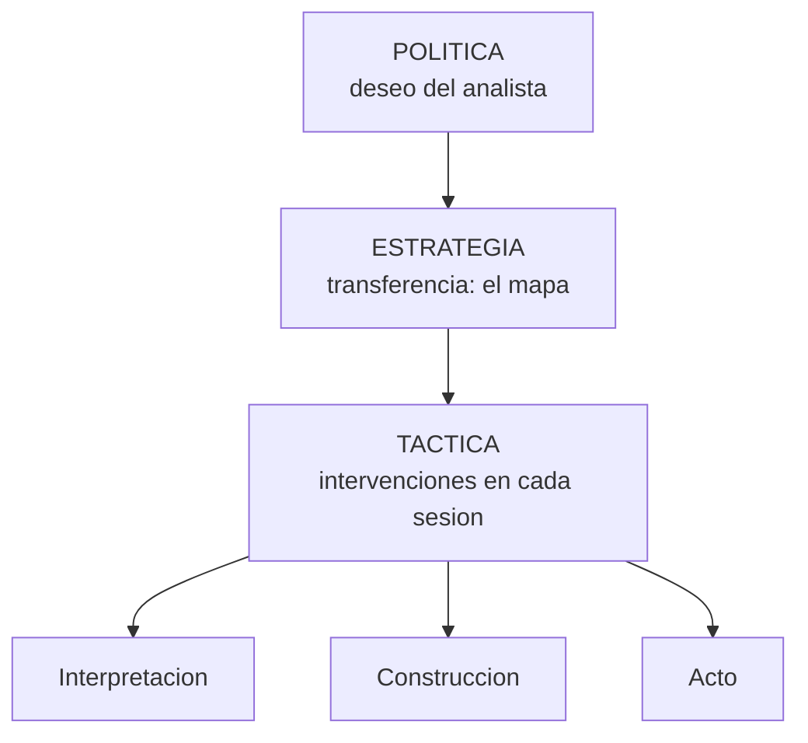
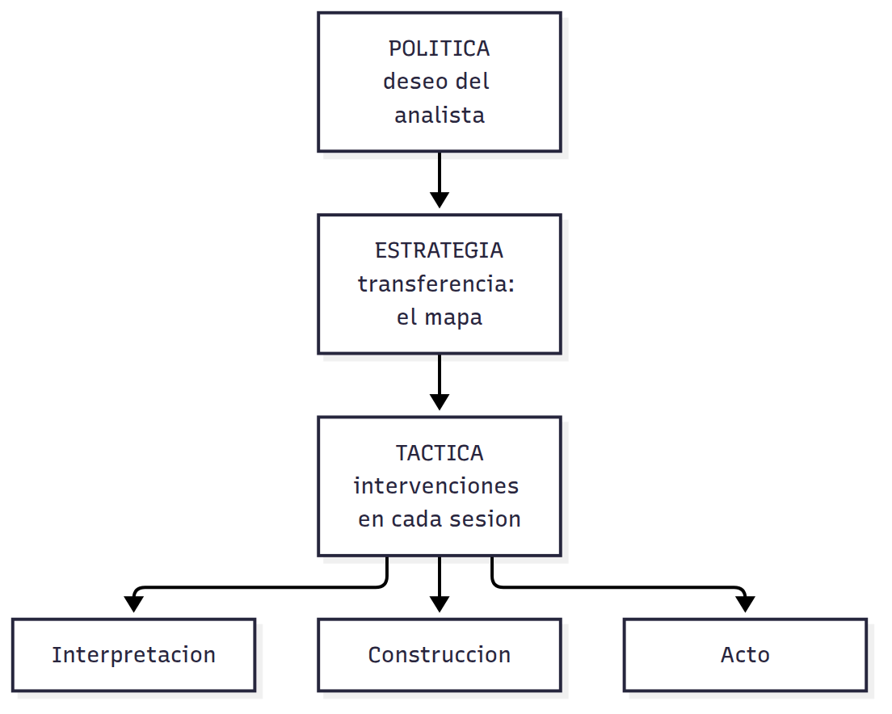
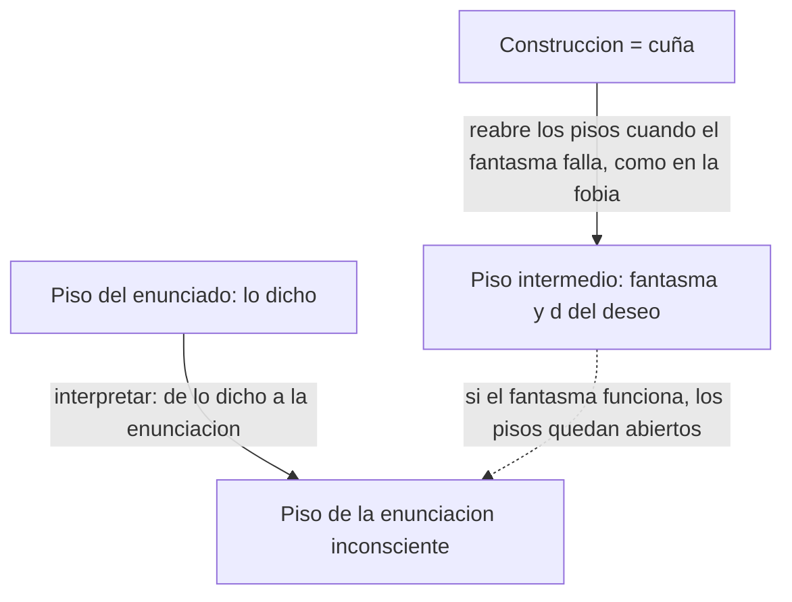
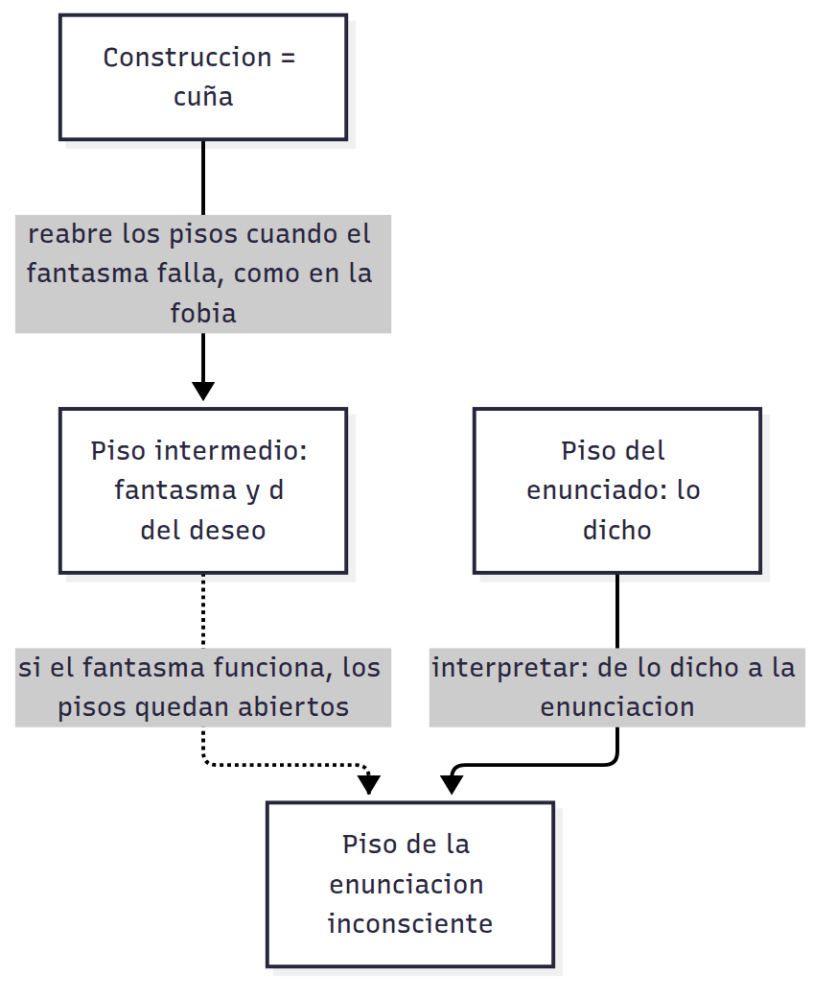

# U05 — Las intervenciones del analista (Belucci)

> **Fuente:** Gabriel Belucci, «Las intervenciones del analista» (2015), texto 27 de la bibliografía
> del 2do cuatrimestre · **Materia:** Psicoanálisis (Universidad Favaloro; Belucci está a cargo de la
> cátedra, p. 1) · **Extensión de la fuente:** 20 páginas + bibliografía.

> **Idea-fuerza:** la neurosis es una **respuesta religiosa a lo real**, sostenida en el padre; un
> análisis es la posibilidad de **escribir otra respuesta**. Eso solo ocurre si la **transferencia**
> deja de confundirse con la **repetición** y funciona como el lugar donde se inscribe la
> **diferencia**: esa es la función del **deseo del analista**. Las intervenciones son la **puesta en
> acto del deseo del analista** y alcanzan **tres modalidades**: **interpretación** (abre el
> inconsciente), **construcción** (aborda lo que la interpretación no resuelve: la pulsión, el
> fantasma, la fobia) y **acto** (pone en juego lo real de manera directa y conmueve la posición
> neurótica).

## 0. Hoja de ruta

El texto tiene seis apartados numerados; el argumento avanza así:

1. **¿Qué es la neurosis y qué es un análisis?** Neurosis = respuesta religiosa a lo real; análisis =
   otra escritura. Condición: separar **transferencia** y **repetición**; aparece el **deseo del
   analista** (pp. 1–2).
2. **Política, estrategia y táctica** (Lacan con Von Clausewitz): intervenciones = táctica;
   transferencia = estrategia; deseo del analista = política (pp. 2–3).
3. **Qué es una intervención** y por qué alcanzan **tres** modalidades; el **semblante** y la
   **abstinencia** (pp. 3–5).
4. **La interpretación**: se mide por sus efectos (apertura del inconsciente); entre el enigma y la
   cita; ejemplos de Dora, Hombre de las Ratas y casos actuales (pp. 5–10).
5. **La construcción**: estructura en dos operaciones (lógica y escena), tres ocasiones para usarla,
   el grafo del deseo y la **modalización** (pp. 10–14).
6. **El acto**: el tiempo lógico, el acto del sujeto y el acto del analista; actos al comienzo,
   durante, ante lo real y en el final (pp. 14–20).

## 🎯 Lo que entra sí o sí

1. **Transferencia ≠ repetición**: la transferencia es la condición para que en la repetición se
   escriba la **diferencia**; el **deseo del analista** es la función que lo permite (p. 2).
2. **Política / estrategia / táctica** y a qué corresponde cada nivel en la cura (pp. 2–3).
3. **Definición de intervención**: «la puesta en acto del deseo del analista» (p. 3), y las **tres
   modalidades**: interpretación, construcción, acto (p. 4).
4. **Interpretación**: se define por su efecto, la **apertura del inconsciente**; está «entre el
   enigma y la cita»; solo con transferencia establecida (pp. 5–6).
5. **Construcción**: nace en 1909 (Ratas y Hans); **articulación lógica + escena**; tres ocasiones de
   uso (estructura, restos de la interpretación, Hans); **modalización** (pp. 10–14).
6. **Acto**: categoría de Lacan (Seminario 15); acto del sujeto (tiempo lógico, sin garantías, «no»
   al Otro) vs. acto del analista; **maniobra con la transferencia**; acting-out y pasaje al acto
   (pp. 14–20).
7. **Semblante** y **vacilación calculada de la neutralidad** (pp. 4–5 y 17).

---

## 1. La neurosis como respuesta religiosa a lo real

### 1.1 La tesis

Belucci arranca por aquello sobre lo que se funda la práctica: el **padecimiento subjetivo**, en la
forma que tomó para Freud, la **neurosis** (p. 1). Su tesis: la neurosis es **una respuesta a lo real
de carácter religioso, porque está sostenida en el padre** (p. 1).

- **Lacan:** la neurosis es «una versión del padre», y el **fantasma** en particular implica una
  relación al padre que **sostiene al sujeto ante su real** (p. 1).
- **Freud:** comparaba la neurosis con una **religión individual**, y no como metáfora: lo planteaba
  literalmente (p. 1).
- **El creyente** ante una catástrofe se apoya en su fe: hay un padre que garantiza, y aunque la
  angustia pueda seguir ahí, se puede sostener ante lo irremediable. **El neurótico también es un
  hombre de fe**: ante su real confía en el padre, en «esa versión fantasmática del padre» (p. 1).

### 1.2 Qué es un análisis y qué es el análisis interminable

- Un análisis es **la posibilidad de escribir una respuesta a lo real que no sea la respuesta
  religiosa de la neurosis** (p. 1).
- Lacan, en su última enseñanza, lo llamó el «**más allá del padre**»: es la respuesta lacaniana a un
  problema freudiano, el del **análisis interminable** (p. 1).
- **Análisis interminable** = un análisis que **no sale del territorio del padre**. **Finalizar** un
  análisis = producir una respuesta, una escritura, que no sea esa (p. 1).

### 1.3 Transferencia y repetición: separarlas

Para que el análisis escriba otra respuesta hay que **diferenciar dos dimensiones que durante mucho
tiempo se superpusieron: la transferencia y la repetición** (p. 1).

- **Freud** descubrió la repetición en la experiencia analítica y la articuló como concepto en
  *Recordar, repetir, reelaborar* (1914). La ubicó **en el campo de la transferencia**, y por eso se
  podría pensar —el propio Freud se desliza hacia ahí— que la transferencia es «**una pieza de la
  repetición**», que son lo mismo (p. 1).
- **Lacan** también se deslizó hacia esa lectura en el **Seminario 8** (la transferencia), pero tres
  años después, en el **Seminario 11** (los cuatro conceptos), introdujo un cambio fundamental (pp. 1–2).
- **1964 no es un año cualquiera:** es el año de lo que Lacan llamaba su «**excomunión**», su
  expulsión de la IPA, la institución fundada por Freud, «el padre del psicoanálisis». En ese punto
  dicta el Seminario 11: ahí **comienza efectivamente la clínica lacaniana** (p. 2).
- **La tesis del Seminario 11:** transferencia y repetición **no son lo mismo**. La transferencia es
  **la condición de posibilidad para que, en el circuito de la repetición, se inscriba la diferencia**,
  de que no todo sea repetición (p. 2).

### 1.4 El deseo del analista (primera definición)

Lacan introduce el concepto que permite leer esa operación: el **deseo del analista**. Belucci lo
define, de modo que considera accesible y ordenador de la clínica, como **la función que permite que
se escriba la diferencia en relación a la repetición** (p. 2).

> 🔑 **Punto clave:** repetición (neurosis, respuesta religiosa) → transferencia (campo donde puede
> inscribirse algo distinto) → deseo del analista (función que hace que efectivamente se inscriba la
> diferencia).

---

## 2. Política, estrategia y táctica

### 2.1 Von Clausewitz

En *La dirección de la cura y los principios de su poder*, Lacan deslinda la práctica en **tres
niveles** tomados de un autor ajeno al psicoanálisis: **Carl von Clausewitz**, general prusiano de
principios del siglo XIX, contemporáneo de Napoleón, autor de un tratado sobre el arte de la guerra
(p. 2).

| Nivel | En la guerra (Clausewitz) | En la cura (Lacan / Belucci) |
|---|---|---|
| **Táctica** | Operaciones en el terreno, ante el enemigo; no anticipables; decide quien manda según las circunstancias (p. 2) | **Las intervenciones**: lo que se decide en cada sesión; no se puede calcular más allá de cierto punto (p. 2) |
| **Estrategia** | Lo que se calcula **en el mapa**; la táctica se subordina al cálculo estratégico (p. 2) | **La transferencia**: «nuestro mapa» (pp. 2–3) |
| **Política** | Subordina a la estrategia: «La guerra es la continuación de la política por otros medios» (p. 2) | **El deseo del analista** (p. 3) |

Lo novedoso de Clausewitz fue el tercer nivel: antes, los teóricos militares solo consideraban
táctica y estrategia. La guerra no es más que **la traducción de una posición política** (p. 2).

### 2.2 La táctica: las intervenciones

Igual que en la guerra, los analistas no podemos calcular más allá de cierto punto qué vamos a hacer
o decir (o no hacer, o no decir): depende de lo que pase en el terreno, que **no es anticipable**.
Pero tampoco se puede decir o hacer **cualquier cosa en cualquier momento**: la táctica está
subordinada a la estrategia (p. 2).

### 2.3 La estrategia: la transferencia

- Freud lo delimita en los escritos técnicos: **para poder interpretar es preciso que se haya
  establecido la transferencia** (p. 2).
- «La transferencia es nuestro mapa»: según cómo quede ubicado el analista en ese mapa se condiciona
  su manera de intervenir. Es una de las coordenadas que se busca ubicar en una **supervisión**. Si
  no se lee esto, la intervención se vuelve «**miope**» (p. 3).

### 2.4 La política: el deseo del analista

- La política, para Lacan, **es el deseo del analista**. Por eso analistas como **Adriana Rubistein**
  plantean que **el dispositivo es el deseo del analista**: transferencia e intervenciones se ordenan
  en función de él (p. 3).
- **Dos preguntas para orientarse** cuando uno está desorientado (p. 3):
  1. **¿Cuál es el real?** (porque la repetición tiene que ver con eso).
  2. **¿Qué se escribió en relación a ese real?**
- La demanda misma de análisis responde a esto: **algún real se volvió imposible de tramitar**, lo que
  Freud llamó ***Versagung***, «**lo que no anda**» (p. 3).
- **Segunda definición:** el deseo del analista es **lo que funda y sostiene el campo de la
  transferencia** y apunta a **llevar la cura tan lejos como sea posible**, «llevarla a un final».
  Pero no de cualquier modo ni siempre: intentarlo «como sea» es lo que Freud llamó ***furor
  curandi***. Como todo deseo, **está sujeto a condiciones**; no todos llegan al final, hay quienes se
  detienen antes (p. 3).
- **No es un deseo puro** (Lacan): es una función a la que **alguien le da cuerpo**. **Iunger**: no
  hay manera de limpiar completamente el deseo del analista del sujeto que ocupa ese lugar; **la
  contratransferencia es eso**. La cuestión es si eso predomina o si se corre, se barre en lo posible
  (p. 3).
- **El riesgo:** dirigir la cura desde la propia neurosis lleva inevitablemente al **análisis
  interminable**. **No hay otro modo de ocupar ese lugar que analizarse**: es, como decía Lacan, «una
  verdad de experiencia» (p. 3).

---

## 3. Qué es una intervención

### 3.1 Definición

Belucci no encontró ni en Freud ni en Lacan una definición amplia de intervención y propone la suya:
**«Una intervención es la puesta en acto del deseo del analista»**. Si esa es la función que sostiene
el dispositivo y permite escribir una respuesta distinta a lo real, intervención es **todo aquello que
pone en acto esa función** (p. 3).

- **En sentido amplio**, toda intervención tiene el carácter de un **acto de analista**.
- **En sentido restringido**, el **acto** es **una** de las modalidades de intervención (pp. 3–4).

### 3.2 «Economía de la intervención analítica» (Eduardo Said) y una tercera economía

Said, en *Economía de la intervención analítica*, señala dos sentidos; Belucci agrega un tercero (p. 4):

1. **Austeridad:** los analistas somos austeros con las intervenciones, a diferencia de prácticas
   «**intervencionistas**». Uno de los aspectos de la **abstinencia** es no intervenir todo el
   tiempo: hay momentos puntuales de una sesión o de un análisis en que se interviene.
2. **Economía de goce:** si una intervención fue tal y operó una transformación, toca la
   **distribución de goce** del sujeto, de modo más acotado o más amplio.
3. **Economía de categorías** (aporte de Belucci): hay textos que multiplican por decenas las
   modalidades de intervención; para la orientación freudiana y lacaniana **alcanzan tres**.

### 3.3 Las tres modalidades: origen

| Modalidad | Quién y cuándo | Por qué surge |
|---|---|---|
| **Interpretación** | Freud; la modalidad «por excelencia» de su transmisión (p. 4); debut conceptual en *La interpretación de los sueños*, 1900 (p. 5) | Correlativa del inconsciente |
| **Construcción** | Freud, **1909**, en dos historiales: **Hombre de las Ratas** y **pequeño Hans**; artículo *Construcciones en el análisis*, **1937**, casi 30 años después (p. 4) | Freud se encontró con **los límites de lo interpretable**: no todo es interpretación (p. 4) |
| **Acto** | Lacan, desde el **Seminario 15** (p. 4) | Mucho de lo que sucede en una cura **no es ni interpretación ni construcción** (p. 4) |

### 3.4 El semblante

El acto —y el deseo del analista mismo— está ligado al **semblante**, que Lacan introduce en el
**Seminario 18** (p. 4).

- *Semblant* en francés significa «**apariencia**»; el verbo *sembler*, «**aparentar**» o
  «**parecer**». El semblante es **lo que el analista aparece siendo en el campo de la
  transferencia**. El deseo del analista **se inviste de semblantes** para incidir en la transferencia
  (p. 4).

#### Caso: la severidad de Freud con el Hombre de las Ratas

Freud asume una posición de **severidad**, hasta le da órdenes: «**Es imperativo que hable, no puede
no hablar**». ¿Era así Freud en su vida? Tal vez en parte —no podemos saber cuánto de su ser estaba en
juego—, pero ese semblante **funciona porque hace trama con la neurosis** del paciente: hay una serie
que va del **padre severo, el padre militar**, al **capitán cruel**, y de ahí a **Freud** (p. 4).

- El analista encuentra el semblante adecuado **por una lectura**. No siempre es obvia en el momento:
  a veces el analista se sorprende de estar asumiendo una apariencia. Pero si atiende a lo que se le
  dice, en general no se equivoca de modo grosero. Funciona mejor **cuanto más haya avanzado en su
  propio análisis** y en su recorrido como analista (pp. 4–5).

#### El caballo de Troya y la abstinencia

- El semblante hace trama con la neurosis **al modo de un caballo de Troya**: no sirve para
  reduplicar la estructura neurótica (eso no llevaría a nada) sino para **introducir lo real**, aquello
  a lo que la neurosis responde, y que se escriba una respuesta distinta (p. 5).
- De ahí el **principio de abstinencia** (Freud): que el analista **no deje que el real de cada quien se
  diluya**. Si todo se acomoda muy rápido, **el motor del análisis desaparece**. Hay que dejar
  subsistir la *Versagung*, lo real. «Los analistas **no somos complacientes con la neurosis**» (p. 5).

---

## 4. La interpretación

### 4.1 Origen y común medida

- Debuta como concepto en **1900**, en *La interpretación de los sueños*. Si los sueños son la **vía
  regia** al inconsciente, la interpretación es **solidaria** del inconsciente: «interpretación e
  inconsciente son correlativos» (p. 5).
- El **estilo** de interpretar cambia: hoy no interpretamos como Freud —sería imposible—, y Lacan
  tampoco la plantea en los mismos términos. Si en todos los casos se trata de interpretaciones, debe
  haber una **común medida** (p. 5).

### 4.2 Primera definición: por sus efectos

- Lacan acentuó que **la interpretación se mide por sus efectos**. Es lógico en el nivel de la
  táctica: se calcula hasta cierto punto, y solo **retroactivamente** se sabe que una maniobra fue tal
  por sus efectos (p. 5).
- **Freud:** el efecto es hacer **consciente lo inconsciente**. **Lacan:** el inconsciente **no
  preexiste** a la operación del analista, **se produce**; habla de la **apertura del inconsciente**:
  el inconsciente se abre y se cierra, es **pulsátil** (p. 5).
- **Definición amplia:** la interpretación es **la modalidad de intervención que tiene como efecto la
  apertura del inconsciente**. Cuando una intervención produce ese efecto, fue una interpretación,
  **aunque no se la haya calculado como tal** (p. 5).
- **Formas habituales:** «**Esto que decís me recuerda a…**» → aparece, por ejemplo, un recuerdo
  infantil; «**Esto que decís me hace pensar en…**» → un desarrollo asociativo antes imposible, un
  **saber no sabido** (p. 5).

### 4.3 Segunda definición: entre el enigma y la cita (Seminario 17)

- Operamos en un **doble registro**: **lo dicho** (el texto que leemos) y **lo no dicho** (p. 5).
- Freud, en el capítulo 7 de *Lo inconsciente*, descompone la representación en
  **representación-cosa** y **representación-palabra**: la represión consiste en que **algo no pasa a
  la palabra**, queda como no dicho; cuando un neurótico habla, sobre todo en análisis, **en lo que dice
  resuena otra cosa** (pp. 5–6).
- Fuera de análisis la estructura es la misma, pero no están dadas las condiciones para intervenir: una
  interpretación en ese contexto es una «**interpretación salvaje**», justamente porque **no está en el
  marco de la transferencia** (p. 6).
- **La interpretación es una operación que, en lo dicho, apunta a lo no dicho**, y promueve que eso no
  dicho **pase a la palabra**. Se **apoya en la cita** (un fragmento de lo dicho) y **apunta al
  enigma** (la enunciación o el sentido de lo dicho está en otra parte) (p. 6).
- La **enunciación** de toda interpretación es: «**En lo que usted dice hay alguna otra cosa**». Cuando
  el analista devuelve un fragmento de lo dicho, ya resuena de otra manera: «es eso y es otra cosa.
  **Eso es interpretar**» (pp. 8–9).

### 4.4 Interpretación y deseo

- Lacan define el deseo como «**articulado no articulable**»: por más que se diga, algo permanece no
  dicho. Solo se lo puede leer **como un resto**, y **solo por los efectos de la interpretación**: que
  se despliegue y pase a la palabra lo que resonaba en los dichos (p. 6).
- Un efecto privilegiado es que **alguien sueñe** («el modo privilegiado», diría Freud, de ubicar el
  deseo). En **Dora**, a la interpretación de Freud ella responde con **dos sueños** (p. 6).

### 4.5 Interpretación y transferencia: la cita y la rectificación subjetiva

- **Freud y Lacan coinciden:** solo se puede interpretar **con la transferencia establecida**. Entonces
  el analista puede apuntar con cierta tranquilidad a que en lo dicho resuene otra cosa, porque **podrá
  ser soportado** y tener efectos: que alguien sueñe, asocie, se despliegue el inconsciente. Hay una
  **direccionalidad del que habla hacia el lugar del Otro**, no ya solo hacia la realidad (p. 6).
- **Antes de la transferencia** hay una operación «**interpretativa**» reducida a la **cita**: extraer
  fragmentos de lo dicho y devolverlos, **sin abusar**, sin abrir decididamente al enigma. Prepara el
  terreno para que quien habla registre que en lo que dice, y en cómo lo dice, hay algo importante
  (p. 6).
- Operar con la cita en las **entrevistas preliminares** produce lo que Lacan llamó **rectificación
  subjetiva**: que alguien advierta algo no obvio, que **si bien sus problemas parecen estar en la
  realidad, lo importante es lo que dice y cómo lo dice** (p. 6).

### 4.6 Hacia qué apunta la interpretación: las marcas y la letra

- Si la interpretación abre el inconsciente, apunta en última instancia a **ubicar la determinación
  del sujeto**. El inconsciente, en su forma más radical, es **un conjunto de marcas que nos
  determinan**. Lacan lo compara con un **juego de cartas**: las cartas que a cada uno le tocaron, que
  no elegimos, que nos vienen **del Otro**. La apertura del inconsciente va **recortando las marcas
  fundamentales** (p. 6).
- **Letra:** Lacan la define como «**el significante desencadenado**». Una cosa es el significante
  haciendo cadena (**S₁ → S₂**, el sujeto representado por un significante para otro significante) y
  otra **aislar una marca que determina de manera decisiva el destino del sujeto** (p. 6).
- La interpretación produce el despliegue de la cadena pero apunta **más allá**: a aislar esas marcas.
  Retroactivamente sorprende **la pobreza de los elementos verdaderamente decisivos**: las marcas
  determinantes **no son tantas** (p. 7).

#### Caso: «trabajador» (paciente de Belucci)

- **Situación:** un analizante —en ese momento, joven profesional en ascenso, «todavía más joven que
  en ascenso»— relata tres series de escenas sin enlace aparente: se esfuerza mucho en el trabajo para
  progresar; organiza reuniones y comidas para sus amigos, a quienes aprecia, y se esmera en
  agasajarlos; y con su novia quiere dejarla satisfecha: «también entre las sábanas este muchacho se
  ubicaba como un trabajador» (p. 7).
- **Intervención:** se aísla y se le marca el término «**trabajador**» (p. 7).
- **Efecto:** asocia, no un recuerdo de algo vivido sino **una frase materna** —algo de su Otro—: «**El
  que no trabaja es un inútil**». Queda representado por un significante para otro: **trabajar para no
  ser un inútil**; «ahí está el sujeto». Era una marca decisiva: su vida se había vertebrado en torno
  de ella. Además es **obsesivo**: el obsesivo es un trabajador, «es más, un **esclavo**» (p. 7).
- **Recorrido del análisis:** a lo largo de la cura esa posición empieza a caer, y «trabajador» toma
  más bien **carácter de letra**: se recorta algo inédito, **la posibilidad de algo que no sea
  trabajar**, una respuesta distinta a lo real (p. 7).
- **Otium y negotium:** el paciente, muy lector e interesado en el mundo clásico, lee *Memorias de
  Adriano* de **Marguerite Yourcenar** y encuentra la oposición latina **otium / negotium**: para los
  antiguos lo fundamental no era el trabajo, no eran los «**negocios**», sino el **otium** (la creación,
  el pensamiento libre), y el **negotium** era su negación. «Se inventa el ocio» (p. 7).
- **La escritura del análisis:** ya avanzado el análisis empieza a tomarse **un día libre por semana**
  para tomar sol «como un lagarto», con un libro, anteojitos y pileta: impensable al comienzo. *Otium*
  se escribe como una **respuesta distinta a «trabajador»**, en relación con esa marca: no es necesario
  ubicarse frente a lo real de la manera de la neurosis (p. 7).

### 4.7 Ejemplos paradigmáticos de interpretación

En todos, la forma es muy distinta, pero **se verifica el efecto de apertura del inconsciente**
(p. 10).

#### Dora (1): los «pensamientos hipervalentes» y el primer sueño

- Dora no puede dejar de pensar en la relación del padre con la **Sra. K**. Freud nombra esa idea
  compulsiva y recurrente «**pensamientos hipervalentes**», término que no volverá a usar (p. 7).
- Es un análisis que quedará **trunco**, porque Freud no queda ubicado como semblante: se pone en juego
  algo de **su ser de padre** en la transferencia. Pero en ese punto **sí responde como analista**:
  supone **algo no dicho** en lo que ella no paraba de decir, y lo saca **de lo previamente dicho por
  Dora** (pp. 7–8).
- **La interpretación:** si no puede dejar de pensar en la relación del padre con la Sra. K, es, en
  primer lugar, porque **no puede dejar de pensar en el padre** (sentido **edípico**); y en segundo
  lugar, porque **pensar en el padre le ahorraba pensar en el Sr. K**, que se le había vuelto
  inquietante y perturbador (p. 8).
- **Es una apuesta** hasta constatar los efectos. Y Dora **sueña**: «**En una casa hay un incendio. Mi
  padre está frente a mi cama y me despierta.**» El incendio remite a que **Dora misma está
  incendiada**: la excitación sexual se metaforiza en el sueño. Asociando, recuerda que, después de la
  «**propuesta indecente**» del Sr. K, se echó a dormir la siesta en la cabaña y al despertar encontró
  al Sr. K junto al sofá. Freud: «**Exactamente como en el sueño estaba su padre**». El trabajo del
  sueño pone **al padre salvador en el lugar del hombre inquietante**: exactamente el texto de la
  interpretación. **El sueño verifica la eficacia de la interpretación** (p. 8).
- **El resto:** Freud no le dijo nada sobre **el lugar de la Sra. K**; de ese **resto no interpretado**
  se produce **el segundo sueño** (p. 8).
- **El sueño como respuesta a un real:** en la teoría freudiana el sueño responde al **resto diurno**,
  es decir, a un real. En un análisis ese real se juega en el análisis mismo: ¿qué funcionó como real
  y llevó a alguien a soñar? (p. 8).

#### Dora (2): devolver las palabras textuales

- Dora dice haber soñado el primer sueño tres veces. No recuerda la primera, sí la última: a raíz de
  una **pelea de los padres** porque la habitación del hermano se comunicaba con el exterior por el
  comedor y quedaba cerrada con llave; el padre dijo: «**Por la noche podría pasar algo que obligara a
  salir**» (p. 8).
- Freud hace algo «muy lacaniano»: le **devuelve sus palabras textuales**: «Tome nota de que usted ha
  dicho, que "por la noche podría pasar algo que obligara a salir"». Inmediatamente Dora **recuerda
  cuándo había tenido el sueño por primera vez** (p. 8).
- **Contraste:** en un caso Freud se limita a **citar**; en el otro casi parece dar una explicación,
  pero en realidad retoma lo dicho antes. Siempre: **apoyarse en el dicho para apuntar a lo no dicho**
  (p. 8).

#### El Hombre de las Ratas: explicar consciente e inconsciente

- Posición **ambivalente** con el padre: devoción consciente por un padre idealizado y, por debajo, un
  **odio no menor**. El paciente queda detenido: le resulta **inconcebible** albergar ese sentimiento
  (p. 9).
- Freud hace algo que parece un disparate: **le explica la diferencia entre lo consciente y lo
  inconsciente**: lo inadmisible conscientemente puede tener lugar inconscientemente (p. 9).
- **Efecto:** se destraba la asociación y surge una serie de recuerdos que enlazan **lo erótico con la
  condición de la muerte del padre**: a los **12 años** le gustaba la hermana de un amigo que no le
  prestaba atención, y pensó que **si el padre muriera** obtendría su favor; en su **primera relación
  sexual** pensó: «**Esto es tan bueno que a cambio uno mataría a su padre**» (p. 9).
- **No parece una interpretación por su forma, pero el efecto es ese:** se levanta la barrera a la
  asociación libre (p. 9).

#### Caso: subrayar el «o»

- **Situación:** un obsesivo de veintitantos años trabaja en un **laboratorio** vinculado a su carrera.
  Su jefa y otros están en un **arreglo corrupto para adulterar una medicación** que distribuirían las
  obras sociales. Disyuntiva: **firma** (se le abre un ascenso, pero es cómplice) **o no firma** (asume
  una posición ética, pero lo echan) (p. 9).
- **Intervención:** la única intervención del analista es **subrayar el «o»** (p. 9).
- **Efecto:** recuerda una escena infantil: un **primo** mayor, el «primo ideal» de la familia (todos lo
  elogiaban, en particular la madre del paciente), durmió en su misma pieza; él se despertó y advirtió
  que el primo **se estaba masturbando con su mano**. Se le planteó la disyuntiva de **hablar o no
  hablar**: si hablaba quedaba en cuestión la reputación del primo y el ideal de la familia. **Se hizo
  el dormido**, algo que **retornaría como síntoma** en su vida posterior (p. 9).
- Una partícula disyuntiva, en apariencia trivial, abre un recuerdo que estaba fuera de lo decible (p. 9).

#### Caso: «¿Pegarle o despegarle?» (analista español)

- **Situación:** una mujer con el lazo amoroso complicado con su marido de muchos años, que se la pasa
  «**pegado**» al televisor sin prestarle atención: «**Cuando lo veo así me dan unas ganas tremendas de
  pegarle**» (p. 9).
- **Intervención:** el analista escucha algo del orden del significante y pregunta: «**¿Pegarle o
  despegarle?**» (p. 9).
- **Efecto:** aparece un recuerdo traumático de la adolescencia: su **padre murió arreglando una estufa
  eléctrica, se quedó pegado**, y ella fue testigo de su agonía. Y esto se inscribe en una escena más
  amplia: ella estaba **pegada amorosamente a ese padre**. La lectura del «pegar» en lo que parecía una
  simple queja abre otra escena (pp. 9–10).

---

## 5. La construcción

### 5.1 Por qué surge

- Freud la introduce en **1909** al encontrarse con que un análisis no se resuelve únicamente
  **haciendo consciente lo inconsciente**: no solo hay inconsciente reprimido, sino elementos de otro
  orden, en particular **la pulsión** (p. 10).
- Como la pulsión es —Freud lo subraya— **la cuestión fundamental de un análisis**, hace falta un modo
  de intervenir que no sea la interpretación. **La construcción es una respuesta a los límites de la
  interpretación** (p. 10).

### 5.2 La estructura: la construcción paradigmática del Hombre de las Ratas

**La serie asociativa** (todos los recuerdos van en la misma dirección) (p. 10):

1. A los **6 años**, el deseo urgente y atormentador de **ver mujeres desnudas**, junto con la idea de
   que ocurriría una desgracia: **la muerte del padre**.
2. La **hermana del amigo**: si el padre tuviera una desgracia, ella se fijaría en él.
3. Lo que pensó en su **primera relación sexual**.
4. Poco después de la muerte del padre **volvió a masturbarse**.
5. Cuando el padre estaba por morir pensó que le dejaría una **herencia** tan grande que podría
   **casarse con su dama**.

**El problema: el *Zwang*.** En esa serie hay algo que se **desplaza permanentemente** y no se resuelve
interpretando: Freud lo llamó ***Zwang***, palabra con tres sentidos en alemán (p. 10):

| Sentido | Comentario |
|---|---|
| **Obsesión** | Da nombre a la neurosis: *Zwangneurose* = neurosis obsesiva |
| **Compulsión** | El sentido específico en este caso |
| **Trabajo forzado** | La posición subjetiva típica del obsesivo: **un esclavo** |

- **La compulsión del síntoma es la pulsión sin anclaje corporal.** En la **histeria** la pulsión está
  **anclada al cuerpo** («**solicitación somática**»); en la **neurosis obsesiva** el **quantum
  pulsional** está **libre en lo psíquico**, se desplaza una y otra vez y no se resuelve interpretando.
  Ese quantum es lo que da su **fuerza indestructible al odio** (p. 10).

**Las dos operaciones de la construcción** (aquí van juntas; en la clínica puede darse solo una) (pp. 10–11):

1. **Articulación lógica.** Freud le dice que en todos esos recuerdos hay una lógica común: **cada vez
   que estuvo en juego una corriente erótica —sensual o tierna— la condición fue la muerte del padre**.
   La muerte del padre como **condición lógica del erotismo**: «si A entonces B» (p. 11).
2. **Inscripción en una escena** (argumento dramático o narrativo). Freud: «Cuando usted era niño, en
   una edad que podríamos ubicar alrededor de los **6 años** […] usted cometió alguna **fechoría ligada
   con lo sexual**, a consecuencia de la cual recibió de su padre **una sensible reprimenda**, y eso fijó
   de una vez y para siempre su papel como **perturbador del goce sexual** y dejó una **inquina
   inextinguible** hacia su padre». Esto **localiza el odio**, lo liga a una escena (p. 11).

**Efecto:** recuerda un relato de la madre: hizo alguna travesura (no queda claro cuál) y el padre le
dio una **paliza**; ante los insultos del niño mientras le pegaba, exclamó: «**¡Este niño será un gran
hombre o un gran criminal!**» (p. 11).

**Lectura:** una escena en la que el padre es agente de un castigo ubica, en un obsesivo, la versión
del padre como **perturbador del erotismo**: es el **fantasma fundamental**, el «**Pegan a un niño**».
La construcción **arma la estructura del fantasma**, que da cuenta de la **sujeción religiosa al padre**:
la neurosis es una respuesta religiosa a lo real (p. 11).

| Versión del padre | Neurosis | Caso |
|---|---|---|
| **Padre potente**, perturbador del erotismo, que se supone obstáculo al deseo | Obsesiva | Hombre de las Ratas |
| **Padre impotente**, el Amo castrado | Histérica | Dora |

### 5.3 Variantes de la construcción

- Hay construcciones con más carácter de **entramado lógico**, otras que apuntan más a **la escena**, y
  otras que conjugan ambas (p. 11).
- Entre las que apuntan a la escena, algunas acentúan el **contenido** (un acontecimiento) y otras las
  **circunstancias**. Como en el análisis sintáctico, los **circunstanciales** del predicado dicen
  **cómo, cuándo, dónde, con quién, con qué**: **las circunstancias hacen la escena** como marco (p. 11).

### 5.4 Construir circunstancias ante la angustia

- La **angustia** es parte del hueso de una cura: en ella **la escena, y en particular el fantasma,
  quedan suspendidos**. ¿Cómo intervenir cuando toma el carácter de un **desarrollo** (Freud), una
  angustia masiva que impide al sujeto situarse y hablar, como ocurre muchas veces **en las guardias**?
  (p. 11).
- Belucci: **preguntar por las circunstancias, sobre todo temporales** —«**¿Cuándo pasó esto? ¿Qué había
  pasado antes? ¿Qué pasó después?**»— **invariablemente acota la angustia**. No la hace desaparecer: la
  **acota**, porque arma un marco que es ya **el borde de una escena posible** (pp. 11–12).
- Es un modo de operar en el nivel de la construcción, en especial con sujetos que **no cuentan con una
  escena eficaz**, como los **fóbicos**. La **fobia** en adultos puede pensarse como una neurosis en la
  que **la escritura del fantasma es fallida**: las circunstancias construidas hacen **borde a lo real**
  y **soportan al sujeto** en momentos difíciles (p. 12).

### 5.5 Tres ocasiones para recurrir a la construcción

Un «mapa posible», no exhaustivo (p. 12):

1. **Por razones de estructura: la fobia.** El fóbico aborda la angustia no por el síntoma (fallido)
   sino por la **inhibición**: allí donde la respuesta metafórica del síntoma fracasa o es débil, hace
   **un padre en lo imaginario** con sus **parapetos**, límites imaginarios que acotan la angustia. Eso
   **no es interpretable**: no es una formación metafórica ni una formación del inconsciente (p. 12).
2. **Para retomar los restos no interpretables de la interpretación: el Hombre de las Ratas.** El
   *Zwang* es el resto que deja cada vez la interpretación: Freud interpreta, el paciente asocia, y la
   compulsión no se resuelve; ese resto se aborda construyendo (p. 12).
3. **Antes de la interpretación: el pequeño Hans.** Ese análisis, una excepción, lo conduce el padre,
   **Max Graf**; Freud interviene **una única vez**, de manera decisiva (p. 12):
   - **Primero, el caballo:** así como los caballos tienen **eso negro en la boca** (la mancha, el
     **objeto mirada**, el objeto de la angustia), el padre tiene **bigotes**; así como tienen
     **anteojeras**, el padre tiene **anteojos**. Así **enlaza el caballo a la referencia paterna** e
     introduce al padre donde no estaba —el caballo remitía a la madre—: el caballo pasa a ser un
     **representante del padre**.
   - **Después, el Edipo:** le dice que **antes de que Hans viniera al mundo** él ya sabía que vendría un
     pequeño Hans que querría mucho a su madre y por eso tendría **bronca y miedo a su padre**, pero que
     **el padre lo amaba**. Freud introduce el Edipo no como un drama que el niño atraviesa sino como
     **una estructura anterior al sujeto**, una serie de lugares por los que hay que pasar, **sostenida
     en el amor del padre**. Y el amor del padre, en la tradición religiosa monoteísta, **es su ley**:
     el padre que da la ley es el padre del amor.
   - **Efecto:** Hans empieza a producir un **saber no sabido**, inconsciente, que **sí se vuelve
     interpretable**. **La construcción antecede lógicamente a la interpretación**: exactamente al revés
     que en el Hombre de las Ratas.

### 5.6 Por qué la construcción habilita la interpretación: el grafo del deseo

- En la clínica se constata más de una vez que una construcción **abre un ámbito interpretable** que no
  existía (p. 13).
- **Explicación topológica:** el **grafo del deseo** tiene **dos pisos**: el del **enunciado** y el de la
  **enunciación inconsciente**. Interpretar es abrir, a partir de lo dicho, del enunciado a la
  enunciación. Entre ambos hay un **piso intermedio**: a la izquierda el **fantasma** y a la derecha la
  ***d* del deseo** (p. 13).
- Para que los dos pisos se mantengan abiertos **el fantasma tiene que estar en funciones**. En la fobia
  es fallido, y entonces al intentar interpretar pasan dos cosas: **o el paciente se angustia** (no es
  sostenible) **o pasa de largo**, porque los pisos quedan «**achatados**» y el dicho queda en un plano
  lineal (p. 13).
- La construcción funciona como **una cuña que vuelve a abrir los dos pisos**. Lo que hace que alguien
  soporte la interpretación y produzca saber inconsciente es que **el fantasma tenga cierta eficacia**
  (p. 13).

### 5.7 La modalización

- Variante de la construcción **como articulación lógica**: introducir términos que **modalizan** el
  dicho; a veces es decisivo. El fóbico se relaciona con el campo del Otro en **términos absolutos**,
  ligados a la **demanda del Otro** (p. 13).

#### Caso: la paciente fóbica y su madre

- **Situación:** una mujer de unos **60 años**, fóbica, en una relación de particular **dependencia con
  su Otro materno** (un **invariante** en la fobia). Se ofrecía a **taponar cada vez la falta en el Otro
  materno**: cuando la madre —que vivía en otra provincia— la llamaba, y lo hacía seguido, por cualquier
  dolencia («así se hubiera **quebrado una uña**»), interrumpía todo y viajaba a auxiliarla, para que a
  la madre no le faltara nada, sobre todo su presencia (pp. 13–14).
- **Intervención: modalizar la relación al Otro** (p. 14):
  - donde «**siempre**» tenía que ir, introducir el «**a veces**»;
  - «**Podés no ir**»: no es una demanda —no es «Vaya» ni «No vaya»—, introduce **lo posible como
    distinto de lo necesario**;
  - «**No siempre que a tu mamá le pasa algo, eso es grave**».
  No se predica nada sobre una situación puntual: es una articulación **lógica** que le permite
  **correrse de la respuesta masiva a la angustia de la madre**.
- **Por qué funciona:** el fóbico **lee la angustia del Otro como demanda** y se precipita a responder;
  el movimiento contrario es la **huida**. **El fóbico pivotea entre responder a la angustia del Otro y
  huir**. Modalizar es **operar con modalidades lógicas** (p. 14).

Belucci cierra el apartado: los tipos y usos de la construcción merecen un estudio más exhaustivo que
el que el texto inicia (p. 14).

---

## 6. El acto

### 6.1 Una categoría lacaniana

- El acto **no está en Freud**, aunque se pueden leer actos en Freud una vez que la categoría existe.
  Aparece en los primeros seminarios (por ejemplo el **6**), pero toma **jerarquía conceptual fuerte**
  desde el **Seminario 15**, *El acto psicoanalítico* (p. 14).
- Hay que distinguir dos cuestiones conectadas (p. 14):
  1. **El acto del lado del sujeto:** **produce un sujeto**; el sujeto **deviene del acto**, no es
     anterior: el acto tiene **carácter fundante**.
  2. **El acto como operación del analista.** **El acto del analista siempre antecede al acto del
     sujeto**: en un análisis, el sujeto puede producir un acto (que a su vez lo produce) solo si hubo
     antes un acto del analista.

### 6.2 El acto del sujeto y el tiempo lógico (1945)

- En el escrito de **1945 sobre el tiempo lógico**, Lacan plantea que el tiempo del sujeto en el
  análisis es **discontinuo**, hecho de **cortes**; se apoya en la **temporalidad retroactiva** de Freud
  (***nachträglich***) y agrega el movimiento de **anticipación** (***avant-coup***) y **retroacción**
  (***après-coup***) (p. 14).
- **Tres escansiones**, articuladas con los tres registros (pp. 14–15):

| Escansión | Registro | Qué ocurre |
|---|---|---|
| **Instante de ver** | Imaginario | Captación imaginaria del significado: el sujeto **cree saber** de qué habla (p. 14) |
| **Tiempo para comprender** | Simbólico | Despliegue de la cadena significante («comprender» en sentido significante, no imaginario): se localizan las **coordenadas simbólicas** de la posición del sujeto —p. ej., «trabajador» articulando amigos, negocio y novia— (p. 15) |
| **Momento de concluir** | Real | Con las coordenadas localizadas, «**solo cabe actuar**»: **sabiendo lo suficiente, se concluye**; ahí **precipita el acto** (p. 15) |

- **Relación con lo real:** lo real es **lo imposible de ser sabido**. En el acto no se sabe **a dónde
  va a llevar**: **no hay garantías**, y hay que soportarlo. Separarse, renunciar a un trabajo para
  iniciar un emprendimiento propio: ¿hay garantías? No. **El acto es sin el Otro**, «el momento de
  máxima soledad». **Ringo Bonavena**, boxeador de los años 60: a uno lo preparan con un equipo, pero
  al momento de pelear **le sacan el banquito** (p. 15).
- **Éxito o fracaso no importan:** en un verdadero acto, el éxito o fracaso vistos desde afuera es lo
  que menos importa (p. 15).

#### Caso: el padre que «fracasó»

Un paciente obsesivo hablaba de su padre, que había puesto su propio negocio: le fue muy mal
económicamente, luego enfermó gravemente y murió; el paciente lo ubicaba como un **fracaso**. En un
momento en que el paciente **bordeaba un acto sin terminar de producirlo**, Belucci intervino
decididamente **poniendo en cuestión que el padre hubiese fracasado**: cuando hay acto, vaya bien o mal,
**pone al sujeto en una posición nueva, funda un sujeto nuevo**. La intervención **despejó el camino
para el acto** hasta ahí suspendido (p. 15).

- **El acto implica un «no» al Otro:** no solo es sin el Otro, implica **simbólicamente matarlo**. Los
  neuróticos **retroceden** ante el acto porque **no hay retorno**: algo del Otro es rechazado. Ante el
  horizonte del acto, la posición del neurótico es «**profundamente cobarde**»: no soporta «matar» al
  Otro, **no soporta que el Otro no exista** (p. 15).
- **Cortocircuitos: acting-out y pasaje al acto** = **conclusión precipitada**, sin saber aún lo
  suficiente. El deseo del analista apunta a **frenar** que se saltee el tiempo para comprender. Ej.: un
  paciente **renuncia al trabajo** y le retorna un «**¿Qué hice?**»: no hubo tiempo para comprender, fue
  un **pasaje al acto** (p. 15).
- Un análisis **despeja las condiciones para el acto del sujeto**. Lacan: **llevamos al sujeto a las
  puertas del acto, pero no lo acompañamos ahí** (p. 15).
- Hay actos **a lo largo** de la cura, no solo al final. En una sesión el movimiento se da **en
  pequeño** (instante de ver, despliegue, punto conclusivo). El tiempo lógico permite leer desde el
  análisis entero hasta una sesión (p. 15).

### 6.3 El acto del analista

- Pone en juego **un real de modo mucho más directo**: es **el modo más decidido en que un analista
  pone en cuestión la estructura de la neurosis**, que es la que habitualmente responde a lo real
  (pp. 15–16).
- **Acto no es sinónimo de hacer:** es lo que **traduce el deseo del analista**. Puede ser una acción,
  **un silencio**, **una pregunta**. **Dejar pasar** la «**palabra vacía**» (el «**bla, bla, bla**»)
  puede tomar valor de acto (p. 16).
  - *Caso:* una paciente usaba gran parte de la sesión en **anécdotas triviales**; Belucci solo
    intervenía cuando salía del «bla, bla, bla»; hasta allí, **la intervención era el silencio**. O una
    pregunta que cambie el eje y haga caer el bla bla como insustancial (p. 16).
- El acto **funda** el campo de la transferencia, lo **sostiene** y apunta a que el análisis **llegue lo
  más lejos posible** (p. 16).
- Es fundamental para **conmover la posición neurótica ante lo real** cuando no se puede ni por la
  interpretación ni por la construcción. Y cuando se puso en juego un real que amenaza volverse
  insoportable, **el acto lo hace soportable** para que algo se escriba: permite **atravesar la
  angustia**, que fuera del análisis puede ser insoportable y en el análisis se soporta por la
  transferencia y porque hay actos (p. 16).
- **Newton:** en la ciencia, quienes produjeron un real entraron después en una crisis subjetiva que
  puede tomar forma de locura. Newton, tras escribir la fórmula de la **gravedad universal**,
  **enloqueció**: tuvo una especie de **episodio místico**. Ante ese real **no había una transferencia
  que lo soportara** (p. 16).

### 6.4 La maniobra con la transferencia

- Lacan señala que la transferencia, **cuando se manifiesta como obstáculo, no es interpretable**
  (p. 16).
- Los **posfreudianos**, sobre todo los **kleinianos**, interpretaban la transferencia todo el tiempo: la
  experiencia mostró que **no lleva a nada** o, peor, **lleva al acting-out** (p. 16).
- Lacan propone en su lugar la «**maniobra con la transferencia**»: **a la transferencia se le responde
  por la vía del acto**, y **el acto está siempre ligado a algún semblante** (p. 16).

### 6.5 Actos al comienzo: fundar la transferencia

La transferencia **no existe espontáneamente**: es una **respuesta al deseo del analista** y más
específicamente a su acto. **Hay que fundarla** (p. 16).

- **Hombre de las Ratas: «No tengo inclinación alguna por la crueldad».** Cuando relata la apología de la
  tortura del **capitán** y el **suplicio de los turcos**, se detiene y pide no dar detalles. Freud
  responde con el semblante de severidad —«**Tiene que hablar. Si no habla no hay nada que yo pueda hacer
  por usted**»— pero en el mismo movimiento hace una **salvedad**: «**No tengo inclinación alguna por la
  crueldad**». Esa salvedad es fundamental para que la transferencia sea un campo donde se escriba la
  diferencia; Freud **se corre de cualquier posición complementaria al masoquismo** de la estructura: no
  va a gozar sádicamente de la neurosis del paciente. Es un acto que **funda la transferencia**: después,
  el paciente tiene un **fallido** y lo llama «**Señor Capitán**». Freud entra en su serie paterna, **pero
  para agujerearla** (pp. 16–17).
- **El café (testimonio).** En una entrevista preliminar, un analista le ofrece **un café** a un
  consultante, algo que los analistas no suelen hacer. ¿Simpatía, plano imaginario? Un detalle: el
  hombre **había sido mozo**, se había dedicado a **servir a otros**. Probablemente el analista leyó una
  posición de **servir al Amo**, la del **esclavo obsesivo**. Servirle un café puede ser **más eficaz que
  cualquier puntuación**: apunta a **conmover la fijeza del fantasma** (p. 17).
- **Vacilación calculada de la neutralidad** (Lacan, *Subversión del sujeto*): los analistas somos
  «neutrales» respecto de **nuestra persona, nuestros ideales e incluso —no sin resto— nuestra condición
  de sujeto**; **no** lo somos cuando se trata de **conmover la neurosis** como respuesta a lo real y sus
  **fijezas fantasmáticas**. Es una instancia del deseo del analista, articulada al **acto** y al
  **semblante**. El café está en ese plano: el semblante de atenderlo pone sobre el tapete que la
  posición de servir al Otro está para revisarse (p. 17).
- **La paciente del analista español: el diván como ausencia.** Relata escenas de **ausencia**: un marido
  que viaja por trabajo; un hombre que la engañó **haciéndose pasar por corredor de motos profesional**
  (y que, aun siendo cierto, se habría ausentado una y otra vez); quedarse sola ante la ausencia del otro.
  El analista **se ausenta: la pasa al diván**. Ese movimiento es **condición de posibilidad del campo
  transferencial**: desde entonces ella se dirige a una ausencia, no para repetir, sino para que **algo
  inédito se escriba** (p. 17).
- **Lacan «vivía en acto»: «¿Ahora?» — «Vamos».** Alguien le cuenta en las primeras entrevistas que su
  **analista anterior había muerto y lo estaban velando en ese momento**. Lacan pregunta «¿Ahora?» y,
  ante la respuesta afirmativa, dice «Vamos» y **lo acompaña al velorio**. No es un gesto humanitario: la
  lógica es analítica. Si el **duelo** por el analista anterior no se tramita, la condición del análisis
  está complicada de entrada (p. 17).
- **Hilda Doolittle (HD), *Tributo a Freud*.** Escritora norteamericana que viajó a **Viena** para
  analizarse (análisis acotado en el tiempo, pero con efectos). En un momento temprano Freud —ya muy
  anciano— **golpeó con fuerza el escritorio** y exclamó: «**El problema es que usted cree que soy
  demasiado viejo para amarme**». No es interpretación ni construcción: por sus efectos, es un **acto
  que funda la posibilidad del amor de transferencia** (pp. 17–18).
- **«Carezco completamente de autoridad para juzgar esto».** Una mujer consulta en una institución por
  una **decisión difícil** con una dimensión **moral** (podría ser juzgada). Al desplegarlo, la decisión
  está prácticamente tomada: buscaba ordenar sus coordenadas. La analista le dice: «**Usted sabe, carezco
  completamente de autoridad para juzgar esto. Esto es su decisión**». La consulta dura **2 o 3
  entrevistas**; **tres meses después** la mujer llama **con una demanda de análisis**. El acto:
  **sustraerse de toda posición moral**. La demanda de análisis **no es espontánea**: es respuesta al
  acto del analista (p. 18).

### 6.6 Actos durante el análisis: conmover la posición

- **Blackberry.** Un médico obsesivo, gerente del área de **urgencias** de una institución privada, con
  muy buen sueldo y un **Blackberry** (raro en esa época), recibe todo el tiempo mensajes de los
  directivos que le demandan presentarse a **tapar los agujeros de la guardia**: garantizar que la cosa
  funcione, en la línea del **discurso del Amo**. Escena que relata con mucha **angustia**: en verano,
  jugando con sus hijos en la **pileta** de su casa de fin de semana, entra un mensaje; deja a sus hijos,
  se viste y va. «No importa que sea un gerente, un alto ejecutivo, **el obsesivo siempre es un
  esclavo**». Belucci pregunta: «**¿Vos sabés lo que quiere decir la palabra "Blackberry"?**». Además de
  una **mora**, eran **las bolas de hierro de los esclavos negros del Sur de Estados Unidos** para impedir
  que escaparan. El paciente queda **completamente dividido**; no puede decir nada, pero eso lo empieza a
  sacar de responder mecánicamente a la demanda. Las interpretaciones no movían esa posición; el acto
  **conmueve su sometimiento a los dictados del Amo**, en última instancia **su fantasma** (p. 18).
- **Suzanne Hommel y el *geste à peau*.** (Secuencia de una película sobre Lacan.) Analizante de Lacan que
  vivió en París durante la **ocupación alemana**; relata que se despierta invariablemente a las **5 de la
  madrugada**, la hora de las **redadas de la Gestapo**, que pronuncia a la francesa, «**Gestapó**».
  Lacan se levanta y, sin decir nada, le hace **una caricia suave en la cara**: en francés, **«geste à
  peau»**, «gesto en la piel». Eso **equivoca el sentido** del término traumático, y el **retorno de lo
  traumático queda acotado**. No es interpretación (no apunta a un sentido no dicho) ni construcción: **es
  un acto** (pp. 18–19).

### 6.7 Dejar pasar y cortar

- **Cada neurosis tiene su modo de desentenderse del real** (p. 19):
  - el **obsesivo piensa**: una «**masturbación mental**», da vueltas sin llegar a nada;
  - la **histeria habla sin decir nada**: el «bla, bla, bla», una suerte de «**discurso de la boludez**»
    donde el real queda escabullido.
- **Con esa analizante** pasaban dos cosas: **dejar pasar** el bla bla (no darle estatuto de palabra) y,
  cuando decía algo que abría a una pregunta o lectura, **puntuar y cortar la sesión**. Eso fue acotando
  la palabra vacía y dando forma a otra relación con el real que quería escamotear (p. 19).
- **Ante el goce masoquista, el corte.** Cuando alguien está detenido en un punto de **goce masoquista**,
  a veces el modo de terminar con eso es **cortar la sesión**: el acto es **poner un corte** (p. 19).
  - *Testimonio de Belucci (final de su propio análisis):* había ubicado con precisión sus coordenadas,
    pero persistía un **malestar ligado al goce masoquista**. Una sesión empezó con «**Bueno, no hay nada
    nuevo con respecto a eso...**» y un **largo y espeso silencio** en el que «se palpaba el goce». Su
    analista **cortó la sesión**. El efecto inmediato fue **enojo** —pensó en no volver—, pero cedió con
    los días, y el **alivio** posterior marcó **el pasaje a otro tiempo**. «Ni siquiera hubo palabras.
    Sólo un corte» (p. 19).

### 6.8 Actos ante lo real: sostener al sujeto en la angustia

- El encuentro con lo real se traduce en **angustia**, **inevitable** en una práctica que lleva al sujeto
  a su real. Solo **atravesando la angustia** se escribe algo distinto, y se atraviesa **con el soporte
  de la transferencia**. Allí está la tentación de **retroceder a la respuesta religiosa de la neurosis**
  (p. 19).
- **Pierre Rey, *Una temporada con Lacan*:** en un momento de «**inminente derrumbe**» (a las puertas de
  la angustia), al despedirse Lacan le dio **un papelito con el número del lugar donde pasaba los fines
  de semana**. Ese gesto lo sostuvo. **Nunca lo llamó**: «cuando uno da esa posibilidad por lo general no
  lo llaman». Dar un **signo de que hay un analista** para responder en el encuentro descarnado con lo
  real es decisivo: **la transferencia hace de soporte cuando todos los otros —sobre todo el fantasma—
  quedan suspendidos** (p. 19).
- **Frenar la precipitación.** El encuentro con lo real puede llevar a un **cortocircuito del acto**
  (acting o pasaje al acto); compete al analista frenarlo para que se recorra **la vía del pensamiento**
  y lo que se produzca sea **un acto en sentido estricto** (p. 19).
  - *Testimonio de Belucci:* ante una decisión de consecuencias muy importantes, muy angustiado, su
    analista le dijo solo: «**No decida ahora, porque está angustiado**». No había predicación sobre qué
    hacer ni qué opción era mejor: establecía **las condiciones para que un acto fuera posible**, un
    **compás de espera**. Sin ese tiempo, la conclusión precipitada suele llevar **a lo peor**, y muchas
    veces a un **retroceso a las posiciones de la neurosis** (pp. 19–20).
- **Mostrarse preocupado (Víctor Iunger).** En su escrito sobre el pasaje al acto, Iunger señala que, ante
  su inminencia, el analista puede **mostrarse preocupado**, **en el nivel del semblante** (si lo está de
  verdad suele ser un problema: ahí está su propia neurosis). Ej.: **llamar** a un analizante al borde
  de un pasaje al acto que no viene. No necesariamente suicida: también **renunciar a un trabajo**. El
  llamado da un signo de que el analizante **tiene un lugar en tanto falta**, lo que le permite
  **inscribirse en el campo del Otro** y habilita el trabajo de pensamiento (p. 20).
- **La sanción.** Modalidad dentro del acto ante un acting-out o un pasaje al acto: **sanción**, no en
  sentido moral sino **no dejar pasar**. Ubicar el movimiento como algo de lo que es preciso **hablar**,
  para que lo que estaba fuera de la palabra pase a ella. **En el acting se muestra lo que no se puede
  decir**; la sanción es el primer paso para que pase a la palabra. Fórmula: «**el acting se frena con
  el acto del analista**» (p. 20).

### 6.9 El semblante en el momento del acto

**Caso: la paciente del cuidado.** Una mujer llega a la primera entrevista **muy angustiada después de
una tentativa de suicidio**. Cuenta un **abuso** sufrido de niña, posible por **un descuido del padre**:
un padre que la descuida. Belucci toma una **actitud particularmente cuidadosa**, lo que conmueve un
**punto identificatorio** con ese padre del descuido y le permite **empezar a hablar**. «Casi una regla»:
**donde alguien sostiene un rasgo identificatorio, de eso no puede hablar**, no se despliega
asociativamente. Ella **cuidaba a todo el mundo** y así **se fabricaba el padre del cuidado que no
hubo**. Cuando el analista asume la posición de cuidado **la releva**: puede quedar **siendo cuidada y
no cuidando**, y despliega su historia (p. 20).

### 6.10 ¿Hay acto del analista en el final?

**Sí y no** (p. 20):

- **No**, porque en el final **solo hay acto del lado de quien finaliza**; al analista le compete
  **no obstruir** ese movimiento. Pierre Rey cuenta que, en su final, **Lacan no hizo nada por
  detenerlo**: le dio la mano, se despidió y no lo vio nunca más. Hay **disolución de la
  transferencia**: el analista **soporta la caída** del lugar del amado y se convierte en lo que Lacan
  llama **un desecho**.
- **Sí**, porque quien finaliza es, en ese punto —siguiendo a Lacan—, **analista**: lo que produce el
  recorrido de un análisis **es un analista**. Hay un acto del analista, pero **el analista ya no es el
  que condujo la cura, sino el que se produce al finalizar el análisis**.

---

## Tabla de distinciones: las tres modalidades

| | **Interpretación** | **Construcción** | **Acto** |
|---|---|---|---|
| **Autor / origen** | Freud, 1900 (p. 5) | Freud, 1909; artículo de 1937 (p. 4) | Lacan, Seminario 15 (p. 14) |
| **Sobre qué opera** | El inconsciente reprimido: lo no dicho en lo dicho (p. 6) | La pulsión, el fantasma, lo no interpretable (p. 10) | Lo real; la posición neurótica (pp. 15–16) |
| **Cómo** | Se apoya en la cita, apunta al enigma (p. 6) | Articulación lógica + escena; circunstancias; modalización (pp. 11–14) | Silencio, pregunta, gesto, corte, sanción; siempre con un semblante (pp. 16–20) |
| **Efecto que la define** | Apertura del inconsciente (p. 5) | Localiza el goce/odio en una escena; reabre los pisos del grafo (pp. 11, 13) | Conmueve la posición del sujeto; funda la transferencia; hace soportable lo real (p. 16) |
| **Condición** | Transferencia establecida (p. 6) | Puede anteceder a la interpretación (Hans) o seguirla (Ratas) (p. 12) | Antecede al acto del sujeto (p. 14) |

## 🚩 Errores típicos y trampas de examen

- Confundir **transferencia** y **repetición**: desde el Seminario 11 son distintas; la transferencia es
  la condición para que en la repetición se escriba la diferencia (p. 2).
- Poner la **transferencia** en la táctica: es la **estrategia** (el mapa); la táctica son las
  intervenciones y la política, el deseo del analista (pp. 2–3).
- Definir la interpretación por su **forma** (explicar, citar, preguntar): se define por su **efecto**,
  la apertura del inconsciente. Subrayar un «o» o explicar consciente/inconsciente pueden ser
  interpretaciones (pp. 5, 9).
- Creer que se puede interpretar **antes de la transferencia**: antes solo se opera con la **cita** y la
  **rectificación subjetiva**; si no, es «interpretación salvaje» (p. 6).
- Pensar la construcción solo como «reconstruir la historia»: tiene **dos operaciones** (lógica y
  escena), y puede apuntar al **contenido** o a las **circunstancias** (p. 11).
- Creer que la construcción siempre viene **después** de la interpretación: en **Hans** la antecede;
  en el **Hombre de las Ratas** retoma sus restos (p. 12).
- Identificar acto con **hacer**: un **silencio**, una **pregunta** o **dejar pasar** pueden ser actos
  (p. 16).
- Confundir **acto** con **acting-out** o **pasaje al acto**: estos son **conclusiones precipitadas** que
  saltean el tiempo para comprender (p. 15).
- Pensar que el analista debe **interpretar la transferencia** cuando es obstáculo: se responde con la
  **maniobra** (acto + semblante) (p. 16).
- Leer el **semblante** como impostura o como «ser así»: es lo que el analista **aparece siendo** en la
  transferencia, en función de una lectura, y opera como **caballo de Troya** (pp. 4–5).
- Leer la **neutralidad** como absoluta: es **vacilación calculada** cuando se trata de conmover la
  neurosis (p. 17).

## Articulación con el resto de la materia

| Conecta con | Cómo |
|---|---|
| Lacan, *La dirección de la cura* (T22) y la guía de C21–23 (`C21_23_DireccionDeLaCuraIntervencionesYFinDeAnalisis_Guia.md`) | Política / estrategia / táctica; deseo del analista; interpretación y fin de análisis |
| Freud, *Recordar, repetir y reelaborar* y C08 (`C08_PulsionDeMuerteYCompulsionDeRepeticion_Guia.md`) | La repetición en la transferencia; la compulsión |
| Iunger, *Contratransferencia, ¿resistencia del analista?* (T29) | El deseo del analista no es puro; la contratransferencia (p. 3); pasaje al acto (p. 20) |
| Belucci, *Versiones del fin de análisis* (T30) | El final: caída del analista como desecho; el análisis produce un analista (p. 20) |
| Freud, *Inhibición, síntoma y angustia* y la fobia | Inhibición fóbica como «padre en lo imaginario» (p. 12) |

## Para rendir — preguntas y respuestas modelo

**P1. ¿Qué aportan Freud y Lacan sobre las intervenciones del analista? Diferenciá interpretación,
construcción y acto.**

**Esquema de respuesta modelo:** intervención = puesta en acto del deseo del analista (táctica, subordinada
a la transferencia y al deseo del analista) → **interpretación** (Freud 1900; efecto: apertura del
inconsciente; entre el enigma y la cita; requiere transferencia; ejemplos: Dora, «o», «¿pegarle o
despegarle?») → **construcción** (Freud 1909/1937; ante los límites de lo interpretable: pulsión, *Zwang*;
lógica + escena; Ratas y Hans; circunstancias y modalización en la fobia) → **acto** (Lacan, Seminario 15;
pone en juego lo real; maniobra con la transferencia; semblante; ejemplos: café, Blackberry, corte de
sesión).

**Para un 10:** definir cada modalidad **por su efecto y su condición**, no por su forma; ubicarlas en la
táctica y subordinarlas a la estrategia y la política; un ejemplo bien contado de cada una; señalar que
la construcción puede anteceder (Hans) o seguir (Ratas) a la interpretación.

**P2. ¿Por qué Belucci afirma que la neurosis es una respuesta religiosa a lo real y qué papel tiene la
distinción transferencia / repetición en la posibilidad de otra respuesta?**

**Esquema de respuesta modelo:** neurosis sostenida en el padre (Freud: religión individual; Lacan:
versión del padre, fantasma) → análisis interminable = no salir del territorio del padre → «más allá del
padre» → Seminario 11 (1964, excomunión): transferencia ≠ repetición → deseo del analista como función
que escribe la diferencia → abstinencia: no diluir la *Versagung*.

**Para un 10:** el contexto de 1964 (excomunión de la IPA) como comienzo de la clínica lacaniana; las dos
preguntas orientadoras (¿cuál es el real? ¿qué se escribió?); el riesgo de dirigir la cura desde la
propia neurosis.

**P3. Caso: un paciente renuncia intempestivamente a su trabajo después de una sesión angustiante y luego
se pregunta «¿Qué hice?». ¿Cómo se lee y qué puede hacer el analista?**

**Esquema de respuesta modelo:** pasaje al acto = conclusión precipitada sin tiempo para comprender
(tiempo lógico) → el deseo del analista apunta a frenar esa precipitación («No decida ahora, porque está
angustiado»), mostrarse preocupado en el nivel del semblante (Iunger), sanción para que pase a la
palabra → objetivo: que lo que se produzca sea un acto en sentido estricto.

## Glosario

| Término | Definición breve |
|---|---|
| **Deseo del analista** | Función que permite que se escriba la diferencia en relación a la repetición; funda y sostiene la transferencia (pp. 2–3) |
| **Intervención** | La puesta en acto del deseo del analista (p. 3) |
| **Táctica / estrategia / política** | Intervenciones / transferencia / deseo del analista (pp. 2–3) |
| ***Versagung*** | «Lo que no anda»: el real que se volvió imposible de tramitar y motiva la consulta (p. 3) |
| ***Furor curandi*** | Intentar llevar la cura al final «como sea» (p. 3) |
| **Semblante** | Lo que el analista aparece siendo en la transferencia (Seminario 18) (p. 4) |
| **Abstinencia** | No dejar que el real de cada quien se diluya; no ser complaciente con la neurosis (p. 5) |
| **Interpretación salvaje** | Interpretación fuera del marco de la transferencia (p. 6) |
| **Rectificación subjetiva** | Que el sujeto advierta que lo importante no es la realidad sino lo que dice y cómo (p. 6) |
| **Letra** | «El significante desencadenado»: marca aislada que determina el destino del sujeto (p. 6) |
| ***Zwang*** | Obsesión / compulsión / trabajo forzado; la pulsión sin anclaje corporal en la neurosis obsesiva (p. 10) |
| **Solicitación somática** | Anclaje corporal de la pulsión en el síntoma histérico (p. 10) |
| **Modalización** | Construcción lógica que introduce modalidades (posible vs. necesario) en el dicho (pp. 13–14) |
| **Tiempo lógico** | Instante de ver, tiempo para comprender, momento de concluir (pp. 14–15) |
| **Acto** | Lo que, sabiendo lo suficiente, concluye; sin garantías, sin el Otro, «no» al Otro (p. 15) |
| **Acting-out / pasaje al acto** | Conclusiones precipitadas que saltean el tiempo para comprender (p. 15) |
| **Maniobra con la transferencia** | Responder a la transferencia-obstáculo con un acto ligado a un semblante (p. 16) |
| **Vacilación calculada de la neutralidad** | No ser neutral cuando se trata de conmover la neurosis y el fantasma (p. 17) |
| **Sanción** | No dejar pasar un acting, para que lo mostrado pase a la palabra (p. 20) |
| **Desecho** | Lugar al que cae el analista en la disolución de la transferencia al final (p. 20) |

## Autoevaluación

1. ¿Por qué la neurosis es una respuesta «religiosa» a lo real? ¿Qué es el «más allá del padre»?
2. ¿Qué cambia Lacan en 1964 respecto de transferencia y repetición, y por qué ese año importa?
3. Ubicá táctica, estrategia y política en la cura y explicá la frase de Clausewitz.
4. Definí intervención según Belucci y enumerá las tres «economías» de la intervención.
5. ¿Por qué el semblante de severidad de Freud funcionó con el Hombre de las Ratas? ¿Qué es el «caballo de Troya»?
6. Dá las dos definiciones de interpretación y un ejemplo de cada forma (cita, explicación, pregunta, partícula).
7. ¿Qué es la rectificación subjetiva y cuándo se usa la cita?
8. Contá el caso «trabajador» y explicá el paso de significante a letra.
9. ¿Cuáles son las dos operaciones de la construcción? Aplicalas al Hombre de las Ratas.
10. ¿Por qué preguntar por las circunstancias acota la angustia?
11. Explicá las tres ocasiones para construir y por qué en Hans la construcción antecede a la interpretación.
12. ¿Qué es modalizar? Contá el caso de la paciente fóbica.
13. Diferenciá acto del sujeto y acto del analista, y acto de pasaje al acto.
14. Elegí tres actos al comienzo de la cura y explicá qué fundan.
15. ¿Hay acto del analista en el final de análisis? Justificá.
