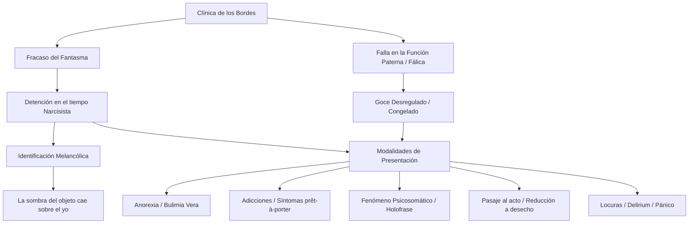
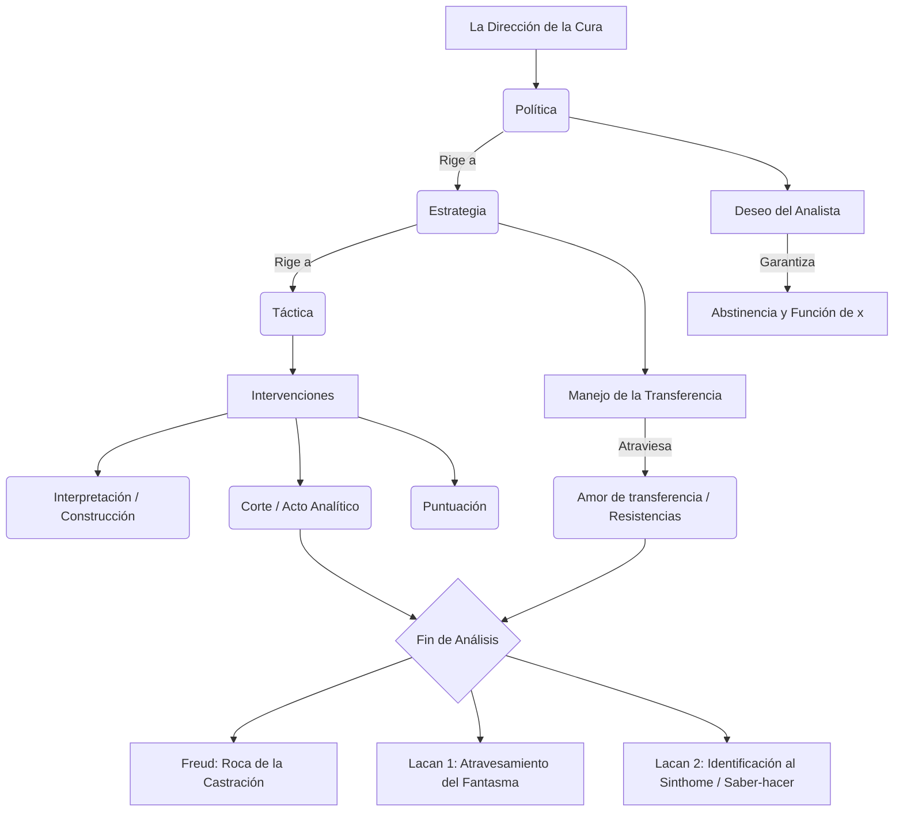
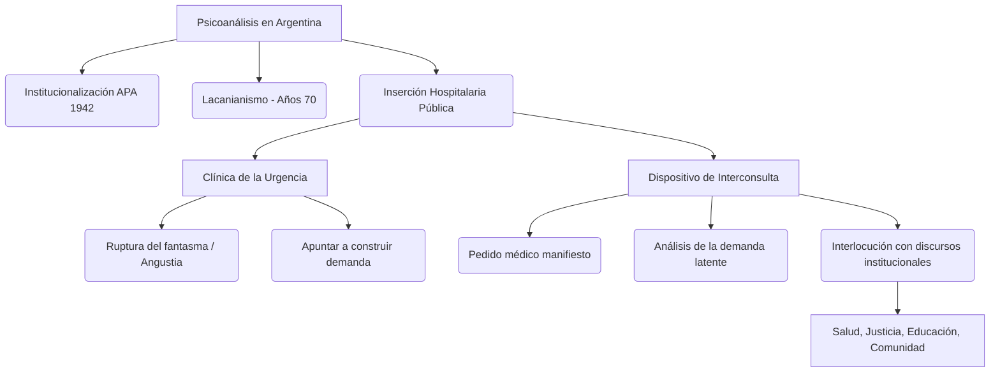

### 1. Tesis Central

La «clínica de los bordes» (o de los fracasos del fantasma) reúne una serie de presentaciones patológicas contemporáneas (anorexias, bulimias, adicciones, fenómenos psicosomáticos, pasajes al acto y "locuras" histéricas) que comparten una estructura subyacente: el fracaso en la constitución y operatividad del fantasma fundamental. A diferencia de la neurosis clásica, donde el fantasma protege frente a la angustia ofertando un objeto parcial, en estos sujetos se evidencia una detención en el tiempo narcisista de la identificación y un déficit en la función paterna y fálica (sin llegar a la forclusión psicótica). Esto los deja a merced de un goce no regulado, desencadenando defensas que operan como "máscaras yoicas" (síntomas prêt-à-porter), lesiones biológicas reales, o pasajes al acto en los que el sujeto se identifica con el objeto perdido o de desecho. Clínicamente, el abordaje demanda leer allí un duelo patológico y una melancolización encubierta que amenaza permanentemente con la destrucción subjetiva.

### 2. Glosario de Conceptos Clave

| Concepto | Definición Clave en el Texto |
|----------|-----------------------------|
| **Fracaso del fantasma** | Detención del fantasma en su tiempo puramente narcisista, impidiendo la parcialización del objeto. El sujeto no puede ofrecer una falta simbólica, sino que se ofrece entero (o su desaparición) para alojarse en el Otro. |
| **Melancolización / Duelo patológico** | Retiro de la libido del objeto perdido hacia el yo, estableciendo una identificación narcisista ("la sombra del objeto cayó sobre el yo"), generando un sadismo vuelto hacia la propia persona ante la imposibilidad de tramitar simbólicamente la pérdida. |
| **Función Fálica y Paterna** | Impasse o falla (no forclusión) donde la función paterna no inscribe plenamente el límite al goce materno. Dificulta la asunción de una posición sexuada y produce un "goce congelado" o incorporal sin amarre a la ley fálica (el "banquete totémico"). |
| **Pasaje al Acto** | Conclusión abrupta de una escena con efecto de aniquilación, donde el sujeto pierde el clivaje con el objeto, despojándose de identificaciones ideales y arrojándose a la posición de *desecho* frente al goce absoluto del Otro. |
| **Holofrase / Síntoma *prêt-à-porter*** | Borramiento del intervalo entre S1 y S2 que impide interrogar el deseo del Otro, suplantado por formaciones identitarias prestablecidas por el mercado (ej. adicciones) que funcionan como "máscaras yoicas" para evitar el desmoronamiento. |
| **Anorexia / Bulimia vera** | Presentaciones donde el sujeto rechaza el alimento si este no porta el "brillo fálico" del amor (asumiendo una posición amo de cadaverización), o transigiendo con un goce pulsional obsceno y sin lazo social ("comida clandestina") en la bulimia. |

### 3. Citas Críticas

> [!IMPORTANT]
> *"La sombra del objeto cayó sobre el yo, quien, en lo sucesivo, pudo ser juzgado por una instancia particular como un objeto, como el objeto abandonado."* (Freud, Duelo y melancolía)
> *Por qué es clave:* Define el mecanismo central de la melancolía, antecedente fundamental de la clínica de los bordes, donde la falla en la elaboración de la pérdida decanta en una identificación narcisista mortífera con el objeto.

> [!IMPORTANT]
> *"La anoréxica logra la muerte en vida de una mujer que no va a suscitar la erección fálica [...] Se planta en sostener a todo precio el deseo del Otro faltándole ella misma en su cuerpo cadavérico."* (Amigo, Clínica de los fracasos del fantasma)
> *Por qué es clave:* Ejemplifica las consecuencias estructurales del fracaso del fantasma: al no contar con un abanico de objetos para significar la falta, el sujeto oferta su propio ser en una fijeza narcisista y tanática.

> [!IMPORTANT]
> *"El delirium consiste en la vacilación del fantasma... Cuando el fantasma fracasa en la función que le es propia, la de remediar el goce del Otro, el sujeto queda desamparado."* (Fernández, Algo es posible)
> *Por qué es clave:* Diferencia conceptualmente los fenómenos de "locura" en la neurosis (delirium) de los delirios de la psicosis, ubicando su causa específica en el vacío del fantasma frente a la invasión de un goce no tramitado.

> [!IMPORTANT]
> *"El sujeto va presentándose progresivamente... en posición de desecho, de resto identificado al objeto [...] Nada del Ideal queda del lado del sujeto, sino que queda totalmente del lado del Otro."* (Iunger, Clínica del pasaje al acto en la neurosis)
> *Por qué es clave:* Explica la desarticulación narcisista previa al pasaje al acto: la pérdida del Ideal del yo y la absoluta reducción del sujeto a *objeto a*, como último y desesperado intento de separación estructural.

### 4. Mapa Conceptual

### 5. Preguntas de Autoevaluación

**1. ¿Cuáles son los antecedentes freudianos de la «clínica de los bordes»? Articule con el problema de la melancolía, poniendo el acento en la relación entre pérdida e identificación.**
> **Respuesta Sugerida:** Los antecedentes se ubican en el tríptico inhibición-síntoma-angustia, el "agieren" (actuar) y formaciones clínicas como la amencia de Meynert. Su matriz teórica es la **melancolía freudiana**: ante una pérdida, fracasa el trabajo de duelo (el desasimiento libidinal). La libido se retira sobre el yo, instaurando una identificación narcisista primaria. *La pérdida del objeto se muda en una pérdida del yo*, desencadenando un sadismo feroz dirigido contra sí mismo (autocastigo).

**2. Desarrolle la idea de «fracaso del fantasma» y refiérase a sus consecuencias estructurales.**
> **Respuesta Sugerida:** El fantasma normal protege ofertando a la falta del Otro un pequeño fragmento de sí (objeto parcial). El "fracaso del fantasma" implica una detención en su tiempo puramente narcisista. Al no constituirse el intervalo (holofrase) y fallar su función de velar el goce del Otro, las consecuencias son la fijeza mortífera: el sujeto no puede parcializarse y, en su lugar, ofrece su ser entero (o su cadáver, como en la anorexia) quedando desamparado frente al imperio del Otro.

**3. ¿Qué sucede en la «clínica de los bordes» con la función paterna y con la función fálica?**
> **Respuesta Sugerida:** Hay una falla estructural en ellas, pero sin llegar a la forclusión psicótica. La **función paterna** no logra operar su "tercera identificación" (o claudica en la época actual del "padre humillado"), dejando al sujeto adherido a un goce materno. La **función fálica** sufre un impasse: no logra enmarcar el objeto ni regular el goce (el "banquete totémico"). Persiste como defensa de modo fallido, cristalizando "goces congelados" e impidiendo el acceso regulado y simbólico al deseo y la posición sexuada.

**4. ¿Qué particularidades tienen en estos sujetos el narcisismo y las identificaciones?**
> **Respuesta Sugerida:** El narcisismo se presenta sumamente frágil, oscilando entre una devaluación absoluta (desnarcisización/melancolización) y una impostación maníaca (infatuación del yo). Las identificaciones son rígidas, precarias o *prestadas* (falso self, adicciones). Especialmente en el pasaje al acto, el sujeto se despoja de toda identificación ideal (proyectada plenamente en un Otro absoluto) y se identifica trágicamente con el *objeto a* en su vertiente de puro desecho (resto inasimilable).

**5. Caracterice las principales modalidades de presentación en la «clínica de los bordes»: anorexias y bulimias, «patologías del acto», locuras, afecciones psicosomáticas, adicciones, ataque de pánico, depresiones.**
> **Respuesta Sugerida:**
> *   **Anorexia/Bulimia vera:** Rechazo al alimento que no porta la ley fálica (se cadaveriza para faltarle al Otro) o ingesta pulsional clandestina y obscena que repudia el lazo social.
> *   **Patologías del acto:** Ej., el pasaje al acto, donde se concluye abruptamente la escena; el sujeto se arroja como desecho (suicidio) para huir del goce mortífero del Otro.
> *   **Locuras / Pánico:** Momentos de *delirium* (pesadilla en vigilia) no psicóticos, que surgen como parche ante el agujero fantasmático inoperante.
> *   **Afecciones psicosomáticas:** Efecto de la holofrase, el cuerpo orgánico hace letra, decantando en una lesión celular real sin interrogar el deseo.
> *   **Adicciones:** Uso de "síntomas prêt-à-porter" del mercado; máscaras yoicas para lograr un éxtasis narcisista (infatuación) y evitar el desmoronamiento de la estructura.
> *   **Depresiones:** Marcadas siempre por la sombra del "duelo suspendido" (melancolización encubierta) y la incapacidad de simbolizar la falta.

# Guía de Estudio: Dirección de la Cura, Intervenciones y Fin de Análisis (Clases 21 a 23)

### 1. Tesis Central
La dirección de la cura en psicoanálisis no es una empresa pedagógica, moral o de sugestión, sino una praxis estructurada lógicamente sobre la ética del deseo. Mientras Freud sentó las bases de la técnica (regla fundamental, abstinencia) descubriendo que la transferencia es tanto el motor de la cura como su mayor obstáculo, Lacan formaliza esta clínica ordenándola en tres dimensiones (táctica, estrategia y política). La brújula de todo el proceso es el "deseo del analista", una función vacía de todo goce personal que opera como motor absoluto de la diferencia frente a la repetición neurótica. Bajo este deseo, intervenciones como la interpretación, la construcción y el corte apuntan a atravesar el andamiaje fantasmático del sujeto, conduciéndolo más allá de la "roca de la castración" freudiana hacia un fin de análisis donde se logre un saber-hacer (*savoir-faire*) con lo incurable del síntoma.

### 2. Glosario de Conceptos Clave

| Concepto | Definición Clave en el Texto |
|----------|-----------------------------|
| **Táctica** (Lacan) | Dimensión en la que el analista es "libre" respecto al momento, número y tipo de sus intervenciones (interpretaciones, cortes), pero que está estrictamente subordinada a la estrategia clínica. |
| **Estrategia** (Lacan) | Dimensión que concierne al manejo de la transferencia, donde el analista es menos libre y debe ubicarse (como el "muerto" en el bridge) para hacer surgir el juego y el deseo del analizante. |
| **Política** (Lacan) | Dimensión rectora del análisis donde el analista es menos libre aún. Concierne a su posición ética dictada por la falta-en-ser y el Deseo del Analista, oponiéndose a la domesticación del Yo del paciente. |
| **Deseo del Analista** | Función central que hace posible la transferencia. Es un deseo de "máxima diferencia" que rompe con la repetición inerte y evita que el analista se ofrezca como ideal para la identificación del analizante. |
| **Abstinencia** (Freud) | Regla clínica por la cual el analista debe denegar la satisfacción directa (especialmente ante el "amor de transferencia"), dejando subsistir la necesidad como fuerza pulsionante para el trabajo analítico. |
| **Interpretación** | Para Freud, vía para hacer consciente lo inconsciente. Para Lacan, intervención que no apunta al sentido hermenéutico, sino que recae sobre el significante, ubicándose "entre el enigma y la cita". |
| **Construcción** (Freud) | Intervención articulada e histórica que Freud introduce para lidiar con los límites de la interpretación (como los topes de lo pulsional o lagunas mnémicas), armando piezas dispersas de la vida del sujeto. |
| **Corte / Puntuación** (Lacan) | El corte es un "acto" sobre lo real que detiene el circuito inerte y el goce masoquista ("bla bla bla") interrumpiendo la sesión. La puntuación sanciona retroactivamente el sentido en la cadena significante. |
| **Atravesamiento del fantasma** | Versión lacaniana del fin de análisis donde el sujeto advierte que su axiomática inconsciente (su respuesta a la falta del Otro) es meramente una ficción o montaje, perdiendo así su absolutismo. |
| **Sinthome / Saber-hacer** | Última versión conclusiva de Lacan: frente al núcleo incurable del síntoma, el fin no es su erradicación, sino un *savoir-faire* (saber-hacer con) que permite al sujeto anudarse singularmente sin depender del Nombre-del-Padre. |

*(Nota: Sobre el "señalamiento" consultado, el autor no aborda este concepto formalmente como entidad estructural diferenciada en los textos aquí analizados).*

### 3. Citas Críticas

> [!IMPORTANT]
> *"El eje, el punto común de esta hacha de doble filo, es el deseo del analista, que designo aquí como una función esencial. Y no me vengan a decir que no nombro ese deseo, porque es precisamente el punto que sólo es articulable por la relación del deseo con el deseo."*
> *Por qué es clave:* Fundamenta que el motor del análisis para Lacan no radica en la persona, el ego o los afectos del analista (contratransferencia), sino en una función estructurante que apunta a suscitar el deseo del analizante. (Lacan - Seminario 11)

> [!IMPORTANT]
> *"El psicoanalista sin duda dirige la cura. El primer principio de esta cura [...] es que no debe dirigir al paciente [...] La dirección de la cura consiste en primer lugar en hacer aplicar por el sujeto la regla analítica."*
> *Por qué es clave:* Lacan demarca la diferencia radical entre la ortopedia yoica o reeducación moral (dirigir al paciente) y la verdadera ética psicoanalítica basada en ordenar el dispositivo para que advenga el sujeto del inconsciente. (Lacan - La dirección de la cura)

> [!IMPORTANT]
> *"Uno debe guardarse de desviar la transferencia amorosa, de ahuyentarla o de disgustar de ella a la paciente; y con igual firmeza uno se abstendrá de corresponderle. Uno retiene la transferencia de amor, pero la trata como algo no real, como una situación por la que se atraviesa en la cura..."*
> *Por qué es clave:* Resume el principio rector de Freud sobre la abstinencia frente al amor de transferencia, concibiéndolo como repetición que debe analizarse y no como un obstáculo contingente o una demanda a satisfacer. (Freud - Puntualizaciones sobre el amor de transferencia)

> [!IMPORTANT]
> *"...en ese punto, se trata de un «saber-hacer con el síntoma», de un savoir-faire. Con eso no se trata de pretender reducirlo, porque es imposible, sino de «saber-hacer con»."*
> *Por qué es clave:* Cifra la respuesta clínica última de Lacan (vía el *Sinthome*) frente al pesimismo de la "roca de la castración" freudiana. Acepta que existe un goce irreductible, pero propone una invención singular como final de análisis. (Belucci - Versiones del fin de análisis)

### 4. Mapa Conceptual

### 5. Preguntas de Autoevaluación

*(Incluye las pautas detalladas de respuesta a los ejes planteados para el estudio de los textos)*

**Pregunta 1: Desarrolle las tres dimensiones de la práctica analítica que Lacan introduce a partir de su lectura de Von Clausewitz.**
*Pauta de respuesta:* En *La dirección de la cura*, Lacan utiliza la jerarquía táctica-estrategia-política. La **táctica** es donde el analista es más libre; se refiere al uso preciso del tiempo y la palabra (interpretación, corte, puntuación) en las sesiones. Sin embargo, está supeditada a la **estrategia**, que remite al manejo de la transferencia, donde el analista es menos libre pues debe desdoblar su persona y actuar como el "muerto" en el bridge para dejar lugar al analizado. La **política** de la cura es el nivel donde el analista es menos libre, ya que obedece a la ética del psicoanálisis: está regida por el reconocimiento de la "falta-en-ser" y apuntalada en el deseo del analista.

**Pregunta 2: ¿Cómo plantea Lacan la función deseo del analista, su relación con la estructura y sus efectos en el análisis?**
*Pauta de respuesta:* Lacan arranca el motor del análisis de las inclinaciones psicológicas del médico (descartando la contratransferencia) para instalar la función del **deseo del analista**. Es un deseo enigmático (una "x") y absoluto, un deseo de "obtener la diferencia". Respecto a la estructura y los efectos en el tratamiento, este deseo rompe el conformismo del automatismo de repetición inerte del analizante. Permite que, allí donde todo tiende a repetirse igual, se inscriba una diferencia inédita. A su vez, impide la identificación alienante, ya que el analista vacía su lugar de todo ideal yoico.

**Pregunta 3: ¿Qué aportan Freud y Lacan sobre las intervenciones del analista en el tratamiento? Diferencie la interpretación, construcción, puntuación, corte, y señalamiento.**
*Pauta de respuesta:* 
- **Interpretación:** En Freud, apunta a develar lo reprimido. En Lacan, se aleja de la hermenéutica del sentido; opera sobre el equívoco significante situándose "entre el enigma y la cita", abriendo el inconsciente.
- **Construcción:** Freud la formula para articular retazos dispersos y tapar lagunas mnémicas ante topes donde la interpretación fracasa (resistencias del Ello o pulsionales).
- **Puntuación y Corte:** Son técnicas lacanianas puras. La puntuación interviene en la cadena significante sancionando su sentido de forma retroactiva. El corte es un verdadero acto analítico que recae sobre lo Real: interrumpe el goce masoquista inerte o el palabrerío vacío ("bla bla bla") dando fin a la sesión para desarticular el estancamiento.
- *(Nota: El señalamiento no está tematizado por estos autores analizados como un concepto operativo psicoanalítico formal).*

**Pregunta 4: Desarrolle el fin de análisis desde Freud y Lacan.**
*Pauta de respuesta:* En Freud (*Análisis terminable e interminable*), el análisis encuentra un límite biológico-pulsional frente a la "roca de la castración", figurado como la envidia del pene en la mujer y la rebelión ante la pasividad en el hombre; el saldo es marcadamente pesimista. Lacan resuelve teóricamente este escollo proponiendo finales lógicos: 1) El **atravesamiento del fantasma**, donde el neurótico destituye la verdad absoluta de su ficción y reconoce el montaje mediante el cual taponaba la falta del Otro. 2) La identificación al síntoma o **savoir-faire con el Sinthome**, que asume que hay un carozo de goce incurable, pero en lugar de combatirlo, el analizante lo convierte en una invención o herramienta singular para anudarse a la vida, prescindiendo de las garantías simbólicas del Padre.

**Pregunta 5: Explique el precepto freudiano de la "Abstinencia" al enfrentar el fenómeno del amor de transferencia.**
*Pauta de respuesta:* Freud (*Puntualizaciones sobre el amor de transferencia*) advierte que frente al enamoramiento de la paciente, que se presenta bajo la apariencia de un amor real pero fogoneado por la resistencia, el analista no debe ni corresponder moralmente (sugestión o coito), ni reprimir moralmente ese amor (asustarlo). La **abstinencia** significa tratarlo como un fenómeno clínico irreal en términos de actualidad y conservarlo sin dar satisfacción directa, para que su fuerza empuje el trabajo analítico hasta rastrear los nexos infantiles inconscientes originales que sostienen dicha neurosis amorosa.

### 1. Tesis Central
La inserción del psicoanálisis en la Argentina, desde sus inicios pioneros hasta su consolidación en el ámbito público (especialmente en hospitales generales), ha requerido una constante reformulación de sus dispositivos clínicos. La intervención en la urgencia y el dispositivo de interconsulta demuestran la plasticidad del método psicoanalítico, donde la ética de hacer lugar al sujeto del inconsciente dialoga y se tensiona con el discurso médico e institucional, expandiendo la praxis hacia múltiples ámbitos de interlocución comunitaria, judicial y educativa.

### 2. Glosario de Conceptos Clave
| Concepto | Definición Clave en el Texto |
|----------|-----------------------------|
| Historia del Psicoanálisis en Argentina | Trayectoria que inicia con la fundación de la Asociación Psicoanalítica Argentina (1942), marcada por pioneros, y sufre una profunda transformación con la entrada de la enseñanza de Lacan (años 70), logrando una fuerte penetración en el ámbito hospitalario, la salud pública y la universidad. |
| Urgencia Psicoanalítica | Momento de quiebre en la homeostasis subjetiva y fracaso del fantasma frente a la irrupción de lo real, caracterizado por el desborde de angustia, el pasaje al acto o el acting out. La intervención busca introducir la pausa e historizar para que surja una demanda. |
| Dispositivo de Interconsulta | Práctica en el hospital general donde el psicoanalista es convocado por el equipo médico. Su función no es responder mecánicamente al pedido, sino alojar y descifrar la demanda (del paciente y del equipo tratante), interponiendo la dimensión subjetiva frente al discurso de la ciencia médica. |
| Ámbitos de Interlocución | Espacios (hospital general, escuela, sistema judicial, instituciones comunitarias) donde el psicoanálisis dialoga con otras disciplinas (medicina, derecho, pedagogía). Implica sostener la especificidad de la escucha psicoanalítica sin ceder al furor curandis ni al reduccionismo. |

### 3. Citas Críticas
> [!IMPORTANT]
> "La urgencia subjetiva no se superpone linealmente a la urgencia psiquiátrica o médica; es el tiempo de la angustia donde la palabra ha perdido su eficacia y el analista debe operar para restablecer el lazo transferencial y permitir el despliegue de una demanda."
> *Por qué es clave:* Diferencia el abordaje psicoanalítico de los protocolos médicos estándar, priorizando el lugar del sujeto y la formulación de una interrogación por sobre la mera supresión sintomática.

> [!IMPORTANT]
> "En la interconsulta, a menudo el paciente es el propio equipo médico; el psicoanalista interviene sobre los puntos ciegos de la institución y la angustia que suscita aquello que resiste al saber médico."
> *Por qué es clave:* Subraya que la intervención del analista no recae únicamente en el paciente internado, sino en la red discursiva e institucional que enmarca la consulta médica.

### 4. Mapa Conceptual

### 5. Preguntas de Autoevaluación
1. ¿Cuáles fueron los hitos fundamentales en la historia e inserción del psicoanálisis en la Argentina, desde sus inicios hasta su vasta entrada en el hospital público?
2. ¿Qué diferencia conceptual y clínica establece el psicoanálisis entre una "urgencia médica o psiquiátrica" y una "urgencia subjetiva"?
3. Explique el rol del psicoanalista en el dispositivo de interconsulta hospitalaria y cómo debe operar respecto a la demanda del equipo tratante.
4. Desarrolle cómo se piensa el abordaje de la angustia, el *acting out* y el pasaje al acto en la intervención psicoanalítica de urgencia.
5. Mencione y analice al menos tres ámbitos institucionales (más allá del consultorio privado) donde el psicoanálisis establece necesarias interlocuciones con otros discursos.

