# Piaget I: Introducción y Estadio Sensorio-Motor

> **Unidad 5** — El desarrollo cognitivo desde la perspectiva piagetiana
> **Materia:** Psicología Evolutiva
> **Bibliografía integrada:** Faas (2018), Cap. 9; Papalia et al. (2009), Cap. 7; Piaget e Inhelder (1969), Introducción y Caps. 1 y 2.

---

## Índice

1. [Introducción: Piaget y su programa de investigación](#1-introducción-piaget-y-su-programa-de-investigación)
2. [Marco conceptual fundamental](#2-marco-conceptual-fundamental)
3. [La teoría de los estadios](#3-la-teoría-de-los-estadios)
4. [El estadio sensorio-motor: la inteligencia práctica](#4-el-estadio-sensorio-motor-la-inteligencia-práctica)
5. [La construcción de lo real](#5-la-construcción-de-lo-real)
6. [Aspectos cognitivo y afectivo de las reacciones sensorio-motrices](#6-aspectos-cognitivo-y-afectivo-de-las-reacciones-sensorio-motrices)
7. [Las percepciones (Piaget, Cap. 2)](#7-las-percepciones-piaget-cap-2)
8. [Críticas y aportes postpiagetianos](#8-críticas-y-aportes-postpiagetianos)
9. [Síntesis visual y mapas conceptuales](#9-síntesis-visual-y-mapas-conceptuales)
10. [Glosario](#10-glosario)
11. [Preguntas de autoevaluación](#11-preguntas-de-autoevaluación)

---

## 1. Introducción: Piaget y su programa de investigación

### 1.1 Quién fue Piaget

Jean Piaget (Ginebra, 1896 — 1980) tuvo una formación interdisciplinaria poco común: **biología, psicología, epistemología y lógica**. Esa hibridez es clave para entender su obra: su psicología no es una psicología "del comportamiento" en sentido conductista, sino un intento por responder una pregunta **epistemológica** —*¿cómo se construye el conocimiento?*— por medio de un método psicológico (el estudio del niño).

Durante sus estudios en París trabajó con Alfred Binet en la aplicación de tests de inteligencia. Allí ocurre el viraje decisivo: a Piaget **no le interesaban las respuestas correctas, sino los errores sistemáticos**. Le llamaba la atención que numerosos niños cometían los **mismos errores** ante las mismas preguntas. Esa regularidad sugería que los errores no eran fallos azarosos, sino expresión de **estructuras cognitivas** propias de cada edad (Faas, 2018, p. 197).

### 1.2 Psicología del niño vs. Psicología genética

Piaget e Inhelder (1969) establecen una distinción terminológica importante:

| Disciplina | Objeto |
|---|---|
| **Psicología del niño** | Estudia al niño *en sí mismo*: el crecimiento mental, el desarrollo de las conductas hasta la adolescencia. |
| **Psicología genética** | Estudia la psicología *general* (inteligencia, percepción, lenguaje), pero **explicándola por su modo de formación**, es decir, por su desarrollo (ontogénesis). |

> ⚠️ **Aclaración terminológica:** El término "genética" en Piaget **no se refiere a los genes ni a la herencia biológica** (sentido actual de los biólogos). Fue introducido por los psicólogos en la segunda mitad del siglo XIX y refiere a la **génesis** u **ontogénesis** — al desarrollo del individuo (Piaget e Inhelder, 1969, Introducción).

La posición de Piaget es que **"el niño explica al hombre tanto o más que el hombre explica al niño"** (Piaget e Inhelder, 1969, p. 22). Estudiar el desarrollo no es solo un fin pedagógico: es la vía para entender qué es el conocimiento en general.

### 1.3 La inteligencia como adaptación

Para Piaget, la inteligencia **no es una facultad innata acabada** ni una mera copia de lo real (empirismo), sino una **constante adaptación de los esquemas internos al mundo externo**. El conocimiento no se "recibe" pasivamente: se construye.

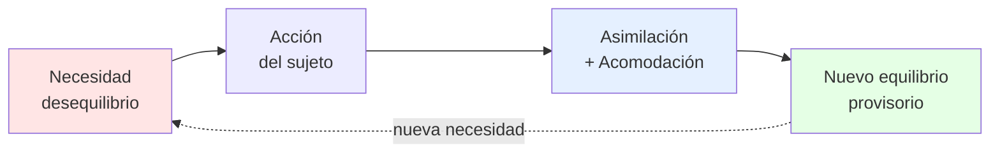

> *"El niño, al igual que el adulto, no ejecuta ningún acto exterior o incluso totalmente interior, más que impulsado por un móvil, y este móvil se traduce siempre en una necesidad"* (Piaget, citado en Faas, 2018, p. 197).

---

## 2. Marco conceptual fundamental

### 2.1 Esquema

Un **esquema** es una *estructura* u *organización de acciones que se transfiere o generaliza* durante la repetición de esa acción en circunstancias iguales o análogas (Piaget e Inhelder, 1969, p. 26, nota 4).

Características clave:
- Es un **patrón organizado** de pensamiento y conducta.
- Puede ser **material** (manipular objetos) o **mental** (interiorización de imágenes).
- Es **repetible** en situaciones similares.
- Se **modifica con la experiencia**.

**Ejemplos:**
- *Recién nacido:* esquemas reflejos (succión, prensión palmar).
- *Bebé de 4 meses:* esquema de "agitar para producir sonido".
- *Adulto:* esquemas operatorios abstractos.

### 2.2 Asimilación, acomodación y adaptación

Toda necesidad tiende a (Piaget, citado en Faas, 2018, p. 198):
1. **Incorporar** las cosas y personas a la actividad propia → **asimilación**.
2. **Reajustar** las estructuras en función de lo experimentado → **acomodación**.

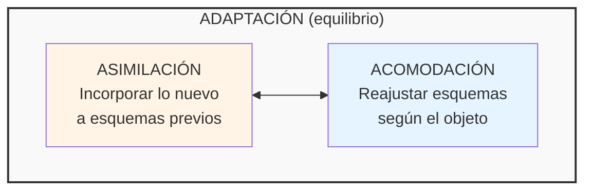

| Concepto | Definición | Ejemplo sensorio-motor |
|---|---|---|
| **Asimilación** | Incorporación de información del mundo externo a estructuras ya construidas. | El bebé succiona un objeto nuevo aplicando el esquema de succión. |
| **Acomodación** | Reajuste de las estructuras construidas en función de las transformaciones experimentadas. | El bebé modifica el esquema de succión al chupar un pulgar (más pequeño) versus el pezón. |
| **Adaptación** | Equilibrio entre asimilación y acomodación. Forma general del equilibrio psíquico. | El bebé logra succionar eficazmente diversos objetos. |
| **Equilibración** | Proceso autorregulado por el que el sujeto restablece el equilibrio cada vez que aparece un desequilibrio. | La maduración general del pensamiento. |

### 2.3 Tipos de asimilación (estadio I)

En el primer ejercicio reflejo (estadio I), Piaget distingue tres formas de asimilación que ya están presentes y que serán la base de todo lo posterior (Piaget e Inhelder, 1969, p. 25):

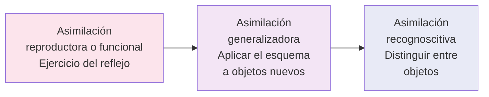

- **Reproductora/funcional:** repetición de la acción (mamar más eficazmente con los días).
- **Generalizadora:** aplicar el esquema a nuevos objetos (succionar en vacío, succionar objetos cualesquiera).
- **Recognoscitiva:** diferenciar (distinguir el pezón de otros objetos).

> 📌 **Importante:** El pasaje de un subestadio a otro **se da por asimilación, NO por asociación** (como en Pavlov). Esta es la crítica central de Piaget al asociacionismo.

### 2.4 Crítica al asociacionismo: E→R vs. E→(Og)→R

El asociacionismo (incluido el conductismo) plantea que toda adquisición es una respuesta (R) a estímulos exteriores (E) mediante asociaciones acumulativas:

$$E \rightarrow R$$

Piaget propone, en cambio, que **el sujeto solo se vuelve sensible a los estímulos en la medida en que son asimilables a estructuras ya construidas**. El organismo (Og) interviene de forma activa y reorganizadora:

$$E \rightleftharpoons R \quad \text{o equivalentemente} \quad E \rightarrow (Og) \rightarrow R$$

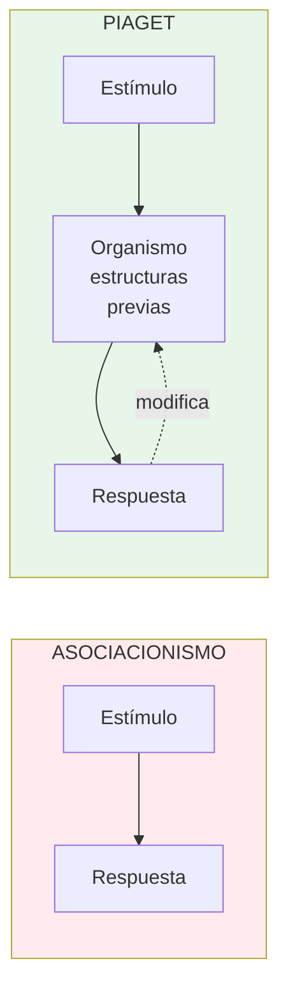

Diferencia clave: en Piaget hay **reciprocidad** y **construcción**. La actividad organizadora del sujeto es tan importante como las conexiones externas (Piaget e Inhelder, 1969, p. 24).

### 2.5 Factores de la evolución mental

Cuatro factores se conjugan en el desarrollo cognitivo (Faas, 2018, p. 198):

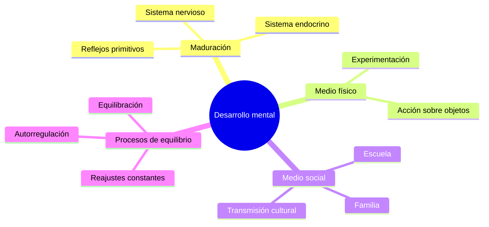

| Factor | Descripción |
|---|---|
| **Maduración** | Componente orgánico, madurez del sistema nervioso. |
| **Medio físico** | Experimentación adquirida por la acción sobre objetos. |
| **Medio social** | Interrelaciones desde el nacimiento (familia, escuela, cultura). Base para la socialización. |
| **Procesos de equilibrio** | Reajustes constantes del sujeto para adaptarse al medio. |

### 2.6 Invariantes funcionales

Independientemente del estadio que el niño esté transitando, **siempre** se producen los procesos de **adaptación (asimilación + acomodación) y organización**. Esto es lo que Piaget llama **invariantes funcionales**: lo que NO cambia en todo el desarrollo (Faas, 2018, p. 198).

Lo que **sí** cambia son:
- las necesidades,
- los intereses,
- las explicaciones que el niño construye del mundo,
- el modo de relación con los otros.

> **Ejemplo:** Un niño de 3 años tiene pensamiento egocéntrico; uno de 8 años puede contemplar opiniones ajenas y sentir empatía. **Pero en ambos casos** opera el mismo interjuego entre adaptación y organización (Faas, 2018, p. 198).

---

## 3. La teoría de los estadios

### 3.1 Características de un estadio

Para Piaget, un estadio no es una etapa cronológica arbitraria sino una **estructura cognitiva** con propiedades específicas (Faas, 2018, p. 198):

1. **Orden constante de adquisiciones**: ningún niño puede saltarse un estadio. Ej.: no se accede al operatorio concreto sin pasar por la capacidad representacional del preoperatorio.
2. **Integración jerárquica**: las estructuras de un estadio se integran en las del siguiente como subestructuras (no se pierden, se reorganizan).
3. **Momento de preparación + momento de completamiento**: cada estadio tiene una fase inicial donde se gestan los logros y una fase final donde se consolidan.
4. **Génesis y forma final de equilibrio**: cada estadio tiene un proceso de construcción y una forma de equilibrio característica.

### 3.2 Los cuatro estadios — panorama

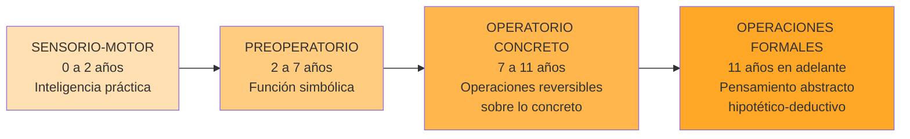

| Estadio | Edad aproximada | Característica central |
|---|---|---|
| **Sensorio-motor** | 0 – 2 años | Inteligencia práctica, sin función simbólica. Aprendizaje por sentidos y acción motora. |
| **Preoperacional** | 2 – 7 años | Aparece la función simbólica (lenguaje, juego simbólico, dibujo, imitación diferida). Pensamiento egocéntrico, intuitivo. |
| **Operatorio concreto** | 7 – 11 años | Operaciones lógicas reversibles aplicadas a objetos concretos. Conservaciones. |
| **Operaciones formales** | 11+ años | Pensamiento hipotético-deductivo, abstracción, combinatoria. |

---

## 4. El estadio sensorio-motor: la inteligencia práctica

### 4.1 Caracterización general

Desde el nacimiento hasta aproximadamente los 2 años, el bebé desarrolla una **inteligencia sensorio-motriz**: una inteligencia *anterior al lenguaje* y *anterior a la representación*, que se apoya exclusivamente en **percepciones y movimientos coordinados** (Piaget e Inhelder, 1969, p. 24).

Rasgos distintivos:

- 🚫 **Sin función simbólica**: el bebé no presenta todavía pensamiento ni afectividad ligada a representaciones que evoquen personas u objetos ausentes.
- 🛠️ **Esencialmente práctica**: tiende a **logros**, no a enunciar verdades.
- 🧱 **Construye subestructuras cognitivas** que serán el punto de partida de las construcciones perceptivas e intelectuales posteriores.
- 🎯 De respuestas **reflejas y aleatorias** → conductas **orientadas a objetivos**.

> El sensorio-motor logra resolver problemas de acción (alcanzar objetos alejados o escondidos) construyendo un complejo sistema de esquemas de asimilación y organizando lo real según estructuras espacio-temporales y causales (Piaget e Inhelder, 1969, p. 23).

### 4.2 Las reacciones circulares

Las **reacciones circulares** son el mecanismo central del aprendizaje en este período. Concepto retomado por Piaget de **J. M. Baldwin (1894)**:

> *"Procesos por medio de los cuales un bebé aprende a reproducir los sucesos deseados, originalmente descubiertos por casualidad. La reacción circular es la repetición de una acción enriquecida y fortalecida por la experiencia"* (Faas, 2018, p. 199).

Una actividad produce una sensación agradable, el bebé quiere repetirla, y la repetición se alimenta a sí misma en un **ciclo continuo donde causa y efecto se invierten**.

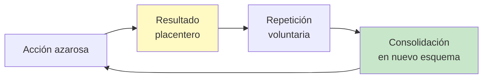

#### Tabla comparativa de reacciones circulares

| Reacción circular | Subestadio | Foco | Característica clave |
|---|---|---|---|
| **Primaria** | 2° (1-4 meses) | Sobre el **propio cuerpo** | Repetición de un esquema sujeto a variaciones. Asimilación generalizadora *sobre* acomodación. Primeros "hábitos". |
| **Secundaria** | 3° (4-8 meses) | Sobre el **mundo exterior** | Extensión y complejización de esquemas. Intención naciente. Acciones voluntarias placenteras pero no aún dirigidas a una meta. |
| **Terciaria** | 5° (12-18 meses) | **Experimentación** | "Experimentos para ver": introducción de variaciones para observar resultados. Causalidad. Clara distinción asimilación/acomodación. |

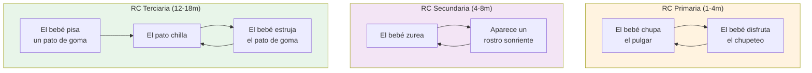

(Adaptado de Papalia et al., 2009, Fig. 7-3, p. 204)

### 4.3 Los seis subestadios

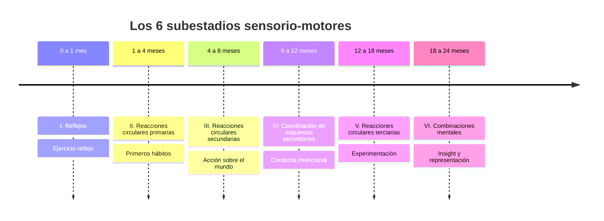

#### Subestadio I: Reflejos (0 – 1 mes)

- **Punto de partida** del desarrollo: NO los reflejos como respuestas aisladas, sino las **actividades espontáneas y globales del organismo** (von Holst), de las cuales los reflejos son diferenciaciones (Piaget e Inhelder, 1969, p. 25).
- Reflejos relevantes (los que se desarrollan con el ejercicio, no los que se atrofian): **succión, prensión palmar**.
- Aparece el **"ejercicio reflejo"**: consolidación del reflejo mediante el ejercicio funcional. Ej.: el recién nacido mama más eficazmente y encuentra mejor el pezón al cabo de unos días.
- Las tres asimilaciones (reproductora, generalizadora, recognoscitiva) ya están presentes en germen.
- **No hay diferenciación entre asimilación y acomodación, no hay conducta intencionada** (Faas, 2018, p. 200).
- Cierto control sobre los reflejos innatos: aparición del comportamiento aun cuando el estímulo no esté presente (ej.: chupetear sin que toque los labios) — extensión del esquema reflejo.

#### Subestadio II: Reacciones circulares primarias (1 – 4 meses)

- **Primeros hábitos** mediante repetición de acciones inicialmente azarosas.
- Caso paradigmático: **succión sistemática del pulgar** (no fortuita). Implica coordinación de movimientos del brazo, mano y boca.
- Asimilación y acomodación todavía **no se diferencian del todo** ("asimilación sobre acomodación", Faas, 2018, p. 199).
- ⚠️ **Crítica de Piaget a otras lecturas** (Piaget e Inhelder, 1969, p. 26):
  - Asociacionistas: solo ven repetición — pero ¿de dónde viene la repetición si no hay conexión exterior impuesta?
  - Psicoanalistas: ven asimilación representativa pulgar-pecho — pero ¿de dónde sale ese poder simbólico antes de las primeras imágenes mentales?
  - Piaget: es **extensión de la asimilación sensorio-motriz** que ya opera en el reflejo, mediante integración de elementos sensorio-motores antes independientes.
- Las actividades se centran en el **propio cuerpo más que en el entorno**.
- Comienzan a **coordinar información sensorial** (girar hacia las fuentes de sonido → coordinación visión-audición) y a **sujetar objetos**.
- Ejemplo de Papalia: "Cuando se le da un biberón, Dylan, a quien generalmente se amamanta, puede adaptar su chupeteo al chupón de goma" (Papalia et al., 2009, p. 203).

> **Hábito ≠ Inteligencia.** Un hábito elemental se basa en un esquema sensorio-motor de conjunto en el que **todavía no hay diferenciación entre medios y fines**. La finalidad se alcanza solo mediante una sucesión obligada de movimientos. En un acto de inteligencia, en cambio, se persigue un fin desde el inicio y se buscan los medios apropiados, ya diferenciados (Piaget e Inhelder, 1969, p. 26-27).

#### Subestadio III: Reacciones circulares secundarias (4 – 8 meses)

- **Hito de la edad:** coordinación visión-prensión (hacia los 4½ meses). El bebé **agarra y manipula todo lo que ve en su espacio próximo**.
- Las acciones se desplazan **del propio cuerpo al mundo exterior**.
- Reacciones circulares secundarias: el bebé repite **acciones voluntarias placenteras** que producen resultados llamativos en objetos externos.
- **Aún no hay clara distinción entre medios y fines.** La acción está centrada en el resultado interesante.
- Mayor interés por el entorno, enriquecimiento de esquemas, anticipación incipiente.
- **Ejemplo clásico de Piaget** (Piaget e Inhelder, 1969, p. 27): el bebé atrapa un cordón que pende del techo de su cuna, lo que sacude todos los juguetes suspendidos; repite el acto. Luego, si se suspende un nuevo juguete o se hace sonar música tras un biombo, el bebé volverá a tirar del cordón — **comienzo de diferenciación entre fin y medio**, "umbral de la inteligencia", aunque mediada por una causalidad mágica.
- Otros ejemplos: agitar un sonajero, gatear hasta una puerta y golpearla para escuchar el ruido.

#### Subestadio IV: Coordinación de esquemas secundarios (8 – 12 meses)

- ⭐ **Aparición de la conducta verdaderamente intencional**: deliberada y premeditada.
- El bebé **identifica el fin previamente** y luego selecciona los medios.
- **Los medios surgen de esquemas conocidos** que se coordinan (no se inventan aún medios nuevos). Ejemplo: levantar un cojín (esquema habitual) para alcanzar un objeto escondido (combinación nueva).
- Aparece la **buena coordinación viso-motriz**: mirar un sonajero y tomarlo.
- **Anticipación de eventos** (Papalia: el bebé Anica presiona el botón de su libro de juguete que toca una canción específica, eligiéndolo entre varios).
- Posición bípeda → trasladarse → más experimentación.
- Interés naciente por **relaciones causa-efecto** entre las cosas.
- **Persistencia en metas**: no renuncia con facilidad.
- Aparece el famoso **error A no B** (ver § 5.2).

#### Subestadio V: Reacciones circulares terciarias (12 – 18 meses)

- **Búsqueda de medios nuevos por diferenciación de esquemas conocidos** (Piaget e Inhelder, 1969, p. 28).
- Reacciones circulares terciarias: **"experimentos para ver"** — el bebé varía la acción intencionalmente para observar diferentes resultados, en lugar de solo repetir lo placentero.
- Resolución de problemas por **ensayo y error** y **exploración activa**.
- **Clara distinción** asimilación / acomodación: repite **pero innova alternativamente**.
- Adquisición de la posición erecta y de la marcha → exploración del ambiente.
- **Conductas características** (Piaget e Inhelder, 1969, p. 28; Faas, 2018, p. 202):

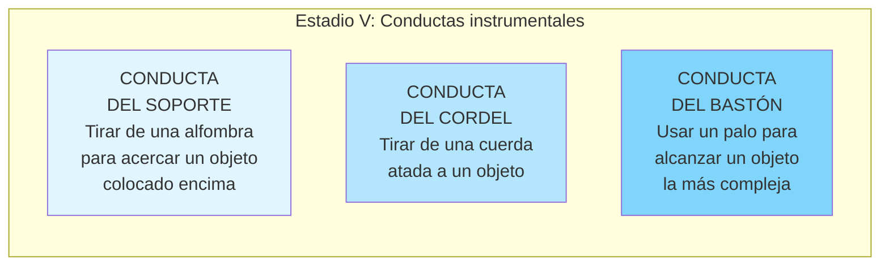

- ⚠️ **Limitación de la conducta del soporte**: el niño del estadio V **no** tirará del soporte si el objeto no está *sobre* la alfombra (debe haber contacto físico). Esto contrasta con la causalidad mágico-fenomenista del estadio III (ver § 5.4).
- Permanencia del objeto adquirida en condiciones de desplazamiento visible.

#### Subestadio VI: Combinaciones mentales (18 – 24 meses)

- 💡 **Transición al pensamiento representacional.** El infante supera el ensayo y error gracias a la **manipulación mental**.
- Aparece la **comprensión súbita** o ***insight***: detiene la acción, examina la situación, encuentra la solución.
- **Ejemplo paradigmático de Lucienne** (hija de Piaget) (Piaget e Inhelder, 1969, p. 28; Papalia et al., 2009, p. 205): ante una caja de cerillas entreabierta con un dedal adentro, Lucienne primero intenta abrirla por tanteo material (reacción del V). Tras fracasar, se detiene, examina, **abre y cierra lentamente la boca** (como si imitara la abertura buscada), y entonces desliza el dedo en la hendidura para abrir la caja.
- **Capacidad representacional**: capacidad para representar mentalmente objetos y sucesos en la memoria, principalmente por símbolos (palabras, números, imágenes mentales).
- Esto libera al niño de la **experiencia inmediata**: puede pensar acciones antes de realizarlas, recordar, anticipar.
- **Permanencia completa del objeto** (incluyendo desplazamientos invisibles).
- **Imitación diferida**.
- Combinación de esquemas e invención de medios nuevos.

#### Tabla comparativa: los seis subestadios

| # | Subestadio | Edad | Logro nuclear | Ejemplo (Papalia) |
|---|---|---|---|---|
| I | **Uso de reflejos** | 0-1 mes | Ejercicio reflejo, sin coordinación sensorial. | Dorri comienza a chupetear al colocársele el pecho en la boca. |
| II | **R. circulares primarias** | 1-4 m | Repetición de acciones placenteras sobre el propio cuerpo. Primeras adaptaciones aprendidas. | Dylan adapta su chupeteo del pecho materno al chupón de goma del biberón. |
| III | **R. circulares secundarias** | 4-8 m | Acciones intencionales sobre el entorno. Repetición de resultados llamativos. | Alejandro empuja trozos de cereal por el borde de su silla y observa cómo caen. |
| IV | **Coordinación de esquemas 2°** | 8-12 m | Conducta intencional. Distinción incipiente medios/fines. Anticipación. | Anica elige y presiona repetidamente el botón de su libro que toca su canción favorita. |
| V | **R. circulares terciarias** | 12-18 m | Experimentación, ensayo y error, búsqueda de medios nuevos. | Bjorn, ante el libro favorito sostenido tras los barrotes de la cuna, prueba traerlo de frente, fracasa, lo gira de lado y lo abraza. |
| VI | **Combinaciones mentales** | 18-24 m | Insight, representación, símbolos. | Jenny juega con su caja de figuras y busca el orificio correspondiente *antes* de intentar colocar cada pieza. |

---

## 5. La construcción de lo real

> *"La inteligencia sensorio-motriz organiza lo real, construyendo, a través de su propio funcionamiento, las grandes categorías de la acción que son los esquemas del **objeto permanente, del espacio, del tiempo y de la causalidad**"* (Piaget e Inhelder, 1969, p. 29).

**Ninguna de estas categorías está dada al comienzo.** El universo inicial está totalmente centrado en el cuerpo y la acción propios.

### 5.1 Descentramiento: la "revolución copernicana"

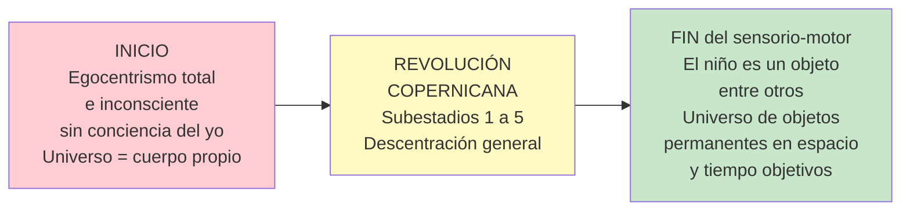

El término **"revolución copernicana"** alude a Copérnico, que destronó a la Tierra del centro del universo. Análogamente, el niño descubre que **él no es el centro del mundo**: es un objeto entre otros, en un universo estructurado espacio-temporalmente y sede de una causalidad localizada (Piaget e Inhelder, 1969, p. 29).

### 5.2 La permanencia del objeto

La permanencia del objeto es **la comprensión de que un objeto o persona sigue existiendo aunque esté fuera de la vista**. Es uno de los logros más importantes del sensorio-motor.

#### Evolución por subestadios

| Subestadio | Edad | Conducta observada |
|---|---|---|
| **I y II** | 0-4 m | Seguimiento visual de objetos, **pero ningún intento de búsqueda** si desaparecen del campo visual. El universo está hecho de "cuadros" móviles e inconsistentes. |
| **III** | 4-8 m | Busca objetos **parcialmente** ocultos (si ve una parte del chupete). Si lo deja caer y no lo ve, **actúa como si no existiera**. |
| **IV** | 8-12 m | Busca objetos completamente ocultos, **pero comete el error A-no-B**. |
| **V** | 12-18 m | **Supera el error A-no-B**: busca el objeto en el último lugar donde lo vio ocultar. Pero **no considera desplazamientos invisibles**. |
| **VI** | 18-24 m | **Permanencia plena**: busca aun considerando desplazamientos invisibles. |

#### El error A no B

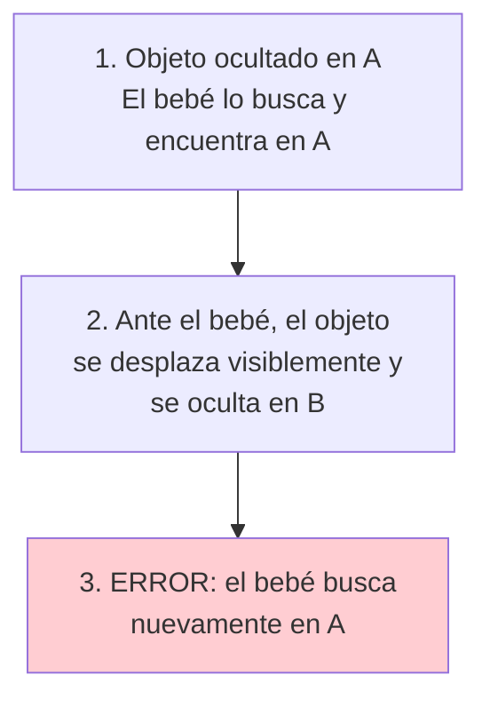

**Interpretación piagetiana**: la posición del objeto depende, para el bebé, de las **acciones anteriormente realizadas**, no de los desplazamientos autónomos del objeto. El objeto todavía no tiene plena autonomía espacial.

> 🔄 **Reinterpretación contemporánea (Esther Thelen — teoría de sistemas dinámicos):** La decisión sobre dónde buscar el objeto **no depende solo de lo que el bebé "sabe"**, sino de lo que **hace y por qué**. La conducta de alcanzar está influida por visión, percepción, atención, movimiento y memoria. Si el tiempo entre el ocultamiento en B y la búsqueda es breve, el bebé tiende a buscar en B; si es mayor, la memoria perceptiva y motora previa (de encontrarlo en A) lo inclina nuevamente a A (Papalia et al., 2009, p. 207).

#### Estudio de Moore y Meltzoff (2004) — confirmación del estadio V

48 niños de 14 meses vieron ocultar una campana de plata. Tras una demora de 24 horas:
- En **la misma habitación**: la encontraron exitosamente (apoya estadio V).
- En **una habitación diferente o reacomodada**: la búsqueda fracasó, aun cuando el recipiente y la campana estaban a la vista (Papalia et al., 2009, p. 207).

### 5.3 El espacio y el tiempo

#### El espacio inicial: heterogéneo y centrado en el cuerpo

Al principio no existe un **espacio único** ni un **tiempo objetivo** que englobe a los objetos. Solo existe un conjunto de **espacios heterogéneos**, todos centrados en el propio cuerpo (Piaget e Inhelder, 1969, p. 31):

- Espacio bucal
- Espacio táctil
- Espacio visual
- Espacio auditivo
- Espacio postural

Esos espacios se coordinan progresivamente (por ejemplo, bucal con táctilo-cinestésico), pero las coordinaciones permanecen parciales hasta que la **permanencia del objeto** permite distinguir lo fundamental: la diferencia entre **cambios de estado** (modificaciones físicas) y **cambios de posición** (desplazamientos).

#### El "grupo práctico de desplazamientos" (subestadios V y VI)

Hacia los 12-18 meses, los desplazamientos se organizan en lo que los geómetras llaman un **grupo de desplazamientos**, cuya significación psicológica es (Piaget e Inhelder, 1969, p. 32):

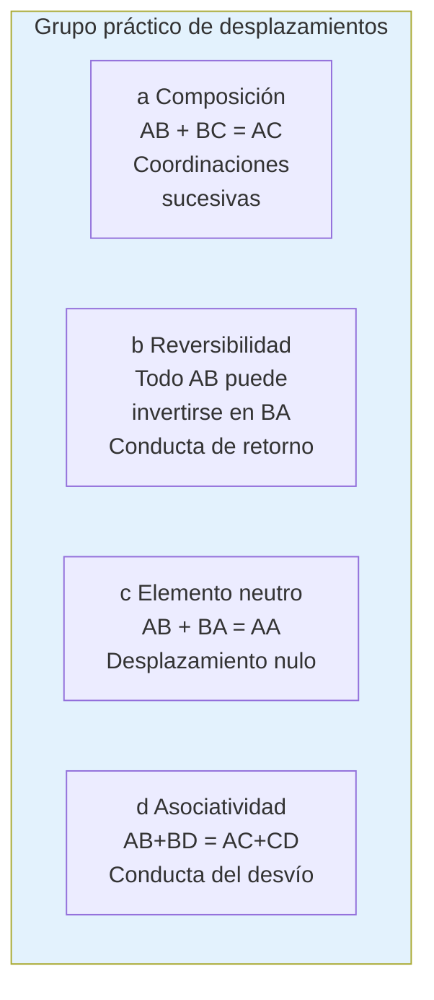

| Propiedad matemática | Conducta psicológica observable |
|---|---|
| **Composición**: AB + BC = AC | Coordinar desplazamientos sucesivos. |
| **Reversibilidad**: AB ↔ BA | Conducta de **retorno** al punto de partida. |
| **Elemento nulo**: AB + BA = AA | Desplazamiento nulo. |
| **Asociatividad**: AB + BD = AC + CD | **Conducta del desvío** — alcanzar D por diferentes caminos. |

🔑 **Importancia teórica:** Este grupo práctico de desplazamientos es la **fuente de las futuras operaciones del pensamiento**. La reversibilidad operatoria del estadio operatorio concreto tiene aquí su prefiguración sensorio-motriz.

> Henri Poincaré había anticipado que la organización del espacio iba ligada al "grupo de desplazamientos", pero lo consideraba *a priori*. Piaget lo demuestra como **producto de una construcción progresiva** (Piaget e Inhelder, 1969, p. 31, nota 7).

### 5.4 La causalidad

#### Causalidad mágico-fenomenista (estadio III, ~4 meses)

En el subestadio III, el bebé conoce como causa única **su propia acción**, incluso independientemente de los contactos espaciales (Piaget e Inhelder, 1969, p. 32-33).

**Ejemplo del cordón** (continuación del observado en § 4.3): Una vez que descubrió que tirar del cordón sacude los juguetes, **basta con suspender un nuevo juguete a 2 metros, o reproducir sonidos tras un biombo**, para que el bebé vuelva a tirar del cordón. ¡No importa que no haya contacto espacial!

Otras conductas similares:
- Se arquea y se deja caer para sacudir su cuna, pero **también para actuar sobre objetos a distancia**.
- Más tarde, guiña los ojos ante un interruptor para encender una lámpara.

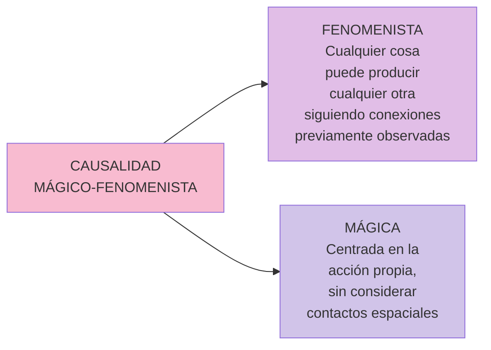

> Esto recuerda dos posturas filosóficas: el **fenomenismo de Hume** (en cuanto a las conexiones temporales sin causa interna) y a **Maine de Biran** (en cuanto a la centración en la acción propia), pero aquí no hay aún conciencia del yo ni delimitación entre el yo y el mundo.

#### Causalidad objetivada y espacializada (estadios V y VI, ~12-18 meses)

A medida que el universo se estructura con objetos permanentes, espacio y tiempo, **la causalidad se objetiva**:
- Las causas ya no se sitúan solo en la acción propia, sino **en los objetos cualesquiera**.
- Las relaciones causa-efecto entre objetos **suponen un contacto físico y espacial**.

**Prueba experimental** (Piaget e Inhelder, 1969, p. 33): En la conducta del soporte, si el objeto deseado **no está sobre** la alfombra sino al lado, el niño del estadio V **NO tira** de ella. En cambio, un niño del estadio III o IV (al que se entrenó a usar el soporte) seguirá tirando aunque no haya relación espacial "sobre".

### 5.5 La imitación

La imitación es una **forma fundamental de aprendizaje**.

| Tipo | Definición | Aparición (según Piaget) |
|---|---|---|
| **Imitación visible** | Imita partes del cuerpo que el bebé puede ver (manos, pies). | Hacia los 6 meses (estadio III) |
| **Imitación invisible** | Imita partes del cuerpo que el bebé NO ve (lengua, boca). | Hacia los 9 meses (estadio IV) |
| **Imitación diferida** | Reproducción de un comportamiento observado tiempo antes, evocando un símbolo almacenado. | Hacia los 18-24 meses (estadio VI) |

#### Controversia: los estudios de Meltzoff y Moore

Los hallazgos de **Andrew Meltzoff y M. Keith Moore (1983, 1989)** desafiaron a Piaget: bebés menores a **72 horas** parecen imitar a adultos abriendo la boca y sacando la lengua (imitación invisible **temprana**). Esta respuesta desaparece hacia los 2 meses (Bjorklund y Pellegrini, 2000) (Papalia et al., 2009, p. 205).

Interpretaciones alternativas:
- **Meltzoff y Gopnik (1993):** mecanismo evolucionado de "como yo" — predisposición innata a imitar rostros humanos para comunicarse con el cuidador.
- **Bjorklund (1997), S. S. Jones (1996):** podría ser un comportamiento exploratorio activado por la visión de la lengua de un adulto, no verdadera imitación.

> 📝 **En la presentación de clase aparece:** "Meltzoff: plantea la imitación refleja hasta los dos meses".

#### Imitación provocada (Bauer y cols.)

Una técnica más reciente para evaluar la imitación diferida: se induce al bebé a imitar una secuencia específica de acciones. Hallazgos (Papalia et al., 2009, p. 206):

- Bebés de **9 meses**: tras una demora de un mes y sin nueva demostración, **más del 40%** reproduce un procedimiento simple de dos pasos.
- Bebés de **13-20 meses**: cerca del **80%** repite una secuencia desconocida de múltiples pasos hasta **un año después**.

**Cuatro factores que determinan el recuerdo a largo plazo:**
1. Número de experiencias de la secuencia.
2. Participación activa vs. observación pasiva.
3. Recordatorios verbales.
4. Orden lógico-causal de los eventos.

---

## 6. Aspectos cognitivo y afectivo de las reacciones sensorio-motrices

### 6.1 Aspecto cognitivo: tres formas sucesivas del esquematismo

Piaget plantea una **ley general de desarrollo** que regirá toda la evolución intelectual posterior (Piaget e Inhelder, 1969, pp. 33-34):

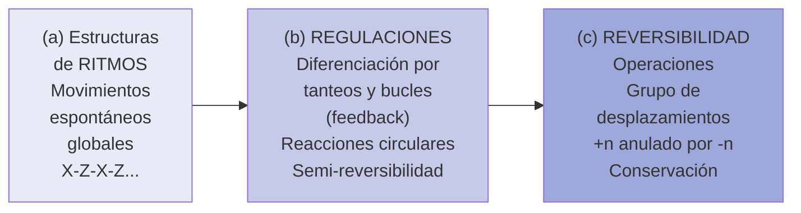

| Forma | Descripción | Producto cognitivo |
|---|---|---|
| **Ritmos** | Movimientos espontáneos globales del organismo. Los reflejos son diferenciaciones. | Estructura X → Z → X → Z. |
| **Regulaciones** | Diferenciación por tanteos, bucles cibernéticos (feedback). | **Semi-reversibilidad** o reversibilidad aproximada por correcciones progresivas. |
| **Reversibilidad** | Comienzo de la reversibilidad propiamente dicha. | Conservación; objeto permanente como primer invariante; futuras operaciones. |

> Las **reacciones circulares garantizan la transición entre el ritmo y las regulaciones**. Y el grupo práctico de desplazamientos contiene ya **el germen de la reversibilidad operatoria** (Piaget e Inhelder, 1969, p. 34).

### 6.2 Aspecto afectivo (breve)

Piaget e Inhelder (1969, p. 34) reconocen que el estudio de la afectividad del bebé es **mucho más difícil** que el de las funciones cognitivas porque el riesgo de *adultomorfismo* es mucho mayor. Pero plantean un paralelismo notable:

| Aspecto cognitivo | Aspecto afectivo |
|---|---|
| Pasa de un estado **centrado en la acción propia** a la construcción de un universo objetivo y descentrado. | Procede de un estado de **indiferenciación entre el yo y el entorno** físico y humano hacia un conjunto de intercambios entre un yo diferenciado y las personas (sentimientos interindividuales) o las cosas (intereses variados). |

#### Aporte de Silvia Bleichmar (complemento desde Faas, 2018, pp. 203-205)

Faas integra la perspectiva de **Silvia Bleichmar** para subrayar que **lo cognitivo es beneficio y consecuencia de la humanización**:

- La **presencia del semejante** es inherente a la organización del sujeto.
- El otro (madre, cuidador) debe **descifrar las necesidades del bebé** y atribuirle significantes, transfiriéndole el acervo cultural.
- *"En el otro se alimentan no sólo nuestras bocas sino nuestras mentes; de él recibimos junto con la leche, el odio y el amor, nuestras preferencias morales y nuestras valoraciones ideológicas. El otro está inscripto en nosotros, y esto es inevitable"* (Bleichmar, 1997, en Faas, 2018, p. 204).
- **Para que se constituya lo cognitivo y la producción simbólica tiene que haberse constituido un sujeto.** Cuando el otro no puede interpretar las necesidades del bebé, se producen vivencias displacenteras que obstruyen el advenimiento de las representaciones (Faas, 2018, p. 204-205).

> 💡 **Síntesis:** En Piaget la subjetividad se construye en un proceso lógico-estructural; en Bleichmar, en un proceso de subjetivación que **requiere a un otro humanizante**. Ambos comparten que **la inteligencia se construye sobre estructuras previas mediante actividad** del sujeto.

---

## 7. Las percepciones (Piaget, Cap. 2)

> **Pregunta capital del capítulo:** ¿La percepción basta para explicar la inteligencia o sus contenidos? Piaget responde **NO**: las nociones no son meras abstracciones de percepciones; involucran **estructuraciones específicas** derivadas de la **acción** y de las **operaciones**, no de los objetos percibidos.

### 7.1 Crítica al empirismo

Para el empirismo (Locke, etc.), el conocimiento es **copia** de lo real y la inteligencia se origina **únicamente en la percepción**. Incluso Leibniz, que añadió *nisi ipse intellectus* (excepto el propio intelecto) al adagio *nil est in intellectu quod non prius fuerit in sensu*, aceptó que los **contenidos** de las nociones proceden de los sentidos.

Piaget objeta: **se olvida la acción**. Las estructuras sensorio-motrices son la fuente de las operaciones; el conocimiento es **asimilación activa y operatoria**, no copia.

### 7.2 Constancias perceptivas

Una **constancia perceptiva** es la percepción de una propiedad real de un objeto (tamaño, forma) independientemente de sus modificaciones aparentes (perspectiva, distancia).

#### Constancia de la forma

Comienza en el primer año y se relaciona con la permanencia del objeto:

- A los 7-8 meses, el bebé puede dar vuelta al biberón invertido **si ve la tetina roja** (ancla perceptiva), pero no si solo ve la base blanca.
- A los 9 meses, junto con la búsqueda de objetos detrás de pantallas, **da vuelta al biberón sin dificultad** aun sin ver la tetina.
- Conclusión: **permanencia y forma constante están ligadas**, en interacción mutua con los esquemas sensorio-motores.

#### Constancia del tamaño

Comienza hacia los **6 meses**, **antes** de la constitución del objeto permanente pero **después** de la coordinación visión-prensión (4½ meses).

- Estudios de Brunswik y Cruikshank (1937), Misumi (1951): bebés entrenados a elegir la mayor de dos cajas siguen eligiéndola aunque se aleje (con imagen retiniana menor).
- **Hipótesis de Piaget:** la constancia depende de esquemas sensorio-motores **de conjunto**: el tamaño varía visualmente con la distancia, pero **es constante al tacto**. La coordinación visión-tacto fuerza la construcción de un correlato visual constante.

### 7.3 Objeto permanente y percepción: ¿quién explica a quién?

**Michotte (1946)** intentó explicar la permanencia del objeto mediante efectos perceptivos:
- **Efecto pantalla**: cuando A pasa bajo B parcialmente oculto, se reconoce por la organización figura-fondo.
- **Efecto túnel**: cuando A entra bajo B a velocidad constante, se anticipa perceptivamente su salida.

**Pero la experiencia muestra lo contrario** (Piaget e Inhelder, 1969, p. 42): un móvil con trayectoria ABCD donde BC está oculto. A los 5-6 meses, el bebé sigue el trayecto AB, lo busca en A cuando desaparece, se asombra al verlo en C, sigue CD y, al desaparecer en D, **lo busca en C y luego en A**.

> 🔑 **El efecto túnel NO es primitivo; solo se constituye después de la permanencia del objeto.** Es decir: el esquema sensorio-motor **determina** el efecto perceptivo, no a la inversa.

### 7.4 Causalidad perceptiva (Michotte)

Cuando un cuadrado A en movimiento toca un cuadrado B inmóvil, y B se desplaza mientras A se detiene, se experimenta una impresión de **lanzamiento** (bajo ciertas condiciones de velocidad y tiempo).

**Pero**, hasta los 7 años, el niño solo reconoce lanzamiento si hubo **contacto**. La causalidad sensorio-motriz mágico-fenomenista, en cambio, es **independiente del contacto**. Por lo tanto, la causalidad mágica del bebé **no deriva** de una causalidad perceptiva basada en impactos (Piaget e Inhelder, 1969, p. 43).

### 7.5 Efectos de campo vs. actividades perceptivas

Piaget distingue dos tipos de fenómenos perceptivos:

| Tipo | Definición | Evolución con la edad |
|---|---|---|
| **Efectos de campo** (o de centración) | No suponen movimientos de la mirada. Se manifiestan en una sola centración. | Cualitativamente **constantes** a lo largo de la vida; disminuyen cuantitativamente. Ej.: ilusión de Delboeuf. |
| **Actividades perceptivas** | Implican exploración, transporte, anticipación, referencias, movimientos de la mirada. | **Se desarrollan progresivamente** con la edad. Pueden corregir efectos de campo o crear nuevas ilusiones. |

#### Ilusiones óptico-geométricas

- **Ilusión de los círculos concéntricos (Delboeuf)**: el círculo interno parece más grande dentro de uno pequeño que dentro de uno grande.
- **Ilusión de Müller-Lyer (1889)**: dos segmentos iguales se ven distintos si se les agregan extensiones inclinadas en flecha.
- **Ilusión de la vertical**: las líneas verticales se sobreestiman respecto a las horizontales (en figuras de L o T invertida).

**Hallazgo importante:** Las **ilusiones primarias** (efectos de campo) **disminuyen** con la edad por el efecto corrector de la exploración. Pero **otras ilusiones aumentan** porque dependen de actividades perceptivas más sofisticadas (ejemplo: ilusión del peso —comparar dos cajas iguales en peso pero distintas en volumen— es **más fuerte** a los 10-12 años que a los 5-6).

### 7.6 Percepciones, nociones y operaciones — cuatro situaciones

Piaget distingue cuatro tipos de relaciones (Piaget e Inhelder, 1969, pp. 51-55):

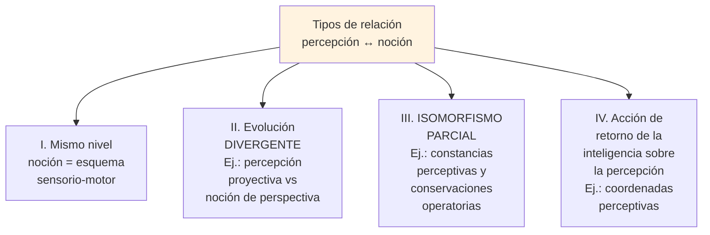

#### Situación III: Constancias y conservaciones

Ambas implican **compensaciones por composición multiplicativa**:
- **Constancia del tamaño**: el tamaño aparente disminuye cuando la distancia aumenta, pero el tamaño real se percibe como **producto constante** de esa coordinación.
- **Conservación de la sustancia (líquido)**: el niño operatorio razona que aunque el nivel sube en un vaso más estrecho, la columna se angosta, **y el producto se conserva**.

**Diferencia clave en el tiempo**:

| | Constancia perceptiva | Conservación operatoria |
|---|---|---|
| Inicio | ~6-12 meses (1er año) | 7-8 años (sustancia); hasta 12 años (volumen) |
| Mecanismo | Regulación perceptiva aproximada | Compensación deductiva (operatoria) |
| Diferencia clave | El objeto **no cambia realmente**, solo en apariencia. Basta la regulación. | El objeto **cambia realmente**. Requiere razonamiento operatorio. |

> 🧬 **Conclusión:** Constancias y conservaciones son **parientes colaterales**, no en filiación directa. La fuente común es el esquematismo sensorio-motor. La conservación operatoria es **prolongación directa del esquema del objeto permanente** (primer invariante).

### 7.7 Conclusión sobre percepción e inteligencia

Las estructuras **perceptivas** son **irreversibles** y **probabilísticas** (composición no aditiva → ilusiones).
Las **operaciones** son **reversibles** (+n anulado por −n) y **aditivas** (2+2 = exactamente 4).

> Por lo tanto, **es imposible extraer las operaciones de los sistemas perceptivos** (contra el gestaltismo de Wertheimer). Hay una **dualidad fundamental de orientación**: irreversibilidad perceptiva *hic et nunc* vs. reversibilidad operatoria.

---

## 8. Críticas y aportes postpiagetianos

### 8.1 Limitaciones señaladas a la teoría

Carretero (1998), citado en Faas (2018, p. 205), enumera:

1. **Insuficiencia y ambigüedad explicativa** de las estructuras lógico-matemáticas para dar cuenta de los mecanismos del desarrollo.
2. **Escasa clarificación empírica de los estadios**: ¿son saltos cualitativos discretos o procesos más graduales?
3. **Crítica al carácter "general" del conocimiento**: tal vez el conocimiento sea más específico de dominio.
4. **Limitaciones del método clínico**: rico cualitativamente, pero alejado de los estándares de la psicología experimental.

### 8.2 Enfoque del Procesamiento de la Información

Esta corriente postpiagetiana descompone las tareas piagetianas en sus componentes cognitivos y determina **qué capacidades específicas** intervienen en cada parte y **a qué edad** aparecen.

### 8.3 Hallazgos contemporáneos: el bebé "más competente"

Piaget sostenía que durante los primeros 18 meses el niño aprende **solo** por sentidos y movimientos y que el pensamiento conceptual aparece después. La evidencia actual sugiere que:

> **Algunas limitaciones cognitivas observadas por Piaget pueden haber sido consecuencia de habilidades motoras y lingüísticas inmaduras**, no de la ausencia del concepto. La competencia cognitiva del bebé es **más rica** de lo que Piaget pensaba (Faas, 2018, p. 205; Papalia et al., 2009, p. 206).

#### Tabla comparativa (Papalia et al., 2009, Cuadro 7-4, p. 206)

| Concepto/habilidad | Perspectiva de Piaget | Hallazgos más recientes |
|---|---|---|
| **Imitación** | Invisible: ~9 meses. Diferida: 18-24 meses. | Imitación facial neonatal (Meltzoff). Imitación diferida desde los 6 meses. |
| **Permanencia del objeto** | Gradual entre subestadios III-VI. Error A-no-B a los 8-12m. | Bebés de 3.5 meses parecen mostrar **conocimiento de objeto** en estudios basados en la **mirada** (no en alcance manual). |
| **Desarrollo simbólico** | Subetapa VI (18-24m). | Comprensión de imágenes hacia los 19 meses. |
| **Categorización** | Subetapa VI. | Bebés de 3 meses reconocen categorías perceptuales; a los 7 meses, categorías funcionales. |
| **Causalidad** | Entre 4-6 meses y un año, lentamente. | Conciencia temprana de eventos causales específicos en el mundo físico. |
| **Número** | Subetapa VI. | Bebés de 5 meses pueden reconocer y manipular pequeños números. |

> 🧠 **Idea importante para integrar:** Los métodos de **violación de expectativa** y **medición de tiempos de mirada** (en lugar de exigir alcance manual) revelan competencias antes invisibles. Esto **no invalida** a Piaget — su descripción de la conducta motora sigue siendo precisa —, pero sí refina la interpretación: lo que el bebé "sabe" puede preceder a lo que puede "hacer".

---

## 9. Síntesis visual y mapas conceptuales

### 9.1 Mapa conceptual integral del sensorio-motor

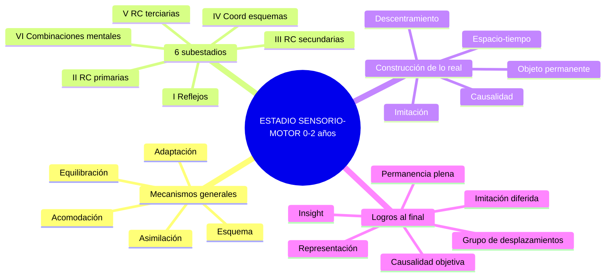

### 9.2 Línea de logros por edad

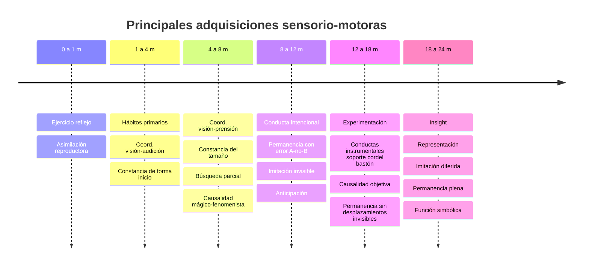

### 9.3 Diagrama integrador: ¿qué se construye en el sensorio-motor?

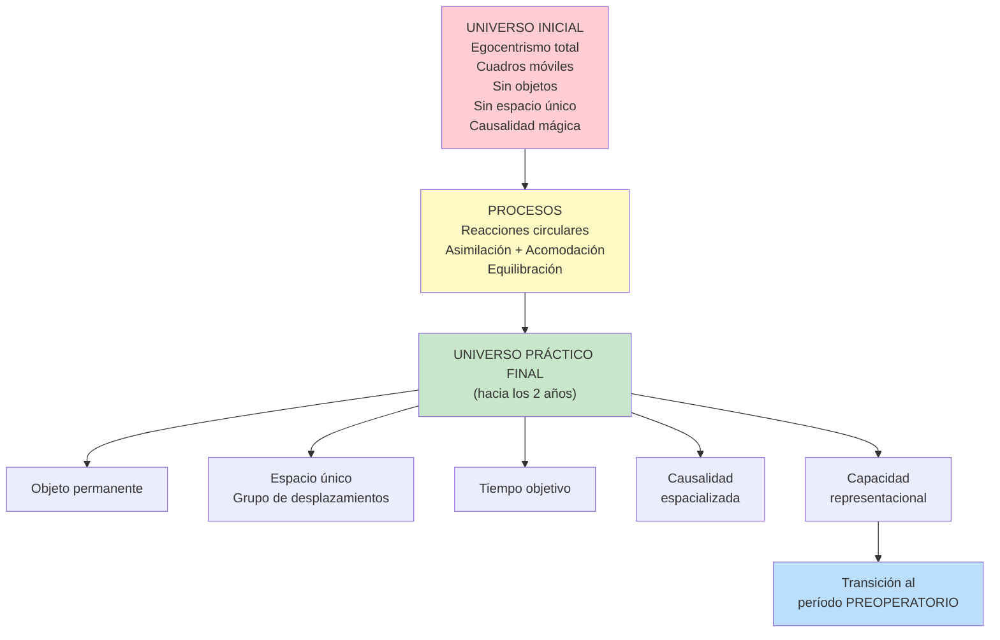

---

## 10. Glosario

| Término | Definición |
|---|---|
| **Acomodación** | Reajuste de las estructuras construidas (esquemas) en función de las transformaciones experimentadas; ajuste a los objetos externos. |
| **Adaptación** | Equilibrio entre asimilación y acomodación; forma general del equilibrio psíquico. |
| **Asimilación** | Incorporación de información del mundo exterior a las estructuras ya construidas. |
| **Asociacionismo** | Postura (Pavlov, Hull) que explica el desarrollo por asociación acumulativa estímulo-respuesta. Criticado por Piaget. |
| **Causalidad mágico-fenomenista** | Causalidad inicial del bebé: la acción propia es la causa única (mágica) y cualquier cosa puede producir cualquier otra (fenomenista). |
| **Combinaciones mentales** | Subestadio VI; capacidad de pensar acciones antes de realizarlas. |
| **Conducta del bastón** | Conducta del estadio V: usar un objeto-instrumento (palo) para alcanzar un objeto deseado. |
| **Conducta del cordel** | Conducta del estadio V: tirar de una cuerda unida al objeto. |
| **Conducta del soporte** | Conducta del estadio V: tirar de una alfombra o manta sobre la que reposa el objeto. |
| **Descentración** | Salida del egocentrismo inicial; "revolución copernicana" sensorio-motriz. |
| **Equilibración** | Proceso autorregulado por el que el sujeto restablece el equilibrio ante cada desequilibrio. |
| **Error A-no-B** | Tendencia del bebé del estadio IV a buscar un objeto en el lugar donde lo encontró previamente (A), no donde acaba de ver que se ocultó (B). |
| **Esquema** | Patrón organizado de pensamiento y conducta que se transfiere o generaliza en situaciones similares. |
| **Función simbólica** | Capacidad de representar mentalmente objetos y eventos mediante símbolos (palabras, imágenes). Aparece al final del sensorio-motor. |
| **Grupo de desplazamientos** | Estructura matemática (composición, inversión, identidad, asociatividad) que organiza el espacio práctico en el estadio V-VI. Prefigura la reversibilidad operatoria. |
| **Imitación diferida** | Reproducción de una conducta observada tiempo antes, evocando un símbolo almacenado (subestadio VI). |
| **Imitación invisible** | Imitación con partes del propio cuerpo que no se pueden ver (boca, lengua). |
| **Imitación visible** | Imitación con partes del cuerpo visibles (manos, pies). |
| **Insight** | Comprensión súbita; resolución de problemas por combinación mental sin tanteo material previo. |
| **Inteligencia** | Para Piaget, constante adaptación de los esquemas al mundo. Coordinación de medios y fines. |
| **Invariantes funcionales** | Procesos que se mantienen constantes en todo el desarrollo: adaptación y organización. |
| **Permanencia del objeto** | Comprensión de que un objeto sigue existiendo aun cuando esté fuera de la vista. |
| **Psicología genética** | Estudio de las funciones mentales explicándolas por su modo de formación (génesis = ontogénesis, no "genes"). |
| **Reacción circular** | Proceso por el que el bebé reproduce sucesos placenteros descubiertos originalmente por azar. |
| **Reacciones circulares primarias** | Centradas en el propio cuerpo (1-4 meses). |
| **Reacciones circulares secundarias** | Centradas en el mundo exterior (4-8 meses). |
| **Reacciones circulares terciarias** | Experimentación con variaciones intencionales (12-18 meses). |
| **Representación** | Capacidad de evocar mentalmente objetos o eventos ausentes mediante símbolos. |
| **Reversibilidad** | Posibilidad de anular una operación con su inversa (+n anulado por -n). Aparece germinalmente en el grupo de desplazamientos. |

---

## 11. Preguntas de autoevaluación

### Nivel comprensión

1. ¿Por qué Piaget no llama "psicología del niño" a su programa de investigación, sino "psicología genética"? ¿Qué significa "genética" en este contexto?
2. Defina: esquema, asimilación, acomodación, adaptación, equilibración. Dé un ejemplo sensorio-motor de cada uno.
3. ¿Cuál es la diferencia entre la fórmula asociacionista E→R y la fórmula piagetiana E→(Og)→R?
4. ¿Cuáles son las cuatro características que debe cumplir un estadio piagetiano?
5. ¿Qué son las "invariantes funcionales"? ¿Por qué se llaman así?

### Nivel análisis

6. Compare reacciones circulares primarias, secundarias y terciarias en términos de: foco, intencionalidad, relación medios-fines, presencia de experimentación.
7. ¿Por qué Piaget afirma que en el estadio II "todavía no hay verdadera inteligencia" pese a que ya hay hábitos adquiridos? ¿Qué falta?
8. Describa el "error A-no-B". ¿Qué interpretación da Piaget? ¿Y la teoría de sistemas dinámicos de Thelen?
9. Explique la "causalidad mágico-fenomenista". ¿En qué subestadio aparece? ¿Cuándo se objetiva? Dé un ejemplo de la observación del cordón.
10. ¿Qué es el "grupo práctico de desplazamientos"? Mencione sus cuatro propiedades y dé un ejemplo conductual de cada una.

### Nivel integración

11. ¿Por qué Piaget habla de una "revolución copernicana" en el sensorio-motor? Compare el universo inicial con el universo construido al final del período.
12. Las constancias perceptivas aparecen en el primer año, pero las conservaciones operatorias recién a los 7-8 años. ¿Cuál es la diferencia fundamental que explica este desfase de 7 años?
13. ¿Qué crítica hace Piaget a Michotte respecto a la explicación de la permanencia del objeto mediante el "efecto túnel"? ¿Qué muestra el experimento ABCD del bebé de 5-6 meses?
14. Compare la imitación según Piaget y según Meltzoff y Moore. ¿Qué cambia en la interpretación de la imitación neonatal?
15. ¿Cómo integra Faas el aporte de Silvia Bleichmar a la teoría piagetiana? ¿Qué dimensión añade que Piaget no enfatizó?

### Casos clínicos / aplicación

16. Un bebé de 7 meses busca un sonajero cuando ve una parte de él asomando bajo una sábana, pero deja de buscarlo si la sábana lo cubre por completo. ¿En qué subestadio se encuentra? ¿Qué nivel de permanencia del objeto presenta?
17. Una niña de 15 meses ve que su pelota rueda bajo el sofá, gatea, mira, no la encuentra inmediatamente, y la busca también detrás de una caja cercana donde no la vio ocultar. ¿Es consistente esto con su edad? ¿Por qué?
18. Lucienne, ante una caja entreabierta con un dedal dentro, abre y cierra lentamente la boca antes de meter el dedo en la hendidura. ¿Qué subestadio ilustra esta conducta? ¿Por qué se considera "insight"?

---

## Referencias

- **Faas, A. E. (coord.) (2018).** *Psicología del desarrollo de la niñez.* Cap. 9: "Desarrollo Cognitivo" (Codosea, Ceballos, Paolantonio y Faas).
- **Papalia, D., Wendkos Olds, S. y Duskin Feldman, R. (2009).** *Desarrollo humano.* Cap. 7: "Desarrollo cognitivo durante los primeros tres años".
- **Piaget, J. e Inhelder, B. (1969/2007).** *Psicología del niño.* Edición revisada de Juan Delval. Madrid: Morata. Introducción y Caps. 1 y 2.

### Referencias secundarias citadas en los textos

- Baldwin, J. M. (1894). Reacciones circulares.
- Bauer, P. (1996, 2002); Bauer et al. (2000, 2003). Imitación provocada.
- Bleichmar, S. (1997, 2003). Constitución de la subjetividad.
- Brunswik, E. y Cruikshank, W. (1937). Constancia del tamaño.
- Carretero, M. (1998). Críticas al modelo piagetiano.
- Delboeuf, J. (s./f.). Ilusión de los círculos concéntricos.
- Gouin-Décarie, T. (1962). Replicación de Piaget en Montreal.
- Köhler, W. (1921). Conducta del bastón en chimpancés. Insight.
- Mehler, J. y Dupoux, E. (1994). Replicaciones interculturales.
- Meltzoff, A. y Moore, M. K. (1983, 1989, 1994). Imitación neonatal.
- Michotte, A. (1946). Causalidad perceptiva.
- Moore, M. K. y Meltzoff, A. (2004). Permanencia y memoria contextual.
- Poincaré, H. Grupo de desplazamientos.
- Thelen, E. y cols. (2001, 2003, 2006). Teoría de sistemas dinámicos y error A-no-B.
- Wertheimer, M. (1945). Gestalt e inteligencia.

---

*Documento de estudio integrado a partir de la presentación de cátedra y la bibliografía obligatoria. Última revisión: 2026.*
