# 📘 El Estadio Preoperatorio (Piaget)
## Apunte ampliado de estudio — Unidad 5: Desarrollo cognitivo desde la perspectiva piagetiana

> **Bibliografía integrada:**
> - Presentación de cátedra: *Piaget 2 — Estadio preoperatorio*
> - Faas, A. E. (Cap. 13: *Desarrollo Cognitivo*, pp. 285–293)
> - Papalia, Olds & Feldman (Cap. 10: *Desarrollo cognitivo en la segunda infancia*, pp. 294–301)
> - Piaget, J. & Inhelder, B. (Cap. 3 de *Psicología del niño*: *La función semiótica o simbólica*)

---

## 🗺️ Ubicación dentro de la teoría piagetiana

El estadio preoperatorio es el **segundo gran período** del desarrollo cognitivo según Piaget. Se extiende aproximadamente entre los **2 y los 7 años** y constituye la transición entre la inteligencia práctica (sensoriomotora) y la inteligencia lógica (operatoria concreta).

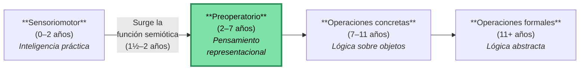

**¿Qué hace posible el paso al pensamiento preoperatorio?**
La aparición de la **función semiótica o simbólica** entre los 18 y 24 meses, que permite al niño **representar mentalmente** la realidad. Con ella, la inteligencia se transforma de **práctica** en **representacional** (Faas, p. 285).

> 💡 **Concepto clave:** *Operación* = proceso lógico necesario para la resolución de problemas. El preoperatorio se llama así porque las operaciones lógicas **todavía no están constituidas**.

---

## 1️⃣ La función semiótica o simbólica

### 📖 Definición rigurosa

> **Función semiótica/simbólica:** capacidad de emplear **símbolos o representaciones mentales** (palabras, números o imágenes a los que la persona ha otorgado un significado) que permite pensar en las cosas **sin que se encuentren físicamente presentes** (Faas, p. 285; Papalia, p. 295).

Para Piaget e Inhelder (p. 57), consiste en **"poder representar algo (un 'significado' cualquiera: objeto, acontecimiento, esquema conceptual, etc.) por medio de un 'significante' diferenciado y que solo sirve para esta representación: lenguaje, imagen mental, gesto simbólico, etc."**

### 🔑 La distinción significante–significado

| Elemento | Definición |
|----------|-----------|
| **Significado** | Aquello que se representa (el objeto, acontecimiento o esquema conceptual) |
| **Significante** | El elemento que evoca al significado (palabra, gesto, imagen, dibujo) |

El gran avance evolutivo es lograr que el significante esté **diferenciado** del significado: ya no necesita actuar materialmente sobre la realidad, puede sustituirla mediante símbolos.

---

## 2️⃣ Tipos de significantes: del índice al signo

Existe una **continuidad evolutiva** entre el grado de conexión significante–significado. Piaget e Inhelder (p. 58) distinguen cuatro tipos, que van desde la indiferenciación total hasta la arbitrariedad convencional.

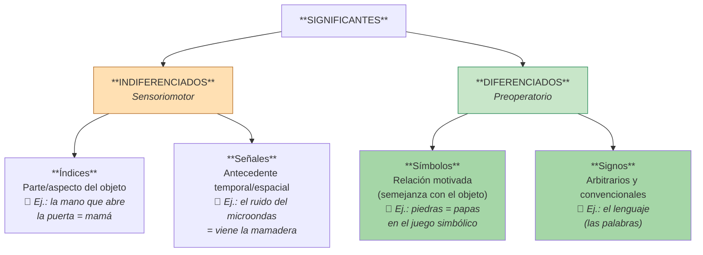

### 📊 Tabla comparativa: Sensoriomotor vs. Preoperatorio

| Aspecto | **Etapa sensoriomotora** | **Etapa preoperatoria** |
|---------|--------------------------|--------------------------|
| **Tipo de significante** | Perceptivo (indiferenciado) | Diferenciado |
| **Forma 1** | **Índice:** parte/aspecto del objeto. La mano vista al abrir la puerta es índice de la persona que entra. La parte remite al todo. | **Símbolo:** guarda semejanza con el objeto designado. Es **motivado** (relación no arbitraria). Puede ser construido individualmente. |
| **Forma 2** | **Señal:** relación temporal/espacial cercana al objeto. El sonido del microondas anticipa la mamadera (condicionamiento clásico). | **Signo:** arbitrario, establecido por convención colectiva. El lenguaje es el ejemplo paradigmático. |
| **Relación** | Indiferenciación significante–significado | Independencia significante–significado |

> ⚠️ **Distinción importante:** signo ≠ símbolo
> - **Símbolo:** motivado, individual, guarda semejanza (juego simbólico).
> - **Signo:** arbitrario, colectivo, sin semejanza (lenguaje).

---

## 3️⃣ Las cinco manifestaciones de la función semiótica

Piaget e Inhelder (p. 58) enumeran **cinco conductas de aparición casi simultánea**, en orden de complejidad creciente:

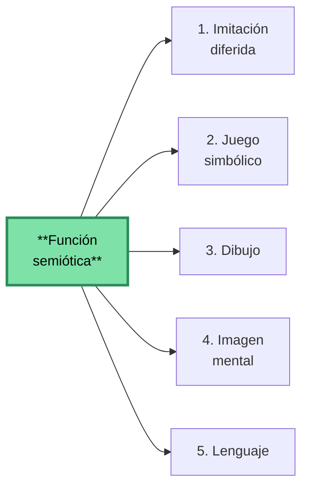

> 🔑 **Clave teórica:** las cuatro primeras **descansan sobre la imitación**, y el propio lenguaje se adquiere en un contexto necesario de imitación (Piaget e Inhelder, p. 59).

### 3.1 Imitación diferida

**Definición:** imitación que se inicia en **ausencia del modelo**.

**Evolución:**
1. **Imitación directa** (sensoriomotor): el niño copia el gesto mientras el modelo está presente. Predomina la **asimilación**.
2. **Imitación con demora**: el niño demora la imitación (saluda cuando ya pasó la situación).
3. **Imitación simbólica/diferida**: el niño puede imitar **sin que el modelo esté presente** y sin haber realizado el gesto previamente. Predomina la **acomodación**.

📌 **Ejemplo clásico de Piaget** (p. 58): una niña de 16 meses ve a su compañero enfadarse, gritar y golpear con el pie. Una o dos horas después de su partida, imita la escena riéndose. Es **comienzo de representación**.

> 💭 La imitación diferida constituye un **comienzo de significante diferenciado**: el gesto imitador ya no es copia directa, sino representación en acto.

### 3.2 Juego simbólico

**Definición:** juego de ficción donde el niño imita un modelo interiorizado, usando objetos como sustitutos de otros.

📌 **Ejemplo clásico** (Piaget e Inhelder, p. 58): la niña "hace como si durmiera", con la cabeza inclinada, el pulgar en la boca y sosteniendo la esquina de un trapo como almohada. Luego hace dormir a su oso, desliza una concha en una caja diciendo "miau" (acababa de ver un gato).

**Funciones del juego simbólico** (Piaget e Inhelder, pp. 61–63):

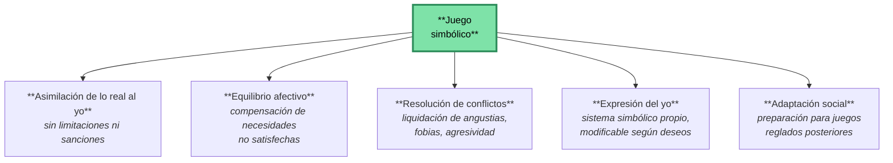

**Categorías de juego según Piaget** (nota al pie 3, p. 61):

| Tipo de juego | Aparición | Características |
|---------------|-----------|-----------------|
| **De ejercicio** | Sensoriomotor (se conserva luego) | Repetir actividades por "placer funcional" (Bühler). Sin simbolismo. |
| **Simbólico** | 2–3 a 5–6 años (apogeo) | Ficción, "como si", uso de símbolos individuales. |
| **De reglas** | A partir de los 6–7 años | Transmisión social, reglas compartidas (canicas, rayuela). |
| **De construcción** | Derivado del simbólico | Tiende a verdaderas adaptaciones (creación, problemas). |

> 🧠 **Aporte teórico clave:** Piaget contrasta tres polos:
> - **Juego** = asimilación pura (lo real se adapta al yo).
> - **Imitación** = acomodación pura (el yo se adapta a lo real).
> - **Inteligencia** = equilibrio entre asimilación y acomodación.

### 3.3 Dibujo

**Definición:** forma intermedia entre el juego simbólico y la imagen mental. Comparte con el juego el **placer funcional** y el **autotelismo** (fin en sí mismo); comparte con la imagen el **esfuerzo de imitación de lo real**.

#### Etapas del dibujo según Luquet (citado en Piaget e Inhelder, pp. 65–67):

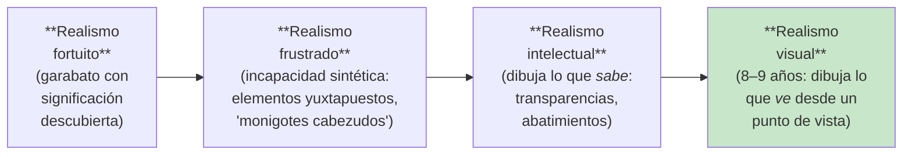

**Hallazgo clave de Luquet:** el dibujo infantil hasta los 8–9 años es **esencialmente realista en la intención**, pero el niño dibuja **lo que sabe** del objeto, no lo que ve.

📌 **Ejemplos de realismo intelectual:**
- Una cara de perfil con dos ojos (porque "una persona tiene dos ojos").
- Un jinete con la pierna oculta dibujada a través del caballo.
- Las papas dibujadas dentro de la tierra del campo.

### 3.4 Imagen mental

**Definición:** representación interna ligada al recuerdo de un objeto o fenómeno. **No es residuo directo de la percepción**, sino resultado de la **imitación interiorizada** del modelo.

> 🔑 **Tesis piagetiana fundamental:** las imágenes **derivan de la imitación**, no de la percepción. Implican una actividad del sujeto, no una huella pasiva.

#### Clasificación de las imágenes mentales (Piaget e Inhelder, p. 71)

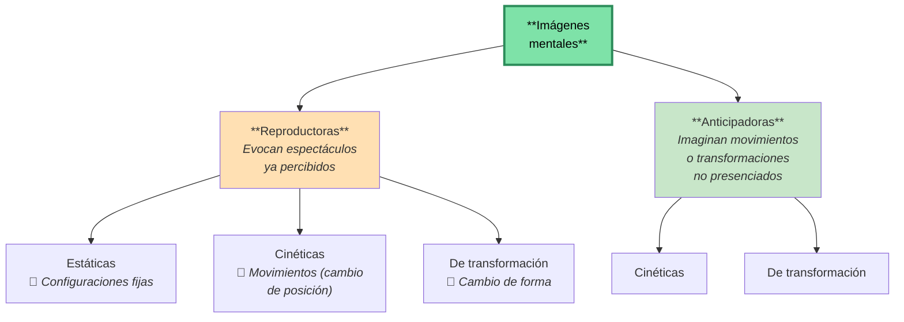

**Hallazgo experimental crucial** (Piaget e Inhelder, p. 71):
> Las imágenes del nivel preoperatorio son **casi exclusivamente estáticas**, con dificultad sistemática para reproducir movimientos o transformaciones. **Las imágenes cinéticas y de transformación solo aparecen después de los 7–8 años**, junto con las operaciones concretas.

**Conclusión teórica:** la imagen **no engendra** la operación; la imagen anticipadora aparece **gracias a la operación**. La imagen es estática y discontinua (como un "procedimiento cinematográfico"), y necesita la operación para volverse dinámica.

### 3.5 Lenguaje

**Definición:** sistema arbitrario de signos y símbolos utilizados colectivamente para comunicarse.

**Características distintivas:**
- Es la **única manifestación que no implica imitación "pura"** (presentación de cátedra).
- **Imposible de pensar sin algún grado de pensamiento simbólico.**
- Es socialmente transmitido (no inventado individualmente).
- Multiplica los poderes del pensamiento en **extensión y rapidez** (Piaget e Inhelder, p. 82).

**Tres ventajas del lenguaje sobre la inteligencia sensoriomotora** (Piaget e Inhelder, p. 82):
1. **Velocidad superior**: introduce relaciones con rapidez (la acción sensoriomotora está limitada por su propia velocidad).
2. **Extensión espacio-temporal**: libera al pensamiento del "aquí y ahora".
3. **Representaciones simultáneas**: permite pensar el todo, no solo paso a paso.

#### La pregunta clave: ¿el lenguaje es la fuente de la lógica?

Piaget responde **NO**. Argumentos (Piaget e Inhelder, pp. 82–84):

| Evidencia | Hallazgo |
|-----------|----------|
| **Sordomudos** (Vincent, Oléron, Affolter) | Mismos estadios lógicos con 1–2 años de retraso. No hay carencia, solo demora. |
| **Ciegos** (Hatwell) | Retraso de 4 años o más. La perturbación sensoriomotora afecta más que la limitación lingüística. |
| **Estudios de Sinclair** | Entrenar verbalmente al niño en expresiones operatorias **NO produce conservación** (apenas 1 de cada 10 casos). |

> 🎯 **Conclusión piagetiana:** "El lenguaje no constituye la fuente de la lógica sino que, por el contrario, **está estructurado por ella**" (Piaget e Inhelder, p. 84). Las raíces de la lógica están en la **coordinación general de las acciones**, no en el lenguaje.

---

## 4️⃣ Fases del pensamiento preoperacional

Piaget distingue dos subperíodos dentro del estadio preoperatorio:

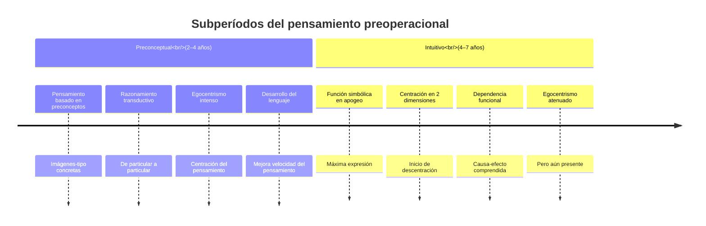

### 4.1 Fase preconceptual (2–4 años)

**Características** (Faas, p. 289; presentación de cátedra):

- 📌 **Pensamiento basado en preconceptos**: esquemas representativos concretos. El niño utiliza una **imagen-tipo** que representa todas las realidades que pueden encuadrarse dentro de ella.
- 📌 **El desarrollo del lenguaje incrementa el alcance y velocidad del pensamiento**, pero como se adquiere lentamente, el pensamiento sigue ligado a la acción.
- 📌 **Razonamiento transductivo**: va de lo particular a lo particular, formando conceptos por relaciones indebidas entre situaciones particulares, sacando conclusiones erróneas.
- 📌 **Pensamiento egocéntrico**: el niño no considera lo que otros piensan o sienten.
- 📌 **Centración**: incapacidad de considerar simultáneamente varias dimensiones.
- 📌 **Sincretismo y yuxtaposición**: liga lo que no está realmente relacionado mediante analogías inmediatas. Encadena explicaciones sin relación lógica.

📌 **Ejemplo de sincretismo:** "la luna crece" (cuando se va haciendo llena), pensando que lo hace como los seres vivos (Faas, p. 289).

### 4.2 Fase intuitiva (4–7 años)

**Características** (Faas, pp. 290–291; presentación de cátedra):

- 📌 **La función simbólica está en su máxima expresión.**
- 📌 **El niño puede centrarse en dos dimensiones** (e.g., alto y ancho), iniciando la **descentración**.
- 📌 **Principio de dependencia funcional**: comprende que algunos acontecimientos están asociados y una modificación en uno afecta al otro.
- 📌 **Comprensión de la relación causa-efecto** (incipiente).
- 📌 **Sigue habiendo egocentrismo**, aunque algo atenuado.
- 📌 **Pensamiento intuitivo**: el niño afirma sin pruebas, por percepción instantánea y clara, pero aún **pre-lógica**.

> 💡 **Progreso clave de la intuición:** representa un avance sobre el pensamiento preconceptual porque implica una **conciencia rudimentaria de las relaciones** y configuraciones de conjunto (Faas, p. 291).

---

## 5️⃣ Logros del pensamiento preoperacional

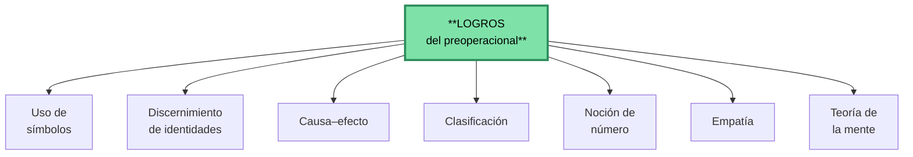

### 📋 Tabla detallada (Papalia, Cap. 10 / Faas, p. 291)

| Logro | Significado | Ejemplo |
|-------|-------------|---------|
| **Uso de símbolos** | No necesitan contacto sensoriomotor con un objeto para pensar en él. Imaginación en los juegos. | Preguntan a su madre sobre los elefantes del circo que vieron meses atrás. |
| **Discernimiento de identidades** | Las modificaciones superficiales no alteran la naturaleza de las cosas. | El papá se viste como pirata pero sigue siendo el mismo. |
| **Entendimiento de causa-efecto** | Los eventos tienen causas y efectos. | Al observar una pelota rodar detrás de una pared, busca detrás de la persona que la pateó. |
| **Clasificación** | Organización de objetos, personas y eventos en categorías significativas. | Clasificación en dos montones: "grandes" y "pequeños". |
| **Noción de número** | Pueden contar y manejar cantidades pequeñas. Principios de la enumeración. | Reparte caramelos y los cuenta. |
| **Empatía** | Capacidad de imaginar cómo pueden sentirse los demás. | Consuela a un amigo. |
| **Teoría de la mente** | Conciencia de la actividad mental y del funcionamiento de la mente. | Oculta galletas en una caja diferente donde su hermano nunca las buscará. |

### 5.1 Profundización: principios de la noción de número

Papalia (p. 298) detalla los **principios de la enumeración** que se consolidan en esta etapa:

1. **Correspondencia uno a uno** (a cada objeto, un número).
2. **Orden estable** (los números se dicen siempre en el mismo orden).
3. **Cardinalidad** (el último número dicho es la cantidad total).
4. **Irrelevancia del orden** (el orden en que se cuenten los objetos no cambia el total).
5. **Abstracción** (cualquier conjunto se puede contar).

> 📊 **Dato del NSE:** "Para los cuatro años de edad, los niños de familias de ingresos medios tienen habilidades numéricas marcadamente superiores a la de los niños de bajo NSE y esta ventaja inicial continúa" (Papalia, p. 298).

### 5.2 Profundización: causalidad

Papalia (pp. 297) presenta una **crítica importante a Piaget** sobre causalidad:

- **Piaget sostenía**: los preoperacionales razonan por **transducción** (no por inducción ni deducción), conectando mentalmente dos sucesos cercanos en el tiempo, tengan o no relación causal lógica.
- **Investigaciones contemporáneas**: en situaciones que pueden comprender, los niños pequeños **sí entienden causa y efecto**. El experimento del "detector de blickets" (Gopnik, Sobel, Schulz y Glymour, 2001) mostró que incluso niños de 2 años pueden identificar relaciones causales.
- Sin embargo, los preescolares aún consideran que **todas las relaciones causales son igual y absolutamente predecibles**, sin distinguir entre lo necesario y lo convencional.

---

## 6️⃣ Limitaciones del pensamiento preoperacional

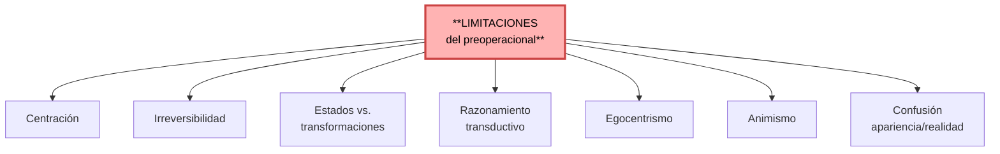

### 📋 Tabla detallada (Papalia, Cap. 10 / Faas, pp. 292–293)

| Limitación | Descripción | Ejemplo |
|------------|-------------|---------|
| **Centración** | Foco en un aspecto descuidando los restantes. | Cree tener más jugo porque está en un vaso alto. |
| **Irreversibilidad** | No comprende que es posible revertir operaciones y restablecer la situación original. | No piensa que el jugo puede ser devuelto al recipiente original. |
| **Estados vs. transformaciones** | No comprende el significado de la transformación entre estados. | No comprende que modificar la forma de un líquido no cambia la cantidad. |
| **Razonamiento transductivo** | Pasa de un asunto a otro viendo causas donde no existen. | "Fui malo con mi hermano, él se enfermó, yo lo hice enfermar." |
| **Egocentrismo** | Asume que todos piensan, perciben y sienten como él. | No da vuelta el libro para que el otro vea el dibujo. |
| **Animismo** | Atribuye vida a objetos inanimados. | Da vida a sus juguetes y muñecos. |
| **Confusión apariencia/realidad** | Confunde lo real con el aspecto exterior. | Una esponja con forma de piedra: sostiene que "parece" piedra y por lo tanto "es" piedra. |

### 6.1 La centración (concepto matriz)

Para Piaget, **la centración es la característica principal del pensamiento preoperacional** y explica gran parte de sus limitaciones (Papalia, p. 299):

> "Los preescolares llegan a conclusiones ilógicas porque no son capaces de la **descentración**: pensar acerca de diversos aspectos de una misma situación a un tiempo."

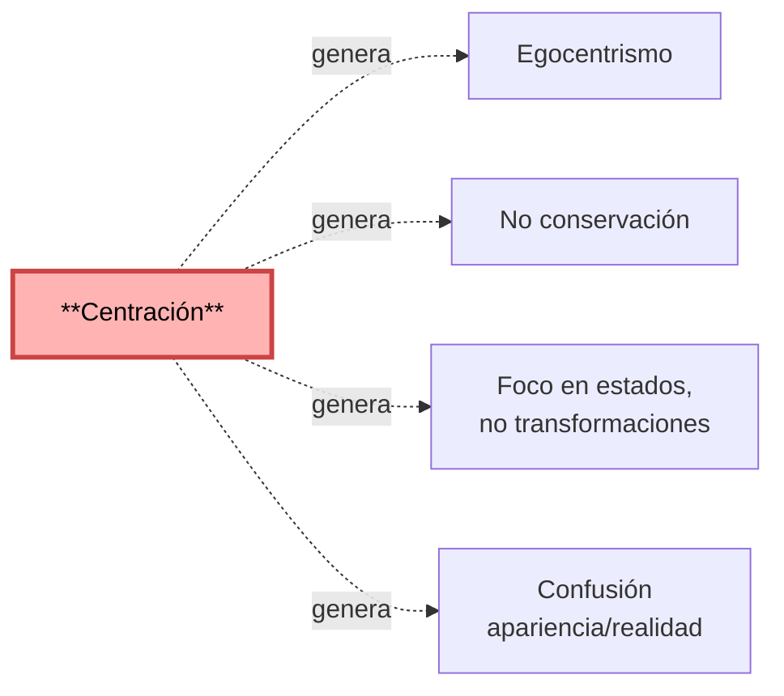

### 6.2 El egocentrismo

**Definición rigurosa** (Papalia, p. 299): "Incapacidad para considerar el punto de vista de otra persona; una característica del pensamiento de los niños pequeños."

⚠️ **Aclaración crucial** (Piaget e Inhelder, nota al pie 6, p. 63): El "egocentrismo" piagetiano:
- **NO es egoísmo.**
- **NO es hipertrofia del yo.**
- **ES** una **falta de conciencia del yo** y una **indiferenciación entre el punto de vista propio y el de los otros**.
- Es un **fenómeno epistemológico** caracterizado por la indiferenciación sujeto–mundo.

### 6.3 La irreversibilidad

**Definición** (Papalia, p. 300): "Incapacidad para comprender que una operación puede ir en dos o más direcciones."

📌 **Ejemplo:** Justin no piensa en restaurar el estado original del agua vertiéndola de nuevo al vaso original, por lo que no logra darse cuenta de que la cantidad debe ser la misma.

> 🧠 Para Piaget, **una de las grandes limitaciones del pensamiento preoperacional es la irreversibilidad**, manifiesta en las tareas de conservación (Faas, p. 293).

### 6.4 Foco en estados, no en transformaciones

Los preoperacionales piensan **como viendo un conjunto de diapositivas con marcos estáticos**: se enfocan en estados sucesivos y no reconocen la transformación de un estado a otro (Papalia, pp. 300–301).

---

## 7️⃣ Tareas clásicas piagetianas

### 7.1 La tarea de las tres montañas (egocentrismo)

**Procedimiento:** El niño se sienta frente a una mesa con tres montañas. Se coloca un muñeco al otro lado. Se le pide al niño que describa cómo se ven las montañas desde la perspectiva del muñeco.

**Resultado piagetiano:** los niños preoperacionales describen las montañas **desde su propio punto de vista**, evidencia del egocentrismo.

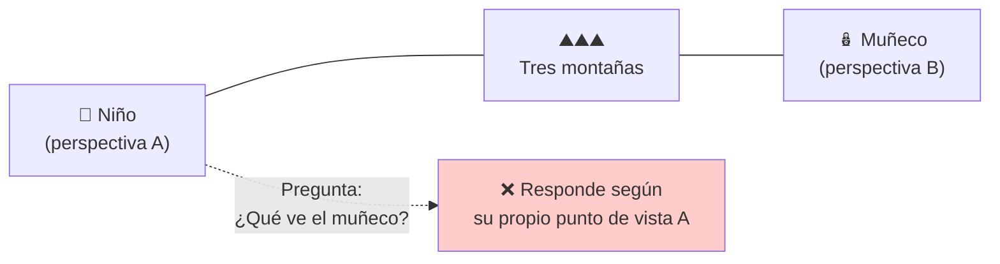

> 🔬 **Revisión contemporánea** (Hughes, 1975, citado en Papalia, p. 300): Cuando el problema se plantea con un muñeco que debe esconderse de dos policías, niños de 3½ a 5 años lo resuelven correctamente el 90% de las veces. **Conclusión:** el egocentrismo aparece **principalmente en situaciones abstractas y poco familiares**.

### 7.2 Tareas de conservación

**Definición de conservación** (Papalia, p. 300): "Conciencia de que dos objetos que son iguales de acuerdo con cierta medida siguen siéndolo luego de una alteración perceptual, en tanto que nada se haya añadido o restado de cualquiera de ambos objetos."

#### Tabla maestra de tareas de conservación (Papalia, p. 301)

| Tipo | Lo que se muestra | Transformación | Pregunta | Respuesta típica del preoperacional |
|------|-------------------|----------------|----------|--------------------------------------|
| **Número** | Dos hileras iguales y paralelas de dulces | Aumenta el espacio en una hilera | ¿Hay el mismo número? | "La hilera más larga tiene más." |
| **Longitud** | Dos palitos paralelos iguales | Se desplaza uno hacia la derecha | ¿Son del mismo tamaño? | "El de la derecha es más largo." |
| **Líquido** | Dos vasos idénticos con igual cantidad | Se vierte en un vaso más alto y estrecho | ¿Tienen la misma cantidad? | "El más alto tiene más." |
| **Materia (masa)** | Dos bolas de plastilina iguales | Se amasa una en forma de salchicha | ¿Tienen la misma cantidad? | "La salchicha tiene más." |
| **Peso** | Dos bolas de plastilina iguales | Se amasa una en forma de salchicha | ¿Pesan lo mismo? | "La salchicha pesa más." |
| **Área** | Dos prados con bloques iguales | Se reagrupan los bloques de uno | ¿Tienen igual pasto para comer? | "Donde los bloques están más juntos tiene más." |
| **Volumen** | Dos vasos con bolas iguales sumergidas | Se transforma una bola en salchicha | ¿El agua llegará a igual altura? | "El vaso con salchicha estará más alto." |

#### Diagrama del experimento clásico de líquidos

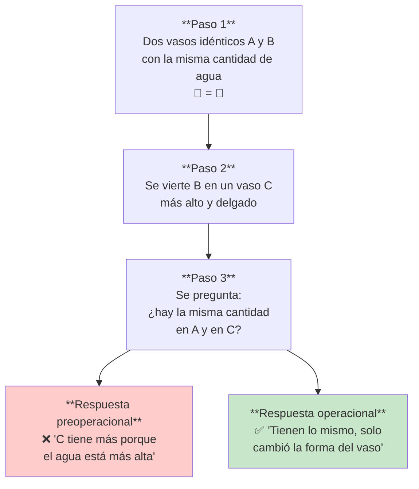

**Por qué fallan los preoperacionales:**
- **Centración** en una sola dimensión (altura).
- **No coordinan altura y ancho** simultáneamente.
- **Irreversibilidad**: no piensan en revertir el vertido.
- **Foco en estados**, no en la transformación.

---

## 8️⃣ Revisiones contemporáneas a Piaget (según Papalia)

Papalia (Cap. 10) presenta una serie de **investigaciones que complejizan las conclusiones piagetianas**:

| Tema | Posición de Piaget | Revisión contemporánea |
|------|--------------------|--------------------------|
| **Egocentrismo (3 montañas)** | Los preoperacionales no pueden tomar perspectiva ajena. | Sí pueden, en tareas familiares (Hughes, 1975). |
| **Causalidad transductiva** | Razonan ilógicamente, conectando sucesos cercanos. | Comprenden causa-efecto en situaciones conocidas (Gopnik et al., 2001). |
| **Animismo** | Atribuyen vida a objetos inanimados. | Distinguen vivo/no vivo con piedras, personas, muñecas (Gelman et al., 1983). Influencias culturales (estudio israelí-japonés-EEUU). |
| **Teoría de la mente** | Antes de los 6 años no la tienen. | Crece dramáticamente entre los 2 y 5 años, especialmente a los 4. La metodología piagetiana subestimaba a los niños. |
| **Comprensión del número** | Aparece tardíamente. | Hay un "sentido numérico básico" desde los lactantes (Wynn). |

> 🔑 **Conclusión metodológica:** Piaget tendía a **subestimar las capacidades** de los niños porque sus tareas eran abstractas y verbales. Cuando se plantean en contextos familiares, los niños muestran competencias más tempranas.

---

## 9️⃣ La memoria en el preoperatorio (Piaget e Inhelder, Cap. 3.V)

Piaget vincula la memoria al esquematismo general de las acciones y operaciones.

### Dos tipos de memoria

| Tipo | Definición | Aparición |
|------|-----------|-----------|
| **Reconocimiento** | Actúa solo en presencia del objeto. Está ligada a esquemas de acción o hábito. | Muy precoz (existe ya en invertebrados inferiores). |
| **Evocación** | Evoca el objeto en su ausencia mediante un recuerdo-imagen. | Aparece con la imagen mental y el lenguaje. |

> 🧠 **Hallazgo experimental clave** (Sinclair, p. 79): si se muestran 10 varillas seriadas y se pide reproducirlas una semana después, **el niño dibuja según su nivel operatorio**, NO según lo que vio. Seis meses más tarde, **el dibujo mejora** sin haber visto el modelo nuevamente: los progresos del esquema producen progresos del recuerdo.

**Conclusión:** la memoria no es un registro pasivo; es **el aspecto figurativo de los esquemas** en su totalidad.

---

## 🔟 Mapa conceptual integrador

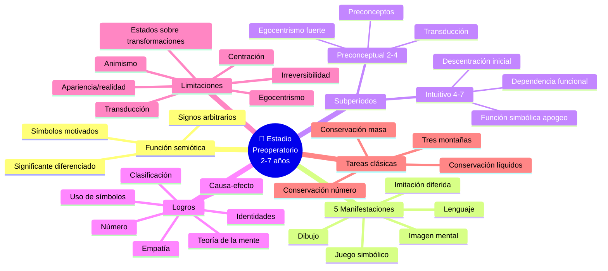

---

## 1️⃣1️⃣ Glosario de términos esenciales

| Término | Definición operacional |
|---------|-------------------------|
| **Función semiótica/simbólica** | Capacidad de emplear símbolos o representaciones mentales para pensar en cosas no físicamente presentes. |
| **Significante** | Elemento que evoca o representa al significado. |
| **Significado** | Objeto, acontecimiento o esquema conceptual representado. |
| **Índice** | Significante indiferenciado: parte/aspecto del objeto (sensoriomotor). |
| **Señal** | Significante indiferenciado: antecedente temporal del objeto (sensoriomotor). |
| **Símbolo** | Significante diferenciado motivado, con semejanza al significado. |
| **Signo** | Significante diferenciado arbitrario y convencional (lenguaje). |
| **Imitación diferida** | Imitación en ausencia del modelo; comienzo de representación. |
| **Juego simbólico** | Juego de ficción donde el niño imita modelos interiorizados; asimilación de lo real al yo. |
| **Imagen mental** | Representación interna derivada de la imitación interiorizada. |
| **Preconcepto** | Esquema representativo concreto; imagen-tipo que representa una realidad. |
| **Razonamiento transductivo** | Paso de lo particular a lo particular, sin generalización lógica. |
| **Centración** | Tendencia a enfocarse en un aspecto de la situación, ignorando otros. |
| **Descentración** | Capacidad de considerar simultáneamente varios aspectos. |
| **Irreversibilidad** | Incapacidad de revertir mentalmente una operación. |
| **Egocentrismo** | Indiferenciación entre el punto de vista propio y el de los otros (no es egoísmo). |
| **Animismo** | Atribución de vida a objetos inanimados. |
| **Conservación** | Comprensión de que las propiedades cuantitativas permanecen aunque cambie la apariencia. |
| **Operación** | Proceso lógico necesario para la resolución de problemas (aún no consolidado en este estadio). |
| **Asimilación** | Incorporación de lo real a los esquemas del yo (predomina en el juego). |
| **Acomodación** | Adaptación de los esquemas a lo real (predomina en la imitación). |

---

## 1️⃣2️⃣ Preguntas de autoevaluación

> 💡 *Usá estas preguntas para verificar tu comprensión antes del parcial.*

1. ¿Cuál es la diferencia conceptual entre un **índice/señal** y un **símbolo/signo**? ¿Por qué los primeros se ubican en el sensoriomotor y los segundos en el preoperatorio?
2. ¿Por qué Piaget dice que la imitación diferida **es el origen** de las demás manifestaciones de la función semiótica?
3. ¿Cuál es el rol del juego simbólico en el equilibrio afectivo del niño?
4. ¿Qué aporta el experimento de las varillas seriadas (Sinclair) a la concepción piagetiana de la memoria?
5. ¿Cómo se diferencian las **imágenes reproductoras** de las **anticipadoras**? ¿Por qué las cinéticas y de transformación aparecen recién después de los 7–8 años?
6. ¿Por qué Piaget concluye que el lenguaje **no es la fuente** de la lógica? ¿Qué evidencias da con los estudios sobre sordomudos y ciegos?
7. ¿Cuál es la diferencia entre la fase **preconceptual** y la **intuitiva**? ¿Qué progresos cognitivos marcan el pasaje?
8. ¿Cómo se relacionan la **centración** y la **irreversibilidad** con el fracaso en las tareas de conservación?
9. ¿Qué significa que el egocentrismo es un fenómeno **epistemológico** y no afectivo/moral?
10. ¿Qué críticas presenta Papalia a las tareas clásicas piagetianas? ¿Cómo se modifican las conclusiones?
11. Explicar las **cuatro etapas del dibujo** según Luquet. ¿Por qué el niño dibuja "lo que sabe" antes de "lo que ve"?
12. ¿Por qué Piaget afirma que la imagen mental no engendra la operación, sino al revés?

---

## 📚 Referencias bibliográficas

- **Faas, A. E.** Cap. 13: *Desarrollo Cognitivo*, pp. 285–293.
- **Papalia, D. E., Olds, S. W., & Feldman, R. D.** (2007). Cap. 10: *Desarrollo cognitivo en la segunda infancia*, pp. 294–301.
- **Piaget, J. & Inhelder, B.** *Psicología del niño* (Ed. Morata, ed. revisada). Cap. 3: *La función semiótica o simbólica*, pp. 57–85.
- Presentación de cátedra: *Piaget 2 — Estadio Preoperatorio*. Universidad Favaloro, Psicología Evolutiva, Unidad 5.

---

> 💚 **Tip de estudio:** Después de leer este apunte, intentá completar de memoria:
> 1. La tabla de logros y limitaciones del preoperacional.
> 2. Las cinco manifestaciones de la función semiótica con un ejemplo de cada una.
> 3. El diagrama del experimento de conservación de líquidos explicando por qué falla el preoperacional.
> 4. La distinción índice–señal–símbolo–signo con un ejemplo de cada uno.
