# Piaget 3 — Estadio Operatorio Concreto

> **Unidad 5 — Psicología Evolutiva**
> Apunte extendido para el estudio, integrando la presentación de clase con Faas (2018, Cap. 13), Papalia et al. (2009, Cap. 13) y Piaget e Inhelder (1969, Cap. 4).

---

## Índice

1. [Marco general y ubicación del estadio](#1-marco-general)
2. [El pasaje de la acción a la operación: los tres niveles](#2-pasaje-accion-operacion)
3. [¿Qué es una "operación"? Naturaleza de la inteligencia operatoria](#3-naturaleza-operacion)
4. [Las cuatro operaciones concretas](#4-cuatro-operaciones)
5. [Las nociones de conservación](#5-conservacion)
6. [Las estructuras operatorias: agrupamientos](#6-agrupamientos)
7. [Seriación e inferencia transitiva](#7-seriacion)
8. [Clasificación e inclusión de clases](#8-clasificacion)
9. [El número](#9-numero)
10. [El espacio](#10-espacio)
11. [Tiempo y velocidad](#11-tiempo-velocidad)
12. [Causalidad y azar: la representación del universo](#12-causalidad)
13. [Principales logros del operatorio concreto](#13-logros)
14. [Limitaciones del pensamiento operatorio concreto](#14-limitaciones)
15. [Razonamiento moral](#15-razonamiento-moral)
16. [Interacciones sociales y afectivas](#16-interacciones)
17. [Cuadro de síntesis final](#17-sintesis)

---

## 1. Marco general y ubicación del estadio

El **estadio de las operaciones concretas** es la tercera etapa del desarrollo cognitivo en la teoría de Piaget. Se extiende **aproximadamente entre los 7 y los 11/12 años** y corresponde, en términos escolares, a la tercera infancia (niñez intermedia).

| Estadio | Edad aproximada | Característica central |
|---|---|---|
| Sensorio-motor | 0 – 2 años | Acción directa sobre lo real |
| Preoperatorio | 2 – 7 años | Interiorización de la acción; función semiótica |
| **Operatorio concreto** | **7 – 11/12 años** | **Acciones interiorizadas, reversibles y agrupadas en sistemas coherentes** |
| Operatorio formal | 11/12 años en adelante | Pensamiento hipotético-deductivo |

> **Idea clave (Piaget e Inhelder, 1969):** Una vez constituida la función semiótica hacia 1½–2 años, podría esperarse que las acciones se interiorizaran rápida y directamente como operaciones. Sin embargo, **hacen falta entre 5 y 6 años más** para lograrlo. Esa demora es justamente lo que vuelve necesario distinguir un nivel preoperatorio (que no es mera transición) y comprender la **naturaleza compleja de las operaciones**.

---

## 2. El pasaje de la acción a la operación: los tres niveles

Piaget distingue **tres niveles** (y no dos, como sostenía Wallon con su esquema "del acto al pensamiento"):

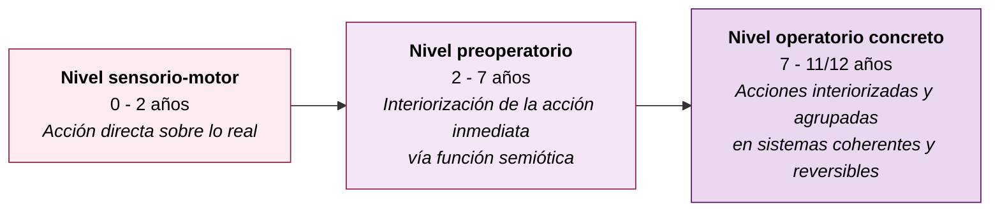

### 2.1. Los tres obstáculos / requisitos para llegar al operatorio concreto

Piaget e Inhelder (1969) identifican **tres condiciones** que el niño debe cumplir para pasar del preoperatorio al operatorio concreto:

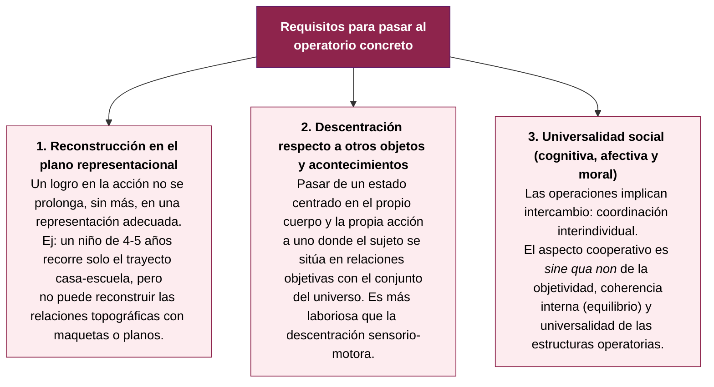

> **Nota teórica (Piaget e Inhelder, 1969):** Las construcciones y descentraciones cognitivas son **inseparables** de las construcciones y descentraciones afectivas y sociales. El término "social" no se reduce a las transmisiones educativas, culturales o morales: se trata de un **proceso interindividual de socialización**, simultáneamente cognitivo, afectivo y moral.

---

## 3. ¿Qué es una "operación"? Naturaleza de la inteligencia operatoria

Una **operación** es, según Piaget:

- Una **acción interiorizada** (ya no se ejecuta sólo en lo real, sino mentalmente).
- **Reversible**: a toda operación corresponde una operación inversa que permite volver al estado inicial.
- **Coordinada en sistemas de conjunto** (no aislada): clasificaciones, seriaciones, números, etc.
- **Común a todos los sujetos** de un mismo nivel mental: interviene tanto en el razonamiento privado como en los intercambios cognitivos con otros.

### 3.1. La reversibilidad: el gran logro

La **reversibilidad** es el núcleo del pensamiento operatorio. Está **pre-configurada** por logros sensorio-motores anteriores —el **objeto permanente** y el **grupo práctico de los desplazamientos (GPD)**— pero recién se consolida hacia los 7-8 años.

La reversibilidad permite:

- **Invertir acciones** mentalmente para volver al estado inicial.
- **Vincular unidades con las clases que las componen** (descomponer un fenómeno desde su principio a su final o a la inversa).
- Que el aprendizaje formal de las matemáticas comience a esta edad (sumar y restar, por ejemplo, requieren reversibilidad).

Existen **dos tipos de reversibilidad**:

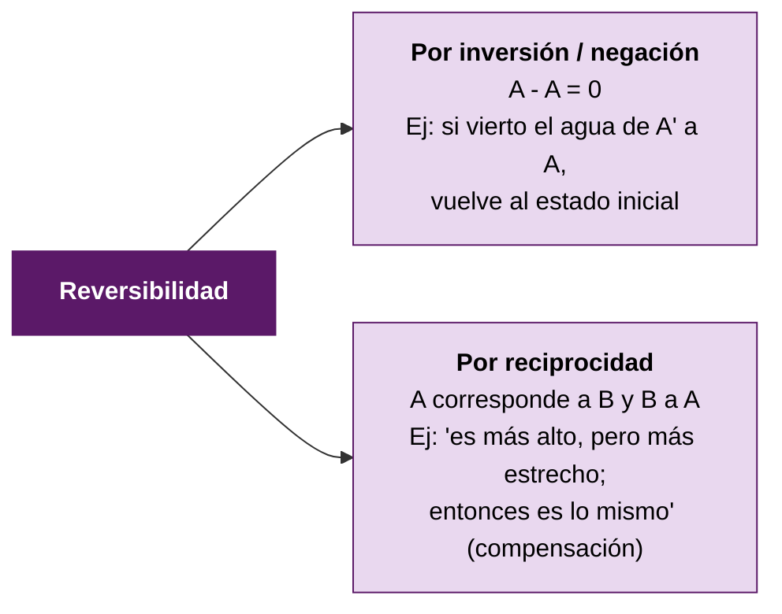

### 3.2. Características del pensamiento operatorio concreto

El pensamiento del niño operatorio concreto es:

- **Interno**: los agrupamientos se realizan en la mente.
- **Concreto**: manipula objetos del mundo real; necesita el sostén perceptivo.
- **Descentralizado**: puede concentrarse en dos aspectos de un mismo fenómeno y coordinarlos.
- **Lógico**: usa los símbolos de modo lógico, con capacidad de conservar y generalizar.

> **Síntesis de Faas (2018):** "Las operaciones implican operaciones lógicas usadas para la resolución de problemas. El niño no sólo usa el símbolo, ya puede usar los símbolos de un modo lógico mediante la capacidad de conservar y generalizar."

---

## 4. Las cuatro operaciones concretas

El niño en este estadio puede realizar cuatro tipos de operaciones lógicas:

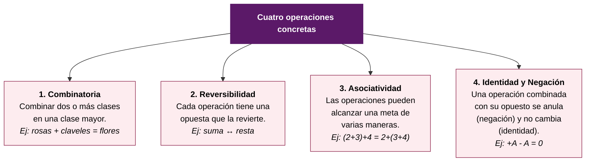

---

## 5. Las nociones de conservación

Las **nociones de conservación** son la indicación más clara del paso del pensamiento preoperatorio al operatorio concreto. Constituyen los **invariantes** de las estructuras operatorias: aquello que se mantiene constante a través de una transformación reversible.

> Toda transformación operatoria es **relativa a un invariante**. Y ese invariante de un sistema de transformaciones es lo que Piaget llama una noción o esquema de conservación.

### 5.1. La experiencia clásica de los líquidos

Se presentan dos vasos iguales A y B con la misma cantidad de líquido. Se trasvasa el contenido de A a un vaso A' más alto y estrecho, y el de B a un vaso B' más bajo y ancho.

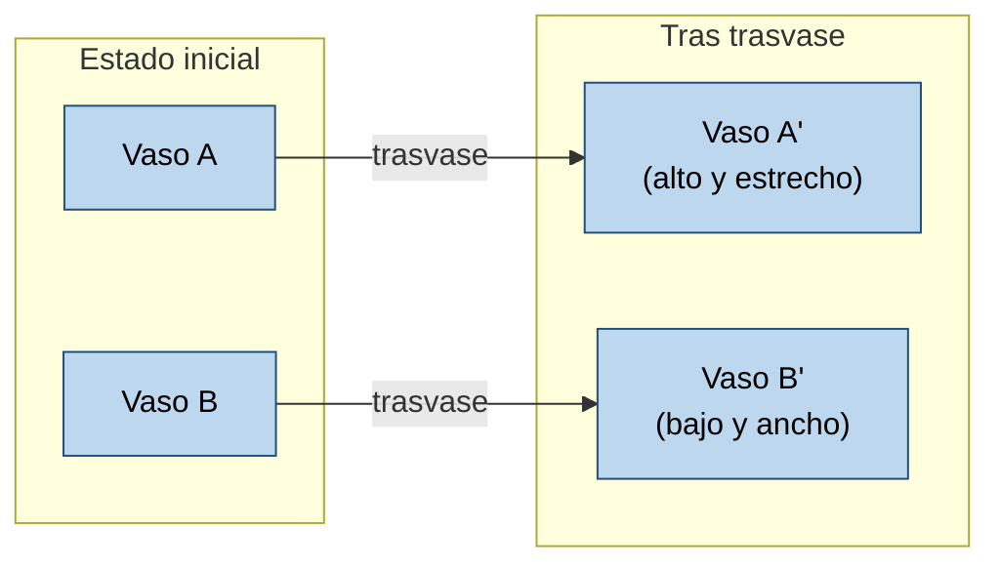

**Reacciones según el nivel:**

| Nivel | Edad | Respuesta típica | Razonamiento |
|---|---|---|---|
| Preoperatorio | 4 – 6 años | "Hay más en A' porque está más alto" | Razona sobre los **estados o configuraciones**, descuidando las transformaciones. La transformación, si la considera, no es entendida como reversible. |
| Operatorio concreto | desde 7-8 años | "Es la misma agua, sólo la pasaron" / "Es más alto pero más estrecho, es lo mismo" | Subordina los estados a las transformaciones. Argumenta por **identidad** ("no se quitó ni añadió"), **reversibilidad por inversión** ("se puede volver de A' a A") o **reciprocidad/compensación** ("más alto pero más estrecho"). |

### 5.2. El cronograma evolutivo de las conservaciones (décalage horizontal)

Aunque los principios subyacentes son los mismos, el niño no domina simultáneamente todos los tipos de conservación. Piaget llama a esta inconsistencia **décalage horizontal**.

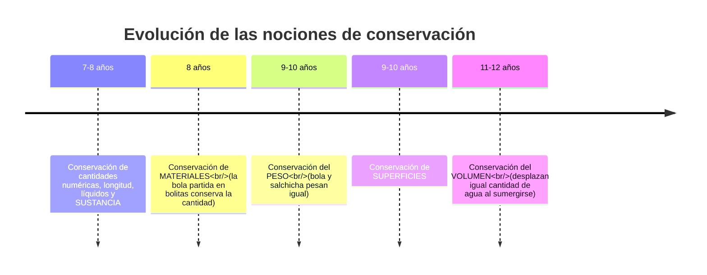

### 5.3. Cuadro detallado de la evolución de las conservaciones

Adaptado de Moreno y Griffa (2005, citado en Faas, 2018) y de Papalia et al. (2009):

| Edad | Sustancia (bola/rollo de plastilina) | Líquido (vaso alto/ancho) | Peso (bola/pedacitos) | Volumen (desplazamiento de agua) |
|---|---|---|---|---|
| **< 7 años** *(No conservación preoperatoria)* | "La bola es más grande y pesada" | "El agua en A está más alta, por eso tiene más" | "La bola pesa más aunque sean iguales" | "La bola hará subir más el agua" |
| **7 – 9 años** *(Reacciones intermedias)* | "Son iguales" — justificación contradictoria | "Es la misma cantidad" — justificación adecuada | "La bola pesa más que los pedacitos" — justificación contradictoria | "Desplazarán lo mismo" — justificación contradictoria |
| **9 años en adelante** *(Conservación operatoria)* | "Es lo mismo, sólo cambió la forma" — compensación | "Es la misma agua, sólo se la pasó" — identidad, reversibilidad, compensación | "Tienen el mismo peso, sólo cambió la forma" — adición de partes | "Ambas ocupan el mismo lugar y desplazan la misma cantidad de agua" — densidad, concentración constante de materia |

### 5.4. Los tres argumentos de la conservación

Cuando el niño alcanza la conservación, justifica su respuesta con (al menos) uno de tres tipos de argumentos —que son interdependientes:

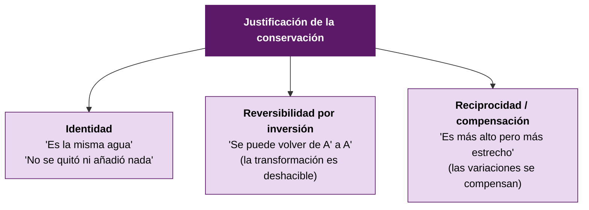

> La noción de conservación está **totalmente lograda** cuando, además de la respuesta correcta, **la justificación también es correcta**.

---

## 6. Las estructuras operatorias: agrupamientos

Las operaciones concretas no aparecen aisladas: se **coordinan en estructuras de conjunto** que Piaget llama **agrupamientos** (*groupements*).

**Características de un agrupamiento:**

- Combina **operaciones directas** (A reunido con su complementaria A' da B; B + B' = C…).
- Combina **operaciones inversas** (B − A' = A).
- Incluye **operación idéntica** (+A − A = 0).
- Incluye **operación tautológica** (A + A = A).
- Es **parcialmente asociativa**: (A + A') + B' = A + (A' + B'), pero (A + A) − A ≠ A + (A − A).

> Formalmente, el agrupamiento es una estructura intermedia: emparentada con el "grupo" matemático pero sin asociatividad completa (un *grupoide*), cercana al *retículo* en su forma de semi-retículo (*lattice*). Piaget la considera más pobre que las estructuras del operatorio formal, pero suficiente para sostener clasificaciones, seriaciones, correspondencias término a término, matrices o tablas de doble entrada.

---

## 7. Seriación e inferencia transitiva

### 7.1. La seriación operatoria

**Seriación**: capacidad de ordenar elementos según una dimensión creciente o decreciente (longitud, color, peso, etc.).

**Etapas de la seriación** (Piaget e Inhelder, 1969), con un ejemplo clásico de 10 varillas a ordenar de menor a mayor:

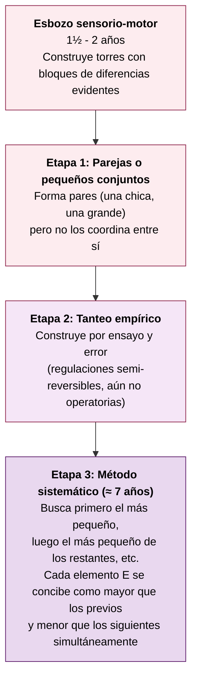

El método sistemático es **operatorio** porque combina la operación directa (E > D, C, B, A) con su inversa (E < F, G…). Esa **reversibilidad por reciprocidad** abre las puertas a un nuevo logro: la transitividad.

### 7.2. La inferencia transitiva

**Inferencia transitiva**: capacidad de inferir una relación entre dos objetos a partir de la relación que cada uno tiene con un tercero.

> **Ejemplo (Papalia et al., 2009):** Si se le muestra a Catherine que el palo amarillo es más largo que el verde, y que el verde es más largo que el azul, sin comparar directamente amarillo y azul ella infiere que **el amarillo es más largo que el azul**. (A > B y B > C → A > C)

Los niños preoperatorios se **niegan** a inferir cuando A se oculta tras compararse con B: necesitan ver simultáneamente los objetos. La inferencia transitiva emerge hacia los 7-8 años.

---

## 8. Clasificación e inclusión de clases

La **clasificación** consiste en agrupar objetos por sus semejanzas, distinguiendo clases y subclases. Es un agrupamiento fundamental cuyas raíces están en las asimilaciones sensorio-motoras.

### 8.1. Etapas de la clasificación (Inhelder y Piaget, 1959)

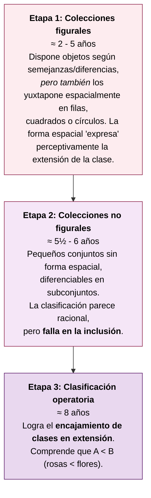

### 8.2. La prueba clásica de inclusión de clases

> **Experimento (Piaget, 1964):** Se muestra un ramo de **12 flores**: **6 margaritas** (subclase A) y otras flores (complementaria A'). Se pregunta: **"¿Hay más flores o más margaritas?"**

**Reacciones:**

- **Antes de los 7-8 años**: el niño responde "más margaritas" porque, al pensar en la parte A, el todo B deja de conservarse como unidad; entonces compara A sólo con su complementaria A', no con B.
- **Desde los 7-8 años**: responde correctamente —las margaritas son una subclase de las flores, no puede haber más margaritas que flores.

> **Importante:** Incluso niños de 3 años muestran cierta conciencia rudimentaria de la inclusión de clases, dependiendo del tipo de tarea, las claves prácticas y la familiaridad con los objetos (Johnson, Scott y Mervis, 1997, citado en Papalia et al., 2009).

### 8.3. Razonamiento inductivo y deductivo

Piaget sostenía que los niños operatorios concretos usan **sólo razonamiento inductivo**, y que el deductivo aparece recién en el operatorio formal.

| Tipo | Definición | Ejemplo |
|---|---|---|
| **Inductivo** | De observaciones particulares a una conclusión general. **Las conclusiones son tentativas** (nueva información puede refutarlas). | "Mi perro ladra, el perro de Terry ladra, el perro de Melissa ladra → todos los perros ladran." |
| **Deductivo** | De una premisa general a una conclusión particular. Si la premisa es verdadera y el razonamiento sólido, **la conclusión necesariamente es verdadera**. | "Todos los perros ladran. Fifí es perro. → Fifí ladra." |

> **Investigación que matiza a Piaget (Galotti, Komatsu y Voelz, 1997):** Con problemas sin referencia al mundo real ("Todos los poggops usan botas azules. Tombor es poggop. ¿Tombor usa botas azules?"), los niños de **2° grado** ya pueden resolver tanto problemas inductivos como deductivos. Esto sugiere que el límite piagetiano es más flexible.

> En general, los niños saben que las **conclusiones inductivas son menos confiables** que las deductivas.

---

## 9. El número

Piaget rechaza la idea de que el número sea simplemente una correspondencia término a término entre conjuntos (Frege, Whitehead, Russell). El **número operatorio** sólo se constituye cuando hay **conservación numérica independiente de la disposición espacial** de los elementos.

### 9.1. Definición piagetiana del número

El número resulta de una **síntesis de dos agrupamientos**:

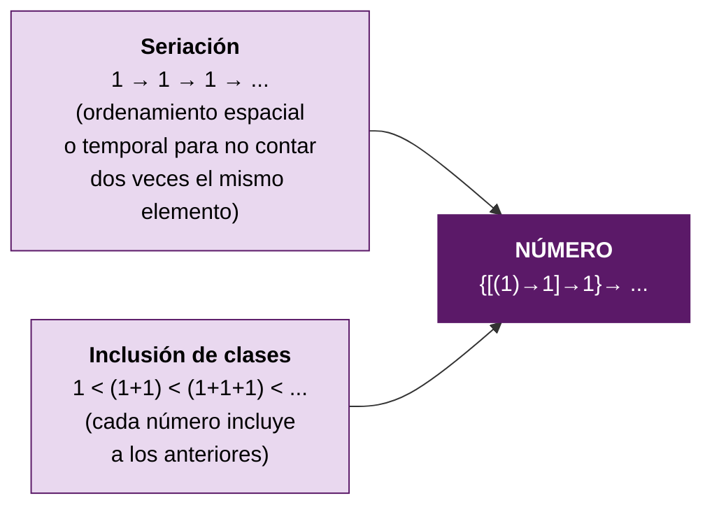

### 9.2. Conteo y matemáticas en el operatorio concreto

Según Papalia et al. (2009):

- A los **6-7 años**, muchos niños pueden **contar mentalmente** y aprenden a **contar hacia adelante** desde el número más pequeño (para sumar 5 + 3, parten de 5: "6, 7, 8").
- Hacia los **9 años**, la mayoría puede contar hacia adelante desde un número pequeño **o hacia atrás** desde uno mayor para restar.
- Resuelven **problemas narrados simples** ("Pedro tenía $5, gastó $2; ¿cuánto le quedó?"). Los más complejos (con la cantidad inicial desconocida) sólo se resuelven hacia los **8-9 años**.
- Comprensión intuitiva de **fracciones** desde los 4 años, pero confusiones persistentes (decir que 1/2 + 1/3 = 2/5 porque se centran en los numerales, no en la cantidad que representa la fracción).
- **Cálculo en línea numérica**: en jardín, los niños exageran las distancias entre números pequeños y minimizan las distancias entre los grandes; hacia 2° grado producen líneas más equidistantes.

> **Hallazgo cultural relevante (Carraher, Schliemann y Carraher, 1988):** Niños vendedores callejeros brasileños de 9-15 años resuelven correctamente cálculos complejos en contexto comercial ("dame 2 cocos a 40 cruzeiros, te pago con 500") pero fallan con los mismos cálculos planteados en formato escolar ("¿cuánto es 500 − 80?"). **Conclusión: enseñar matemáticas con aplicaciones concretas es más eficaz que con reglas abstractas.**

---

## 10. El espacio

Las operaciones espaciales se construyen **paralela y sincrónicamente** con las lógico-aritméticas. Piaget las llama **operaciones "infralógicas"** (no porque sean previas, sino porque operan sobre otro nivel de la realidad: el continuo, basado en vecindades y separaciones, en lugar del discreto basado en diferencias).

### 10.1. La medida espacial

La medida se construye independientemente del número pero en estrecho isomorfismo con él (con unos 6 meses de desfase, porque en el continuo la unidad no está dada de antemano).

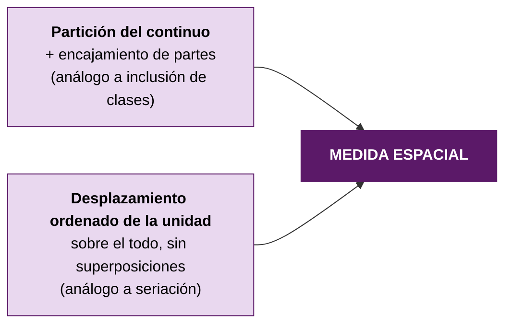

### 10.2. El orden constructivo del espacio en el niño

Un hallazgo notable: el desarrollo del espacio en el niño **se acerca más a la construcción teórica que a la histórica** de la geometría.

| Construcción | Orden histórico de la geometría | Orden en el desarrollo del niño |
|---|---|---|
| Primera | Geometría euclidiana | **Topología** (vecindades, separaciones, envolvimiento, abertura, cierre, orden lineal) |
| Segunda | Geometría proyectiva | Estructuras **proyectivas** (puntual, coordinación de puntos de vista) — simultáneo |
| Tercera | Topología | Estructuras **métricas** (desplazamientos, medida, coordenadas) — simultáneo |

### 10.3. Razonamiento espacial cotidiano

Los niños del operatorio concreto:

- Comprenden mejor las **relaciones espaciales**: cuánta distancia hay entre dos lugares, cuánto tarda llegar de uno a otro, qué ruta seguir.
- Pueden **usar mapas y modelos** para buscar objetos ocultos y dar instrucciones para que otros los encuentren.
- La **experiencia** influye fuertemente: el niño que camina cada día a la escuela conoce el vecindario.

---

## 11. Tiempo y velocidad

### 11.1. La velocidad

La noción de velocidad **no comienza bajo su forma métrica** (v = e/t), que recién aparece hacia los 10-11 años, sino bajo una **forma ordinal**.

> Un móvil es más rápido que otro si **lo rebasa**: si estaba detrás antes y luego está delante.

**Etapas:**

1. **Preoperatorio**: el niño sólo considera los puntos de llegada (no aprecia el semi-rebasamiento ni el simple alcance).
2. **Operatorio concreto inicial**: estructura los rebasamientos anticipados y los comprobados.
3. **Operatorio concreto avanzado (nivel híper-ordinal)**: toma en cuenta el tamaño creciente o decreciente de los intervalos.
4. **Final**: relaciona duraciones y espacios recorridos (forma métrica).

### 11.2. El tiempo

El tiempo, en su forma acabada, se basa en **tres tipos de operaciones**:

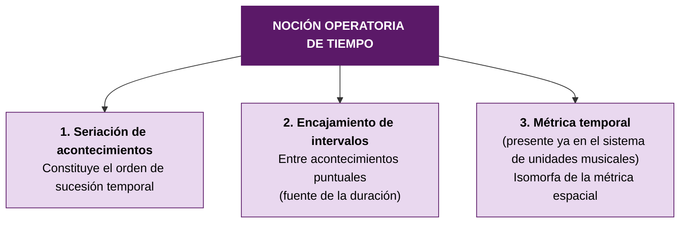

> **Punto sutil:** La **duración** (a diferencia del orden temporal) depende de la velocidad. El niño preoperatorio tiende a juzgar la duración sólo por su contenido (olvidando la velocidad): "el móvil se movió más tiempo porque llegó más lejos". Recién en el operatorio concreto el contenido se relaciona con la velocidad de su transcurrir, dando al tiempo su valor de relación objetiva.

---

## 12. Causalidad y azar: la representación del universo

Junto al núcleo operatorio del pensamiento, se despliegan actividades estructuradas en grados diversos según logren asimilar lo real. **Causalidad y azar son los dos polos esenciales** entre los que se distribuyen.

### 12.1. La precausalidad preoperatoria

Desde los 3 años, el niño formula "¿por qué?". Los porqués manifiestan una **precausalidad** intermedia entre la causa eficiente y la causa final, con cuatro rasgos típicos:

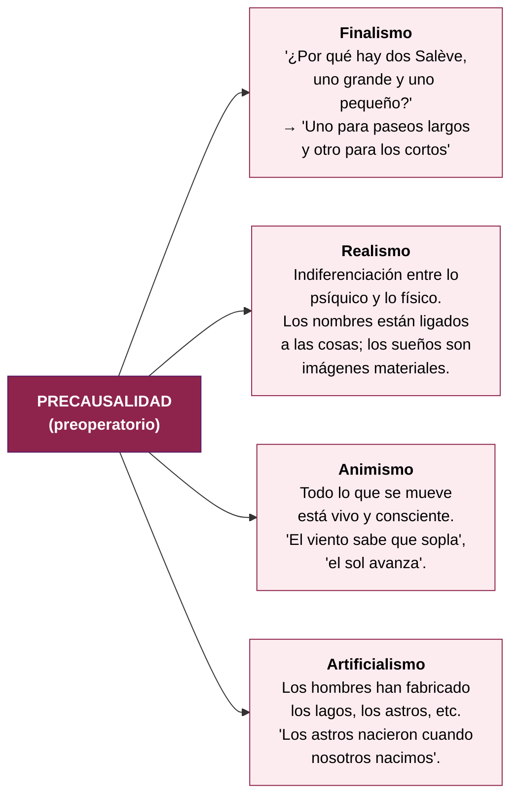

### 12.2. La causalidad operatoria

En el operatorio concreto, la precausalidad —asimilación a la **acción propia egocéntrica**— se transforma en **causalidad racional** por asimilación a las **operaciones** (coordinaciones generales de las acciones).

**Ejemplo: el "atomismo infantil"** (disolución del azúcar)

> Se pregunta a niños de 5 a 12 años qué pasa cuando se disuelve un terrón de azúcar en el agua:

| Edad | Respuesta | Tipo de conservación lograda |
|---|---|---|
| Hasta los 7 años | "El azúcar desaparece y su gusto también desaparecerá" | Ninguna |
| 7-8 años | "La sustancia se conserva" (los granitos invisibles se mantienen) | Sustancia |
| 9-10 años | Se añade la conservación del peso | Sustancia + peso |
| 11-12 años | Se añade la conservación del volumen (reconocible porque el nivel del agua no vuelve a bajar tras la disolución) | Sustancia + peso + volumen |

Esto constituye un **hermoso ejemplo de explicación causal por proyección en lo real de una composición operatoria**: los granitos sumados equivalen primero a la sustancia, luego al peso, luego al volumen.

### 12.3. El azar

El niño **no comprende la noción de azar o mezcla irreversible** hasta poseer operaciones reversibles que le sirvan de referencia. Una vez construidas éstas, **comprende la irreversibilidad como resistencia a la deductibilidad operatoria**.

> **Experiencia (Piaget e Inhelder, 1951):** Una caja inclinable con 10 cuentas blancas y 10 negras en compartimentos opuestos. Al inclinar la caja, las cuentas se mezclan.

- **Preoperatorio (4-6 años)**: domina la finalidad sobre lo fortuito. "Cada una va a volver a su sitio" o "las negras van a ocupar el lugar de las blancas en cruce alternativo y regular".
- **Operatorio concreto (8-9 años)**: prevé la mezcla y la improbabilidad de una vuelta al estado inicial.

La **noción de probabilidad** se construye luego como relación entre casos favorables y casos posibles, pero su forma terminada requiere una combinatoria que sólo aparece después de los 11-12 años (operatorio formal).

---

## 13. Principales logros del operatorio concreto

Cuadro síntesis (Papalia et al., 2009; Faas, 2018):

| Capacidad | Ejemplo |
|---|---|
| **Razonamiento espacial** | Usa mapas y modelos para buscar objetos ocultos. Conoce caminos, calcula distancias, juzga cuánto tarda en ir de un lugar a otro. |
| **Causa y efecto** | Sabe qué atributos físicos de los objetos (número, cantidad) afectan el resultado en una balanza. Aún no comprende del todo los factores espaciales (distancia al centro de la balanza). |
| **Clasificación** | Clasifica objetos por categorías (forma, color, o ambos). Comprende clases y subclases (una subclase tiene menos miembros que la clase que la contiene). |
| **Seriación e inferencia transitiva** | Organiza palos por tamaño. Si A > B y B > C, infiere que A > C sin compararlos directamente. |
| **Razonamiento inductivo y deductivo** | Resuelve ambos tipos de problemas; sabe que las conclusiones inductivas son menos confiables que las deductivas. |
| **Conservación** | A los 7-8 años: sustancia. A los 9-10: peso. A los 11-12: volumen. |
| **Número y matemáticas** | Cuenta mentalmente, suma contando desde el más pequeño, resuelve problemas narrados simples. |

### 13.1. Influencias del desarrollo neurológico y la escolaridad

- **Sustrato neurológico** (Stauder, Molenaar y Van der Molen, 1993): niños que alcanzan la conservación de volumen muestran **patrones de ondas cerebrales distintos** durante la tarea respecto de quienes aún no la han alcanzado, lo que sugiere que pueden estar utilizando **regiones cerebrales diferentes**.
- **Retraso histórico** (Shayer, Ginsburg y Coe, 2007): al evaluar a **10.000 niños británicos** de 11-12 años en tareas de conservación de volumen y peso, su desempeño mostró **un retraso de 2 a 3 años** en comparación con sus contrapartes de 30 años antes. Hipótesis: los escolares de hoy reciben **demasiada práctica en lectura, escritura y matemáticas** y **poca experiencia con la materia física**.

> Este dato aparece en la diapositiva de la clase y es citado expresamente por Papalia et al. (2009).

---

## 14. Limitaciones del pensamiento operatorio concreto

Aunque rico y poderoso, el pensamiento operatorio concreto tiene límites que sólo se superan en el operatorio formal.

### 14.1. Cuadro comparativo

| Operatorio concreto | Operatorio formal |
|---|---|
| Operaciones ligadas a objetos | Resolución de problemas verbales |
| Dependiente de la percepción | Experimentación mental |
| Representación de la realidad sobre la que se actúa (ensayo y error) | Formulación de hipótesis |
| Adhesión a lo real, concreto y actual | Ir más allá de los datos conocidos |
| Pensamiento dominio por dominio | Generalización del pensamiento |
| Transformaciones reales | Transformaciones virtuales |

### 14.2. Descripción detallada de las limitaciones (Faas, 2018)

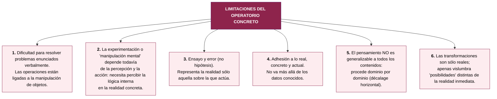

### 14.3. El traspaso al operatorio formal

> "El traspaso del pensamiento operatorio al formal implica superar las relaciones con interacción y materiales concretos para pensar en relación de relaciones y otras ideas abstractas, como proporciones y conceptos de segundo orden. El niño debe reemplazar la lógica concreta por la lógica del discurso." (Faas, 2018)

Lo que el pensamiento formal habilitará:
- Razonamiento sobre **enunciados verbales proposicionales**.
- Manipular hipótesis admitiendo puntos de vista ajenos.
- Comprender el **tiempo histórico** y el **espacio exterior**.
- Usar **símbolos de segundo orden** (X representa 15).
- Aprender **álgebra y cálculo**.
- Comprender **metáfora y alegoría**.
- Razonar en términos de **lo posible y no sólo de lo real**.
- Considerar **todas las combinaciones posibles** (sistema combinatorio), aislando y controlando variables.

---

## 15. Razonamiento moral

Piaget (1932) estudió el razonamiento moral con dilemas como el siguiente:

> **Dilema clásico:** "Augusto notó que el tintero de su papá estaba vacío y decidió ayudar a su padre llenándolo. Al abrir la botella, tiró una gran cantidad de tinta sobre el mantel. Julián jugó con el tintero de su papá y derramó un poquito de tinta sobre el mantel. **¿Cuál de los dos niños se portó peor y por qué?**"

**Análisis de las respuestas:**

| Edad | Respuesta típica | Criterio moral |
|---|---|---|
| < 7 años | "Augusto se portó peor porque ensució más" | **Grado de la ofensa** (lo material) |
| > 7-8 años | "Julián se portó peor porque hizo algo que no debía" | **Intención** del actor |

### 15.1. Las tres etapas del desarrollo moral según Piaget

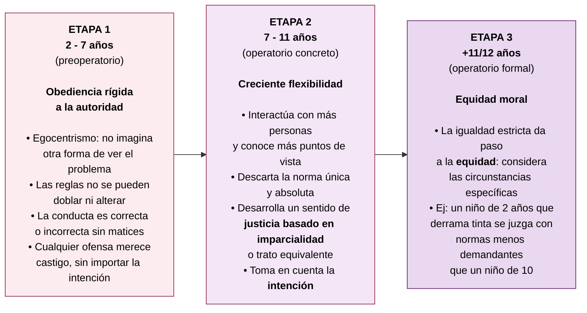

> **Vínculo con la maduración cognitiva**: La transición moral es paralela a la cognitiva. La descentración del operatorio concreto permite considerar más de un aspecto de la situación (acción + intención) y por eso emerge la flexibilidad moral.
> En el capítulo 16 de Papalia, se desarrolla la teoría de **Kohlberg**, que retoma y profundiza las ideas de Piaget.

---

## 16. Interacciones sociales y afectivas

Piaget e Inhelder (1969) insisten: el desarrollo cognitivo, afectivo y social son **indisociables**. La afectividad es la **energética** de las conductas cuyas estructuras corresponden a las funciones cognitivas.

### 16.1. Del objeto afectivo sensorio-motor al objeto afectivo representado

- **Sensorio-motor**: el objeto afectivo es de contacto directo; se lo puede reencontrar pero no evocar en ausencia.
- **Con la función semiótica** (imagen mental, memoria de evocación, juego simbólico, lenguaje): el objeto afectivo **está siempre presente y siempre actuando**, incluso en su ausencia física.

Esto provoca la formación de **nuevos afectos**:

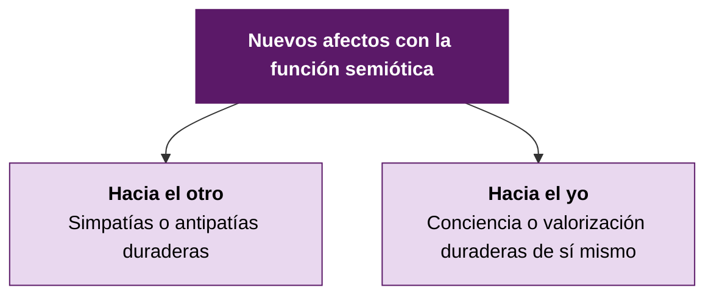

### 16.2. La cooperación como condición de la objetividad

Las operaciones, a diferencia de la mayor parte de las acciones, conllevan siempre una **posibilidad de intercambio**, tanto de coordinación interindividual como individual. **Ese aspecto cooperativo es condición *sine qua non* de:**
- La **objetividad**,
- La **coherencia interna (equilibrio)**, y
- La **universalidad** de las estructuras operatorias.

> **Papalia et al. (2009)** lo ilustra con un ejemplo cotidiano: los niños desarrollan conceptos de equidad mediante la **interacción con sus pares** —especialmente en juegos con reglas, como una carrera de tres piernas. A medida que crecen, se dan cuenta de que las reglas **no necesitan imponerse externamente**, sino que pueden cambiarse por acuerdo mutuo.

---

## 17. Cuadro de síntesis final

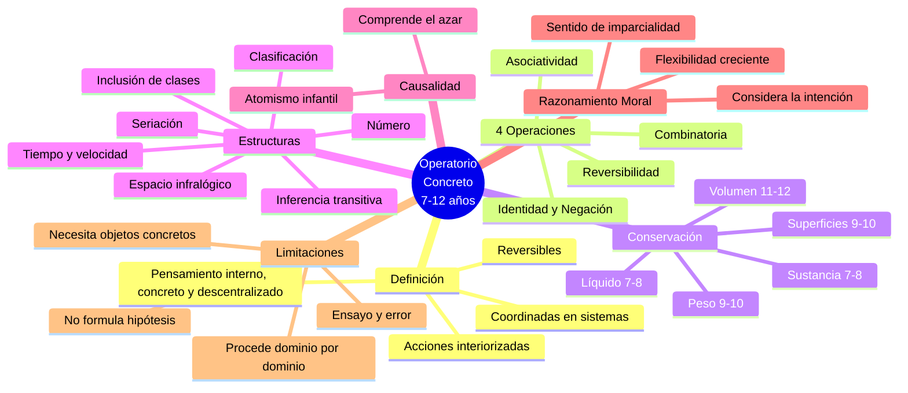

---

## Glosario rápido

| Término | Definición |
|---|---|
| **Operación** | Acción interiorizada, reversible, coordinada en sistemas de conjunto. |
| **Reversibilidad** | Capacidad de invertir mentalmente una acción para volver al estado inicial. Por inversión (A−A=0) o por reciprocidad (compensación). |
| **Conservación** | Comprensión de que cierta propiedad (cantidad, peso, volumen) permanece invariante a pesar de transformaciones perceptivas. |
| **Décalage horizontal** | Inconsistencia en el dominio de distintos tipos de conservación a diferentes edades, aunque los principios subyacentes sean los mismos. |
| **Agrupamiento** | Estructura operatoria de conjunto: clasificaciones, seriaciones, correspondencias, matrices. Forma lógica intermedia entre grupoide y semi-retículo. |
| **Inferencia transitiva** | Si A > B y B > C, entonces A > C (sin comparar A y C directamente). |
| **Inclusión de clases** | Comprensión de que una subclase tiene menos miembros que la clase que la contiene (A < B). |
| **Seriación** | Capacidad de ordenar elementos según una dimensión creciente o decreciente. |
| **Precausalidad** | Modo preoperatorio de explicar el mundo, intermedio entre causa eficiente y causa final. Incluye finalismo, realismo, animismo, artificialismo. |
| **Operaciones infralógicas** | Operaciones espaciales y temporales, basadas en vecindades y separaciones (continuo), paralelas a las lógico-aritméticas. |

---

## Bibliografía utilizada

- **Faas, A. E. (2018)**. *Psicología del desarrollo de la niñez*. Editorial Brujas. Capítulo 13, pp. 294-298.
- **Papalia, D., Wendkos Olds, S., & Duskin Feldman, R. (2009)**. *Psicología del desarrollo. De la infancia a la adolescencia* (11ª ed.). McGraw-Hill. Capítulo 13, pp. 385-389.
- **Piaget, J., & Inhelder, B. (1969)**. *Psicología del niño*. Ediciones Morata. Capítulo 4: "Las operaciones 'concretas' del pensamiento y las relaciones interindividuales", pp. 87-101.
- **Presentación de clase**: *Piaget 3 — Estadio operatorio concreto*. Unidad 5, Psicología Evolutiva, Universidad Favaloro.

---

*Apunte extendido — Psicología Evolutiva — Unidad 5*
