# Desarrollo Cognitivo 1

## Procesos, continuidades y debates actuales en el desarrollo cognitivo

> **Unidad 6 — Psicología Evolutiva**
> Apunte de estudio integrado a partir de la clase y la bibliografía obligatoria: Papalia et al. (2009a) Caps. 7, 10 y 13, y Faas (2018) Cap. 9.

---

## Índice

1. [Introducción: los enfoques del desarrollo cognitivo](#1-introducción-los-enfoques-del-desarrollo-cognitivo)
2. [Enfoque conductista](#2-enfoque-conductista)
3. [Enfoque psicométrico](#3-enfoque-psicométrico)
4. [Enfoque del procesamiento de la información](#4-enfoque-del-procesamiento-de-la-información)
5. [Enfoque de la neurociencia cognitiva](#5-enfoque-de-la-neurociencia-cognitiva)
6. [Enfoque sociocontextual (complementario)](#6-enfoque-sociocontextual-complementario)
7. [Síntesis comparativa final](#7-síntesis-comparativa-final)
8. [Glosario de términos clave](#8-glosario-de-términos-clave)

---

## 1. Introducción: los enfoques del desarrollo cognitivo

Papalia et al. (2009a) plantean **seis enfoques** complementarios para el estudio del desarrollo cognitivo. Ninguno es excluyente: cada uno ilumina una faceta del problema y, en conjunto, ofrecen una comprensión más completa.

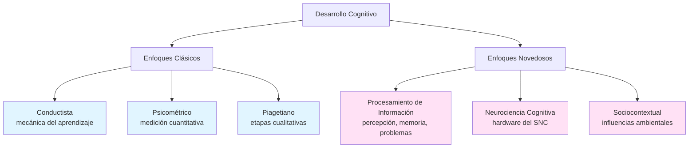

| Enfoque | Pregunta central | Método característico |
|---------|------------------|----------------------|
| **Conductista** | ¿Cómo cambia el comportamiento en respuesta a la experiencia? | Condicionamiento clásico y operante |
| **Psicométrico** | ¿Cuánta inteligencia posee una persona? | Pruebas estandarizadas (CI, escalas del desarrollo) |
| **Piagetiano** | ¿Cómo se estructura y adapta la mente? | Método clínico, etapas cualitativas |
| **Procesamiento de la información** | ¿Qué hace la mente con la información? | Habituación, preferencia visual, expectativa visual |
| **Neurociencia cognitiva** | ¿Qué estructuras cerebrales sustentan la cognición? | Neuroimagen, EEG |
| **Sociocontextual** | ¿Cómo influye el entorno (sobre todo el adulto) en el aprendizaje? | Observación de interacciones, participación guiada |

> **Importante.** La clase se centra en los cuatro primeros enfoques (con énfasis en procesamiento de información y neurociencia como respuestas/complementos a Piaget). El piagetiano se da en unidades previas y el sociocontextual aparece como hilo transversal.

---

## 2. Enfoque conductista

### 2.1 Caracterización general

El enfoque conductista estudia los **mecanismos básicos del aprendizaje** —es decir, la mecánica por la cual el comportamiento se modifica en respuesta a la experiencia—. Para los conductistas:

- El **aprendizaje** es el objeto de estudio central.
- **No se ocupan de los procesos de desarrollo** en sí mismos: les interesa cómo se aprende, no cómo se transforman cualitativamente las estructuras cognitivas con la edad.
- Reconocen el papel de la maduración, pero no la convierten en variable explicativa.

Los dos conceptos fundamentales son **condicionamiento clásico** y **condicionamiento operante**.

### 2.2 Condicionamiento clásico (Pavlov, Watson)

> **Aprendizaje por asociación; el sujeto es pasivo.**

La persona aprende a dar una **respuesta refleja o involuntaria** ante un estímulo que originalmente no la provocaba. Esto ocurre porque se asocian dos estímulos que tienden a presentarse juntos.

**Ejemplo clásico de Papalia (Anna, 11 meses):** cada vez que su padre la fotografía, el *flash* (estímulo incondicionado) provoca parpadeo (respuesta incondicionada). Tras múltiples emparejamientos cámara–flash, la sola vista de la cámara (estímulo condicionado) produce parpadeo (respuesta condicionada).

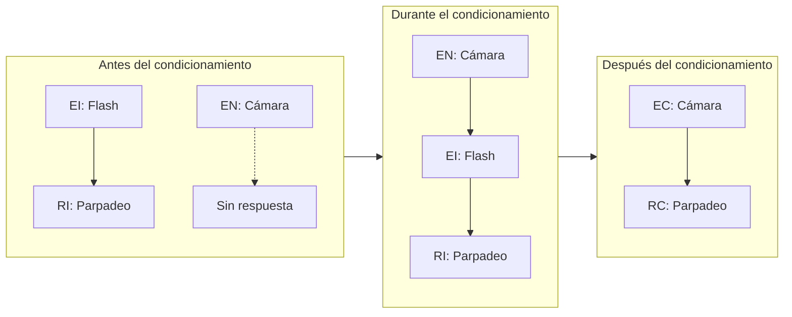

**Extinción.** Si el EC (cámara) se presenta repetidamente sin el EI (flash), la respuesta condicionada se debilita y desaparece.

### 2.3 Condicionamiento operante (Skinner)

> **Aprendizaje por reforzamiento o castigo; el sujeto es activo.**

El sujeto *opera* sobre el ambiente: emite una conducta y las consecuencias modulan la probabilidad de que la repita. Es el mecanismo básico por el cual un bebé aprende, por ejemplo, que sonreír produce atención amorosa de los padres.

**Tipos de consecuencia** (matriz 2×2):

| | **Incrementar conducta** | **Reducir conducta** |
|---|---|---|
| **Dar algo (positivo)** | **Reforzamiento positivo** (felicitar al niño que hace la tarea) | **Castigo positivo** (retar si no la completa) |
| **Retirar algo (negativo)** | **Reforzamiento negativo** (no le toca lavar platos si hizo la tarea) | **Castigo negativo** (le toca lavar más días si no la hizo) |

> **Truco mnemotécnico.** "Positivo/negativo" se refiere a *agregar o quitar* un estímulo (no a "bueno/malo"). "Reforzamiento/castigo" indica el efecto sobre la conducta (aumenta/disminuye).

### 2.4 Memoria en el lactante: aportes desde el condicionamiento operante

Si pidiéramos a un adulto que recuerde algo previo a los 2 años, probablemente no podrá: es el fenómeno de la **amnesia infantil**. Existen distintas explicaciones:

| Autor/perspectiva | Explicación de la amnesia infantil |
|---|---|
| **Piaget y otros** | El cerebro inmaduro no puede almacenar los primeros eventos. |
| **Freud** | Los recuerdos sí se almacenan pero se reprimen por perturbadores. |
| **Nelson (1992)** | No se almacenan eventos hasta que pueden hablarse. |
| **Investigación reciente** | Los procesos de memoria del lactante son cualitativamente similares a los del adulto, pero la **retención es más breve**. |

#### Los experimentos de Rovee-Collier

Carolyn Rovee-Collier diseñó tareas de condicionamiento operante apropiadas para bebés:

- **Tarea del móvil (2–6 meses):** se ata el tobillo del bebé a un móvil con una cinta. El bebé descubre que al patear, el móvil se mueve.
- **Tarea del tren (mayores hasta 18 meses):** el niño oprime una palanca para activar un tren en miniatura.

Al volver a mostrar el mismo móvil días o semanas después (sin la cinta), los bebés **pateaban más que antes del condicionamiento**, evidenciando que recordaban la experiencia.

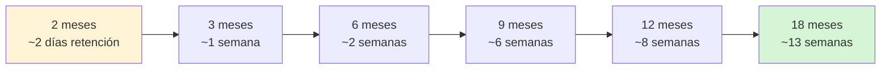

**Hallazgos clave:**

- La retención **aumenta con la edad**.
- En bebés pequeños (2–6 meses), el recuerdo está **vinculado a la señal original** (mismo móvil).
- A los 9–12 meses, los bebés generalizan a estímulos parecidos (otro tren), si no pasaron más de dos semanas.
- Los recordatorios breves periódicos pueden mantener un recuerdo hasta los 1,6–2 años.

**Crítica de Nelson (2005):** desde una perspectiva evolutiva, el conocimiento *procedimental y perceptual* implícito en patear un móvil no es equivalente al recuerdo *explícito* de un episodio. La lactancia es un período de cambios tan rápidos que retener experiencias específicas largo tiempo no sería adaptativo: he ahí una posible razón biológica de la amnesia infantil.

---

## 3. Enfoque psicométrico

### 3.1 Concepto de inteligencia

No existe consenso científico sobre cómo definir la inteligencia (Sternberg et al., 2005). Sin embargo, la mayoría de los autores coinciden en describirla como una conducta:

- **Orientada a metas**
- **Adaptativa** (a las circunstancias y condiciones de vida)

La inteligencia permite a las personas:

1. Adquirir, recordar y utilizar el conocimiento.
2. Comprender conceptos y relaciones.
3. Resolver problemas.

### 3.2 Historia del movimiento psicométrico

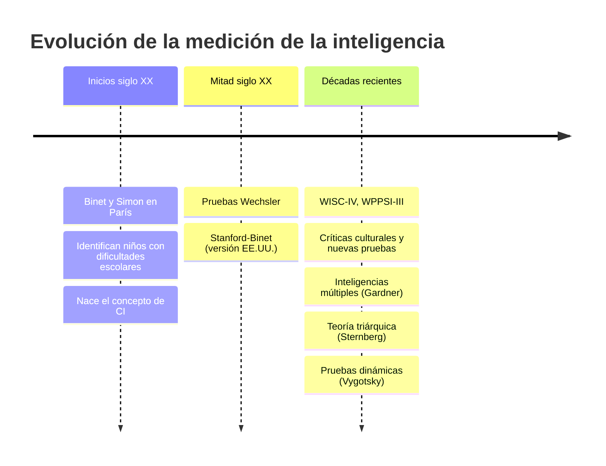

El objetivo psicométrico es **medir cuantitativamente** los factores que conforman la inteligencia (comprensión, razonamiento, memoria) y, a partir de ellos, **pronosticar el desempeño futuro** (aprovechamiento escolar, autonomía, etc.).

### 3.3 Evaluación en la lactancia: las Escalas Bayley

Los lactantes no pueden decirnos qué saben ni cómo piensan: medir inteligencia es virtualmente imposible, pero sí se puede evaluar **desarrollo cognitivo**.

**Escalas Bayley del Desarrollo Infantil III (2005)** (1 mes – 3,6 años):

| Área evaluada | Qué mide |
|---|---|
| Cognitiva | Resolución de problemas, exploración |
| Lenguaje | Comprensión y producción |
| Motora | Fina y gruesa |
| Socioemocional | Regulación, vinculación |
| Conducta adaptativa | Funcionamiento cotidiano |

Las puntuaciones se expresan como **cocientes del desarrollo (CD)**. Su mayor utilidad es la **detección temprana** de perturbaciones (sensoriales, neurológicas, emocionales) más que la predicción de inteligencia futura.

### 3.4 Evaluación de la inteligencia en niños mayores

| Prueba | Rango etario | Características |
|---|---|---|
| **WPPSI-III** (Wechsler nivel preescolar y primario) | 2,5 – 7 años | 30–60 min; CI verbal, ejecución y combinado; nuevas subpruebas de razonamiento fluido |
| **Stanford-Binet (5ª ed., 2003)** | Desde 2 años | 45–60 min; mide razonamiento fluido, conocimientos, razonamiento cuantitativo, procesamiento visoespacial y memoria de trabajo; CI verbal y no verbal |
| **WISC-IV** (Wechsler para niños) | 6 – 16 años | Factor general con cuatro índices |
| **OLSAT8** (Otis-Lennon) | Jardín – 12° grado | Prueba **grupal** (no individual) |

#### Estructura del WISC-IV

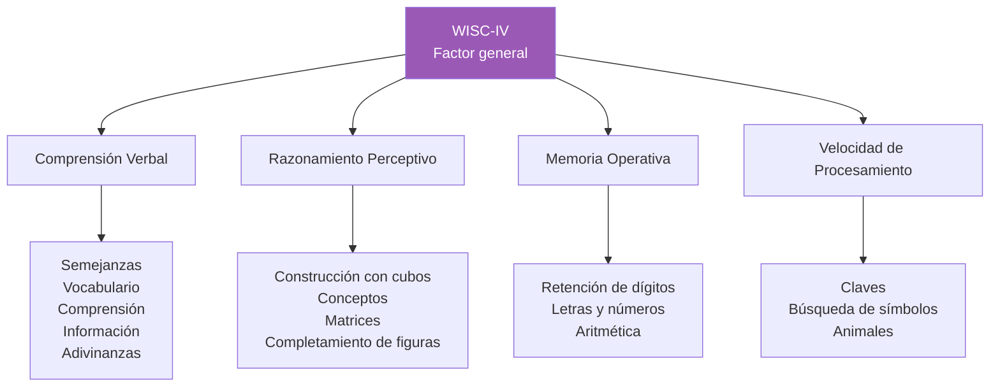

**Valor predictivo del CI.** Las puntuaciones de CI obtenidas en la tercera infancia predicen bastante bien:

- El **aprovechamiento escolar** (sobre todo en niños altamente verbales).
- La **independencia funcional** y autonomía en la vida adulta.
- Incluso el **período de vida** y la **presencia o ausencia de demencias** (Starr et al., 2000; Whalley & Deary, 2001).

### 3.5 La polémica del CI

Las pruebas de CI son útiles, pero presentan críticas serias. La clase resume tres problemas centrales:

#### 1) El requerimiento de tiempo
- Penalizan a niños que trabajan **de manera lenta y deliberada**.
- Equiparan inteligencia con velocidad.
- ¿Dejan afuera a chicos? Sí: aquellos con estilo cognitivo reflexivo, ansiedad, mala salud, problemas atencionales.

#### 2) Implican el uso de conocimiento, no miden lo innato
- Es prácticamente imposible diseñar una prueba sin conocimientos previos.
- Las pruebas **se validan contra medidas de aprovechamiento** (notas escolares), que están culturalmente sesgadas.
- ¿Es posible estudiar la inteligencia "pura"? Probablemente no: la inteligencia siempre se expresa a través de contenidos culturales.

#### 3) Conciben la inteligencia como constructo único
- Existen tipos de inteligencia que no detectan estas pruebas (sentido común, habilidades sociales, creatividad).
- ¿Hay un solo tipo de inteligencia? La respuesta de Gardner y Sternberg es **no**.
- ¿Cuál es la relación entre inteligencia y funciones ejecutivas? (pregunta abierta de la clase).

### 3.6 Influencias sobre la inteligencia medida

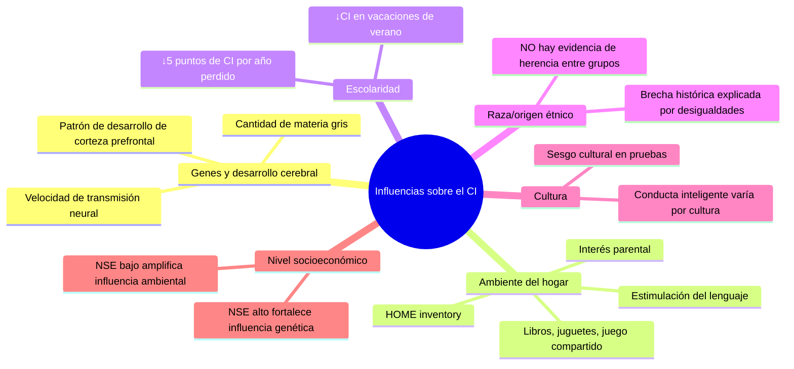

#### 3.6.1 Genes y desarrollo cerebral

- Existe **correlación moderada** entre tamaño cerebral / cantidad de materia gris e inteligencia general (Gray & Thompson, 2004).
- La **cantidad de materia gris en corteza frontal** es principalmente heredada y se vincula a diferencias en CI (Thompson et al., 2001).
- Shaw et al. (2006): la clave no es la cantidad de materia gris a una edad determinada, sino **el patrón de desarrollo**:
  - **CI promedio:** la corteza prefrontal es relativamente gruesa a los 7, alcanza su máximo a los 8 y luego se reduce gradualmente.
  - **CI elevado:** la corteza no alcanza su grosor máximo hasta los 11–12 años. Este **engrosamiento prolongado** representaría un período crítico extendido para circuitos de razonamiento de orden superior.
- La **heredabilidad de la inteligencia aumenta con la edad**, porque los niños van seleccionando o creando ambientes que se adecuan a sus tendencias genéticas.

#### 3.6.2 Ambiente del hogar: el HOME

El **Home Observation for Measurement of Environment (HOME)** evalúa la influencia del ambiente del hogar sobre el desarrollo cognitivo. Para lactantes/infantes (0–3 años) tiene seis subescalas:

| Subescala | Qué evalúa |
|---|---|
| 1. Interés emocional y verbal de la cuidadora | Vocaliza, acaricia, besa al niño durante la visita |
| 2. Evitación de restricción y castigo | No grita, no expresa hostilidad |
| 3. Organización del ambiente físico y temporal | Sustitutos regulares, ambiente seguro |
| 4. Provisión de materiales apropiados de juego | Juguetes para músculos grandes, equipo apropiado |
| 5. Participación parental con el niño | Mantiene al niño en rango visual, le habla |
| 6. Oportunidades de variedad en la estimulación diaria | Padre involucrado, visitas familiares |

**Hallazgos clave:**

- Las puntuaciones HOME después de los 2 años se **correlacionan significativamente con desarrollo cognitivo posterior** (Totsika & Sylva, 2004).
- El **interés parental hacia los hijos de 6 meses** predijo CI, puntuaciones de aprovechamiento y comportamiento escolar hasta los 13 años (Bradley et al., 2001).
- **Precaución:** correlación ≠ causalidad. Padres inteligentes con alto nivel educativo proporcionan ambientes positivos *y* transmiten sus genes (correlación pasiva genotipo-ambiente).

**Siete aspectos del ambiente temprano que fomentan desarrollo cognitivo y psicosocial** (Ramey & Ramey, 2003):

1. Alentar la exploración del ambiente.
2. Instrucción en habilidades cognitivas y sociales básicas.
3. Elogios hacia los avances del desarrollo.
4. Orientación en la práctica y extensión de habilidades.
5. Protección contra desaprobación inapropiada, burlas y castigos.
6. Comunicaciones ricas e interesantes.
7. Guía y limitación del comportamiento.

#### 3.6.3 Intervención temprana: Proyectos CARE y Abecedarian

Estudios controlados con asignación aleatoria (Carolina del Norte) con 174 bebés de hogares en riesgo desde las 6 semanas hasta los 5 años en **Partners for Learning** (día completo, todo el año):

| Grupo | CI a los 3 años |
|---|---|
| Experimental Abecedarian | **101** |
| Experimental CARE | **105** |
| Control Abecedarian | 84 |
| Control CARE | 93 |

**Seguimiento a los 21 años (Abecedarian):**

- **70%** del grupo experimental tenía empleos calificados o educación superior (vs. 40% del control).
- **Tres veces más probabilidades** de asistir a universidad de 4 años.
- Menos probabilidad de embarazo adolescente, tabaquismo y uso de drogas.

**Características de las intervenciones tempranas más eficaces:**

1. Inician pronto y continúan durante años preescolares.
2. Sumamente intensivas en tiempo.
3. Basadas en un centro educativo.
4. Abordaje generalizado (salud, orientación familiar, servicios sociales).
5. Diseñadas para diferencias individuales.

#### 3.6.4 Influencia de la escolaridad

- La escolaridad **aumenta** la inteligencia medida.
- Los niños cuya entrada a la escuela se demoró (Sudáfrica por escasez de maestros, Países Bajos por la ocupación nazi) **perdieron hasta 5 puntos de CI por año**, y algunas pérdidas nunca se recuperaron (Ceci & Williams, 1997).
- Las puntuaciones **disminuyen durante las vacaciones de verano** (Huttenlocher, Levine & Vevea, 1998).

#### 3.6.5 Raza/origen étnico

- Existe una brecha histórica entre puntuaciones de niños afroestadounidenses y blancos (aproximadamente 15 puntos), reducida en años recientes a 4–7 puntos (Dickens & Flynn, 2006).
- **No hay evidencia directa** de que las diferencias entre grupos étnicos sean hereditarias (Gray & Thompson, 2004; Sternberg et al., 2005).
- Las diferencias se atribuyen a **desigualdades ambientales**: ingresos, nutrición, condiciones de vida, salud, cuidados tempranos, estimulación, escolaridad, cultura, opresión y discriminación.
- En un estudio con 319 pares de gemelos: la influencia genética sobre el CI a los 7 años en familias **pobres era cercana a cero** (el ambiente domina), mientras que en familias **acomodadas dominaba la genética** (Turkheimer et al., 2003).
- **Estudiantes asiáticos:** su aprovechamiento escolar destacado se explica mejor por factores culturales (énfasis en obediencia, respeto por mayores, importancia parental de la educación, dedicación al estudio) que por una "ventaja" de CI.

#### 3.6.6 Cultura y sesgo cultural

**Conceptos clave** (distinguir bien):

| Tipo de prueba | Definición |
|---|---|
| **Sesgo cultural** | Tendencia de las pruebas a incluir reactivos más familiares para algunos grupos culturales que otros |
| **Culturalmente libre** | Prueba (ideal e inalcanzable) sin contenido vinculado con la cultura |
| **Culturalmente justa** | Prueba que utiliza experiencias **comunes a diversas culturas** |
| **Culturalmente pertinente** | Prueba que toma en cuenta las **tareas adaptativas** específicas de cada cultura |

**Sternberg (2004)** sostiene que inteligencia y cultura están irremediablemente ligadas:

> Lo que es inteligente en una cultura puede ser insensato en otra.

Ejemplo: ante una tarea de clasificación, un estadounidense agrupa al petirrojo con las aves; el pueblo Kpelle del norte de África lo agrupa con las "cosas que vuelan" (categoría funcional). Sternberg llama **inteligencia exitosa** a las habilidades necesarias para alcanzar el éxito dentro de un contexto social y cultural particular.

### 3.7 Teorías que cuestionan el constructo único de inteligencia

#### 3.7.1 Inteligencias múltiples (Gardner, 1993, 1998)

Gardner identifica **ocho** tipos de inteligencia bien diferenciados. Las pruebas convencionales miden solo tres (lingüística, lógico-matemática y, en parte, espacial). Una persona puede sobresalir en una y no en otras.

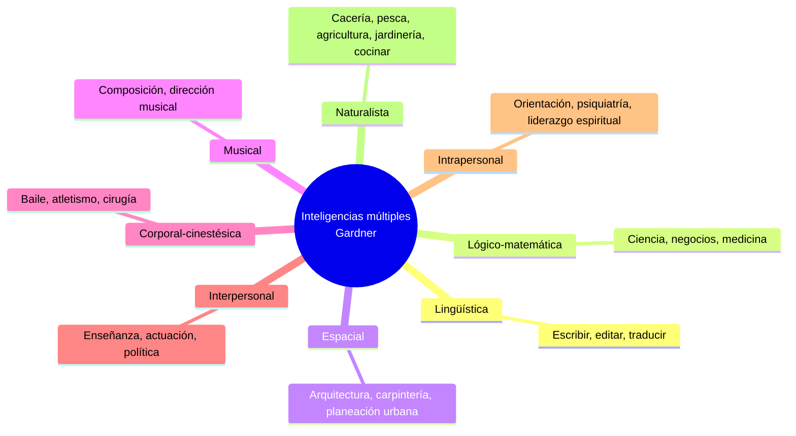

**Evaluación según Gardner:** observación directa de productos (cómo narra una historia, cómo recuerda una melodía, cómo se orienta en un área desconocida) más que pruebas estandarizadas. El propósito no es comparar, sino revelar fortalezas y debilidades.

> **Polémica.** Existen voces críticas sobre la base empírica de la teoría: Lynn Waterhouse (2023, en *Frontiers in Psychology*) argumenta que la teoría de inteligencias múltiples es un **neuromito**. Aunque pedagógicamente atractiva, no cuenta con evidencia neurocientífica que respalde la existencia de inteligencias independientes en el cerebro.

#### 3.7.2 Teoría triárquica de la inteligencia (Sternberg, 1985, 2004)

Sternberg identifica **tres elementos o aspectos** de la inteligencia:

| Elemento | Aspecto | Función | Ejemplo de tarea |
|---|---|---|---|
| **Componencial** | Analítico | Procesar información, resolver, evaluar | Test convencional de CI |
| **Experiencial** | Intuitivo/creativo | Abordar tareas novedosas, integrar hechos | Resolver problema con premisa falsa: "El dinero crece en los árboles" |
| **Contextual** | Práctico | Adaptarse, cambiar o salir del ambiente | Conocimiento tácito sobre hierbas, caza, etc. |

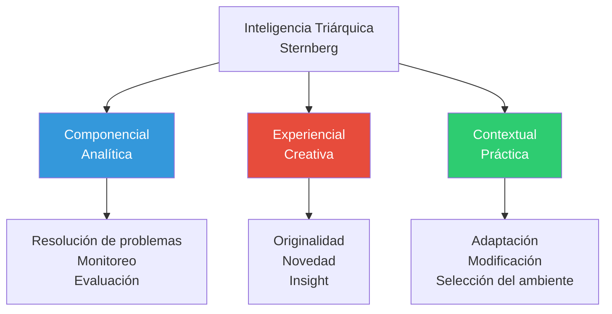

**Concepto clave: conocimiento tácito.** Información que no se enseña formalmente ni se expresa abiertamente, pero que se necesita para avanzar en la vida cotidiana. En estudios en Kenia (Usenge) y entre niños yup'ik de Alaska, el conocimiento práctico sobre hierbas, caza, pesca y plantas **no se correlacionó** con las medidas convencionales de inteligencia (Grigorenko et al., 2004).

**STAT (Sternberg Triarchic Abilities Test):** mide los tres aspectos en tres dominios (verbal, cuantitativo, figurativo) con preguntas de opción múltiple y ensayo. Los tres tipos de capacidades sólo se correlacionan débilmente entre sí, confirmando que son aspectos distintos.

### 3.8 Nuevas direcciones en la evaluación

#### Pruebas dinámicas (basadas en Vygotsky)

A diferencia de las pruebas **estáticas tradicionales** (que miden capacidades actuales), las **pruebas dinámicas**:

- Enfatizan el **potencial** más que el aprovechamiento actual.
- Convierten la situación de prueba en una **situación de aprendizaje**: el examinador hace preguntas sugestivas, da ejemplos, demostraciones, retroalimentación.
- Miden la **zona de desarrollo proximal (ZDP)**: diferencia entre lo que el niño puede hacer solo y lo que puede hacer con ayuda.

**Ventajas:** indican lo que el niño **está preparado para aprender**, son útiles para planear intervenciones, especialmente efectivas con niños en desventaja y de culturas no occidentales.

**Limitaciones:** la ZDP tiene poca validación experimental y es difícil de medir con precisión (Grigorenko & Sternberg, 1998).

---

## 4. Enfoque del procesamiento de la información

### 4.1 Caracterización del enfoque

El enfoque del procesamiento de la información **utiliza nuevos métodos** para examinar las ideas sobre desarrollo cognitivo provenientes de los enfoques psicométrico y piagetiano. Sus rasgos centrales:

- Se ocupa de **percepción, aprendizaje, memoria y solución de problemas**.
- Busca descubrir **qué hacen los niños con la información** desde que la perciben hasta que la usan.
- Analiza **cada parte de una tarea compleja por separado** para identificar qué procesos cognitivos están en juego y a qué edad se desarrollan.
- En lactantes, se basa en lo que los bebés observan y el tiempo que dedican a hacerlo (deriva inferencias de la atención y la mirada).

### 4.2 Las críticas al enfoque piagetiano (Carretero, 1998, citado por Faas, 2018)

> Esta sección es nuclear para la unidad. Tener bien claras las cuatro críticas.

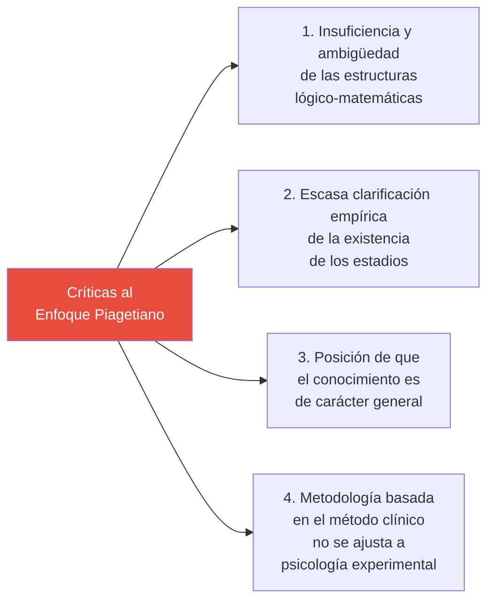

1. **Insuficiencia y ambigüedad explicativa** de las estructuras lógico-matemáticas para dar cuenta de los mecanismos de desarrollo cognitivo.
2. **Escasa clarificación empírica de la existencia de los estadios**: saltos o modos cualitativos diferentes en el funcionamiento cognitivo a través de la edad.
3. **Crítica a la posición de que el conocimiento es de carácter general**: hoy se considera que existen conocimientos de **dominio específico** (lenguaje, número, causalidad).
4. **Uso del método clínico**: rico cualitativamente, pero **no se ajusta a la psicología experimental**. Las técnicas de análisis de tareas ofrecen un conocimiento más detallado de los procesos subyacentes.

> **Punto fuerte de Faas:** Piaget pensaba que durante los primeros 18 meses el niño aprende solo a partir de sentidos y movimientos. Hoy sabemos que **muchas limitaciones cognitivas que él observó pueden haber sido consecuencia de habilidades motoras y lingüísticas inmaduras**, no de la ausencia de la capacidad cognitiva en sí.

### 4.3 Metodologías para investigar al lactante

Los investigadores del procesamiento de información desarrollaron técnicas que **no requieren respuestas motoras complejas**, lo que permite acceder a las capacidades cognitivas tempranas con menor "contaminación" por inmadurez motora.

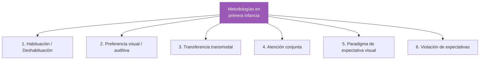

#### 4.3.1 Habituación y deshabituación

**Habituación:** tipo de aprendizaje en el que la **exposición repetida** a un estímulo **reduce, desacelera o detiene una respuesta**. La familiaridad induce pérdida de interés.

**Procedimiento típico:**

1. Se presenta repetidamente un estímulo (sonido, patrón visual, rostro).
2. Se monitorean respuestas: chupeteo, frecuencia cardíaca, movimientos oculares, actividad cerebral.
3. Al inicio, el estímulo capta atención (el bebé deja de chupetear, por ejemplo).
4. Tras varias presentaciones, ya no provoca esa interrupción → el bebé se **habituó**.

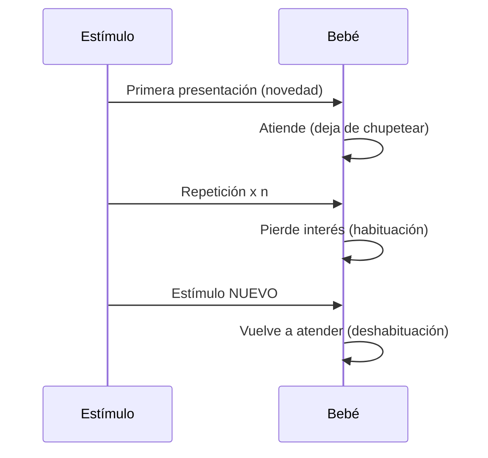

**Deshabituación:** **aumento en la respuesta** ante la presentación de un nuevo estímulo. Indica que el bebé **discrimina** entre el estímulo familiar y el nuevo.

**Valor predictivo:** la eficiencia de la habituación (velocidad para habituarse a lo familiar y recuperar atención ante lo nuevo) correlaciona con:

- Preferencia por la complejidad.
- Exploración rápida del ambiente.
- Juego complejo.
- Solución rápida de problemas.
- Capacidad para equiparar imágenes.
- **CI posterior** en la infancia (Bornstein & Sigman, 1986; McCall & Carriger, 1993).

#### 4.3.2 Preferencia visual y memoria de reconocimiento visual

**Preferencia visual:** tendencia a pasar más tiempo observando un tipo de estímulo que otro. Basada en la capacidad para hacer **distinciones visuales**.

Los recién nacidos (< 2 días) ya prefieren:

- Líneas curvas > rectas
- Patrones complejos > simples
- Objetos tridimensionales > bidimensionales
- Objetos en movimiento > estacionarios
- Configuraciones similares a rostros > otras
- **Estímulos nuevos > conocidos** (preferencia por la novedad)

**Memoria de reconocimiento visual:** se evalúa mostrando dos estímulos lado a lado (uno familiar y uno novedoso). Si el bebé **mira más al novedoso**, demuestra que reconoce al familiar. Depende de la **capacidad para formar y referirse a representaciones mentales**.

> **Implicación.** Al nacer o poco tiempo después existe **al menos una capacidad rudimentaria de representación** que se vuelve más eficiente. Esto contradice a Piaget, que ubicaba el comienzo de la representación al final del período sensoriomotor.

#### 4.3.3 Transferencia transmodal

**Capacidad para utilizar la información obtenida por medio de un sentido para guiar a otro.**

Ejemplos:

- Identificar visualmente un objeto que se tocó con los ojos cerrados.
- Mirar la cara de una persona que habla (audición → visión).
- Mirar las palmas de una persona que aplaude.

**Hallazgo clave:** bebés de **1 mes** transfieren información tacto → visión. Cuando chuparon un objeto rígido (cilindro de plástico) o flexible (esponja húmeda), miraron más al objeto que acababan de chupar (Gibson & Walker, 1984).

> **Contra Piaget.** Piaget consideraba que los sentidos no están conectados al nacer y se integran gradualmente por la experiencia. El hecho de que los neonatos asocien audición y vista (giran la cabeza hacia el sonido) y que haya transferencia tacto-visión al mes muestra que **la integración multisensorial comienza casi de inmediato**.

#### 4.3.4 Atención conjunta

**Capacidad de coordinar la atención entre participantes en relación con un objeto.** Es base para:

- La **interacción social**.
- La **adquisición del lenguaje**.
- La **comprensión de los estados mentales** de otras personas (Teoría de la mente).

**Desarrollo:** comienza a desarrollarse desde los **6 meses**, se consolida entre **10–12 meses**, cuando los bebés siguen la mirada de los adultos. La capacidad de seguir la mirada a los 10–11 meses **predice mayores puntuaciones en lenguaje** 8 meses después (Brooks & Meltzoff, 2005).

#### 4.3.5 Paradigma de expectativa visual

**Diseño:** aparecen brevemente imágenes generadas por computadora, alternativamente a derecha y a izquierda. La secuencia se repite.

**Mediciones:**

- **Tiempo de reacción visual:** cuán rápido cambia la mirada hacia una imagen que aparece.
- **Anticipación visual:** mirada hacia el lugar donde se espera que aparezca la siguiente imagen.

**Hallazgo:** tiempo de reacción y anticipación a los 3,5 meses **correlacionan con el CI a los 4 años** (Dougherty & Haith, 1997).

> **Contra Piaget en permanencia del objeto.** Piaget situaba la permanencia del objeto recién al final de las subetapas sensoriomotoras (cerca de los 18 meses para su forma plena). Con este paradigma y el de violación de expectativas se evidencia que al menos formas rudimentarias aparecen mucho antes.
>
> *Recordatorio piagetiano:*
> - Subetapas 1 y 2 (hasta 4 meses): seguimiento visual pero sin búsqueda ante desaparición.
> - Subetapa 3 (4–8 meses): se buscan objetos parcialmente ocultos.

#### 4.3.6 Violación de expectativas (Baillargeon)

**Procedimiento:**

1. **Fase de familiarización:** el bebé observa un evento normal hasta habituarse.
2. **Fase de prueba:** el evento cambia de forma que viola las expectativas (evento posible vs. evento imposible).

Se considera que el bebé "se sorprende" ante el evento imposible si lo mira más tiempo.

**Experimento clásico (Baillargeon & DeVos, 1991):**

A bebés de **3,5 meses** se les presentó una zanahoria deslizándose detrás de una pantalla con un corte grande en la parte superior:

- **Evento posible:** zanahoria corta pasa detrás sin aparecer por la abertura (era más baja que el corte).
- **Evento imposible:** zanahoria larga pasa detrás sin aparecer por la abertura (¡debería haber asomado!).

Los bebés miraron significativamente más el evento imposible.

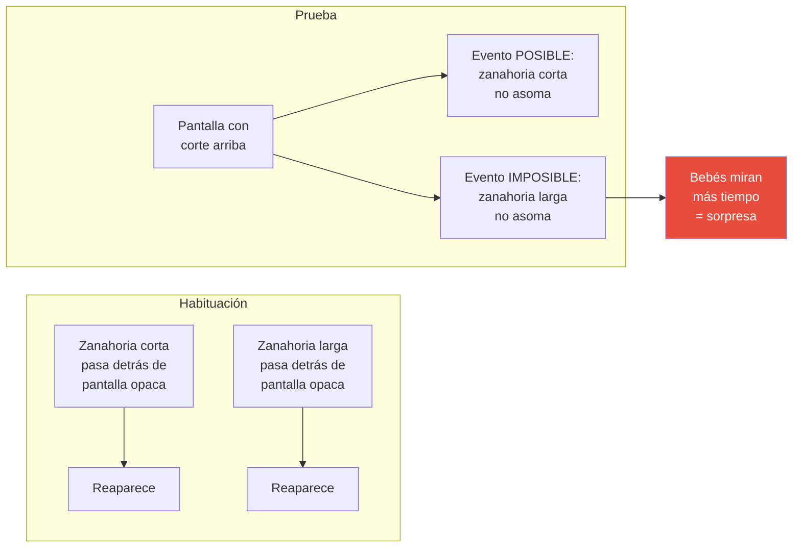

> **Conclusión de Baillargeon:** existe permanencia del objeto rudimentaria desde los 3,5–4 meses.
>
> **Matiz de Meltzoff (1998):** reconocer que el objeto que desaparece a un lado es el mismo que reaparece al otro **no necesariamente implica comprender que sigue existiendo detrás**. Pero al menos permite **inferir una forma rudimentaria** de permanencia.

**Otro experimento (Goubet & Clifton, 1998):** bebés de 6 meses vieron rodar una bola por una rampa hasta uno de dos agujeros, cada uno con sonido distinto. Al apagar la luz, los bebés buscaron la bola en el agujero correcto guiados solo por el sonido — la bola seguía existiendo, y sabían dónde.

### 4.4 Capacidades cognitivas tempranas reveladas por estos métodos

Resumen de cuándo emergen capacidades que Piaget situaba más tarde:

| Capacidad | Edad de aparición según método de procesamiento de información |
|---|---|
| Categorización | **3 meses** (categorías perceptuales) |
| Causalidad | **4–6 meses** (Leslie, 1982, 1984) |
| Permanencia del objeto | **3,5–4 meses** (rudimentaria, Baillargeon) |
| Comprensión numérica | **5 meses** (Wynn, 1992) |
| Integración multisensorial | **1 mes** (Gibson & Walker, 1984) |

**Implicación general:** los lactantes son **cognitivamente más capaces** de lo que Piaget imaginó. Las limitaciones que él observó probablemente reflejaron **habilidades lingüísticas y motoras inmaduras**, no ausencia de capacidad cognitiva.

> **Precaución teórica.** Que un bebé mire más un evento "imposible" puede indicar:
> - (a) Comprensión conceptual de cómo funcionan las cosas (interpretación fuerte de Baillargeon).
> - (b) Mera conciencia perceptual de que algo es inusual (interpretación cauta).
>
> La discusión sigue abierta. La estrategia más prudente es hablar de **formas rudimentarias** que se desarrollan progresivamente.

### 4.5 Procesamiento de la información en segunda y tercera infancia: las funciones ejecutivas

#### 4.5.1 Definición

**Función ejecutiva (FE):** control consciente de pensamientos, emociones y acciones para lograr metas o solucionar problemas (Luna et al., 2004; NICHD, 2005d; Zelazo & Müller, 2002).

Su desarrollo gradual desde la lactancia hasta la adolescencia va **a la par del desarrollo del cerebro**, en particular de la **corteza prefrontal** (planeación, juicio, toma de decisiones).

#### 4.5.2 Componentes nucleares

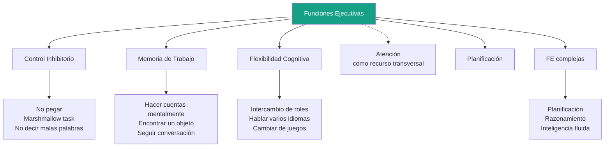

| Componente | Definición | Ejemplos cotidianos |
|---|---|---|
| **Control inhibitorio** | Supresión voluntaria de respuestas no deseadas | No pegar, prueba del marshmallow, no decir malas palabras |
| **Memoria de trabajo** | Almacenamiento a corto plazo de información que se procesa de manera activa | Hacer cuentas mentalmente, encontrar un objeto, seguir una conversación |
| **Flexibilidad cognitiva** | Capacidad de cambiar de perspectiva o estrategia | Intercambio de roles, hablar varios idiomas, cambiar de juegos |

**Funciones ejecutivas complejas:** planificación, razonamiento, inteligencia fluida (resultantes de la integración de las anteriores).

#### 4.5.3 Curso evolutivo

Según los datos de Anderson (2002), las distintas FE emergen y se desarrollan a ritmos distintos:

- **Control atencional:** se desarrolla muy temprano (avance pronunciado entre 1–5 años).
- **Procesamiento de información:** desarrollo intermedio.
- **Flexibilidad cognitiva:** desarrollo más tardío.
- **Establecimiento de metas / planificación:** la más tardía, con grandes avances entre 7–12 años.

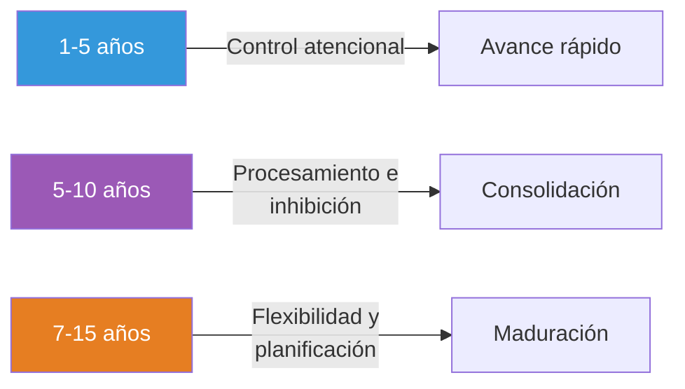

#### 4.5.4 Mejoras específicas en la tercera infancia

##### Atención selectiva

Capacidad para **dirigir la atención de manera deliberada** excluyendo distractores. Mejora porque:

- Madura el **control inhibitorio**.
- Los niños de 5° grado son más capaces que los de 1° de **impedir que información no deseada reingrese a la memoria de trabajo** (Harnishfeger & Pope, 1996).

##### Memoria de trabajo

Aumenta notablemente en la tercera infancia. Las mejoras conjuntas en **velocidad de procesamiento** y **capacidad de almacenaje** explican el desarrollo (Bayliss et al., 2005, estudio con 120 niños británicos de 6–10 años).

##### Metamemoria

**Conocimiento de los procesos de memoria.** Entre los 5–7 años los lóbulos frontales exhiben desarrollo y reorganización significativos, posibilitando una mejor metamemoria.

| Edad escolar | Conocimiento metamnémico |
|---|---|
| Jardín y 1° grado | Más tiempo de estudio = mejor recuerdo; las cosas se olvidan con el tiempo; reaprender es más fácil que aprender |
| 3° grado | Algunas personas recuerdan más fácilmente que otras; algunas cosas son más fáciles de recordar |

##### Estrategias mnemotécnicas

Recursos que auxilian a la memoria. Las cuatro estrategias más comunes:

| Estrategia | Definición | Desarrollo | Ejemplo |
|---|---|---|---|
| **Auxiliares externos** | Indicadores externos a la persona | 5–6 años ya pueden; 8 años más probable | Hacer una lista, accionar un temporizador |
| **Repaso** | Repetición consciente | A los 6 se les puede enseñar; 7 lo hacen espontáneamente | Repetir letras hasta saberlas |
| **Organización** | Agrupación por categorías | Mayoría no lo hace hasta los 10; antes se les puede enseñar | Recordar animales del zoo por clase (mamíferos, reptiles, etc.) |
| **Elaboración** | Asociar lo que se quiere recordar con algo más (frase, escena, historia) | Mayor uso en niños mayores | "Fantástico lápiz negro carbón" para reglas de acentuación |

> **Patrón evolutivo.** A medida que crecen, los niños:
> 1. Usan mejores estrategias.
> 2. Las aplican con más eficacia.
> 3. Las **personalizan** según la tarea.
> 4. **Generalizan**: si se les enseña una estrategia para una tarea, los mayores la transfieren a otras (Flavell et al., 2002).

#### 4.5.5 Procesamiento de la información y tareas piagetianas

Las mejoras en procesamiento explican avances que Piaget atribuía al desarrollo de estructuras lógicas:

- **Memoria de trabajo limitada** puede explicar fracaso en conservación: si el niño olvida que las dos bolas de plastilina eran originalmente idénticas, no puede resolverla.
- **Robbie Case** (neopiagetiano): cuando un esquema se automatiza, libera espacio en la memoria de trabajo para nueva información. Esto puede explicar el **décalage horizontal**: el niño debe poder usar una conservación sin razonamiento consciente antes de extender el esquema a otras conservaciones.

---

## 5. Enfoque de la neurociencia cognitiva

### 5.1 Caracterización

- Examina el **hardware** del sistema nervioso central.
- Busca identificar qué **estructuras cerebrales** participan en aspectos específicos de la cognición.
- **Confirma la idea piagetiana** de la importancia de la maduración en el desarrollo cognitivo.
- Evidencia **crecimientos cerebrales repentinos** (periodos de rápido crecimiento y desarrollo) que coinciden con los cambios cognitivos descritos por Piaget (Fischer & Rose, 1994, 1995).

### 5.2 Desarrollo del cerebro: principales hitos

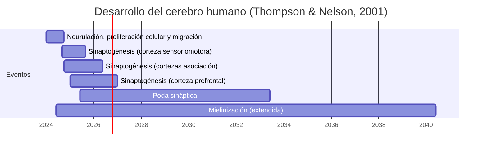

Etapas (de Thompson & Nelson, 2001):

1. **Neurulación, proliferación celular y migración** (prenatal).
2. **Sinaptogénesis** (formación de sinapsis dependiente de la experiencia): comienza antes del nacimiento, hace pico en distintos momentos según área (sensoriomotora antes, prefrontal después).
3. **Poda sináptica** (eliminación de sinapsis innecesarias).
4. **Mielinización**: comienza en la lactancia y continúa hasta la adultez temprana.

### 5.3 Sistemas de memoria a largo plazo

Los rastreos cerebrales confirman la existencia de **dos sistemas independientes** de memoria a largo plazo:

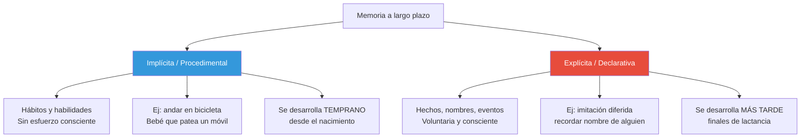

#### Memoria implícita (procedimental)
- **Recuerdo inconsciente**, sin esfuerzo activo.
- **Hábitos y habilidades**.
- Se desarrolla desde el nacimiento.
- Ejemplo: el bebé condicionado a patear ante el móvil de Rovee-Collier.

#### Memoria explícita (declarativa)
- **Rememoración consciente e intencional**.
- Hechos, nombres, acontecimientos.
- Evidencia de desarrollo: la **imitación diferida** de conductas complejas.
- Aparece a finales de la lactancia.

### 5.4 Estructuras cerebrales y memoria

#### El hipocampo
- Estructura situada profundamente en los lóbulos temporales.
- En la lactancia temprana, **las estructuras de memoria no están formadas por completo**: los recuerdos son fugaces.
- La maduración del **hipocampo** junto con las **estructuras corticales coordinadas por él** posibilita recuerdos más duraderos (Bauer, 2002).
- El sistema del hipocampo continúa desarrollándose hasta, al menos, los **5 años** (Serres, 2001).

#### La corteza prefrontal
- Porción grande del lóbulo frontal, directamente detrás de la frente.
- **Se desarrolla más lentamente que las demás regiones** (Johnson, 1998).
- Sustenta la **memoria de trabajo**: almacén a corto plazo de información que el cerebro procesa activamente.
- En la memoria de trabajo se preparan o recuperan las representaciones mentales para almacenarlas.

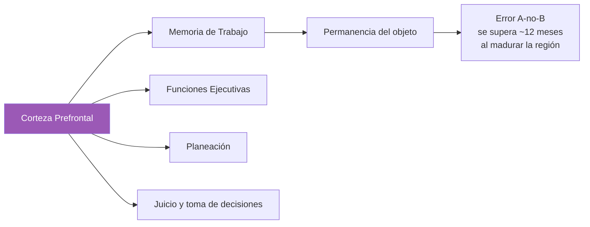

#### Vínculo con la permanencia del objeto y el error A-no-B
- La aparición relativamente tardía de la memoria de trabajo explica el lento desarrollo de la permanencia del objeto.
- **Para los 12 meses**, la corteza prefrontal está suficientemente desarrollada como para permitir al bebé **evitar el error A-no-B** mediante el control del impulso de buscar en el sitio donde antes encontró el objeto (Diamond, 1991).

> **Nota sobre el error A-no-B.** En el experimento clásico de Piaget, el bebé busca el objeto donde lo vio antes (A) aunque lo haya visto trasladar a un nuevo lugar (B). Aparece típicamente entre 8–12 meses (subetapa 4) y se supera cuando madura la corteza prefrontal.

---

## 6. Enfoque sociocontextual (complementario)

Aunque la clase se enfoca en los cuatro enfoques anteriores, conviene tener presente que la bibliografía (Papalia Cap. 7 y 10; Faas Cap. 9) incluye el **enfoque sociocontextual**, basado en Vygotsky, que estudia cómo el **contexto cultural** afecta las primeras interacciones sociales que promueven la competencia cognitiva.

### 6.1 Conceptos centrales

| Concepto | Definición |
|---|---|
| **Participación guiada** | Interacciones mutuas con adultos que ayudan a estructurar las actividades del niño y tienden un puente entre la comprensión del niño y la del adulto |
| **Zona de desarrollo proximal (ZDP)** | Diferencia entre lo que el niño puede hacer solo y lo que puede hacer con ayuda |
| **Andamiaje (scaffolding)** | Apoyo temporal del adulto que se va retirando a medida que el niño domina la tarea |

### 6.2 Hallazgos transculturales (Rogoff et al., 1993)

Estudio transcultural con bebés de 1–2 años en cuatro contextos:

| Cultura | Patrón de participación guiada |
|---|---|
| **Pueblo maya (Guatemala)** | Niños juegan solos mientras madres trabajan en casa; demostración no verbal, luego autonomía |
| **Pueblo tribal (India)** | Patrón similar: instrucción breve no verbal, madre disponible |
| **Salt Lake City (EE.UU.)** | Madres como pares, alabanzas, ánimo verbal; foco en juego infantil |
| **Turquía urbana** | Patrón intermedio entre los anteriores |

> **Conclusión.** El contexto cultural influye decisivamente en **cómo los cuidadores contribuyen al desarrollo cognitivo**. La participación directa del adulto en el juego es más típica de comunidades urbanas de clase media.

### 6.3 Construcción de recuerdos compartidos (Papalia Cap. 10)

**Modelo de interacción social** (basado en Vygotsky): los niños construyen sus recuerdos autobiográficos **en colaboración** con padres u otros adultos a medida que hablan acerca de eventos compartidos (Nelson, 1993a).

- Los adultos proporcionan un **andamiaje verbal** que ayuda al niño a enfocarse, organizar el recuerdo y compararlo con lo que ellos recuerdan.
- Los niños aprenden cómo se organizan los recuerdos en la **forma narrativa** propia de su cultura.

**Diferencias culturales en recuerdos** (Wang, 2004):

| Niños euroestadounidenses | Niños chinos |
|---|---|
| Narrativas más largas y detalladas | Recuentos más breves y concisos |
| Eventos particulares | Rutinas cotidianas, actividades grupales |
| Más opiniones y emociones | Foco en roles e interacciones sociales |
| El niño es protagonista | El niño comparte escenario con otros |
| Madres con estilo elaborado | Madres con preguntas sugestivas |

---

## 7. Síntesis comparativa final

### 7.1 ¿Cómo se relacionan los enfoques con Piaget?

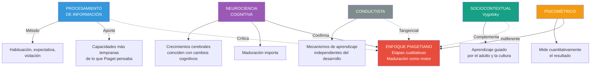

### 7.2 Tabla síntesis de los enfoques

| Enfoque | Postura frente a Piaget | Aporte clave | Limitación |
|---|---|---|---|
| **Conductista** | Indiferente (no estudia desarrollo) | Mecanismos básicos del aprendizaje | No explica cambios cualitativos |
| **Psicométrico** | Indiferente | Medición cuantitativa, predicción | No mide capacidad innata |
| **Procesamiento de información** | **Crítico**: las limitaciones cognitivas son por inmadurez motora/lingüística | Capacidades tempranas (categorización, causalidad, permanencia, número) | Riesgo de sobre-interpretar el mirar más como "comprender" |
| **Neurociencia cognitiva** | **Confirma** la importancia de la maduración | Sustrato biológico de la cognición | No explica diferencias individuales o ambientales |
| **Sociocontextual** | **Complementa**: el otro/la cultura como motor | Importancia del adulto y la cultura | Difícil cuantificación |

### 7.3 Las grandes preguntas abiertas

1. **¿Cuándo aparece realmente cada capacidad cognitiva?** Las técnicas modernas anticipan la aparición; pero distinguir entre "discriminación perceptual" y "comprensión conceptual" sigue siendo polémico.
2. **¿Inteligencia única o múltiples inteligencias?** La discusión Gardner / Sternberg / críticos (Waterhouse) continúa.
3. **¿Cuál es la relación entre inteligencia y funciones ejecutivas?** Pregunta abierta sugerida en la clase.
4. **¿Las pruebas psicométricas siguen siendo válidas en contextos culturales diversos?** Las pruebas dinámicas y culturalmente pertinentes ofrecen alternativas, pero las psicométricas siguen dominando por su consolidación, investigación exhaustiva y disponibilidad.

---

## 8. Glosario de términos clave

### Enfoque conductista

- **Amnesia infantil:** incapacidad para recordar acontecimientos previos a los ~2 años.
- **Condicionamiento clásico:** aprendizaje por asociación entre estímulos. Sujeto pasivo.
- **Condicionamiento operante:** aprendizaje por reforzamiento o castigo. Sujeto activo.
- **Reforzamiento positivo / negativo:** agregar / quitar un estímulo para **aumentar** una conducta.
- **Castigo positivo / negativo:** agregar / quitar un estímulo para **reducir** una conducta.

### Enfoque psicométrico

- **Andamiaje:** apoyo temporal del adulto que se retira gradualmente.
- **Comportamiento inteligente:** conducta orientada a metas y adaptativa.
- **Conocimiento tácito** (Sternberg): información que no se enseña formalmente pero se necesita para tener éxito.
- **Culturalmente justa:** prueba que utiliza experiencias comunes a diversas culturas.
- **Culturalmente libre:** prueba sin contenido cultural (ideal inalcanzable).
- **Culturalmente pertinente:** prueba que toma en cuenta las tareas adaptativas de cada cultura.
- **Escalas Bayley del Desarrollo Infantil:** prueba estandarizada (1 mes – 3,6 años).
- **Escalas de Inteligencia Stanford-Binet:** prueba individual desde los 2 años.
- **Escala Wechsler (WPPSI-III, WISC-IV):** pruebas individuales por rangos etarios.
- **HOME:** instrumento para medir la influencia del ambiente del hogar.
- **Inteligencia exitosa** (Sternberg): habilidades para el éxito en un contexto social y cultural particular.
- **OLSAT8:** prueba grupal desde jardín a 12° grado.
- **Pruebas de CI:** pruebas psicométricas que comparan el desempeño con normas estandarizadas.
- **Pruebas dinámicas:** basadas en la ZDP, miden potencial más que aprovechamiento.
- **Sesgo cultural:** tendencia de pruebas a incluir reactivos más familiares a algunos grupos.
- **Teoría de inteligencias múltiples** (Gardner): ocho tipos de inteligencia.
- **Teoría triárquica** (Sternberg): inteligencia componencial, experiencial y contextual.
- **Zona de desarrollo proximal (ZDP):** diferencia entre desempeño autónomo y con ayuda.

### Enfoque del procesamiento de la información

- **Atención conjunta:** coordinación de la atención sobre un objeto entre participantes. Base de interacción social, lenguaje y teoría de la mente.
- **Atención selectiva:** capacidad para dirigir la atención excluyendo distractores.
- **Categorización:** división del mundo en categorías significativas; base de pensamiento, lenguaje, memoria.
- **Control inhibitorio:** supresión voluntaria de respuestas no deseadas.
- **Deshabituación:** aumento de la respuesta ante un nuevo estímulo.
- **Elaboración:** mnemotécnica que asocia el material con escenas o historias.
- **Estrategias mnemotécnicas:** técnicas para ayudar a la memoria.
- **Flexibilidad cognitiva:** capacidad de cambiar perspectiva o estrategia.
- **Función ejecutiva:** control consciente de pensamientos, emociones y acciones para alcanzar metas.
- **Habituación:** reducción de la respuesta tras exposición repetida a un estímulo.
- **Memoria de reconocimiento visual:** distinción entre estímulo familiar y novedoso.
- **Metamemoria:** conocimiento de los procesos de memoria.
- **Organización:** mnemotécnica que agrupa material por categorías.
- **Paradigma de expectativa visual:** mide tiempo de reacción y anticipación visual.
- **Permanencia del objeto** (revisada): formas rudimentarias aparecen desde los 3,5–4 meses.
- **Preferencia visual:** tendencia a mirar más un tipo de estímulo que otro.
- **Repaso:** mnemotécnica de repetición consciente.
- **Transferencia transmodal:** uso de información de un sentido para guiar a otro.
- **Violación de expectativas:** método donde la deshabituación a un evento "imposible" se toma como evidencia de comprensión rudimentaria.

### Enfoque de la neurociencia cognitiva

- **Corteza prefrontal:** región frontal asociada a memoria de trabajo, FE, planeación, juicio.
- **Hipocampo:** estructura del lóbulo temporal; clave para memoria explícita.
- **Memoria declarativa / explícita:** rememoración consciente de hechos, nombres, eventos.
- **Memoria de trabajo:** almacén a corto plazo de información en procesamiento activo.
- **Memoria procedimental / implícita:** recuerdo inconsciente de hábitos y habilidades.
- **Mielinización:** recubrimiento de los axones que acelera la transmisión neural.
- **Poda sináptica:** eliminación de sinapsis innecesarias.
- **Sinaptogénesis:** formación de sinapsis.

### Enfoque sociocontextual

- **Modelo de interacción social:** los recuerdos autobiográficos se construyen en colaboración con adultos.
- **Participación guiada:** interacción mutua con adultos que estructura la actividad del niño.

---

## Referencias

- Faas, A. E. (2018). *Psicología del desarrollo de la niñez*. Cap. 9: "Posturas postpiagetianas: Desafiando las competencias cognitivas del bebé".
- Papalia, D. E., Wendkos Olds, S., & Duskin Feldman, R. (2009a). *Desarrollo Humano* (11ª ed.). McGraw-Hill.
  - Capítulo 7: "Desarrollo cognitivo durante los primeros tres años" (pp. 195–202; 211–220).
  - Capítulo 10: "Desarrollo cognitivo en la segunda infancia" (pp. 309–311).
  - Capítulo 13: "Desarrollo cognitivo en la tercera infancia" (pp. 389–399).
- Carretero, M. (1998). *Procesos de enseñanza y aprendizaje*. (Citado en Faas, 2018).
- Anderson, P. (2002). Assessment and development of executive function (EF) during childhood. *Child Neuropsychology*, 8(2), 71–82. (Diagrama del desarrollo de las FE).
- Thompson, R. A., & Nelson, C. A. (2001). Developmental science and the media: Early brain development. *American Psychologist*, 56(1), 5–15. (Gráfico del desarrollo cerebral).
- Waterhouse, L. (2023). Why multiple intelligences theory is a neuromyth. *Frontiers in Psychology*, 14, 1217288. https://doi.org/10.3389/fpsyg.2023.1217288

---

> **Nota de estudio:** este documento integra el contenido de la presentación de la clase con los desarrollos más profundos de la bibliografía. Para examen, atender especialmente:
>
> 1. Las **cuatro críticas de Carretero a Piaget** (Faas Cap. 9).
> 2. Las **metodologías del procesamiento de información** y qué demuestra cada una.
> 3. La **distinción entre los tres componentes de FE** (control inhibitorio, memoria de trabajo, flexibilidad cognitiva).
> 4. Las **polémicas del CI** (tres ejes: tiempo, conocimiento, constructo único).
> 5. Las **diferencias entre memoria implícita y explícita** y sus sustratos cerebrales.
> 6. Los **conceptos sternberguianos** de inteligencia exitosa, conocimiento tácito y teoría triárquica.
