# Guía de Estudio: Desarrollo Cognitivo según Piaget

**Psicología Evolutiva - Unidad 5**

---

## 🎯 Introducción: ¿Quién fue Piaget y qué estudió?

Jean Piaget fue un psicólogo suizo que creó la **psicología genética** (del término "génesis" = origen/desarrollo, no de "genes"). 

**Su descubrimiento clave:** Le llamó la atención que numerosos niños cometían **los mismos errores** cuando debían responder determinadas preguntas. No le interesaban tanto las respuestas correctas, sino **por qué pensaban de esa manera**.

**¿Qué estudia la psicología genética?**
- El **crecimiento mental** = desarrollo de las conductas
- Cómo el niño se vuelve un adulto inteligente (ontogenia)
- La relación entre desarrollo físico, maduración del sistema nervioso y la influencia del ambiente

---

## 📚 Conceptos Fundamentales

### Inteligencia según Piaget

**Definición:** Constante adaptación de los esquemas internos al mundo externo mediante el **equilibrio entre asimilación y acomodación**.

### Los Tres Pilares del Desarrollo Cognitivo

#### 1️⃣ **ESQUEMAS**
- Patrones organizados de pensamiento y conducta
- Se repiten en situaciones similares
- **Ejemplo:** En el recién nacido, los reflejos son sus primeros esquemas
- **Evolución:** De esquemas motores → esquemas simbólicos → esquemas operatorios

#### 2️⃣ **ASIMILACIÓN**
- Incorporar información del mundo exterior a las estructuras ya construidas
- **Ejemplo:** El bebé que chupa todo lo que agarra (usa su esquema de succión para explorar objetos nuevos)
- Predomina cuando el niño aplica lo que ya sabe a situaciones nuevas

#### 3️⃣ **ACOMODACIÓN**
- Reajustar las estructuras construidas en función de las transformaciones experimentadas
- **Ejemplo:** El bebé descubre que algunos objetos se chupan diferente (biberón vs. chupete) y modifica su técnica
- Predomina cuando el niño debe cambiar sus esquemas para adaptarse a la realidad

### Equilibrio: El Motor del Desarrollo

El desarrollo cognitivo ocurre buscando el **equilibrio** entre asimilación y acomodación:
- Demasiada asimilación → el niño no aprende cosas nuevas (repite lo mismo)
- Demasiada acomodación → el niño no puede dar sentido a lo nuevo
- **Equilibrio óptimo** → crecimiento cognitivo

---

## 🧩 Los Cuatro Estadios del Desarrollo Cognitivo

| Estadio | Edad | Característica Principal |
|---------|------|-------------------------|
| **Sensoriomotor** | 0-2 años | Inteligencia práctica, sin función simbólica |
| **Preoperatorio** | 2-7 años | Función simbólica, pensamiento intuitivo |
| **Operatorio Concreto** | 7-12 años | Operaciones lógicas con objetos concretos |
| **Operaciones Formales** | 12+ años | Pensamiento abstracto e hipotético |

---

## 👶 ESTADIO I: SENSORIOMOTOR (0-2 años)

**Características generales:**
- Aprendizaje por medio de los sentidos y la actividad motora
- Respuestas principalmente reflejas al principio → comportamiento orientado a objetivos al final
- **Sin función simbólica:** la inteligencia es práctica (resolución de problemas mediante acción)
- No puede pensar en objetos ausentes

### Los 6 Subestadios del Sensoriomotor

#### **Subestadio I: Ejercicio de reflejos (0-1 mes)**

**¿Qué hace el bebé?**
- Reflejos innatos y acciones espontáneas frente a estímulos
- **Ejemplo:** Reflejo de succión, prensión, Moro

**Logro clave:**
- Cierto control sobre reflejos → puede chupar incluso cuando no tiene hambre
- Extensión del esquema reflejo a nuevas situaciones

**Limitación:**
- No hay conducta intencionada
- Asimilación y acomodación no están diferenciados

---

#### **Subestadio II: Reacciones Circulares Primarias (1-4 meses)**

**¿Qué son las RC primarias?**
- Repetición de una sensación física agradable lograda **por azar**
- **"Primarias"** porque están centradas en el **propio cuerpo**

**Ejemplos:**
- El bebé chupa el pulgar accidentalmente → le gusta → intenta repetirlo
- Mueve las manos frente a sus ojos → le resulta interesante → lo repite

**Logro clave:**
- Primeras adaptaciones adquiridas = **hábitos**
- Puede chupar de manera diferente el pecho, el biberón, el chupete

**Tipo de asimilación:**
- Asimilación **generalizadora** sobre acomodación (repite más de lo que modifica)

---

#### **Subestadio III: Reacciones Circulares Secundarias (4-8 meses)**

**¿Qué son las RC secundarias?**
- Repetición de acciones voluntarias centradas en el **mundo exterior**
- **"Secundarias"** porque están dirigidas a objetos externos

**Diferencia con RC primarias:**
| RC Primarias | RC Secundarias |
|--------------|----------------|
| En el propio cuerpo | En objetos externos |
| Involuntarias al inicio | Voluntarias |
| Ej: chupar el pulgar | Ej: agitar un sonajero |

**Ejemplos:**
- Agita un sonajero y le gusta el sonido → sigue agitándolo
- Patea un móvil y se mueve → sigue pateando

**Logro clave:**
- Mayor interés por el entorno
- Coordinación mano-visión
- Enriquecimiento de esquemas

**Limitación importante:**
- **No hay diferencia entre medios y fines** (no planifica para lograr algo)
- Repite acciones agradables pero sin intención previa

---

#### **Subestadio IV: Coordinación de Esquemas Secundarios (8-12 meses)**

**🌟 HITO CRUCIAL: Aparición de la conducta INTENCIONAL**

**¿Qué significa conducta intencional?**
- **Deliberada y premeditada**
- El bebé **identifica el fin ANTES** de actuar
- Luego **selecciona los medios** para alcanzarlo

**Ejemplo paradigmático:**
- Ve un juguete detrás de un cojín
- **Primero decide:** "Quiero ese juguete" (fin)
- **Luego actúa:** Levanta el cojín (medio) para alcanzarlo

**Diferencia clave con Subestadio III:**
| Subestadio III | Subestadio IV |
|----------------|---------------|
| Acción → resultado agradable → repite | Objetivo → selección de medio → acción |
| Sin planificación | Con planificación |

**Logros adicionales:**
- Coordinación viso-motriz mejorada
- Anticipación de eventos
- **Persistencia en metas** (no renuncia fácilmente)

**Fenómeno importante: Error A-no-B**
1. Se oculta un objeto en posición A → el bebé lo busca en A ✓
2. **Delante del bebé**, se mueve el objeto a posición B
3. El bebé busca... ¡en A! ✗

**Interpretación de Piaget:**
- Para el bebé, la posición del objeto depende de sus **acciones previas**, no de los desplazamientos autónomos del objeto
- El objeto aún no tiene plena autonomía espacial

**Reinterpretación moderna (Esther Thelen):**
- No es solo lo que el bebé "sabe", sino también memoria motora y tiempo de demora
- Con demora corta → busca en B
- Con demora mayor → la memoria motora lo inclina a A

---

#### **Subestadio V: Reacciones Circulares Terciarias (12-18 meses)**

**¿Qué son las RC terciarias?**
- **Experimentación activa:** "experimentos para ver"
- Varía la acción intencionalmente para observar diferentes resultados
- Ya no solo repite lo agradable, sino que **innova**

**Diferencia clave:**
| RC Secundarias | RC Terciarias |
|----------------|---------------|
| Repetir lo mismo | Variar para experimentar |
| "Hago X y pasa Y" | "¿Qué pasa si cambio X?" |

**Ejemplos:**
- Tira un juguete desde diferentes alturas para ver qué pasa
- Golpea objetos con diferente fuerza para escuchar distintos sonidos

**Logro fundamental:**
- **Exploración con ensayo y error** para resolver problemas
- Diferenciación de esquemas: descubre **nuevos medios** para alcanzar fines

**Las 3 conductas instrumentales paradigmáticas:**

1. **Conducta del soporte:**
   - Tira de una alfombra para acercar un objeto colocado encima
   - **Limitación:** Solo funciona si hay contacto físico (objeto SOBRE la alfombra)

2. **Conducta del cordel:**
   - Tira de una cuerda atada al objeto

3. **Conducta del bastón** (la más compleja):
   - Usa un palo para alcanzar un objeto lejano
   - Requiere mayor comprensión de relaciones espaciales

**Logros adicionales:**
- Adquisición de posición erecta y marcha → mayor exploración
- Clara distinción asimilación/acomodación

**Contraste con causalidad del Subestadio III:**
- **Subestadio III:** Causalidad mágico-fenoménica (cualquier cosa puede causar cualquier cosa)
- **Subestadio V:** Causalidad más espacializada (necesita contacto o conexión física)

---

#### **Subestadio VI: Combinaciones Mentales (18-24 meses)**

**🚀 TRANSICIÓN AL PENSAMIENTO REPRESENTACIONAL**

**Logro revolucionario:**
- **Capacidad representacional y simbólica**
- Puede manipular objetos/eventos **mentalmente**, no solo mediante acción física
- Supera el ensayo y error gracias a la **combinación mental**

**Características:**
- Puede pensar en acciones **antes** de realizarlas
- Puede **recordar** acciones pasadas
- Aparece la **comprensión súbita** o **insight**

**Ejemplo paradigmático: Lucienne (hija de Piaget):**
1. Lucienne ve un dedal dentro de una caja entreabierta
2. Primero intenta abrirla por tanteo (conducta del Subestadio V) → fracasa
3. **Se detiene, examina la situación**
4. Abre y cierra lentamente su **boca** (como imitando la abertura que necesita)
5. Entonces desliza el dedo en la hendidura y logra abrir la caja

**Interpretación:**
- La imitación con la boca = **representación mental** de la acción necesaria
- Ya no necesita probar físicamente todas las opciones

**Otros logros del Subestadio VI:**
- **Permanencia completa del objeto** (incluyendo desplazamientos invisibles)
- **Imitación diferida** (imitar algo visto horas o días antes)
- **Invención de medios nuevos** mediante combinación mental

---

### 🌍 Las 4 Grandes Conquistas del Sensoriomotor

#### **1. DESCENTRAMIENTO: La "Revolución Copernicana"**

**Universo inicial (0-4 meses):**
- Egocentrismo total e inconsciente
- Sin conciencia del "yo"
- No distingue entre él y el mundo
- Su cuerpo es la única realidad
- Universo = sensaciones corporales propias

**Proceso de descentración (Subestadios I-V):**
- Descubrimiento progresivo de que los objetos existen independientemente
- Comprensión de que él es **un objeto entre otros**

**Universo final (hacia los 2 años):**
- El niño es un objeto entre otros objetos
- Universo formado por objetos permanentes
- Espacio y tiempo objetivos
- Causalidad espacializada (localizada en los objetos)

**Analogía "Revolución Copernicana":**
- Copérnico destronó a la Tierra del centro del universo
- El niño "destrona" su cuerpo como centro de la realidad

---

#### **2. PERMANENCIA DEL OBJETO**

**Definición:** Comprensión de que un objeto sigue existiendo aunque esté fuera de la vista.

**Evolución por subestadios:**

| Subestadio | Edad | Conducta observada |
|------------|------|-------------------|
| **I y II** | 0-4m | Seguimiento visual, pero **ningún intento de búsqueda** si desaparece. Universo de "cuadros" móviles e inconsistentes |
| **III** | 4-8m | Busca objetos **parcialmente** ocultos. Si lo deja caer y no lo ve, **actúa como si no existiera** |
| **IV** | 8-12m | Busca objetos completamente ocultos, pero **comete el error A-no-B** |
| **V** | 12-18m | **Supera el error A-no-B**: busca en el último lugar donde lo vio ocultar. Pero **no considera desplazamientos invisibles** |
| **VI** | 18-24m | **Permanencia plena**: busca considerando desplazamientos invisibles |

**Ejemplo de desplazamiento invisible (Subestadio VI):**
1. El adulto toma un objeto, lo mete en su mano cerrada
2. Pone la mano bajo una manta (sin que el niño vea el objeto salir)
3. Deja el objeto bajo la manta y saca la mano vacía
4. El niño busca... ¡bajo la manta! (infiere el desplazamiento que no vio)

---

#### **3. ESPACIO Y TIEMPO: Del Caos a la Organización**

**Situación inicial:**
- **NO existe un espacio único**
- Espacios heterogéneos, no coordinados:
  - Espacio bucal (lo que toca con la boca)
  - Espacio táctil (lo que toca con las manos)
  - Espacio visual
  - Espacio auditivo
  - Espacio postural
- Todos centrados en el **propio cuerpo**

**Proceso de coordinación:**
1. Coordinación progresiva y parcial (ej: espacio bucal + táctil)
2. Se necesita el **objeto permanente** para una coordinación definitiva
3. Organización del **grupo práctico de desplazamientos** (Subestadios V-VI)

**¿Qué es el Grupo Práctico de Desplazamientos (GPD)?**

Es una estructura mental que permite al niño:
- **Coordinar desplazamientos:** AB + BC = AC
- **Desplazamiento nulo:** A → A (quedarse en el mismo lugar)
- **Asociatividad:** (AB + BC) + CD = AB + (BC + CD)
- **Reversibilidad:** A → B es reversible como B → A

**Importancia del GPD:**
- Es la **fuente de futuras operaciones** mentales
- Pre-configura la reversibilidad del pensamiento operatorio

**Ejemplo práctico:**
- El niño puede ir de su cuarto (A) al comedor (B), del comedor a la cocina (C), y sabe volver de la cocina directo a su cuarto (A), sin pasar necesariamente por B

---

#### **4. CAUSALIDAD**

**Evolución lenta desde los 4 meses:**

**Subestadio III (4-8m): Causalidad Mágico-Fenoménica**
- Su cuerpo es la única causa (no hay descentramiento)
- **Mágico** = no considera causas espaciales
- **Fenoménica** = cualquier cosa puede producir cualquier otra

**Ejemplo:**
- El bebé patea y el móvil se mueve
- Luego, cuando ve el móvil quieto, patea esperando que se mueva
- No entiende que debe haber **contacto espacial** para que funcione

**Subestadios IV-V (8-18m): Transición**
- Mayor conciencia de agentes externos
- Pero aún centrado en su acción

**Subestadio VI (18-24m): Causalidad Objetiva y Espacializada**
- Comprende que las causas están en los objetos, no en su acción
- Necesita **contacto espacial** o mecanismo visible
- Logro alrededor de los 12-18 meses

---

#### **5. IMITACIÓN**

**Importancia:** Es una manera fundamental de aprendizaje.

**Evolución:**

| Tipo de Imitación | Edad | Características |
|-------------------|------|----------------|
| **Imitación visible** | ~9 meses (Subestadio IV) | Imita gestos que puede ver en sí mismo (ej: abrir/cerrar mano) |
| **Imitación invisible** | ~9 meses (Subestadio IV) | Imita gestos que NO ve en sí mismo (ej: sacar la lengua, gestos faciales) |
| **Imitación diferida** | 18-24 meses (Subestadio VI) | Imita algo visto horas o días antes, en ausencia del modelo |

**Nota sobre imitación neonatal (Meltzoff):**
- Investigaciones modernas muestran que bebés de 2 meses pueden imitar gestos faciales
- Piaget no creía en imitación tan temprana
- Debate actual: ¿es imitación refleja o verdadera imitación?

**Importancia de la imitación diferida:**
- Requiere **representación mental** del modelo
- Es una manifestación de la **función simbólica emergente**

---

## 🎨 ESTADIO II: PREOPERATORIO (2-7 años)

**Características generales:**
- Aparición de la **función simbólica/semiótica**
- Pensamiento intuitivo (no lógico aún)
- Centrado y egocéntrico
- Dificultad para comprender transformaciones

### 🔑 La Función Simbólica/Semiótica

**Definición:** Capacidad de emplear símbolos o representaciones mentales para pensar en las cosas **sin que estén físicamente presentes**.

**Logro fundamental:**
- Representarse la realidad como separada de sí mismo
- Diferenciación entre **significante** (representación) y **significado** (cosa representada)

**Evolución significante-significado:**

| Etapa Sensoriomotora | Etapa Preoperatoria |
|---------------------|---------------------|
| Indiferenciados (índices y señales) | Más diferenciados |
| Ej: humo = fuego (conexión causal directa) | Símbolos parcialmente diferenciados Signos bien diferenciados |

**Diferencia SIGNO vs. SÍMBOLO:**

- **SIGNO:** Arbitrario, convencional, compartido socialmente
  - Ej: la palabra "perro" no se parece a un perro
  - Ej: señal de tránsito

- **SÍMBOLO:** Motivado, tiene algún parecido con lo que representa
  - Ej: el dibujo de un perro
  - Ej: el juego simbólico (hacer "brrrum" con un auto de juguete)

---

### Las 5 Manifestaciones de la Función Simbólica

Piaget plantea una **evolución** entre distintas manifestaciones:

#### **1. IMITACIÓN DIFERIDA**

**¿Qué es?**
- Evoluciona desde la imitación directa del sensoriomotor
- Imitar **en ausencia del modelo**

**Progresión:**
1. Primero: demora en la imitación
   - Ej: Saluda cuando la persona ya se fue
2. Luego: imitación simbólica
   - Ej: Saluda sin que el otro haya hecho el gesto

**Relación asimilación-acomodación:**
- Imitación **con modelo** → predomina **asimilación**
- Imitación **sin modelo** → predomina **acomodación**

---

#### **2. IMAGEN MENTAL**

**Definición:** Representación interna de un objeto o fenómeno.

**Características importantes:**
- Vinculada más a la **acción** que a la percepción
- Se deriva de la **imitación interiorizada** del modelo
- No es una "fotografía mental", sino reconstrucción activa

**Tipos de imágenes mentales:**

**Reproductoras:**
- **Estáticas:** Imagen de un objeto en reposo
- **Cinéticas:** Imagen de un movimiento conocido

**Anticipadoras:**
- **Cinéticas:** Imaginar un movimiento nunca visto
- **De transformación:** Imaginar transformaciones de objetos

**Ejemplo:**
- El niño puede imaginar su casa (imagen estática)
- Puede imaginar el camino de casa al colegio (imagen cinética reproductora)
- Le cuesta imaginar cómo se vería su habitación pintada de otro color (imagen anticipadora de transformación)

---

#### **3. DIBUJO**

**Características:**
- Implica un esfuerzo por **imitar lo real**
- Involucra progresivas mejoras a nivel motor Y cognitivo
- Evoluciona en fases conocidas del desarrollo artístico

**Recordar fases del desarrollo del dibujo:**
1. Garabateo (2-4 años)
2. Pre-esquemático (4-7 años)
3. Esquemático (7-9 años)
4. Realismo incipiente (9-12 años)

**Importancia:**
- El dibujo refleja cómo el niño **piensa** sobre el objeto, no solo cómo lo ve
- Ej: Dibuja transparencias (se ven las piernas a través de la ropa)

---

#### **4. JUEGO SIMBÓLICO**

**Características:**
- Imitación del modelo interiorizado
- Predomina la **asimilación** sobre la acomodación

**Funciones importantes:**
1. **Representación de roles adultos**
   - Ej: jugar a la mamá, al doctor, al maestro
   
2. **Representación de conflictos, angustias, sentimientos**
   - Permite elaborar experiencias difíciles
   - Ej: después de ir al médico, "es el doctor" con sus muñecos

**Ejemplos:**
- Hacer sonidos de animales mientras juega
- Usar una caja como si fuera un auto
- Alimentar a un muñeco imaginando que come

**Valor terapéutico:**
- Permite al niño ser activo en situaciones donde fue pasivo
- Procesar experiencias emocionalmente significativas

---

#### **5. LENGUAJE**

**Características únicas:**
- Sistema **arbitrario** de signos y símbolos
- **No implica imitación pura** (a diferencia de las otras 4 manifestaciones)
- Imposible sin algún grado de pensamiento simbólico

**Importancia especial:**
- Permite la comunicación de representaciones
- Acelera el pensamiento
- Permite pensar en lo ausente
- Posibilita el diálogo interno

**Relación con el pensamiento:**
- Para Piaget: el lenguaje **acompaña** el desarrollo cognitivo, no lo causa
- El pensamiento simbólico debe emerger primero
- Luego el lenguaje lo potencia

---

### Las Dos Fases del Pensamiento Preoperacional

#### **Fase 1: PRECONCEPTUAL (2-4 años)**

**Características principales:**

1. **Pensamiento basado en preconceptos o "imágenes tipo"**
   - No son conceptos verdaderos ni individuos
   - Ej: "mi perro" puede ser cualquier perro similar
   - Confunde lo particular con lo general

2. **Razonamiento transductivo**
   - **NO** es inductivo (de casos particulares a regla general)
   - **NO** es deductivo (de regla general a casos particulares)
   - Es de particular a particular, sacando conclusiones erróneas
   
   **Ejemplo:**
   - "Ayer no dormí siesta y no se hizo de noche"
   - "Hoy no duermo siesta y no se hará de noche"
   - (Confunde correlación con causalidad)

3. **Pensamiento egocéntrico intenso**
   - Asume que todos piensan, perciben y sienten como él
   - Dificultad para tomar la perspectiva del otro

4. **Centración del pensamiento**
   - Se enfoca en UN aspecto de la situación
   - Descuida los restantes

5. **Desarrollo acelerado del lenguaje**
   - Mejora el pensamiento, pero también lo limita
   - Puede confundir nombres con esencias

---

#### **Fase 2: INTUITIVO (4-7 años)**

**Avances respecto a la fase preconceptual:**

1. **Pueden centrarse en DOS dimensiones**
   - Ej: alto Y ancho (aunque no simultáneamente)
   - Comienza la descentración

2. **Mejor comprensión causa-efecto**
   - Ya no es tan mágico-fenoménico
   - Entiende relaciones más concretas

3. **Función simbólica en apogeo**
   - El juego simbólico es muy elaborado
   - Historias y narrativas complejas

4. **Menos egocentrismo** (aunque continúa)
   - Puede considerar algunas perspectivas ajenas
   - Pero sigue siendo difícil

5. **Dependencia funcional**
   - Entiende que hay relaciones entre variables
   - Pero no puede cuantificarlas

**⚠️ Limitación persistente:**
- Sigue siendo pensamiento **intuitivo**, no lógico
- No puede realizar operaciones mentales reversibles

---

### 📊 Logros del Estadio Preoperatorio

| Logro | Descripción | Ejemplo |
|-------|-------------|---------|
| **Uso de símbolos** | No necesitan contacto con un objeto para pensar en él | Preguntan sobre los elefantes del circo que vieron meses atrás |
| **Discernimiento de identidades** | Las modificaciones superficiales no alteran la naturaleza | El papá se viste de pirata pero sigue siendo el mismo |
| **Entendimiento causa-efecto** | Los eventos tienen causas y efectos | Al ver una pelota rodar detrás de una pared, busca a quien la pateó |
| **Clasificación** | Organización de objetos en categorías | Clasificación en dos montones: "grandes" y "pequeños" |
| **Noción de número** | Pueden contar y manejar cantidades pequeñas | Reparte caramelos y los cuenta |
| **Empatía** | Capacidad de imaginar cómo se sienten los demás | Consuela a un amigo triste |
| **Teoría de la mente** | Conciencia de que otros piensan diferente | Oculta galletas en un lugar donde su hermano no las buscará |

---

### ❌ Limitaciones del Estadio Preoperatorio

#### **1. CENTRACIÓN**
- **Qué es:** Se enfoca en UN aspecto, descuidando los demás
- **Ejemplo:** Cree que hay más jugo en el vaso alto (ignora el ancho)

#### **2. IRREVERSIBILIDAD**
- **Qué es:** No comprende que se puede revertir una operación
- **Ejemplo:** No entiende que el jugo puede devolverse al recipiente original para contradecir su suposición

#### **3. ESTADOS vs. TRANSFORMACIONES**
- **Qué es:** Se enfoca en estados iniciales y finales, ignora la transformación
- **Ejemplo:** No comprende que al cambiar la forma del líquido, la cantidad permanece igual

#### **4. RAZONAMIENTO TRANSDUCTIVO**
- **Qué es:** Pasa de un caso particular a otro viendo causas donde no las hay
- **Ejemplo:** "Fui malo con mi hermano, él se enfermó, yo lo hice enfermar"

#### **5. EGOCENTRISMO**
- **Qué es:** Asume que todos piensan, perciben y sienten como él
- **Ejemplo:** No da vuelta el libro para que se vea el dibujo desde el otro lado

#### **6. ANIMISMO**
- **Qué es:** Atribuye vida a objetos inanimados
- **Ejemplo:** Le habla a sus juguetes como si estuvieran vivos

#### **7. CONFUSIÓN APARIENCIA/REALIDAD**
- **Qué es:** Confunde lo que es real con el aspecto exterior
- **Ejemplo:** Una esponja con aspecto de piedra → "parece piedra, entonces ES piedra"

---

### 🧪 Tareas Clásicas del Preoperatorio

#### **Problema de las Tres Montañas (Egocentrismo)**

**Procedimiento:**
1. Maqueta con 3 montañas de diferentes alturas
2. Niño sentado en una posición
3. Muñeco colocado en otra posición
4. Se le muestran fotos de las montañas desde diferentes ángulos
5. Se le pide: "¿Qué ve el muñeco?"

**Resultado típico:**
- El niño preoperatorio elige la foto que corresponde a **su propia perspectiva**
- No puede imaginar cómo se ven las montañas desde el punto de vista del muñeco

#### **Tarea de Conservación (Centración e Irreversibilidad)**

**Conservación de líquido:**
1. Dos vasos idénticos con igual cantidad de líquido
2. Se vierte uno en un vaso alto y delgado
3. Se pregunta: "¿Hay la misma cantidad?"

**Resultado típico:**
- "Hay más en el vaso alto" (centra en la altura, ignora el ancho)
- No comprende que se puede devolver el líquido al vaso original

**Variantes:**
- Conservación de número (fichas en hileras)
- Conservación de masa (plastilina)
- Conservación de longitud (palitos)

---

## ⚙️ ESTADIO III: OPERATORIO CONCRETO (7-12 años)

**Nombre del estadio:**
- **"Operatorio"** = puede realizar operaciones mentales
- **"Concreto"** = necesita objetos concretos presentes o imaginables

### ¿Qué es una OPERACIÓN?

**Definición:** Procesos lógicos necesarios para la resolución de problemas.

**Características de las operaciones:**
- Son **acciones interiorizadas** (mentales, no físicas)
- Son **reversibles** (se pueden invertir)
- Están **coordinadas en sistemas** (no aisladas)

---

### 🎯 Logro Central: REVERSIBILIDAD

**La reversibilidad** es la característica fundamental del pensamiento operatorio.

**¿Qué es la reversibilidad?**
- Capacidad de invertir mentalmente una acción para volver al estado inicial
- Vincular unidades en las clases que las componen

**Pre-configuración:**
- Ya estaba preparada por el **objeto permanente** (sensoriomotor)
- Ya estaba preparada por el **Grupo Práctico de Desplazamientos**

**Ejemplo:**
- Si 3 + 5 = 8, entonces 8 - 5 = 3
- Si el agua se vierte del vaso A al vaso B, se puede devolver al vaso A

---

### Características Generales del Operatorio Concreto

1. **El pensamiento es interno** (no necesita acción física)
2. **El pensamiento es concreto** (necesita objetos reales o imaginables)
3. **El pensamiento es descentralizado** (puede considerar múltiples aspectos)

**Ejemplo pedagógico:**
- "La clasificación de objetos según distintos atributos es un ejemplo lindo"
- Puede clasificar por color, tamaño, forma simultáneamente

---

### Del Nivel Preoperatorio al Operatorio Concreto

**Tres niveles de acción/pensamiento:**

1. **Nivel Sensoriomotor:** Acción directa sobre lo real
2. **Nivel Preoperatorio:** Interiorización de la acción inmediata
3. **Nivel Operatorio Concreto:** Acciones interiorizadas y agrupadas en sistemas coherentes y reversibles

**Requisitos para el pasaje:**

1. **Reconstrucción de la operación en el plano representacional**
   - Lo que sabía hacer físicamente, ahora lo hace mentalmente

2. **Descentración en relación con otros objetos y acontecimientos**
   - Puede considerar múltiples perspectivas

3. **Universalidad social de las estructuras operatorias**
   - Cognitiva: todos usamos la misma lógica
   - Afectiva: reciprocidad emocional
   - Moral: nociones de justicia compartidas

---

### Las 4 Operaciones Concretas Fundamentales

#### **1. COMBINATORIA**
- **Qué es:** Combinar clases en una clase mayor
- **Ejemplo:** Rosas + claveles = flores

#### **2. REVERSIBILIDAD**
- **Qué es:** Cada operación tiene una opuesta que la revierte
- **Ejemplo:** Suma ↔ Resta

#### **3. ASOCIATIVIDAD**
- **Qué es:** Las operaciones pueden alcanzar una meta de varias maneras
- **Ejemplo:** (2+3)+4 = 2+(3+4) = 9

#### **4. IDENTIDAD Y NEGACIÓN**
- **Identidad:** Una operación que no cambia el resultado
  - Ejemplo: 5 + 0 = 5
- **Negación:** Una operación que se combina con su opuesta se anula
  - Ejemplo: 5 + 3 - 3 = 5

---

### 📈 Principales Logros del Operatorio Concreto

#### **1. CONSERVACIÓN** (Invariantes de las estructuras operatorias)

**Orden de adquisición:**

| Edad | Tipo de Conservación | Descripción |
|------|---------------------|-------------|
| **7-8 años** | Sustancia | Cantidad de materia (bola de plastilina) |
| **7-8 años** | Longitud | Palitos alineados de diferente manera |
| **7-8 años** | Líquidos | Agua en recipientes de diferente forma |
| **8 años** | Materiales | Bola de plastilina partida en bolitas |
| **9-10 años** | Peso | La plastilina pesa lo mismo aunque cambie de forma |
| **9-10 años** | Superficies | Área cubierta por objetos dispuestos diferente |
| **11-12 años** | Volumen | Desplazamiento de agua |

**¿Por qué se adquieren en este orden?**
- Diferentes conservaciones requieren diferentes niveles de abstracción
- El volumen es el más abstracto (desplazamiento del agua)

---

#### **2. CLASIFICACIÓN**

**Logros:**
- Clasificar objetos según múltiples criterios
- Comprender **clases y subclases**
- Entender **inclusión de clases**

**Ejemplo de inclusión de clases:**
- Se muestran 7 rosas y 3 claveles
- Pregunta: "¿Hay más rosas o más flores?"
- **Preoperatorio:** "Más rosas" (compara rosas vs. claveles)
- **Operatorio concreto:** "Más flores" (entiende que rosas ⊂ flores)

---

#### **3. SERIACIÓN E INFERENCIA TRANSITIVA**

**Seriación:**
- Organizar objetos en orden ascendente o descendente
- Ejemplo: palitos de diferentes tamaños ordenados de menor a mayor

**Inferencia transitiva:**
- Si A > B y B > C, entonces A > C
- Puede hacer esta inferencia sin ver A y C juntos

**Ejemplo:**
- Juan es más alto que Pedro
- Pedro es más alto que Luis
- ¿Quién es más alto, Juan o Luis?
- **Preoperatorio:** No puede responder sin verlos juntos
- **Operatorio concreto:** "Juan" (por inferencia transitiva)

---

#### **4. NÚMEROS**

**Logros:**
- Contar mentalmente comenzando desde cualquier número
- Solucionar problemas simples narrados
- Comprender el valor posicional
- Operaciones básicas con comprensión (no solo memorización)

---

#### **5. RAZONAMIENTO ESPACIAL**

**Logros:**
- Usar mapas para buscar objetos
- Conocer caminos y distancias
- Comprender perspectivas diferentes
- Representaciones espaciales mentales

---

#### **6. CAUSA Y EFECTO**

**Logros:**
- Comprender que distintos atributos pueden modificar distintos eventos
- Razonamiento causal más sistemático
- Inicio del pensamiento científico

---

#### **7. RAZONAMIENTO INDUCTIVO Y DEDUCTIVO**

**Evolución:**
- **Inicio del estadio:** Razonamiento principalmente inductivo
  - De casos específicos a conclusiones generales
  
- **Desarrollo posterior:** Razonamiento deductivo
  - De principios generales a casos específicos

---

### ❌ Limitaciones del Operatorio Concreto

| Operatorio Concreto | Operatorio Formal (próximo estadio) |
|---------------------|-------------------------------------|
| Operaciones ligadas a **objetos** | Resolución de problemas **verbales** |
| Dependiente de la **percepción** | **Experimentación mental** |
| Representación de la realidad sobre la que actúa (**ensayo y error**) | **Formulación de hipótesis** |
| Adhesión a lo **real, concreto y actual** | Ir **más allá de los datos conocidos** |
| Pensamiento **dominio por dominio** (no generaliza) | **Generalización** del pensamiento |
| Transformaciones **reales** | Transformaciones **virtuales** (posibles) |

**Ejemplos de limitaciones:**

1. **Necesita objetos concretos:**
   - Puede resolver: "Juan tiene 3 manzanas y le dan 2 más, ¿cuántas tiene?"
   - No puede resolver: "Si X = 2 y Y = X + 3, ¿cuánto es Y?"

2. **No formula hipótesis:**
   - Resuelve por ensayo y error, no planifica todas las posibilidades

3. **Procede dominio por dominio:**
   - Entiende conservación de líquidos pero no transfiere automáticamente a conservación de peso

---

### 🧭 Razonamiento Moral en el Operatorio Concreto

**Evolución del razonamiento moral según Piaget:**

#### **Etapa 1: Obediencia rígida a la autoridad (2-7 años)**
- **Realismo moral:** Las reglas son absolutas e inmutables
- Juzga por **consecuencias**, no por intenciones
- La autoridad adulta es incuestionable

**Ejemplo:**
- Augusto tiró mucha tinta queriendo ayudar
- Julián tiró poca tinta jugando con el tintero
- **Niño preoperatorio:** "Augusto es peor porque tiró más"

---

#### **Etapa 2: Creciente flexibilidad (7-11 años) - OPERATORIO CONCRETO**

**Características:**
- Comienza a considerar las **intenciones**
- Las reglas pueden modificarse por acuerdo mutuo
- Noción de **reciprocidad** ("ojo por ojo")
- Justicia **retributiva**

**Mismo ejemplo:**
- **Niño operatorio concreto:** "Julián es peor porque lo hizo a propósito, aunque tiró menos"

**Otros cambios:**
- Entiende que las mentiras no siempre son malas (mentiras "piadosas")
- Puede negociar reglas en juegos
- Sentido de imparcialidad (todos deben ser tratados igual)

---

#### **Etapa 3: Equidad moral (12+ años)**
- Justicia basada en igualdad y necesidad
- Consideración de circunstancias atenuantes
- Moral de principios

---

### 🔬 Nota Contemporánea Importante

**Observación reciente:**
Se observó un **retraso de 2 a 3 años** en las etapas piagetianas en comparación con lo ocurrido hace 30 años.

**Posible explicación:**
- Diferentes programas educativos
- Mayor tiempo frente a pantallas
- Menos juego físico y exploración
- Cambios en estimulación temprana

---

## 🗺️ MAPA NAVEGABLE COMPLETO: Desarrollo Cognitivo según Piaget

> **Cómo usar este mapa:** Sigue la numeración ① → ② → ③ → ④. Los conceptos más importantes tienen borde grueso. Los ejemplos están en cursiva.

```mermaid
%%{init: {'theme':'base', 'themeVariables': { 'fontSize':'16px', 'fontFamily':'Arial'}}}%%
flowchart TD
    classDef fundamento fill:#e3f2fd,stroke:#1565c0,stroke-width:4px,color:#000
    classDef estadio1 fill:#e8f5e9,stroke:#2e7d32,stroke-width:5px,color:#000
    classDef estadio2 fill:#fff9c4,stroke:#f57f17,stroke-width:5px,color:#000
    classDef estadio3 fill:#e1f5fe,stroke:#01579b,stroke-width:5px,color:#000
    classDef estadio4 fill:#f3e5f5,stroke:#4a148c,stroke-width:5px,color:#000
    classDef clave fill:#ffeb3b,stroke:#f57f17,stroke-width:4px,color:#000
    classDef logro fill:#c8e6c9,stroke:#388e3c,stroke-width:3px,color:#000
    classDef limitacion fill:#ffccbc,stroke:#d84315,stroke-width:2px,color:#000
    classDef subestadio fill:#a5d6a7,stroke:#388e3c,stroke-width:2px,color:#000
    classDef concepto fill:#b3e5fc,stroke:#0288d1,stroke-width:2px,color:#000
    
    START(["🎯 EMPIECE AQUÍ<br/><b>JEAN PIAGET</b><br/>Psicología Genética"]):::fundamento
    
    INTRO["<b>CONCEPTOS BASE</b><br/><br/>ESQUEMA: Patrón de conducta<br/>ASIMILACIÓN: Incorporar info<br/>ACOMODACIÓN: Modificar esquema<br/>EQUILIBRIO: Balance A+A"]:::fundamento
    
    START --> INTRO
    
    %% ============================================
    %% ESTADIO 1: SENSORIOMOTOR
    %% ============================================
    E1["① SENSORIOMOTOR<br/>0-2 años<br/><b>Sin palabras, solo acción</b>"]:::estadio1
    
    E1_SUB["<b>6 Subestadios progresivos:</b>"]:::estadio1
    
    S1["I: REFLEJOS<br/>0-1m<br/>Solo reflejos"]:::subestadio
    S2["II: RC 1°<br/>1-4m<br/>Chupar pulgar"]:::subestadio
    S3["III: RC 2°<br/>4-8m<br/>Agitar sonajero"]:::subestadio
    S4["IV: COORDINACIÓN<br/>8-12m<br/>⭐ INTENCIÓN"]:::clave
    S5["V: RC 3°<br/>12-18m<br/>Experimentar"]:::subestadio
    S6["VI: INSIGHT<br/>18-24m<br/>💡 Pensar antes"]:::clave
    
    INTRO --> E1
    E1 --> E1_SUB
    E1_SUB --> S1 --> S2 --> S3 --> S4 --> S5 --> S6
    
    %% Reacciones Circulares en paralelo
    RC["<b>¿Qué son RC?</b><br/>Repetir lo agradable"]:::concepto
    RC1["RC 1°: Mi cuerpo"]:::concepto
    RC2["RC 2°: El mundo"]:::concepto
    RC3["RC 3°: Experimentar"]:::concepto
    
    RC --> RC1 --> RC2 --> RC3
    S2 -.- RC1
    S3 -.- RC2
    S5 -.- RC3
    
    %% Las 4 conquistas
    CONQUISTAS["<b>⭐ 4 LOGROS CLAVE:</b>"]:::estadio1
    
    C1["① DESCENTRAMIENTO<br/>Yo ≠ Universo"]:::logro
    C2["② PERMANENCIA OBJETO<br/>Existe aunque no vea"]:::logro
    C3["③ ESPACIO-TIEMPO<br/>AB+BC=AC"]:::logro
    C4["④ CAUSALIDAD<br/>Causa en objetos"]:::logro
    
    S6 --> CONQUISTAS
    CONQUISTAS --> C1 & C2 & C3 & C4
    
    ERROR_AB["Ejemplo clave:<br/><b>Error A-no-B</b><br/>Busca donde antes,<br/>no donde ahora<br/>(8-12m)"]:::limitacion
    S4 -.- ERROR_AB
    
    %% ============================================
    %% TRANSICIÓN 1→2
    %% ============================================
    TRANS1["🔄 TRANSICIÓN<br/>Capacidad de<br/>REPRESENTAR<br/>cosas ausentes"]:::clave
    
    C2 & C3 --> TRANS1
    
    %% ============================================
    %% ESTADIO 2: PREOPERATORIO
    %% ============================================
    E2["② PREOPERATORIO<br/>2-7 años<br/><b>Pensar con símbolos</b>"]:::estadio2
    
    TRANS1 --> E2
    
    FS["<b>FUNCIÓN SIMBÓLICA:</b><br/>5 formas de representar"]:::estadio2
    
    E2 --> FS
    
    M1["Imitación<br/>diferida"]:::concepto
    M2["Imagen<br/>mental"]:::concepto
    M3["Dibujo"]:::concepto
    M4["Juego<br/>simbólico"]:::concepto
    M5["Lenguaje"]:::clave
    
    FS --> M1 & M2 & M3 & M4 & M5
    
    %% Fases
    FASES["<b>2 Fases:</b>"]:::estadio2
    
    F1["PRECONCEPTUAL<br/>2-4a<br/>Razonamiento<br/>transductivo"]:::concepto
    F2["INTUITIVO<br/>4-7a<br/>Menos egocéntrico"]:::concepto
    
    M5 --> FASES
    FASES --> F1 --> F2
    
    %% Limitaciones agrupadas
    LIM2["❌ 7 LIMITACIONES:"]:::limitacion
    
    L1["Centración:<br/>Solo 1 aspecto"]:::limitacion
    L2["Irreversible:<br/>No vuelve atrás"]:::limitacion
    L3["Egocentrismo:<br/>Mi perspectiva"]:::limitacion
    L4["Animismo:<br/>Todo vive"]:::limitacion
    L5["Apariencia<br/>= Realidad"]:::limitacion
    
    F2 --> LIM2
    LIM2 --> L1 & L2 & L3 & L4 & L5
    
    TAREAS2["<b>Tareas que fallan:</b><br/>• 3 montañas<br/>• Conservación<br/>• Inclusión clases"]:::limitacion
    
    LIM2 --> TAREAS2
    
    %% ============================================
    %% TRANSICIÓN 2→3
    %% ============================================
    TRANS2["🔄 TRANSICIÓN<br/>Necesita:<br/>• Reversibilidad<br/>• Descentración<br/>• Lógica"]:::clave
    
    TAREAS2 --> TRANS2
    
    %% ============================================
    %% ESTADIO 3: OPERATORIO CONCRETO
    %% ============================================
    E3["③ OPERATORIO CONCRETO<br/>7-12 años<br/><b>Lógica con objetos</b>"]:::estadio3
    
    TRANS2 --> E3
    
    REV["⭐ REVERSIBILIDAD<br/>Concepto central<br/><br/>3+5=8<br/>8-5=3"]:::clave
    
    E3 --> REV
    
    %% 4 Operaciones
    OPS["<b>4 Operaciones:</b>"]:::estadio3
    
    O1["Combinatoria"]:::concepto
    O2["Reversibilidad"]:::concepto
    O3["Asociatividad"]:::concepto
    O4["Identidad"]:::concepto
    
    REV --> OPS
    OPS --> O1 & O2 & O3 & O4
    
    %% Conservación con edades
    CONS["⭐ CONSERVACIÓN<br/>Cantidad no cambia<br/>si forma cambia"]:::clave
    
    O2 --> CONS
    
    CONS_EDAD["<b>Orden de logro:</b>"]:::estadio3
    
    CA1["7-8a:<br/>Líquidos<br/>Sustancia"]:::logro
    CA2["8a:<br/>Materiales"]:::logro
    CA3["9-10a:<br/>Peso"]:::logro
    CA4["11-12a:<br/>Volumen"]:::logro
    
    CONS --> CONS_EDAD
    CONS_EDAD --> CA1 --> CA2 --> CA3 --> CA4
    
    %% Otros logros
    LOGROS3["<b>Otros logros:</b>"]:::estadio3
    
    LOG1["Clasificación<br/>¿Más rosas o flores?<br/>→ Flores"]:::logro
    LOG2["Seriación<br/>Ordenar por tamaño"]:::logro
    LOG3["Inferencia transitiva<br/>A>B, B>C → A>C"]:::logro
    LOG4["Números<br/>Operaciones"]:::logro
    
    CA4 --> LOGROS3
    LOGROS3 --> LOG1 & LOG2 & LOG3 & LOG4
    
    %% Moral
    MORAL["🧭 RAZONAMIENTO MORAL"]:::estadio3
    
    MOR1["2-7a: Consecuencias"]:::concepto
    MOR2["7-11a: Intenciones"]:::clave
    MOR3["12+a: Equidad"]:::concepto
    
    LOG4 --> MORAL
    MORAL --> MOR1 --> MOR2 --> MOR3
    
    %% Limitaciones
    LIM3["❌ LIMITACIONES:<br/>Necesita objetos<br/>No hipótesis<br/>No abstracción"]:::limitacion
    
    MOR3 --> LIM3
    
    %% ============================================
    %% ESTADIO 4: OPERATORIO FORMAL
    %% ============================================
    E4["④ OPERATORIO FORMAL<br/>12+ años<br/><b>Pensamiento abstracto</b><br/><br/>🚀 Hipótesis<br/>🔬 Razonamiento científico<br/>∞ Lo posible > Lo real"]:::estadio4
    
    LIM3 --> E4
    
    %% ============================================
    %% RESUMEN FINAL
    %% ============================================
    FIN["✅ RESUMEN INTEGRADOR<br/><br/>SENSORIOMOTOR → Acción<br/>PREOPERATORIO → Símbolos<br/>OP. CONCRETO → Lógica concreta<br/>OP. FORMAL → Lógica abstracta<br/><br/>Clave: EQUILIBRIO constante<br/>entre asimilación y acomodación"]:::fundamento
    
    E4 --> FIN
```

---

## 🎯 GUÍA DE USO DEL MAPA

### Símbolos y Convenciones

| Símbolo | Significado |
|---------|-------------|
| ① ② ③ ④ | Orden de estudio (secuencial) |
| ⭐ | Concepto absolutamente clave |
| 💡 | Momento de insight/cambio cualitativo |
| 🔄 | Transición entre estadios |
| ❌ | Limitaciones (qué NO puede hacer) |
| ✅ | Resumen integrador |
| 🧭 | Aplicación práctica |

### Código de Colores

- 🔵 **Azul claro:** Fundamentos y resumen
- 🟢 **Verde:** Estadio Sensoriomotor
- 🟡 **Amarillo:** Estadio Preoperatorio  
- 🔵 **Azul:** Estadio Operatorio Concreto
- 🟣 **Púrpura:** Estadio Operatorio Formal
- 🟠 **Naranja:** Limitaciones
- 🟡 **Amarillo brillante:** Conceptos clave para examen

### Estrategia de Estudio

**PASO 1:** Lee verticalmente de arriba → abajo (progresión temporal)

**PASO 2:** Para cada estadio:
   - Primero la característica principal (recuadro grande)
   - Luego los subestadios/fases
   - Después los logros (verde)
   - Finalmente las limitaciones (naranja)

**PASO 3:** Memoriza las transiciones 🔄 (explican POR QUÉ cambia)

**PASO 4:** Usa el resumen final ✅ para autoevaluarte

### Preguntas de Autoevaluación

Después de estudiar cada estadio, pregúntate:
- ✓ ¿Cuál es la característica PRINCIPAL? (1 frase)
- ✓ ¿Qué puede hacer que antes NO podía?
- ✓ ¿Qué aún NO puede hacer? (limitaciones)
- ✓ ¿Qué lo prepara para el siguiente estadio?

---

## 📊 TABLA RESUMEN PARA EXAMEN RÁPIDO

| Estadio | Edad | Característica | Logro Clave | Limitación |
|---------|------|----------------|-------------|------------|
| **Sensoriomotor** | 0-2a | Acción física | Permanencia objeto | Sin representación |
| **Preoperatorio** | 2-7a | Función simbólica | Lenguaje | Centración, irreversible |
| **Op. Concreto** | 7-12a | Lógica concreta | Reversibilidad | Necesita objetos |
| **Op. Formal** | 12+a | Lógica abstracta | Hipótesis | - |

### Evolución de Conceptos Clave

**PERMANENCIA:**
- SM: 0-8m: No existe si no veo
- SM: 8-18m: Error A-no-B
- SM: 18-24m: ✓ Permanencia completa

**REVERSIBILIDAD:**
- SM: Pre-configurada en GPD
- Preop: NO reversible
- Op Concreto: ✓ Reversibilidad mental

**EGOCENTRISMO:**
- SM: Total (sin conciencia de yo)
- Preop: Cognitivo (mi perspectiva)
- Op Concreto: ✓ Puede tomar otras perspectivas

```mermaid
flowchart LR
    %% ============================================
    %% CONCEPTOS FUNDACIONALES
    %% ============================================
    PIAGET["<b>JEAN PIAGET</b><br/>Psicología Genética<br/>Estudio del crecimiento mental"]
    
    subgraph FUND["CONCEPTOS FUNDAMENTALES"]
        direction TB
        ESQ["<b>ESQUEMAS</b><br/>Patrones organizados<br/>de pensamiento<br/>y conducta"]
        ASIM["<b>ASIMILACIÓN</b><br/>Incorporar info<br/>a estructuras<br/>existentes"]
        ACOM["<b>ACOMODACIÓN</b><br/>Reajustar<br/>estructuras<br/>a la realidad"]
        EQUI["<b>EQUILIBRIO</b><br/>Balance entre<br/>asimilación y<br/>acomodación"]
        
        ESQ -.usa.-> ASIM
        ESQ -.usa.-> ACOM
        ASIM -.+.-> EQUI
        ACOM -.+.-> EQUI
    end
    
    %% ============================================
    %% ESTADIO SENSORIOMOTOR (0-2 AÑOS)
    %% ============================================
    subgraph SM["🍼 ESTADIO I: SENSORIOMOTOR (0-2 años)<br/>Inteligencia práctica - Sin función simbólica"]
        direction TB
        
        subgraph SM_SUB["Seis Subestadios"]
            direction LR
            SM1["<b>I. REFLEJOS</b><br/>0-1m<br/>• Ejercicio reflejo<br/>• Sin intención<br/>• Asim=Acom"]
            SM2["<b>II. RC 1°</b><br/>1-4m<br/>• Propio cuerpo<br/>• Hábitos<br/>• Chupar pulgar"]
            SM3["<b>III. RC 2°</b><br/>4-8m<br/>• Mundo exterior<br/>• Agitar sonajero<br/>• Sin medios-fines"]
            SM4["<b>IV. COORD</b><br/>8-12m<br/>⭐ INTENCIÓN<br/>• Medios + Fines<br/>• Error A-no-B"]
            SM5["<b>V. RC 3°</b><br/>12-18m<br/>• Experimentación<br/>• Conductas<br/>instrumentales"]
            SM6["<b>VI. COMB</b><br/>18-24m<br/>💡 INSIGHT<br/>• Representación<br/>• Lucienne"]
            
            SM1 --> SM2 --> SM3 --> SM4 --> SM5 --> SM6
        end
        
        subgraph RC["Reacciones Circulares (RC)"]
            direction TB
            RC1["<b>RC PRIMARIAS</b><br/>Propio cuerpo<br/>Reflejo<br/>Ej: chupar pulgar"]
            RC2["<b>RC SECUNDARIAS</b><br/>Mundo exterior<br/>Extensión esquemas<br/>Ej: agitar sonajero"]
            RC3["<b>RC TERCIARIAS</b><br/>Experimentación<br/>Variación intencional<br/>Ej: tirar juguete<br/>desde alturas"]
            
            RC1 -.evoluciona.-> RC2 -.evoluciona.-> RC3
        end
        
        subgraph CUATRO_CONQUISTAS["⭐ Las 4 Grandes Conquistas"]
            direction LR
            
            DESCEN["<b>1. DESCENTRAMIENTO</b><br/>Revolución Copernicana<br/><br/>De:<br/>Egocentrismo total<br/>Cuadros móviles<br/>Sin objetos<br/><br/>A:<br/>Universo de objetos<br/>permanentes<br/>Él es uno más"]
            
            PERM["<b>2. PERMANENCIA</b><br/>DEL OBJETO<br/><br/>Sub I-II: Sin búsqueda<br/>Sub III: Parcialmente<br/>Sub IV: Error A-no-B<br/>Sub V: Supera A-no-B<br/>Sub VI: Desplaz. invisibles"]
            
            GPD["<b>3. ESPACIO-TIEMPO</b><br/>Grupo Práctico<br/>Desplazamientos<br/><br/>• AB+BC=AC<br/>• Reversibilidad<br/>• Asociatividad<br/>• Desp. nulo<br/><br/>→ Fuente de<br/>operaciones futuras"]
            
            CAUS["<b>4. CAUSALIDAD</b><br/><br/>De:<br/>Mágico-fenoménica<br/>Cuerpo = única causa<br/><br/>A:<br/>Objetiva y<br/>espacializada<br/>Causas en objetos"]
        end
        
        IMIT_SM["<b>IMITACIÓN SM</b><br/><br/>9m: Visible e invisible<br/>18-24m: Diferida<br/><br/>⚡ Meltzoff:<br/>2m: Imitación neonatal"]
        
        SM_SUB --> CUATRO_CONQUISTAS
        SM3 -.manifiesta.-> RC
        SM5 -.logra.-> CAUS
        SM6 -.logra.-> IMIT_SM
    end
    
    %% ============================================
    %% ESTADIO PREOPERATORIO (2-7 AÑOS)
    %% ============================================
    subgraph PREOP["🎨 ESTADIO II: PREOPERATORIO (2-7 años)<br/>Función simbólica - Pensamiento intuitivo"]
        direction TB
        
        FS["<b>⭐ FUNCIÓN SIMBÓLICA</b><br/>Representar mentalmente<br/>cosas ausentes<br/><br/>Significante ≠ Significado<br/>Signo ≠ Símbolo"]
        
        subgraph CINCO_MANIF["Las 5 Manifestaciones"]
            direction LR
            M1["<b>1. IMITACIÓN<br/>DIFERIDA</b><br/><br/>En ausencia<br/>del modelo<br/><br/>Con modelo:<br/>→ Asimilación<br/><br/>Sin modelo:<br/>→ Acomodación"]
            
            M2["<b>2. IMAGEN<br/>MENTAL</b><br/><br/>Representación<br/>interna<br/><br/>Reproductoras:<br/>• Estáticas<br/>• Cinéticas<br/><br/>Anticipadoras:<br/>• Cinéticas<br/>• Transformación"]
            
            M3["<b>3. DIBUJO</b><br/><br/>Imitar lo real<br/><br/>Progresión:<br/>• Motor<br/>• Cognitivo<br/><br/>Fases:<br/>Garabateo<br/>Pre-esquemático<br/>Esquemático"]
            
            M4["<b>4. JUEGO<br/>SIMBÓLICO</b><br/><br/>Imitación del<br/>modelo<br/>interiorizado<br/><br/>Funciones:<br/>• Roles adultos<br/>• Elaborar<br/>conflictos"]
            
            M5["<b>5. LENGUAJE</b><br/><br/>Sistema<br/>arbitrario<br/>de signos<br/><br/>NO es<br/>imitación pura<br/><br/>Potencia el<br/>pensamiento"]
        end
        
        subgraph DOS_FASES["Dos Fases del Preoperatorio"]
            direction LR
            
            F1["<b>PRECONCEPTUAL</b><br/>2-4 años<br/><br/>• Preconceptos<br/>(imágenes tipo)<br/><br/>• Razonamiento<br/>TRANSDUCTIVO<br/>(particular→particular)<br/><br/>• Egocentrismo<br/>intenso<br/><br/>• CENTRACIÓN<br/>(un solo aspecto)"]
            
            F2["<b>INTUITIVO</b><br/>4-7 años<br/><br/>• DOS dimensiones<br/>(alto Y ancho)<br/><br/>• Inicio<br/>DESCENTRACIÓN<br/><br/>• Mejor<br/>causa-efecto<br/><br/>• Menos<br/>egocentrismo<br/>(pero continúa)"]
            
            F1 --> F2
        end
        
        subgraph TAREAS["Tareas Clásicas"]
            direction TB
            T1["<b>3 MONTAÑAS</b><br/>Egocentrismo<br/><br/>Elige perspectiva<br/>propia, no del<br/>muñeco"]
            T2["<b>CONSERVACIÓN</b><br/>Centración<br/>Irreversibilidad<br/><br/>Vaso alto =<br/>más líquido"]
        end
        
        subgraph LIM_P["❌ 7 Limitaciones"]
            direction TB
            L1["Centración"]
            L2["Irreversibilidad"]
            L3["Estados vs<br/>Transformaciones"]
            L4["Razonamiento<br/>transductivo"]
            L5["Egocentrismo"]
            L6["Animismo"]
            L7["Confusión<br/>apariencia-realidad"]
        end
        
        FS --> CINCO_MANIF
        CINCO_MANIF --> DOS_FASES
        DOS_FASES --> TAREAS
        F1 -.manifiesta.-> LIM_P
    end
    
    %% ============================================
    %% ESTADIO OPERATORIO CONCRETO (7-12 AÑOS)
    %% ============================================
    subgraph OC["⚙️ ESTADIO III: OPERATORIO CONCRETO (7-12 años)<br/>Operaciones mentales con objetos concretos"]
        direction TB
        
        REV["<b>⭐ REVERSIBILIDAD</b><br/>Característica central<br/><br/>• Invertir acciones mentalmente<br/>• Volver al estado inicial<br/>• Vincular unidades en clases<br/><br/>Pre-configurada por:<br/>• Objeto permanente<br/>• GPD"]
        
        PASAJE["<b>Pasaje Preop → Op Concreto</b><br/><br/>3 Requisitos:<br/>1. Reconstrucción en plano representacional<br/>2. Descentración en relación a otros<br/>3. Universalidad social de estructuras"]
        
        subgraph CUATRO_OP["4 Operaciones Concretas"]
            direction LR
            O1["<b>COMBINATORIA</b><br/>Combinar clases<br/>en clase mayor<br/><br/>Rosas + Claveles<br/>= Flores"]
            O2["<b>REVERSIBILIDAD</b><br/>Cada operación<br/>tiene opuesta<br/><br/>Suma ↔ Resta"]
            O3["<b>ASOCIATIVIDAD</b><br/>Varias maneras<br/>de llegar a meta<br/><br/>(2+3)+4<br/>= 2+(3+4)"]
            O4["<b>IDENTIDAD<br/>Y NEGACIÓN</b><br/><br/>Identidad:<br/>5+0=5<br/><br/>Negación:<br/>5+3-3=5"]
        end
        
        subgraph CONSERV["⭐ CONSERVACIÓN (Orden de Adquisición)"]
            direction TB
            C1["<b>7-8 AÑOS</b><br/>• Sustancia (plastilina)<br/>• Líquidos (vasos)<br/>• Longitud (palitos)"]
            C2["<b>8 AÑOS</b><br/>• Materiales<br/>(bola→bolitas)"]
            C3["<b>9-10 AÑOS</b><br/>• Peso<br/>• Superficies"]
            C4["<b>11-12 AÑOS</b><br/>• Volumen<br/>(desplazamiento<br/>agua)"]
            
            C1 --> C2 --> C3 --> C4
        end
        
        subgraph LOGROS["Logros Principales"]
            direction LR
            
            LOG1["<b>CLASIFICACIÓN</b><br/><br/>• Múltiples criterios<br/>• Clases y subclases<br/>• INCLUSIÓN DE CLASES<br/><br/>Ej: ¿Más rosas<br/>o más flores?<br/>→ Más flores"]
            
            LOG2["<b>SERIACIÓN</b><br/><br/>• Ordenar<br/>ascendente/<br/>descendente<br/><br/>• INFERENCIA<br/>TRANSITIVA<br/><br/>A>B, B>C<br/>→ A>C"]
            
            LOG3["<b>NÚMEROS</b><br/><br/>• Contar<br/>mentalmente<br/><br/>• Operaciones<br/>con comprensión<br/><br/>• Valor<br/>posicional"]
            
            LOG4["<b>ESPACIO</b><br/><br/>• Usar mapas<br/><br/>• Conocer<br/>distancias<br/><br/>• Perspectivas<br/>diferentes"]
            
            LOG5["<b>RAZONAMIENTO</b><br/><br/>Inicio:<br/>INDUCTIVO<br/>(casos→general)<br/><br/>Desarrollo:<br/>DEDUCTIVO<br/>(general→casos)"]
        end
        
        subgraph MORAL["🧭 Razonamiento Moral"]
            direction LR
            MOR1["<b>ETAPA 1</b><br/>2-7 años<br/><br/>• Obediencia rígida<br/>• Reglas absolutas<br/>• Juzga por<br/>CONSECUENCIAS"]
            
            MOR2["<b>ETAPA 2</b><br/>7-11 años<br/>⭐ OP CONCRETO<br/><br/>• Flexibilidad<br/>• Juzga por<br/>INTENCIONES<br/>• Reciprocidad<br/>• Reglas negociables"]
            
            MOR3["<b>ETAPA 3</b><br/>12+ años<br/><br/>• Equidad moral<br/>• Circunstancias<br/>atenuantes<br/>• Moral de<br/>principios"]
            
            MOR1 --> MOR2 --> MOR3
        end
        
        subgraph LIM_OC["❌ Limitaciones vs Operatorio Formal"]
            direction TB
            LO1["Necesita objetos<br/>concretos"]
            LO2["No formula<br/>hipótesis"]
            LO3["Ensayo y error<br/>vs experimentación"]
            LO4["Dominio por dominio<br/>no generaliza"]
            LO5["Adhesión a lo real<br/>no a lo posible"]
        end
        
        REV --> CUATRO_OP
        PASAJE --> REV
        CUATRO_OP --> CONSERV
        CONSERV --> LOGROS
        LOGROS --> MORAL
        MORAL -.limitado por.-> LIM_OC
    end
    
    %% ============================================
    %% CONEXIONES ENTRE ESTADIOS
    %% ============================================
    PIAGET ==> FUND
    FUND ==> SM
    
    SM6 ==>|"Capacidad<br/>representacional"| FS
    IMIT_SM -.prepara.-> M1
    GPD -.prepara.-> REV
    PERM -.prepara.-> REV
    DESCEN -.prepara.-> F2
    
    LIM_P ==>|"Supera<br/>limitaciones"| PASAJE
    
    LIM_OC ==>|"Próximo estadio"| OF["<b>ESTADIO IV:<br/>OPERATORIO FORMAL</b><br/>12+ años<br/><br/>🚀 Pensamiento abstracto<br/>💡 Formulación hipótesis<br/>🔬 Razonamiento científico<br/>∞ Ir más allá de lo real"]
    
    %% ============================================
    %% CONEXIONES CONCEPTUALES TRANSVERSALES
    %% ============================================
    SM4 -.ejemplo de.-> L4
    RC -.manifestación de.-> ASIM
    M4 -.predomina.-> ASIM
    M1 -.predomina.-> ACOM
    
    %% ============================================
    %% ESTILOS - JERARQUÍA VISUAL
    %% ============================================
    
    %% Fundamentos
    style PIAGET fill:#1a237e,stroke:#0d47a1,color:#fff,stroke-width:4px
    style FUND fill:#e8eaf6,stroke:#3f51b5,stroke-width:3px
    style ESQ fill:#c5cae9,stroke:#3f51b5,stroke-width:2px
    style ASIM fill:#9fa8da,stroke:#3f51b5,stroke-width:2px
    style ACOM fill:#9fa8da,stroke:#3f51b5,stroke-width:2px
    style EQUI fill:#7986cb,stroke:#3f51b5,stroke-width:3px
    
    %% Sensoriomotor - Verde
    style SM fill:#e8f5e9,stroke:#2e7d32,stroke-width:4px
    style SM_SUB fill:#c8e6c9,stroke:#388e3c,stroke-width:2px
    style SM1 fill:#a5d6a7,stroke:#388e3c,stroke-width:2px
    style SM2 fill:#a5d6a7,stroke:#388e3c,stroke-width:2px
    style SM3 fill:#a5d6a7,stroke:#388e3c,stroke-width:2px
    style SM4 fill:#66bb6a,stroke:#2e7d32,stroke-width:3px
    style SM5 fill:#a5d6a7,stroke:#388e3c,stroke-width:2px
    style SM6 fill:#4caf50,stroke:#2e7d32,stroke-width:3px
    
    style RC fill:#dcedc8,stroke:#689f38,stroke-width:2px
    style RC1 fill:#c5e1a5,stroke:#689f38,stroke-width:2px
    style RC2 fill:#c5e1a5,stroke:#689f38,stroke-width:2px
    style RC3 fill:#c5e1a5,stroke:#689f38,stroke-width:2px
    
    style CUATRO_CONQUISTAS fill:#f1f8e9,stroke:#558b2f,stroke-width:2px
    style DESCEN fill:#c5e1a5,stroke:#558b2f,stroke-width:2px
    style PERM fill:#c5e1a5,stroke:#558b2f,stroke-width:2px
    style GPD fill:#aed581,stroke:#558b2f,stroke-width:3px
    style CAUS fill:#c5e1a5,stroke:#558b2f,stroke-width:2px
    style IMIT_SM fill:#dce775,stroke:#827717,stroke-width:2px
    
    %% Preoperatorio - Amarillo
    style PREOP fill:#fffde7,stroke:#f57f17,stroke-width:4px
    style FS fill:#fff59d,stroke:#f57f17,stroke-width:3px
    style CINCO_MANIF fill:#fff9c4,stroke:#fbc02d,stroke-width:2px
    style M1 fill:#fff176,stroke:#fbc02d,stroke-width:2px
    style M2 fill:#fff176,stroke:#fbc02d,stroke-width:2px
    style M3 fill:#fff176,stroke:#fbc02d,stroke-width:2px
    style M4 fill:#fff176,stroke:#fbc02d,stroke-width:2px
    style M5 fill:#fdd835,stroke:#f57f17,stroke-width:3px
    
    style DOS_FASES fill:#fff9c4,stroke:#f9a825,stroke-width:2px
    style F1 fill:#ffeb3b,stroke:#f9a825,stroke-width:2px
    style F2 fill:#fdd835,stroke:#f57f17,stroke-width:3px
    
    style TAREAS fill:#fff59d,stroke:#f9a825,stroke-width:2px
    style T1 fill:#ffee58,stroke:#f9a825,stroke-width:2px
    style T2 fill:#ffee58,stroke:#f9a825,stroke-width:2px
    
    style LIM_P fill:#ffccbc,stroke:#d84315,stroke-width:2px
    style L1 fill:#ffab91,stroke:#d84315,stroke-width:1px
    style L2 fill:#ffab91,stroke:#d84315,stroke-width:1px
    style L3 fill:#ffab91,stroke:#d84315,stroke-width:1px
    style L4 fill:#ffab91,stroke:#d84315,stroke-width:1px
    style L5 fill:#ffab91,stroke:#d84315,stroke-width:1px
    style L6 fill:#ffab91,stroke:#d84315,stroke-width:1px
    style L7 fill:#ffab91,stroke:#d84315,stroke-width:1px
    
    %% Operatorio Concreto - Azul
    style OC fill:#e1f5fe,stroke:#01579b,stroke-width:4px
    style REV fill:#81d4fa,stroke:#0277bd,stroke-width:4px
    style PASAJE fill:#b3e5fc,stroke:#0288d1,stroke-width:2px
    
    style CUATRO_OP fill:#b3e5fc,stroke:#0288d1,stroke-width:2px
    style O1 fill:#4fc3f7,stroke:#0288d1,stroke-width:2px
    style O2 fill:#4fc3f7,stroke:#0288d1,stroke-width:2px
    style O3 fill:#4fc3f7,stroke:#0288d1,stroke-width:2px
    style O4 fill:#4fc3f7,stroke:#0288d1,stroke-width:2px
    
    style CONSERV fill:#b3e5fc,stroke:#0288d1,stroke-width:2px
    style C1 fill:#4fc3f7,stroke:#0288d1,stroke-width:2px
    style C2 fill:#4fc3f7,stroke:#0288d1,stroke-width:2px
    style C3 fill:#4fc3f7,stroke:#0288d1,stroke-width:2px
    style C4 fill:#29b6f6,stroke:#01579b,stroke-width:3px
    
    style LOGROS fill:#b3e5fc,stroke:#0288d1,stroke-width:2px
    style LOG1 fill:#4fc3f7,stroke:#0288d1,stroke-width:2px
    style LOG2 fill:#4fc3f7,stroke:#0288d1,stroke-width:2px
    style LOG3 fill:#4fc3f7,stroke:#0288d1,stroke-width:2px
    style LOG4 fill:#4fc3f7,stroke:#0288d1,stroke-width:2px
    style LOG5 fill:#4fc3f7,stroke:#0288d1,stroke-width:2px
    
    style MORAL fill:#b3e5fc,stroke:#0288d1,stroke-width:2px
    style MOR1 fill:#4fc3f7,stroke:#0288d1,stroke-width:2px
    style MOR2 fill:#29b6f6,stroke:#01579b,stroke-width:3px
    style MOR3 fill:#4fc3f7,stroke:#0288d1,stroke-width:2px
    
    style LIM_OC fill:#ffccbc,stroke:#d84315,stroke-width:2px
    style LO1 fill:#ffab91,stroke:#d84315,stroke-width:1px
    style LO2 fill:#ffab91,stroke:#d84315,stroke-width:1px
    style LO3 fill:#ffab91,stroke:#d84315,stroke-width:1px
    style LO4 fill:#ffab91,stroke:#d84315,stroke-width:1px
    style LO5 fill:#ffab91,stroke:#d84315,stroke-width:1px
    
    %% Operatorio Formal - Púrpura
    style OF fill:#f3e5f5,stroke:#4a148c,color:#000,stroke-width:4px
```

---

### 🔍 Guía de Navegación del Mapa Conceptual

**Código de colores:**
- 🔵 **Azul oscuro:** Fundamentos piagetianos
- 🟢 **Verde:** Estadio Sensoriomotor (0-2 años)
- 🟡 **Amarillo:** Estadio Preoperatorio (2-7 años)
- 🔵 **Azul claro:** Estadio Operatorio Concreto (7-12 años)
- 🟣 **Púrpura:** Estadio Operatorio Formal (12+ años)
- 🔴 **Naranja/Rojo:** Limitaciones de cada estadio

**Tipos de conexiones:**
- `===>` Progresión principal del desarrollo
- `--->` Secuencia dentro del mismo estadio
- `-.->` Relación conceptual o preparación

**Elementos destacados:**
- ⭐ Logros fundamentales
- 💡 Momentos de insight
- ❌ Limitaciones importantes
- 🧭 Desarrollo moral

---

## 📝 Puntos Clave para el Examen

### Conceptos Fundamentales
- [ ] Esquemas, asimilación, acomodación, equilibrio
- [ ] Diferencia significante/significado
- [ ] Diferencia signo/símbolo

### Sensoriomotor
- [ ] Los 6 subestadios y sus características
- [ ] Diferencia entre RC primarias, secundarias y terciarias
- [ ] Error A-no-B y su interpretación
- [ ] Las 4 conquistas: descentramiento, permanencia objeto, espacio-tiempo, causalidad
- [ ] Grupo práctico de desplazamientos

### Preoperatorio
- [ ] Las 5 manifestaciones de la función simbólica
- [ ] Diferencias fase preconceptual vs. intuitiva
- [ ] Las 7 limitaciones principales
- [ ] Tareas clásicas (3 montañas, conservación)

### Operatorio Concreto
- [ ] Qué es una operación y la reversibilidad
- [ ] Las 4 operaciones concretas
- [ ] Orden de adquisición de las conservaciones
- [ ] Clasificación e inclusión de clases
- [ ] Seriación e inferencia transitiva
- [ ] Las limitaciones respecto al operatorio formal
- [ ] Evolución del razonamiento moral

---

## 🎓 Consejos de Estudio

1. **Usa ejemplos concretos:** Para cada concepto, piensa en un ejemplo de la vida real
2. **Compara estadios:** Entiende QUÉ CAMBIA de un estadio al siguiente
3. **Practica con el diagrama:** Traza mentalmente el flujo del desarrollo
4. **Relaciona conceptos:** Por ejemplo, GPD → reversibilidad → operaciones
5. **Estudia las transiciones:** Los requisitos para pasar de un estadio a otro son importantes

