# 🧠 Piaget integrado: Síntesis de los tres primeros estadios del desarrollo cognitivo

> **Materia:** Psicología Evolutiva — **Unidad 5:** El desarrollo cognitivo desde la perspectiva piagetiana
> **Documento de estudio integrado** a partir de tres clases:
> - Clase 7 — Piaget I: Introducción y estadio sensoriomotor
> - Clase 8 — Piaget II: Estadio preoperatorio
> - Clase 9 — Piaget III: Estadio operatorio concreto
>
> **Bibliografía base:**
> - Faas, A. E. (2018). *Psicología del desarrollo de la niñez*. Editorial Brujas. Caps. 9 y 13.
> - Papalia, D., Wendkos Olds, S. y Duskin Feldman, R. (2009). *Desarrollo humano* / *Psicología del desarrollo*. Caps. 7, 10 y 13.
> - Piaget, J. e Inhelder, B. (1969/2007). *Psicología del niño*. Madrid: Morata. Introducción y Caps. 1, 2, 3 y 4.

---

## 📑 Índice

### Parte I — Marco general
1. [La obra de Piaget y su programa epistemológico](#1-la-obra-de-piaget-y-su-programa-epistemológico)
2. [Conceptos invariantes: los pilares de toda la teoría](#2-conceptos-invariantes-los-pilares-de-toda-la-teoría)
3. [La teoría de los estadios: panorama unificado](#3-la-teoría-de-los-estadios-panorama-unificado)

### Parte II — Recorrido por los tres estadios
4. [Estadio I — Sensoriomotor (0–2 años)](#4-estadio-i--sensoriomotor-02-años)
5. [Estadio II — Preoperatorio (2–7 años)](#5-estadio-ii--preoperatorio-27-años)
6. [Estadio III — Operatorio concreto (7–11/12 años)](#6-estadio-iii--operatorio-concreto-71112-años)

### Parte III — Visión integrada
7. [Los grandes hilos conductores del desarrollo](#7-los-grandes-hilos-conductores-del-desarrollo)
8. [Comparativas transversales](#8-comparativas-transversales)
9. [Críticas y revisiones postpiagetianas](#9-críticas-y-revisiones-postpiagetianas)

### Parte IV — Recursos de estudio
10. [Glosario integrado](#10-glosario-integrado)
11. [Preguntas de autoevaluación integradoras](#11-preguntas-de-autoevaluación-integradoras)
12. [Referencias](#12-referencias)

---

# Parte I — Marco general

## 1. La obra de Piaget y su programa epistemológico

### 1.1 ¿Quién fue Piaget y qué buscaba?

Jean Piaget (Ginebra, 1896–1980) tuvo una formación interdisciplinaria poco común: **biología, psicología, epistemología y lógica**. Esta hibridez es la clave para entender su obra: **su psicología no es una psicología "del comportamiento" en sentido conductista, sino un intento de responder una pregunta epistemológica —*¿cómo se construye el conocimiento?*— mediante un método psicológico (el estudio del niño)**.

El viraje decisivo ocurrió en París, trabajando con Alfred Binet en tests de inteligencia: a Piaget no le interesaban las **respuestas correctas**, sino los **errores sistemáticos**. Si muchos niños cometían los **mismos errores** ante las mismas preguntas, esos errores no eran azarosos: eran la **expresión de estructuras cognitivas propias de cada edad** (Faas, 2018, p. 197).

> 📌 **Idea matriz:** Para Piaget, el desarrollo de la inteligencia es la vía privilegiada para entender qué es el conocimiento en general. *"El niño explica al hombre tanto o más que el hombre explica al niño"* (Piaget e Inhelder, 1969, p. 22).

### 1.2 Psicología del niño vs. psicología genética

| Disciplina | Objeto de estudio |
|---|---|
| **Psicología del niño** | El niño *en sí mismo*: su crecimiento mental y el desarrollo de sus conductas. |
| **Psicología genética** | La psicología *general* (inteligencia, percepción, lenguaje), explicándola **por su modo de formación** (ontogénesis). |

> ⚠️ **Aclaración terminológica crucial:** "Genética" en Piaget **NO se refiere a los genes ni a la herencia biológica**. El término —introducido por los psicólogos en el siglo XIX— refiere a la **génesis**, al desarrollo del individuo. La psicología genética estudia funciones mentales generales **explicándolas por su desarrollo**.

### 1.3 La inteligencia como adaptación: la posición constructivista

Para Piaget, la inteligencia **no es una facultad innata acabada** (innatismo) **ni una copia pasiva de lo real** (empirismo): es una **constante adaptación de los esquemas internos al mundo externo**. **El conocimiento no se "recibe": se construye** mediante la actividad del sujeto.

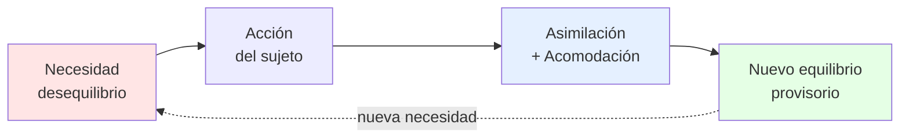

> 💬 *"El niño, al igual que el adulto, no ejecuta ningún acto exterior o incluso totalmente interior, más que impulsado por un móvil, y este móvil se traduce siempre en una necesidad"* (Piaget, citado en Faas, 2018, p. 197).

---

## 2. Conceptos invariantes: los pilares de toda la teoría

Antes de entrar en los estadios, es indispensable dominar los conceptos que **operan en todos ellos**. Piaget llama a estos procesos las **invariantes funcionales**: lo que **NO cambia** en todo el desarrollo (Faas, 2018, p. 198).

### 2.1 Esquema

Un **esquema** es una *estructura* u *organización de acciones que se transfiere o generaliza* en circunstancias iguales o análogas (Piaget e Inhelder, 1969, p. 26, nota 4).

**Características:**
- Es un **patrón organizado** de pensamiento y conducta.
- Puede ser **material** (manipular objetos) o **mental** (interiorización de imágenes).
- Es **repetible** en situaciones similares.
- Se **modifica con la experiencia**.

**Evolución del esquema a lo largo del desarrollo:**

| Estadio | Tipo de esquema | Ejemplo |
|---|---|---|
| Sensoriomotor | Esquemas reflejos → esquemas de acción | Succión, prensión, agitar para producir sonido. |
| Preoperatorio | Esquemas representativos / preconceptos | Imagen-tipo "perro" basada en un perro conocido. |
| Operatorio concreto | Esquemas operatorios (acciones interiorizadas y reversibles) | Esquema de conservación, esquema de clasificación. |
| Operatorio formal | Esquemas operatorios abstractos | Esquemas hipotético-deductivos. |

### 2.2 Asimilación, acomodación, adaptación, equilibración

Toda necesidad tiende a (Piaget, citado en Faas, 2018, p. 198):
1. **Incorporar** las cosas y personas a la actividad propia → **asimilación**.
2. **Reajustar** las estructuras en función de lo experimentado → **acomodación**.

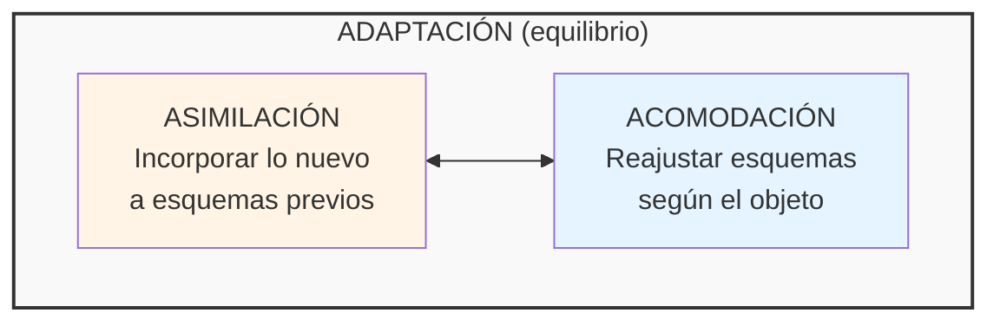

| Concepto | Definición |
|---|---|
| **Asimilación** | Incorporación de información del mundo externo a estructuras ya construidas. |
| **Acomodación** | Reajuste de las estructuras construidas en función de las transformaciones experimentadas. |
| **Adaptación** | Equilibrio entre asimilación y acomodación. Forma general del equilibrio psíquico. |
| **Equilibración** | Proceso autorregulado por el que el sujeto restablece el equilibrio cada vez que aparece un desequilibrio. |

> 🔑 **Importantísimo para los exámenes:** Estos cuatro procesos **operan en todos los estadios**. Lo que cambia es **a qué** se aplican (reflejos en el sensoriomotor; representaciones en el preoperatorio; operaciones en el concreto). Son las **invariantes funcionales**.

### 2.3 Asimilación, acomodación y juego/imitación/inteligencia

Una conexión clave **entre estadios** es cómo se manifiestan los polos asimilación-acomodación en las distintas conductas:

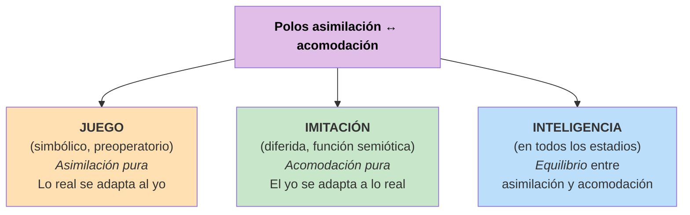

### 2.4 Crítica al asociacionismo: E→R vs. E→(Og)→R

El asociacionismo (incluido el conductismo de Pavlov, Hull) plantea que toda adquisición es una respuesta (R) a estímulos exteriores (E) mediante asociaciones acumulativas: $E \rightarrow R$.

Piaget propone, en cambio, que **el sujeto solo se vuelve sensible a los estímulos en la medida en que son asimilables a estructuras ya construidas**. El organismo (Og) interviene activamente: $E \rightarrow (Og) \rightarrow R$ (o, mejor, $E \rightleftharpoons R$).

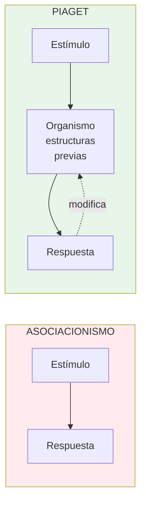

> 📌 La diferencia clave es **la reciprocidad y la construcción**. El pasaje entre subestadios se da **por asimilación, NO por asociación**. Esta es la crítica central de Piaget al asociacionismo.

### 2.5 Los cuatro factores del desarrollo

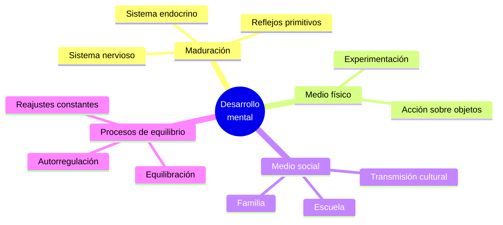

| Factor | Descripción |
|---|---|
| **Maduración** | Componente orgánico (sistema nervioso, endocrino). |
| **Medio físico** | Experimentación por acción sobre los objetos. |
| **Medio social** | Interrelaciones desde el nacimiento (familia, escuela, cultura). |
| **Procesos de equilibrio** | Reajustes constantes — autorregulación / equilibración. |

---

## 3. La teoría de los estadios: panorama unificado

### 3.1 Características de un estadio piagetiano

Para Piaget, un estadio NO es una etapa cronológica arbitraria, sino una **estructura cognitiva** con propiedades específicas (Faas, 2018, p. 198):

1. **Orden constante de adquisiciones**: ningún niño puede saltarse un estadio.
2. **Integración jerárquica**: las estructuras de un estadio se integran en las del siguiente como subestructuras (no se pierden, se reorganizan).
3. **Momento de preparación + momento de completamiento**: cada estadio tiene una fase inicial donde se gestan los logros y una fase final donde se consolidan.
4. **Génesis y forma final de equilibrio**: cada estadio tiene un proceso de construcción y una forma de equilibrio característica.

### 3.2 Los cuatro estadios — panorama

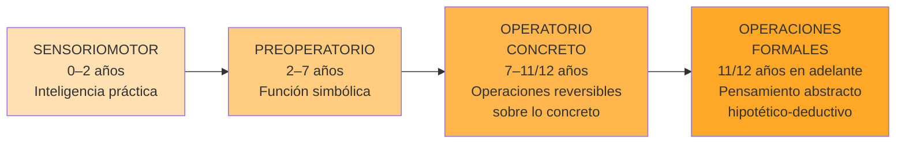

| Estadio | Edad | Característica central | Forma de equilibrio |
|---|---|---|---|
| **Sensoriomotor** | 0–2 años | Inteligencia práctica, sin lenguaje ni representación. | Coordinación de esquemas; grupo práctico de desplazamientos. |
| **Preoperacional** | 2–7 años | Aparece la función simbólica. Pensamiento egocéntrico, intuitivo. | Pensamiento representacional sin operaciones. |
| **Operatorio concreto** | 7–11/12 años | Operaciones lógicas reversibles sobre objetos concretos. | Agrupamientos: clasificaciones, seriaciones, conservación. |
| **Operatorio formal** | 11/12+ años | Pensamiento hipotético-deductivo, abstracto. | Grupo INRC, sistema combinatorio. |

> 🎯 **Nota:** Esta síntesis trabaja los **tres primeros estadios** (las clases 7, 8 y 9). El operatorio formal queda fuera del alcance de este documento.

---

# Parte II — Recorrido por los tres estadios

## 4. Estadio I — Sensoriomotor (0–2 años)

### 4.1 Caracterización general

Desde el nacimiento hasta los 2 años, el bebé desarrolla una **inteligencia sensoriomotriz**: una inteligencia **anterior al lenguaje** y **anterior a la representación**, que se apoya exclusivamente en **percepciones y movimientos coordinados** (Piaget e Inhelder, 1969, p. 24).

**Rasgos distintivos:**

- 🚫 **Sin función simbólica**: no hay todavía pensamiento ni afectividad ligada a representaciones de objetos ausentes.
- 🛠️ **Esencialmente práctica**: tiende a *logros*, no a enunciar verdades.
- 🧱 **Construye subestructuras cognitivas** que serán el punto de partida de las construcciones perceptivas e intelectuales posteriores.
- 🎯 De respuestas **reflejas y aleatorias** → conductas **orientadas a objetivos**.

> El sensoriomotor logra resolver problemas de acción (alcanzar objetos alejados o escondidos) construyendo un complejo sistema de esquemas de asimilación y organizando lo real según estructuras espacio-temporales y causales (Piaget e Inhelder, 1969, p. 23).

### 4.2 Las reacciones circulares: el mecanismo central de aprendizaje

Las **reacciones circulares** son el motor del aprendizaje sensoriomotor. Concepto tomado de **J. M. Baldwin (1894)**:

> *"Procesos por medio de los cuales un bebé aprende a reproducir los sucesos deseados, originalmente descubiertos por casualidad. La reacción circular es la repetición de una acción enriquecida y fortalecida por la experiencia"* (Faas, 2018, p. 199).

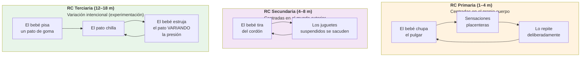

### 4.3 Los seis subestadios

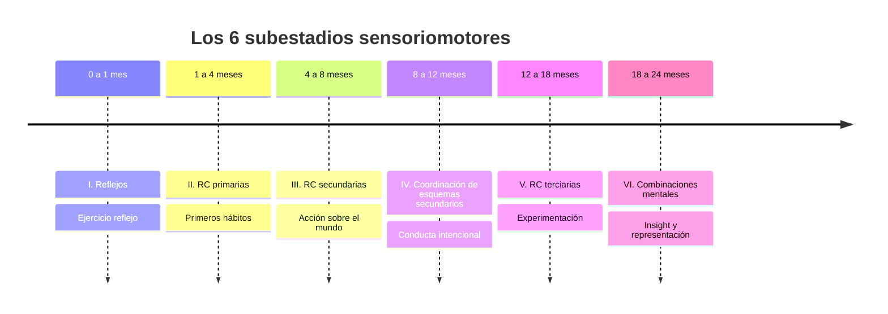

#### Cuadro maestro de los 6 subestadios

| # | Subestadio | Edad | Logro nuclear | Ejemplo (Papalia) |
|---|---|---|---|---|
| **I** | Uso de reflejos | 0–1 mes | Ejercicio reflejo, sin coordinación sensorial. | Dorri comienza a chupetear al colocársele el pecho. |
| **II** | RC primarias | 1–4 m | Repetición de acciones placenteras sobre el propio cuerpo. Primeros hábitos. | Dylan adapta su chupeteo del pecho al chupón de goma. |
| **III** | RC secundarias | 4–8 m | Acciones intencionales sobre el entorno. Repetición de resultados llamativos. | Alejandro empuja cereales por el borde de la silla. |
| **IV** | Coord. esquemas 2° | 8–12 m | **Conducta intencional.** Distinción incipiente medios/fines. Anticipación. | Anica elige y presiona el botón de su libro que toca su canción favorita. |
| **V** | RC terciarias | 12–18 m | Experimentación, ensayo y error, **medios nuevos**. | Bjorn rota un libro grande para pasarlo entre los barrotes. |
| **VI** | Combinaciones mentales | 18–24 m | **Insight, representación, símbolos.** | Jenny busca el orificio correspondiente *antes* de intentar colocar la pieza. |

#### Subestadio I — Reflejos (0–1 mes)

- **Punto de partida**: no los reflejos como respuestas aisladas, sino las **actividades espontáneas y globales del organismo** (von Holst), de las cuales los reflejos son diferenciaciones.
- Reflejos relevantes: **succión, prensión palmar** (los que se desarrollan con el ejercicio).
- **Ejercicio reflejo**: el reflejo se consolida mediante ejercicio funcional (el recién nacido mama más eficazmente al cabo de unos días).
- **No hay todavía diferenciación entre asimilación y acomodación, no hay conducta intencionada.**
- Las **tres formas de asimilación** ya están presentes en germen:

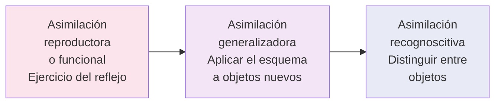

#### Subestadio II — RC primarias (1–4 meses)

- **Primeros hábitos** por repetición de acciones inicialmente azarosas.
- Caso paradigmático: **succión sistemática del pulgar** (ya no fortuita), implica coordinación brazo-mano-boca.
- Asimilación y acomodación todavía **no se diferencian del todo**.
- ⚠️ **Crítica de Piaget a otras lecturas** (Piaget e Inhelder, 1969, p. 26):
  - **Asociacionistas**: solo ven repetición → ¿de dónde viene si no hay conexión exterior?
  - **Psicoanalistas**: ven asimilación representativa pulgar-pecho → ¿de dónde sale ese poder simbólico antes de las primeras imágenes mentales?
  - **Piaget**: es **extensión de la asimilación sensoriomotriz** que ya opera en el reflejo.
- Acciones centradas en el **propio cuerpo** más que en el entorno.
- Coordinación visión-audición (girar hacia las fuentes de sonido).

> 🔍 **Hábito ≠ Inteligencia.** En un hábito elemental, el fin se alcanza solo mediante una sucesión obligada de movimientos: **medios y fines NO están diferenciados**. En un acto de inteligencia, en cambio, se persigue un fin desde el inicio y se buscan los medios apropiados, ya diferenciados (Piaget e Inhelder, 1969, pp. 26–27).

#### Subestadio III — RC secundarias (4–8 meses)

- **Hito de la edad: coordinación visión-prensión** (~4½ meses). El bebé agarra y manipula todo lo que ve en su espacio próximo.
- Las acciones se desplazan **del propio cuerpo al mundo exterior**.
- **Aún no hay clara distinción medios-fines**: la acción está centrada en el **resultado interesante**.
- **Ejemplo clásico de Piaget** (Piaget e Inhelder, 1969, p. 27): el bebé atrapa un cordón que pende del techo de su cuna, lo que sacude todos los juguetes suspendidos. Repite el acto. Luego, si se suspende un nuevo juguete o se hace sonar música tras un biombo, **el bebé volverá a tirar del cordón**: comienzo de diferenciación entre fin y medio, "umbral de la inteligencia", aunque mediado por una **causalidad mágica**.

#### Subestadio IV — Coordinación de esquemas secundarios (8–12 meses)

- ⭐ **Aparición de la conducta verdaderamente intencional**: deliberada y premeditada.
- El bebé **identifica el fin previamente** y **selecciona los medios**.
- **Los medios surgen de esquemas conocidos que se coordinan** (no se inventan aún medios nuevos). Ej: levantar un cojín (esquema habitual) para alcanzar un objeto escondido (combinación nueva).
- Aparece la **buena coordinación viso-motriz** y la **anticipación de eventos**.
- **Persistencia en metas**: no renuncia con facilidad.
- Aparece el famoso **error A no B** (ver más adelante).

#### Subestadio V — RC terciarias (12–18 meses)

- **Búsqueda de medios nuevos por diferenciación de esquemas conocidos** (Piaget e Inhelder, 1969, p. 28).
- **"Experimentos para ver"**: el bebé **varía la acción intencionalmente** para observar diferentes resultados.
- **Clara distinción asimilación/acomodación**: repite, pero **innova alternativamente**.
- Adquisición de la posición erecta y la marcha → exploración del ambiente.
- **Tres conductas instrumentales paradigmáticas** del estadio V:

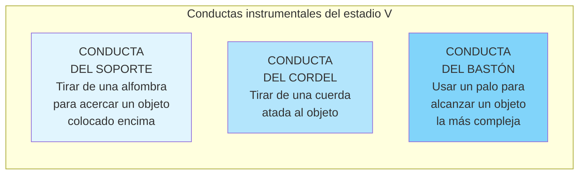

- ⚠️ **Limitación de la conducta del soporte**: el niño del estadio V **NO** tirará del soporte si el objeto no está *sobre* la alfombra (requiere contacto físico). Esto contrasta con la causalidad mágico-fenomenista del estadio III.

#### Subestadio VI — Combinaciones mentales (18–24 meses)

- 💡 **Transición al pensamiento representacional**. El infante supera el ensayo y error gracias a la **manipulación mental**.
- Aparece la **comprensión súbita** o ***insight***: detiene la acción, examina la situación, encuentra la solución.
- **Ejemplo paradigmático de Lucienne** (hija de Piaget): ante una caja entreabierta con un dedal adentro, Lucienne primero intenta abrirla por tanteo (V). Tras fracasar, se detiene, examina, **abre y cierra lentamente la boca** (como si imitara la abertura buscada), y entonces desliza el dedo en la hendidura.
- **Capacidad representacional**: representar mentalmente objetos y sucesos mediante símbolos.
- **Permanencia completa del objeto** (incluyendo desplazamientos invisibles).
- **Imitación diferida** e **invención de medios nuevos**.

### 4.4 La construcción de lo real

> *"La inteligencia sensoriomotriz organiza lo real, construyendo, a través de su propio funcionamiento, las grandes categorías de la acción que son los esquemas del **objeto permanente, del espacio, del tiempo y de la causalidad**"* (Piaget e Inhelder, 1969, p. 29).

**Ninguna de estas categorías está dada al comienzo**. El universo inicial está totalmente centrado en el cuerpo y la acción propios.

#### El descentramiento: la "revolución copernicana"

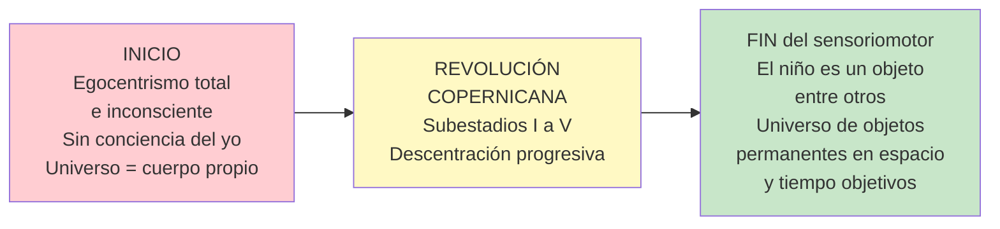

El término "**revolución copernicana**" alude a Copérnico, que destronó a la Tierra del centro del universo. Análogamente, el niño descubre que **él no es el centro del mundo**: es un objeto entre otros, en un universo estructurado espacio-temporalmente y sede de una causalidad localizada (Piaget e Inhelder, 1969, p. 29).

#### La permanencia del objeto

La permanencia del objeto es **la comprensión de que un objeto sigue existiendo aunque esté fuera de la vista**. Es uno de los logros mayores del sensoriomotor.

| Subestadio | Edad | Conducta observada |
|---|---|---|
| I y II | 0–4 m | Seguimiento visual, **pero ningún intento de búsqueda** si desaparece. Universo de "cuadros" móviles e inconsistentes. |
| III | 4–8 m | Busca objetos **parcialmente** ocultos. Si lo deja caer y no lo ve, **actúa como si no existiera**. |
| IV | 8–12 m | Busca objetos completamente ocultos, **pero comete el error A-no-B**. |
| V | 12–18 m | **Supera el error A-no-B**: busca en el último lugar donde lo vio ocultar. Pero **no considera desplazamientos invisibles**. |
| VI | 18–24 m | **Permanencia plena**: busca aun considerando desplazamientos invisibles. |

##### El error A no B

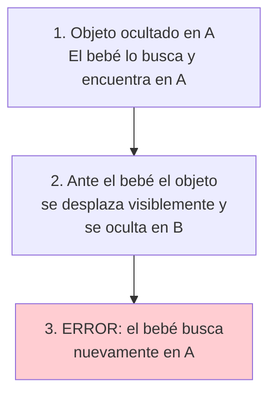

**Interpretación piagetiana**: la posición del objeto depende, para el bebé, de las **acciones anteriormente realizadas**, no de los desplazamientos autónomos del objeto. El objeto todavía no tiene plena autonomía espacial.

> 🔄 **Reinterpretación contemporánea (Esther Thelen — teoría de sistemas dinámicos):** La decisión depende no solo de lo que el bebé "sabe", sino de **lo que hace y por qué**: visión, atención, movimiento y memoria interactúan. Con demora corta entre el ocultamiento y la búsqueda → busca en B; con demora mayor → la memoria perceptiva-motora previa lo inclina a A (Papalia et al., 2009, p. 207).

#### El espacio y el "grupo práctico de desplazamientos"

Al principio no existe un **espacio único** ni un **tiempo objetivo**: solo un conjunto de **espacios heterogéneos** (bucal, táctil, visual, auditivo, postural), todos centrados en el cuerpo propio.

Hacia los 12–18 meses, los desplazamientos se organizan en lo que los geómetras llaman un **grupo de desplazamientos** (Piaget e Inhelder, 1969, p. 32):

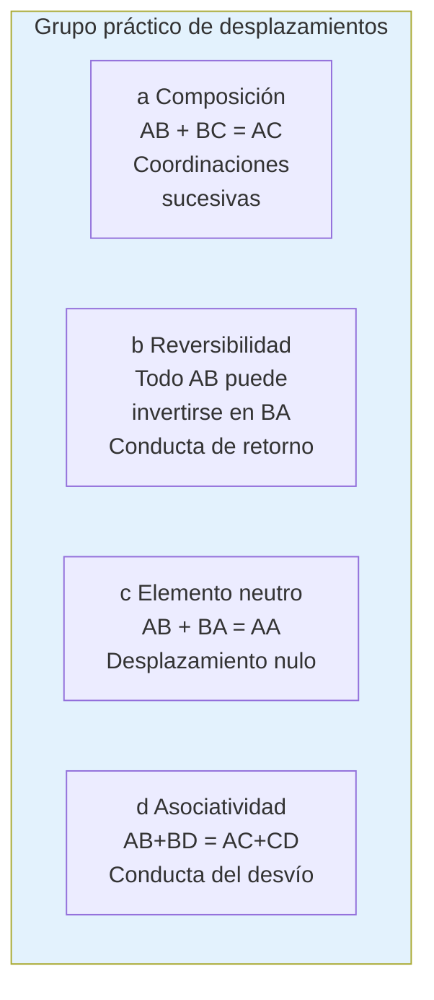

| Propiedad matemática | Conducta psicológica |
|---|---|
| **Composición**: AB + BC = AC | Coordinar desplazamientos sucesivos. |
| **Reversibilidad**: AB ↔ BA | Conducta de **retorno** al punto de partida. |
| **Elemento nulo**: AB + BA = AA | Desplazamiento nulo. |
| **Asociatividad**: AB + BD = AC + CD | **Conducta del desvío** — alcanzar D por caminos diferentes. |

🔑 **Importancia teórica fundamental**: Este grupo práctico de desplazamientos es la **fuente sensoriomotriz de las futuras operaciones del pensamiento**. La reversibilidad operatoria del estadio operatorio concreto **tiene aquí su prefiguración sensoriomotriz**.

#### La causalidad: de la magia a la objetivación

##### Causalidad mágico-fenomenista (estadio III, ~4 meses)

En el subestadio III, el bebé conoce como causa única **su propia acción**, incluso independientemente de los contactos espaciales.

**Ejemplo del cordón**: una vez que descubrió que tirar del cordón sacude los juguetes, **basta con suspender un juguete a 2 metros o reproducir sonidos tras un biombo** para que el bebé vuelva a tirar del cordón. ¡No importa que no haya contacto espacial!

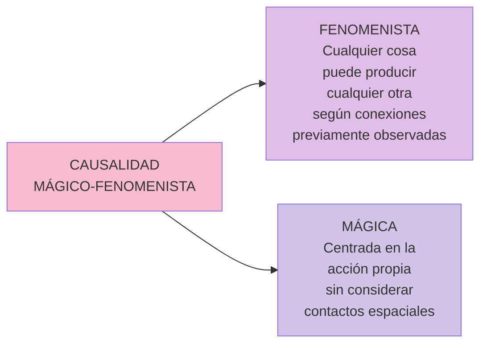

##### Causalidad objetivada y espacializada (estadios V–VI, ~12–18 m)

A medida que el universo se estructura con objetos permanentes, espacio y tiempo, **la causalidad se objetiva**:
- Las causas ya no se sitúan solo en la acción propia, sino **en los objetos cualesquiera**.
- Las relaciones causa-efecto entre objetos **suponen un contacto físico y espacial**.

**Prueba experimental**: en la conducta del soporte, si el objeto no está *sobre* la alfombra sino al lado, **el niño del estadio V NO tira** de ella. En cambio, un niño del estadio III–IV (entrenado a usar el soporte) seguirá tirando aunque no haya relación espacial "sobre".

### 4.5 La imitación

| Tipo | Definición | Aparición (según Piaget) |
|---|---|---|
| **Imitación visible** | Imita partes del cuerpo que el bebé puede ver (manos, pies). | ~6 meses (estadio III) |
| **Imitación invisible** | Imita partes del cuerpo que el bebé NO ve (lengua, boca). | ~9 meses (estadio IV) |
| **Imitación diferida** | Reproducción de un comportamiento observado tiempo antes, evocando un símbolo almacenado. | ~18–24 meses (estadio VI) |

#### Controversia: Meltzoff y Moore

**Andrew Meltzoff y M. Keith Moore (1983, 1989)** hallaron que bebés menores a **72 horas** parecen imitar a adultos abriendo la boca y sacando la lengua (imitación invisible **temprana**). Esta respuesta desaparece hacia los 2 meses (Bjorklund y Pellegrini, 2000) (Papalia et al., 2009, p. 205).

**Interpretaciones alternativas:**
- **Meltzoff y Gopnik (1993):** mecanismo evolucionado de "como yo" — predisposición innata a imitar rostros humanos para comunicarse con el cuidador.
- **Bjorklund (1997), S. S. Jones (1996):** podría ser un comportamiento exploratorio activado por la visión de la lengua, no verdadera imitación.

### 4.6 Aspectos cognitivo y afectivo: tres formas del esquematismo

Piaget plantea una **ley general de desarrollo** que regirá toda la evolución intelectual posterior (Piaget e Inhelder, 1969, pp. 33–34):

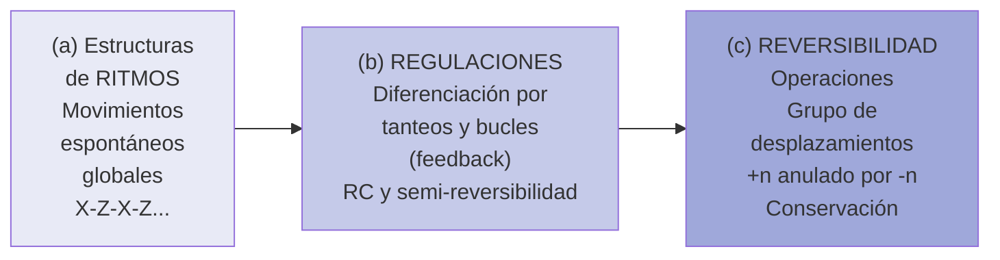

> 🧬 **Hilo conductor:** Las reacciones circulares garantizan la transición entre el ritmo y las regulaciones. El grupo práctico de desplazamientos contiene **el germen de la reversibilidad operatoria**. Esta secuencia ritmos → regulaciones → reversibilidad **es la ley general** que reaparece a niveles cada vez más elevados del desarrollo.

#### Aporte de Silvia Bleichmar

Faas integra la perspectiva de **Silvia Bleichmar** para subrayar que **lo cognitivo es beneficio y consecuencia de la humanización**:

- La **presencia del semejante** es inherente a la organización del sujeto.
- El otro (madre, cuidador) debe **descifrar las necesidades del bebé** y atribuirle significantes.
- *"En el otro se alimentan no sólo nuestras bocas sino nuestras mentes; de él recibimos junto con la leche, el odio y el amor, nuestras preferencias morales y nuestras valoraciones ideológicas. El otro está inscripto en nosotros"* (Bleichmar, 1997, en Faas, 2018, p. 204).
- **Para que se constituya lo cognitivo tiene que haberse constituido un sujeto.**

> 💡 **Síntesis:** En Piaget la subjetividad se construye en un proceso lógico-estructural; en Bleichmar, en un proceso de subjetivación que **requiere a un otro humanizante**. Ambos comparten que la inteligencia se construye sobre estructuras previas mediante **actividad del sujeto**.

### 4.7 La percepción y su relación con la inteligencia (Cap. 2)

Pregunta capital: **¿La percepción basta para explicar la inteligencia o sus contenidos?** Piaget responde **NO**: las nociones no son meras abstracciones de percepciones; involucran **estructuraciones específicas** derivadas de la **acción** y de las **operaciones**.

#### Constancias perceptivas vs. conservaciones operatorias

Las **constancias perceptivas** (tamaño, forma) comienzan en el primer año, pero las **conservaciones operatorias** recién a los 7–8 años. **¿Por qué este desfase de 7 años?**

| | Constancia perceptiva | Conservación operatoria |
|---|---|---|
| **Inicio** | ~6–12 meses | 7–8 años (sustancia); hasta 12 años (volumen) |
| **Mecanismo** | Regulación perceptiva aproximada (semi-reversibilidad) | Compensación deductiva (operatoria) — reversibilidad plena |
| **Diferencia clave** | El objeto **no cambia realmente**, solo en apariencia. Basta la regulación. | El objeto **cambia realmente**. Requiere razonamiento operatorio. |

> 🧬 **Conclusión:** Constancias y conservaciones son **parientes colaterales**, no en filiación directa. La fuente común es el esquematismo sensoriomotor. La conservación operatoria es **prolongación directa del esquema del objeto permanente** (primer invariante).

#### El argumento contra el empirismo y la Gestalt

- Las estructuras **perceptivas** son **irreversibles** y **probabilísticas** (composición no aditiva → ilusiones).
- Las **operaciones** son **reversibles** (+n anulado por −n) y **aditivas** (2+2 = exactamente 4).
- Por tanto, **es imposible extraer las operaciones de los sistemas perceptivos** (contra el gestaltismo de Wertheimer). Hay una **dualidad fundamental de orientación**: irreversibilidad perceptiva *hic et nunc* vs. reversibilidad operatoria.

### 4.8 Diagrama integrador del sensoriomotor

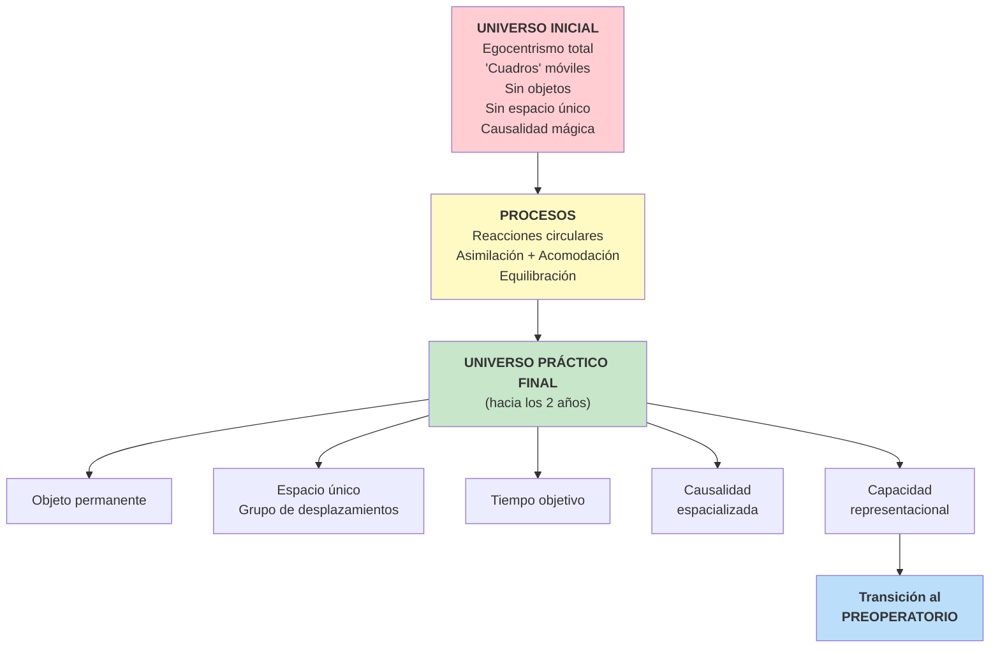

---

## 5. Estadio II — Preoperatorio (2–7 años)

### 5.1 La transición sensoriomotor → preoperatorio

El estadio preoperatorio constituye la transición entre la **inteligencia práctica** (sensoriomotora) y la **inteligencia lógica** (operatoria concreta). **¿Qué hace posible el paso al pensamiento preoperatorio?** La aparición de la **función semiótica o simbólica** entre los 18 y 24 meses, que permite al niño **representar mentalmente** la realidad.

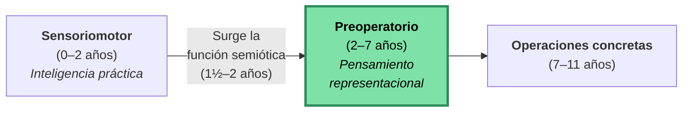

> 💡 **Etimología clave:** "Pre-operatorio" = *antes* de las operaciones. **Operación** = proceso lógico necesario para resolver problemas. Este estadio se llama así porque **las operaciones lógicas todavía NO están constituidas**.

### 5.2 La función semiótica o simbólica

> **Definición rigurosa:** capacidad de emplear **símbolos o representaciones mentales** (palabras, números o imágenes a los que la persona ha otorgado un significado) que permite pensar en las cosas **sin que se encuentren físicamente presentes** (Faas, p. 285; Papalia, p. 295).

Para Piaget e Inhelder (p. 57): **"poder representar algo (un 'significado' cualquiera: objeto, acontecimiento, esquema conceptual, etc.) por medio de un 'significante' diferenciado y que solo sirve para esta representación: lenguaje, imagen mental, gesto simbólico, etc."**

#### La distinción significante–significado

| Elemento | Definición |
|---|---|
| **Significado** | Aquello que se representa (objeto, acontecimiento o esquema conceptual). |
| **Significante** | Elemento que evoca al significado (palabra, gesto, imagen, dibujo). |

El gran avance evolutivo: lograr que el significante esté **diferenciado** del significado.

### 5.3 Tipos de significantes: del índice al signo

Existe una **continuidad evolutiva** entre el grado de conexión significante–significado:

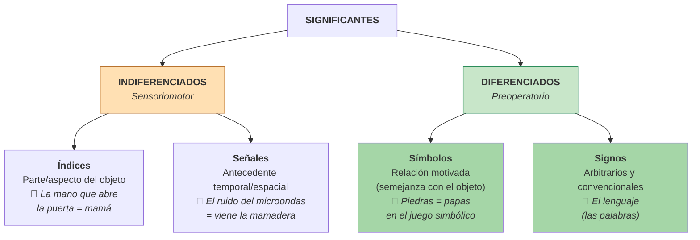

| Tipo | Estadio | Característica clave | Ejemplo |
|---|---|---|---|
| **Índice** | Sensoriomotor (indiferenciado) | Parte/aspecto del objeto. **La parte remite al todo.** | La mano vista al abrir la puerta = la persona que entra. |
| **Señal** | Sensoriomotor (indiferenciado) | Relación temporal/espacial cercana. | El sonido del microondas anticipa la mamadera. |
| **Símbolo** | Preoperatorio (diferenciado) | **Motivado**: guarda semejanza con el objeto. **Individual.** | Piedras = papas en el juego simbólico. |
| **Signo** | Preoperatorio (diferenciado) | **Arbitrario** y **convencional**. **Colectivo.** | El lenguaje (las palabras). |

> ⚠️ **Distinción clave:** signo ≠ símbolo
> - **Símbolo:** motivado, individual, guarda semejanza (juego simbólico).
> - **Signo:** arbitrario, colectivo, sin semejanza (lenguaje).

### 5.4 Las cinco manifestaciones de la función semiótica

Piaget e Inhelder (p. 58) enumeran **cinco conductas de aparición casi simultánea**, en orden de complejidad creciente:

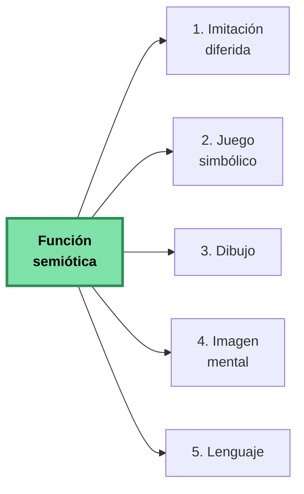

> 🔑 **Clave teórica:** las cuatro primeras **descansan sobre la imitación**, y el propio lenguaje se adquiere en un contexto necesario de imitación (Piaget e Inhelder, p. 59).

#### 5.4.1 Imitación diferida

Imitación que se inicia en **ausencia del modelo**.

**Evolución:**
1. **Imitación directa** (sensoriomotor): copia el gesto con el modelo presente. Predomina la **asimilación**.
2. **Imitación con demora**: el niño demora la imitación (saluda cuando ya pasó la situación).
3. **Imitación simbólica/diferida**: imita **sin que el modelo esté presente** y sin haber realizado el gesto previamente. Predomina la **acomodación**.

📌 **Ejemplo clásico de Piaget** (p. 58): una niña de 16 meses ve a su compañero enfadarse, gritar y golpear con el pie. **Una o dos horas después** de su partida, imita la escena riéndose. Es **comienzo de representación**.

#### 5.4.2 Juego simbólico

Juego de ficción donde el niño imita un modelo interiorizado, usando objetos como sustitutos de otros.

📌 **Ejemplo clásico**: la niña "hace como si durmiera", con la cabeza inclinada, el pulgar en la boca, sosteniendo la esquina de un trapo como almohada. Luego hace dormir a su oso, desliza una concha en una caja diciendo "miau" (acababa de ver un gato).

**Funciones del juego simbólico** (Piaget e Inhelder, pp. 61–63):

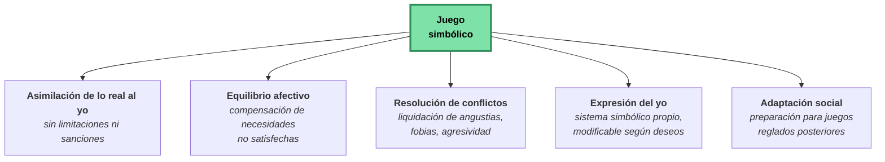

**Tipos de juego según Piaget:**

| Tipo de juego | Aparición | Características |
|---|---|---|
| **De ejercicio** | Sensoriomotor (se conserva luego) | Repetir actividades por "placer funcional" (Bühler). Sin simbolismo. |
| **Simbólico** | 2–3 a 5–6 años (apogeo) | Ficción, "como si", símbolos individuales. |
| **De reglas** | A partir de 6–7 años | Transmisión social, reglas compartidas (canicas, rayuela). |
| **De construcción** | Derivado del simbólico | Tiende a verdaderas adaptaciones. |

> 🧠 **Aporte teórico clave (síntesis de los tres polos):**
> - **Juego** = asimilación pura (lo real se adapta al yo).
> - **Imitación** = acomodación pura (el yo se adapta a lo real).
> - **Inteligencia** = equilibrio entre asimilación y acomodación.

#### 5.4.3 Dibujo

Forma **intermedia** entre el juego simbólico y la imagen mental. Comparte con el juego el **placer funcional** y el **autotelismo**; comparte con la imagen el **esfuerzo de imitación de lo real**.

##### Etapas del dibujo según Luquet:

```mermaid
flowchart LR
    A["<b>Realismo<br/>fortuito</b><br/>(garabato con<br/>significación<br/>descubierta)"] --> B["<b>Realismo<br/>frustrado</b><br/>(incapacidad sintética:<br/>elementos yuxtapuestos,<br/>'monigotes cabezudos')"]
    B --> C["<b>Realismo<br/>intelectual</b><br/>(dibuja lo que <i>sabe</i>:<br/>transparencias,<br/>abatimientos)"]
    C --> D["<b>Realismo<br/>visual</b><br/>(8–9 años: dibuja lo<br/>que <i>ve</i> desde un<br/>punto de vista)"]
    style D fill:#c8e6c9
```

**Hallazgo clave:** hasta los 8–9 años el niño dibuja **lo que sabe** del objeto, no lo que ve.

📌 **Ejemplos de realismo intelectual:**
- Una cara de perfil con dos ojos ("una persona tiene dos ojos").
- Un jinete con la pierna oculta dibujada a través del caballo.
- Las papas dibujadas dentro de la tierra del campo.

#### 5.4.4 Imagen mental

Representación interna ligada al recuerdo. **No es residuo directo de la percepción**, sino resultado de la **imitación interiorizada** del modelo.

> 🔑 **Tesis piagetiana fundamental:** las imágenes **derivan de la imitación**, no de la percepción. Implican **actividad del sujeto**, no una huella pasiva.

**Clasificación de las imágenes mentales** (Piaget e Inhelder, p. 71):

```mermaid
flowchart TD
    IM["<b>Imágenes<br/>mentales</b>"] --> REP["<b>Reproductoras</b><br/><i>Evocan espectáculos<br/>ya percibidos</i>"]
    IM --> ANT["<b>Anticipadoras</b><br/><i>Imaginan movimientos<br/>o transformaciones<br/>no presenciados</i>"]
    REP --> R1["Estáticas<br/>📌 <i>Configuraciones fijas</i>"]
    REP --> R2["Cinéticas<br/>📌 <i>Movimientos</i>"]
    REP --> R3["De transformación<br/>📌 <i>Cambio de forma</i>"]
    ANT --> A1["Cinéticas"]
    ANT --> A2["De transformación"]
    style IM fill:#7ee2a8,stroke:#2c8c5a,stroke-width:3px,color:#000
    style REP fill:#ffe0b3
    style ANT fill:#c8e6c9
```

**Hallazgo experimental crucial** (Piaget e Inhelder, p. 71):
> Las imágenes del nivel preoperatorio son **casi exclusivamente estáticas**. **Las imágenes cinéticas y de transformación solo aparecen después de los 7–8 años**, junto con las operaciones concretas.

> 🎯 **Conclusión teórica:** la imagen **no engendra** la operación; la imagen anticipadora aparece **gracias a la operación**. La imagen es estática y discontinua, y **necesita la operación para volverse dinámica**.

#### 5.4.5 Lenguaje

Sistema arbitrario de signos y símbolos utilizados colectivamente para comunicarse.

**Tres ventajas del lenguaje sobre la inteligencia sensoriomotora** (Piaget e Inhelder, p. 82):
1. **Velocidad superior**: introduce relaciones con rapidez.
2. **Extensión espacio-temporal**: libera al pensamiento del "aquí y ahora".
3. **Representaciones simultáneas**: permite pensar el todo, no solo paso a paso.

##### ¿El lenguaje es la fuente de la lógica?

Piaget responde **NO**. Argumentos:

| Evidencia | Hallazgo |
|---|---|
| **Sordomudos** (Vincent, Oléron, Affolter) | Mismos estadios lógicos con 1–2 años de retraso. Hay demora, no carencia. |
| **Ciegos** (Hatwell) | Retraso de 4 años o más. **La perturbación sensoriomotora afecta más que la limitación lingüística.** |
| **Sinclair** | Entrenar verbalmente al niño en expresiones operatorias **NO produce conservación** (1 de cada 10 casos). |

> 🎯 **Conclusión piagetiana:** *"El lenguaje no constituye la fuente de la lógica sino que, por el contrario, está estructurado por ella"* (Piaget e Inhelder, p. 84). Las raíces de la lógica están en la **coordinación general de las acciones**, no en el lenguaje.

### 5.5 Subperíodos del estadio preoperatorio

```mermaid
timeline
    title Subperíodos del pensamiento preoperacional
    section Preconceptual (2–4 años)
        Pensamiento basado en preconceptos : Imágenes-tipo concretas
        Razonamiento transductivo : De particular a particular
        Egocentrismo intenso : Centración del pensamiento
        Desarrollo del lenguaje : Mejora velocidad del pensamiento
    section Intuitivo (4–7 años)
        Función simbólica en apogeo : Máxima expresión
        Centración en 2 dimensiones : Inicio de descentración
        Dependencia funcional : Causa-efecto comprendida
        Egocentrismo atenuado : Pero aún presente
```

#### Fase preconceptual (2–4 años)

- **Pensamiento basado en preconceptos**: esquemas representativos concretos. Una **imagen-tipo** representa todas las realidades.
- **El desarrollo del lenguaje incrementa el alcance y velocidad** del pensamiento, pero como se adquiere lentamente, sigue ligado a la acción.
- **Razonamiento transductivo**: de lo particular a lo particular, formando conceptos por relaciones indebidas.
- **Pensamiento egocéntrico**: el niño no considera lo que otros piensan o sienten.
- **Centración**: incapacidad de considerar simultáneamente varias dimensiones.
- **Sincretismo y yuxtaposición**: liga lo que no está realmente relacionado.

📌 **Ejemplo de sincretismo:** "la luna crece" (cuando se va haciendo llena), pensando que lo hace como los seres vivos.

#### Fase intuitiva (4–7 años)

- La **función simbólica está en su máxima expresión.**
- **Puede centrarse en dos dimensiones** (alto y ancho), iniciando la **descentración**.
- **Principio de dependencia funcional**: comprende que algunos acontecimientos están asociados.
- **Comprensión causa-efecto** (incipiente).
- **Sigue habiendo egocentrismo**, aunque algo atenuado.
- **Pensamiento intuitivo**: afirma sin pruebas, por percepción inmediata, pero aún **pre-lógica**.

### 5.6 Logros del pensamiento preoperacional

```mermaid
flowchart TD
    LOG["<b>LOGROS<br/>del preoperacional</b>"] --> S["Uso de<br/>símbolos"]
    LOG --> I["Discernimiento<br/>de identidades"]
    LOG --> CE["Causa–efecto"]
    LOG --> CL["Clasificación"]
    LOG --> N["Noción de<br/>número"]
    LOG --> E["Empatía"]
    LOG --> TM["Teoría de<br/>la mente"]
    style LOG fill:#7ee2a8,stroke:#2c8c5a,stroke-width:3px,color:#000
```

| Logro | Significado | Ejemplo |
|---|---|---|
| **Uso de símbolos** | No necesitan contacto sensoriomotor para pensar en un objeto. Imaginación en los juegos. | Preguntan a su madre sobre los elefantes del circo vistos meses atrás. |
| **Discernimiento de identidades** | Las modificaciones superficiales no alteran la naturaleza. | El papá se viste de pirata pero sigue siendo el mismo. |
| **Causa-efecto** | Los eventos tienen causas y efectos. | Al ver rodar una pelota detrás de una pared, busca tras la persona que la pateó. |
| **Clasificación** | Organización en categorías significativas. | Dos montones: "grandes" y "pequeños". |
| **Noción de número** | Cuenta y maneja cantidades pequeñas. | Reparte caramelos y los cuenta. |
| **Empatía** | Imagina cómo se sienten otros. | Consuela a un amigo. |
| **Teoría de la mente** | Conciencia de la actividad mental. | Oculta galletas donde su hermano no las buscará. |

#### Principios de la enumeración (Papalia, p. 298):
1. **Correspondencia uno a uno** (a cada objeto, un número).
2. **Orden estable** (los números siempre en el mismo orden).
3. **Cardinalidad** (el último número dicho es el total).
4. **Irrelevancia del orden** (el orden de conteo no cambia el total).
5. **Abstracción** (cualquier conjunto se puede contar).

### 5.7 Limitaciones del pensamiento preoperacional

```mermaid
flowchart TD
    LIM["<b>LIMITACIONES<br/>del preoperacional</b>"] --> C["Centración"]
    LIM --> IR["Irreversibilidad"]
    LIM --> ET["Estados vs.<br/>transformaciones"]
    LIM --> RT["Razonamiento<br/>transductivo"]
    LIM --> EG["Egocentrismo"]
    LIM --> AN["Animismo"]
    LIM --> AR["Confusión<br/>apariencia/realidad"]
    style LIM fill:#ffb3b3,stroke:#cc4444,stroke-width:3px,color:#000
```

| Limitación | Descripción | Ejemplo |
|---|---|---|
| **Centración** | Foco en un aspecto descuidando los restantes. | Cree tener más jugo porque está en un vaso alto. |
| **Irreversibilidad** | No comprende que puede revertir operaciones. | No piensa que el jugo puede ser devuelto al recipiente original. |
| **Estados vs. transformaciones** | No comprende la transformación entre estados. | No comprende que cambiar la forma de un líquido no cambia la cantidad. |
| **Razonamiento transductivo** | Pasa de un asunto a otro viendo causas donde no existen. | "Fui malo con mi hermano, él se enfermó, yo lo hice enfermar." |
| **Egocentrismo** | Asume que todos piensan/sienten como él. | No da vuelta el libro para que el otro vea el dibujo. |
| **Animismo** | Atribuye vida a objetos inanimados. | Da vida a sus juguetes y muñecos. |
| **Confusión apariencia/realidad** | Confunde lo real con el aspecto exterior. | Una esponja con forma de piedra: "parece" piedra y por lo tanto "es" piedra. |

#### La centración como concepto matriz

```mermaid
flowchart LR
    A["<b>Centración</b>"] -.genera.-> B["Egocentrismo"]
    A -.genera.-> C["No conservación"]
    A -.genera.-> D["Foco en estados,<br/>no transformaciones"]
    A -.genera.-> E["Confusión<br/>apariencia/realidad"]
    style A fill:#ffb3b3,stroke:#cc4444,stroke-width:3px,color:#000
```

> 🧠 **Idea matriz:** Para Piaget, **la centración es la característica principal del pensamiento preoperacional** y explica gran parte de sus limitaciones. Su superación (la **descentración**) es lo que permite el paso al operatorio concreto.

#### El egocentrismo: aclaración fundamental

⚠️ **Aclaración crucial** (Piaget e Inhelder, nota al pie 6, p. 63): El "egocentrismo" piagetiano:
- **NO es egoísmo.**
- **NO es hipertrofia del yo.**
- **ES una falta de conciencia del yo** y una **indiferenciación entre el punto de vista propio y el de los otros**.
- Es un **fenómeno epistemológico** caracterizado por la indiferenciación sujeto–mundo.

### 5.8 Tareas clásicas piagetianas

#### La tarea de las tres montañas (egocentrismo)

**Procedimiento:** El niño se sienta frente a una mesa con tres montañas. Se coloca un muñeco al otro lado. Se pide que describa lo que ve el muñeco.

**Resultado piagetiano:** los niños preoperacionales describen las montañas **desde su propio punto de vista**.

```mermaid
flowchart LR
    N["👶 Niño<br/>(perspectiva A)"] --- M["⛰️⛰️⛰️<br/>Tres montañas"]
    M --- D["🪆 Muñeco<br/>(perspectiva B)"]
    N -.->|"Pregunta:<br/>¿Qué ve el muñeco?"| R["❌ Responde según<br/>su propio punto de vista A"]
    style R fill:#ffcccc
```

> 🔬 **Revisión contemporánea** (Hughes, 1975): Con un muñeco que debe esconderse de dos policías, niños de 3½ a 5 años lo resuelven correctamente el 90% de las veces. **El egocentrismo aparece principalmente en situaciones abstractas y poco familiares.**

#### Tareas de conservación

**Conservación**: Conciencia de que dos objetos iguales según cierta medida siguen siéndolo luego de una alteración perceptual, en tanto que nada se haya añadido o restado.

**Tabla maestra de tareas de conservación** (Papalia, p. 301):

| Tipo | Se muestra | Transformación | Respuesta preoperacional |
|---|---|---|---|
| **Número** | Dos hileras iguales y paralelas de dulces | Aumenta espacio en una hilera | "La hilera más larga tiene más." |
| **Longitud** | Dos palitos paralelos iguales | Se desplaza uno hacia la derecha | "El de la derecha es más largo." |
| **Líquido** | Dos vasos idénticos con igual cantidad | Se vierte en vaso más alto y estrecho | "El más alto tiene más." |
| **Materia (masa)** | Dos bolas de plastilina iguales | Se amasa una en forma de salchicha | "La salchicha tiene más." |
| **Peso** | Dos bolas de plastilina iguales | Se amasa una en forma de salchicha | "La salchicha pesa más." |
| **Área** | Dos prados con bloques iguales | Se reagrupan los bloques de uno | "Donde los bloques están más juntos tiene más." |
| **Volumen** | Dos vasos con bolas iguales sumergidas | Se transforma una bola en salchicha | "El vaso con salchicha estará más alto." |

##### Diagrama del experimento clásico de líquidos

```mermaid
flowchart TD
    A["<b>Paso 1</b><br/>Dos vasos idénticos A y B<br/>con la misma cantidad de agua<br/>🥛 = 🥛"] --> B["<b>Paso 2</b><br/>Se vierte B en un vaso C<br/>más alto y delgado"]
    B --> C["<b>Paso 3</b><br/>Se pregunta:<br/>¿hay la misma cantidad<br/>en A y en C?"]
    C --> D["<b>Respuesta preoperacional</b><br/>❌ 'C tiene más porque<br/>el agua está más alta'"]
    C --> E["<b>Respuesta operacional</b><br/>✅ 'Tienen lo mismo, solo<br/>cambió la forma del vaso'"]
    style D fill:#ffcccc
    style E fill:#c8e6c9
```

**Por qué fallan los preoperacionales:**
- **Centración** en una sola dimensión (altura).
- **No coordinan altura y ancho** simultáneamente.
- **Irreversibilidad**: no piensan en revertir el vertido.
- **Foco en estados**, no en la transformación.

### 5.9 La memoria en el preoperatorio

Piaget vincula la memoria al esquematismo general de las acciones y operaciones.

| Tipo | Definición | Aparición |
|---|---|---|
| **Reconocimiento** | Actúa solo en presencia del objeto. Ligada a esquemas de acción. | Muy precoz (existe ya en invertebrados inferiores). |
| **Evocación** | Evoca el objeto en su ausencia mediante recuerdo-imagen. | Aparece con la imagen mental y el lenguaje. |

> 🧠 **Hallazgo experimental clave** (Sinclair, p. 79): si se muestran 10 varillas seriadas y se pide reproducirlas una semana después, **el niño dibuja según su nivel operatorio**, NO según lo que vio. **Seis meses más tarde, el dibujo mejora** sin haber visto el modelo nuevamente: **los progresos del esquema producen progresos del recuerdo**.

**Conclusión:** la memoria **no es un registro pasivo**; es **el aspecto figurativo de los esquemas**.

---

## 6. Estadio III — Operatorio concreto (7–11/12 años)

### 6.1 La transición preoperatorio → operatorio concreto

> **Idea clave (Piaget e Inhelder, 1969):** Una vez constituida la función semiótica hacia 1½–2 años, podría esperarse que las acciones se interiorizaran rápida y directamente como operaciones. **Sin embargo, hacen falta entre 5 y 6 años más.** Esa demora es lo que vuelve necesario distinguir un nivel preoperatorio y comprender la **naturaleza compleja de las operaciones**.

#### Los tres niveles del pensamiento

Piaget distingue **tres niveles** (y no dos, como sostenía Wallon):

```mermaid
flowchart LR
    A["<b>Nivel sensoriomotor</b><br/>0–2 años<br/><i>Acción directa sobre lo real</i>"] --> B["<b>Nivel preoperatorio</b><br/>2–7 años<br/><i>Interiorización de la acción inmediata<br/>vía función semiótica</i>"]
    B --> C["<b>Nivel operatorio concreto</b><br/>7–11/12 años<br/><i>Acciones interiorizadas y agrupadas<br/>en sistemas coherentes y reversibles</i>"]
    style A fill:#fdecef,stroke:#8e244c,color:#000
    style B fill:#f5e6f7,stroke:#8e244c,color:#000
    style C fill:#e9d8ef,stroke:#5b1968,color:#000
```

#### Los tres requisitos para pasar al operatorio concreto

Piaget e Inhelder (1969) identifican **tres condiciones**:

```mermaid
flowchart TD
    R["<b>Requisitos para pasar al<br/>operatorio concreto</b>"]
    R --> R1["<b>1. Reconstrucción en el plano representacional</b><br/>Un logro en la acción no se prolonga en una representación adecuada.<br/>Ej: un niño de 4–5 años hace solo el trayecto casa-escuela,<br/>pero no puede reconstruirlo con maquetas o planos."]
    R --> R2["<b>2. Descentración respecto a otros objetos y acontecimientos</b><br/>Es más laboriosa que la descentración sensoriomotora.<br/>Pasar de un estado centrado en el cuerpo/acción propios<br/>a uno donde el sujeto se sitúa en relaciones objetivas."]
    R --> R3["<b>3. Universalidad social (cognitiva, afectiva y moral)</b><br/>Las operaciones implican intercambio: coordinación interindividual.<br/>La cooperación es <i>sine qua non</i> de la objetividad,<br/>coherencia interna y universalidad."]
    style R fill:#8e244c,stroke:#5b1968,color:#fff
    style R1 fill:#fdecef,stroke:#8e244c,color:#000
    style R2 fill:#fdecef,stroke:#8e244c,color:#000
    style R3 fill:#fdecef,stroke:#8e244c,color:#000
```

> **Nota teórica:** Las construcciones cognitivas son **inseparables** de las construcciones afectivas y sociales. "Social" no se reduce a transmisiones educativas/culturales: es un **proceso interindividual de socialización**, simultáneamente cognitivo, afectivo y moral.

### 6.2 ¿Qué es una "operación"?

Una **operación** es, según Piaget:

- Una **acción interiorizada** (ya no se ejecuta solo en lo real, sino mentalmente).
- **Reversible**: a toda operación corresponde una operación inversa que permite volver al estado inicial.
- **Coordinada en sistemas de conjunto** (no aislada): clasificaciones, seriaciones, números, etc.
- **Común a todos los sujetos** de un mismo nivel mental.

### 6.3 La reversibilidad: el gran logro

La **reversibilidad** es **el núcleo del pensamiento operatorio**. Está **pre-configurada** por logros sensoriomotores anteriores —el **objeto permanente** y el **grupo práctico de los desplazamientos (GPD)**— pero recién se consolida hacia los 7–8 años.

**La reversibilidad permite:**
- **Invertir acciones** mentalmente.
- **Vincular unidades con las clases que las componen.**
- Que el aprendizaje formal de las matemáticas comience a esta edad (sumar y restar requieren reversibilidad).

**Dos tipos de reversibilidad:**

```mermaid
flowchart LR
    R["<b>Reversibilidad</b>"]
    R --> I["<b>Por inversión / negación</b><br/>A − A = 0<br/>Ej: si vierto el agua de A' a A,<br/>vuelve al estado inicial"]
    R --> Re["<b>Por reciprocidad</b><br/>A corresponde a B y B a A<br/>Ej: 'es más alto, pero más estrecho;<br/>entonces es lo mismo' (compensación)"]
    style R fill:#5b1968,stroke:#5b1968,color:#fff
    style I fill:#e9d8ef,stroke:#5b1968,color:#000
    style Re fill:#e9d8ef,stroke:#5b1968,color:#000
```

### 6.4 Características del pensamiento operatorio concreto

El pensamiento del niño operatorio concreto es:

- **Interno**: los agrupamientos se realizan en la mente.
- **Concreto**: manipula objetos del mundo real; necesita el sostén perceptivo.
- **Descentralizado**: puede coordinar dos aspectos de un fenómeno.
- **Lógico**: usa los símbolos de modo lógico, con capacidad de conservar y generalizar.

### 6.5 Las cuatro operaciones concretas

```mermaid
flowchart TD
    OP["<b>Cuatro operaciones concretas</b>"]
    OP --> C["<b>1. Combinatoria</b><br/>Combinar dos o más clases<br/>en una clase mayor.<br/><i>rosas + claveles = flores</i>"]
    OP --> R["<b>2. Reversibilidad</b><br/>Cada operación tiene una<br/>opuesta que la revierte.<br/><i>suma ↔ resta</i>"]
    OP --> A["<b>3. Asociatividad</b><br/>Las operaciones pueden<br/>alcanzar una meta de<br/>varias maneras.<br/><i>(2+3)+4 = 2+(3+4)</i>"]
    OP --> IN["<b>4. Identidad y Negación</b><br/>Una operación combinada<br/>con su opuesta se anula<br/>(negación) y no cambia<br/>(identidad).<br/><i>+A − A = 0</i>"]
    style OP fill:#5b1968,stroke:#5b1968,color:#fff
    style C fill:#fdecef,stroke:#8e244c,color:#000
    style R fill:#fdecef,stroke:#8e244c,color:#000
    style A fill:#fdecef,stroke:#8e244c,color:#000
    style IN fill:#fdecef,stroke:#8e244c,color:#000
```

### 6.6 Las nociones de conservación: la indicación clara del paso

Las **nociones de conservación** son la indicación más clara del paso del pensamiento preoperatorio al operatorio concreto. Constituyen los **invariantes** de las estructuras operatorias: aquello que se mantiene constante a través de una transformación reversible.

> Toda transformación operatoria es **relativa a un invariante**. Ese invariante de un sistema de transformaciones es lo que Piaget llama una **noción o esquema de conservación**.

#### El cronograma evolutivo de las conservaciones (décalage horizontal)

Aunque los principios subyacentes son los mismos, el niño no domina simultáneamente todos los tipos de conservación. Piaget llama a esta inconsistencia **décalage horizontal**.

```mermaid
timeline
    title Evolución de las nociones de conservación
    7-8 años : Cantidades numéricas : longitud : líquidos : SUSTANCIA
    8 años : Conservación de MATERIALES (bola partida en bolitas)
    9-10 años : Conservación del PESO
    9-10 años : Conservación de SUPERFICIES
    11-12 años : Conservación del VOLUMEN (desplazamiento de agua)
```

| Edad | Sustancia (plastilina) | Líquido | Peso | Volumen |
|---|---|---|---|---|
| **< 7 años** | "La bola es más grande" | "El agua en A está más alta, tiene más" | "La bola pesa más" | "La bola hará subir más el agua" |
| **7–9 años** | "Son iguales" — justif. contradictoria | "Es la misma cantidad" — justif. adecuada | "La bola pesa más" — justif. contradictoria | "Desplazarán lo mismo" — justif. contradictoria |
| **9 años en adelante** | "Sólo cambió la forma" — compensación | "Sólo se la pasó" — identidad, reversibilidad, compensación | "Mismo peso, sólo cambió la forma" | "Ambas ocupan el mismo lugar y desplazan la misma agua" |

#### Los tres argumentos de la conservación

Cuando el niño alcanza la conservación, justifica su respuesta con **al menos uno de tres tipos de argumentos**:

```mermaid
flowchart TD
    CON["<b>Justificación de la conservación</b>"]
    CON --> ID["<b>Identidad</b><br/>'Es la misma agua'<br/>'No se quitó ni añadió nada'"]
    CON --> RI["<b>Reversibilidad por inversión</b><br/>'Se puede volver de A' a A'<br/>(la transformación es deshacible)"]
    CON --> RC["<b>Reciprocidad / compensación</b><br/>'Es más alto pero más estrecho'<br/>(las variaciones se compensan)"]
    style CON fill:#5b1968,stroke:#5b1968,color:#fff
    style ID fill:#e9d8ef,stroke:#5b1968,color:#000
    style RI fill:#e9d8ef,stroke:#5b1968,color:#000
    style RC fill:#e9d8ef,stroke:#5b1968,color:#000
```

> 🎯 La conservación está **totalmente lograda** cuando, además de la respuesta correcta, **la justificación también es correcta**.

### 6.7 Los agrupamientos: estructuras operatorias de conjunto

Las operaciones concretas no aparecen aisladas: se **coordinan en estructuras de conjunto** que Piaget llama **agrupamientos** (*groupements*).

**Características:**
- Combina **operaciones directas** (A + A' = B; B + B' = C…).
- Combina **operaciones inversas** (B − A' = A).
- Incluye **operación idéntica** (+A − A = 0).
- Incluye **operación tautológica** (A + A = A).
- Es **parcialmente asociativa**.

> Formalmente, el agrupamiento es una estructura intermedia: emparentada con el "grupo" matemático pero sin asociatividad completa (un *grupoide*), cercana al *retículo* en su forma de semi-retículo (*lattice*).

### 6.8 Seriación e inferencia transitiva

**Seriación**: capacidad de ordenar elementos según una dimensión creciente o decreciente.

**Etapas de la seriación** (ejemplo de 10 varillas):

```mermaid
flowchart TD
    E1["<b>Esbozo sensoriomotor</b><br/>1½–2 años<br/>Construye torres con bloques de diferencias evidentes"]
    E2["<b>Etapa 1: Parejas o pequeños conjuntos</b><br/>Forma pares (una chica, una grande)<br/>pero no los coordina entre sí"]
    E3["<b>Etapa 2: Tanteo empírico</b><br/>Construye por ensayo y error<br/>(regulaciones semi-reversibles, aún no operatorias)"]
    E4["<b>Etapa 3: Método sistemático (≈ 7 años)</b><br/>Busca primero el más pequeño, luego el más pequeño de los restantes...<br/>Cada elemento E se concibe como mayor que los previos<br/>y menor que los siguientes simultáneamente"]
    E1 --> E2 --> E3 --> E4
    style E1 fill:#fdecef,stroke:#8e244c,color:#000
    style E2 fill:#fdecef,stroke:#8e244c,color:#000
    style E3 fill:#f5e6f7,stroke:#8e244c,color:#000
    style E4 fill:#e9d8ef,stroke:#5b1968,color:#000
```

El método sistemático es **operatorio** porque combina la operación directa (E > D, C, B, A) con su inversa (E < F, G…). Esa **reversibilidad por reciprocidad** abre las puertas a la **transitividad**.

#### Inferencia transitiva

**Inferencia transitiva**: inferir una relación entre dos objetos a partir de la relación que cada uno tiene con un tercero. **A > B y B > C → A > C**.

> 📌 **Ejemplo:** A Catherine se le muestra que el palo amarillo es más largo que el verde, y que el verde es más largo que el azul. Sin compararlos directamente, infiere que el amarillo es más largo que el azul.

Los niños preoperatorios **se niegan a inferir** si no ven simultáneamente los objetos. La inferencia transitiva emerge hacia los 7–8 años.

### 6.9 Clasificación e inclusión de clases

#### Etapas de la clasificación (Inhelder y Piaget, 1959)

```mermaid
flowchart TD
    C1["<b>Etapa 1: Colecciones figurales</b><br/>≈ 2–5 años<br/>Dispone objetos según semejanzas/diferencias,<br/><i>pero también</i> los yuxtapone espacialmente<br/>en filas, cuadrados o círculos."]
    C2["<b>Etapa 2: Colecciones no figurales</b><br/>≈ 5½–6 años<br/>Pequeños conjuntos sin forma espacial.<br/>Parece racional, pero <b>falla en la inclusión</b>."]
    C3["<b>Etapa 3: Clasificación operatoria</b><br/>≈ 8 años<br/>Logra el <b>encajamiento de clases en extensión</b>.<br/>Comprende que A < B (rosas < flores)."]
    C1 --> C2 --> C3
    style C1 fill:#fdecef,stroke:#8e244c,color:#000
    style C2 fill:#f5e6f7,stroke:#8e244c,color:#000
    style C3 fill:#e9d8ef,stroke:#5b1968,color:#000
```

#### La prueba clásica de inclusión de clases

> **Experimento (Piaget, 1964):** Se muestra un ramo de **12 flores**: **6 margaritas** (subclase A) y otras flores (complementaria A'). Se pregunta: **"¿Hay más flores o más margaritas?"**

| Edad | Respuesta | Razonamiento |
|---|---|---|
| < 7–8 años | "Más margaritas" | Al pensar en la parte A, el todo B deja de conservarse como unidad; compara A sólo con A', no con B. |
| ≥ 7–8 años | "Más flores" | Comprende que las margaritas son una **subclase**: no puede haber más subclase que clase. |

#### Razonamiento inductivo y deductivo

| Tipo | Definición | Ejemplo |
|---|---|---|
| **Inductivo** | De observaciones particulares a una conclusión general. **Conclusiones tentativas.** | "Mi perro ladra, el de Terry ladra... → todos los perros ladran." |
| **Deductivo** | De una premisa general a una conclusión particular. Si premisa verdadera y razonamiento sólido, **conclusión necesaria.** | "Todos los perros ladran. Fifí es perro. → Fifí ladra." |

Piaget sostenía que los operatorios concretos usan **sólo razonamiento inductivo**. **Galotti, Komatsu y Voelz (1997)** matizan: con problemas hipotéticos sin referencia al mundo real ("Todos los poggops usan botas azules..."), niños de 2° grado resuelven ambos tipos.

### 6.10 El número

Piaget rechaza la idea de que el número sea simplemente correspondencia término a término entre conjuntos (Frege, Whitehead, Russell). El **número operatorio** sólo se constituye cuando hay **conservación numérica independiente de la disposición espacial**.

**Definición piagetiana**: el número resulta de una **síntesis de dos agrupamientos**:

```mermaid
flowchart LR
    S["<b>Seriación</b><br/>1 → 1 → 1 → ...<br/>(ordenamiento espacial<br/>o temporal para no contar<br/>dos veces el mismo elemento)"]
    I["<b>Inclusión de clases</b><br/>1 < (1+1) < (1+1+1) < ...<br/>(cada número incluye<br/>a los anteriores)"]
    N["<b>NÚMERO</b><br/>{[(1)→1]→1}→ ..."]
    S --> N
    I --> N
    style S fill:#e9d8ef,stroke:#5b1968,color:#000
    style I fill:#e9d8ef,stroke:#5b1968,color:#000
    style N fill:#5b1968,stroke:#5b1968,color:#fff
```

**Avances en este estadio:**
- A los **6–7 años**: cuentan mentalmente, suman contando hacia adelante desde el más pequeño.
- A los **9 años**: cuentan hacia atrás para restar.
- Resuelven **problemas narrados simples**.
- Comprensión intuitiva de **fracciones** desde los 4 años, con confusiones (1/2 + 1/3 = 2/5 porque se centran en los numerales).

> 🌍 **Hallazgo cultural relevante (Carraher et al., 1988):** Niños vendedores callejeros brasileños de 9–15 años resuelven cálculos complejos en contexto comercial pero fallan con los mismos cálculos en formato escolar. **Conclusión: enseñar matemáticas con aplicaciones concretas es más eficaz que con reglas abstractas.**

### 6.11 El espacio (operaciones infralógicas)

Las operaciones espaciales se construyen **paralela y sincrónicamente** con las lógico-aritméticas. Piaget las llama **operaciones "infralógicas"** porque operan sobre el **continuo** (basado en vecindades y separaciones), no sobre el **discreto** (basado en diferencias).

**La medida espacial** se construye con dos componentes isomorfos a número:

```mermaid
flowchart LR
    P["<b>Partición del continuo</b><br/>+ encajamiento de partes<br/>(análogo a inclusión de clases)"]
    D["<b>Desplazamiento ordenado de la unidad</b><br/>sobre el todo, sin superposiciones<br/>(análogo a seriación)"]
    M["<b>MEDIDA ESPACIAL</b>"]
    P --> M
    D --> M
    style P fill:#e9d8ef,stroke:#5b1968,color:#000
    style D fill:#e9d8ef,stroke:#5b1968,color:#000
    style M fill:#5b1968,stroke:#5b1968,color:#fff
```

**Hallazgo notable**: el orden de desarrollo del espacio en el niño **se acerca más a la construcción teórica que a la histórica** de la geometría:

| | Orden histórico de la geometría | Orden en el desarrollo del niño |
|---|---|---|
| 1ª | Geometría euclidiana | **Topología** (vecindades, separaciones, envolvimiento) |
| 2ª | Geometría proyectiva | Estructuras **proyectivas** — simultáneo |
| 3ª | Topología | Estructuras **métricas** — simultáneo |

### 6.12 Tiempo y velocidad

#### La velocidad

La noción de velocidad **no comienza bajo su forma métrica** (v = e/t) — que recién aparece hacia los 10–11 años —, sino bajo una **forma ordinal**.

> Un móvil es más rápido que otro **si lo rebasa** (si estaba detrás y luego está delante).

#### El tiempo

El tiempo, en su forma acabada, se basa en **tres tipos de operaciones**:

```mermaid
flowchart TD
    T["<b>NOCIÓN OPERATORIA DE TIEMPO</b>"]
    T --> T1["<b>1. Seriación de acontecimientos</b><br/>Constituye el orden de sucesión temporal"]
    T --> T2["<b>2. Encajamiento de intervalos</b><br/>Entre acontecimientos puntuales<br/>(fuente de la duración)"]
    T --> T3["<b>3. Métrica temporal</b><br/>(presente ya en el sistema de unidades musicales)<br/>Isomorfa de la métrica espacial"]
    style T fill:#5b1968,stroke:#5b1968,color:#fff
    style T1 fill:#e9d8ef,stroke:#5b1968,color:#000
    style T2 fill:#e9d8ef,stroke:#5b1968,color:#000
    style T3 fill:#e9d8ef,stroke:#5b1968,color:#000
```

> **Punto sutil:** La **duración** depende de la velocidad. El niño preoperatorio juzga la duración solo por su contenido: "el móvil se movió más tiempo porque llegó más lejos". Recién en el operatorio concreto, contenido y velocidad se relacionan.

### 6.13 Causalidad y azar: la representación del universo

#### La precausalidad preoperatoria

Desde los 3 años, el niño formula "¿por qué?". Los porqués manifiestan una **precausalidad** intermedia entre causa eficiente y causa final, con cuatro rasgos típicos:

```mermaid
flowchart LR
    PR["<b>PRECAUSALIDAD<br/>(preoperatorio)</b>"]
    PR --> F["<b>Finalismo</b><br/>'¿Por qué hay dos Salève?'<br/>→ 'Uno para paseos largos<br/>y otro para los cortos'"]
    PR --> RE["<b>Realismo</b><br/>Indiferenciación entre lo<br/>psíquico y lo físico.<br/>Los sueños son imágenes materiales."]
    PR --> AN["<b>Animismo</b><br/>Todo lo que se mueve<br/>está vivo y consciente.<br/>'El sol avanza'."]
    PR --> AR["<b>Artificialismo</b><br/>Los hombres han fabricado<br/>los lagos, los astros, etc."]
    style PR fill:#8e244c,stroke:#5b1968,color:#fff
    style F fill:#fdecef,stroke:#8e244c,color:#000
    style RE fill:#fdecef,stroke:#8e244c,color:#000
    style AN fill:#fdecef,stroke:#8e244c,color:#000
    style AR fill:#fdecef,stroke:#8e244c,color:#000
```

#### La causalidad operatoria

En el operatorio concreto, la precausalidad —asimilación a la **acción propia egocéntrica**— se transforma en **causalidad racional** por asimilación a las **operaciones** (coordinaciones generales de las acciones).

**Ejemplo: el "atomismo infantil"** (disolución del azúcar):

| Edad | Respuesta | Tipo de conservación |
|---|---|---|
| < 7 años | "El azúcar desaparece y su gusto también" | Ninguna |
| 7–8 años | "La sustancia se conserva" (granitos invisibles) | Sustancia |
| 9–10 años | + conservación del peso | Sustancia + peso |
| 11–12 años | + conservación del volumen (el nivel del agua no vuelve a bajar) | Sustancia + peso + volumen |

> 💡 Este es un **hermoso ejemplo de explicación causal por proyección en lo real de una composición operatoria**: los granitos sumados equivalen primero a sustancia, luego a peso, luego a volumen.

#### El azar

El niño **no comprende la noción de azar o mezcla irreversible** hasta poseer operaciones reversibles que le sirvan de referencia. Una vez construidas, **comprende la irreversibilidad como resistencia a la deductibilidad operatoria**.

**Experiencia clásica (Piaget e Inhelder, 1951):** Caja inclinable con 10 cuentas blancas y 10 negras en compartimentos opuestos.
- **Preoperatorio (4–6 años)**: "Cada una va a volver a su sitio" / "las negras ocupan el lugar de las blancas en cruce alternativo".
- **Operatorio concreto (8–9 años)**: prevé la mezcla y la improbabilidad de la vuelta al estado inicial.

### 6.14 Razonamiento moral

Piaget (1932) estudió el razonamiento moral con dilemas como:

> **Dilema clásico:** "Augusto llenando el tintero de su padre, derrama mucha tinta. Julián, jugando, derrama un poquito. ¿Cuál se portó peor y por qué?"

| Edad | Respuesta típica | Criterio moral |
|---|---|---|
| < 7 años | "Augusto se portó peor porque ensució más" | **Grado de la ofensa** (lo material) |
| > 7–8 años | "Julián se portó peor porque hizo algo que no debía" | **Intención** del actor |

#### Las tres etapas del desarrollo moral

```mermaid
flowchart LR
    M1["<b>ETAPA 1<br/>2–7 años</b><br/>(preoperatorio)<br/><br/><b>Obediencia rígida<br/>a la autoridad</b><br/><br/>• Egocentrismo: no imagina<br/>otra forma de ver el problema<br/>• Reglas inalterables<br/>• Sin matices<br/>• Castigo por ofensa,<br/>sin importar la intención"]
    M2["<b>ETAPA 2<br/>7–11 años</b><br/>(operatorio concreto)<br/><br/><b>Creciente flexibilidad</b><br/><br/>• Interactúa con más personas<br/>y conoce más puntos de vista<br/>• Descarta la norma única<br/>• Justicia basada en <b>imparcialidad</b><br/>• Toma en cuenta la <b>intención</b>"]
    M3["<b>ETAPA 3<br/>+11/12 años</b><br/>(operatorio formal)<br/><br/><b>Equidad moral</b><br/><br/>• La igualdad estricta da paso<br/>a la <b>equidad</b>: considera<br/>las circunstancias específicas<br/>• Ej: un niño de 2 años<br/>se juzga con normas<br/>menos demandantes que uno<br/>de 10"]
    M1 --> M2 --> M3
    style M1 fill:#fdecef,stroke:#8e244c,color:#000
    style M2 fill:#f5e6f7,stroke:#8e244c,color:#000
    style M3 fill:#e9d8ef,stroke:#5b1968,color:#000
```

> 🧠 **Vínculo con la maduración cognitiva:** La transición moral es paralela a la cognitiva. La **descentración** del operatorio concreto permite considerar más de un aspecto (acción + intención) y por eso emerge la flexibilidad moral.

### 6.15 Interacciones sociales y afectivas

Piaget e Inhelder (1969) insisten: **el desarrollo cognitivo, afectivo y social son indisociables**. La afectividad es la **energética** de las conductas cuyas estructuras corresponden a las funciones cognitivas.

#### Del objeto afectivo sensoriomotor al objeto afectivo representado

- **Sensoriomotor**: el objeto afectivo es de contacto directo; se lo puede reencontrar pero no evocar en ausencia.
- **Con la función semiótica**: el objeto afectivo **está siempre presente y siempre actuando**, incluso en su ausencia física.

Esto provoca la formación de **nuevos afectos**:

```mermaid
flowchart TD
    FA["<b>Nuevos afectos con la función semiótica</b>"]
    FA --> FA1["<b>Hacia el otro</b><br/>Simpatías o antipatías duraderas"]
    FA --> FA2["<b>Hacia el yo</b><br/>Conciencia o valorización<br/>duraderas de sí mismo"]
    style FA fill:#5b1968,stroke:#5b1968,color:#fff
    style FA1 fill:#e9d8ef,stroke:#5b1968,color:#000
    style FA2 fill:#e9d8ef,stroke:#5b1968,color:#000
```

#### La cooperación como condición de la objetividad

Las operaciones implican **posibilidad de intercambio** (coordinación interindividual). Ese aspecto cooperativo es condición *sine qua non* de:
- La **objetividad**,
- La **coherencia interna (equilibrio)**, y
- La **universalidad** de las estructuras operatorias.

### 6.16 Limitaciones del pensamiento operatorio concreto

Aunque rico y poderoso, este pensamiento tiene límites que sólo se superan en el operatorio formal:

```mermaid
flowchart TD
    LIM["<b>LIMITACIONES DEL OPERATORIO CONCRETO</b>"]
    LIM --> L1["<b>1.</b> Dificultad para resolver problemas enunciados verbalmente.<br/>Las operaciones están ligadas a la manipulación de objetos."]
    LIM --> L2["<b>2.</b> La 'manipulación mental' depende todavía<br/>de la percepción y la acción."]
    LIM --> L3["<b>3.</b> Ensayo y error (no hipótesis).<br/>Representa la realidad sólo aquella sobre la que actúa."]
    LIM --> L4["<b>4.</b> Adhesión a lo real, concreto y actual.<br/>No va más allá de los datos conocidos."]
    LIM --> L5["<b>5.</b> El pensamiento NO es generalizable a todos los contenidos:<br/>procede dominio por dominio (décalage horizontal)."]
    LIM --> L6["<b>6.</b> Las transformaciones son sólo reales;<br/>apenas vislumbra 'posibilidades' distintas de la realidad inmediata."]
    style LIM fill:#8e244c,stroke:#5b1968,color:#fff
    style L1 fill:#fdecef,stroke:#8e244c,color:#000
    style L2 fill:#fdecef,stroke:#8e244c,color:#000
    style L3 fill:#fdecef,stroke:#8e244c,color:#000
    style L4 fill:#fdecef,stroke:#8e244c,color:#000
    style L5 fill:#fdecef,stroke:#8e244c,color:#000
    style L6 fill:#fdecef,stroke:#8e244c,color:#000
```

#### Cuadro comparativo: concreto vs. formal

| Operatorio concreto | Operatorio formal |
|---|---|
| Operaciones ligadas a objetos | Resolución de problemas verbales |
| Dependiente de la percepción | Experimentación mental |
| Representación de la realidad sobre la que se actúa (ensayo y error) | **Formulación de hipótesis** |
| Adhesión a lo real, concreto y actual | Ir más allá de los datos conocidos |
| Pensamiento dominio por dominio | Generalización del pensamiento |
| Transformaciones reales | Transformaciones virtuales |

### 6.17 Diagrama integrador del operatorio concreto

```mermaid
mindmap
  root((Operatorio<br/>Concreto<br/>7-12 años))
    Definición
      Acciones interiorizadas
      Reversibles
      Coordinadas en sistemas
      Pensamiento interno, concreto, descentralizado
    4 Operaciones
      Combinatoria
      Reversibilidad
      Asociatividad
      Identidad y Negación
    Conservación
      Sustancia 7-8
      Líquido 7-8
      Peso 9-10
      Superficies 9-10
      Volumen 11-12
    Estructuras
      Seriación
      Inferencia transitiva
      Clasificación
      Inclusión de clases
      Número
      Espacio infralógico
      Tiempo y velocidad
    Causalidad
      Atomismo infantil
      Comprende el azar
    Razonamiento Moral
      Flexibilidad creciente
      Considera la intención
      Sentido de imparcialidad
    Limitaciones
      Necesita objetos concretos
      No formula hipótesis
      Ensayo y error
      Procede dominio por dominio
```

---

# Parte III — Visión integrada

> Esta sección es la **clave** del documento: no repite las clases, sino que **conecta los tres estadios** mostrando los hilos conceptuales que los unifican. Útil para preguntas de integración en el parcial.

## 7. Los grandes hilos conductores del desarrollo

### 7.1 El hilo de la reversibilidad

Quizás **el concepto más importante para integrar los tres estadios** es la reversibilidad. Aparece en germen, se "pierde" aparentemente, y reaparece como logro pleno:

```mermaid
flowchart LR
    A["<b>Sensoriomotor</b><br/>Prefiguración de la<br/>reversibilidad en el<br/><b>Grupo Práctico de<br/>Desplazamientos</b><br/>(conducta de retorno,<br/>conducta del desvío)<br/><br/><i>Reversibilidad práctica<br/>en la acción motora</i>"]
    B["<b>Preoperatorio</b><br/>La reversibilidad<br/><b>desaparece</b> en el<br/>plano representacional<br/><br/><i>El niño no puede<br/>'volver mentalmente'<br/>una transformación</i><br/><br/>→ <b>irreversibilidad</b><br/>como limitación clave"]
    C["<b>Operatorio concreto</b><br/>Reversibilidad plena<br/>en el plano del<br/>pensamiento<br/><br/>Por <b>inversión</b><br/>(A − A = 0)<br/>y por <b>reciprocidad</b><br/>(compensación)<br/><br/>→ <b>conservación</b>"]
    A --> B --> C
    style A fill:#ffe0b2
    style B fill:#ffcdd2
    style C fill:#c8e6c9
```

> 🔑 **Paradoja iluminadora:** El niño sensoriomotor "sabe" prácticamente que puede regresar de un lugar (reversibilidad práctica), pero el niño preoperatorio NO sabe representacionalmente que puede revertir una transformación. La interiorización del logro motor en logro mental **lleva años**: es justamente lo que hace necesario distinguir un estadio preoperatorio.

### 7.2 El hilo del descentramiento

El descentramiento es un proceso **doble** (cognitivo y social) que ocurre **tres veces** a niveles distintos:

```mermaid
flowchart TB
    D1["<b>1ª descentración</b><br/>Sensoriomotor<br/><i>Revolución copernicana</i><br/>El cuerpo deja de ser el centro<br/>del universo (objeto permanente,<br/>espacio único)"]
    D2["<b>2ª descentración</b><br/>Preoperatorio → operatorio concreto<br/><i>Descentración representacional</i><br/>Supera centración perceptiva y<br/>egocentrismo cognitivo<br/>(conservaciones, perspectiva ajena)"]
    D3["<b>3ª descentración</b><br/>Operatorio concreto → formal<br/><i>Descentración hipotética</i><br/>El pensamiento va más allá de<br/>lo real para considerar lo posible"]
    D1 --> D2 --> D3
    style D1 fill:#fff9c4
    style D2 fill:#ffccbc
    style D3 fill:#e1bee7
```

| Descentración | De qué se descentra | A qué accede |
|---|---|---|
| **Sensoriomotor** | Del cuerpo propio como centro | Universo objetivo de objetos permanentes |
| **Preoperatorio → operatorio concreto** | De la percepción inmediata y del propio punto de vista | Coordinación de dimensiones y perspectivas |
| **Operatorio concreto → formal** | De lo real concreto | Lo posible, lo hipotético |

### 7.3 El hilo de la asimilación-acomodación

Los polos asimilación/acomodación se manifiestan de manera diferente en cada estadio:

| Estadio | Asimilación / Acomodación |
|---|---|
| **Sensoriomotor (subestadio I)** | Indiferenciadas. Asimilación reproductora del reflejo. |
| **Sensoriomotor (II)** | "Asimilación sobre acomodación": todavía no diferenciadas del todo. |
| **Sensoriomotor (V)** | **Clara distinción**: el bebé repite, pero **innova alternativamente** (experimentación). |
| **Preoperatorio** | Se polarizan: **juego = asimilación pura** / **imitación = acomodación pura** / **inteligencia = equilibrio**. |
| **Operatorio concreto** | Equilibrio estable: las operaciones son simultáneamente acomodadas a lo real y asimiladas a esquemas. |

### 7.4 El hilo de la representación

La capacidad representacional no aparece de golpe: se construye gradualmente y se enriquece:

```mermaid
flowchart LR
    A["<b>Sensoriomotor (0-18m)</b><br/>SIN representación.<br/>Esquemas de acción.<br/>'Cuadros' móviles."]
    B["<b>Sensoriomotor (VI, 18-24m)</b><br/>Aparición de la<br/><b>función semiótica</b>.<br/>Insight (Lucienne).<br/>Imitación diferida."]
    C["<b>Preoperatorio (2-7)</b><br/>Representación<br/><b>desplegada</b>.<br/>5 manifestaciones.<br/>Imágenes estáticas."]
    D["<b>Operatorio concreto (7-12)</b><br/>Representación<br/><b>operatoria</b>.<br/>Imágenes cinéticas y<br/>de transformación."]
    A --> B --> C --> D
    style A fill:#ffe0b2
    style B fill:#ffcc80
    style C fill:#ffb74d
    style D fill:#ffa726
```

> 💡 **Conclusión teórica unificadora:** La representación NO es el motor del desarrollo, sino su consecuencia. Las **acciones interiorizadas** son las que generan las operaciones; las **imágenes** son su aspecto figurativo. Por eso Piaget rechaza tanto el empirismo (la percepción genera el conocimiento) como las posturas que centran el desarrollo en el lenguaje.

### 7.5 La ley general del esquematismo: ritmos → regulaciones → reversibilidad

Esta es **la ley estructural más general** de Piaget, que vale en todos los niveles:

```mermaid
flowchart LR
    A["<b>RITMOS</b><br/>Movimientos espontáneos<br/>globales del organismo<br/>X → Z → X → Z..."]
    B["<b>REGULACIONES</b><br/>Diferenciación por tanteos<br/>y bucles cibernéticos<br/>(feedback)<br/>Semi-reversibilidad"]
    C["<b>REVERSIBILIDAD</b><br/>+n anulado por -n<br/>Operaciones plenas<br/>Conservación"]
    A --> B --> C
    style A fill:#e8eaf6
    style B fill:#c5cae9
    style C fill:#9fa8da
```

Esta secuencia se repite en cada estadio: las **constancias perceptivas** son regulaciones aproximadas, las **conservaciones operatorias** son reversibilidad plena. Por eso Piaget las llama **parientes colaterales**: ambas descienden del esquematismo sensoriomotor, pero por ramas distintas.

### 7.6 El triángulo cognición–afectividad–socialidad

Piaget e Inhelder insisten que estos tres aspectos son **indisociables**:

```mermaid
flowchart TD
    C["<b>COGNICIÓN</b><br/>Estructura de las<br/>conductas"]
    A["<b>AFECTIVIDAD</b><br/>Energética de las<br/>conductas"]
    S["<b>SOCIALIDAD</b><br/>Condición de la<br/>objetividad y la<br/>universalidad"]
    C <--> A
    A <--> S
    S <--> C
    style C fill:#bbdefb
    style A fill:#ffccbc
    style S fill:#c8e6c9
```

**Evolución paralela:**

| Estadio | Cognición | Afectividad | Socialidad |
|---|---|---|---|
| Sensoriomotor | Egocentrismo total inconsciente | Indiferenciación yo-entorno | Intercambios prelingüísticos con cuidador (Bleichmar) |
| Preoperatorio | Egocentrismo intelectual | Sentimientos interindividuales nacientes | Juego paralelo, regla impuesta |
| Operatorio concreto | Descentración cognitiva | Sentimientos morales (justicia, equidad incipiente) | **Cooperación**, reglas compartidas |

---

## 8. Comparativas transversales

### 8.1 La gran tabla comparativa de los tres estadios

| Dimensión | Sensoriomotor (0–2) | Preoperatorio (2–7) | Operatorio concreto (7–12) |
|---|---|---|---|
| **Pensamiento** | Práctico, sin representación | Representacional, simbólico, intuitivo | Operatorio, lógico, reversible |
| **Mecanismo central** | Reacciones circulares | Función semiótica | Agrupamientos operatorios |
| **Significantes** | Índices, señales (indiferenciados) | Símbolos, signos (diferenciados) | Signos lógicos coordinados |
| **Reversibilidad** | Práctica (GPD) | Ausente (irreversibilidad) | Plena (inversión + reciprocidad) |
| **Centración** | Egocentrismo total inconsciente | Egocentrismo intelectual | Descentración cognitiva |
| **Causalidad** | Mágico-fenomenista → objetivada | Pre-causalidad (animismo, artificialismo, finalismo) | Causalidad racional |
| **Conservación** | Objeto permanente (1er invariante) | Ausente | Décalage horizontal (sustancia → peso → volumen) |
| **Imitación** | Visible → invisible → diferida | Diferida desplegada | Integrada al pensamiento |
| **Clasificación** | Asimilaciones generalizadora/recognoscitiva | Colecciones figurales/no figurales (sin inclusión) | Inclusión de clases |
| **Seriación** | — | Tanteo empírico | Método sistemático + transitividad |
| **Número** | — | Conteo, principios de enumeración | Síntesis de seriación + inclusión (número operatorio) |
| **Moral** | — | Obediencia rígida | Imparcialidad + intención |
| **Forma de equilibrio** | Coordinación de esquemas + GPD | Representación sin operaciones | Agrupamientos parcialmente asociativos |

### 8.2 Continuidades y discontinuidades

| Continuidades | Discontinuidades |
|---|---|
| Las **invariantes funcionales** (asimilación, acomodación, adaptación, equilibración) operan en todos los estadios. | Cada estadio tiene una **forma de equilibrio cualitativamente nueva**. |
| Los logros se **integran jerárquicamente** (no se pierden). | Las **estructuras cognitivas cambian estructuralmente** (no solo cuantitativamente). |
| El **esquema** sigue siendo la unidad básica. | Lo que el esquema "asimila" cambia: reflejos → representaciones → operaciones. |
| La **descentración** es un proceso continuo. | Aparece **a niveles cualitativamente distintos** (práctica, representacional, hipotética). |

### 8.3 ¿Por qué hace falta tanto tiempo?

Una pregunta integradora frecuente en exámenes: **¿por qué el sensoriomotor dura solo 2 años, pero el preoperatorio dura 5 años antes de las operaciones?**

Piaget e Inhelder responden con **tres razones**:

1. **La interiorización es más compleja que la acción material.** Construir una representación adecuada no es prolongar sin más un logro práctico.
2. **La descentración representacional es más laboriosa que la sensoriomotora**, porque debe operar sobre símbolos, no sobre objetos materiales.
3. **La cooperación interindividual** —condición de las operaciones— solo se consolida tras años de interacción social.

---

## 9. Críticas y revisiones postpiagetianas

### 9.1 Críticas generales (Carretero, 1998)

1. **Insuficiencia y ambigüedad explicativa** de las estructuras lógico-matemáticas para los mecanismos del desarrollo.
2. **Escasa clarificación empírica de los estadios**: ¿saltos cualitativos discretos o procesos más graduales?
3. **Crítica al carácter "general" del conocimiento**: el conocimiento puede ser más **específico de dominio**.
4. **Limitaciones del método clínico**: rico cualitativamente, pero alejado de los estándares experimentales.

### 9.2 El bebé "más competente" de lo que pensaba Piaget

Piaget sostenía que en los primeros 18 meses el niño aprende solo por sentidos y movimientos, y que el pensamiento conceptual aparece después. La evidencia actual sugiere que:

> **Algunas limitaciones cognitivas observadas por Piaget pueden haber sido consecuencia de habilidades motoras y lingüísticas inmaduras, no de la ausencia del concepto.**

#### Tabla comparativa (Papalia, Cuadro 7-4):

| Concepto | Perspectiva de Piaget | Hallazgos más recientes |
|---|---|---|
| **Imitación** | Invisible: ~9 m. Diferida: 18–24 m. | Imitación facial neonatal (Meltzoff). Diferida desde los 6 meses. |
| **Permanencia del objeto** | Gradual entre subestadios III–VI. Error A-no-B 8–12m. | Bebés de 3,5 meses muestran conocimiento de objeto en estudios basados en la **mirada** (no en alcance manual). |
| **Desarrollo simbólico** | Subestadio VI (18–24m). | Comprensión de imágenes hacia los 19 meses. |
| **Categorización** | Subestadio VI. | Bebés de 3 meses reconocen categorías perceptuales. |
| **Causalidad** | Lentamente entre 4–6 m y 1 año. | Conciencia temprana de eventos causales específicos. |
| **Número** | Subestadio VI. | Bebés de 5 meses reconocen y manipulan pequeños números. |

> 🧠 **Idea clave para integrar:** Los métodos de **violación de expectativa** y **medición de tiempos de mirada** revelan competencias antes invisibles. Esto **no invalida** a Piaget — su descripción de la conducta motora sigue siendo precisa —, pero **refina la interpretación**: lo que el bebé "sabe" puede preceder a lo que puede "hacer".

### 9.3 Revisiones del preoperatorio

| Tema | Posición de Piaget | Revisión contemporánea |
|---|---|---|
| **Egocentrismo (3 montañas)** | Los preoperacionales no pueden tomar perspectiva ajena. | Sí pueden, en tareas familiares (Hughes, 1975: 90% éxito con muñeco y policías). |
| **Causalidad transductiva** | Razonan ilógicamente conectando sucesos cercanos. | Comprenden causa-efecto en contextos conocidos (Gopnik et al., 2001: detector de blickets). |
| **Animismo** | Atribuyen vida a objetos inanimados. | Distinguen vivo/no vivo con piedras, personas, muñecas (Gelman et al., 1983). Influencias culturales. |
| **Teoría de la mente** | Antes de los 6 años no la tienen. | Crece dramáticamente entre los 2 y 5 años, especialmente a los 4. |
| **Comprensión del número** | Aparece tardíamente. | Hay un **"sentido numérico básico"** desde los lactantes (Wynn). |

> 🔑 **Conclusión metodológica:** Piaget tendía a **subestimar las capacidades** de los niños porque sus tareas eran abstractas y verbales. En contextos familiares, los niños muestran competencias más tempranas.

### 9.4 Revisiones del operatorio concreto

- **Sustrato neurológico** (Stauder, Molenaar y Van der Molen, 1993): los niños que alcanzan la conservación de volumen muestran **patrones de ondas cerebrales distintos**, sugiriendo el uso de **regiones cerebrales diferentes**.
- **Retraso histórico** (Shayer, Ginsburg y Coe, 2007): 10.000 niños británicos de 11–12 años muestran un **retraso de 2–3 años** en conservación de volumen y peso respecto a sus contrapartes de 30 años antes. Hipótesis: demasiada práctica formal en lectura/escritura/matemáticas y **poca experiencia con la materia física**.
- **Razonamiento inductivo/deductivo** (Galotti et al., 1997): con problemas hipotéticos sin referencia real, niños de 2° grado resuelven ambos. El límite piagetiano es más flexible.

### 9.5 La perspectiva del Procesamiento de la Información

Esta corriente postpiagetiana **descompone las tareas piagetianas** en sus componentes cognitivos y determina **qué capacidades específicas** intervienen y **a qué edad** aparecen.

### 9.6 Aporte de Silvia Bleichmar (lectura argentina)

Faas integra a Bleichmar para subrayar que **lo cognitivo es beneficio y consecuencia de la humanización**:

- La **presencia del semejante** es inherente a la organización del sujeto.
- El otro **descifra las necesidades** del bebé y le atribuye significantes.
- **Para que se constituya lo cognitivo tiene que haberse constituido un sujeto.**

> 💡 **Síntesis:** En Piaget, la subjetividad se construye en un proceso lógico-estructural; en Bleichmar, en un proceso de subjetivación que **requiere a un otro humanizante**. Ambos comparten que la inteligencia se construye sobre estructuras previas mediante **actividad del sujeto**.

---

# Parte IV — Recursos de estudio

## 10. Glosario integrado

> Términos esenciales de los tres estadios, organizados por temas para facilitar el repaso.

### 10.1 Conceptos generales y mecanismos invariantes

| Término | Definición |
|---|---|
| **Adaptación** | Equilibrio entre asimilación y acomodación. Forma general del equilibrio psíquico. |
| **Acomodación** | Reajuste de las estructuras construidas (esquemas) en función de las transformaciones experimentadas. |
| **Asimilación** | Incorporación de información del mundo exterior a las estructuras ya construidas. |
| **Asociacionismo** | Postura (Pavlov, Hull) que explica el desarrollo por asociación acumulativa estímulo-respuesta. Criticada por Piaget. |
| **Esquema** | Patrón organizado de pensamiento y conducta que se transfiere o generaliza en situaciones similares. |
| **Equilibración** | Proceso autorregulado por el que el sujeto restablece el equilibrio ante cada desequilibrio. |
| **Invariantes funcionales** | Procesos que se mantienen constantes en todo el desarrollo: adaptación y organización. |
| **Psicología genética** | Estudio de las funciones mentales explicándolas por su modo de formación (génesis = ontogénesis, no "genes"). |

### 10.2 Sensoriomotor

| Término | Definición |
|---|---|
| **Causalidad mágico-fenomenista** | Causalidad inicial del bebé: la acción propia es la causa única (mágica) y cualquier cosa puede producir cualquier otra (fenomenista). |
| **Combinaciones mentales** | Subestadio VI; capacidad de pensar acciones antes de realizarlas. |
| **Conducta del bastón** | Conducta del estadio V: usar un objeto-instrumento (palo) para alcanzar un objeto deseado. |
| **Conducta del cordel** | Conducta del estadio V: tirar de una cuerda unida al objeto. |
| **Conducta del soporte** | Conducta del estadio V: tirar de una alfombra sobre la que reposa el objeto. |
| **Descentración (revolución copernicana)** | Salida del egocentrismo inicial: el cuerpo deja de ser el centro del universo. |
| **Error A-no-B** | Tendencia del bebé del estadio IV a buscar un objeto donde lo encontró previamente (A), no donde acaba de ver que se ocultó (B). |
| **Grupo práctico de desplazamientos (GPD)** | Estructura matemática (composición, inversión, identidad, asociatividad) que organiza el espacio práctico. Prefigura la reversibilidad operatoria. |
| **Imitación diferida** | Reproducción de una conducta observada tiempo antes, evocando un símbolo almacenado (subestadio VI). |
| **Imitación invisible** | Imitación con partes del propio cuerpo que no se pueden ver (boca, lengua). |
| **Imitación visible** | Imitación con partes del cuerpo visibles (manos, pies). |
| **Insight** | Comprensión súbita; resolución de problemas por combinación mental sin tanteo material previo. |
| **Permanencia del objeto** | Comprensión de que un objeto sigue existiendo aunque esté fuera de la vista. |
| **Reacción circular** | Proceso por el que el bebé reproduce sucesos placenteros descubiertos por azar. Primaria (cuerpo propio), secundaria (mundo), terciaria (experimentación). |

### 10.3 Preoperatorio

| Término | Definición |
|---|---|
| **Animismo** | Atribución de vida a objetos inanimados. |
| **Centración** | Tendencia a enfocarse en un aspecto de la situación, ignorando otros. Concepto matriz de las limitaciones. |
| **Conservación** | Comprensión de que las propiedades cuantitativas permanecen aunque cambie la apariencia (no lograda en el preoperatorio). |
| **Descentración** | Capacidad de considerar simultáneamente varios aspectos. |
| **Egocentrismo** | Indiferenciación entre el punto de vista propio y el de los otros (NO es egoísmo; es un fenómeno epistemológico). |
| **Función semiótica/simbólica** | Capacidad de emplear símbolos o representaciones mentales para pensar en cosas no físicamente presentes. |
| **Imagen mental** | Representación interna derivada de la imitación interiorizada (no de la percepción). |
| **Índice** | Significante indiferenciado: parte/aspecto del objeto (sensoriomotor). |
| **Irreversibilidad** | Incapacidad de revertir mentalmente una operación. |
| **Juego simbólico** | Juego de ficción donde el niño imita modelos interiorizados (asimilación pura). |
| **Preconcepto** | Esquema representativo concreto; imagen-tipo que representa una realidad. |
| **Razonamiento transductivo** | Paso de lo particular a lo particular, sin generalización lógica. |
| **Realismo intelectual** | En el dibujo, dibujar lo que se sabe del objeto (no lo que se ve). |
| **Señal** | Significante indiferenciado: antecedente temporal del objeto (sensoriomotor). |
| **Significado** | Aquello que se representa. |
| **Significante** | Elemento que evoca o representa al significado. |
| **Signo** | Significante diferenciado **arbitrario** y **convencional** (lenguaje). |
| **Símbolo** | Significante diferenciado **motivado**, con semejanza al significado. |
| **Sincretismo** | Ligar lo no realmente relacionado mediante analogías inmediatas. |

### 10.4 Operatorio concreto

| Término | Definición |
|---|---|
| **Agrupamiento** | Estructura operatoria de conjunto. Forma lógica intermedia entre grupoide y semi-retículo. |
| **Atomismo infantil** | Explicación causal infantil por proyección en lo real de una composición operatoria (ej.: disolución del azúcar). |
| **Conservación** | Comprensión de que cierta propiedad (cantidad, peso, volumen) permanece invariante a pesar de transformaciones. |
| **Décalage horizontal** | Inconsistencia en el dominio de distintos tipos de conservación a diferentes edades (sustancia 7-8, peso 9-10, volumen 11-12). |
| **Identidad** (argumento) | "Es lo mismo, no se quitó ni añadió nada." |
| **Inclusión de clases** | Comprensión de que una subclase tiene menos miembros que la clase que la contiene (A < B). |
| **Inferencia transitiva** | Si A > B y B > C, entonces A > C (sin comparar A y C directamente). |
| **Operación** | Acción interiorizada, reversible, coordinada en sistemas de conjunto. |
| **Operaciones infralógicas** | Operaciones espaciales y temporales, basadas en vecindades y separaciones (continuo). |
| **Precausalidad** | Modo preoperatorio de explicar el mundo: finalismo, realismo, animismo, artificialismo. |
| **Reciprocidad** (compensación) | Tipo de reversibilidad: "es más alto pero más estrecho". |
| **Reversibilidad** | Capacidad de invertir mentalmente una acción para volver al estado inicial. Por inversión (A−A=0) o por reciprocidad. |
| **Reversibilidad por inversión** | "Se puede volver de A' a A" — la transformación es deshacible. |
| **Seriación** | Capacidad de ordenar elementos según una dimensión creciente o decreciente. |

---

## 11. Preguntas de autoevaluación integradoras

> 💡 *Estas preguntas no replican las de cada clase: están diseñadas para evaluar la **integración** de los tres estadios.*

### Nivel comprensión

1. ¿Qué significa que las invariantes funcionales (asimilación, acomodación, adaptación, equilibración) son "invariantes"? Dé un ejemplo de cómo operan en cada uno de los tres estadios.
2. Defina **reversibilidad**. Explique cómo aparece prefigurada en el sensoriomotor, está ausente en el preoperatorio y se consolida en el operatorio concreto.
3. Distinga **índice, señal, símbolo, signo**. ¿Cuáles son indiferenciados y cuáles diferenciados? ¿Por qué esa distinción es estadialmente significativa?
4. ¿Por qué Piaget afirma que el lenguaje **no es la fuente** de la lógica? ¿Qué evidencias da?

### Nivel análisis

5. Compare las **constancias perceptivas** (1er año) con las **conservaciones operatorias** (7+ años): ¿qué tienen en común y qué los diferencia? ¿Por qué Piaget dice que son **"parientes colaterales"**?
6. ¿Cómo se transforma la **causalidad** a lo largo de los tres estadios? Compare causalidad mágico-fenomenista (sensoriomotor III), precausalidad preoperatoria y causalidad operatoria concreta.
7. ¿Por qué el **error A-no-B** es teóricamente importante? Compare la interpretación piagetiana con la de Esther Thelen (sistemas dinámicos).
8. Compare las tres etapas del razonamiento moral (Piaget, 1932) con los tres estadios cognitivos: ¿cómo se relaciona la **descentración cognitiva** con la **flexibilidad moral**?

### Nivel integración

9. Explique el **hilo de la descentración**: ¿cómo se manifiesta la "revolución copernicana" sensoriomotora, la descentración representacional del operatorio concreto, y la descentración hipotética del formal?
10. La **ley general del esquematismo** (ritmos → regulaciones → reversibilidad) se repite en todos los niveles. Mencione un ejemplo concreto en el sensoriomotor, en el preoperatorio, y en el operatorio concreto.
11. ¿Qué significa el **paralelismo cognitivo-afectivo-social** en Piaget? Compare cómo se manifiesta en cada estadio.
12. ¿Cómo integra Faas el aporte de **Silvia Bleichmar** a la teoría piagetiana? ¿Qué dimensión añade que Piaget no enfatizó?
13. Las **investigaciones contemporáneas** muestran un bebé "más competente" que el de Piaget. ¿Esto invalida la teoría? Justifique. ¿Qué papel juegan los nuevos métodos (violación de expectativa, tiempos de mirada)?

### Casos clínicos / aplicación

14. Una niña de 5 años está jugando: usa una caja de zapatos como cama para su muñeca y la "duerme" mientras le habla. Luego pregunta a su mamá si la luna también duerme cuando es de día.
   - ¿Qué manifestación de la función semiótica está ejerciendo?
   - ¿Qué limitación preoperatoria evidencia su pregunta?

15. Un niño de 8 años, ante el experimento clásico de los líquidos, responde: "Es la misma agua, sólo la pasaron a un vaso más finito; aparte si la volvés a poner queda igual."
   - ¿Qué argumentos de la conservación usa?
   - ¿Qué tipo de reversibilidad demuestra?

16. Una psicopedagoga evalúa a un niño de 6 años. Ante el dilema de Augusto y Julián, el niño responde "Augusto es más malo porque manchó más". Tres años después, lo evalúa con la misma prueba y responde "Julián es peor porque estaba haciendo travesuras".
   - ¿Qué transición cognitiva se ha producido?
   - ¿Cómo se relaciona con la descentración?

17. Mark, 18 meses, juega frente a su mamá. La mamá pone un caramelo bajo una taza A, lo saca, lo pone bajo la taza B, y se va. Cuando vuelve, Mark busca bajo A.
   - ¿En qué subestadio se ubica Mark? (Atención: la edad sugiere V, pero la conducta sugiere IV).
   - ¿Cómo interpretaría esta inconsistencia desde la teoría de Thelen?

18. Sofía, 9 años, ante la prueba de conservación: "Es la misma plastilina, mirá: si la volvés a hacer bola queda igual, además tiene la misma cantidad porque no le sacaste nada." Pero cuando se pesan las dos formas, duda y dice "no sé, la salchicha parece más grande".
   - ¿Qué tipo(s) de conservación domina y cuál(es) no?
   - ¿Cómo interpreta Piaget este desfase con el concepto de **décalage horizontal**?

19. Un niño de 4 años explica: "La luna nos sigue porque nos quiere". Otro de 9 años explica: "Cuando caminás, te parece que la luna se mueve, pero no es así".
   - ¿Qué tipo de causalidad opera en cada uno?
   - ¿Qué cambio cognitivo subyace al pasaje del primero al segundo?

---

## 12. Referencias

### Bibliografía principal (obligatoria)

- **Faas, A. E. (coord.) (2018).** *Psicología del desarrollo de la niñez.* Editorial Brujas. Cap. 9 ("Desarrollo Cognitivo" — primera infancia) y Cap. 13 ("Desarrollo Cognitivo" — segunda y tercera infancia).
- **Papalia, D., Wendkos Olds, S. y Duskin Feldman, R. (2009).** *Desarrollo humano* / *Psicología del desarrollo. De la infancia a la adolescencia* (11ª ed.). McGraw-Hill. Caps. 7, 10 y 13.
- **Piaget, J. e Inhelder, B. (1969/2007).** *Psicología del niño.* Edición revisada de Juan Delval. Madrid: Morata. Introducción y Caps. 1, 2, 3 y 4.

### Bibliografía secundaria citada

- Baldwin, J. M. (1894). Reacciones circulares.
- Bauer, P. y cols. (1996, 2002, 2000, 2003). Imitación provocada.
- Bleichmar, S. (1997, 2003). Constitución de la subjetividad.
- Brunswik, E. y Cruikshank, W. (1937). Constancia del tamaño.
- Carraher, T. N., Schliemann, A. y Carraher, D. W. (1988). Matemática en contexto comercial.
- Carretero, M. (1998). Críticas al modelo piagetiano.
- Delboeuf, J. Ilusión de los círculos concéntricos.
- Galotti, K. M., Komatsu, L. K. y Voelz, S. (1997). Razonamiento inductivo y deductivo.
- Gelman, R. y cols. (1983). Distinción vivo/no vivo.
- Gopnik, A., Sobel, D., Schulz, L. y Glymour, C. (2001). Detector de blickets.
- Gouin-Décarie, T. (1962). Replicación de Piaget en Montreal.
- Hughes, M. (1975). Crítica a las tres montañas.
- Inhelder, B. y Piaget, J. (1959). Clasificación.
- Johnson, K., Scott, P. y Mervis, C. (1997). Inclusión de clases temprana.
- Köhler, W. (1921). Conducta del bastón en chimpancés. Insight.
- Luquet, G.-H. Etapas del dibujo infantil.
- Mehler, J. y Dupoux, E. (1994). Replicaciones interculturales.
- Meltzoff, A. y Moore, M. K. (1983, 1989, 1994, 2004). Imitación neonatal y permanencia.
- Michotte, A. (1946). Causalidad perceptiva.
- Müller-Lyer, F. (1889). Ilusión óptico-geométrica.
- Piaget, J. (1932). *El juicio moral en el niño*.
- Piaget, J. e Inhelder, B. (1951). Probabilidad y azar.
- Poincaré, H. Grupo de desplazamientos.
- Shayer, M., Ginsburg, D. y Coe, R. (2007). Retraso histórico en conservación.
- Sinclair, H. Lenguaje y conservación; varillas seriadas.
- Stauder, J., Molenaar, P. y Van der Molen, M. (1993). Ondas cerebrales y conservación.
- Thelen, E. y cols. (2001, 2003, 2006). Sistemas dinámicos y error A-no-B.
- Wertheimer, M. (1945). Gestalt e inteligencia.
- Wynn, K. Sentido numérico en lactantes.

---

> 💚 **Tip final de estudio:** Después de leer este documento integrado, intentá completar de memoria:
> 1. La tabla maestra de los **tres estadios** con todas sus dimensiones (8.1).
> 2. Los **tres hilos conductores** (reversibilidad, descentración, asimilación-acomodación) y cómo se transforman entre estadios.
> 3. El **panorama de los subestadios sensoriomotores** y sus logros nucleares.
> 4. Las **cinco manifestaciones de la función semiótica** con ejemplos.
> 5. Las **siete limitaciones del preoperatorio** y por qué la **centración** es el concepto matriz.
> 6. El **décalage horizontal** de las conservaciones (qué edades, qué tipos).
> 7. Los **tres argumentos de la conservación** (identidad, reversibilidad por inversión, compensación).
> 8. Las **revisiones contemporáneas** más importantes (Hughes, Meltzoff, Gopnik, Thelen).

---

*Documento integrado de estudio — Psicología Evolutiva — Unidad 5*
*Síntesis de las clases 7, 8 y 9 sobre los tres primeros estadios de Piaget*
