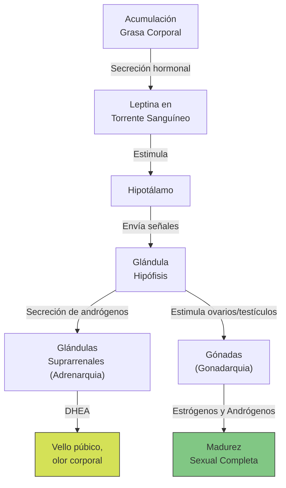
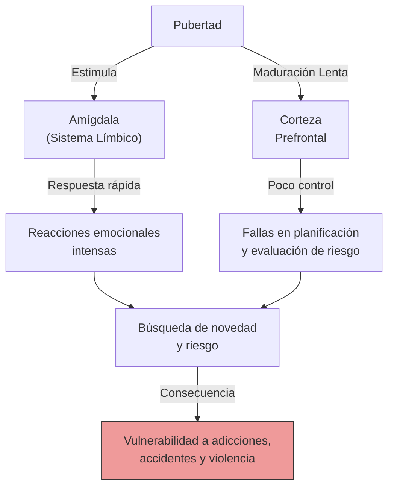

# Guía de Estudio: Unidad 7 - Clase 12 - Adolescencia y Desarrollo Físico

## 1. Tesis Central o Resumen Ejecutivo

La adolescencia constituye una transición del desarrollo entre la niñez y la adultez, que implica profundos cambios físicos, cognitivos, emocionales y sociales. No se trata simplemente de un fenómeno biológico, sino de un constructo social que ha ido modificándose a lo largo de la historia y difiere según el contexto cultural y económico. El inicio biológico de esta etapa está marcado por la pubertad, un complejo proceso hormonal secuencial (adrenarquia y gonadarquia) que conduce a la madurez sexual y a la capacidad reproductiva.

A nivel neurológico, el cerebro adolescente se encuentra en un estado de "trabajo en progreso", caracterizado por una poda sináptica, aumento de sustancia blanca y un desfase madurativo entre la amígdala (emociones) y los lóbulos frontales (razonamiento y control de impulsos), lo que explica la vulnerabilidad a conductas de riesgo. A nivel de salud, si bien es una etapa de oportunidades, también presenta riesgos significativos en torno a la imagen corporal (trastornos de la conducta alimentaria), el abuso de sustancias, la depresión y el suicidio. El desarrollo saludable se encuentra fuertemente mediado por factores protectores ambientales, familiares y escolares.

## 2. Desarrollo Analítico Profundo

### La Adolescencia como Construcción Social y Transición del Desarrollo

La adolescencia surge históricamente en Occidente durante el siglo XX como una etapa vital independiente. Anteriormente, en sociedades preindustriales, los niños entraban al mundo adulto al alcanzar la madurez física o al comenzar a trabajar. En la actualidad, factores como la urbanización, el aumento de la expectativa de vida, la reducción de nacimientos, y la rápida expansión de tecnologías avanzadas, han prolongado esta transición.

Los jóvenes hoy requieren más años de escolaridad para insertarse en el mercado laboral, al tiempo que la pubertad se inicia a edades más tempranas. Esta brecha entre la maduración biológica y la independencia social define a la adolescencia moderna. Aunque la globalización ha universalizado esta etapa, su vivencia difiere culturalmente. Por ejemplo, en diversas sociedades no occidentales o rurales, las niñas enfrentan mayores restricciones y preparación temprana para roles domésticos, mientras que los varones gozan de mayor libertad pero enfrentan mayores riesgos de violencia y mortalidad.

### La Pubertad: El Final de la Niñez

La pubertad es el proceso biológico que conduce a la madurez sexual o fertilidad. Se desencadena por un aumento en la producción hormonal y se divide en dos etapas fundamentales:

1. **Adrenarquia**: Comienza alrededor de los 7 u 8 años. Las glándulas suprarrenales segregan andrógenos, principalmente dehidroepiandrosterona (DHEA). Esto genera el crecimiento del vello púbico, axilar y facial, un crecimiento corporal acelerado, olor corporal y piel más grasa. Hacia los 10 años, los niveles de DHEA son 10 veces mayores que en la primera infancia, y se asocia con las primeras atracciones sexuales.

2. **Gonadarquia**: Es la maduración de los órganos sexuales (ovarios en niñas, testículos en varones). Los ovarios aumentan la secreción de estrógenos (estradiol), estimulando el crecimiento genital, mamario y vello púbico. Los testículos aumentan la producción de andrógenos (testosterona), que promueve el crecimiento genital, aumento de masa muscular y vello corporal.

Se postula que el inicio puberal requiere una cantidad crítica de grasa corporal, medida por la hormona *leptina*, la cual indica al hipotálamo que hay reservas suficientes para la reproducción. Esto explica por qué el sobrepeso en la niñez puede precipitar el inicio puberal.

### Características Sexuales y Signos de la Pubertad

- **Características Sexuales Primarias**: Son los órganos directamente implicados en la reproducción (ovarios, trompas, útero, vagina, testículos, pene, escroto).
- **Características Sexuales Secundarias**: Signos fisiológicos de maduración que no involucran directamente los órganos reproductivos (mamas, vello corporal, desarrollo muscular, cambios en la voz y la piel, ensanchamiento de pelvis u hombros).

**El Estirón o Crecimiento Rápido de la Adolescencia**:
Consiste en un aumento agudo en estatura y peso que antecede a la madurez sexual. En las niñas, suele iniciar entre los 9.5 y 14.5 años, alcanzando su estatura completa cerca de los 15. En los varones, inicia entre los 10.5 y 16 años, completándose hacia los 17. Esto genera que temporalmente (alrededor de los 11-12 años), las niñas sean más altas y fuertes que los varones. El crecimiento desparejo de extremidades respecto al tronco puede dar una apariencia "desgarbada", lo cual impacta psicológicamente en la imagen corporal del adolescente, como lo relataba Anne Frank en su diario respecto a sus prendas que ya no le quedaban y su torpeza.

**Hitos de Madurez Sexual**:
- **Espermarquia**: Primera eyaculación en el varón, a menudo en forma de polución nocturna (edad promedio: 13 años).
- **Menarquia**: Primera menstruación en la niña (edad promedio: 10 a 16.5 años).

### Tendencia Secular y Factores Contextuales del Desarrollo

Se observa una *tendencia secular* a un descenso histórico en la edad de inicio de la pubertad, atribuible a mejores estándares de vida, salud, nutrición y cuidados, así como al aumento del sobrepeso infantil. De hecho, durante la pandemia de COVID-19, se registró un alarmante aumento en los casos de pubertad precoz (antes de los 8 años en niñas), fuertemente asociado a la ganancia de peso rápida por sedentarismo y mala alimentación, lo que activa primitivos mecanismos biológicos que interpretan la reserva de grasa como viabilidad para la reproducción.

El momento de la pubertad también responde a factores genéticos y familiares. Investigaciones sugieren que las niñas que crecen sin la figura paterna (o con exposición temprana a feromonas de varones adultos no familiares, como padrastros) pueden presentar menarquia temprana. Además, el ambiente familiar estresante se asocia a un adelanto puberal.

### Impacto Psicológico del Momento de la Maduración

El momento en que ocurre la maduración tiene fuertes ramificaciones psicológicas:
- **Varones de maduración temprana**: Pueden presentar mayor autoestima, popularidad y liderazgo, pero a veces experimentan ansiedad por las altas expectativas adultas.
- **Varones de maduración tardía**: Suelen sentirse inseguros, cohibidos, dependientes y con mayores conflictos, al ser más bajos y menos fuertes que sus pares.
- **Niñas de maduración temprana**: Son las más vulnerables psicológicamente. Suelen sentirse incómodas con sus cuerpos desarrollados precozmente, experimentan mayor angustia, riesgo de depresión, trastornos de conducta alimentaria, abuso de sustancias, y vinculación temprana con pares mayores o conductas de riesgo.
- **Niñas de maduración tardía**: Tienden a sobrellevar mejor la transición, aunque temporalmente puedan sentir ansiedad por el retraso respecto a sus pares.

### El Cerebro Adolescente

Lejos de estar maduro, el cerebro adolescente experimenta cambios estructurales y funcionales drásticos.

1. **Aumento y Poda de Sustancia Gris**: Hay un sobrecrecimiento rápido de conexiones neuronales (sustancia gris) seguido de una masiva *poda sináptica*. El resultado es un cerebro con menos conexiones, pero mucho más fuertes, rápidas (mielinizadas por aumento de sustancia blanca) y eficientes.
2. **Desfase en la Maduración Cortical**:
   - El sistema límbico, especialmente la **amígdala** (asociada al procesamiento emocional rápido, reactivo e instintivo), madura de manera temprana.
   - La **corteza prefrontal** (asociada a la planificación, razonamiento, regulación emocional, juicio y control de impulsos) madura tardíamente, extendiéndose su desarrollo hasta los veintitantos años.

Este desfase neurobiológico explica por qué los adolescentes, al procesar estímulos sociales o emocionales, reaccionan con exabruptos o impulsividad, y por qué se involucran en conductas de alto riesgo (consumo de sustancias, conducción imprudente, actividad sexual sin protección): su sistema de búsqueda de recompensas y emociones está plenamente activo, pero sus frenos ejecutivos (corteza prefrontal) aún están subdesarrollados.

### Salud Física, Mental y Conductas de Riesgo

La adolescencia es un periodo de aparente vigor físico, pero plagado de riesgos vinculados al comportamiento.

**Sueño**: La secreción de melatonina se retrasa en la adolescencia, provocando que los jóvenes tengan sueño más tarde y necesiten despertar más tarde. La deprivación crónica de sueño por horarios escolares impacta negativamente su capacidad cognitiva y estado de ánimo.

**Imagen Corporal y Trastornos de la Conducta Alimentaria (TCA)**: El estirón y el aumento de tejido adiposo (especialmente en niñas) chocan con los ideales de delgadez de los medios de comunicación y las actitudes parentales. Esto lleva a insatisfacción corporal y, en casos extremos, a trastornos como la anorexia nerviosa (que posee la tasa más alta de mortalidad psiquiátrica) y la bulimia. Las señales de alarma incluyen dietas secretas, ejercicio obsesivo, interrupción del ciclo menstrual y distorsión de la propia imagen.

**Uso y Abuso de Sustancias**: Los cerebros en desarrollo son más vulnerables a los neurotóxicos.
- **Alcohol**: Altera profundamente el aprendizaje y la memoria a largo plazo en el adolescente.
- **Marihuana**: Altera la velocidad de procesamiento, la atención y puede ser adictiva, contrariamente al mito popular.
- **Medicamentos recetados**: Alto uso no indicado de ansiolíticos y analgésicos.

**Depresión y Suicidio**: La depresión adolescente no siempre se manifiesta como tristeza profunda, sino frecuentemente como irritabilidad constante, hostilidad o aburrimiento crónico (anhedonia). Las mujeres tienen mayores tasas de depresión e intentos de suicidio, mientras que los varones cometen suicidios consumados con mayor frecuencia (uso de métodos más letales). El suicidio es la segunda causa de muerte en este grupo etario, precedido sólo por los accidentes de tránsito.

**Factores Protectores**: La resiliencia y la salud mental dependen fuertemente del contexto. Los principales factores de protección son:
- La conexión emocional y el sentimiento de pertenencia en la familia y la escuela.
- El tiempo compartido y de calidad con padres disponibles.
- Expectativas de logro positivas y realistas por parte de adultos significativos (padres, docentes).
- Participación frecuente en deportes, que mejora el bienestar, la resistencia al estrés y el rendimiento escolar.

## 3. Glosario de Conceptos Clave

| Concepto | Definición |
|---|---|
| **Adolescencia** | Transición del desarrollo entre la infancia y la adultez que implica profundos cambios físicos, cognitivos y psicosociales, fuertemente influida por factores sociales, culturales y económicos. |
| **Pubertad** | Proceso fisiológico complejo mediante el cual la persona alcanza la madurez sexual y la capacidad para reproducirse. |
| **Adrenarquia** | Primera etapa de la pubertad; maduración de las glándulas suprarrenales que aumentan la secreción de andrógenos (DHEA), generando vello púbico y corporal. |
| **Gonadarquia** | Segunda etapa de la pubertad; maduración de los órganos sexuales (testículos y ovarios) impulsada por estrógenos y andrógenos. |
| **Espermarquia** | Primera eyaculación involuntaria en el varón, generalmente durante el sueño nocturno (polución nocturna). |
| **Menarquia** | Primer episodio de menstruación en la niña, marcando un hito tardío en la secuencia del desarrollo físico femenino. |
| **Características Sexuales Primarias** | Órganos directamente involucrados y necesarios para la reproducción biológica (ej. ovarios, testículos). |
| **Características Sexuales Secundarias** | Señales fisiológicas de maduración sexual que no implican a los órganos reproductivos directos (ej. desarrollo mamario, vello facial, ensanchamiento de hombros). |
| **Estirón Adolescente** | Aumento brusco y rápido en la estatura, el peso y el crecimiento muscular y óseo que precede a la madurez sexual completa. |
| **Tendencia Secular** | Patrón transgeneracional que evidencia el descenso en la edad de inicio de la pubertad en las poblaciones, debido a cambios en nutrición y estándares de vida. |
| **Poda Sináptica** | Proceso neurológico por el cual se eliminan conexiones neuronales no utilizadas, haciendo que los circuitos sobrevivientes sean más fuertes y eficientes. |

## 4. Citas Críticas

> [!IMPORTANT]
> "La pubertad es un mecanismo evolucionado que ocurre para aumentar al máximo las probabilidades de reproducción exitosa y su evolución es una respuesta a las circunstancias y demandas ambientales."

> [!IMPORTANT]
> "Los adolescentes tempranos (edades 11 a 13 años) utilizaron preferentemente la amígdala... Los adolescentes mayores tenían mayor probabilidad de utilizar los lóbulos frontales, asociados a la planificación, razonamiento, regulación emocional y control de impulsos."

> [!IMPORTANT]
> "La depresión en los jóvenes no necesariamente aparece como tristeza, sino como irritabilidad, aburrimiento o incapacidad para experimentar placer."

> [!IMPORTANT]
> "Las niñas con un porcentaje más alto de grasa corporal en la segunda infancia y aquellas que experimentan aumento inusual de peso entre los cinco y nueve años de edad muestran un desarrollo puberal más temprano."

## 5. Preguntas de Autoevaluación

1. **Explique la diferencia fundamental entre la adrenarquia y la gonadarquia en el proceso de la pubertad, y mencione qué cambios físicos específicos produce cada una.**
2. **Analice por qué la adolescencia es considerada un "constructo social" y no únicamente una etapa biológica inmutable. Proporcione ejemplos de cómo difiere su vivencia según el contexto cultural y económico.**
3. **Describa la asimetría o "desfase" en el desarrollo neurológico del cerebro adolescente (amígdala vs. lóbulos frontales) y cómo este fenómeno explica la propensión a involucrarse en conductas de riesgo.**
4. **¿Qué es la "tendencia secular" en el inicio de la pubertad y qué factores contemporáneos, como los observados durante la pandemia de COVID-19, han contribuido a acelerar este proceso?**
5. **Contraste los efectos psicológicos de la maduración física temprana entre varones y mujeres. ¿Por qué las niñas de maduración temprana se consideran el grupo de mayor vulnerabilidad psicosocial?**
