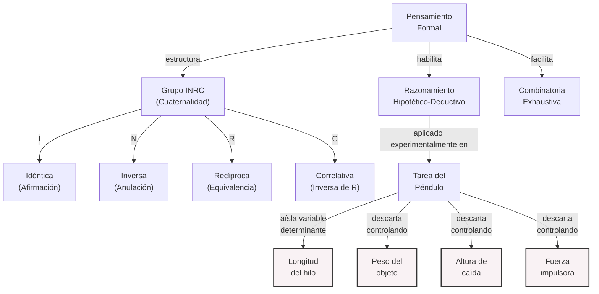
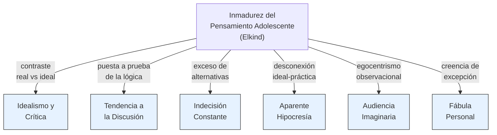

# Guía de Estudio: Desarrollo Cognitivo en la Adolescencia (Clase 13)

## 1. Tesis Central o Resumen Ejecutivo

El desarrollo cognitivo durante la adolescencia marca una transición fundamental desde un pensamiento anclado en lo concreto y tangible hacia la capacidad de abstracción plena. Según Jean Piaget, esta etapa se define por el ingreso al período de las **Operaciones Formales**, donde el adolescente logra liberar su pensamiento del "aquí y ahora" y situar lo real dentro de un abanico de posibilidades hipotéticas. Este avance estructural y funcional permite el razonamiento hipotético-deductivo, la combinatoria sistemática y la comprensión de símbolos complejos. 

Sin embargo, esta maduración no ocurre en el vacío ni está exenta de fricciones. El neurólogo y psicólogo David Elkind postula que el dominio inicial de estas nuevas capacidades cognitivas genera formas inmaduras de pensamiento, caracterizadas por el egocentrismo, el idealismo y la percepción de invulnerabilidad. En paralelo, el desarrollo neurológico (maduración de los lóbulos frontales y aumento de la velocidad de procesamiento) apuntala una expansión sin precedentes en el vocabulario y la sofisticación lingüística, evidenciando que el desarrollo intelectual, afectivo y social progresan de forma interdependiente.

## 2. Desarrollo Analítico Profundo

### 2.1. Cambios en el Procesamiento de la Información (Cambios Estructurales y Funcionales)

El cerebro adolescente experimenta transformaciones profundas que optimizan el procesamiento de la información. Estos cambios se dividen en dos categorías principales:

**Cambios Estructurales:**
* **Desarrollo de los lóbulos frontales:** Fundamentales para las funciones ejecutivas, la planificación, el control de impulsos y el juicio.
* **Expansión de la memoria:** Aumenta significativamente la capacidad de la memoria de trabajo (encargada de retener y manipular información a corto plazo) y la cantidad de memorias almacenadas a largo plazo.
* **Tipos de conocimiento acumulado:** Se incrementa el conocimiento declarativo ("saber qué"), el conocimiento procedimental ("saber cómo") y el conocimiento conceptual ("saber por qué").

**Cambios Funcionales:**
* **Velocidad de procesamiento:** Aumenta exponencialmente, permitiendo resolver problemas y recuperar información de manera mucho más rápida.
* **Control de la Función Ejecutiva:** Mejora la capacidad para razonar, evocar información y aprender. Se perfecciona el control inhibitorio (alcanzando niveles adultos hacia los 14 años), mientras que la maduración plena de la memoria de trabajo puede extenderse hasta los 19 años.

### 2.2. Maduración Cognitiva: El Período de las Operaciones Formales (Piaget)

A partir de los 11 años aproximadamente, el individuo ingresa en el estadio de las **Operaciones Formales**, el nivel más alto del desarrollo cognitivo en la teoría piagetiana.

**El Pensamiento Abstracto y el Razonamiento Hipotético-Deductivo:**
A diferencia del niño en operaciones concretas, el adolescente ya no está limitado por sus experiencias espaciotemporales inmediatas. Logra una diferenciación crucial entre *forma* y *contenido*, lo que le permite razonar con lógica impecable sobre proposiciones falsas, desconocidas o completamente hipotéticas.
El lenguaje adquiere un rol central: las proposiciones lingüísticas reemplazan a los objetos físicos concretos en el razonamiento (pueden utilizar símbolos para representar otros símbolos, como la "X" en el álgebra, o comprender metáforas y alegorías abstractas como el amor, la libertad o la justicia).

**La Tarea del Péndulo (La Inducción de Leyes):**
Piaget e Inhelder diseñaron la tarea del péndulo para evaluar el razonamiento hipotético-deductivo. El problema consiste en descubrir qué variable determina la velocidad de oscilación del péndulo.
* **Adam a los 7 años (Preoperacional):** Afronta el problema con tanteos aleatorios (cambia peso y longitud simultáneamente sin lógica). No llega a una conclusión válida.
* **Adam a los 10 años (Operaciones Concretas):** Descubre que la longitud y el peso afectan, pero al variar ambos factores al mismo tiempo, no logra aislar cuál es el determinante esencial.
* **Adam a los 15 años (Operaciones Formales):** Aborda el problema de forma sistemática y metódica. Plantea hipótesis sobre cuatro variables: longitud de la cuerda, peso del objeto, altura de caída y fuerza de impulso. Para ponerlas a prueba, varía **un solo factor a la vez** mientras mantiene constantes los otros tres. Así, descubre inexorablemente que *solo la longitud de la cuerda* determina la velocidad de oscilación.

**La Combinatoria y el Grupo INRC:**
Las operaciones formales permiten combinar objetos e ideas de modo exhaustivo. Además, se consolida el **Grupo INRC** (grupo de las dos reversibilidades integradas):
1. **I (Idéntica):** Afirmación original.
2. **N (Inversa):** La anulación de I.
3. **R (Recíproca):** Invierte el efecto sin negar la variable directamente.
4. **C (Correlativa):** La inversa de la recíproca.
Esta estructura permite comprender proporciones, dobles sistemas de referencia y nociones complejas de probabilidad.

**Críticas al Enfoque de Piaget:**
Estudios posteriores revelaron que entre un tercio y la mitad de los adultos jamás alcanzan las capacidades puras definidas por Piaget. Además, quienes sí logran el razonamiento abstracto no siempre lo aplican para resolver problemas en su vida cotidiana. Piaget subestimó el rol de la acumulación de conocimientos, el contexto cultural, la metacognición y la estimulación ambiental específica.

### 2.3. La Inmadurez del Pensamiento Adolescente (David Elkind)

El psicólogo David Elkind argumenta que muchos comportamientos típicos de los adolescentes no son simples "rebeldías", sino el resultado de **intentos inexpertos por utilizar las operaciones formales recién adquiridas**. Identificó 6 características:

1. **Idealismo y tendencia a la crítica:** Al imaginar mundos ideales (posibles), perciben cuán lejos está el mundo real. Se vuelven hiperconscientes de la hipocresía social y descubren defectos en sus padres y autoridades.
2. **Tendencia a la discusión:** Buscan poner a prueba sus nuevas capacidades lógicas debatiendo incansablemente, aunque a menudo anclados en su propia perspectiva.
3. **Indecisión:** Al tener la capacidad de barajar múltiples alternativas simultáneas, pero carecer de la experiencia (estrategias eficaces) para ponderarlas, les cuesta tomar decisiones cotidianas.
4. **Aparente hipocresía:** No logran vincular consistentemente la expresión de un ideal moral elevado con los sacrificios prácticos requeridos para alcanzarlo.
5. **Autoconciencia (Audiencia Imaginaria):** Es la creencia obsesiva de que un observador externo (un "público") está tan preocupado y pendiente de los pensamientos, apariencia y conducta del adolescente como él mismo lo está.
6. **Suposición de singularidad e invulnerabilidad (Fábula Personal):** La convicción íntima de ser especial, único y de no estar sujeto a las reglas naturales o sociales que gobiernan al resto. Esto explica las conductas de riesgo, ya que sienten que "nada malo les puede pasar" (aunque investigaciones recientes matizan esto último, demostrando que muchos jóvenes son conscientes de sus riesgos).

### 2.4. Desarrollo del Lenguaje en la Adolescencia

El avance cognitivo impulsa el vocabulario: hacia los 16-18 años, el joven promedio domina cerca de 80.000 palabras.
El pensamiento abstracto les permite analizar conceptos profundos (justicia, amor, libertad) y expresar relaciones lógicas complejas ("por el contrario", "sin embargo"). Toman conciencia de que las palabras son símbolos con múltiples capas, deleitándose en el uso de metáforas, ironías y sarcasmo.
Adquieren gran habilidad en la **toma de perspectivas sociales**: adaptan su registro lingüístico dependiendo de si hablan con un par, un niño o una autoridad, buscando persuadir o encajar.

**El Pubilecto:**
Definido por Marcel Danesi, es el dialecto adolescente característico (ej: "cringe", "shipeo", "milipili"). Su función psicológica es doble: por un lado, consolida la pertenencia y la **identidad del grupo de pares**; por el otro, excluye y establece un límite frente al mundo adulto.

### 2.5. Factores del Desarrollo Mental y Transformaciones Afectivas

Piaget sostiene que el paso de lo "real" a lo "posible" genera transformaciones afectivas masivas. La energía afectiva y las estructuras cognitivas avanzan en paralelo. Los factores que impulsan el desarrollo son:
1. Maduración orgánica (necesaria, pero insuficiente por sí sola).
2. Ejercicio y experiencia física y lógico-matemática.
3. Interacciones y transmisiones sociales.
4. **Equilibración (Autorregulación):** El mecanismo coordinador supremo. Frente a una perturbación cognitiva, el sujeto busca reequilibrar su aparato mental integrando la nueva información.

## 3. Glosario de Conceptos Clave

| Concepto | Definición Completa |
| :--- | :--- |
| **Operaciones Formales** | Nivel supremo de desarrollo cognitivo piagetiano (11+ años), caracterizado por el pensamiento abstracto y la capacidad de considerar posibilidades hipotéticas independientes de la realidad concreta. |
| **Razonamiento Hipotético-Deductivo** | Capacidad de formular, someter a prueba y evaluar sistemáticamente hipótesis para resolver un problema, aislando variables de manera metódica (ej. Tarea del Péndulo). |
| **Grupo INRC** | Estructura lógico-matemática integrada por las operaciones Idéntica, Inversa, Recíproca y Correlativa. Permite manejar dobles sistemas de referencia y proporcionalidad. |
| **Audiencia Imaginaria** | Término de Elkind. Egocentrismo adolescente donde el individuo cree ser el centro de atención constante de los demás, sintiéndose continuamente observado y juzgado. |
| **Fábula Personal** | Término de Elkind. Convicción adolescente de que sus vivencias son completamente únicas e incomprendidas por los demás, asociándose a un sentido de invulnerabilidad frente a peligros objetivos. |
| **Pubilecto** | Dialecto o jerga social específica de los adolescentes que refuerza la cohesión identitaria intragrupal y marca una distancia generacional con los adultos. |
| **Funciones Ejecutivas** | Habilidades cognitivas superiores (alojadas en los lóbulos frontales) encargadas del control inhibitorio, la planificación, la flexibilidad mental y la memoria de trabajo. |

## 4. Citas Críticas

> [!IMPORTANT]
> **Sobre la Tarea del Péndulo y el Razonamiento**
> "El adolescente en operaciones formales enuncia todas las hipótesis posibles, variando un factor a la vez (...) manteniendo constantes los otros factores. Se libera de lo concreto y sitúa lo real como un subconjunto de lo posible." (Piaget, J.)

> [!IMPORTANT]
> **Sobre el Egocentrismo Adolescente**
> "Las actitudes inmaduras típicas del adolescente, como la audiencia imaginaria o la aparente hipocresía, no son defectos de carácter, sino manifestaciones de la inexperiencia en el manejo de las flamantes estructuras de las operaciones formales." (Elkind, D.)

> [!IMPORTANT]
> **Sobre las Limitaciones del Modelo Piagetiano**
> "Desde un tercio hasta la mitad de los adultos nunca logran plenamente el nivel de las operaciones formales delineado por Piaget. Además, quienes poseen la capacidad no siempre la aplican espontáneamente a menos que el ambiente los estimule." (Papalia, D.)

## 5. Preguntas de Autoevaluación

1. **Análisis de Caso (Piaget):** Si un niño de 9 años intenta resolver la tarea del péndulo variando el peso y la longitud de la cuerda de forma simultánea, ¿en qué estadio cognitivo se encuentra y por qué fracasa en aislar la variable correcta?
2. **Aplicación Teórica (Elkind):** Una adolescente fuma compulsivamente argumentando que el cáncer de pulmón "le pasa a los ancianos, no a ella". ¿Qué concepto de David Elkind explica este fenómeno de asunción de riesgos y por qué ocurre?
3. **Cambios Estructurales vs Funcionales:** Diferencie los cambios estructurales de los funcionales en el procesamiento de información durante la adolescencia. Proporcione un ejemplo claro de cada uno.
4. **Grupo INRC:** Describa de qué manera las operaciones formales superan a las concretas en el manejo de la reversibilidad y cómo esto impacta en la noción de proporcionalidad.
5. **Lenguaje e Identidad:** ¿Qué es el "pubilecto" y cuál es su doble función psicosocial en el marco de las transformaciones cognitivas y afectivas del adolescente?
