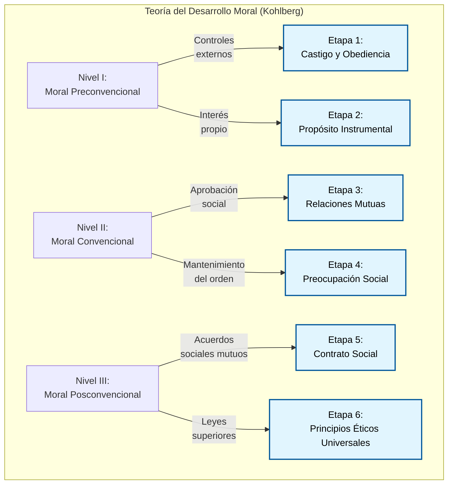
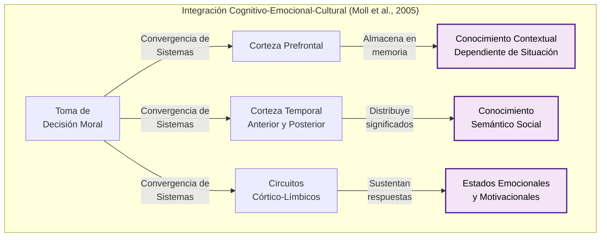

# Guía de Estudio Extendida: Clase 14 - Desarrollo Moral y Ético, Educación y Motivación

## 1. Tesis Central o Resumen Ejecutivo

Durante la adolescencia, el desarrollo no solo involucra maduración biológica y cognitiva, sino también una profunda reestructuración en el razonamiento moral, la motivación académica y la formación de un proyecto de vida. La escuela se consolida como el epicentro de esta transición, moldeando no solo habilidades intelectuales sino también la identidad relacional del individuo. 

Desde la perspectiva moral, la adolescencia permite la transición hacia una moralidad internalizada, tal como lo expone Lawrence Kohlberg, quien relaciona directamente la capacidad de pensamiento abstracto (operaciones formales piagetianas) con el avance hacia niveles convencionales y posconvencionales de justicia. Sin embargo, enfoques contemporáneos —como el intuicionismo de Haidt, las neurociencias de Greene y Moll, y la ética del cuidado de Gilligan— cuestionan la supremacía del razonamiento lógico-racional, reintroduciendo el peso del contexto cultural, el sesgo de género y las respuestas emocionales automáticas en la toma de decisiones morales.

En el ámbito educativo, la permanencia y el éxito escolar trascienden el coeficiente intelectual, estando fundamentalmente determinados por la autoeficacia percibida, la disciplina personal, el estilo de crianza parental (especialmente el democrático) y factores de contención socioeconómica. La manera en que las instituciones y los padres acompañan esta etapa define en gran medida las trayectorias vocacionales y la vulnerabilidad ante la deserción escolar.

## 2. Desarrollo Analítico Profundo

### 2.1. Desarrollo Moral y Ético: La Teoría de Lawrence Kohlberg

La investigación del desarrollo moral ha estado históricamente dominada por los planteos de Lawrence Kohlberg, quien basó su teoría en el estudio de dilemas hipotéticos centrados en la justicia, siendo el más famoso el "Dilema de Heinz" (donde un esposo roba un medicamento excesivamente caro para salvar a su esposa moribunda).

Kohlberg llevó a cabo un estudio longitudinal de más de 30 años con 75 niños (comenzando entre los 10 y 16 años), concluyendo que la manera en que las personas reflexionan y justifican los problemas morales refleja su nivel de desarrollo cognitivo. Estableció tres niveles de desarrollo moral, compuestos por dos etapas cada uno:

**Nivel I: Moral Preconvencional (Típico de 4 a 10 años)**
Las personas actúan según controles externos. La moralidad no está internalizada; se obedece para evitar castigos o para obtener recompensas.
*   **Etapa 1: Orientación hacia el castigo y la obediencia.** El razonamiento se basa en "¿Qué me sucederá?". Las decisiones evitan el quiebre de reglas solo por miedo a la sanción (ej. "Heinz no debe robar porque irá a la cárcel").
*   **Etapa 2: Propósito instrumental e intercambio.** Rige el principio de "Yo te ayudo si tú me ayudas". Las acciones se juzgan en función de cómo satisfacen las necesidades propias o el interés personal (ej. "Heinz puede robar porque necesita a su esposa viva").

**Nivel II: Moral Convencional (Desde los 10 años en adelante)**
Las personas han internalizado las normas de figuras de autoridad. Se preocupan por cumplir las expectativas sociales, ser "buenos" y mantener el orden. Muchas personas se estancan en este nivel incluso en la adultez.
*   **Etapa 3: Mantenimiento de relaciones mutuas y aprobación de los demás.** El enfoque es "¿Soy una buena persona?". Se busca la aprobación del grupo primario (ej. "Heinz debe robar porque es un buen esposo y es lo que se espera de él").
*   **Etapa 4: Preocupación social y conciencia.** La pregunta guía es "¿Qué pasaría si todos hicieran lo mismo?". Se respeta el sistema social, la ley y el orden universal para evitar el caos (ej. "Heinz no debe robar porque, aunque sea trágico, las leyes deben respetarse por sobre todo").

**Nivel III: Moral Posconvencional (Temprana adolescencia o adultez joven, si se alcanza)**
Se reconocen los conflictos entre normas morales y legales. Los juicios se basan en principios abstractos de derecho, equidad y justicia.
*   **Etapa 5: Moral de contrato, de derechos individuales y leyes democráticamente aceptadas.** Las leyes son acuerdos sociales mutuos, pero si una ley es injusta o viola derechos fundamentales (como el derecho a la vida), puede ser cuestionada o transgredida racionalmente (ej. "Las leyes no previeron esta circunstancia; robar está justificado para proteger la vida").
*   **Etapa 6: Moral de los principios éticos universales.** Las decisiones se basan en normas éticas altamente internalizadas (justicia, dignidad, igualdad) sin importar las restricciones legales o las opiniones sociales.

### 2.2. Evaluación Crítica a Kohlberg y Teorías Alternativas

Si bien la teoría de Kohlberg dominó la psicología moral, ha recibido críticas contundentes:

*   **Desarrollo Cognitivo vs. Moral:** Un nivel cognitivo alto (operaciones formales) es necesario pero no suficiente para alcanzar un alto nivel moral. 
*   **Razonamiento vs. Comportamiento:** Una persona puede razonar en términos posconvencionales frente a un dilema abstracto, pero no necesariamente comportarse de forma ética en la vida real. Factores contextuales influyen; estudios demostraron que individuos en Etapa 5 retrocedían a Etapa 2 cuando sus propios intereses económicos estaban en juego.
*   **Sesgo de Género (Carol Gilligan):** Gilligan argumentó que Kohlberg (quien solo evaluó a varones inicialmente) favoreció una "ética de justicia" típicamente masculina. Ella propuso que las mujeres se orientan más hacia una "ética del cuidado", priorizando la empatía y el mantenimiento de vínculos. Si bien existe evidencia de que las mujeres muestran más conductas prosociales en la adolescencia, las investigaciones posteriores muestran que las diferencias estructurales de género en el razonamiento moral son estadísticamente pequeñas.
*   **Sesgo Etnocéntrico:** Las culturas no occidentales rara vez puntúan por encima de la Etapa 4, dado que culturas más colectivistas no priorizan el "contrato social individualista" como el cénit de la moralidad, evidenciando que el modelo no es transcultural.

**El Giro Intuicionista y las Neurociencias de la Moral**

En respuesta al racionalismo extremo de Kohlberg, Jonathan Haidt (2001) postuló un "Giro Intuicionista". Utilizando casos como el "incesto consentido con anticoncepción" (donde las personas sienten asco y rechazo moral sin poder justificar lógicamente el daño, fenómeno llamado *moral dumbfounding*), Haidt argumentó que el juicio moral es en realidad un proceso de procesamiento dual. Primero surge una intuición emocional rápida, y el razonamiento lógico se recluta a posteriori únicamente para justificar o "motivar" esa intuición inicial. 

Joshua Greene (2002) reforzó esto dividiendo los dilemas en "personales" e "impersonales". Con resonancia magnética funcional, demostró que los dilemas morales personales activan áreas cerebrales socioemocionales (corteza frontal medial, surco temporal superior), mientras que los dilemas impersonales activan regiones de la memoria de trabajo y el razonamiento lógico (corteza prefrontal dorsolateral).

Jorge Moll et al. (2005) integraron estas visiones en un modelo cognitivo-emocional-cultural. Para ellos, la moralidad no descansa sobre valores absolutos, sino que es un conjunto de costumbres culturales que guían la conducta, emergiendo de la convergencia de tres sistemas neurales:

### 2.3. Educación, Escolaridad y Motivación

La escuela es la experiencia central de la adolescencia. No solo instruye en contenidos, sino que forma a la persona que se vincula socialmente, fomenta pasatiempos e inicia el trazado del proyecto de vida vocacional.

**El Rol de la Motivación y la Autoeficacia**
Aunque variables socioeconómicas y la calidad institucional importan, el factor psicológico central para el éxito escolar es la motivación y, específicamente, la autoeficacia percibida (la creencia del estudiante en que puede dominar las tareas y regular su propio aprendizaje). 
*   **Datos empíricos:** Estudios longitudinales han demostrado que la autoeficacia pronostica fuertemente las calificaciones esperadas. Sorprendentemente, un estudio en alumnos de octavo grado encontró que la **disciplina personal** fue dos veces más importante que el **Coeficiente Intelectual (CI)** para explicar las calificaciones académicas.

**Permanencia Escolar vs. Deserción**
La deserción ronda el 5% en algunos contextos occidentales, limitando gravemente las perspectivas futuras. Los factores protectores que evitan la deserción y fomentan la permanencia escolar incluyen:
1. Disfrutar genuinamente de la escuela.
2. Contar con un nivel socioeconómico medio/alto (que asegura recursos materiales y predictibilidad).
3. Alta contención familiar y un nivel educativo alto de los padres.
4. Pertenecer a un entorno de pares que valora explícitamente los logros académicos.
5. Involucramiento institucional: los alumnos están más satisfechos cuando participan de las normas, el plan de estudios es significativo y adaptado a sus necesidades, y se sienten apoyados por los docentes.

**Diferencias de Género en el Aprendizaje**
Históricamente, las mujeres mostraban mejores resultados en lectura y escritura, mientras que los varones retenían una pequeña ventaja en ciencias y matemáticas. Sin embargo, la brecha se está reduciendo gracias a políticas inclusivas. En el campo STEM (Ciencia, Tecnología, Ingeniería y Matemáticas), se observan barreras persistentes para las mujeres, fundadas principalmente en estereotipos culturales, falta de información vocacional y escasez de modelos femeninos a seguir.

### 2.4. Estilos de Crianza e Impacto Educativo

El entorno en el hogar modela las creencias de atribución del adolescente frente al aprendizaje. Se destacan tres estilos de crianza fundamentales:

*   **Padres Democráticos (o Autoritativos):** Se involucran, permiten la discusión y el consenso, elogian el esfuerzo y, ante bajas calificaciones, ofrecen ayuda en lugar de condena. Estos adolescentes desarrollan atribuciones internas de éxito, forjan alta autoeficacia y logran el mayor éxito académico.
*   **Padres Autoritarios:** Desalientan el cuestionamiento, exigen obediencia estricta, aplican castigos y atribuyen las malas notas a "pereza" o falta de esfuerzo moral. 
*   **Padres Permisivos:** Se muestran indiferentes ante los resultados escolares, no establecen normas de horarios o televisión, delegando toda la responsabilidad en el adolescente sin un andamiaje apropiado.
*   **Consecuencias clínicas:** Los estilos autoritarios y permisivos generan con frecuencia una sensación de "indefensión aprendida", convirtiéndose en una profecía autocumplida donde el adolescente deja de esforzarse ante el fracaso reiterado.

### 2.5. Proyecto de Vida y Orientación Vocacional

La transición hacia el mercado laboral difiere dramáticamente según los sistemas nacionales.
*   **Alemania (Modelo de aprendizaje de oficios):** Combina el estudio teórico escolar con trabajo supervisado y remunerado en empresas. El 60% de los estudiantes participa y el 85% consigue empleo rápidamente gracias a que las habilidades adquiridas están estrechamente vinculadas con el mercado laboral real.
*   **Estados Unidos (y similar en gran parte de América Latina):** La escuela secundaria está orientada casi exclusivamente a preparar para la universidad, marginando a quienes no seguirán estudios superiores. Los programas vocacionales o de oficios suelen ser insuficientes, poco coordinados y no responden a la demanda empresarial.

**El Rol del Trabajo en la Adolescencia**
Cerca de los años finales de secundaria, muchos adolescentes trabajan. La literatura distingue dos perfiles:
*   **Aceleradores:** Trabajan más de 20 horas semanales. Suelen provenir de contextos de menor nivel socioeconómico. A corto plazo ganan dinero, pero a largo plazo sufren rezago académico y profesional.
*   **Equilibradores:** Trabajan menos de 20 horas. Suelen provenir de familias con más privilegios socioeconómicos. Logran mantener excelentes trayectorias y continuar sus estudios universitarios con éxito.

## 3. Glosario de Conceptos Clave

| Concepto | Definición Extensa y Contextualizada |
| :--- | :--- |
| **Razonamiento Moral Preconvencional** | Nivel moral según Kohlberg (Etapas 1-2) donde los juicios se rigen por la obediencia, el miedo al castigo externo y la búsqueda pragmática de recompensas personales, careciendo de internalización de normas abstractas. |
| **Razonamiento Moral Posconvencional** | Nivel superior del desarrollo moral (Etapas 5-6). Las personas evalúan las leyes sociales a través de una lente crítica, priorizando principios éticos universales (como la vida humana) por sobre las convenciones y estatutos legales imperantes. |
| **Giro Intuicionista (Haidt)** | Postura psicológica contemporánea que sostiene que la moralidad humana no es predominantemente lógica o deliberativa, sino impulsada por intuiciones y emociones automáticas, operando el razonamiento solo como una justificación posterior (*post hoc*). |
| **Moral Dumbfounding** | Fenómeno donde los individuos mantienen un fuerte rechazo moral intuitivo hacia un acto (como el incesto consentido sin riesgo reproductivo) a pesar de ser incapaces de articular un argumento racional o lógico que demuestre daño o perjuicio. |
| **Autoeficacia Percibida** | La convicción personal e íntima de que se poseen las capacidades necesarias para organizar y ejecutar las acciones requeridas para alcanzar metas específicas. En educación, es un predictor del rendimiento superior al CI. |
| **Indefensión Aprendida** | Estado psicológico derivado de crianzas autoritarias o ambientes punitivos donde el individuo asume que sus acciones no afectarán el resultado, extinguiendo el esfuerzo frente a tareas escolares por anticipar el fracaso invariable. |
| **Estilo de Crianza Democrático** | Modalidad parental que equilibra la exigencia de estándares altos con la receptividad, calidez y el diálogo. Se asocia con los mejores resultados psicosociales y académicos en adolescentes. |
| **Moral de Principios Universales** | Etapa 6 de Kohlberg. Actuación regida exclusivamente por dictámenes éticos internos de justicia, equidad y dignidad humana, los cuales se seguirán incluso si exigen el desobedecimiento civil frente a leyes injustas. |

## 4. Citas Críticas

> [!IMPORTANT] 
> "La autoeficacia percibida de los estudiantes y su disciplina personal son predictores del éxito escolar y calificaciones que superan sistemáticamente al Coeficiente Intelectual. El aprendizaje es, en el fondo, un fenómeno profundamente motivacional."

> [!WARNING] 
> "Kohlberg asumió que el pináculo de la moralidad reside en el razonamiento lógico desapasionado de la justicia. Hoy sabemos, por la evidencia neurocientífica y la teoría intuicionista, que disociar el juicio moral de las estructuras socioemocionales de la corteza temporal y el sistema límbico es biológicamente irreal."

> [!CAUTION] 
> "Un nivel alto de desarrollo cognitivo (alcanzar las operaciones formales) es una condición necesaria pero de ninguna manera suficiente para asegurar un alto desarrollo moral; asimismo, un alto razonamiento moral en dilemas hipotéticos no garantiza un comportamiento ético ante la presión social o intereses personales."

## 5. Preguntas de Autoevaluación

1. **Aplicación Práctica:** Imagina a un adolescente que no se copia en un examen exclusivamente porque "si el profesor me ve, me pone un 1 y mis padres me castigarán sin salidas por un mes". Según la teoría de Kohlberg, ¿en qué nivel y etapa exacta de razonamiento moral se encuentra? Justifique relacionando con los controles externos.
2. **Contraste Teórico:** Contraste la perspectiva racionalista pura de Kohlberg sobre cómo tomamos decisiones morales con la teoría del "Giro Intuicionista" de Jonathan Haidt. ¿Qué rol ocupa la emoción y qué significa el concepto de *moral dumbfounding* en este debate?
3. **Análisis Educativo:** Describa el impacto diferencial que tienen los padres democráticos, autoritarios y permisivos sobre la autoeficacia académica de un estudiante. ¿Por qué la bibliografía afirma que los padres autoritarios pueden fomentar la "indefensión aprendida"?
4. **Debate Neurocientífico:** Según las investigaciones de Greene y la integración cognitivo-emocional de Moll et al. (2005), ¿qué áreas del cerebro se activan diferencialmente frente a dilemas morales de índole fuertemente emocional y personal versus aquellos puramente impersonales e hipotéticos?
5. **Transición Vocacional:** Establezca una comparación crítica entre el modelo de transición hacia la vida laboral de Alemania (aprendizaje de oficios) y el sistema de Estados Unidos. Relacione esto con los perfiles de los adolescentes "aceleradores" y "equilibradores" y sus perspectivas a futuro.
