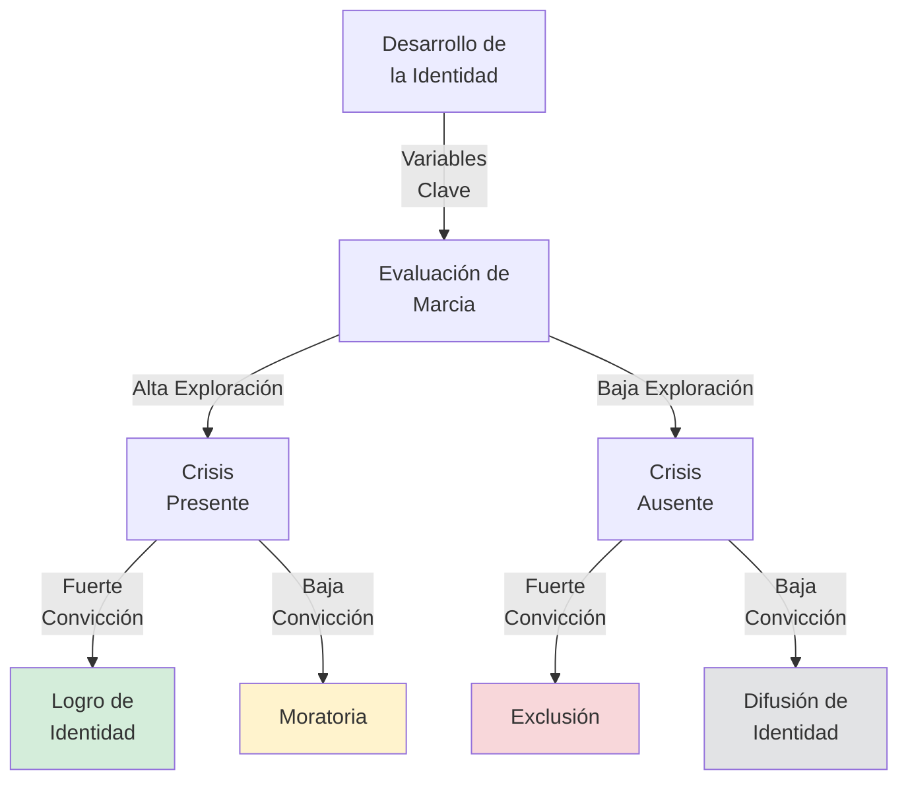
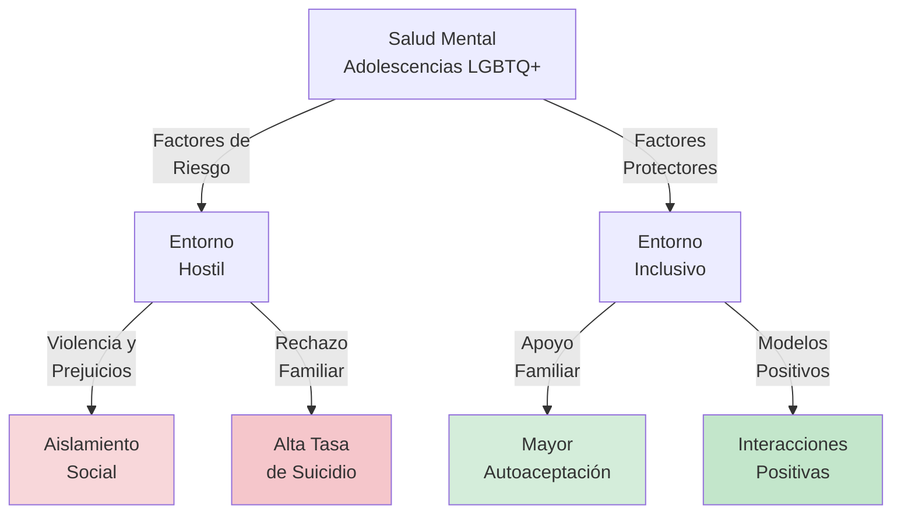

# Guía de Estudio: Clase 15 - Identidad, Sexualidad y Socialización

## 1. Tesis Central o Resumen Ejecutivo

El desarrollo psicosocial en la adolescencia se articula en torno a la búsqueda y consolidación de la **identidad**, un proceso complejo que abarca dimensiones cognitivas, emocionales y sociales. Según Erik Erikson, el adolescente debe resolver la crisis de "identidad versus confusión de roles" para alcanzar la virtud de la fidelidad. Este proceso, lejos de ser lineal, se ramifica en los distintos **estados de identidad** descritos por James Marcia (logro, moratoria, exclusión y difusión), los cuales varían según la presencia de crisis (exploración) y compromiso. 

Paralelamente, la **identidad sexual y la sexualidad** emergen como componentes críticos, moldeados tanto por factores biológicos como por el contexto sociocultural. En la actualidad, el análisis de la diversidad sexual desmiente patologizaciones pasadas, enfatizando que los riesgos de salud mental en adolescentes LGBTQ+ derivan del estigma y la discriminación sistemática, no de su orientación. 

Finalmente, la **socialización** se reconfigura: la familia pasa de ser el núcleo exclusivo a un espacio de individuación y conflicto moderado (desmintiendo el mito de la "tormenta y estrés" generalizada), mientras los pares cobran una relevancia vital. Se advierte también sobre los factores de riesgo y protección frente a conductas de riesgo, como el embarazo adolescente y la delincuencia juvenil, destacando la necesidad de políticas públicas como la ESI (Educación Sexual Integral) y el apoyo familiar y comunitario.

## 2. Desarrollo Analítico Profundo

### La Búsqueda de la Identidad: Perspectivas de Erikson y Marcia

La adolescencia trae consigo la capacidad cognitiva para construir una "teoría del yo". Erikson postula que la tarea principal es enfrentarse a la crisis de **identidad versus confusión de identidad**. La identidad se forja al resolver tres cuestiones vitales:
1. La elección de una ocupación.
2. La adopción de valores (ideología).
3. El desarrollo de una identidad sexual satisfactoria.

Para que este proceso sea sano, la sociedad debe ofrecer una **moratoria psicosocial**, un periodo de libertad para explorar sin las responsabilidades adultas definitivas. La resolución exitosa de esta crisis culmina en la virtud de la **fidelidad**: la lealtad sostenida y la capacidad de confiar en uno mismo y en los propios ideales.

James Marcia operacionalizó la teoría de Erikson proponiendo cuatro **estados de identidad**, determinados por dos variables: la **crisis** (periodo de exploración y toma de decisiones) y el **compromiso** (inversión personal en una ocupación o sistema de creencias).

- **Logro de Identidad:** El adolescente ha pasado por una crisis exploratoria y ha establecido compromisos firmes. Tienen alta autoestima, autonomía y madurez social.
- **Moratoria:** Se encuentran en plena crisis, buscando alternativas, pero sin haber llegado a un compromiso. Muestran niveles altos de ansiedad, pero son reflexivos.
- **Exclusión:** Han adoptado compromisos (usualmente los de sus padres) sin haber pasado por una crisis exploratoria. Suelen ser dogmáticos y obedientes a la autoridad.
- **Difusión de Identidad:** Carecen de compromisos y no están en proceso de búsqueda activa. Se asocian con baja autoestima, aislamiento y falta de dirección.

Es crucial entender que la identidad tiene una **alta plasticidad**; no son etapas fijas, sino estados móviles que pueden renegociarse mediante micro-cambios cotidianos.

### Factores de Género y Etnicidad en la Identidad

Carol Gilligan criticó el enfoque androcéntrico de Erikson, argumentando que en las mujeres el sentido del yo se desarrolla fuertemente a través de la formación de relaciones interpersonales (conectividad y cuidado), más que en la simple separación e individuación. No obstante, investigaciones recientes sugieren que las diferencias individuales pesan más que las de género, aunque la autoestima femenina suele verse más afectada durante la pubertad.

Para los jóvenes de grupos minoritarios, la raza y el origen étnico son centrales. El modelo de Phinney identifica estados similares a los de Marcia (difusión, exclusión, moratoria, logro) referidos a la etnicidad. La **socialización cultural** —prácticas parentales que enseñan tradiciones e inculcan orgullo étnico— fortalece una identidad étnica positiva, funcionando como barrera contra la discriminación, la cual puede generar depresión y bajo rendimiento escolar.

### Sexualidad: Identidad, Conducta y Diversidad

La identidad sexual abarca verse a uno mismo como un ser sexual, reconocer la orientación, y formar vínculos. 

- **Sexo:** Referencia biológica asignada al nacer.
- **Identidad de Género:** Percepción íntima e individual del género.
- **Expresión de Género:** Cómo se manifiesta el género al exterior.
- **Atracción/Orientación Sexual:** Foco constante del interés romántico y sexual.

La **diversidad sexual** ha sido históricamente patologizada por una sociedad inmersa en la **heteronormatividad** (la presunción de que la heterosexualidad es la única forma válida). Las estadísticas (como las de la Fundación Todo Mejora) muestran que adolescentes LGBTQ+ tienen una probabilidad de suicidio 4 veces mayor que sus pares heterosexuales. Sin embargo, la evidencia científica aclara que la diversidad no causa problemas de salud mental per se; estos problemas surgen del rechazo, la violencia, el aislamiento y la discriminación sistemática del entorno.

Los **factores protectores** incluyen: aceptación familiar y comunitaria, modelos positivos de diversidad y redes de pertenencia, lo que incrementa el bienestar psicológico y la autoaceptación.

**Conducta Sexual:**
En Argentina, encuestas indican que casi el 42% de alumnos (13-17 años) han mantenido relaciones sexuales. El uso de preservativos es alarmantemente bajo (solo 14,5% a nivel general y 5% de uso consistente en adolescentes), lo que eleva el riesgo de VIH y sífilis. 

Paralelamente, se observa una fuerte disminución de los embarazos adolescentes no intencionales (de 117.386 en 2013 a 46.236 en 2021). Esto se explica por la implementación de **anticonceptivos de larga duración** (como el implante subdérmico) y la atención autónoma. Sin embargo, las políticas de prevención como la Ley de Educación Sexual Integral (ESI, Ley 26.150) enfrentan recortes presupuestarios severos, amenazando el acceso a la información. A esto se suma el consumo temprano y masivo de pornografía ("hardcore"), que normaliza dinámicas de poder violentas.

### Relaciones con Familia y Pares

El mito de la "tormenta y tensión" generalizada propuesto por Margaret Mead es estadísticamente falso: sólo 1 de cada 5 adolescentes encaja en un patrón crónico de conflicto rebelde severo.

Durante la adolescencia, el **tiempo compartido en familia** cae drásticamente (del 35% al 14% entre los 10 y 18 años). El conflicto que surge se relaciona principalmente con la **individuación**: una lucha por autonomía emocional expresada en discusiones sobre temas mundanos (ropa, horarios, dinero). Las relaciones entre hermanos tienden a volverse menos cercanas al principio, pero más equitativas a medida que se reducen las brechas de competencia.

El grupo de pares reemplaza el tiempo familiar y provee el terreno para ensayar la intimidad y la identidad social.

### Conducta Antisocial y Delincuencia Juvenil

La conducta antisocial tiene raíces biopsicosociales:
- **Factores genéticos/neurológicos:** Explican el 40-50% de la variación en conducta antisocial general, y hasta 60-65% en actos agresivos crónicos.
- **Modelo ecológico (Bronfenbrenner):** Interacción entre el microsistema (crianza deficiente, hostilidad de los padres, asociación con pares antisociales) y el macrosistema (pobreza, entorno comunitario hostil).

La perspectiva a largo plazo es optimista: la gran mayoría de adolescentes con conductas delictivas no se convierten en criminales de por vida. La prevención más eficaz es la atención e intervención en la infancia temprana (durante los primeros 5 años) involucrando apoyo familiar e instituciones de calidad.

## 3. Glosario de Conceptos Clave

| Concepto | Definición |
| :--- | :--- |
| **Identidad (Erikson)** | Concepción coherente del yo formada por metas, valores y creencias con los que la persona se compromete. |
| **Moratoria Psicosocial** | Período de libertad que la sociedad provee a los adolescentes para explorar opciones sin asumir roles adultos definitivos. |
| **Fidelidad** | Virtud que surge tras superar la crisis de identidad; implica lealtad, esperanza y pertenencia. |
| **Crisis (Marcia)** | Período de exploración, evaluación y toma de decisiones conscientes respecto al futuro. |
| **Compromiso (Marcia)** | Inversión personal firme y asunción de una ocupación, creencia o ideología. |
| **Socialización Cultural** | Prácticas de crianza que enseñan a los niños sobre su herencia racial/étnica y promueven orgullo cultural. |
| **Heteronormatividad** | Postulación cultural que asume a la heterosexualidad como la única forma válida de sexualidad. |
| **Individuación** | Proceso psicológico de lucha por la autonomía y diferenciación emocional respecto de la familia de origen. |

## 4. Citas Críticas

> [!IMPORTANT]
> "El papel de los micro-cambios cotidianos: La formación de la identidad no es solo un evento de gran crisis, sino la acumulación de pequeñas reflexiones y compromisos diarios que se renegocian constantemente." (Clase teórica)

> [!IMPORTANT]
> "Históricamente se ha intentado patologizar a las diversidades. Sin embargo, la evidencia muestra que la diversidad sexual por sí misma no se asocia con trastornos mentales... La causa de la mayor incidencia de problemas de salud mental estaría relacionada con la dificultad de vivir en un contexto que te discrimina, te aísla y violenta." (Diapositivas de Clase)

> [!IMPORTANT]
> "La disminución del 60% del embarazo adolescente en Argentina se logró gracias al acceso a anticonceptivos de larga duración (chips), la atención autónoma de adolescentes y el compromiso del personal de salud." (Debate Infobae - Clase 15)

## 5. Preguntas de Autoevaluación

1. Según James Marcia, ¿cómo se definen los estados de "Logro de Identidad" y "Moratoria", y qué papel juegan la crisis y el compromiso en cada uno?
2. ¿De qué manera la "socialización cultural" funciona como un factor protector en el desarrollo de la identidad de adolescentes pertenecientes a minorías étnicas?
3. Explique por qué es incorrecto afirmar que la orientación sexual LGBTQ+ es inherentemente patológica y describa los factores contextuales que incrementan el riesgo de suicidio en esta población.
4. ¿Cuáles han sido las políticas e intervenciones de salud pública que explican la abrupta caída de los embarazos adolescentes en Argentina entre 2013 y 2021?
5. En el contexto de las relaciones familiares, ¿cómo se interpreta la "individuación" y sobre qué temas suelen girar la mayor parte de los conflictos entre padres e hijos adolescentes?
