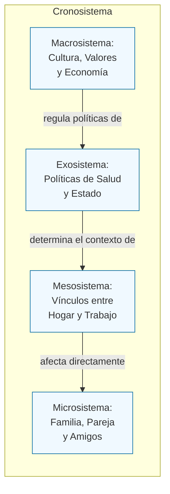
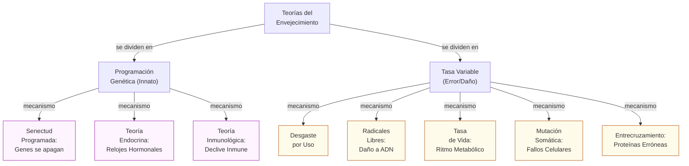

# Guía de Estudio: Unidad 8 - Clase 16 (Adultez y Envejecimiento)

## 1. Tesis Central o Resumen Ejecutivo

El estudio del desarrollo adulto y la vejez es una disciplina relativamente reciente que desafía la visión histórica (sostenida incluso por Freud) de que el desarrollo culmina en la pubertad. Desde la perspectiva actual del **desarrollo del ciclo de vida**, envejecer no es sinónimo de un mero declive biológico, sino un proceso sistemático, multidimensional, multidireccional y plástico de cambio adaptativo. La adultez atraviesa distintas etapas (joven, media y tardía), influenciadas tanto por factores normativos (biológicos e históricos) como no normativos, y enmarcadas por contextos ecológicos complejos. Si bien el envejecimiento primario (genéticamente programado) impone límites biológicos, el envejecimiento secundario (resultado de factores ambientales, enfermedades y estilo de vida) juega un papel determinante en cómo se vivencian los cambios físicos, cognitivos y socioemocionales. Cuestionar el "edadismo" (discriminación por edad) y comprender estas variables resulta crítico para promover un envejecimiento saludable y funcional.

## 2. Desarrollo Analítico Profundo

### La Construcción Social de la Vejez y el Edadismo

Durante décadas, prevaleció en la cultura occidental una "mística del envejecimiento" restrictiva. Betty Friedan, en su obra *The Fountain of Age* (1993), desmintió esta visión a los 70 años, proponiendo a la vejez como una aventura con nuevas fortalezas y no solo como deterioro.

El **edadismo (ageism)** es la discriminación basada en la edad, sostenida por diversos estereotipos. Estos pueden ser:
- **Negativos:** Concebir a los adultos mayores como personas cansadas, torpes, caprichosas, sin interés sexual o sin capacidad de aprender.
- **Positivos:** El estereotipo de la "edad dorada", que imagina la vejez meramente como tiempo de ocio, paz y sin necesidad de productividad, ignorando las problemáticas reales y la diversidad de vivencias.

Asimismo, existe un "doble estándar del envejecimiento" que afecta desproporcionadamente más a las mujeres, penalizándolas social y estéticamente más que a los hombres. En contraposición, en culturas como la de los !Kung San o los Herero, los ancianos adquieren mayor estatus, y en Japón, procesos como la menopausia son transitados con una perspectiva cultural que mitiga su sintomatología negativa.

### Perspectiva del Ciclo Vital y Tipos de Edad

El desarrollo implica un cambio, pero específicamente un **proceso sistemático de cambio adaptativo** que permite al individuo lidiar con condiciones externas e internas. Paul B. Baltes (1987) definió principios fundamentales del ciclo de vida:
- **Desarrollo durante toda la vida:** Cada etapa está influenciada por la anterior.
- **Multidimensionalidad y Multidireccionalidad:** Abarca capacidades físicas, cognitivas y sociales; mientras algunas aumentan (ej. sabiduría), otras disminuyen (ej. agudeza sensorial).
- **Plasticidad:** Capacidad de modificar el desempeño (hasta cierto límite) mediante entrenamiento.
- **Historia y Contexto:** Influencias del entorno sociohistórico.
- **Causalidad múltiple:** Requiere análisis multidisciplinar.

La edad cronológica es insuficiente para evaluar el desarrollo adulto. Por ello, se utilizan otros parámetros:
- **Edad Funcional:** Capacidad de interactuar eficazmente con el entorno físico y social (ej. Actividades de la Vida Diaria - AVD).
- **Edad Biológica:** Condición física y progreso dentro del límite vital humano potencial.
- **Edad Psicológica:** Habilidades para adaptarse a las demandas del entorno (la Dra. Edith Labos investigó profundamente la "edad cognitiva").
- **Edad Social:** Grado de ajuste a las expectativas, normas y roles de la sociedad.

### Etapas de la Adultez y Demografía

El aumento de la expectativa de vida (distinta de la longevidad, que es lo que realmente vive un individuo) ha transformado la demografía. En EE.UU., la población mayor a 65 años pasará del 4% en 1900 al 20% en 2030, requiriendo economías y entornos urbanos adaptados. Las mujeres viven más, pero enfrentan más viudez, soledad y pobreza en esta etapa; mientras que casi 3 de cada 10 adultos mayores viven solos.

Los periodos de la adultez se dividen en:
- **Adultez Joven (20 a 40 años):** Cima biológica, resoluciones vocacionales e intimidad.
- **Adultez Media (40 a 65 años):** Ligero deterioro sensoriomotor, pico de resolución práctica de problemas, "nido vacío".
- **Adultez Tardía (65 años en adelante):** Subdividida en **Adulto mayor joven (hasta 75 años)** y **Adulto mayor anciano (más de 75 años)**.

### La Teoría Bioecológica de Bronfenbrenner

Las influencias sobre el desarrollo adulto (ya sean normativas por edad/historia, o no normativas como ganar la lotería) se estructuran en diferentes niveles del entorno ecológico.

### Teorías Biológicas del Envejecimiento

El declive biológico se conceptualiza como senectud, dividida en dos dimensiones: el **envejecimiento primario** (inevitable y gradual, codificado genéticamente) y el **envejecimiento secundario** (dependiente de enfermedades, estilo de vida y ambiente, por ende, controlable). El "Límite de Hayflick" sugiere que las células humanas tienen un máximo de ~50 divisiones por el acortamiento telomérico, aunque prácticas como la restricción calórica podrían extender la vida.

### Cambios Físicos, Sensoriomotores y Sistema Nervioso

A partir de los 45 años, declinan las habilidades sensoriomotoras y comienza la osteopenia (pérdida de masa ósea). La estatura disminuye (por atrofia de discos y encorvamiento), y el músculo es reemplazado por grasa.
- **Visión:** Aparece la **presbicia** (dificultad para enfocar de cerca por engrosamiento del cristalino), cataratas, glaucoma y degeneración macular.
- **Audición:** La **presbiacusia** afecta la percepción de altas frecuencias.
- **Sistema Nervioso:** A partir de los 30 años el cerebro pierde peso (hasta un 10%). El cerebelo puede perder el 25% de sus células, afectando el equilibrio y la coordinación fina. Funcionalmente, esto lentifica los tiempos de respuesta y disminuye la tolerancia a los cambios térmicos por deterioro del Sistema Nervioso Autónomo.

### Cambios Reproductivos y Sexualidad en la Adultez Mayor

Contrario al estereotipo de falta de interés sexual, la sexualidad sigue siendo activa, aunque muta desde un enfoque puramente coital o genital hacia la intimidad emocional y las caricias.
- **Mujeres (Menopausia):** Entre los 45-55 años ocurre el cese de la ovulación y la menstruación por la caída de estrógenos. El período gradual previo se denomina perimenopausia o climaterio. Los síntomas (bochornos, pérdida de lubricación) pueden ser aliviados, aunque la Terapia de Reemplazo Hormonal (TRH) conlleva riesgos.
- **Hombres (Andropausia):** Hay un descenso paulatino (30-40%) de la testosterona, alargamiento de la próstata e incremento en el tiempo refractario. La disfunción eréctil se asocia predominantemente a patologías crónicas (diabetes, hipertensión) y es tratable, no siendo un declive biológico ineludible.

### Influencias en la Salud: Factores Secundarios

La principales causas de muerte mutan con la edad (accidentes en adultez joven; cardiopatías y cáncer a partir de los 65). Ciertas variables impactan drásticamente:
- **Cáncer de Próstata:** Diagnóstico temprano mediante PSA (Antígeno Prostático Específico) y DRE. Factores dietarios (carnes rojas, lácteos) elevan el riesgo. Los tratamientos van desde prostatectomía hasta "espera vigilante".
- **Género y Raza:** Las mujeres viven más pero reportan más problemas de salud crónicos (brecha de supervivencia disminuida al 5.4 años). Las minorías afroamericanas e hispanas (afectadas por factores de pobreza y exposición a contaminantes ambientales como el plomo) presentan mayores tasas de mortalidad y atención médica deficiente.
- **Estatus Socioeconómico y Redes Interpersonales:** Menor escolaridad correlaciona con enfermedades mortales. Estar casado o convivir provee un notable factor protector inmunológico y reduce estadías hospitalarias; el aislamiento y la soledad exacerban el riesgo cardiovascular y la depresión.
- **Hábitos (Dieta, Ejercicio y Estrés):** El tabaquismo (principal causa de muerte prevenible), el consumo de alcohol, y la obesidad (afecta al 20% de adultos) aceleran el envejecimiento secundario. El locus de control externo frente al estrés produce inmunosupresión crónica.

## 3. Glosario de Conceptos Clave

| Concepto | Definición |
| :--- | :--- |
| **Edadismo (Ageism)** | Discriminación o prejuicio sistemático basado en la edad cronológica de una persona, sostenido por estereotipos tanto negativos como positivos. |
| **Límite de Hayflick** | Principio que estipula que las células humanas tienen una capacidad máxima de división (aproximadamente 50 veces) determinada por el acortamiento de los telómeros. |
| **Envejecimiento Primario** | Proceso de deterioro biológico paulatino, inevitable y genéticamente programado, común a todos los miembros de una especie. |
| **Envejecimiento Secundario** | Deterioro físico resultado de enfermedades, prácticas de salud inadecuadas y factores ambientales; es altamente variable y prevenible. |
| **Presbicia** | Dificultad visual para enfocar objetos cercanos, producto del engrosamiento y pérdida de flexibilidad del cristalino ocular. |
| **Presbiacusia** | Pérdida gradual de la capacidad auditiva, especialmente sensorineural para los tonos de altas frecuencias, exacerbada por factores ambientales. |
| **Plasticidad** | En el paradigma del ciclo vital, la capacidad inherente de los individuos para modificar y mejorar su desempeño y habilidades mediante el entrenamiento. |

## 4. Citas Críticas

> [!IMPORTANT]
> "La expectativa de vida ha aumentado drásticamente, lo cual exige no solo una respuesta biológica, sino un rediseño radical en las economías, políticas de salud y estructuración de los macrosistemas, demostrando la causalidad múltiple del desarrollo que propone Baltes."

> [!IMPORTANT]
> "La sexualidad en la adultez tardía, sistemáticamente anulada por el edadismo, no desaparece, sino que muta hacia una expresión no exclusivamente genital, revalorizando la intimidad afectiva. La disfunción sexual suele originarse en el envejecimiento secundario (enfermedades tratables) y no en el primario."

## 5. Preguntas de Autoevaluación

1. Diferencia exhaustivamente los conceptos de envejecimiento primario y envejecimiento secundario, y relaciona este último con las teorías de tasa variable.
2. Basándote en el modelo de Bronfenbrenner, ejemplifica cómo un cambio en el Macrosistema puede alterar el envejecimiento biológico (Microsistema) de un adulto mayor perteneciente a una minoría étnica.
3. Explica el concepto de "doble estándar del envejecimiento" y argumenta cómo el edadismo afecta la atención clínica y psicológica de los pacientes geriátricos.
4. Desarrolla las diferencias entre la menopausia femenina y el climaterio masculino (andropausia), detallando los cambios hormonales y físicos subyacentes.
5. ¿Por qué la edad cronológica es un indicador insuficiente en el estudio del desarrollo adulto? Define y aplica los conceptos de edad funcional, psicológica y social.
