### Construcción Social de la Adolescencia

Históricamente, en las sociedades preindustriales, los niños ingresaban directamente al mundo adulto una vez que maduraban físicamente o al comenzar a trabajar como aprendices en una vocación. No fue sino hasta el siglo XX que la adolescencia se definió en el mundo occidental como una etapa vital independiente y claramente demarcada.

En la actualidad, la adolescencia es considerada una **construcción social** y se ha convertido en un fenómeno universal impulsado por la globalización. Sin embargo, su manifestación y significado varían profundamente según el contexto cultural, social y económico. Los jóvenes alrededor del mundo están interconectados por la tecnología, compartiendo modas y entretenimiento, lo que ha generado una "globalización de la adolescencia".

La modernización ha traído consigo cambios sociales globales que prolongan esta etapa: mayor urbanización, expectativas de vida más largas, reducción en las tasas de natalidad y la necesidad de una educación y capacitación vocacional mucho más extensas para ingresar a una fuerza de trabajo cada vez más tecnológica. Como consecuencia, el ingreso a las responsabilidades adultas y al matrimonio se retrasa, expandiendo el tiempo que los jóvenes pasan en su propio mundo adolescente, separado del de los adultos.

En muchas partes del mundo en vías de desarrollo, la adolescencia sigue estando fuertemente marcada por roles de género tradicionales. En algunas culturas, las niñas enfrentan mayores restricciones, siendo preparadas exclusivamente para roles domésticos y vigiladas para proteger su castidad y honor familiar, mientras que los varones gozan de mayor libertad y movilidad. No obstante, el acceso expansivo a la educación pública está transformando estos patrones, permitiendo a las mujeres retrasar el matrimonio, tener menos hijos y acceder a nuevas opciones laborales, aunque el progreso sigue siendo desigual a nivel global.

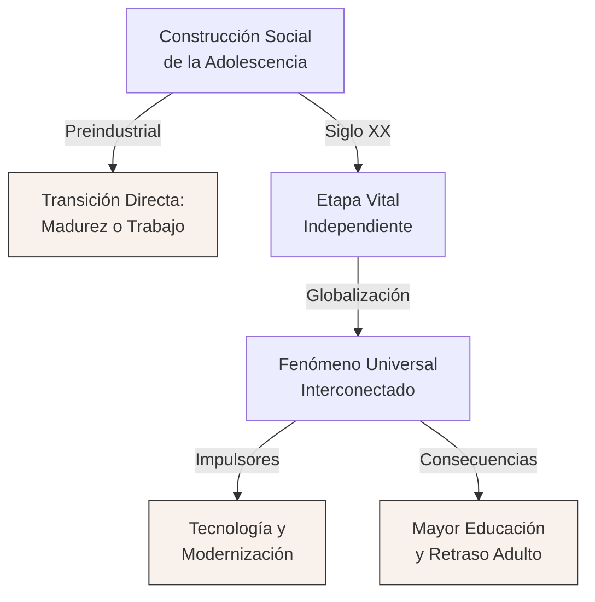
```mermaid
graph TD
    A["Construcción Social<br>de la Adolescencia"]
    
    A -->|"Preindustrial"| B["Transición Directa:<br>Madurez o Trabajo"]
    A -->|"Siglo XX"| C["Etapa Vital<br>Independiente"]
    
    C -->|"Globalización"| D["Fenómeno Universal<br>Interconectado"]
    
    D -->|"Impulsores"| E["Tecnología y<br>Modernización"]
    D -->|"Consecuencias"| F["Mayor Educación<br>y Retraso Adulto"]
    
    style B fill:#f9f2ec,stroke:#333
    style E fill:#f9f2ec,stroke:#333
    style F fill:#f9f2ec,stroke:#333
```

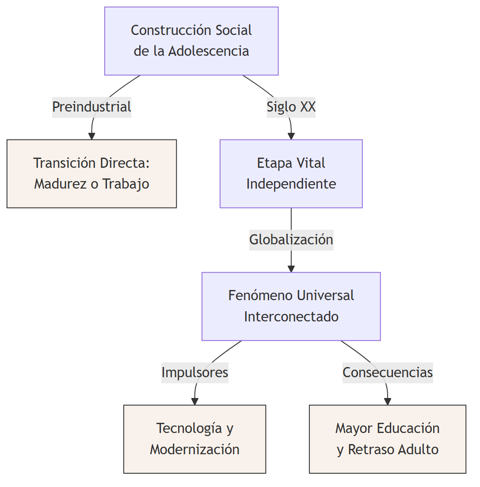

### Transición Desde la Niñez y Adultez Emergente

La adolescencia, definida típicamente entre los 11 y 19 o 20 años de edad, constituye una transición fundamental del desarrollo que abarca profundos cambios físicos, cognitivos, emocionales y sociales. No es un suceso único, sino un periodo prolongado que ofrece tanto riesgos como oportunidades.

Durante la adolescencia temprana (11 a 14 años), se abren grandes oportunidades de crecimiento en múltiples dimensiones: competencia cognitiva, desarrollo de habilidades sociales, consolidación de la autonomía, formación de la autoestima y capacidad para la intimidad. 

Sin embargo, esta transición conlleva riesgos inherentes. Muchos jóvenes enfrentan dificultades para manejar y asimilar todos estos cambios simultáneos. Es un periodo de gran divergencia: mientras la mayoría logra navegar estos desafíos dirigiéndose hacia una adultez plena y productiva, una minoría considerable se enfrenta a problemas importantes, como conductas de riesgo, que pueden comprometer su bienestar futuro. 

La extensión de este periodo transicional hacia la adultez se debe a que la pubertad fisiológica comienza cada vez más temprano, pero las demandas de la sociedad moderna requieren más años de preparación educativa y vocacional antes de asumir el estatus adulto completo.

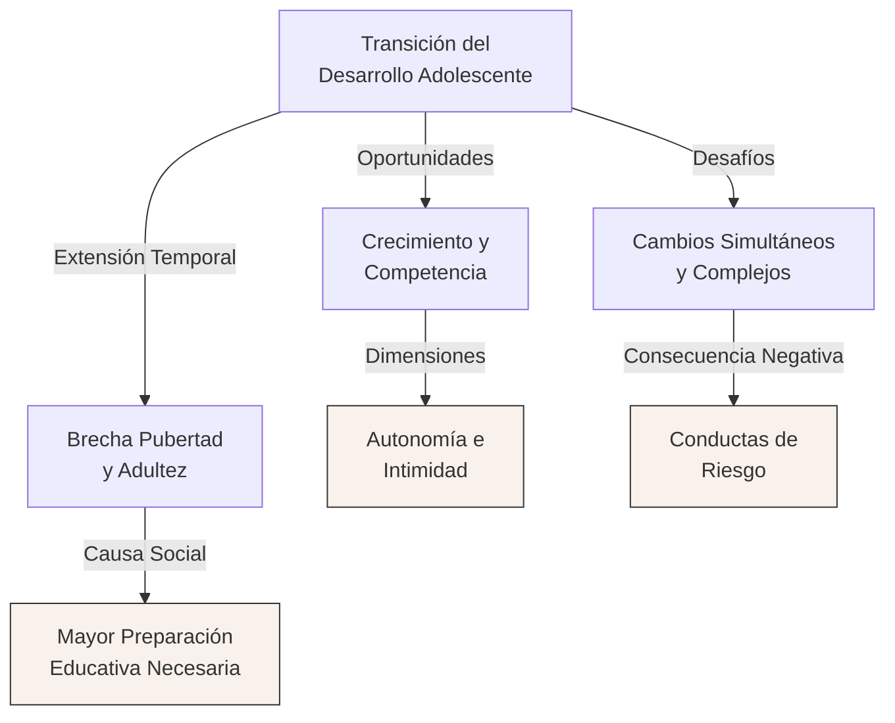
```mermaid
graph TD
    A["Transición del<br>Desarrollo Adolescente"]
    
    A -->|"Oportunidades"| B["Crecimiento y<br>Competencia"]
    A -->|"Desafíos"| C["Cambios Simultáneos<br>y Complejos"]
    A --->|"Extensión Temporal"| D["Brecha Pubertad<br>y Adultez"]
    
    B -->|"Dimensiones"| B1["Autonomía e<br>Intimidad"]
    
    C -->|"Consecuencia Negativa"| C1["Conductas de<br>Riesgo"]
    
    D -->|"Causa Social"| D1["Mayor Preparación<br>Educativa Necesaria"]
    
    style B1 fill:#f9f2ec,stroke:#333
    style C1 fill:#f9f2ec,stroke:#333
    style D1 fill:#f9f2ec,stroke:#333
```

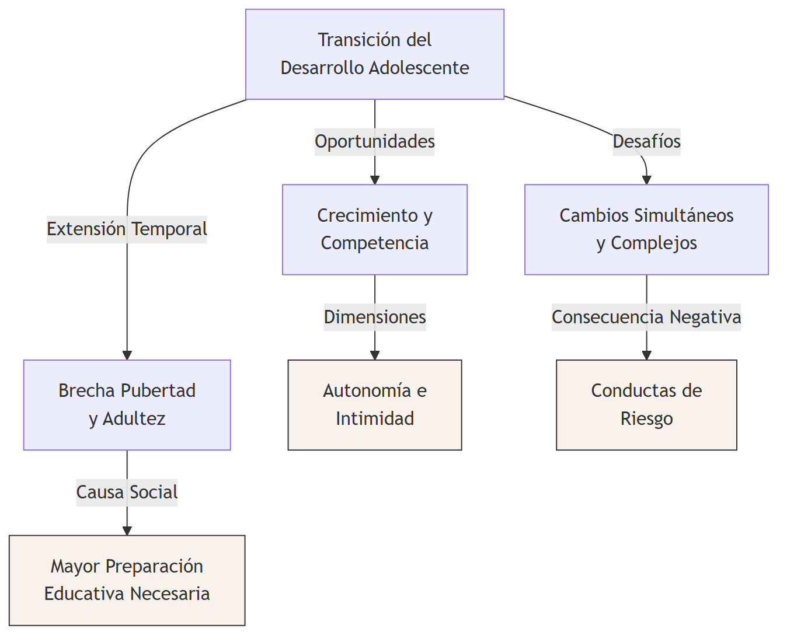

### Cambios Asociados a la Pubertad

La **pubertad** marca el final de la niñez fisiológica; es el proceso biológico complejo mediante el cual una persona alcanza la madurez sexual y la capacidad para reproducirse (fertilidad). 

El proceso puberal se desencadena por cambios hormonales que ocurren en dos etapas secuenciales:

1. **Adrenarquia:** Ocurre alrededor de los 7 u 8 años. Consiste en la maduración de las glándulas suprarrenales (ubicadas sobre los riñones), las cuales comienzan a segregar niveles elevados de andrógenos, principalmente dehidroepiandrosterona (DHEA). Esto impulsa el crecimiento temprano del vello púbico, axilar y facial, acelera el crecimiento corporal y genera cambios en la piel y el olor corporal.
2. **Gonadarquia:** Es la maduración de los órganos sexuales (ovarios y testículos), activada posteriormente. En las niñas, los ovarios aumentan la secreción de estrógenos (estimulando genitales y senos). En los varones, los testículos aumentan la producción de andrógenos, especialmente testosterona (estimulando genitales, masa muscular y vello).

Se ha identificado que la **leptina**, una hormona relacionada con la grasa corporal, juega un papel crucial en el inicio de la pubertad. Su acumulación envía señales al hipotálamo, indicando que el cuerpo tiene reservas suficientes de grasa para sostener la reproducción, lo que a su vez activa la glándula hipófisis para estimular las glándulas sexuales.

Los cambios físicos se dividen en dos categorías:
- **Características sexuales primarias:** Órganos directamente involucrados en la reproducción (ovarios, útero, vagina en mujeres; testículos, pene, próstata en hombres) que maduran y crecen.
- **Características sexuales secundarias:** Signos fisiológicos de madurez sexual no reproductivos (desarrollo de senos, cambio de voz, ensanchamiento de hombros o pelvis, vello corporal).

El **estirón del crecimiento adolescente** es un aumento rápido y abrupto en estatura, peso y desarrollo óseo/muscular. En las niñas comienza antes (entre los 9.5 y 14.5 años), acumulando más grasa subcutánea y ensanchando la pelvis. En los varones ocurre más tarde (entre los 10.5 y 16 años), destacando el crecimiento longitudinal, ensanchamiento de hombros y mayor desarrollo muscular. Esta disparidad temporal hace que, entre los 11 y 13 años, las niñas sean en promedio más altas y pesadas que los varones de su misma edad.

Los hitos definitivos de madurez sexual son:
- **Espermarquia:** La primera eyaculación en el varón (edad promedio de 13 años), a menudo experimentada como una polución nocturna.
- **Menarquia:** La primera menstruación en la mujer, que ocurre en etapas finales del desarrollo puberal femenino (entre los 10 y 16.5 años).

El momento de inicio de la pubertad está influenciado por múltiples factores. Existe una **tendencia secular** (adelanto intergeneracional del inicio puberal debido a mejoras nutricionales y de salud). También impactan factores genéticos y contextuales; por ejemplo, conflictos familiares graves o la ausencia de un padre biológico correlacionan con una menarquia más temprana, posiblemente mediado por estrés, exposición a feromonas masculinas no familiares o factores genéticos compartidos.

**Efectos psicológicos del tiempo puberal:**
El momento de la maduración impacta fuertemente la psique del adolescente, dependiendo de su adaptación y el entorno. 
- **Varones de maduración temprana:** Suelen tener mayor autoestima, ser más populares y seguros, aunque algunos estudios reportan mayor ansiedad, agresividad o presión por actuar como adultos.
- **Varones de maduración tardía:** Tienden a sentirse inadecuados, cohibidos, rechazados y presentan mayores niveles de dependencia e inseguridad.
- **Niñas de maduración temprana:** Son más vulnerables a la angustia psicológica, presentando menor autoestima, insatisfacción corporal, y mayor riesgo de depresión, trastornos alimentarios, conductas antisociales, y actividad sexual precoz.
- **Niñas de maduración tardía:** Por lo general, se adaptan mejor, ya que su desarrollo ocurre al mismo tiempo que la mayoría de sus compañeros varones y otras niñas.

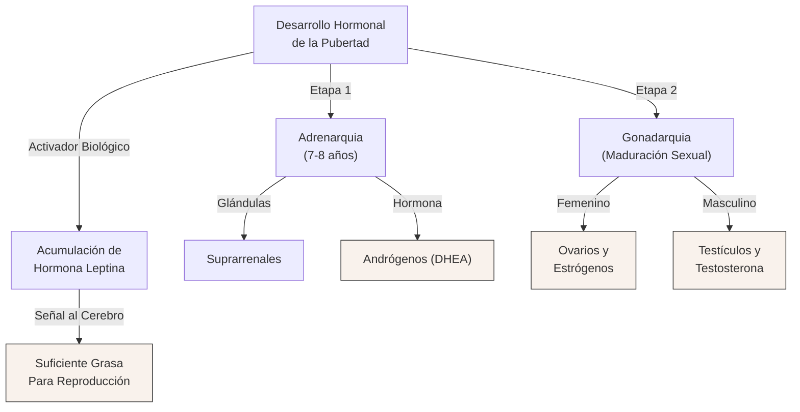
```mermaid
graph TD
    A["Desarrollo Hormonal<br>de la Pubertad"]
    
    A -->|"Etapa 1"| B["Adrenarquia<br>(7-8 años)"]
    A -->|"Etapa 2"| C["Gonadarquia<br>(Maduración Sexual)"]
    A --->|"Activador Biológico"| D["Acumulación de<br>Hormona Leptina"]
    
    B -->|"Glándulas"| B1["Suprarrenales"]
    B -->|"Hormona"| B2["Andrógenos (DHEA)"]
    
    C -->|"Femenino"| C1["Ovarios y<br>Estrógenos"]
    C -->|"Masculino"| C2["Testículos y<br>Testosterona"]
    
    D -->|"Señal al Cerebro"| D1["Suficiente Grasa<br>Para Reproducción"]
    
    style B2 fill:#f9f2ec,stroke:#333
    style C1 fill:#f9f2ec,stroke:#333
    style C2 fill:#f9f2ec,stroke:#333
    style D1 fill:#f9f2ec,stroke:#333
```

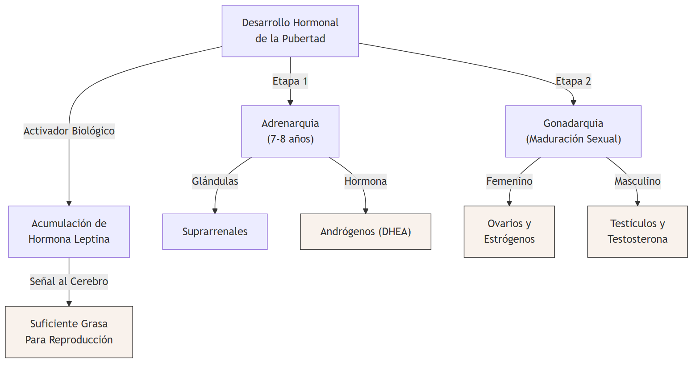

### Salud Física Inicial y el Cerebro Adolescente

A nivel neurológico, el cerebro adolescente es una estructura inmadura y en pleno desarrollo, lo cual explica gran parte de la propensión a la toma de riesgos y los exabruptos emocionales. El desarrollo cerebral en esta etapa se caracteriza por un desajuste temporal entre dos sistemas principales:
- **La amígdala:** Estructura subcortical vinculada a reacciones instintivas y emocionales intensas, que madura de forma temprana y es la principal área que utilizan los adolescentes jóvenes para procesar información emocional.
- **Los lóbulos frontales (corteza prefrontal):** Encargados de las funciones ejecutivas, como la planificación a largo plazo, el razonamiento, el juicio crítico y el control de impulsos. Esta área no alcanza la madurez plena hasta el final de la adolescencia o principios de la adultez.

Durante la pubertad, ocurre un crecimiento rápido en la producción de **materia gris** (neuronas) en los lóbulos frontales, seguido por una drástica **poda sináptica** (eliminación de conexiones no utilizadas), lo que aumenta la eficiencia cognitiva. Al mismo tiempo, continúa el aumento de la **materia blanca** (mielinización), acelerando la transmisión de información nerviosa. La estimulación cognitiva es vital aquí, ya que define qué circuitos se fortalecen para la adultez.

Respecto a la **salud física**, aunque la inmensa mayoría de los adolescentes se perciben como sanos, muchos sufren síntomas psicosomáticos derivados del estrés, especialmente en países desarrollados de ritmo rápido. Existen varios focos críticos de riesgo de salud derivados del estilo de vida:

1. **Actividad Física:** Su práctica disminuye drásticamente a lo largo de la secundaria. El sedentarismo incrementa el riesgo de obesidad y diabetes tipo 2.
2. **Privación de Sueño:** Constituye una epidemia. Los adolescentes requieren tantas o más horas de sueño que en la niñez (más de 8 horas), pero cambios biológicos retrasan la secreción de **melatonina**, induciendo sueño más tarde por la noche. Esto choca con los horarios escolares tempranos, causando irritabilidad, depresión, caída del rendimiento escolar y accidentes de tránsito.
3. **Trastornos Nutricionales:** El exceso de calorías vacías y la falta de ejercicio promueven el aumento alarmante de la **obesidad y sobrepeso**. Por el otro extremo, las presiones culturales y la distorsión de la imagen corporal desencadenan graves trastornos de la conducta alimentaria, predominantes en mujeres:
   - **Anorexia Nerviosa:** Inanición autoimpuesta por miedo irracional a engordar, acompañada de distorsión severa de la imagen corporal y pérdida extrema de peso. Tiene la mayor tasa de mortalidad entre los trastornos mentales.
   - **Bulimia Nerviosa:** Ciclos de atracones masivos de comida seguidos de purgas (vómitos, laxantes, ejercicio compulsivo) para evitar subir de peso. Los pacientes suelen tener un peso normal, pero sufren profundos daños físicos y psicológicos (baja serotonina, depresión).
4. **Abuso de Sustancias:** La exposición de un cerebro inmaduro a drogas (alcohol, marihuana, tabaco, fármacos de prescripción) altera el desarrollo cerebral y genera daños cognitivos a largo plazo en memoria y aprendizaje.

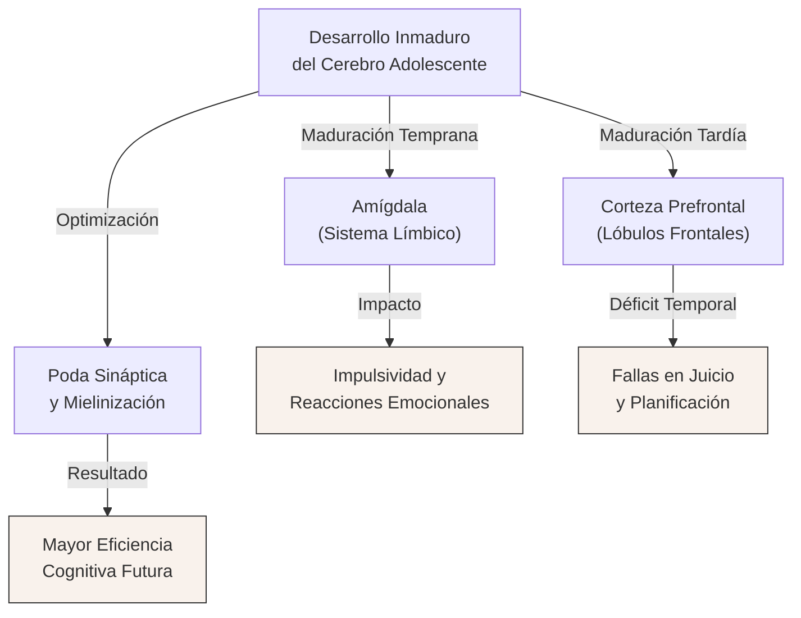
```mermaid
graph TD
    A["Desarrollo Inmaduro<br>del Cerebro Adolescente"]
    
    A -->|"Maduración Temprana"| B["Amígdala<br>(Sistema Límbico)"]
    A -->|"Maduración Tardía"| C["Corteza Prefrontal<br>(Lóbulos Frontales)"]
    A --->|"Optimización"| D["Poda Sináptica<br>y Mielinización"]
    
    B -->|"Impacto"| B1["Impulsividad y<br>Reacciones Emocionales"]
    
    C -->|"Déficit Temporal"| C1["Fallas en Juicio<br>y Planificación"]
    
    D -->|"Resultado"| D1["Mayor Eficiencia<br>Cognitiva Futura"]
    
    style B1 fill:#f9f2ec,stroke:#333
    style C1 fill:#f9f2ec,stroke:#333
    style D1 fill:#f9f2ec,stroke:#333
```

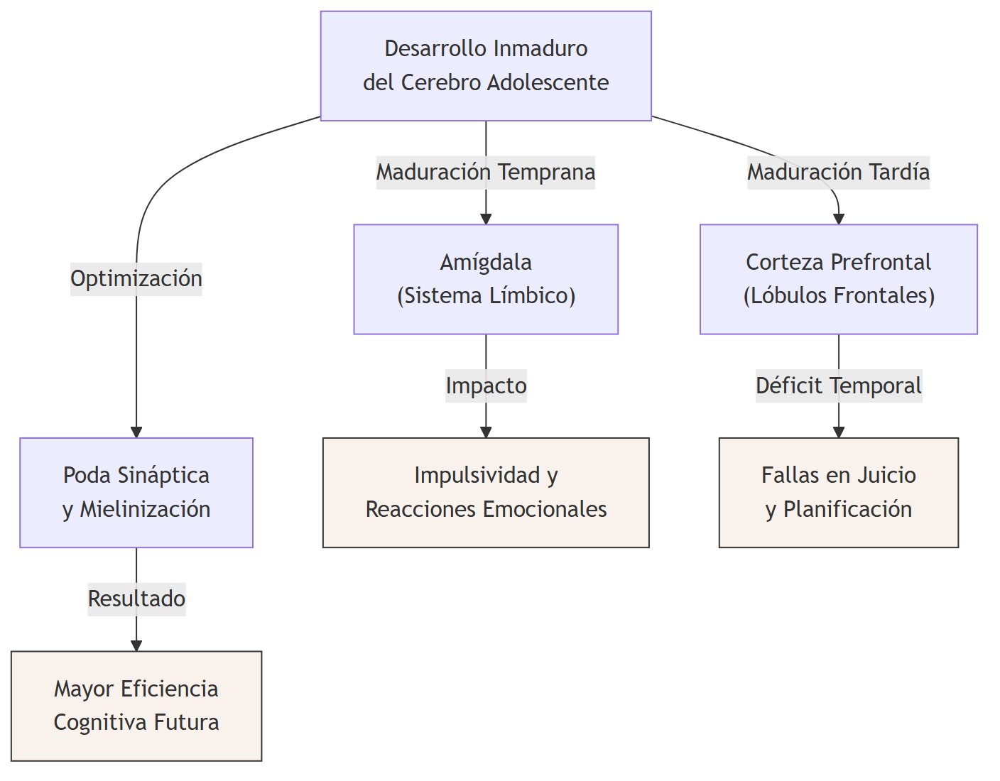

### Tesis Central o Resumen Ejecutivo

El desarrollo cognitivo, moral y educativo durante la adolescencia representa una transición fundamental desde el pensamiento concreto y el egocentrismo infantil hacia una capacidad reflexiva, abstracta y fundamentada en principios. Según la perspectiva de Papalia, este periodo se caracteriza por la adquisición de las operaciones formales de Piaget y una mejora sustancial en el procesamiento de la información, aunque coexiste con manifestaciones de inmadurez cognitiva propias de la adaptación a estas nuevas capacidades (descritas por Elkind). Simultáneamente, el razonamiento moral evol backwarduciona desde el acatamiento de controles externos hacia la internalización de principios de justicia (Kohlberg) y una ética del cuidado (Gilligan). Finalmente, el contexto escolar, la motivación, el nivel socioeconómico y el estilo de crianza ejercen influencias determinantes en el éxito educativo y la preparación vocacional, marcando trayectorias vitales divergentes frente al riesgo de abandono escolar.

### Desarrollo Cognitivo: Perspectiva de Papalia

La adolescencia marca el ingreso al nivel más alto del desarrollo cognitivo propuesto por Piaget: la etapa de las **operaciones formales**. Este avance, que típicamente ocurre alrededor de los 11 años, proporciona a los adolescentes una forma nueva y flexible de manipular la información. 

La característica definitoria de esta etapa es la capacidad de **pensamiento abstracto**. Ya no están limitados a las experiencias del aquí y ahora, sino que pueden comprender el tiempo histórico, el espacio extraterrestre y utilizar símbolos para representar otros símbolos (fundamental para el aprendizaje del álgebra o cálculo). Además, pueden apreciar las metáforas y alegorías, encontrando significados más profundos en la literatura. Tienen la habilidad de imaginar posibilidades, pensar en lo que podría ser en lugar de sólo en lo que es, y someter a prueba las hipótesis.

Un componente crucial de las operaciones formales es el **razonamiento hipotético-deductivo**. Esto implica la capacidad para desarrollar, considerar y poner a prueba hipótesis de manera sistemática, como se demuestra en la clásica tarea del péndulo. A diferencia de los niños en etapas anteriores que resuelven los problemas al tanteo, los adolescentes en la etapa formal enuncian todas las hipótesis posibles, variando un factor a la vez mientras mantienen los demás constantes, lo que les permite llegar a conclusiones lógicas y diseñar experimentos mentales o reales válidos.

El desarrollo neurológico y la maduración cerebral son necesarios pero no suficientes para alcanzar el razonamiento formal; se requiere de la estimulación ambiental, la educación escolar y los valores culturales pertinentes. De hecho, la investigación neopiagetiana sugiere que la teoría original de Piaget no considera adecuadamente los avances en el procesamiento de información, la acumulación de conocimiento y el papel fundamental de la **metacognición** o función ejecutiva (la capacidad de pensar sobre el propio pensamiento y controlar los procesos mentales).

Sin embargo, a pesar de estos enormes avances, David Elkind señala que el pensamiento adolescente a menudo muestra una extraña **inmadurez**. Esta inmadurez se deriva de sus intentos inexpertos por utilizar las recién adquiridas operaciones formales. Elkind describe seis características típicas:
1. **Idealismo y tendencia a la crítica:** Al poder imaginar un mundo ideal, se frustran ante la realidad, criticando duramente a los adultos y autoridades.
2. **Tendencia a discutir:** Buscan constantemente oportunidades para poner a prueba sus nuevas capacidades de razonamiento organizando hechos y lógica.
3. **Indecisión:** Al poder mantener simultáneamente múltiples alternativas en mente, carecen de estrategias eficaces para elegir entre ellas.
4. **Aparente hipocresía:** No logran vincular un ideal expresado con la acción práctica y los sacrificios necesarios para alcanzarlo.
5. **Autoconciencia (Audiencia Imaginaria):** Al poder pensar sobre los pensamientos de otros, suponen obsesivamente que todos los demás están pensando en ellos. Sienten que están constantemente siendo observados y juzgados por una "audiencia imaginaria".
6. **Suposición de singularidad e invulnerabilidad (Fábula Personal):** Tienen la profunda convicción de que su experiencia es única, especial, y que no están sujetos a los riesgos o reglas que gobiernan al resto del mundo, lo cual puede propiciar conductas riesgosas.

A nivel del lenguaje, los adolescentes amplían drásticamente su vocabulario (cerca de 80,000 palabras a los 16-18 años), logran definir abstracciones y adoptan un dialecto particular, denominado por Danesi como **"pubilecto"**. Este código lingüístico emotivo y connotativo les permite fortalecer su identidad grupal, diferenciarse de los adultos y realizar juicios rápidos de valor sobre sus pares.

El **procesamiento de la información** también experimenta cambios estructurales (expansión de la memoria de trabajo y aumento en la cantidad de conocimiento declarativo, procedimental y conceptual almacenado) y funcionales (incremento en la velocidad de procesamiento y desarrollo adicional de las funciones ejecutivas, como la atención selectiva y el control inhibitorio).

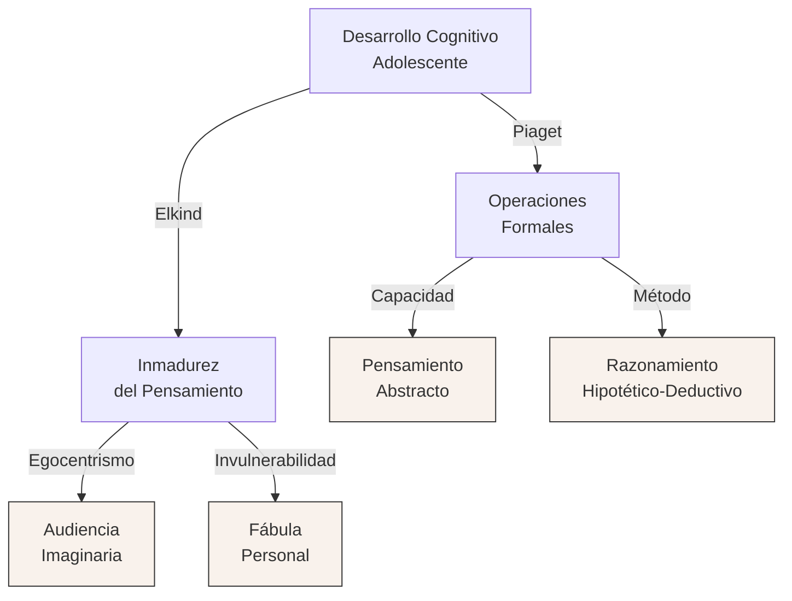
```mermaid
graph TD
    A["Desarrollo Cognitivo<br>Adolescente"]
    
    A -->|"Piaget"| B["Operaciones<br>Formales"]
    A --->|"Elkind"| C["Inmadurez<br>del Pensamiento"]
    
    B -->|"Capacidad"| B1["Pensamiento<br>Abstracto"]
    B -->|"Método"| B2["Razonamiento<br>Hipotético-Deductivo"]
    
    C -->|"Egocentrismo"| C1["Audiencia<br>Imaginaria"]
    C -->|"Invulnerabilidad"| C2["Fábula<br>Personal"]
    
    style B1 fill:#f9f2ec,stroke:#333
    style B2 fill:#f9f2ec,stroke:#333
    style C1 fill:#f9f2ec,stroke:#333
    style C2 fill:#f9f2ec,stroke:#333
```

### Desarrollo Moral y Ética

El avance hacia el razonamiento abstracto permite a los adolescentes abordar temas morales de manera más compleja, aumentando también sus tendencias hacia la empatía y la conducta prosocial.

La teoría más influyente sobre el **desarrollo moral** es la de **Lawrence Kohlberg**, quien, basándose en la resolución de dilemas éticos (como el dilema de Heinz), estableció tres niveles de razonamiento, cada uno dividido en dos etapas:

1. **Nivel I: Moral Preconvencional (4 a 10 años).** El control es externo. Se obedecen las reglas para evitar castigos o buscar recompensas, basándose en el propio interés o conveniencia material.
2. **Nivel II: Moral Convencional (o conformidad al rol, a partir de los 10 años).** Las personas internalizan las normas de las figuras de autoridad. Actúan para complacer a los demás, ser "buenos" ante la sociedad y mantener el orden y la ley. La mayoría de los adolescentes y adultos permanecen en este nivel (particularmente en la Etapa 3 de búsqueda de aprobación y Etapa 4 de mantenimiento del orden social).
3. **Nivel III: Moral Posconvencional (o principios morales autónomos).** Se reconocen los conflictos entre normas morales y se formulan juicios fundamentados en principios universales de justicia, equidad y derechos humanos, más allá de la ley establecida. Se alcanza raramente y, de hacerlo, ocurre hacia la adultez joven.

Kohlberg subraya que el núcleo de la etapa moral no está en la acción que la persona decide realizar, sino en el *razonamiento* detrás de dicha decisión. Sin embargo, los críticos señalan que su teoría subestima el papel de las emociones (empatía, culpa) y la influencia cultural, dado que en culturas no occidentales es raro que las personas alcancen las etapas más altas centradas en principios filosóficos occidentales.

Frente a la teoría de Kohlberg (enfocada en la justicia), **Carol Gilligan** propuso que hombres y mujeres tienen enfoques diferentes sobre la moral. Argumentó que la moral femenina se orienta más hacia una **ética del cuidado**, la responsabilidad hacia los otros y la evitación del daño, priorizando las relaciones sobre la justicia abstracta. Aunque las investigaciones posteriores encontraron que el sesgo de género en la teoría de Kohlberg es pequeño o inexistente, sí demostraron que las adolescentes, en general, enfatizan ligeramente más el cuidado, la empatía y la conducta prosocial que los varones.

El **comportamiento prosocial** (acciones orientadas a beneficiar a otros) aumenta notoriamente durante la adolescencia. Cerca de la mitad de los adolescentes participan en algún tipo de servicio comunitario o voluntariado, lo que les permite vincular su creciente sentido de identidad con la participación cívica y comprometerse con la sociedad.

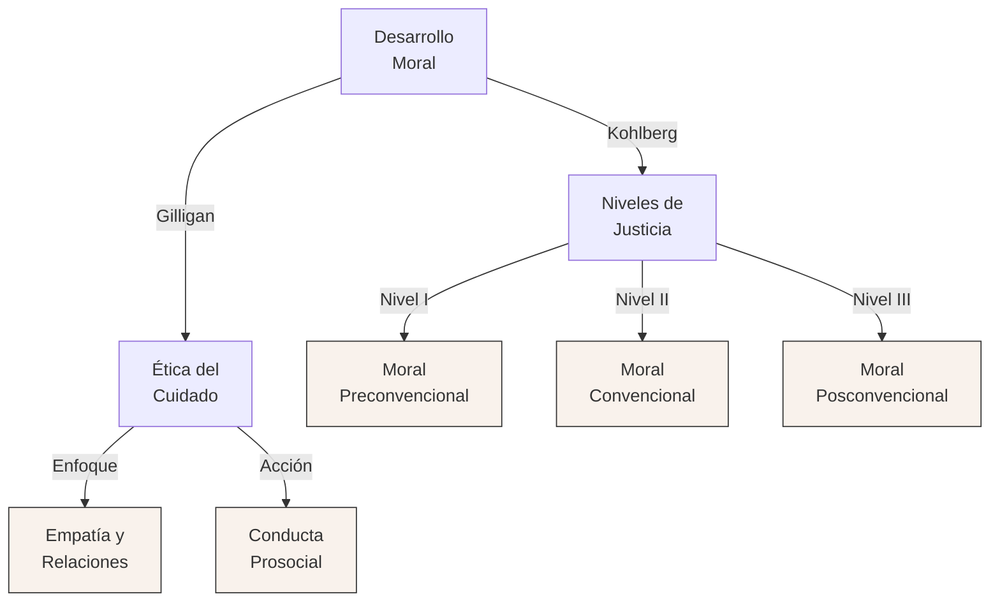
```mermaid
graph TD
    A["Desarrollo<br>Moral"]
    
    A -->|"Kohlberg"| B["Niveles de<br>Justicia"]
    A --->|"Gilligan"| C["Ética del<br>Cuidado"]
    
    B -->|"Nivel I"| B1["Moral<br>Preconvencional"]
    B -->|"Nivel II"| B2["Moral<br>Convencional"]
    B -->|"Nivel III"| B3["Moral<br>Posconvencional"]
    
    C -->|"Enfoque"| C1["Empatía y<br>Relaciones"]
    C -->|"Acción"| C2["Conducta<br>Prosocial"]
    
    style B1 fill:#f9f2ec,stroke:#333
    style B2 fill:#f9f2ec,stroke:#333
    style B3 fill:#f9f2ec,stroke:#333
    style C1 fill:#f9f2ec,stroke:#333
    style C2 fill:#f9f2ec,stroke:#333
```

### Educación y Motivación en la Adolescencia

La escuela representa una experiencia organizativa esencial que influye determinantemente en el futuro del adolescente. No obstante, el rendimiento y la permanencia escolar están mediados por una compleja red de factores.

La **motivación del estudiante** es crítica. En las culturas occidentales, se prioriza la *motivación intrínseca* y la *autoeficacia* (la creencia en la propia capacidad para dominar tareas y regular el aprendizaje). Los alumnos con alta autoeficacia tienden a tener un mejor desempeño, superando incluso las limitaciones del CI debido al impacto de la disciplina personal. En contraste, en ciertas culturas asiáticas, el aprendizaje es impulsado por expectativas familiares, sociales de perfección y esfuerzo intenso, lo cual arroja mejores resultados en ciencias y matemáticas, pero también niveles más elevados de ansiedad y estrés.

El **Nivel Socioeconómico (NSE)** y el ambiente familiar son predictores muy potentes del éxito escolar. Tener padres con un alto nivel educativo y ocupacional, y contar con recursos en el hogar (como libros) favorecen el rendimiento. 

Los **estilos de crianza** también dejan una marca profunda:
- **Padres Autoritativos:** Fomentan el diálogo, equilibran demandas y responsividad, y alientan a los jóvenes a atribuir sus resultados al esfuerzo propio, lo que estimula una participación activa escolar. 
- **Padres Autoritarios y Permisivos:** Promueven, en diferentes formas, una externalización de la culpa y una indefensión aprendida que puede desencadenar fracaso escolar.

La **influencia de los pares** puede contrarrestar o potenciar el esfuerzo de los padres. El rendimiento y la motivación suelen declinar si el grupo de amigos no valora los logros académicos, como se observa a menudo durante la transición hacia la educación media.

El **abandono de estudios** en la educación media superior representa un riesgo vital mayor. Los estudiantes de bajos recursos o de minorías (con menor representatividad cultural en los currículos) tienen muchas más probabilidades de desertar, a menudo motivados por una instrucción escolar deficiente, subdivisiones de baja capacidad (que generan segregación y sentimientos de incompetencia) y bajas expectativas de los docentes. La deserción acarrea consecuencias devastadoras: mayor probabilidad de desempleo, pobreza, deterioro de la salud e involucramiento en actividades delictivas. 

Para prevenirlo, es fundamental la **participación activa**, que involucra la atención, el interés y el esfuerzo sostenido del adolescente dentro de un ambiente escolar estructurado, inclusivo y que mantenga altas expectativas de aprendizaje.

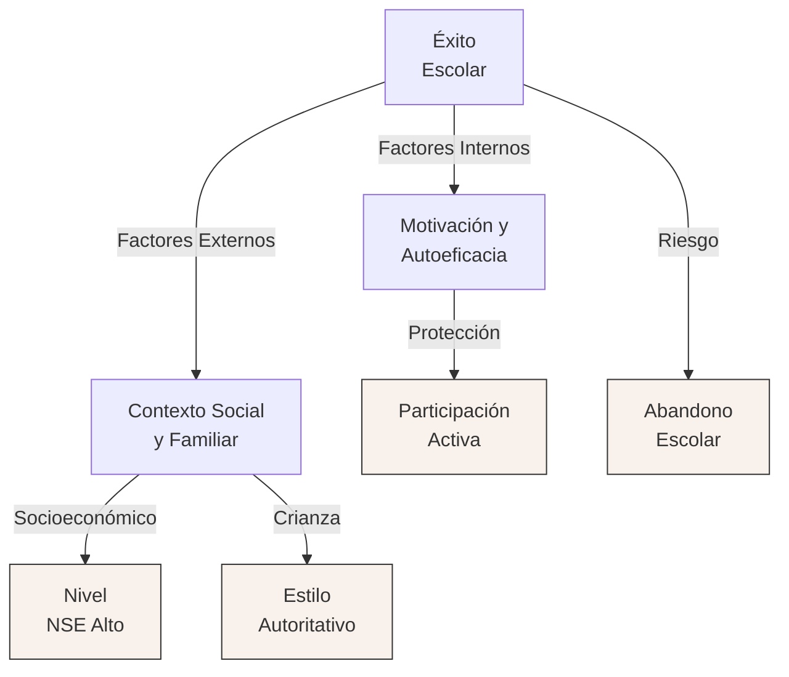
```mermaid
graph TD
    A["Éxito<br>Escolar"]
    
    A -->|"Factores Internos"| B["Motivación y<br>Autoeficacia"]
    A --->|"Factores Externos"| C["Contexto Social<br>y Familiar"]
    
    B -->|"Protección"| B1["Participación<br>Activa"]
    
    C -->|"Socioeconómico"| C1["Nivel<br>NSE Alto"]
    C -->|"Crianza"| C2["Estilo<br>Autoritativo"]
    
    A --->|"Riesgo"| D["Abandono<br>Escolar"]
    
    style B1 fill:#f9f2ec,stroke:#333
    style C1 fill:#f9f2ec,stroke:#333
    style C2 fill:#f9f2ec,stroke:#333
    style D fill:#f9f2ec,stroke:#333
```

### Glosario de Conceptos Clave

| Concepto | Definición Clave en el Texto |
|----------|-----------------------------|
| Operaciones formales | En la teoría de Piaget, la etapa final del desarrollo cognitivo caracterizada por la capacidad para pensar de manera abstracta y manipular la información de forma flexible. |
| Razonamiento hipotético-deductivo | Capacidad que acompaña la etapa de las operaciones formales y que permite desarrollar, considerar y someter a prueba hipótesis para resolver problemas sistemáticamente. |
| Audiencia imaginaria | Término de Elkind para el observador que existe sólo en la mente del adolescente, haciéndole creer que los demás están tan preocupados por sus acciones y pensamientos como él mismo. |
| Fábula personal | Convencimiento, propio del egocentrismo adolescente según Elkind, de que uno es especial, único y no está sujeto a las reglas o riesgos que gobiernan al resto de mundo. |
| Moral posconvencional | Tercer nivel en la teoría de Kohlberg donde las personas siguen principios morales autónomos y universales de justicia, independientemente de las leyes o normas sociales restrictivas. |
| Ética del cuidado | Perspectiva moral propuesta por Gilligan que enfatiza la responsabilidad hacia los otros, la empatía, y la evitación del daño en lugar de centrarse únicamente en la justicia abstracta. |
| Autoeficacia | Creencia del estudiante de que posee la capacidad y disciplina necesarias para dominar tareas académicas y regular su propio aprendizaje. |

### Citas Críticas

> [!IMPORTANT]
> *"La capacidad para pensar en términos abstractos también tiene implicaciones emocionales... Lo posible y lo ideal capturan tanto la mente como el sentimiento."*
> **Justificación:** Sintetiza cómo las operaciones formales de Piaget no solo alteran la lógica matemática, sino que desencadenan el idealismo juvenil, posibilitando la pasión por conceptos como la libertad o la justicia.

> [!IMPORTANT]
> *"Según Elkind, esta inmadurez del pensamiento se manifiesta... de los intentos inexpertos de los adolescentes para utilizar el pensamiento de las operaciones formales."*
> **Justificación:** Es fundamental para entender que los comportamientos adolescentes que consideramos "problemáticos" o irracionales (egocentrismo, hipocresía aparente) son en realidad productos de la acomodación neurológica a un cerebro superior.

> [!IMPORTANT]
> *"En la teoría de Kohlberg, el razonamiento que subyace a la respuesta de una persona ante un dilema moral, y no la respuesta en sí, es lo que indica la etapa de desarrollo moral."*
> **Justificación:** Aclara el error común de juzgar el desarrollo moral por la acción (ej. robar o no robar) en lugar de evaluar la estructura cognitiva (el por qué) que sustenta esa decisión ética.

### Preguntas de Autoevaluación

1. Describa cómo el experimento del péndulo ilustra la diferencia práctica entre un niño en la etapa de operaciones concretas y un adolescente en la etapa de operaciones formales.
2. Identifique una situación de la vida diaria en la que un adolescente exhiba los conceptos de "audiencia imaginaria" y "fábula personal" descritos por Elkind.
3. Contrastando los modelos de Kohlberg y Gilligan, ¿cómo explicarían ambos teóricos la decisión de un individuo que decide ocultar a un amigo buscado por la justicia para protegerlo?
4. Analice el papel de la autoeficacia y la disciplina personal frente al Coeficiente Intelectual (CI) en la predicción del éxito académico durante la adolescencia.
5. Según la evidencia, ¿por qué el estilo de crianza autoritativo parece tener un efecto positivo duradero en la prevención del abandono escolar en comparación con el estilo autoritario o permisivo?

### 1. Tesis Central o Resumen Ejecutivo

Durante la adolescencia, el desarrollo psicosocial se caracteriza fundamentalmente por la intensa búsqueda y construcción de la identidad, un proceso que trasciende la simple rebeldía para convertirse en una reestructuración profunda de la personalidad. Este periodo crítico implica no solo la consolidación de una identidad ocupacional, ideológica y sexual, sino también una compleja renegociación de los vínculos familiares, donde la autonomía psicológica cobra protagonismo sin que desaparezca la necesidad de apego seguro. Al mismo tiempo, el grupo de pares emerge como el principal agente de socialización y laboratorio emocional, moldeando conductas que oscilan entre la toma de riesgos —incluyendo la exploración sexual y posibles conductas antisociales— y el desarrollo de la intimidad madura.

### 2. Desarrollo Analítico

#### Proceso de búsqueda de la identidad

La construcción de la identidad es la tarea central de la adolescencia. Según Erik Erikson, los adolescentes enfrentan la crisis de "identidad versus confusión de identidad" (o de rol). Para resolverla, deben establecer compromisos en tres áreas fundamentales: ocupacional, ideológica (valores y creencias) y sexual. Erikson introduce el concepto de "moratoria psicosocial", un periodo de libertad que la sociedad otorga para explorar opciones antes de asumir responsabilidades adultas definitivas. La resolución exitosa de esta crisis culmina en el desarrollo de la virtud de la fidelidad (lealtad y compromiso sostenido).

Por su parte, James E. Marcia operacionalizó la teoría de Erikson clasificando el desarrollo del yo en cuatro "estados de identidad", basados en la presencia o ausencia de crisis (exploración consciente) y compromiso (inversión personal):
- **Logro de identidad:** Compromiso establecido tras un periodo de crisis y exploración activa.
- **Exclusión:** Compromiso adoptado sin haber atravesado una crisis (generalmente aceptando los planes de figuras de autoridad, como los padres).
- **Moratoria:** Crisis actual en proceso de exploración, sin compromisos firmes aún.
- **Difusión de identidad:** Ausencia tanto de crisis como de compromiso; falta de interés o consideración seria de opciones.

El género y el origen étnico también modulan esta búsqueda. Carol Gilligan criticó el enfoque androcéntrico de Erikson, sugiriendo que, para las mujeres, la identidad se desarrolla más a través del establecimiento de relaciones y la ética del cuidado que mediante la separación individualista. En cuanto a las minorías étnicas, el modelo de Phinney identifica estados similares a los de Marcia (difusión, exclusión, moratoria y logro) aplicados a la identidad étnica. Factores como la "socialización cultural" por parte de los padres fortalecen una identidad étnica positiva, actuando como barrera protectora frente a la discriminación percibida.

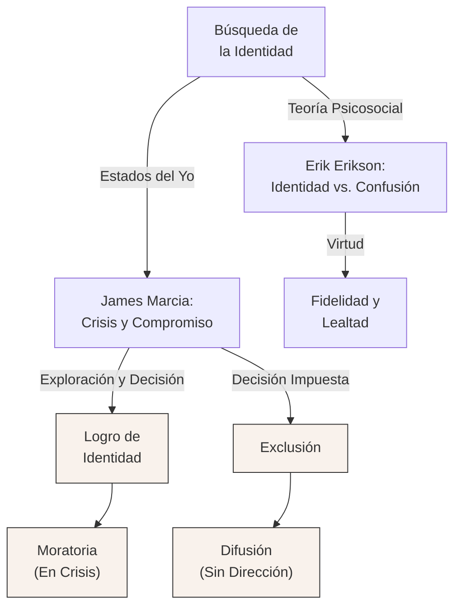
```mermaid
graph TD
    A["Búsqueda de<br>la Identidad"]
    
    A -->|"Teoría Psicosocial"| B["Erik Erikson:<br>Identidad vs. Confusión"]
    A --->|"Estados del Yo"| C["James Marcia:<br>Crisis y Compromiso"]
    
    B -->|"Virtud"| B1["Fidelidad y<br>Lealtad"]
    
    C -->|"Exploración y Decisión"| C1["Logro de<br>Identidad"]
    C -->|"Decisión Impuesta"| C2["Exclusión"]
    C ~~~ C3["Moratoria<br>(En Crisis)"]
    C ~~~ C4["Difusión<br>(Sin Dirección)"]
    
    C1 --> C3
    C2 --> C4
    
    style C1 fill:#f9f2ec,stroke:#333
    style C2 fill:#f9f2ec,stroke:#333
    style C3 fill:#f9f2ec,stroke:#333
    style C4 fill:#f9f2ec,stroke:#333
```

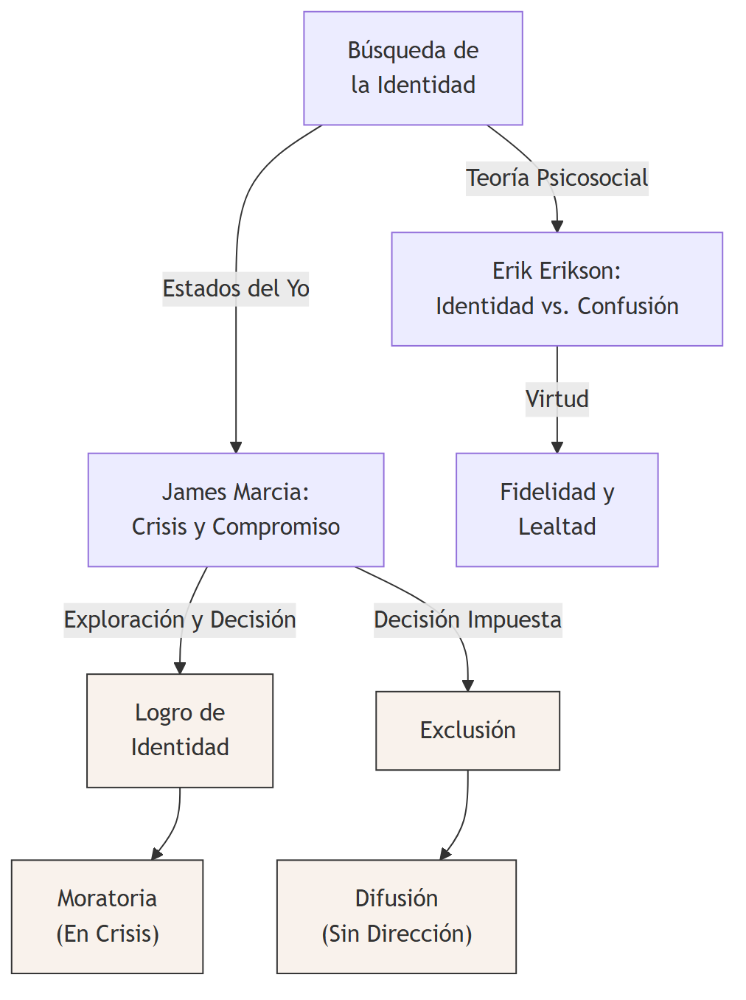

#### Sexualidad

El logro de la identidad sexual abarca el reconocimiento de la orientación sexual, el manejo de impulsos y la formación de vínculos emocionales. La orientación sexual (heterosexual, homosexual, bisexual) se hace apremiante en esta etapa y parece tener un origen parcialmente genético y neurobiológico (como diferencias en el hipotálamo y respuestas a feromonas), combinado con factores ambientales. El desarrollo de una identidad homosexual o bisexual suele ser más complejo debido al estigma social y la falta de modelos aceptados, atravesando fases desde la concienciación de la atracción hasta la apertura y relaciones románticas.

La actividad sexual adolescente plantea riesgos significativos, especialmente las Enfermedades de Transmisión Sexual (ETS) y el embarazo temprano. El VPH es la ETS más común, pero otras como la clamidia, gonorrea, tricomoniasis y VIH también son prevalentes debido al no uso del condón y a la creencia errónea de que prácticas como el sexo oral carecen de riesgo. 

En relación a los embarazos adolescentes, aunque han disminuido, Estados Unidos mantiene tasas superiores a otros países industrializados. Las causas incluyen el inicio sexual temprano sin métodos anticonceptivos eficaces, presiones de pares y pobreza. Los desenlaces pueden ser perjudiciales: complicaciones en la salud del bebé (bajo peso, prematuridad) y estancamiento académico y socioeconómico para los padres jóvenes, aunque factores como un fuerte apoyo familiar pueden mitigar estos efectos a largo plazo.

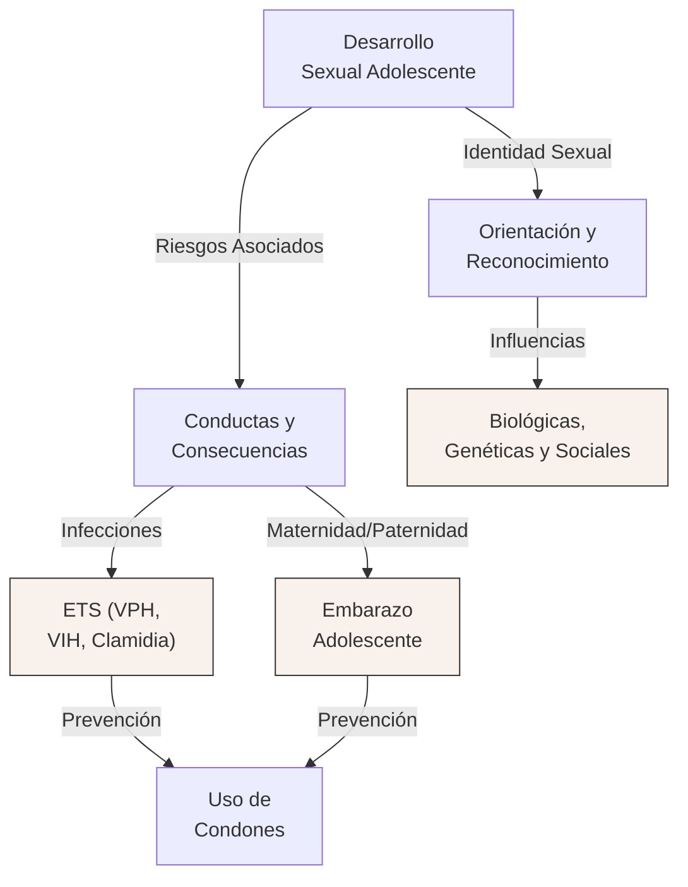
```mermaid
graph TD
    A["Desarrollo<br>Sexual Adolescente"]
    
    A -->|"Identidad Sexual"| B["Orientación y<br>Reconocimiento"]
    A --->|"Riesgos Asociados"| C["Conductas y<br>Consecuencias"]
    
    B -->|"Influencias"| B1["Biológicas,<br>Genéticas y Sociales"]
    
    C -->|"Infecciones"| C1["ETS (VPH,<br>VIH, Clamidia)"]
    C -->|"Maternidad/Paternidad"| C2["Embarazo<br>Adolescente"]
    
    C1 -->|"Prevención"| C3["Uso de<br>Condones"]
    C2 -->|"Prevención"| C3
    
    style B1 fill:#f9f2ec,stroke:#333
    style C1 fill:#f9f2ec,stroke:#333
    style C2 fill:#f9f2ec,stroke:#333
```

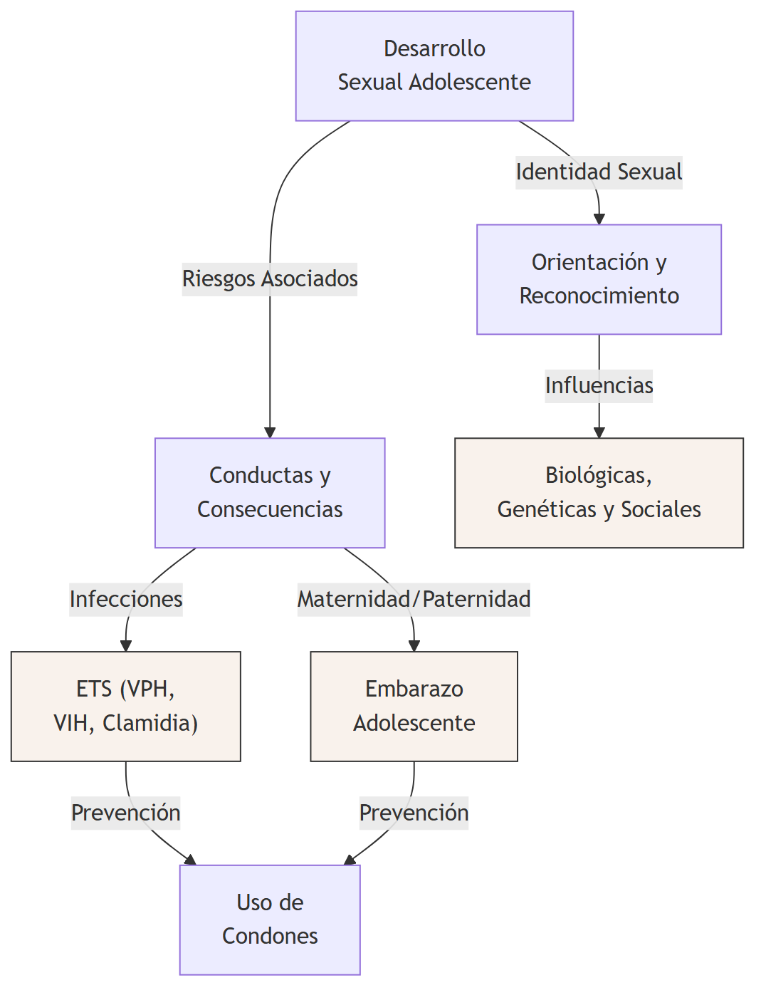

#### Socialización en el entorno familiar

A pesar de la creencia popular en una "rebelión adolescente" caracterizada por tormenta y tensión incontrolables (perspectiva clásica de G. Stanley Hall y el psicoanálisis), las investigaciones muestran que la gran mayoría de los adolescentes mantienen relaciones positivas y comparten valores fundamentales con sus padres. La desvinculación (pasar menos tiempo con la familia) responde a una necesidad normativa de individuación y autonomía.

El conflicto familiar suele centrarse en cuestiones cotidianas (ropa, permisos, tareas) más que en valores morales profundos, y alcanza su punto máximo a mediados de la adolescencia. Estos conflictos representan renegociaciones de los límites de autoridad. 

El estilo de crianza autoritativo (equilibrio entre control conductual firme y concesión de autonomía psicológica) fomenta un desarrollo sano. Por el contrario, el "control psicológico" (manipulación emocional, retiro del afecto) daña profundamente la salud mental. Los adolescentes revelan más sobre sus vidas (autorrevelación) cuando perciben calidez y límites claros sin exceso de intromisión. Las estructuras familiares diversas (divorcio, cohabitación, trabajo materno bajo estrés económico) impactan la adaptación del adolescente, pero el capital social y la calidad del vínculo parental pueden amortiguar las adversidades socioeconómicas.

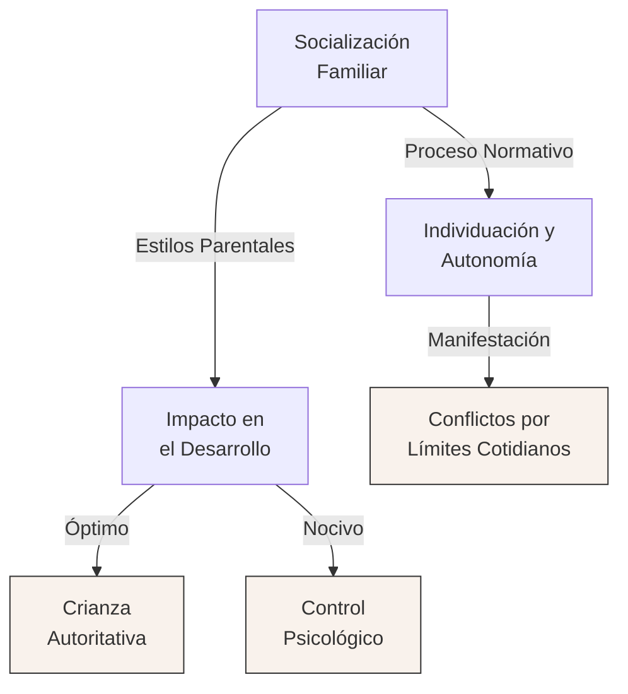
```mermaid
graph TD
    A["Socialización<br>Familiar"]
    
    A -->|"Proceso Normativo"| B["Individuación y<br>Autonomía"]
    A --->|"Estilos Parentales"| C["Impacto en<br>el Desarrollo"]
    
    B -->|"Manifestación"| B1["Conflictos por<br>Límites Cotidianos"]
    
    C -->|"Óptimo"| C1["Crianza<br>Autoritativa"]
    C -->|"Nocivo"| C2["Control<br>Psicológico"]
    
    style B1 fill:#f9f2ec,stroke:#333
    style C1 fill:#f9f2ec,stroke:#333
    style C2 fill:#f9f2ec,stroke:#333
```

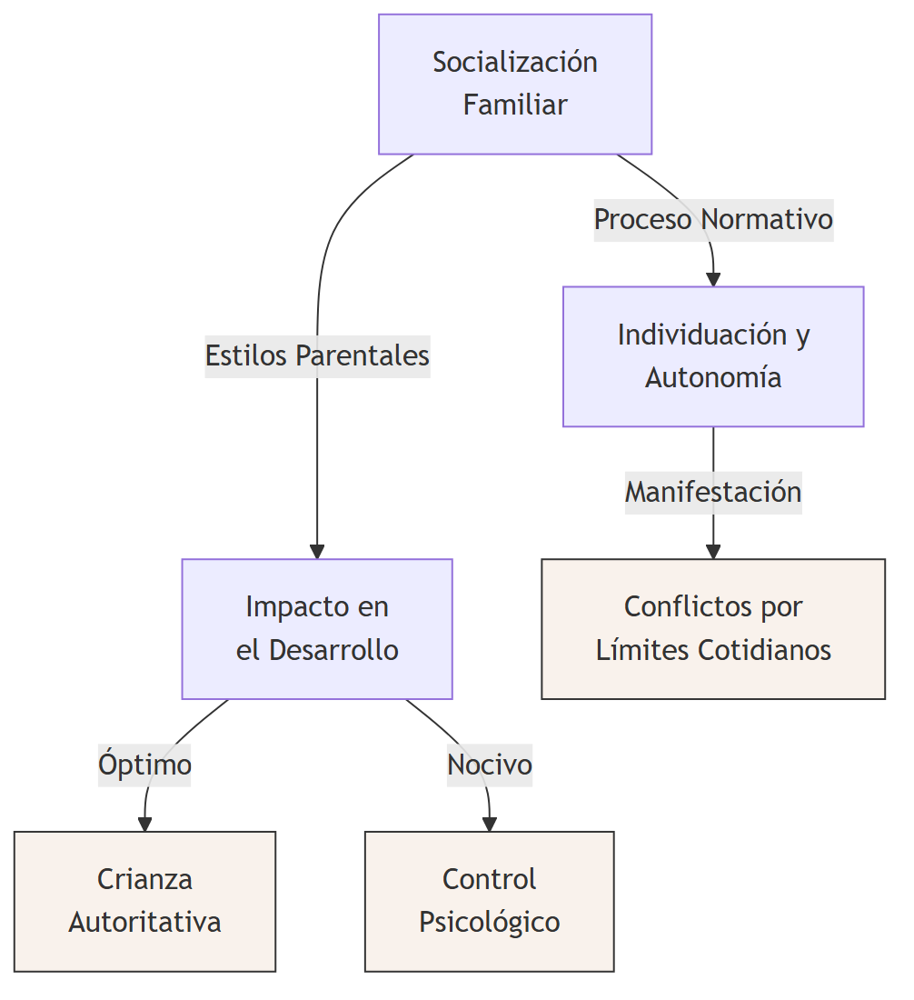

#### Relación con los pares

El grupo de pares se convierte en una fuente vital de apoyo emocional, ensayo de intimidad e independencia. La influencia de los pares alcanza su cúspide alrededor de los 12-13 años. 

Las estructuras sociales evolucionan en complejidad:
- **Amistades:** Se vuelven recíprocas, equitativas y profundamente íntimas (especialmente entre mujeres). Proveen un espacio seguro para la autoexploración.
- **Pandillas (cliques):** Grupos cerrados de amigos íntimos basados en afinidad y estatus, que dictan normas de pertenencia.
- **Coaliciones (crowds):** Construcciones sociales más grandes basadas en la reputación, imagen o identidad (ej. "los deportistas", "los populares"), que ayudan a definir la alianza con normas macrosociales.

Las relaciones románticas emergen gradualmente. En la adolescencia temprana, se centran en el estatus frente al grupo de pares; a mediados, la intimidad y el compañerismo ganan relevancia, sentando las bases para el apego y la pasión que madurarán en la adultez temprana.

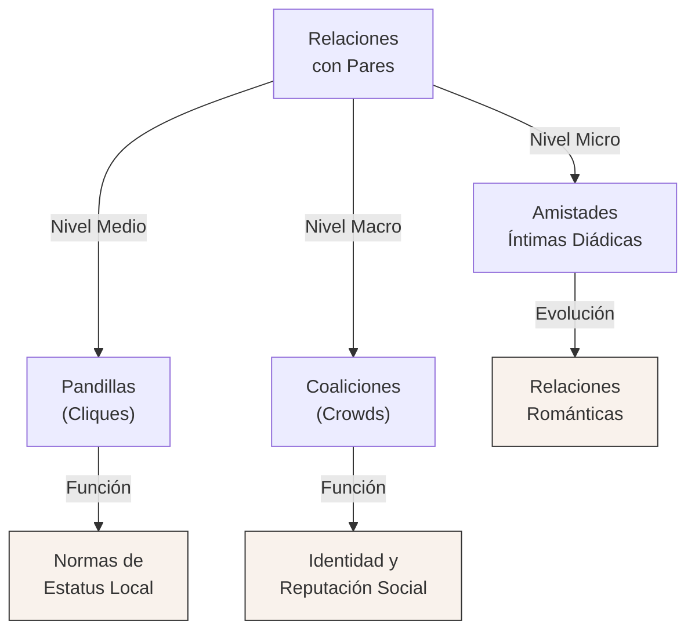
```mermaid
graph TD
    A["Relaciones<br>con Pares"]
    
    A -->|"Nivel Micro"| B["Amistades<br>Íntimas Diádicas"]
    A --->|"Nivel Medio"| C["Pandillas<br>(Cliques)"]
    A --->|"Nivel Macro"| D["Coaliciones<br>(Crowds)"]
    
    B -->|"Evolución"| B1["Relaciones<br>Románticas"]
    C -->|"Función"| C1["Normas de<br>Estatus Local"]
    D -->|"Función"| D1["Identidad y<br>Reputación Social"]
    
    style B1 fill:#f9f2ec,stroke:#333
    style C1 fill:#f9f2ec,stroke:#333
    style D1 fill:#f9f2ec,stroke:#333
```

#### Cambios conductuales (Conducta antisocial y delincuencia)

La conducta antisocial surge de una compleja interacción (modelo de Bronfenbrenner) entre factores neurobiológicos, genéticos y deficiencias en el entorno. Los déficits en la corteza prefrontal y en la regulación emocional pueden originar impulsividad.

El inicio de estas trayectorias a menudo se ubica en la infancia debido a crianzas coercitivas o negligentes que modelan hostilidad. En la adolescencia, el joven antisocial suele experimentar rechazo por parte de pares prosociales y termina asociándose con grupos desviados ("capacitación en comportamiento desviado"). 

Existen dos trayectorias principales de delincuencia juvenil: la temporal (que alcanza su punto máximo a los 15 años y decae a medida que el joven madura y se reconcilia con la sociedad) y la crónica (infractores persistentes con raíces en déficits neurológicos y carencias ambientales severas desde la infancia). La prevención efectiva requiere intervenciones tempranas, fomento de la eficacia colectiva comunitaria y programas escolares orientados a la competencia emocional y resolución de conflictos.

### 3. Glosario de Conceptos Clave

| Concepto | Definición Clave en el Texto |
|----------|-----------------------------|
| Identidad | Un concepto coherente del yo formado por metas, valores y creencias con los cuales la persona está sólidamente comprometida. |
| Moratoria Psicosocial | El periodo de libertad que proporciona la sociedad durante la adolescencia para explorar compromisos y alternativas. |
| Exclusión (Identidad) | Estado donde la persona ha establecido compromisos basándose en los planes o deseos de otras personas, sin haber atravesado una crisis reflexiva. |
| Socialización Cultural | Prácticas paternas que enseñan a los niños acerca de su herencia étnica y promueven prácticas culturales y orgullo por su cultura. |
| Individuación | La lucha psicológica del adolescente por establecer autonomía, diferenciación personal y límites de control respecto a sus padres. |
| Control Psicológico | Ejercicio de manipulación emocional parental (como retiro de afecto o inducción de culpa) que daña el desarrollo autónomo y psicosocial del adolescente. |
| Coaliciones (Crowds) | Agrupaciones grandes de pares basadas no en interacción íntima, sino en etiquetas de reputación e imagen social (ej. "cerebritos", "atletas"). |

### 4. Citas Críticas

> [!IMPORTANT]
> *"Según Erikson, la identidad se forma a medida que los jóvenes resuelven tres cuestiones principales: la elección de una ocupación, la adopción de los valores con los que vivirán y el desarrollo de una identidad sexual satisfactoria."*
> **Justificación:** Define operacionalmente los pilares fundamentales que constituyen la crisis de identidad normativa.

> [!IMPORTANT]
> *"El término socialización cultural se refiere a las prácticas de crianza infantil que enseñan a los niños acerca de su herencia racial o étnica, promueven costumbres y tradiciones culturales e inspiran el orgullo racial/étnico y cultural."*
> **Justificación:** Resalta la importancia del entorno protector para las minorías, mitigando el impacto de la discriminación sobre la autoestima.

> [!IMPORTANT]
> *"Los padres autoritativos insisten en reglas, normas y valores importantes, pero están dispuestos a escuchar, explicar y negociar. Ejercitan un control adecuado sobre la conducta de sus hijos (control conductual), pero no tratan de controlar los sentimientos, creencias y sentido del yo (control psicológico)."*
> **Justificación:** Diferencia crucial entre establecer límites sanos y el daño patológico que genera la intromisión en la psique del adolescente.

### 5. Mapa Conceptual (Mermaid)

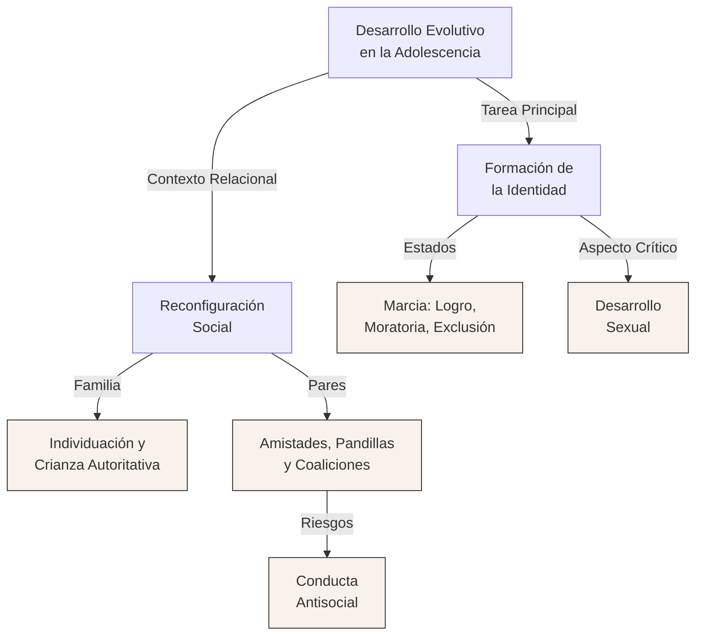
```mermaid
graph TD
    A["Desarrollo Evolutivo<br>en la Adolescencia"]
    
    A -->|"Tarea Principal"| B["Formación de<br>la Identidad"]
    A --->|"Contexto Relacional"| C["Reconfiguración<br>Social"]
    
    B -->|"Estados"| B1["Marcia: Logro,<br>Moratoria, Exclusión"]
    B -->|"Aspecto Crítico"| B2["Desarrollo<br>Sexual"]
    
    C -->|"Familia"| C1["Individuación y<br>Crianza Autoritativa"]
    C -->|"Pares"| C2["Amistades, Pandillas<br>y Coaliciones"]
    
    C2 -->|"Riesgos"| D["Conducta<br>Antisocial"]
    
    style B1 fill:#f9f2ec,stroke:#333
    style B2 fill:#f9f2ec,stroke:#333
    style C1 fill:#f9f2ec,stroke:#333
    style C2 fill:#f9f2ec,stroke:#333
    style D fill:#f9f2ec,stroke:#333
```

### 6. Preguntas de Autoevaluación

1. Según el modelo de James Marcia, ¿cuál es la diferencia clínica y conductual entre un adolescente en estado de "moratoria" y uno en "difusión de identidad"?
2. ¿De qué manera el "control psicológico" ejercido por los padres interfiere con el proceso normativo de individuación en la adolescencia media?
3. Explique la diferencia estructural y funcional entre una pandilla (clique) y una coalición (crowd) en la organización social de los adolescentes.
4. ¿Qué rol juegan las interacciones neurobiológicas tempranas y la "capacitación en comportamiento desviado" de los pares en el desarrollo de la conducta antisocial crónica?
5. Analice críticamente el mito de la "rebelión adolescente" o "tormenta y tensión" inevitable a la luz de los estudios transculturales contemporáneos.

### 1. Tesis Central o Resumen Ejecutivo

La tesis central de este texto fundamental de Piaget e Inhelder radica en que durante la preadolescencia (11-15 años) se produce una transformación radical de las estructuras cognitivas, marcada por la liberación del pensamiento respecto a lo concreto y actual. El sujeto adquiere la capacidad de operar sobre proposiciones y formular hipótesis puramente posibles (pensamiento hipotético-deductivo), disociando la forma lógica del contenido material. Esta reestructuración culmina en dos conquistas fundamentales: la combinatoria sistemática y el surgimiento del "grupo INRC" (Identidad, Negación, Reciprocidad, Correlatividad), un sistema integrado que fusiona las dos reversibilidades previas y permite el desarrollo del pensamiento experimental y científico, así como la apertura a nuevos ideales y valores supraindividuales en la esfera afectiva.

### El Pensamiento Formal y la Combinatoria

Lo característico de las operaciones concretas (propias de la infancia) es que funcionan únicamente a propósito de comprobaciones o representaciones que se juzgan verdaderas y se refieren directamente a objetos materiales. En contraste, la gran novedad del pensamiento formal es que, mediante una diferenciación estricta de la forma y el contenido, el adolescente llega a ser capaz de razonar correctamente sobre proposiciones en las que no cree o asume como puras hipótesis. De este modo, se vuelve capaz de extraer consecuencias lógicas necesarias a partir de verdades simplemente posibles. 

El primer resultado de esta separación del pensamiento respecto a los objetos es la estructuración de una **combinatoria**. En el estadio anterior, las relaciones y clasificaciones se hacían paso a paso, por semejanzas graduales (por ejemplo, en una clasificación zoológica, no se podía agrupar una ostra y un camello sin pasos intermedios). La liberación formal permite reunir cualquier tipo de elementos (1 a 1, 2 a 2, etc.), generalizando las clasificaciones en una clasificación de todas las clasificaciones posibles.

Esta combinatoria tiene un impacto primordial, ya que permite combinar entre sí factores físicos o proposiciones lógicas, razonando sobre la realidad en función de todas las combinaciones posibles y no sólo de las comprobables de inmediato. 

En el plano de los objetos, si se le pide a un niño combinar fichas de colores, lo hará de a pares, incompletamente. Desde los 12 años, encuentra un método exhaustivo y sistemático. Un ejemplo clásico es el de los cinco líquidos incoloros: A, C y E juntos forman amarillo; B decolora; D es agua. Mientras que un niño menor prueba combinaciones al azar, el adolescente de 12 años procede metódicamente, realizando todas las asociaciones posibles (1 a 1, 2 a 2, hasta los 5 juntos) para descubrir el efecto de cada factor.

En el nivel proposicional, el preadolescente combina ideas mediante afirmaciones y negaciones (implicación, disyunción, exclusión, incompatibilidad), sin conocer la lógica formal matemáticamente, pero aplicándola sistemáticamente en su razonamiento hipotético.

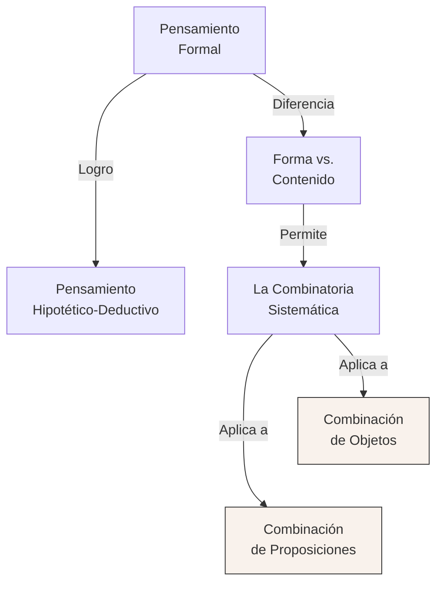
```mermaid
graph TD
    A["Pensamiento<br>Formal"]
    
    A -->|"Diferencia"| B["Forma vs.<br>Contenido"]
    A --->|"Logro"| C["Pensamiento<br>Hipotético-Deductivo"]
    
    B -->|"Permite"| D["La Combinatoria<br>Sistemática"]
    D -->|"Aplica a"| D1["Combinación<br>de Objetos"]
    D -->|"Aplica a"| D2["Combinación<br>de Proposiciones"]
    
    D1 ~~~ D2
    
    style D1 fill:#f9f2ec,stroke:#333
    style D2 fill:#f9f2ec,stroke:#333
```

### El Grupo de las Dos Reversibilidades (INRC)

La combinatoria permite estructurar algo fundamental que marca la síntesis de todo el desarrollo operatorio anterior: el grupo de cuaternalidad o **grupo INRC**.

En los agrupamientos de operaciones concretas (7-11 años), el niño ya domina dos formas separadas de reversibilidad:
1. **La Inversión o Negación (+A - A = 0):** Caracteriza los sistemas de clases. Una operación directa, compuesta con su inversa, conduce a una anulación estricta. Su origen está en conductas muy tempranas (agarrar/soltar, decir sí/no, reunir/separar).
2. **La Reciprocidad o Simetría (A = A):** Caracteriza los sistemas de relaciones. Una operación de partida, compuesta con su recíproca, conduce a una equivalencia o compensación (no a una anulación). Tiene sus raíces en simetrías perceptivas y motrices.

La limitación de las operaciones concretas era que estas dos reversibilidades operaban en dominios separados. La novedad del pensamiento formal es que produce una fusión operatoria en un sistema único de conjunto. De este modo, cada operación se convierte a la vez en la inversa de otra y en la recíproca de una tercera, conformando cuatro transformaciones interdependientes:
- **I (Idéntica o Directa):** La operación de base.
- **N (Inversa o Negación):** Anula la operación directa.
- **R (Recíproca):** Compensa la operación directa.
- **C (Correlativa):** Es la inversa de la recíproca (y recíproca de la inversa).

Piaget ilustra esto con la implicación `p ⊃ q` (si hay luz, hay parada del móvil). El adolescente probará la hipótesis (I = `p ⊃ q`). Para falsearla buscará luz sin parada (N = `p . ~q`). También considerará si la parada causa la luz (R = `q ⊃ p`) y buscará su contraejemplo, paradas sin luz (C = `~p . q`). Así, el sujeto manipula las cuatro transformaciones coordinadas, permitiendo un salto lógico sin precedentes.

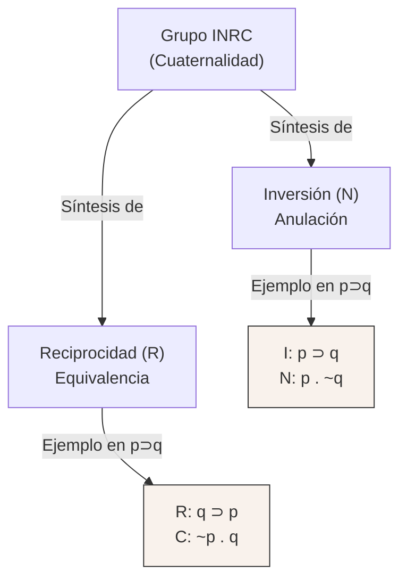
```mermaid
graph TD
    A["Grupo INRC<br>(Cuaternalidad)"]
    
    A -->|"Síntesis de"| B["Inversión (N)<br>Anulación"]
    A --->|"Síntesis de"| C["Reciprocidad (R)<br>Equivalencia"]
    
    B -->|"Ejemplo en p⊃q"| B1["I: p ⊃ q<br>N: p . ~q"]
    C -->|"Ejemplo en p⊃q"| C1["R: q ⊃ p<br>C: ~p . q"]
    
    B1 ~~~ C1
    
    style B1 fill:#f9f2ec,stroke:#333
    style C1 fill:#f9f2ec,stroke:#333
```

### Los Esquemas Operatorios Formales y la Disociación de Factores

Alrededor de los 11-12 años, producto de la combinatoria y el grupo INRC, emergen de forma sincrónica nuevos esquemas mentales:
- **Las proporciones:** Comienzan como lógicas y cualitativas antes de volverse cuantitativas. En la balanza de dos brazos, el niño entiende que disminuir el peso aumentando la longitud equivale a aumentar el peso disminuyendo la longitud (compensación de dos variables, reciprocidad).
- **Dobles sistemas de referencia:** Como un caracol avanzando por una plancha que a su vez retrocede. El adolescente puede coordinar la marcha directa e inversa de ambos sistemas, entendiendo compensaciones sin anulación mediante la reciprocidad (R) y correlatividad (C).
- **Equilibrio hidrostático:** Entender que en una prensa hidráulica en U, el peso del líquido actúa como una reacción opuesta al peso del pistón, requiriendo operaciones del grupo cuaternario para concebir cómo la variación del peso específico del líquido compensa la acción del pistón.
- **Nociones probabilísticas:** La capacidad de prever fluctuaciones y distribuciones (ej. sacando bolas de una urna) combinando todas las posibilidades sistemáticamente e integrando el cálculo inicial de proporciones.

La conjunción de estas estructuras habilita la inducción de leyes físicas y la experimentación científica real, cuyo rasgo clave es la **disociación de factores**. 
En los experimentos (como la flexibilidad de varillas o el péndulo), el niño de estadio concreto modifica todo simultáneamente. El adolescente, en cambio, hace un inventario hipotético de variables y luego las disocia: modifica un solo factor por vez (ej. longitud de la varilla) manteniendo todos los demás (grosor, material, forma) idénticos (control de variables, *ceteris paribus*). En el péndulo, logra descubrir que sólo la longitud de la cuerda determina la frecuencia, excluyendo el peso que aparentaba ser relevante.

### Las Transformaciones Afectivas y Factores del Desarrollo

El acceso al mundo de lo "posible" frente a lo estrictamente "real" no sólo transforma la cognición, sino la afectividad. La adolescencia es la inserción del individuo en la sociedad adulta, habilitada por el pensamiento formal que permite anticipar el porvenir, construir teorías, y abrazar ideales y valores supraindividuales (justicia social, vocación, patriotismo). No es un mero proceso instintivo o reedición de conflictos pasados, sino una proyección cognitiva-afectiva.

El desarrollo, según Piaget, resulta de la interacción de cuatro factores:
1. **Maduración Orgánica:** Abre posibilidades, es condición necesaria pero no suficiente. Su influencia directa disminuye en edades posteriores.
2. **Experiencia:** Se bifurca en experiencia física (abstraer propiedades de los objetos) y experiencia lógico-matemática (abstraer propiedades de la *acción* misma sobre los objetos, ej. deducir la suma independientemente del orden).
3. **Interacciones y Transmisiones Sociales:** Requieren de un sujeto activo que posea las estructuras lógicas previas para asimilar los conocimientos culturales o escolares.
4. **Equilibración (Autorregulación):** El motor principal. Un mecanismo interno de compensaciones activas del sujeto ante perturbaciones, construyendo regulaciones que desembocan en la reversibilidad total (INRC).

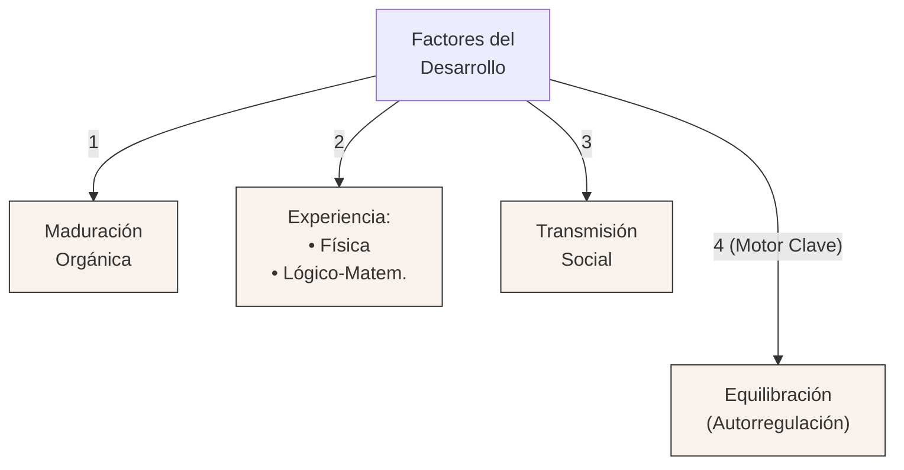
```mermaid
graph TD
    A["Factores del<br>Desarrollo"]
    
    A -->|"1"| B["Maduración<br>Orgánica"]
    A -->|"2"| C["Experiencia:<br>• Física<br>• Lógico-Matem."]
    A -->|"3"| D["Transmisión<br>Social"]
    A --->|"4 (Motor Clave)"| E["Equilibración<br>(Autorregulación)"]
    
    style B fill:#f9f2ec,stroke:#333
    style C fill:#f9f2ec,stroke:#333
    style D fill:#f9f2ec,stroke:#333
    style E fill:#f9f2ec,stroke:#333
```

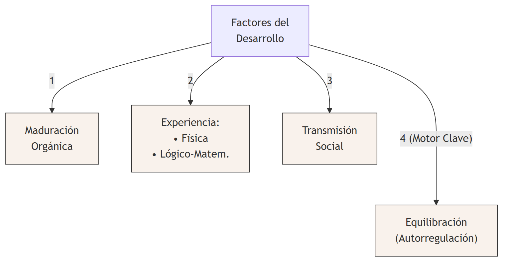

### Glosario de Conceptos Clave

| Concepto | Definición Clave en el Texto |
|----------|-----------------------------|
| **Pensamiento Hipotético-Deductivo** | Capacidad que surge en la preadolescencia para extraer las consecuencias necesarias de proposiciones consideradas como puras hipótesis o posibilidades, desligadas de la comprobación concreta. |
| **Combinatoria** | Operación mental que libera la forma de su contenido, permitiendo agrupar sistemáticamente elementos, objetos o ideas de 1 en 1, 2 en 2, etc., alcanzando todas las combinaciones lógicamente posibles. |
| **Grupo INRC (Cuaternalidad)** | Estructura de conjunto característica del pensamiento formal que fusiona en un solo sistema operatorio la Inversión (N) y la Reciprocidad (R), generando cuatro transformaciones (Idéntica, Inversa, Recíproca y Correlativa). |
| **Inversión (o Negación)** | Forma de reversibilidad donde la operación inversa compuesta con la directa produce una anulación o supresión estricta (+A - A = 0). |
| **Reciprocidad (o Simetría)** | Forma de reversibilidad donde la operación inversa produce una equivalencia o compensación en sentido contrario, sin anular el elemento constitutivo. |
| **Equilibración** | Mecanismo interno de autorregulación del desarrollo, consistente en compensaciones activas y anticipatorias del sujeto en respuesta a perturbaciones, motor principal del progreso operatorio. |

### Citas Críticas

> [!IMPORTANT]
> *"La gran novedad del nivel del que vamos a ocuparnos es que mediante una diferenciación de la forma y del contenido, el sujeto llega a ser capaz de razonar correctamente sobre proposiciones en las que no cree o no cree todavía, es decir, que considera como puras hipótesis."*
> **Justificación:** Marca la frontera cualitativa fundamental que distingue las operaciones concretas de las formales: el paso al razonamiento hipotético desligado de lo inmediatamente real.

> [!IMPORTANT]
> *"No hay ahí simplemente yuxtaposición de las inversiones y de las reciprocidades, sino fusión operatoria en un todo único, en el sentido de que cada operación será, de ahora en adelante, a la vez, la inversa de otra y la recíproca de una tercera."*
> **Justificación:** Resume la esencia estructural del grupo INRC, el logro cognitivo culmine que unifica las dos lógicas previamente separadas en la infancia.

> [!IMPORTANT]
> *"La afectividad constituye la energética de las conductas cuyo aspecto cognitivo se refiere sólo a las estructuras [...] los dos aspectos, afectivo y cognitivo, son al mismo tiempo inseparables e irreductibles."*
> **Justificación:** Evidencia la concepción unitaria de Piaget sobre la psique humana, desmintiendo que su teoría excluya la emoción, y demostrando que el desarrollo valórico adolescente emana de la nueva arquitectura lógica.

### Preguntas de Autoevaluación

1. ¿Cuál es la diferencia metodológica fundamental entre un niño en estadio de operaciones concretas y un preadolescente en estadio formal frente a un problema experimental multivariable (como el péndulo)?
2. Explica la diferencia teórica entre la reversibilidad por Inversión y la reversibilidad por Reciprocidad, y describe por qué en la infancia operan en dominios separados.
3. Define qué es la combinatoria lógica y detalla su utilidad aplicándola al experimento de la combinación de líquidos coloreados para lograr el amarillo.
4. ¿Qué representan las siglas I, N, R, y C dentro de la estructura de cuaternalidad y cómo se aplicarían lógicamente para testear la validez de la proposición p ⊃ q?
5. ¿De qué manera la adquisición cognitiva del pensamiento hipotético-deductivo influye directamente en las transformaciones morales y vocacionales que atraviesa un joven durante la adolescencia?

