# Unidad 8: Desarrollo Fisiológico en la Adultez

## Noción de desarrollo en la etapa adulta

El desarrollo en la etapa adulta es un proceso de cambio que se prolonga a lo largo de toda la vida. Contrario a la visión psicoanalítica clásica (como la de Sigmund Freud), que consideraba la pubertad como el punto final del desarrollo, hoy en día se entiende que el desarrollo es un proceso continuo.

El concepto de desarrollo no implica simplemente cualquier cambio temporal, aleatorio o pasajero (como cambiar de ropa o tener un resfriado). Por el contrario, el desarrollo se define como un **proceso sistemático de cambio adaptativo en el comportamiento**, el cual ocurre en una o más direcciones. 
* Es **sistemático** porque es coherente y organizado.
* Es **adaptativo** porque permite al individuo lidiar con las condiciones de existencia, tanto internas como externas, que están en constante cambio.

El desarrollo progresa desde formas simples a más complejas (por ejemplo, el paso de resolver problemas básicos a dilemas existenciales o prácticos complejos). En la adultez, el desarrollo implica una compleja interacción entre **maduración** (el despliegue de patrones biológicamente determinados de comportamiento) y **aprendizaje** (cambios duraderos en el comportamiento como resultado de la experiencia). Con el avance de la edad, las diferencias individuales se vuelven mucho más evidentes.

Para comprender a fondo la noción de desarrollo en el ciclo vital, el psicólogo Paul B. Baltes identificó un conjunto de principios clave que rigen este proceso:

* **Multidireccionalidad:** El desarrollo implica equilibrios entre aumentos y disminuciones, ganancias y pérdidas. A medida que una capacidad aumenta (como el vocabulario o la experiencia práctica), otra puede disminuir (como la fuerza física extrema o la resolución rápida de problemas no familiares).
* **Multidimensionalidad:** El desarrollo afecta simultáneamente diversas capacidades y aspectos del individuo, como la inteligencia, la percepción y la personalidad. Estos elementos cambian al mismo tiempo y se entrelazan.
* **Plasticidad:** Se refiere a la flexibilidad y la capacidad de modificar el desempeño. Aún en la adultez tardía, es posible mejorar funciones como la memoria o la resistencia mediante entrenamiento, aunque existen límites fisiológicos respecto a cuánto se puede mejorar.
* **Historia y contexto:** El ser humano se desarrolla en un contexto físico y social que varía históricamente. Las personas no solo reaccionan a su entorno de forma pasiva, sino que interactúan con él y lo modifican activamente.
* **Causalidad múltiple:** No existe una única causa para el desarrollo; requiere un análisis multidisciplinario porque convergen factores biológicos, sociales, históricos y psicológicos.

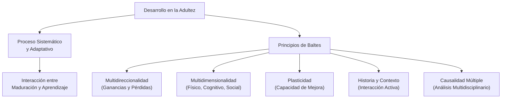

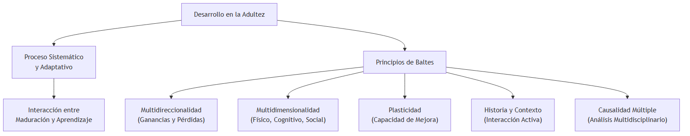

## Las distintas etapas y transiciones

El desarrollo adulto es sumamente complejo debido a que los cambios ocurren simultáneamente en múltiples dimensiones del ser humano: desarrollo físico, desarrollo intelectual o cognitivo, desarrollo de la personalidad y desarrollo social. Estas áreas están fuertemente interrelacionadas; por ejemplo, un declive físico puede afectar la elección ocupacional (ámbito social) o mermar la autoestima (ámbito de la personalidad).

La investigación divide convencionalmente la adultez en tres grandes periodos cronológicos, cada uno con transiciones, eventos y preocupaciones características:

**1. Adultez joven (20 a 40 años):**
* **Físico:** Se encuentra en la cima de la condición física, la cual luego comienza a declinar ligeramente. Las elecciones del estilo de vida empiezan a influir drásticamente en la salud a largo plazo.
* **Cognitivo:** Las habilidades cognitivas y los juicios morales alcanzan una mayor complejidad. Es una etapa crucial para la toma de decisiones educativas y profesionales.
* **Psicosocial:** Los rasgos de personalidad y los estilos de vida tienden a estabilizarse. Las personas toman decisiones fundamentales en torno a relaciones íntimas (matrimonio, convivencia) y estilos de vida personales. Para la mayoría, es la etapa de formar una familia y tener hijos.

**2. Adultez media (40 a 65 años):**
* **Físico:** Puede ocurrir cierto deterioro paulatino en las habilidades sensoriales, la salud general, la resistencia y las destrezas físicas. En las mujeres, se experimenta la menopausia.
* **Cognitivo:** Las habilidades mentales alcanzan su punto máximo. La experiencia acumulada y la capacidad práctica para la resolución de problemas son sumamente altas. La creatividad puede disminuir en volumen pero aumentar significativamente en calidad. Algunos alcanzan el éxito profesional y poder económico máximo; otros enfrentan agotamiento y cambian drásticamente de carrera.
* **Psicosocial:** Continúa el desarrollo de la identidad; muchas personas experimentan una transición estresante. Existe una doble responsabilidad que genera tensión: criar a los hijos (o verlos partir en el nido vacío) y, al mismo tiempo, tener que cuidar a los padres ancianos.

**3. Adultez tardía o Vejez (65 años en adelante):**
* **Físico:** Aunque la mayoría de los individuos sigue siendo relativamente saludable y activo, el declive de la salud y las habilidades físicas se vuelve más pronunciado. Se experimenta un retraso generalizado en el tiempo de reacción. Aparecen condiciones crónicas que suelen ser controlables con intervención médica.
* **Cognitivo:** La mayoría mantiene la alerta mental. Si bien pueden deteriorarse algunas áreas de la inteligencia fluida y la memoria a corto plazo, la mayoría desarrolla mecanismos para compensar estos declives, a menudo apoyándose en la sabiduría acumulada.
* **Psicosocial:** La jubilación representa una gran transición, abriendo nuevas opciones para el uso del tiempo. Es una etapa donde deben enfrentarse pérdidas personales (muerte de cónyuges o amigos) y la propia muerte inminente. La búsqueda de significado vital y el apoyo de redes familiares o sociales asumen un rol central.

### Los múltiples significados de la edad

La delimitación por edad cronológica (los años transcurridos desde el nacimiento) es sólo una convención. En el estudio del desarrollo, se entiende que el ser humano posee varias edades diferentes que actúan en sincronía o desincronía:

* **Edad Funcional:** Mide qué tan bien interactúa y funciona una persona en su entorno en comparación con otros de la misma edad cronológica.
* **Edad Biológica:** Es un indicador de cuánto ha progresado el ciclo vital en términos del funcionamiento de sistemas vitales (respiratorio, circulatorio, etc.). Se ve fuertemente modificada por factores de estilo de vida como el ejercicio y el tabaquismo.
* **Edad Psicológica:** Refleja la capacidad de madurez para enfrentar y lidiar con las demandas ambientales, el nivel de independencia y de autonomía emocional en contraste a sus contemporáneos.
* **Edad Social:** Depende del grado en que el comportamiento de un individuo se ajusta a las normas, expectativas y roles esperados por la sociedad para su edad cronológica (por ejemplo, si una persona tiene su primer hijo a los 40 años, tiene una edad social más joven frente a esa expectativa).

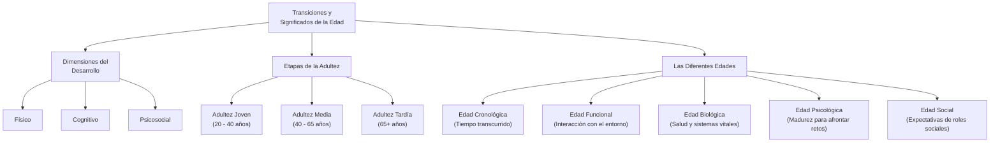

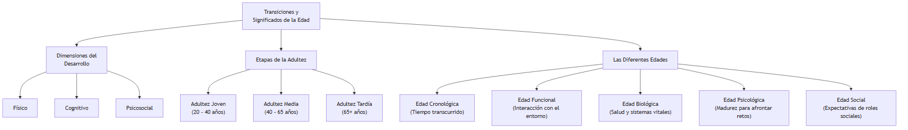

## Influencias normativas y no normativas

El desarrollo durante toda la etapa adulta está fuertemente sujeto a diversas influencias, originadas tanto en la dotación genética innata como en el complejo entorno social, físico e histórico. Las influencias no operan en el vacío, sino que las personas cambian su mundo mientras el mundo las cambia a ellas. 

Los científicos clasifican estas influencias en dos grandes categorías, dependiendo de qué tan compartidas sean por un grupo de individuos:

### Influencias Normativas

Son aquellos acontecimientos y presiones sociales o biológicas que experimenta la mayoría de las personas de manera muy similar, dentro de un grupo o cultura determinados. Se dividen en dos subcategorías críticas:

* **Influencias normativas determinadas por la edad:** Son los sucesos biológicos y culturales altamente predecibles y ligados a rangos de edad. Ejemplos biológicos incluyen la menopausia en las mujeres o la disminución de potencia sexual en los hombres; ejemplos socioculturales incluyen la transición hacia la jubilación o el inicio de la escolarización obligatoria.
* **Influencias normativas históricas (Efecto de Cohorte):** Afectan a un grupo específico de personas que comparten una experiencia histórica particular por haber nacido y crecido en la misma época (lo que se conoce como cohorte). Eventos masivos como guerras (la Guerra de Vietnam, las Guerras Mundiales), colapsos económicos (la Gran Depresión), pandemias o revoluciones tecnológicas marcan a toda una generación de una forma particular y alteran sus patrones de desarrollo respecto a generaciones previas.

### Influencias No Normativas

Son eventualidades atípicas y singulares que generan un gran impacto sobre la vida de un individuo en particular, pero no en toda la población. Causan tensiones severas porque el individuo rara vez está preparado para afrontarlas, exigiendo un esfuerzo de adaptación especial. Pueden manifestarse de dos maneras:

* **Eventos atípicos:** Situaciones poco frecuentes como sobrevivir a un accidente de avión, ganar la lotería o sufrir el diagnóstico de una enfermedad extremadamente rara.
* **Sucesos típicos en momentos atípicos:** Experimentar eventos normales de la vida humana pero en una edad que se sale de la norma cultural o biológica; por ejemplo, convertirse en padre por primera vez a los 60 años de edad, o la viudez a los 23 años.

Es importante destacar que las personas también participan activamente en su propio desarrollo al crear sus propios eventos no normativos (por ejemplo, buscar hobbies extremos, mudarse impulsivamente a otro país, o solicitar empleos desafiantes).

### El Enfoque Bioecológico de Bronfenbrenner

Para estructurar la inmensa cantidad de variables ambientales que actúan como influencias (normativas y no normativas), Urie Bronfenbrenner formuló el modelo bioecológico, el cual clasifica las influencias desde las más inmediatas hasta las más macro-contextuales, incorporando la dimensión temporal. Este enfoque entiende al individuo en el centro de cinco sistemas concéntricos:

1. **Microsistema:** El ambiente cotidiano e inmediato. Incluye interacciones directas, cara a cara (el cónyuge, los hijos, compañeros de trabajo o clase).
2. **Mesosistema:** La red de interconexiones entre varios microsistemas. Por ejemplo, de qué manera el estrés experimentado en una demanda de divorcio afecta el desempeño laboral.
3. **Exosistema:** Instituciones o vínculos con los que el individuo no interactúa directamente, pero que afectan indirectamente su desarrollo. Un ejemplo es el papel del gobierno en los servicios de atención médica o cómo un sistema de transporte público limita las oportunidades de trabajo.
4. **Macrosistema:** Los patrones culturales dominantes, como las ideologías, las creencias, o los sistemas económicos y políticos vigentes (p. ej., vivir en una sociedad capitalista versus una socialista).
5. **Cronosistema:** Agrega la dimensión crítica del tiempo, implicando tanto los cambios a lo largo del ciclo vital en la estructura de la familia o lugar de residencia, como los grandes cambios de la época socio-histórica.

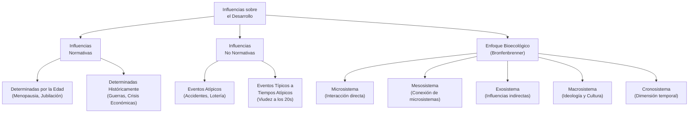

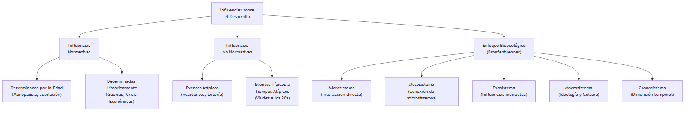

### 1. Tesis Central o Resumen Ejecutivo

El envejecimiento fisiológico en la adultez es un proceso gradual, continuo y sumamente heterogéneo que afecta de manera diferencial a cada individuo y a sus diversos sistemas corporales. Lejos de representar un declive uniforme, los cambios en la apariencia física, las capacidades sensoriomotoras y las funciones reproductivas reflejan una interacción intrincada entre la programación biológica intrínseca y variables de estilo de vida, salud y ambiente. Mientras que el deterioro en los órganos de los sentidos (vista y oído) y las transformaciones hormonales en hombres y mujeres son parte del desarrollo esperado (envejecimiento primario), su impacto y severidad son moldeados decisivamente por el envejecimiento secundario y los esfuerzos de compensación del individuo.

### 2. Envejecimiento Fisiológico y Apariencia Física

Los cambios en la apariencia física son los indicadores más visibles del envejecimiento, aunque su impacto es frecuentemente modificado por actitudes sociales. A lo largo de la adultez media, la mayoría de los adultos compensan muy bien las pequeñas y graduales alteraciones.

**Transformaciones Estructurales y de Composición**
- La piel tiende a palidecer y mancharse; paulatinamente adopta una textura apergaminada, pierde su elasticidad y comienza a colgar en pliegues y arrugas. Esto es exacerbado por décadas de exposición a la luz ultravioleta (fotoenvejecimiento).
- En la adultez media, el metabolismo se lentifica, y en las personas de hábitos sedentarios hay un notable aumento de peso (típicamente hasta los 55-60 años), donde la masa muscular comienza a ser reemplazada por tejido adiposo.
- El cabello se vuelve progresivamente blanco y más escaso (adelgazamiento), al mismo tiempo que puede comenzar a surgir vello en zonas inesperadas como las orejas en los varones o el mentón en las mujeres.
- Ocurre una pérdida neta en la estatura a medida que los discos ubicados entre las vértebras espinales se atrofian o encogen. La densidad ósea se reduce, provocando cambios posturales (como el encorvamiento o la "joroba de viuda", común en mujeres posmenopáusicas).

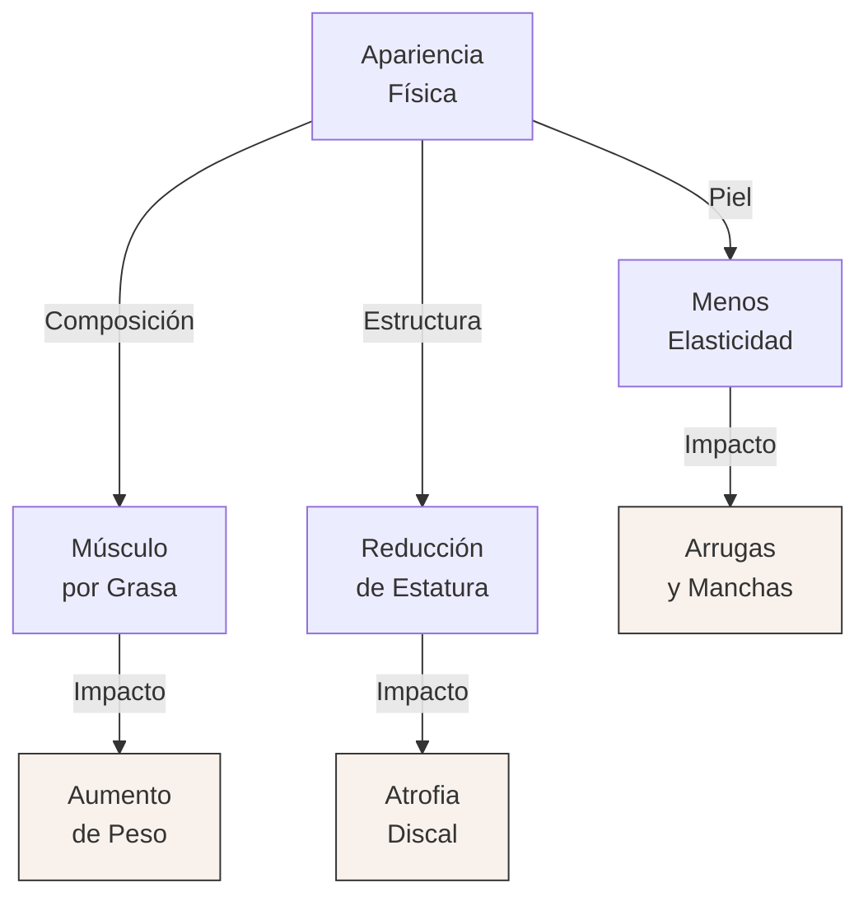

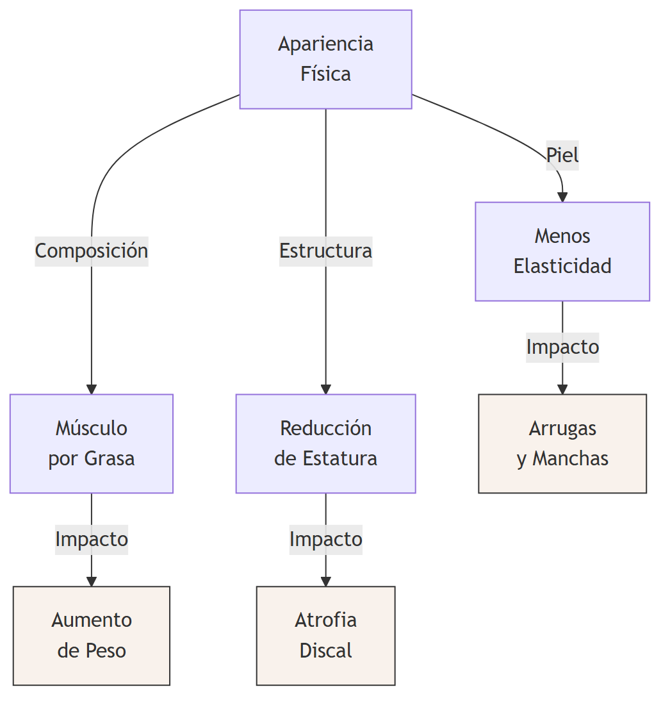

### 3. Cambios Sistémicos: Visión y Audición

Las habilidades sensoriomotoras sufren transformaciones considerables. El sistema visual y el auditivo experimentan declives que, si no son compensados, afectan la calidad de vida y la autonomía.

**Alteraciones en el Sistema Visual**
- **Agudeza Visual Dinámica y Estática:** Hacia los 50 años de edad, comienza a declinar de manera notoria la agudeza visual. Para los 85 años, es posible que el adulto haya perdido hasta el 80% de su agudeza juvenil. La capacidad para percibir objetos en movimiento (visión dinámica) decae de manera incluso más pronunciada.
- **Presbicia y el Cristalino:** Uno de los fenómenos más ubicuos pasados los 40 años es la presbicia. El cristalino pierde flexibilidad y se engrosa al seguir creciendo a lo largo de toda la vida, lo que restringe dramáticamente su habilidad para curvarse y enfocar la luz de los objetos cercanos en la retina. Además, el cristalino empieza a tornarse amarillento, lo que filtra las frecuencias de luz azul, verde y violeta, mermando la capacidad de discriminación cromática.
- **Tamaño de la Pupila y Sensibilidad a la Luz:** Los músculos del iris pierden tonicidad. La pupila de un anciano se torna crónicamente más pequeña y carece de la misma amplitud de dilatación que en la juventud. En consecuencia, entra menos luz a la retina (se requiere hasta un tercio más de brillo ambiental) y la adaptación a la oscuridad se lentifica enormemente, incrementando el riesgo de sufrir accidentes por destellos.
- **Enfermedades Oculares Relacionadas a la Edad:**
  - **Cataratas:** Opacidades del cristalino causantes de visión nubrosa; tratables exitosamente mediante intervenciones quirúrgicas y la inserción de lentes intraoculares plásticos.
  - **Degeneración Macular Relacionada con la Edad (AMD):** Patología progresiva donde se daña la mácula (área central de la retina), deteriorando la distinción de finos detalles. Es la causa líder de ceguera funcional pasados los 60 años.
  - **Glaucoma:** Aumento de la presión de los fluidos intraoculares por un fallo en el drenaje interno, dañando irreversiblemente el nervio óptico. 

**Pérdidas en el Sistema Auditivo**
- **Presbiacusia:** Pérdida progresiva de audición de tipo sensorineural inducida por la edad. Inicialmente castiga la percepción de los sonidos de alta frecuencia (como las voces femeninas, los tonos altos musicales y las consonantes fricativas). Suele avanzar de forma más drástica en los hombres.
- Otros problemas son la acumulación de cerumen, la pérdida conductiva y el padecimiento de tinnitus crónico (zumbidos intracraneales persistentes y agotadores).

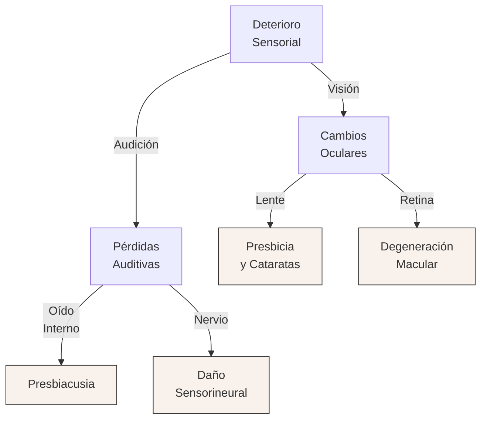

### 4. Funcionamiento Sexual y Reproductivo

Lejos de extinguirse, la función sexual evoluciona. Sin embargo, ocurren cambios endocrinos drásticos en las mujeres y transformaciones progresivas en los hombres que demarcan el climaterio.

**El Climaterio Femenino (Menopausia)**
- **Cambios Hormonales y Físicos:** Entre los 45 y 55 años, los ovarios de la mujer experimentan una caída estrepitosa en la síntesis de estrógeno y progesterona. Cuando se detiene por completo la menstruación y la ovulación, se alcanza la menopausia. 
- **Sintomatología:** Al disminuir los niveles estrogénicos, la mayoría de las mujeres experimentan "bochornos" provocados por irregularidades en la dilatación vascular, alteraciones urinarias y resequedad, adelgazamiento y estrechez del tejido vaginal. Si bien el deseo sexual en sí se mantiene gracias a los andrógenos, la excitación inicial (lubricación y tumescencia del clítoris) y la consecución del orgasmo toman un tiempo mayor y resultan, a veces, menos intensos.
- **Terapias y Repercusiones:** Si bien históricamente se indicaba Terapia de Reemplazo Hormonal (TRH) para atajar estos síntomas e incluso el riesgo cardiovascular u osteoporótico, hallazgos modernos demostraron que regímenes de estrógeno con progestina incrementan los riesgos de desarrollar cáncer mamario, demencia, eventos tromboembólicos y enfermedad coronaria.

**El Climaterio Masculino (Andropausia)**
- A diferencia de la abrupta pausa reproductiva femenina, en el hombre los cambios hormonales son paulatinos (la testosterona declina gradualmente en un margen del 30 al 40% llegado a los 70 años).
- La capacidad reproductora (conteo de espermatozoides y viabilidad) continúa hasta el final de la vida adulta, aunque decae.
- **Disfunción Eréctil y Cambios en la Respuesta:** Con la senectud se presentan alteraciones notables en el ciclo de respuesta sexual: la erección toma más tiempo en alcanzarse y suele ser menos rígida, el volumen eyaculatorio desciende, se experimentan orgasmos más espaciados y el período refractario (tiempo requerido entre eyaculaciones) se extiende drásticamente. Las tasas de disfunción eréctil ascienden precipitadamente por morbilidades vasculares, diabetes o medicación.

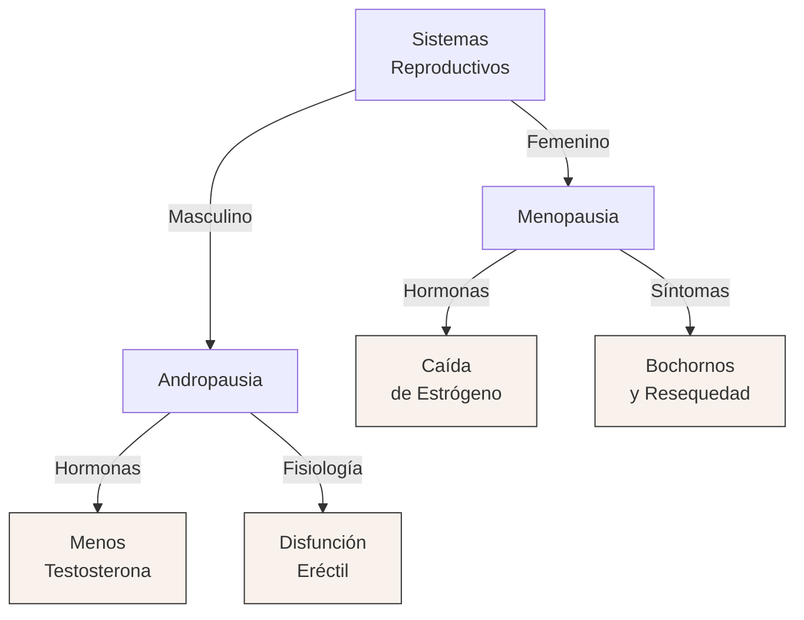

### 5. Glosario de Conceptos Clave

| Concepto | Definición Clave en el Texto |
|----------|-----------------------------|
| **Agudeza visual** | Habilidad del individuo para distinguir detalles finos de objetos estáticos. Declina radicalmente hacia los 85 años debido a la opacidad del cristalino y lentitud neural. |
| **Presbicia** | Trastorno asociado a la edad avanzada caracterizado por una pérdida progresiva de la "visión cercana", originado por el engrosamiento e inflexibilidad progresiva del cristalino ocular que le impide curvarse para enfocar objetos a corta distancia. |
| **Cataratas** | Áreas nubladas u opacas formadas en el cristalino a medida que envejece, bloqueando el paso libre de la luz hacia la retina y provocando una pronunciada pérdida de visión. |
| **Presbiacusia** | Forma degenerativa sensorineural del oído interno inducida por la senectud natural. Afecta drástica e inicialmente la percepción de los sonidos y tonos en altas frecuencias (agudos). |
| **Menopausia** | El cese definitivo de la menstruación, de la ovulación y de la aptitud reproductiva, ocurrido típicamente entre los 45 y 55 años, impulsado fisiológicamente por la profunda carencia de estrógenos ováricos. |
| **Disfunción Eréctil** | Afección masculina comúnmente prevalente en la adultez tardía, caracterizada por la incapacidad persistente de alcanzar o preservar la firmeza del pene necesaria para una interacción sexual exitosa y satisfactoria. |

### 6. Citas Críticas

> [!IMPORTANT]
> *"Conforme caen los niveles de estrógeno y progesterona producidos por los ovarios, la menstruación se detiene por completo... Tres de cada cuatro mujeres experimentan poca o ninguna incomodidad física debido a la menopausia"*
> **Justificación:** Es un hallazgo fundamental porque demuele el extendido mito clínico de que el climaterio femenino es constitutivamente patológico, doloroso y universalmente discapacitante.

> [!IMPORTANT]
> *"Muchos hombres, conforme envejecen, temen enormemente la pérdida de potencia sexual. En realidad, la idea de que ésta es una acompañante natural del envejecimiento es una falacia. Con mucha frecuencia, la mengua en actividad sexual se debe a causas no fisiológicas..."*
> **Justificación:** Resalta que, aunque existen cambios innegables de tipo fisiológico en la andropausia, la cesación prematura de la vida sexual es primariamente de raíz psicosocial, vascular y actitudinal, siendo por ende susceptible a intervenciones.

### 7. Preguntas de Autoevaluación

1. Analice críticamente los cambios morfológicos que experimenta el cristalino humano tras la mediana edad. ¿Cómo impactan diferencialmente dichos cambios a la discriminación de los colores y a la lectura de cerca?
2. Exponga el concepto de "envejecimiento primario" versus "envejecimiento secundario" en lo referente a la pérdida estructural de la piel y los músculos estriados esqueléticos. 
3. Describa detalladamente el fenómeno de la presbiacusia y fundamente por qué la utilización de audífonos convencionales amplificadores no siempre resuelve el problema del aislamiento social en pacientes geriátricos.
4. Diferencie de modo pormenorizado el síndrome de la menopausia del denominado climaterio masculino (o andropausia), poniendo hincapié en la tasa de cambio de las pendientes hormonales y el umbral de capacidad reproductiva.
5. De acuerdo a la "Iniciativa de Salud de las Mujeres" (WHI), justifique la drástica revisión médica sobre los protocolos de prescripción de Terapias de Reemplazo Hormonal (TRH) a largo plazo en mujeres menopáusicas asintomáticas.

### 1. Tesis Central o Resumen Ejecutivo

La salud física y mental durante la adultez no está determinada únicamente por el reloj biológico, sino que es el resultado complejo de la interacción entre vulnerabilidades patológicas (como el cáncer y las enfermedades neurodegenerativas), determinantes macrosociales (género, nivel socioeconómico, raza) y microambientales (vínculos interpersonales). A su vez, las elecciones cotidianas del estilo de vida y el manejo del estrés actúan como moduladores directos que pueden acelerar el desgaste sistémico o, por el contrario, preservar la capacidad de reserva de los órganos, subrayando que el individuo posee un grado significativo de agencia sobre su trayectoria de envejecimiento.

### 2. Enfermedades Comunes e Influencias en la Salud en la Adultez

#### "Enfermedades temibles" del envejecimiento

A medida que el cuerpo envejece, aumenta la susceptibilidad a enfermedades crónicas y degenerativas graves, que afectan a múltiples sistemas corporales y merman significativamente la calidad de vida. Entre ellas destacan:

*   **Enfermedad de Alzheimer:** Una de las patologías neurodegenerativas más temidas, caracterizada por un deterioro cognitivo progresivo y la pérdida de autonomía.
*   **Cáncer (con especial énfasis en el de próstata):** El cáncer impacta a numerosos sistemas corporales. En los hombres, el cáncer de próstata representa una preocupación fundamental.
    *   **Factores de Riesgo:** La evidencia sugiere que dietas altas en carnes rojas y productos lácteos ricos en grasas incrementan el riesgo de desarrollar esta enfermedad.
    *   **Diagnóstico Preventivo:** Se emplean dos métodos principales, aunque ninguno es definitivo por sí solo (se requiere biopsia para confirmar). La prueba de sangre del **Antígeno Prostático Específico (PSA)** es la más efectiva para detectar niveles anormales de esta proteína, mientras que el **Examen Digital del Recto (DRE)** permite la palpación física de anormalidades. Existe debate sobre la frecuencia de tamizaje, ya que organizaciones como la CDC no recomiendan pruebas anuales indiscriminadas ante la falta de evidencia de que reduzcan la mortalidad neta.
    *   **Tratamientos:** Varían desde la **cirugía** (prostatectomía radical para extirpar la glándula o resección transuretral), **radioterapia**, **terapia hormonal** (para bloquear hormonas masculinas que alimentan el tumor, mediante orquiectomía o fármacos), hasta la "espera vigilante" en casos de progresión muy lenta.

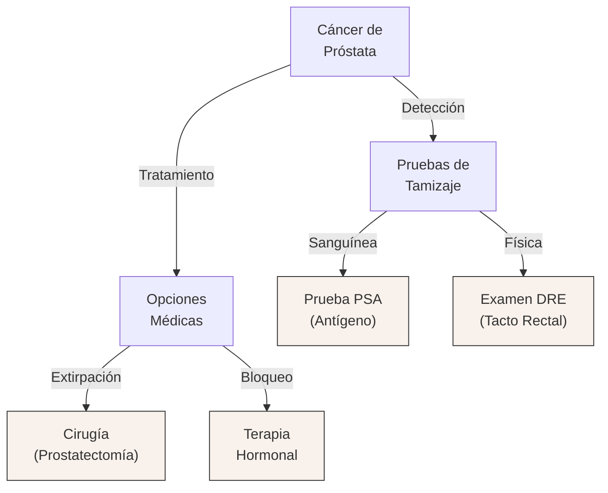

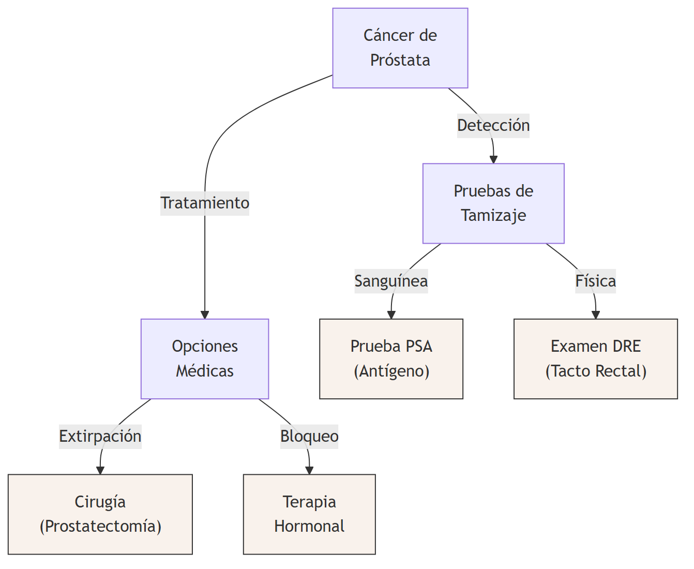

#### Influencias Indirectas sobre la Salud

La salud no opera en el vacío biológico; está moldeada por el contexto social y demográfico en el que se desenvuelve el adulto.

*   **Edad y Género:** La morbilidad y mortalidad varían drásticamente. Los jóvenes sufren más accidentes y enfermedades agudas leves, mientras que los adultos mayores padecen condiciones crónicas concurrentes (hipertensión, artritis, cardiopatías) que, ante una pérdida de "capacidad de reserva", pueden volver letal un cuadro menor. Respecto al género, existe una paradoja: **las mujeres viven más, pero reportan mayor morbilidad leve**. La longevidad femenina se asocia a ventajas genéticas (el segundo cromosoma X) y hormonales (estrógenos protectores cardiovasculares previos a la menopausia), sumado a una mayor conciencia preventiva y tendencia a buscar ayuda médica temprana. Los hombres tienden a ignorar síntomas por presiones culturales de masculinidad, lo que deriva en diagnósticos tardíos y cuadros crónicos más mortales, además de incurrir en conductas de mayor riesgo físico y dietético.
*   **Estatus Socioeconómico (SES), Raza y Etnicidad:** Existe una correlación directa entre mayores ingresos y educación, y una vida más larga y sana. Esto no es intrínseco al dinero, sino a los factores ambientales concomitantes: acceso a prevención médica, dietas de mayor calidad, entornos seguros (menor exposición a toxinas y violencia) y menores niveles de estrés crónico. Minorías raciales, como las comunidades afroamericanas e hispanas, suelen enfrentar desventajas interseccionales (urbano-marginación, exposición ambiental peligrosa) que elevan desproporcionadamente sus tasas de hipertensión, homicidios y mortalidad temprana, evidenciando también sesgos en la calidad de la atención médica recibida.
*   **Relaciones Interpersonales:** El aislamiento social es un factor de riesgo comparable al tabaquismo. Los individuos sin redes afectivas sufren mayores tasas de depresión, accidentes y patologías cardiovasculares. El **matrimonio** (y la cohabitación estable) actúa como un fuerte factor protector, especialmente para los hombres, al fomentar el cuidado mutuo, proveer estabilidad financiera compartida, asegurar apoyo emocional y desincentivar hábitos autodestructivos.

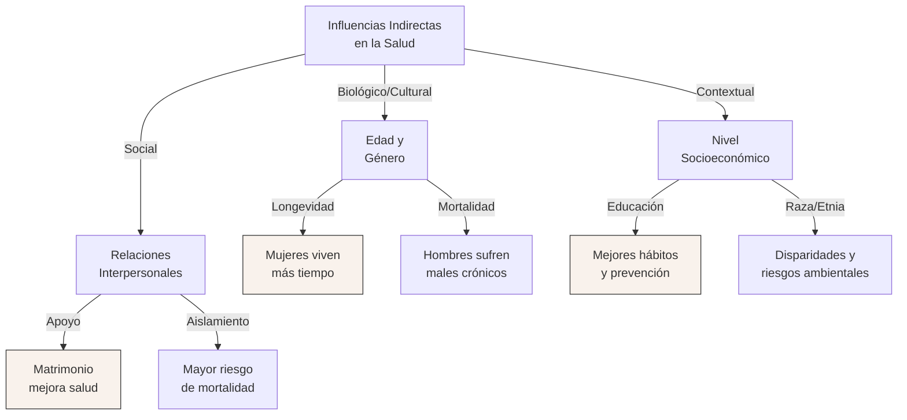

#### Factores para Mantener y Mejorar la Salud (Estilo de Vida)

Las decisiones conductuales acumulativas modulan dramáticamente el ritmo del envejecimiento biológico.

*   **Sustancias Dañinas (Tabaco y Alcohol):** 
    *   **Tabaquismo:** Es la principal causa de muerte prevenible. Causa múltiples tipos de cáncer (pulmón, laringe, vejiga), enfisema y daño cardiovascular severo. El humo de segunda mano representa un riesgo gravísimo para los convivientes. Abandonar el hábito mejora la función cardiaca y respiratoria casi de inmediato.
    *   **Alcohol:** Su consumo abusivo se vincula a cirrosis, psicosis, cáncer gástrico y accidentes mortales. Si bien el consumo muy moderado sugería protección cardiaca, estudios actualizados advierten que los riesgos de cáncer asociado superan dichos beneficios marginales.
*   **Estrés:** Es la respuesta fisiológica y psicológica ante demandas vitales complejas (medible mediante escalas como la de Holmes y Rahe). Con la edad, el sistema endocrino pierde eficiencia para modular el estrés, prolongando la liberación de hormonas como el cortisol y la adrenalina, lo que desgasta el sistema inmunológico, eleva sostenidamente la presión arterial y precipita cardiopatías. La forma de afrontamiento es vital: individuos con un **locus de control interno** (que sienten capacidad de agencia sobre su entorno) padecen menor morbimortalidad que aquellos con un locus externo, quienes sucumben a la indefensión y la inmunosupresión.
*   **Nutrición y Dieta:** La obesidad (IMC > 30) es una epidemia que sobrecarga riñones y corazón, y precipita diabetes y cáncer. Las intervenciones van desde dietas estructuradas (regulando carbohidratos) hasta cirugías (bariátrica o malabsortiva) en casos de obesidad mórbida. Es crítico mantener un equilibrio en las lipoproteínas: bajar el colesterol LDL (dañino) y elevar el HDL (protector) mediante una dieta rica en fibra y baja en grasas saturadas.
*   **Cuidado Dental:** La periodontitis y pérdida de piezas dentales complican la masticación, derivando en desnutrición secundaria en la vejez al obligar al consumo de dietas blandas poco nutritivas.
*   **Ejercicio:** Practicado regularmente, es el mayor pilar anti-envejecimiento. Protege contra la osteoporosis, mejora la reserva cardiorrespiratoria, alivia la depresión y previene diabetes y cardiopatías. Incluso el ejercicio moderado, como caminar vigorosamente a diario, reduce la mortalidad a la mitad en comparación con perfiles sedentarios.

### 3. Glosario de Conceptos Clave

| Concepto | Definición Clave en el Texto |
|----------|-----------------------------|
| **Antígeno Prostático Específico (PSA)** | Prueba sanguínea utilizada para detectar anormalidades en la glándula prostática, funcionando como tamizaje inicial para cáncer de próstata. |
| **Locus de Control Interno** | Percepción psicológica de que uno mismo tiene el poder de influir o modificar los eventos estresantes del entorno, asociado a una mejor respuesta inmunológica. |
| **Lipoproteína de Alta Densidad (HDL)** | Colesterol "bueno" o protector que ayuda a prevenir cardiopatías; se recomienda mantenerlo en niveles elevados (por encima de 45-50 mg/dl). |
| **Cirugía Bariátrica** | Intervención gastrointestinal drástica para obesidad mórbida (IMC > 40) que limita mecánicamente la capacidad de retención de alimento del estómago. |
| **Capacidad de Reserva** | Margen de funcionamiento biológico extra de los órganos que, al deteriorarse con la edad, provoca que enfermedades menores tengan un impacto físico severo. |

### 4. Citas Críticas

> [!IMPORTANT]
> *"La habilidad del cuerpo para responder al estrés tiende a deteriorarse con la edad... puede no aumentar lo suficiente el ritmo cardiaco durante el ejercicio físico, sino liberar cantidades excesivas de adrenalina y otras hormonas de estrés mucho después de que terminó el evento estresante."*
> **Justificación:** Es fundamental para entender que el problema del estrés en la adultez y vejez no es solo psicológico, sino que radica en una desregulación fisiológica y endocrina persistente.

> [!IMPORTANT]
> *"La brecha entre la expectativa de vida entre mujeres y hombres se redujo... a medida que el estilo de vida de las mujeres se ha vuelto más similar al de los hombres... Ahora representan 39 por ciento de todas las muertes relacionadas con tabaquismo."*
> **Justificación:** Demuestra que muchas de las "ventajas" biológicas femeninas están mediadas por factores culturales y hábitos; al homologarse los estilos de vida (y vicios), la brecha de mortalidad se acorta.

### 5. Mapa Conceptual (Mermaid)

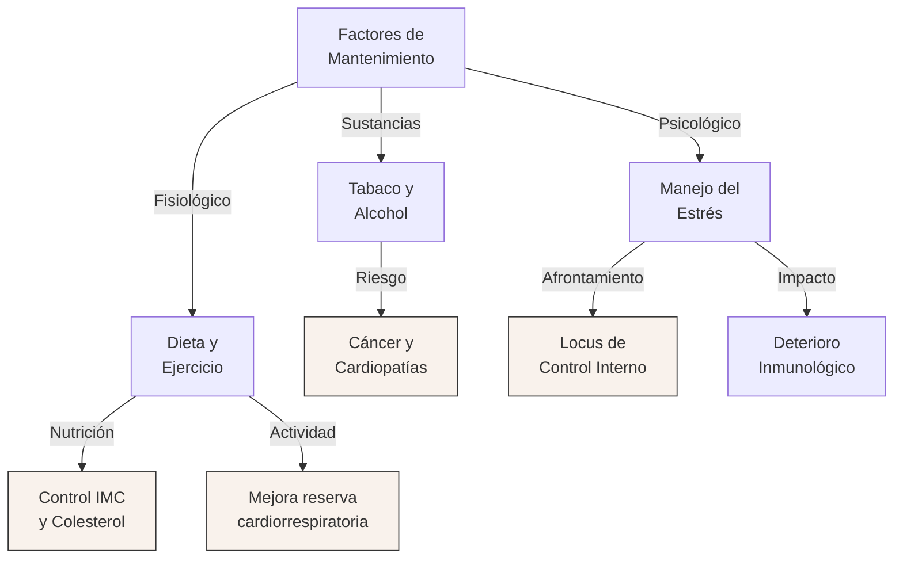

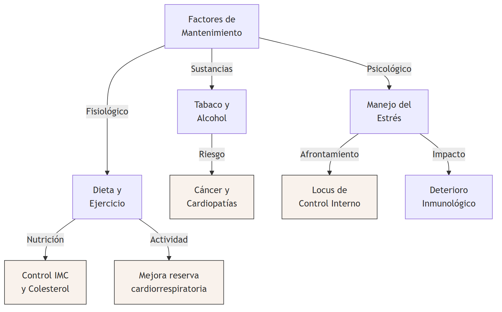

### 6. Preguntas de Autoevaluación

1. ¿Por qué la prueba de sangre PSA y el examen DRE no son concluyentes por sí solos para diagnosticar cáncer de próstata y qué procedimiento definitivo se requiere?
2. Explique la "paradoja de salud y género": ¿Por qué las mujeres viven más años en promedio pero reportan mayores índices de enfermedad y consultas médicas que los hombres?
3. ¿De qué manera el estatus socioeconómico actúa como una influencia indirecta sobre la salud, más allá del simple acceso a capital financiero?
4. Contraste los efectos fisiológicos del estrés agudo en un adulto joven frente a la respuesta desregulada del sistema endocrino en un adulto mayor.
5. Según las investigaciones longitudinales, ¿el ejercicio físico requiere ser aeróbicamente extenuante (como correr maratones) para brindar reducciones significativas en la tasa de mortalidad? Justifique.

