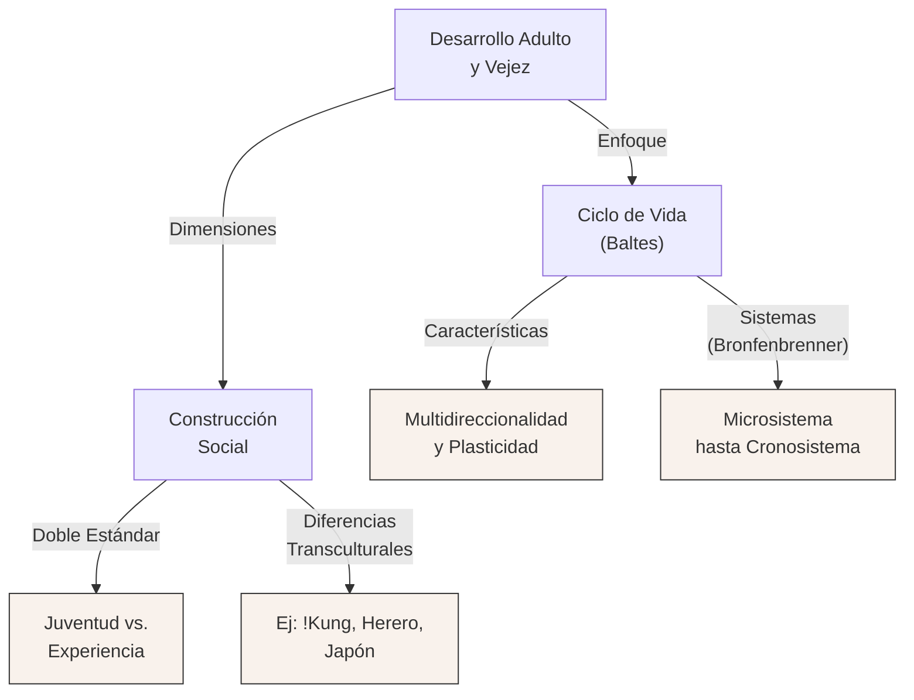
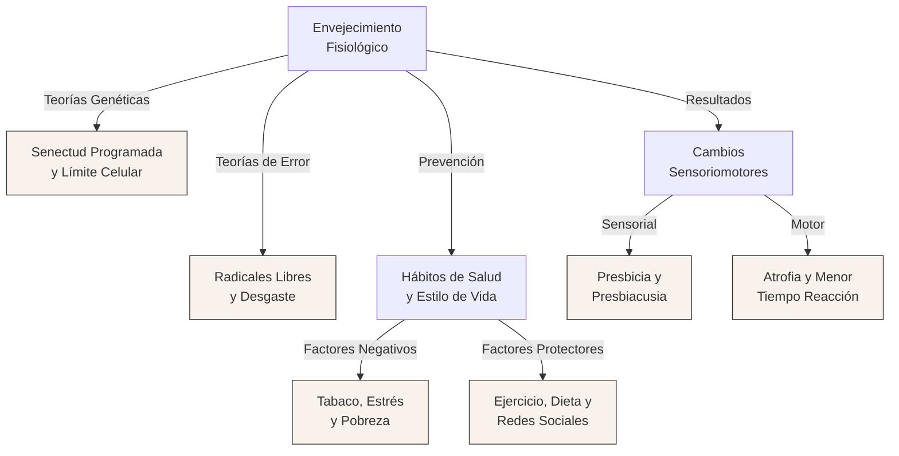

# Guía de Estudio: Desarrollo Adulto, Envejecimiento Fisiológico y Salud

## 1. Tesis Central o Resumen Ejecutivo

El desarrollo humano es un proceso continuo que abarca todo el ciclo de vida, desafiando la concepción tradicional que limitaba el desarrollo a la infancia y la adolescencia. Durante la adultez y la vejez, el desarrollo se caracteriza por su multidireccionalidad y plasticidad, implicando tanto ganancias como pérdidas que operan de manera simultánea en las dimensiones biológica, cognitiva y psicosocial. El envejecimiento biológico, influenciado tanto por una programación genética intrínseca como por factores de tasa variable (desgaste, estrés, radicales libres, estilo de vida), no es un simple proceso de deterioro inexorable, sino una etapa vital en la que el contexto sociohistórico, la cultura, la demografía y las elecciones personales moldean activamente la calidad y extensión de la vida. De este modo, la adultez y la vejez deben comprenderse desde un enfoque bioecológico y del ciclo de vida, que integra la salud física, las relaciones interpersonales y la construcción social de las distintas edades de la persona.

## 2. Desarrollo Analítico

### Noción de desarrollo en la etapa adulta

Hasta mediados del siglo XX, la psicología, fuertemente influenciada por teóricos como Sigmund Freud, consideraba que el desarrollo culminaba en la adolescencia temprana, concibiendo la adultez y la vejez simplemente como periodos de estancamiento o declive. Sin embargo, en las últimas décadas, el concepto de desarrollo se ha reformulado. El desarrollo es un proceso sistemático de cambio adaptativo en el comportamiento en una o más direcciones; es coherente, organizado, y permite lidiar con las condiciones cambiantes tanto internas como externas.

El enfoque del desarrollo del ciclo de vida, liderado por investigadores como Paul B. Baltes, establece que el desarrollo dura toda la vida. Cada periodo vital está influido por el pasado y afectará al futuro, y ninguno tiene mayor o menor valor que otro. Este enfoque se basa en varios principios fundamentales:

*   **Multidireccionalidad:** El desarrollo implica aumentos y disminuciones simultáneas. Mientras un adulto mayor puede experimentar declives físicos, puede simultáneamente aumentar su vocabulario o su sabiduría.
*   **Multidimensionalidad:** Afecta diversas capacidades al mismo tiempo: personalidad, inteligencia, percepción.
*   **Plasticidad:** El desempeño humano es flexible y puede mejorar a lo largo de toda la vida con entrenamiento y práctica, aunque existen límites intrínsecos.
*   **Contexto e Historia:** Las personas se desarrollan en circunstancias físicas y sociales específicas (tiempo y lugar), reaccionando a su entorno y modificándolo activamente.
*   **Causalidad Múltiple:** Exige un esfuerzo multidisciplinario, ya que el desarrollo tiene innumerables causas simultáneas.

A diferencia del rápido crecimiento infantil, el desarrollo adulto puede ser más sutil, marcado fuertemente por la experiencia, el aprendizaje y las diferencias individuales, las cuales se amplifican a medida que las personas envejecen. Además, el concepto de "edad" en la adultez se fragmenta en múltiples dimensiones: cronológica (paso del tiempo), biológica (estado físico de los sistemas vitales), psicológica (madurez para lidiar con el entorno) y social (ajuste a los roles y expectativas sociales).

### Etapas de la adultez

La investigación generalmente divide la adultez en tres periodos principales, cada uno con acontecimientos, retos y transiciones característicos en las sociedades occidentales contemporáneas:

*   **Adultez Joven (aproximadamente de 20 a 40 años):**
    Físicamente, los individuos alcanzan la cima de su condición física, fuerza y resistencia, las cuales comienzan a declinar muy ligeramente al final de esta etapa. Las elecciones de estilo de vida impactan fuertemente la salud futura. Cognitivamente, las habilidades y juicios morales alcanzan mayor complejidad. Es el momento de decisiones educativas y profesionales cruciales. Psicosocialmente, se estabilizan los rasgos de personalidad. La mayoría de las personas establecen relaciones íntimas, se casan y tienen hijos.
*   **Adultez Media (de 40 a 65 años):**
    Físicamente, se evidencian los primeros deterioros sensoriales (como la presbicia o disminución de la audición), de la salud, y pérdida de resistencia. Las mujeres experimentan la menopausia (y el climaterio) y los hombres la andropausia. Cognitivamente, muchas habilidades mentales alcanzan su punto máximo, y la resolución de problemas prácticos es muy alta gracias a la experiencia acumulada. Psicosocialmente, continúa la búsqueda de identidad, pudiendo ocurrir transiciones estresantes. Se lidia con la doble responsabilidad de criar a los hijos (o enfrentar el "nido vacío") y cuidar a los padres ancianos.
*   **Adultez Tardía o Vejez (65 años en adelante):**
    Aunque la salud y las habilidades físicas muestran declives más marcados, la mayoría de los adultos mayores de hoy permanecen sanos, activos e independientes. Cognitivamente, a pesar de algunos deterioros en la memoria y el tiempo de reacción, la mayoría permanece alerta y encuentra modos de compensación. Psicosocialmente, enfrentan la jubilación (que ofrece nuevas opciones de tiempo), el lidiar con pérdidas personales y la muerte inminente. La búsqueda de significado vital y el apoyo de familiares y amigos cercanos adquieren una importancia central.

### Influencias en el desarrollo

El curso del desarrollo adulto es moldeado por múltiples fuerzas concurrentes que pueden ser de origen hereditario o ambiental, aunque la distinción es difusa dado que las personas moldean los ambientes que a su vez las moldean a ellas.

**Influencias Normativas y No Normativas:**
*   *Influencias normativas determinadas por la edad:* Eventos similares para la mayoría en un grupo etario dado (ej. la menopausia o la jubilación).
*   *Influencias normativas históricas:* Eventos comunes a una cohorte específica (personas que crecen en el mismo tiempo y lugar), como la Gran Depresión, las guerras mundiales, o el impacto masivo de la televisión o el internet.
*   *Influencias no normativas:* Acontecimientos eventuales de gran impacto en vidas individuales. Pueden ser eventos típicos en momentos atípicos (tener un hijo a los 60 años) o eventos atípicos en sí mismos (ganar la lotería, sobrevivir a un accidente aéreo). A menudo, el estrés surge porque el individuo no cuenta con preparación para estos sucesos.

**El Enfoque Bioecológico de Urie Bronfenbrenner:**
Para comprender las influencias, Bronfenbrenner propone cinco niveles concéntricos:
1.  *Microsistema:* El entorno cotidiano cara a cara (hogar, trabajo, pares).
2.  *Mesosistema:* Las conexiones entre diversos microsistemas (ej. cómo el estrés laboral afecta el matrimonio).
3.  *Exosistema:* Vínculos entre microsistemas e instituciones externas que afectan indirectamente al sujeto (ej. sistema de transporte, políticas gubernamentales de jubilación).
4.  *Macrosistema:* Patrones culturales, sistemas políticos y económicos dominantes.
5.  *Cronosistema:* La dimensión del tiempo, los cambios o estabilidades ambientales y personales a lo largo de la vida.

### Construcción social de la vejez

La edad y el envejecimiento no son meros procesos biológicos, sino construcciones sociales fuertemente arraigadas en el contexto cultural. La investigación transcultural (como el estudio de Patricia Draper y Henry Harpending) demuestra que el significado de la vejez varía radicalmente:
*   En la tribu de los *!Kung San* (Botswana), la edad cronológica carece de sentido; las mujeres de 20 y 60 años realizan las mismas tareas y los individuos son valorados independientemente de los años.
*   En contraste, los *Herero* le temen a la vejez, la asocian con incapacidad física y planean su retiro, aunque tienen un sistema familiar donde los niños están culturalmente obligados a cuidar devotamente a los mayores, al punto de transferir hijos de familias fértiles a los ancianos sin descendencia.
*   En *Japón*, tradicionalmente, el envejecimiento (kônenki) es un proceso de adquisición de sabiduría, respeto y liberación de las cargas laborales y reproductivas, al punto que síntomas fisiológicos como la menopausia son experimentados de forma muchísimo más leve que en occidente (apenas el 10% reporta bochornos, comparado con el 40% en Canadá).

En las sociedades occidentales contemporáneas, predomina la "discriminación por motivos de edad", un prejuicio en el que la vejez denota debilidad, estrechez mental, pérdida de atractivo y de competencia, surgido de la negación del propio futuro envejecimiento. Los medios masivos perpetúan estereotipos, tanto negativos (ancianos frágiles y despistados) como positivos irreales (la segunda niñez dorada en campos de golf). Para las mujeres en particular, opera un doble estándar originado en mandatos evolutivos de reproducción: los signos de envejecimiento masculino (canas, arrugas) se leen como "experiencia", mientras en las mujeres denotan pérdida de valor, presionándolas a un culto exhaustivo a la juventud (cirugías estéticas, dietas).

Sin embargo, figuras como Betty Friedan (con su obra *The Fountain of Age*) han luchado para derribar esta "mística del envejecimiento", visibilizando a los ancianos como individuos con pleno potencial de desarrollo, fortalezas no probadas y con agencia para seguir contribuyendo productivamente. La demografía misma está forzando este cambio social: hacia el 2030, la población estadounidense tendrá a un tercio de sus habitantes con 55 años o más, convirtiéndose los adultos mayores en una fuerza demográfica sin precedentes.

### Envejecimiento fisiológico y corporal

La expectativa de vida humana ha dado un salto asombroso en el último siglo, gracias al control de la mortalidad infantil, avances médicos y mejoras sanitarias. Sin embargo, eventualmente ocurre la senectud: el periodo marcado por un deterioro corporal obvio.

**Teorías del Envejecimiento Biológico:**
El envejecimiento se explica a través de dos grandes familias de teorías:
1.  *Teorías de Programación Genética:* Sostienen que el cuerpo tiene un reloj biológico innato. Ejemplos son la teoría de la senectud programada (genes específicos se "apagan"), la teoría endocrina (las hormonas controlan el ritmo) y la teoría inmunológica (el sistema inmune decae programadamente). Se basan en descubrimientos como el límite de Hayflick (las células humanas se dividen unas 50 veces antes de detenerse debido al acortamiento de los telómeros).
2.  *Teorías de Tasa Variable (Teorías del Error):* El envejecimiento resulta de agresiones ambientales y daños acumulados al sistema, variando enormemente de persona a persona. Incluyen: la teoría del desgaste por el uso, la teoría de la tasa de vida (a mayor metabolismo basal, vida más corta), las teorías de error catastrófico y mutación somática (acumulación de errores en la división celular), la teoría del entrecruzamiento de proteínas, y la fundamental *teoría de los radicales libres* (daño celular acumulado causado por átomos inestables derivados de la metabolización del oxígeno).

Los gerontólogos distinguen entre el *envejecimiento primario* (deterioro codificado e inevitable) y el *envejecimiento secundario* (resultado de enfermedades, abusos corporales y falta de uso, altamente prevenible con el estilo de vida).

**Cambios en el Funcionamiento Sensoriomotor:**
*   *Visión:* A los 50 años suele aparecer la presbicia (endurecimiento y engrosamiento del cristalino que impide el enfoque cercano). Disminuye la agudeza visual, especialmente la dinámica. Las pupilas se achican, por lo que entra menos luz, exigiendo hasta un 33% más de brillo para ver. Aparece sensibilidad a los destellos, disminución en la percepción de profundidad y dificultad para distinguir colores en el espectro azul/verde por el amarilleo del cristalino.
*   *Audición:* La presbiacusia (pérdida sensorial que afecta principalmente la audición de consonantes de alta frecuencia) se hace prevalente, dificultando la comprensión del habla en ambientes ruidosos.
*   *Gusto, olfato y tacto:* Decaen las papilas gustativas y los receptores olfativos, haciendo las comidas más insípidas y comprometiendo la detección de alimentos en mal estado. Hay una menor tolerancia al dolor y fallan los mecanismos de regulación de temperatura corporal.
*   *Funciones Motoras:* Se pierde entre un 10% y 20% de la fuerza muscular a los 70 años debido a la atrofia de las fibras musculares, las cuales son reemplazadas por grasa. El tiempo de reacción simple disminuye un 20%, afectando habilidades como la conducción de vehículos. Sin embargo, el entrenamiento con pesas y aeróbico ha demostrado una extraordinaria plasticidad muscular incluso a los 90 años de edad.

**Funcionamiento Sexual y Reproductivo:**
Las mujeres atraviesan la menopausia (cese definitivo de la ovulación y la menstruación por caída abrupta de estrógenos) promediando los 51 años, lo que conlleva síntomas secundarios variables (bochornos, sequedad vaginal). Los hombres pasan por la andropausia, una caída gradual y mucho menos drástica de la testosterona, enfrentando mayores incidencias de disfunción eréctil. Pese a estos cambios físicos (mayor tiempo para la excitación y la erección), el deseo sexual se mantiene, y ambos sexos son fisiológicamente capaces de disfrutar una vida sexual activa y plena hasta el final de la vida.

### Enfermedades más comunes en la etapa adulta y vejez

Aunque la adultez joven está dominada por problemas agudos (resfriados) o accidentes letales, en la adultez media y tardía proliferan las enfermedades crónicas. Las principales causas de muerte son las cardiopatías (responsables del 40% de muertes en mayores de 65), el cáncer (21%) y las apoplejías o accidentes cerebrovasculares (8%).

Entre las condiciones crónicas discapacitantes y enfermedades oftalmológicas se cuentan:
*   *Cataratas:* Áreas nubladas opacas en el cristalino (principal causa de ceguera evitable a nivel mundial).
*   *Degeneración Macular (AMD):* La pérdida de la capacidad para distinguir detalles finos en la mácula (centro de la retina).
*   *Glaucoma:* Daño al nervio óptico por incremento de la presión de fluidos en el ojo.
*   *Enfermedad de Alzheimer:* Una demencia progresiva, degenerativa e irreversible que afecta severamente la memoria, la cognición y el funcionamiento diario de los adultos mayores, siendo una de las enfermedades "temibles" del envejecimiento.
*   *Hipertensión, Artritis y Diabetes:* Extremadamente prevalentes, afectan gravemente la movilidad y actúan como precursores de daños multisistémicos.

### Influencias en la salud física y mental

El estilo de vida y los comportamientos diarios tienen un impacto directo y abrumador en el envejecimiento biológico secundario y la salud general.
*   **Tabaquismo:** La principal causa de muerte prevenible. Ocasiona cáncer (de pulmón, laringe, etc.), enfisema y exacerba drásticamente el riesgo de cardiopatías. Dejar de fumar revierte muchos de estos daños rápidamente.
*   **Alcohol:** Aunque el consumo moderado podría ofrecer leves ventajas coronarias, el exceso y el alcoholismo crónico destruyen el tejido hepático (cirrosis), aumentan los riesgos de cáncer gástrico y provocan daño al sistema nervioso.
*   **Estrés:** Una alta carga alostática debida al estrés crónico reduce la eficiencia del sistema inmunológico, eleva la presión arterial y precipita ataques cardíacos y úlceras. Los adultos mayores tardan más en recuperar su nivel hormonal base tras un evento estresante. Un *Locus de Control Interno* reduce significativamente la probabilidad de enfermar por estrés.
*   **Dieta y Nutrición:** La obesidad es un peligro crítico (IMC > 30) vinculado a diabetes y afecciones cardíacas. Existen dietas extremas (RC, restricción calórica) que en modelos animales prolongan drásticamente el ciclo vital al reducir los radicales libres y el metabolismo basal, si bien su viabilidad y efectos prolongados en humanos (como investigó Roy Walford) siguen en estudio. Es vital la mantención de niveles saludables de colesterol (bajo el total y la fracción LDL, y elevar la fracción protectora HDL).
*   **Ejercicio:** Un programa sostenido previene osteoporosis (haciendo pesas), mejora la condición cardiopulmonar, preserva la masa magra, previene caídas al mejorar el equilibrio y tiene potentes efectos antidepresivos y desestresantes.
*   **Factores Indirectos (Socioeconómicos, Raza y Etnicidad):** La pobreza está vinculada correlacionalmente a una peor nutrición, mayor exposición a toxinas ambientales, más crimen, más estrés y menor acceso preventivo a la salud. Los afroamericanos e hispanos presentan índices significativamente peores de presión alta, riesgo coronario y mortalidad prematura que la población blanca.
*   **Relaciones Interpersonales:** Estar soltero, divorciado o viudo es un fuerte predictor estadístico de morbilidad psiquiátrica y fallecimiento por enfermedades cardiovasculares. El matrimonio o cohabitación, en cambio, brindan apoyo material, cuidado preventivo, contención emocional y un "efecto parachoques" contra el estrés, extendiendo notablemente la expectativa de vida.

## 3. 📚 Glosario de Conceptos Clave

| Concepto | Definición Clave en el Texto |
|----------|-----------------------------|
| **Desarrollo del Ciclo de Vida** | Proceso sistemático y multidireccional de cambio adaptativo en el comportamiento, que dura toda la vida y es influenciado por el contexto sociohistórico. |
| **Plasticidad** | Capacidad del organismo humano para modificar y mejorar su desempeño físico y cognitivo mediante entrenamiento y práctica a cualquier edad. |
| **Edad Funcional** | Medida de cuán bien puede interactuar una persona en su entorno en comparación con sus pares etarios, superando la limitante de la mera "edad cronológica". |
| **Expectativa de Vida** | Años que, de acuerdo con las estadísticas, es probable que viva una persona nacida en un lugar y época determinados. |
| **Límite de Hayflick** | El número finito de veces (aprox. 50) que una célula humana en división puede duplicarse antes de detenerse debido al acortamiento de los telómeros. |
| **Envejecimiento Secundario** | Deterioro corporal asociado a enfermedades, abuso de sustancias, estrés y sedentarismo. Es, en gran medida, prevenible y reversible. |
| **Presbiacusia** | Tipo de pérdida auditiva sensorineural relacionada con la edad, caracterizada por la incapacidad de detectar sonidos de tono alto. |
| **Climaterio / Perimenopausia** | Periodo de muchos años de cambios fisiológicos graduales en la producción hormonal que culmina con la menopausia en la mujer. |

## 4. 💡 Citas Críticas

> [!IMPORTANT]
> *"No hay nada permanente, excepto el cambio. — Heráclito, fragmento (siglo VI a.C.)"*
> Es clave porque sirve como axioma central de la psicología evolutiva del ciclo de vida: el ser humano, incluso en la adultez y vejez, es un sujeto en constante transformación adaptativa, nunca petrificado.

> [!IMPORTANT]
> *"... para ir más allá de la mística de la feminidad... tuve que cavar profundamente no sólo en mis raíces intelectuales en el campo de la psicología, sino también en la miseria y el misterio de la huída de mí misma. (Betty Friedan, 2000)"*
> Resume la interrelación bioecológica: cómo el conflicto psicosocial íntimo de una mujer de edad media catalizó transformaciones normativas históricas que terminaron reformulando los roles de género (y luego los de la vejez) en toda la sociedad norteamericana.

> [!IMPORTANT]
> *"En la cultura japonesa tradicional, el envejecimiento es un proceso social; los cambios biológicos individuales son incidentales. (Lock, 1998)"*
> Fundamenta críticamente la tesis de la construcción social. Demuestra cómo una sintomatología considerada estrictamente endocrina en occidente (los bochornos), casi no existe en contextos con matrices culturales que no penalizan socialmente el envejecimiento femenino.

## 5. 🗂️ Mapa Conceptual

 

## 6. 🧠 Preguntas de Autoevaluación

1.  **Reflexión Teórica:** ¿De qué manera la concepción del "desarrollo del ciclo de vida" de Baltes refuta la antigua noción psicoanalítica de que el desarrollo culmina en la adolescencia tardía?
2.  **Análisis Comparativo:** Contrastando las teorías de programación genética con las teorías de tasa variable (del error), ¿cómo interviene el concepto de "envejecimiento secundario" a la hora de determinar intervenciones de salud preventiva en un adulto medio?
3.  **Impacto Cultural:** Basándote en los estudios sobre las mujeres japonesas y la tribu de los !Kung, argumenta cómo la cultura actúa como un factor determinante sobre la manifestación de sintomatologías físicas, como la experimentada en el climaterio.
4.  **Neurofisiología y Senectud:** Explica las diferencias anatómicas y consecuencias funcionales entre la presbicia y la degeneración macular asociada a la edad (AMD), y cómo debe compensarlas un adulto mayor para evitar la pérdida de independencia.
5.  **Epidemiología Social:** Discute la afirmación "el estatus socioeconómico es un determinante indirecto pero letal para la longevidad humana". Considera en tu respuesta factores como el estrés, la dieta, el soporte matrimonial y las variables étnicas expuestas en la guía.

---
**Nota:** El archivo resultante ha sido escrito en formato `.md`. Te recomiendo utilizar la skill `export-study-material` para convertir este resumen en Word/PDF para imprimir, o la skill `anki-flashcards` para crear tarjetas de memoria para repasar estos complejos conceptos teóricos.
