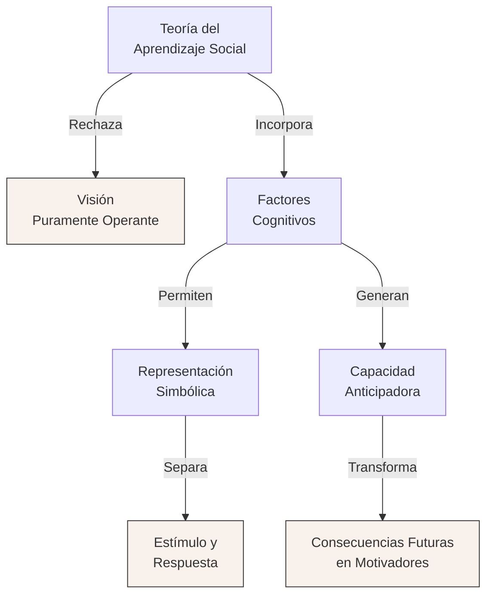
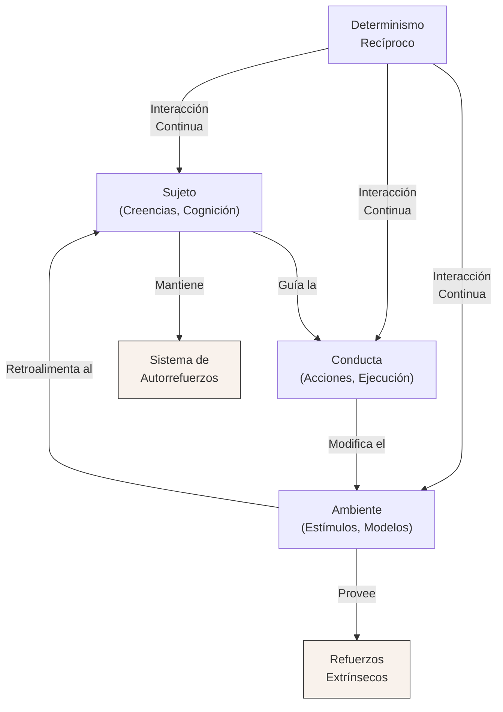
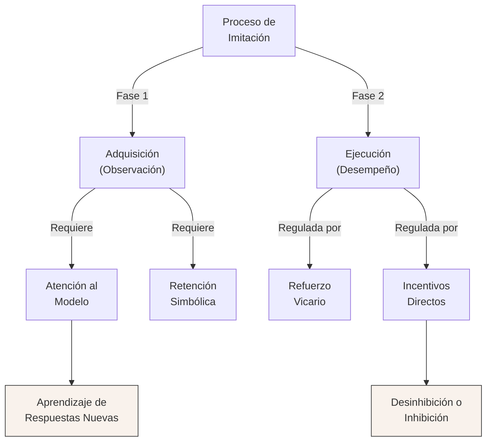
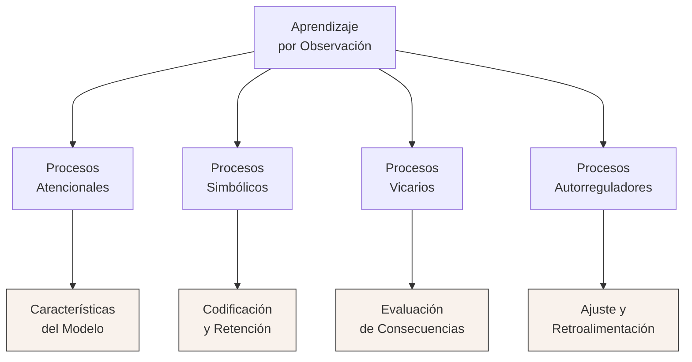
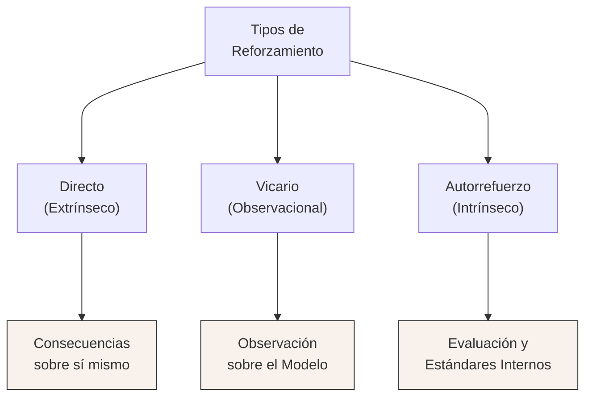
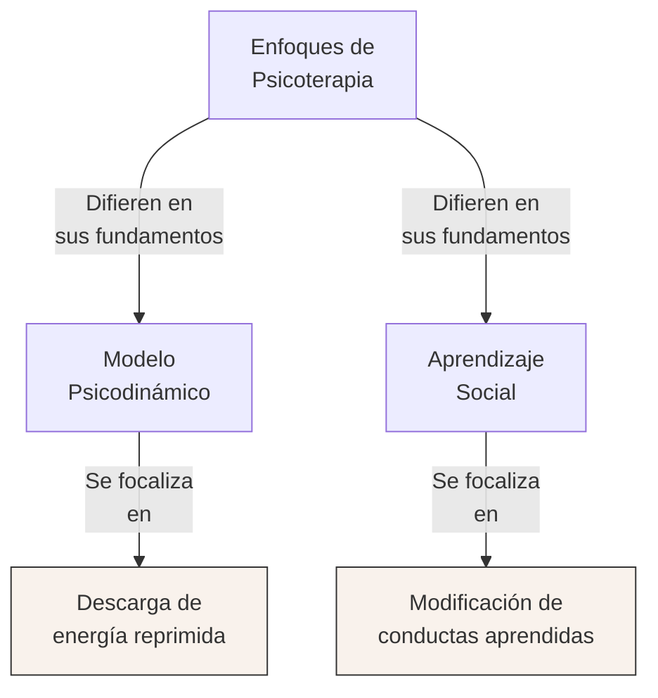
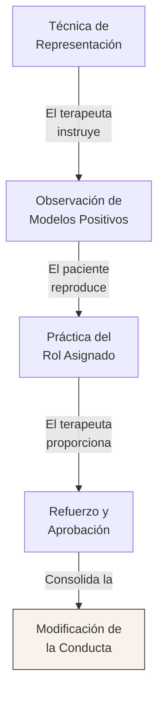
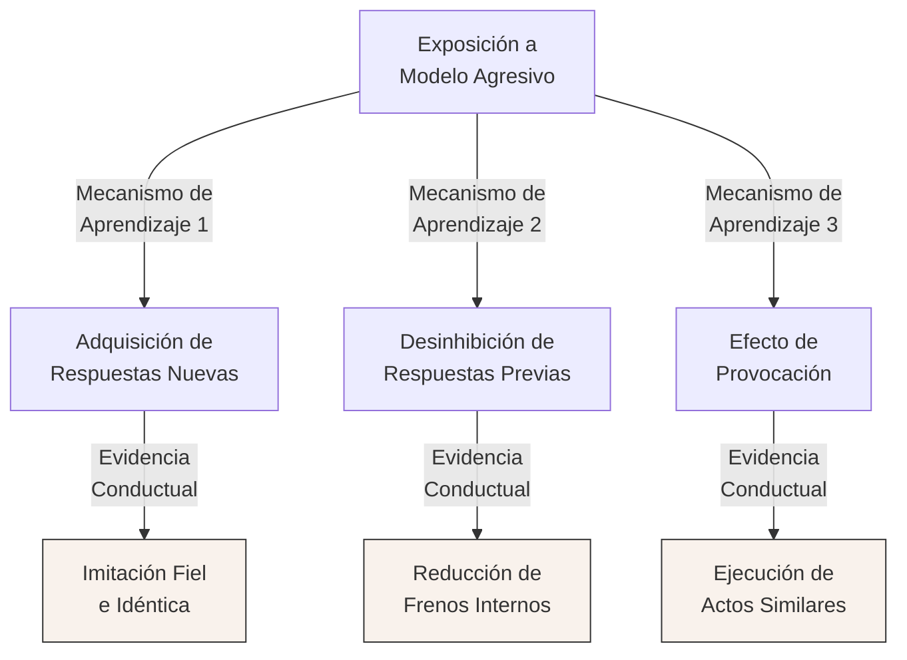
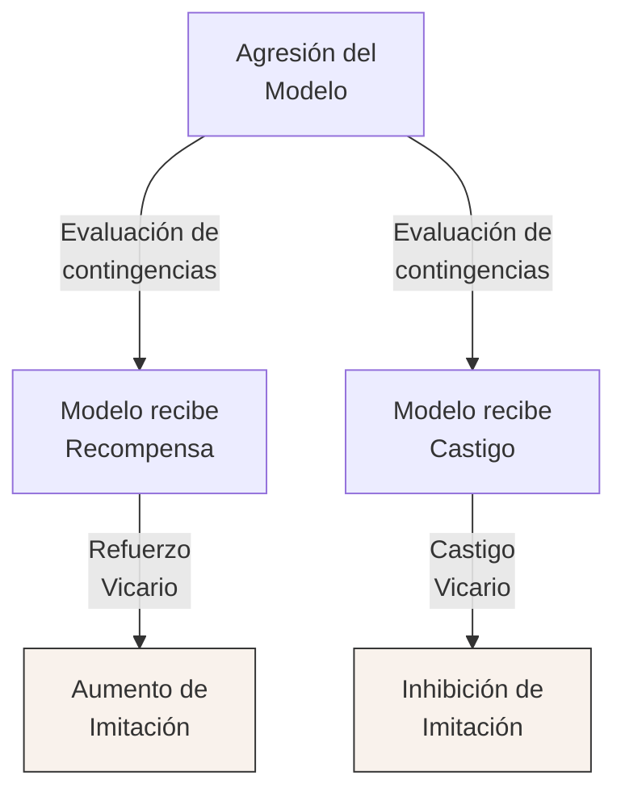

# Apunte Extendido Global: Aprendizaje Social (Unidad 3)

### 1. Tesis Central o Resumen Ejecutivo
El aprendizaje social, formulado en su máxima expresión teórica por Albert Bandura, desafía el conductismo clásico al demostrar que la mayor parte de la conducta humana se adquiere y modifica de manera vicaria (por observación e imitación de modelos), sin necesidad de que el sujeto experimente el refuerzo directamente. Este enfoque postula un "determinismo recíproco" donde el individuo, su comportamiento y el entorno se influyen mutua y continuamente. A través de este paradigma, se logra explicar desde la adquisición de conductas pro-sociales y agresivas hasta las bases de la intervención psicoterapéutica mediante el modelado.

# Teoría del Aprendizaje Social de Bandura, Determinismo Recíproco e Imitación

La **Teoría del Aprendizaje Social** propuesta por Albert Bandura surge como una respuesta crítica y superadora a los modelos conductistas previos, en particular a las concepciones de Miller y Dollard. Mientras que estos últimos entendían la imitación como un tipo especial de **condicionamiento operante** (donde el aprendizaje imitativo sólo ocurría si las respuestas del aprendiz eran directamente recompensadas al reproducir las del modelo), Bandura demuestra que esta visión es insuficiente para explicar la **adquisición de respuestas nuevas** en contextos sociales complejos. 

Para Bandura, los enfoques tradicionales fallan al no valorar adecuadamente las **variables socio-ambientales** y, fundamentalmente, al excluir los **factores cognitivos**. En su perspectiva, el ser humano no está a merced de los estímulos externos de forma pasiva; por el contrario, su **capacidad de representación simbólica** le permite interpretar los estímulos, mediatizarlos y separar la rígida conexión directa entre estímulo y respuesta. 

Esta facultad cognitiva otorga al individuo una **capacidad anticipadora**. Gran parte de la conducta humana no está sometida al control de los refuerzos externos inmediatos; gracias a las experiencias pasadas y a la representación simbólica, el sujeto puede prever las consecuencias de sus acciones. De esta forma, las **consecuencias futuras** se transforman en motivadores actuales, otorgándole a la conducta humana un carácter tanto comprensivo como previsor. El aprendizaje social es, en esencia, un proceso mediado cognitivamente antes de que cualquier respuesta motora sea ejecutada o reforzada.

### Determinismo Recíproco de la Conducta

El concepto de **determinismo recíproco** (o refuerzo recíproco) es el núcleo interactivo de la teoría de Bandura. Rompe con la noción de que el ambiente controla unilateralmente la conducta, postulando una **interacción bidireccional y constante** entre tres elementos fundamentales: el sujeto (factores personales y cognitivos), la conducta (las acciones ejecutadas) y el ambiente (las contingencias y modelos externos).

En esta matriz de interacción, no sólo existen **reforzamientos extrínsecos** (donde las consecuencias de la acción se aprecian en el exterior), sino también **reforzamientos intrínsecos**. Las personas poseen un **sistema de autorrefuerzos** que utilizan para defenderse de la variabilidad del entorno. Este autocontrol permite mantener posiciones ideológicas y pautas de conducta estables, evitando un comportamiento sumiso ante fluctuaciones ambientales moderadas.

Un factor cognitivo decisivo en este determinismo es la **atribución del éxito o fracaso**. Cuando un sujeto (por ejemplo, un alumno) atribuye el éxito a su propio esfuerzo, su satisfacción personal y su **autoestima** crecen, fomentando un mayor autocontrol para acciones futuras. Por el contrario, atribuir el éxito a factores puramente externos disminuye la motivación. Asimismo, el **feedback informativo** juega un rol central: no actúa como un refuerzo mecanicista, sino que su valor reside en cómo el individuo relaciona esa información sobre su rendimiento con sus propios criterios internos.

Las **creencias y expectativas personales** sobre las contingencias ambientales a menudo guían la conducta con mayor fuerza que los resultados reales. Las personas pueden persistir en actitudes desadaptativas si tienen la expectativa errónea de que su perseverancia eventualmente cambiará las consecuencias reales.

Un claro ejemplo de determinismo recíproco operando en la vida cotidiana es el mantenimiento de **conductas infantiles difíciles**. Si un padre desatiende sistemáticamente los requerimientos de un niño, este incrementará progresivamente la intensidad de sus demandas hasta tornarlas hostiles o aversivas. La agresión se convierte en un medio eficaz para captar la atención. Al responder finalmente para calmar al niño, el padre refuerza la conducta hostil del hijo, mientras que el cese del llanto refuerza negativamente al padre. Ambos ejercen control sobre la conducta del otro en un bucle de **dependencia mutua**, satisfaciendo necesidades a corto plazo pero cristalizando pautas desadaptativas.

### El Papel de la Imitación en el Aprendizaje Social

El **aprendizaje observacional o imitación** es el mecanismo preponderante a través del cual se adquieren las pautas de conducta social, desde roles ocupacionales y de género, hasta actitudes, gestos y prejuicios. Bandura distingue rigurosamente este proceso de fenómenos más simples en etología animal —como la facilitación social o el acrecentamiento local (descritos por Thorpe)— ya que la verdadera imitación implica la estructuración cognitiva de **nuevas pautas de respuesta** que antes no existían en el repertorio del sujeto.

Una aportación teórica fundamental es la distinción tajante entre la **adquisición** de una conducta y su **ejecución**. El sujeto puede adquirir representaciones simbólicas de conductas complejas simplemente observando al modelo (sin emitir respuesta motora y sin recibir refuerzo directo). La adquisición depende principalmente de procesos de contigüidad sensorial, atención y retención.

Sin embargo, para que el sujeto se sienta incitado a ejecutar lo que ha aprendido, entran en juego las consecuencias observadas en el modelo, lo que se denomina **refuerzo vicario**. Ver a un modelo ser recompensado facilita la conducta imitativa, mientras que observar cómo es castigado suele inhibirla.

Esta distinción quedó demostrada en los clásicos experimentos de Bandura. Los niños que observaban a un modelo agresivo ser castigado exhibían espontáneamente mucha menos imitación que aquellos que veían al modelo recompensado. No obstante, cuando en una fase posterior se les ofrecieron **incentivos positivos directos** por reproducir la conducta, las diferencias entre los grupos desaparecieron. Esto evidenció que los niños del grupo de "modelo castigado" sí habían *adquirido* el aprendizaje de forma vicaria, pero lo mantenían *inhibido* en su ejecución debido a las consecuencias anticipadas.

La historia de aprendizaje social de cada individuo modula su **susceptibilidad a la influencia social**. Por ejemplo, niños con fuertes hábitos de dependencia tienden a imitar con mayor facilidad y son más influenciables por los refuerzos sociales. Asimismo, los atributos del modelo (sexo, prestigio) y el contexto cultural delinean fuertemente qué se imita. En la cultura occidental, muchas pautas adultas censuradas temporalmente para los niños (como el consumo de sustancias o la conducta sexual) son observadas indirectamente a través de los medios de comunicación y pares mayores, generándose un aprendizaje imitativo silente que eclosiona cuando se alcanzan los roles adultos.

## Aprendizaje por observación (funciones y procesos)

El **aprendizaje por observación**, también denominado modelado, imitación o aprendizaje vicario, constituye uno de los pilares de la Teoría del Aprendizaje Social formulada por Albert Bandura. Históricamente, las teorías tradicionales del aprendizaje (como el condicionamiento instrumental de Skinner o las interpretaciones de Miller y Dollard) consideraban a la imitación como un mero caso especial de aprendizaje por ensayo y error, en el cual el sujeto debía ejecutar la respuesta y recibir un refuerzo directo para adquirirla. Sin embargo, Bandura demostró que las personas pueden adquirir patrones de conducta complejos e inéditos simplemente observando a un modelo, sin necesidad de reproducir la acción de inmediato ni de experimentar un refuerzo directo.

Esta concepción supera el reduccionismo conductista radical, al otorgarle al individuo un rol cognitivo activo. El observador no es un mero receptor pasivo de estímulos ambientales, sino un organismo capaz de procesar información, prever escenarios y generar conocimiento a partir de la experiencia ajena. 

### Funciones del Aprendizaje por Observación

El aprendizaje por observación cumple funciones fundamentales y variadas en el desarrollo psicosocial:

- **Efecto de Modelado (Adquisición de conductas nuevas):** Permite la incorporación de pautas de comportamiento, actitudes y reacciones emocionales que previamente tenían una probabilidad nula de ocurrencia en el repertorio del sujeto. Un ejemplo claro es la adquisición del lenguaje, la cual sería inviable de aprender exclusivamente mediante aproximaciones sucesivas o reforzamiento operante.
- **Efecto Inhibitorio y Desinhibitorio:** La observación de las consecuencias que experimenta el modelo (castigo o recompensa) modifica la probabilidad de que el observador ejecute conductas previamente aprendidas. Si el modelo es castigado por una transgresión, el observador tiende a inhibir dicha conducta; si es recompensado o no recibe consecuencias negativas ante un acto proscrito, el observador experimenta una desinhibición.
- **Efecto Facilitador (Provocación de respuestas):** La acción del modelo funciona como un estímulo discriminativo que incita o facilita la expresión de respuestas que ya estaban en el repertorio del sujeto, y sobre las cuales no existía ninguna inhibición previa (por ejemplo, mirar hacia arriba porque todos en la calle lo hacen).
- **Desarrollo y Cambio de Actitudes:** Tal como señalan Baron y Byrne, gran parte de nuestras actitudes sociales y políticas se construyen a través de un procesamiento sistemático o heurístico influido directamente por los mensajes y modelos sociales del entorno familiar, mediático y cultural.

### Procesos Psicosociales e Internos en el Aprendizaje Social

El proceso mediante el cual se adquiere y mantiene la conducta a través de la observación está mediado por mecanismos cognitivos superiores. Pecino y Sánchez, basándose en la obra de Bandura, distinguen los siguientes procesos centrales:

**1. Procesos Vicarios**
El ser humano está capacitado para obtener información valiosa no solo a partir de sus propios actos, sino a través de los efectos y resultados del comportamiento ajeno. El observador decodifica las consecuencias (exitosas o punitivas) que el ambiente le devuelve al modelo, convirtiendo esas experiencias en reforzamientos o castigos vicarios que guían la selección o el abandono de futuras respuestas propias.

**2. Procesos Simbólicos**
El aprendizaje humano trasciende la inmediatez del arco reflejo gracias a sus capacidades simbólicas e ideativas.
- Las conductas observadas se abstraen y codifican (fundamentalmente en el sistema verbal y, en menor medida, visual) generándose representaciones internas. 
- Estas representaciones simbólicas operan como guías cognitivas anticipatorias. El individuo puede resolver problemas mentalmente y anticipar consecuencias antes de llevar a cabo cualquier acción física.
- En este nivel son cruciales los **procesos de retención**. El sujeto recurre a la repetición mental y a la organización cognitiva para almacenar la información de forma perdurable, lo cual explica por qué una conducta puede ser imitada semanas o meses después de haber sido observada.

**3. Procesos Autorreguladores**
El individuo ejerce un control proactivo y reactivo sobre su propio comportamiento. Mediante la retroalimentación informativa interna, compara su ejecución preliminar (o su intención conductual) con la representación simbólica que construyó del modelo. A través de señales propioceptivas y juicios cognitivos, va perfeccionando y ajustando su conducta. Esta autogestión libera parcialmente al individuo de la dependencia absoluta del entorno externo, otorgándole una capacidad autoimpulsora.

Además, operan otros factores reguladores del procesamiento de la información social, como los **procesos de atención**, en los cuales la experiencia asociativa del sujeto, el nivel de excitación emocional, el prestigio del modelo, su atractivo y el valor funcional de la conducta demostrada determinan cuánta atención se le prestará y qué atributos se registrarán.

## Tipos de reforzamiento

En el marco del aprendizaje social, el concepto de reforzamiento experimenta un giro sustancial en relación con el conductismo estricto. La teoría del refuerzo tradicional sostiene que éste interviene *después* de emitida la respuesta, fortaleciéndola retroactivamente de un modo casi mecánico. En cambio, para la teoría del aprendizaje social, el refuerzo no es una condición indispensable o ciega para que ocurra el aprendizaje, sino más bien una **condición motivacional y facilitadora** que interviene, por lo general, de forma anticipatoria. El sujeto se anticipa cognitivamente a los beneficios u obstáculos de su acción, y esto organiza sus recursos atencionales y de retención. 

Existen tres modalidades principales mediante las cuales el refuerzo regula y sostiene la conducta:

### 1. Reforzamiento Directo (Extrínseco)
Corresponde a la recompensa o castigo que experimenta de forma directa e inmediata el propio sujeto tras ejecutar una conducta determinada en el entorno. Se administra según diversas contingencias ambientales (frecuentemente a través del trato directo con los agentes de socialización, como padres o pares):
- Puede dispensarse de forma **continua** (alta velocidad de adquisición) o **intermitente** (mayor resistencia a la extinción).
- Los programas de refuerzo social en la vida cotidiana suelen ser **programas combinados o mixtos** (de intervalo variable y razón variable), los cuales explican la enorme persistencia de ciertas pautas de conducta desafiantes, dependientes o de búsqueda de atención que en la primera infancia resultan difíciles de extinguir.
- Los efectos del refuerzo social dependen también de variables orgásmicas como el estado de saciación o privación emocional del sujeto y la historia de refuerzos previos (por ejemplo, el arraigo de los hábitos de dependencia).

### 2. Reforzamiento Vicario
Es la modificación sistemática del comportamiento de un observador inducida por haber presenciado las consecuencias reforzantes o aversivas que un modelo obtiene por sus acciones.
- Es el eje que explica cómo las instituciones sociales moldean el comportamiento normativo sin necesidad de condicionar a cada integrante mediante refuerzos directos.
- Este tipo de aprendizaje puede tener una raíz en la *empatía*: los estímulos correlacionados con la respuesta del modelo despiertan en el observador un nivel de activación autonómica y una anticipación de resultados (esperanza o temor) similar a la que experimenta el propio ejecutante.
- Si un comportamiento socialmente reprobado (ej. la agresión) se percibe como recompensado en un modelo prestigioso, la probabilidad de que el sujeto lo repita crece enormemente. Por el contrario, el **castigo vicario** provoca reacciones condicionadas de miedo en el observador, coartando y reprimiendo la aparición de la respuesta.

### 3. Autorrefuerzo (Reforzamiento Intrínseco)
Las personas no solo responden a los dictados del medio exterior o de la observación social; poseen además un sofisticado sistema interno de gratificación y censura.
- El autorrefuerzo se produce cuando el sujeto adecúa sus actos a las normativas morales, estándares de ejecución y valores que previamente interiorizó.
- Constituye el eslabón fundamental de los procesos de autoevaluación. El individuo valora el mérito de su conducta independientemente del veredicto ambiental momentáneo.
- Este mecanismo le provee al individuo de una notable estabilidad, operando como defensa cognitiva. Le permite mantener firmes sus posiciones ideológicas y sus pautas de acción aun ante la variabilidad del entorno externo, la presión de grupo (conformidad) o la carencia eventual de gratificaciones directas.

# Modelado como Psicoterapia

**El modelado** no sólo opera en el aprendizaje temprano o incidental en entornos naturales, sino que puede estructurarse deliberadamente como una potente técnica de **psicoterapia** y modificación de la conducta. Los exponentes teóricos del aprendizaje social (como Albert Bandura y Richard Walters) conciben a la psicoterapia fundamentalmente como un **proceso de aprendizaje** sistemático y estructurado.

En contraposición a los modelos psicodinámicos (que enfatizan la descarga y el manejo de energías instintivas o emociones reprimidas como motor del síntoma), el enfoque del aprendizaje social aborda el tratamiento clínico desde la instauración de nuevas pautas de respuestas y la corrección de aquellas conductas desviadas que han sido erróneamente reforzadas en el pasado.

El proceso de modelado terapéutico implica exponer sistemáticamente al paciente a **modelos ejemplares positivos**. A diferencia de la representación de un rol en la vida cotidiana (donde el individuo adopta conductas en ausencia de instrucciones explícitas), en el entorno terapéutico se emplean instrucciones precisas.

## La Representación de Roles y Conducta Imitativa

En la práctica clínica, se utiliza habitualmente la **representación de un rol** (role-playing) como técnica terapéutica central. Se instruye directamente al paciente para que observe y reproduzca activamente la conducta de un modelo (que puede ser real, simbólico o el mismo terapeuta) ante estímulos determinados.

Una vez que el paciente asume y practica el rol asignado, el terapeuta le proporciona sistemáticamente **ejemplos adicionales** y guías para perfeccionar la respuesta. Este método de representación y modelado resulta excepcionalmente eficaz para modificar la conducta clínica debido a varios mecanismos subyacentes:

*   **Aceptación dependiente y estructurada:** El paciente, dentro del encuadre terapéutico, acepta de forma dependiente el rol asignado, lo que disminuye las resistencias al aprendizaje.

*   **Refuerzo social continuo:** Cuando el paciente imita con éxito la respuesta del modelo, recibe inmediatamente aprobación y refuerzo positivo por parte del terapeuta, fortaleciendo el hábito.

*   **Retroalimentación intrínseca:** A medida que avanza el proceso, el paciente convierte sus propias acciones previas en modelo para su conducta posterior. Así, recibe un doble refuerzo tanto por su incipiente capacidad para actuar como modelo de sí mismo, como por su habilidad de observación e imitación.

# Experimentos de Aprendizaje de la Agresión

Los trabajos experimentales de Albert Bandura, Dorothea Ross, Sheila Ross y Richard Walters constituyeron un hito para demostrar empíricamente cómo las pautas de respuestas sociales complejas, y específicamente las **conductas agresivas**, se adquieren, provocan y modifican mediante la exposición directa a modelos sociales, prescindiendo del condicionamiento instrumental clásico paso a paso.

## El Estudio del Muñeco Bobo (1961)

Para comprobar de forma rigurosa la **imitación diferida** de modelos desviados y hostiles en ausencia de éstos, los investigadores diseñaron un dispositivo experimental de laboratorio que permitía evaluar el aprendizaje observacional espontáneo.

En el experimento seminal, se expuso a un grupo de niños de educación preescolar a **modelos adultos agresivos**, mientras que un segundo grupo de control observó a modelos exhibiendo **conductas no agresivas**, inhibidas y pasivas. Además, se dividió factorialmente a los grupos para que la mitad observara a modelos de su mismo sexo, y la otra mitad a modelos del sexo opuesto.

En la condición experimental agresiva, el modelo adulto agredía de forma deliberadamente inusitada, tanto física como verbalmente, a un gran **muñeco de plástico inflable** (el famoso muñeco Bobo), utilizando un repertorio de golpes y expresiones novedosas para los niños.

Por contraste, en la condición no agresiva, el modelo adulto permanecía sentado tranquilamente en la sala, ignorando por completo al muñeco y prestando nula atención a los instrumentos potencialmente utilizables para la agresión que estaban dispersos en la habitación.

## Tres Efectos Centrales de la Observación

El análisis de las respuestas infantiles en las sesiones de juego posteriores reveló que la mera observación de un modelo social desencadena tres efectos psicológicos y conductuales claramente diferenciados, los cuales influyen en el incremento, amplitud e intensidad de las respuestas del observador:

*   **Adquisición de respuestas nuevas:** El observador incorpora a su repertorio psicomotor y verbal conductas totalmente inéditas. Para confirmar rigurosamente este efecto de modelado, es requisito que el modelo exhiba respuestas muy novedosas (como las frases específicas hacia el muñeco Bobo) y que el niño las reproduzca de forma sustancialmente idéntica.

*   **Efectos inhibitorios y desinhibitorios:** La observación de modelos también opera sobre conductas preexistentes, fortaleciendo o debilitando respuestas inhibitorias previas. Un niño que ya sabe golpear, puede **desinhibir** esa conducta subyacente al constatar empíricamente que el modelo agresivo actúa sin recibir consecuencias punitivas.

*   **Efecto de provocación o elicitación ("disparador"):** En diversas ocasiones, la simple exposición a la conducta ajena instiga al observador a ejecutar respuestas de emulación previamente aprendidas, pertenecientes a la misma clase conductual, actuando los actos del modelo como estímulos desencadenantes directos para reacciones similares.

## Influencia de las Variables de Sexo

Los resultados de los experimentos de agresión también evidenciaron la importancia decisiva del **sexo del modelo y del observador**, demostrando la asimilación temprana de roles de género en el aprendizaje social.

Los sujetos masculinos mostraron significativamente **más agresión física imitativa** e inusitada, así como mayor agresividad no imitativa y juego con armas, en comparación con las niñas. Sin embargo, resulta revelador que no se encontraron diferencias significativas entre ambos sexos en cuanto a la imitación de la **agresión verbal**.

Adicionalmente, se comprobó empíricamente que el modelo masculino poseía una influencia formativa mucho más poderosa sobre los sujetos varones que el modelo femenino. Los niños que fueron expuestos a un modelo adulto masculino agresivo manifestaron las cotas más altas de agresión en todas las mediciones.

Estos hallazgos sugieren que el poder relativo de un modelo para suscitar respuestas imitativas está íntimamente ligado al **grado de adecuación al sexo** de la conducta específica. Dado que culturalmente la agresión física se tolera y asocia más al rol masculino, ésta se desinhibe y modela con mucha mayor facilidad cuando es ejecutada por modelos masculinos frente a observadores del mismo género.

## Consecuencias de la Conducta (Refuerzo Vicario)

Variaciones metodológicas posteriores de estos estudios (Bandura, 1962; Bandura, Ross y Ross, 1963) exploraron una variable crítica: las contingencias que enfrentaba el modelo, demostrando el mecanismo subyacente del **refuerzo vicario**.

Si la conducta del modelo agresivo **produce recompensas** manifiestas (como elogios, poder o recursos materiales), el niño mostrará una marcada tendencia a identificarse con el agresor e imitar su accionar, incluso cuando los atributos personales del modelo le resulten desagradables al observador.

Inversamente, si la conducta agresiva observada resulta en un **castigo real** o fracasa en otorgar control o beneficios al modelo, la tasa de imitación de la agresión disminuye de forma drástica. Esto corrobora que el observador adquiere el patrón conductual de forma simbólica, pero su ejecución manifiesta estará siempre regulada por las consecuencias ambientales que prevé a partir de lo que le sucedió al modelo.



### 3. Glosario de Conceptos Clave
| Concepto | Definición Clave |
|----------|-----------------------------|
| Determinismo Recíproco | Modelo de interdependencia en el que la conducta, las variables cognitivas y personales, y los factores ambientales operan como determinantes interconectados. |
| Aprendizaje Vicario | Proceso por el cual los sujetos adquieren o modifican conductas al observar a un modelo y las consecuencias de sus acciones (refuerzo o castigo vicario). |
| Modelado | Técnica y proceso natural donde una persona (modelo) exhibe conductas que son captadas por un observador para su reproducción o para extraer reglas generativas. |
| Refuerzo Vicario | Aumento de la probabilidad de una conducta en el observador luego de ver que un modelo fue recompensado por esa misma acción. |
| Condicionamiento Operante | Paradigma tradicional donde la conducta es modificada exclusivamente por las consecuencias directas (premios o castigos) que recibe el sujeto. |

### 4. Preguntas de Autoevaluación
1. ¿Cuál es la principal diferencia entre la teoría de Miller y Dollard y el Aprendizaje Social de Bandura respecto a la adquisición de respuestas nuevas?
2. Explica con tus palabras el concepto de 'Determinismo Recíproco' y da un ejemplo de la vida real.
3. Menciona y describe brevemente los cuatro procesos (atención, retención, etc.) involucrados en el aprendizaje por observación.
4. ¿Por qué el modelado es considerado una herramienta eficaz en la psicoterapia para fobias o ansiedades sociales?
5. ¿Qué conclusiones fundamentales se desprenden del experimento del muñeco Bobo respecto a la agresión y el refuerzo vicario?
